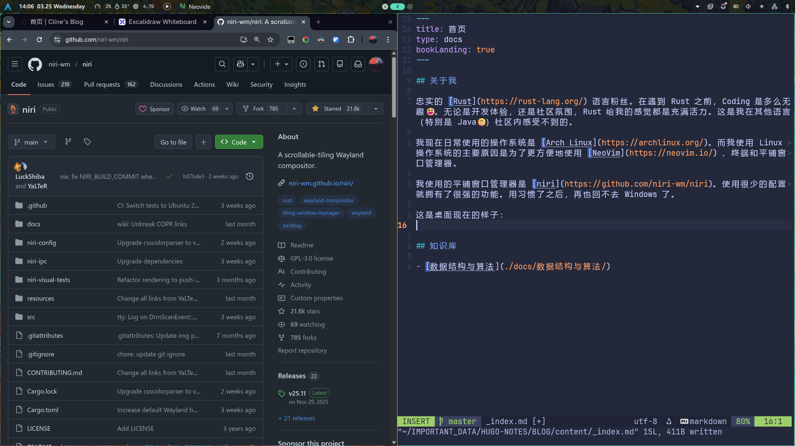

## 关于我

忠实的 [Rust](https://rust-lang.org/) 语言粉丝。在遇到 Rust 之前，Coding 是多么无趣😃。无论是开发体验，还是社区氛围，Rust 给我的感觉都是充满活力。这是我在其他语言（特别是 Java🙃）社区内感受不到的。

我现在日常使用的操作系统是 [Arch Linux](https://archlinux.org/)。而我使用 Linux 操作系统的主要原因是为了更方便地使用 [NeoVim](https://neovim.io/) 、终端和平铺窗口管理器。

我使用的平铺窗口管理器是 [niri](https://github.com/niri-wm/niri)。使用很少的配置就拥有了很强的功能。用习惯了之后，再也回不去 Windows 了。

这是桌面现在的样子：

顶部的状态栏使用的是 [Noctalia Shell](https://github.com/noctalia-dev/noctalia-shell)。这省了我很多的时间去写状态栏、管理通知、应用起动器、锁屏等等。

使用 Linux 的一大障碍是国产软件，虽然不如 Windows，但是勉强可用，将就着用吧。相比于好处来说，这一缺点可以忍受。但好在开源软件大多都支持 Linux 平台。

我想在我 Blog 里展示我的笔记，或许能帮助到和我同样学习某些技术的伙伴。

同时，我也想在 Blog 里展示我的思考，无论是关于生活、书籍、电影、技术、政治等等。这些都会以知识库的形式来展示。

## 知识库

- [数据结构与算法](./docs/数据结构与算法/)
- [思维导图](./docs/思维导图/)

## 联系我
邮箱：cline0@163.com
