```markmap
---
markmap:
  initialExpandLevel: 2
  spacingVertical: 30
  spacingHorizontal: 180
---

# DRM（Direct Redering Manager）
- 简介
  - linux 主流的图形显示框架
  - 可以同一管理 GPU 和 Display 驱动，方便管理和维护
  - 从模块上划分，可以划分为 3 个部分
    - libdrm
      - 对底层接口进行封装，向上层提供通用的 API 接口
      - 主要是对各种 ioctl 接口进行封装
    - KMS（Kernel Mode Setting）
      - 功能
        - 更新画面
          - 显示 buffer 的切换
          - 多图层的合成方式
          - 每个图层的显示位置
        - 设置显示参数
          - 分辨率
          - 刷新率
          - 电源状态（休眠唤醒）
          - 等
      - 基本元素
        - CRTC（Cathode Ray Tube Controller）
          - 阴极射线显像管控制器
            - 电子枪打出的电子撞击到屏幕上的荧光物质使其发光。只要控制电子枪从左到右扫完一行(也就是扫描一行)，然后 从上到下扫描完所有行，这样一帧图像就显示出来了。也就是说，显示一帧图像电子枪是按照 ‘Z’形在运动，当扫描速度很快的时候看起来就是一幅完成的画面了
          - 对显示 buffer 进行扫描，并产生时序信号的硬件模块
            - 水平同步信号（Horizontal Sync, HSync）
              - 每一行像素数据传输完毕后，HSync 信号会触发一次，告知显示器回到该行的起始位置，准备绘制下一行
              - HSync 信号确保图像在每行的显示开始和结束的时间点正确
            - 垂直同步信号（Vertical Sync, VSync）
              - VSync 信号在每一帧图像绘制完成后触发一次，告诉显示器开始绘制下一帧图像
              - VSync 信号决定帧刷新率（帧率），即每秒钟显示器更新屏幕的次数
            - 前沿间隔（Front Porch）
              - 水平或垂直同步信号之前的一段间隔，提供一些缓冲时间，确保扫描光束（在 CRT 中）有足够时间返回屏幕的起始位置
            - 后沿间隔（Back Porch）
              - 水平或垂直同步信号之后的一段间隔，确保显示设备有时间准备下一行或下一帧的显示
          - 在现代 Linux 系统中，CRTC 不仅用于 CRT 显示器的控制，它也被用来驱动各种类型的显示设备，包括 LCD 和 OLED 屏幕
        - ENCODER
          - 负责将 CRTC 输出的 timing 时序转换成外部设备所需要的信号的模块，如 HDMI 转换器或DSI Controller
        - CONNECTOR
          - 连接物理显示设备的连接器，如HDMI、DisplayPort、DSI总线，通常和Encoder驱动绑定在一起
        - PLANE
          - 硬件图层，有的Display硬件支持多层合成显示，但所有的Display Controller至少要有1个plane
        - FB
          - Framebuffer，单个图层的显示内容，唯一一个和硬件无关的基本元素
        - VBLANK
          - 软件和硬件的同步机制，RGB时序中的垂直消影区，软件通常使用硬件VSYNC来实现
        - property
          - 任何你想设置的参数，都可以做成property，是DRM驱动中最灵活、最方便的Mode setting机制
    - GEM（Graphic Execution Manager）
      - 功能
        - 主要负责显示 buffer 的分配和释放
        - GPU 唯一用到 DRM 的地方
      - 基本元素
        - DUMB
          - 只支持连续物理内存，基于kernel中通用CMA API实现，多用于小分辨率简单场景
        - PRIME
          - 连续、非连续物理内存都支持，基于DMA-BUF机制，可以实现buffer共享，多用于大内存复杂场景
        - fence
          - buffer同步机制，基于内核dma_fence机制实现，用于防止显示内容出现异步问题
    - 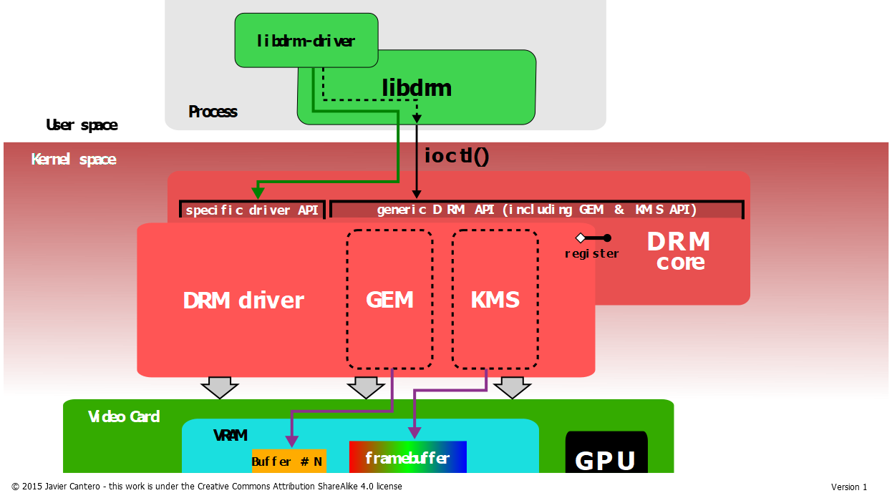
- 使用 DRM 驱动
  - 编译参数：gcc &lt;source-code&gt; -I/usr/include/libdrm -ldrm
  - single/double buffer
    - 伪代码 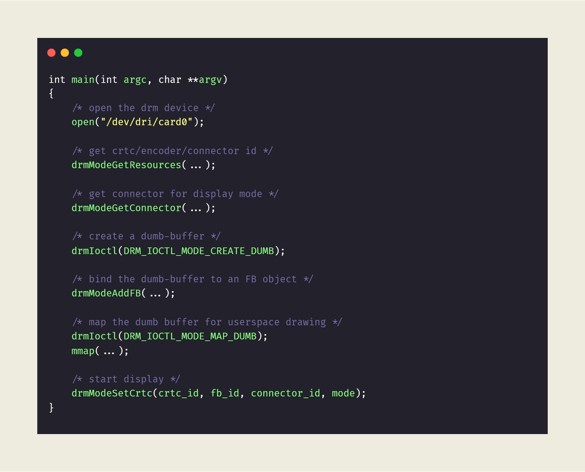
    - 实际代码 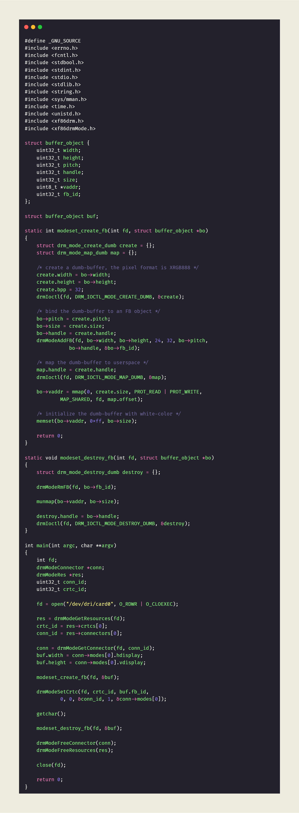
      > #define _GNU_SOURCE
      > #include <errno.h>
      > #include <fcntl.h>
      > #include <stdbool.h>
      > #include <stdint.h>
      > #include <stdio.h>
      > #include <stdlib.h>
      > #include <string.h>
      > #include <sys/mman.h>
      > #include <time.h>
      > #include <unistd.h>
      > #include <xf86drm.h>
      > #include <xf86drmMode.h>
      > struct buffer_object {
      > 	uint32_t width;
      > 	uint32_t height;
      > 	uint32_t pitch;
      > 	uint32_t handle;
      > 	uint32_t size;
      > 	uint8_t *vaddr;
      > 	uint32_t fb_id;
      > };
      > struct buffer_object buf;
      > static int modeset_create_fb(int fd, struct buffer_object *bo)
      > {
      > 	struct drm_mode_create_dumb create = {};
      >  	struct drm_mode_map_dumb map = {};
      > 	/* create a dumb-buffer, the pixel format is XRGB888 */
      > 	create.width = bo->width;
      > 	create.height = bo->height;
      > 	create.bpp = 32;
      > 	drmIoctl(fd, DRM_IOCTL_MODE_CREATE_DUMB, &create);
      > 	/* bind the dumb-buffer to an FB object */
      > 	bo->pitch = create.pitch;
      > 	bo->size = create.size;
      > 	bo->handle = create.handle;
      > 	drmModeAddFB(fd, bo->width, bo->height, 24, 32, bo->pitch,
      > 			   bo->handle, &bo->fb_id);
      > 	/* map the dumb-buffer to userspace */
      > 	map.handle = create.handle;
      > 	drmIoctl(fd, DRM_IOCTL_MODE_MAP_DUMB, &map);
      > 	bo->vaddr = mmap(0, create.size, PROT_READ | PROT_WRITE,
      > 			MAP_SHARED, fd, map.offset);
      > 	/* initialize the dumb-buffer with white-color */
      > 	memset(bo->vaddr, 0xff, bo->size);
      > 	return 0;
      > }
      > static void modeset_destroy_fb(int fd, struct buffer_object *bo)
      > {
      > 	struct drm_mode_destroy_dumb destroy = {};
      > 	drmModeRmFB(fd, bo->fb_id);
      > 	munmap(bo->vaddr, bo->size);
      > 	destroy.handle = bo->handle;
      > 	drmIoctl(fd, DRM_IOCTL_MODE_DESTROY_DUMB, &destroy);
      > }
      > int main(int argc, char **argv)
      > {
      > 	int fd;
      > 	drmModeConnector *conn;
      > 	drmModeRes *res;
      > 	uint32_t conn_id;
      > 	uint32_t crtc_id;
      > 	fd = open("/dev/dri/card0", O_RDWR | O_CLOEXEC);
      > 	res = drmModeGetResources(fd);
      > 	crtc_id = res->crtcs[0];
      > 	conn_id = res->connectors[0];
      > 	conn = drmModeGetConnector(fd, conn_id);
      > 	buf.width = conn->modes[0].hdisplay;
      > 	buf.height = conn->modes[0].vdisplay;
      > 	modeset_create_fb(fd, &buf);
      > 	drmModeSetCrtc(fd, crtc_id, buf.fb_id,
      > 			0, 0, &conn_id, 1, &conn->modes[0]);
      > 	getchar();
      > 	modeset_destroy_fb(fd, &buf);
      > 	drmModeFreeConnector(conn);
      > 	drmModeFreeResources(res);
      > 	close(fd);
      > 	return 0;
      > }
    - 其中 drmModeSetCrtc 是一个关键的函数,需要 crtc_id、connector_id、fb_id、drm_mode 这几个参数
      - 为了获取 crtc_id 和 connector_id，需要调用 drmModeGetResources()
      - 为了获取 fb_id，需要调用 drmModeAddFB()
      - 为了获取 drm_mode，需要调用 drmModeGetConnector
    - 单个 buffer 的缺点是如果修改画面内容，只能对 mmap 后的 buffer 进行修改，这会导致用户能明显地在屏幕上看到软件修改 buffer 的过程
      - 可以使用多个 buffer 来解决这个问题，即在修改一个 buffer 的时候显示另一个 buffer 的内容，修改完成之后再换为另一个 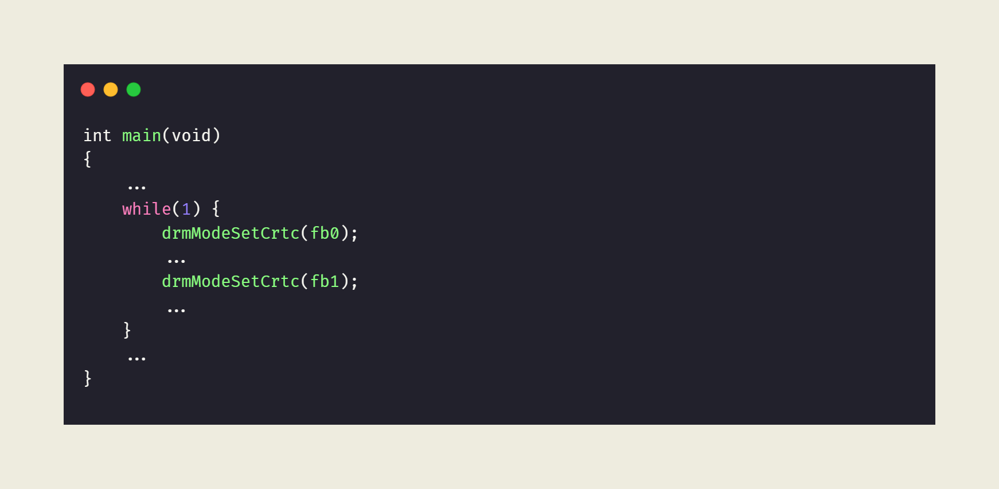
  - page-flip
    - drmModePageFlip 和 drmModeSetCrtc 一样，用于更新显示内容
      - drmModePageFlip 只会等到 VSYNC 事件到来之后才会真正更新 framebuffer。而 drmModeSetCrtc 会立即执行 framebuffer 切换
      - [drmModeSetCrtc 对于某些硬件可能会造成撕裂（tear effect） 问题，而 drmModePageFlip 不会造成这种问题](https://blog.csdn.net/hexiaolong2009/article/details/79319512)
    - 伪代码 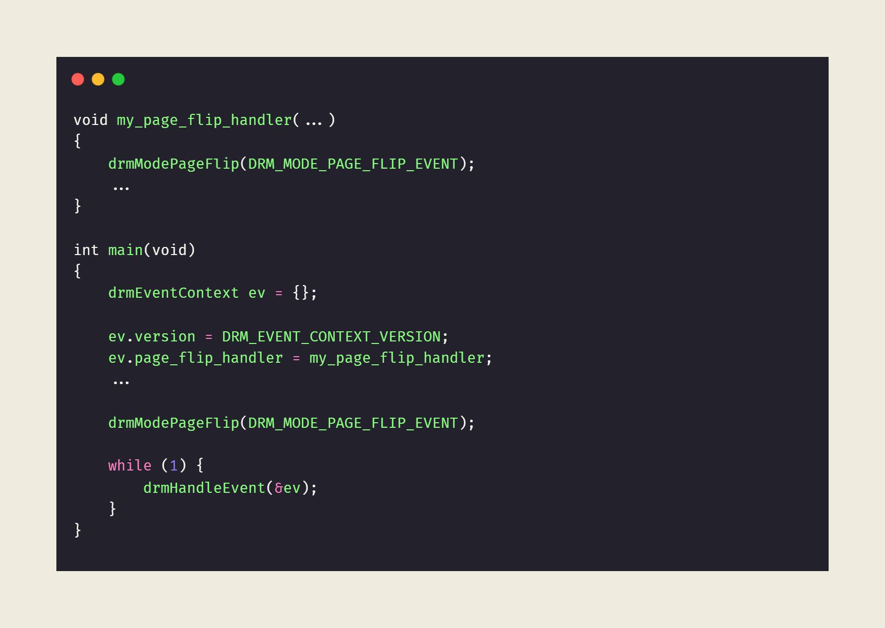
      - drmHandleEvent()函数，该函数内部以阻塞的形式等待底层驱动返回相应的vblank事件，以确保和VSYNC同步。需要注意的是，drmModePageFlip()不允许在1个VSYNC周期内被调用多次，否则只有第一次调用有效，后面几次调用都会返回-EBUSY错误（-16
    - 实际代码 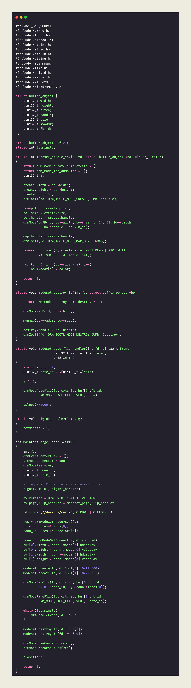
      > #define _GNU_SOURCE
      > #include <errno.h>
      > #include <fcntl.h>
      > #include <stdbool.h>
      > #include <stdint.h>
      > #include <stdio.h>
      > #include <stdlib.h>
      > #include <string.h>
      > #include <sys/mman.h>
      > #include <time.h>
      > #include <unistd.h>
      > #include <signal.h>
      > #include <xf86drm.h>
      > #include <xf86drmMode.h>
      > struct buffer_object {
      > 	uint32_t width;
      > 	uint32_t height;
      > 	uint32_t pitch;
      > 	uint32_t handle;
      > 	uint32_t size;
      > 	uint32_t *vaddr;
      > 	uint32_t fb_id;
      > };
      > struct buffer_object buf[2];
      > static int terminate;
      > static int modeset_create_fb(int fd, struct buffer_object *bo, uint32_t color)
      > {
      > 	struct drm_mode_create_dumb create = {};
      >  	struct drm_mode_map_dumb map = {};
      > 	uint32_t i;
      > 	create.width = bo->width;
      > 	create.height = bo->height;
      > 	create.bpp = 32;
      > 	drmIoctl(fd, DRM_IOCTL_MODE_CREATE_DUMB, &create);
      > 	bo->pitch = create.pitch;
      > 	bo->size = create.size;
      > 	bo->handle = create.handle;
      > 	drmModeAddFB(fd, bo->width, bo->height, 24, 32, bo->pitch,
      > 			   bo->handle, &bo->fb_id);
      > 	map.handle = create.handle;
      > 	drmIoctl(fd, DRM_IOCTL_MODE_MAP_DUMB, &map);
      > 	bo->vaddr = mmap(0, create.size, PROT_READ | PROT_WRITE,
      > 			MAP_SHARED, fd, map.offset);
      > 	for (i = 0; i < (bo->size / 4); i++)
      > 		bo->vaddr[i] = color;
      > 	return 0;
      > }
      > static void modeset_destroy_fb(int fd, struct buffer_object *bo)
      > {
      > 	struct drm_mode_destroy_dumb destroy = {};
      > 	drmModeRmFB(fd, bo->fb_id);
      > 	munmap(bo->vaddr, bo->size);
      > 	destroy.handle = bo->handle;
      > 	drmIoctl(fd, DRM_IOCTL_MODE_DESTROY_DUMB, &destroy);
      > }
      > static void modeset_page_flip_handler(int fd, uint32_t frame,
      > 				    uint32_t sec, uint32_t usec,
      > 				    void *data)
      > {
      > 	static int i = 0;
      > 	uint32_t crtc_id = *(uint32_t *)data;
      > 	i ^= 1;
      > 	drmModePageFlip(fd, crtc_id, buf[i].fb_id,
      > 			DRM_MODE_PAGE_FLIP_EVENT, data);
      > 	usleep(500000);
      > }
      > static void sigint_handler(int arg)
      > {
      > 	terminate = 1;
      > }
      > int main(int argc, char **argv)
      > {
      > 	int fd;
      > 	drmEventContext ev = {};
      > 	drmModeConnector *conn;
      > 	drmModeRes *res;
      > 	uint32_t conn_id;
      > 	uint32_t crtc_id;
      > 	/* register CTRL+C terminate interrupt */
      > 	signal(SIGINT, sigint_handler);
      > 	ev.version = DRM_EVENT_CONTEXT_VERSION;
      > 	ev.page_flip_handler = modeset_page_flip_handler;
      > 	fd = open("/dev/dri/card0", O_RDWR | O_CLOEXEC);
      > 	res = drmModeGetResources(fd);
      > 	crtc_id = res->crtcs[0];
      > 	conn_id = res->connectors[0];
      > 	conn = drmModeGetConnector(fd, conn_id);
      > 	buf[0].width = conn->modes[0].hdisplay;
      > 	buf[0].height = conn->modes[0].vdisplay;
      > 	buf[1].width = conn->modes[0].hdisplay;
      > 	buf[1].height = conn->modes[0].vdisplay;
      > 	modeset_create_fb(fd, &buf[0], 0xff0000);
      > 	modeset_create_fb(fd, &buf[1], 0x0000ff);
      > 	drmModeSetCrtc(fd, crtc_id, buf[0].fb_id,
      > 			0, 0, &conn_id, 1, &conn->modes[0]);
      > 	drmModePageFlip(fd, crtc_id, buf[0].fb_id,
      > 			DRM_MODE_PAGE_FLIP_EVENT, &crtc_id);
      > 	while (!terminate) {
      > 		drmHandleEvent(fd, &ev);
      > 	}
      > 	modeset_destroy_fb(fd, &buf[1]);
      > 	modeset_destroy_fb(fd, &buf[0]);
      > 	drmModeFreeConnector(conn);
      > 	drmModeFreeResources(res);
      > 	close(fd);
      > 	return 0;
      > }
  - plane
    - Plane 是连接 FB 和 CRTC 的纽带，是内存的搬运工
    - 伪代码 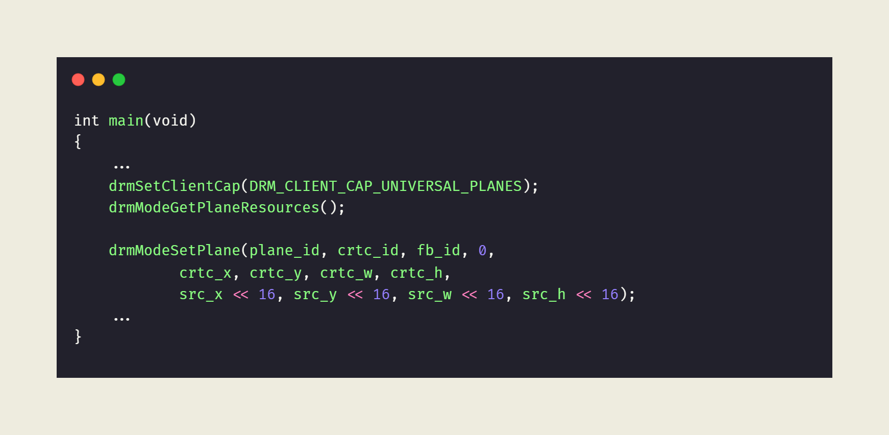
      - 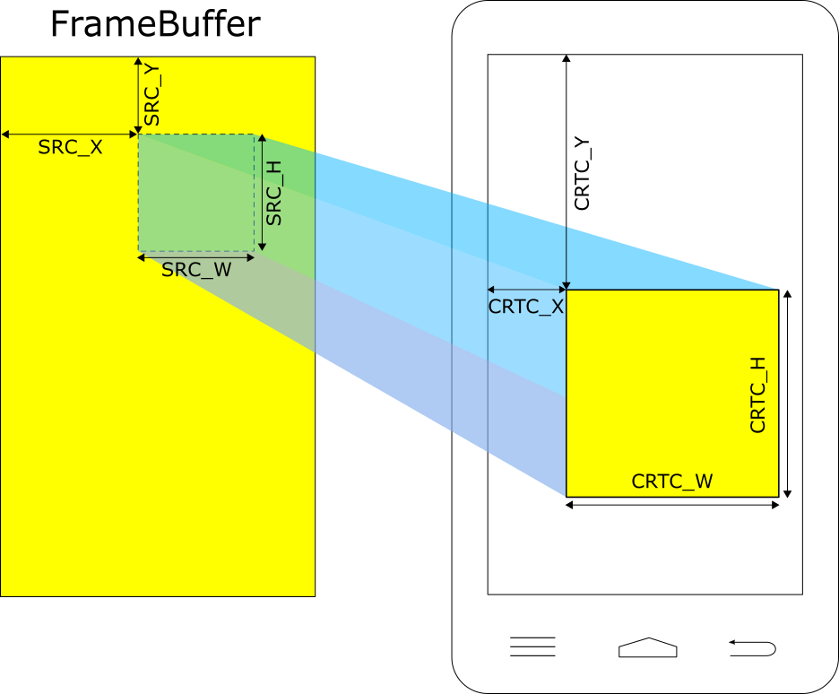
      - 当 SRC 与 CRTC 的 X/Y 不相等时，则实现了平移的效果；
      - 当 SRC 与 CRTC 的 W/H 不相等时，则实现了缩放的效果；
      - 当 SRC 与 FrameBuffer 的 W/H 不相等时，则实现了裁剪的效果；
      - 设置 DRM_CLIENT_CAP_UNIVERSAL_PLANES 的目的
        - 如果不设置，drmModeGetPlaneResources()就只会返回 Overlay Plane，其他Plane都不会返回。而如果设置了，DRM驱动则会返回所有支持的Plane资源，包括cursor、overlay和primary
      - drmModeSetPlane 函数调用之前，必须先通过drmModeSetCrtc()初始化整个显示链路，否则Plane设置将无效
    - 实际代码 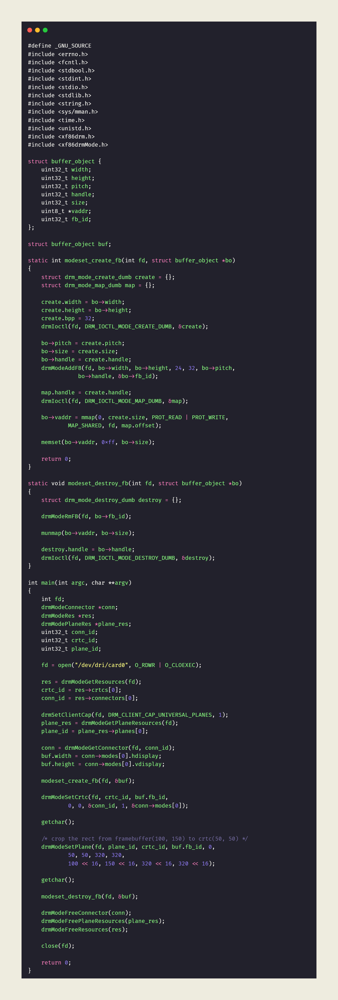
      > #define _GNU_SOURCE
      > #include <errno.h>
      > #include <fcntl.h>
      > #include <stdbool.h>
      > #include <stdint.h>
      > #include <stdio.h>
      > #include <stdlib.h>
      > #include <string.h>
      > #include <sys/mman.h>
      > #include <time.h>
      > #include <unistd.h>
      > #include <xf86drm.h>
      > #include <xf86drmMode.h>
      > struct buffer_object {
      > 	uint32_t width;
      > 	uint32_t height;
      > 	uint32_t pitch;
      > 	uint32_t handle;
      > 	uint32_t size;
      > 	uint8_t *vaddr;
      > 	uint32_t fb_id;
      > };
      > struct buffer_object buf;
      > static int modeset_create_fb(int fd, struct buffer_object *bo)
      > {
      > 	struct drm_mode_create_dumb create = {};
      >  	struct drm_mode_map_dumb map = {};
      > 	create.width = bo->width;
      > 	create.height = bo->height;
      > 	create.bpp = 32;
      > 	drmIoctl(fd, DRM_IOCTL_MODE_CREATE_DUMB, &create);
      > 	bo->pitch = create.pitch;
      > 	bo->size = create.size;
      > 	bo->handle = create.handle;
      > 	drmModeAddFB(fd, bo->width, bo->height, 24, 32, bo->pitch,
      > 			   bo->handle, &bo->fb_id);
      > 	map.handle = create.handle;
      > 	drmIoctl(fd, DRM_IOCTL_MODE_MAP_DUMB, &map);
      > 	bo->vaddr = mmap(0, create.size, PROT_READ | PROT_WRITE,
      > 			MAP_SHARED, fd, map.offset);
      > 	memset(bo->vaddr, 0xff, bo->size);
      > 	return 0;
      > }
      > static void modeset_destroy_fb(int fd, struct buffer_object *bo)
      > {
      > 	struct drm_mode_destroy_dumb destroy = {};
      > 	drmModeRmFB(fd, bo->fb_id);
      > 	munmap(bo->vaddr, bo->size);
      > 	destroy.handle = bo->handle;
      > 	drmIoctl(fd, DRM_IOCTL_MODE_DESTROY_DUMB, &destroy);
      > }
      > int main(int argc, char **argv)
      > {
      > 	int fd;
      > 	drmModeConnector *conn;
      > 	drmModeRes *res;
      > 	drmModePlaneRes *plane_res;
      > 	uint32_t conn_id;
      > 	uint32_t crtc_id;
      > 	uint32_t plane_id;
      > 	fd = open("/dev/dri/card0", O_RDWR | O_CLOEXEC);
      > 	res = drmModeGetResources(fd);
      > 	crtc_id = res->crtcs[0];
      > 	conn_id = res->connectors[0];
      > 	drmSetClientCap(fd, DRM_CLIENT_CAP_UNIVERSAL_PLANES, 1);
      > 	plane_res = drmModeGetPlaneResources(fd);
      > 	plane_id = plane_res->planes[0];
      > 	conn = drmModeGetConnector(fd, conn_id);
      > 	buf.width = conn->modes[0].hdisplay;
      > 	buf.height = conn->modes[0].vdisplay;
      > 	modeset_create_fb(fd, &buf);
      > 	drmModeSetCrtc(fd, crtc_id, buf.fb_id,
      > 			0, 0, &conn_id, 1, &conn->modes[0]);
      > 	getchar();
      > 	/* crop the rect from framebuffer(100, 150) to crtc(50, 50) */
      > 	drmModeSetPlane(fd, plane_id, crtc_id, buf.fb_id, 0,
      > 			50, 50, 320, 320,
      > 			100 << 16, 150 << 16, 320 << 16, 320 << 16);
      > 	getchar();
      > 	modeset_destroy_fb(fd, &buf);
      > 	drmModeFreeConnector(conn);
      > 	drmModeFreePlaneResources(plane_res);
      > 	drmModeFreeResources(res);
      > 	close(fd);
      > 	return 0;
      > }
    - 一个高级的 plane 所具有的功能 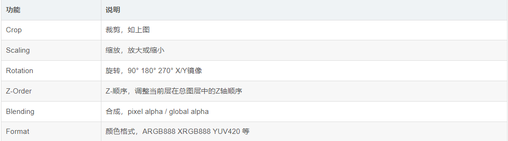
      - 这些功能都由硬件直接完成，而非软件实现
    - 在 drm 框架中，plane 分为 3 中类型
      - cursor
        - 光标图层，一般用于PC系统，用于显示鼠标
      - overlay
        - 叠加图层，通常用于YUV格式的视频图层
      - primary
        - 主要图层，通常用于仅支持RGB格式的简单图层
  - [Property](https://www.kernel.org/doc/html/latest/gpu/drm-kms.html#kms-properties)
    - 由 3 部分组成
      - name
      - id
        - property 在 DRM 框架中全局唯一的标识符
      - value
    - 作用
      - 减少上层应用接口的维护工作量
        - 当开发者有新的功能需要添加时，无需增加新的函数名和IOCTL，只需在底层驱动中新增一个property，然后在自己的应用程序中获取/操作该property的值即可
      - 增强了参数设置的灵活性
        - 一次IOCTL可以同时设置多个property，减少了user space与kernel space切换的次数，同时最大限度的满足了不同硬件对于参数设置的要求，提高了软件效率
    - property type
      - enum
      - bitmask
      - range
      - signed range
      - object
        - 值用 drm_mode_object ID来表示
        - 目前的DRM架构中仅用到 2 个Object Property，它们分别是 "FB_ID" 和 "CRTC_ID" ，它们的 property 值分别表示framebuffer object ID 和 crtc object ID
      - blob
        - 值用 blob object ID 来表示
        - blob 即用来存放自定义的结构体的区域
        - "MODE_ID" ，它的值为blob object ID，drm驱动可以根据该ID找到对应的drm_property_blob结构体，该结构体中存放着modeinfo的相关信息
      - IMMUTABLE TYPE
        - 表示该property为只读，应用程序无法修改它的值，如"IN_FORMATS"
      - ATOMIC TYPE
        - 表示该property只有在drm应用程序（drm client）支持ATOMIC操作时才可见
    - standard properties
      - 在任何平台上都会被创建
      - CRTC 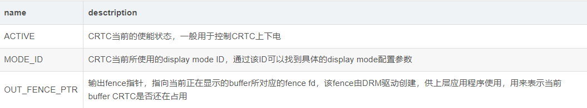
        - 可选的 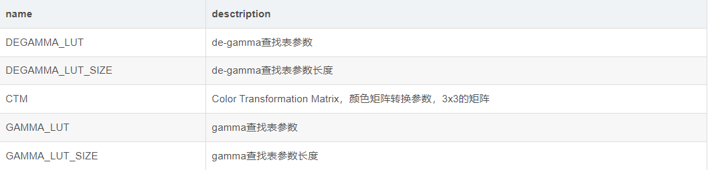
      - PLANE 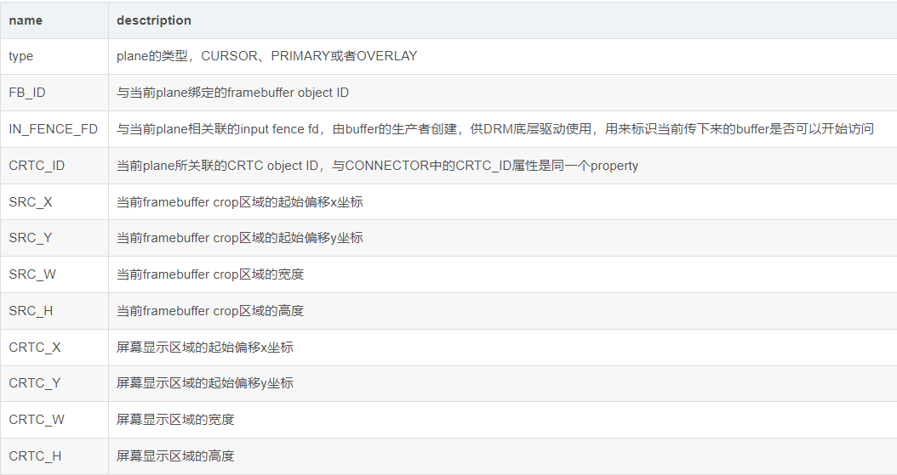
        - 可选的 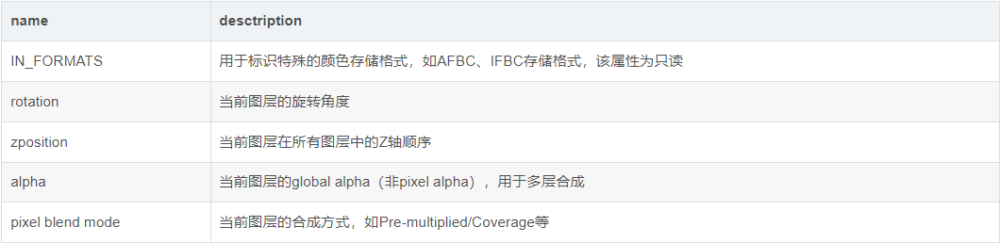
      - CONNECTOR 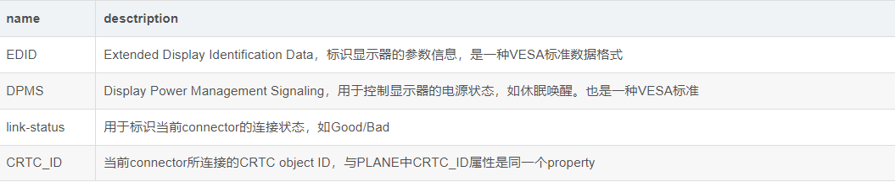
        - 可选的 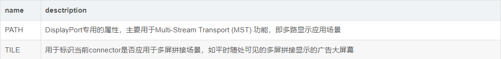
    - [操作 property](https://blog.ffwll.ch/2015/08/atomic-modesetting-design-overview.html)
      - 通过 name 来获取 property，通过 id 来操作 property，通过 value 来修改 property 的值
        - 代码描述 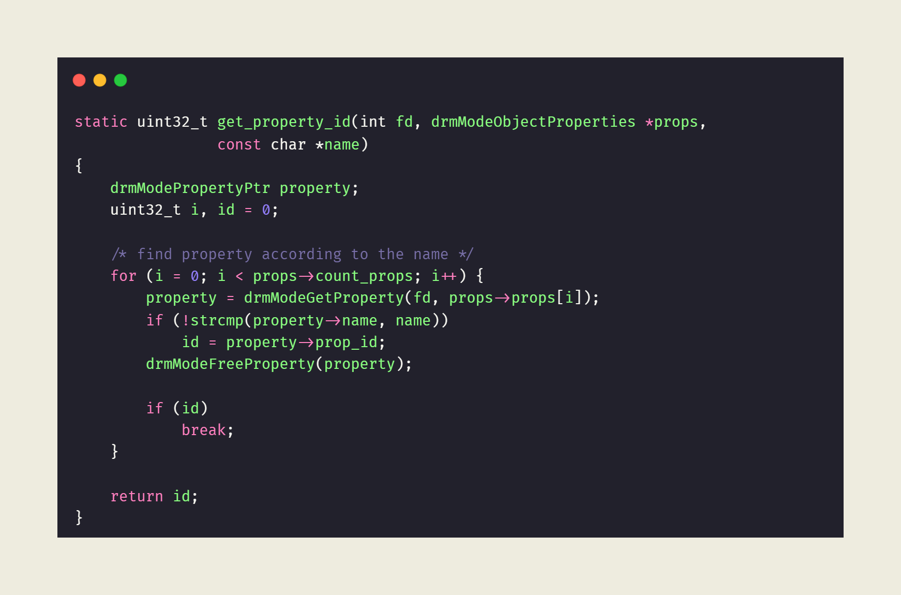
      - 在libdrm中，所有的操作都是以Object ID来进行访问的，因此要操作property，首先需要获取该property的Object ID
      - CRTC
        - 伪代码 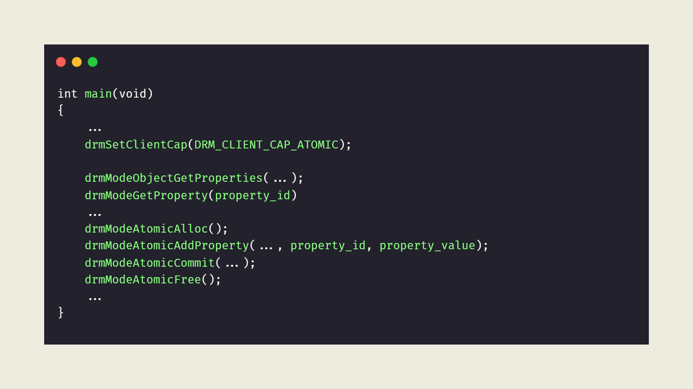
          - 凡是被 DRM_MODE_PROP_ATOMIC 修饰过的 property，只有在 drm 应用程序支持 Atomic操作时才可见，否则该 property 对应用程序不可见。因此通过设置 DRM_CLIENT_CAP_ATOMIC 这个flag，来告知DRM驱动该应用程序支持Atomic操作
        - 实际代码 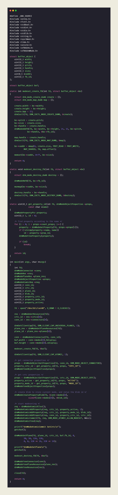
          > #define _GNU_SOURCE
          > #include <errno.h>
          > #include <fcntl.h>
          > #include <stdbool.h>
          > #include <stdint.h>
          > #include <stdio.h>
          > #include <stdlib.h>
          > #include <string.h>
          > #include <sys/mman.h>
          > #include <time.h>
          > #include <unistd.h>
          > #include <xf86drm.h>
          > #include <xf86drmMode.h>
          > struct buffer_object {
          > 	uint32_t width;
          > 	uint32_t height;
          > 	uint32_t pitch;
          > 	uint32_t handle;
          > 	uint32_t size;
          > 	uint8_t *vaddr;
          > 	uint32_t fb_id;
          > };
          > struct buffer_object buf;
          > static int modeset_create_fb(int fd, struct buffer_object *bo)
          > {
          > 	struct drm_mode_create_dumb create = {};
          >  	struct drm_mode_map_dumb map = {};
          > 	create.width = bo->width;
          > 	create.height = bo->height;
          > 	create.bpp = 32;
          > 	drmIoctl(fd, DRM_IOCTL_MODE_CREATE_DUMB, &create);
          > 	bo->pitch = create.pitch;
          > 	bo->size = create.size;
          > 	bo->handle = create.handle;
          > 	drmModeAddFB(fd, bo->width, bo->height, 24, 32, bo->pitch,
          > 			   bo->handle, &bo->fb_id);
          > 	map.handle = create.handle;
          > 	drmIoctl(fd, DRM_IOCTL_MODE_MAP_DUMB, &map);
          > 	bo->vaddr = mmap(0, create.size, PROT_READ | PROT_WRITE,
          > 			MAP_SHARED, fd, map.offset);
          > 	memset(bo->vaddr, 0xff, bo->size);
          > 	return 0;
          > }
          > static void modeset_destroy_fb(int fd, struct buffer_object *bo)
          > {
          > 	struct drm_mode_destroy_dumb destroy = {};
          > 	drmModeRmFB(fd, bo->fb_id);
          > 	munmap(bo->vaddr, bo->size);
          > 	destroy.handle = bo->handle;
          > 	drmIoctl(fd, DRM_IOCTL_MODE_DESTROY_DUMB, &destroy);
          > }
          > static uint32_t get_property_id(int fd, drmModeObjectProperties *props,
          > 				const char *name)
          > {
          > 	drmModePropertyPtr property;
          > 	uint32_t i, id = 0;
          > 	/* find property according to the name */
          > 	for (i = 0; i < props->count_props; i++) {
          > 		property = drmModeGetProperty(fd, props->props[i]);
          > 		if (!strcmp(property->name, name))
          > 			id = property->prop_id;
          > 		drmModeFreeProperty(property);
          > 		if (id)
          > 			break;
          > 	}
          > 	return id;
          > }
          > int main(int argc, char **argv)
          > {
          > 	int fd;
          > 	drmModeConnector *conn;
          > 	drmModeRes *res;
          > 	drmModePlaneRes *plane_res;
          > 	drmModeObjectProperties *props;
          > 	drmModeAtomicReq *req;
          > 	uint32_t conn_id;
          > 	uint32_t crtc_id;
          > 	uint32_t plane_id;
          > 	uint32_t blob_id;
          > 	uint32_t property_crtc_id;
          > 	uint32_t property_mode_id;
          > 	uint32_t property_active;
          > 	fd = open("/dev/dri/card0", O_RDWR | O_CLOEXEC);
          > 	res = drmModeGetResources(fd);
          > 	crtc_id = res->crtcs[0];
          > 	conn_id = res->connectors[0];
          > 	drmSetClientCap(fd, DRM_CLIENT_CAP_UNIVERSAL_PLANES, 1);
          > 	plane_res = drmModeGetPlaneResources(fd);
          > 	plane_id = plane_res->planes[0];
          > 	conn = drmModeGetConnector(fd, conn_id);
          > 	buf.width = conn->modes[0].hdisplay;
          > 	buf.height = conn->modes[0].vdisplay;
          > 	modeset_create_fb(fd, &buf);
          > 	drmSetClientCap(fd, DRM_CLIENT_CAP_ATOMIC, 1);
          > 	/* get connector properties */
          > 	props = drmModeObjectGetProperties(fd, conn_id,	DRM_MODE_OBJECT_CONNECTOR);
          > 	property_crtc_id = get_property_id(fd, props, "CRTC_ID");
          > 	drmModeFreeObjectProperties(props);
          > 	/* get crtc properties */
          > 	props = drmModeObjectGetProperties(fd, crtc_id, DRM_MODE_OBJECT_CRTC);
          > 	property_active = get_property_id(fd, props, "ACTIVE");
          > 	property_mode_id = get_property_id(fd, props, "MODE_ID");
          > 	drmModeFreeObjectProperties(props);
          > 	/* create blob to store current mode, and retun the blob id */
          > 	drmModeCreatePropertyBlob(fd, &conn->modes[0],
          > 				sizeof(conn->modes[0]), &blob_id);
          > 	/* start modeseting */
          > 	req = drmModeAtomicAlloc();
          > 	drmModeAtomicAddProperty(req, crtc_id, property_active, 1);
          > 	drmModeAtomicAddProperty(req, crtc_id, property_mode_id, blob_id);
          > 	drmModeAtomicAddProperty(req, conn_id, property_crtc_id, crtc_id);
          > 	drmModeAtomicCommit(fd, req, DRM_MODE_ATOMIC_ALLOW_MODESET, NULL);
          > 	drmModeAtomicFree(req);
          > 	printf("drmModeAtomicCommit SetCrtc\n");
          > 	getchar();
          > 	drmModeSetPlane(fd, plane_id, crtc_id, buf.fb_id, 0,
          > 			50, 50, 320, 320,
          > 			0, 0, 320 << 16, 320 << 16);
          > 	printf("drmModeSetPlane\n");
          > 	getchar();
          > 	modeset_destroy_fb(fd, &buf);
          > 	drmModeFreeConnector(conn);
          > 	drmModeFreePlaneResources(plane_res);
          > 	drmModeFreeResources(res);
          > 	close(fd);
          > 	return 0;
          > }
          - 原来的 drmModeSetCrtc(crtc_id, fb_id, conn_id, &mode) 被上面这部分代码取代了（除了 fb_id） 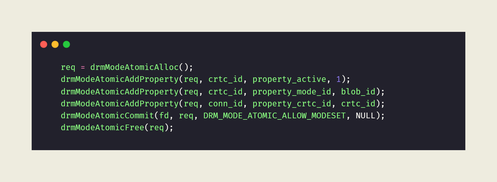
          - 代码没有添加对 fb_id 的操作，因此它的作用只是初始化CRTC/ENCODER/CONNECTOR硬件，以及建立硬件链路的连接关系，并不会显示framebuffer的内容，即保持黑屏状态。framebuffer的显示将由后面的 drmModeSetPlane() 操作来完成
          - drmModeSetPlane() 调用之前，必须先调用drmModeSetCrtc() 初始化底层硬件，否则plane设置将无效。而通过上面的程序运行结果可以证明，drmModeAtomicCommit() 操作同样可以初始化底层硬件。
      - PLANE
        - 当初传入 drmModeSetPlane 对应的参数 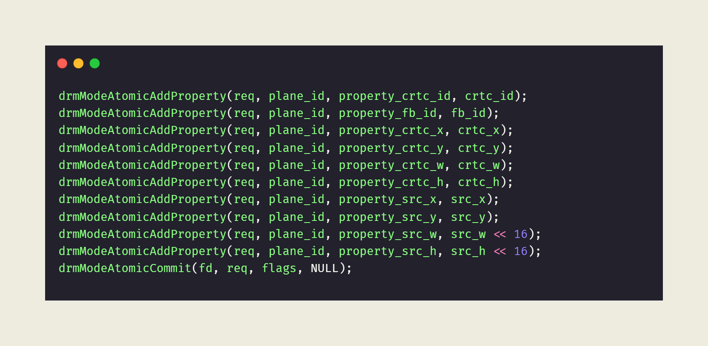
          - 对应的 drmModeSetPlane 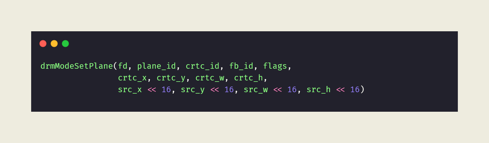
          - 两者的对比 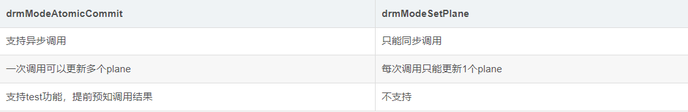
        - flags 参数
          - DRM_MODE_PAGE_FLIP_EVENT
            - 请求底层驱动发送PAGE_FLIP事件，上层应用需要调用 drmHandleEvent() 来接收并处理相应事件
          - DRM_MODE_ATOMIC_TEST_ONLY
            - 仅用于试探本次commit操作是否能成功，不会操作真正的硬件寄存器
            - 不能和 DRM_MODE_PAGE_FLIP_EVENT 同时使用
          - DRM_MODE_ATOMIC_NONBLOCK
            - 允许本次commit操作异步执行，即无需等待上一次commit操作彻底执行完成，就可以发起本次操作
            - drmModeAtomicCommit() 默认以BLOCK（同步）方式执行
          - DRM_MODE_ATOMIC_ALLOW_MODESET
            - 告诉底层驱动，本次commit操作修改到了modeseting相关的参数，需要执行一次full modeset动作
```
