```markmap
---
markmap:
  initialExpandLevel: 2
  spacingVertical: 30
  spacingHorizontal: 180
---

# ELF（Executable and Linking Format）
- ELF header(Ehdr)
  - 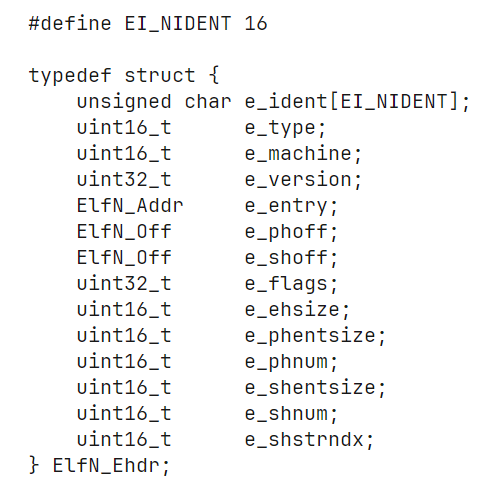
    - e_ident
      - 前 4 个字节是固定的
        - 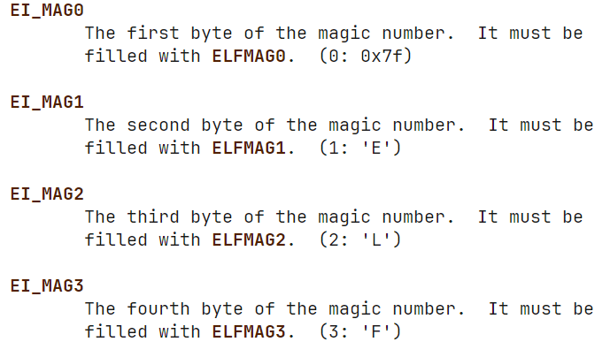
      - 第 5 个字节指示使用何种架构
        - 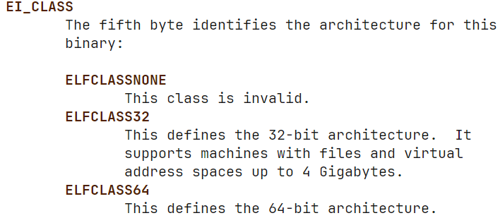
      - 第 6 字节指示数据的大小端和编码方式
        - 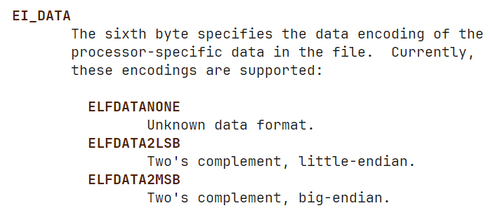
      - 第 7 字节指示 ELF 文件的版本
        - 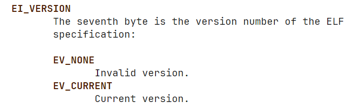
      - 第 8 字节指示 ELF 文件适用的操作系统和 ABI
        - 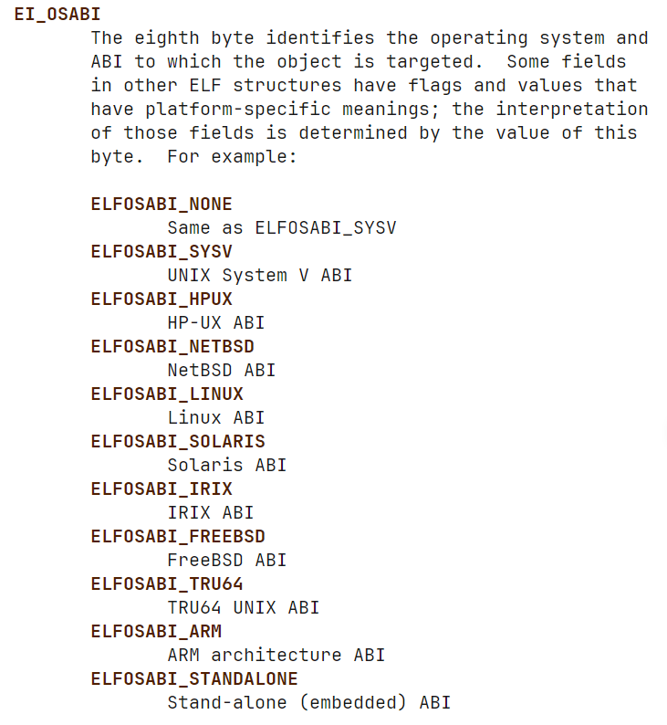
      - 第 9 字节指示 ABI 版本
        - 依赖于 EI_OSABI
        - 可以使用 0 来填充此字段
      - 第 10 字节是 padding 的开始
        - 填充为 0
        - 保留的字节
    - e_type
      - 对象文件的类型 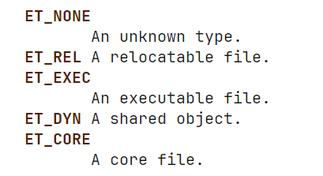
    - e_machine
      - 要求的架构 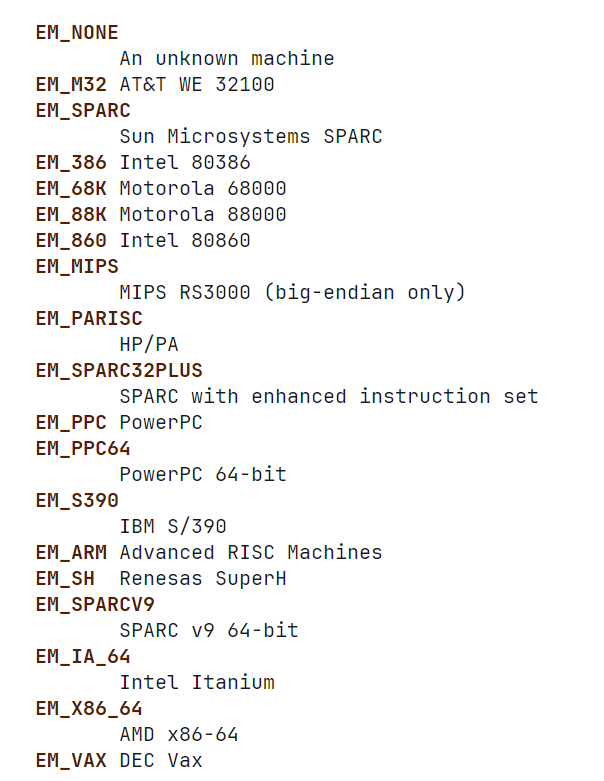
    - e_version
      - ELF 文件的版本 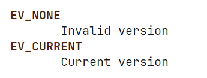
    - e_entry
      - 表示系统首次将控制权移交的虚拟地址，从此地址进程开始执行。如果文件没有关联的入口点，该字段的值将为零
    - e_phoff
      - 程序头部表（program header table）在 ELF 文件中的偏移量（单位是字节）
    - e_shoff
      - section header table 在文件中的偏移量
    - e_flags
      - 处理器特定的 flag
      - 以 EF_&lt;machine_flag&gt; 宏定义
        - 目前还没有
    - e_ehsize
      - elf header size
    - e_phentsize
      - 在 program header table 中的每一项（entry）的大小
    - e_phnum
      - 在 program header table 中有多少项
      - 如果大于或等于 PN_XNUM（0xffff），此字段的值为 0xffff。此时，真实的项数位于 sh_info（section header table） 中
    - e_shentsize
      - section header table 中的每一项的大小
    - e_shnum
      - 在 section header table 中有多少项
      - 如果大于等于 SHN_LORESERVE（0xff00），此时， e_shnum = 0，且真实的项数位于 sh_size 中
    - e_shstrndx
      - 在 section header table 中 name string table 的 index
      - 如果没有 name string table，那么，此字段为 SHN_UNDEF
      - 如果 index 大于 SHN_LORESERVE，则 e_shstrndx = SHN_XINDEX(0xffff)，并且真实的 index 在 sh_link 中
- Program header（Phdr）
  - 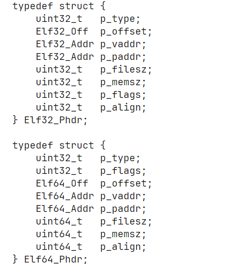
    - 每个 Phdr 描述一个段或者系统需要的其他信息
    - p_type
      - 段的类型
        - PT_NULL
          - 这个段没有被定义，其他字段是未定义的
          - 让 Program header 忽略这个 entry
        - PT_LOAD
          - 可装载（load）由 p_filesz 和 p_memsz 指定的段
          - 如果 p_memsz 大于 p_filesz，内存中多出来的部分将被填充为 0，并位于段的初始化数据之后
          - p_filesz 不能大于 p_memsz
          - 程序头表中的 PT_LOAD 段条目会按照 p_vaddr（虚拟地址）字段升序排列
        - PT_DYNAMIC
          - 描述动态链接的相关信息的段
        - PT_INTERP
          - 指定用于调用解释器的一个以 null 结尾的路径名的位置和大小
          - 此段类型仅对可执行文件有意义（尽管它也可能出现在共享对象中）
          - 在一个文件中，它不能出现超过一次
          - 如果存在 PT_INTERP 段，它必须位于任何可加载段之前
        - PT_NOTE
          - 表示一个存储注释信息的段
          - 注释信息位于（ElfN_Nhdr）中
        - PT_SHLIB
          - 保留
        - PT_PHDR
          - 指示了程序头部表在文件中的位置以及在程序运行时内存中的位置
          - 在一个 ELF 文件中，PT_PHDR 类型的段只能出现一次。这意味着每个 ELF 文件只能有一个 PT_PHDR 段来描述程序头表
          - PT_PHDR 类型的段仅在程序头表作为程序内存映像的一部分时才会存在。如果程序头表不在内存映像中，就不会有 PT_PHDR 类型的段
          - 如果文件中存在 PT_PHDR 段，它必须位于所有可加载段（PT_LOAD 类型的段）之前。这确保了在程序加载时，程序头表信息可以在加载其他段之前被正确处理
        - PT_LOPROC 和 PT_HIPROC
          - [PT_LOPROC, PT_HIPROC] 范围的值用来保留给特定处理器或平台的自定义段类型
        - PT_GNU_STACK
          - 被 linux 内核使用来控制栈的状态（通过 p_flags）
    - p_offset
      - 此段在文件中的偏移量
    - p_vaddr
      - 此段在虚拟内存中的地址
    - p_paddr
      - 在某些系统中，物理地址是有意义的，因此 p_paddr 字段用于指定段在物理内存中的实际地址。这对于一些特殊的硬件系统或者需要直接操作物理内存的情况可能是有用的
      - 在 BSD 系统中，这个字段不被使用，必须被设置为零
    - p_filesz
      - 该段在文件中的大小
    - p_memsz
      - 该段在内存中的大小
    - p_flags
      - 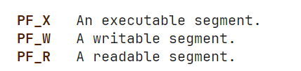
- Section header(Shdr)
  - 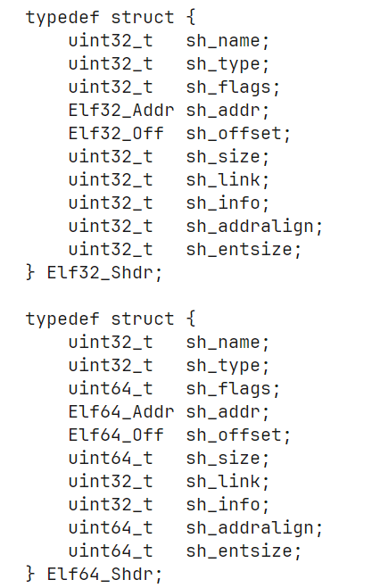
    - sh_name
      - 该节的名字
      - 是 string table section 的 index
    - sh_type
      - SHT_NULL
        - 该 section 不生效
      - SHT_PROGBITS
        - 被程序所定义，只有对于该程序才有意义
      - SHT_SYMTAB
        - 该节含有 symbol table
          - 包含一个完整的符号表，可能包含许多对动态链接不必要的符号，但是在静态链接过程中可能是有用的
        - 通常，该节用于链接编辑（link editing），或者用于动态链接
        - 除了 SHT_SYMTAB 节，一个对象文件还可以包含 SHT_DYNSYM 节，这是专门用于动态链接的符号表。SHT_DYNSYM 只包含动态链接时需要的符号，相比 SHT_SYMTAB 更加精简
      - SHT_STRTAB
        - 包含一个 string table
        - 一个 ELF 文件可能包含多个这种类型的 section
      - SHT_RELA
        - 包含重定位条目（包含附加的加数（addends））
          - Addends 是重定位条目中一个附加的数值，它与重定位类型一起使用，用于计算最终的地址或值
        - 一个 ELF 文件可能包含多个这种类型的 section
      - SHT_HASH
        - 包含一个符号哈希表（symbol hash table）
        - 对于一个参与动态链接的对象文件必须包含此节
        - 一个 ELF 文件只能含有一个此节
      - SHT_DYNAMIC
        - 包含动态链接的相关信息
        - 一个 ELF 文件只能含有一个此节
      - SHT_NOTE
        - 包含注解（注解即是ElfN_Nhdr 结构体）
      - SHT_NOBITS
        - 这种类型的节在文件中不占用空间，但在其他方面与 SHT_PROGBITS 类似
        - 尽管该节不包含实际的字节数据，但其 sh_offset 成员仍包含该节的概念性文件偏移量
      - SHT_REL
        - 包含没有显式地指定 addends 的重定位条目
        - 一个 ELF 文件可能包含多个这种类型的 section
      - SHT_SHLIB
        - 保留
      - SHT_DYNSYM
        - 包含用于动态链接的最少符号集合
      - SHT_LOUSER 和 SHT_HIUSER
        - [SHT_LOUSER, SHT_HIUSER] 是保留给应用程序使用的节类型
      - SHT_LOPROC 和 SHT_HIPROC
        - [SHT_LOPROC, SHT_HIPROC] 是保留给处理器使用的节类型
    - sh_flags
      - 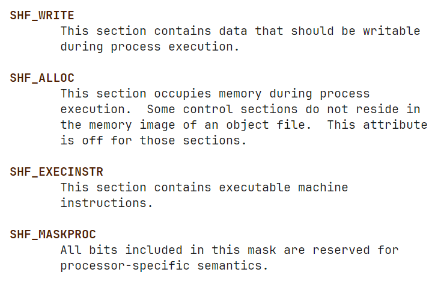
    - sh_addr
      - 如果此节出现在内存中，那么此字段表示此节在虚拟内存中的地址
    - sh_offset
      - 此节在文件中的偏移量
      - 当 sh_type = SHT_NOBITS 时，表示在该文件中的概念偏移量
    - sh_size
      - 包含该节的大小
    - sh_link
      - 在节头部表中的索引
      - 意义由节的类型所确定
    - sh_info
      - 是一个 extra 字段，其值取决于节的类型
    - sh_addralign
      - sh_addr 的对齐要求
      - sh_addr mod sh_addralign 必须等于 0
      - 只能是 2 的幂（0 或者 1 表示没有对齐要求）
    - sh_entsize
      - 有些节持有固定长度的 entry（例如符号表），此字段表示该 entry 的大小。如果没有持有固定长度的 entry，则为 0
  - sections
    - .bss
      - 存储未初始化的数据
      - 当程序进行初始化的时候会将此节的内容初始化为 0
      - 此节的类型为 SHT_NOBITS
    - .comment
      - 存储版本控制信息
      - 此节的各类型为 SHT_PROGBITS
    - .ctors
      - 存储已初始化指针，该初始化指针指向一个 C++ 的构造函数
      - 此节的类型为 SHT_PROGBITS
    - .data
      - 存储已初始化的数据
      - 此节的类型为 SHT_PROGBITS
    - .data1
      - 同 .data
    - .debug
      - 存储编译器生成的符号调试信息，内容是未指定的
      - 类型为 SHT_PROGBITS
    - .dtors
      - 存储已初始化的指针，指向一个 C++ 的解构函数
    - .dynamic
      - 存储动态链接信息
      - 此节的类型为 SHT_DYNAMIC
    - .dynstr
      - 存储动态链接所需要的字符串
      - 此节的类型为 SHT_STRTAB
    - .dynsym
      - 存储动态链接的符号表
      - 此节的类型为 SHT_DYNSYM
    - .fini
      - 存储可执行的指令，这些指令用于执行清理操作或释放资源。当程序正常退出时，系统会安排执行此节中的代码
    - .gnu.version
      - 存储版本符号表（version symbol table），即一个 ElfN_Half 结构的数组
      - 此节的类型为 SHT_GNU_versym
    - .gnu.version.d
      - 存储版本符号表的定义，是 ElfN_Verdef 结构体的数组
      - 类型为 SHT_GNU_verdef
    - .gnu.version_r
      - 存储版本符号需要的元素，是 ElfN_Verneed 结构体的数组
      - 类型为 SHT_GNU_versym
    - .got
      - 存储全局偏移量表（global offset table）
      - type = SHT_PROGBITS
    - .hash
      - 存储符号哈希表（symbol hash table）
      - type = SHT_HASH
    - .init
      - 存储可执行的指令。当一个程序开始运行之前，系统先执行这一节的指令
      - type = SHT_PROGBITS
    - .interp
      - 包含程序解释器的路径名
      - 如果文件有一个包含该节的可加载段，那么该节的属性会包含 SHF_ALLOC 位（表示该节会被分配到内存中）。如果没有包含，SHF_ALLOC 位将被关闭
      - 该节的类型为 SHT_PROGBITS，表示它包含程序的实际数据
    - .line
      - 包含符号调试的行号信息，描述源代码和机器码之前的对应关系
      - type = SHT_PROGBITS
    - .note
      - 各种各样的注释
      - type = SHT_NOTE
    - .note.ABI-tag
      - 用于声明运行时 ELF 文件所使用的 ABI
      - 可能包含操作系统的名字和其版本
      - type = SHT_NOTE
    - .note.gnu.build-id
      - 存储一个唯一标识 ELF 文件内容的 ID
      - 具有相同 Build ID 的不同文件应该包含相同的可执行内容
      - 此节可以帮助验证和跟踪二进制文件的版本或内容一致性。可以通过 GNU 链接器（ld(1)）的 --build-id 选项来生成这个 ID
      - type = SHT_NOTE
    - .note.GNU-stack
      - 用来声明 linux 对象文件的栈的属性
      - 向 GNU 链接器表明该对象文件需要一个可执行的栈
      - 此节的为一个属性是 SHF_EXECINSTR
      - type = SHF_EXECINSTR
    - .note.openbsd.ident
      - OpenBSD 原生可执行文件通常包含此节来标识自己，这样在加载文件时，内核可以跳过任何兼容的 ELF 二进制仿真测试
      - 作用是在加载 OpenBSD 原生可执行文件时，避免进行兼容性检查
    - .plt
      - 存储过程链接表 (Procedure Linkage Table)
      - 主要用于保存动态链接过程中调用外部函数的跳转表，具体属性取决于处理器架构
      - type = SHT_PROGBITS
    - .relNAME
      - 该节保存重定位信息。如果文件具有包含重定位的可加载段，则该节的属性将包含 SHF_ALLOC 位。否则，该位将被关闭。按照惯例，"NAME" 由重定位应用到的节提供。因此，针对 .text 节的重定位节通常会命名为 .rel.text
      - type = SHT_REL
    - .relaNAME
      - 与 .relName 节一致，但是 type = SHT_RELA
    - .rodata
      - 存储只读数据
      - type = SHT_PROGBITS
    - .rodata1
      - 同 .rodata
    - .shstrtab
      - 存储节的名字
      - type = SHT_STRTAB
    - .symtab
      - 存储符号表
      - type = SHT_SYMTAB
    - .text
      - 存储程序的可执行指令
      - type = SHT_PROGBITS
- String and Symbol tables
  - symbol table 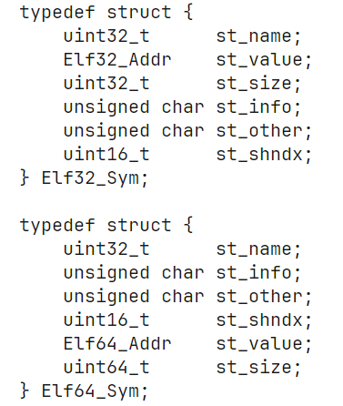
    - st_name
      - 在 symbol string table 中的一个 index
      - 如果是 0，则表示没有名字
    - st_value
    - st_size
      - symbol 的 size
    - st_info
      - STT_NOTYPE
        - 符号类型未定义
      - STT_OBJECT
        - 符号和一个 data object 关联
      - STT_FUNC
      - STT_SECTION
        - 和一个 section 相关联
        - 主要用于重定位
        - 绑定类型 (st_bind) 通常为 STB_LOCAL，这意味着这些符号具有局部绑定，仅在定义它们的模块或文件内有效
      - STT_FILE
        - 给出和此对象文件关联的源文件的名字
        - 如果存在这种符号，它通常在文件的其他 STB_LOCAL 符号之前出现
      - STT_LOPROC 和 STT_HIPORC
      - STB_LOCAL
        - 对于其他对象文件时不可见的符号
      - STB_GLOBAL
        - 全局符号
      - STB_WEAK
        - weak symbol 与全局符号类似，但是 weak symbol 的优先级较低
      - STB_LOPROC 和 STB_HIPROC
      - 这些宏可以用来打包或解包 st_info 字段 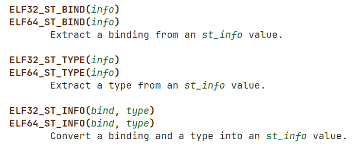
    - st_other
      - 用来定义 symbol 的可见性
      - STV_DEFAULT
        - 默认的符号可见性规则（symbol visibility rules）
      - STV_INTERNAL
      - STV_HIDDEN
        - 符号在其他模块中是不可见的
      - STV_PROTECTED
        - 符号对于其他模块可见，但是在本地模块中对该符号的引用总是解析到本地符号而不会被外部模块的符号替代或覆盖
    - st_shndex
      - 表示符号关联的节的索引
  - 字符串表
    - 字符串表节保存以空字符 (\\0) 结尾的字符序列，通常称为字符串
    - 目标文件使用这些字符串来表示符号和节的名称。可以通过索引字符串表节来引用字符串
    - 第一个字节，即索引为 0 的位置，被定义为保存一个空字节 ('\\0')。同样地，字符串表的最后一个字节也被定义为保存一个空字节，以确保所有字符串都以空字符结尾
  - 符号表
    - 存储定位和重定位程序的符号定义和引用的相关信息
- relocation entries（rel & rela）
  - 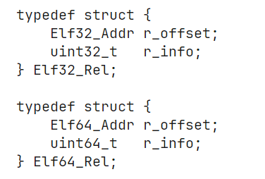
    - r_offset
      - 对于可重定位文件来说，r_offset 是从节的起始位置到需要应用重定位操作的存储单元的字节偏移量。换句话说，它指示了在节内需要进行重定位的位置
      - 对于可执行文件或共享对象来说，表示需要进行重定位的存储单元的虚拟地址
    - r_info
      - 指出在符号表中需要重定位的 index 和重定位的类型
      - 可以用 ELF[32|64]_R_SYM 或这 ELF[32|64]_R_TYPE 来提取
  - 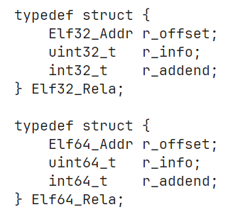
    - r_addend
      - 一个常量
- Dynamic tags（Dyn）
  - 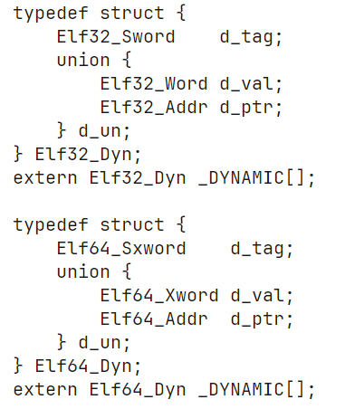
    - d_tag
      - 控制 d_un 字段的解释
      - 可能的值 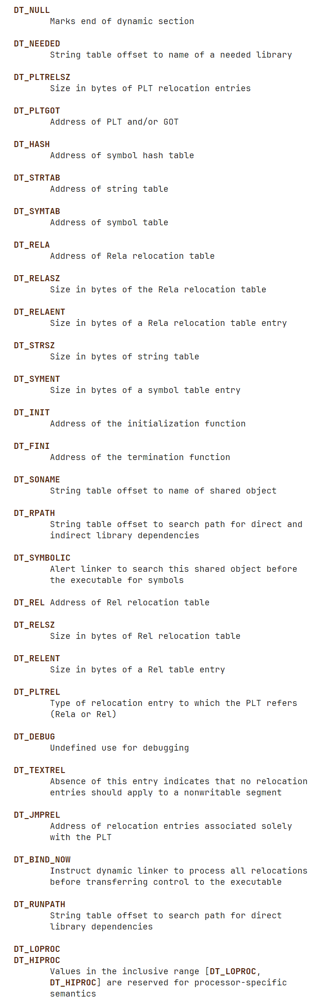
    - d_val
      - 一个整数值
    - d_ptr
      - 表示一个虚拟地址，其意义由 d_tag 决定
    - _DYNAMIC
      - 存储在 .dynamic 节中的所有Elf[32|64]_Dyn 结构体
  - .dynamic 节中包含这样的结构体
- Notes（Hhdr）
  - 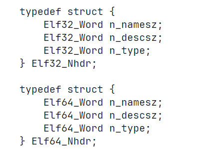
    - n_namesz
      - name 的长度（包含空字节在内）
      - name 会立即跟在此 note 的后面
    - n_descsz
      - 描述的长度
      - 会立即更在 name 字段的后面
    - n_type
      - 依赖于 name 字段
      - 当 e_type = ET_CORE 时 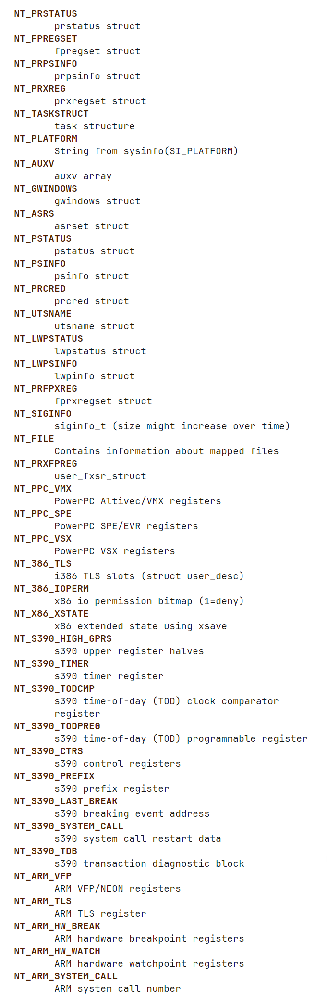
      - 当 n_name = GNU 时 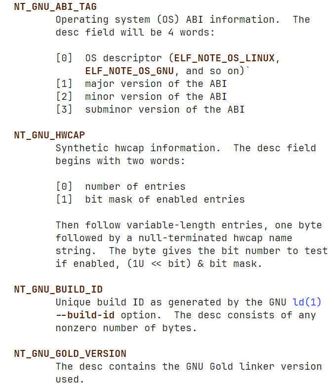
      - 当其他情况 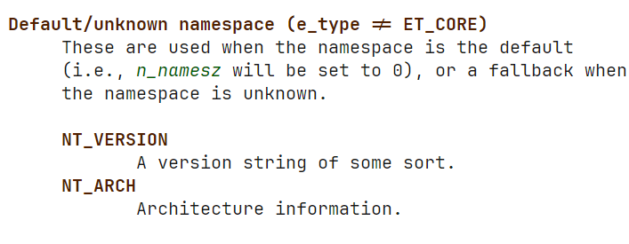
```
