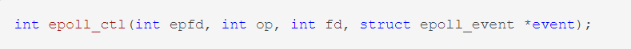
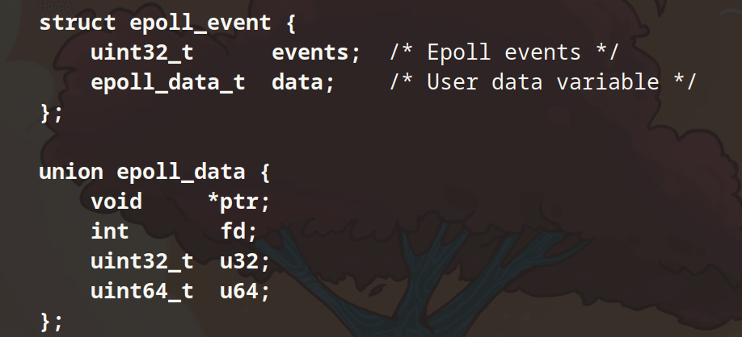
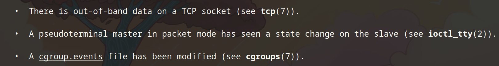
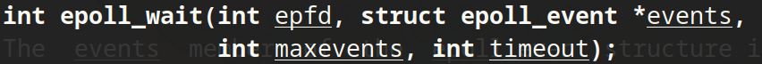
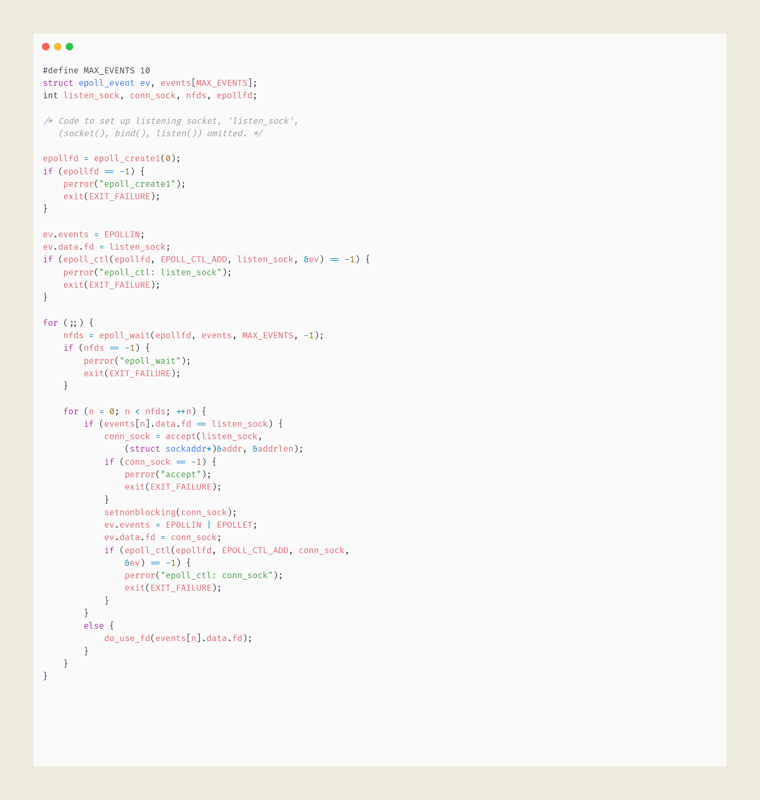

```markmap
---
markmap:
  initialExpandLevel: 2
  spacingVertical: 30
  spacingHorizontal: 180
---

# I/O 多路复用
- select
- poll
- epoll
  - 系统调用
    - epoll_create 
      - 创建一个 epoll 池，池子的大小有 size 指定
      - 这个池子负责监控和管理文件句柄
    - epollctl 
      - 完成对 epoll 池的增删改
      - op
        - EPOLL_CTL_ADD: 向 epoll 池中增加一个 fd，和一个事件 event
        - EPOLL_CTL_MOD: 改变和 fd 关联的事件
        - EPOLL_CTL_DEL：从 epoll 池中删除对应的 fd
      - epoll_event 
        - epoll_event 结构体是内核中当文件描述符准备好了之后，内核返回的东西
        - events 是一个位掩码，并通过 epoll_wait 进行返回，它由事件类型（event type）和输入标志（input flag）组成
          - event type
            - EPOLLIN
              - 当 fd 可以进行 read 操作时
            - POLLOUT
              - 当 fd 可以进行 write 操作时
            - EPOLLRDHUP
              - 当 socket 对等的那一端关闭时
            - EPOLLPRI
              - fd 发生了异常。有可能是 
            - EPOLLERR
              - fd 发生了错误
            - EPOLLHUP
              - fd 被挂起
          - input flag
            - EPOLLET
              - 要求对 fd 的 edge-triggered 进行通知 epoll 模式是水平触发模式
                - 水平触发(level-trggered)
                  - 只要文件描述符关联的读内核缓冲区非空，有数据可以读取，就一直发出可读信号进行通知
                  - 当文件描述符关联的内核写缓冲区不满，有空间可以写入，就一直发出可写信号进行通知
                - 边缘触发(edge-triggered)
                  - 当文件描述符关联的读内核缓冲区由空转化为非空的时候，则发出可读信号进行通知
                  - 当文件描述符关联的内核写缓冲区由满转化为不满的时候，则发出可写信号进行通知
            - EPOLLONESHOT
              - 对该 fd 的事件只通知一次，如果后续想要改变这个行为，使用 epoll_ctl 并传入 EPOLL_CTL_MOD
            - EPOLLWAKEUP
            - EPOLLEXCLUSIVE
    - epollwait 
      - 让出 CPU,在池子中有文件句柄准备好了之后，从 epollwait 出苏醒
      - 返回 epoll 池中就绪的描述符的数量
  - 框架 
```
