```markmap
---
markmap:
  initialExpandLevel: 2
  spacingVertical: 30
  spacingHorizontal: 180
---

# IPC
- 经典 IPC
  - 管道
    - 限制
      - 历史上，是半双工的（数据只能在一个方向上流动）
      - 管道只能在具有公共祖先的两个进程之间使用。通常，一个管道由一个进程创建，在进程调用 fork 之后，这个管道就能在父、子进程之间使用了
    - 创建 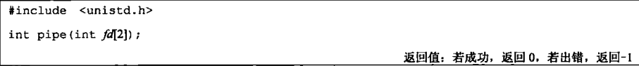
      - fd[0] 为读而打开
      - fd[1] 为写而打开，fd[1] 的输出是 fd[0] 的输入
    - fstat 函数对管道的每一端都返回一个 FIFO 类型的文件描述符，可以用 S_ISFIFO 宏来测试管道
    - 父进程调用 fork 之后的管道 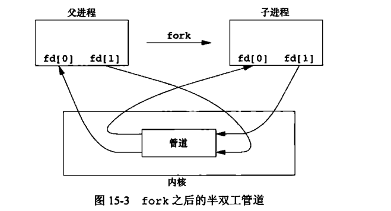
      - 关闭对应的 fd 可以控制数据的流向 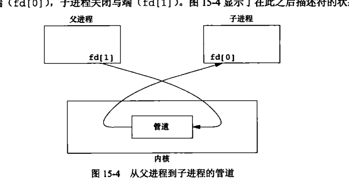
    - 可以复制一个管道描述符，使得多个进程对它具有写打开文件描述符
    - 当管道的一端被关闭后，有 2 条规则起作用
      - 当读一个写端已被关闭的管道时，在所有数据都被读取后， read 返回 0，表示文件结束。
      - 如果写一个读端已经被关闭的管道，则产生信号 SIGPIPE，如果忽略该信号或者捕捉该信号并从信号处理程序中返回，否则 write 返回 -1，errno = EPIPE
    - 在写管道（或 FIFO）时，常量 PIPE_BUF 规定了内核管道缓冲区的大小
      - 如果对管道调用 write，而且要求写的字节数小于等于 PIPE_BUF，则此操作不会与其他进程对同一管道（或 FIFO）的write操作交叉进行
      - 如果有多个进程同时写一个管道（或FIFO），而且我们要求写的字节数超过 PIPE_BUF，那么我们所写的数据可能会与其他进程所写的数据相互交叉。用 pathconf或fpathconf函数（见图2-12）可以确定 PIPE_BUF 的值。
  - popen 和 pclose 函数 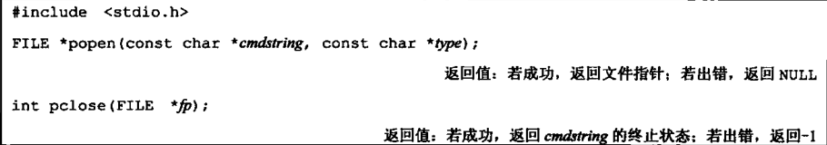
    - 适用于子进程到父进程或者父进程到子进程的单向数据传输
    - popen 函数先执行 fork，然后调用 sh -c 执行 cmdstring 命令，并且返回一个标准 IO 文件指针
    - popen 的 type 参数
      - “r"，将该文件指针链接到 cmdstring 进程的标准输出
      - "w"，将文件指针链接到 cmdstring 进程的标准输入
      - 图解 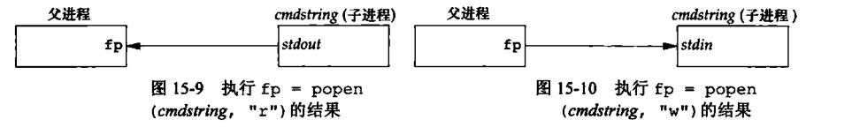
    - cmdstring 将由 shell 执行
  - FIFO（命名管道）
    - 创建 FIFO 类似于创建文件，FIFO 的路径名存在于文件系统 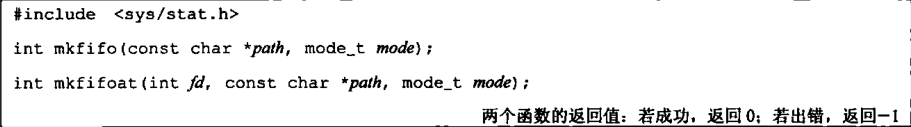
      - mode 参数于 open 函数中的 mode 相同
      - 也可以用 mknod 或者 mknodat 函数创建 FIFO
    - 创建了 FIFO 后，要用 open 来打开它
      - 如果没有指定 O_NONBLOCK，只读 open 要阻塞到某个其他进程为写而打开这个 FIFO 为止，类似地，如果只写 open 要阻塞到某个进程为读而打开为止
      - 如果指定了 O_NONBLOCK，则只读 open 立即返回，但是，如果没有进程为写打开，则 只写 open 将返回 -1，并将 errno = ENXIO
  - XSI IPC
    - 包括消息队列、信号量和共享存储器
    - 每个 IPC 对象都用一个非负整数的标识符加以引用，这个标识符每次都加一，直到 INT_MAX，然后返回到零
    - 键
      - 每个 IPC 对象都与一个键（key）相关联（一对一的关系），将这个键作为该对象的外部名，可以使多个合作进程能在同一 IPC 对象上汇聚
        - 无论何时创建一个 IPC 结构，都要指定一个键
        - 这种键的数据类型是 key_t，通常定义在 sys/types.h 中，被定义为一个长整型
      - 生成键值
        - 可以直接指定为一个 key_t 类型的变量直接赋值
        - 常量 IPC_PRIVATE 可以保证进程创建一个新的 IPC 结构
        - 指定一个路径和项目 ID 调用 ftok 函数 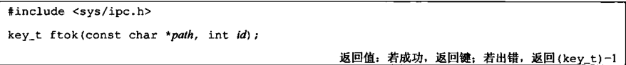
          - 项目 ID 的取值范围是 0 ~ 255 之间的字符值，即只使用 id 参数的低 8 位
          - path 参数必须引用一个现有的文件
          - 返回的键值通常是通过路径得到 stat 结构并取得 st_dev 和 st_ino 字段，然后将它们与 项目 ID 结合起来
    - 权限结构
      - 每一个 IPC 结构关联了一个 ipc_perm 结构，此结构规定了权限和所有者，至少包括： 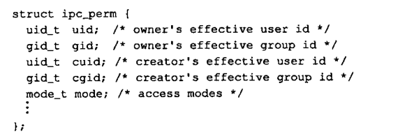
    - 消息队列
      - msgget 用于创建一个新的消息队列或打开一个现有队列。 
        - flag 参数
          - 权限信息 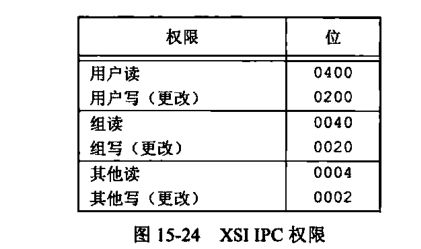
          - IPC_CREATE
            - 如果消息队列不存在，则创建它。如果消息队列已存在，则返回它的标识符
          - IPC_EXCL
            - 如果与 IPC_CREAT 组合使用，则表示如果消息队列已经存在，msgget 调用将失败，返回 -1，并设置 errno 为 EEXIST
          - 例如： int msgid = msgget(key, IPC_CREAT | IPC_EXCL | 0600);
      - msgsnd 将新消息添加到队列尾端，每个消息包含一个正的长整型类型的字段、一个非负的长度以及实际数据字节数 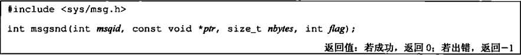
        - ptr 参数指向的结构类似于： 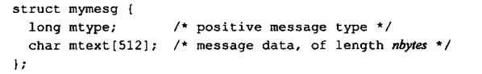
        - flag 参数
          - IPC_NOWAIT
            - 类似于文件 IO 的非阻塞 IO 标志
            - 若消息队列已满（或者队列中的消息综述等于系统限制值，或队列中的字节总数等于系统限制值），则会立即出错返回 EAGAIN。如果没有指定 IPC_NOWAIT，则进程会一直阻塞直到有空间容纳要发送的消息、从系统中删除了此队列或者捕捉到一个信号
      - msgrcv 用于从队列中去消息，不一定要以先进先出次序取消息，可以按照类型字段取消息 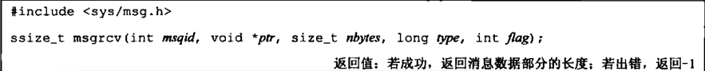
        - 如果返回的消息的长度大于 nbytes，而在 flag 中设置了 MSG_NOERROR 位，则该消息会被截断，并且没有任何通知。如果没有设置 MSG_NOERROR，则返回错误 E2BIG，且消息仍然在队列中
        - type 参数可以指定想要哪一种消息
          - type = 0，队列中的第一个消息
          - type &gt; 0，队列中消息类型为 type 的第一个消息
          - type &lt; 0，队列中消息类型值小于等于 type 绝对值的消息，如果这种消息有若干个，则取类型值最小的消息
      - 每个队列都有一个 msqid_ds 结构与其关联 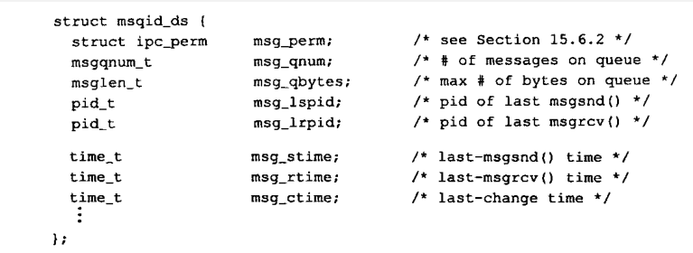
      - msgctl 函数对队列执行多种操作 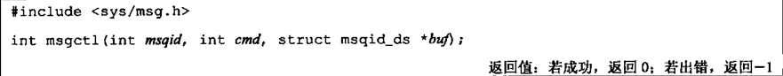
        - cmd 参数
          - IPC_STAT
            - 取此队列的 msqid_ds 结构，并将它存放在 buf 指向的结构中
          - IPC_SET
            - 井字段 msg_perm.uid、msg_perm.gid、msg_perm.mode 和 msgqbytes 从 buf 指向的结构赋值到与这个队列相关的 msqid_ds 结构中
            - 只能由有效用户 ID 等于 msg_per.cuid、msg_perm.uid 或者超级用户进程执行
            - 只有超级用户才能增加 msg_qbytes 的值
          - IPC_RMID
            - 从系统中删除该消息队列以及仍在该队列中的数据。这种删除立即生效
            - 仍在使用这一消息队列的其他进程在他们下一次试图对队列进行操作时，将得到 EIDRM 错误
            - 具有一定的权限才能执行
    - 信号量
      - 是一种计数器，用于为多个进程提供对共享数据的访问
      - 为了获得共享资源，进程需要执行以下操作
        - 1\. 测试控制该资源的信号量
        - 2\. 若此信号量的值为正，则进程可以使用该资源。同时，进程会将信号量的值减一，表示它使用了一个资源单位
        - 3\. 否则，弱磁信号量的值为 0， 则进程进入休眠状态，直至信号量大于 0。进程被唤醒后，返回步骤 1
      - 当进程不再使用一个又信号量控制的资源时，该信号量的值加一，如果有进程正在休眠等待此信号量，则唤醒它们
      - XSI 信号量的特殊之处（同时也是缺点）
        - 信号量并非单个非负值，而必须定义为一个或多个信号量值的集合，当创建信号量时，要指定接种信号量值的数量
        - 信号量的创建（semget）是独立于它的初始化的（semctl）的。这是致命的缺点，因为不能原子地创建一个信号量集合，并且对该集合中的各个信号量赋初始值
      - 内核为每个信号量维护了一个 semid_ds 结构 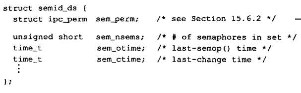
      - 每个信号量由一个无名结构表示，至少包含以上成员 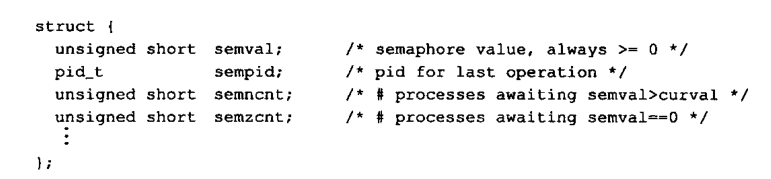
      - API
        - semget 用来获取一个信号量 ID 
          - flag 为权限与 IPC_CRATE 或 IPC_EXCL 的组合
          - 如果是引用一个现有的集合，则 nsems 指定为 0
        - semctl 函数包含了多种信号操作 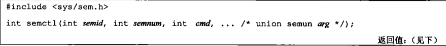
          - 第 4 个参数是可选的，取决于 cmd 参数 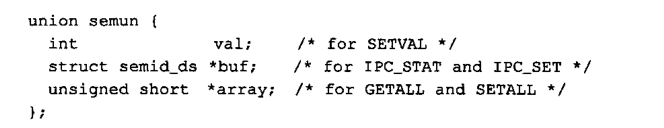
          - cmd 参数
            - IPC_STAT
              - 取 semid_ds 结构，并存储在 arg.buf 指向的结构中
            - IPC_SET
              - 按 arg.buf 指向的结构中值，设置与该集合相关的结构中的 sem_perm.uid, semp_perm.gid 和 sem_perm.mode 字段。当然，需要调用进程具有合适的权限
            - IPC_RMID
              - 从系统中删除信号量集合。这种删除是立即发生的。导致的结果也与消息队列一样
            - GETVAL
              - 返回成员 semnum 的 semval 值
            - SETVAL
              - 设置尘缘 semnum 的 semval 值，该值由 arg.va 指定
            - GETPID
            - GETZCNT
            - GETALL
              - 取该集合中所有的信号量值，这些值存储在 arg.array 指向的数组中
            - SETALL
              - 将该集合中的所有信号量值设置成 arg.aray 指向的数组中的值
          - semnum 参数用于指定信号量集合中的某一个成员，其合法值的范围是 [0, nsems - 1]
        - semop 函数自动执行信号量集合上的操作函数 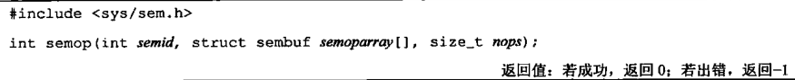
          - semoparray 指向一个由 sembuf 结构表示的信号量操作数组： 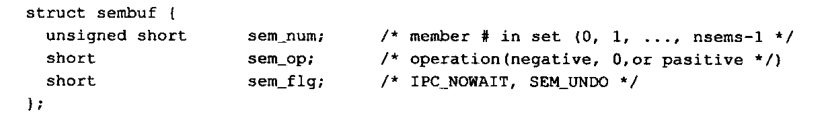
            - 无论何时主要为信号量操作指定了 SEM_UNDO 标志，然后分配资源（sem_op &lt; 0），那么内核就会记住对于该特定的信号量，分配给调用进程多少资源（sem_op 的绝对值），当该进程终止时，内核检验该进程是否还有尚未处理的信号量值，如果有，则按调整值（内核记住的值）对应的信号量值进行处理
            - 对集合中每个成员的操作由对应的 sem_op 值规定，可以是正值、负值、零
              - sem_op &gt; 0
                - 表示释放进程占用的资源数，sem_op 值会加到信号量的值上
                - 如果指定了 undo 标志，则信号量调整值减去 sem_op
              - sem_op &lt; 0
                - 表示要获取由该信号量控制的资源
                - 如果该信号量的值大于等于 sem_op 的绝对值，则从该信号量值中减去 sem_op 的绝对值
                - 如果指定了 undo 标志，也从该进程的信号量调整值中加上 sem_op
                - 如果信号量的值小于 sem_op 的绝对值，则使用下列条件
                  - 如果指定了 IPC_NOWAIT，则出错返回 EAGAIN
                  - 如果未指定 IPC_NOWAT，则该信号量的 semncnt 加一，并进入休眠状态
              - sem_op = 0
                - 表示调用进程希望等待到该信号量值变为 0
                - 如果信号量值当前是 0 ，则此函数立即返回
                - 如果信号量值非 0，则适用下列条件
                  - 若指定了 IPC_NOWAIT，则出错返回 EAGAIN
                  - 若未指定 IPC_NOWAIT，则该信号量的 semzcnt 值加一，并进入休眠状态
    - 共享存储
      - 允许两个或多个进程共享一个给定的存储区
      - 最快的一种 IPC，但是要保证多个进程之间同步访问一个给定的存储区
      - 内核为每个共享存储段维护着一个结构，至少包含以下成员： 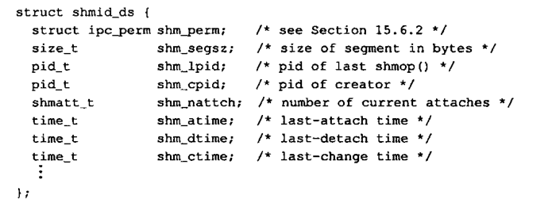
      - shmget 函数用于获得一个共享存储标识符 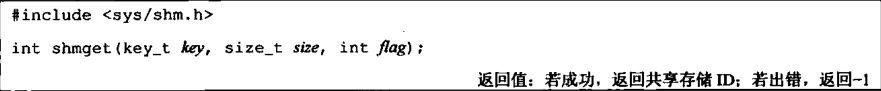
        - 如果正在引用一个现存的段，则将 size 指定为 0
        - 当创建一个新段时，段内的内容初始化为 0
      - shmctl 函数用于对共享段进行多种操作 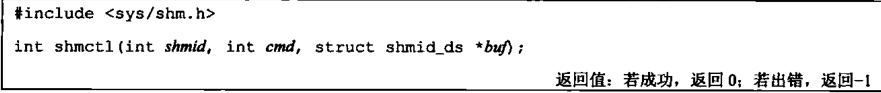
        - cmd 参数
          - IPC_STAT
          - IPC_SET
          - IPC_RMID
            - 除非使用该段的最后一个进程终止或与该段分离，否则系统实际上不会删除该存储段
            - 但是立即删除该共享段标识符，不能再用 shmat 与该段进行连接
          - SHM_LOCK
            - 在内存中对共享存储段加锁，只能由超级用户执行
          - SHM_UNLOCK
            - 只能由超级用户执行
      - shmat 用于连接共享段到调用进程的地址空间中 
        - 如果 addr = 0，则该段连接到由内核选择的第一个可用地址上
        - 如果 addr != 0，并且没有指定 SHM_RND，则此段连接到 addr 所指定的地址上
          - SHM_RND 的意思是取整
        - 如果 addr != 0，并且指定了 SHM_RND，则此段连接到 (addr - (addr mod SHMLBA)) 所表示的地址上
          - 运算结果是 2 的乘方，该公式是将该地址向下取最近 1 个 SHMLBA 的倍数
          - SHMLBA 的意思是低边界地址倍数
        - flag 参数
          - SHM_RND，如上所述
          - SHM_RDONLY，以只读的方式链接此段，否则以读写方式连接此段
      - shmdt 函数用于与共享段分离，这并不从系统删除标识符以及相关的数据结构，直到某个进程带 IPC_RMID 命令的 shmctl 特地删除它为止 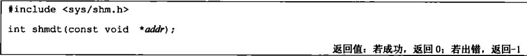
  - POSIX 信号量
    - 致力于解决 XSI 信号量的几个缺陷
      - 提供更高性能的实现
      - 接口更简单
      - 在删除时更完美。删除某个信号量时，操作能够继续正常执行，直到该信号量的最后一次引用被释放
    - sem_open 函数创建一个新的命名信号量或者使用一个现有的信号量 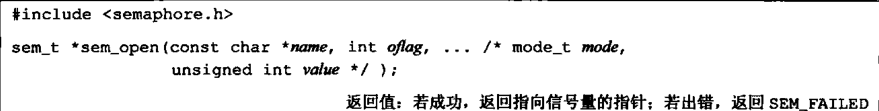
      - 当使用一个现有的命名信号量时，仅仅指定 2 个参数：信号量的名字和 oflag 参数的 0 值
      - 当 oflag 参数有 O_CREAT 标志时，如果命名信号量不存在，则创建一个新的。如果它已经存在，则会被使用，但是不会有额外的初始化发生。
        - 指定 O_CREAT 时，需要提供两个额外的参数
        - mode 参数指定谁可以访问信号量，与 open 的 mode 参数相同，会被调用者的文件屏蔽字修改
        - value 参数是信号量的初始值，取值是 0 ~ SEM_VAVLUE_MAX
      - name 参数的命名规范
        - 第一个字符应该为 `/`，目的是如果实现使用了文件系统，我们就要在名字被解释时消除二义性
        - 名字不应包含其他斜杠以此避免实现定义的行为。例如，如果文件系统被使用了，那么名字 /mysem 和 //mysem 会被认定为是同一个文件名，但是如果实现没有使用文件系统，那么这两种命名可以被认为是不同的（考虑下如果实现把名字哈希运算转换成一个用来识别信号量的整数值会发生什么）。
        - 名字应该不长于 _POSIX_NAME_MAX
    - sem_close 用来释放任何信号量相关的资源 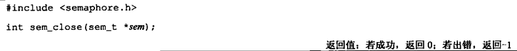
      - 如果进程终止时没有调用此函数，则内核会完成清理工作，但是不会内核不会改变信号量的值
      - 此函数不会改变信号量的值，只是用来释放资源
    - sem_unlink 用来摧毁一个命名信号量 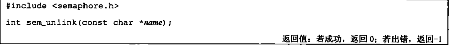
      - 销毁操作要直到最后一个打开的引用关闭
    - 使用 sem_wait 或者 sem_trywait 函数来实现信号量减一操作 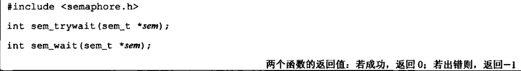
      - 或者可以使用 sem_timedwait 来等待一定的时间 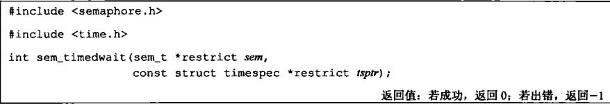
        - tsptr 指定的时间是绝对时间，基于 CLOCK_REALTIME 时钟的
    - 使用 sem_post 函数使信号量加一 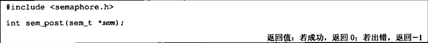
    - 匿名信号量
      - 适用于在单个进程中使用
      - sem_init 函数来创建一个匿名信号量 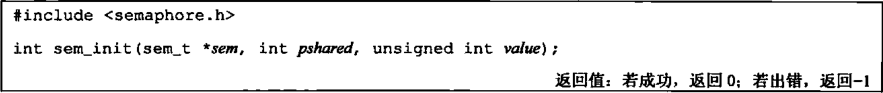
        - pshared 相当于一个布尔值，表示是否在多个进程中使用信号量
        - 需要声明一个 sem_t 类型的变量并把它的地址传递给 sem_init 来实现初始化。如果要在两个进程之间使用信号量，需要确保 sem 参数指向两个进程之间共享的内存范围
      - sem_destory 用于销毁匿名信号量 
      - sem_getvalue 用来检索信号量值 
        - 但是，在多进程情况下，可能会发生数据竞争
- 网络 IPC
  - 创建一个套接字 
    - domain 参数 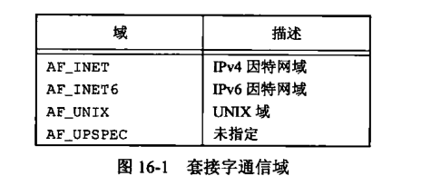
    - type 参数确定套接字的类型，进一步确定通信特征 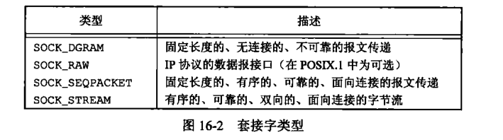
      - SOCK_STREAM 套接字提供字节流服务，所以应用程序分辨不出报文的界限。这意味着从该套接字读数据时，可能不会返回所有由发送进程所写的字节数
      - domain = AF_INET，SOCK_DGRAM 对应的默认的协议是 UDP
      - domain = AF_INET，SOCK_STREAM 对应的默认协议是 TCP
      - 使用 SOCK_RAW 套接字用于直接访问 IP 层
        - 需要超级用户特权
    - protocol 参数
      - 通常是 0，表示为给定的域和套接字类型选择默认协议。
      - 当对同一域和套接字类型支持多个协议时，可以使用 protocol 选择一个特定协议
      - 为因特网域套接字定义的协议 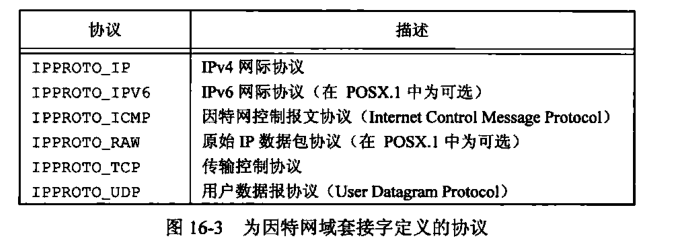
    - 大多数文件描述符函数的参数为套接字描述符时的行为 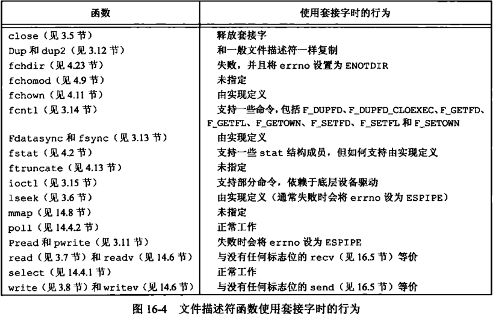
  - shutdown 函数用来禁止一个套接字的 IO 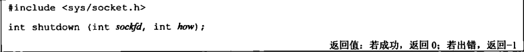
    - 套接字 IO 是双向的，故而需要 how 参数来确定关闭的是哪一端
      - SHUT_RD
      - SHUT_WR
      - SHUT_RDWR
    - 此函数的意义
      - 只有最后一个活动引用关闭时， close 函数才释放网络端点
        - 这意味着如果复制了一个套接字（dup），那么要直到关闭了最后一个引用它的文件描述符才会释放这个套接字
        - shutdown 可以使一个套接字处于不活动状态，和引用它的文件描述符数目无关
      - 可以很方便地关闭套接字双向传输中的一个方向
  - 网络地址
    - 字节序
      - TCP/IP 协议栈使用大端字节序
      - 应用程序有时需要再处理的字节序与网络字节序之间转换它们
      - 在 TCP/IP 应用程序中，有 4 个用来在处理器字节序和网络字节序之间转换的函数 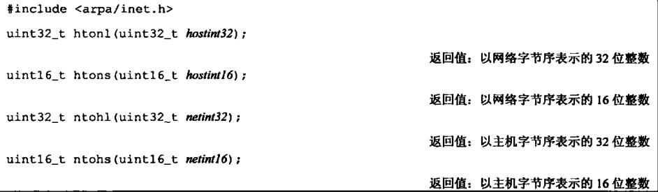
    - 地址格式
      - 地址格式与特定的通信域相关
      - 为使不同格式的地址能传入套接字函数，地址会被强制转换成一个通用的地址结构 sockaddr 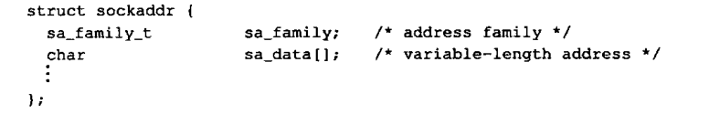
      - 因特网地址
        - 在 AF_INET（Ipv4）域中，定义在 &lt;netinet/in.h&gt; 头文件中，用 sockaddr_in 表示 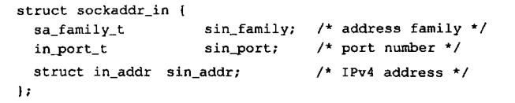
          - struct in_addr 
        - 在 AF_INET6（Ipv6）域中，用 sockaddr_in6 表示 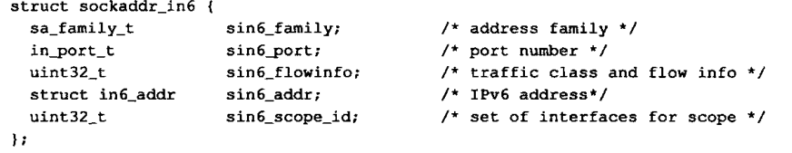
          - struct in6_addr 
    - inet_addr 和 inet_ntoa 用于二进制地址格式与人类可读的格式（点分十进制）之间的相互转换，但是仅用于 IPv4
      - inet_ntop 和 inet_pton 具有相似的功能，但同时支持 IPv4 和 IPv6 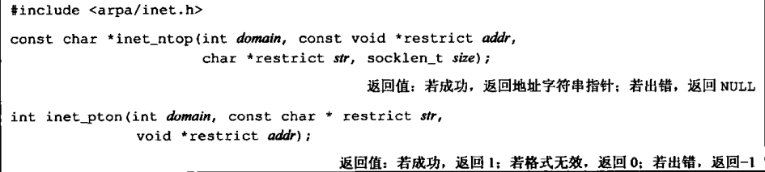
        - ntop 即 network to person
        - pton 即 person to network
    - 地址查询
      - gethostent 可以找到本地计算机系统的主机信息，并返回下一项条目（iterator） 
        - 所能获得的信息包括网络配置信息（/etc/hosts 和 /etc/hostname 等）
        - 如果本机的主机数据库文件没有打开，则 gethostent 会打开它
        - struct hostent 结构体 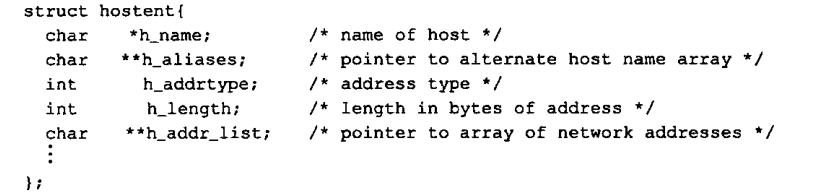
          - 返回的地址采用网络字节序
      - sethostent 
        - sethostent 会打开文件，如果文件已经打开，那么将其 rewind，即设置为第一项
        - 当 stayopen 设置为非 0 值时，调用 gethostent 之后，文件将依然是打开的
      - endhostent 
        - 关闭文件
      - 获得网络名字和网络编号 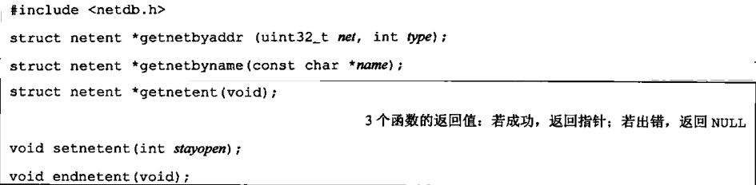
        - netent 结构至少包含以下字段： 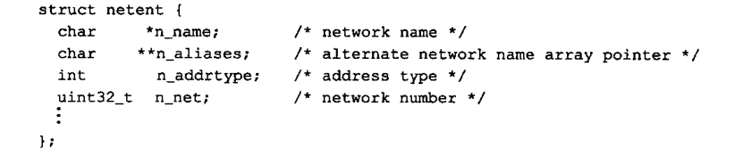
        - 地址类型是地址族常量之一（如 AF_INET）
      - 上列函数可以在协议名字和协议编号之间进行映射 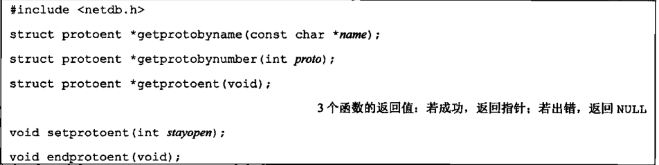
        - protoent 结构至少包含： 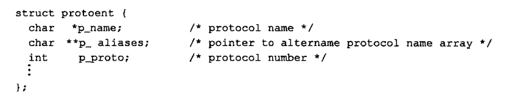
      - 每一个服务由一个端口号来表示，可以使用函数 getservbyname 将一个服务名映射到一个端口号，getservbyport 将一个端口号映射到一个服务名 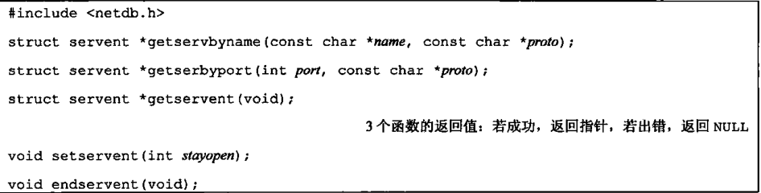
        - servent 结构至少包含： 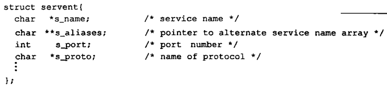
      - 将一个主机名和一个服务名映射到一个地址（getaddrinfo） 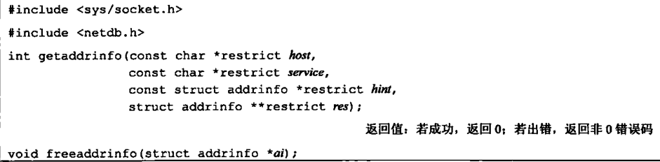
        - 主机名可以是一个节点名或点分格式的主机地址
        - getaddrinfo 函数返回一个链表结构的 addrinfo，可以用 freeaddrinfo 来释放一个或多个这样这种结构（取决于用 ai_next 字段连接起来的结构有多少）
        - addrinfo 结构体至少包含： 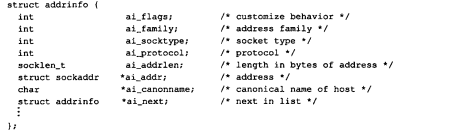
        - hint 是一个过滤地址的模版，包括 ai_family、ai_flags、ai_protocol 和 ai_socktype 字段
          - ai_flags 字段中的标志 
        - 如果 getaddrinfo 失败，则不能使用 perror 或 strerror 来生成错误消息，而是要调用 gai_strerror 将错误码转换成错误消息 
      - 将 一个地址转换成一个主机名和一个服务名 
        - addr 参数被翻译成一个主机名和一个服务名
        - 如果 host 非空，则指向一个长度为 hostlen 字节的缓冲区用于存放返回的主机名
        - 同理，如果 service 非空......
        - flags 参数提供了一些控制翻译的方式 
    - bind 函数将套接字与地址关联 
      - 在进程正在运行的计算上，指定的地址必须有效，不能指定一个其他机器的地址
      - 地址必须和创建套接字时的地址族所支持的格式项匹配
      - 地址中的端口号必须补小于 1024，除非该进程是超级用户进程
      - 一般只能将一个套接字端点绑定到一个给定的地址上，但是有些协议允许多重绑定
      - 对于因特网域，如果指定 IP 地址为 INADDR_ANY（netinet/in.h）套接字可以被绑定到所有的系统网络接口上
        - 这意味着可以接受这个系统所安装的任何一个网卡的数据包
    - 可以调用 getsockname 函数来发现绑定到套接字上的地址 
      - lenp 为一个指向整数的指针，用于指定 sockaddr 的长度，返回时，会被设置为返回地址的大小
      - 如果地址和提供的缓冲区长度不匹配，地址会自动截断而不报错
      - 如果当前地址没绑定到该套接字，那么结果是未定义的
    - 如果套接字已经和对等方连接，可以调用 getpeername 函数来找到对方的地址 
  - 建立连接，connect 函数 
    - 如果处理一个面向连接的网络服务（SOCK_STREAM 或 SOCK_SEQPACKET），那么在交换数据以前，需要再请求服务的进程套接字（客户端）和提供服务的进程套接字（服务器）之间使用 connect 建立连接
    - addr 参数是想要通信的地址
    - 如果 sockfd 没有绑定到一个地址， connect 会给调用者绑定一个默认地址
    - 如果处理一个无连接的网络服务（SOCK_DGRAM），传动的报文的目的地址会设置成 connect 调用中所指定的地址，这样每次传送报文时就不需要在提供地址。同时，也仅能接受来自指定地址的报文
  - listen 函数用来表示愿意接受连接请求 
    - backlog 向内核提示进程所要入队的未完成连接的请求数量，实际值由系统决定，上限是 &lt;sys/socket.h&gt; 中的 SOMAXCONN
      - 即一个 socket 同时最多有多少个处于等待中的连接
      - Linux 上是 4096
  - 调用了 listen 以后，所用的套接字就能接收连接请求，使用 accept 函数获得连接请求并建立连接 
    - accept 所返回的套接字描述符连接到调用 connect 的客户端，这个新的套接字描述符和原始套接字具有相同的套接字类型和地址族。传给 accept 的原始套接字没有关联到这个连接，而是继续保持可用状态并接受其他连接请求
    - addr 和 len 可以为 NULL，表示不关心客户端标识
    - 如果没有连接请求在等待， accept 会阻塞知道一个请求到来。如果 sockfd 处于非阻塞模式，则 accept 会返回 -1，并将 errno 设置为 EAGAIN 或 EWOULDBLOCK
    - 可以说会使用 poll， select， epoll 等待一个请求的到来，在这种情况下，一个等待连接请求的套接字会以可读的方式出现
  - 专用的数据传输函数
    - write 和 read 等函数也可以用于写入或读取套接字描述符，但是，要指定选项或者发送带外数据，就得用专用的函数
    - send 
      - 类似于 write
      - flags 参数 
      - 对于支持报文边界的协议，如果尝试发送的单个报文的长度超过协议所支持的最大长度，那么 send 会失败，并将 errno 设为 EMSGSIZE
    - sendmsg 用于从多个缓冲区中获取数据并传输，和 writev 类似 
      - msghdr 结构体至少含有： 
        - msg_control 字段指向 cmsghdr（控制信息头） 
          - 用于访问控制数据的宏 
        - msg_controllen 字段包含控制信息的字节数
    - recv 和 read 相似，但是可以指定标志来控制如何接收数据 
      - flags 
      - 如果发送者已经调用 shutdown 来结束传输，或者网络协议支持按默认的顺序关闭并且发送已经关闭，那么当所有的数据接收完毕后，recv 会返回 0
    - recvfrom 可以得到数据发送者的源地址 
      - 如果 addr 非空，它将包含数据发送者的套接字端点地址。如果非空，addrlen 返回之后将会设置为实际字节长度
      - 通常用于无连接的套接字
    - recvmsg 可以将接受到的数据写入多个缓冲区，类似与 readv 
      - flags 参数 
  - 套接字选项
    - 有一个接口用来设置选项，另一个接口用来查询选项的状态
    - 有 3 种类型的选项
      - 通用选项，工作在所有套接字类型上
      - 在套接字层次管理的选项，但是依赖于下层协议的支持
      - 特定于某协议的选项
    - 使用 setsockopt 函数来设置套接字选项 
      - level 用于标识选项应用的协议
        - SOL_SOCKET 代表是通用的套接字层次选项；否则，level 设置成控制这个选项的协议编号，例如对于 TCP 选项，level 是 IPPROTO_TCP，对于 IP，level 是 IPPROTO_IP
      - 通用套接字层次选项 
      - 参数 len 指定了 val 指向的对象的大小
    - 使用 getsockopt 函数来查看选项的当前值 
      - lenp 是一个指向整数的指针，在调用 getsockopt 之前，设置该整数为复制选项缓冲区的长度，如果选项的实际长度大于此值，则选项会被截断，如果小于此值，则返回时更新为实际长度
  - 带外数据（out of band data）
    - 是一些通信协议所支持的可选功能（例如 TCP），与普通数据相比，允许更高优先级的数据传输，带外数据先行传输，即使传输队列已经有数据
    - TCP 将带外数据称为紧急数据（urgent data），且仅支持一个字节的紧急数据，但是允许紧急数据在普通数据传递机制数据流之外传输
    - 为了发送带外数据，可以在 3 个 send 函数中的任意一个里指定 MSG_OOB 标志，如果带外数据超过一个字节（对于 TCP），则将最后一个字节视为紧急数据字节
    - 如果通过套接字安排了信号的产生，那么紧急数据被接收时，会发送 SIGURG 信号
      - 可以通过 fcntl 来设置 fd 的 owner，用来设置接受套接字信号的进程
    - TCP 支持紧急标记（urgent mark）的概念，即在普通数据中紧急数据所在的位置（如果采用 SO_OOBINLINE 套接字选项，那么可以在普通数据中接收紧急数据），为帮助判断紧急是否已经到达，可以使用函数 sockatmark 
      - 当下一个要读取的字节在紧急标记处时， sockatmark 返回 1
      - 当带外数据出现在套接字的读取队列时，select 函数会返回一个文件描述符并且有一个待处理的异常条件
    - 可以在普通数据流上接收紧急数据，也可以在其中一个recV函数中采用MSG_OOB标志在其他队列数据之前接收紧急数据。TCP队列仅用一个字节的紧急数据。如果在接收当前的紧急数据字节之前又有新的紧急数据到来，那么已有的字节会被 丢弃。
  - 套接字的异步 IO
    - 套接字有一套自己的异步 IO，没有被标准化
    - 当从套接字中读取数据时或者当从套接字写队列中空间变得可用时，可以安排要发送的信号 SIGIO
    - 启用异步 IO
      - 1\. 建立套接字的所有权，这样信号就可以被传递到合适的进程
        - 
      - 2\. 通知套接字当 IO 操作不会阻塞时发信号
        - 
- 高级 IPC
  - UNIX 域套接字（AF_UNIX）
    - 用于同一台计算机上运行的进程之间的通信
    - 相比于因特网域套接字，效率更高。因为 UNIX 域套接字仅仅复制数据，并不执行协议处理
    - UNIX 域数据报服务是可靠的，既不会丢失报文也不会出错
    - socketpair 函数用来创建一对无名的、相互连接的 UNIX 域套接字 
      - 一对相互连接的 UNIX 域套接字可以起到全双工管道的作用：两端对对读和写开放，将其称为 fd 管道 
      - 虽然接口比较通用，但是操作系统一般只支持 UNIX domain（AF_UNIX），type = SOCK_STREAM
    - 命名 UNIX 域套接字
      - 即使用普通的网络 IPC 接口，并通过 bind 函数来“命名”这个套接字
      - UNIX 域套接字的地址由 sockaddr_un 结构表示，在 &lt;sys/un.h&gt; 中定义 
        - 当将一个地址绑定到一个 UNIX 域套接字时，系统会用该路径名创建一个 S_IFSOCK 类型的文件
        - 该文件仅用于告知客户端进程套接字的名字，不能打
        - 如果尝试绑定同一地址，此时文件已存在，bind 请求会失败
        - 当关闭套接字时，并不会自动删除该文件。故而必须确保在应用程序退出前，对该文件只想解除链接操作
      - 例如： 
```
