```markmap
---
markmap:
  initialExpandLevel: 2
  spacingVertical: 30
  spacingHorizontal: 180
---

# JVM
- 自动内存管理
  - 运行时数据区域
    - Java 虚拟机在执行 Java 程序的过程中会把它所管理的内存划分为若干个不同的数据区域
    - 这些区域有各自的用途，以及创建和销毁的时间，有的区域随着虚拟机进程的启动而一直存在，有些区域则是依赖用户线程的启动和结束而建立和销毁
    - Java 虚拟机规范所规定的数据区域 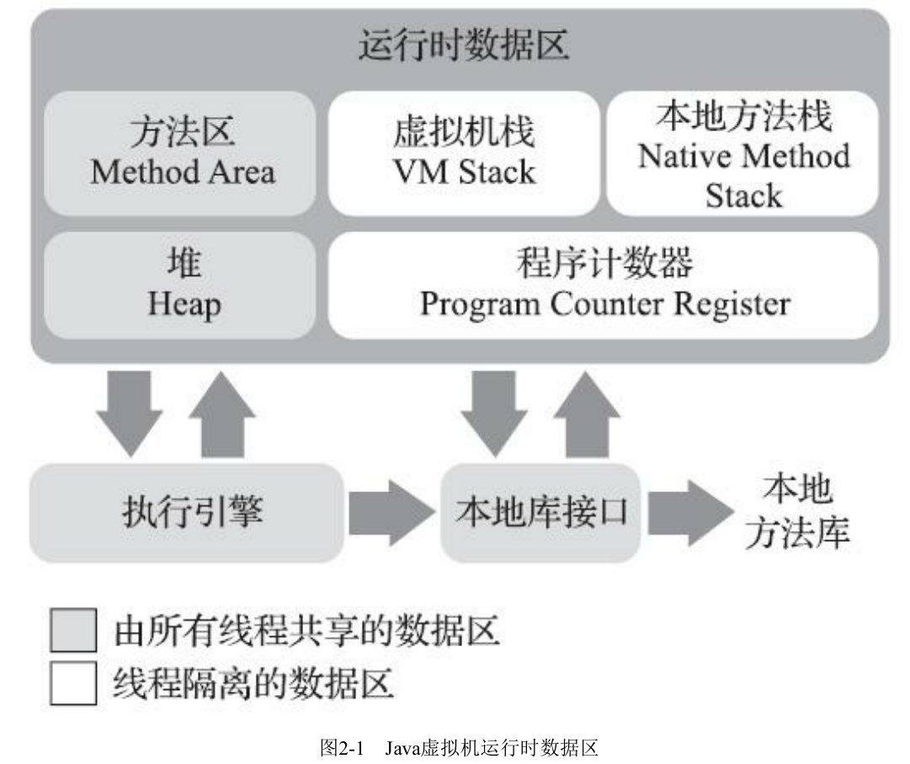
      - 程序计数器
        - 记录的是当前正在执行的虚拟机字节码指令的地址
        - 如果执行的是本地（Native）方法，则这个计数器的值应该为空（Undefined）
      - 虚拟机栈
        - 每个方法被执行时，都会创建一个栈帧，用于存储局部变量表、操作数栈、动态连接、方法出口等信息
          - 局部变量表存放了编译期可知的各种Java虚拟机基本数据类型（boolean、byte、char、short、int、float、long、double）、对象引用和 returnAddress 类型（指向了一条字节码指令的地址）
            - 这些数据类型在局部变量表中的存储空间以局部变量槽（Slot）来表示，其中64位长度的long和double类型的数据会占用两个变量槽，其余的数据类型只占用一个
            - 局部变量表所需的内存空间在编译期间完成分配
              - 当进入一个方法时，这个方法需要在栈帧中分配多大的局部变量空间是完全确定的，在方法运行期间不会改变局部变量表的大小
              - 这里说的“大小”是指变量槽的数量，虚拟机真正使用多大的内存空间（譬如按照1个变量槽占用32个比特、64个比特，或者更多）来实现一个变量槽，这是完全由具体的虚拟机实现自行决定的事情
        - 每一个方法被调用直至执行完毕的过程，就对应着一个栈帧在虚拟机栈中从入栈到出栈的过程
        - 异常
          - 如果线程请求的栈深度大于虚拟机所允许的深度，将抛出StackOverflowError异常
          - 如果Java虚拟机栈容量可以动态扩展，当栈扩展时无法申请到足够的内存会抛出OutOfMemoryError异常
      - 本地方法栈
        - 与虚拟机栈相似，区别是： 虚拟机为虚拟机执行 Java 方法服务，而本地方法则是为虚拟机使用到的本地（Native）方法服务
        - -Xoss 参数用于设置此栈的大小
          - 对于 HotSpot，虽然存在此选项，但是没有任何作用
      - 堆（Java 堆）
        - 所有线程共享，在 VM 启动时创建
        - 主要用来存放对象实例
        - 是 GC 管理的内存区域
        - 可以通过 -Xmx 和 Xms 来指定这部分区域的大小
      - 方法区
        - 用于存储已被虚拟机加载的类型信息、常量、静态变量、即时编译器编译后的代码缓存等数据
        - 运行时常量池是方法区的一部分
          - Class 文件中除了有类的版本、字段、方法、接口等描述信息外，还有就是常量池表，用于存放编译器生成的各种字面量与符号引用，这部分内容将在类加载后存放到方法区的运行时常量池中
          - 运行期间，也可以将新的常量放入池中，例如 String.intern() 方法就是用了这种特性
        - 在 JDK 8 之前，对这个空间使用永久代（PermGen）来管理这个空间（实现 GC），JDK 8 之后，使用元空间（meta space）来管理
        - 元空间的相关参数
          - -XX：MaxMetaspaceSize：设置元空间最大值，默认是-1，即不限制，或者说只受限于本地内存大小
          - -XX：MetaspaceSize：指定元空间的初始空间大小，以字节为单位，达到该值就会触发 GC 进行类型卸载，同时收集器会对该值进行调整: - 如果释放了大量的空间，就适当降低该值； - 如果释放了很少的空间，那么在不超过-XX：MaxMetaspaceSize（如果设置了的话）的情况下，适当提高该值
          - -XX：MinMetaspaceFreeRatio：作用是在垃圾收集之后控制最小的元空间剩余容量的百分比，可减少因为元空间不足导致的垃圾收集的频率
          - -XX：Max-MetaspaceFreeRatio，用于控制最大的元空间剩余容量的百分比
        - 在 JDK 8 以后，就完全使用本地内存来实现方法区
    - 直接内存区域
      - 在JDK 1.4中新加入了NIO（New Input/Output）类，引入了一种基于通道（Channel）与缓冲区（Buffer）的I/O方式
        - 它可以使用Native函数库直接分配堆外内存，然后通过一个存储在Java堆里面的DirectByteBuffer对象作为这块内存的引用进行操作。这样能在一些场景中显著提高性能，因为避免了在Java堆和Native堆中来回复制数据
      - 可通过 -XX: MaxDirectMemorySize 参数来指定，如果不指定，则与 Java 堆最大值（-Xmx）一致
  - HotSpot VM 中 Java 堆中对象的创建
    - 1\. VM 遇到一条 new 指令，检查这个指令的参数是否能在常量池中定位到一个类的符号引用，并且检查这个符号引用代表的类是否已被加载、解析和初始化过。如果没有，那必须先执行相应的类加载过程。
    - 2\. 为新对象分配内存
      - 对象所需的内存的大小在类加载完成后就可以完全确定
      - 2.1 在 Java 堆中分配指定大小的内存用于存储新对象
        - 内存分配方法
          - 假设Java堆中内存是绝对规整的，所有被使用过的内存都被放在一边，空闲的内存被放在另一边，中间放着一个指针作为分界点的指示器，那所分配内存就仅仅是把那个指针向空闲空间方向挪动一段与对象大小相等的距离，这种分配方式称为“指针碰撞”（Bump The Pointer）
          - 如果Java堆中的内存并不是规整的，虚拟机就必须维护一个列表，记录上哪些内存块是可用的，在分配的时候从列表中找到一块足够大的空间划分给对象实例，并更新列表上的记录，这种分配方式称为“空闲列表”（Free List）
        - 虚拟机在分配内存时，考虑到多线程同时创建对象，需要进行同步操作
          - 两种方案
            - （CAS + 失败重试）保证更新操作的原子性
            - 把内存分配的动作按照线程划分在不同的空间之中进行，即每个线程在Java堆中预先分配一小块内存，称为本地线程分配缓冲（Thread Local Allocation Buffer，TLAB），哪个线程要分配内存，就在哪个线程的本地缓冲区中分配，只有本地缓冲区用完了，分配新的缓存区时才需要同步锁定
              - 虚拟机是否使用TLAB，可以通过-XX：+/-UseTLAB参数来设定
    - 3\. 将分配到的内存空间（不包括对象头）都初始化为 0
      - 如果使用了 TLAB，则此操作可以提前至内存分配时进行
    - 4\. 对对象进行必要的设置
      - 例如这个对象是哪个类的实例、如何才能找到 类的元数据信息、对象的哈希码（实际上对象的哈希码会延后到真正调用Object::hashCode()方法时才计算）、对象的GC分代年龄等信息
      - 这些信息存放在对象的对象头（Object Header）之中。根据虚拟机当前运行状态的不同，如是否启用偏向锁等，对象头会有不同的设置方式
    - 5\. 执行构造函数
      - 构造函数，即 Class 文件中的 &lt;init&gt;() 方法
  - 对象的内存布局（HotSpot VM）
    - 对象头（header）
      - 对象自身的运行数据（Mark Word）
        > 这部分数据的长度在32位和64位的虚拟机（未开启压缩指针）中分别为32个比特和64个比特，官方称它为“Mark Word”
        - 哈希码
        - GC 分代年龄
        - 锁状态标志
        - 线程持有的锁
        - 偏向线程 ID
        - 偏向时间戳
        - ...
        - Mark Word被设计成一个有着动态定义的数据结构，以便在极小的空间内存储尽量多的数据，根据对象的状态复用自己的存储空间
          - 例如在32位的HotSpot虚拟机中，如对象未被同步锁锁定的状态下，Mark Word的32个比特存储空间中的25个比特用于存储对象哈希码，4个比特用于存储对象分代年龄，2个比特用于存储锁标志位，1个比特固定为0，在其他状态（轻量级锁定、重量级锁定、GC标记、可偏向）下对象的存储内容如表2-1所示: 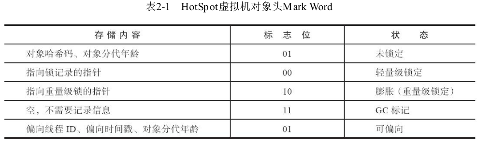
      - 类型指针
        - 即对象指向它的类型元数据的指针
        - 通过这个指针来确定对象是哪个类的实例
        - 如果对象是一个Java数组，那在对象头中还必须有一块用于记录数组长度的数据，因为虚拟机可以通过普通Java对象的元数据信息确定Java对象的大小，但是如果数组的长度是不确定的，将无法通过元数据中的信息推断出数组的大小
    - 实例数据（instance data）
      - 字段的存储顺序会受到虚拟机分配策略参数 -XX: FieldsAllocationStyle 参数和源码中定义顺序的影响
      - HotSpot 的默认分配顺序：longs/doubles、ints、shorts/chars、bytes/booleans、oops（Ordinary Object Pointers，OOPs）
      - 从上述中的默认的分配策略中可以看到，相同宽度的字段总是被分配到一起存放，在满足这个前提条件的情况下，在父类中定义的变量会出现在子类之前
        - 如果HotSpot虚拟机的 +XX：CompactFields参数值为true（默认就为true），那子类之中较窄的变量也允许插入父类变量的空隙之中，以节省出一点点空间
    - 对齐填充（padding）
      - HotSpot虚拟机的自动内存管理系统要求对象起始地址必须是8字节的整数倍，换句话说就是任何对象的大小都必须是8字节的整数倍
  - 对象的定位（访问）
    - Java 程序会通过虚拟机栈中局部变量表中的 reference 类型的数据来操作栈上的具体的对象
    - 通过 reference 访问对象有两种方式
      - 使用句柄访问
        - Java堆中将可能会划分出一块内存来作为句柄池，reference中存储的就是对象的句柄地址，而句柄中包含了对象实例数据与类型数据各自具体的地址信息 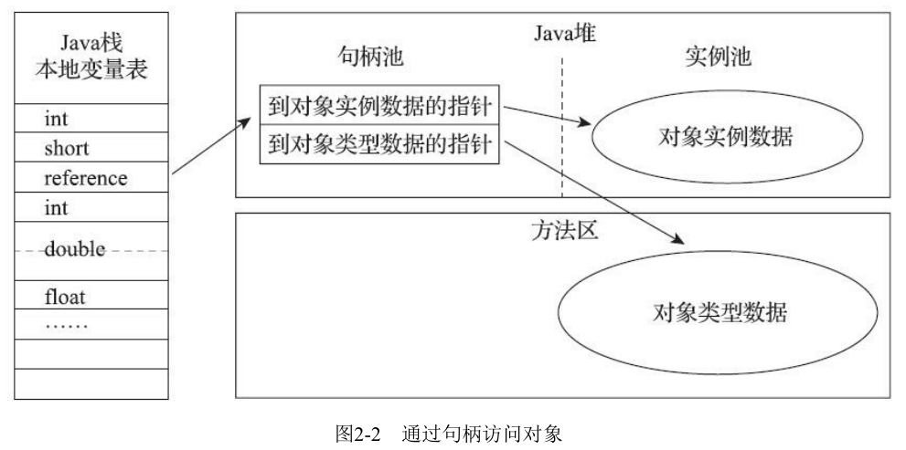
      - 使用直接指针访问
        - 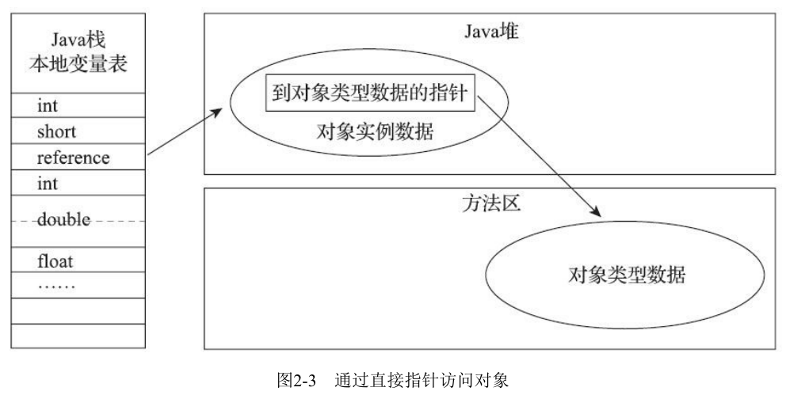
        - 使用直接指针来访问最大的好处就是速度更快，它节省了一次指针定位的时间开销，由于对象访问在Java中非常频繁，因此这类开销积少成多也是一项极为可观的执行成本
- GC 与内存分配策略
  - GC
    - GC 管理的内存区域是 Java 堆和方法区
    - 判断对象是否死亡
      - 引用计数算法
        - 在对象中添加一个引用计数器，每当有一个地方 引用它时，计数器值就加一；当引用失效时，计数器值就减一；任何时刻计数器为零的对象就是不可能再被使用的
        - 主流的Java虚拟机里面都没有选用引用计数算法来管理内存，主要原因是，这个看似简单的算法有很多例外情况要考虑，必须要配合大量额外处理才能保证正确地工作，譬如单纯的引用计数就很难解决对象之间相互循环引用的问题
      - 可达性分析算法
        - 通过一系列称为 GC Roots 的根对象作为起始节点集，从这些节点开始，根据引用关系向下搜索，搜索过程所走过的路径称为引用链（Reference Chain），如果某个对象到 GC Roots 之间没有任何引用链相连，则说明此对象是不可能再被使用的，并不等同于此对象会被立刻垃圾回收
        - 图解 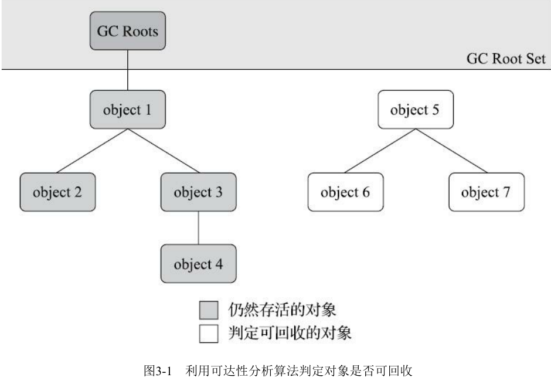
        - Java 中，固定可作为 GC Roots 的对象包括
          - 在虚拟机栈（栈帧中的本地变量表）中引用的对象，譬如各个线程被调用的方法堆栈中使用到的 参数、局部变量、临时变量等
          - 在方法区中类静态属性引用的对象，譬如Java类的引用类型静态变量
          - 在方法区中常量引用的对象，譬如字符串常量池（String Table）里的引用
          - 在本地方法栈中JNI（即通常所说的Native方法）引用的对象
          - Java虚拟机内部的引用，如基本数据类型对应的Class对象，一些常驻的异常对象（比如 NullPointExcepiton、OutOfMemoryError）等，还有系统类加载器
          - 所有被同步锁（synchronized关键字）持有的对象
          - 反映Java虚拟机内部情况的JMXBean、JVMTI中注册的回调、本地代码缓存等
        - 对象死亡的过程
          - 1\. 如果对象在进行可达性分析后发现没有与 GC Roots 相连接的引用链，那么它将会被第一标记
          - 2\. 如果被第一次标记过的对象覆盖过 finalize() 方法并且 finalize() 方法没有被虚拟机调用过，那么该对象会被放置在一个名为 F-Queue 的队列之中
            - 保证了 finalize() 方法只会调用一次，所以，当一个对象第二次面临被回收时，肯定会被回收
          - 3\. 一个虚拟机自动建立的、低调度优先级的 Finalizer 线程会执行 F-Queue 中对象的 finalize() 方法
            - 执行指的是，虚拟机会触发这个方法运行，但并不保证一定会等待它运行结束
            - 如果某个对象的finalize()方法执行缓慢，或者更极端地发生了死循环，将很可能导致F-Queue队列中的其他对象永久处于等待，甚至导致整个内存回收子系统的崩溃
          - 4\. GC 会清理 F-Queue 中的对象进行第二次小规模的标记，如果对象的 finalize() 方法没有与其他任何一个对象建立关联，则对象此时算是真正的死亡，会被回收
    - 引用
      - 强引用
        - 普遍存在的引用赋值，例如： Object obj = new Object()
        - 只要强引用还存在，GC 就不会回收掉被引用的对象
      - 软引用
        - 用来描述一些还有用，但非必须的对象
        - 只被软引用关联着的对象，在系统将要发生内 存溢出异常前，会把这些对象列进回收范围之中进行第二次回收，如果这次回收还没有足够的内存，才会抛出内存溢出异常
      - 弱引用
        - 也是用来描述那些非必须的对象，但是它的强度比弱引用更弱一些
      - 虚引用（幽灵/幻影引用）
        - 最弱的一种引用关系，一个对象是否有虚引用的存在，完全不会对其生存时间构成影响，也无法通过虚引用来获得一个对象实例
        - 虚引用的唯一目的是能在这个对象被垃圾回收时收到一个系统通知
    - 方法区的垃圾回收
      - 对方法区进行垃圾回收收益比较低
      - 对方法区进行垃圾回收，主要是
        - 废弃的常量
          - 废弃的常量包括：字符串字面量，类（接口）、方法、字段的符号引用
          - 对废弃常量的回收也适合对对象的回收一样
        - 不再使用的类
          - 如何判定一个类型是否是不再被使用的类？
            - 该类的所有实例都已经被回收，也就是 Java 对中不存在该类以及任何派生子类的实例
            - 加载该类的类加载器已经被回收，这个条件除非是经过精心设计的可替换类加载器的场景，如 OSGi、JSP的重加载等，否则通常是很难达成的
            - 该类对应的java.lang.Class对象没有在任何地方被引用，无法在任何地方通过反射访问该类的方法
          - VM 允许对不再使用的类进行回收，而不是一定要回收
            - 关于是否要对类型进行回收，HotSpot虚拟机提供了-Xnoclassgc参数进行控制，还可以使用-verbose：class以及-XX：+TraceClass-Loading、-XX： +TraceClassUnLoading查看类加载和卸载信息，其中-verbose：class和-XX：+TraceClassLoading可以在Product版的虚拟机中使用，-XX：+TraceClassUnLoading参数需要FastDebug版
          - 在大量使用反射、动态代理、CGLib等字节码框架，动态生成JSP以及OSGi这类频繁自定义类加载器的场景中，通常都需要Java虚拟机具备类型卸载的能力，以保证不会对方法区造成过大的内存压力
    - 垃圾收集算法（追踪式垃圾收集）
      - 分代收集理论
        - 分代假说
          - 弱分代假说：绝大多数对象都是朝生夕灭
          - 强分代假说：熬过越多次垃圾收集过程的对象就越难以消亡
          - 上述两个假说导致了多款常用的 GC 的设计原则
            - 收集器应该将Java堆划分出不同的区域，然后将回收对象依据其年龄（年龄即对象熬过垃圾收集过程的次数）分配到不同的区域之中存储
              - 如果一个区域中大多数对象都是朝生夕灭（将这个区域称为新生代区域），难以熬过垃圾收集过程的话，那么把它们集中放在一起，每次回收时只关注如何保留少量存活而不是去标记那些大量将要被回收的对象，就能以较低代价回收到大量的空间
              - 如果剩下的都是难以消亡的对象（将这个区域称为老年代区域），那把它们集中放在一块，虚拟机便可以使用较低的频率来回收这个区域，这就同时兼顾了垃圾收集的时间开销和内存的空间有效利用
          - 跨代引用假说：跨代引用相对于同代引用来说仅占极少数
            - 当 GC 将内存区域划分出不同的区域中，当回收新生代中的对象时，其中的对象完全有可能被老年代引用，这时候，为了保证正确性，不得不额外遍历老年代中的所有对象来确保可达性分析结果的正确性
              - 在新生代上建立一个全局的数据结构（该结构被称为记忆集，Remembered Set），这个结构把老年代划分成若干小块，标识出老年代的哪一块内存会存在跨代引用。此后当发生Minor GC时，只有包含了跨代引用的小块内存里的对象才会被加入到GC Roots进行扫描。虽然这种方法需要在对象改变引用关系（如将自己或者某个属性值）时维护记录数据的正确性，会增加一些运行时的开销，但比起收集时扫描整个老年代来说仍然是划算的
            - 这其实是可根据前两条假说逻辑推理得出的隐含推论：存在互相引用关系的两个对象，是应该倾 向于同时生存或者同时消亡的。举个例子，如果某个新生代对象存在跨代引用，由于老年代对象难以消亡，该引用会使得新生代对象在收集时同样得以存活，进而在年龄增长之后晋升到老年代中，这时跨代引用也随即被消除了
        - GC 的类型
          - 部分收集（Partial GC）：目标不是完整收集整个 Java 对的 GC
            - 新生代收集（Minor GC）：目标只是新生代
            - 老年代收集（Major GC）：目标只是老年代
            - 混合收集（Mixed GC）：目标是整个新生代和部分老年代
          - 整堆收集（Full GC）
      - 标记-清除（Mark-Sweep）算法
        - 最基础的 GC 算法
        - 首先标记出所有需要回收的对象，在标记完成后，统一回收掉所有被标记的对象，也可以反过来，标记存活的对象，统一回收所有未被标记的对象。标记过程就是对象是否属于垃圾的判定过程
        - 缺点
          - 执行效率不稳定
            - 如果Java堆中包含大量对象，而且其中大部分是需要被回收的，这时必须进行大量标记和清除的动作，导致标记和清除两个过程的执行效率都随对象数量增长而降低
          - 内存空间碎片化
            - 标记、清除之后会产生大量不连续的内存碎片，空间碎片太多可能会导致当以后在程序运行过程中需要分配较大对象时无法找到足够的连续内存而不得不提前触发另一次垃圾收集动作
      - 标记-复制算法（复制算法）
        - 为了解决标记清除算法执行效率低的问题
        - 将可用内存按容量划分为大小相等的两块，每次只使用其中的一块。当这一块的内存用完了，就将还存活着的对象复制到另外一块上面，然后再把已使用过的内存空间一次清理掉 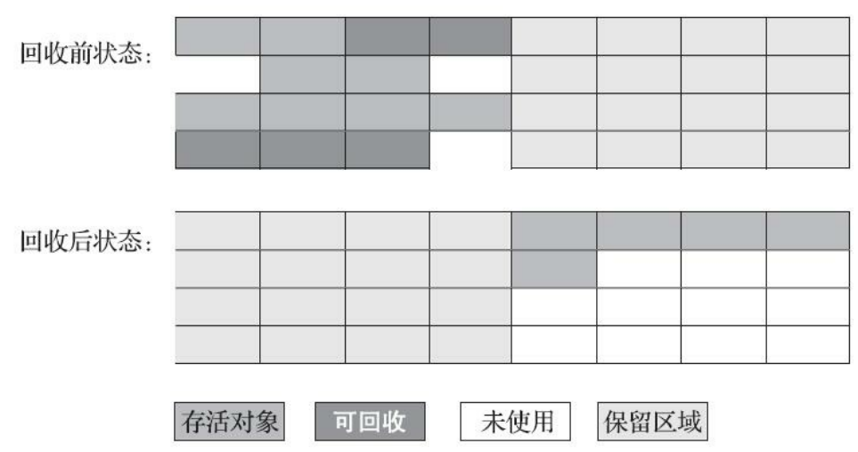
        - 缺点：可用空间少了一半
        - 现在商用的 JVM 大多都采用了这种收集算法，但是，没有 1:1 去划分空间
          - 新生代分配一块较大的 Eden 空间和两块较小的 Survivor 空间，每次分配内存只使用 Eden 和其中一块 Survivor。当发生垃圾收集时，将 Eden 和 Survivor 中仍然存活的对象一次性复制到另一块 Survivor 中，直接清理掉 Eden 和已用过的那块 Survivor 空间
          - 当Survivor空间不足以容纳一次Minor GC之后存活的对象时，就需要依赖其他内存区域（实 际上大多就是老年代）进行分配担保（Handle Promotion）
          - HotSpot 虚拟机默认 Eden 和 Survivor 的大小比例是 8:1
            - 即每次新生代中可用内存空间为整个新生代容量的90%（Eden的80%加上一个Survivor的10%），只有一个Survivor空间，即10%的新生代是会被“浪费”的
      - 标记-整理算法
        - 标记-复制算法中，如果不想浪费50%的空间，就需要有额外的空间进行分配担保，以应对被使用的内存中所有对象都100%存活的极端情况，所以在老年代一般不能直接选用这种算法
        - 标记-整理算法中的标记过程与标记-清除算法一致，但是后续步骤是让所有存活的对象都向内存空间一端移动，然后直接清理掉边界以外的内存 
        - 缺点
          - 移动对象时，要 "Stop the world",会造成一定的延迟
        - 关于吞吐量和延迟之间的取舍
          - 如果跟标记-清除算法那样完全不考虑移动和整理存活对象的话，弥散于堆中的存活对象导致的 空间碎片化问题就只能依赖更为复杂的内存分配器和内存访问器来解决。譬如通过“分区空闲分配链表”来解决内存分配问题（计算机硬盘存储大文件就不要求物理连续的磁盘空间，能够在碎片化的硬盘上存储和访问就是通过硬盘分区表实现的）。内存的访问是用户程序最频繁的操作，甚至都没有之一，假如在这个环节上增加了额外的负担，势必会直接影响应用程序的吞吐量
            - 即使不移动对象会使得收集器的效率提升一些，但因内存分配和访问相比垃圾收集频率要高得多，这部分的耗时增加，总吞吐量仍然是下降的
            - 通常标记-清除算法也是需要停顿用户线程来标记、清理可回收对象的，只是停顿时间相对而言要来的短而已
          - 如果采用标记-整理算法，则会增加延迟
          - HotSpot虚拟机里面关注吞吐量的Parallel Scavenge收集器是基于标记-整理算法的，而关注延迟的CMS收集器则是基于标记-清除算法的
          - 还有一种“和稀泥式”解决方案可以不在内存分配和访问上增加太大额外负担，做法是让虚拟机平时多数时间都采用标记-清除算法，暂时容忍内存碎片的存在，直到内存空间的碎片化程度已经大到影响对象分配时，再采用标记-整理算法收集一次，以获得规整的内存空间
    - HotSpot GC 算法的实现细节（如何发起内存回收、如何加速内存回收、如何保证回收的正确性等）
      - 根节点（GC Roots）
        - 固定可以作为 GC Roots 的节点主要在全局性的引用（例如常量和静态属性）与执行的上下文（例如虚拟机栈中本地变量表）
        - 但是，如果按照上述所说的 GC Roots 全部进行可达性分析的话，性能影响太大了。而且 GC 在枚举根节点这一步时是必须暂停用户线程的
        - 当用户线程停下来之后，如果没有采取任何优化方法，可能的枚举 Roots 的方法： 遍历所有的执行上下文和全局引用的位置，然后从中找到数据类型为引用的数据
        - OopMap （Ordinary Object Pointer 地图）
          - OopMap 记录哪些位置上存在引用
          - 让 GC 枚举 Roots 时，不用完全扫描。因为此数据结构保存了偏移量上是引用
          - 一旦类加载动作完成时，HotSpot 就会把对象内什么偏移量上是什么类型的数据计算出来，这样的话，就可以确定这个对象什么位置上是引用了
          - 在即时编译中，也会在特定的位置记录下栈和寄存器里那些位置是引用
          - OopMap 会在 GC 到来之前进行生成，而不是整个程序运行期间都会生成
      - 安全点
        - 生成 OopMap 的点，“特定的位置”就是指安全点
        - 用户程序执行时，不能在任意位置上停下来就开始进行 GC，而是强制要求必须执行到安全点之后才能够暂停
        - 安全点的位置就是一个指令的位置，只是这个指令需要符合一些东西才能被选为安全点，执行到它这个地方之后就停下来
        - 安全点的选定
          - 安全点的选定发生在运行时
          - 一般是以“是否具有让程序长时间运行的特征”为标准进行选定的。如某个指令让一串指令重复执行，那么此指令就具有该特征。例如方法调用（ivoke）、循环跳转（goto 语句）、异常跳转等
        - 如何让除了 JNI 调用的线程之外的线程都运行到安全点并停止下来？
          - 抢先式中断（Preemptive Suspension）
            - 抢先式中断不需要线程的执行代码主动去配合，在垃圾收集发生时，系统首先把所有用户线程全部中断，如果发现有用户线程中断的地方不在安全点上，就恢复这条线程执行，让它一会再重新中断，直到跑到安全点上
            - 现在几乎没有虚拟机实现采用抢先式中断来暂停线程响应GC事件
          - 主动式中断（Voluntary Suspension）
            - 当垃圾收集需要中断线程的时候，不直接对线程操作，仅仅简单地设置一个标志位，各个线程执行过程时会不停地主动去轮询这个标志，一旦发现中断标志为真时就自己在最近的安全点上主动中断挂起
            - 轮询标志的地方和安全点是重合的，另外还要加上所有创建对象和其他需要在Java堆上分配内存的地方，这是为了检查是否即将要发生垃圾收集，避免没有足够内存分配新对象
            - 由于轮询操作在代码中会频繁出现，这要求它必须足够高效。HotSpot使用内存保护陷阱的方式，把轮询操作精简至只有一条汇编指令的程度
            - 例如 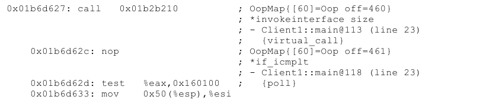
              - 当需要暂停用户线程时，虚拟机把0x160100的内存页设置为不可读，那线程执行到test指令时就会产生一个自陷异常信号，然后在预先注册的异常处理器中挂起线程实现等待，这样仅通过一条汇编指令便完成安全点轮询和触发线程中断了
      - 安全区域
        - 在程序运行的时候，会自己运行到安全点，但是如果程序没有运行的时候，那么线程就无法响应虚拟机的中断请求，此时就需要安全区域来解决此问题
        - 安全区域是指能够确保在某一段代码片段之中，引用关系不会发生变化，因此，在这个区域中任意地方开始垃圾收集都是安全的。我们也可以把安全区域看作被扩展拉伸了的安全点
        - 当用户线程执行到安全区域里面的代码时，首先会标识自己已经进入了安全区域，那样当这段时间里虚拟机要发起垃圾收集时就不必去管这些已声明自己在安全区域内的线程了
        - 当线程要离开安全区域时，它要检查虚拟机是否已经完成了根节点枚举（或者垃圾收集过程中其他需要暂停用户线程的阶段），如果完成了，那线程就当作没事发生过，继续执行；否则它就必须一直等待，直到收到可以离开安全区域的信号为止
      - 记忆集与卡表
        - 记忆集：为了解决分代收集理论的跨代引用问题而提出来的解决方案
        - 记忆集是一种用于记录从非收集区域指向收集区域的指针集合的抽象数据结构，故而只需要记录下的信息足够判断出某一块非收集区域是否有指向了收集区域的指针就可以了，故而，出现了几种不同的记录粒度
          - 字长精度：每个记录精确到了一个机器的字长，该字包含了跨代指针
          - 对象精度：每个记录精确到一个对象，该对象里有字段包含跨代指针
          - 卡精度：每个记录精确到一块内存区域，该区域内有对象含有跨代指针
        - 卡精度的记录使用一种被称为卡表的方式来去实现记忆集（记忆集只是一个抽象的概念，而卡表则是具体的实现）
          - 是目前最常用的一种记忆集实现方式
          - 在 HotSpot 中，卡表是一个字节数组 CARD_TABLE（但是其值只会是 0 和 1，之所以不用一个 bit，是因为当前计算机没有只操作一个 bit 的指令）
          - HotSpot 中，卡表的默认标记逻辑为： CARD_TABLE[ address &gt;&gt; 9 ] = 0 或 1
            - 卡表的每个元素都会对应着内存区域中特定一块大小的内存块。在 HotSpot 中，该内存块的大小为 256（1 &lt;&lt; 9）。address &gt;&gt; 9 相当于 address / 256
            - 0 表示元素所对应的内存区域没有跨代指针
            - 1 表示对应的内存块已经变脏（dirty）
          - 在 GC 时，只要筛选出卡表中变脏的元素，把对应的内存块加入 GC Roots，就可以解决跨代引用问题
      - 写屏障
        - 解决卡表元素如何维护的问题
        - 卡表元素何时变脏？在其他分代区域中的对象引用了本区域（记录集所管理的那部分区域）的对象时，其（指其他区域）对应的卡表元素就应该变脏
        - 变脏的时间点应该发生在引用类型字段赋值的那一刻，那么如何在对象赋值的那一刻去更新维护卡表呢？通过写屏障（write barrier）
        - 在对一个引用对象赋值时，会产生写前屏障和写后屏障，类似于 AOP 的 Around 通知，以执行额外的动作 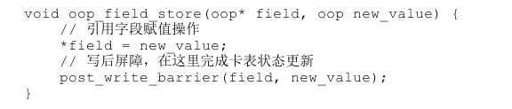
        - 应用写屏障后，虚拟机就会为所有赋值操作生成相应的指令，一旦收集器在写屏障中增加了更新卡表操作，无论更新的是不是老年代对新生代对象的引用，每次只要对引用进行更新，就会产生额外的开销，不过这个开销与Minor GC时扫描整个老年代的代价相比还是低得多的
        - 伪共享问题
          - CPU 的缓存系统以缓存行（Cache Line）为单位缓存，当多个线程修改多个不同的变量，而这些变量位于同一个缓存行中时，就会导致性能下降，称为伪共享（False Sharing）问题
          - 为了避免伪共享问题，可以先检查卡表标记，只有当卡表的标记不为预期值时，才进行更新操作，但是，这会增加额外的判断成本，故而 VM 提供了参数 -XX: +UseCondCardMark 来决定是否开启这个解决方案
      - 并发的可达性分析
        - 为什么必须在一个能保障一致性的快照上才能进行对象图的遍历（换一个说法，为什么在可达性算法的标记阶段，必须 Stop The World）？
          - 三色标记（Tri-color Marking）
            - 白色：表示对象尚未被 GC 访问过
              - 在分析结束后，如果对象还为白色，那么则表示其不可达
            - 灰色：表示对象已经被 GC 访问过，但是这个对象上至少存在一个引用没有被扫描过
            - 黑色：表示对象已经被 GC 访问过，且这个对象的所有引用都已经扫描过
              - 黑色的对象是安全存活的，如果有其他对象引用指向了黑色对象，则无需重行扫描一遍
              - 黑色对象不可能直接（不经过灰色对象）指向某个白色对象
          - 如果 GC 标记和用户线程一起运行，那么就会有可能将原本存活的对象标记为已消亡的，暂且称为对象消失问题 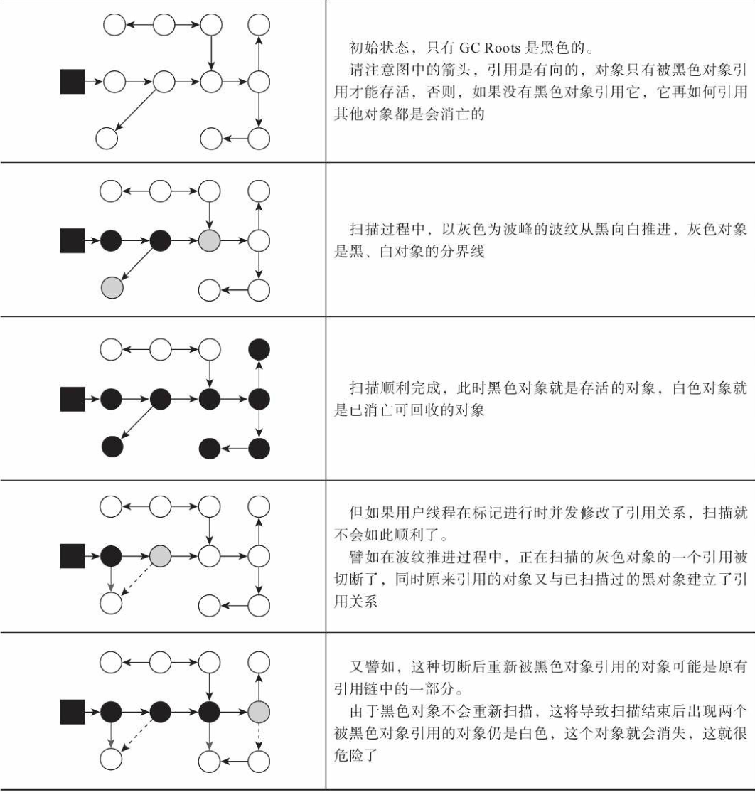
        - 如何解决对象消失问题？
          - 理论上证明：当且仅当下面这两个条件同时满足时，才会产生对象消失问题
            - 赋值器插入了一条或多条从黑色对象到白色对象的新引用
            - 赋值器删除了全部从灰色对象到该白色对象的直接或间接引用
          - 故而，只需要破坏上述两个条件中的任意一个就可以解决对象消失问题。为此，诞生了两种解决方案：
            - 增量更新（Incremental Update）
              - 破坏第一个条件
              - 当黑色对象插入新的指向白色对象的引用关系时，就将这个新插入的引用记录下来，等并发结束之后，在将这些记录过的引用关系中的黑色对象为根，重新扫描一次
              - 可以简化理解为，黑色对象一旦新插入了指向白色对象的引用之后，它就变回灰色对象了
            - 原始快照（Snapshot At The Beginning，SATB）
              - 破坏第二个条件
              - 当灰色对象要删除指向白色对象的引用关系时，就将这个要删除的引用记录下来，等并发扫描结束之后，在将这些记录过的引用关系中的灰色对象为根，重新扫描一次
              - 可以简化理解为，无论引用关系删除与否，都会按照刚刚开始扫描那一刻的对象图快照来进行搜索
            - 无论是上述的那种解决方案的哪一种，都是通过写屏障来实现的
            - CMS是基于增量更新来做并发标记的，G1、Shenandoah则是用原始快照来实现
    - GC 收集器对 GC 算法的实现
      - 经典垃圾收集器
        - 经典指的是已投入生产使用的 GC 收集器，而这些收集器相比于实验性的收集器，可能存在技术的落后
        - 垃圾收集器之间的关系。两者之间有联系表示两者之间可以配套使用（配套关系不是一成不变的） 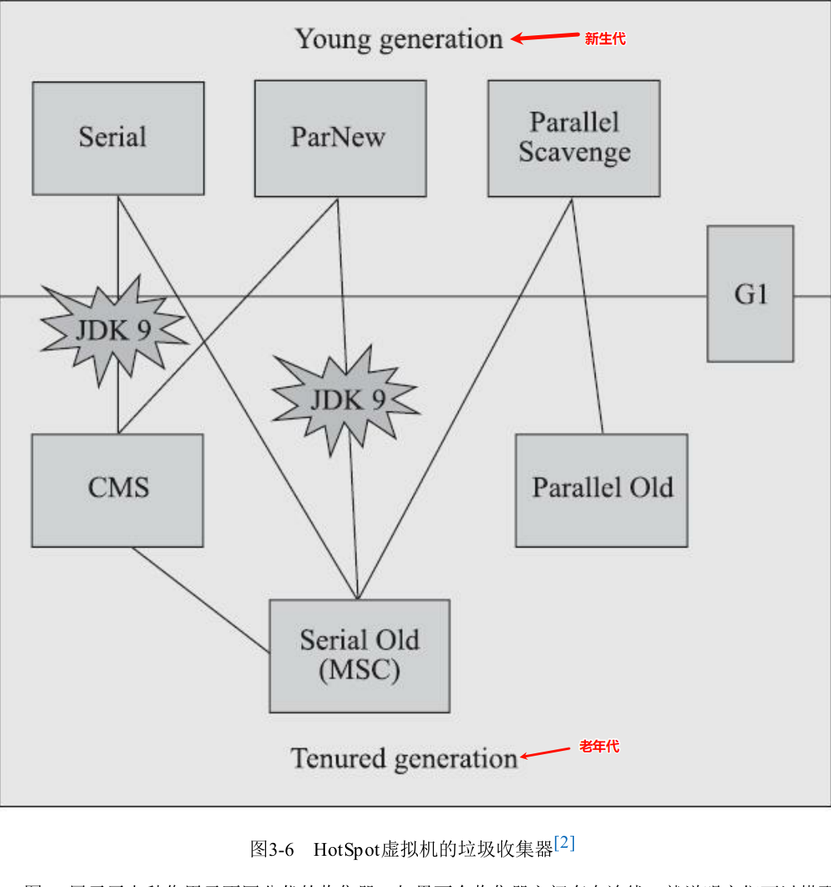
        - Serial 收集器
          - 单线程工作的收集器：在进行垃圾收集时，必须暂停其他工作线程，直至收集结束
          - 运行示意图 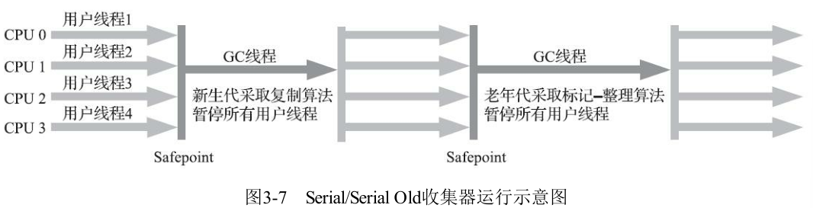
          - 事实上，其依然是 HotSpot 虚拟机运行在客户端模式下的默认新生代收集器
            - 其简单而高效（和其他收集器的单线程相比）
            - 额外内存消耗（Memory Footprint）最小
            - 获得最高的单线程收集效率：没有线程交互的开销
        - ParNew 收集器
          - Serial 收集器的多线程版本，除了同时使用多线程进行垃圾收集之外，其余的行为都与 Serial 收集器完全一致
          - 可以使用所有用于 Serail 的参数
          - 运行示意图 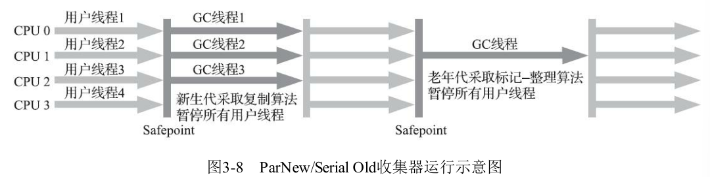
          - JDK 7 之前遗留系统中首选的新生代收集器：除了 Serial 收集器，目前只有它才能与 CMS 收集器配合工作
            - CMS 收集器是一款真正意义上支持并发的垃圾收集器，首次实现了让垃圾收集线程与用户线程（基本上）同时工作
            - ParNew收集器是激活CMS后（使用-XX：+UseConcMarkSweepGC选项）的默 认新生代收集器，也可以使用-XX：+/-UseParNewGC选项来强制指定或者禁用它
        - Parallel Scavenge 收集器
          - 基于标记-复制算法，并行（多个收集进程同时收集，但不与用户线程并发）收集
          - 目标是达到一个可控制的吞吐量（Throughput）
            - 
          - 停顿时间越短就越适合需要与用户交互或需要保证服务响应质量的程序，良好的响应速度能提升用户体验；而高吞吐量则可以最高效率地利用处理器资源，尽快完成程序的运算任务，主要适合在后台运算而不需要太多交互的分析任务
          - 提供了两个参数用于精确控制吞吐量，分别是控制最大垃圾收集停顿时间的-XX：MaxGCPauseMillis参数以及直接设置吞吐量大小的-XX：GCTimeRatio参数
          - -XX：MaxGCPauseMillis
            - 允许的值是一个大于0的毫秒数，收集器将尽力保证内存回收花费的时间不超过用户设定值
            - 垃圾收集停顿时间缩短是以牺牲吞吐量和新生代空间为代价换取的：系统把新生代调得小一些，收集300MB新生代肯定比收集500MB快，但这也直接导致垃圾收集发生得更频繁，原来10秒收集一次、每次停顿100毫秒，现在变成5秒收集一次、每次停顿70毫秒。停顿时间的确在下降，但吞吐量也降下来了
          - -XX：GCTimeRatio
            - 是垃圾收集时间占总时间的比率，相当于吞吐量的倒数
            - 把此参数设置为19，那允许的最大垃圾收集时间就占总时间的5%（即1/(1+19)）
            - 默认为 99
          - -XX：+UseAdaptiveSizePolicy
            - 当这个参数被激活之后，就不需要人工指定新生代的大小（-Xmn）、Eden与Survivor区的比例（-XX：SurvivorRatio）、晋升老年代对象大小（-XX：PretenureSizeThreshold）等细节参数了，虚拟机会根据当前系统的运行情况收集性能监控信息，动态调整这些参数以提供最合适的停顿时间或者最大的吞吐量
            - 这种调节方式被称为垃圾收集的自适应调节策略（GC Ergonomics）
        - Serial Old 收集器
          - Serail 收集器的老年代版本，同样是单线程收集器，使用标记-整理算法
          - 主要是供客户端模式下的 HotSpot 虚拟机使用
          - 在服务端模式的两种用途
            - 在 JDK 5 及之前的版本中，同 Parallel Scanvenge 收集器搭配使用
            - 作为 CMS 收集器发生失败后的后备预案。在并发收集发生 Concurrent Mode Failure 时使用
        - Parallel Old 收集器
          - 是 Parallel Scavenge 收集器的老年版本
          - 支持多线程并行收集，JDK 6 开始提供
        - CMS 收集器
          - Concurrent Mark Sweep 收集器是一种以最短回收停顿时间为目标的收集器
          - 运作过程
            - 1\. 初始标记（CMS initial mark）
              - Stop The World
              - 标记 GC Roots 能直接关联到的对象，速度很快
            - 2\. 并发标记（CMS Concurrent mark）
              - 对 GC Roots 的直接关联对象开始遍历整个对象图的过程
            - 3\. 重新标记（CMS remark）
              - Stop The World
              - 修正并发标记期间，因用户程序继续运行而导致标记产生变动的那一部分对象的标记记录
              - 停顿时间通常会比初始标记阶段增长一些，但也远比并发标记阶段的时间短
            - 4\. 并发清除（CMS Concurrent sweep）
              - 清理删除掉标记阶段判断的已经死亡的对象
              - 由于不需要移动活的对象，这个阶段也是可以与用户线程同时并发的
          - 运行示意图 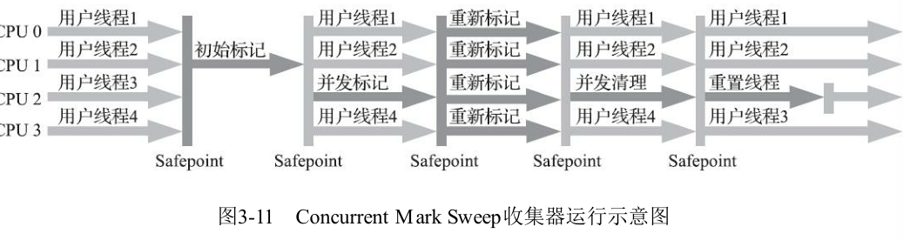
          - CMS 的缺点
            - CMS 对处理器资源非常敏感
              - 虽然不会导致用户线程停顿，但却会因为占用了一部分线程（或者说处理器的计算能力）而导致应用程序变慢，降低总吞吐量
              - CMS默认启动的回收线程数是（处理器核心数量 +3）/4，也就是说，如果处理器核心数在四个或以上，并发回收时垃圾收集线程只占用不超过25%的处理器运算资源，并且会随着处理器核心数量的增加而下降。但是当处理器核心数量不足四个时，CMS对用户程序的影响就可能变得很大
              - 如果应用本来的处理器负载就很高，还要分出一半的运算能力去执行收集器线程，就可能导致用户程序的执行速度忽然大幅降低
            - CMS 收集器无法处理浮动垃圾（Floating Garbage）。有可能出现“Con-current Mode Failure”失败进而导致另一次完全“Stop The World”的Full GC的产生
              - 浮动垃圾是指在并发标记和并发清理阶段产生的“新”垃圾
              - 因为在并发阶段用户线程还在运行，故而需要给用户线程一定的空间，不能像其他收集器一样老年代几乎被完全填满了之后才运行
              - CMS 运行的时机由 -XX: CMSInitatingOccu-pancyFraction 的值来提高触发 CMS 老年代垃圾回收的触发百分比（JDK 6 为 92）
              - 如果 CMS 运行期间预留的内存无法满足程序分配新对象的需要，就会出现一次并发失败，这时候虚拟机将启动后备方案：冻结用户线程的运行，临时启用 Serial Old 收集器来重新进行老年代的垃圾收集
            - 收集技术之后会有大量的空间碎片产生
              - 提供了 -XX: +UseCMS-CompactAtFullCollection 开关参数（JDK 9 之后开始废弃），默认开启，用于在 CMS 收集器不得不进行 Full GC 时开启内存碎片的合并整理过程
              - 但是上述参数会导致停顿时间变长，为此提供了另外一个参数：-XX：CMSFullGCsBefore- Compaction（此参数从JDK 9开始废弃），这个参数的作用是要求CMS收集器在执行过若干次（数量由参数值决定）不整理空间的Full GC之后，下一次进入Full GC前会先进行碎片整理（默认值为0，表示每次进入Full GC时都进行碎片整理）
        - Garbage First(G1)收集器
          - 开创了收集器面向局部收集的设计思路和基于Region的内存布局形式
          - 目标是在延迟可控的情况下获得尽可能高的吞吐 量
          - 面向服务端应用的 GC
          - 收集的目标是堆内存任何部分组成的回收集（Collection Set，CSet）。衡量标准不再是它属于哪个分代，而是哪块内存中存放的垃圾数量最多，回收收益最大，这就是G1收集器的Mixed GC模式
            - G1开创的基于 Region 的堆内存布局是它能够实现这个目标的关键
            - 虽然G1也仍是遵循分代收集理论设计的，但其堆内存的布局与其他收集器有非常明显的差异：G1不再坚持固定大小以及固定数量的分代区域划分，而是把连续的Java堆划分为多个大小相等的独立区域（Region），每一个Region都可以根据需要，扮演新生代的Eden空间、Survivor空间，或者老年代空间
            - 收集器能够对扮演不同角色的Region采用不同的策略去处理，这样无论是新创建的对象还是已经存活了一段时间、熬过多次收集的旧对象都能获取很好的收集效果
            - Region中还有一类特殊的Humongous区域，专门用来存储大对象。G1认为只要大小超过了一个 Region容量一半的对象即可判定为大对象
              - 每个Region的大小可以通过参数-XX：G1HeapRegionSize设定，取值范围为1MB～32MB，且应为2的N次幂
              - 对于那些超过了整个Region容量的超级大对象，将会被存放在N个连续的Humongous Region之中
              - G1的大多数行为都把Humongous Region作为老年代的一部分来进行看待
          - G1收集器之所以能建立可预测的停顿时间模型，是因为它将Region作为单次回收的最小单元，即每次收集到的内存空间都是Region大小的整数倍，这样可以有计划地避免在整个Java堆中进行全区域的垃圾收集
            - 更具体的处理思路是让G1收集器去跟踪各个Region里面的垃圾堆积的“价值”大小，价值即回收所获得的空间大小以及回收所需时间的经验值，然后在后台维护一个优先级列表，每次根据用户设定允许的收集停顿时间（使用参数-XX：MaxGCPauseMillis指定，默认值是200毫秒），优先处理回收价值收益最大的那些Region，这也就是“Garbage First”名字的由来
          - 关键的细节问题
            - Region之间的跨 Region 引用
              - 使用记忆集来解决，但是比普通的记忆集要复杂得多
              - 它的每个Region都维护有自己的记忆集，这些记忆集会记录下别的Region指向自己的指针，并标记这些指针分别在哪些卡页的范围之内
              - G1的记忆集在存储结构的本质上是一种哈希表，Key是别的Region的起始地址，Value是一个集合，里面存储的元素是卡表的索引号
              - 根据经验，G1至少要耗费大约相当于Java堆容量10%至20%的额外内存来维持收集器工作：由于记忆集的存在，而且 Region 数量比传统的 GC 多得多。
            - 在并发标记阶段如何保证收集器线程与用户线程不干扰地运行
              - 采用 SATB（原始快照）的方法来解决
                - 为了实现原始快照搜索（SATB）算法，还需要使用写前屏障来跟踪并发时的指针变化情况
                - 相比起增量更新算法，原始快照搜索能够减少并发标记和重新标记阶段的消耗，避免CMS那样在最终标记阶段停顿时间过长的缺点，但是在用户程序运行过程中确实会产生由跟踪引用变化带来的额外负担
                - 由于G1对写屏障的复杂操作要比CMS消耗更多的运算资源，所以CMS的写屏障实现是直接的同步操作，而G1就不得不将其实现为类似于消息队列的结构，把写前屏障和写后屏障中要做的事情都放到队列里，然后再异步处理
              - 如何在并发时分配对象？为每个 Region 设计了 2 个 TAMS（Top at Mark Start）的指针，把 Region 中的一部分空间划分出来用于并发回收过程中新对象的分配，并发回收过程中分配的新对象的地址必须在这两个指针的位置以上。G1 收集器默认在这个地址以上的对象是被隐式标记过的，不纳入回收范围
              - 如果内存回收速度赶不上内存分配的速度，G1 收集器也要冻结用户线程执行，导致 Full GC
            - 怎样建立起可靠的停顿预测模型？
              - 用户通过 -XX：MaxGCPauseMillis参 数指定的停顿时间只意味着垃圾收集发生之前的期望值，但G1收集器要怎么做才能满足用户的期望呢
              - G1收集器的停顿预测模型是以衰减均值（Decaying Average）为理论基础来实现的
                - 在垃圾收集过程中，G1收集器会记录每个Region的回收耗时、每个Region记忆集里的脏卡数量等各个可测量的步骤花费的成本，并分析得出平均值、标准偏差、置信度等统计信息
                - 这里强调的“衰减平均值”是指它会比普通的平均值更容易受到新数据的影响，平均值代表整体平均状态，但衰减平均值更准确地代表“最近的”平均状态
          - G1 收集器的大致运行过程（不考虑用户线程维护记忆集的操作） 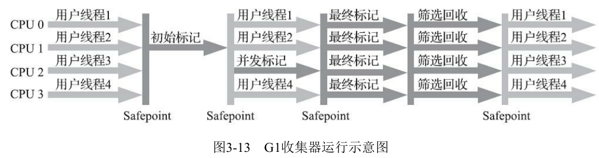
            - 1\. 初始标记（Initial Marking）
              - 仅仅只是标记一下GC Roots能直接关联到的对象，并且修改TAMS指针的值，让下一阶段用户线程并发运行时，能正确地在可用的Region中分配新对象
              - 这个阶段需要停顿线程，但耗时很短，而且是借用进行Minor GC的时候同步完成的，所以G1收集器在这个阶段实际并没有额外的停顿
            - 2\. 并发标记（Concurrent Marking）
              - 从GC Root开始对堆中对象进行可达性分析，递归扫描整个堆里的对象图，找出要回收的对象，这阶段耗时较长，但可与用户程序并发执行。当对象图扫描完成以后，还要重新处理SATB记录下的在并发时有引用变动的对象
            - 3\. 最终标记（Final Marking）
              - 对用户线程做另一个短暂的暂停，用于处理并发阶段结束后仍遗留下来的最后那少量的SATB记录
            - 4\. 筛选回收（Live Data Counting and Evacuation）
              - 负责更新Region的统计数据，对各个Region的回收价值和成本进行排序，根据用户所期望的停顿时间来制定回收计划，可以自由选择任意多个Region构成回收集，然后把决定回收的那一部分Region的存活对象复制到空的Region中，再清理掉整个旧Region的全部空间。这里的操作涉及存活对象的移动，是必须暂停用户线程，由多条收集器线程并行完成的
          - 毫无疑问，可以由用户指定期望的停顿时间是G1收集器很强大的一个功能，设置不同的期望停顿 时间，可使得G1在不同应用场景中取得关注吞吐量和关注延迟之间的最佳平衡。不过，这里设置的“期望值”必须是符合实际的，不能异想天开，毕竟G1是要冻结用户线程来复制对象的，这个停顿时间再怎么低也得有个限度。它默认的停顿目标为两百毫秒，一般来说，回收阶段占到几十到一百甚至接近两百毫秒都很正常，但如果我们把停顿时间调得非常低，譬如设置为二十毫秒，很可能出现的结果就是由于停顿目标时间太短，导致每次选出来的回收集只占堆内存很小的一部分，收集器收集的速度逐渐跟不上分配器分配的速度，导致垃圾慢慢堆积。很可能一开始收集器还能从空闲的堆内存中获得一些喘息的时间，但应用运行时间一长就不行了，最终占满堆引发Full GC反而降低性能，所以通常把期望停顿时间设置为一两百毫秒或者两三百毫秒会是比较合理的
      - 低延迟垃圾收集器
        - 衡量 GC 的 3 项最重要的指标：内存占用（Footprint）、吞吐量（Throughput）和延迟（Latency）
          - GC 要在这 3 者之间同时做得完美是不太可能的，通常最多只能达成其中的 2 项
        - Shenandoah 收集器
          - 目标是能在任何堆内存大小下都可以把垃圾收集的停顿时间限制在十毫秒以内的垃圾收集器，该 目标意味着相比CMS和G1，Shenandoah不仅要进行并发的垃圾标记，还要并发地进行对象清理后的整理动作
          - Shenandoah 也是基于 Region 的堆内存布局，同样有着存放大对象的 Humongous Region，默认的回收策略也是优先处理回收价值最大的 Region，但是，其与 G1 收集器有 3 个明显的不同之处
            - 支持并发的整理算法
            - 默认不使用分代收集
            - 不使用记忆集来记录跨 Region 的引用关系，而使用连接矩阵（Connection Matrix）的全局数据结构来记录块 Region 引用关系
              - 连接矩阵可以简单理解为一张二维表格，如果Region N有对象指向Region M，就在表格的N行M列中打上一个标记
          - 工作过程
            - 初始标记（Initial Marking）
              - 首先标记与GC Roots直接关联的对象，这个阶段仍是“Stop The World”的，但停顿时间与堆大小无关，只与GC Roots的数量相关
            - 并发标记（Concurrent Marking）
              - 遍历对象图，标记出全部可达的对象，这个阶段是与用户线程一起并发的，时间长短取决于堆中存活对象的数量以及对象图的结构复杂程度
            - 最终标记（Final Marking）
              - 处理剩余的SATB扫描，并在这个阶段统计出回收价值最高的Region，将这些Region构成一组回收集（Collection Set）。最终标记阶段也会有一小段短暂的停顿
            - 并发清理（Concurrent Cleanup）
              - 这个阶段用于清理那些整个区域内连一个存活对象都没有找到的Region（这类Region被称为Immediate Garbage Region）
            - 并发回收（Concurrent Evacuation）
              - 在这个阶段，Shenandoah要把回收集里面的存活对象先复制一份到其他未被使用的Region之中。但是困难在于这个阶段也要与用户线程一起并发
              - 为了解决和用户线程一起并发的问题，通过读屏障和 Brooks Pointers 的转发指针来解决
                - 转发指针（Forwarding/Indirection Pointer）
                  - 在位于原有对象布局结构的最前面统一增加一个新的引用字段，在正常不出有并发移动的情况下，该引用指向对象自己
                  - 当对象拥有了一份新的副本时，只需要修改旧对象转发指针的引用，使其指向新对象，即可将所有对该对象的访问转发到新的副本上
                    - 但是，如果用户线程发生了用户线程的并发写入，那么就必须保证写操作只能发生在新复制的对象上，而不是写入旧对象上。故而，收集器线程或者用户线程对转发指针的访问只有其中一个能够成功，另一个必须等待，避免两者交替运行。 Shenandoah 通过 CAS 来实现这一点
                  - 这样只要旧对象的内存仍然存在，未被清理掉，虚拟机内存中所有通过旧引用地址访问的代码便仍然可用，都会被自动转发到新对象上继续工作 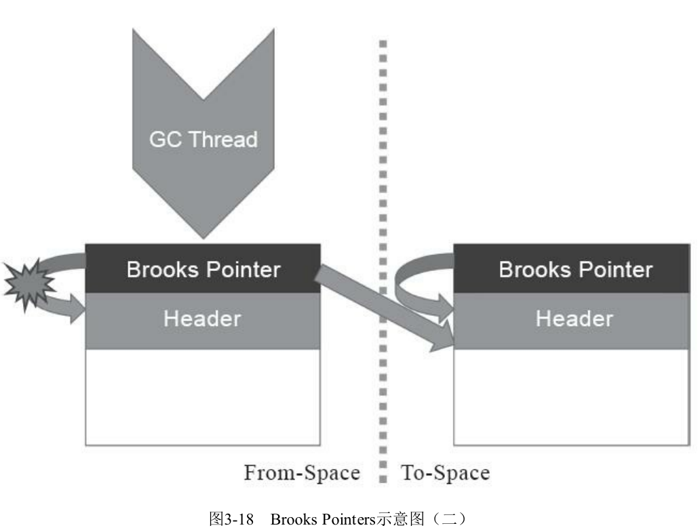
                - 读、写屏障
                  - 为了配合转发指针在对象访问的时候进行拦截，需要使用读、写屏障来实现
                  - 为了实现转发指针，在读写屏障中都加入了额外的转发处理。其中，读屏障的代价比写屏障更大，因为读屏障的频率更大
                  - 为了解决读屏障带来的性能开销，在 JDK 13 中，将 Shenandoah 的内存屏障模型改为基于引用访问屏障（Load Reference Barrier）的实现
                    - “引用访问屏障”是指内存屏障只拦截对象中数据类型为引用类型的读写操作，而不去管原生数据类型等其他非引用字段的读写，这能够省去大量对原生类型、对象比较、对象加锁等场景中设置内存屏障所带来的消耗
            - 初始引用更新（Initial Update Reference）
              - 并发回收阶段复制对象结束后，还需要把堆中所有指向旧对象的引用修正到复制后的新地址，这个操作称为引用更新
              - 引用更新的初始化阶段实际上并未做什么具体的处理，设立这个阶段只是为了建立一个线程集合点，确保所有并发回收阶段中进行的收集器线程都已完成分配给它们的对象移动任务而已
              - 初始引用更新时间很短，会产生一个非常短暂的 停顿
            - 并发引用更新（Concurrent Update Reference）
              - 真正开始进行引用更新操作，这个阶段是与用户线程一起并发的，时间长短取决于内存中涉及的引用数量的多少
              - 并发引用更新与并发标记不同，它不再需要沿着对象图来搜索，只需要按照内存物理地址的顺序，线性地搜索出引用类型，把旧值改为新值即可
            - 最终引用更新（Final Update Reference）
              - 修正存在于 GC Roots 中的引用
              - 这个阶段是Shenandoah的最后一次停顿，停顿时间只与GC Roots的数量相关
            - 并发清理（Concurrent Cleanup）
              - 经过并发回收和引用更新之后，整个回收集中所有的Region已再无存活对象，这些Region都变成Immediate Garbage Regions了，最后再调用一次并发清理过程来回收这些Region的内存空间，供以后新对象分配使用
        - ZGC 收集器
          - ZGC和Shenandoah的目标是高度相似的，都希望在尽可能对吞吐量影响不太大的前提下，实现在任意堆内存大小下都可以把垃圾收集的停顿时间限制在十毫秒以内的低延迟
          - 采用基于 Region 的堆内存布局，但是其 Region 具有动态性————动态创建和销毁，以及动态的区域容量大小
            - 在 x64 中，ZGC 的 Region 可以具有大、中、小三类容量
              - 小型 Region
                - 容量固定为 2 MB，用于放置小于 256 KB 的小对象
              - 中型 Region
                - 容量固定为 32 MB，用于放置大于等于 256KB 但小于 4MB 的对象
              - 大型 Region
                - 容量不固定，可以动态变化，但是必须为 2MB 的整数倍，用于放置 4MB 或以上的大对象
                - 每个大型 Region 只会存放一个大对象，故而其容量可能小于中型 Region
                - 大型 Region 在 ZGC 的实现中不会被重分配
          - 染色指针技术（Colored/Tag/Version Pointer）
            - 直接把标记信息（它存活与否的信息）记在引用对象的指针上
            - 染色指针是一种直接将少量额外的信息存储在指针上的技术
              - 64位的Linux则分别支持47位（128TB）的进程虚拟地址空间和46位（64TB）的物理地址空间，64位的Windows系统甚至只支持44位（16TB）的物理地址空间
              - ZGC 染色指针在 linux 64 中的实现
                - 尽管Linux下64位指针的高18位不能用来寻址，但剩余的46位指针所能支持的64TB内存在今天仍然能够充分满足大型服务器的需要
                - ZGC的染色指针技术继续盯上了这剩下的46位指针宽度，将其高4位提取出来存储四个标志信息
                  - 由于这些标志位进一步压缩了原本就只有46位的地址空间，也直接导致ZGC能够管理的内存不可以超过4TB（2的42次幂）
                - 通过这些标志位，虚拟机可以直接从指针中看到其引用对象的三色标记状态、是否进入了重分配集（即被移动过）、是否只能通过finalize()方法才能被访问到 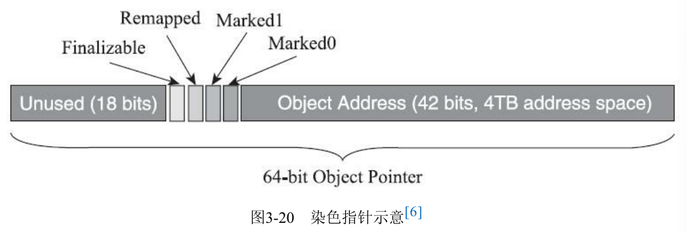
              - 如何让已染色的指针不影响操作系统/处理器等的正确性？使用多重映射（Multi-Mapping）将多个不同的虚拟内存地址映射到同一个物理内存地址上 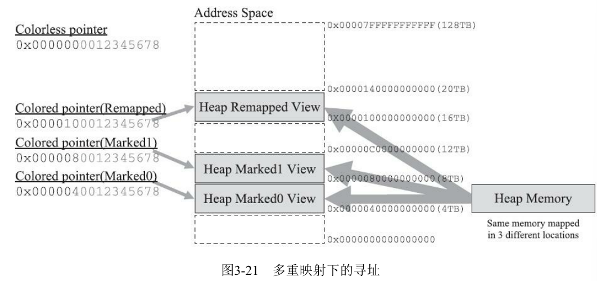
              - 染色指针的优势
                - 染色指针可以使得一旦某个Region的存活对象被移走之后，这个Region立即就能够被释放和重用掉，而不必等待整个堆中所有指向该Region的引用都被修正后才能清理
                - 染色指针可以大幅减少在垃圾收集过程中内存屏障的使用数量，设置内存屏障，尤其是写屏障的目的通常是为了记录对象引用的变动情况，如果将这些信息直接维护在指针中，显然就可以省去一些专门的记录操作
                - 染色指针可以作为一种可扩展的存储结构用来记录更多与对象标记、重定位过程相关的数据，以 便日后进一步提高性能。即将未使用的前 18 位也开发出来用于存储信息
          - ZGC 的运行过程 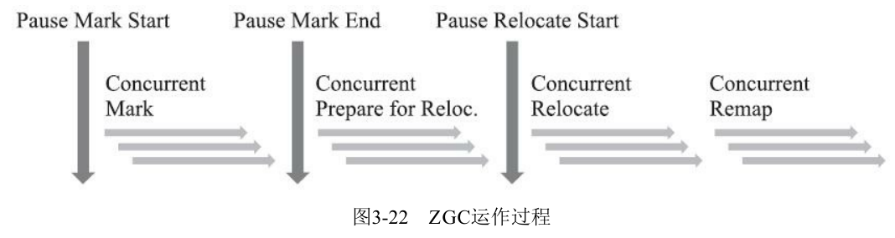
            - 并发标记（Concurrent Mark）
              - 与G1、Shenandoah一样，并发标记是遍历对象图做可达性分析的阶段
              - ZGC的标记是在指针上而不是在对象上进行的，标记阶段会更新染色指针中的Marked 0、Marked 1标志位
            - 并发预备重分配（Concurrent Prepare for Relocate）
              - 需要根据特定的查询条件统计得出本次收集过程要清理哪些Region，将这些Region组成重分配集（Relocation Set）
              - ZGC划分Region的目的并非为了像G1那样做收益优先的增量回收。相反，ZGC每次回收都会扫描所有的Region，用范围更大的扫描成本换取省去G1中记忆集的维护成本
              - GC的重分配集只是决定了里面的存活对象会被重新复制到其他的Region中，里面的Region会被释放，而并不能说回收行为就只是针对这个集合里面的Region进行，因为标记过程是针对全堆的
            - 并发重分配（Concurrent Relocate）
              - 重分配是ZGC执行过程中的核心阶段，这个过程要把重分配集中的存活对象复制到新的Region上，并为重分配集中的每个Region维护一个转发表（Forward Table），记录从旧对象到新对象的转向关系
              - 得益于染色指针的支持，ZGC 能从引用上就明确得知一个对象是否处于重分配集中，如果用户线程此时并发访问了位于重分配集中的对象，这次访问就会被预置的内存屏障所捕获，然后立即根据 Region 上的转发表记录将访问转发到新复制的对象上，并同时修改更新更改引用的值，使其直接指向新对象。ZGC 将这种行为称为指针的自愈（Self Healing）能力
                - 这样做的好处是只有第一次访问旧对象会陷入转发，也就是只慢一次
                - 对比Shenandoah的Brooks转发指针，那是每次对象访问都必须付出的固定开销，简单地说就是每次都慢，因此ZGC对用户程序的运行时负载要比Shenandoah来得更低一些
                - 还有另外一个直接的好处是由于染色指针的存在，一旦重分配集中某个Region的存活对象都复制完毕后，这个Region就可以立即释放用于新对象的分配（但是转发表还得留着不能释放掉），哪怕堆中还有很多指向这个对象的未更新指针也没有关系，这些旧指针一旦被使用，它们都是可以自愈的
            - 并发重映射（Concurrent Remap）
              - 重映射所做的就是修正整个堆中指向重分配集中旧对象的所有引用
              - ZGC的并发重映射并不是一个必须要“迫切”去完成的任务，因为前面说过，即使是旧引用，它也是可以自愈的，最多只是第一次使用时多一次转发和修正操作
              - 重映射清理这些旧引用的主要目的是为了不变慢（还有清理结束后可以释放转发表这样的附带收益），所以说这并不是很“迫切”
              - ZGC很巧妙地把并发重映射阶段要做的工作，合并到了下一次垃圾收集循环中的并发标记阶段里去完成，反正它们都是要遍历所有对象的，这样合并就节省了一次遍历对象图的开销
              - 一旦所有指针都被修正之后，原来记录新旧对象关系的转发表就可以释放掉了
- 虚拟机工具
  - jps：虚拟机进程状况工具
    - 可以列出正在运行的虚拟机进程，并显示虚拟机执行主类（Main Class，main()函数所在的类）名称以及这些进程的本地虚拟机唯一 ID（LVMID，Local Virtual Machine Identifier）
    - 对于本地虚拟机进程来说，LVMID与操作系统的进程ID（PID，Process Identifier）是一致的
    - jps还可以通过RMI协议查询开启了RMI服务的远程虚拟机进程状态，参数hostid为RMI注册表中注册的主机名
    - 主要选项 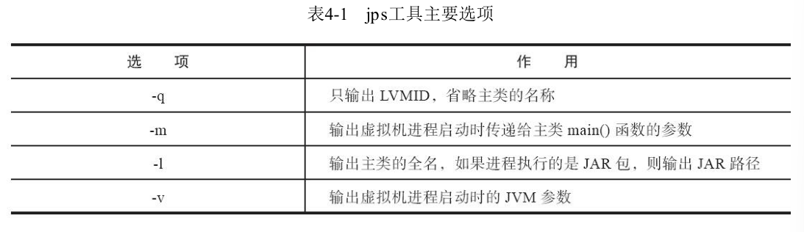
  - jstat：虚拟机统计信息监视工具
    - jstat（JVM Statistics Monitoring Tool）是用于监视虚拟机各种运行状态信息的命令行工具
    - 可以显示本地或者远程[1]虚拟机进程中的类加载、内存、垃圾收集、即时编译等运行时数据，在没有GUI图形界面、只提供了纯文本控制台环境的服务器上，它将是运行期定位虚拟机性能问题的常用工具
    - 常用选项 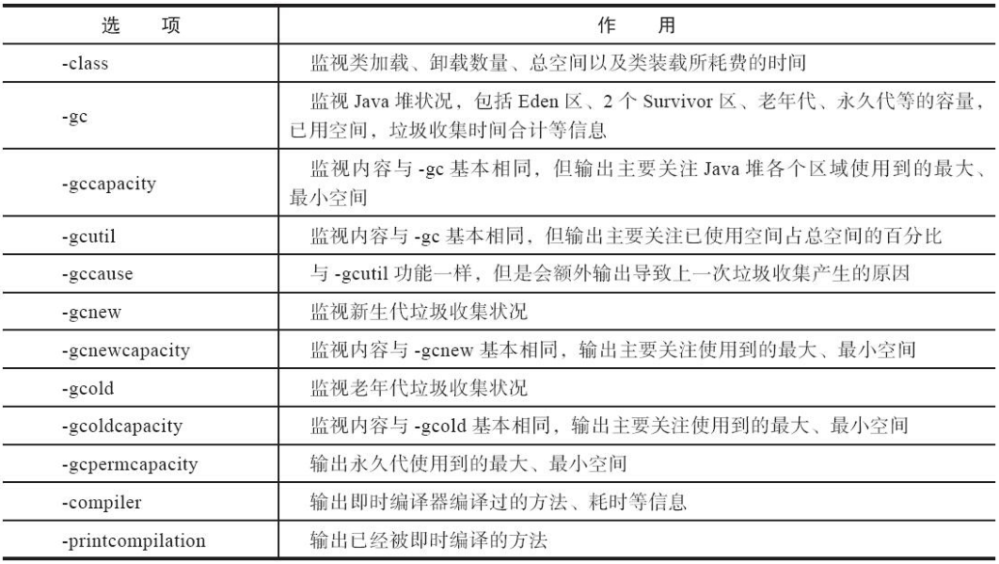
  - jinfo：java 配置信息工具
    - jinfo（Configuration Info for Java）的作用是实时查看和调整虚拟机各项参数
    - 使用jps命令的-v参数可以查看虚拟机启动时显式指定的参数列表，但如果想知道未被显式指定的参数的系统默认值，除了去找资料外，就只能使用jinfo的-flag选项进行查询了
    - jinfo还可以使用-sysprops选项把虚拟机 进程的System.getProperties()的内容打印出来
    - 还可以使用-flag[+|-]name或者-flag name=value在运行期修改一部分运行期可写的虚拟机参数值
  - jmap：Java 内存映像工具
    - jmap（Memory Map for Java）命令用于生成堆转储快照（一般称为heapdump或dump文件）
    - 还可以查询finalize执行队列、Java堆和方法区的详细信息，如空间使用率、当前用的是哪种收集器等
    - 主要选项 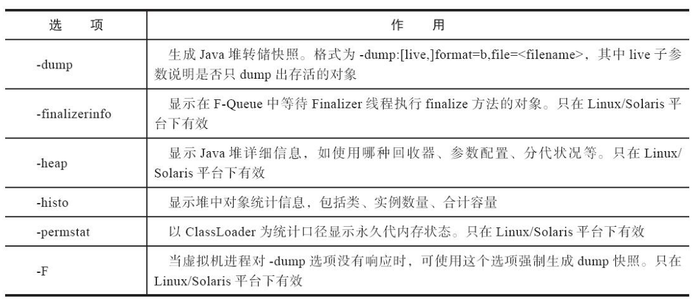
  - jhat：虚拟机堆转储快照分析工具
    - jhat（JVM Heap Analysis Tool）命令与jmap搭配使用，来分析jmap生成的堆转储快照
    - jhat内置了一个微型的HTTP/Web服务器，生成堆转储快照的分析结果后，可以在浏览器中查看
    - 分析工作是一个耗时而且极为耗费硬件资源的过程
    - jhat的分析功能相对来说比较简陋
  - jstack：Java 堆栈跟踪工具
    - jstack（Stack Trace for Java）命令用于生成虚拟机当前时刻的线程快照（一般称为threaddump或者javacore文件）
    - 线程快照就是当前虚拟机内每一条线程正在执行的方法堆栈的集合，生成线程快照的目的通常是定位线程出现长时间停顿的原因，如线程间死锁、死循环、请求外部资源导致的长时间挂起等，都是导致线程长时间停顿的常见原因
    - 线程出现停顿时通过jstack来查看各个线程的调用堆栈，就可以获知没有响应的线程到底在后台做些什么事情，或者等待着什么资源
    - 常用选项 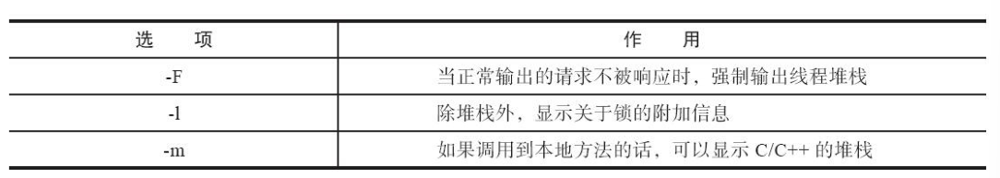
  - 等
- 虚拟机执行子系统
  - 类文件结构
    - 任何一个 Class 文件都对应着唯一的一个类或接口的定义信息，除了 package-info.class 和 module-info.class。但是反过来说，类或接口并不一定都得定义在文件里（例如，类或接口也可以动态生成，直接送入类加载器中）
    - Class文件是一组以8个字节为基础单位的二进制流，各个数据项目严格按照顺序紧凑地排列在文件之中，中间没有添加任何分隔符，这使得整个Class文件中存储的内容几乎全部是程序运行的必要数据，没有空隙存在
      - 当遇到需要占用8个字节以上空间的数据项时，则会按照高位在前[2]的方式分割成若干个8个字节进行存储
    - Class文件格式采用一种类似于C语言结构体的伪结构来存储数据，这种伪结构中只有两种数据类型
      - 无符号数
        - 基本的数据类型
        - 以u1、u2、u4、u8来分别代表1个字节、2个字节、4个字节和8个字节的无符号数
        - 无符号数可以用来描述数字、索引引用、数量值或者按照UTF-8编码构成字符串值
      - 表
        - 由多个无符号数或者其他表作为数据项构成的复合数据类型，为了便于区分，所有表的命名都习惯性地以“_info”结尾
        - 表用于描述有层次关系的复合结构的数据，整个Class文件本质上也可以视作是一张表，这张表由下图所示的数据项按严格顺序排列构成 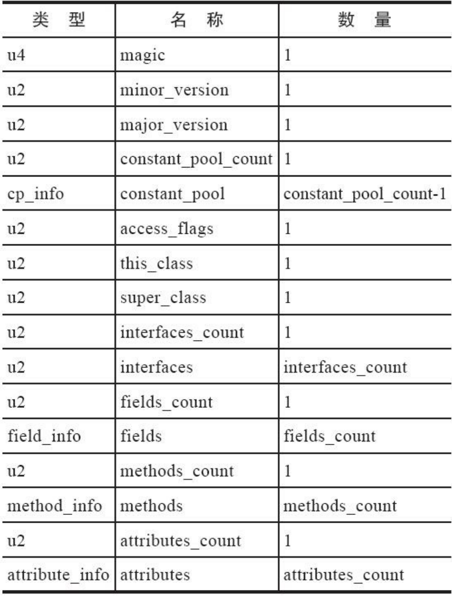
    - .class 文件的表结构 
      - magic 与 Class 文件的版本
        - magic：它的唯一作用是确定这个文件是否为 一个能被虚拟机接受的Class文件，为 0xCAFEBABE
        - 版本号：第 5 和第 6 字节是次版本号（Minor Version），第 7 和第 8 字节是主版本号（Major Version）
          - Java的版本号是从45开始的，JDK 1.1之后 的每个JDK大版本发布主版本号向上加1（JDK 1.0～1.1使用了45.0～45.3的版本号），高版本的JDK能向下兼容以前版本的Class文件，但不能运行以后版本的Class文件，因为《Java虚拟机规范》在Class文件校验部分明确要求了即使文件格式并未发生任何变化，虚拟机也必须拒绝执行超过其版本号的Class文件
          - 例如，JDK 1.1能支持版本号为45.0～45.65535的Class文件，无法执行版本号为46.0以上的Class文件，而JDK 1.2则能支持45.0～46.65535的Class文件
      - 常量池
        - constant_pool_count 从 1 开始，而不是从 0 开始
          - 将 0 项常量空出来的目的：如果后面某些指向常量池的索引值的数据在特定情况下需要表达“不引用任何一个常量池项目”的含义，可以把索引值设置为 0 来表示
          - Class文件结构中只有常量池的容量计数是从1开始，对于其他集合类型，包括接口索引集合、字段表集合、方法表集合等的容量计数都与一般习惯相同，是从0开始
        - 常量池中主要存放 2 类常量
          - 字面量（Literal）
            - 如文本字符串、被声明为final的常量值等
          - 符号引用（Symbolic Reference）
            - 属于编译原理方面的概念，主要包括下面几类常量
              - 被模块导出或者开放的包（Package）
              - 类和接口的全限定名（Fully Qualified Name）
              - 字段的名称和描述符（Descriptor
              - 方法的名称和描述符
              - 方法句柄和方法类型（Method Handle、Method Type、Invoke Dynamic）
              - 动态调用点和动态常量（Dynamically-Computed Call Site、Dynamically-Computed Constant）
            - ava代码在进行Javac编译的时候，并不像C和C++那样有“连接”这一步骤，而是在虚拟机加载Class文件的时候进行动态连接
        - 常量池中每一项常量都是一个表
          - 最初常量表中共有11种结构各不相同的表结构数据，后来为了更好地支持动态语言调用，额外增加了4种动态语言相关的常量，为了支持Java模块化系统（Jigsaw），又加入了CONSTANT_Module_info和CONSTANT_Package_info两个常量 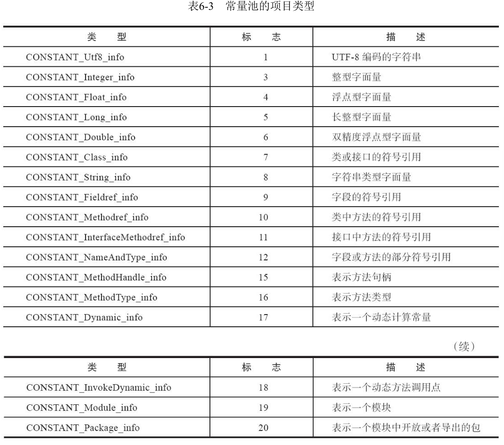
            - CONSTANT_Class_info 
              - tag是标志位，它用于区分常量类型
              - name_index是常量池的索引值，它指向常量池中一个CONSTANT_Utf8_info类型常量，此常量代表了这个类（或者接口）的全限定名
            - CONSTANT_Utf8_info 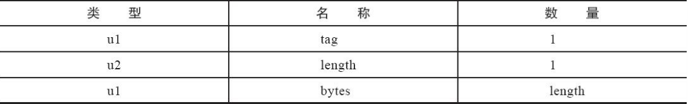
              - length值说明了这个UTF-8编码的字符串长度是多少字节，它后面紧跟着的长度为length字节的连续数据是一个使用UTF-8缩略编码表示的字符串
                - UTF-8缩略编码与普通UTF-8编码的区别是：从'\\u0001'到'\\u007f'之间的字符（相当于1～127的ASCII码）的缩略编码使用一个字节表示， 从'\\u0080'到'\\u07ff'之间的所有字符的缩略编码用两个字节表示，从'\\u0800'开始到'\\uffff'之间的所有字符的缩略编码就按照普通UTF-8编码规则使用三个字节表示
            - 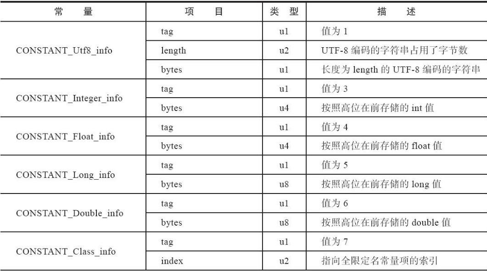
              - 续表 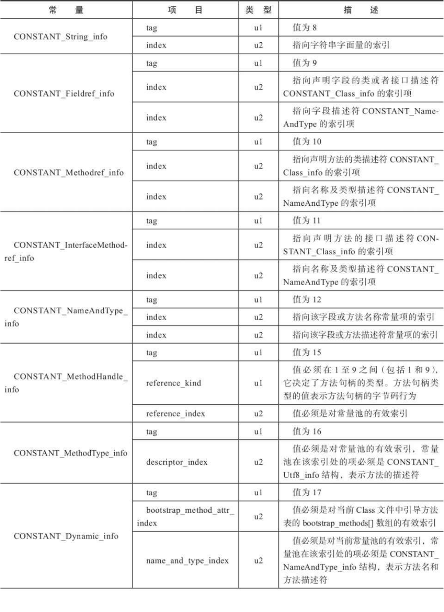
              - 续表 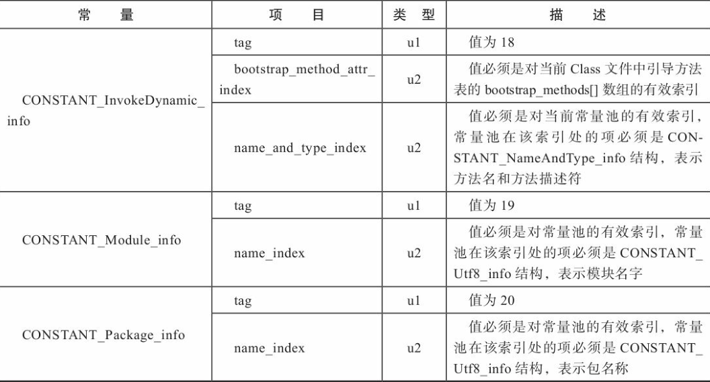
      - 访问标志
        - 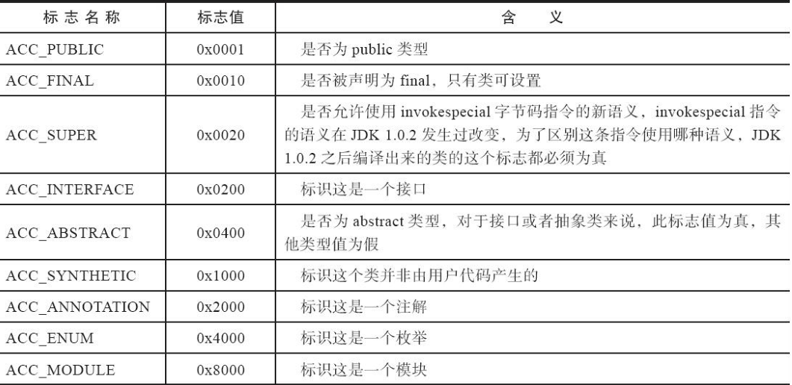
        - access_flags中一共有16个标志位可以使用，当前只定义了其中9个[1]，没有使用到的标志位要求一律为零
      - 类索引（this_class）、父类索引（super_class）与接口索引集合（interfaces）
        - Class文件中由这三项数据来确定该类型的继承关系。类索引用于确定这个类的全限定名，父类索引用于确定这个类的父类的全限定名
          - 类索引查找过程 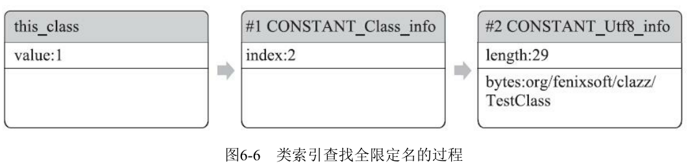
        - 除了java.lang.Object之外，所有的Java类都有父类，因此除了java.lang.Object外，所有Java类的父类索引都不为0
        - 接口索引集合就用来描述这个类实现了哪些接 口，这些被实现的接口将按implements关键字（如果这个Class文件表示的是一个接口，则应当是extends关键字）后的接口顺序从左到右排列在接口索引集合中
      - 字段表集合
        - 字段表（field_info）用于描述接口或者类中声明的变量
        - 字段表中每个项的结构 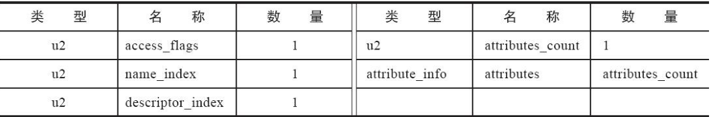
          - access_flag 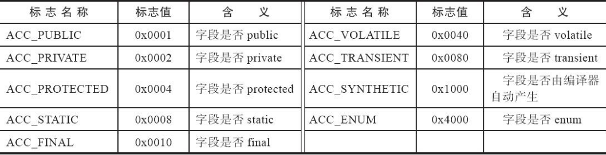
          - name_index：字段的简单名称
            - 简单名称就是指没有类型和参数修饰的方法或者字段名称
          - descriptor_index：字段和方法的描述符
            - 描述符的作用是用来描述字段的数据类型、方法的参数列表（包括数量、类型以及顺序）和返回值
            - 根据描述符规则，基本数据类型（byte、char、double、float、int、long、short、boolean）以及代表无返回值的void类型都用一个大写字符来表示，而对象类型则用字符L加对象的全限定名来表示 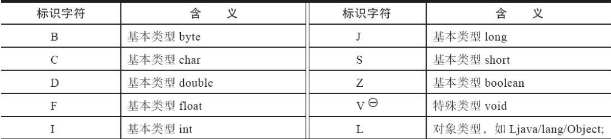
              - void类型在《Java虚拟机规范》之中单独列出为“VoidDescriptor”
              - 对于数组类型，每一维度将使用一个前置的“[”字符来描述，如一个定义为“java.lang.String[][]”类型的二维数组将被记录成“[[Ljava/lang/String；”，一个整型数组“int[]”将被记录成“[I”。
            - 用描述符来描述方法时，按照先参数列表、后返回值的顺序描述，参数列表按照参数的严格顺序 放在一组小括号“()”之内
              - 例 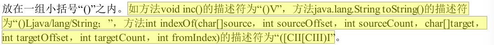
          - attributes：存储一些额外的信息
            - 例如“final static int m=123；”，那就可能会存在一项名称为ConstantValue的属性，其值指向常量123
        - 字段表集合中不会列出从父类或者父接口中继承而来的字段，但有可能出现原本Java代码之中不存在的字段
          - 譬如在内部类中为了保持对外部类的访问性，编译器就会自动添加指向外部类实例的字段
        - 在Java语言中字段是无法重载的，两个字段的数据类型、修饰符不管是否相同，都必须使用不一样的名称，但是对于Class文件格式来讲，只要两个字段的描述符不是完全相同，那字段重名就 是合法的
      - 方法表集合
        - 方法表每个项的结构 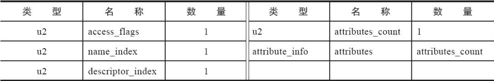
          - access_flags 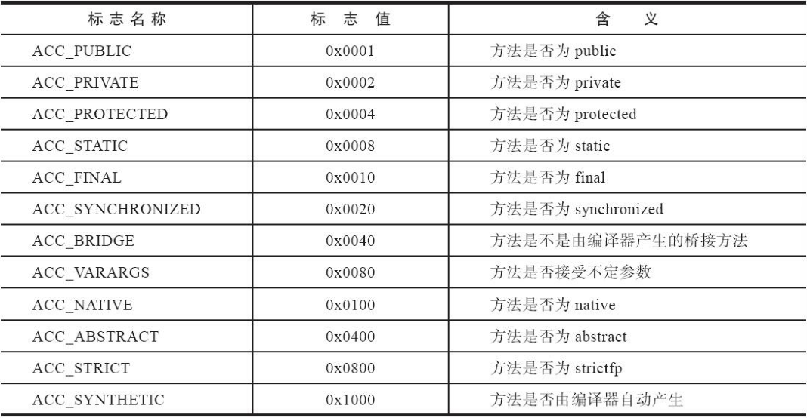
        - 方法里的Java代码，经过Javac编译器编译成字节码指令之后，存放在方法属性表集合中一个名为“Code”的属性里面
        - 如果父类方法在子类中没有被重写（Override），方法表集合中就不会出现来自父类的方法信息。但同样地，有可能会出现由编译器自动添加的方法，最常见的便是类构造器“&lt;clinit&gt;()”方法和实例构造器“&lt;init&gt;()”方法
      - 属性表集合
        - 《Java虚拟机规范》允许只要不与已有属性名重复，任何人实现的编译器都可以向属性表中写入自己定义的属性信息，Java虚拟机运行时会忽略掉它不认识的属性
        - JVM 的预定义属性
          - 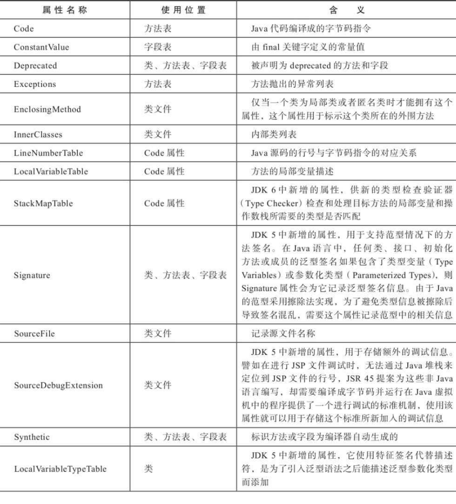
            - Code 属性
              - Java程序方法体里面的代码经过Javac编译器处理之后，最终变为字节码指令存储在Code属性内
              - Code属性出现在方法表的属性集合之中，但并非所有的方法表都必须存在这个属性
                - 譬如接口或者抽象类中的方法就不存在Code属性
              - Code 属性表的结构 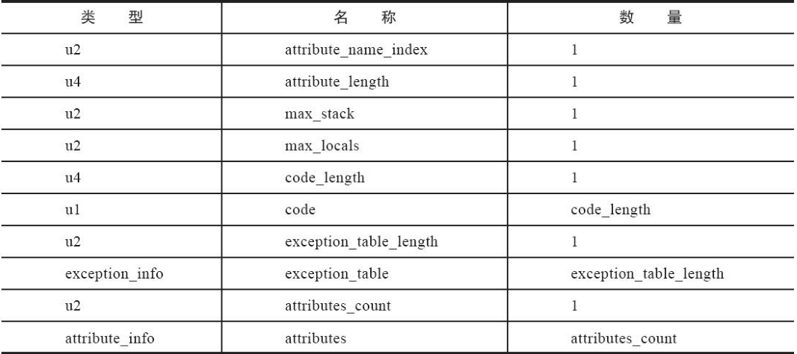
                - attribute_name_index是一项指向CONSTANT_Utf8_info型常量的索引，此常量值固定为“Code”，它代表了该属性的属性名称
                - attribute_length指示了属性值的长度，由于属性名称索引与属性长度一共为6个字节，所以属性值的长度固定为整个属性表长度减去6个字节
                - max_stack代表了操作数栈（Operand Stack）深度的最大值。在方法执行的任意时刻，操作数栈都不会超过这个深度。虚拟机运行的时候需要根据这个值来分配栈帧（Stack Frame）中的操作栈深度
                - max_locals代表了局部变量表所需的存储空间
                  - max_locals的单位是变量槽（Slot），变量 槽是虚拟机为局部变量分配内存所使用的最小单位。对于byte、char、float、int、short、boolean和returnAddress等长度不超过32位的数据类型，每个局部变量占用一个变量槽，而double和long这两种64位的数据类型则需要两个变量槽来存放
                  - 方法参数（包括实例方法中的隐藏参数“this”）、显式异常处理程序的参数（Exception Handler Parameter，就是try-catch语句中catch块中所定义的异常）、方法体中定义的局部变量都需要依赖局部变量表来存放
                - code_length和code用来存储Java源程序编译后生成的字节码指令
                  - 每个指令就是一个u1类型的单字节，当虚拟机读取到code中的一个字节码时，就可以对应找出这个字节码代表的是什么指令，并且可以知道这条指令后面是否需要跟随参数，以及后续的参数应当如何解析
                  - 《Java虚拟机规范》中明确限制了一个方法不允许超过65535条字节码指令，即它实际只使用了u2的长度，如果超过这个限制，Javac编译器就会拒绝编译
                - 异常表 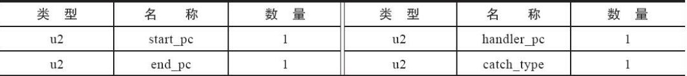
                  - 包含四个字段，这些字段的含义为：如果当字节 码从第start_pc行到第end_pc行之间（不含第end_pc行）出现了类型为catch_type或者其子类的异常（catch_type为指向一个CONSTANT_Class_info型常量的索引），则转到第handler_pc行继续处理。当catch_type的值为0时，代表任意异常情况都需要转到handler_pc处进行处理
            - Exception 属性
              - 列举出方法中可能抛出的受查异常（Checked Excepitons），也就是方法描述时在throws关键字后面列举的异常
              - 结构 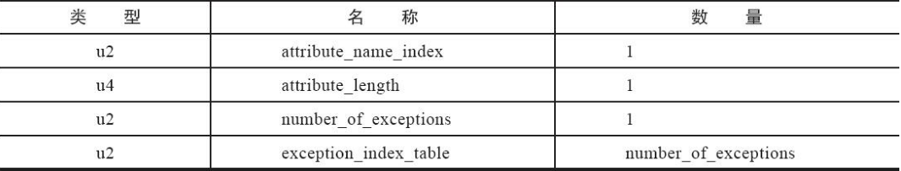
                - exception_index_table是一个指向常量池中 CONSTANT_Class_info型常量的索引，代表了该受查异常的类型
            - LineNumberTable 属性
              - 用于描述Java源码行号与字节码行号（字节码的偏移量）之间的对应关系
              - 结构 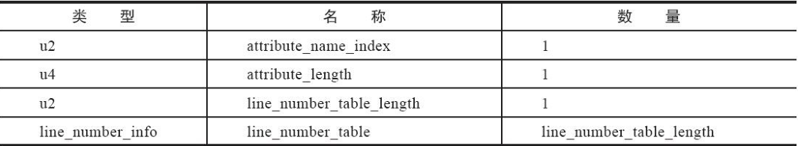
                - line_number_table是一个数量为line_number_table_length、类型为line_number_info的集合，line_number_info表包含start_pc和line_number两个u2类型的数据项，前者是字节码行号，后者是Java源码行号
            - LocalVariableTable 和 LocalVariableTypeTable
              - LocalVariableTable
                - LocalVariableTable属性用于描述栈帧中局部变量表的变量与Java源码中定义的变量之间的关系，它也不是运行时必需的属性，但默认会生成到Class文件之中，可以在Javac中使用-g：none或-g：vars选项来取消或要求生成这项信息
                - 如果没有生成这项属性，最大的影响就是当其他人引用这个方法时，所有的参数名称都将会丢失，譬如IDE将会使用诸如arg0、arg1之类的占位符代替原有的参数名，这对程序运行没有影响，但是会对代码编写带来较大不便，而且在调试期间无法根据参数名称从上下文中获得参数值
                - 结构 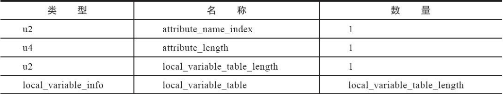
                  - local_variable_info项目代表了一个栈帧与源码中的局部变量的关联 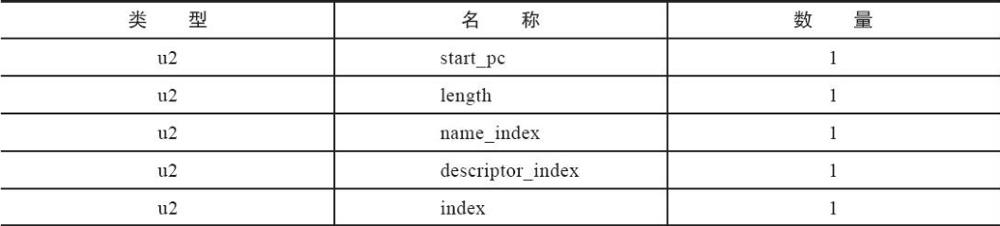
                    - start_pc和length属性分别代表了这个局部变量的生命周期开始的字节码偏移量及其作用范围覆盖的长度，两者结合起来就是这个局部变量在字节码之中的作用域范围
                    - name_index和descriptor_index都是指向常量池中CONSTANT_Utf8_info型常量的索引，分别代表了局部变量的名称以及这个局部变量的描述符
                    - index是这个局部变量在栈帧的局部变量表中变量槽的位置。当这个变量数据类型是64位类型时（double和long），它占用的变量槽为index和index+1两个
              - LocalVariableTypeTable
                - 在JDK 5引入泛型之后，LocalVariableTable属性增加了一个“姐妹属性”—— LocalVariableTypeTable。这个新增的属性结构与LocalVariableTable非常相似，仅仅是把记录的字段描述符的descriptor_index替换成了字段的特征签名（Signature）
                - 对于非泛型类型来说，描述符和特征签名能描述的信息是能吻合一致的，但是泛型引入之后，由于描述符中泛型的参数化类型被擦除掉，描述符就不能准确描述泛型类型了
            - SourceFile 和 SourceDebugExtension 属性
              - SourceFile
                - SourceFile属性用于记录生成这个Class文件的源码文件名称
                - 这个属性也是可选的，可以使用Javac 的-g：none或-g：source选项来关闭或要求生成这项信息
                - 在Java中，对于大多数的类来说，类名和文 件名是一致的，但是有一些特殊情况（如内部类）例外。如果不生成这项属性，当抛出异常时，堆栈中将不会显示出错代码所属的文件名
                - 结构 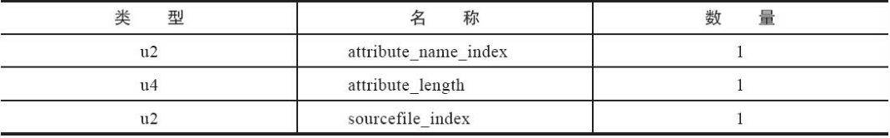
                  - sourcefile_index数据项是指向常量池中CONSTANT_Utf8_info型常量的索引，常量值是源码文件的文件名
              - SourceDebugExtension
                - 为了方便在编译器和动态生成的Class中加入供程序员使用的自定义内容，在JDK 5时，新增了SourceDebugExtension属性用于存储额外的代码调试信息
                  - 典型的场景是在进行JSP文件调试时，无法 通过Java堆栈来定位到JSP文件的行号。JSR 45提案为这些非Java语言编写，却需要编译成字节码并运行在Java虚拟机中的程序提供了一个进行调试的标准机制，使用SourceDebugExtension属性就可以用于存储这个标准所新加入的调试信息，譬如让程序员能够快速从异常堆栈中定位出原始JSP中出现问题的行号
                - 结构 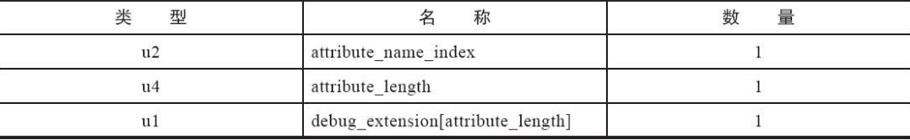
                  - debug_extension存储的就是额外的调试信息，是一组通过变长UTF-8格式来表示的字符串
                - 一个类中最多只允许存在一个SourceDebugExtension属性
            - ConstantValue
              - ConstantValue属性的作用是通知虚拟机自动为静态变量赋值
              - 只有被static关键字修饰的变量（类变量）才可以使用这项属性
                - 类似“int x=123”和“static int x=123”这样的变量定义在Java程序里面是非常常见的事情，但虚拟机对这两种变量赋值的方式和时刻都有所不同
                  - 对非static类型的变量（也就是实例变量）的赋值是在实例构造器&lt;init&gt;()方法中进行的
                  - 而对于类变量，则有两种方式可以选择：在类构造器&lt;clinit&gt;()方法中或者使用ConstantValue属性
              - 结构 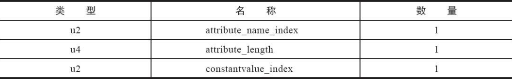
                - attribute_length数据项值必须固定 为2
                - constantvalue_index数据项代表了常量池中一个字面量常量的引用，根据字段类型的不同，字面量可以是CONSTANT_Long_info、CONSTANT_Float_info、CONSTANT_Double_info、CONSTANT_Integer_info和CONSTANT_String_info常量中的一种
            - InnerClasses 属性
              - InnerClasses属性用于记录内部类与宿主类之间的关联。如果一个类中定义了内部类，那编译器将会为它以及它所包含的内部类生成InnerClasses属性
              - 结构 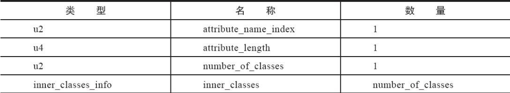
                - inner_classes_info 表结构 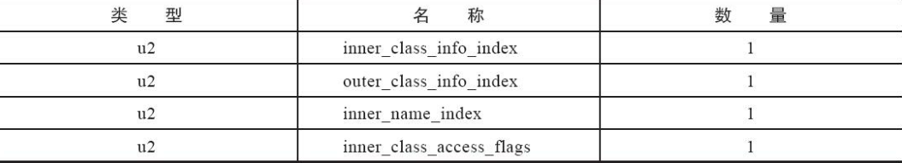
                  - inner_class_info_index和outer_class_info_index都是指向常量池中CONSTANT_Class_info型常量的索引，分别代表了内部类和宿主类的符号引用
                  - inner_name_index是指向常量池中CONSTANT_Utf8_info型常量的索引，代表这个内部类的名称，如果是匿名内部类，这项值为0
                  - inner_class_access_flags是内部类的访问标志，类似于类的access_flags 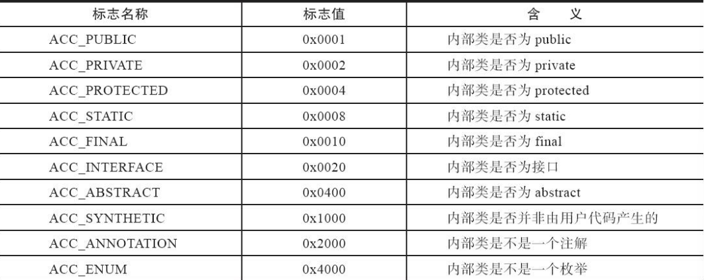
            - Deprecated 和 Synthetic 属性
              - Deprecated和Synthetic两个属性都属于标志类型的布尔属性，只存在有和没有的区别，没有属性值的概念
              - Deprecated属性用于表示某个类、字段或者方法，已经被程序作者定为不再推荐使用，它可以通过代码中使用“@deprecated”注解进行设置
              - Synthetic属性代表此字段或者方法并不是由Java源码直接产生的，而是由编译器自行添加的
                - 所有由不属于用户代码产生的类、方法及字段都应当至少设置Synthetic属性或者ACC_SYNTHETIC标志位中的一项，唯一的例外是实例构造器“&lt;init&gt;()”方法和类构造器“&lt;clinit&gt;()”方法
              - 两者的结构 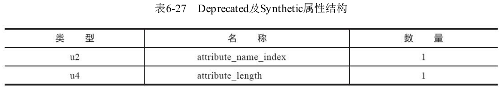
                - 其中attribute_length数据项的值必须为0x00000000，因为没有任何属性值需要设置
            - StackMapTable
              - 位于 Code 属性的属性表中
              - 这个属性会在虚拟机类加载的字节码验证阶段被新类型检查验证器（Type Checker）使用，目的在于代替以前比较消耗性能的基于数据流分析的类型推导验证器
              - StackMapTable属性中包含零至多个栈映射帧（Stack Map Frame），每个栈映射帧都显式或隐式地代表了一个字节码偏移量，用于表示执行到该字节码时局部变量表和操作数栈的验证类型
                - 类型检查验证器会通过检查目标方法的局部变量和操作数栈所需要的类型来确定一段字节码指令是否符合逻辑约束
              - 结构 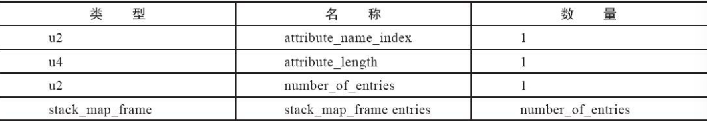
              - 在Java SE 7版之后的《Java虚拟机规范》中，明确规定对于版本号大于或等于50.0的Class文件，如果方法的Code属性中没有附带StackMapTable属性，那就意味着它带有一个隐式的StackMap属性，这个StackMap属性的作用等同于number_of_entries值为0的StackMapTable属性
              - 一个方法的Code属性最多只能有一个StackMapTable属性，否则将抛出ClassFormatError异常
            - Signature
              - 可选的定长属性，可以出现于类、字段表和方法表结构的属性表中
              - 任何类、接口、初始化方法或成员的泛型签名如果包含了类型变量（Type Variable）或参数化类型（Parameterized Type），则Signature属性会为它记录泛型签名信息
              - 之所以要专门使用这样一个属性去记录泛型类 型，是因为Java语言的泛型采用的是擦除法实现的伪泛型，字节码（Code属性）中所有的泛型信息编译（类型变量、参数化类型）在编译之后都通通被擦除掉
                - 使用擦除法的好处是实现简单（主要修改 Javac编译器，虚拟机内部只做了很少的改动）、非常容易实现Backport，运行期也能够节省一些类型所占的内存空间。但坏处是运行期就无法像C#等有真泛型支持的语言那样，将泛型类型与用户定义的普通类型同等对待，例如运行期做反射时无法获得泛型信息
                - Signature属性就是为了弥补这个缺陷而增设的，现在Java的反射API能够获取的泛型类型，最终的数据来源也是这个属性
              - 结构 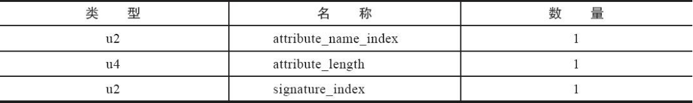
                - signature_index项的值必须是一个对常量池中 CONSTANT_Utf8_info 结构的有效索引，表示类签名或方法类型签名或字段类型签名
          - 续表 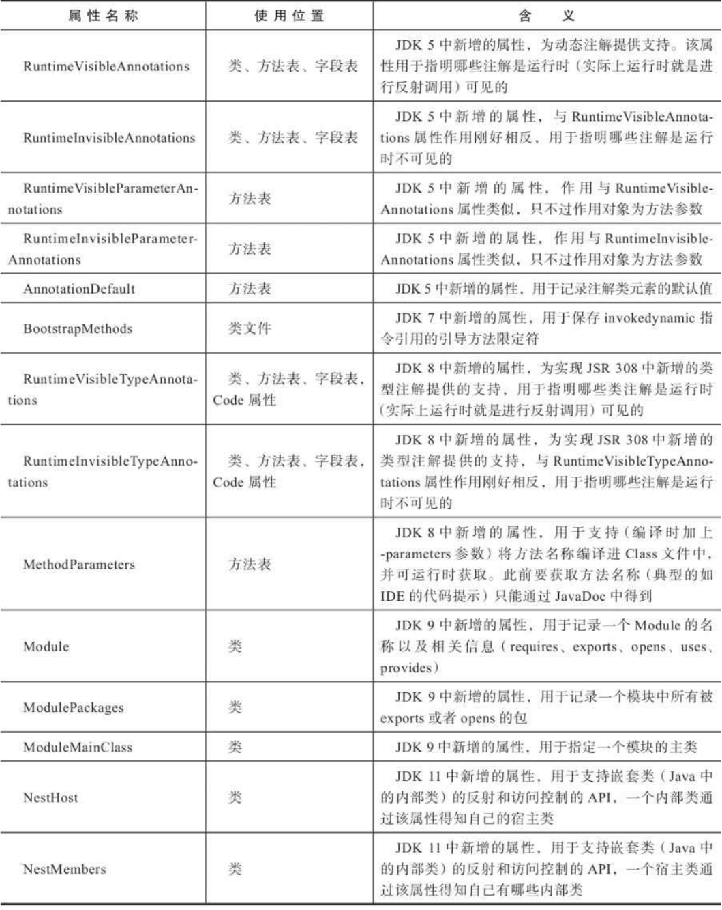
            - BootstrapMethods属性
              - 用于保存invokedynamic指令引用的引导方法限定符
              - 如果某个类文件结构的常量池中曾经出现 过CONSTANT_InvokeDynamic_info类型的常量，那么这个类文件的属性表中必须存在一个明确的 BootstrapMethods属性
              - 即使CONSTANT_InvokeDynamic_info类型的常量在常量池中出现过多次，类文件的属性表中最多也只能有一个BootstrapMethods属性
              - 结构 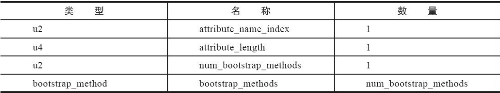
                - bootstrap_method 属性结构 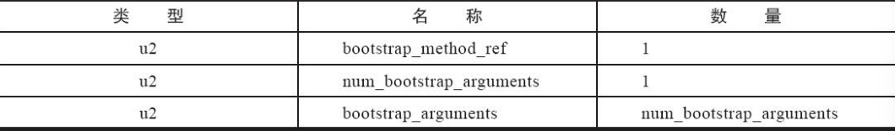
                  - bootstrap_method_ref项的值必须是一个对常量池的有效索引。常量池在该索引处的值必须是一个CONSTANT_MethodHandle_info结构
                  - num_bootstrap_arguments项的值给出了bootstrap_argu-ments[]数组成员 的数量
                  - bootstrap_arguments[]数组的每个成员必须是一个对常量池的有效索引。 常量池在该索引出必须是下列结构之一：CONSTANT_String_info、CONSTANT_Class_info、 CONSTANT_Integer_info、CONSTANT_Long_info、CONSTANT_Float_info、 CONSTANT_Double_info、CONSTANT_MethodHandle_info或CONSTANT_MethodType_info
            - MethodParameters属性
              - 用在方法表中的变长属性
              - 成因 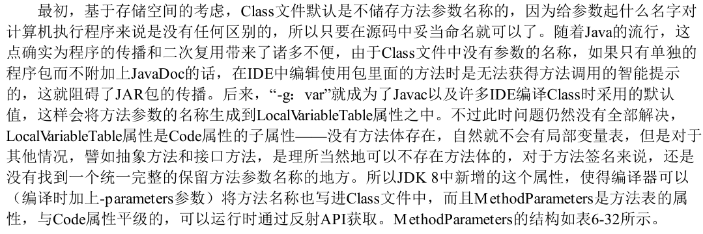
              - 结构 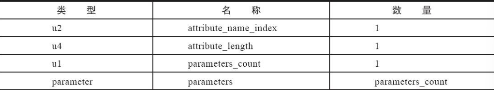
                - parameter 属性 
                  - name_index是一个指向常量池CONSTANT_Utf8_info常量的索引值，代表了该参数的名称
                  - access_flags是参数的状态指示器，它可以包含以下三种状态中的一种或多种
                    - 0x0010（ACC_FINAL）：表示该参数被final修饰
                    - 0x1000（ACC_SYNTHETIC）：表示该参数并未出现在源文件中，是编译器自动生成的
                    - 0x8000（ACC_MANDATED）：表示该参数是在源文件中隐式定义的。Java语言中的典型场景是 this关键字
        - 对于每一个属性，它的名称都要从常量池中引用一个CONSTANT_Utf8_info类型的常量来表示，而属性值的结构则是完全自定义的，只需要通过一个u4的长度属性去说明属性值所占用的位数即可 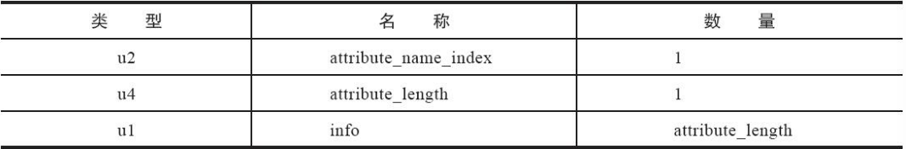
  - 字节码指令（简介）
    - 指令就是某种额定操作含义的数字，称为操作码（Opcode），以及跟随其后的 0 至多个代表此操作所需的参数，称为操作数（Operand）
    - 由于Java虚拟机采用面向操作数栈而不是面向寄存器的架构，所以大多数指令都不包含操作数，只有一个操作码，指令参数都存放在操作数栈中
    - 在Java虚拟机的指令集中，大多数指令都包含其操作所对应的数据类型信息
      - iload指令用于从局部变量表中加载int型的数据到操作数栈中，而fload指令加载的则是float类型的数据
      - i代表对int类型的数据操作，l代表long，s代表short，b代表byte，c代表char，f代表float，d代表double，a代表reference
      - 也有一些指令的助记符中没有明确指明操作类型的字母
      - JVM 指令集所支持的指令和数据类型对应关系 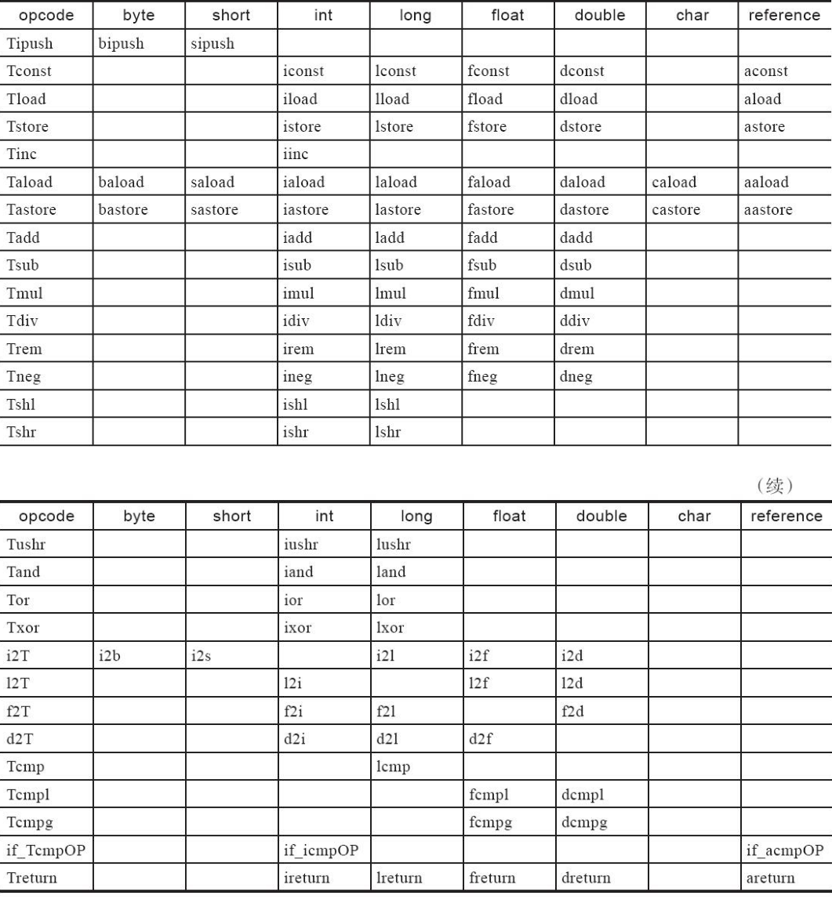
        - 大部分指令都没有支持整数类型byte、char和short，甚至没有任何指令支持boolean类型。编译器会在编译期或运行期将byte和short类型的数据带符号扩展（Sign-Extend）为相应的int类型数据，将boolean和char类型数据零位扩展（Zero-Extend）为相应的int类型数据
        - 在处理boolean、byte、short和char类型的数组时，也会转换为使用对应的int类型的字节码指令来处理
    - 加载和存储指令
      - 将一个局部变量加载到操作栈
        - iload、iload_&lt;n&gt;、lload、lload_&lt;n&gt;、fload、fload_&lt;n&gt;、dload、dload_&lt;n&gt;、aload、aload_&lt;n&gt;
        - iload_&lt;n&gt; 代表的意思就是将 n 加载到操作数栈，n 的取值范围是 0 ~ 3
      - 将一个数值从操作数栈存储到局部变量表
        - istore、istore_&lt;n&gt;、lstore、lstore_&lt;n&gt;、fstore、fstore_&lt;n&gt;、dstore、dstore_&lt;n&gt;、astore、astore_&lt;n&gt;
      - 将一个常量加载到操作数栈
        - bipush、sipush、ldc、ldc_w、ldc2_w、aconst_null、iconst_m1、iconst_&lt;i&gt;、lconst_&lt;l&gt;、fconst_&lt;f&gt;、dconst_&lt;d&gt;
      - 扩充局部变量表的访问索引的指令
        - wide
    - 运算指令
      - 加法指令：iadd、ladd、fadd、dadd
      - 减法指令：isub、lsub、fsub、dsub
      - 乘法指令：imul、lmul、fmul、dmul
      - 除法指令：idiv、ldiv、fdiv、ddiv
      - 求余指令：irem、lrem、frem、drem
      - 取反指令：ineg、lneg、fneg、dneg
      - 位移指令：ishl、ishr、iushr、lshl、lshr、lushr
      - 按位或指令：ior、lor
      - 按位与指令：iand、land
      - 按位异或指令：ixor、lxor
      - 局部变量自增指令：iinc
      - 比较指令：dcmpg、dcmpl、fcmpg、fcmpl、lcmp
    - 类型转换指令
      - Java虚拟机直接支持（即转换时无须显式的转换指令）以下数值类型的宽化（Widening Numeric Conversion 小转换为大）类型转换
        - int类型到long、float或者double类型
        - long类型到float、double类型
        - float类型到double类型
      - 处理窄化类型转换（Narrowing Numeric Conversion）时，就必须显式地使用转换指令来完成，这些转换指令包括i2b、i2c、i2s、l2i、f2i、f2l、d2i、d2l和d2f
        - 窄化类型转换可能会导致转换结果产生不同的正负号、不同的数量级的情况，转换过程很可能会导致数值的精度丢失
        - Java虚拟机将一个浮点值窄化转换为整数类型T（T限于int或long类型之一）的时候，必须遵循以下转换规则
          - 如果浮点值是NaN，那转换结果就是int或long类型的0
          - 如果浮点值不是无穷大的话，浮点值使用IEEE 754的向零舍入模式取整，获得整数值v。如果v在目标类型T（int或long）的表示范围之类，那转换结果就是v；否则，将根据v的符号，转换为T所能表示的最大或者最小正数
    - 对象创建与访问指令
      - 创建类实例的指令：new
      - 创建数组的指令：newarray、anewarray、multianewarray
      - 访问类字段（static字段，或者称为类变量）和实例字段（非static字段，或者称为实例变量）的指令：getfield、putfield、getstatic、putstatic
      - 把一个数组元素加载到操作数栈的指令：baload、caload、saload、iaload、laload、faload、 daload、aaload
      - 将一个操作数栈的值储存到数组元素中的指令：bastore、castore、sastore、iastore、fastore、dastore、aastore
      - 取数组长度的指令：arraylength
      - 检查类实例类型的指令：instanceof、checkcast
    - 操作数栈管理指令
      - 将操作数栈的栈顶一个或两个元素出栈：pop、pop2
      - 复制栈顶一个或两个数值并将复制值或双份的复制值重新压入栈顶：dup、dup2、dup_x1、 dup2_x1、dup_x2、dup2_x2
      - 将栈最顶端的两个数值互换：swap
    - 控制转移指令
      - 条件分支：ifeq、iflt、ifle、ifne、ifgt、ifge、ifnull、ifnonnull、if_icmpeq、if_icmpne、if_icmplt、 if_icmpgt、if_icmple、if_icmpge、if_acmpeq和if_acmpne
      - 复合条件分支：tableswitch、lookupswitch
      - 无条件分支：goto、goto_w、jsr、jsr_w、ret
    - 方法调用和返回指令
      - invokevirtual指令：用于调用对象的实例方法，根据对象的实际类型进行分派（虚方法分派）
      - invokeinterface指令：用于调用接口方法，它会在运行时搜索一个实现了这个接口方法的对象，找出适合的方法进行调用
      - invokespecial指令：用于调用一些需要特殊处理的实例方法，包括实例初始化方法、私有方法和父类方法
      - invokestatic指令：用于调用类静态方法（static方法）
      - invokedynamic指令：用于在运行时动态解析出调用点限定符所引用的方法。并执行该方法。前面四条调用指令的分派逻辑都固化在Java虚拟机内部，用户无法改变，而invokedynamic指令的分派逻辑是由用户所设定的引导方法决定的
      - 方法调用指令与数据类型无关，而方法返回指令是根据返回值的类型区分的，包括ireturn（当返回值是boolean、byte、char、short和int类型时使用）、lreturn、freturn、dreturn和areturn，另外还有一条return指令供声明为void的方法、实例初始化方法、类和接口的类初始化方法使用
    - 异常处理指令
      - 在Java程序中显式抛出异常的操作（throw语句）都由athrow指令来实现，除了用throw语句显式抛出异常的情况之外，《Java虚拟机规范》还规定了许多运行时异常会在其他Java虚拟机指令检测到异常状况时自动抛出。例如前面介绍整数运算中，当除数为零时，虚拟机会在idiv或ldiv指令中抛出ArithmeticException异常
    - 同步指令
      - Java虚拟机可以支持方法级的同步和方法内部一段指令序列的同步，这两种同步结构都是使用管 程（Monitor，更常见的是直接将它称为“锁”）来实现的
      - 方法级的同步是隐式的，无须通过字节码指令来控制，它实现在方法调用和返回操作之中
        - 虚拟机可以从方法常量池中的方法表结构中的ACC_SYNCHRONIZED访问标志得知一个方法是否被声明为同步方法。当方法调用时，调用指令将会检查方法的ACC_SYNCHRONIZED访问标志是否被设置，如果设置了，执行线程就要求先成功持有管程，然后才能执行方法，最后当方法完成（无论是正常完成还是非正常完成）时释放管程。在方法执行期间，执行线程持有了管程，其他任何线程都无法再获取到同一个管程。如果一个同步方法执行期间抛出了异常，并且在方法内部无法处理此异常，那这个同步方法所持有的管程将在异常抛到同步方法边界之外时自动释放
      - 同步一段指令集序列通常是由Java语言中的synchronized语句块来表示的
        - Java虚拟机的指令集中有monitorenter和monitorexit两条指令来支持synchronized关键字的语义，正确实现synchronized关键字 需要Javac编译器与Java虚拟机两者共同协作支持
          - 为了保证在方法异常完成时monitorenter和monitorexit指令依然可以正确配对执行，编译器会自动产生一个异常处理程序，这个异常处理程序声明可处理所有的异常，它的目的就是用来执行monitorexit指令
  - 虚拟机类加载机制
    - Java虚拟机把描述类的数据从Class文件加载到内存，并对数据进行校验、转换解析和初始化，最终形成可以被虚拟机直接使用的Java类型，这个过程被称作虚拟机的类加载机制
    - 类加载的阶段
      - 加载（Loading）
      - 验证（Verification）
      - 准备（Preparation）
      - 解析（Resolution）
        - 某些情况下可以在初始化阶段之后再开始。故而可以支持 Java 的运行时绑定特性（动态绑定或晚期绑定）
      - 初始化（Initialization）
      - 使用（Using）
      - 卸载（Unloading）
    - 类加载的时机（何时执行第一阶段“加载”）
      - JVM 规范规定有且仅有 6 中情况必须立即对类进行初始化（即执行类加载过程）
        - 遇到new、getstatic、putstatic或invokestatic这四条字节码指令时，如果类型没有进行过初始化，则需要先触发其初始化阶段
        - 使用java.lang.reflect包的方法对类型进行反射调用的时候，如果类型没有进行过初始化，则需要先触发其初始化
        - 当初始化类的时候，如果发现其父类还没有进行过初始化，则需要先触发其父类的初始化
          - 当一个类在初始化时，要求其父类全部都已经初始化过了，但是一个接口在初始化时，并不要求其父接口全部都完成了初始化，只有在真正使用到父接口的时候（如引用接口中定义的常量）才会初始化
        - 当虚拟机启动时，用户需要指定一个要执行的主类（包含main()方法的那个类），虚拟机会先初始化这个主类
        - 当使用JDK 7新加入的动态语言支持时，如果一个java.lang.invoke.MethodHandle实例最后的解析结果为REF_getStatic、REF_putStatic、REF_invokeStatic、REF_newInvokeSpecial四种类型的方法句柄，并且这个方法句柄对应的类没有进行过初始化，则需要先触发其初始化
        - 当一个接口中定义了JDK 8新加入的默认方法（被default关键字修饰的接口方法）时，如果有这个接口的实现类发生了初始化，那该接口要在其之前被初始化
      - 上述六种场景中的行为称为对一个类型进行主动引用。除此之外，所有引用类型的方式都不会触发初始化，称为被动引用
    - 类加载的过程
      - 加载
        - 主要完成 3 件事情
          - 通过一个类的全限定名来获取定义此类的二进制字节流
            - 从 ZIP 压缩包中读取： JAR、EAR、WAR
            - 从网络中获取，例如 Web Applet
            - 运行时计算生成。例如动态代理技术，在 java.lang.reflect.Proxy 中，就是用了ProxyGenerator.generateProxyClass()来为特定接口生成形式为“*$Proxy”的代理类的二进制字节流
            - 由其他文件生成：JSP 应用，由 JSP 文件生成对应的 Class 文件
            - 从数据库中读取，这种场景相对少见些，例如有些中间件服务器（如SAP Netweaver）可以选择把程序安装到数据库中来完成程序代码在集群间的分发
            - 可以从加密文件中获取，这是典型的防Class文件被反编译的保护措施，通过加载时解密Class文件来保障程序运行逻辑不被窥探
          - 通过这个字节流所代表的静态存储结构转换为方法区的运行时数据结构
            - 方法区中的数据存储格式完全由虚拟机实现自行定义
          - 在内存中生成一个代表这个类的 java.lang.Class 对象，作为方法区这个类的各种数据的访问入口
        - 加载阶段既可以使用Java虚拟机里内置的引导类加载器来完成，也可以由用户自定义的类加载器去完成，开发人员通过定义自己的类加载器去控制字节流的获取方式（重写一个类加载器的findClass()或loadClass()方法），实现根据自己的想法来赋予应用程序获取运行代码的动态性
        - 数组类比较特殊，本身不通过类加载器创建，而是由 JVM 直接在内存中动态地构造出来。数组类的创建过程遵循以下规则
          - 如果数组的组件类型是引用类型，那就递归采用本节中定义的加载过程去加载这个组件类型，数组C将被标识在加载该组件类型的类加载器的类名称空间上
            - 组件类型（Component Type，指的是数组去掉一个维度的类型，注意和前面的元素类型区分开来
          - 如果数组的组件类型不是引用类型（例如int[]数组的组件类型为int），Java虚拟机将会把数组C标记为与引导类加载器关联
          - 数组类的可访问性与它的组件类型的可访问性一致，如果组件类型不是引用类型，它的数组类的可访问性将默认为public，可被所有的类和接口访问到
      - 验证
        - 是连接阶段的第一步，这一阶段的目的是确保Class文件的字节流中包含的信息符合《Java虚 拟机规范》的全部约束要求，保证这些信息被当作代码运行后不会危害虚拟机自身的安全
        - 4 个阶段的验证动作
          - 文件格式验证
            - 是否以魔数0xCAFEBABE开头
            - 主、次版本号是否在当前Java虚拟机接受范围之内
            - 常量池的常量中是否有不被支持的常量类型（检查常量tag标志）
            - 指向常量的各种索引值中是否有指向不存在的常量或不符合类型的常量
            - CONSTANT_Utf8_info型的常量中是否有不符合UTF-8编码的数据
            - Class文件中各个部分及文件本身是否有被删除的或附加的其他信息
            - ...
            - 只有通过了这个阶段的验证之后，这段字节流才被允许进入Java虚拟机内存的方法区中进行存储，所以后面的三个验证阶段全部是基于方法区的存储结构上进行的，不会再直接读取、操作字节流了
          - 元数据验证
            - 这个类是否有父类（除了java.lang.Object之外，所有的类都应当有父类）
            - 这个类的父类是否继承了不允许被继承的类（被final修饰的类）
            - 如果这个类不是抽象类，是否实现了其父类或接口之中要求实现的所有方法
            - 类中的字段、方法是否与父类产生矛盾（例如覆盖了父类的final字段，或者出现不符合规则的方法重载，例如方法参数都一致，但返回值类型却不同等）
            - ....
            - 第二阶段的主要目的是对类的元数据信息进行语义校验，保证不存在与《Java语言规范》定义相悖的元数据信息
          - 字节码验证
            - 对类的方法体（Class文件中的Code属性）进行校验分析，保证被校验类的方法在运行时不会做出危害虚拟机安全的行为
              - 保证任意时刻操作数栈的数据类型与指令代码序列都能配合工作，例如不会出现类似于“在操作栈放置了一个int类型的数据，使用时却按long类型来加载入本地变量表中”这样的情况
              - 保证任何跳转指令都不会跳转到方法体以外的字节码指令上
              - 保证方法体中的类型转换总是有效的，例如可以把一个子类对象赋值给父类数据类型，这是安全的，但是把父类对象赋值给子类数据类型，甚至把对象赋值给与它毫无继承关系、完全不相干的一个数据类型，则是危险和不合法的
              - ...
            - JVM 和 javac 在这个阶段的联动 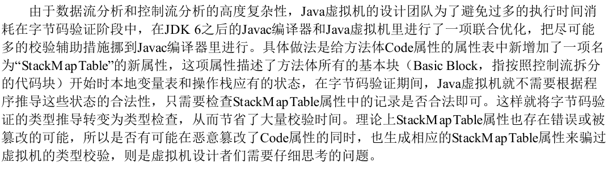
          - 符号引用验证
            - 最后一个阶段的校验行为发生在虚拟机将符号引用转化为直接引用的时候，这个转化动作将在连接的第三阶段——解析阶段中发生
            - 符号引用验证可以看作是对类自身以外（常量池中的各种符号引用）的各类信息进行匹配性校验，通俗来说就是，该类是否缺少或者被禁止访问它依赖的某些外部类、方法、字段等资源
              - 符号引用中通过字符串描述的全限定名是否能找到对应的类
              - 在指定类中是否存在符合方法的字段描述符及简单名称所描述的方法和字段
              - 符号引用中的类、字段、方法的可访问性（private、protected、public、&lt;package&gt;）是否可被当前类访问
              - .....
            - 如果无法通过符号引用验证，Java虚拟机 将会抛出一个java.lang.IncompatibleClassChangeError的子类异常，典型的如： java.lang.IllegalAccessError、java.lang.NoSuchFieldError、java.lang.NoSuchMethodError等
        - 验证阶段对于虚拟机的类加载机制来说，是一个非常重要的、但却不是必须要执行的阶段，因为 验证阶段只有通过或者不通过的差别，只要通过了验证，其后就对程序运行期没有任何影响了。如果程序运行的全部代码（包括自己编写的、第三方包中的、从外部加载的、动态生成的等所有代码）都已经被反复使用和验证过，在生产环境的实施阶段就可以考虑使用-Xverify：none参数来关闭大部分的类验证措施，以缩短虚拟机类加载的时间
      - 准备
        - 正式为类中定义的变量（即静态变量，被static修饰的变量）分配内存并设置类变量初始值（通常情况下为类型的零值）
          - public static int value = 123; 在准备阶段过后， value 的值是 0 而不是 123
          - 从概念上来看，这些变量所使用的内存都应当在方法区中进行分配。但是，方法区现在只是一个逻辑上的概念，在 JDK 8 以后，类变量会和 Class 对象一起存放在 Java 堆中
        - 如果类字段的字段属性表中存在ConstantValue属性，那在准备阶段变量值就会被初始化为ConstantValue属性所指定的初始值
          - 例如: public static final int value = 123; 在准备阶段过后，VM 就会根据编译器产生的 ConstantValue 属性来赋值为 123
      - 解析
        - 解析阶段是Java虚拟机将常量池内的符号引用替换为直接引用的过程
        - 符号引用
          - 符号引用以一组符号来描述所引用的目标，符号可以是任何形式的字面量，只要使用时能无歧义地定位到目标即可
          - 符号引用与虚拟机实现的内存布局无关，引用的目标并不一定是已经加载到虚拟机内存当中的内容
          - 符号引用的字面量形式明确定义在《Java虚拟机规范》的Class文件格式中
        - 直接引用
          - 直接引用是可以直接指向目标的指针、相对偏移量或者是一个能间接定位到目标的句柄
          - 直接引用是和虚拟机实现的内存布局直接相关的，同一个符号引用在不同虚拟机实例上翻译出来的直接引用一般不会相同。如果有了直接引用，那引用的目标必定已经在虚拟机的内存中存在
        - 解析发生的具体时机
          - 《Java虚拟机规范》之中并未规定解析阶段发生的具体时间，只要求了在执行ane-warray、 checkcast、getfield、getstatic、instanceof、invokedynamic、invokeinterface、invoke-special、 invokestatic、invokevirtual、ldc、ldc_w、ldc2_w、multianewarray、new、putfield和putstatic这17个用于操作符号引用的字节码指令之前，先对它们所使用的符号引用进行解析。所以虚拟机实现可以根据需 要来自行判断，到底是在类被加载器加载时就对常量池中的符号引用进行解析，还是等到一个符号引用将要被使用前才去解析它
        - 对方法或者字段的访问，也会在解析阶段中对它们的可访问性（public、protected、private、&lt;package&gt;）进行检查
        - 对一个符号引用的多次解析请求
          - 除invokedynamic指令以外，虚拟机实现可 以对第一次解析的结果进行缓存，譬如在运行时直接引用常量池中的记录，并把常量标识为已解析状态，从而避免解析动作重复进行
            - invokedynamic 指令对应的引用被称为动态调用点限定符（Dynamically-computed Call Site Specifier）
          - 无论是否真正执行了多次解析动作，Java虚拟机都需要保证的是在同一个实体中，如果一个符号引用之前已经被成功解析过，那么后续的引用解析请求就应当一直能够成功
        - 解析动作主要针对下列几种符号引用
          - 类或接口
            - 对应常量池中的 CONSTANT_Class_info
            - 假设当前代码所处的类为D，如果要把一个从未解析过的符号引用N解析为一个类或接口C的直接引用，那虚拟机完成整个解析的过程需要包括以下3个步骤
              - 如果C不是一个数组类型，那虚拟机将会把代表N的全限定名传递给D的类加载器去加载这个类C
                - 在加载过程中，由于元数据验证、字节码验证的需要，又可能触发其他相关类的加载动作
                - 一旦这个加载过程出现了任何异常，解析过程就将宣告失败
              - 如果C是一个数组类型，并且数组的元素类型为对象，也就是N的描述符会是类似“[Ljava/lang/Integer”的形式，那将会按照上一步的规则去加载数组元素类型
                - 接着由虚拟机生成一个代表该数组维度和元素的数组对象
              - 访问权限验证如果上面两步没有出现任何异常，那么C在虚拟机中实际上已经成为一个有效的类或接口了，但在解析完成前还要进行符号引用验证，确认D是否具备对C的访问权限。如果发现不具备访问权限，将抛出java.lang.IllegalAccessError异常
                - 判断 D 拥有 C 的访问权限规则
                  - 被访问类C是public的，并且与访问类D处于同一个模块
                  - 被访问类C是public的，不与访问类D处于同一个模块，但是被访问类C的模块允许被访问类D的 模块进行访问
                  - 被访问类C不是public的，但是它与访问类D处于同一个包中
          - 字段
            - CONSTANT_Fieldref_info
            - 步骤
              - 1\. 对字段表内 class_index 项中索引的 CONSTANT_Class_info 符号引用进行解析，也就是字段所属的类或接口的符号引用，假设解析成功完成，那把这个字段所属的类或接口用 C 来表示
                - 如果在解析这个类或接口 C 的符号引用的过程中出现了任何异常，都会导致字段符号引用解析的失败
              - 2\. 如果C本身就包含了简单名称和字段描述符都与目标相匹配的字段，则返回这个字段的直接引用，查找结束
              - 3\. 如果在C中实现了接口，将会按照继承关系从下往上递归搜索各个接口和它的父接口，如果接口中包含了简单名称和字段描述符都与目标相匹配的字段，则返回这个字段的直接引用，查找结束
              - 4\. 如果C不是java.lang.Object的话，将会按照继承关系从下往上递归搜索其父类，如果在父类中包含了简单名称和字段描述符都与目标相匹配的字段，则返回这个字段的直接引用，查找结束
              - 5\. 否则，查找失败，抛出java.lang.NoSuchFieldError异常
              - 6\. 如果查找过程成功返回了引用，将会对这个字段进行权限验证，如果发现不具备对字段的访问权限，将抛出java.lang.IllegalAccessError异常
          - 类方法
            - CONSTANT_Methodref_info
            - 步骤
              - 1\. 先解析出方法表的 class_index 项中索引的方法所属的类或接口的符号引用。如果解析成功，用 C 来表示这个类
              - 2\. 由于Class文件格式中类的方法和接口的方法符号引用的常量类型定义是分开的，如果在类的方法表中发现class_index中索引的C是个接口的话，那就直接抛出java.lang.IncompatibleClassChangeError 异常
              - 3\. 在类 C 中查找是否有简单名称和描述符都与目标相匹配的方法，如果有则返回这个方法的直接引用，查找结束
              - 4\. 在 C 的父类中递归查找是否有简单名称和描述符都与目标相匹配的方法，如果有，则返回这个方法的直接引用，查找结束
              - 5\. 在类C实现的接口列表及它们的父接口之中递归查找是否有简单名称和描述符都与目标相匹配的方法，如果存在匹配的方法，说明类C是一个抽象类，这时候查找结束，抛出java.lang.AbstractMethodError异常
                - 如果不是一个抽象类，则实现的方法应该属于自己（类 C 的类方法），则在第 3. 中就应该返回了，不会执行到这里
              - 6\. 否则，宣告方法查找失败，抛出java.lang.NoSuchMethodError
              - 7\. 如果查找过程成功返回了直接引用，将会对这个方法进行权限验证，如果发现不具备对此方法的访问权限，将抛出java.lang.IllegalAccessError异常
          - 接口方法
            - CONSTANT_InterfaceMethodref_info
            - 步骤
              - 1\. 先解析出接口方法表的 class_index 中的索引方法所属的类或接口的符号引用，如果解析成功，则用 C 来表示这个接口
              - 2\. 如果在接口方法表中发现class_index中的索引C是个类而不是接口，那么就直接抛出java.lang.IncompatibleClassChangeError异常
              - 3\. 否则，在接口C中查找是否有简单名称和描述符都与目标相匹配的方法，如果有则返回这个方法的直接引用，查找结束
              - 4\. 否则，在接口C的父接口中递归查找，直到java.lang.Object类（接口方法的查找范围也会包括Object类中的方法）为止，看是否有简单名称和描述符都与目标相匹配的方法，如果有则返回这个方法的直接引用，查找结束
                - 由于Java的接口允许多重继承，如果C的不同父接口中存有多个简单名称和描述符都与目标相匹配的方法，那将会从这多个方法中返回其中一个并结束查找
              - 5\. 否则，宣告方法查找失败，抛出java.lang.NoSuchMethodError异常
            - 在JDK 9之前，Java接口中的所有方法都默认是public的，也没有模块化的访问约束，所以不存在访问权限的问题，接口方法的符号解析就不可能抛出java.lang.IllegalAccessError异常
              - 在JDK 9中增加了接口的静态私有方法，也有了模块化的访问约束，所以从JDK 9起，接口方法的访问也完全有可能因访问权限控制而出现java.lang.IllegalAccessError异常
          - 方法类型
            - CONSTANT_MethodType_info
          - 方法句柄
            - CONSTANT_MethodHandle_info
          - 调用点限定符
            - CONSTANT_Dynamic_info
            - CONSTANT_InvokeDynamic_info
      - 初始化
        - 初始化阶段就是执行类构造器&lt;clinit&gt;()方法的过程
        - &lt;clinit&gt;()并不是程序员在Java代码中直接编写的方法，它是Javac编译器的自动生成物
          - 是由编译器自动收集类中的所有类变量的赋值动作和静态语句块（static{}块）中的语句合并产生的
          - 编译器收集的顺序是由语句在源文件中出现的顺序决定的，静态语句块中只能访问到定义在静态语句块之前的变量，定义在它之后的变量，在前面的静态语句块可以赋值，但是不能访问 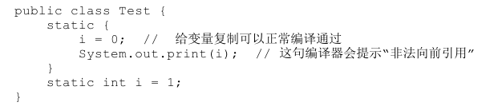
        - Java虚拟机会保证在子类的&lt;clinit&gt;()方法执行前，父类的&lt;clinit&gt;()方法已经执行完毕。因此在Java虚拟机中第一个被执行的&lt;clinit&gt;()方法的类型肯定java.lang.Object
        - &lt;clinit&gt;()方法对于类或接口来说并不是必需的，如果一个类中没有静态语句块，也没有对变量的赋值操作，那么编译器可以不为这个类生成&lt;clinit&gt;()方法
        - 接口中不能使用静态语句块，但仍然有变量初始化的赋值操作，因此接口与类一样都会生成&lt;clinit&gt;()方法
          - 执行接口的&lt;clinit&gt;()方法不需要先执行父接口的&lt;clinit&gt;()方法，因为只有当父接口中定义的变量被使用时，父接口才会被初始化
          - 接口的实现类在初始化时也一样不会执行接口的&lt;clinit&gt;()方法
        - Java虚拟机必须保证一个类的&lt;clinit&gt;()方法在多线程环境中被正确地加锁同步，如果多个线程同时去初始化一个类，那么只会有其中一个线程去执行这个类的&lt;clinit&gt;()方法，其他线程都需要阻塞等待，直到活动线程执行完毕&lt;clinit&gt;()方法
          - 如果在一个类的&lt;clinit&gt;()方法中有耗时很长的操作，那就可能造成多个进程阻塞
          - 其他线程虽然会被阻塞，但如果执行＜clinit＞()方法的那条线程退出＜clinit＞()方法 后，其他线程唤醒后则不会再次进入＜clinit＞()方法。同一个类加载器下，一个类型只会被初始化一次
    - 类加载器
      - 每个类加载器，都有一个独立的类名称空间。所以，对于任何一个类，都必须由加载它的类加载器和这个类本身一起共同确立其在 JVM 中的唯一性
        - 一个类由多个类加载器加载过后，彼此并不相等。这里所指的“相等”，包括代表类的Class对象的equals()方法、isAssignableFrom()方法、isInstance()方法的返回结果，也包括了使用instanceof关键字做对象所属关系判定等各种情况
        - 例如，输出： class org.example.ClassLoaderTest false 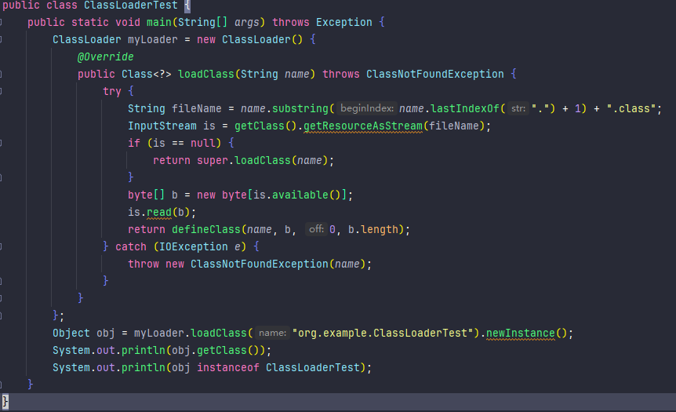
          - 输出 false 的原因：Java虚拟机中同时存在了两个ClassLoaderTest类，一个是由虚拟机的应用程序类加载器所加载的，另外一个是由我们自定义的类加载器加载的，虽然它们都来自同一个Class文件，但在Java虚拟机中仍然是两个互相独立的类，做对象所属类型检查时的结果自然为 false
      - 双亲委派模型
        - VM 视角的 2 种类加载器
          - VM 本身的类加载器
          - 所有其他的类加载器，由 Java 实现，全部继承自 java.lang.ClassLoader
        - Java Developer 视角中的类加载器
          - 三层类加载器、双亲委派的类加载架构
        - 三层类加载器
          - 启动类加载器（Bootstrap Class Loader）
            - 负责加载存放在&lt;JAVA_HOME&gt;\\lib目录，或者被-Xbootclasspath参数所指定的路径中存放的，而且是Java虚拟机能够识别的（按照文件名识别，如rt.jar、tools.jar，名字不符合的类库即使放在lib目录中也不会被加载）类库加载到虚拟机的内存中
            - 启动类加载器无法被Java程序直接引用，用户在编写自定义类加载器时，如果需要把加载请求委派给引导类加载器去处理，那直接使用null代替即可(即如果调用 ClassLoader.getClassLoader 返回 null，那么代表的就是启动类加载器)
          - 扩展类加载器（Extension Class Loader）
            - 在类 sun.misc.Launcher$ExtClassLoader 中以 Java 的形式实现的，负责加载&lt;JAVA_HOME&gt;\\lib\\ext目录中，或者被java.ext.dirs系统变量所指定的路径中所有的类库
              - $ 代表是 sum.misc.Launcher 中名为 ExtClassLoader 的内部类
            - JDK的开发团队允许用户将具有通用性的类库放置在ext目录里以扩展Java SE的功能，在JDK 9之后，这种扩展机制被模块化带来的天然的扩展能力所取代
            - 由于扩展类加载器是由Java代码实现的，开发者可以直接在程序中使用扩展类加载器来加载Class文件
          - 应用程序类加载器（Application Class Loader）
            - 由 sun.misc.Launcher$AppClassLoader来实现
            - 由于应用程序类加载器是ClassLoader类中的getSystemClassLoader()方法的返回值，所以有些场合中也称它为“系统类加载器”
            - 如果应用程序中没有自定义过自己的类加载器，一般情况下这个就是程序中默认的类加载器
        - 各个类之间的协作关系 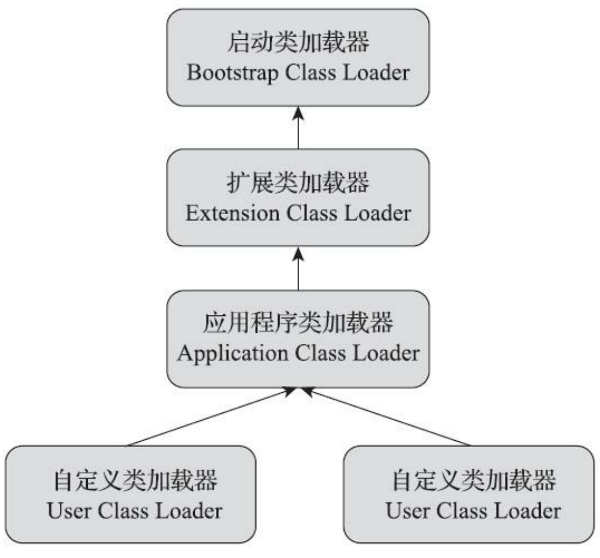
          - 图中各个类加载器之间的层次关系被称为类加载器的双亲委派模型（Parents Delegation Model） 
          - 双亲委派模型要求除了顶层的启动类加载器外，其余的类加载器都应该有自己的父类加载器，不过父子关系一般不是通过继承的关系来实现的，通常是通过组合（Compositon）
        - 双亲委派模型的工作过程 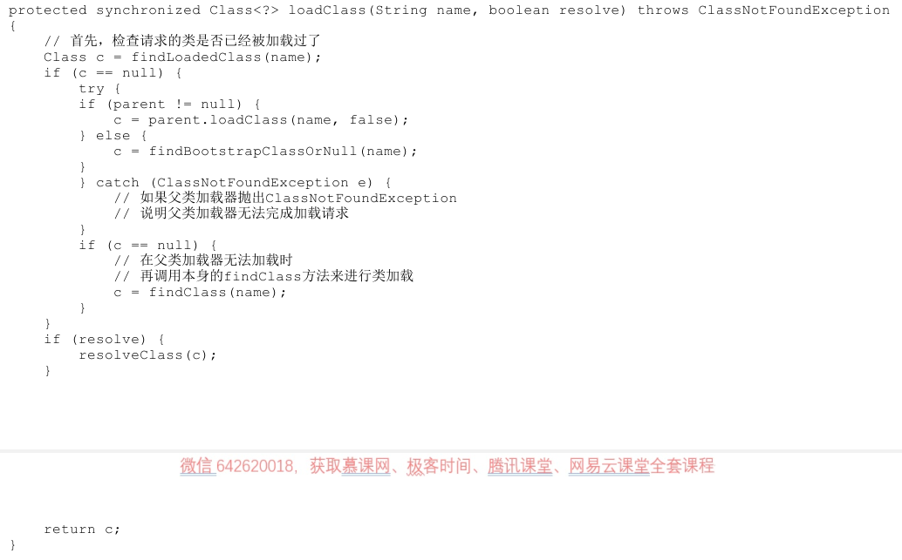
          - 如果一个类加载器收到了类加载的请求，它首先不会自己去尝试加载这个类，而是把这个请求委派给父类加载器去完成，每一个层次的类加载器都是如此
          - 因此所有的加载请求最终都应该传送到最顶层的启动类加载器中，只有当父加载器反馈自己无法完成这个加载请求（它的搜索范围中没有找到所需的类）时，子加载器才会尝试自己去完成加载
        - 双亲委派模型优点
          - Java中的类随着它的类加载器一起具备了一种带有优先级的层次关系
            - 例如类java.lang.Object，它存放在rt.jar之中，无论哪一个类加载器要加载这个类，最终都是委派给处于模型最顶端的启动类加载器进行加载，因此Object类在程序的各种类加载器环境中都能够保证是同一个类
            - 反之，如果没有使用双亲委派模型，都由各个 类加载器自行去加载的话，如果用户自己也编写了一个名为java.lang.Object的类，并放在程序的ClassPath中，那系统中就会出现多个不同的Object类，Java类型体系中最基础的行为也就无从保证，应用程序将会变得一片混乱
    - Java 模块化系统
      - 为了实现 Java 9 引入的模块化系统的目标：可配置的封装隔离机制，Java虚拟机对类加载架构也做出了相应的变动调整，才使模块化系统得以顺利地运作
        - 此前，如果类路径中缺失了运行时依赖的类型，那就只能等程序运行到发生该类型的加载、链接 时才会报出运行的异常。而在JDK 9以后，如果启用了模块化进行封装，模块就可以声明对其他模块的显式依赖，这样Java虚拟机就能够在启动时验证应用程序开发阶段设定好的依赖关系在运行期是否完备，如有缺失那就直接启动失败，从而避免了很大一部分由于类型依赖而引发的运行时异常
      - Java 模块
        - 充当代码的容器
        - 依赖其他模块的列表
        - 导出的包的列表，即其他模块可用的列表
        - 开放的包列表，即其他模块可反射访问的列表
        - 使用的服务列表
        - 提供服务的实现列表
      - 模块与非模块之间的兼容性
        - 为了使可配置的封装隔离机制能够兼容传统的类路径查找机制，JDK 9提出了与“类路径”（ClassPath）相对应的“模块路径”（ModulePath）的概念
          - 某个类库到底是模块还是传统的JAR包，只取决于它存放在哪种路径上。只要是放在类路径上的JAR文件，无论其中是否包含模块化信息（是否包含了module-info.class文件），它都会被当作传统的JAR包来对待
          - 相应地，只要放在模块路径上的JAR文件，即使没有使用JMOD后缀，甚至说其中并不包含module-info.class文件，它也仍然会被当作一个模块来对待
        - 按照以下规则来保证使用传统类路径依赖的 Java 代码可以不修改地直接运行在 JDK 9 以后的 Java 版本上
          - JAR 文件在类路径的访问规则
            - 所有类路径下的JAR文件及其他资源文件，都被视为自动打包在一个匿名模块（Unnamed Module）里，这个匿名模块几乎是没有任何隔离的，它可以看到和使用类路径上所有的包、JDK系统模块中所有的导出包，以及模块路径上所有模块中导出的包
          - 模块在模块路径的访问规则
            - 模块路径下的具名模块（Named Module）只能访问到它依赖定义中列明依赖的模块和包，匿名模块里所有的内容对具名模块来说都是不可见的，即具名模块看不见传统JAR包的内容
          - JAR文件在模块路径的访问规则
            - 如果把一个传统的、不包含模块定义的JAR文件放置到模块路径中，它就会变成一个自动模块（Automatic Module）
            - 尽管不包含module-info.class，但自动模块将 默认依赖于整个模块路径中的所有模块，因此可以访问到所有模块导出的包
            - 自动模块也默认导出自己所有的包
        - Java模块化系统目前不支持在模块定义中加入版本号来管理和约束依赖，本身也不支持多版本号的概念和版本选择功能
      - 模块下的类加载器与三层类加载器架构以及双亲委派模型之间的区别
        - 扩展类加载器（Extension Class Loader）被平台类加载器（Platform Class Loader）取代
        - 平台类加载器以及应用程序类加载器都不在派生 java.net.URLClassLoader
        - 启动、平台和应用类加载器都全部继承于 jdk.internal.loader.BuiltinClassLoader
          - BuiltinClassLoader 中实现了新的模块化架构下类从模块中加载的逻辑，以及模块中资源可访问性的处理
        - 启动类加载器（JDK 8 以后命名为 BootClassLoader）现在是在 JVM 内部和 Java 类库共同协作实现的类加载器
          - 尽管有了BootClassLoader这样的Java类，但为了与之前的代码保持兼容，所有在获取启动类加载器的场景（譬如Object.class.getClassLoader()）中仍然会返回null来代替，而不会得到BootClassLoader的实例
      - JDK 9 后的类加载器委派模型 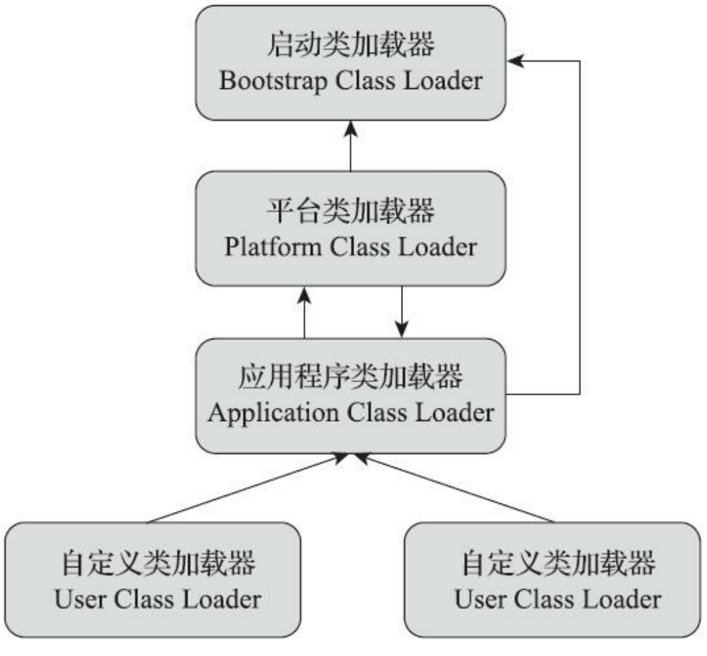
        - java 模块化系统明确规定了三个类加载器负责各自加载的模块
          - 启动类加载器 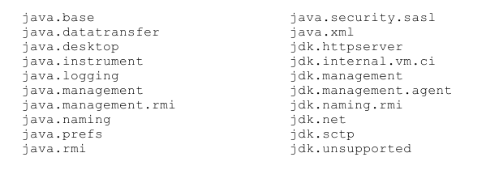
          - 平台类加载器 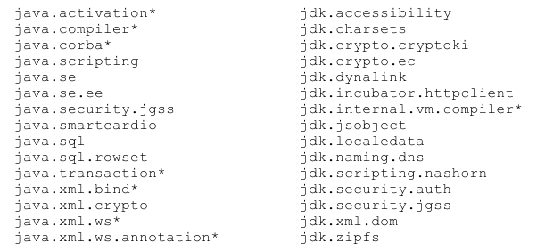
          - 应用程序类加载器 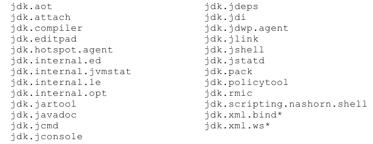
  - 虚拟机字节码执行引擎
    - 运行时栈帧结构 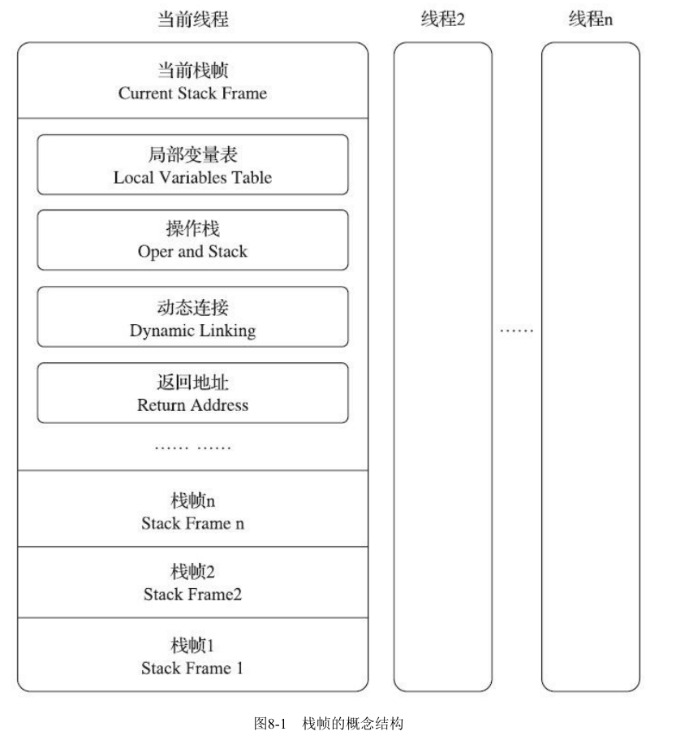
      - 栈帧是虚拟机栈的存储内容
      - 栈帧存储了方法的局部变量表、操作数栈、动态连接和方法返回地址等信息
      - 在编译Java程序源码的时候，栈帧中需要多大的局部变量表，需要多深的操作数栈就已经被分析计算出来，并且写入到方法表的Code属性之中
      - 局部变量表（Local Variables Table）
        - 用于存放方法参数和方法内部定义的局部变量
        - 方法的 Code 属性的 max_locals 数据项中确定了该方法所需分配的局部变量表的最大容量
        - 以变量槽（Variable Slot）为最小单位
          - 一个变量槽可以存放一个 32 位以内的数据类型，包括 boolean、byte、char、short、int、float、reference 和 returnAddress
            - Java虚拟机规范中没有明确规定reference类型的长度，它的长度与实际使用32位还是64位虚拟机有关，如果是64位虚拟机，还与是否开启某些对象指针压缩的优化有关
            - 通过 reference 做的 2 件事
              - 根据引用直接或间接地查找到对象在Java堆中的数据存放的起始地址或索引
              - 根据引用直接或间接地查找到对象所属数据类型在方法区中的存储的类型信息
            - returnAddress类型目前已经很少见了，它是为字节码指令jsr、jsr_w和ret服务的，指向了一条字节码指令的地址，某些很古老的Java虚拟机曾经使用这几条指令来实现异常处理时的跳转，但现在也已经全部改为采用异常表来代替了
          - 对于64位的数据类型（long 和 double），Java虚拟机会以高位对齐的方式为其分配两个连续的变量槽空间
            - 如果采用任何方式访问这两个变量槽中的一个，则在类加载的检验阶段中抛出异常
          - 为了尽可能节省栈帧耗用的内存空间，局部变量表中的变量槽是可以重用的，方法体中定义的变 量，其作用域并不一定会覆盖整个方法体，如果当前字节码PC计数器的值已经超出了某个变量的作用域，那这个变量对应的变量槽就可以交给其他变量来重用
            - 不过，这样的设计除了节省栈帧空间以外，还会伴随有少量额外的副作用，例如在某些情况下变量槽的复用会直接影响到系统的垃圾收集行为
        - 局部变量不会经历准备阶段，即 VM 不会为变量赋默认的零值。但是编译器可以在编译器就指出问题
      - 操作数栈（操作栈）
        - 是一个后入先出（Last In First Out，LIFO）栈
        - 操作数栈的最大胜读在编译时被写入到 Code 属性的 max_stacks 数据项之中
          - Javac编译器的数据流分析工作保证了在方法执行的任何时候，操作数栈的深度都不会超过在max_stacks数据项中设定的最大值
        - 操作数栈的每一个元素都可以是包括long和double在内的任意Java数据类型。32位数据类型所占的栈容量为1，64位数据类型所占的栈容量为2
        - 当一个方法刚刚开始执行的时候，这个方法的操作数栈是空的，在方法的执行过程中，会有各种 字节码指令往操作数栈中写入和提取内容，也就是出栈和入栈操作
        - 在概念模型中，两个不同栈帧作为不同方法的虚拟机栈的元素，是完全相互独立的。但是在大多虚拟机的实现里都会进行一些优化处理，令两个栈帧出现一部分重叠 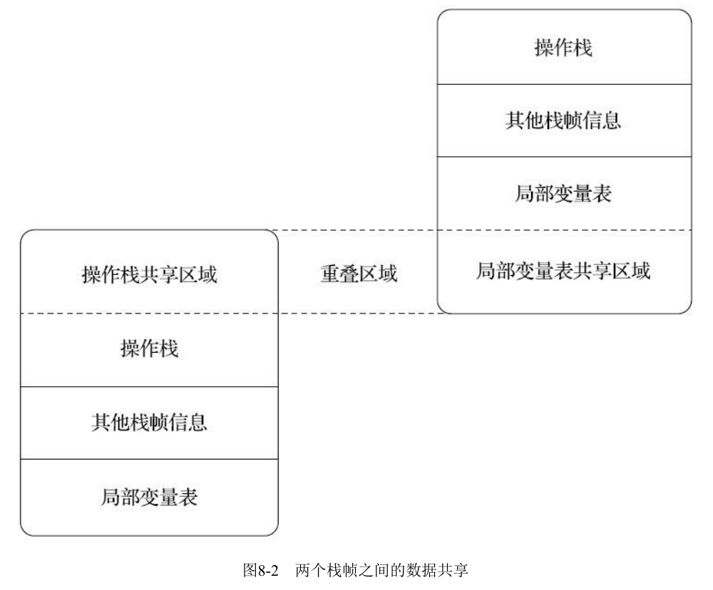
          - 主要是为了在进行方法调用时可以直接共用一部分数据，无需进行额外的参数复制
      - 动态连接
        - 每个栈帧中都包含一个指向运行时常量池中该栈帧所属方法的引用，目的是支持方法调用过程中的动态连接（Dynamic Linking）
        - 动态连接的符号引用每次都会被解析
      - 方法返回地址
        - 方法返回的两种方式
          - 使用返回指令。方法是否有返回值以及返回值的类型将根据遇到何种方法返回指令来决定，这种调用方法的方式被称为正常调用完成
          - 方法执行的过程中遇到了异常，并且这个异常在方法体内没有得到妥善处理，这种退出方法被称为异常调用完成。这种方法不会给它的调用者提供任何返回值
        - 无论采用何种退出方式，在方法退出之后，都必须返回到最初方法被调用时的位置，程序才能继续执行，方法返回时可能需要在栈帧中保存一些信息，用来帮助恢复它的上层主调方法的执行状态
          - 一般来说，方法正常退出时，主调方法的PC计数器的值就可以作为返回地址，栈帧中很可能会保存这个计数器值
          - 而方法异常退出时，返回地址是要通过异常处理器表来确定的，栈帧中就一般不会保存这部分信息
      - 附加信息
        - 《Java虚拟机规范》允许虚拟机实现增加一些规范里没有描述的信息到栈帧之中，例如与调试、性能收集相关的信息，这部分信息完全取决于具体的虚拟机实现
    - 方法调用
      - 方法调用并不等同于方法中的代码被执行，方法调用阶段唯一的任务就是确定被调用方法的版本（即调用哪一个方法），暂时还未涉及方法内部的具体运行过程
      - 某些调用需要在类加载期间，甚至到运行期间才能确定目标方法的直接引用
      - 解析
        - 所有方法调用的目标方法在Class文件里面都是一个常量池中的符号引用，在类加载的解析阶段，会将其中的一部分符号引用转化为直接引用
        - 这种解析能够成立的前提是：方法在程序真正运行之前就有一个可确定的调用版本，并且这个方法的调用版本在运行期是不可改变的
        - 调用目标在程序代码写好、编译器进行编译那一刻就已经确定下来。这类方法的调用被称为解析（Resolution）调用
        - 为了调用不同类型的方法，字节码指令集里设计了不同的指令
          - invokestatic：调用静态方法
          - invokespecial：用于调用实例构造器&lt;init&gt;() 方法、私有方法和父类中的方法
          - invokevirtual：用于调用所有的虚方法
          - invokeinterface：用于调用接口方法，会在运行时确定一个实现该接口的对象
          - invokedynamic：先在运行时动态解析出调用点限定符所引用的方法，然后再执行该方法。此指令的分配逻辑由用户设定的引导方法来决定
        - 被invokestatic和invokespecial 指令调用的方法静态方法、私有方法、实例构造器、父类方法和被 invokevirtual调用的方法（被 final 修饰的方法）会在类加载的时候就把符号引用解析为该方法的直接引用，这些方法被称为非虚方法，其他方法就被称为虚方法
      - 分派（Dispatch）
        - 静态分派
          - 示例，输出: hello,guy! hello,guy! 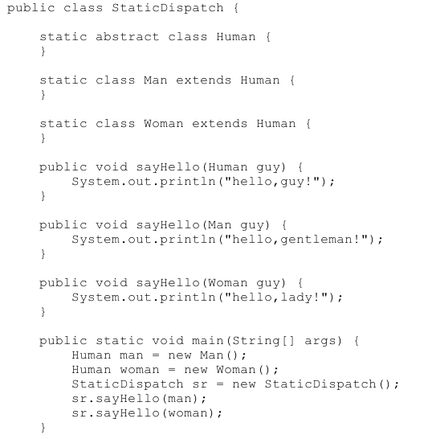
            - 把 Human 称为变量的静态类型（staitc type）或者外观类型（Apparent Type），Man 被称为实际类型（Actual Type）或者运行时类型（Runtime Type）
            - 造成输出 hello,guy! 的原因是静态类型是 Human，而虚拟机在重载时是通过参数的静态类型来重载方法的
            - 由于静态类型在编译期可知，所以在编译阶段，Javac编译器就根据参数的静态类型决定了会使用哪个重载版本，因此选择了sayHello(Human)作为调用目标，并把这个方法的符号引用写到 main()方法里的两条invokevirtual指令的参数中
            - 编译器虽然能确定出方法的重载版本，但是很多情况下不是唯一的 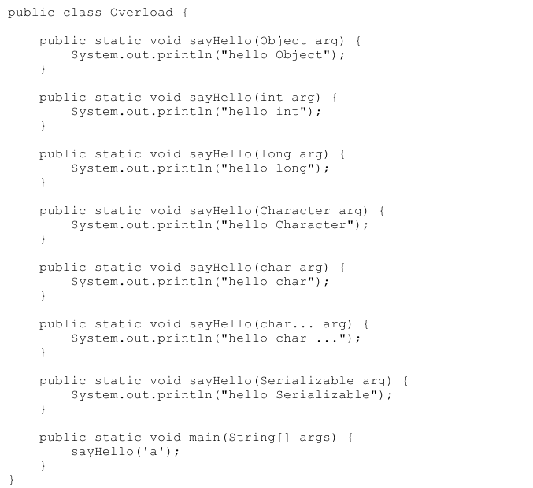
              - 如果注释掉参数为 char 的方法，则会使用 int 版本的方案，如果再注释掉 int，会使用 long 的，如果再注释掉 long，则会使用 Character
                - 这里发生了自动类型转换，按照 char&gt;int&gt;long&gt;floatt&gt;double 的顺序转型进行匹配
                - 又发生了自动装箱，'a' 被包装为它的封装类型 java.lang.Character
              - 又注释掉 Character 的方法，会调用 Serializable 的方法
                - 因为java.lang.Serializable是java.lang.Character类实现的一个接口，当自动装箱之后发现还是找不到装箱类，但是找到了装箱类所实现的接口类型，所以紧接着又发生一次自动转型
                - char可以转型成int，但是Character是绝对不会转型为Integer的，它只能安全地转型为它实现的接口或父类
                - Character还实现了另外一个接口java.lang.Comparable&lt;Character&gt;，如果同时出现两个参数分别为Serializable和 Comparable&lt;Character&gt;的重载方法，那它们在此时的优先级是一样的。编译器无法确定要自动转型为哪种类型，会提示“类型模糊”（Type Ambiguous），并拒绝编译
              - 又注释掉 Serializable 的方法，会调用 Object 参数的方法
                - 这时是char装箱后转型为父类了，如果有多个父类，那将在继承关系中从下往上开始搜索，越接上层的优先级越低
                - 即使方法调用传入的参数值为null时，这个规则仍然适用
              - 又注释掉 Object 参数的方法，才会调用 char ... 的方法
        - 动态分派
          - 与重写有着很大的关系
          - invokevirtual 指令如何确定调用方法版本，如何实现多态查找？
            - 1\. 找到操作数栈顶的第一个元素所指向的对象的实际类型，记作 C
            - 2\. 如果在类型 C 中找到常量中的的描述符和简单名称都相符的方法，则进行访问权限检验，如果通过则返回这个方法的直接引用，查找过程结束；不通过则返回 java.lang.IllegalAccessError
            - 3\. 否则，则按照继承关系从下往上依次对 C 的各个父类进行第二步的搜索和验证
            - 4\. 如果始终没有找到合适的方法，则抛出 java.lang.AbstractMethodError 异常
        - 单分派与多分派
          - 方法的接受者（即方法的所有者）与方法的参数统称为方法的宗量，根据分派基于多少种宗量，可以将分派划分为单分派和多分派 2 种
          - 单分派
            - 根据一个宗量对目标方法进行选择
            - 静态分派时，编译器根据静态类型和方法参数来进行分派，会有多个不同的宗量，故而 Java 语言的静态分派属于多分派类型
          - 多分派
            - 根据多个总量对目标方法进行选择
            - 在动态分派阶段，由于编译器已经确定了目标方法的签名，唯一影响 VM 选择的因素只是方法的接受者的实际类型，只有一个宗量作为选择依据，所以 Java 语言的动态分配属于单分派类型
          - Java语言是一门静态多分派、动态单分派的语言
        - VM 动态分派的实现
          - 动态分派是执行非常频繁的动作，而且动态分派的方法版本选择过程需要运行时在接收者类型的方法元数据中搜索合适的目标方法，故而，为了性能考虑，常见的优化手段是为类型在方法区中建立一个虚方法表（Virtual Method Table,vtable）,与此对应，在 invokeinterface 执行时也会使用到接口方法表（Interface Method Table，itable）
          - 方法表的结构 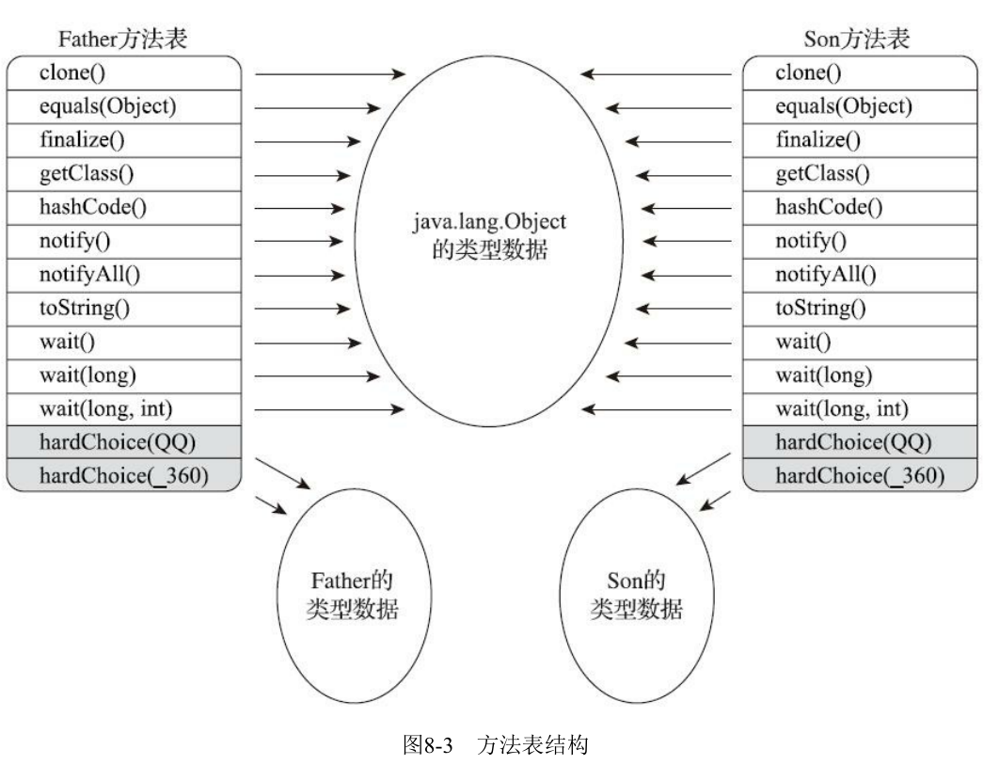
            - 虚方法表中存放着各个方法的实际入口地址
            - 如果某个方法在子类中没有被重写，那子类的虚方法表中的地址入口和父类相同方法的地址入口是一致的，都指向父类的实现入口
            - 如果子类中重写了这个方法，子类虚方法表中的地址也会被替换为指向子类实现版本的入口地址
            - 为了程序实现方便，具有相同签名的方法，在父类、子类的虚方法表中都应当具有一样的索引序 号，这样当类型变换时，仅需要变更查找的虚方法表，就可以从不同的虚方法表中按索引转换出所需的入口地址
          - 虚方法表一般在类加载的连接阶段进行初始化，准备了类的变量初始值后，虚拟机会把该类的虚方法表也一同初始化完毕
          - 虚拟机除了使用虚方法表之外，为了进一步提高性能，还会使用类型继承关系分析（Class Hierarchy Analysis，CHA）、守护内联（Guarded Inlining）、内联缓存（Inline Cache）等多种非稳定的激进优化来争取更大的性能空间
  - 动态类型语言支持
    - java.lang.invoke 包的主要目的是在之前单纯依靠符号引用来确定调用的目标方法这条路之外，提供了一种新的动态确定目标方法的机制，称为方法句柄（Method Handle），类似与 C 中的函数指针 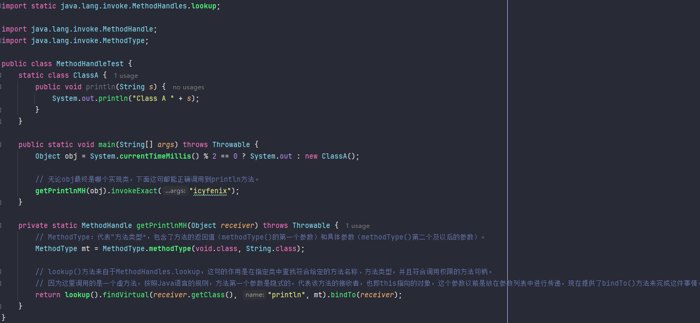
    - invokedynamic 指令
      - invokedynamic指令与MethodHandle机制的作用是一样的，都是为了解决原有4条“invoke*”指令方法分派规则完全固化在虚拟机之中的问题，把如何查找目标方法的决定权从虚拟机转嫁到具体用户代码之中，让用户（广义的用户，包含其他程序语言的设计者）有更高的自由度
      - 每一处含有invokedynamic指令的位置都被称作动态调用点（Dynamically-Computed Call Site）
      - 这条指令的第一个参数为 CONSTANT_InvokeDynamic_info 常量，包含 3 项信息
        - 引导方法（Bootstrap Method）
          - 存放在新增的 Bootstrap Methods 属性中
          - 引导方法是有固定的参数，并且返回值规定是java.lang.invoke.CallSite对象，这个对象代表了真正要执行的目标方法调用
        - 方法类型（MethodType）
        - 名称
      - 根据CONSTANT_InvokeDynamic_info常量中提供的信息，虚拟机可以找到并且执行引导方法，从而获得一个CallSite对象，最终调用到要执行的目标方法上
- 并发
  - Java 内存模型
    - 主要目的是定义程序中各种变量的访问规则，即关注在虚拟机中把变量值存储到内存和从内存中取出变量值这样的底层细节
      - 上面说的变量包括了实例字段、静态字段和构成数组对象的元素，但是不包括局部变量与方法参数，因为后者是线程私有的，不会被共享，自然就不会存在竞争问题
    - 规定 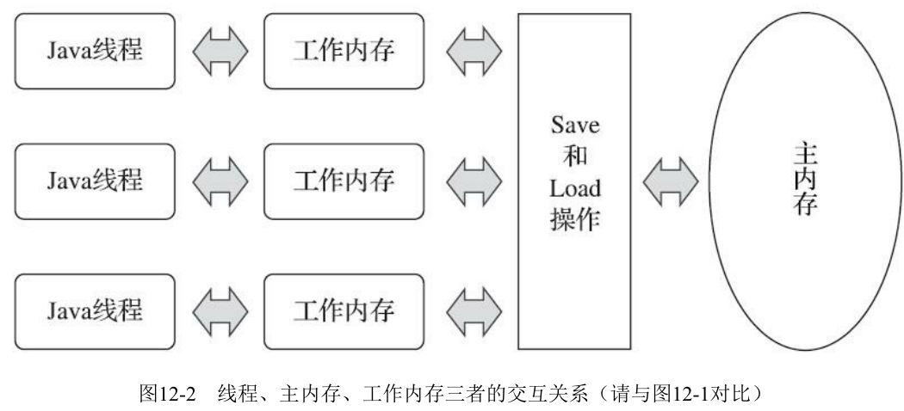
      - 类比 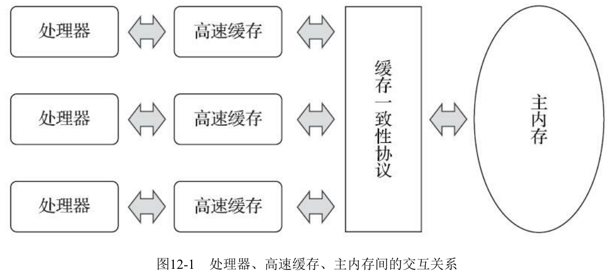
      - 所有的变量都存储在主内存上
      - 每条线程都有自己的工作内存（Working Memory），保存了被线程使用的变量的主内存的副本（但不是一个对象的完整副本）
      - 线程对变量的所有操作都必须在工作内存中进行，而不能直接读写主内存中的数据
      - 不同的线程之间无法直接访问对方工作内存中的变量，线程之间变量值的传递需要通过主内存来完成
      - 主内存与工作内存之间交互操作（VM 必须保证下面的每一种操作都是原子的、不可再分的）
        - lock（锁定）
          - 作用与主内存的变量
          - 把一个变量标识为一条线程独占的状态
        - unlock（解锁）
          - 作用于主内存的变量
          - 把一个处于锁定状态的变量释放出来，释放后的变量才可以被其他线程锁定
        - read（读取）
          - 作用于主内存的变量
          - 把一个变量的值从主内存传输到线程的工作内存中，以便随后的 load 动作使用
        - load（载入）
          - 作用于工作内存的变量
          - 把 read 操作从主内存中得到的变量放入工作内存的变量副本中
        - use（使用）
          - 作用于工作内存的变量
          - 把工作内存中的一个变量的值传递给执行引擎
          - 每当虚拟机遇到一个需要使用变量的值的字节码指令时会执行这个操作
        - assign（赋值）
          - 作用于工作内存的变量
          - 把一个从执行引擎接受到的值赋给工作内存的变量
          - 每当虚拟机遇到一个给变量赋值的字节码指令时执行这个操作
        - store（存储）
          - 作用于工作内存的变量
          - 把工作内存中一个变量的值传送到主内存中，以便随后的 write 操作使用
        - write（写入）
          - 作用于主内存的变量
          - 把 store 操作从工作内存中得到的变量的值放入主内存的变量中
      - 上述 8 种操作之间必须满足的规则
        - 如果要把一个变量从主内存拷贝到工作内存，那就要按顺序执行read和load操作
        - 如果要把变量从工作内存同步回主内存，就要按顺序执行store和write操作
        - 不允许read和load、store和write操作之一单独出现
          - 即不允许一个变量从主内存读取了但工作内存不接受，或者工作内存发起回写了但主内存不接受的情况出现
        - 不允许一个线程丢弃它最近的assign操作
          - 即变量在工作内存中改变了之后必须把该变化同步回主内存
        - 不允许一个线程无原因地（没有发生过任何assign操作）把数据从线程的工作内存同步回主内存中
        - 一个新的变量只能在主内存中“诞生”，不允许在工作内存中直接使用一个未被初始化（load或 assign）的变量
          - 换句话说就是对一个变量实施use、store操作之前，必须先执行assign和load操作
        - 一个变量在同一个时刻只允许一条线程对其进行lock操作，但lock操作可以被同一条线程重复执行多次，多次执行lock后，只有执行相同次数的unlock操作，变量才会被解锁
        - 如果对一个变量执行lock操作，那将会清空工作内存中此变量的值。在执行引擎使用这个变量前，需要重新执行load或assign操作以初始化变量的值
        - 如果一个变量事先没有被lock操作锁定，那就不允许对它执行unlock操作，也不允许去unlock一个被其他线程锁定的变量
        - 对一个变量执行unlock操作之前，必须先把此变量同步回主内存中（执行store、write操作）
      - volatile 变量的特殊规则
        - volatile 具备的 2 项特性
          - 保证此变量对所有线程的可见性。可见性是指当一条线程修改了这个变量的值，新值对于其他线程来说是可以立即得知的
            - 虽然 volatile 变量在各个线程中是一致的，但是对于 volatile 变量的操作（运算）不是原子的，故而会出现数据竞争问题
            - 由于volatile变量只能保证可见性，在不符合以下两条规则的运算场景中，我们仍然要通过加锁 （使用synchronized、java.util.concurrent中的锁或原子类）来保证原子性
              - 运算结果并不依赖变量的当前值，或者能够确保只有单一的线程修改变量的值
              - 变量不需要与其他的状态变量共同参与不变约束
          - 禁止指令重排序优化
        - 规则（假设 T 代表一个线程， V 和 W 是两个 volatile 变量）
          - 只有当 T 对 V 执行的前一个动作是 load 时，才可以对 V 执行 use 动作；只有对 V 的后一个动作是 use 时，T 才能对 V 执行 load 动作
            - 线程T对变量V的use动作可以认为是和线程T对变量V的load、read动作相关联的，必须连续且一起出现
            - 这条规则要求在工作内存中，每次使用V前都必须先从主内存刷新最新的值，用于保证能看见其他线程对变量V所做的修改
          - 只有当线程T对变量V执行的前一个动作是assign的时候，线程T才能对变量V执行store动作；并且，只有当线程T对变量V执行的后一个动作是store的时候，线程T才能对变量V执行assign动作
            - T对变量V的assign动作可以认为是和线程T对变量V的store、write动作相关联的，必须连续且一起出现
            - 这条规则要求在工作内存中，每次修改V后都必须立刻同步回主内存中，用于保证其他线程可以 看到自己对变量V所做的修改
          - 假定动作A是线程T对变量V实施的use或assign动作，假定动作F是和动作A相关联的load或store动作，假定动作P是和动作F相应的对变量V的read或write动作；与此类似，假定动作B是线程T对变量W实施的use或assign动作，假定动作G是和动作B相关联的load或store动作，假定动作Q是和动作G相应的对变量W的read或write动作。如果A先于B，那么P先于Q
            - 这条规则要求volatile修饰的变量不会被指令重排序优化，从而保证代码的执行顺序与程序的顺序相同
      - long 和 double 型变量的特殊规则
        - Java内存模型要求lock、unlock、read、load、assign、use、store、write这八种操作都具有原子性，但是对于64位的数据类型（long和double），在模型中特别定义了一条宽松的规定
          - 允许虚拟机将没有被volatile修饰的64位数据的读写操作划分为两次32位的操作来进行，即允许虚拟机实现自行选择是否要保证64位数据类型的load、store、read和write这四个操作的原子性
          - 这就是所谓的“long和double的非原子性协定”（Non-Atomic Treatment of double and long Variables）
    - 先行发生原则
      - 判断数据是否存在竞争，线程是否安全的非常重要的有用的手段
      - Java 内存模型存在的一些“天然的”先行发生关系
        - 程序次序规则
          - 在一个线程内，按照控制流顺序，书写在前面的操作先行发生于书写在后面的操作
            - 这里说的是控制流顺序而不是程序代码顺序，因为要考虑分支、循环等结构
        - 管程锁定规则
          - 一个unlock操作先行发生于后面对同一个锁的lock操作
        - volatile变量规则
          - 对一个volatile变量的写操作先行发生于后面对这个变量的读操作
        - 线程启动规则
          - Thread对象的start()方法先行发生于此线程的每一个动作
        - 线程终止规则
          - 线程中的所有操作都先行发生于对此线程的终止检测，我们可以通过Thread::join()方法是否结束、Thread::isAlive()的返回值等手段检测线程是否已经终止执行
        - 线程中断规则
          - 对线程interrupt()方法的调用先行发生于被中断线程的代码检测到中断事件的发生，可以通过Thread::interrupted()方法检测到是否有中断发生
        - 对象终结规则
          - 一个对象的初始化完成（构造函数执行结束）先行发生于它的finalize()方法的开始
        - 传递性
          - 如果操作A先行发生于操作B，操作B先行发生于操作C，那就可以得出操作A先行发生于操作C的结论
  - 线程安全
    - 线程安全的程度（由强至弱）
      - 不可变
        - 不可变（Immutable）的对象一定是线程安全的，无论是对象的方法实现还是方法的调用者，都不需要再进行任何线程安全保障措施
        - Java 当中的不可变的类型：String、枚举、java.lang.Number 的部分子类
      - 绝对线程安全
        - 当多个线程同时访问一个对象时，如果不用考虑这些线程在运行时环境下的调度和交替执行，也不需要进行额外的同步，或者在调用方进行任何其他的协调操作，调用这个对象的行为都可以获得正确的结果，那就称这个对象是线程安全的
      - 相对线程安全
        - 通常意义上所讲的线程安全，它需要保证对这个对象单次的操作是线程安全的，我们在调用的时候不需要进行额外的保障措施，但是对于一些特定顺序的连续调用，就可能需要在调用端使用额外的同步手段来保证调用的正确性
        - 在Java语言中，大部分声称线程安全的类都属于这种类型，例如Vector、HashTable、Collections的synchronizedCollection()方法包装的集合等
      - 线程兼容
        - 线程兼容是指对象本身并不是线程安全的，但是可以通过在调用端正确地使用同步手段来保证对象在并发环境中可以安全地使用
        - 例如 ArrayList 和 HashMap
      - 线程对立
        - 线程对立是指不管调用端是否采取了同步措施，都无法在多线程环境中并发使用代码
        - 例如 Thread 类的 suspend 和 resume 方法，还有 System.set[In|Out]
    - 线程安全的实现方法
      - 互斥同步（阻塞同步）
        - synchronized 关键字
        - synchronized关键字经过Javac编译之后，会在同步块的前后分别形成monitorenter和monitorexit这两个字节码指令。这两个字节码指令都需要一个reference类型的参数来指明要锁定和解锁的对象
          - 如果Java源码中的synchronized明确指定了对象参数，那就以这个对象的引用作为reference
          - 如果没有明确指定，那将根据synchronized修饰的方法类型（如实例方法或类方法），来决定是取代码所在的对象实例还是取类型对应的Class对象来作为线程要持有的锁
        - 在执行monitorenter指令时，首先要去尝试获取对象的锁。如果这个对象没被锁定，或者当前线程已经持有了那个对象的锁，就把锁的计数器的值增加一，而在执行monitorexit指令时会将锁计数器的值减一
          - 如果获取对象锁失败，那当前线程就应当被阻塞等待，直到请求锁定的对象被持有它的线程释放为止
          - 被synchronized修饰的同步块对同一条线程来说是可重入的。这意味着同一线程反复进入同步块也不会出现自己把自己锁死的情况
        - 被synchronized修饰的同步块在持有锁的线程执行完毕并释放锁之前，会无条件地阻塞后面其他线程的进入。这意味着无法像处理某些数据库中的锁那样，强制已获取锁的线程释放锁；也无法强制正在等待锁的线程中断等待或超时退出
        - 重入锁（ReentrantLock）
          - 与 synchronized 相比的高级功能
            - 等待可中断
              - 是指当持有锁的线程长期不释放锁的时候，正在等待的线程可以选择放弃等待，改为处理其他事情
              - 可中断特性对处理执行时间非常长的同步块很有帮助
            - 公平锁
              - 多个线程在等待同一个锁时，必须按照申请锁的时间顺序来依次获得锁
              - synchronized中的锁是非公平的，ReentrantLock在默认情况下也是非公平的，但可以通过带布尔值的构造函数要求使用公平锁
              - 一旦使用了公平锁，将会导致ReentrantLock的性能急剧下降，会明显影响吞吐量
            - 锁绑定多个条件
              - 一个ReentrantLock对象可以同时绑定多个Condition对象
              - 在synchronized中，锁对象的wait()跟它的notify()或者notifyAll()方法配合可以实现一个隐含的条件，如果要和多于一个的条件关联的时候，就不得不额外添加一个锁
              - 而ReentrantLock则无须这样做，多次调用newCondition()方法即可
      - 非阻塞同步
        - 互斥同步属于一种悲观的并发策略，无论共享的数据是否真的会出现竞争，它都会进行加锁
        - 基于冲突检测的乐观并发策略：不管风险，先进行操作，如果没有其他线程争用共享数据，那操作就直接成功了；如果共享的数据的确被争用，产生了冲突，那再进行其他的补偿措施，最常用的补偿措施是不断地重试，直到出现没有竞争的共享数据为止
        - CAS 操作将操作和冲突检测这两个步骤组合成了一个原子操作
        - CAS 操作的漏洞
          - 如果一个变量V初次读取的时候是A值，并且在准备赋值的时候检查到它仍然为A值，那就能说明它的值没有被其他线程改变过了吗？这是不能的，因为如果在这段期间它的值曾经被改成B，后来又被改回为A，那CAS操作就会误认为它从来没有被改变过
          - 这个漏洞称为CAS操作的“ABA问题”
      - 无同步方案
        - 如果能让一个方法本来就不涉及共享数据，那它自然就不需要任何同步措施去保证其正确性，因此会有一些代码天生就是线程安全的
        - 可重入代码（纯代码）：可以在代码执行的任何时刻中断它，转而去执行另外一段代码，而在控制权返回后，原来的程序不会出现任何错误，也不会对结果有什么影响
          - 如果一个方法的返回结果是可以预测的，只要输入了相同的数据，就都能返回相同的结果，那它就满足可重入性的要求，当然也就是线程安全的
          - 可重入代码有一些共同的特征，例如，不依赖全局变量、存储在堆上的数据和公用的系统资源， 用到的状态量都由参数中传入，不调用非可重入的方法等
        - 线程本地存储（Thread Local Storage）
          - 如果一段代码中所需要的数据必须与其他代码共享，那就看看这些共享数据的代码是否能保证在同一个线程中执行
          - 如果能保证，我们就可以把共享数据的可见范围限制在同一个线程之内，这样，无须同步也能保证线程之间不出现数据争用的问题
          - 每一个线程的Thread对象中都有一个ThreadLocalMap对象，这个对象存储了一组以ThreadLocal.threadLocalHashCode为键，以本地线程变量为值的K-V值对
          - ThreadLocal对象就是当前线程的ThreadLocalMap的访问入口，每一个ThreadLocal对象都包含了一个独一无二的threadLocalHashCode值，使用这个值就可以在线程K-V值对中找回对应的本地线程变量
    - 锁优化
      - 自旋锁与自适应自旋
        - 互斥同步对性能最大的影响是阻塞的实现，挂起线程和恢复线程的操作都需要转入内核态中完成，这些操作给Java虚拟机的并发性能带来了很大的压力。一个解决方法是让线程自旋等待一会儿，如果超过了一定的时间没有获得锁，才会被阻塞
        - 自旋次数的默认值是十次，用户也可以使用参数-XX：PreBlockSpin来自行更改
        - 在JDK 6中对自旋锁的优化，引入了自适应的自旋
          - 自适应意味着自旋的时间不再是固定的了，而是由前一次在同一个锁上的自旋时间及锁的拥有者的状态来决定的
      - 锁消除
        - 锁消除是指虚拟机即时编译器在运行时，对一些代码要求同步，但是对被检测到不可能存在共享数据竞争的锁进行消除
          - 如果判断到一段代码中，在堆上的所有数据都不会逃逸出去被其他线程访问到，那就可以把它们当作栈上数据对待，认为它们是线程私有的，同步加锁自然就无须再进行
      - 锁粗化
        - 原则上，我们在编写代码的时候，总是推荐将同步块的作用范围限制得尽量小——只在共享数据 的实际作用域中才进行同步，这样是为了使得需要同步的操作数量尽可能变少，即使存在锁竞争，等待锁的线程也能尽可能快地拿到锁
        - 但是如果一系列的连续操作都对同一个对象反复加锁和解锁，甚至加锁操作是出现在循环体之中的，那即使没有线程竞争，频繁地进行互斥同步操作也会导致不必要的性能损耗
      - 轻量级锁
        - “轻量级”是相对于使用操作系统互斥量来实 现的传统锁而言的
        - 轻量级锁的实现依赖于 HotSpot 虚拟机对象的内存布局的对象头部分
          - 对象头分为两部分
            - 一部分用于存储对象自身的运行时数据，如哈希值，GC 分代年龄等。这部分数据的长度在32位和64位的Java虚拟机中分别会占用32个或64个比特，官方称它为“Mark Word”。这部分是实现轻量级锁和偏向锁的关键
            - 另外一部分用于存储指向方法区对象类型数据的指针，如果是数组对象，还会有一个额外的部分用于存储数组长度
        - Mark Word 部分被设计为“动态”的数据类型 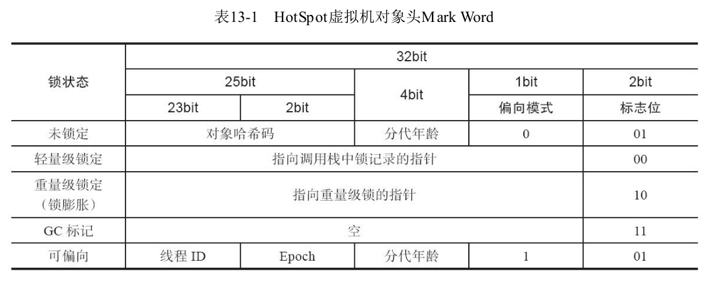
        - 轻量级锁的工作过程
          - 在代码即将进入同步块的时候，如果此同步对象没有被锁定（锁标志位为“01”状态），虚拟机首先将在当前线程的栈帧中建立一个名为锁记录（Lock Record）的空间，用于存储锁对象目前的Mark Word的拷贝（官方为这份拷贝加了一个Displaced前缀，即Displaced Mark Word）
          - 然后，虚拟机将使用CAS操作尝试把对象的Mark Word更新为指向Lock Record的指针
            - 如果这个更新动作成功了，即代表该线程拥有了这个对象的锁，并且对象Mark Word的锁标志位（Mark Word的最后两个比特）将转变为“00”，表示此对象处于轻量级锁定状态
            - 如果这个更新操作失败了，那就意味着至少存在一条线程与当前线程竞争获取该对象的锁。虚拟 机首先会检查对象的Mark Word是否指向当前线程的栈帧，如果是，说明当前线程已经拥有了这个对象的锁，那直接进入同步块继续执行就可以了，否则就说明这个锁对象已经被其他线程抢占了
          - 解锁过程也同样是通过CAS操作来进行的，如果对象的 Mark Word仍然指向线程的锁记录，那就用CAS操作把对象当前的Mark Word和线程中复制的Displaced Mark Word替换回来
            - 假如能够成功替换，那整个同步过程就顺利完成了；如果替换失败，则说明有其他线程尝试过获取该锁，就要在释放锁的同时，唤醒被挂起的线程
        - 轻量级锁能提升程序同步性能的依据是“对于绝大部分的锁，在整个同步周期内都是不存在竞争 的”这一经验法则
        - 如果出现两条以上的线程争用同一个锁的情况，那轻量级锁就不再有效，必须要膨胀为重量级锁，锁标志的状态值变为“10”，此时Mark Word中存储的就是指向重量级锁（互斥量）的指针，后面等待锁的线程也必须进入阻塞状态
      - 偏向锁
        - 目的是消除数据在无竞争情况下的同步原语，进一步提高程序的运行性能
        - 偏向锁中的偏指的是偏向，偏心，这个锁会偏向于第一个获得它的线程，如果再接下来的执行过程中，该锁一直没有被其他线程获取，则持有偏向锁的线程将永远不需要再进行同步
        - 工作过程
          - 假设当前虚拟机启用了偏向锁（启用参数-XX：+UseBiased Locking，这是自JDK 6起HotSpot虚拟机的默认值），那么当锁对象第一次被线程获取的时候，虚拟机将会把对象头中的标志位设置为“01”、把偏向模式设置为“1”，表示进入偏向模式
          - 同时使用CAS操作把获取到这个锁的线程的ID记录在对象的Mark Word之中
            - 如果CAS操作成功，持有偏向锁的线程以后每次进入这个锁相关的同步块时，虚拟机都可以不再进行任何同步操作（例如加锁、解锁及对Mark Word的更新操作等）
          - 一旦出现另外一个线程去尝试获取这个锁的情况，偏向模式就马上宣告结束
            - 根据锁对象目前是否处于被锁定的状态决定是否撤销偏向（偏向模式设置为“0”），撤销后标志位恢复到未锁定（标志位为“01”）或轻量级锁定（标志位为“00”）的状态
      - 偏向锁、轻量级锁的状态转化以及对象的 Mark Word 的关系 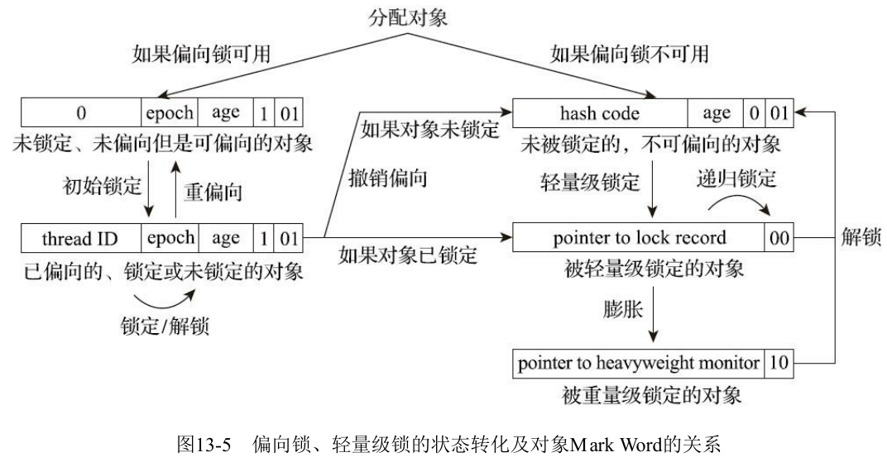
        - 当一个对象已经计算过一致性哈希码后，它就再也无法进入偏向锁状态了；而当一个对象当前正处于偏向锁状态，又收到需要计算其一致性哈希码请求时，它的偏向状态会被立即撤销，并且锁会膨胀为重量级锁
          - 这里说的计算请求应来自于对Object::hashCode()或者System::identityHashCode(Object)方法的调用，如果重写了对象的hashCode()方法，计算哈希码时并不会产生这里所说的请求
        - 在重量级锁的实现中，对象头指向了重量级锁的位置，代表重量级锁的ObjectMonitor类里有字段可以记录非加锁状态（标志位为“01”）下的Mark Word，其中自然可以存储原来的哈希码
```
