```markmap
---
markmap:
  initialExpandLevel: 2
  spacingVertical: 30
  spacingHorizontal: 180
---

# Kafka
- 概述
  - kafka 扮演的 3 大角色
    - 消息系统
      - 和传统的消息系统（也称作消息中间件）都具备系统解耦、冗余存储、流量削峰、缓冲、异步通信、扩展性、可恢复性等功能
      - Kafka 还提供了大多数消息系统难以实现的消息顺序性保障及回溯消费的功能
    - 存储系统
      - Kafka 把消息持久化到磁盘，相比于其他基于内存存储的系统而言，有效地降低了数据丢失的风险
      - 也正是得益于Kafka的消息持久化功能和多副本机制，我们可以把Kafka作为长期的数据存储系统来使用，只需要把对应的数据保留策略设置为“永久”或启用主题的日志压缩功能即可
    - 流式处理平台
      - Kafka 不仅为每个流行的流式处理框架提供了可靠的数据来源，还提供了一个完整的流式处理类库，比如窗口、连接、变换和聚合等各类操作
  - kafka 体系结构 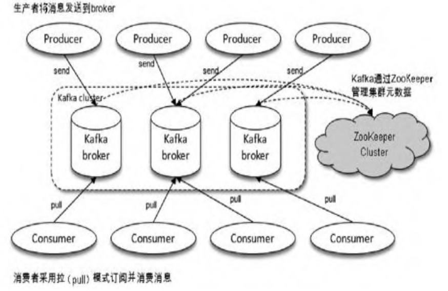
    - Producers
      - 发送消息给 Broker
    - Brokers
      - 服务代理节点
      - 将收到的消息存储到磁盘中
      - 一个或多个 Broker 组成了一个 kafka 集群
      - 对于Kafka而言，Broker可以简单地看作一个独立的Kafka服务节点或Kafka服务实例。大多数情况下也可以将Broker看作一台Kafka服务器，前提是这台服务器上只部署了一个Kafka实例
    - Consumers
      - 从 Broker 订阅并消费消息
    - ZooKeeper 集群
      - 负责Kafka 集群元数据的管理、控制器的选举等操作的
    - Topic 主题
      - 消息以主题为单位进行归类
      - 生产者负责将消息发送到特定的主题，并且每条消息都必须有主题
      - 消费者负责订阅主题并进行消费
    - Partition 分区
      - 同一个主题可以细分为多个不同的分区，同一主题下的不同分区包含的消息是不同的
      - 一个分区只属于单个主题，故而会将分区称为主题分区
      - 分区在存储层面可以看作一个可追加的日志（Log）文件，消息在被追加到分区日志文件的时候都会分配一个特定的偏移量（offset）。offset是消息在分区中的唯一标识，Kafka通过它来保证消息在分区内的顺序性，不过offset并不跨越分区
        - Kafka保证的是分区有序而不是主题有序
      - 每一条消息被发送到broker之前，会根据分区规则选择存储到哪个具体的分区
      - 在创建主题的时候可以通过指定的参数来设置分区的个数，也可以在主题创建完成之后去修改分区的数量
      - Kafka 为分区引入了多副本（Replica）机制，通过增加副本数量可以提升容灾能力 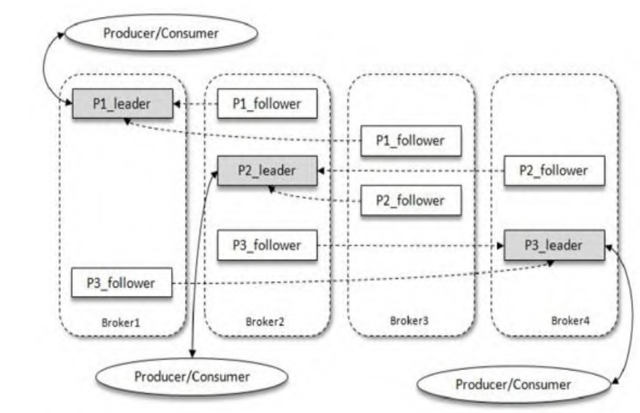
        - 同一分区的不同副本中保存的是相同的消息（在同一时刻，副本之间并非完全一样）
        - 副本之间是“一主多从”的关系，其中leader副本负责处理读写请求，follower副本只负责与leader副本的消息同步
          - 消息会先发送到leader副本，然后follower副本才能从leader副本中拉取消息进行同步，同步期间内follower副本相对于leader副本而言会有一定程度的滞后（可通过参数设置）
        - 副本处于不同的broker中，当leader副本出现故障时，从follower副本中重新选举新的leader副本对外提供服务
        - Kafka通过多副本机制实现了故障的自动转移，当Kafka集群中某个broker失效时仍然能保证服务可用
        - Kafka 消费端也具备一定的容灾能力。Consumer 使用拉（Pull）模式从服务端拉取消息，并且保存消费的具体位置，当消费者宕机后恢复上线时可以根据之前保存的消费位置重新拉取需要的消息进行消费，这样就不会造成消息丢失
        - 分区中的所有副本统称为 AR（Assigned Replicas）
        - 所有与leader副本保持一定程度同步的副本（包括leader副本在内）组成 ISR（In-Sync Replicas），ISR集合是AR集合中的一个子集
          - leader副本负责维护和跟踪ISR集合中所有follower副本的滞后状态，当follower副本落后太多或失效时，leader副本会把它从ISR集合 中剔除
          - HW（Hign Watermark）高水位标识了一个特定的消息偏移量，消费者只能拉取到这个 offset 之前的消息
          - LEO（Log End Offset）标识当前日志文件中下一条待写入消息的 offset，即为当前日志分区中最后一条消息的 offset 加 1
          - ISR 集合中的副本都会维护自身的 LEO，而 ISR 集合中最小的 LEO 即为分区的 HW
        - 与leader副本同步滞后过多的副本（不包括leader副本）组成OSR（Out-of-Sync Replicas）
          - 如果OSR集合中有follower副本“追上”了leader副本，那么leader副本会把它从OSR集合转移至ISR集合
          - 默认情况下，当leader副本发生故障时，只有在ISR集合中的副本才有资格被选举为新的 leader，而在OSR集合中的副本则没有任何机会（不过这个原则也可以通过修改相应的参数配置来改变）
  - kafka 服务端参数配置
    - zookeeper.connect
      - 要连接 ZooKeeper 集群的服务地址
      - 必填项，例如 localhost:2182,localhost:2183 多个地址之间用 `,` 分隔
      - 最佳的实践方式是再加一个chroot路径，这样既可以明确指明该chroot路径下的节点是为Kafka所用的，也可以实现多个Kafka集群复用一套ZooKeeper集群，这样可以节省更多的硬件资源。包含 chroot 路径的配置类似于 localhost1:2181,localhost2:2181，localhost3:2181/kafka这种，如果不指定chroot，那么默认使用ZooKeeper的根路径
    - listeners
      - broker监听客户端连接的地址列表，即为客户端要连接broker的入口地址列表
      - 格式为 protocol1://hostname1:port1,protocol2://hostname2:port2
    - broker.id
      - 指定Kafka集群中broker的唯一标识，默认值为 -1，表示 Kafka 会自动生成一个
    - log.dir 和 log.dirs
      - Kafka 把所有的消息都保存在磁盘上，而这两个参数用来配置Kafka 日志文件存放的根目录
      - 一般情况下，log.dir 用来配置单个根目录，而 log.dirs 用来配置多个根目录（以逗号分隔）
    - message.max.bytes
      - 用来指定 broker 所能接收消息的最大值，默认值为 1000012 bit
      - 如果需要修改这个参数，那么还要考虑max.request.size （客户端参数）、max.message.bytes（topic端参数）等参数的影响。为了避免修改此参数而引起级联的影响，建议在修改此参数之前考虑分拆消息的可行性
- 生产者
  - KafkaProducer 是线程安全的，可以在多线程的环境中复用它
  - 正常的逻辑需要具备的 4 个步骤
    - 1\. 配置生产者客户端参数以及创建相应的生产者实例
    - 2\. 构建待发送的消息
      - ProducerRecord 对象 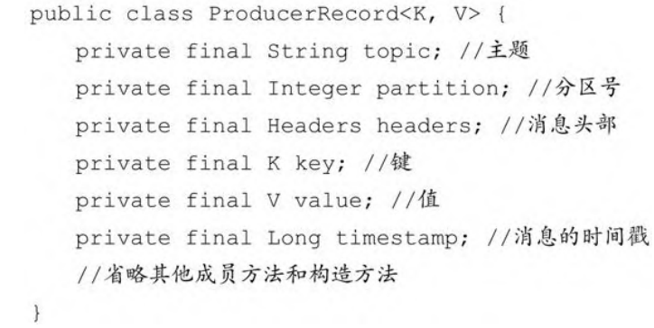
        - topic 消息要发送的主题
        - partition 分区号
        - headers 消息的头部
          - 用来设定一些与应用相关的信息
          - 可以不用设置
        - key 消息的键
          - 是消息的附加信息，可以用来计算分区号进而可以让消息发送至特定的分区
          - 消息以主题为单位进行分类，key 可以让消息进行二次分类，同一个 key 的消息会被划分到同一个分区中
          - 有 key 的消息还可以支持日志压缩功能
        - value 消息体
          - 为空表示特定的消息墓碑消息
        - timestamp 时间戳
          - 有 CreateTime 和 LogAppendTime 2 种类型，分别表示消息创建的时间和追加到日志文件的时间
    - 3\. 发送消息
      - KafkaProducer 的 2 个 send 重载方法 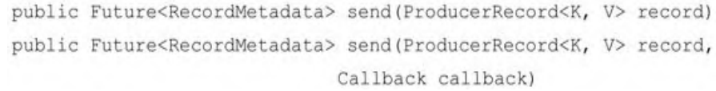
        - send 方法本身就是异步的，可以通过在 Future 上调用 get 方法来等待发送完成 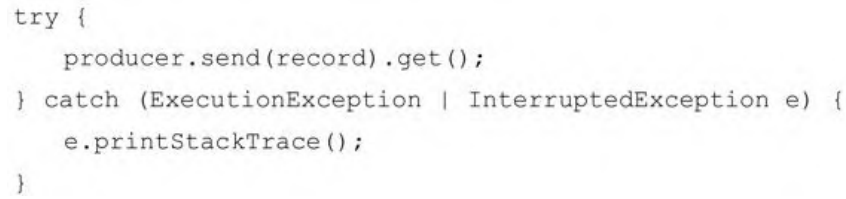
      - 发送消息主要有 3 中模式
        - 发后即忘（fire-and-forget）
          - 性能最高，可靠性最差
        - 同步（sync）
          - 即调用 send 后在返回的 Future 中调用 get 方法
        - 异步（async）
          - 在 send 方法传入 callback 参数 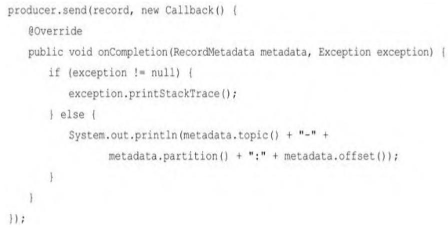
          - onCompletion（）方法的两个参数是互斥的，消息发送成功时，metadata 不 为 null 而 exception 为 null； 消 息 发 送 异 常 时 ，metadata为null而exception不为null
          - 对同一分区而言，回调函数的调用也是有序的
      - 可重试的异常
        - NetworkException 、LeaderNotAvailableException、UnknownTopicOrPartitionException、NotEnoughReplicasException、NotCoordinatorException 等
        - 对于可重试异常，如果配置了 retries 参数，那么只要规定的重复次数内恢复了，就不会抛出异常
    - 4\. 关闭生产者实例
  - 消息加工
    - 消息通过 send 方法发送 broker 的过程中，可能需要经过拦截器（Interceptor）、序列化器（Serializer）和分区器（Partitioner）
    - 如果消息 ProducerRecord 中指定了 partition 字段，那么就不需要分区器的作用，因为 partition 代表的就是要发送至的分区号
    - kafka 有默认的分区器（最新版本的行为好像改变了），实现了 Partitioner 接口的两个方法： 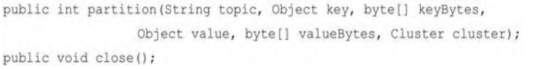
      - key != null, 使用 MurmurHash2 算法进行哈希，根据哈希值来计算分区号，具有同一个哈希值的消息被分配到同一个分区中
        - 在不改变主题分区数量的情况下，key与分区之间的映射可以保持不变。不过，一旦主题中增加了分区，那么就难以保证key与分区之间的映射关系了
      - key == null, 使用轮询的方式发往主题内的各个可用分区
    - 生产者拦截器
      - 可以用在消息发送前做一些准备工作，如按照某个规则过滤掉不符合要求的消息，修改消息的内容等
      - 需要实现 ProducerInterceptor 接口 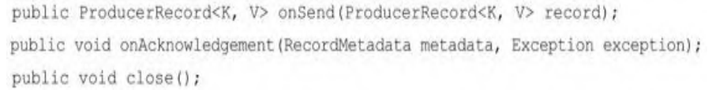
        - KafkaProducer在将消息序列化和计算分区之前会调用生产者拦截器的onSend（）方法来对消息进行相应的定制化操作
        - KafkaProducer 会在消息被应答（Acknowledgement）之前或消息发送失败时调用生产者拦截器的 onAcknowledgement（）方法，优先于用户设定的 Callback 之前执行
          - 这个方法运行在Producer 的 I/O线程中，所以这个方法中实现的代码逻辑越简单越好，否则会影响消息的发送速度
        - 在这 3 个方法中抛出的异常都会被捕获并记录到日志中，但并不会再向上传递
      - KafkaProducer 可以设置多个拦截器以形成拦截链，该链会按照 inteceptor.classes 参数配置的拦截器的顺序来一一执行 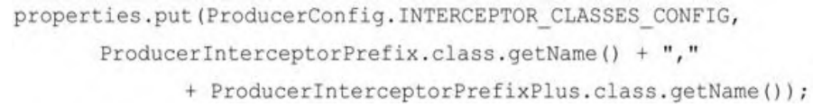
  - 原理分析
    - 整体架构 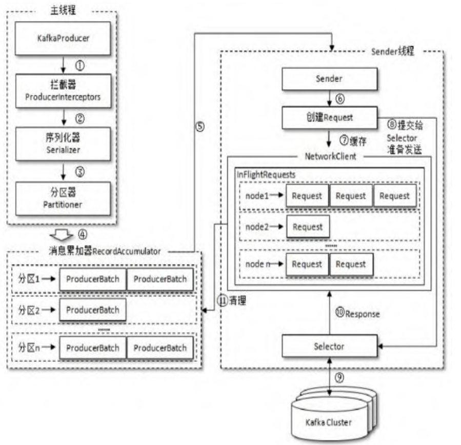
    - 生产者客户端主要由 2 个线程协调运行
      - 主线程
        - 主线程中 KafkaProducer 创建消息，然后通过可能的拦截器、序列化器和分区器的作用之后缓存到消息累加器（RecordAccumulator，也称为消息收集器）中
      - sender 线程
        - Sender 线程负责从RecordAccumulator中获取消息并将其发送到Kafka中
    - RecordAccumulator 消息累加器
      - RecordAccumulator 主要用来缓存消息以便 Sender 线程可以批量发送，进而减少网络传输 的资源消耗以提升性能
      - RecordAccumulator 缓 存 的 大 小 可 以 通 过 生 产 者 客 户 端 参 数 buffer.memory 配置，默认值为 33554432B，即 32MB
        - 如果生产者客户端需要向很多分区发送消息，则可以将buffer.memory参数适当调大以增加整体的吞吐量
      - 如果生产者发送消息的速度超过发送到服务器的速度，则会导致生产者空间不足，这个时候KafkaProducer的send（）方法调用要么被阻塞，要么抛出异常，这个取决于参数max.block.ms的配置，此参数的默认值为60000，即60秒
      - RecordAccumulator 的内部为每个分区都维护了一个双端队列，对列存储的对象类型就是 ProducerBatch
        - 消息写入缓存时，加入对尾，sender 线程读取消息时，从队头读取
        - ProducerBatch 指一个消息批次，可以一次包含一个或多个 ProducerRecord，从而将较小的 record 拼成一个 batch，减少网络请求的次数
      - RecordAccumulator 通过 ByteBuffer 来包裹已经被 Serializer 序列化过的数据，为了提高效率，内部维护了一个 BufferPool，重复利用 ByteBuffer，避免大量创建和销毁 ByteBuffer 对象带来的性能损失
        - BufferPool 指针对特定大小（由 batch.size 指定，默认为 16KB）的 ByteBuffer 进行管理，而其他大小的 ByteBuffer 不会缓存进入 BufferPool 中
        - 同时，ProducerBatch 的大小也不会超过 batch.size，所以一个 ProducerBatch 在空间允许的情况下，会尽量多地容纳更多的 ProducerRecord
    - sender 线程解析
      - sender 从 RecordAccumulator 中获取消息之后，会将原本的 &lt;分区, Deque&lt;ProducerBatch&gt;&gt; 的保存形式变成 &lt;Node, List&lt;ProducerBatch&gt;&gt; 的形式
        - Node 表示 Kafka 集群的 broker 节点
      - sender 线程会将 &lt;Node, List&lt;ProducerBatch&gt;&gt; 进一步封装为 &lt;Node, Request&gt;
        - Request 指 Kafka 的各种协议请求，对于消息发送而言，就是 ProduceRequest
      - Request 在发送之前，会被保存到 InFlightRequests 中，具体的保存格式为 Map&lt;NodeId, Deque&lt;Request&gt;&gt;
        - 主要作用是缓存已经发出去但是还没有收到响应的请求
        - NodeId 是 String 类型，表示节点的 id
        - InFlightRequests 还提供了许多管理类的方法
          - 通过参数限制每个连接最多缓存的请求数，这个配置参数为 max.in.flight.requests.per.connection，默认值为 5
        - 从 InFlightRequests 中，可以获得当前负载最小的节点，即当前中未确认的请求最少的节点 leastLoadedNode
          - leastLoadedNode 可以用于元数据请求、消费者组播协议的交互等
    - 元数据
      - 指 Kafka 集群的元数据，记录了集群中有哪些主题，这些主题有哪些分区，每个分区的 leader 副本在那个节点上，哪些副本在 AR,ISR等集合中，集群中有哪些节点，控制器节点又是哪一个等
      - 当客户端没有需要使用的元数据信息或者超过 metadata.max.age.ms 时间（默认为 5min）没有更新元数据时，都会引起元数据的更新操作
      - 需要更新元数据时，Sender 线程会先挑选出leastLoadedNode，然后向这个Node发送MetadataRequest请求来获取具体的元数据信息
        - 这个请求同样会被存入 InFlightRequests
        - 元数据虽然由Sender线程负责更新，但是主线程也需要读取这些信息，这里的数据同步通过synchronized和final关键字来保障
  - 重要的生产者参数
    - acks
      - 指定分区中必须要有多少副本收到这条消息看，之后生产者才会认为这条消息是被成功写入的
      - 涉及消息的可靠性和吞吐量之间的权衡
      - 有 3 中类型的值
        - 1
          - 默认值
          - 只要求 leader 副本接受到消息就可以了
        - 0
          - 生产者发送消息后不需要等待任何服务端的响应
          - 如果消息在写入 Kafka 的过程中出现了异常，那么生产者无法得知，消息就丢失了
          - 目的：获得最大的吞吐量
        - -1 或 all
          - 需要等待 ISR 中的所有副本都成功写入消息之后才能够接收到来自服务端的成功响应
    - max.request.size
      - 用来限制生产者客户端能发送的消息的最大长度，默认只为 1MB
      - 还会涉及一些其他参数的联动，例如 broker 端的 message.max.bytes
    - retries 和 retry.backoff.ms
      - retries 用来配置生产者重试的次数，默认为 0
      - retry.backoff.ms 用来设定两次重试之间的时间间隔，默认值为 100 ms
      - 注意：失败重试可能破坏消息的顺序性。
        - 如果将acks参数配置为非零值，并且 max.in.flight.requests.per.connection参数配置为大于1的值，那么就会出现错序的现象：如果第一批次消息写入失败，而第二批次消 息写入成功，那么生产者会重试发送第一批次的消息，此时如果第一批次的消息写入成功，那么这两个批次的消息就出现了错序
        - 一般而言，在需要保证消息顺序的场合建议把参数max.in.flight.requests.per.connection配置为1，而不是把acks配置为0
    - compression.type
      - 用来指定消息的压缩方式，默认值为 "none"
      - 可选的值有 "gzip", "snappy", "lz4"
    - connections.max.idle.ms
      - 用来指定在多久之后关闭空闲的连接（没有任何活动），默认为 9 分钟
    - linger.ms
      - 指定生产者发送 ProducerBatch 之前等待更多消息（ProducerRecord）加入ProducerBatch 的至多时间
      - 默认值为 0
      - 生产者客户端会在 ProducerBatch 被填满或等待时间超过linger.ms 值时发送出去
      - 增大这个参数的值会增加消息的延迟，但是同时能提升一定的吞吐量
    - receive.buffer.bytes
      - 用来设置 Socket 接受消息缓冲区（SO_RECBUF）的大小，默认大小为 32KB
      - 如果设置为 -1，则表示使用操作系统的默认值
    - send.buffer.bytes
      - 用来设置 Socket 发送消息缓冲区（SO_SNDBUF）的大小，默认为 128KB
      - 如果设置为 -1，使用操作系统的默认值
    - request.timeout.ms
      - 设置 Producer 等待请求响应的最长时间，默认值为 30000ms，请求超时之后可以选择进行重试
      - 这个参数需要比broker端参数replica.lag.time.max.ms的值要大，这样可以减少因客户端重试而引起的消息重复的概率
        - replica.lag.time.max.ms 配置指定了允许副本落后于领导者的最大时间（以毫秒为单位）。如果副本的拉取延迟超过这个时间，它将被标记为“离线”，并可能导致领导者重新选举
- 消费者
  - 消费者负责订阅 Kafka 中的主题，并且从订阅的主题上拉取消息
  - 消费组 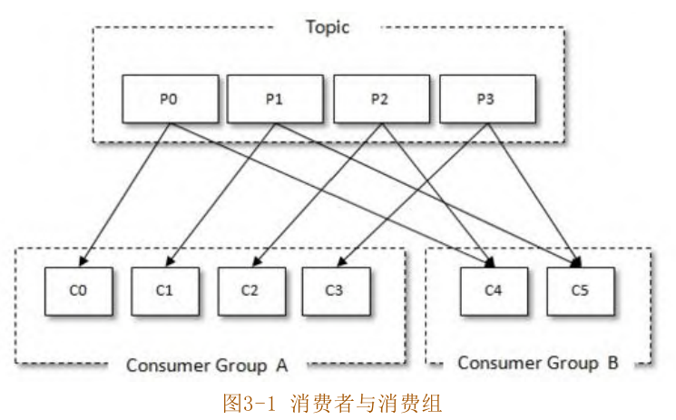
    - 每个消费者都只有一个对应的消费组，当消息发送到主题之后，只会被投递给订阅它的每个消费组中的每一个消费者
      - Kafka 确保同一个消费组内的消费者之间不会重复消费相同的消息，即一条消息只会被一个消费者消费，即使消费组中有多个消费者
    - 每一个分区只能被消费组中的一个消费者所消费
    - 同一个消费组中的消费者如何分配分区具有不同的策略。默认策略是，尽量让同属于一个消费组中的消费者分配到相同数量的分区
      - 可以通过消费者客户端参数partition.assignment.strategy 来设置消费者与订阅主题之间的分区分配策略
  - 消息投递的模式
    - 点对点模式（Point to Point, P2P）
      - 是基于队列的，发送者发送消息到队列，消费者从队列中接受消息
      - 在 Kafka 中的实现
        - 一个消费组中只有一个消费者就可以实现
    - 发布/订阅模式
      - 向一个内容节点（在 Kafka 中是主题）发送和订阅消息
      - 主题是消息传递的中介
      - 发布/订阅模式在消息的一对多广播时采用
      - 在 Kafka 中的实现
        - 如果所有订阅一个主题的消费者都隶属于不同的消费组，那么所有的消息都会被广播给所有的消费者，即每条消息会被所有的消费者处理，这就相当于发布/订阅模式的应用
  - 正常的消费逻辑
    - 1\. 配置消费者客户端参数及创建相应的消费者实例
      - 必须的参数配置
        - bootstrap.servers
        - group.id
          - 消费者隶属的消费组的名称，默认为 ""
        - key.deserializer 和 value.serializer
      - client.id
        - 用来设定 KafkaConsumer 对应的客户端 id，默认为 ""
        - 如果客户端不设置，内容形式为 "consumer-1"、"consumer-2"...
    - 2\. 订阅主题
      - 一个消费者可以订阅一个或多个主题。既可以以集合的形式来订阅多个主题，也可以以正则表达式的形式来实现 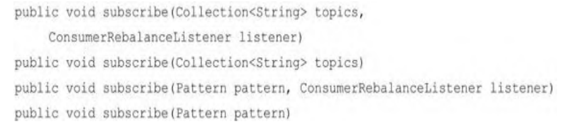
        - 如果使用正则表达式，则如果有人又创建了符合正则表达式的主题，该消费者也会自动订阅该主题
      - 消费者不仅可以订阅主题，还可以直接订阅某些主题的特定分区 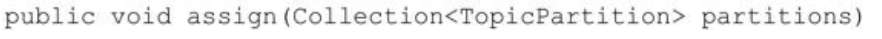
        - TopicPartition 类 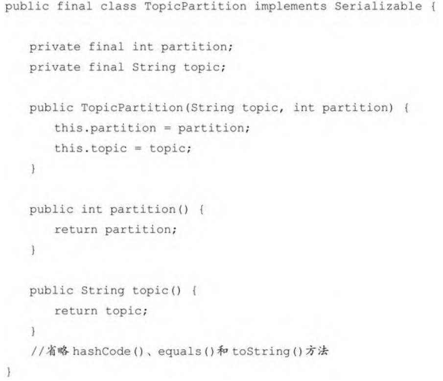
        - KafkaConsumer 中的 partitionsFor 方法可以用来查询指定主题的元数据信息，以下是该方法返回 List&lt;PartitionInfo&gt; 中的 info 类： 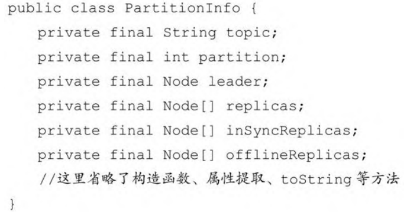
      - 取消订阅
        - unsubscribe 方法可以用来取消通过正则表达式、通过集合或者通过 assign 方法建立的起来的订阅
      - 通过 subscribe（）方法订阅主题具有消费者自动再均衡的功能，在多个消费者的情况下可以根据分区分配策略来自动分配各个消费者与分区的关系
        - 当消费组内的消费者增加或减少时，分区分配关 系会自动调整，以实现消费负载均衡及故障自动转移
        - 而通过assign（）方法订阅分区时，是不具备消费者自动均衡的功能的
    - 3\. 拉取消息并消费
      - 消息的消费一般有 2 种模式
        - 推模式：服务端主动将消息发送给消费者
        - 拉模式：消费者主动向服务端发起请求来拉取消息
      - 对于 poll 方法而言，如果某些分区中没有可供消费的消息，那么对此分区对应的消息拉取的结果就为空。如果有消息，返回的就是 ConsumerRecord 类型
      - ConsumerRecord 类 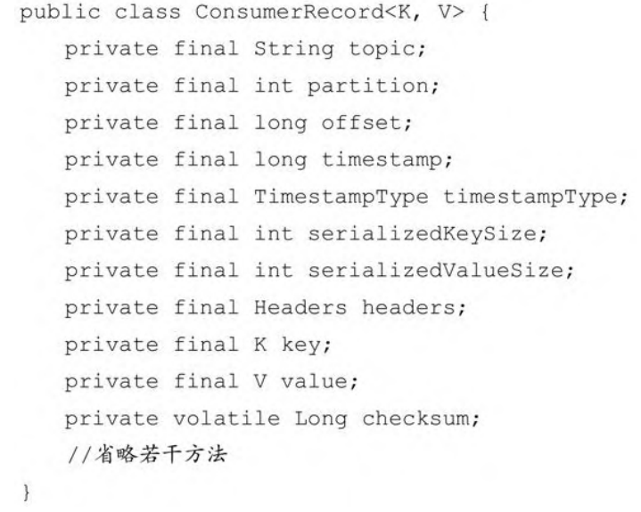
        - 时间类型有 2 种
          - CreateTime
            - 消息创建的时间戳
          - LogAppendTime
            - 消息追加到日志的时间戳
        - 如果 key 为空，则 serializedKeySize = -1
        - 如果 value 为空，则 serializedKeySize = -1
        - offset 是消息在所属分区中的偏移量
        - checksum 是 CRC32 的检验值
      - ConsumerRecords.partitions 用来获取消息集中的所有分区
    - 4\. 提交消费位移
      - 消费者的 offset，即消费位移表示消费到分区中某条消息所在的位置
      - 消费位移会做持久化保存
      - 消费位移储存 Kafka 内部的主题 __consumer_offsets 中
      - 将消费位移存储起来（持久化）的动作称为“提交”，消费者在消费完消息之后需要执行消费位移的提交
      - 消费位移，x 表示某一次拉取操作中此分区的最大偏移量 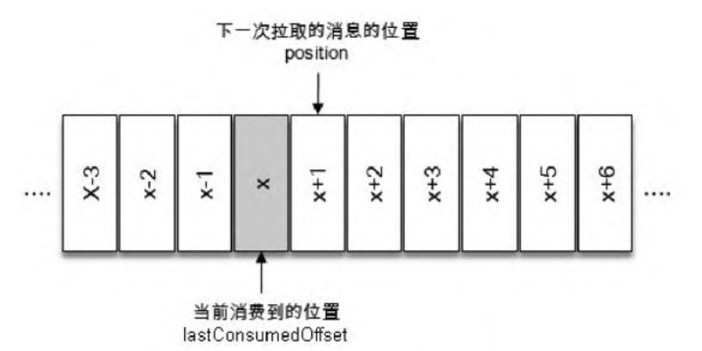
        - 消费者需要提交的消费位移不是 x，而是 x+1，即图中的 position，表示下一条需要拉取的消息的位置
        - KafkaConsumer 类提供了 position 和 committed 方法来获取 position 和 lastCommittedOffset
      - 消费位移的提交时机
        - 如果时机没有把握住，有可能造成重复消费和消息丢失现象
          - 例如 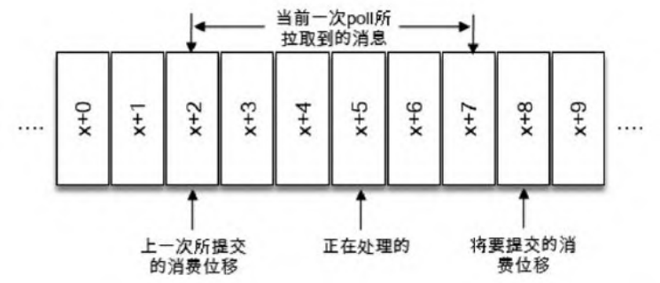
            - 上次提交到的位置是 x+2
            - 如果还没有消费完就提交，那么在消费到 x+5的时候中途发生故障，重新恢复之后就会造成 [x+5, x+7] 之间的消息丢失
            - 如果全部消费完了再提交，如果消费到 x+5 时遇到了异常，故障恢复之后，重新拉取的消息是从 x+2 开始的，发生了重复消费的现象
      - 在 Kafka 中，默认的消费位移的提交方式是自动提交，这个由消费者客户端参数 enable.auto.commit 配置，默认为 true
        - 自动提交是定期提交，周期由 auto.commit.interval.ms 配置，默认为 5s
        - 在默认的方式下，消费者每隔5秒会将拉取到的每个分区中最大的消息位移进行提交。自动位移提交的动作是在poll（）方法的逻辑里完成的，在每次真正向服务端发起拉取请求之前会检查是否可以进行位移提交，如果可以，那么就会提交上一次轮询的位移
        - 改为手动提交之前，需要将自动提交设为 false
      - 手动提交
        - 同步提交
          - commitSync
            - 会根据 poll 方法拉取的最新位移来进行提交（不会主动拉取）
            - 只要没有发生不可恢复的错误，它就会阻塞消费者线程直至消费位移提交完成
        - 异步提交
          - commitAsync 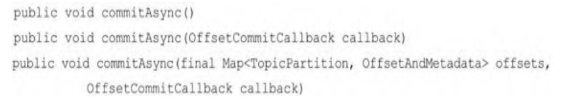
            - 当位移提交完成后，会回调 OffsetCommitCallBack 中的 onComplete 方法
            - commitAsync 的失败重试
              - 如果某一次异步提交的消费位移为 x，但是提交失败了，然后下一次又异步提交了消费位移为 x+y，这次成功了。如果这里引入了重试机制，前一次的异步提交的消费位移在重试的时候提交成功了，那么此时的消费位移又变为了 x。如果此时发生异常（或者再均衡），那么恢复之后的消费者（或者新的消费者）就会从x处开始消费消息，这样就发生了重复消费的问题
              - 因此，设置一个递增的序号来维护异步提交的顺序，每次位移提交之后就增加序号相对应的值在遇到位移提交失败需要重试的时候，可以检查所提交的位移和序号的值的大小，如果前者小于后 者，则说明有更大的位移已经提交了，不需要再进行本次重试；如果两者相同，则说明可以进行重试提交
    - 5\. 关闭消费者实例
  - 消费控制
    - 在有些应用场景下我们可能需要暂停某些分区的消费而先消费其他分区，当达到一定条件时再恢复这些分区的消费
    - KafkaConsumer中使用pause（）和resume（）方法来分别实现暂停某些分区在拉取操作时返回数据给客户端和恢复某些分区向客户端返回数据的操作 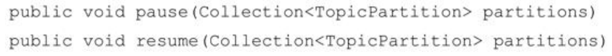
      - 无参的 pause 方法返回被暂停的分区集合
    - KafkaConsumer 的 wakeup 方法会是程序跳出 poll 的逻辑，并返回 WakeupException，通常情况下，不需要处理此异常 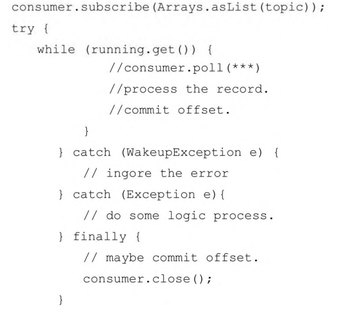
    - 当 Kafka 找不到所记录的消费位移或者发生了位移越界时，就会根据消费者客户端参数 auto.offset.reset 的配置来决定从何处开始进行消费，默认为 "latest",表示从分区末尾开始消费
      - "earliest"：从分区的起始处开始消费
      - "none"：找不到消费位移时，抛出异常 NoOffsetForPartitionException
      - 位移越界是指：无法在实际的分区中查找到对应的位移
    - seek 方法可以提供从特定的位移处开始拉取消息的能力
      - seek 方法只能设置消费者分配到的分区的消费位移，而分区的分配是在 poll 方法中实现的。也就是说，在执行seek（）方法之前需要先执行一次poll（）方法，等到分配到分区之后才可以设置消费位移
    - endOffsets 用来获取指定分区的末尾的消息位置；beginningOffsets 方法获得分区的起始位置
    - offsetsForTimes 方法可以查询到大于等于查询时间的第一条消息的消费位置和时间戳
  - 再均衡
    - 再均衡是指分区的所属权从一个消费者转移到另一消费者的行为，它为消费组具备高可用性和伸缩性提供保障，使我们可以既方便又安全地删除消费组内的消费者或往消费组内添加消费者
    - 在再均衡发生期间，消费组内的消费者是无法读取消息的
    - 当一个分区被重新分配给另一个消费者时，消费者当前的状态也会丢失
      - 比如消费者消费完某个分区中的一部分消息时还没有来得及提交消费位移就发生了再均衡操作，之后这个分区又被分配给了消费组内的另一个消费者，原来被消费完的那部分消息又被重新消费一遍，也就是发生了重复消费
    - 再均衡监听器用来设定发生在再均衡动作前后的一些准备或收尾动作。是一个接口，包含两个方法
      - 
        - 会在再均衡开始之前和消费者停止读取消息之后被调用。可以通过这个回调方法来处理消费位移的提交，以此来避免一些不必要的重复消费现象的发生
        - partitions 是该消费者再均衡之前分配到的分区
      - 
        - 会在重新分配分区之后和消费者开始读取消费之前被调用
        - 参数partitions表示再均衡后所分配到的分区
  - 消费者拦截器
    - 消费者拦截器需要自定义实现 ConsumerInterceptor 接口
      - 
        - 会在 poll 方法返回之前调用拦截器的 onConsume 方法来对消息进行定制化操作
        - 如果 onConsume（）方法中抛出异常，那么会被捕获并记录到日志中，但是异常不会再向上传递
      - 
        - 会在提交完消费位移之后调用拦截器的 onCommit 方法
      - 
    - 消费者拦截器也有拦截链，各个拦截器之间使用逗号隔开
  - KafkaConsumer 不是线程安全的
    - 其中定义了 acquire 方法，用来检测是否只有一个线程在操作，若有其他线程正在操作就会抛出 ConcurentModificationException 异常
    - KafkaConsumer中的每个公用方法在执行所要执行的动作之前都会调用这个acquire（）方法，只有wakeup（）方法是个例外
    - acquire 方法 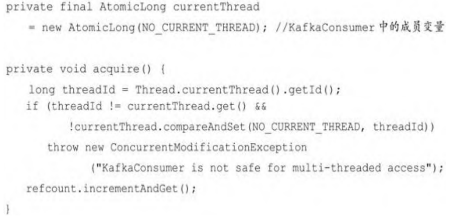
  - 消费者重要参数
    - fetch.min.bytes
      - 一次拉取请求中，能从 kafka 拉取的最小数据量，默认为 1 Bit
      - kafka 在收到 consumer 的拉取请求时，如果小于这个参数所配置的值，那么，它就需要进行等待
    - fetch.max.bytes
      - 一次拉取请求中从 kafka 中拉取的最大数据量，默认为 50 MB
      - 如果第一个非空分区中拉取的第一条消息大于该值，那么该消息仍然返回，以确保消费者继续工作
      - 服务端接收的最大消息的大小为 message.max.bytes
    - fetch.max.wait.ms
      - fetch.max.wait.ms 用于指定 fetch.min.bytes 等待的时间
    - max.partition.fetch.bytes
      - 从每个分区返回给 Consumer 的最大数据量，默认为 1MB
    - max.poll.records
      - 用来配置 Consumer 在一次拉取请求中拉取的最大消息数，默认为 500 条
    - connections.max.idle.ms
      - 用来指定在多久之后关闭空闲的连接，默认为 9 分钟
    - exclude.internal.topics
      - kafka 有 2 个内部主题：__consumer_offsets 和 __transaction_state
      - 此参数用来指定 kafka 中的内部主题是否可以向消费者公开，默认为 true，即不公开
      - 如果不公开，则只能使用 subscribe(Collection) 的方式来订阅内部主题
      - 如果公开，则也可以使用 subscribe(Pattern)的方式来订阅内部主题
    - receive.buffer.bytes
      - 用来设置 Socket 接受消息缓冲区的大小
      - -1 使用 OS 默认值
    - send.buffer.bytes
      - 用来设置 socket 发送消息缓冲区的大小
      - -1 使用 OS 默认值
    - request.timeout.ms
      - Consumer 等待请求响应的最长时间，默认值为 3000 ms
    - metadata.max.age.ms
      - 配置元数据的过期时间，默认为 5min
    - reconnect.backoff.ms
      - 这个参数用来配置尝试重新连接指定主机之间的等待时间，也称退避时间，默认为 50ms
    - retry.backoff.ms
      - 用来配置尝试重新发送失败的请求到指定的主题分区之前的等待（退避）时间
    - isolation.level
      - 用来配置消费者的事务隔离级别
      - "read_umcommitted"：可以消费到 HW（High Watermark）处的位置
      - "read_committed"：只能消费到LSO（LastStableOffset）的位置
- 主题与分区
  - 主题的管理
    - 创建主题
      - 如果 broker 端的 auto.create.topics.enable 设置为 true（默认值），那么当生产者向一个尚未创建的主题发送消息是，kafka 会自动创建该主题，分区数为 num.partitions（默认为 1）
        - 除此之外，当一个消费者开始从未知主题中读取消息时，或者当任意一个客户端向未知主题发送元数据请求时，都会按照配置参数 num.partitions 和 default.replication.factor 的值来创建一个相应的主题
      - 创建的主题会在 kafka 的 log.dir 或 log.dirs 参数所配置的目录下创建主题分区
        - 创建的文件夹的名字命名规则为 &lt;topic&gt;-&lt;partition&gt;。其中，该文件夹中包含了日志文件，即副本
        - 副本的数量等于 主题分区的数量 x 副本因子（replication factor）。同时，每个副本对应一个文件夹
        - 同一个分区的多个副本必须分布在不同的 broker 中，这样才能提供有效的数据冗余
        - 主题、分区、副本、Log 之间的关系 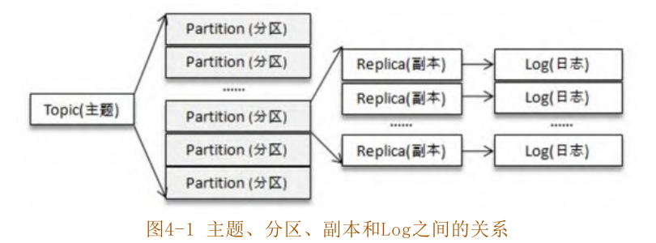
      - 使用 kafka-topics.sh 脚本创建主题 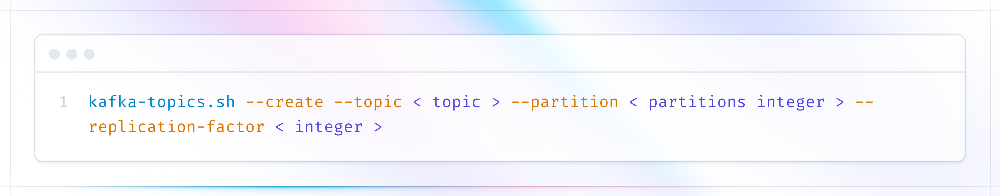
        - 可以通过 --replica-assignment &lt;分区1副本1的broker_id1:分区1副本2的broker_id2:分区1副本3的broker_id3...,分区n副本1的broker_id1:...,...&gt; 来指定有多少个分区，有多少个副本，并且这些分区的副本在哪些 broker 上
          - 分区与分区之间用逗号“,”隔开，分区内多个副本用冒号“:”隔开
          - 例如 --replica-assignment 2:0,0:1,1:2,2:1 表示有 4 个分区，每个分区都只有 2 个副本，其中，分区 0 的两个副本分别位于 broker 2 和 broker 0 中
          - 每个分区的副本数要一致，并且同一个分区内的不同副本的 broker 也要不同
        - --if-not-exists 参数用于在主题不存在的时候才创建主题，如果主题事先存在，则不会发生任何变动
        - 脚本在创建主题时还会将 '.' 改为 '_'
        - 主题的名字不能超过 249
        - broker 的机架信息（实际上就是机架的名称）
          - 通过 broker 端的参数 broker.rack 来进行配置
          - 如果指定了机架信息，则在分区副本分配时会尽可能地让分区副本分配到不同机架上
          - 在创建主题时，如果一部分 broker 指定了机架信息，一部分没有指定，会报错。如果没有完全指定机架信息，则可以使用 --disable-rack-aware 参数来忽略机架信息对分区副本的分配影响
        - 此脚本的底层实现是使用 TopicCommand 类来进行实现的，即将脚本的参数传递给 main 方法作为其执行的参数，然后执行
          - 故而，可以在 java 代码中也可以通过这个原理来实现这一点（需要引入 kafka 依赖，而不是 kafka-client） 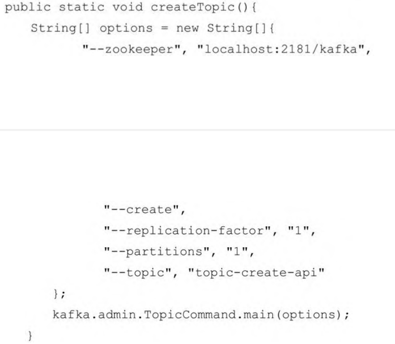
    - 查看主题
      - 使用 kafka-topics.sh 的 --describe 参数
      - topics-with-overrides 只会显示出与默认配置不一样配置的主题
      - under-replicated-partitions 可以找出所有包含失效副本的分区，此时，ISR 集合小于 AR 集合
      - unavaaliable-partitions 参数找到 leader 副本不可用的分区
    - 修改主题
      - 使用 kafka-topic.sh 的 alter 参数
      - 可以实现增加分区（当前还不能减少分区）、修改配置等
      - if-exists 参数可以用来避免修改的主题不存在时出现的异常
      - config 参数和 delete-config 用于修改配置 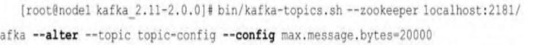
      - 修改配置应该使用专门的脚本 kafka-configs.sh 脚本来进行
    - 删除主题
      - kafka-topics.sh 的 delete 参数
      - 必须将 broker 端的配置参数设置为 true（默认值） 才能够删除主题
  - 分区的管理
    - 优先副本（preferred replica）选举
      - 优先副本是指一个分区的 AR 集合列表中的第一个副本。例如，上图中，分区 0 的优先副本就是 1 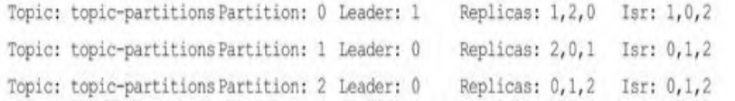
      - 理想情况下，优先副本就是该分区的 leader 副本
      - kafka 要确保所有主题的优先副本在集群中均匀分布
      - 优先副本的选举是指通过一定的方式促使优先副本选举为leader副本，以此来促进集群的负载均衡，这一行为也可以称为“分区平衡”
        - 例如，当一个 broker 下线又恢复之后，那么它只能成为一个 follower 副本，但是，如果有一次选举，则 kafka 会优先考虑它成为 leader 副本
        - 从上例中，可以看到，重新选举可以促进分区平衡，故而 kafka 提供了自动分区平衡功能
        - 可以通过 kafka-leader-election.sh 来进行选举
      - 分区自动平衡
        - 由 broker 端的 auto.leader.rebalance.enable 配置，默认为 true
        - 如果开启此功能，kafka 的控制器会启动一个定时任务，会轮询所有的 broker 节点，计算每个 broker 节点的分区不平衡率（=非优先副本的 leader 个数 / 总分区数）是否超过 leader.imbalance.per.broker.precentage 参数配置的比值，默认为 10%
          - 执行周期由参数 leader.imbalance.check.interval.seconds 控制，默认为 300s
    - 分区重分配
      - 背景
        - 当对一个节点有计划地进行下线操作时，为了保证分区以及副本的合理分配，希望可以将该节点上的分区副本迁移到其他可用的节点上
        - 当集群中新增 broker 节点时，只有新创建的主题分区才有可能被分配到这个节点上，之前的主题分区并不会自动分配到新加入的节点中，导致新节点的负载和原先节点的负载严重不均衡
      - 解决方案：使用 kafka-reassign-partitions.sh 脚本
        - 1\. 创建一个包含主题清单的 JSON 文件
          - 例如，具有如下 topic-reassign 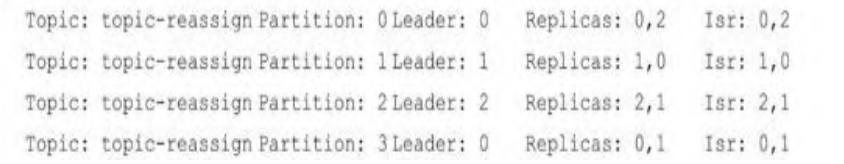
          - 由于某种原因，要下线 broker1，则创建如下 reassign.json 文件： 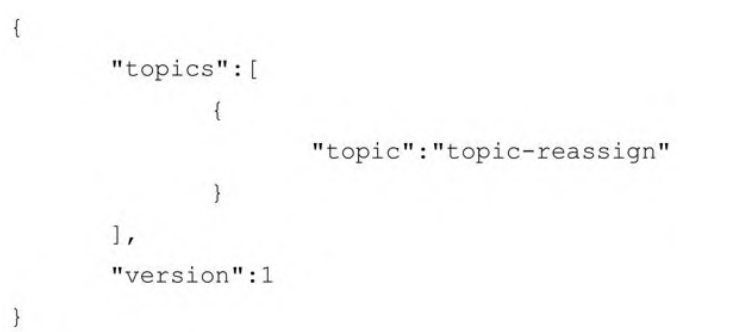
          - 如果要将某个broker下线，那么在执行分区重分配动作之前最好先关闭或重启broker。这样这个broker就不再是任何分区的leader节点了，它的分区就可以被分配给集群中的其他broker。这样可以减少broker间的流量复制，以此提升重分配的性能，以及减少对集群的影响
        - 2\. 根据主题清单和 broker 节点生成一份重分配方案
          - 使用如上命令，注意， broker-list 参数中，没有 broker 1 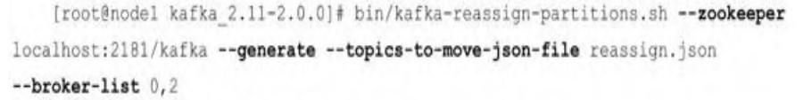
          - 会输出两份 JSON 数据，一份是现在的分配方案，另一份是候选的分配方案
        - 3\. 执行具体的重分配动作
          - 加入将候选的分配方案命名为 project.json，则可以使用下列命令来执行重分配方案： 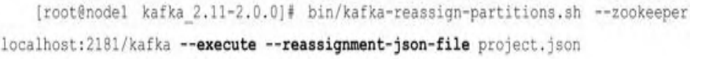
          - 如何查看重分配的进度？ 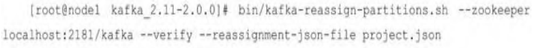
    - 复制限流
      - 分区重分配中，本质在于数据复制：先增加新的副本，然后进行数据同步，最后删除旧的副本来达到目的
      - 如果重分配的量很大，就可能造成性能下降。故而，可以对复制的流量加以限制来保证重分配期间服务整体不会受太大的影响
      - 实现方式
        - kafka-config.sh
        - kafka-reassign-partitions.sh
        - broker 级别
          - follower.replication.throttled.rate
            - 用于设置 follower 副本复制的速度
          - leader.replication.throttled.rate
            - 用于设置 leader 副本传输速度
        - 主题级别
          - leader.replication.throttled.replicas
            - 配置被限制速度的主题所对应的leader副本列表
            - 格式为: [分区0:分区0的leader,分区1:分区1的leader,...]
          - follower.replication.throttled.replicas
            - 配置被限制速度的主题所对应的follower副本列表
            - 格式为: [分区0:分区0的follwer,分区1:分区1的follower,...]
          - 如果重分配会引起某个分区 AR 集合的变更，那么这个分区中与 leader 有关的限制会应用于重分配前的所有副本，因为任何一个副本都可能是 leader。而与 follower 有关的限制会应用于所有移动的目的地
            - 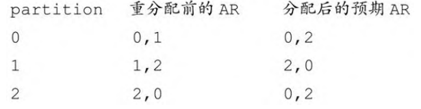
            - 对于分区 0 而言，leader.replication.throttled.replicas 配置为 [0:0, 0:1]，follower.replication.throttled.replicas 配置为 [0:2]
    - 修改副本因子
      - 修改使用 kafka-reassign-partition.sh 脚本生成的 project.json 文件，然后修改某个 topic 的 replicas 和 log_dirs 字段： 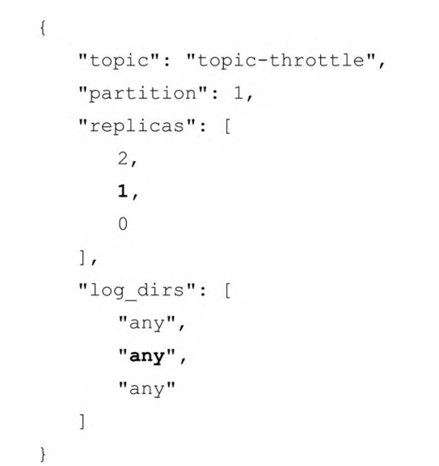
        - 黑色为新增字段
    - 如何选择合适的分区数？
      - kafka-producer-perf-test.sh 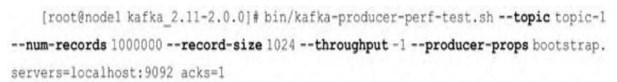
        - 用于生产者性能测试
      - kafka-consumer-perf-test.sh
        - 用于消费者性能测试
- 日志存储
  - 一个分区对应一个日志。为了防止 Log 过大，kafka 引入了日志分段的概念，将 Log 切分为多个 LogSegment 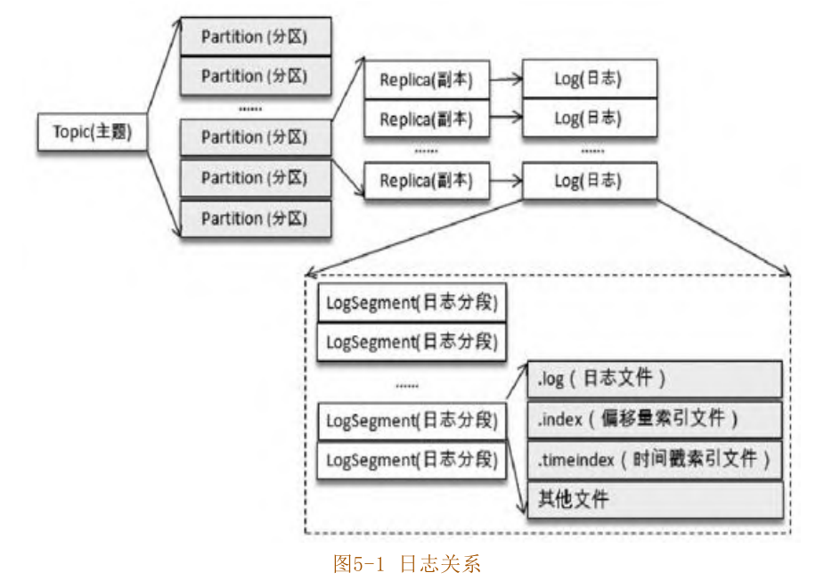
    - Log
      - 在物理上以文件夹的形式存储
      - 命名形式为 &lt;topic&gt;-&lt;partition&gt;
    - LogSegment
      - 对应磁盘上的一个日志文件和两个索引文件，以及可能的其他文件，例如 .txnindex 的事务索引文件
      - 向Log 中追加消息时是顺序写入的，只有最后一个 LogSegment才能执行写入操作（称为 activeLogSegment），在此之前所有的 LogSegment 都不能写入数据
      - 为了便于消息的检索，每个 LogSegment 中的 日志文件（以“.log”为文件后缀）都有对应的两个索引文件：偏移量索引文件（以“.index”为文件后缀）和时间戳索引文件（以“.timeindex”为文件后缀）
      - 每个 LogSegment 都有一个基准偏移量 baseOffset，用来表示当前 LogSegment中第一条消息的offset。偏移量是一个64位的长 整型数,日志文件和两个索引文件都是根据基准偏移量（baseOffset）命名的 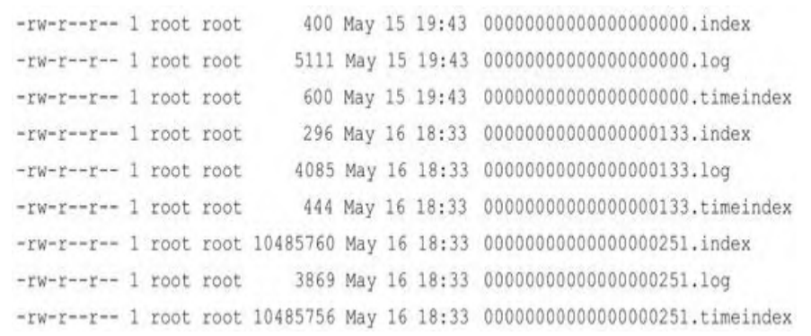
        - 名称固定为20位数字
  - 日志文件的格式
    - v0 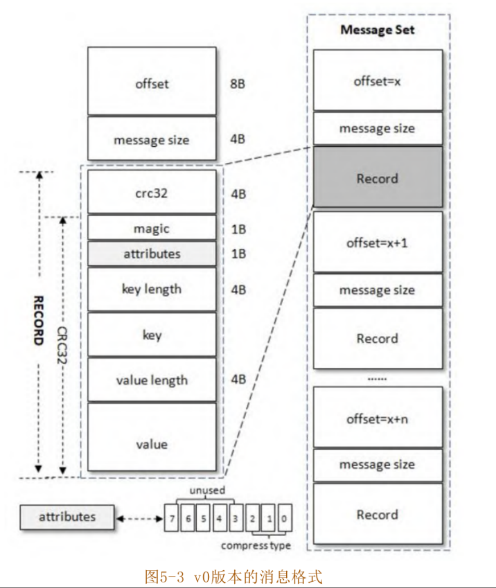
    - v1 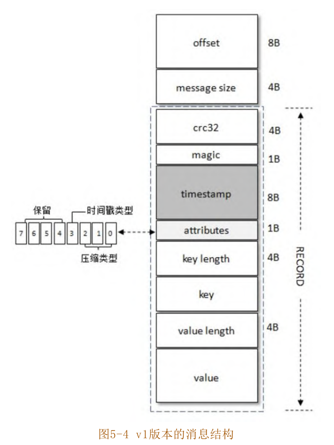
      - attributes 字段的第 4 个位如果为 0，则表示 timestamp 为 CreateTime，否则为 LogAppendTime
    - v2 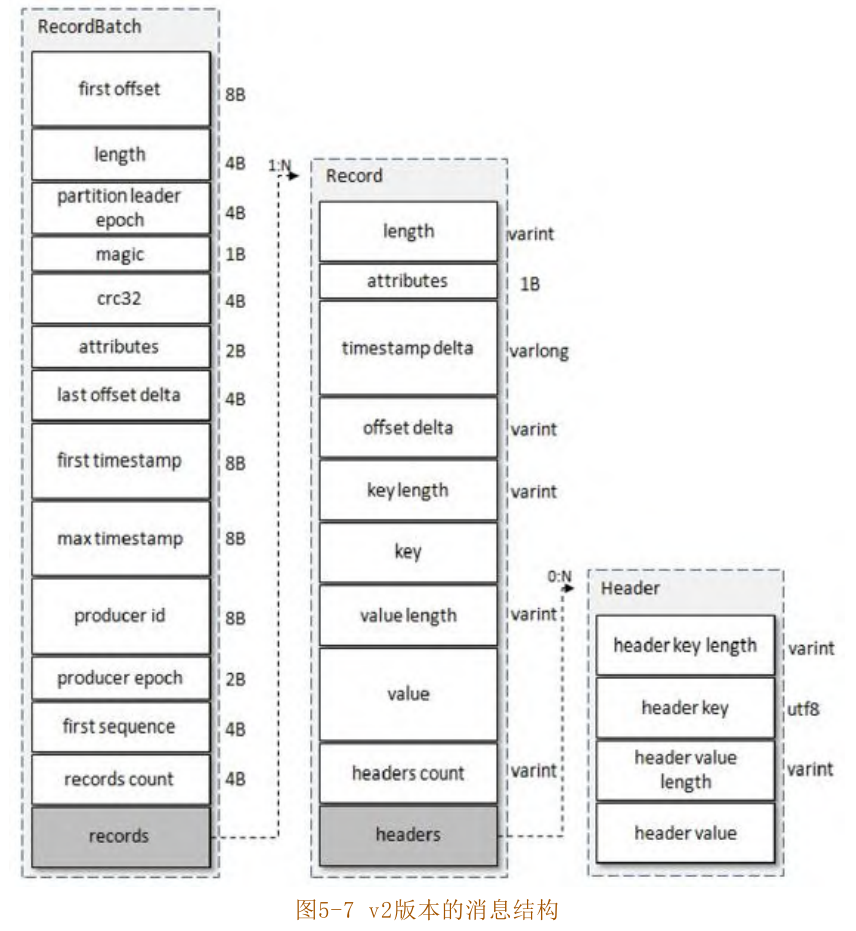
      - varint 类型（变长字段）
        - 使用一个或多个字节来序列化一个整数的一种方法。该整数数值越小，其占用的字节数就越少
        - varint 的每个字节都有一个位于最高位的 msb （most significant bit），表示其后的字节是否和当前字节一起表示同一个整数。最后一个字节的 msb = 0。这种表示类型又称为 Base 128
        - 可以使用 ZigZag 编码方式来对 varint 进行编码 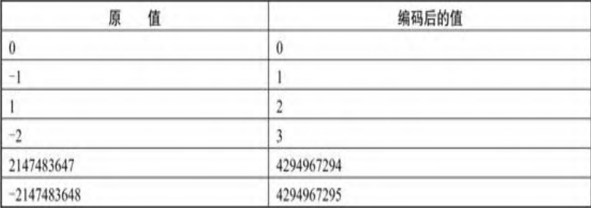
          - 编码公式为: (n &lt;&lt; 1) ^ (n &gt;&gt; 31) 解码公式为： (encoded &gt;&gt; 1) ^ (-(encoded & 1))
          - 可以使绝对值较小的负数仍然享有较小的Varints编码值
      - 在消息压缩时，只压缩 Records 部分
      - Record 中各个字段
        - attributes：弃用。存在只是以备未来的格式扩展
        - timestamp delta：时间戳增量。存储一个 timestamp 需要 8 字节，故而使用增量来保存与 RecordBatch 的起始时间戳的差值
        - offset delta：保存与 RecordBatch 起始位移的差值
        - headers：用来支持应用级别的扩展
      - RecordBatch 中各个字段
        - first offset：当前 RecordBatch 的起始位移
        - length：从 partition leader epoch 字段开始到末尾的长度
        - magic：消息格式的版本号，在 v2 中即为 2
        - attributes：低 3 为表示压缩格式，第 4 位表示时间戳类型；第 5 位表示 RecordBatch 是否处于事务中；第 6 位表示是否是控制消息
        - last offset delta：RecordBatch 中最后一个 Record 的 offset 与 first offset 的差值
          - 主要被broker用来确保RecordBatch中Record组装的正确性
        - first timestamp：RecordBatch 中第一条 Record 的时间戳
        - max timestamp：RecordBatch 中最大的时间戳
          - 一般情况下为最后一条 Record 的时间戳
        - producer id：PID，用来支持幂等和事务
        - producer epoch：用来支持幂等和事务
        - first sequence：用来支持幂等和事务
        - records count：RecordBatch 中 Record 的个数
  - 消息压缩
    - 常见的压缩算法是数据量越大压缩效果越好，一条消息通常不会太大，这就导致压缩效果并不是太好。而Kafka实现的压缩方式是将多条消息一起进行压缩，这样可以保证较好的压缩效果
    - kafka 使用何种压缩方式是通过 compression.type 来指定的
    - 如何压缩多条消息？
      - kafka 使用一个外层的消息包裹一个或多个内层的消息，外层消息的 value 位置上就保存着压缩后的多个消息 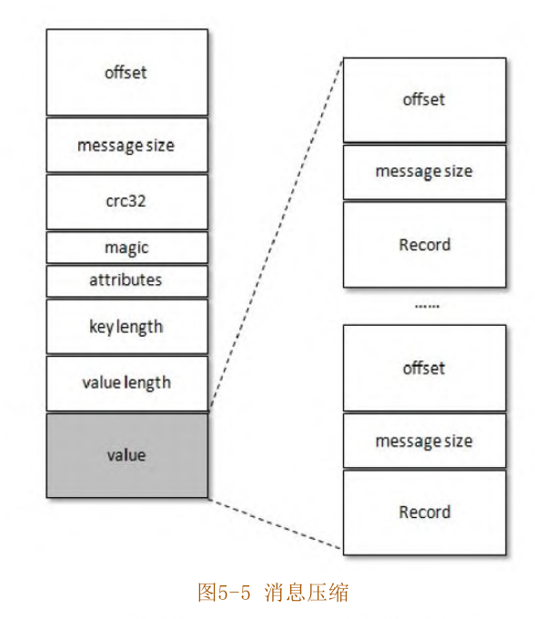
        - 外层消息的 key = null
      - 生产者发送过来的消息的 offset 都是 0，故而需要服务端对消息的 offset 进行修改。在压缩的情况下，多个内层消息的 offset 从 0 开始递增。并将最后一个内层消息的绝对 offset 赋给外层消息的 offset 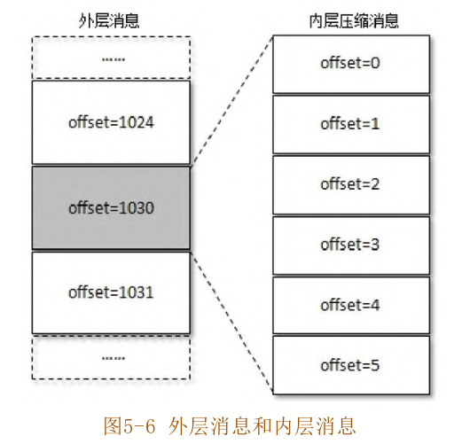
        - 外层消息的 timestamp 如何设置？
          - 如果类型为 CreateTime，则为内层消息中最大的时间戳
          - 如果类型为 LogAppendTime，则为 Kafka 服务器当前的时间戳
          - 对 attributes 字段而言，它的 timestamp 位只在外层消息中设置，内层消息中的timestamp类型一直都是CreateTime
        - 内层消息的 timestamp 如何设置？
          - 如果外层消息的类型为 CreateTime，则为生产者创建消息时的时间戳
          - 如果外层消息的类型为 LogAppendTime，则所有内层消息的时间戳会被忽略
  - 日志索引
    - 偏移量索引文件用来建立消息偏移量 offset 到物理地址之间的映射关系，方便快速定位消息所在的物理文件中的位置
    - 时间戳索引文件则根据指定的时间戳来查找对应的偏移量信息
    - kafka 中的索引文件以稀疏索引（sparse index）的方式消息的索引：不保证每个消息在索引文件中都有对应的索引项
      - 当写入一定量（由 broker 端的参数 log.index.interval.bytes 指定，默认值为 4 KB）的消息时，索引文件就写入一个索引项
      - 稀疏索引可以通过 MappedByteBuffer 将索引文件映射到内存中，以加快索引的查询速度
    - 日志分段的条件（只需满足其中一项）
      - 当前日志分段文件超过了 broker 端参数 log.segment.bytes 配置的值，默认为 1GB
      - 当前日志分段文件中，消息的最大时间戳与当前系统的时间戳的差值大于 log.roll.ms 或 log.roll.hours 参数配置的值（log.roll.ms 的优先级大于 log.roll.hours）
      - 当前日志分段文件的大小达到 broker 端参数 log.index.size.max.bytes 配置的值，默认为 10MB
        - kafka 在创建索引文件的时候会为其预分配 log.index.size.max.bytes 大小的空间
        - 只有当索引文件进行切分的时候，kafka 才会把索引文件裁剪到实际的数据大小
      - 追加的消息的偏移量与当前日志分段的偏移量之间的差值大于 Integer.MAX_VALUE
    - kafka 强制要求索引文件大小必须是索引项大小的整数倍
    - kafka 的每个日志对象中，使用了 ConcurrentSkipListMap 来保存各个日志分段，每个日志分段的 baseOffset 作为 key，这样可以根据指定偏移量来快速定位到消息所在的日志分段
    - 偏移量索引文件
      - 索引项 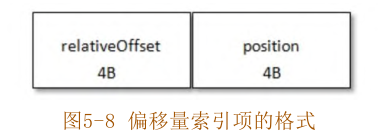
        - relativeOffset：相对于 baseOffset 的偏移量（baseOffset 为该日志文件的名字）
        - position：物理地址，消息在日志分段文件中对应的物理位置
      - 偏移量索引文件保证每个索引项分别根据偏移量来进行从小到大排序，故而可以使用二分法来快速查找对应的项
    - 时间戳索引文件
      - 索引项 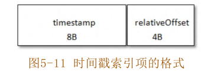
      - 时间戳索引文件并不能保证每个索引项的时间戳都是从小到大进行排序的
      - 查找时间戳不小于 targetTimeStamp 的消息的步骤
        - 1\. 找到不小于指定时间戳的日志分段
          - 将 targetTimeStamp 与每个日志分段中的最大时间戳对比，直到找到不小于 targetTimeStamp 的日志分段
            - 每个日志分段中的最大时间戳的计算法：查询日志分段中该分段所对应的时间戳索引文件，找到最后一条索引项，若最后一条索引项的时间戳字段值大于 0，则取其值，否则取该日志分段的最近修改时间
        - 2\. 在日志分段中使用二分法找到不大于 targetTimeStamp 的最大索引项，取得其中的 relativeOffset A
        - 3\. 从偏移量索引文件中使用二分法找到不大于 relativeOffset A 的最大索引项，取得其中的 position
        - 4\. 从日志文件的 position 处开始查找不小于 targetTimeStamp 的消息
  - 日志清理
    - 两种日志清理策略
      - 日志删除
        - 按照一定的保留策略直接删除不符合条件的日志分段
      - 日志压缩
        - 针对每个消息的 key 进行整合，对于有相同 key和不同 value 值的消息，只保留最后一个版本
      - 可以通过 broker 端的参数 log.cleanup.policy 来设置日志清理的策略，默认为 "delete"
        - 如果要将其设置为日志压缩，就需要将 log.cleanup.policy 设置为 "compact"
        - 还可以通过设置为 "delete,compact" 来同时支持两种策略
    - 日志清理操作针对于日志分段，而不是针对消息层面
    - 日志删除
      - 在Kafka的日志管理器中会有一个专门的日志删除任务来周期性地检测和删除不符合保留条件的日志分段文件，这个周期可以通过broker端参数log.retention.check.interval.ms来配置，默认值为300000，即5分钟
      - 当前日志分段的保留策略有3种
        - 基于时间
          - 删除 largetTimeStamp 小于当前时间减去阈值的分段（可能有多个）
          - 阈值通过 log.retention.[hours|minutes|ms]来配置，其中粒度越小的优先级越高
          - 若待删除的日志分段的总数等于该日志文件中所有的日志分段的数量，那么说明所有的日志分段都已过期，但该日志文件中还要有一个日志分段用于接收消息的写入，即必须要保证有一个活跃的日志分段 activeSegment，在此种情况下，会先创建出一个新的日志分段作为activeSegment，然后执行删除操作
          - 删除日志分段时，首先会从Log对象中所维护日志分段的跳跃表中移除待删除的日志分段，以保证没有线程对这些日志分段进行读取操作。然后将日志分段所对应的所有文件添加上“.deleted”的后缀（当然也包括对应的索引文件）。最后交由一个以“delete-file”命名的延迟任务来删除这些以“.deleted”为后缀的文件，这个任务的延迟执行时间可以通过file.delete.delay.ms参数来调配，此参数的 默认值为60000，即1分钟
        - 基于日志大小
          - 删除日志大小超过设定阈值的分段
          - 阈值可以通过 broker 端的 log.retention.bytes （针对整个日志文件，而不是分段）来配置，默认为 -1，表示无穷大
          - 删除操作从第一个日志分段开始，直到剩余的大小小于阈值
        - 基于日志起始偏移量
          - 一般情况下，日志分段文件的起始偏移量等于 baseOffset；但是这不是绝对的：可以通过 KafkaAdminClient 的 deleteRecords 方法等改变
          - 删除分段 A 的条件是：A 的下一个分段 B 的起始偏移量小于等于 B 的 baseOffset
          - 删除任务从第一个分段向后开始扫描，标记符合上述条件的分段。例如，下图分段左侧的数据表示分段的起始偏移量： 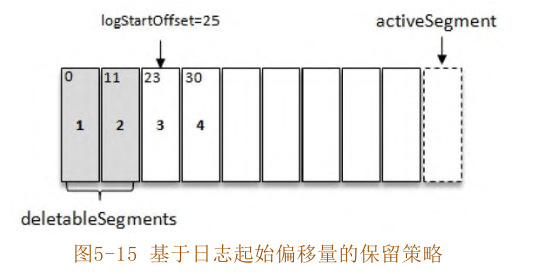
    - 日志压缩（log compaction）
      - Log Compaction对于有相同key的不同value值，只保留最后一个版本。如果应用只关心key对应的最新value值，则可以开启Kafka的日志清理功能，Kafka会定期将相同key的消息进行合并，只保留最新的value值
      - 日志压缩前后，日志分段中的每条消息的偏移量保持不变，并且在日志压缩之后，会生成新的日志分段文件，故而在新的日志分段文件中，消息的偏移量是不一定是连续的
      - 当前活跃的日志分段不会参与 Log Compacation 的执行
      - 参数 log.cleaner.min.compaction.lag.ms 用来配置消息在被清理前的最小保留时间，默认未 0
      - cleaner-offset-checkpoint 文件 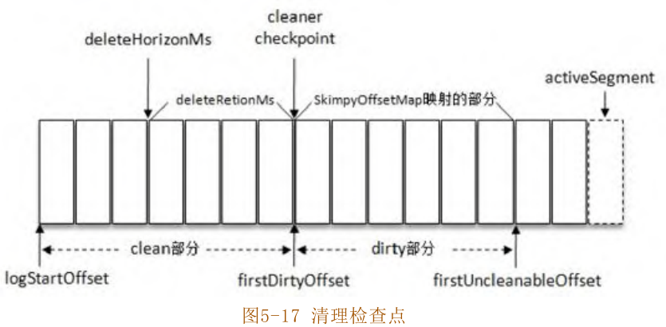
        - 此文件在每个日志目录下都有，用来记录每个主题的每个分区中已清理的偏移量
        - 通过此文件，可以将一个分区中的日志文件分为两部分：清理过的 clean 部分和未清理过的 dirty 部分
          - clean 部分的消息偏移量是断续的，dirty 部分的消息是连续的
        - 正常情况下，firstUncleanableOffset 等于活跃分段的 baseOffset
      - 每个 broker 会启动 log.cleaner.thread（默认为 1） 个线程来执行清理任务
      - 为了防止日志不必要的频繁清理操作，kafka 使用了参数 log.cleaner.min.cleanable.ratio（默认为 0.5）来限定可进行清理操作的最小污浊率（污浊率=dirtyBytes/(cleanBytes + dirtyBytes)）
      - 如何对日志文件中的消息的 key 进行筛选？
        - 每个日志清理线程会使用一个名为 SkimpyOffsetMap 的对象来构建 key 与 offset 的映射关系的 hashmap
        - 可以通过 log.cleaner.dedupe.buffer.size 来限制日志清理线程的内存使用
        - 使用 SkimpyOffsetMap 来执行日志清理操作，如果两个不同的 key 但是哈希值一样，那么其中一个消息就会被丢弃，故而命名为 skimpy
        - 日志压缩操作需要遍历 2 此日志文件
          - 第一次
            - 把每个 key 的哈希值和最后出现的 offset 都保存在 SkimpyOffsetMap 中
          - 第二次
            - 会检查这个消息是否符合保留条件，如果不符合，就会被清理
            - 如何判断这个消息是否满足保留条件？
              - 如果消息的 offset 为 A，这条消息的 key 在 SkimpyOffsetMap 中对应的 offset 为 B，如果 A &gt;= B，则满足保留条件
        - 默认情况下，SkimpyOffsetMap 使用 MD5 来计算 key 的哈希值，占用的空间大小为 16 byte；如果哈希冲突发生了，则使用线性嗅探法处理
          - 为了减少哈希冲突，可以调整 hashmap 的负载因子 log.cleaner.io.buffer.load.factor（默认为 0.9）
      - 墓碑消息
        - 墓碑消息是指 key != null && value == null 的消息
        - 日志清理线程发现墓碑消息会先进行常规的清理，并保留墓碑消息一段时间
        - 墓碑消息的保留条件是其所在的日志分段的最近修改时间大于 deleteHorizonMs 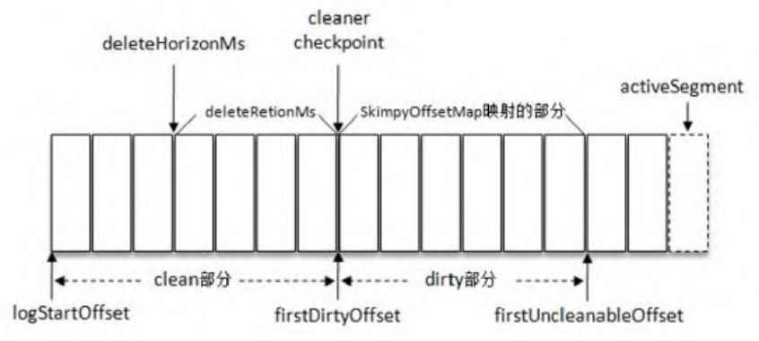
          - deleteRetionMs 由 log.cleaner.delete.retention.ms 配置，即保留时间，默认为 24 h
      - 日志压缩过后，日志分段的大小会比原先的日志分段的要小，为了防止出现太多的小文件，在实际的清理过程中，会将日志文件中 offset从 0 至 firstUncleanableOffset 的所有日志分段进行分组，每个日志分段只属于一组 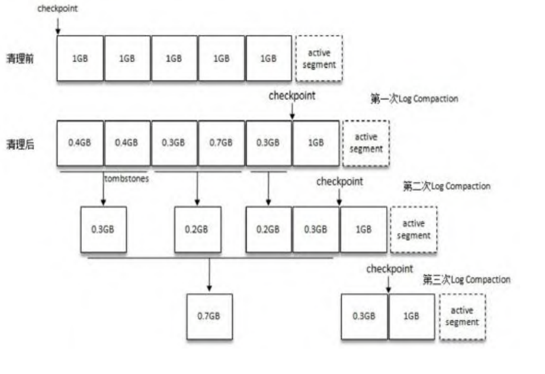
        - 分组的策略为：按照日志分段的顺序遍历，每组中日志分段的占用空间大小之和不超过 log.segment.bytes（默认为 1GB），且对应的索引文件占用的大小之和不超过 log.index.interval.bytes
        - 同一个组的多个日志分段清理之后，只会生成一个新的日志分段
        - 日志压缩执行中，会将每个日志分组中需要保留的消息复制到一个以 .clean 为后缀的临时文件中，此临时文件以当前日志分组中第一个日志分段的文件名命名
          - 例如 00000000000000000.log.clean
        - 日志压缩执行过后，将 .clean 的文件修改为 .swap 后缀的文件，然后删除原本的日志文件，然后才把文件的 .swap 后缀去掉
- 磁盘存储
  - kafka 使用磁盘作为存储和缓存消息，但是由于采用了文件追加的方式来写入消息，所以其吞吐量也还是比较乐观的
  - 同时，kafka 通过将磁盘中的数据映射到内存中（mmap），由操作系统管理页缓存和文件的一致性。并且，由于 Java GC 的限制，如果采取在进程中建立缓存，那么内存的空间利用率很低
  - kafka 提供了 log.flush.interval.messages、log.flush.interval.ms 等来控制同步刷盘等功能
  - Linux 的 IO 调度策略
    - NOOP
      - No Operation
      - 最简单 FIFO 队列，但是会对相邻的 IO 请求之间做合并，例如请求序列： 100,500,101,10,56,1000 NOOP 会按照如下策略： 100,101,500,10,56,1000
    - CFQ（默认）
      - Completely Fair Queuing
      - 按照 IO 请求的地址进行排序，而不是按照先来后到的顺序
      - 例如 100,500,101,10,56,1000 CFQ 会按照下列序列满足： 100,101,500,1000,10,56
      - CFQ为每个进程单独创建一个队列来管理该进程所产生的请求，也就是说，每个进程一个队列，各队列之间的调度使用时间片进行调度，以此来保证每个进程都能被很好地分配到I/O带宽
        - I/O调度器每次执行一个进程的4次请求
    - DEADLINE
      - 除了CFQ本身具有的I/O排序队列，DEADLINE额外分别为读I/O和写I/O提供了FIFO队列
      - 读FIFO队列的最大等待时间为500ms，写FIFO队列的最大等待时间为5s
      - FIFO队列内的I/O请求优先级要比CFQ队列中的高，而读FIFO队列的优先级又比写FIFO队列的优先级高
    - ANTICIPATORY
      - CFQ和DEADLINE考虑的焦点在于满足零散I/O请求上。对于连续的I/O请求，比如顺序读，并没有做优化
      - 为了满足随机I/O和顺序I/O混合的场景，Linux还支持ANTICIPATORY调度算法。ANTICIPATORY在DEADLINE的基础上，为每个读I/O都设置了6ms的等待时间窗口。如果在 6ms 内 OS 收到了相邻位置的读 I/O 请求，就可以立即满足
  - 零拷贝
    - 指将数据直接从磁盘文件复制到网卡设备中，不需要经由应用程序之手
    - 在 linux 中，由 sendfile 系统调用来实现，在 Java 中，就是 FileChannal.transferTo 方法
    - 非零拷贝技术 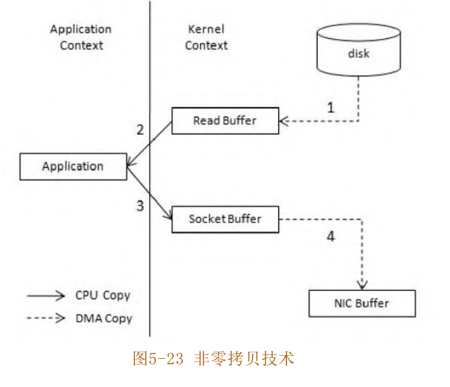
    - 零拷贝技术 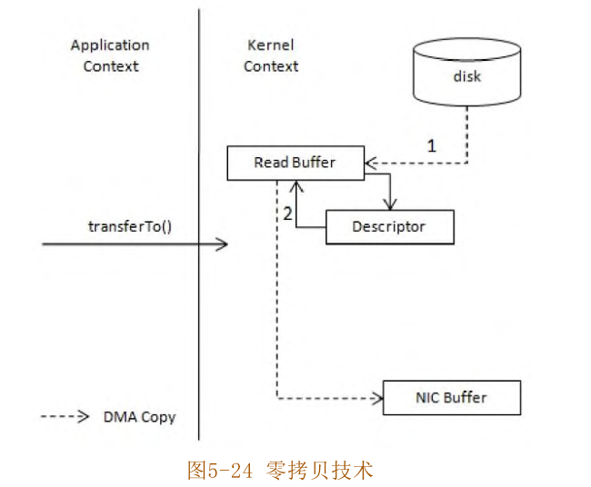
      - 通过 DMA 技术将文件内容复制到内核模式下的 ReadBuffer 中，且只将包含数据的位置和长度的信息的文件描述符被加到了 SocketBuffer 中
- 服务端
  - 协议
    - 在 kafka 2.0.0 中，包含了 43 中协议类型
    - 每种协议类型都有对应的请求（Request）和响应（Response），都遵守特定的协议模式。每种类型的 Request 都包含相同结构的协议请求头和不同结构的协议请求体
    - 协议请求头 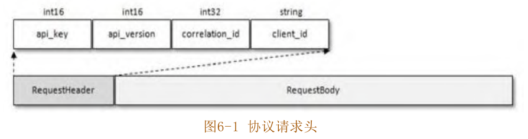
      - api_key
        - api 标识，比如 PRODUCE、FETCH 分别标识发送消息和拉取消息的请求
      - api_version
        - API 版本号
      - correlation_id
        - 由客户端指定的一个数字来唯一地表示这次请求的 id，服务端在处理完请求之后也会把同样的 coorelation_id 写入到 Response 中，这样客户端就能把某个请求和响应对应起来了
      - client_id
        - 客户端 id
    - 协议响应头 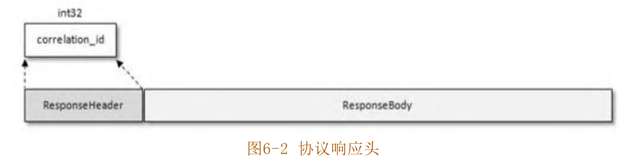
      - 每个 Response 都包含相同结构的协议响应头，不同结构的响应体
    - 协议使用的基本数据类型 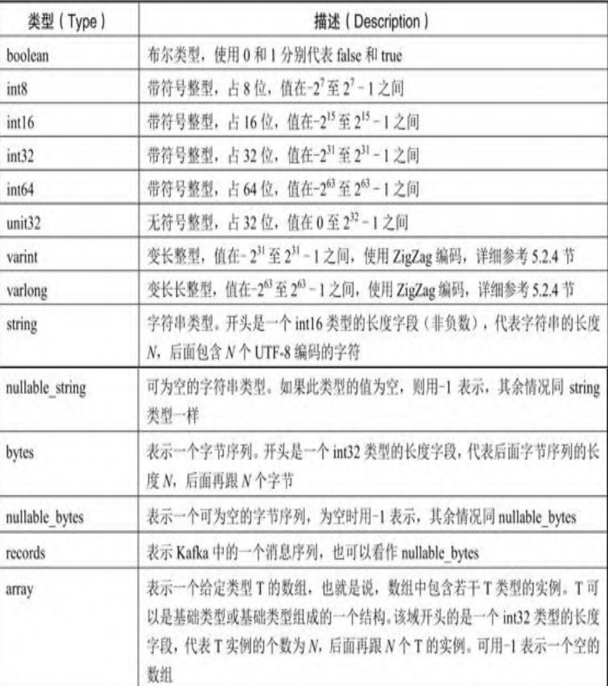
    - 消息发送协议
      - api_key = 0，表示 PRODUCE
      - ProduceRequest 的组织结构（V6） 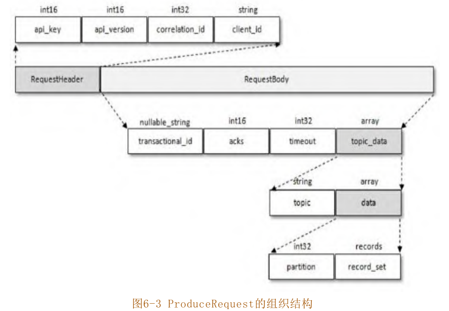
        - 各个域的含义 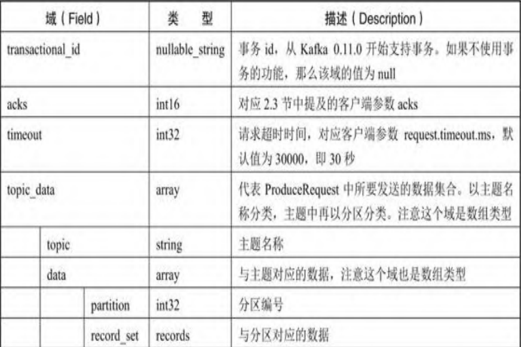
      - 如果参数 acks!= 0，则生产者客户端在发送 ProduceRequest 请求之后就需要异步等待服务端的响应 ProduceResponse（上图对应的 V6） 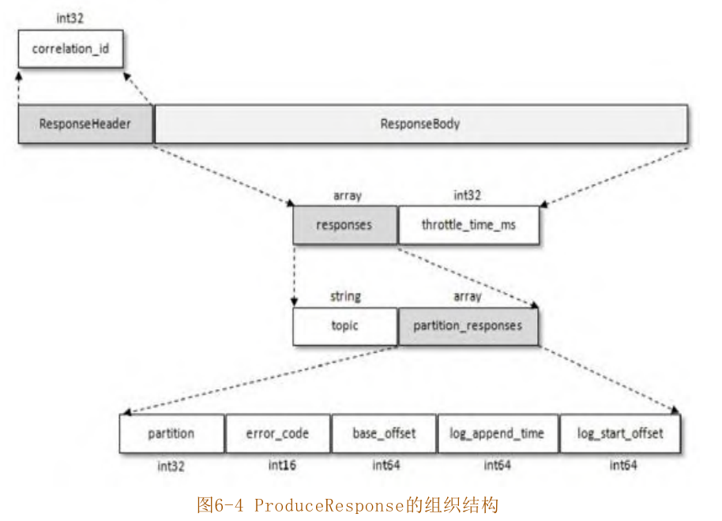
        - 各个域的含义 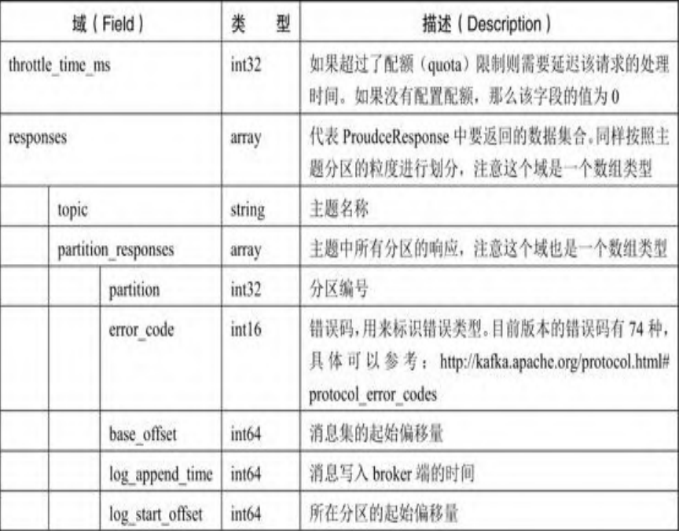
    - 拉取消息协议
      - api_key = 1，表示 FETCH
      - v8 的组织结构 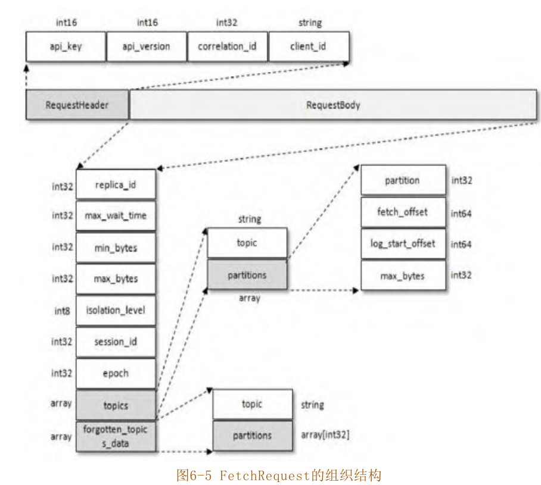
        - 域的含义 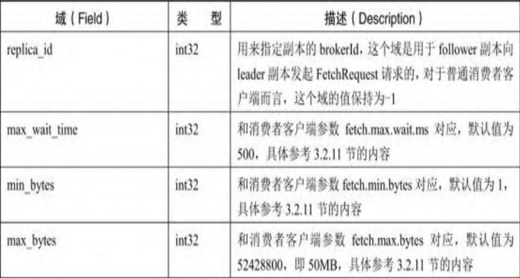
          - 续表 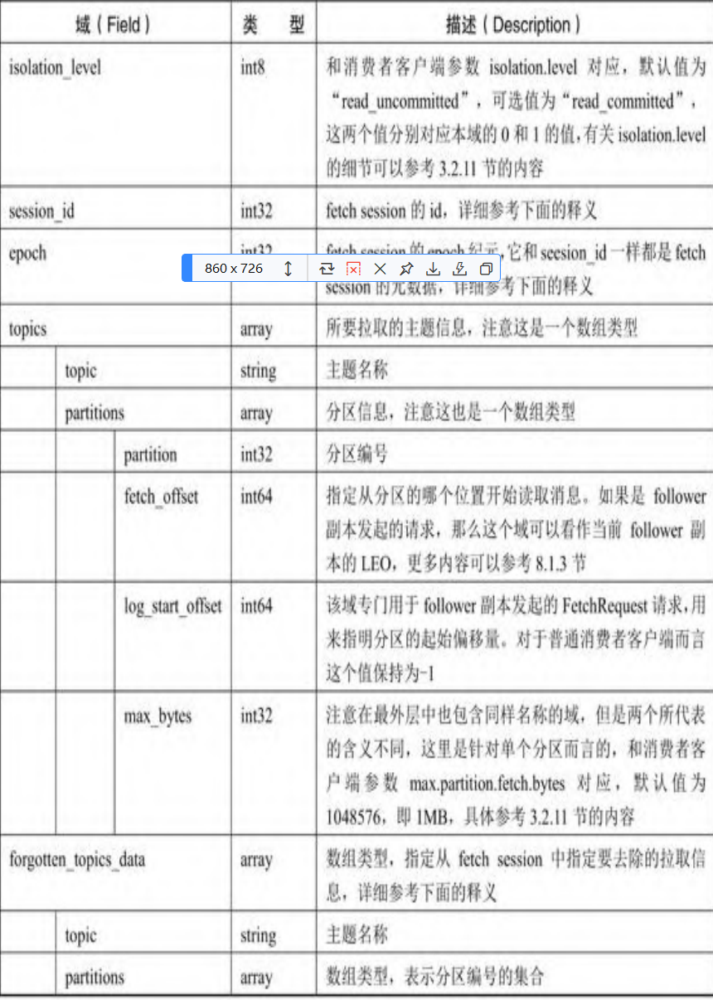
        - 如果要拉取消息，就需要指定详细的拉取信息，包括：partition、fetch_offset、log_start_offset 和 max_bytes 这 4 个域，共 24 byte
          - 一般情况下，不管是 follower 副本还是普通的消费者，他们的订阅信息都是长期固定的。只有在拉取开始时或发生异常时会有所变动
          - FetchRequest 请求是一个非常平凡的请求，如果要拉取的分区有很多，那么网络上频繁交换的 FetchRequest 就会有很多重复的字节在传送，故而可以将这 24 字节保存起来，节省这部分所占用的带宽
          - session_id 和 epoch
            - 确定一条拉取链路的 fetch session
          - 当 session 建立或变更时会发送全量式的 FetchRequest；当 session 稳定时会发送增量式的 FetchRequest，其中的 topics 域的内容为空
          - 如果需要从当前 fetch session 中取消对某些分区的拉取订阅，则可以使用 forgotten_topics_data 字段来实现
      - FetchResponse 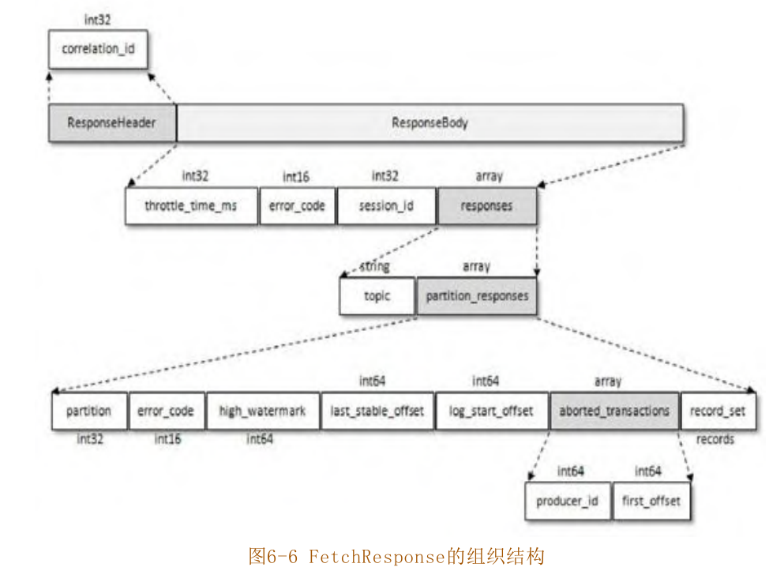
  - 时间轮
    - TimingWheel 是一个存储定时任务的环形队列，低层使用数组实现 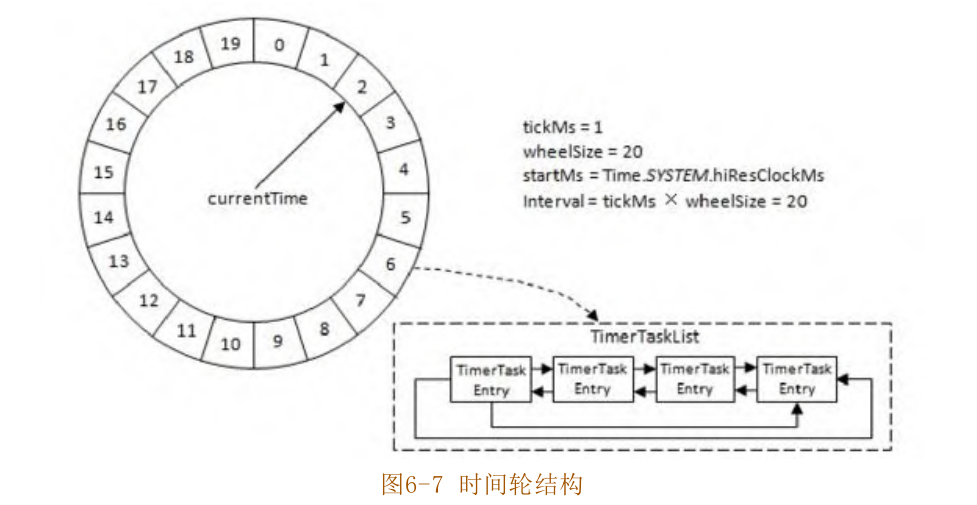
      - 数组中的每个元素可以存放一个定时任务列表（TimerTaskList），该元素是一个环形的双向链表，链表中的每一项表示的都是定时任务项（TimerTaskEntry），其中封装了真正的定时任务（TimerTask）
    - 时间轮由多个时间格组成，每个时间格代表当前时间轮的基本时间跨度（tickMs）。时间轮的时间格个数是固定的，可用 wheelSize 来表示
    - 时间轮的 currentTime 指针将整个时间轮划分为到期部分和未到期部分。当前所指的时间格也属于到期部分，表示刚好到期，需要处理此事件格所对对应的 TimerTaskList 中的所有任务
    - 默认情况下，时间轮只能处理定时为 0~tickMs x wheelSize 的定时任务，但是在 kafka 中，为了满足需求，提出了层级时间轮的概念，当任务的到期时间超过了当前时间轮所表示的时间范围时，就会尝试添加到上层时间轮中 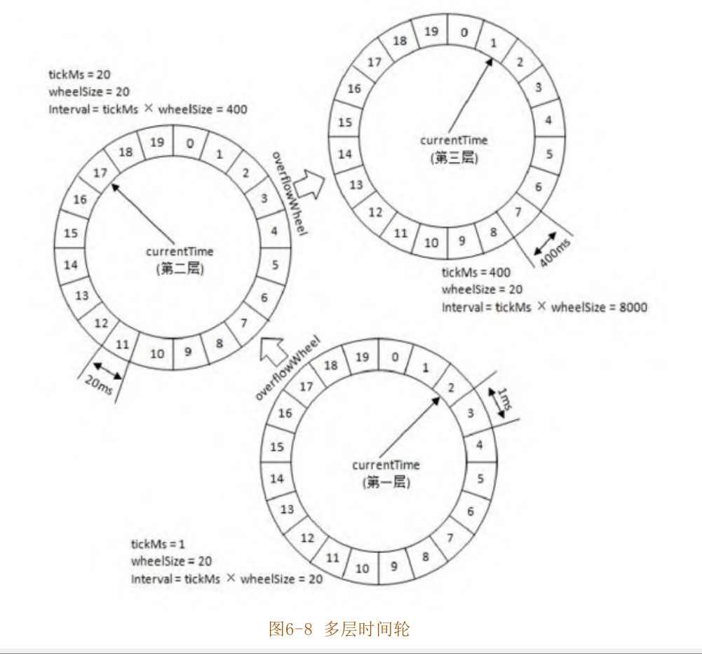
    - 时间轮中，时间是如何推进的（currentTime 指针是如何被更新的）？
      - 借助 JDK 的 DelayQueue。将每个使用到的 TimerTaskList 都加入到 DelayQueue 中，DelayQueue 会根据 TimerTaskList 对应的超时时间 expiration 来排序，
      - kafka 中会有一个线程 ExpiredOperationReaper 来获取 DelayQueue 中到期的任务列表。当该线程获取到超时的任务列表之后，会根据其中的 expiration 来推进时间轮的时间，同时，也可以更具获取的任务列表来执行对应的操作
  - 延迟操作
    - 延迟操作与定时操作不同，延迟操作虽然同样有超时时间，但是其可以提前完成，如果在规定的时间内完成，会被强制完成
    - 延迟才做创建之后会被加入到延时操作管理器（DelayedOperationPurgatory）来做专门的处理
    - 每个延时操作都会配备一个定时器（SystemTimer）来做超时管理，定时器的低层采用时间轮实现，延时操作管理器负责启动收割机线程 ExpiredOperationReaper 来驱动时间轮，同时该线程还会清理监听池中已完成的延时操作
    - 延时操作需要支持外部事件的触发，所以还要配备一个监听池来负责监听每个分区的外部事件。例如需要监视是否有分区的的 HW 发生了增长
    - 例如，客户端要求分区的所有副本都写入消息之后服务端才返回（ack = -1） 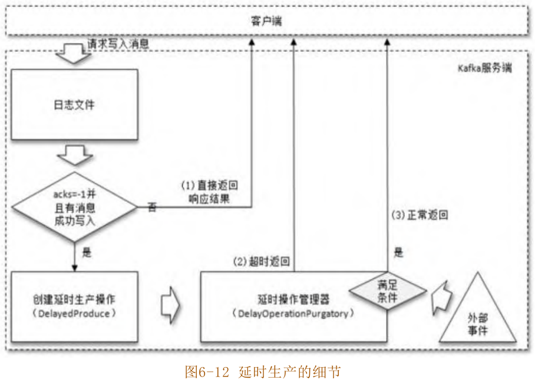
  - 控制器
    - kafka 集群中会有一个或多个 broker，其中一个 broker 会被选举为控制器，负责管理整个集群中所有分区和副本的状态。在任意时刻，集群中有且仅有一个控制器
    - 当某个分区的leader副本出现故障时，由控制 器负责为该分区选举新的leader副本
    - 当检测到某个分区的ISR集合发生变化时，由控制器负责通知所有broker更新其元数据信息
    - 当使用kafka-topics.sh脚本为某个topic增加分区数量时，同样还是由控制器负责分区的重新分配
    - 控制器选举
      - 控制器选举工作依赖于 ZooKeeper，成功竞选为控制器的 broker 会在 ZooKeeper 中创建 /controller 这个临时（EPHEMERAL）节点，此临时节点的参考内容： 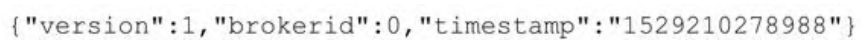
        - 临时节点中的 brokerid 表示该控制器的 broker id，timestamp 为该 broker 称为控制器时的时间戳
      - 每个 broker 启动的时候会去尝试读取/controller节点的brokerid的值，如果读取到brokerid的值不为-1，则表示已经有其他 broker 节点成功竞选为控制器，所以当前 broker 就会放弃竞选；如果 ZooKeeper 中不存在/controller节点，或者这个节点中的数据异常，那么就会尝试去创建/controller节点
      - 当前broker去创建节点的时候，也有可能其他 broker同时去尝试创建这个节点，只有创建成功的那个broker才会成为控制器，而创建失败的broker竞选失败
      - 每个broker都会在内存中保存当前控制器的 brokerid 值，这个值可以标识为activeControllerId
    - 控制器选举成功后，会读取 ZooKeeper 中各个节点的数据来初始化上下文信息（ControllerContext），并且需要管理这些上下文信息 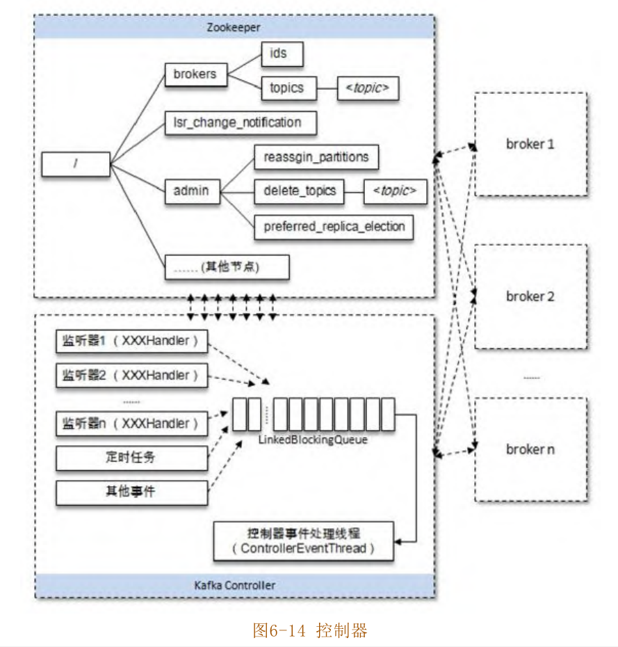
      - 不管是监听器触发的时间，还是定时任务触发的时间，或者其他时间，都会读取和更新控制器中的上下文信息。这就会涉及到线程同步操作。如果使用锁，性能不够
      - 线程同步解决方案：对每个时间都做一层封装，然后按照时间发生的先后顺序暂存到 LinkedBlockingQueue 中，最后使用一个专用的线程 ControllerEventThread 按照 FIFO 的原则顺序处理各个时间
    - ZooKeeper 中还有一个与控制器有关的/controller_epoch 节点，这个节点是持久（PERSISTENT）节点，节点中存放的是一个整型的controller_epoch值
      - controller_epoch用于记录控制器发生变更 的次数，即记录当前的控制器是第几代控制器，我们也可以称之为“控制器的纪元”
      - 每个和控制器交互的请求都会携带controller_epoch这个字段，如果请求的controller_epoch值小于内存中的controller_epoch值，则认为这个请求是向已经过期的控制器所发送的请求，那么这个请求会被认定为无效的请求
      - 如果请求的controller_epoch值大于内存中的 controller_epoch值，那么说明已经有新的控制器当选了
      - Kafka 通过 controller_epoch 来保证控制器的唯一性，进而保证相关操作的一致性
    - 在 /controller 节点被删除时，每个 broker 都会进行选举，如果 broker 在节点被删除前是控制器，那么在选举前还需要一个退位动作：关闭相应的资源，例如注销相应的监听器等
    - 控制器的额外职责
      - 监听分区相关的变化
        - 为 ZooKeeper 中的 /admin/reassign_partitions 节点注册 PartitionReassignmentHandler，用来处理分区重分配的动作
        - 为 ZooKeeper 中的 /isr_change_notification 节点注册 IsrChangeNotificationHandler，用来处理 ISR 集合变更的动作
        - 为 ZooKeeper 中的 /admin/preferred-replica-election 节点添加 PreferredReplicaElectionHandler，用来处理优先副本的选举动作
      - 监听主题相关的变化
        - 为 ZooKeeper 中的 /brokers/topics 节点添加 TopicChangeHandler，用来处理主题增减的变化
        - 为 ZooKeeper 中的 /admin/delete_topics 节点添加 TopicDeletionHandler，用来处理删除主题的动作
      - 监听broker相关的变化
        - 为 ZooKeeper 中的 /brokers/ids 节点添加 BrokerChangeHandler，用来处理 broker 增减的变化
      - 从 ZooKeeper 中读取当前所有与主题、分区及 broker 相关的信息，并进行相应的管理
        - 对所有主题对应的 ZooKeeper 中的 /brokers/topics/&lt;topic&gt; 节点添加 PartitionModificationsHandler，用来监听主题中的分区分配变化
      - 启动并管理分区状态机和副本状态机
      - 更新集群的元数据信息
      - 如果参数 auto.leader.rebalance.enable 设置为 true，则会开启一个名为 “auto-leader-rebalance-task” 的定时任务，负责维护分区的优先副本均衡
  - 如何优雅关闭 broker？
    - 向 kafka 进程发送 TERM 信号
    - 关闭 broker 时，会执行控制关闭（ControlledShutdown）的动作，前提条件是启用了 controlled.shutdown.enable,默认为 true
      - 控制关闭相比于直接强制关闭的优点
        - 可以让消息完全同步到磁盘上。重新启动之后不需要进行日志的恢复操作
        - 在关闭服务之前，会对 leader 副本进行迁移，这样就可以减少分区的不可用时间
  - 分区 leader 的选举
    - 由控制器负责具体的实施
    - 选举的时机：创建主题、增减分区、分区上线
    - 选举策略
      - OfflinePartitionLeaderElectionStrategy
        - 选举 AR 集合中第一次存活的副本，要求这个副本在 ISR 中
        - 一个分区的AR集合在分配的时候就被指定，并且只要不发生重分配的情况，集合内部副本的顺序是保持不变的，而分区的ISR集合中副本的顺序可能会改变
        - 如果 ISR 集合中没有可用的副本，那么如果 unclean.leader.election.enable 参数 = true（默认为 false），那么表示允许从非 ISR 列表中选举 leader，从 AR 列表中年找到第一个存活的副本即为 leader
      - ReassignPartitionLeaderElectionStrategy
        - 在进行分区重分配之后进行
        - 从重分配的 AR 列表中找到第一个存活的副本，且这个副本在目前的 ISR 列表中
      - ControlledShutdownPartitionLeaderElectionStrategy
        - 当节点被关闭时，位于这个节点上的 leader 副本会下线，故而重新选举
        - 从 AR 列表中找到第一个存活的副本，且这个副本在目前的 ISR 列表中，与此同时，还要确保这个副本不处于正在被关闭的节点上
- 客户端
  - 分区分配策略
    - kafka 提供了消费者客户端参数 partition.assignment.strategy 来设置消费者与订阅主题之间的分区分配策略。可以设置多个分配策略，用逗号分隔
      - RangeAssignor（默认）
      - RoundRobinAssignor
      - StickyAssignor
    - RangeAssignor
      - 按照分区总数和消费者总数进行整除运算来获得一个跨度，然后将分区按照跨度进行平均分配，以保证分区尽可能均匀地分配给所有的消费者
      - 对于一个主题，RangeAssignor 策略会将消费组内所有订阅这个主题的消费者按照名称的字典序排序，然后为每个消费者划分固定的分区范围，如果不够平均分配，那么字典序靠前的消费者会被多分配一个分区
        - 假设 n = 分区数 / 消费者数量，m = 分区数 % 消费者数量，那么前 m 个消费者每个分配 m+1 个分区，后面的消费者每个分配 n 个分区
    - RoundRobinAssignor
      - 将消费组内的所有消费者以及消费者们订阅的所有主题的分区按照字典序进行排序，然后通过轮询的方式逐个将分区分配给每个消费者
    - StickyAssignor
      - 目的
        - 分区的分配尽可能均匀
        - 分区的分配尽可能与上次分配的保持相同
    - 自定义分配策略
      - 必须实现 PartitionAssignor 接口
  - 消费者协调器和组协调器
    - 用于解决多个消费者分区分配策略之间的协同问题（多个消费者之间的分区分配策略不同的话就需要协同）
    - 全部的消费组分成了多个子集，每个消费组的子集在服务端对应一个 GroupCoordinator 对其进行管理。而消费端中的 ConsumerCoordinator 组件负责与 GroupCoordinator 进行交互
    - 消费者和组协调器主要的职责就是执行消费者的再均衡操作，分区分配就是在此阶段完成
    - 再均衡操作发生的时机
      - 有新的消费者加入消费组
      - 有消费者宕机下线（有可能由于长时间的 GC）
      - 消费者主动退出了消费组（发送 LeaveGroupRequest），例如调用 unsubscribe 方法
      - 消费组所对应的 GroupCoorinator 节点发生了变更
      - 消费组内所订阅的任一主题或者分区的数量发生变化
    - 再均衡操作的过程
      - 消费者确定它所属的消费组对应的 GroupCoordinator 所在的 broker，并创建与该 broker 相互通信的网络连接
        - 向集群中的负载最小的节点发送 FindCoordinator 请求来查找对应的 GroupCoordinator 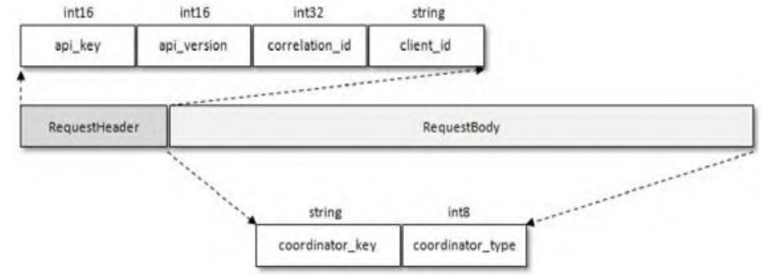
          - coordinator_key 就是消费组的名称，即 groupId，coordinator_type = 0
          - kafka 收到了请求之后，根据 key 来查找 GroupCoordinator 节点，如果找到，则返回 node_id、host 和 port 信息
            - 首先计算 __consumer_offsets 分区号（__coonsumer_offesets 主题内有多个分区，默认为 50 个） 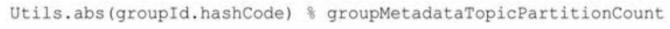
            - 寻找此分区 leader 副本所在的 broker 节点，该 broker 节点即为这个 groupId 所对应的 GroupCoordinator 节点
              - 此broker节点既扮演GroupCoordinator的角色，又扮演保存分区分配方案和组内消费者位移的角色，这样可以省去很多不必要的中间轮转所带来的开销
      - 消费者向 GroupCoordinator 发送 JoinGroupRequest 请求，并处理响应
        - TODO
```
