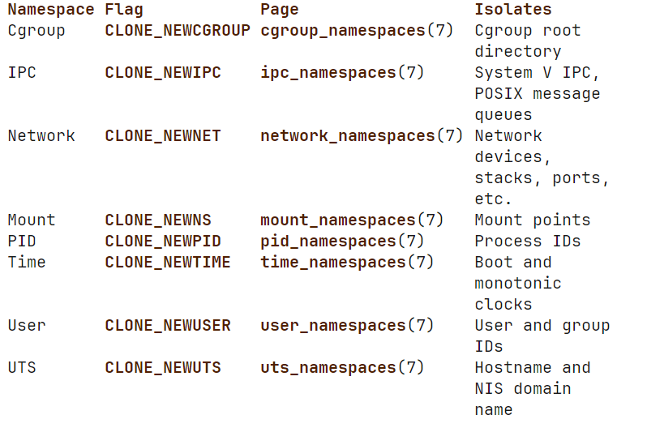

```markmap
---
markmap:
  initialExpandLevel: 2
  spacingVertical: 30
  spacingHorizontal: 180
---

# Linux Namespace
- 概念
  - 命名空间（namespace）将全局系统资源封装成一个抽象层，使得在该命名空间中的进程能够看到一个独立的、与全局资源隔离的资源实例
  - 对全局资源的更改对该命名空间中的所有进程可见，但对其他命名空间中的进程则不可见
- 类型
  - 总结 
    - Namespace 是该类型的名称
    - Flag 是该 Namespace 可以在各种 API 中使用的常量
    - Page 是该 Namespace 的详细信息
    - Isolates 是被该 Namespace 隔离的资源
  - cgroup namespace
    - 虚拟化了进程的 cgroup 视图，即通过 /proc/pid/cgroup 和 /proc/pid/mountinfo 查看到的视图
    - 每个 cgroup namespace 都有自己的 cgroup 根目录，这些根目录是 /proc/pid/cgroup 文件显示的路径的的基点（显示的目录可以看做是相对于这个根目录的相对路径），换句话说，就是要在该文件显示的路径前加上根目录，才能形成完整的目录
    - 当进程调用 clone 或者 unshare 并且 flags 参数中含有 CLONE_NEWCGROUP flag 时，该进程当前的 cgroup 目录成为 cgroup namespace 的 cgroup 根目录
    - 当读 /proc/pid/cgroup 文件时，第三个字段路径会显示相对于读取进程所在的 cgroup namespace 的根目录的路径
    - 如果目标进程的 cgroup 目录位于读取进程的 cgroup 命名空间根目录之外，那么路径名将显示相应数量的 .. 来定位到该目录
    - 目的
      - 防止了信息泄漏的问题，即容器内的进程本可能会看到容器外的 cgroup 目录路径。这种泄漏可能会暴露容器框架的相关信息给容器化应用程序
      - 这简化了诸如容器迁移之类的任务。cgroup 命名空间提供的虚拟化使得容器能够隔离对祖先 cgroup 路径名的知晓。如果没有这种隔离，在迁移容器时，必须在目标系统上复制完整的 cgroup 路径名
      - 实现的功能：可以通过挂载容器的 cgroup 文件系统，即可以确保容器内的进程无法访问祖先 cgroup 目录，故而不可以更改它所拥有的资源
  - ipc namespace
    - 隔离 IPC 资源：System V IPC 对象和 POSIX 消息队列
    - IPC 机制的共同特点是，IPC对象的标识方式不是通过文件系统路径名，而是通过机制来进行标识
    - 每一个 ipc namespace 拥有自己的 System V IPC 标识和自己的 POSIX 消息队列。在 pic namespace 创建的对象对于该 namespace 的成员进程都可见，但是，对其他 namespace 不可见
    - 在每一个 IPC namespace 中，包含以下文件
      - /proc/sys/fs/mqueue
        - POSIX 消息队列的接口
      - /porc/sys/kernel 目录下的 msgmax, msgmnb, msgmni, sem, shmall, shmmax, shmmni, 和 shm_rmid_forced 文件
      - /proc/sysvipc
        - System V IPC 接口文件
    - 当 ipc namespace 被销毁时，IPC 对象会被自动销毁
  - network namespace
    - 隔离网络设备、IPv4 和 IPv6 协议栈、IP 路由表、防火墙规则、/proc/net 目录（指向 /proc/pid/net的符号链接）、/sys/class/net 目录、/proc/sys/net 的各种文件、端口号、 UNIX domain 的抽象 socket namespace等等
    - 一个物理网络设备只能存在于一个 network namespace 中，当一个 network namespace 被销毁时，物理网络设备移动到初始的 network namespace 中，而不是该 namespace 的父 namespace
    - 一个虚拟网络设备veth(4)对（pair）提供了一种类似管道的抽象，用于在网络命名空间之间创建隧道，或者将另一个命名空间中的物理网络设备与当前命名空间桥接起来。当一个命名空间被释放时，其内部的 veth(4) 设备也会随之销毁
- API
  - clone(2)
    - 创建一个新的进程，如果 flags 参数包含了上图的 CLONE_NEW* flags，新进程会称为这些命名空间的成员
  - setns(2)
    - 允许调用进程加入一个已经存在的 namespace
  - unshare(2)
    - 允许调用进程加入一个新的 namespace
    - 如果 flags 参数有一个或多个 CLONE_NEW* flags，那么，每个 flag 指定的 namespace 都会被创建，同时，该调用进程会加入到这些 namespace 中
  - ioctl(2)
    - 许多 ioctl 操作可以被用来发现关于 namespaces 的信息，这些操作可以在 ioctl_ns[fs](2) 中找到
  - clone 和 unshare 创建非 user namespaces 时需要特权
- /proc/pid/ns 目录
  - 每一个进程都有一个 /proc/pid/ns 子目录
  - 其中包含可以通过 setns 操作的命名空间
  - Bind mounting(see mount(2)，绑定挂载) 其中的一个文件到这个文件系统的其他地方会保持这个文件对应的 namespace 存活，即使该 namespace 中的进程全部终止了
    - bind mounting 的作用是使另一个文件或者目录指向与 source file/dir 相同的底层数据，并不会挂载新的文件系统，故而在 target file/dir 所做的修改也会在 source file/dir 中体现
    - 例如： mount --bind /source/file /target/file 但是要确保 /target/file 文件已经存在
  - 打开这个目录下的文件会返回该进程的该文件对应的 namespace 的文件描述符，此文件描述符可以用作 setns 函数的参数。只要还有文件描述符维持打开状态，这个 namespace 就会一直存活，即使该 namespace 中的所有的进程都终止了
  - 此目录下的符号链接包含了 namespace 的类型和其 inode number，例如： uts:[4026531838]
  - 需要注意的是，一个进程的 PID namespace 永远不会改变
- /proc/sys/user 目录
  - 规定了每一个用户创建每一种 namespace 的最大数量
  - 读取到的限制值是针对打开这些文件的进程所属的用户命名空间中的每个用户的限制。只要处于相同的用户命名空间中，每个用户都可以单独创建最多达到该限制值的命名空间，而不是由同一用户命名空间内所有用户共享的总限制
  - 如果由于此限制 clone 和 unshare 失败，errno = ENOSPC
  - 在最初的 user namespace 中，这些目录的文件中的限制值默认是 /proc/sys/kernel/threads-max 值的一半
  - 在后续的所有 user namespace 中，默认值是 MAXINT
  - 当一个新的命名空间被创建时，它所占用的资源会被算入到它所有祖先命名空间的资源使用中。也就是说，这个新命名空间的资源使用会影响到它所在的所有上级（祖先）命名空间的资源统计
    - 每个 user namespace 中都有一个创建者的 UID，这个 UID 会在所有祖先命名空间中记录新命名空间的资源使用情况。
    - 内核会确保在所有祖先命名空间中，创建者 UID 的资源使用限制不会被超过。这意味着即使在新创建的命名空间中，资源使用也会受到其祖先命名空间限制的约束
    - 这一机制的目的是防止通过创建新的用户命名空间来规避当前命名空间的资源限制。例如，如果当前命名空间有资源限制，新创建的子命名空间的资源使用会被计算在内，确保不会超出限制
- namespace 生命周期
  - 当最后一个进程终止或离开 namespace 时，namespace 会自动销毁
  - 但是，有一些额外的情况来确保 namespace 存活，即使是该 namespace 中没有任何进程
    - 在 /proc/pids/ns/* 中的文件有一个文件描述符保持在打开状态或者这些文件中存在一个 bind mount
    - 该 namespace 还有子 namespace
    - 拥有一个或多个不是 user namespace 的 namespace 的 user namespace
    - 有一个 /proc/pid/ns/pid_for_children 指向的一个 pid namespace
    - 有一个 /proc/pid/ns/time_for_children 指向的一个 time namespace
    - 有一个 mqueue 文件系统的挂载指向的 ipc namespace
    - 有一个 proc 文件系统的挂载指向的 pid namespace
```
