```markmap
---
markmap:
  initialExpandLevel: 2
  spacingVertical: 30
  spacingHorizontal: 180
---

# MySQL
- 认识 MySQL
  - 启动 MySQL 服务器程序
    - mysqld
      - mysqld这个可执行文件就代表着MySQL服务器程序，运行这个可执行文件就可以直接启动一个服务器进程
    - mysqld_safe
      - mysqld_safe是一个启动脚本，它会间接的调用mysqld，而且还顺便启动了另外一个监控进程，这个监控进程在服务器进程挂了的时候，可以帮助重启它
      - 使用mysqld_safe启动服务器程序时，它会将服务器程序的出错信息和其他诊断信息重定向到某个文件中，产生出错日志，这样可以方便我们找出发生错误的原因
    - mysqld_multi
      - 运行多个 MySQL 服务器进程，可以对每个服务器进程进行监控
  - 客户端与服务器进程之间的通信方式
    - TCP/IP
      - MySQL 默认监听 3306 端口
      - 可以用 mysqld -P&lt;port&gt; 来指定监听的端口 使用 mysql -P&lt;port&gt; 来指定连接的端口
    - 命名管道和共享内存
      - 命名管道
        - 需要在启动服务器程序的命令中加上--enable-named-pipe参数，然后在启动客户端程序的命令中加入--pipe或者--protocol=pipe参数
      - 共享内存
        - 需要在启动服务器程序的命令中加上--shared-memory参数，在成功启动服务器后，共享内存便成为本地客户端程序的默认连接方式，不过我们也可以在启动客户端程序的命令中加入 --protocol=memory参数来显式的指定使用共享内存进行通信
        - 客户端必须和服务器位于同一台主机中
    - UNIX 套接字文件
      - 如果我们在启动客户端程序的时候指定的主机名为localhost，或者指定了--protocol=socket的启动参数，那服务器程序和客户端程序之间就可以通过Unix域套接字文件来进行通信
      - MySQL服务器程序默认监听的Unix域套接字文件路径为/tmp/mysql.sock，客户端程序也默认连接到这个Unix域套接字文件
      - 可以指定 Unix 域套接字文件： mysqld --socket=&lt;file-path&gt; mysql --socket=&lt;file-paht&gt;
  - 服务端处理客户端请求
    - 图解 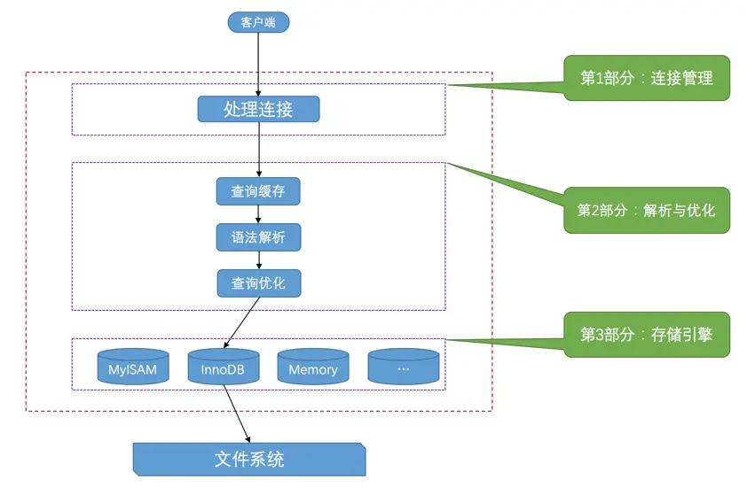
      - 连接管理
        - 每当有一个客户端进程连接到服务器进程时，服务器进程都会创建一个线程来专门处理与这个客户端的交互，当该客户端退出时会与服务器断开连接，服务器并不会立即把与该客户端交互的线程销毁掉，而是把它缓存起来，在另一个新的客户端再进行连接时，把这个缓存的线程分配给该新客户端。
      - 解析与优化
        - 查询缓存
          - 如果两个请求在任何字符上不同，都会导致缓存不命中
          - 导致不缓存的几种情况
            - 请求包含某些系统函数（比如函数NOW）
            - 请求包含一些系统表（如 mysql 、information_schema、performance_schema 数据库中的表）
            - 请求包含用户自定义的变量和函数
          - MySQL的缓存系统会监测涉及到的每张表，只要该表的结构或者数据被修改，如对该表使用了INSERT、 UPDATE、DELETE、TRUNCATE TABLE、ALTER TABLE、DROP TABLE或 DROP DATABASE语句，那使用该表的所有高速缓存查询都将变为无效并从高速缓存中删除
          - 虽然查询缓存有时可以提升系统性能，但也不得不因维护这块缓存而造成一些开销，比如每次都要去查询缓存中检索，查询请求处理完需要更新查询缓存，维护该查询缓存对应的内存区域。从MySQL 5.7.20开始，不推荐使用查询缓存，并在MySQL 8.0中删除
        - 语法解析
          - 类似于编译的过程
        - 查询优化
      - 存储引擎
        - 负责存取数据
        - 一些存储引擎 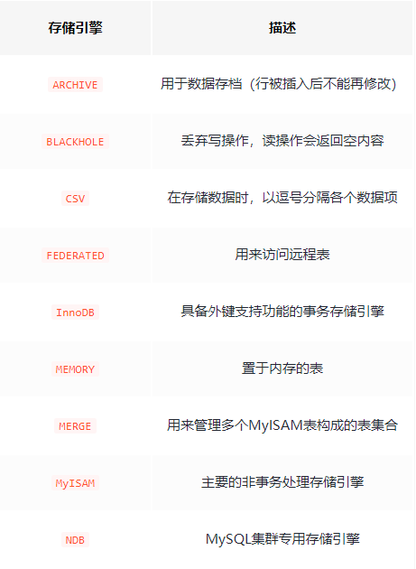
        - 相关操作
          - 设置表的存储引擎
            - CREATE TABLE 表名( 建表语句; ) ENGINE = 存储引擎名称;
          - 修改表的存储引擎
            - ALTER TABLE 表名 ENGINE = 存储引擎名称;
- MySQL 调控
  - 配置文件
    - 配置文件（UNIX）路径
      - 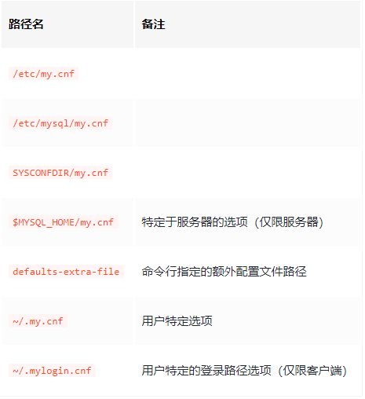
        - SYSCONFDIR表示在使用CMake构建MySQL时使用SYSCONFDIR选项指定的目录。默认情况下，这是位于编译安装目录下的etc目录
        - .mylogin.cnf 配置文件不是一个纯文本文件，是使用 mysql_config_editor 创建的加密文件。文件中包含host、user、password、port和 socket。只能被客户端程序所使用
      - 可以使用 --default-file=&lt;file-path&gt; 来指定配置文件的路径，而不搜索上图中的的文件路径
    - 配置文件的内容
      - 配置文件中的启动选项被划分为若干个组，每个组有一个组名，用中括号[]扩起来
        - 例如 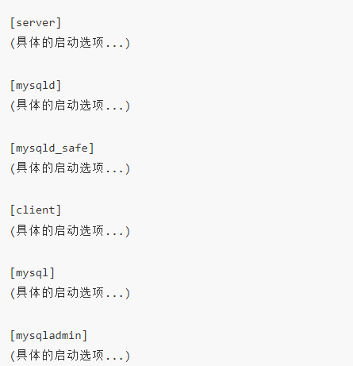
      - 组
        - server
          - 作用于所有的服务器程序
        - mysqld
          - 作用于mysqld服务器程序
        - mysql_safe
        - client
          - 将作用于所有的客户端程序
        - mysql
          - 作用于mysql客户端程序
        - mysqladmin
    - 不同启动命令读取的组
      - 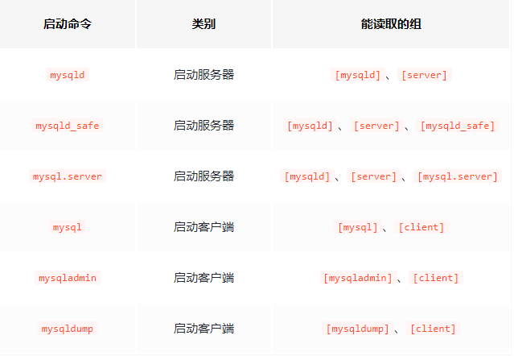
    - 不同版本专用选项组
      - 定义一个[mysqld-5.7]的选项组，它的含义和[mysqld]一样，只不过只有版本号为5.7的mysqld程序才能使用这个选项组中的选项
    - 配置的优先级
      - 如果我们在多个配置文件中设置了相同的启动选项，那以最后一个配置文件中的为准
      - 如果同一文件中的不同组出现了相同的配置，那么以在配置文件中出现靠后的那个组中的配置为准
      - 如果一个选项既出现在命令行中，也出现在配置文件中，那么以命令行中的为准
  - 系统变量
    - MySQL服务器程序运行过程中会用到许多影响程序行为的变量，它们被称为MySQL系统变量
    - 大多数的系统变量的值也可以在程序运行过程中修改，而无需停止并重新启动它
    - 每个系统变量都有一个默认值，我们可以使用命令行或者配置文件中的选项在启动服务器时改变一些系统变量的值
      - 需要注意的是：某些系统变量并不能通过启动选项进行指定，也有些启动选项不是系统变量
        - 大部分的系统变量都可以被当作启动选项传入
        - 有些系统变量是在程序运行过程中自动生成的，是不可以当作启动选项来设置，比如auto_increment_offset、character_set_client
        - 有些启动选项也不是系统变量，比如defaults-file
    - 作用范围
      - 不同的客户端对于同一个系统变量可能会需要有不同的值；同时，不同的客户端也可能需要某些系统变量是相同的
      - GLOBAL 作用范围
        - 在服务器启动时，会将每个全局变量初始化为其默认值（可以通过命令行或选项文件中指定的选项更改这些默认值）
      - SESSION （LOCAL）作用范围
        - 服务器为每个连接的客户端维护一组会话变量，客户端的会话变量在连接时使用相应全局变量的当前值初始化
      - 并不是所有系统变量都具有GLOBAL和SESSION的作用范围
        - 有一些系统变量只具有GLOBAL作用范围，比方说max_connections，表示服务器程序支持同时最多有多少个客户端程序进行连接
        - 有一些系统变量只具有SESSION作用范围，比如insert_id，表示在对某个包含AUTO_INCREMENT列的表进行插入时，该列初始的值
    - 查看系统变量
      - SHOW [GLOBAL|SESSION] VARIABLES [LIKE 匹配的模式];
        - 默认查看的是 SESSION 作用范围的系统变量
      - 例如： 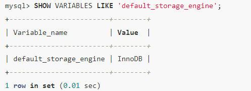
    - 设置系统变量
      - 通过配置文件
      - 通过命令行参数
      - 通过命令
        - SET [GLOBAL|SESSION] &lt;varname&gt; = &lt;value&gt;
        - SET [@@(GLOBAL|SESSION).]&lt;varname&gt;=&lt;value&gt;
        - 例如： 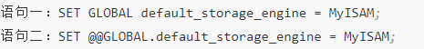
        - 如果不指定作用范围，则默认作用范围是 SESSION
      - 如果某个客户端改变了某个系统变量在GLOBAL作用范围的值，并不会影响该系统变量在当前已经连接的客户端作用范围为SESSION的值，只会影响后续连入的客户端在作用范围为SESSION的值
  - 状态变量
    - MySQL服务器程序中维护了关于程序运行状态的变量，它们被称为状态变量
    - 作用范围
      - 与系统变量一致
    - 查看状态变量
      - SHOW [GLOBAL|SESSION] STATUS [LIKE 匹配模式];
- 字符集与比较规则
  - 字符集
  - 比较规则
    - 作用：确定字符集中的两个字符相比之后的结果
  - mysql 中的字符集
    - utf8mb3 （在 mysql 中称为 utf8）
      - utf8青春版，只使用 1 ~ 3 字节表示字符
    - utf8mb4
      - utf8本尊，使用 1 ~ 4 字节表示字符
    - 使用 SHOW (CHARACTER SET | CHARSET) [LIKE 匹配模式] 来查看字符集
    - 常用的字符集 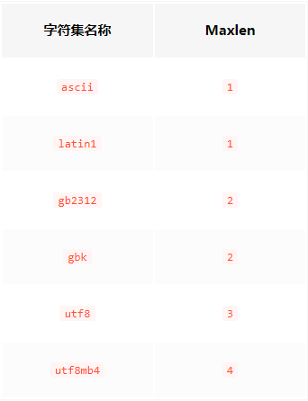
  - mysql 中的比较规则
    - 查看比较规则
      - SHOW COLLATION [LIKE 匹配的模式];
      - 示例 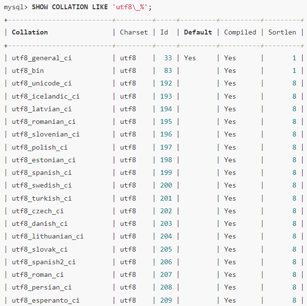
    - 比较模式名字后缀的含义
      - 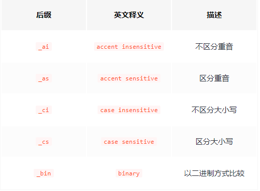
  - 4 种级别的字符集和比较规则
    - 服务器级别
      - MySQL 提供了两个系统变量来表示服务器级别的字符集和比较规则 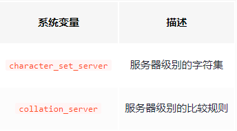
    - 数据库级别
      - 在创建和修改数据库的时候可以指定该数据库的字符集和比较规则
        - 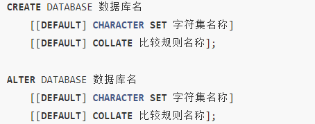
        - 其中，DEFAULT 是可以省略的
        - 如果不指定，则默认使用数据库级别的字符集和比较规则
      - 当使用 USE 语句选择当前的数据库之后，就可以使用系统变量来查看当前的数据库字符集和比较规则
        - 系统变量，这两个变量是只读的 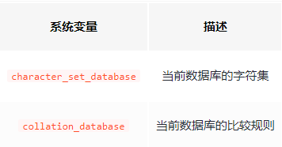
    - 表级别
      - 在创建和修改表的时候可以指定该表的字符集和比较规则
        - 
        - 如果没指定，则默认使用数据库级别的字符集和比较规则
    - 列级别
      - 对于存储字符串的列，同一个表中的不同的列也可以有不同的字符集和比较规则
        - 语法 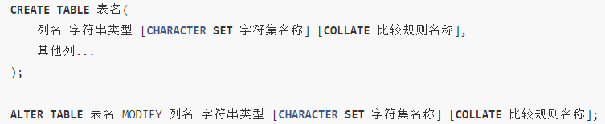
      - 默认使用表的字符集和比较规则
  - 仅修改字符集或者比较规则的规则
    - 只修改字符集，则比较规则将变为修改后的字符集默认的比较规则
    - 只修改比较规则，则字符集将变为修改后的比较规则对应的字符集
  - 字符集转换
    - MySQL 可以设置系统变量来控制解码请求的字符串所用的字符集，也可以设置返回结果时所用的字符集
    - 系统变量，可读可写 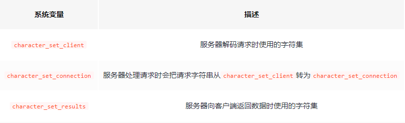
      - 服务端进程认为客户端发送过来的请求是用 character_set_client 编码的
    - 可以使用 SET NAMES &lt;字符集名&gt;; 来同时设置上述三个系统变量为同一值
    - 可以使用 default-character-set 启动选项来同时设置上述三个系统变量
- InnoDB
  - InnoDB 页
    - InnoDB 将数据分为若干个页，以页作为磁盘和内存之间交互的基本单位，InnoDB中页的大小一般为 16 KB。
      - 也就是在一般情况下，一次最少从磁盘中读取16KB的内容到内存中，一次最少把内存中的16KB内容刷新到磁盘中。
    - 通用的页结构： 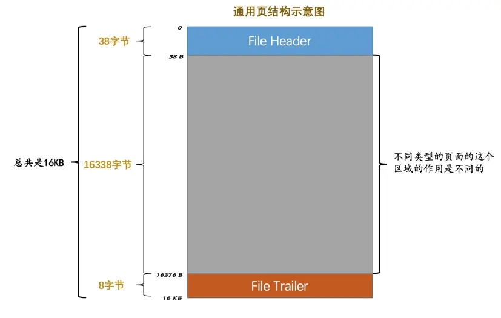
      - File Header
        - 字段以及含义，详细描述在下面的数据页中 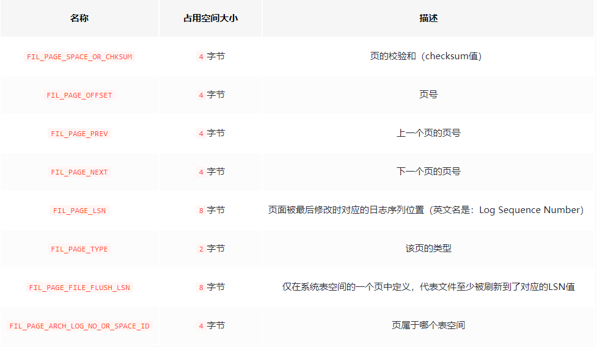
      - File Trailer
    - 类型
      - 不同类型的页，该字段存储在每页都有的 File Heaer 中 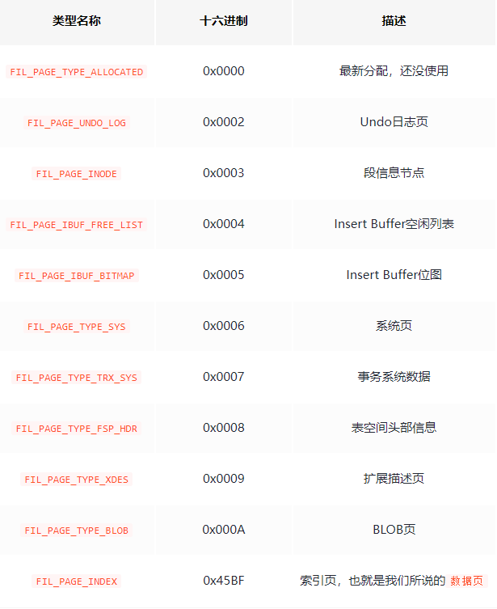
      - INDEX 页（数据页）
        - 结构示意图 
          - 简要介绍 
        - 记录在页中的存储（User Records & Free Space 部分）
          - 在页的初始时，并没有 User Records 部分，当插入一条数据时，才从 Free Space 部分分配出一定的空间来存储记录，从而才有 User Records 部分
            - 图解 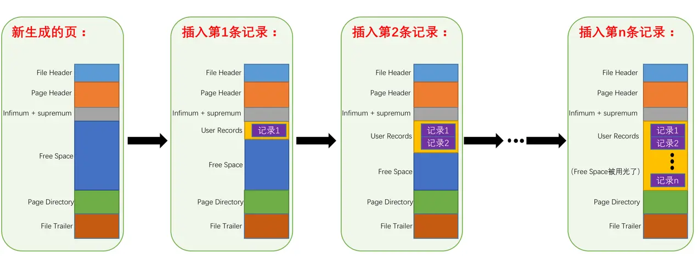
        - Infimum + supremum
          - 用于存储InnoDB自动在页中插入的 2 条伪记录，两条记录的格式都为 5 字节的记录头信息 + 8 字节大小的一个固定值组成： 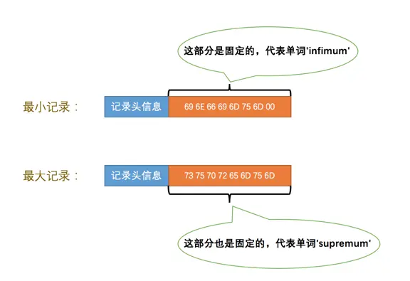
        - Page Directory
          - 出于加速使用主键查询记录的目的，设计出了 Page Directory （页目录）
          - InnoDB 将所有正常的记录（包括伪记录）分为几组，每个组的最后一条记录（组内的最大记录）的头信息中的 n_owned 属性表示该记录拥有多少条记录，也是说明该组内有多少条记录
          - 每个组内的最后一条记录的地址偏移量单独提取出来按顺序存储至 Page Directory 区域
          - 页目录中的地址偏移量被称为槽（slot）
          - 示例，最小记录的偏移量为 99 = File Header (38） + Page Header （56） + 最小记录的头部信息（5 字节） 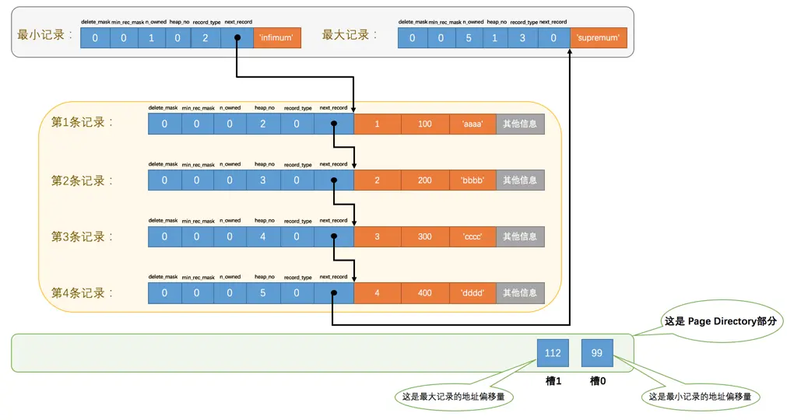
          - InnoDB 规定，最小记录所在的分组只能有 1 条记录，最大记录所在的分组只能有 1 ~ 8 条记录，其余的分组中记录的条数在 4 ~ 8 条之间
            - 所以，可以推断出一个槽应该只有 3 BIT
          - 加速主键查询的过程
            - 1\. 通过对槽进行二分查找，找到槽 a 所对应的组，该主键对应的记录在该组中
            - 2\. 找到槽 a 的前面一个槽 b，通过 b 的 next_record 属性来定位槽 a 所对应组的最小记录
            - 3\. 从槽 a 对应的最小记录开始遍历单链表
        - Page header
          - 56 Byte
          - 存储了一个数据页中的各种信息
          - 各种状态信息 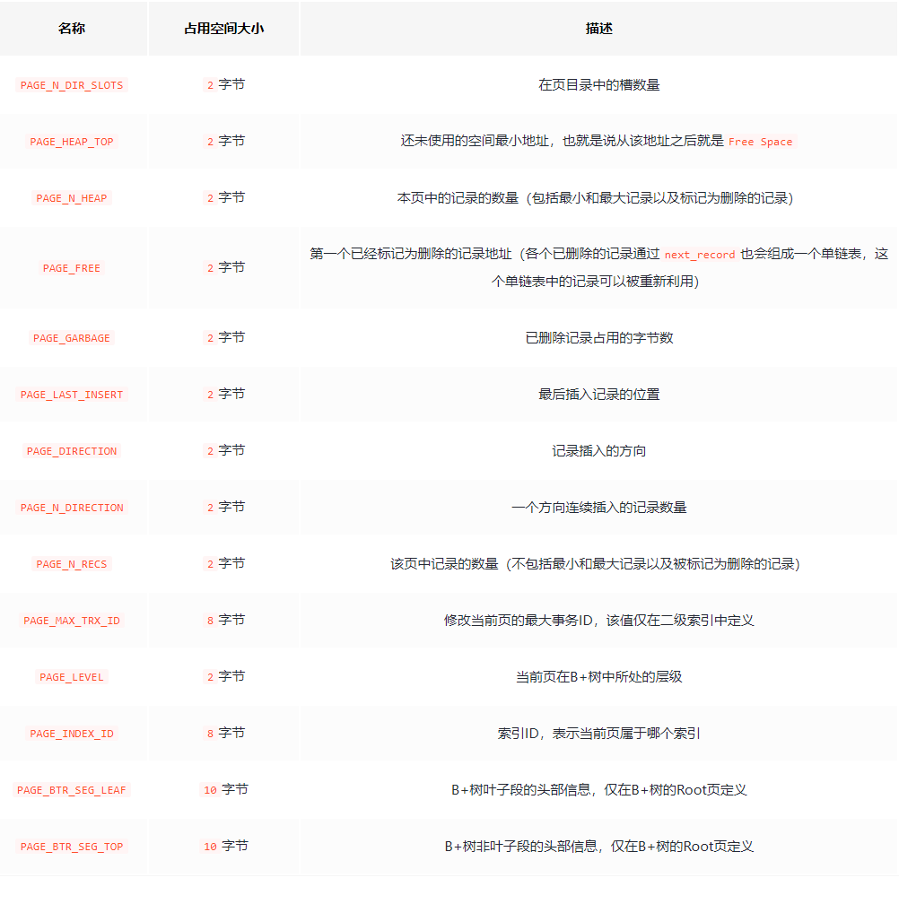
          - 字段（状态）详解
            - PAGE_DIRECTION
              - 新插入的一条记录的主键值比上一次插入记录的主键值大，我们说这条记录的插入方向是右边，反之则是左边。用来表示最后一条记录插入方向的状态就是PAGE_DIRECTION
            - PAGE_N_DIRECTION
              - 表示连续有 PAGE_N_DIRECTION 条记录插入的方向相同
            - PAGE_BTR_SEG_LEAF 和 PAGE_BTR_SEG_TOP
              - PAGE_BTR_SEG_LEAF （10 byte）
                - 记录着叶子节点段对应的 INODE Entry 结构的地址是哪个表空间（4 byte）的哪个页面（4 byte）的哪个偏移量（2 byte）
              - PAGE_BTR_SEG_TOP （10 bye）
                - 记录着非叶子节点段对应的 INODE Entry 结构的地址是哪个表空间（4 byte）的哪个页面（4 byte）的哪个偏移量（2 byte）
              - 这两个字段中的每一个字段都对应一个叫 Segment Header 的结构
                - Segment Header 示意图 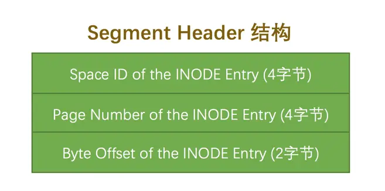
                  - Space ID of the INODE Entry
                    - 4 byte
                    - INODE Entry 结果所在的表空间 ID
                  - Page Number of the INODE Entry
                    - 4 byte
                    - INODE Entry 结构所在的页面页号
                  - Byte Offset of the INODE Entry
                    - 2 byte
                    - INODE Entry 结构在该页面中的偏移量
        - File Header
          - 38 byte
          - 各种类型的页共有的部分
          - 字段以及简要描述 
          - 字段详细描述
            - FIL_PAGE_SPACE_OR_CHKSUM
              - 表示当前页面的检验和
            - FIL_PAGE_OFFSET
              - 每个页独有的页号
            - FIL_PAGE_TYPE
              - 代表当前页的类型： 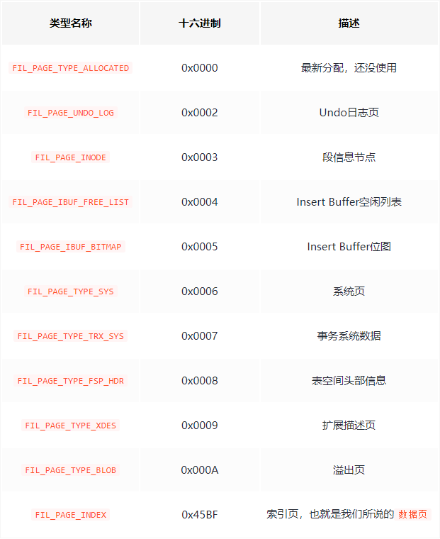
            - FIL_PAGE_PREV & FIL_PAGE_NEXT
              - 上一个页的页号和下一个页的页号
              - 所有的数据页组成一个双链表： 
        - File Trailer
          - 8 byte
          - 目的：在将页从内存写回磁盘（同步）时检测该页是否完整
          - 前 4 个字节代表检验和
            - 此检验和与 File Header 中的检验和相一致
            - 当一个页面在内存中被修改了，在同步之前就需要算出新的检验和
            - 因为 File Header 中的检验和在页面的前面，所以，其先写回磁盘，这时，就有两种情况
              - 该页面完全写完：此时，再次从磁盘中加载此页面时，两个检验和一致
              - 该页面未完全写完：此时，File Trailer 的检验和还没有写入，磁盘中该页面对应的是以前旧的检验和。当再次从磁盘中加载此页面时，两者检验和不一致
          - 后 4 字节代表最后被修改时对应的日志时间序列（LSN）
      - INODE 页
        - 在下面进行讲解
      - SYS 页
        - 在下面进行讲解
  - InnoDB 行格式
    - 以记录为单位插入数据，这些记录在磁盘上的存放方式被称为行格式或记录格式
    - 变长字段：把不定长的数据类型（例如 VARCHAR、VARBINARY、TEXT等类型）的列称为变长字段
    - 4 中不同的行格式
      - Compact 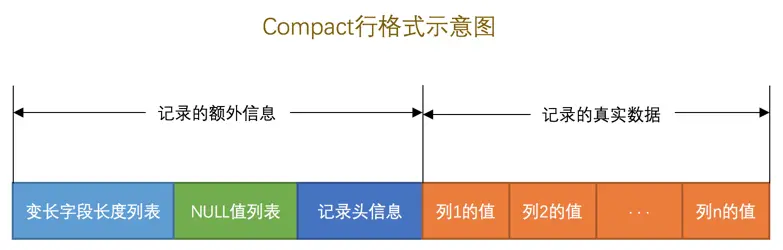
        - 额外信息
          - 服务端为了描述这条记录而不得不添加的一些信息
        - 变长字段长度列表
          - 记录了所有变长字段占用的空间大小（以字节为单位）
          - 各变长字段数据占用的字节数据按照列的顺序逆序存放
          - 变长字段长度列表每个字段长度都必须使用固定的 K 字节来表示变长字段占用的空间大小，否则，其本身也还需要一个类似的变长字段长度列表
            - 如何确定该固定的字节 K？
              - 假设
                - 假设某个字符集中表示一个字符最多需要使用的字节数为 W
                  - 也就是使用SHOW CHARSET语句的结果中的Maxlen列，比方说utf8字符集中的W就是3，gbk字符集中的W就是2，ascii字符集中的W就是1
                - 假设对于变长类型VARCHAR(M)来说，这种类型表示能存储最多M个字符（注意是字符不是字节），所以这个类型能表示的字符串最多占用的字节数就是M×W
                - 假设某个字段实际存储的字符串占用的字节数是L
              - 规则
                - 如果M×W &lt;= 255，那么使用1个字节来表示真正字符串占用的字节数
                - 如果M×W &gt; 255，则分为两种情况
                  - 如果L &lt;= 127，则用1个字节来表示真正字符串占用的字节数
                    - 注意，1 个字节按照道理来说应该表示的最大值是255，在下面会解释其原因
                  - 如果L &gt; 127，则用2个字节来表示真正字符串占用的字节数
                    - 对于一些占用字节数非常多的字段，比方说某个字段长度大于了 InnoDB 的页大小，使该记录在单个页面中无法存储时，InnoDB 会把一部分数据存放到溢出页中，在变长字段长度列表处只存储留在本页面中的长度，所以使用两个字节也可以存放下来
                  - 这里涉及到了真实的占用字节数 L，只能在“运行时”确定 K 的大小，所以，这时候 K 的大小是如何确定的呢？
                    - InnoDB 使用某个变长字段的第一个字节的最高位作为标志位，如果该位为 0，这该字节就是一个单独的字段长度；如果该位是 1，则该字节是字段长度的其中一个字节
                    - 注意上述说明中的“某个变长字段”隐含的意思是变长字段长度列表中，可能不是每个字段对应的字段长度都是相同的字节（可能不是同时是 1 字节或者 2 字节）
            - 注意：同一个变长字段长度列表的字段长度可能占用不同的字节（可能是 1 字节，也可能是 2 字节
          - 变长字段列表中值存储值为非 NULL 的列的内容占用的空间大小
        - NULL 值列表
          - 如果表中没有允许存储 NULL 的列，那么 NULL 值列表将不存在
          - NULL 值列表使用整数个字节来表示，其中二进制位为 0 时，代表该列不为 NULL，如果为 1，则该列的值为 NULL
          - 注意，二进制位的顺序与列的顺序相反。如果整数个字节的二进制位数大于允许存储 NULL 值的列数，则该字节高位补 0 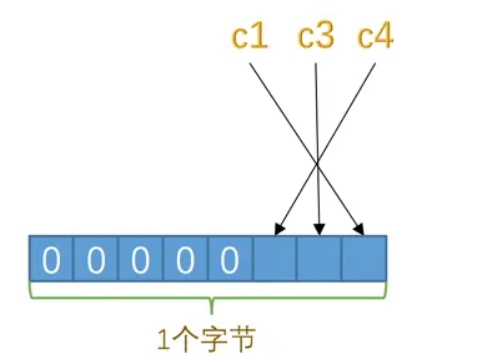
          - 如果某列为 NULL，则其在真实数据处并不占用空间
        - 记录头信息 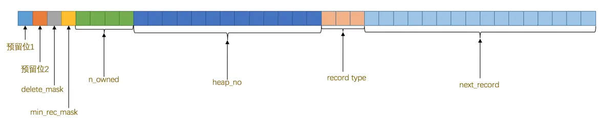
          - 固定的 5 个字节，40 位
          - 每个位的含义
            - delete_mask
              - 1 BIT
              - 0 代表未删除，1 代表删除
              - 被删除的记录之所以不立即从磁盘上移除，是因为移除它们之后把其他的记录在磁盘上重新排列需要性能消耗，所以只是将其标记为已删除
              - 所有被删除掉的记录会共同组成一个垃圾链表，在这个链表中的记录占用的空间称为可重用空间，之后如果有新记录插入到表中，可能将这些被删除的记录占用的存储空间覆盖。
            - min_rec_mask
              - 1 BIT
              - B+树的每层非叶子节点中的最小记录都会添加该标记
            - n_owned
              - 4 BIT
            - heap_no
              - 13 BIT
              - 表示当前记录在本页中的位置
              - InnoDB 会自动给每个页里添加 2 条记录（称为伪记录或虚拟记录），一条为最小记录（heap_no = 0），另一条为最大记录（heap_no = 1）
                - 所以，我们插入的第一条数据的 heap_no = 2,而不是 0 或者 1
              - 记录可以比较大小，对于一条完整的记录来说，其大小由其主键代表
            - record_type
              - 3 Bit
              - 表示记录的类型
              - 4 种类型
                - 0 代表普通记录
                - 1 代表 B+ 树非叶子节点记录(目录项记录）
                - 2 代表最小记录
                - 3 代表最大记录
            - next_record
              - 16 BIT
              - 表示从的那个当前记录的真实数据到下一条记录的真实数据的地址偏移量 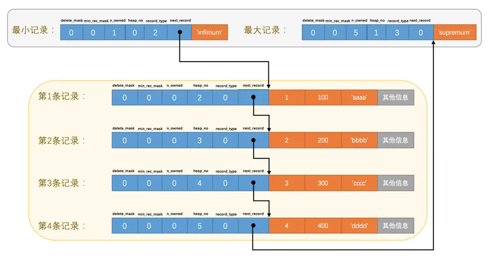
                - 这样就形成了一个从主键值从小到大进行排列的单链表
              - 如果某一条记录被删除，与之关联的记录的地址偏移量也会发生改变，同时，该记录的 deletemask = 1 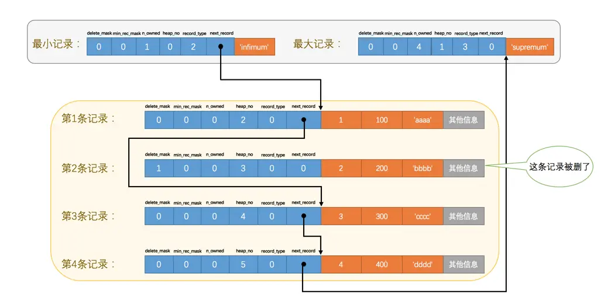
              - 如果重新插入了 delete_mask = 1 的数据,有可能会复用该记录 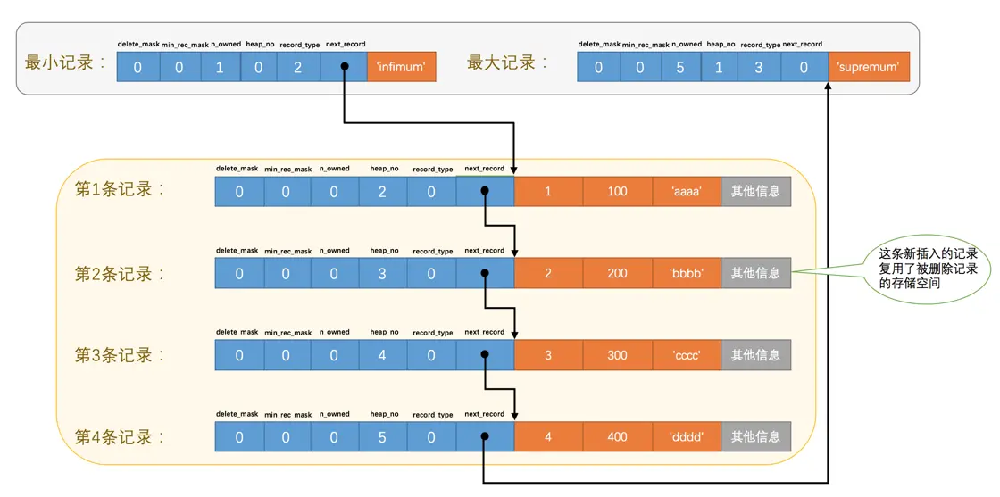
        - 记录真实数据
          - MySQL 会为每个记录默认地添加一些列（也称隐藏列）
            - 隐藏列 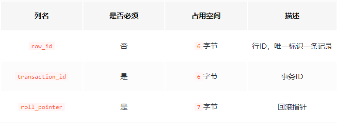
              - 这几个列的真正名称其实是：DB_ROW_ID、DB_TRX_ID、DB_ROLL_PTR
            - 其中，row_id 列是可选的（当表中甚至没有 unique 键时默认添加），其他两列为每条记录都添加
      - Redundant（MySQL 5.0 之前使用的格式） 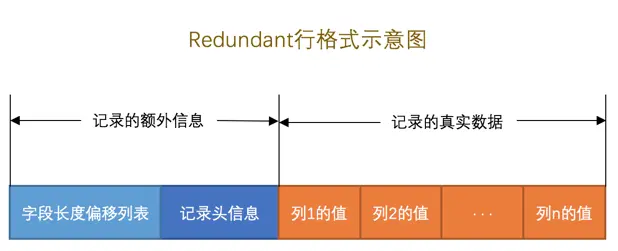
        - 字段长度偏移列表
          - 把每条记录中所有列（包括隐藏列）的长度信息都按照逆序存储到字段长度偏移列表
          - 例如
            - 有如下记录： 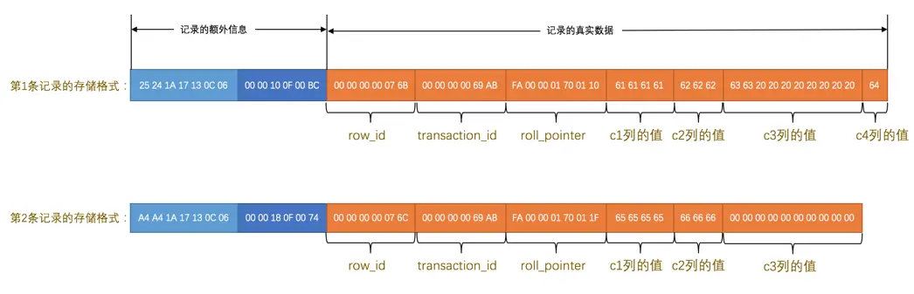
            - 第一条记录的偏移列表是： 25 24 1A 17 13 0C 06 因为是逆序，如果按照列的顺序进行排列： 06 0C 13 17 1A 24 25
            - 按照两个相邻数值的差值来计算各个列的长度： 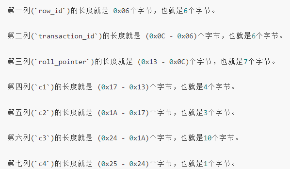
          - 实质是对应的字段占用的长度在记录的真实数据处结束的位置：例如在上例的第一条记录中，0x06代表第一个列（row_id 列）在记录的真实数据第6个字节处结束，0x0C代表第二个列在记录的真实数据第12个字节处结束，0x13代表第三个列在记录的真实数据第19个字节处结束，等等
        - 记录头信息
          - 占用 6 个字节，48 个二进制位
          - 不同位的含义 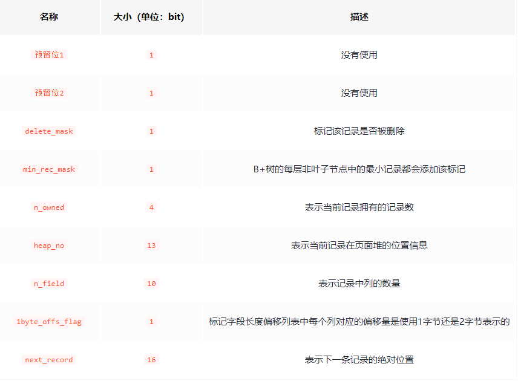
          - 如何确定 1byte_offs_flag 位？
            - 当记录的真实数据占用的字节数不大于127（十六进制0x7F，二进制01111111）时，每个列对应的偏移量占用1个字节
            - 当记录的真实数据占用的字节数大于127，但不大于32767（十六进制0x7FFF，二进制0111111111111111）时，每个列对应的偏移量占用2个字节
            - 当记录的真实数据占用的字节数大于 32767 字节时，此时的记录已经存放到了溢出页中，在本页中只保留前768个字节和20个字节的溢出页面地址（当然这20个字节中还记录了一些别的信息）。因为字段长度偏移列表处只需要记录每个列在本页面中的偏移就好了，所以每个列使用2个字节来存储偏移量就够了
            - 如何快速得到真是数据占用的字节数？通过字段长度偏移列表中最后一列对应的数值来确定
        - 如何对 NULL 值进行处理？
          - 将每列对应的偏移量的第一个比特位作为是否为 NULL 的依据，该位也称 NULL 比特位，如果该位为 1，则该列为 NULL
          - 对 NULL 值在真实数据处的存储
            - 该列为定长类型
              - NULL 值也将占用一定的真实数据的空间，并用 0 填充该空间
            - 该列为变长类型
              - 不占用真实数据的空间
      - Dynamic
      - Compressed
        - 会使用压缩算法对页面进行压缩（Dynamic 不会）
    - 指定行格式（语法）
      - 可以在创建或修改表的时候指定行格式
      - 语法 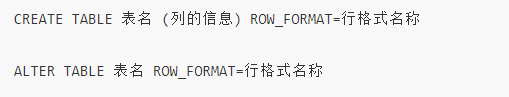
  - 溢出数据（针对 InnoDB）
    - 一条记录所占用的最大空间有限制：除了 BLOB、TEXT、隐藏列、记录头信息之外，其他所有列（包含 NULL 值列表和变长字段长度列表）占用的字节加起来不能超过 65535 （0xFFFF）字节
      - 这是针对整条记录而言
    - 在Compact和Redundant行格式中，对于占用存储空间非常大的列（假设其所占用的空间大于 X），在记录的真实数据处只会存储该列的一部分数据（768 字节的数据），把剩余的数据分散存储在几个其他的页中，然后记录的真实数据处用20个字节存储指向这些页的地址。（所以，该列在真实记录数据处占用的空间为768 + 20 字节
      - 这是针对某一列而言
      - X 为何值？
        - 每页中，除了存放记录，还要存储额外的数据，一共 132 字节
        - InnoDB 规定每个页（16384 字节，16KB）至少有两条记录，所以，每条记录在单个页面中占用空间的最大值为 （16384 - 132） / 2 = 8126 字节
        - X = 8126 - &lt;每个记录需要的额外信息所占用的字节数&gt; - &lt;其他字段所占用的字节数&gt;
    - 如何处理行溢出数据（针对某一列数据）？
      - 图解 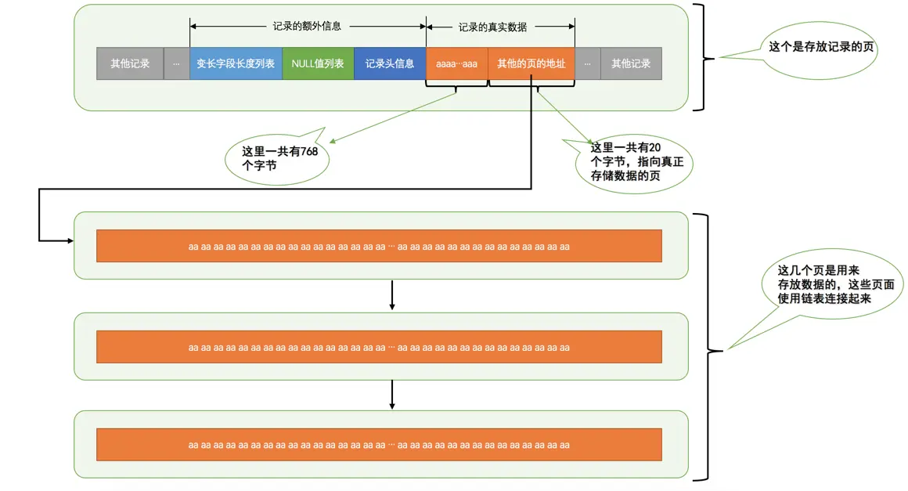
- B+ 树索引
  - 索引：为快速找到数据对应的 Index 页（数据页）所做的“目录”，称其中的每一项为目录项记录,类似于 Index 页中的 Page Directory 中的槽
  - 在 InnoDB 中，目录项的存储方式与记录没有什么区别（都存放在数据页中，存储两者的页的格式也没什么区别）
  - 目录项记录和用户记录的区别是目录项记录的 record_type = 1,而用户记录的 record_type = 0
  - 示例 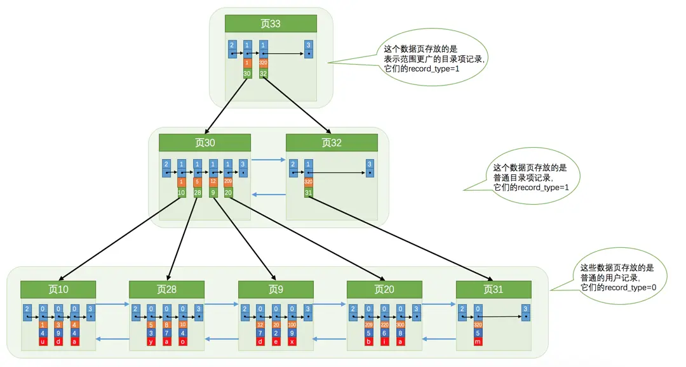
    - B+ 树
    - 不论是存放用户记录的页还是存放目录项记录的页都称为节点
    - 最下面的一层为第 0 层
  - 目录项
    - 目录项记录只有索引值（可能是主键值）和页编号两列（没有隐藏列）
    - 目录项的主键值是编号对应页中的最小的主键值
    - 只有在存储目录项记录的页中的主键值最小的目录项记录的 min_rec_mask 值为1
    - record_type = 1
  - 索引（InnoDB）
    - 聚簇索引（索引值为主键值）
      - 使用主键值的大小进行记录和页的排序
        - 页内的记录按照主键的大小排成一个单向链表
        - 各个存放用户记录的页也是根据也是根据页中用户记录的主键值的大小排成一个双向链表
        - 存放目录项记录的页分为不同的层次，在同一层次中的页也是根据页中目录项记录的主键大小顺序排成一个双向链表
      - B+ 树的叶子节点存储的是完整的用户记录
      - 目录项记录的格式是 &lt;主键值&gt; + &lt;页号&gt;
      - 在InnoDB存储引擎中，聚簇索引就是数据的存储方式（所有的用户记录都存储在了叶子节点），也就是所谓的索引即数据，数据即索引
    - 二级索引/辅助索引（索引值为非主键值）
      - 使用记录的某一列 C 的值进行排序
        - 页内的记录按照 C 的大小排成一个单向链表
        - 各个存放用户记录的页也是根据也是根据页中用户记录的 C 的大小排成一个双向链表
        - 存放目录项记录的页分为不同的层次，在同一层次中的页也是根据页中目录项记录的 C 大小顺序排成一个双向链表
      - 目录项记录的格式是： &lt;索引的那一列的值&gt; + &lt;主键值&gt; + &lt;页号&gt;
        - 之所以要有主键值的原因是：单靠 &lt;索引的那一列的值&gt; 可能会有相等的情况出现，这时，就不能正确地找到对应的位置（不管是插入还是查询）
      - B+ 树的叶子节点存储的不是完整的用户记录，而是 &lt;索引的那一列的值&gt; + &lt;主键值&gt;
      - 因为二级索引的叶子节点不是完整的用户记录，所以，找到了对应的叶子节点之后，还要去聚簇索引中使用主键值来找到对应的完整记录。这个过程称为回表
    - 联合索引（同时以多个列为索引值）
      - 假设想为 C1、C2 建立索引，那么索引值的比较规则为先以 C1 进行排序，如果 C1 列相等，那么，根据 C2 列进行排序
      - 目录项记录为: &lt;C1值&gt; + &lt;C2值&gt; + &lt;主键值&gt; + &lt;页号&gt;
      - B+ 树叶子节点的记录为： &lt;C1值&gt; + &lt;C2值&gt; + &lt;主键值&gt;
    - 为什么 InnoDB 中每个页内至少存储两条记录？因为如果每个页只存储一条记录，会造成 B+ 树的高度很高，降低效率
  - 索引（MyISAM）
    - 将表中的记录按照记录的插入顺序单独存储在一个文件中，称之为数据文件
    - 这个文件并不划分为若干个数据页，有多少记录就往这个文件中塞多少记录就成了。我们可以通过行号而快速访问到一条记录。
    - 使用 MyISAM 存储引擎的表会把索引信息另外存储到一个称为索引文件的另一个文件中
    - MyISAM会单独为表的主键创建一个索引，只不过在索引的叶子节点中存储的不是完整的用户记录，而是 &lt;主键值&gt; + &lt;行号&gt; 的组合。也就是先通过索引找到对应的行号，再通过行号去找对应的记录
    - MyISAM的行格式有定长记录格式（Static）、变长记录格式（Dynamic）、压缩记录格式（Compressed）。采用定长记录格式，一条记录占用存储空间的大小是固定的，这样就可以轻松算出某条记录在数据文件中的地址偏移量。但是变长记录格式就不行了，MyISAM会直接在索引叶子节点处存储该条记录在数据文件中的地址偏移量。通过这个可以看出，MyISAM的回表操作是十分快速的，因为是拿着地址偏移量直接到文件中取数据的，反观InnoDB是通过获取主键之后再去聚簇索引里边儿找记录，虽然说也不慢，但还是比不上直接用地址去访问。
  - 索引的构建过程
    - 刚开始时，根节点没有目录项记录也没有用户记录
    - 当向表中插入用户记录时，最开始是存储在根节点中
    - 当根节点的可用空间满了但还有数据插入其中时，分配另一个新的页，将用户记录全部复制到该页 a 中，然后对页 a 进行页分裂操作，得到一个新页 b
    - 这时，已经有足够的空间来存储新插入进来的值，根据索引值的大小插入相应的位置
    - 最后，更新根节点，使其包含目录项记录
  - 创建索引（语法）
    - InnoDB 和 MyISAM 会自动为主键或者声明为UNIQUE 的列去自动建立 B+ 树索引，但是如果想为其他的列建立索引就需要显式地去指明
    - 创建表时添加索引。其中的 KEY 和 INDEX 是同义词 
    - 修改表以添加索引 
    - 删除索引： ALTER TABLE &lt;table&gt; DROP INDEX &lt;index_name&gt;
  - 索引的使用
    - 查询
      - 如何判断索引是否使用的关键思路
        - 对于 c1、c2、c3 列的联合索引，B+ 树索引只对 c1 列进行了“完全地”排序，c2列只有在 c1 列相同的情况下进行了排序，所以，尽管 c1 列的值已经在索引中排序，但是在有序的 c1 列中的 c2 列的值不能保证有序，所以，此时不会使用 c2 列的索引
          - 如果对 c1 列进行精确的查找，而对 c2 列进行范围查找，那么，都会使用索引。因为对 c1 进行精确查找找到的 c1 列的值都是相同的，此时会根据 c2 进行排序，故而可以使用索引
        - 例如
          - 能够使用 name 列的索引来匹配相应的记录，但是不能使用 birthday 的索引来进一步过滤，因为 birthday 在 name 列有序的情况下其不一定有序
      - 全值匹配
        - 指查询条件中的列和索引列（可能是联合索引，多个列合成一个列）一致
      - 匹配左边的列
        - 如果我们为 c1、c2、c3 列创建联合索引，那么，只有当查询条件中包含 c1 才会使用索引，而单独使用 c2 或 c3 列查询不会使用索引
        - 如果使用 c1、c3 作为条件进行查询，那么，只会使用 c1 列的索引
    - 排序
      - 利用索引已经将数据排序的特点，从而将数据进行排序
      - 排序的使用规则和查询一致
      - 不使用索引的几种情况
        - ORDER BY 中对多个列进行 ASC、DESC 混用
          - 例如： 
        - 要进行排序的所有列不在同一个索引中
        - 要进行排序的列使用了表达式，例如： 
    - 分组
      - 当需要按照单个或多个字段进行分组时，和排序时使用索引的情况是一致的
  - 回表的代价
    - 我们沿用《索引的使用》中查询的那个例子
      - c1 列为 name， c2 列 birthday，已经为这两列创建了索引 idx_name_birthday，有如下 SQL 语句： 
      - 因为查询的是全部列（select *）,所以，会有回表的操作
      - 在 idx_name_birthday 中，由于 B+ 树叶子节点中的记录是按照 name + birthday 排序的，所以，我们需要回表查询的记录在物理磁盘上是紧挨着的，这样的话 IO 操作比较快，并且称为顺序 I/O
      - 而我们回表操作之后到聚簇索引中查找相对应的记录并不一定是按照 name 列的值进行排序的，所以，也意味着记录并不是紧挨着存放的，对这样的数据进行 I/O 操作是比较耗时的，也被称为随机 I/O
    - 覆盖索引：查询列表（select &lt;query-list&gt; from ... ）中只包含索引列
  - 索引的规则（建议）
    - 只为用于搜索、分组或排序的列创建索引
    - 考虑列的基数
      - 列的基数指的是某一列中不重复数据的个数
      - 索引列的基数越大越好
    - 索引列的数据类型尽量小
      - 数据类型越小，比较操作的耗时越小（一般情况下）
      - 数据类型越小，索引占用的空间越小，故而一个数据页存储的记录就越多，故而 I/O 次数越少，故而内存可以放置更多的数据页，故而性能越高
    - 索引字符串的前缀值
      - 如果我们为字符串的列创建索引，那么，当这个字符串很长或者字符集中每个字符占用的空间很大，我们就可能希望使用该列字符串值的前缀值来进行索引（出于空间或者时间的考虑）
      - 例如：只为 name 创建前 10 个字符的索引： 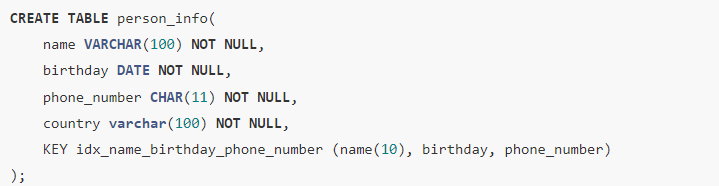
      - 如果使用索引列前缀值当做索引，那么，当使用该列进行排序时，就无法使用索引来快速排序
    - 让索引列在比较表达式中单独出现
      - 例如： where col * 2 &lt; 4（不使用索引） 与 where col &lt; 4 / 2（使用索引）
    - 让主键值递增
      - 我们知道，聚簇索引中的用户记录是按照主键值来进行排序并存储的，如果主键值不递增，那么，突然插入一个主键值比较小的记录，会导致前面已经满了的数据页分裂，造成额外的性能损失
    - 避免冗余或重复索引
      - 例如，下图就会 name 列创建了两次索引，维护多余的索引只会增加维护成本，并不会对索引有什么好处 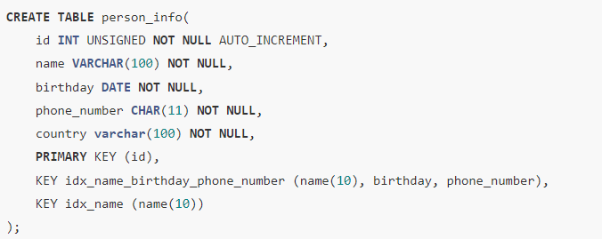
- 存储引擎与文件系统
  - 数据目录
    - 数据目录
      - 服务端程序在启动的时候从这个目录中加载一些文件，运行过程中产生的数据也都会存储到这个目录中
      - 数据目录由 datadir 系统变量来指定
    - 数据目录中的内容
      - 数据库在文件系统中的表示
        - 当我们使用 create database &lt;name&gt;; 创建数据库时，MySQL 会执行以下操作： 1. 在数据目录下创建一个和数据库同名的子目录 2. 在新创建的子目录中创建 db.opt 文件，这个文件包含了该数据库的各种属性，比如数据库使用的字符集，字符比较规则等
      - 表在文件系统中的表示（InnoDB）
        - 表结构（MySQL 8 之前）
          - 会在数据库子目录下创建 &lt;表名&gt;.frm 文件用于描述表的结构
        - 表中的数据（记录）
          - 表空间（文件空间）
            - 表空间：一个抽象的概念，对应文件系统中一个或多个真实的文件
            - 每个表空间可以被划分为许多页，表数据就存放在表空间下的某些页里
            - 表空间的类型
              - 系统表空间（system tablespace）
                - 对应数据目录下的 ibdata1 文件
                - 可以通过 innodb_data_file_path 配置选项来配置文件路径与大小： [server] innodb_data_file_path=data1:512M;data2:512M:autoextend
                  - 这样，MySQL 启动之后会创建这两个文件来当做系统的表空间，并且如果空间不够，会自动增长 data2 文件的大小
                - 从 MySQL5.5.7 到 MySQL5.6.6 之间的各个版本中，表中的数据默认都会存储到系统表空间
              - 独立表空间
                - MySQL5.6.6 之后的版本，InnoDB并不会默认地把各个表的数据存储到系统表中，而是为每一个表建立一个独立表空间
                - 独立表空间位于对应的数据库子目录下的 &lt;table-name&gt;.ibd 文件中
              - 通用表空间
              - undo 表空间
              - 临时表空间
            - 独立表空间
              - 区（extent）和段（segment）
                - 目的： 1. 用于管理表空间中的页面 2. 按照区来分配空间时，消除许多随机 I/O
                - 默认情况下，64 个16 KB 的页是一个区（1 MB）
                - 除了碎片区之外，B+ 树叶子节点有自己独有的区，非叶子结点也有自己独有的区
                - 碎片（fragment）区
                  - 考虑到以完整的区为单位分配给某个段对于数据量较小的表太浪费存储空间，InnoDB 提出了碎片区的概念
                  - 在一个碎片区中，并不是所有的页都是为了存储同一个段的数据而存在的，而是碎片区中每个页可以用于不同的目的
                    - 比如有些页用于段 A，有些页用于段 B，有些页甚至哪个段都不属于。
                  - 碎片区直属于表空间，并不属于任何一个段。
                  - 碎片区空间分配策略
                    - 在刚开始向表中插入数据的时候，段是从某个碎片区以单个页面为单位来分配存储空间的
                    - 当某个段已经占用了 32 个碎片区页面之后，就会以完整的区为单位来分配存储空间
                - 段 （segment）
                  - 存储相同类型数据的页（例如，都是存储叶子节点的页）的集合被称为段
                    - 存放叶子节点的区和碎片区中的某些页面的集合是一个段（segment），存放非叶子节点的区和某些页面的集合也是一个段
                  - 每个段都有一个唯一的编号
                  - 一个 B+ 树索引至少有两个段
                  - InnoDB 中还有为存储一些特殊的数据而定义的段，比如回滚段
                  - 段的结构 INODE Entry
                    - 示意图 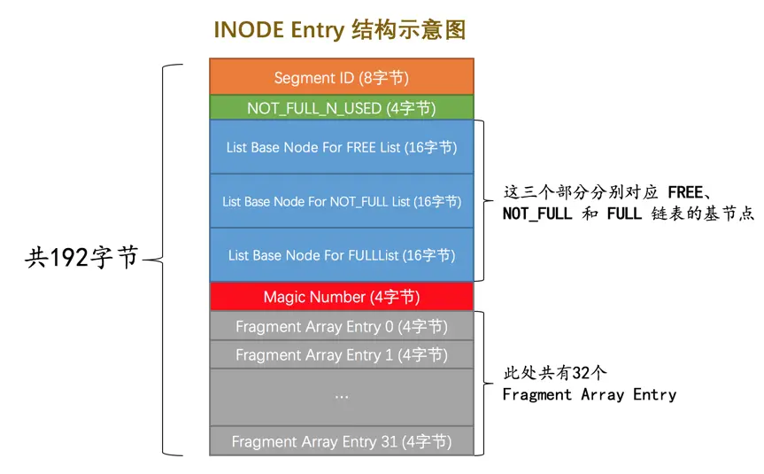
                      - Segment ID
                        - 8 byte
                        - 段的唯一编号
                      - NOT_FULL_N_USED
                        - 在 NOT_FULL 链表中已经使用了多少页面
                      - 3 个 List Base Node
                        - 段的 FREE 链表、NOT_FULL 链表、FULL 链表的 List Base Node
                      - Magic Number
                        - 用来标记 INODE Entry 是否已经被初始化，如果这个值是 97937874，则表明该 INODE Entry 已经初始化
                      - Fragment Array Entry
                        - 4 byte
                        - 此结构对应着一个碎片页，表示一个碎片页的页号
                        - 共有 32 个 Fragment Array Entry
                  - 如何找到段所对应的 INODE Entry?
                    - 使用页结构当中的 Page header 中的 PAGE_BTR_SEG_LEAF 和 PAGE_BTR_SEG_TOP 对应的 Segment Header 结构（这两个字段只有在 B+ 树的 Root 节点中定义）
                - 区的状态（分类）
                  - 空闲的区（FREE）
                    - 该区没有任何使用的页
                  - 有剩余空间的碎片区（FREE_FRAG）
                  - 没有剩余空间的碎片区（FULL_FRAG）
                  - 附属于某个段的区（FSEG）
                  - 总结 
                - XDES Entry （Extent Descriptor Entry）结构
                  - 此结构用于管理区
                  - 每个区都对应着一个 XDES Entry 结构
                  - 结构示意图 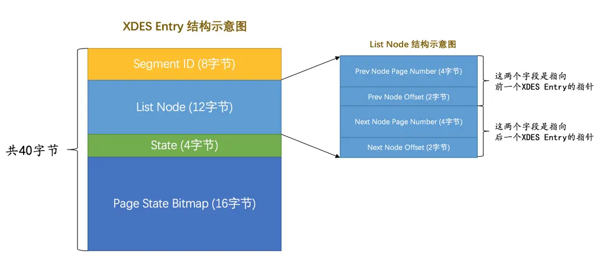
                    - Segment ID
                      - 8 byte
                      - 如果该区已经分配给某个段则表示该区所在的段
                    - List Node
                      - 12 byte
                      - 将若干个 XDES Entry 结构串成一个链表
                      - 示意图 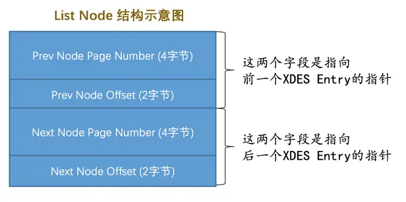
                        - 如果我们想定位表空间内的某一个位置的话，只需指定页号以及该位置在指定页号中的页内偏移量即可
                        - Pre Node Page Number 和 Pre Node Offset的组合就是指向前一个 XDES Entry 的指针
                        - Next Node Page Number 和 Next Node Offset 的组合就是指向后一个 XDES Entry 的指针
                    - State
                      - 4 byte
                      - 用于表明区的状态
                        - 值 
                    - Page State Bitmap
                      - 16 byte, 128 bit
                      - 一个区默认有 64 页，128 bit 被分为 64 部分，每个部分 2 bit，对应区中的一页
                      - 每个部分的第一个 bit 表示对应的页是否是空闲的，第二个 bit 未使用
                - 数据的插入与 XDES Entry
                  - 数据的插入过程
                    - 表中的数据很少的时候
                      - 1\. 查看表空间中是否有状态为 FREE_FRAG 的区，如果有，从该区中取一下零散的页插入数据；如果没有，则在表空间中申请一个状态为 FREE 的区，并将该区的状态设置为 FREE_FRAG
                      - 2\. 之后，不同的段使用零散页的时候都会从该区（碎片区）中去取，直到该区中没有空闲空间，这时，该区的状态变为 FULL_FRAG
                    - 当段中数据已经占满了 32 个零散页（即区空间的一半）后
                      - 直接申请完整的区来插入数据（即该区完全属于该段，不用于其他目的）
                  - 在表中数据很少的时候，如何快速找到所需要的区？
                    - 把状态为 FREE 的区对应的 XDES Entry 结构通过 XDES Entry 中的 List Node 来组成一个链表，称为 FREE 链表
                    - 把状态为 FREE_FRAG 的区对应的 XDES Entry 结构通过 XDES Entry 中的 List Node 来组成一个链表，称为 FREE_FRAG 链表
                    - 把状态为 FULL_FRAG 的区对应的 XDES Entry 结构通过 XDES Entry 中的 List Node 来组成一个链表，称为 FULL_FRAG 链表
                  - 当段中的数据已经占满了 32 个零散页之后，如何快速知道哪些区属于哪个段？
                    - InnoDB 将每个段中的区对应的 XDES Entry 建立了三个链表
                      - FREE 链表
                        - 所有页面都是空闲的区对应的 XDES Entry 组成的链表
                      - NOT_FULL 链表
                        - 同一个段中，仍有空闲空间的区对应的 XDES Entry 结构组成的链表
                      - FULL 链表
                        - 同一个段中，已经没有空闲空间的区对应的 XDES Entry 结构组成的链表
                  - 如何找到上述的各种链表？
                    - 链表基节点（List Base Node） 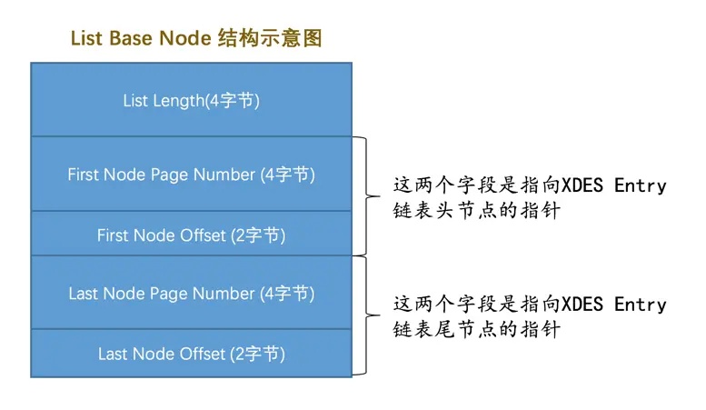
                      - List Length
                        - 表明该链表一共有多少个节点
                      - First Node Page Number 和 First Node Offset
                        - 表明该链表的头节点在表空间中的位置
                      - Last Node Page Number 和 Last Node Offset
                        - 表明该链表的尾接点在表空间中的位置
                    - 把链表基节点放在表空间的一个固定位置（表空间中的 FSP_HDR），这样就可以找到相应的链表了
              - 组
                - 256 个区被划分为一组
              - 表空间的结构 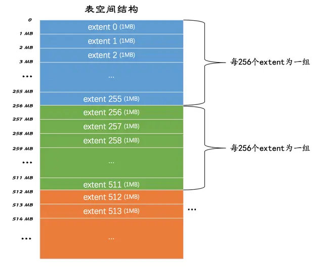
                - 示意图 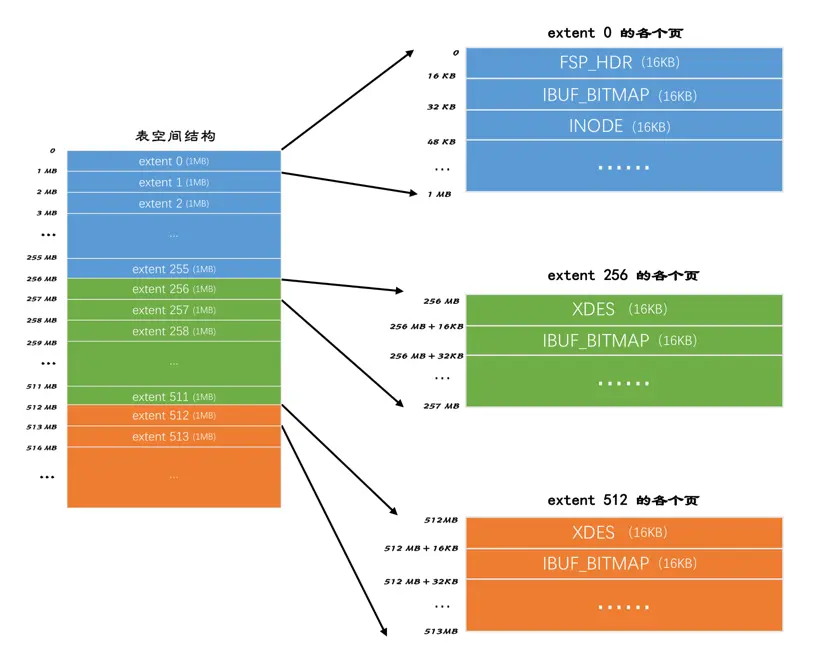
                - 第一个组的第一个区的前 3 个页面
                  - 这三个页面的类型是固定的
                  - FSP_HDR 页
                    - 整个表空间只有一个 FSP_HDR
                    - 用于记录整个表空间的整体属性以及第一组的所有区的属性
                    - 结构示意图 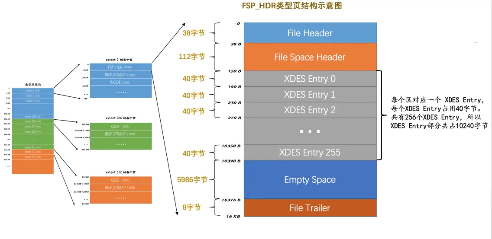
                      - File Space Header 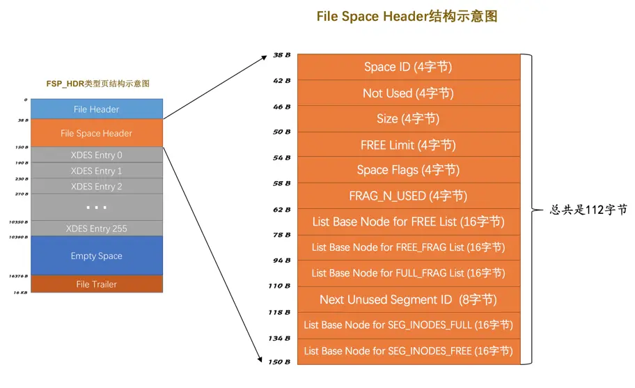
                        - 112 byte
                        - 字段的简要描述 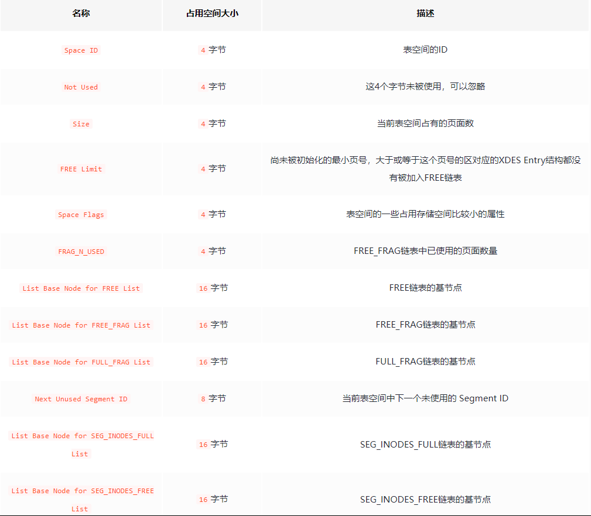
                        - 字段详细描述
                          - Size
                            - 当前表空间占有的页面数
                          - List Base Node for FREE List & List Base Node for FREE_FRAG List & List Base Node for FULL_FRAG List
                            - 直属于表空间的 FREE、FREE_FRAG、FULL_FRAG 链表的基节点
                          - FRAG_N_USED
                            - FREE_FRAG 链表中已经使用的页面的数量
                          - FREE Limit
                            - 4 byte
                            - InnoDB 为每个表创建一个位于磁盘上的文件，并且其文件的大小大于实际存储的数据的大小，所以，会有很多空闲的区未使用，InnoDB 没有将所有的空闲区全部初始化后加入 FREE 链表，而是等到空闲区不够了之后，才将未初始化的空闲区初始化后加入到空闲链表中
                            - 该字段表示的是一个页号，在此字段表示的页号之前的区（不包括该页）都已被初始化，之后的区尚未被初始化
                          - Next Unused Segment ID
                            - 为每个新创建的索引都要创建两个段，为新段分配的段 ID 就是这个字段的值
                          - Space Flages
                            - 4 byte
                            - 标志简要描述 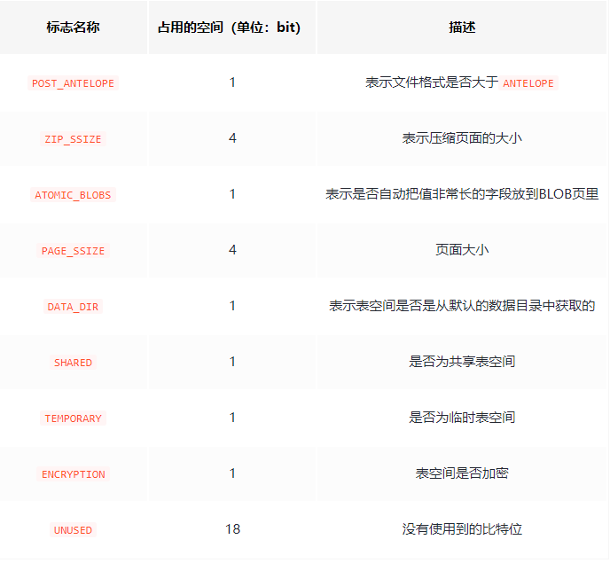
                          - List Base Node for SEG_INODES_FULL List & List Base Node for SEG_INODES_FREE List
                            - 每个段对应的 INODE Entry 结构会集中存放在一个类型为 INODE 的页中
                            - INODE 页会组成两种链表
                              - SEG_INODES_FULL 链表
                                - 该链表中的 INODE 页已经被 INODE Entry 填满
                              - SEG_INODES_FREE 链表
                                - 仍有空闲的空间存放 INODE Entry 结构
                  - IBUF_BITMAP 页
                    - 存储本组所有区的所有页面关于 INSERT BUFFFER 的信息
                  - INODE 页
                    - 存储 INODE Entry 结构的页
                    - 示意图 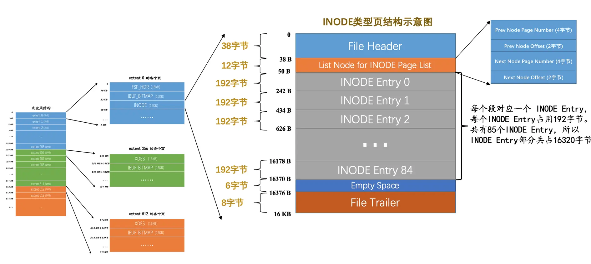
                      - INODE Entry
                        - 在前面段的介绍中已经讲过了
                        - 192 byte，INODE 页里可以存储 85 个这样的结构
                      - List Node for INODE Page List
                        - 示意图 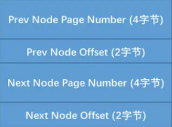
                        - 一个表空间可能拥有超过 85 个段，导致一个页面里存放不下所有的 INODE Entry，所以，InnoDB 提出了两个链表，用于链接多个 INODE 页
                          - SEG_INODES_FULL 链表
                          - SEG_INDOES_FREE 链表
                    - INODE 页的分配过程
                      - 如果 SEG_INODES_FREE 链表不为空，直接从该链表中取出一个页面用于存储 INODE Entry
                      - 如果 SEG_INODES_FREE 链表为空，则从表空间的 FREE_FRAG 链表中申请一个页面
                      - 当 INODE 页没有剩余空间时，将该页放在 SEG_INODES_FULL 链表中
                - 其余组的最开始的区的最开始的两个页面
                  - 这两个页面的类型也是固定的
                  - XDES （extent descriptor）页
                    - 用来记录本组 256 个区的属性
                    - 示意图 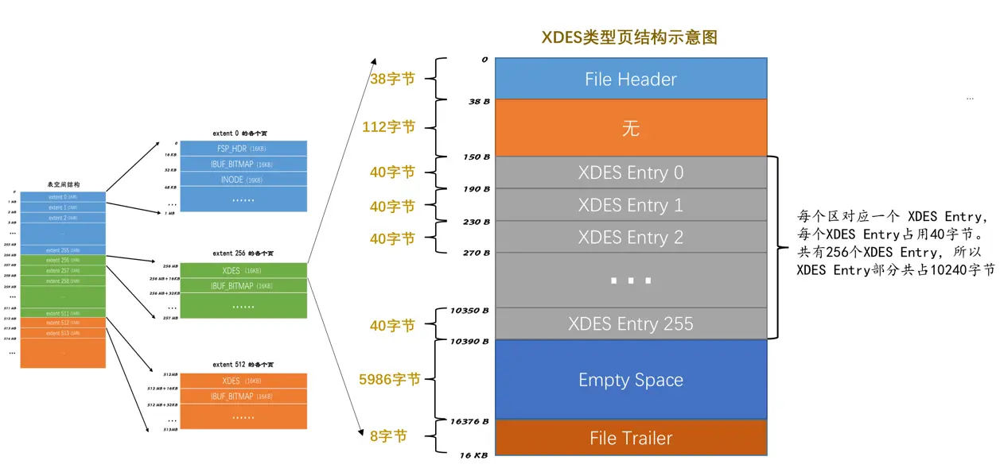
                  - IBUF_BITMAP 页
                    - 存储本组所有区的所有页面关于 INSERT BUFFFER 的信息
            - 系统表空间
              - 表空间 ID （Space ID）是 0
              - 结构示意图 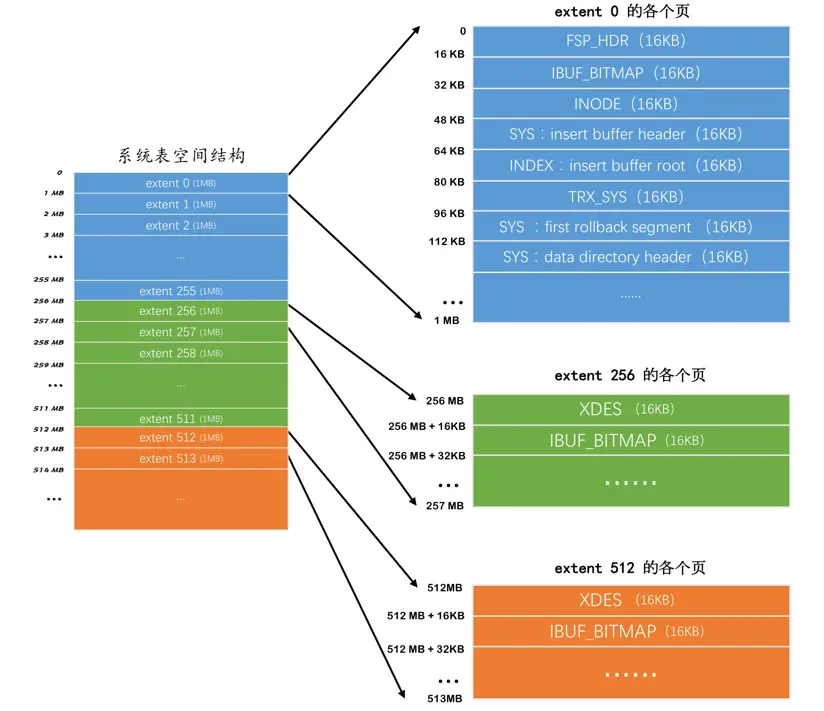
                - 页号为 3 ~ 7 的页面的是系统表空间特有的 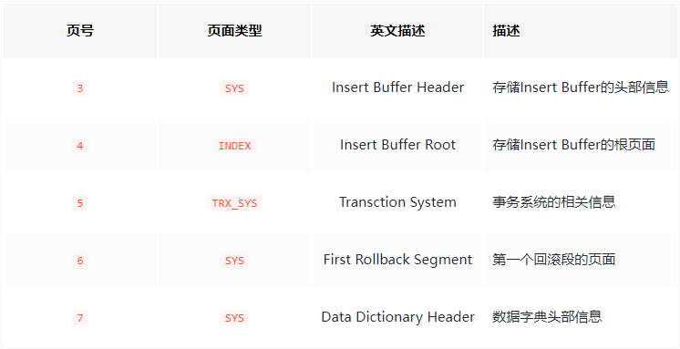
                  - 7\. Data Dictionary Header 页
                    - 页号为 7
                    - 类型为 SYS
                    - 用于存储数据字典中的 4 个基本系统表的相关信息
                    - 示意图 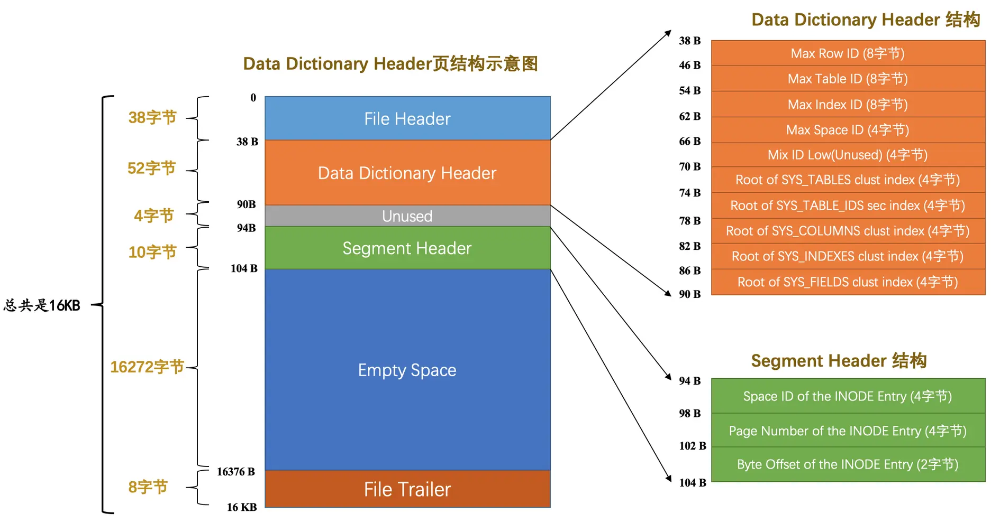
                    - 基本信息 
                      - Data Dictionary Header 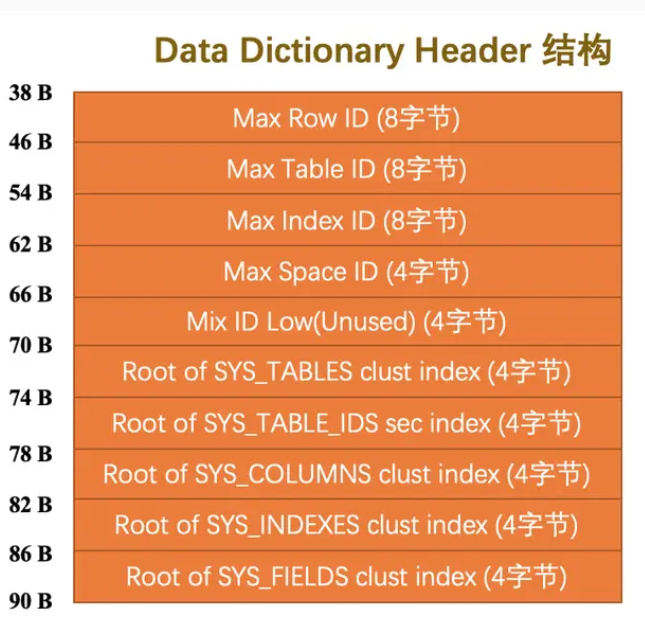
                        - Max Row ID
                          - 8 byte
                          - 如果不为表显式地指定一个主键，并且表中也没有 UNIQUE 修饰的列，那么 InnoDB 会插入一个隐藏列 row_id 列
                          - Max Row ID 由所有表共享。这就意味着无论哪个拥有 row_id 列的表插入一条记录时，该记录的 row_id 列的值就是 Max Row ID 对应的值，然后再把 Max Row ID 对应的值加 1
                        - Max Table ID
                          - 8 byte
                          - InnoDB 存储引擎中的所有的表都对应一个唯一的 ID，每次新建一个表时，就会把本字段的值作为该表的 ID，然后自增本字段的值
                        - Max Index ID
                          - InnoDB 存储引擎中的所有的索引都对应一个唯一的 ID，每次新建一个索引时，就会把本字段的值作为该索引的 ID，然后自增本字段的值
                        - Max Space ID
                          - InnoDB 存储引擎中的所有的表空间都对应一个唯一的 ID，每次新建一个表空间时，就会把本字段的值作为该表空间的 ID，然后自增本字段的值
                        - Root of SYS_TABLES clust index
                          - 代表 SYS_TABLES 表聚簇索引的根页面的页号
                        - Root of SYS_TABLE_IDS sec index
                          - 代表 SYS_TABLES 表为 ID 列建立的二级索引的根页面的页号
                        - Root of SYS_COLUMNS clust index
                          - 代表 SYS_COLUMNS 表聚簇索引的根页面的页号
                        - Root of SYS_INDEXES clust index
                          - 代表 SYS_INDEXES 表聚簇索引的根页面的页号
                        - Root of SYS_FIELDS clust index
                          - 代表 SYS_FIELDS 表聚簇索引的根页面的页号
                - extent 1 和 extent 2 这两个区（64 ~ 191 页）被称为双写缓冲区（Doublewrite Buffer）
      - 表在文件系统中的表示（MyISAM）
        - 会在数据库对应的子目录中创建： 1. &lt;table-name&gt;.frm：表的结构 2. &lt;table-name&gt;.MYD：表的数据 3. &lt;table-name&gt;.MYI：表创建的索引
      - 视图在文件系统中的表示
        - 视图是虚拟的表，只需要将其结构存储起来就可以了
        - 存储在数据库子目录的 &lt;view-name&gt;.frm （MySQL 8 之前）或者 &lt;table-name&gt;.idb（MySQL 8 之后） 中
      - 其他文件
        - 服务器进程文件
          - 每运行一个服务端程序，就会启动一个进程，该服务端进程会将其 ID 写入到该文件中
        - 服务器日志文件
        - SSL 和 RSA 证书和密钥文件
  - 文件系统对数据库的影响
    - 数据库名称和表名称不得超过文件系统所允许的最大长度
    - 特殊字符
      - 为了避免因为数据库名和表名出现某些特殊字符而造成文件系统不支持的情况，MySQL 会把数据库名和表名中所有除数字和拉丁字母以外的所有字符在文件名里都映射成 @+&lt;编码值&gt; 的形式作为文件名。
      - 例如：我们创建的表的名称为'test?'，由于?不属于数字或者拉丁字母，所以会被映射成编码值，所以这个表对应的.frm文件的名称就变成了test@003f.frm
    - 文件长度受文件系统最大长度限制
- MySQL系统数据库简介
  - mysql
    - 存储 MySQL 的用户账号和权限信息，存储过程、事件、运行过程产生的日志信息、帮助信息以及时区信息等
  - information_schema
    - 存储 MySQL 服务端程序维护的所有其他数据库的元数据，例如有哪些表、视图、触发器、列、索引等等。该数据库不涉及存储用户真实的数据
    - InnoDB 存储引擎会在启动时读取内部系统表并将该表的内容存放在 information_schema 数据库中
      - 关于内部系统表，《数据字典》中有讲解
  - performance_schema
    - 存储 MySQL 运行过程中的状态信息。包括统计最近执行了哪些语句，在执行过程的每个阶段都花费了多长时间、内存的使用情况等
  - sys
    - 通过视图的形式把 information_chema 和 performance_schema 结合起来，实现更方便地理解 MySQL 服务器的一些性能信息
- InnoDB 数据字典
  - InnoDB 为了更好地管理用户数据而引入一些额外的数据，这些称为元数据
  - InnoDB 定义了一些内部系统表（internal system table） 来记录这些元数据
  - 内部系统表（也称数据字典）
    - 总览 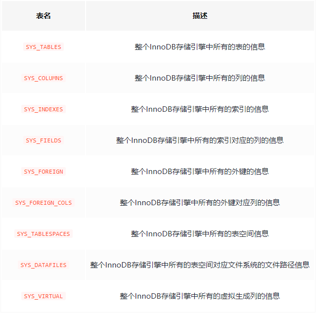
    - 4 个基本系统表
      - 表
        - SYS_TABLES 表
          - 列 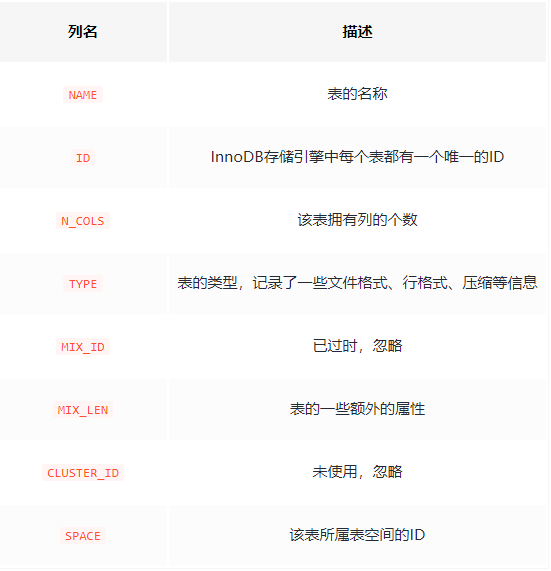
          - 索引
            - 以 NAME 列为主键的聚簇索引
            - 以 ID 列建立的二级索引
        - SYS_COLUMNS 表
          - 列 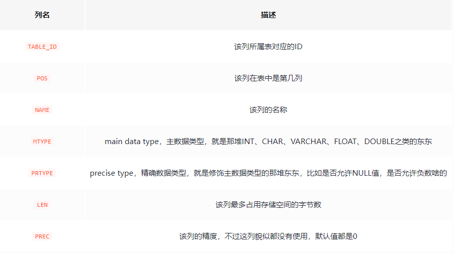
          - 索引
            - 以(TABLE_ID, POS)列为主键的聚簇索引
        - SYS_INDEXES 表
          - 列 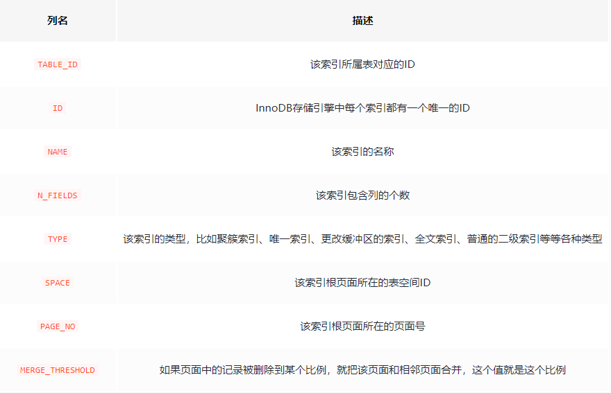
          - 索引
            - 以(TABLE_ID, ID)列为主键的聚簇索引
        - SYS_FIELDS 表
          - 列 
          - 索引
            - 以(INDEX_ID, POS)列为主键的聚簇索引
      - 这 4 个表存储了整个系统所有表的相关信息，那么，如何存储这 4 个表的相关信息呢？
        - InnoDB 用系统表空间中页号为 7 类型为 SYS 的的页来记录这 4 个表的聚簇索引和二级索引对应的 B+ 树的位置
- MySQL 单表查询和访问方法
  - 查询方式
    - 全表扫描
    - 使用索引
      - 针对主键或唯一二级索引的等值查询
        - 唯一二级索引的意思是：该二级索引列的值都不相同，即该列的值具有 UNIQUE 约束
      - 针对普通二级索引的等值查询
      - 针对索引列的范围查询
      - 直接扫描整个索引
  - 访问方法（访问类型）
    - 定义：执行查询语句的方式或者说策略（怎样执行查询语句）
    - 分类
      - const （常数级）
        - 定义：通过主键或者唯一二级索引的等值比较来定位一条记录
          - 只能在与常数进行等值比较的时候才有效
        - 如果主键或者唯一二级索引是由多个列构成，则索引中的每一个列都需要与常数进行等值比较，const 访问方法才有效
          - 这是因为只有该索引中全部列都采用等值比较才可以定位唯一的一条记录
        - 核心：当能通过索引来唯一定位一条记录时生效
      - ref
        - 定义：通过普通二级索引列与常数进行等值比较查找多条记录，然后，进行回表操作，从聚簇索引中获得完整的多条记录
          - 普通二级索引没有 UNIQUE 约束，所以，会有多条匹配的记录
        - 对于有多个列的联合索引，只要条件中索引列按照联合索引定义的顺序出现，且只要出现索引列，都是与常数进行等值比较的话且索引列出现在条件的最左边，就可能使用 ref 方法
        - 当使用 &lt;col&gt; is null 这种语句的时候，只会使用 ref 方法，而不会使用 const 方法，因为，唯一二级索引并不限制 null 值的个数，所以，会有多条记录
      - ref_or_null
        - 定义：通过二级索引列与常数比较且进行空值判断，然后进行回表操作，从聚簇索引中获得完整的多条记录
      - range
        - 定义：利用索引进行范围匹配
          - 不管是二级索引还是聚簇索引
          - 例如： SELECT * FROM single_table WHERE key2 IN (1438, 6328) OR (key2 &gt;= 38 AND key2 &lt;= 79);
            - 3 个范围
              - key2 = 1438
              - key2 = 6328
              - key2 属于 [38, 79]
        - 明确 range 访问方法使用的范围区间
          - 会取交集 
          - 会取并集 
          - common_field 没有索引，在二级索引中进行查找时，会将 common_field = 'abc' 替换为 TRUE 
          - 将 common_field = 'abc' 替换为 TRUE 后，相当于： SELECT * FROM sigle_table WHERE TRUE; 所以，不会使用二级索引，而是会进行全表扫描 
            - 使用到索引的搜索条件和没有使用该索引的搜索条件使用 OR 连接起来后是无法使用索引
          - 当 range 涉及到多个索引时，先假设使用其中的某个索引，然后，当涉及到其他的列的范围或者条件时，都替换为 TRUE，然后进行约简，最后，选择记录数少的那个索引，然后，使用约简后的查询条件在该二级索引中进行查询，然后，进行回表操作，再根据后面的查询条件过滤
      - index
        - 引例
          - 有 key_part1, key_part2, key_part3 三列，为这三列创建了 idx_keypart 联合索引
          - 有如下 SQL 语句： 
          - 查询列表中，包含了 idx_keypart 的全部联合索引列，但是，由于 key_part2 不是联合索引最左边的列，所以，不能使用 ref 或 range 访问方法来执行
          - 由于联合索引中，包含了查询列表中的所有列，故而，可以直接遍历该联合索引，而不去遍历聚簇索引
          - 二级索引记录比聚簇索记录小的多（聚簇索引记录要存储所有用户定义的列以及隐藏列，而二级索引记录只需要存放索引列和主键），而且这个过程也不用进行回表操作，所以直接遍历二级索引比直接遍历聚簇索引的成本要小很多
        - 定义：在不可以使用 ref 或 range 访问方法的情况下，可以直接从二级索引中获取所有需要的列，此时，直接遍历二级索引找到符合条件的记录
      - all
        - 定义：对聚簇索引进行全表扫描
      - index_merge （索引合并）
        - 使用多个索引一同进行查询
        - Intersection merge （交集合并）
          - 多个索引列使用 AND 进行连接时
          - 例如
            - 
            - 从 idx_key1 二级索引对应的 B+ 树中取出 key1 = 'a' 的相关记录 a
            - 从 idx_key3 二级索引对应的 B+ 树中取出 key3 = 'b' 的相关记录 b
            - 由于二级索引都是根据 &lt;索引列&gt; + &lt;主键值&gt; 的形式构成的，所以，可以通过 a 和 b 的主键值的交集来获得最终的主键值
          - 何时使用？
            - 二级索引列是等值匹配
            - 联合索引中的每个列都必须进行等值匹配，不能出现只匹配部分列的情况
            - 主键列是范围匹配
            - 根据有序的主键值进行回表操作取记录称为：Rowid Ordered Retrieval，简称 ROR
            - 上述条件只是必要条件，不是充分条件。优化器可能不会选择进行合并
          - 可以创建一个联合索引来避免进行 Intersection merge
        - Union merge
          - 多个索引列使用 OR 连接时
          - 何时使用？
            - 二级索引列是等值匹配的情况
            - 联合索引每个列都必须等值匹配，不能出现只出现匹配部分列的情况
            - 主键列是范围匹配
            - 使用 Intersection 索引合并的搜索条件
            - 例如： SELECT * FROM single_table WHERE key_part1 = 'a' AND key_part2 = 'b' AND key_part3 = 'c' OR (key1 = 'a' AND key3 = 'b');
              - key_part1、key_part2、key_part3 有联合索引
              - key1、key3 有二级索引
        - Sort-Union merge
          - 使用多个索引来查询出结果，然后，对每个索引的查询结果根据主键值进行排序，然后，进行求主键值的并集
          - 例如
            - 
      - 不使用索引合并
        - 查询条件含有多个索引列且不符合索引合并的条件或者优化器不选择索引合并时，查询优化器一般会根据表的统计数据来判断到哪个条件对应的二级索引中查询得到的记录数更少。
        - 然后将从该二级索引中查询到的结果进行回表操作得到完整的用户记录后再根据其余的 WHERE 条件过滤记录
- 多表连接
  - 连接的本质
    - 连接的本质就是多个表的笛卡尔积
    - 例如
      - 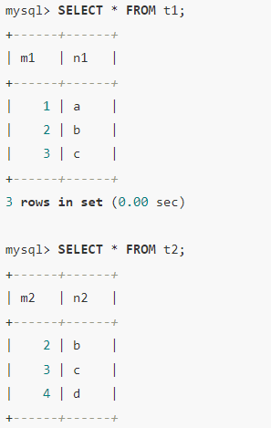
      - 连接后 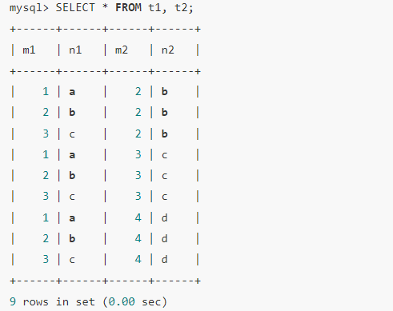
  - 连接的过程
    - 1\. 确定一个需要查询的表，这个表称为驱动表
      - 例如：使用 t1 表作为驱动表，然后，使用对 t1 的 WHERE 查询条件来对 t1 进行单表查询
    - 2\. 对驱动表中符合条件的每条记录到另一个表（称为被驱动表）中去查找匹配的记录
      - 例如
        - 当 t1.a = 2 时，如果有过滤条件 t1.a = t2.b，此时，就可以对 t2 表有条件 t2.b = 2，然后，就可以加上连接查询中对 t2表的原本的查询条件来对 t2 表进行单表查询
  - 内外连接
    - 一般情况下，将只涉及单表的过滤条件放到 WHERE 子句中，将涉及两表的过滤条件放到 ON 子句中，并称 ON 子句中的条件为连接条件
    - 内连接
      - 驱动表中的记录在被驱动表中找不到匹配的记录时，该驱动表中的记录不会加入到最后的结果集中
      - 在使用内连接时， WHERE 子句和 ON 子句等价
      - 语法 
      - 对于内连接，驱动表和被驱动表可以互换
    - 外连接
      - 驱动表中的即使在被驱动表中没有匹配的记录，也仍然将其加入到结果集
      - 对于 WHERE 子句来说，不符合条件的记录一定不会出现在最后的结果集中
      - 对于 ON 子句来说，被驱动表中不符合条件的记录仍然加入到最后的结果集中，其值以 null 值填充
      - 左外连接
        - 选取左边的表为驱动表
        - 语法 
  - 连接的原理
    - 嵌套循环连接（Nested-Loop Join）
      - 上述的《连接的过程》中所描述的过程
      - 如果有 3 个表进行连接，那么，两个表连接产生的结果作为新的驱动表，与第 3 个表进行连接，依此类推。这就是之所以被称为嵌套循环的原因
  - 加快连接速度
    - 当为驱动表中符合条件的每条记录到被驱动表中查找匹配的记录时，可以使用索引来加快被驱动表的查询速度
      - 由于驱动表中的记录已知，所以，涉及两个表的连接条件总是可以转换为只涉及被驱动表的连接条件，所以，可以根据这一点来确定要为哪些列创建索引
      - 当在连接查询时，对被驱动表的主键列或者唯一二级索引列进行等值查询的查询方式称为 eq_ref （访问方法）
    - 基于块的嵌套循环连接（Block Nested-Loop Join）
      - 起因：计算机内存有限，且被驱动表的数据很多，内存装不下太多的记录
      - join buffer：执行连接查询时申请一块固定大小的内存。
      - join buffer 的大小可以由 join_buffer_size 启动选项或者系统变量配置
      - 先把若干条驱动表结果集中的记录存储在 join buffer 中，然后开始扫描被驱动表，每一条被驱动表的记录一次性和 join buffer 中的多条驱动表记录做匹配，因为匹配的过程都是在内存中完成的，所以这样可以显著减少被驱动表的I/O代价
      - 图解，被驱动表的记录只涉及到经过 WHERE 子句过滤后的记录 
- InnoDB 统计数据
  - InnoDB 提供了两种存储统计数据的方式
    - 永久性的统计数据
      - 这种统计数据存储在磁盘上
      - 存储在 mysql 数据库下的两个表里
        - innodb_table_stats
          - 存储了关于表的统计数据，每一条记录对应着一个表的统计数据
          - 列 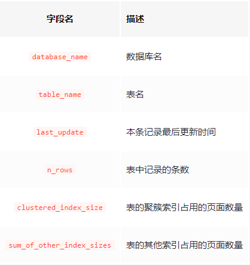
            - clustered_index_size、n_rows、sum_of_other_index_sizes 是估计值
            - n_rows 统计项的收集
              - 按照一定的算法选取 innodb_stats_persistent_sample_pages （系统变量，默认为 20） 个叶子节点页面，计算每个页面中主键值记录数量，然后 n_rows = 平均在一个页面中主键值的记录数量* 全部叶子页面的数量
              - 也可以设置每个表的页面采样数量 
            - clustered_index_size 和 sum_of_other_index_size 统计项收集
              - 1\. 从数据字典（SYS_INDEXES 系统表）里找到该表的各个索引对应的根页面位置
              - 2\. 从根页面的 Page Header 里找到叶子节点段和非叶子节点段对应的 Segment Header
                - 
              - 3.从叶子节点段和非叶子节点段的 Segment Header 中找到这两个段对应的 INODE Entry结构
              - 4.从对应的 INODE Entry 结构中可以找到该段对应所有零散的页面地址以及FREE、NOT_FULL、FULL链表的基节点
              - 5.直接统计零散的页面有多少个，然后从那三个链表的 List Length 字段中读出该段占用的区的大小，每个区占用 64 个页，所以就可以统计出整个段占用的页面（区的页面有些没有使用，所以，实际值可能比这样计算出来的值小）
              - 6.分别计算聚簇索引的叶子结点段和非叶子节点段占用的页面数，它们的和就是clustered_index_size 的值，按照同样的套路把其余索引占用的页面数都算出来，加起来之后就是 sum_of_other_index_sizes 的值
          - 这个表的主键是(database_name,table_name)
        - innodb_index_stats
          - 存储了关于索引的统计数据，每一条记录对应着一个索引的一个统计项的统计数据
          - 列 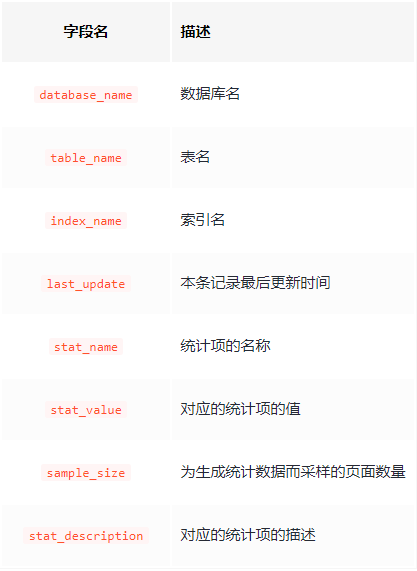
            - stat_name
              - n_leaf_pages
                - 该索引的叶子节点占用多少页面
              - size
                - 该索引占用了多少页面
              - n_diff_pfxNN
                - NN 可以替换为 01、02、03...
                - 表示对应的 NN 个前缀索引列（索引列包括用户定义的索引列和系统内置的主键列）不重复的值有多少
                - 在计算此值是对叶子页面进行采样，sample_size 列就表明了采样的页面的数量是多少
            - sample_size
              - sample_size 列就表明采样的页面的数量是多少
              - 对于有多个列的联合索引来说，采样的页面数量是：innodb_stats_persistent_sample_pages × 索引列的个数。
              - 当需要采样的页面数量大于该索引的叶子节点数量的话，就直接采用全表扫描来统计索引列的不重复值数量
          - 这个表的主键是(database_name,table_name,index_name,stat_name)
    - 非永久性的统计数据
      - 这种统计数据存储在内存中，当服务器关闭时这些这些统计数据就都被清除掉了，等到服务器重启之后，在某些适当的场景下才会重新收集这些统计数据
    - 可以使用系统变量 innodb_stats_persistent 来控制采用哪种方式来存储统计数据 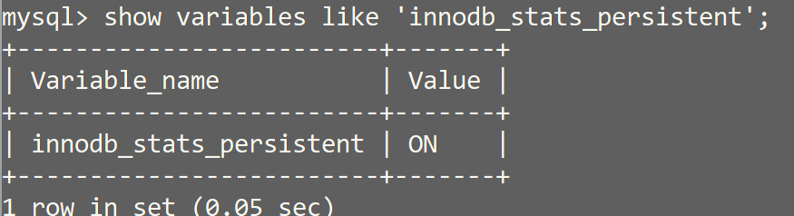
    - 可以在创建或修改表的时候单独指定该表的统计数据的存储方式 
      - 当STATS_PERSISTENT=1时，表明将该表的统计数据永久的存储到磁盘上，当STATS_PERSISTENT=0时，表明将该表的统计数据临时的存储到内存中
  - 对于统计某个列的不同值的个数（基数值）时，对于 NULL 值，通过 innodb_stats_method 系统变量可以有不同的统计方式
    - nulls_equal
      - 所有 NULL 值都是相同的，默认值
    - nulls_unequal
      - 每个 NULL 值都是不相同的
    - nulls_ignored
      - 忽略 NULL 值
  - 更新统计数据的 3 种方式
    - 系统变量 innodb_stats_auto_recalc
      - 系统变量 innodb_stats_auto_recalc 决定着服务器是否自动重新计算统计数据，它的默认值是 ON
      - 每个表都维护了一个变量，该变量记录着对该表进行增删改的记录条数，如果发生变动的记录数量超过了表大小的 10%，并且自动重新计算统计数据的功能是打开的，那么服务器会重新进行一次统计数据的计算，并且更新innodb_table_stats 和 innodb_index_stats表
      - 自动重新计算统计数据的过程是异步
      - 可以为单个表指定是否开启自动更新统计数据 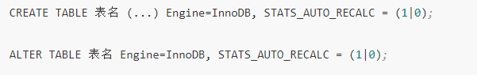
    - 调用 ANALYZE TABLE 语句来更新统计信息
      - ANALYZE TABLE 语句会立即重新计算统计数据，也就是这个过程是同步的，在表中索引多或者采样页面特别多时这个过程可能会特别慢
    - 直接修改 innodb_table/index_stats 表
      - 1\. 更新表： UPDATE innodb_table/index_stats SET ... WHERE table_name = &lt;table-name&gt;
      - 2\. 使用 FLUSH TABLE &lt;table-name&gt; 更新关于该表的数据
- MySQL 成本与优化
  - 成本
    - I/O 成本
      - InnoDB 规定读取一个页面花费的成本默认是 1.0
    - CPU 成本
      - 读取以及检测记录是否满足对应的搜索条件、对结果集进行排序等这些操作损耗的时间称之为CPU成本
      - 读取以及检测一条记录是否符合搜索条件的成本默认是 0.2
        - 不管读取记录时需不需要检测是否满足搜索条件，其成本都算是0.2。
    - mysql.server_cost 表
      - 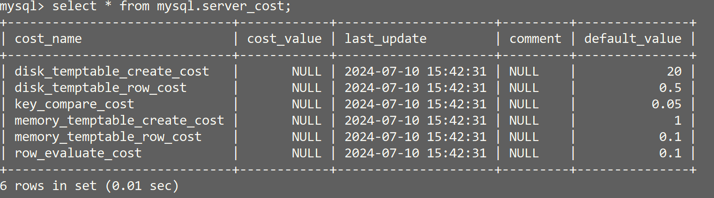
        - 成本常数，默认值在 8.0 中已经更改，以左图为准 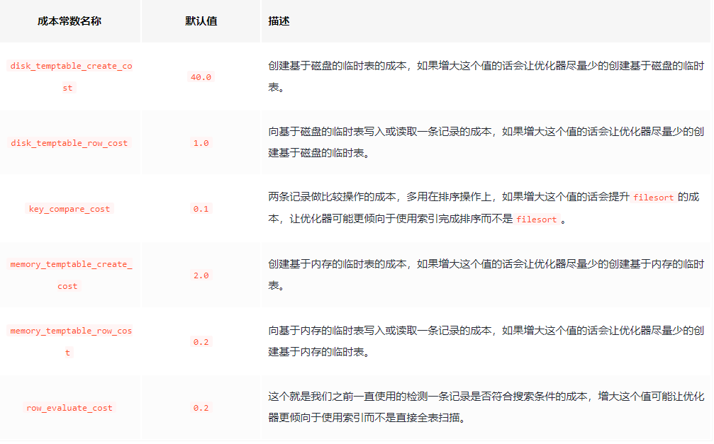
        - MySQL在执行诸如 DISTINCT 查询、分组查询、Union查询以及某些特殊条件下的排序查询都可能在内部先创建一个临时表，使用这个临时表来辅助完成查询（比如对于DISTINCT查询可以建一个带有UNIQUE索引的临时表，直接把需要去重的记录插入到这个临时表中，插入完成之后的记录就是结果集了）。在数据量大的情况下可能创建基于磁盘的临时表，也就是为该临时表使用MyISAM、InnoDB等存储引擎，在数据量不大时可能创建基于内存的临时表，也就是使用Memory存储引擎。
    - mysql.engine_cost 表
      - 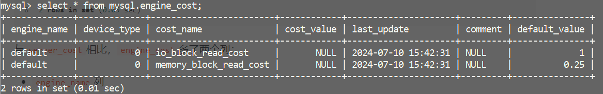
        - engine_name 列如果为 default，则成本常数适用于所有的存储引擎
        - device_type 列表示存储引擎使用的设备类型，这主要是为了区分常规的机械硬盘和固态硬盘
        - 成本常数 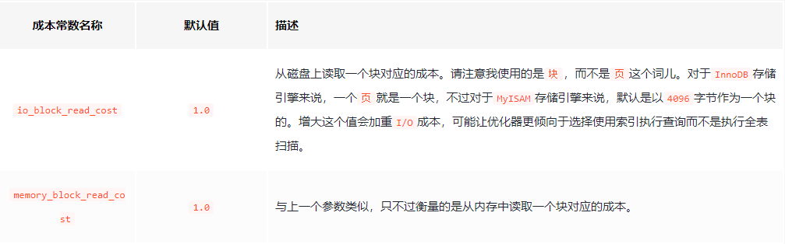
          - 此图中，memory_block_read_cost = 1 的原因是在 MySQL 5.7 的实现中，并不能准确预测某个查询所需要的块有哪些块是加载到磁盘上的，哪些是在内存中的
    - 修改上述两个表之后使用 FLUSH OPTIMIZER_COSTS; 语句来让系统重新加载
  - 执行计划：成本最低的执行方案
  - 单表查询的成本
    - 步骤
      - 1.根据搜索条件，找出所有可能使用的索引
        - 一个查询中所有可能使用的索引称之为 possible keys
      - 2.计算全表扫描的代价
        - MySQL 为每个表维护了一系列统计信息，包括行格式，存储引擎、总的记录数（Rows）、表占用的存储空间字节数（Data_length）
          - 使用 show table status like '&lt;table-name&gt;' 进行查看
        - 上面提及的 Data_length = &lt;聚簇索引的页面数&gt; x &lt;每个页面的大小&gt; 通过这个公式，可以算出聚簇索引所占有的页面数，从而算出 I/O 成本
        - 通过 Rows 可以计算出 CPU 成本
      - 3.计算使用不同索引执行查询的代价
        - 对于 二级索引 + 回表 的方式，成本取决于两部分
          - 范围区间的数量
            - 无论某个范围区间实际占用了多少页面，优化器都简单地认为索引的一个范围区间的 I/O 成本和读取一个页面是相同的
          - 需要回表的记录
            - 优化器需要计算范围区间包含多少二级索引记录
            - 从二级索引中读取记录的步骤
              - 1.找到区间的第一条记录，并称之为区间最左记录
              - 2.找到区间的最后一条记录，并称之为区间最右记录
              - 3.如果区间最左记录和区间最右记录相隔不太远（MySQL 5.7 中为 10 个页面），就以遍历的方式精确统计出满足条件的二级索引记录条数。如果相距太远，则从区间最左记录开始遍历 10 个页面，然后计算平均每个页面包含了多少记录，然后用这个值乘以最左与最右区间记录之间的页面数
                - 如何计算最左、最右区间记录之间的页面数？
                  - 图解 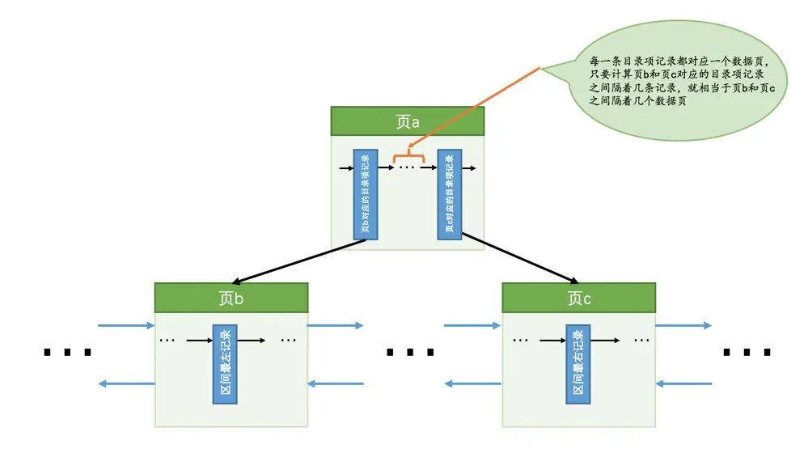
                  - 如果上图中的 页b 和 页c 的目录项不在同一个页面中，则往上一层目录中去计算 页b 和 页c 对应的目录项所在页之间有多少个页面
              - 4\. 计算读取二级索引每条记录的 CPU 成本
            - 回表的成本
              - MySQL 认为每次回表操作相当于访问一个页面
          - 基于索引统计数据的成本计算
            - MySQL 中，把通过访问索引对应的 B+ 树来计算某个范围区间对应的索引记录条数的方式称之为 index dive
            - 如果查询语句中有太多的 IN 语句的参数，以至于使用 index dive 方式确定索引中记录条数的成本都可能比全表扫描的成本大，为此，MySQL 有一个系统变量 eq_range_index_dive_limit
            - 当 IN 语句中的参数少于 eq_range_index_dive_limit 时，会用 index dive，当大于时，使用索引统计数据进行估算
            - 像会为每个表维护一份统计数据一样，MySQL也会为表中的每一个索引维护一份统计数据，查看某个表中索引的统计数据可以使用 SHOW INDEX FROM &lt;表名&gt; 的语法
              - 索引统计数据中的列名以及含义 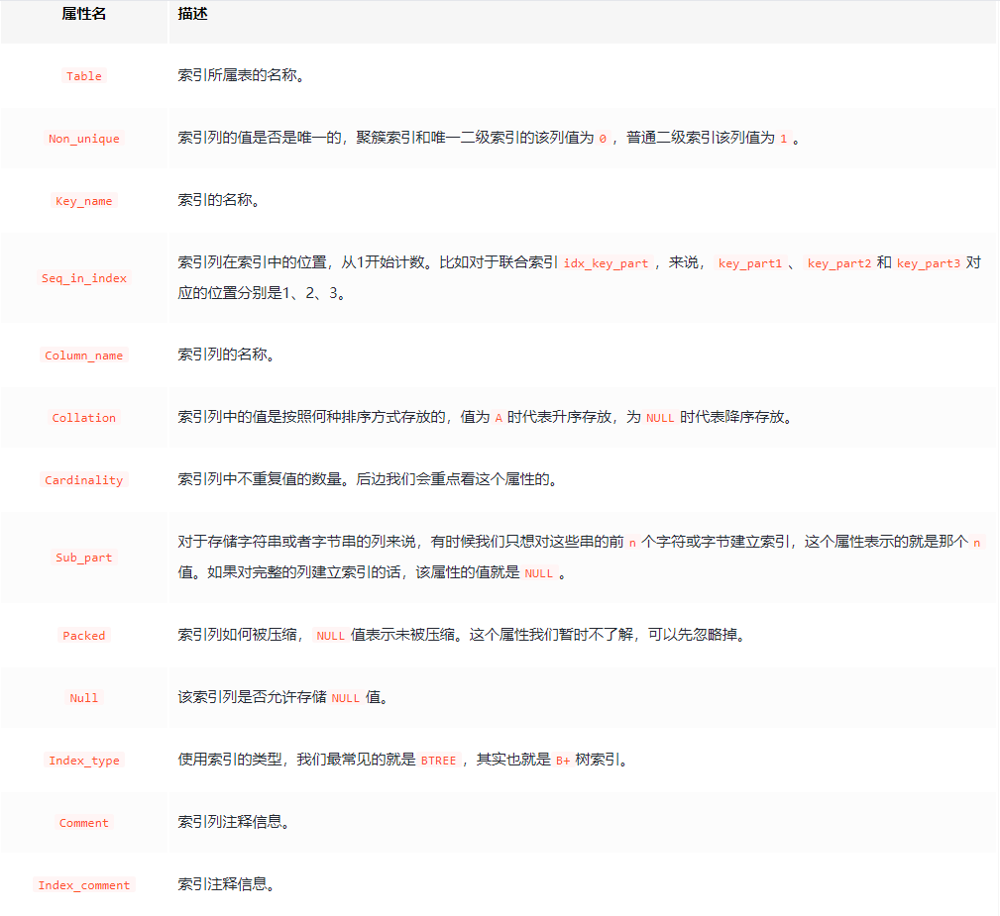
                - Cardinality （基数值）
                  - 表示在这个索引列的不重复值的个数
                  - 在 InnoDB 中，这个数值是一个估计值
            - 如何估算索引中符合条件的记录数？
              - 1\. 使用 show table status 中的 rows 值
              - 2\. 使用 show index 中的 cardinality 值
              - 3\. 一个值的重复次数 约等于 rows 除以 cardinality
          - 总的成本
            - I/O 成本
              - 范围区间的数量 x 1.0 + 二级索引记录数 x 1.0
            - CPU 成本
              - 读取二级索引记录成本 + 0.01（微调值） + 回表后在聚簇索引中使用其他条件过滤记录的 CPU 成本
      - 4.对比各种执行方案的代价，找出成本最低的方案
  - 多表连接查询成本
    - 查询成本
      - 单次查询驱动表的成本
        - 把驱动表得到的记录条数称为扇出（fanout）
        - 当查询条件不能使用索引或者不使用该列的索引（例如，查询条件中有多个索引列，只使用其中的一个），这时，只能靠“猜”来确定可能得扇出值，这个猜的过程被称为 condition filtering
          - MySQL 使用一些启发式规则（heuristic）来猜测
        - 当使用内连接时，优化器需要根据下述的成本计算公式来选择合适的驱动表
      - 多次查询被驱动表的成本
        - 具体查询多少次取决于对驱动表查询的结果集中有多少条记录
      - 成本 = 单次访问驱动表的成本 + 驱动表的扇出数 x 单次访问被驱动表的成本
        - 尽量减少驱动表的扇出
        - 对被驱动表的访问成本尽量低
        - 如果可以，被驱动表的连接列最好是该表的主键或者唯一二级索引列，这样就可以把访问被驱动表的成本降到更低
    - 连接成本
      - 对于 n 张表，则可能得连接顺序有 n! 种连接顺序
        - 所谓的连接顺序，是形如 ABC, BAC, CAB...
      - MySQL 查询优化器要对每种连接顺序都计算一次成本，但是，使用了许多方法来降低计算该成本的成本
        - 提前结束某种顺序的成本评估
          - MySQL 在计算各种连接顺序的成本之前，会维护一个全局变量，这个变量表示当前最小的连接查询成本
          - 如果当前计算的成本已经大于该变量值，则停止计算
        - optimizer_search_depth 系统变量
          - 如果连接表的个数小于该值，那么就继续穷举分析每一种连接顺序的成本，否则只对与optimizer_search_depth 值相同数量的表进行穷举分析
        - 根据一些启发式规则不计算该顺序的连接成本
          - 如果不满足这些启发式规则，则不计算该连接顺序的连接成本
          - 但这也可能导致错失最优的执行计划，所以，提供了系统变量 optimizer_prune_level 来控制是否启用这些启发式规则
- MySQL 规则与优化
  - 优化器会执行一系列规则，来优化语句的查询
  - 规则
    - 条件化简
      - 移除不必要的括号
        - 
        - 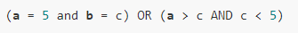
      - 常量传递（constan_propagation）
        - 
        - 
      - 等值传递（equality_propagation）
        - 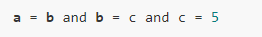
        - 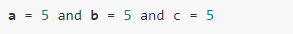
      - 移除没用的条件（trivial_condition_removal）
        - 对于一些明显永远为 TRUE 或者 FALSE 的表达式，优化器会移除掉它们
        - 会将 b = b 替换为 TRUE， 5 != 5 替换为 FALSE 
        - 继续简化 
      - 表达式计算
        - 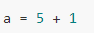
        - 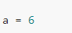
        - 当对列进行计算时，此优化不会生效 
      - HAVING 子句和 WHERE 子句合并
        - 如果查询语句中没有出现诸如 SUM、MAX 等等的聚集函数以及 GROUP BY 子句，优化器就把HAVING 子句和 WHERE 子句合并起来
      - 常量表检测
        - 常量表
          - 该中没有记录或者只有一条记录
            - 通过统计数据得到该表中有多少条记录（因为 InnoDB 中记录条数不准确，所以，此规则对于 InnoDB 来说不生效
          - 对该表进行主键等值匹配或者对唯一二级索引列进行等值匹配
        - 优化器会取出常量表中唯一一条记录，然后，用该表的值替换所有设计到该记录中的值的条件
    - 外连接消除
      - 在外连接查询中，指定的 WHERE 子句中包含被驱动表中的列不为 NULL 值的条件称为空值拒绝（reject-NULL）
      - 如果空值拒绝的列恰好为 ON 子句中指定的连接条件，所以，此时的外连接和内连接一样
      - 消除了外连接之后，就可以使用内连接的基于成本的优化方案
    - 子查询优化
      - 子查询
        - 子查询可以位于
          - SELECT 子句中
            - 
          - FROM 子句中
            - 
            - 这种由子查询构成的结果集组成的表称为派生表
          - WHERE 或 ON 子句中
            - 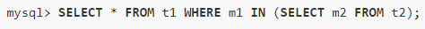
          - ORDER BY
          - GROUP BY
        - 子查询的分类
          - 按查询结果集来区分
            - 标量子查询
              - 只返回一个单一值的子查询
              - 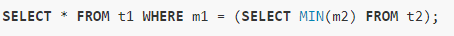
            - 行子查询
              - 返回一条记录的子查询
              - 
            - 列子查询
              - 返回一列的数据
              - 
            - 表子查询
              - 子查询的结果既包含很多条记录，又包含很多列
          - 按与外层查询的关系来区分
            - 不相关子查询
              - 子查询可以单独运行出结果，而不依赖于外层查询的值
            - 相关子查询
              - 子查询的执行需要依赖于外层查询的值
              - n1 是 t1 的列 
        - 语法
          - 在 SELECT 子句中
            - 必须是标量子查询
          - 在布尔表达式中
            - 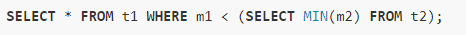
            - 
          - [NOT] IN/ANY/SOME/ALL 子查询
            - [NOT] IN
              - 
              - 
            - [NOT] ANY/SOME （ANY 与 SOME 是同义词）
              - 
              - 只要子查询结果集中存在某个值和给定的操作数做 comparison_operator 比较结果为 TRUE，那么整个表达式的结果就为 TRUE，否则整个表达式的结果就为 FALSE
              - 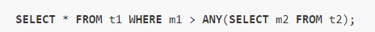
            - [NOT] ALL
              - 
              - 子查询结果集中所有的值和给定的操作数做comparison_operator比较结果为TRUE，那么整个表达式的结果就为TRUE，否则整个表达式的结果就为FALSE
            - 子查询中不允许有 LIMIT 子句
          - [NOT] EXISTS 子查询
            - 
            - 并不关心子查询的结果，关心的只是子查询的结果集中是否存在记录 
              - 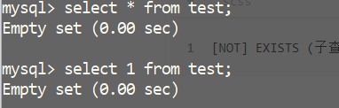
          - 子查询必须用小括号扩起来
      - 子查询的执行与优化
        - 不相关的标量、行子查询
          - 单独执行子查询
          - 然后，将上一步查询得到的结果当做外层查询的参数在执行外层查询
        - 相关的标量、行子查询
          - 1.从外层查询中获取一条记录
          - 2.从 1 中获取涉及子查询的值，然后执行子查询
          - 3.根据子查询的执行结果检测外层程序 WHERE 子句的条件是否成立，如果成立，就将外层查询的那条记录加入到结果集，否则，就抛弃
          - 4\. 重复上述步骤
        - 不相关的 [NOT] IN 子句中的子查询
          - 物化表转连接
            - 将子查询的结果集中的需要的列写入到一个由 Memory 存储引擎并创建哈希索引的临时表里，并且，写入的过程中会进行去重
              - 去重的目的是减少内存的使用（IN 子句中参数去重后也没有问题）
              - 将子查询结果集中的记录保存到临时表的过程称为物化（materialize），将临时表称为物化表
              - 如果子查询的结果集非常大，超过了系统变量 tmp_table_size 或者 max_heap_table_size，临时表会转而使用基于磁盘的存储引擎来保存结果集中的记录，索引类型也会转为 B+ 树索引
            - 然后，将物化表和外层查询所涉及的表一起进行内连接查询，将原本形如 SELECT * FROM table WHERE key in (SELECT ...) 的子查询转变为 SELECT * FROM table INNER JOIN materialized_table ON key = &lt;物化表中对应的列&gt;
            - 然后，基于内连接的优化方案，选择成本更低的驱动表
          - 将子查询转换为 semi-join（半连接）
            - 引子
              - 原本的 SQL 语句 
              - 将其尝试转换为内连接（两者不是等价关系） 
                - 不是完全等价的原因是对于 s1 表的某条记录来说，s2 经过 WHERE 子句过滤后的记录中有 n 条记录满足连接条件分为三种情况
                  - n = 0：s1 表中的该条记录不会加入到结果集中零次
                  - n = 1：s1 表中的该条记录会加入到结果集中一次
                  - n &gt;= 2：s1 表中的该条记录加入到结果集中多次
            - 为了解决将 IN 子句改写到使用内连接的语句后s1 表中有记录多次加入到结果集中造成与 IN 子句的语义不符的情况，semi-join 应运而生
            - 半连接的语义是：对于 s1 表中的某条记录，只关心在 s2 表中是否有记录与之匹配，而不关心有多少条记录与之匹配
            - semi-join 的实现方式
              - Table pullout （子查询中的表向上拉）
                - 子查询的查询列表处只有一个主键列或者一个唯一二级索引列
                - 原始 SQL 
                - 转换过的 SQL 
                  - 这是因为保证 s2 的查询结果集只有一条记录
              - DuplicateWeedOut execution strategy（重复值消除）
                - 建立一个临时表，每当将某条 s1 表中的记录加入到结果集中时，将该记录的主键值加入到该表中，同时，要将记录加入到结果集时，检查该临时表中是否含有该记录的主键值
              - LooseScan execution strategy（松散扫描）
                - SQL 语句 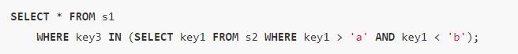
                - 执行过程 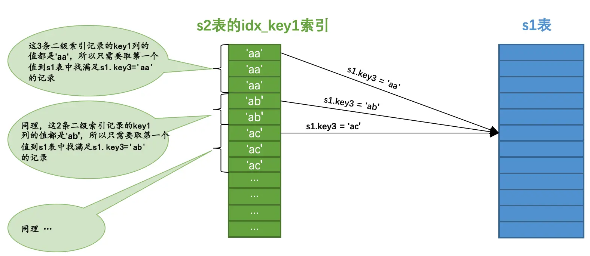
                - 概括为：子查询中的查询列表只有一个含索引的列，那么，扫描索引，但对于索引值相同的记录只取一条记录进行匹配
              - Semi-join materialization execution strategy（半连接物化）
                - 物化表没有重复的记录，可以直接进行半连接
              - FirstMatch execution strategy （首次匹配）
                - 先取一条外层查询的中的记录，然后到子查询的表中寻找符合匹配条件的记录，如果能找到一条，则将该外层查询的记录放入最终的结果集并且停止查找更多匹配的记录，如果找不到则把该外层查询的记录丢弃掉
                - 重复上述步骤
            - 能够转换为 semi-join 的语句形如
              - SELECT ... FROM outer_tables WHERE expr IN (SELECT ... FROM inner_tables ...) AND ...
              - SELECT ... FROM outer_tables WHERE (oe1, oe2, ...) IN (SELECT ie1, ie2, ... FROM inner_tables ...) AND ...
            - 不能转换为 semi-join 的语句形如
              - 外层查询的 WHERE 条件中有其他搜索条件与 IN 子查询组成的布尔表达式使用 OR 连接起来
                - 
              - 使用 NOT IN 而不是 IN 的情况
                - 
              - 在 SELECT 子句中的 IN 子查询的情况
                - 
              - 子查询中包含 GROUP BY、HAVING 或者 聚集函数 的情况
                - 
              - 子查询中包含 UNION 的情况
                - 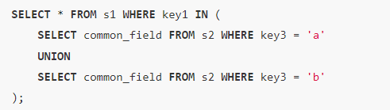
        - 相关 [NOT] IN 子查询
          - 可以很方便的转换为 semi-join
            - 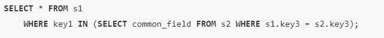
            - 转为 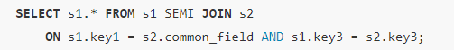
            - semi-join 执行策略中不包含物化表策略
        - [NOT] IN 子查询（通用）
          - 把 IN 子查询转换为 EXISTS 子查询
            - 
            - 
          - 只要 IN 子查询是放在 WHERE 或者 ON 子句中的，那么IN -&gt; EXISTS 的转换就是没问题的
            - 出现问题的情况
              - 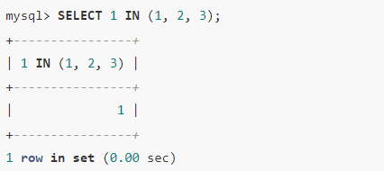
              - 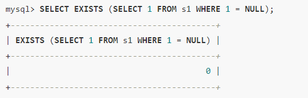
        - 不相关 ANY/ALL 子查询
          - 转换 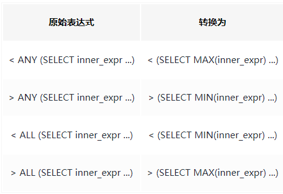
        - 不相关 [NOT] EXISTS 子查询
          - 先执行该子查询，得出 [NOT] EXISTS 子句的结果
          - 然后，将原本的 EXISTS 子句替换为子查询的结果
        - 相关 [NOT] EXISTS 子查询
          - 无优化
      - 子查询不能优化的时候的执行方式
        - 相关子查询
          - 1.先执行子查询
          - 2.将子查询得到的结果作为外层的查询参数在执行外层查询
        - 不相关子查询
          - 1.先从外城查询中取得一条记录
          - 2.从上一步骤中获取的那条记录中找出子查询中涉及到的值，然后执行子查询
          - 3.根据子查询的查询结果来检测外层查询的 WHERE 子句是否成立，如果成立，就把外层查询的那条记录加入到结果集中
          - 4.重复上述步骤
      - 优化
        - 移除子查询中冗余的子句
          - ORDER BY 子句
          - DISTINCT 子句
          - 没有聚集函数以及 HAVING 子句的 GROUP BY 子句
        - 派生表的优化
          - 把子查询放在外层查询的 FROM 子句后，那么这个子查询的结果相当于一个派生表
          - 2 种优化策略
            - 将派生表物化
              - MySQL 中，使用了一种延迟物化的策略，在查询中真正使用到派生表的时候才会尝试物化派生表
            - 将派生表和外层的表合并（将查询重写为没有派生表的形式）
              - 原始 SQL 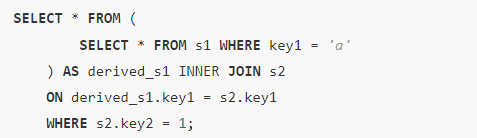
              - 转换后 
              - 当子查询中含有这些语句后就不可以和外层查询合并
                - 聚集函数，比如MAX()、MIN()、SUM()
                - DISTINCT
                - GROUP BY
                - HAVING
                - LIMIT
                - UNION 或 UNION ALL
                - 该子查询中含有一个另一个子查询
- Explain
  - 输出的列 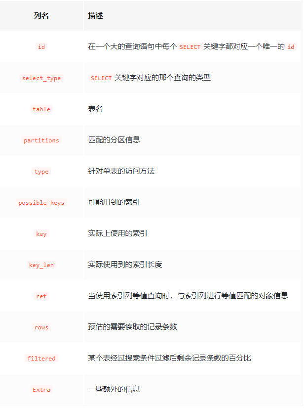
    - id
      - 在一个查询中，每出现一个 SELECT 关键字，就为其分配一个 id
      - 如果子查询被转换为了连接查询，则只有一个 id
      - 当 id 为 null 时，表示这是一张临时表 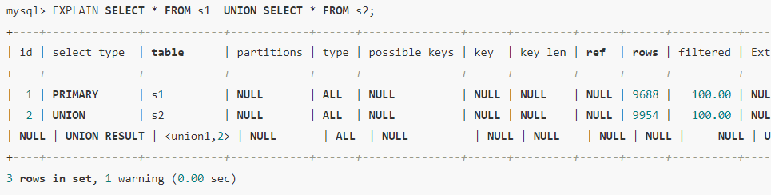
    - table
      - 该条记录对应的表名
      - 在连接查询中，每个表都会对应一条记录，这些记录的 id 列的值都是相同的。出现在前面的表表示驱动表，出现在后面的表示被驱动表
    - select_type
      - 可能的值以及描述 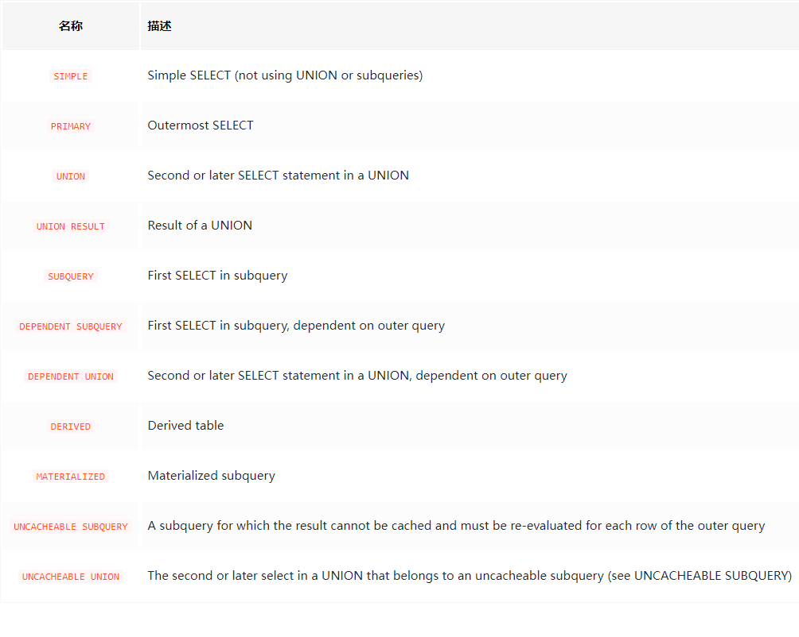
        - SIMPLE
          - 查询语句中不包含 UNION 或者 子查询 的查询都算作是 SIMPLE 类型
          - 连接也算作是 SIMPLE 类型
        - PRIMARY
          - 对于包含 UNION、UNION ALL 或者 子查询 的大查询来说，它是由几个小查询组成的，其中最左边的那个查询的 select_type 值就是PRIMARY
        - UNION
          - 对于包含 UNION 或者 UNION ALL 的大查询来说，它是由几个小查询组成的，其中除了最左边的那个小查询以外，其余的小查询的select_type 值就是 UNION
        - UNION RESULT
          - MySQL 选择使用临时表来完成 UNION 查询的去重工作，针对该临时表的查询的 select_type 就是 UNION RESULT
          - 示例 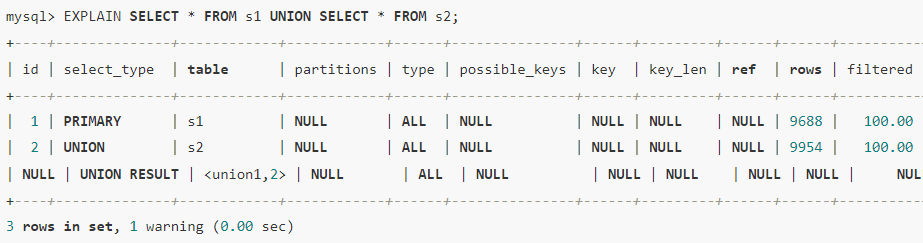
        - SUBQUERY
          - 如果包含子查询的查询语句不能够转为对应的 semi-join 的形式，并且该子查询是不相关子查询，并且查询优化器决定采用将该子查询物化的方案来执行该子查询时，该子查询的第一个SELECT 关键字代表的那个查询的 select_type 就是 SUBQUERY
          - 示例 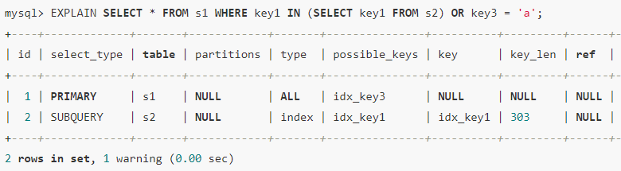
        - DEPENDENT SUBQUERY
          - 如果包含子查询的查询语句不能够转为对应的 semi-join 的形式，并且该子查询是相关子查询，则该子查询的第一个SELECT关键字代表的那个查询的 select_type 就是 DEPENDENT SUBQUERY
          - select_type 为 DEPENDENT SUBQUERY 的查询可能会被执行多次
        - DEPENDENT UNION
          - 在包含 UNION 或者 UNION ALL 的大查询中，如果各个小查询都依赖于外层查询的话，那除了最左边的那个小查询之外，其余的小查询的 select_type 的值就是 DEPENDENT UNION
          - 示例 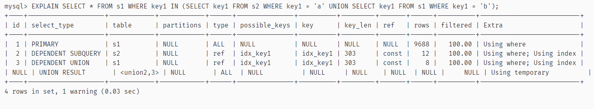
        - DERIVED
          - 对于采用物化的方式执行的包含派生表的查询，该派生表对应的子查询的 select_type 就是 DERIVED
          - 示例 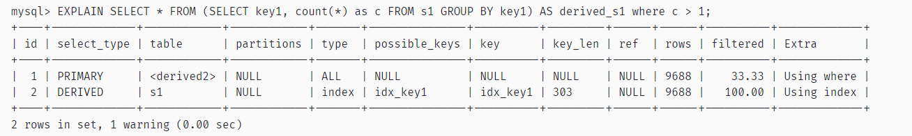
        - MATERIALIZED
          - 当查询优化器在执行包含子查询的语句时，选择将子查询物化之后与外层查询进行连接查询时，该子查询对应的 select_type 属性就是 MATERIALIZED
          - 示例；&lt;subquery2&gt;，说明该表其实就是id为2对应的子查询执行之后产生的物化表，然后将s1和该物化表进行连接查询 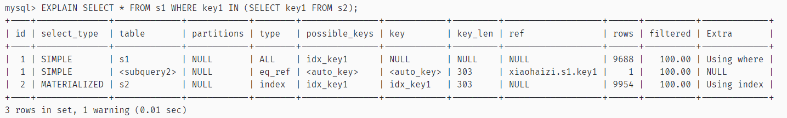
        - UNCACHEABLE SUBQUERY
        - UNCACHEABLE UNION
    - type
      - 对该表执行查询时的访问方法
      - system
        - 当表中只有一条记录并且该表使用的存储引擎的统计数据是精确的，比如 MyISAM、Memory，那么对该表的访问方法就是 system
      - const
        - 根据主键或者唯一二级索引列与常数进行等值匹配时，对单表的访问方法就是 const
      - eq_ref
        - 在连接查询时，如果被驱动表是通过主键或者唯一二级索引列等值匹配的方式进行访问的（如果该主键或者唯一二级索引是联合索引的话，所有的索引列都必须进行等值比较），则对该被驱动表的访问方法就是 eq_ref
      - ref
        - 当通过普通的二级索引列与常量进行等值匹配时来查询某个表，那么对该表的访问方法就可能是ref
      - fulltext
      - ref_or_null
        - 当对普通二级索引进行等值匹配查询，该索引列的值也可以是 NULL 值时，那么对该表的访问方法就可能是 ref_or_null
      - index_merge
        - 在某些场景下可以使用 Intersection、Union、Sort-Union 这三种索引合并的方式来执行查询
      - unique_subquery
        - unique_subquery 是针对在一些包含 IN 子查询的查询语句中，如果查询优化器决定将 IN 子查询转换为 EXISTS 子查询，而且子查询可以使用到主键进行等值匹配的话，那么该子查询执行计划的 type 列的值就是 unique_subquery
        - 示例 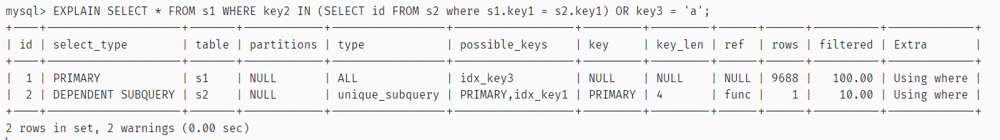
      - index_subquery
        - index_subquery 与 unique_subquery 类似，只不过访问子查询中的表时使用的是普通的索引
        - 示例 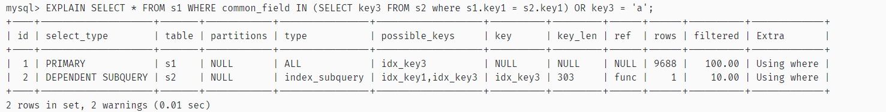
      - range
        - 如果使用索引获取某些范围区间的记录，那么就可能使用到 range 访问方法
        - 示例 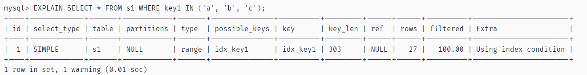
    - possible_keys 和 key
      - possible_keys 列表示在某个查询语句中，对某个表执行单表查询时可能用到的索引有哪些， key 列表示实际用到的索引有哪些
    - key_len
      - key_len 列表示当优化器决定使用某个索引执行查询时，该索引记录的最大长度，由这三个部分构成
        - 对于使用固定长度类型的索引列来说，它实际占用的存储空间的最大长度就是该固定值，对于指定字符集的变长类型的索引列来说，比如某个索引列的类型是VARCHAR(100)，使用的字符集是utf8，那么该列实际占用的最大存储空间就是100 × 3 = 300个字节
        - 如果该索引列可以存储 NULL 值，则 key_len 比不可以存储 NULL 值时多 1 个字节
        - 对于变长字段来说，都会有 2 个字节的空间来存储该变长列的实际长度
    - ref
      - 当使用索引列等值匹配的条件去执行查询时，也就是在访问方法是 const、eq_ref、ref、ref_or_null、unique_subquery、index_subquery 其中之一时，ref 列展示的就是与索引列作等值匹配的是什么，可能是一个常数（const）或者某个列或者函数（func）
      - 示例 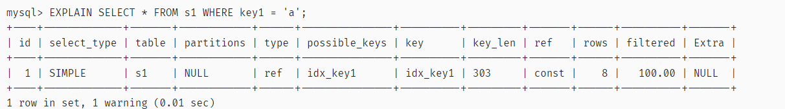
      - 示例 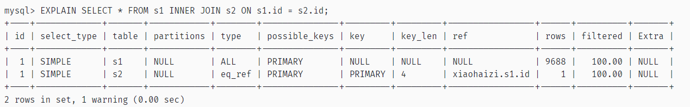
      - 示例 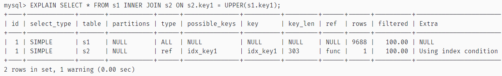
    - rows
      - 如果查询优化器决定使用全表扫描的方式对某个表执行查询时，执行计划的rows列就代表预计需要扫描的行数，如果使用索引来执行查询时，执行计划的rows列就代表预计扫描的索引记录行数
    - filtered
      - 代表查询优化器预测在 rows 条记录中，有百分之多少条记录满足其余的搜索条件
      - 分析连接查询的成本时提出过一个 condition filtering 的概念，就是 MySQL 在计算驱动表扇出时采用的一个策略
        - 如果使用的是全表扫描的方式执行的单表查询，那么计算驱动表扇出时需要估计出满足搜索条件的记录到底有多少条
        - 如果使用的是索引执行的单表扫描，那么计算驱动表扇出的时候需要估计出满足除使用到对应索引的搜索条件外的其他搜索条件的记录有多少条
      - 示例 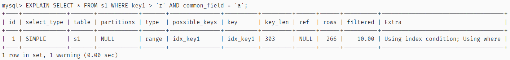
        - 该查询使用 idx_key1 索引来执行查询，从rows 列可以看出满足 key1 &gt; 'z' 的记录有266 条。执行计划的 filtered 列就代表查询优化器预测在这 266 条记录中，有多少条记录满足其余的搜索条件，也就是 common_field = 'a' 这个条件的百分比。此处 filtered 列的值是 10.00，说明查询优化器预测在 266 条记录中有 10.00% 的记录满足 common_field = 'a' 这个条件
    - extra
      - No tables used
        - 当查询语句的没有 FROM 子句时将会提示该额外信息
      - Impossible WHERE
        - 查询语句的 WHERE 子句永远为 FALSE 时将会提示该额外信息
      - No matching min/max row
        - 当查询列表处有 MIN 或者 MAX 聚集函数，但是并没有符合 WHERE 子句中的搜索条件的记录时，将会提示该额外信息
      - Using index
        - 查询列表以及搜索条件中只包含属于某个索引的列，也就是在可以使用索引覆盖的情况下，在 Extra 列将会提示该额外信息
      - Using index condition
        - 使用索引条件下推这一特性时显示这一字段
        - 示例 
          - 有些搜索条件中虽然出现了索引列，但却并不能用来形成范围区间，也就是不能被用来减少需要扫描的记录数量
          - 索引条件下推（index condition pushdown）
            - MySQL 分为两层：server 层和存储引擎层
            - 索引条件下推的执行过程
              - server层首先调用存储引擎的接口定位到满足key1 &gt; 'z'的第一条记录
              - 存储引擎根据B+树索引快速定位到该条二级索引记录后，不着急回表，先判断一下所有关于idx_key1索引的条件是否成立，也就是key1 &gt; 'z' AND key1 LIKE '%a'是否成立，如果这些条件不成立，则直接跳过该二级索引记录，然后去找下一条二级索引记录；如果这些条件成立，则执行回表操作，将完整的用户记录返回给server层
                - 如果没有索引条件下推，则找到记录后，会立即进行回表操作，不判断所有关于 index_key1 索引的条件是否成立
              - server层再判断其他的搜索条件是否成立，如果成立则将其发送给客户端，否则的话跳过该记录，然后向存储引擎层要下一条记录
              - 由于每条记录都有一个next_record的属性，根据该属性可以快速定位到符合key1 &gt; 'z'条件的下一条二级索引记录，还是不着急进行回表操作，先判断一下所有关于idx_key1索引的条件是否成立，如果这些条件不成立，则直接跳过该二级索引记录，然后去找下一条二级索引记录；如果这些条件成立，则执行回表操作，将完整的用户记录返回给server层。然后重复上一步骤，直到将索引idx_key1的范围区间('z', +∞)的所有记录都扫描过为止
      - Using where
        - 当某个搜索条件需要在server层进行判断时，在Extra列中会提示Using where
        - 示例 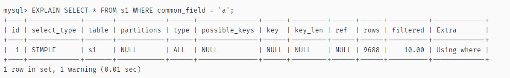
      - Using join buffer (Block Nested Loop)
        - 在连接查询执行过程中，当被驱动表不能有效的利用索引加快访问速度，MySQL一般会为其分配一块名叫join buffer的内存块来加快查询速度，也就是我们所讲的基于块的嵌套循环算法
        - 示例 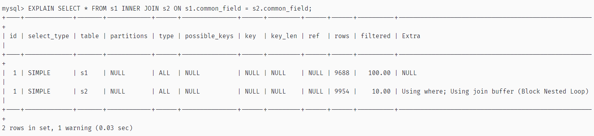
      - Not exists
        - 当我们使用外连接时，如果WHERE子句中包含要求被驱动表的某个列等于NULL值的搜索条件，而且那个列又是不允许存储NULL值的，那么在该表的执行计划的Extra列就会提示Not exists额外信息
        - 示例 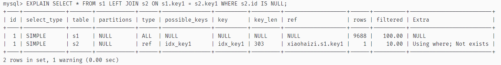
      - Using intersect(...)、Using union(...)和Using sort_union(...)
        - 使用Intersect索引合并的方式执行查询，括号中的...表示需要进行索引合并的索引名称
      - Zero limit
        - 当我们的LIMIT子句的参数为0时，表示不打算从表中读出任何记录，将会提示该额外信息
      - Using filesort
        - 很多情况下排序操作无法使用到索引，只能在内存中（记录较少的时候）或者磁盘中（记录较多的时候）进行排序，统称为文件排序（filesort）
        - 如果某个查询需要使用文件排序的方式执行查询，就会在执行计划的Extra列中显示Using filesort提示
      - Using temporary
        - 如果查询中使用到了内部的临时表，在执行计划的Extra列将会显示Using temporary提示
        - MySQL会在包含GROUP BY子句的查询中默认添加上ORDER BY子句
        - 如果并不想为包含GROUP BY子句的查询进行排序，需要显式地写上ORDER BY NULL
      - Start temporary, End temporary
        - 查询优化器会优先尝试将IN子查询转换成semi-join，而semi-join又有好多种执行策略，当执行策略为DuplicateWeedout时，也就是通过建立临时表来实现为外层查询中的记录进行去重操作时，驱动表查询执行计划的Extra列将显示Start temporary提示，被驱动表查询执行计划的Extra列将显示End temporary提示
      - LooseScan
        - 在将In子查询转为semi-join时，如果采用的是LooseScan执行策略，则在驱动表执行计划的Extra列就是显示LooseScan提示
      - FirstMatch(tbl_name)
        - 在将In子查询转为semi-join时，如果采用的是FirstMatch执行策略，则在被驱动表执行计划的Extra列就是显示FirstMatch(tbl_name)提示
  - Json 格式的执行计划
    - 在 EXPLAIN 单词和真正的查询语句中间加上 FORMAT=JSON
    - Json 格式的执行计划包含计划花费的成本
      - 示例 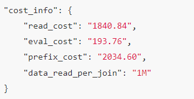
        - read_cost
          - I/O 成本
          - 检测 rows x (1 - filter) 条记录的 CPU 成本
            - 在 JSON 格式的执行计划中，rows 相当于rows_examined_per_scan
        - eval_cost
          - 检测 rows × filter 条记录的成本
        - prefix_cost
          - 单独查询一张表的陈本
          - read_cost + eval_cost
          - 如果此表是被驱动表，则其表示的是整个连接查询预计的成本
        - data_read_per_join
          - data_read_per_join 表示在此次查询中需要读取的数据量
  - 在我们使用EXPLAIN语句查看了某个查询的执行计划后，紧接着还可以使用SHOW WARNINGS语句查看与这个查询的执行计划有关的一些扩展信息
- optimizer trace
  - optimizer trace 的功能，这个功能可以让我们方便的查看优化器生成执行计划的整个过程，这个功能的开启与关闭由系统变量 optimizer_trace 决定
  - 使用流程 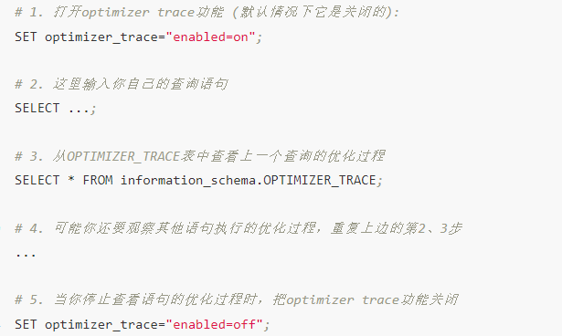
  - 输入我们想要查看优化过程的查询语句，当该查询语句执行完成后，就可以到information_schema 数据库下的 OPTIMIZER_TRACE 表中查看完整的优化过程
    - OPTIMIZER_TRACE 有 4 个列
      - QUERY：表示我们的查询语句
      - TRACE：表示优化过程的JSON格式文本
      - MISSING_BYTES_BEYOND_MAX_MEM_SIZE：由于优化过程可能会输出很多，如果超过某个限制时，多余的文本将不会被显示，这个字段展示了被忽略的文本字节数
      - INSUFFICIENT_PRIVILEGES：表示是否没有权限查看优化过程，默认值是0，只有某些特殊情况下才会是1
- InnoDB Buffer Pool
  - 为了缓存磁盘中的页，在 MySQL 服务端程序启动的时候就向操作系统申请了一片连续的内存，称为Buffer Pool
    - Buffer Pool 不仅用来缓存页，还存储了其他信息，例如锁信息、自适应哈希索引等
  - Buffer Pool 的大小由启动选项 innodb_buffer_pool_size 设置（单位是字节），最小为 5 MB，默认为 128MB
  - 内部组成
    - 默认的缓存页大小和磁盘上默认的页大小是一样的
    - 为了管理这些缓存页，为每个缓存页都创建了控制信息
      - 每个控制信息占用的内存大小是相同的，将其占用的内存块称为控制块
        - 每个控制块大约占用缓存页大小的5%，在MySQL5.7.21这个版本中，每个控制块占用的大小是808字节。而我们设置的innodb_buffer_pool_size并不包含这部分控制块占用的内存空间大小，也就是说InnoDB在为Buffer Pool向操作系统申请连续的内存空间时，这片连续的内存空间一般会比innodb_buffer_pool_size的值大5%左右
    - 控制块与缓存页的空间布局 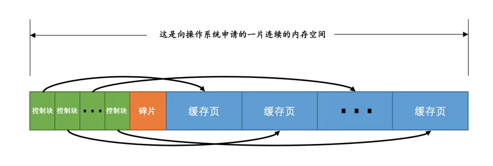
    - 控制块的内部组成
      - free 链表
        - Buffer Pool 中所有空闲的缓冲页都加入到这个链表中
        - free 链表的基节点不位于 Buffer Pool 中，而是一个单独的内存中
        - 图解 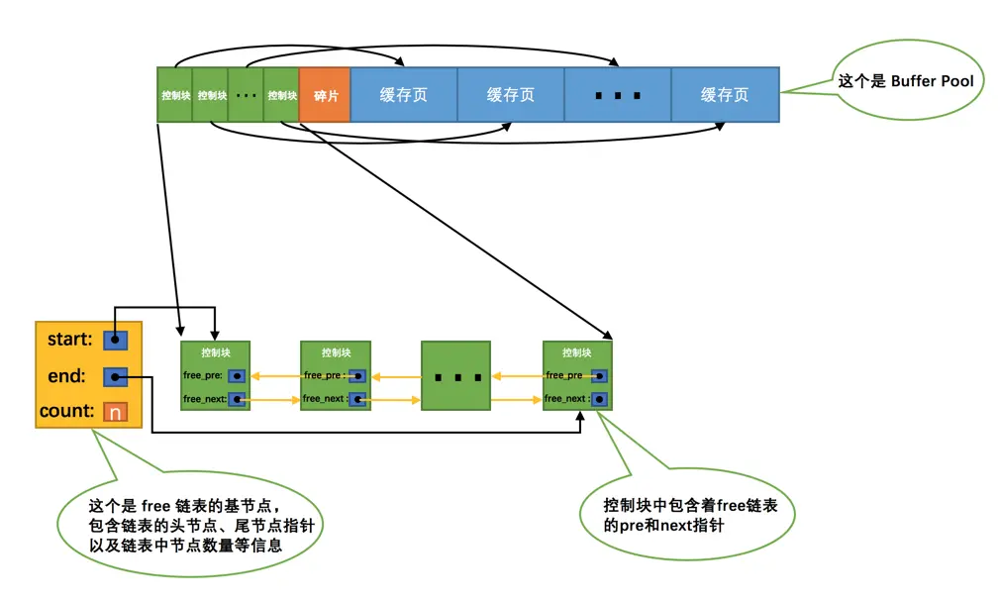
      - flush 链表
        - 管理缓存页的 dirty page
        - 图解 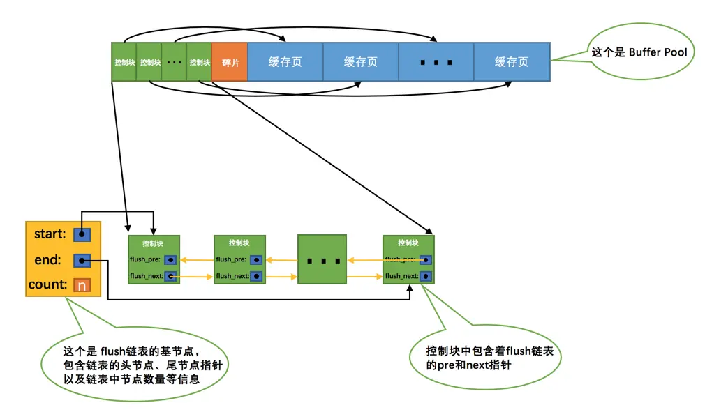
      - LRU （Least Recently Used）链表
        - 使用 LRU 算法来确定当 Buffer Pool 缓冲池的内存不够时，交换哪些缓存页到磁盘中去
        - InnoDB 会将使用到的缓存页对应的控制块加入到 LRU 链表的头部
          - 如果该控制块本身就在 LRU 链表中，则将其移动到头部
          - 如果不在 LRU 链表，则将其插入头部
        - 预读机制为 LRU 算法带来的问题
          - 线性预读
            - InnoDB 提供了一个环境变量 innodb_read_ahead_threshold，如果顺序访问某个区的页面超过了这个系统变量的值，就会触发一次异步读取下一个区中的全部页面到 Buffer Pool 的请求
              - 默认值为 56
          - 随机预读
            - 如果Buffer Pool中已经缓存了某个区的13个连续的页面，不论这些页面是不是顺序读取的，都会触发一次异步读取该区中所有页面到Buffer Pool的请求
            - innodb_random_read_ahead系统变量，它的默认值为OFF，也就意味着InnoDB并不会默认开启随机预读的功能，如果想开启该功能，可以通过修改启动参数或者直接使用SET GLOBAL命令把该变量的值设置为ON
        - 全表扫描为 LRU 算法带来的问题
          - 如果该表的页面很多，替换了 Buffer Pool 中缓存页的大多数，这样，就会导致当访问其他表的时候缓存命中率降低
        - LRU 优化
          - 使用频率非常高的缓存页，称为热数据或者 young 区域
          - 使用频率不是很高的缓存页，称为冷数据或者 old 区域
          - 图解 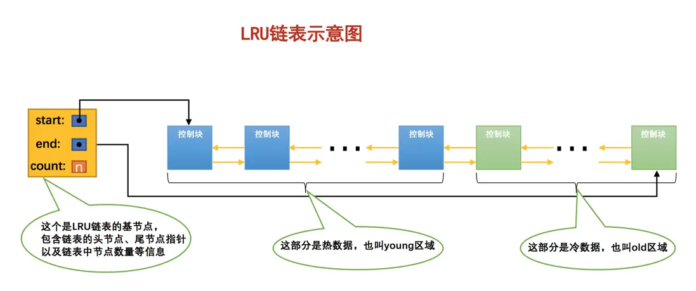
          - 比例由系统变量或者启动选项 innodb_old_blocks_pct 来控制，默认是 37
          - 针对上述两个问题的优化
            - 当磁盘上的某个页面在初次加载到 Buffer Pool 中的某个缓存页时，该缓存页对应的控制块会被放到 old 区域的头部。这样针对预读到 Buffer Pool 却不进行后续访问的页面就会被逐渐从 old 区域逐出，而不会影响 young 区域中被使用比较频繁的缓存页
            - 在对某个处在old区域的缓存页进行第一次访问时就在它对应的控制块中记录下来这个访问时间，如果后续的访问时间与第一次访问的时间在某个时间间隔内，那么该页面就不会被从old区域移动到young区域的头部，否则将它移动到young区域的头部
              - InnoDB 规定每次去页面中读取一条记录时，都算是访问一次页面，而一个页面中可能会包含很多条记录，也就是说读取完某个页面的记录就相当于访问了这个页面好多次
              - 该时间间隔由 innodb_old_blocks_time 控制
                - 默认是 1000，即 1s
              - 这是针对全表扫描的优化
                - 因为全表扫描即使在某个页面中有很多条记录，但是，其每次访问一条记录的时间间隔一般都很低
          - 其他优化
            - 只有被访问的控制块位于 young 区域的 1/4 的后面，才会将其移动到 LRU 链表的头部
            - 要求触发随机预读的 13 个页面都位于 young 区域的头 1/4 处才会触发
      - 其它链表
        - unzip LRU 链表
        - zip clean 链表
        - zip free 链表
  - Hash 表
    - 用于快速确定 Buffer Pool 中是否有需要的页
    - 使用 &lt;表空间号&gt; + &lt;页号&gt; 作为 hash 表的 key
    - 使用 &lt;缓存页控制块的指针&gt; 作为 value
  - flush dirty page
    - 有专门的线程每隔一段时间把 dirty page 刷新到磁盘上，有多种途径
      - BUF_FLUSH_LRU: 从 LRU 链表的 old 区域 flush 一部分页
        - 线程会定时从 LRU 链表尾部开始扫描系统变量innodb_lru_scan_depth 个页面，如果遇到 dirty page，则将其 flush 到磁盘中
      - BUF_FLUSH_LIST: 从 flush 链表中 flush 一部分页面
      - BUF_FLUSH_SINGLE_PAGE：准备加载一个页到 Buffer Pool 中时，没有可用空间时去 LRU 链表尾部找不到一个不是 dirty page 的页，这时，不得不将一个 dirty page flush
  - 多个 Buffer Pool 实例
    - 在多线程环境下，访问Buffer Pool中的各种链表都需要加锁处理，在Buffer Pool特别大而且多线程并发访问特别高的情况下，单一的 Buffer Pool可能会影响请求的处理速度。所以在Buffer Pool特别大的时候，我们可以把它们拆分成若干个小的Buffer Pool，每个Buffer Pool都称为一个实例，它们都是独立的，独立的去申请内存空间，独立的管理各种链表
    - 可以指定 innodb_buffer_pool_instances 的值来修改 Buffer Pool 的实例个数
    - 当 innodb_buffer_pool_size 的值小于 1G 的时候设置多个实例是无效的，InnoDB 会默认把innodb_buffer_pool_instances 的值修改为1
    - 每个 Buffer Pool 实例的占用内存大小是： innodb_buffer_pool_size / innodb_buffer_pool_instances
  - 为了支持可以在程序运行时调整 Buffer Pool 的大小，而提出 innodb_buffer_pool_chunk_size
    - 当调整 Buffer Pool 大小时，要重新向操作系统申请一块连续的内存空间，然后将 Buffer Pool 的内容复制到这一区域中
    - 由于单独申请一块很大的内存很费时，所以，以innodb_buffer_pool_chunk_size 字节为一个 chunk，以此来向操作系统申请空间
    - 图解 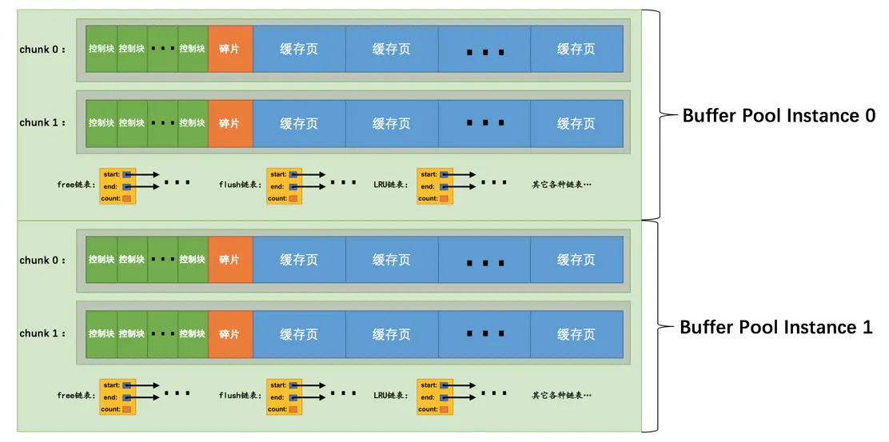
    - innodb_buffer_pool_chunk_size 的值只能在服务器启动时指定
  - 配置 Buffer Pool 的注意事项
    - innodb_buffer_pool_size必须是innodb_buffer_pool_chunk_size × innodb_buffer_pool_instances的倍数（这主要是想保证每一个Buffer Pool实例中包含的chunk数量相同）
    - 如果在服务器启动时，innodb_buffer_pool_chunk_size × innodb_buffer_pool_instances的值已经大于innodb_buffer_pool_size的值，那么innodb_buffer_pool_chunk_size的值会被服务器自动设置为innodb_buffer_pool_size/innodb_buffer_pool_instances的值
  - 查看 Buffer Pool 的状态信息
    - 使用 SHOW ENGINE INNODB STATUS 语句来查看关于 InnoDB 存储引擎的状态信息，包括了 Buffer Pool 的相关信息
    - Buffer Pool 相关信息 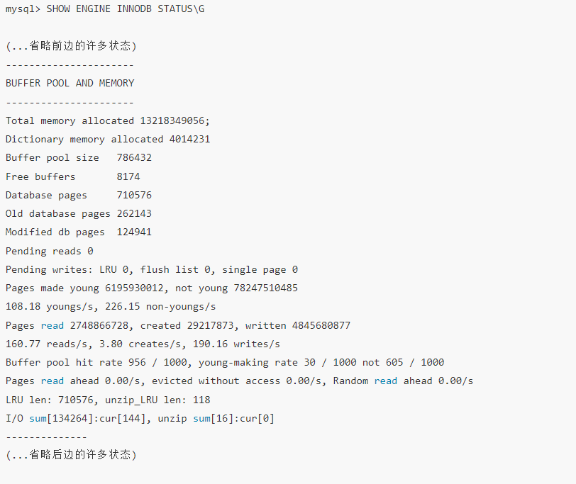
      - Total memory allocated
        - 代表Buffer Pool向操作系统申请的连续内存空间大小，包括全部控制块、缓存页、以及碎片的大小
      - Dictionary memory allocated
        - 为数据字典信息分配的内存空间大小，注意这个内存空间和 Buffer Pool 没关系，不包括在Total memory allocated中
      - Buffer pool size
        - 代表该 Buffer Pool 可以容纳多少缓存页，注意，单位是页
      - Free buffers
        - 代表当前Buffer Pool还有多少空闲缓存页，也就是free链表中还有多少个节点
      - Database pages
        - 代表 LRU 链表中的页的数量，包含young和old两个区域的节点数量
      - Old database pages
        - 代表LRU链表old区域的节点数量
      - Modified db pages
        - 代表脏页数量，也就是flush链表中节点的数量
      - Pending reads
        - 正在等待从磁盘上加载到Buffer Pool中的页面数量
        - 当准备从磁盘中加载某个页面时，会先为这个页面在Buffer Pool中分配一个缓存页以及它对应的控制块，然后把这个控制块添加到LRU的old区域的头部，但是这个时候真正的磁盘页并没有被加载进来，Pending reads的值会跟着加1
      - Pending writes LRU
        - 即将从LRU链表中刷新到磁盘中的页面数量
      - Pending writes flush list
        - 即将从flush链表中刷新到磁盘中的页面数量
      - Pending writes single page
        - 即将以单个页面的形式刷新到磁盘中的页面数量
      - Pages made young
        - 代表LRU链表中曾经从old区域移动到young区域头部的节点数量
        - 一个节点每次只有从old区域移动到young区域头部时才会将Pages made young的值加1，也就是说如果该节点本来就在young区域，由于它符合在young区域1/4后边的要求，下一次访问这个页面时也会将它移动到young区域头部，但这个过程并不会导致Pages made young的值加1
      - Page made not young
        - 在将innodb_old_blocks_time设置的值大于0时，首次访问或者后续访问某个处在old区域的节点时由于不符合时间间隔的限制而不能将其移动到young区域头部时，Page made not young的值会加1
      - youngs/s
        - 代表每秒从old区域被移动到young区域头部的节点数量
      - non-youngs/s
        - 代表每秒由于不满足时间限制而不能从old区域移动到young区域头部的节点数量
      - Pages read、created、written
        - 代表读取，创建，写入了多少页。后边跟着读取、创建、写入的速率
      - Buffer pool hit rate
        - Buffer pool hit rate：表示在过去某段时间，平均访问1000次页面，有多少次该页面已经被缓存到Buffer Pool
      - young-making rate
        - 表示在过去某段时间，平均访问1000次页面，有多少次访问使页面移动到young区域的头部
      - not (young-making rate)
        - 表示在过去某段时间，平均访问1000次页面，有多少次访问没有使页面移动到young区域的头部
      - LRU len
        - 代表LRU链表中节点的数量
      - unzip_LRU
        - 代表unzip_LRU链表中节点的数量
      - I/O sum
        - 最近50s读取磁盘页的总数
      - I/O cur
        - 现在正在读取的磁盘页数量
      - I/O unzip sum
        - 最近50s解压的页面数量
      - I/O unzip cur
        - 正在解压的页面数量
- redo 日志
  - 目的：让已经提交了事务的所做的操作在即使系统崩溃后，重启后也能将数据恢复过来
  - 优势
    - redo 日志占用的空间小
    - redo 日志是顺序写入磁盘的
      - 在执行事务的过程中，每执行一条语句，就可能产生若干条 redo 日志，这些日志是按照产生的顺序写入磁盘的，也就是使用顺序 IO
  - redo 日志格式与类型
    - 通用格式
      - 图解 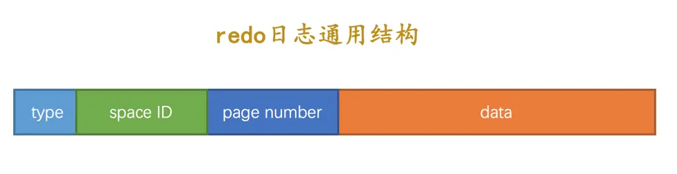
        - type
          - redo 日志的类型
        - space ID
          - 表空间 ID
        - page number
          - 页号
        - data
          - redo 日志的具体内容
    - 类型
      - MLOG_1BYTE（type = 1）
        - 在页面的某个偏移量处写入1个字节
      - MLOG_2BYTE（type = 2）
        - 在页面的某个偏移量处写入2个字节
      - MLOG_4BYTE（type = 4）
        - 在页面的某个偏移量处写入4个字节
      - MLOG_8BYTE（type = 8）
        - 在页面的某个偏移量处写入8个字节
        - 图解 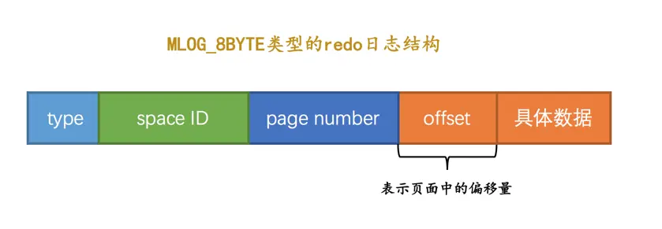
      - MLOG_WRITE_STRING（type = 30）
        - 在页面的某个偏移量处写入一串数据
        - 图解 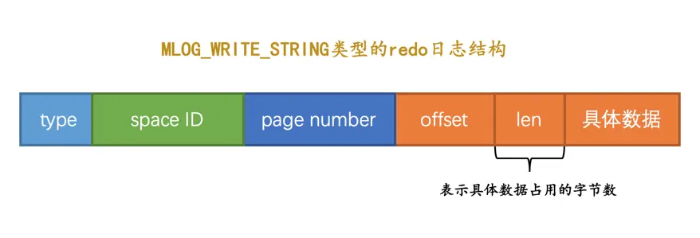
      - MLOG_REC_INSERT（type = 9）
        - 表示插入一条使用非紧凑行格式的记录
        - Redundant 是一种比较原始的行格式，它就是非紧凑的
      - MLOG_COMP_REC_INSERT（type = 38）
        - 表示插入一条使用紧凑行格式的记录
        - Compact、Dynamic 以及 Compressed 行格式是较新的行格式，它们是紧凑的（占用更小的存储空间）
        - 示意图 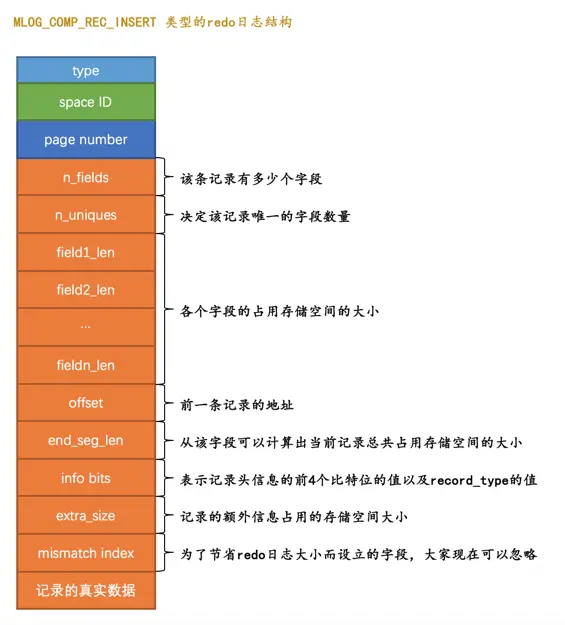
          - n_uniques 的值的含义是在一条记录中，需要几个字段的值才能确保记录的唯一性
            - 对于聚簇索引来说，n_uniques的值为主键的列数，对于其他二级索引来说，该值为索引列数+主键列数。这里需要注意的是，唯一二级索引的值可能为NULL，所以该值仍然为索引列数+主键列数
          - field1_len ~ fieldn_len 代表着该记录若干个字段占用存储空间的大小，需要注意的是，这里不管该字段的类型是固定长度大小的，还是可变长度大小，该字段占用的大小始终要写入redo日志中
          - offset代表的是该记录的前一条记录在页面中的地址
            - 因为每向数据页插入一条记录，都需要修改该页面中维护的记录链表，每条记录的记录头信息中都包含一个称为next_record的属性，所以在插入新记录时，需要修改前一条记录的next_record属性
          - end_seg_len
            - 一条记录其实由额外信息和真实数据这两部分组成，这两个部分的总大小就是一条记录占用存储空间的总大小。通过end_seg_len的值可以间接的计算出一条记录占用存储空间的总大小
          - mismatch_index
            - 为了节省redo日志的大小而设立
      - MLOG_COMP_PAGE_CREATE（type = 58）
        - 表示创建一个存储紧凑行格式记录的页面
      - MLOG_COMP_REC_DELETE（type = 42）
        - 表示删除一条使用紧凑行格式记录
      - MLOG_COMP_LIST_START_DELETE（type = 44）
        - 表示从某条给定记录开始删除页面中的一系列使用紧凑行格式记录
      - MLOG_COMP_LIST_END_DELETE（type = 43）
        - 表示删除一系列记录直到MLOG_COMP_LIST_END_DELETE类型的redo日志对应的记录为止
      - MLOG_ZIP_PAGE_COMPRESS（type = 51）
        - 表示压缩一个数据页
  - redo 日志组
    - 有些时候，插入一条记录时会产生多条 redo 日志，而插入一条记录这个操作应该是原子操作，不然，会导致 redo 出来的 B+ 树不正确
    - 执行原子操作时，为了保证原子性，必须使用组来记录日志，每个组以日志类型为 MLOG_MULTI_REC_END（type = 31） 的日志结束
      - MLOG_MULTI_REC_END 结构示意图 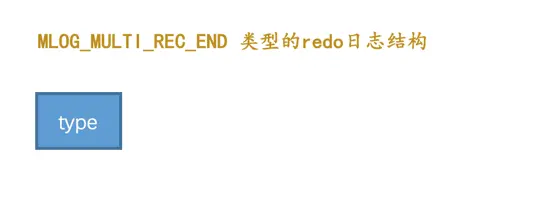
    - 当系统崩溃后，只有当解析到类型为 MLOG_MULTI_REC_END 的 redo 日志才认为解析到了一组完整的 redo 日志，否则就直接丢弃前面已经解析到的 redo 日志
    - 为了节省空间，对于一条 redo 日志就是一组的情况，type 的第一个比特用来标识这条 redo 日志是否就是单独的一个组
      - type 字段图解 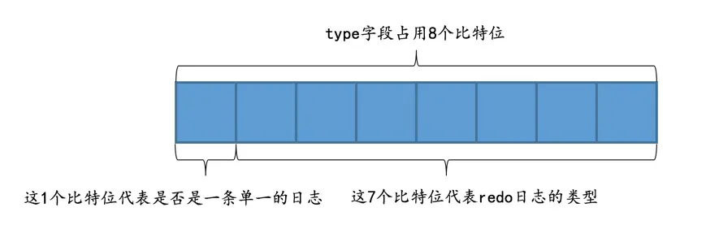
  - Mini-Transaction
    - 对底层页面的一次原子访问的过程称为 Mini-Transaction，简称 mtr
    - 一个事务可以包含若干条语句，每一条语句由若干个 mtr 组成，一个 mtr 包含一组 redo 日志
      - 图解事务的组成 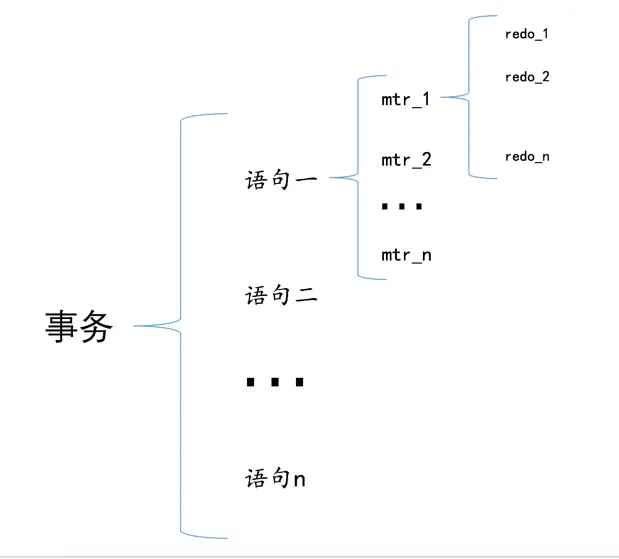
  - redo 日志文件组
    - 磁盘上的 redo 日志文件不止有一个，而是以一个日志文件组的形式出现。这些文件以 ib_logfile[0...]的形式命名
    - 可以通过启动参数 innodb_log_files_in_group 来指定 redo 日志文件的个数，默认为 2，最大值为 100
    - 可以通过启动参数 innodb_log_file_size 指定每个 redo 日志文件的大小
    - 可以通过启动参数 innodb_log_group_home_dir 来指定 redo 日志文件所在的目录，默认是数据目录
    - 日志文件组中的每个日志文件形成了一个环，当一个日志文件写满的时候，就会继续从此环的下一个日志文件中继续写 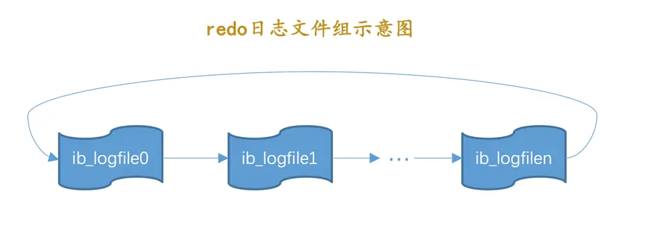
      - 为了避免后写入的 redo 日志覆盖掉前面的 redo 日志，提出了 checkpoint 的概念
    - 每个日志文件的格式
      - 图解格式 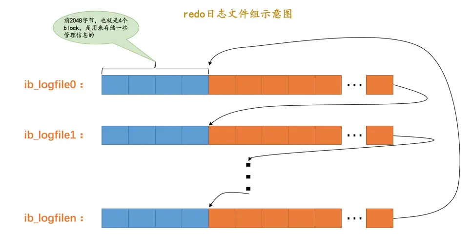
      - 前 2048 字节
        - 占用 4 个 log block的大小
        - 示意图 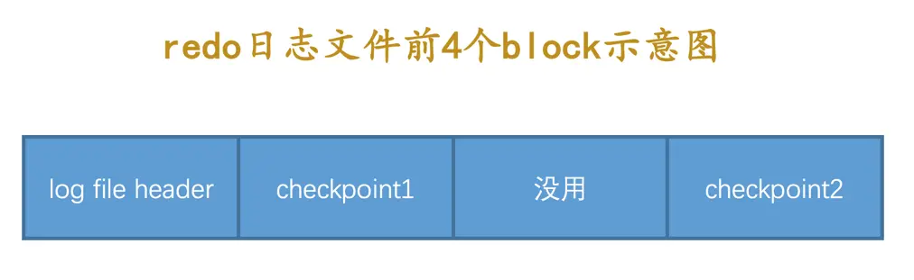
        - log file header
          - 图解 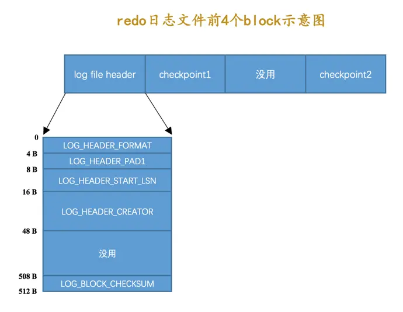
          - 各个字段释义 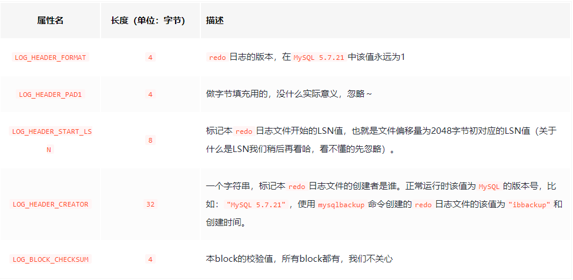
        - checkpoint
          - 图解 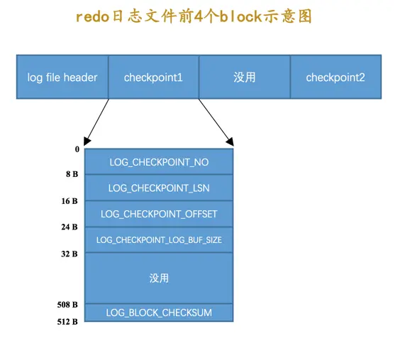
          - 各个字段释义 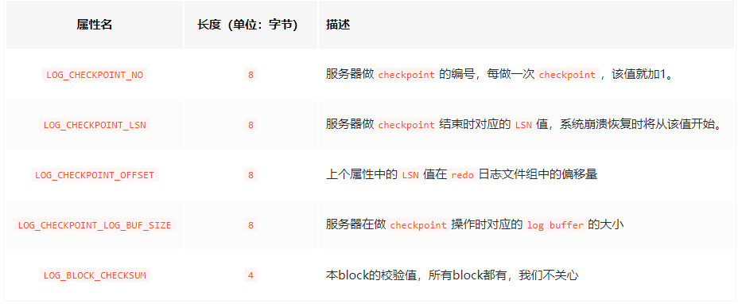
      - 2048 字节以后
        - 用来存储 log buffer 中的 log block
  - redo 日志的写入
    - redo block
      - 把通过 mtr 生成的 redo 日志都放在了大小为 512 字节的页中，这个页称为 block
      - block 图解 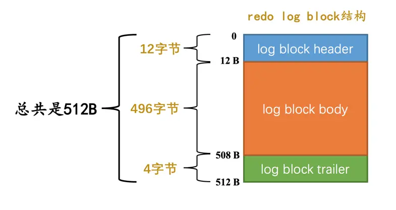
        - log block header 和 log block trailer
          - 图解 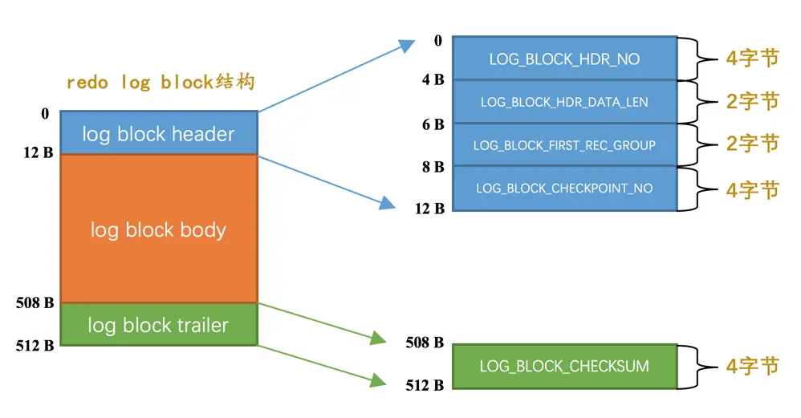
          - log block header
            - LOG_BLOCK_HDR_NO
              - 每一个block都有一个大于0的唯一标号，本属性就表示该标号值
              - 其第一个 bit 位称为 flush bit，如果该值为1，代表着本block是在某次将log buffer中的block刷新到磁盘的操作中的第一个被刷入的block
              - 其值等于 ((lsn / 512) & 0x3FFFFFFFUL) + 1
                - lsn 是初次使用该 block 时系统的 lsn 的值
                - 0x3FFFFFFFUL 的二进制表示 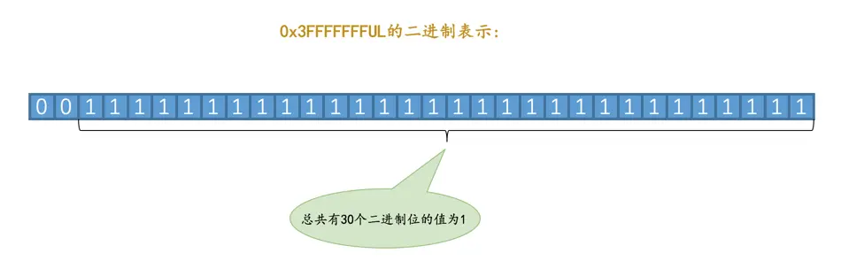
                - 这样的操作保证了 LOG_BLOCK_HDR_NO 在 0 ~0x40000000UL（1 GB） 之间，也就是说系统最多能产生不重复的LOG_BLOCK_HDR_NO值只有1GB个
                - InnoDB规定redo日志文件组中包含的所有文件大小总和不得超过512GB，一个block大小是512字节，也就是说redo日志文件组中包含的block块最多为1GB个，所以有1GB个不重复的编号值也就够用了
            - LOG_BLOCK_HDR_DATA_LEN
              - 表示block中已经使用了多少字节，初始值为12（因为log block body从第12个字节处开始）
              - 随着往block中写入的redo日志越来也多，本属性值也跟着增长。如果log block body已经被全部写满，那么本属性的值被设置为 512
            - LOG_BLOCK_FIRST_REC_GROUP
              - 代表该block中第一个mtr生成的redo日志记录组的偏移量（其实也就是这个block里第一个mtr生成的第一条redo日志的偏移量）
            - LOG_BLOCK_CHECKPOINT_NO
              - checkpoint的序号
          - log block trailer
            - LOG_BLOCK_CHECKSUM
              - 表示block的校验值，用于正确性校验
    - Log Sequence Number （LSN）日志序列号
      - 是一个全局变量，用来表示写入 log buffer 中的日志量，初始值是 8704
      - 系统第一次启动初始化时 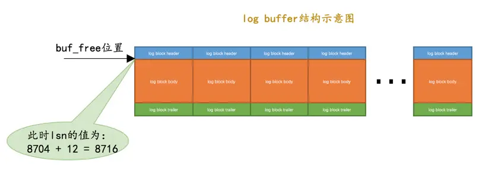
      - Log buffer 中插入一个 mtr log 日志组时 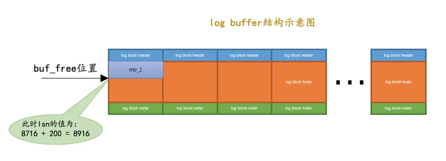
        - mtr 1 占据 200 字节的大小
      - Log buffer 中插入一个比较大的日志组时 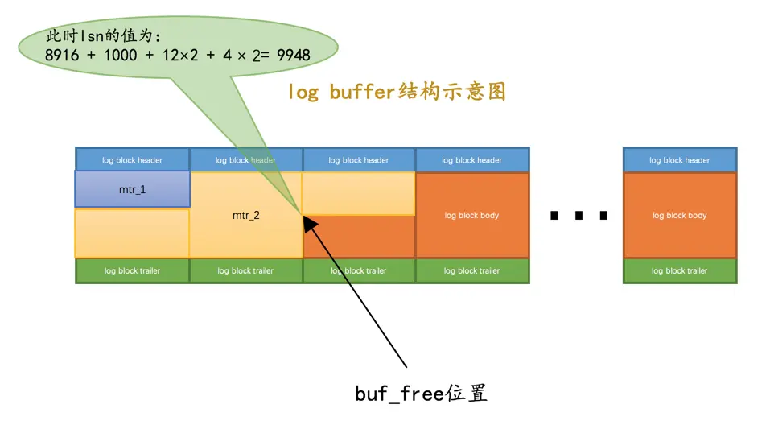
        - log block header 占用 12 byte
        - log block trailer 占用 4 byte
    - redo log buffer（log buffer）
      - 服务端程序启动时就向操作系统申请的一片内存空间，此段空间被划分为若干个连续的 redo log block
      - 空间示意图 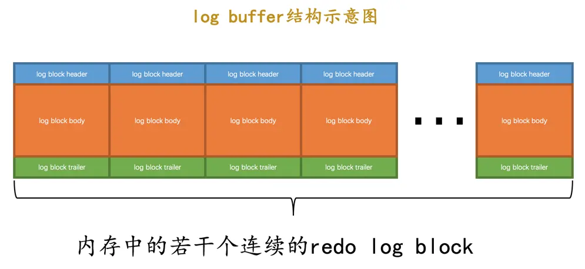
      - 可以通过启动参数 innodb_log_buffer_size 来指定 log buffer 的大小，默认为 16 MB
    - redo 日志的写入 log buffer 过程
      - 向 log buffer 写入日志的过程是顺序的。InnoDB 维护了一个全局变量 buf_free，指示后续写入的 redo 日志应该写入到 log_buffer中的哪个位置
      - 图解写入过程 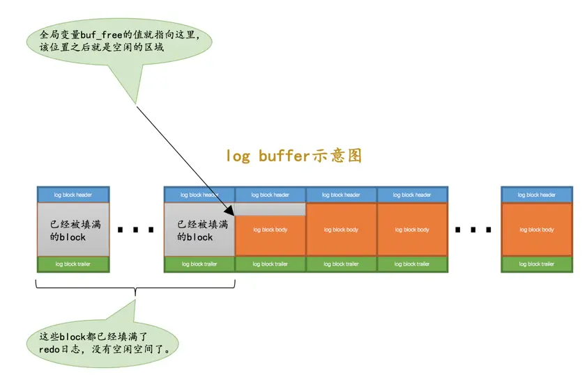
      - mtr 产生的一组日志并不是每产生一条就将其写入 log buffer，而是先暂存在别的地方，然后当 mtr 结束后，在将一组日志全部复制到 log buffer 中
        - 不同的颜色代表不同的 mtr 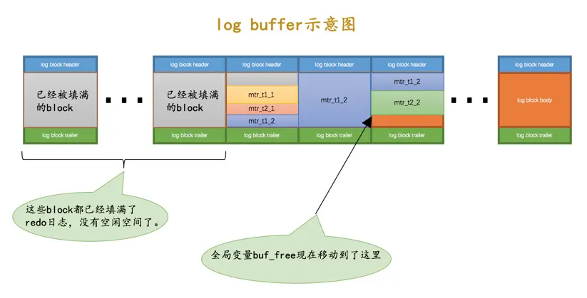
    - redo 日志从 log buffer 写入到 log file 的过程
      - InnoDB 会维护一个全局变量 buf_next_to_write，标记当前 log buffer 中已经有哪些日志文件被刷新到磁盘中 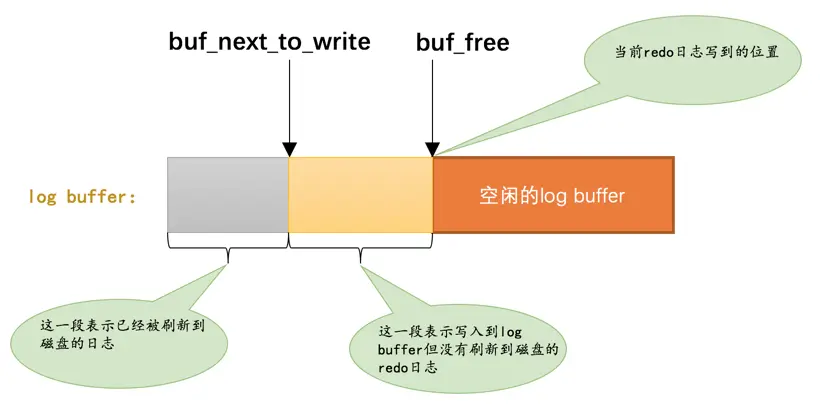
      - InnoDB 还会维护一个全局变量 flushed_to_disk_lsn 用来标识属性到磁盘中的日志量，其初始值也是 8704
      - 系统第一次启动时 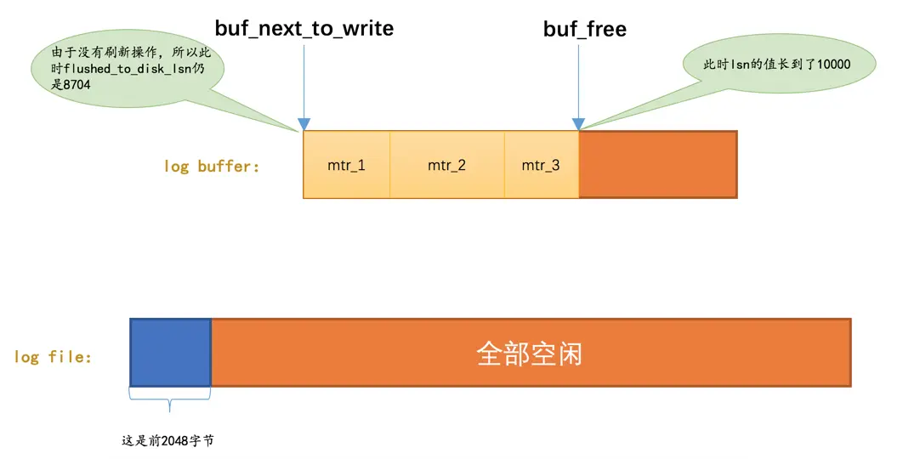
      - 刷新一部分日志到 redo 直至文件中 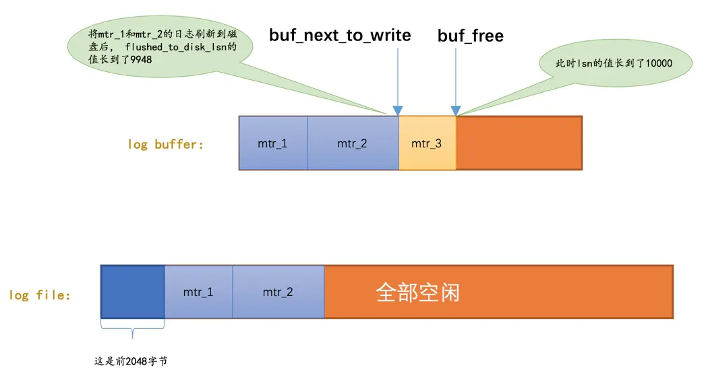
        - 应用程序向磁盘写入文件时其实是先写到操作系统的缓冲区中去，如果某个写入操作要等到操作系统确认已经写到磁盘时才返回，那需要调用一下操作系统提供的fsync函数。其实只有当系统执行了fsync函数后，flushed_to_disk_lsn的值才会跟着增长，当仅仅把log buffer中的日志写入到操作系统缓冲区却没有显式的刷新到磁盘时，另外的一个称之为write_lsn的值跟着增长
    - 何时从 log buffer 中写入到 log file 中？
      - 为了保证事务的持久性，用户线程在事务提交时需要将该事务执行过程中产生的所有redo日志都刷新到磁盘上
      - 对事务的持久性要求不是那么强烈的话，可以选择修改一个称为innodb_flush_log_at_trx_commit的系统变量的值，该变量有3个可选的值
        - 0
          - 该系统变量值为0时，表示在事务提交时不立即向磁盘中同步redo日志，这个任务是交给后台线程做的
        - 1
          - 当该系统变量值为1时，表示在事务提交时需要将redo日志同步到磁盘，可以保证事务的持久性。1也是innodb_flush_log_at_trx_commit的默认值
        - 2
          - 当该系统变量值为2时，表示在事务提交时需要将redo日志写到操作系统的缓冲区中，但并不需要保证将日志真正的刷新到磁盘
  - mtr 与 buffer pool 中的 flush 链表
    - 当一个 mtr 结束时，除了要将 redo 日志写入到 log buffer 中，还要将修改过的页面加入到 buffer pool 中的 flush 链表中
      - 回顾 flush 链表 
    - 插入 flush 链表的过程
      - 当第一次修改某个缓存在Buffer Pool中的页面时，就会把这个页面对应的控制块插入到flush链表的头部，之后再修改该页面时由于它已经在flush链表中了，就不再次插入了
      - 所以，flush链表中的脏页是按照页面的第一次修改时间从大到小进行排序的
      - 在这个过程中，会在缓存页对应的控制块中记录 2 个关于这个页面何时修改的属性
        - oldest_modification
          - 如果某个页面被加载到Buffer Pool后进行第一次修改，那么就将修改该页面的mtr开始时对应的lsn值写入这个属性
        - newest_modification
          - 每修改一次页面，都会将修改该页面的mtr结束时对应的lsn值写入这个属性。也就是说该属性表示页面最近一次修改后对应的系统lsn值
      - 过程图解
        - 刚开始，mtr 1 只修改了 a 页 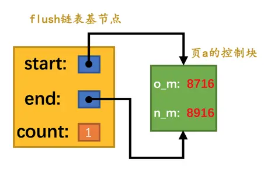
        - mtr2 修改了页 b 和页 c 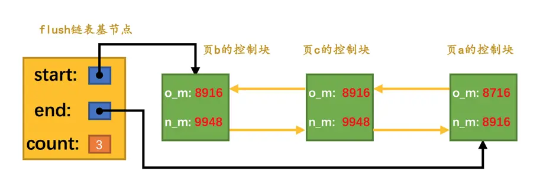
        - mtr3 同时修改了页 d 和页 b 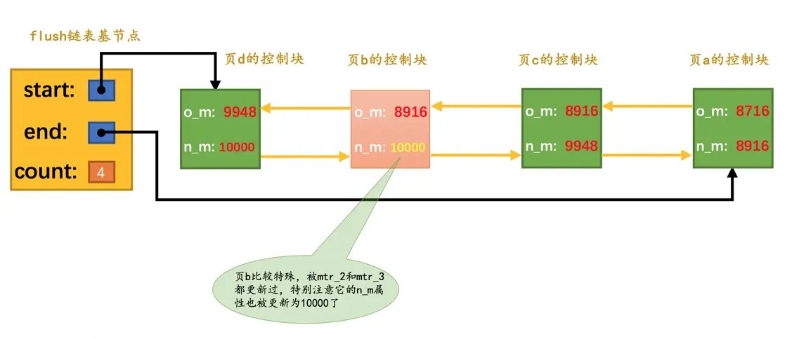
  - checkpoint
    - 判断某些redo日志占用的磁盘空间是否可以覆盖的依据就是它对应的脏页是否已经刷新到磁盘里
      - mtr1 和 mtr2 对应的日志文件被属性到磁盘中，但是，其脏页没有被刷入到磁盘中，所以，此时磁盘上对应的日志是不可以被覆盖的 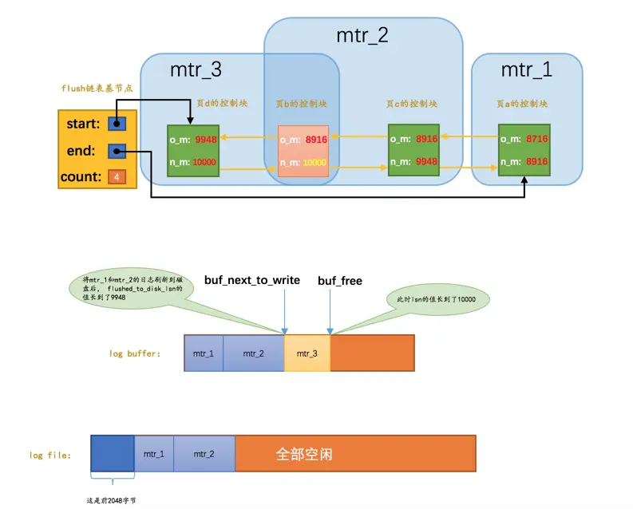
      - 页 a 被刷入到磁盘中，此时， mtr 1 对应磁盘上的 redo 日志就是可以覆盖的 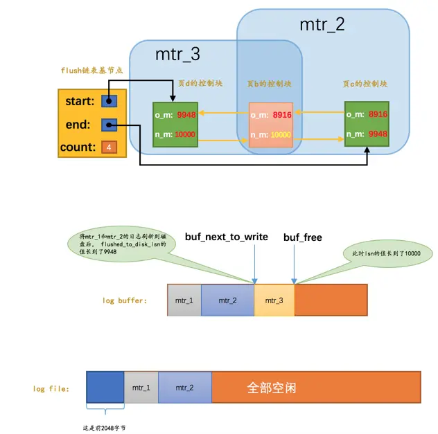
    - InnoDB 维护了一个全局变量 checkpoint_lsn，表示当前系统中可覆盖的 redo 日志量是多少。初始值也是 8704
      - 当 mtr1 对应的脏页 a 刷新到磁盘中时，checkpoint_lsn 就会增加 
      - checkpoint_lsn 增加的过程（做一次 checkpoint）
        - 1.计算当前系统中可以被覆盖的 redo 日志对应的 lsn 值最大值是多少
          - redo日志可以被覆盖，意味着它对应的脏页被刷到了磁盘，只要我们计算出当前系统中被最早修改的脏页对应的oldest_modification值，那凡是在系统lsn值小于该节点的oldest_modification值时产生的redo日志都是可以被覆盖掉的，我们就把该脏页的oldest_modification赋值给checkpoint_lsn
        - 2.将checkpoint_lsn和对应的redo日志文件组偏移量以及此次checkpoint的编号写到日志文件的管理信息（就是checkpoint1或者checkpoint2）中
        - 3.将 checkpoint_no 全局变量增加 1。该变量表示目前系统做了多少次 checkpoint
      - 此时对应的 log file 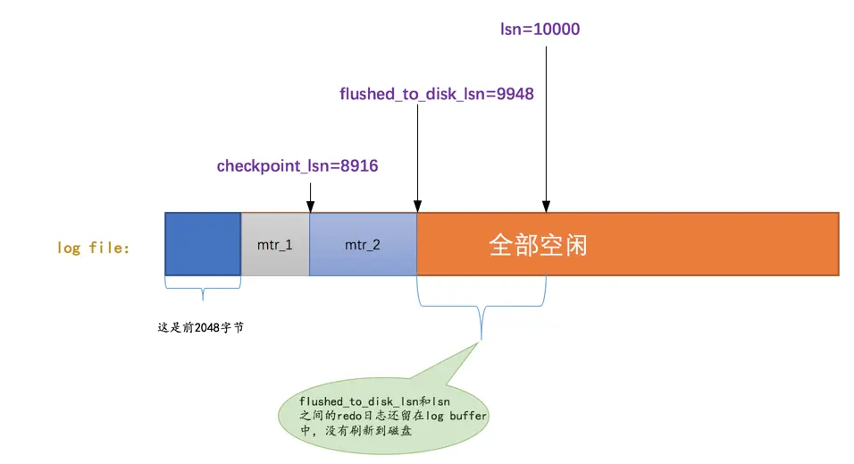
  - 查看系统中各种 LSN 值
    - 输出示例 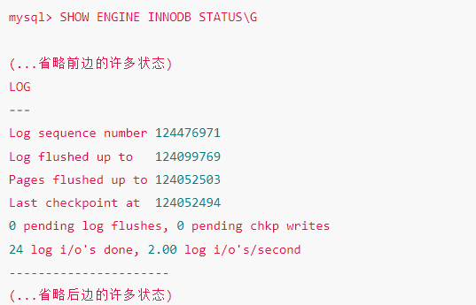
      - Log sequence number
        - 代表系统中的lsn值，也就是当前系统已经写入的redo日志量，包括写入log buffer中的日志
      - Log flushed up to
        - 代表flushed_to_disk_lsn的值，也就是当前系统已经写入磁盘的redo日志量
      - Pages flushed up to
        - 代表flush链表中被最早修改的那个页面对应的oldest_modification属性值
      - Last checkpoint at
        - 当前系统的checkpoint_lsn值
  - 如何利用 redo log 来从崩溃中恢复？
    - 1\. 确定恢复起点
      - 对于checkpoint_lsn之后的redo日志，它们对应的脏页可能没被刷盘，也可能被刷盘了，我们不能确定，所以需要从checkpoint_lsn开始读取redo日志来恢复页面
      - 如何确定 checkpoint_lsn？
        - redo日志文件组的第一个文件的管理信息中有两个block都存储了checkpoint_lsn的信息，我们要选取最近发生的那次checkpoint的信息
        - 衡量checkpoint发生时间早晚的信息就是checkpoint_no，只要把checkpoint1和checkpoint2这两个block中的checkpoint_no值读出来比一下大小，哪个的checkpoint_no值更大，说明哪个block存储的就是最近的一次checkpoint信息
        - 这样我们就能拿到最近发生的checkpoint对应的checkpoint_lsn值以及它在redo日志文件组中的偏移量checkpoint_offset
    - 2\. 确定恢复终点
      - 从上一步得出的 checkpoint_offset 开始，顺序读取 log block，然后直到遇到某一个 block 的 block header 中的 LOG_BLOCK_HDR_DATA_LEN 属性不为 512，此时，这个 block 就是最后的一个 block
    - 3\. 开始恢复 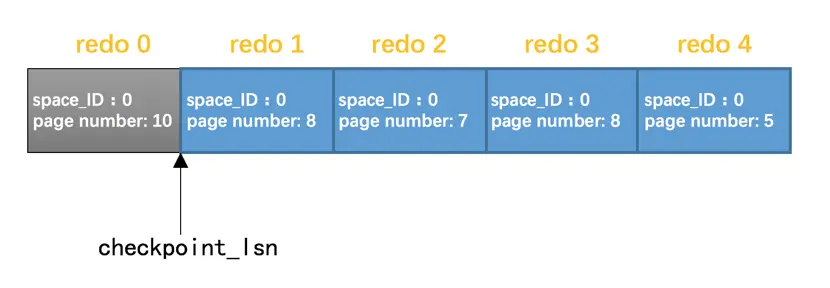
      - 3.1 构建一个哈希表
        - 使用 redo 日志的 space ID 和 page number 属性当做 hash key，redo log当做 hash value。如果 hash key 相同，则将 redo log 用链表按照先后顺序连接起来
        - 图解 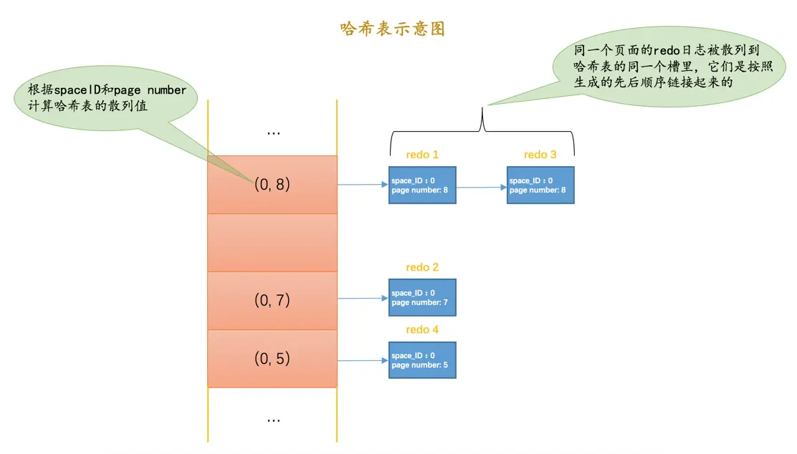
      - 3.2 扫描哈希表
        - 之后就可以遍历哈希表，因为对同一个页面进行修改的redo日志都放在了一个槽里，所以可以一次性将一个页面修复好（避免了很多读取页面的随机IO），这样可以加快恢复速度
        - 3.2.1 跳过已经刷入磁盘的页
          - 在最近做的一次checkpoint后，可能后台线程又不断的从LRU链表和flush链表中将一些脏页刷出Buffer Pool。这些在checkpoint_lsn之后的redo日志，如果它们对应的脏页在崩溃发生时已经刷新到磁盘，那在恢复时也就没有必要根据redo日志的内容修改该页面了
          - 每个页面都有一个称之为File Header的部分，在File Header里有一个称之为FIL_PAGE_LSN的属性，该属性记载了最近一次修改页面时对应的lsn值（其实就是页面控制块中的newest_modification值）。如果在做了某次checkpoint之后有脏页被刷新到磁盘中，那么该页对应的FIL_PAGE_LSN代表的lsn值肯定大于checkpoint_lsn的值，凡是符合这种情况的页面就不需要重复执行lsn值小于FIL_PAGE_LSN的redo日志了，所以更进一步提升了崩溃恢复的速度
- undo 日志
  - 目的：使用 undo 日志支持回滚操作
  - 事务 id
    - 如果某个事务执行过程中对某个表执行了增、删、改操作，那么InnoDB存储引擎就会给它分配一个独一无二的事务id
      - 对于只读事务来说，只有在它第一次对某个用户创建的临时表执行增、删、改操作时才会为这个事务分配一个事务id，否则的话是不分配事务id的
      - 对于读写事务来说，只有在它第一次对某个表（包括用户创建的临时表）执行增、删、改操作时才会为这个事务分配一个事务id，否则的话也是不分配事务id的
    - 事务 id 是如何生成的？
      - 服务器会在内存中维护一个全局变量，每当需要为某个事务分配一个事务id时，就会把该变量的值当作事务id分配给该事务，并且把该变量自增1
      - 当这个变量的值为256的倍数时，就会将该变量的值刷新到系统表空间的页号为5的页面中一个称之为Max Trx ID的属性处，这个属性占用8个字节的存储空间
      - 当系统下一次重新启动时，会将上边提到的Max Trx ID属性加载到内存中，将该值加上256之后赋值给我们前边提到的全局变量（因为在上次关机时该全局变量的值可能大于Max Trx ID属性值）
    - 行格式中的 trx_id 隐藏列 
      - 某个对这个聚簇索引记录做改动的语句所在的事务对应的事务 id
  - undo 日志
    - undo 日志会从 0 开始编号，这个编号被称为 undo no
    - undo 日志被记录到类型为 FIL_PAGE_UNDO_LOG 的页面中
    - 行格式中 roll_pointer 隐藏列
      - 7 byte
      - 是一个指向记录对应的undo日志的一个指针
      - 图解 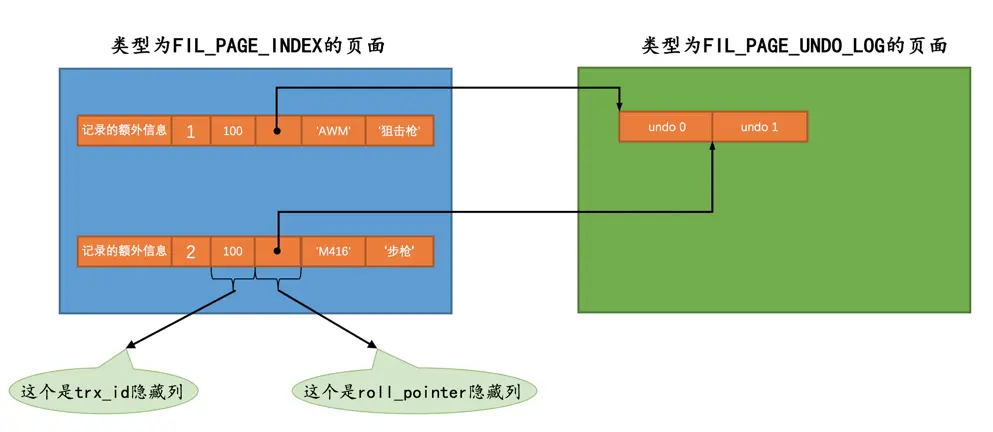
    - INSERT 对应的 undo 日志
      - 如果希望回滚一个插入操作，那么对应的回滚操作为删除该条记录，而该记录可以通过主键值唯一索引
      - TRX_UNDO_INSERT_REC 类型的 undo log
        - 示意图 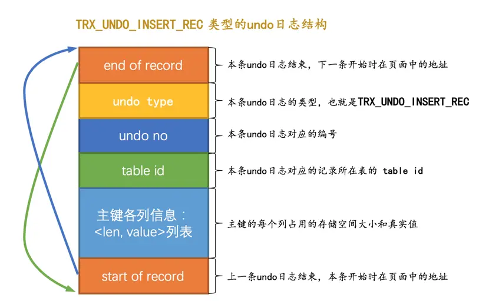
          - undo no在一个事务中是从0开始递增的，也就是说只要事务没提交，每生成一条undo日志，那么该条日志的undo no就增1
          - 当我们向某个表中插入一条记录时，实际上需要向聚簇索引和所有的二级索引都插入一条记录。不过记录undo日志时，我们只需要考虑向聚簇索引插入记录时的情况就好了，因为其实聚簇索引记录和二级索引记录是一一对应的，我们在回滚插入操作时，只需要知道这条记录的主键信息，然后根据主键信息做对应的删除操作，做删除操作时就会顺带着把所有二级索引中相应的记录也删除掉
    - DELETE 对应的 undo 日志
      - 插入到页面中的记录会根据记录头信息中的next_record属性组成一个单向链表，我们把这个链表称之为正常记录链表；我们在数据页结构的时候说过，被删除的记录其实也会根据记录头信息中的next_record属性组成一个链表，只不过这个链表中的记录占用的存储空间可以被重新利用，所以也称这个链表为垃圾链表。Page Header部分有一个称之为PAGE_FREE的属性，它指向由被删除记录组成的垃圾链表中的头节点
      - 使用 DELETE 语句从正常记录链表中删除一条记录分为两个步骤
        - delete mark
          - 仅仅将记录的delete_mask标识位设置为1，其他的不做修改（其实会修改记录的trx_id、roll_pointer这些隐藏列的值）
          - 图解 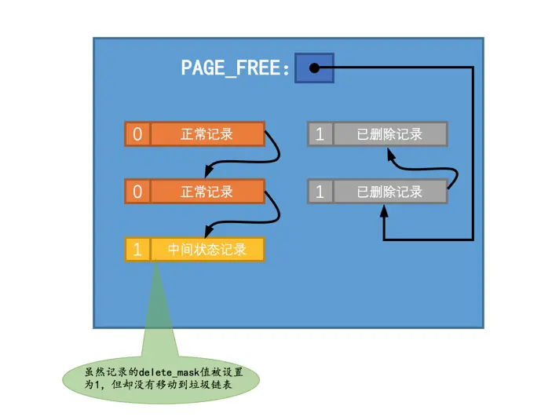
          - 在删除语句所在的事务提交之前，被删除的记录一直都处于这种所谓的中间状态
        - purge（清除）
          - 当该删除语句所在的事务提交之后，会有专门的线程后来真正的把记录删除掉
          - 把该记录从正常记录链表中移除，并且加入到垃圾链表中，然后还要调整一些页面的其他信息，比如页面中的用户记录数量PAGE_N_RECS、上次插入记录的位置PAGE_LAST_INSERT、垃圾链表头节点的指针PAGE_FREE、页面中可重用的字节数量PAGE_GARBAGE、还有页目录的一些信息等等
            - 页面的Page Header部分有一个PAGE_GARBAGE属性，该属性记录着当前页面中可重用存储空间占用的总字节数。每当有已删除记录被加入到垃圾链表后，都会把这个PAGE_GARBAGE属性的值加上该已删除记录占用的存储空间大小
            - PAGE_FREE指向垃圾链表的头节点，之后每当新插入记录时，首先判断PAGE_FREE指向的头节点代表的已删除记录占用的存储空间是否足够容纳这条新插入的记录，如果不可以容纳，就直接向页面中申请新的空间来存储这条记录。如果可以容纳，那么直接重用这条已删除记录的存储空间，并且把PAGE_FREE指向垃圾链表中的下一条已删除记录
            - 如果新插入的那条记录占用的存储空间大小小于垃圾链表的头节点占用的存储空间大小，那就意味头节点对应的记录占用的存储空间里有一部分空间用不到这些碎片空间占用的存储空间大小会被统计到PAGE_GARBAGE属性中，这些碎片空间在整个页面快使用完前并不会被重新利用，不过当页面快满时，如果再插入一条记录，此时页面中并不能分配一条完整记录的空间，这时候会首先看一看PAGE_GARBAGE的空间和剩余可利用的空间加起来是不是可以容纳下这条记录，如果可以的话，InnoDB会尝试重新组织页内的记录，重新组织的过程就是先开辟一个临时页面，把页面内的记录依次插入一遍，因为依次插入时并不会产生碎片，之后再把临时页面的内容复制到本页面，这样就可以把那些碎片空间都解放出来
          - 图解 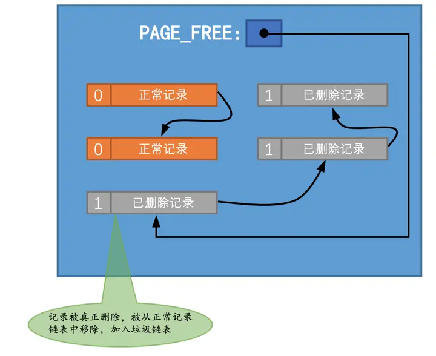
        - TRX_UNDO_DEL_MARK_REC 类型的 undo log
          - 图解 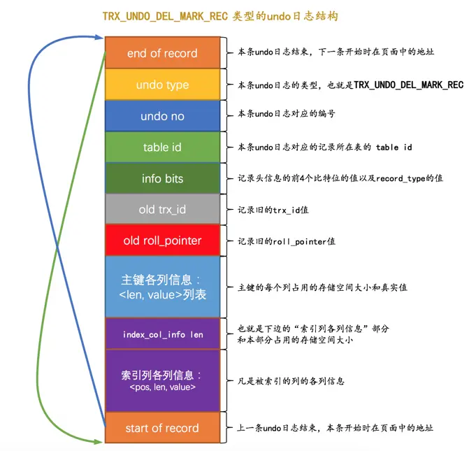
            - 在对一条记录进行delete mark操作前，需要把该记录的旧的trx_id和roll_pointer隐藏列的值都给记到对应的undo日志中来，就是我们图中显示的old trx_id和old roll_pointer属性
              - 这样有一个好处，那就是可以通过undo日志的old roll_pointer找到记录在修改之前对应的undo日志
              - 比方说在一个事务中，我们先插入了一条记录，然后又执行对该记录的删除操作，这个过程的示意图就是这样
                - 示意图 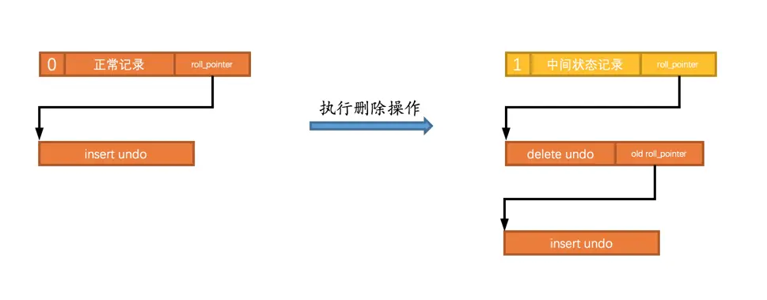
                - 执行完delete mark操作后，它对应的undo日志和INSERT操作对应的undo日志就串成了一个链表，称为版本链
            - index_col_info
              - 如果某个列被包含在某个索引中，那么它的相关信息就应该被记录到这个索引列各列信息部分，所谓的相关信息包括该列在记录中的位置（用pos表示），该列占用的存储空间大小（用len表示），该列实际值（用value表示）
              - 这部分信息主要是用在事务提交后，对该中间状态记录做真正删除的阶段二，也就是purge阶段中使用
    - UPDATE 操作对应的的 undo 日志
      - 在执行UPDATE语句时，InnoDB对更新主键和不更新主键这两种情况有截然不同的处理方案
      - 不更新主键
        - 就地更新（in-place update）
          - 更新记录时，对于被更新的每个列来说，如果更新后的列和更新前的列占用的存储空间都一样大（不是更大或更小），那么就可以进行就地更新
        - 先删除掉旧记录，再插入新记录
          - 在不更新主键的情况下，如果有任何一个被更新的列更新前和更新后占用的存储空间大小不一致，那么就需要先把这条旧的记录从聚簇索引页面中删除（真正地删除，由用户线程执行）掉，然后再根据更新后列的值创建一条新的记录插入到页面中
            - 如果新创建的记录占用的存储空间大小不超过旧记录占用的空间，那么可以直接重用被加入到垃圾链表中的旧记录所占用的存储空间
            - 否则的话需要在页面中新申请一段空间以供新记录使用，如果本页面内已经没有可用的空间的话，那就需要进行页面分裂操作，然后再插入新记录
        - TRX_UNDO_UPD_EXIST_REC 类型的 undo 日志
          - 示意图 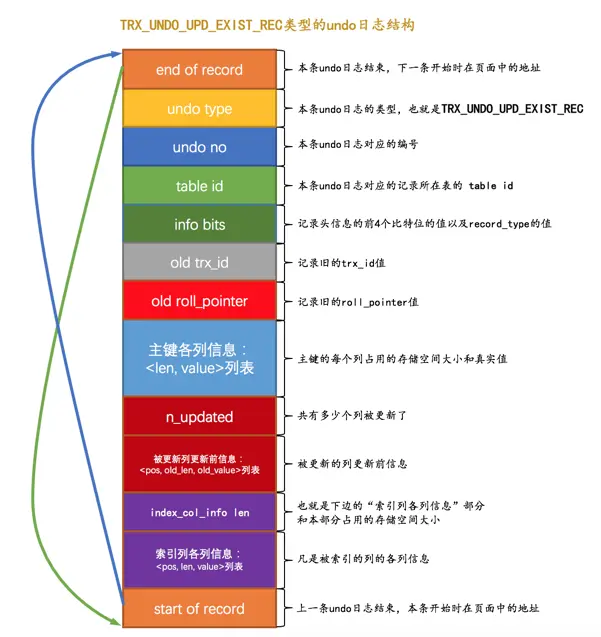
            - n_updated属性表示本条UPDATE语句执行后将有几个列被更新，后边跟着的&lt;pos, old_len, old_value&gt;分别表示被更新列在记录中的位置、更新前该列占用的存储空间大小、更新前该列的真实值
            - 如果在UPDATE语句中更新的列包含索引列，那么也会添加索引列各列信息这个部分，否则的话是不会添加这个部分的
      - 更新主键
        - InnoDB 在聚簇索引中进行了两步处理
          - 1.将旧记录进行delete mark操作
            - 之所以只对旧记录做delete mark操作，是因为别的事务同时也可能访问这条记录，如果把它真正的删除加入到垃圾链表后，别的事务就访问不到了
            - 会生成一条类型为 TRX_UNDO_DEL_MAR_REC 的 undo log
          - 2.根据更新后各列的值创建一条新记录，并将其插入到聚簇索引中（需重新定位插入的位置）
            - 会生成一条类型为 TRX_UNDO_INSERT_REC 的 undo log
  - FIL_PAGE_UNDO_LOG 类型的页面
    - 专门用来存储 undo log
    - 结构示意图 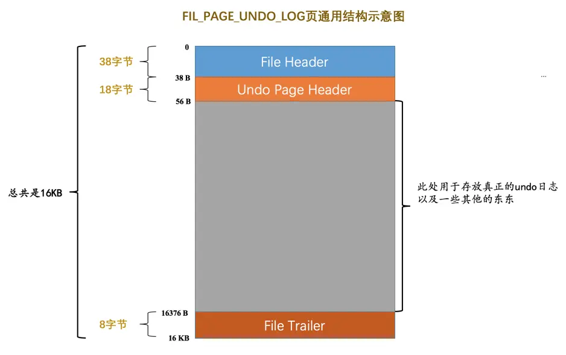
      - Undo Page Header 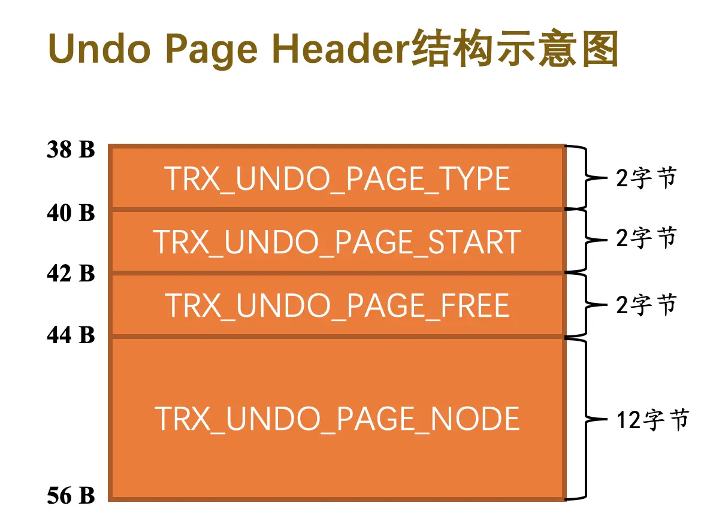
        - TRX_UNDO_PAGE_TYPE
          - 本页面存储的 undo 日志类型
          - 日志类型被分为 2 大类
            - TRX_UNDO_INSERT（十进制 1）
              - TRX_UNDO_INSERT_REC 的 undo log
            - TRX_UNDO_UPDATE（十进制 2）
              - 除了 TRX_UNDO_INSERT_REC 的 undo 日志
        - TRX_UNDO_PAGE_START
          - 表示在当前页面中是从什么位置开始存储undo日志的，或者说表示第一条undo日志在本页面中的起始偏移量
        - TRX_UNDO_PAGE_FREE
          - 与上边的TRX_UNDO_PAGE_START对应，表示当前页面中存储的最后一条undo日志结束时的偏移量，或者说从这个位置开始，可以继续写入新的undo日志
        - TRX_UNDO_PAGE_NODE
          - 代表一个 List Node 结构 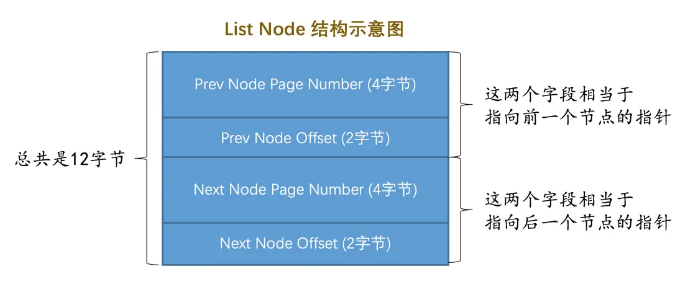
    - Undo 页面链表
      - 单个事务中的 undo 页面链表
        - 一个事务执行过程中可能产生很多undo日志，这些日志可能一个页面放不下，需要放到多个页面中，这些页面就通过我们上边介绍的 TRX_UNDO_PAGE_NODE 属性连成了链表
          - 示意图，第一个 undo 页面被称为 first undo page 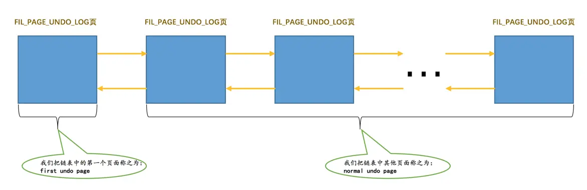
            - first undo page 还会存储其他管理信息
          - insert undo 链表
            - 连接 TRX_UNDO_INSERT 类型的日志的页面
          - update undo 链表
            - 连接 TRX_UNDO_UPDATE 类型的日志的页面
          - InnoDB 中，普通表和临时表的记录改动时的 undo 日志要分别记录
        - 综上，一个事务中最多有 4 个以 undo 页面为节点组成的链表 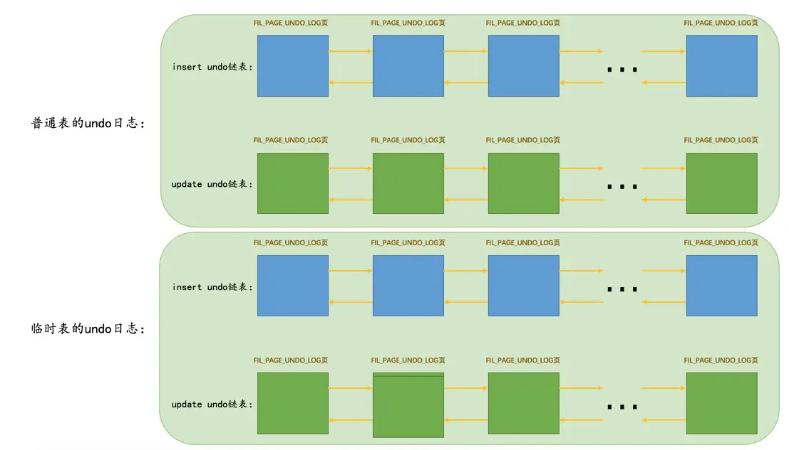
        - 链表只有在需要的时候才进行分配
      - 多个事务中的 undo 页面链表
        - 为每个事务分配单独的链表，而不是混用
  - undo log 写入
    - undo log segment header
      - 每个 undo 页面链表都对应着一个段，称为 undo log segment
      - 链表中的页面都是从这个段里面申请的
    - fisrt undo page
      - undo 页面链表的第一个页面
      - 结构示意图 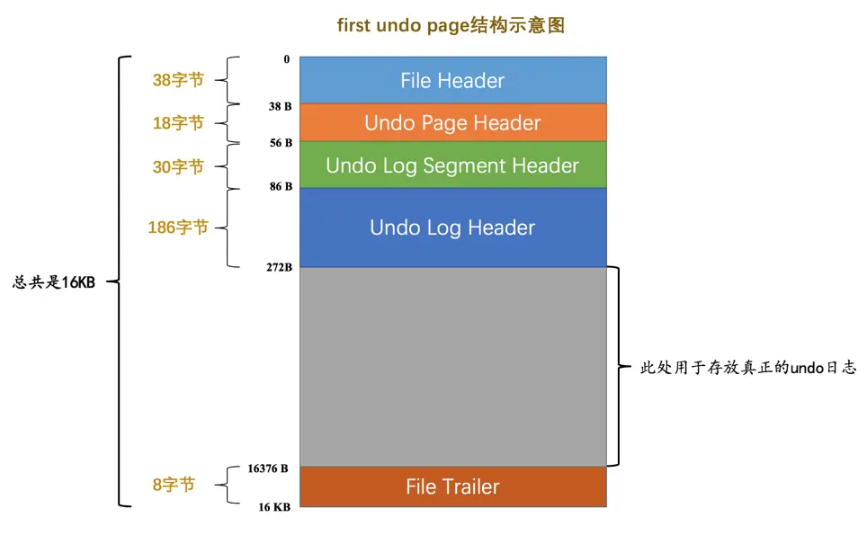
        - undo log sergment header 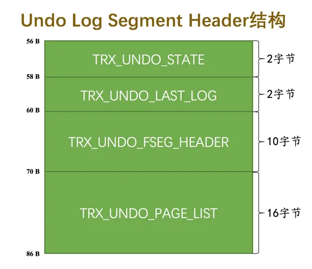
          - TRX_UNDO_STATE（undo 页面链表的状态）
            - TRX_UNDO_ACTIVE
              - 活跃状态，也就是一个活跃的事务正在往这个段里边写入undo日志
            - TRX_UNDO_CACHED
              - 被缓存的状态。处在该状态的Undo页面链表等待着之后被其他事务重用
            - TRX_UNDO_TO_FREE
              - 对于insert undo链表来说，如果在它对应的事务提交之后，该链表不能被重用，那么就会处于这种状态
            - TRX_UNDO_TO_PURGE
              - 对于update undo链表来说，如果在它对应的事务提交之后，该链表不能被重用，那么就会处于这种状态
            - TRX_UNDO_PREPARED
              - 包含处于PREPARE阶段的事务产生的undo日志
          - TRX_UNDO_LAST_LOG
            - 本Undo页面链表中最后一个Undo Log Header的位置
          - TRX_UNDO_FSEG_HEADER
            - 本Undo页面链表对应的段的Segment Header信息，通过这个结构可以找到对应的 INODE Entry 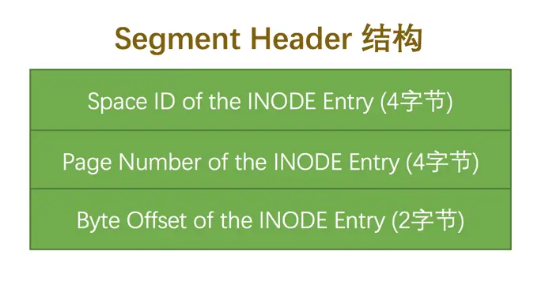
          - TRX_UNDO_PAGE_LIST
            - Undo页面链表的基节点
        - undo log header 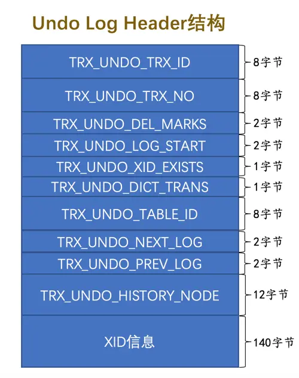
          - 用于记录一组 undo 日志的相关信息信息
          - 一个 undo 页面链表被认为是一组日志
          - TRX_UNDO_TRX_ID
            - 生成本组undo日志的事务id
          - TRX_UNDO_TRX_NO
            - 事务提交后生成的一个需要序号，使用此序号来标记事务的提交顺序（先提交的此序号小，后提交的此序号大）
          - TRX_UNDO_DEL_MARKS
            - 标记本组undo日志中是否包含由于Delete mark操作产生的undo日志
          - TRX_UNDO_LOG_START
            - 表示本组undo日志中第一条undo日志的在页面中的偏移量
          - TRX_UNDO_XID_EXISTS
            - 本组undo日志是否包含XID信息
          - TRX_UNDO_DICT_TRANS
            - 标记本组undo日志是不是由DDL语句产生的
          - TRX_UNDO_TABLE_ID
            - 如果TRX_UNDO_DICT_TRANS为真，那么本属性表示DDL语句操作的表的table id
          - TRX_UNDO_NEXT_LOG
            - 下一组的undo日志在页面中开始的偏移量
          - TRX_UNDO_PREV_LOG
            - 上一组的undo日志在页面中开始的偏移量
    - undo 页面链表重用
      - 重用的条件
        - 该链表中只包含一个Undo页面
        - 该Undo页面已经使用的空间小于整个页面空间的3/4
      - 如何重用？
        - insert undo 链表
          - insert undo链表中只存储类型为TRX_UNDO_INSERT_REC的undo日志，这种类型的undo日志在事务提交之后就没用了，就可以被清除掉
          - 重用这个事务的insert undo链表（这个链表中只有一个页面）时，可以直接把之前事务写入的一组undo日志覆盖掉，从头开始写入新事务的一组undo日志
          - 图解 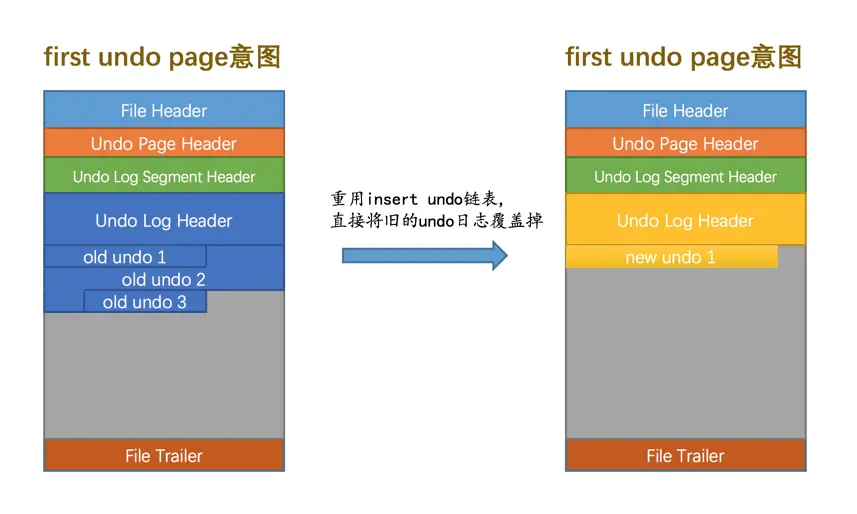
        - update undo链表
          - 在一个事务提交后，它的update undo链表中的undo日志也不能立即删除掉（这些日志用于MVCC）
          - 所以如果之后的事务想重用update undo链表时，就不能覆盖之前事务写入的undo日志。这样就相当于在同一个Undo页面中写入了多组的undo日志
          - 图解 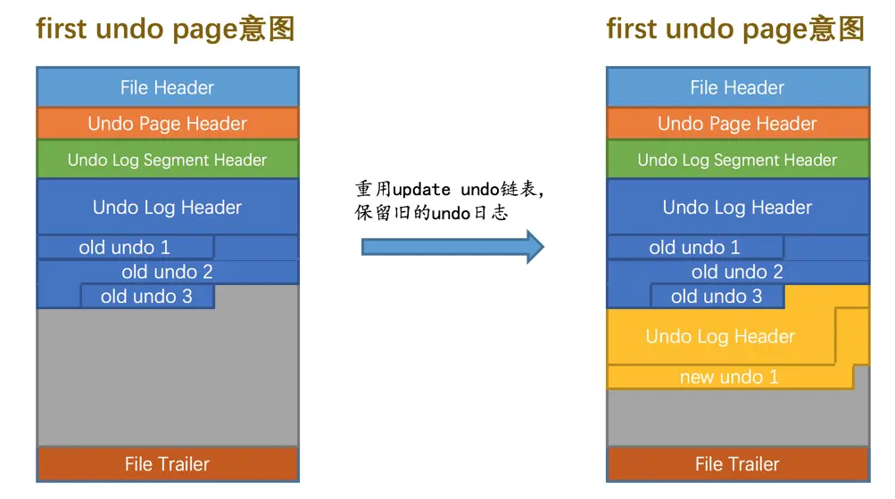
  - 回滚段
    - 为了管理 undo 页面链表而存在
    - Rollback Segment Header 类型的页面 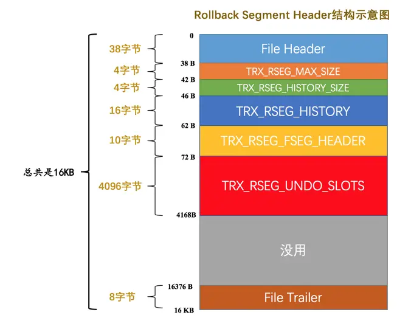
      - 在这个页面中存放了各个Undo页面链表的frist undo page的页号，这些页号称之为undo slot
      - 每个 Rollback Segment Header 都对应着一个段，这个段被称为 Rollback Segment，回滚段
      - TRX_RSEG_MAX_SIZE
        - 本Rollback Segment中管理的所有Undo页面链表中的Undo页面数量之和的最大值。换句话说，本Rollback Segment中所有Undo页面链表中的Undo页面数量之和不能超过TRX_RSEG_MAX_SIZE代表的值
        - TRX_RSEG_MAX_SIZE的值为0xFFFFFFFE
      - TRX_RSEG_HISTORY_SIZE
        - History链表占用的页面数量
      - TRX_RSEG_HISTORY
        - History链表的基节点
      - TRX_RSEG_FSEG_HEADER
        - 本Rollback Segment对应的10字节大小的Segment Header结构，通过它可以找到本段对应的INODE Entry
      - TRX_RSEG_UNDO_SLOTS
        - 各个Undo页面链表的first undo page的页号集合，也就是undo slot集合
        - 一个页号占用4个字节，对于16KB大小的页面来说，这个TRX_RSEG_UNDO_SLOTS部分共存储了1024个undo slot，所以共需1024 × 4 = 4096个字节
    - 从回滚段中申请 undo 页面链表
      - 初始情况下，由于未向任何事务分配任何Undo页面链表，所以对于一个Rollback Segment Header页面来说，它的各个undo slot都被设置成了一个特殊的值：FIL_NULL（对应的十六进制就是0xFFFFFFFF），表示该undo slot不指向任何页面
      - 从头开始遍历 undo slot，直到找到一个 undo slot 值为 FIL_NULL 的 slot，然后吧 undo slot 的值设置为刚申请的页面的页号
      - 如果找不到为 FIL_NULL 的 undo slot，就会回滚这个事务并报错：Too many active concurrent transactions
    - 当事务提交时， undo slot 会有两种处理方式
      - 符合重用条件时
        - 该undo slot就处于被缓存的状态，InnoDB规定这时该Undo页面链表的TRX_UNDO_STATE属性（该属性在first undo page的Undo Log Segment Header部分）会被设置为TRX_UNDO_CACHED
        - 被缓存的undo slot都会被加入到一个链表，根据对应的Undo页面链表的类型不同，也会被加入到不同的链表
          - 如果对应的Undo页面链表是insert undo链表，则该undo slot会被加入insert undo cached链表
          - 如果对应的Undo页面链表是update undo链表，则该undo slot会被加入update undo cached链表
          - 一个回滚段就对应着上述两个cached链表，如果有新事务要分配undo slot时，先从对应的cached链表中找。如果没有被缓存的undo slot，才会到回滚段的Rollback Segment Header页面中再去找
      - 不符合重用条件时
        - 如果对应的Undo页面链表是insert undo链表，则该Undo页面链表的TRX_UNDO_STATE属性会被设置为TRX_UNDO_TO_FREE，之后该Undo页面链表对应的段会被释放掉（也就意味着段中的页面可以被挪作他用），然后把该undo slot的值设置为FIL_NULL
        - 如果对应的Undo页面链表是update undo链表，则该Undo页面链表的TRX_UNDO_STATE属性会被设置为TRX_UNDO_TO_PRUGE，则会将该undo slot的值设置为FIL_NULL，然后将本次事务写入的一组undo日志放到History链表中
    - 多个回滚段
      - 一个回滚段最多只能有 1024 个 slot，会导致支持的事务同时并发的数量很少，所以，InnoDB 定义了 128 个回滚段，故而有 128 个 Rollback Segment Header 页面
      - 这 128 个 Rollback Segment Header 的页面的地址存储在系统表空间的第 5 号页面的某个区域包含了 128 个 8 字节大小的空间里 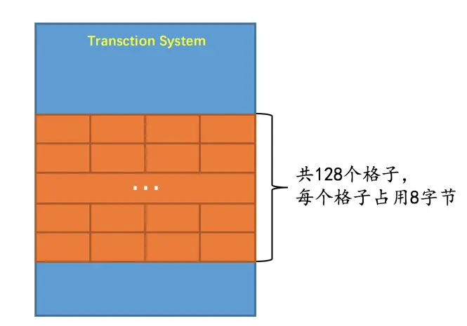
        - 每个格子的示意图 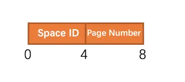
      - 最开始的回滚段称之为第0号回滚段，之后依次递增，最后一个回滚段就称之为第127号回滚段
      - 回滚段的分类
        - 第0号、第33～127号回滚段属于一类
          - 其中第0号回滚段必须在系统表空间中（就是说第0号回滚段对应的Rollback Segment Header页面必须在系统表空间中）
          - 第33～127号回滚段既可以在系统表空间中，也可以在自己配置的undo表空间中
          - 如果一个事务在执行过程中由于对普通表的记录做了改动需要分配Undo页面链表时，必须从这一类的段中分配相应的undo slot
        - 第1～32号回滚段属于一类
          - 这些回滚段必须在临时表空间（对应着数据目录中的ibtmp1文件）中
          - 如果一个事务在执行过程中由于对临时表的记录做了改动需要分配Undo页面链表时，必须从这一类的段中分配相应的undo slot
        - 如果一个事务在执行过程中既对普通表的记录做了改动，又对临时表的记录做了改动，那么需要为这个记录分配2个回滚段，再分别到这两个回滚段中分配对应的undo slot
        - 针对普通表和临时表划分不同种类的回滚段的原因：在修改针对普通表的回滚段中的Undo页面时，需要记录对应的redo日志，而修改针对临时表的回滚段中的Undo页面时，不需要记录对应的redo日志
    - 综上，有如上示意图 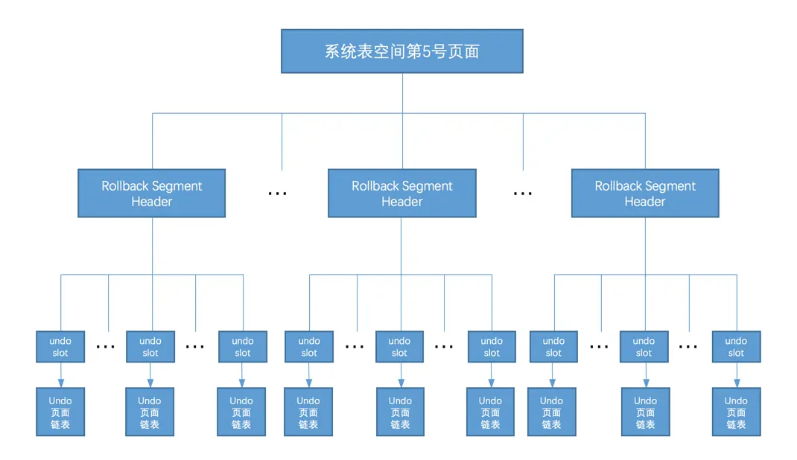
    - 回滚段的相关配置
      - 可以通过启动参数 innodb_rollback_segments 来配置回滚段的数量，范围是 1 ~ 128,默认为 128。这个参数并不会影响针对临时表的回滚段数量，其数量一直都是 32
        - 如果我们把innodb_rollback_segments的值设置为1 ~ 33 之间的数，那么只会有1个针对普通表的可用回滚段，但是仍然有32个针对临时表的可用回滚段
        - 如果我们把innodb_rollback_segments设置为大于33的数，那么针对普通表的可用回滚段数量就是该值减去32
      - 配置第 33 ~ 127 号回滚段的 表空间
        - 通过innodb_undo_directory指定undo表空间所在的目录，如果没有指定该参数，则默认undo表空间所在的目录就是数据目录
        - 通过innodb_undo_tablespaces定义undo表空间的数量。该参数的默认值为0，表明不创建任何undo表空间
          - 第33~127号回滚段可以平均分布到不同的undo表空间中
          - 设立undo表空间的一个好处就是在undo表空间中的文件大到一定程度时，可以自动的将该undo表空间截断（truncate）成一个小文件，而系统表空间的大小只能不断的增大，却不能截断
        - 如果我们在系统初始化的时候指定了创建了undo表空间，那么系统表空间中的第0号回滚段将处于不可用状态
- InnoDB 事务
  - ACID 特性
    - 原子性（Atomicity）
      - 要么全做，要么全不做
    - 隔离性（Isolation）
      - 其他的状态转换不会影响到本次的状态转换
        - 所谓的状态转换就是更改值之类的操作
    - 一致性（Consistency）
      - 数据库的数据全部符合现实世界的约束（all defined rules）
      - 数据库层面的约束
        - 为表建立主键、唯一索引、外键、声明某个列为NOT NULL来拒绝NULL值的插入
        - CHECK语法来自定义约束（MySQL并不支持）
        - 通过定义触发器的方式来自定义一些约束条件以保证数据库中数据的一致性
      - 代码层面的约束
    - 持久性（Durability）
      - 状态转换完成之后，转换的结果将永久的保留
  - 需要保证 ACID 的一个或多个数据库操作称为一个事务（transaction）
  - 事务的状态
    - 活动的（active）
      - 事务对应的数据库操作正在执行过程中时，我们就说该事务处在活动的状态
    - 部分提交的（parially committed）
      - 当事务中的最后一个操作执行完成，但由于操作都在内存中执行，所造成的影响并没有刷新到磁盘时，我们就说该事务处在部分提交的状态
    - 失败的（faild）
      - 当事务处在活动的或者部分提交的状态时，可能遇到了某些错误（数据库自身的错误、操作系统错误或者直接断电等）而无法继续执行，或者人为的停止当前事务的执行，我们就说该事务处在失败的状态
    - 终止的（aborted）
      - 撤销失败事务对当前数据库造成的影响称为回滚
      - 当回滚操作执行完毕时，也就是数据库恢复到了执行事务之前的状态，我们就说该事务处在了中止的状态
    - 提交的（committed）
      - 当一个处在部分提交的状态的事务将修改过的数据都同步到磁盘上之后，我们就可以说该事务处在了提交的状态
    - 状态转换图 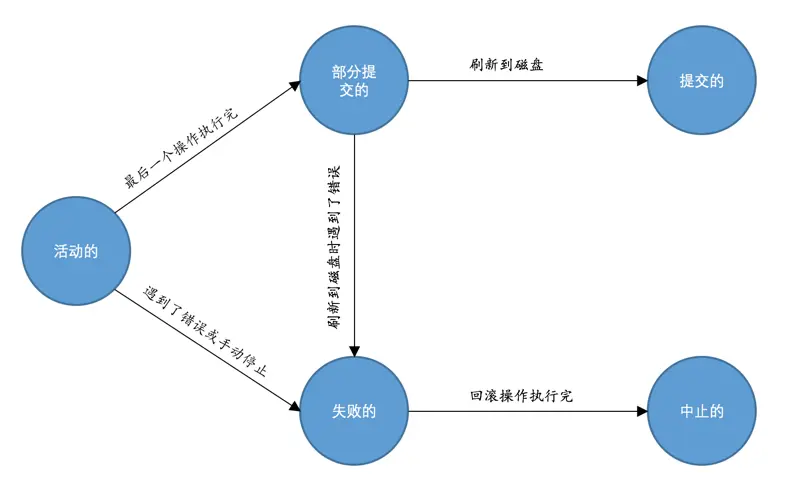
  - 语法
    - 开启事务
      - BEGIN [WORK];
      - START TRANSACTION [modifiers];
        - 可以在 START TRANSACTION 语句后跟随修饰符
        - 修饰符
          - READ ONLY
            - 标识当前事务是一个只读事务，也就是属于该事务的数据库操作只能读取数据，而不能修改数据
            - 只读事务中只是不允许修改那些其他事务也能访问到的表中的数据，对于临时表来说（我们使用CREATE TMEPORARY TABLE创建的表），由于它们只能在当前会话中可见，所以只读事务其实也是可以对临时表进行增、删、改操作的
          - READ WRITE（默认）
            - 标识当前事务是一个读写事务
          - WITH CONSISTENT SNAPSHOT
            - 启动一致性读
        - 修饰符之间用 `,` 分隔
    - 提交事务
      - COMMIT [WORK]
    - 手动终止事务
      - ROLLBACK [WORK]
  - 事务的提交与回滚
    - 回滚
      - 撤销失败事务对当前数据库造成的影响称为回滚
      - 如果事务在执行过程中遇到了某些错误而无法继续执行的话，事务自身会自动的回滚
      - 如果某个事务中包含了修改使用不支持事务的存储引擎的表，那么对该使用不支持事务的存储引擎的表所做的修改将无法进行回滚
    - 自动提交（autocommit）
      - 如果不显式地使用START TRANSACTION或者BEGIN语句开启一个事务，那么每一条语句都算是一个独立的事务，这种特性称之为事务的自动提交
      - MySQL 系统变量 autocommit 控制了是否启动自动提交
      - 以下语句也相当与开启事务： SET autocommit = OFF;
    - 隐式提交（导致事务隐式提交）
      - 定义或修改数据库对象的数据定义语言（DDL）
        - 示例 
      - 隐式地使用或修改 mysql 数据库中的表
        - 当我们使用 ALTER USER、CREATE USER、DROP USER、GRANT、RENAME USER、REVOKE、SET PASSWORD 等语句时也会隐式的提交前边语句所属于的事务
      - 事务控制或关于锁定的语句
        - 当我们在一个事务还没提交或者回滚时就又使用 START TRANSACTION 或者 BEGIN 语句开启了另一个事务时，会隐式的提交上一个事务
        - 当前的 autocommit 系统变量的值为 OFF，我们手动把它调为 ON 时，也会隐式的提交前边语句所属的事务
        - 使用 LOCK TABLES、UNLOCK TABLES 等关于锁定的语句也会隐式的提交前边语句所属的事务
      - 加载数据的语句
        - 比如使用 LOAD DATA 语句来批量往数据库中导入数据时，也会隐式的提交前边语句所属的事务
      - 与 MySQL 复制相关的一些语句
        - 使用 START SLAVE、STOP SLAVE、RESET SLAVE、CHANGE MASTER TO 等语句时也会隐式的提交前边语句所属的事务
      - 其它的一些语句
        - 使用 ANALYZE TABLE、CACHE INDEX、CHECK TABLE、FLUSH、 LOAD INDEX INTO CACHE、OPTIMIZE TABLE、REPAIR TABLE、RESET 等语句也会隐式的提交前边语句所属的事务
  - 保存点（savepoint）
    - 设置 ROLLBACK 语句可以回滚到的点，而不是一次 ROLLBACK 导致所有开启事务后编写的语句都被回滚
    - 语法
      - 定义保存点
        - SAVEPOINT &lt;保存点名称&gt;;
      - 回滚到某个保存点
        - ROLLBACK [WORK] TO [SAVEPOINT] &lt;保存点名称&gt;;
        - 如果 ROLLBACK 语句后边不跟随保存点名称，会直接回滚到事务执行之前的状态
      - 删除某个保存点
        - RELEASE SAVEPOINT &lt;保存点名称&gt;;
  - 事务隔离级别与 MVCC
    - 为了保证事务的隔离性，理想情况下当不同的事务修改同一数据时，要串行执行，但是，这样的话性能会降低，故而提出隔离级别的概念
    - 事务并发执行时遇到的问题
      - 脏写（Dirty Write）
        - 如果一个事务修改了另一个未提交事务修改过的数据，那就意味着发生了脏写
        - 即两个事务同时修改一份数据
        - 示意图 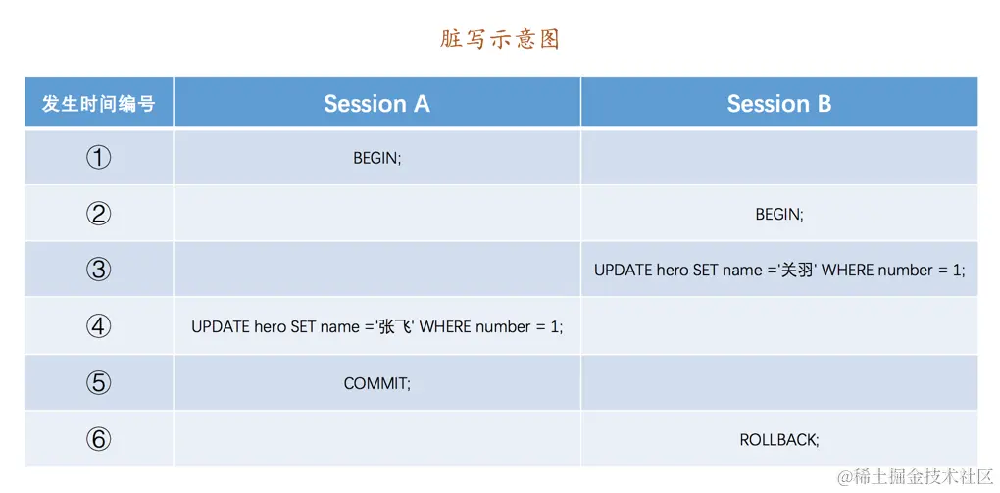
      - 脏读（Dirty Read）
        - 如果一个事务读到了另一个未提交事务修改过的数据，那就意味着发生了脏读
        - 即两个事务一个写一个读同一份数据（写在前，读在后）
        - 示意图 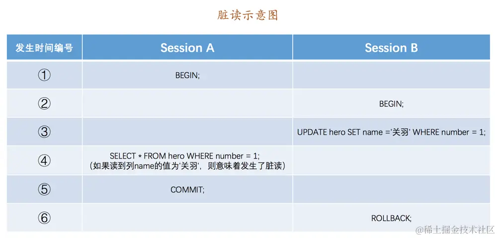
      - 不可重复读（Non-Repeatable Read）
        - 如果一个事务只能读到另一个已经提交的事务修改过的数据，并且其他事务每对该数据进行一次修改并提交后，该事务都能查询得到最新值，那就意味着发生了不可重复读
        - 示意图 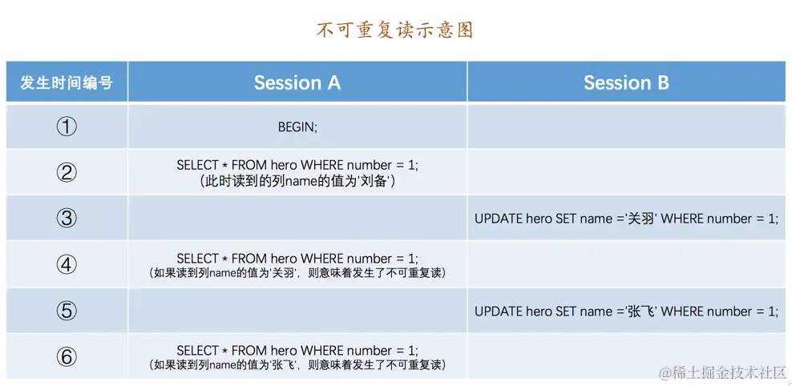
      - 幻读（Phantom）
        - 如果一个事务先根据某些条件查询出一些记录，之后另一个事务又向表中插入了符合这些条件的记录，原先的事务再次按照该条件查询时，能把另一个事务插入的记录也读出来，那就意味着发生了幻读
        - 示意图 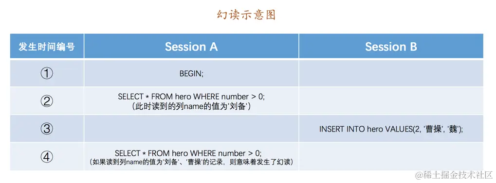
      - 些问题按照严重排序：
        - 脏写 &gt; 脏读 &gt; 不可重复读 &gt; 幻读
    - 事务的隔离级别（SQL 标准）
      - 隔离级别越低，越严重的问题就越可能发生
      - 不论何种隔离级别，都不能允许脏写
      - READ UNCOMMITTED（未提交读）
      - READ COMMITTED（已提交读）
      - REPEATABLE READ（可重复读）
      - SERIALIZABLE（可串行化）
      - SQL标准中规定，针对不同的隔离级别，并发事务可以发生不同严重程度的问题 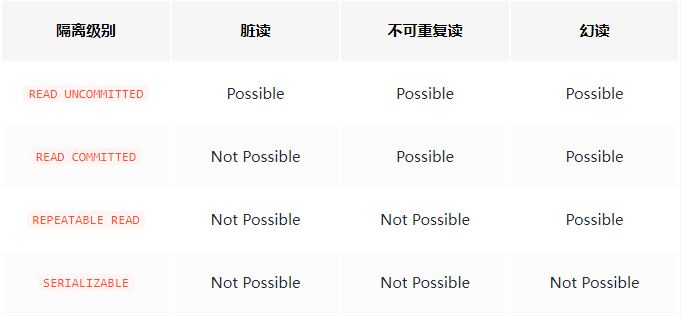
    - 事务的隔离级别（MySQL）
      - 默认的事务隔离级别是 REPEATABLE READ
      - 设置事务隔离级别
        - 语法 
        - level 的可能取值
          - REPEATABLE READ
          - READ COMMITTED
          - READ UNCOMMITTED
          - SERIALIZABLE
        - 作用范围（GLOBAL or SESSION）
          - GLOBAL
            - 只对执行完该语句之后产生的会话起作用
            - 当前已经存在的会话无效
          - SESSION
            - 对当前会话的所有后续的事务有效
            - 该语句可以在已经开启的事务中间执行，但不会影响当前正在执行的事务
            - 如果在事务之间执行，则对后续的事务有效
          - 不指定 GLOBAL 或者 SESSION
            - 只对当前会话中下一个即将开启的事务有效
            - 下一个事务执行完后，后续事务将恢复到之前的隔离级别
            - 该语句不能在已经开启的事务中间执行
        - 可以在服务端程序启动时改变事务的默认隔离级别
          - 可以修改启动参数transaction-isolation的值
          - 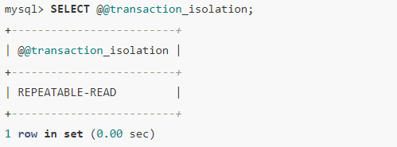
    - MVCC（Multi-Version Concurrency Control）
      - 每条记录的 roll_pointer 隐藏列的第一个比特代表是否是 insert undo 日志类型。insert undo 只能用于事务的回滚。
      - 普通的SELECT语句在READ COMMITTED和REPEATABLE READ隔离级别下会使用到MVCC读取记录
      - 每次对记录进行改动，都会记录一条undo日志，每条undo日志也都有一个roll_pointer属性（INSERT操作对应的undo日志没有该属性，因为该记录并没有更早的版本），可以将这些undo日志都连起来，串成一个链表
        - 示意图 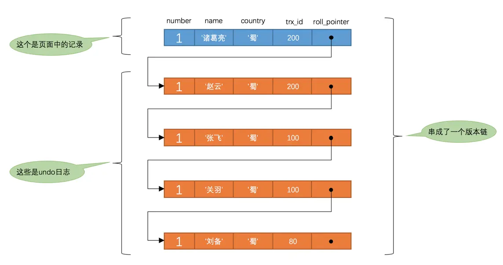
        - 每个版本中还包含生成该版本时对应的事务id
      - ReadView
        - ReadView 用于判断版本链中的哪个版本是当前事务可见的
          - 对于使用 READ UNCOMMITTED 隔离级别的事务来说，由于可以读到未提交事务修改过的记录，所以直接读取记录的最新版本就好了
          - 对于使用SERIALIZABLE隔离级别的事务来说，InnoDB的规定使用加锁的方式来访问记录
          - 对于使用READ COMMITTED和REPEATABLE READ隔离级别的事务来说，都必须保证读到已经提交了的事务修改过的记录，也就是说假如另一个事务已经修改了记录但是尚未提交，是不能直接读取最新版本的记录的
        - 内容
          - m_ids
            - 表示在生成ReadView时当前系统中活跃的读写事务的事务id列表
          - min_trx_id
            - 表示在生成ReadView时当前系统中活跃的读写事务中最小的事务id，也就是m_ids中的最小值
          - max_trx_id
            - 表示生成ReadView时系统中应该分配给下一个事务的id值
          - creator_trx_id
            - 表示生成该ReadView的事务的事务id
        - 判断当前事务事务可见的是哪个版本的步骤
          - 如果被访问版本的trx_id属性值与ReadView中的creator_trx_id值相同，意味着当前事务在访问它自己修改过的记录，所以该版本可以被当前事务访问
          - 如果被访问版本的trx_id属性值小于ReadView中的min_trx_id值，表明生成该版本的事务在当前事务生成ReadView前已经提交，所以该版本可以被当前事务访问
          - 如果被访问版本的trx_id属性值大于或等于ReadView中的max_trx_id值，表明生成该版本的事务在当前事务生成ReadView后才开启，所以该版本不可以被当前事务访问
          - 如果被访问版本的trx_id属性值在ReadView的min_trx_id和max_trx_id之间，那就需要判断一下trx_id属性值是不是在m_ids列表中，如果在，说明创建ReadView时生成该版本的事务还是活跃的，该版本不可以被访问；如果不在，说明创建ReadView时生成该版本的事务已经被提交，该版本可以被访问
          - 如果某个版本的数据对当前事务不可见的话，那就顺着版本链找到下一个版本的数据，继续按照上边的步骤判断可见性，依此类推，直到版本链中的最后一个版本。如果最后一个版本也不可见的话，那么就意味着该条记录对该事务完全不可见，查询结果就不包含该记录
        - 何时生成 ReadView
          - READ COMMITTED
            - 每次读取数据前都生成一个ReadView
          - REPEATABLE READ
            - 在第一次读取数据时生成一个ReadView
            - 只会在第一次执行查询语句时生成一个ReadView
- 锁
  - 为了解决脏写问题，当一个事务改动了某条记录以后，就会生成一个锁来与该记录关联
    - 锁中的 is_waiting 表示当前事务是否在等待
    - 当事务T1改动了这条记录后，就生成了一个锁结构与该记录关联，因为之前没有别的事务为这条记录加锁，所以is_waiting属性就是false，我们把这个场景就称之为获取锁成功，或者加锁成功，然后就可以继续执行操作了
      - 图解（粗略表示） 
    - 在事务T1提交之前，另一个事务T2也想对该记录做改动，那么先去看看有没有锁结构与这条记录关联，发现有一个锁结构与之关联后，然后也生成了一个锁结构与这条记录关联，不过锁结构的is_waiting属性值为true，表示当前事务需要等待，我们把这个场景就称之为获取锁失败，或者加锁失败，或者没有成功的获取到锁
      - 图解 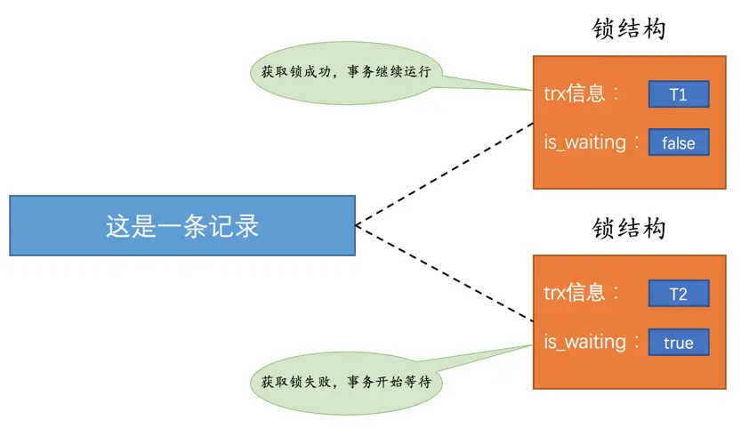
    - 在事务T1提交之后，就会把该事务生成的锁结构释放掉，然后看看还有没有别的事务在等待获取锁，发现了事务T2还在等待获取锁，所以把事务T2对应的锁结构的is_waiting属性设置为false，然后把该事务对应的线程唤醒，让它继续执行
  - 为了解决脏读、幻读、不可重复读问题，有两种解决方案
    - 1\. 使用 MVCC
      - 读写操作并不冲突，性能更高
      - 一致性读（Consistent Reads）
        - 事务利用 MVCC 进行的读取操作称为一致性读，或者一致性无锁读，有的地方也称之为快照读
        - 所有普通的SELECT语句（plain SELECT）在READ COMMITTED、REPEATABLE READ隔离级别下都算是一致性读
        - 一致性读并不会对表中的任何记录做加锁操作，其他事务可以自由的对表中的记录做改动
    - 2\. 加锁
      - 读写操作需要排队执行，在某些情况下必须以这种方式
      - 锁定读（Locking Reads）
        - 共享锁（shared lock）（S 锁）
        - 独占锁/排他锁（exclusive locks）（X 锁）
        - S 锁与 S 锁是兼容的， S 锁与 X 锁不兼容， X 锁和 X 锁也不兼容 
        - 语法
          - SELECT
            - 对读取的记录加S锁
              - 
            - 对读取的记录加X锁
              - 
  - 写操作
    - DELETE
      - 对一条记录做DELETE操作的过程是先在B+树中定位到这条记录的位置，然后获取一下这条记录的X锁，然后再执行delete mark操作。
        - 可以把这个定位待删除记录在B+树中位置的过程看成是一个获取X锁的锁定读
    - UPDATE
      - 如果未修改该记录的主键值并且被更新的列占用的存储空间在修改前后未发生变化，则先在B+树中定位到这条记录的位置，然后再获取一下记录的X锁，最后在原记录的位置进行修改操作
        - 可以把这个定位待修改记录在B+树中位置的过程看成是一个获取X锁的锁定读
      - 如果未修改该记录的主键值并且至少有一个被更新的列占用的存储空间在修改前后发生变化，则先在B+树中定位到这条记录的位置，然后获取一下记录的X锁，将该记录彻底删除掉（就是把记录彻底移入垃圾链表），最后再插入一条新记录
      - 如果修改了该记录的主键值，则相当于在原记录上做DELETE操作之后再来一次INSERT操作，加锁操作就需要按照DELETE和INSERT的规则进行了
    - INSERT
      - InnoDB 通过隐式锁来保护这条新插入的记录在本事务提交前不被别的事务访问
  - 锁的粒度
    - 行级锁/行锁（粒度细）
    - 表级锁/表锁（粒度粗）
      - S 锁
        - 别的事务可以继续获得该表的S锁
        - 别的事务可以继续获得该表中的某些记录的S锁
        - 别的事务不可以继续获得该表的X锁
        - 别的事务不可以继续获得该表中的某些记录的X锁
      - X 锁
        - 别的事务不可以继续获得该表的S锁
        - 别的事务不可以继续获得该表中的某些记录的S锁
        - 别的事务不可以继续获得该表的X锁
        - 别的事务不可以继续获得该表中的某些记录的X锁
    - 为了给表加锁时快速判断是否有记录已经被上了锁，提出了意向锁（Intention Locks）
      - 意向共享锁（IS 锁）
        - 当事务准备在某条记录上加S锁时，需要先在表级别加一个IS锁
      - 意向独占锁（IX 锁）
        - 当事务准备在某条记录上加X锁时，需要先在表级别加一个IX锁
      - 各种锁的兼容性 
    - 不同引擎对锁的支持情况
      - 除了 InnoDB 的其他引擎，只支持表级锁
  - InnoDB 中的锁
    - 表级锁
      - S 锁和 X 锁
        - 在对某个表执行SELECT、INSERT、DELETE、UPDATE语句时，InnoDB存储引擎不会为这个表添加S锁或者X锁
        - DDL 语句和 SELECT、INSERT、DELETE、UPDATE语句会相互阻塞（只有其中一种类型的语句会执行），这通过元数据锁（metadata locks，MDL）来实现
        - 当在 autocommit = 0 且 innodb_table_locks = 1 时，才能手动获取表级的 S 或者 X 锁
          - 语法
            - 获取 S 锁
              - LOCK TABLES &lt;table-name&gt; READ
            - 获取 X 锁
              - LOCK TABLES &lt;table-name&gt; WRITE
      - IS 锁和 IX 锁
      - AUTO-INC 锁
        - 用于给某个有 AUTO_INCREMENT 属性的列赋值
        - 给某个有 AUTO_INCREMENT 属性的列赋值有两种方式
          - AUTO-INC 锁
            - 为每条待插入记录的AUTO_INCREMENT修饰的列分配递增的值，在该语句执行结束后，再把AUTO-INC锁释放掉
            - 这样一个事务在持有AUTO-INC锁的过程中，其他事务的插入语句都要被阻塞，可以保证一个语句中分配的递增值是连续的
            - 插入语句在执行前不可以确定具体要插入多少条记录（无法预计即将插入记录的数量），比如说使用INSERT ... SELECT、REPLACE ... SELECT或者LOAD DATA这种插入语句，一般是使用AUTO-INC锁为AUTO_INCREMENT修饰的列生成对应的值
            - AUTO-INC锁的作用范围只是单个插入语句，插入语句执行完成后，锁被释放
          - 一种轻量级的锁
            - 在为插入语句生成AUTO_INCREMENT修饰的列的值时获取一下这个轻量级锁，然后生成本次插入语句需要用到的AUTO_INCREMENT列的值之后，就把该轻量级锁释放掉，并不需要等到整个插入语句执行完才释放锁
            - 插入语句在执行前就可以确定具体要插入多少条记录，那么一般采用轻量级锁的方式对AUTO_INCREMENT修饰的列进行赋值。这种方式可以避免锁定表，可以提升插入性能
    - 行级锁（记录锁）
      - 类型
        - Record Locks
          - 名为 LOCK_REC_NOT_GAP
          - 有 S 锁和 X 锁之分
          - 图解 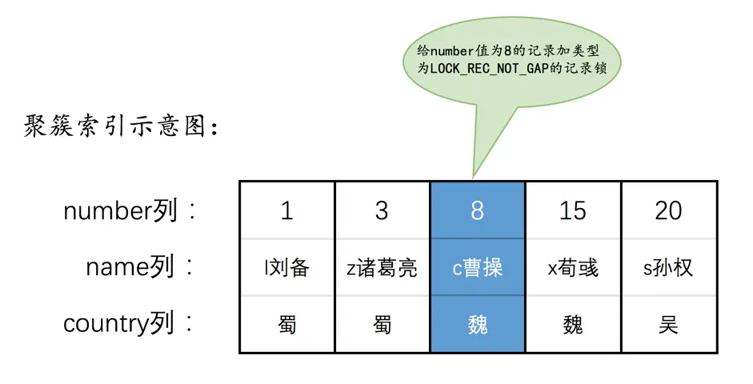
        - Gap Locks
          - 名为 LOCK_GAP，gap 锁
          - 被用来解决幻读问题
            - 因为导致幻读问题的记录开始时并不存在，故而采用这种方式
          - 图解 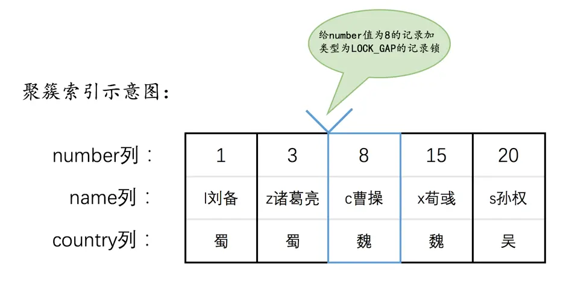
            - 为了阻止别的事务在插入 number 列的值为 (20, 正无穷) 的记录，可以用 gap 锁锁定伪记录中的 Supremum 记录（最大记录） 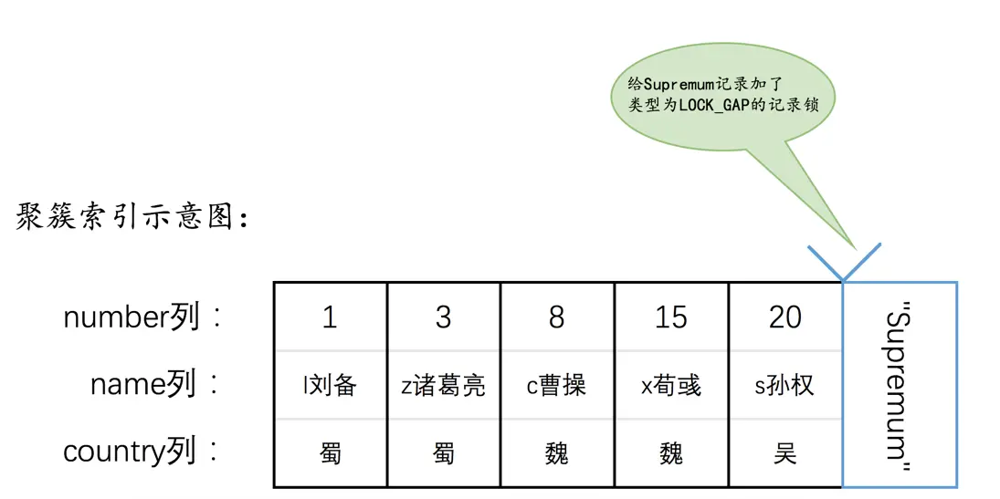
          - 作用：不允许别的事务在 gap 锁锁定的记录的前面的那个间隙内插入记录
          - 虽然有 S 锁和 X 锁的区分，但是，并不影响其他事务继续向这个记录加 gap 锁或者 LOCK_REC_NOT_GAP 锁
            - gap锁的作用仅仅是为了防止插入幻影记录
        - Next-Key Locks
          - 名为 LOCK_ORDINARY，next-key 锁
          - 作用：既锁住某条记录，也阻止其他事务在该记录的前面间隙内插入记录
          - 图解 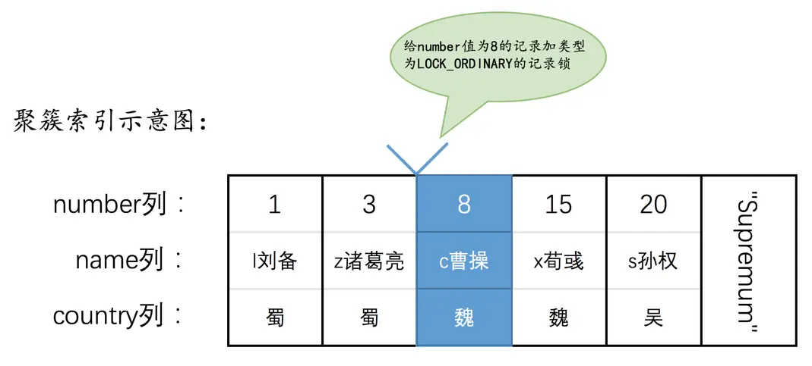
        - Insert Intention Locks
          - 名为 LOCK_INSERT_INTENTION，插入意向锁
          - 作用：在插入记录的时候，如何那个 gap 被 gap 锁锁定，则在等待的时候也要生成一个插入意向锁来锁定 gap 锁所锁定的那条记录。如果有多个事务由于 gap 锁而等待，则会为该记录生成多个插入意向锁
          - 示意图 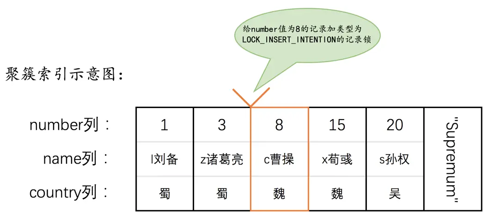
          - 插入意向锁不会阻止别的事务继续获取该记录上的任何类型的锁，其目的只是为了标识有哪些事务处于等待中，当持有 gap 锁的那个事务提交了之后，会同时唤醒多个插入意向锁中的事务，所以，那些被唤醒的事务可以同时插入记录
        - 隐式锁
          - 作用：针对一个事务插入一条记录后，另一条记录想要获取这条记录的 S 锁或者 X 锁的情况。如果让其成功获取，则可能会出现脏读或者脏写问题。隐藏锁被用来解决此问题
          - 如何实现锁的功能？
            - 针对聚簇索引
              - 有 trx_id 隐藏列，记录着最后改动该记录的事务 id
              - 如果事务 a 在新插入一条记录后，事务 b 想要获取该记录的 S 或 X 锁，则先查看 trx_id 的隐藏列代表的事务是否是当前活跃事务，如果是，则为事务 a 创建一个锁 a，锁 a 的 is_waiting = false，然后为自己（事务 b ）创建一个锁 b，锁 b 的 is_waiting = true，然后事务 b 进入等待状态
            - 针对二级索引
              - 在二级索引页面的Page Header部分有一个PAGE_MAX_TRX_ID属性，该属性代表对该页面做改动的最大的事务id
              - 如果PAGE_MAX_TRX_ID属性值小于当前最小的活跃事务id，那么说明对该页面做修改的事务都已经提交了，否则就需要在页面中定位到对应的二级索引记录，然后回表找到它对应的聚簇索引记录，然后再重复情景一的做法
  - 锁的内存结构
    - 示意图 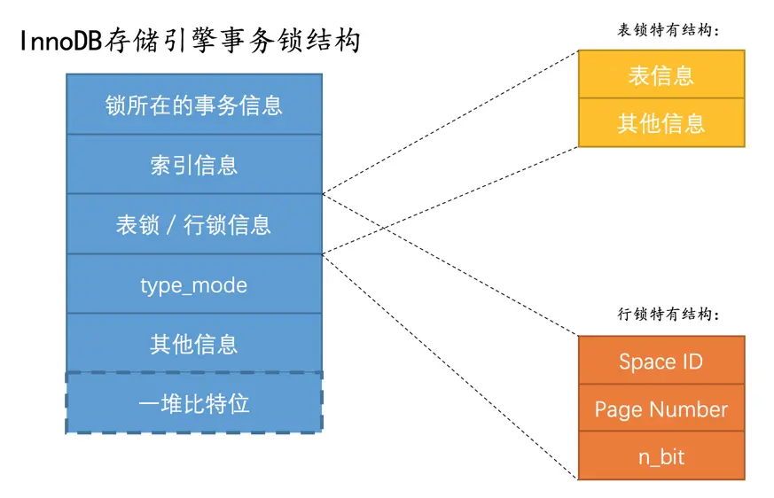
      - 锁所在的事务信息：一个指针，指向事务的详细信息
      - 索引信息：对于行锁来说，是记录加锁的记录属于哪个索引。也是一个指针
      - 行锁中的 n_bits：一条记录对应着一个比特位，用不同的比特位来区分是哪一条记录加了锁，为此，在行锁的末尾位置预留了一些空间来存放这些比特位， n_bits 表示使用了多个个比特位
      - type_mode 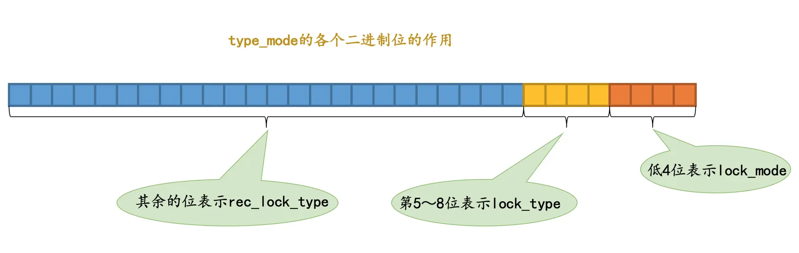
        - lock_mode
          - LOCK_IS（0D）
            - 共享意向锁
          - LOCK_IX（1D）
            - 独占意向锁
          - LOCK_S（2D）
            - 共享锁
          - LOCK_X（3D）
            - 独占锁
          - LOCK_AUTO_INC（4D）
            - AUTO-INC 锁
        - lock_type
          - 占用第5～8位，不过现阶段只有第5位和第6位被使用
          - 第 5 位
            - LOCK_TABLE
              - 是否是表级锁
          - 第 6 位
            - LOCK_REC
              - 是否是行级锁
        - rec_lock_type
          - LOCK_ORDINARY
          - LOCK_GAP
          - LOCK_REC_NOT_GAP
          - LOCK_INSERT_INTENTION
          - ....
          - LOCK_WAIT （第 9 个比特）
            - 表示是否是 is_waiting
      - 一堆比特位
        - 如果是行锁的话才有
        - 比特位可以和记录中的 heap_no 互相映射 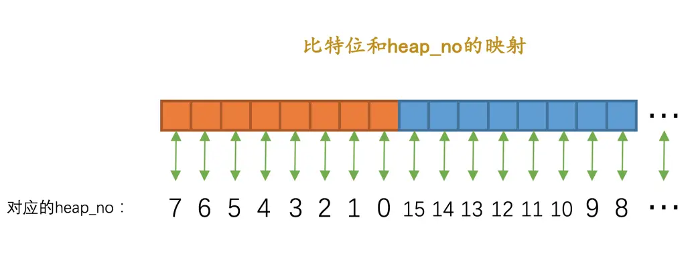
    - 在对不同的记录加锁时，如果符合下列条件，则这些记录的锁就可以被放到一个锁结构中
      - 在同一个事务中进行加锁操作
      - 被加锁的记录在同一个页面中
      - 加锁的类型是一样的
      - 等待的状态是一样的
```
