```markmap
---
markmap:
  initialExpandLevel: 2
  spacingVertical: 30
  spacingHorizontal: 180
---

# OODA面向对象程序设计与分析
- 复杂系统
  - 5 个共同的属性
    - 层次结构
      - 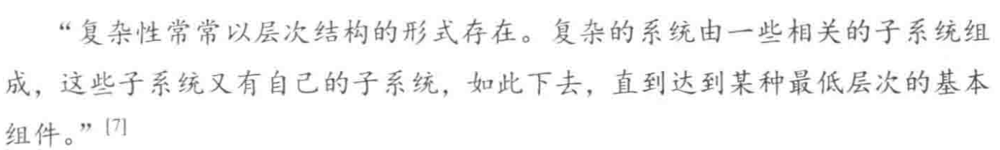
    - 相对本原
      - 
    - 关注点分离
      - 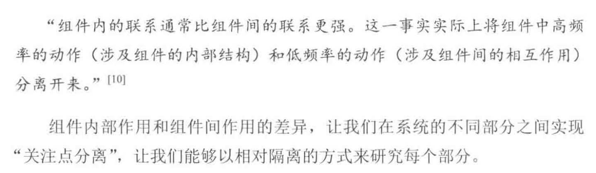
    - 共同模式
      - 
    - 稳定的中间形式
      - 
  - 设计的含义
    - 满足给定的功能规格说明
    - 符合目标介质的限制
    - 满足隐含和明确的性能及资源使用需求
    - 满足隐含和明确的关于产品形式方面的设计限制条件
    - 满足对设计过程本身的限制条件，如时间，费用，或进行设计可用的工具
- 面向对象
  - 4个主要要素
    - 抽象
    - 封装
    - 模块化
    - 层次结构
  - 3个次要要素
    - 类型
    - 并发
    - 持久
  - 抽象
    - 
  - 封装
    - 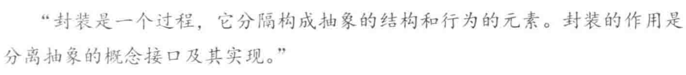
  - 模块化
    - 
    - 模块化将程序划分为一些模块，这些模块可以独立地编译，但又与其他模块有联系
    - 模块之间的联系是模块相互之间所作出的假设
    - 将逻辑上相关的类和对象放在同一个模块中，只暴露出其他模块必须看到的元素
  - 层次结构
    - 一组抽象常常构成一个层次结构，通过在设计中确定这些层次结构，铿能极大地简化对系统的理解
    - 
    - 继承是一种层次结构
    - 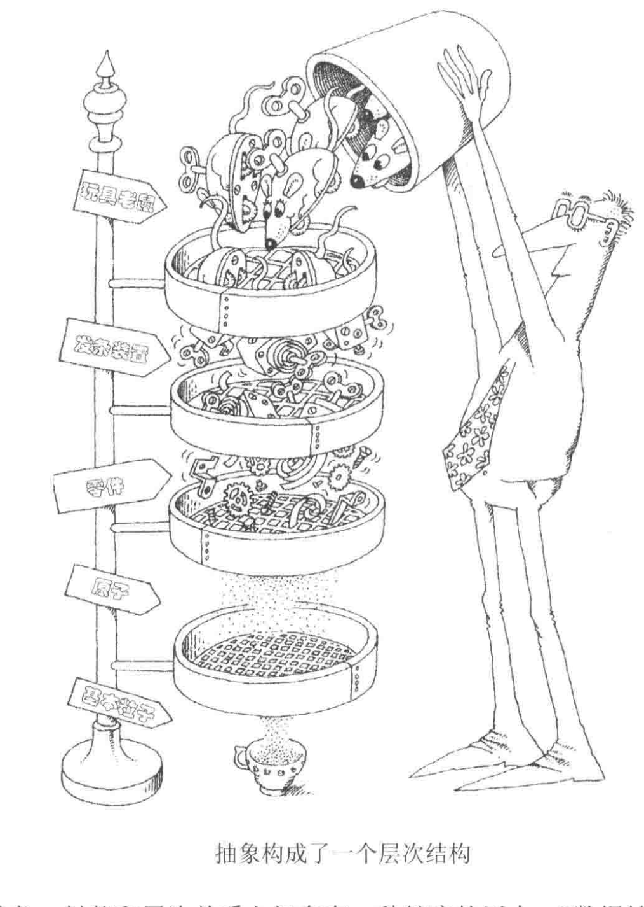
  - 类型
    - 
  - 并发
    - 
    - 
  - 持久
    - 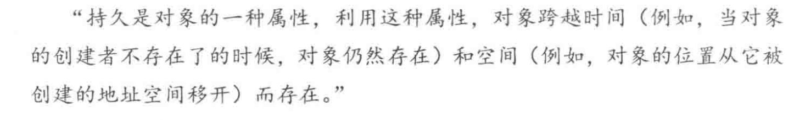
    - 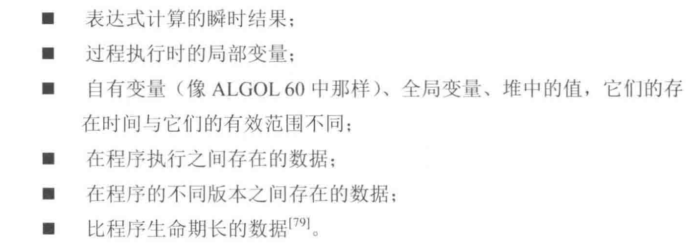
- 类与对象
  - 对象
    - 对象
      - 
      - 状态
        - 
        - 属性是一种内在或独特的特征、特点、品质或特性，使一个对象区别于别的对象。例如，电梯的一个基本属性就是它只能够上下运动，而不能水平运动。 属性通常是静态的，因为这样的特征是不可更改的，是对象的根本本质。说“通常是静态的”，是因为在某些情况下，对象的属性会改变。
        - 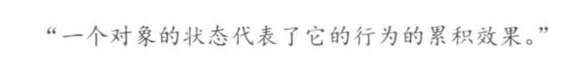
      - 行为
        - 行为是对象在状态改变和消息传递方面的动作和反应的方式
        - 对象的行为代表了它在外部可见的活动
      - 标识符
        - 标识符是一个对象的属性，它区分这个对象和其他所有对象
    - 对象之间的关系
      - 链接
        - 链接是：“两个对象之间物理上或概念上的联系”
        - 链接代表了具体的关联，通过这种关联，一个对象请求另一个对象的服务，或者通过这种关联从一个对象导航到另一个对象
        - 作为链接的参与者，一个对象可能扮演3种角色之一
          - 控制器
            - 这个对象可以控制其他对象，但不会被其他对象操作。 在某些地方，“主动对象”和“控制器”可以互换使用
          - 服务器
            - 不操作其他对象，它只被其他对象操作
          - 代理
            - 既可以操作其他对象，也可以被其他对象操作。 创建代理通常是为了表示问题域中的一个真实对象
        - 可见性
        - 同步
          - 3种方式
            - 顺序：只有在某一时刻只存在一个主动对象时，被动对象的语义才得到保证
            - 守卫：在多个控制线程的程序下，被动对象的语义也能得到保证，但主动的客户之间必须协作，一实现互斥访问
            - 并发：在多个控制线程的程序下，被动对象的语义也能得到保证，服务提供者保证互斥
      - 聚合
        - 链接表明了一种端到端的关系或客户/服务提供者之间的关系。 而聚合则表明了一种整体/部分层次结构，提供了从整体（也称聚合体）导航到它的部分的能力
  - 类
    - “类是一组对象，它们拥有共同的结构、共同的行为和共同的语义”
    - 类起到的作用是在一种抽象和所有它的客户之间建立起协议。通过在类的接口中记录下这些决定，一种强类型的编程语言可以在编译时检查是否违反了这一协议。
    - 类的接口
      - 公有：所有客户都可以访问
      - 保护：只能由该类本身及其子类访问
      - 私有：只能由该类本身访问
      - 包：只能由同一个包种的类访问
    - 类之间的关系
      - 关联
        - 语义上的依赖关系。如果没有特殊的说明，关联意味着双向导航。我们只能通过命名每个类在关系种扮演的角色来暗示这些语义。
        - 多重性
          - 一对多
          - 一对一
          - 多对多
      - 继承
        - 单继承
          - 扩展继承：扩展超类的子类
          - 限制继承：限制超类的子类
        - 多态与延迟绑定：在出现多态时，方法和名字的绑定要在执行时确定
        - 多继承
          - 名字冲突：两个或多个不同的超类对接口中的某些元素使用同样的名字时，就可能发生名字冲突
          - 重复继承：重复继承一个类多次
          - 混入类：可以组合混入类来构建更复杂的类。无法实例化混入类
          - 聚合类：主要通过继承从混入类派生而来，没有自己的结构或行为
        - 只有当 B 的每个实例都可以被看做 A 的实例时，才适合继承
      - 聚合
        - 聚合提供了类实例中的整体/部分关系。 类之间的聚合关系与这些对象之间的聚合关系是并存的。
        - 物理包容：按值包容，意味着两个类的声明周期是同样的
        - 组合：按引用包容，整体访问部分时必须间接地访问。因此，两个类之间的实例可以独立销毁和创建
        - 聚合确定了整体部分的方向
      - 依赖
        - 依赖关系表明：处于这种关系一端的元素以某种方式依赖于处于另一端的元素
    - 创建高品质的类与对象
      - 评判一种抽象的品质
        - 耦合：一个模块与另一个模块之间建立起的关联强度的测量。强耦合使系统变得复杂，因为如果模块与其他模块高度相关，它就难以独立地被理解、变化或修正。通过设计系统，使模块间的耦合降至最弱，可以降低复杂性。
        - 内聚：内聚测量了单个类或对象内各个元素的联系程度
        - 充分性：某个类或模块应该记录某个抽象足够多的特征，从而允许有意义的有效的交互
        - 完整性：类或模块的接口记录了某个抽象全部有意义的特征
        - 基础性：只访问该抽象的底层表现形式才能够有效地实现那个操作，例如链表的插入操作，只有清楚了链表的表示形式，才能够往其中插入数据
      - 选择操作
        - 功能语义
          - 对于某个期望的行为，我们将其放入哪个类中？ 有 4 个评判标准：
            - 可复用性：这个行为在多中共上下文中使用吗？
            - 复杂性：实现这个行为的难度大吗？
            - 适用性：这个行为与打算放入的类型之间的相关程度如何？
            - 实现知识：这个行为的实现依赖于一个类型的内部实现细节吗？
          - 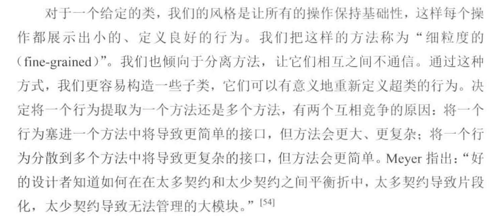
        - 时间和空间语义
          - 在确定存在某个操作，并定义了它的功能语义之后，必须决定它的时间和空间语义。这意味着必须决定它完成操作所需要的时间以及存储空间
      - 选择关系
        - Demeter 法则
          - 表述：类的方法不应该以任何方式依赖于任何类的结构，除了它自已类的当前（顶层）结构之外。而且，每个方法只能够对一个非常有限的类集的对象发出消息
          - 应用这一法则的基本效果就是创建了一些松耦合的类，它们的实现秘密被封装了起来。这样的类是相当没有负担的，即为了理解一个类的意思， 不需要理解许多其他类的细节。
        - 在继承、聚合、依赖关系之间进行折中
          - 在类A和类B之间，“只有当B的每个实例都可以被看作A的实例时，才适合继承。当B的每个实例只是具有A的一个或多个属性时，适合使用客户关系”
          - 从另外一个角度来看，如果对象的行为超过了它的部分之和，在相关的类之间创建聚合关系而不是继承关系可能更好。
        - 机制和可见性
          - 决定对象之间的关系的主要是设计这些对象进行交互的机制
          - 例如，在一份制造计划中，物料（称为批次）进入制造车间等待处理。当它们进入特定的车间时，我们必须通知车间的经理采取相应的行动。现在面临一个设计选择：一个批次的物料进入一个车间，这个操作是车间的操作，是批次的操作，还是两者的操作？如果我们决定它是车间的操作，那么车间就必须对批次可见。如果我们决定它是批次的操作，那么批次就必须对车间可见，因为必须知道它进了哪个车间。最后，如果我们认为它既是车间的操作，也是批次的操作，那么就必须使它们互相可见
      - 选择实现
        - 表示形式：指存储数据的方式，例如，使用 Hash 表来存储数据。
        - 打包：即编程语言中的模块或者包的概念
          - 一般来说，我们追求构建功能内聚，松耦合的模块
- 分类
  - 分类是组织知识的手段。 分类基本上是发现共性的问题。 认识到事物间的相似性然我们能够将共性放在关键抽象和机制中，最终导致更小的应用和更简单的架构
  - 确定类和对象
    - 经典方法和现代方法
      - 经典分类
        - 表述：所有具有某一个或某一组共同属性的实体构成了一个分类。这样的属性对于定义这个分类是必要的，也是充分的
        - 经典法利用相关的属性作为对象间相似性的判据
        - 例如：一个人要么已婚，要么未婚，这个属性的值足以确定某个人属于哪一个人群。但是，高的人不会构成一个分类，除非我们可以一致同意以某个绝对标准来区分高矮这个属性。
        - 最有用的属性集合往往是其成员没有太多相互影响的集合
      - 概念聚集
        - 表述：在这种方法中，类（一些实体的聚集）的产生首先是形成类的概念的描述，然后再根据这些描述对实体进行分类
        - 例如，我们可以声明像“一首爱情歌曲”这样的概念。这个概念超越了一个属性，因为任何歌曲的“爱情歌曲特质”不是可以经验性地测量的东西。但是，如果我们确定某个歌曲更像是一首爱情歌曲，我们就会把它放到这个分类中。 因此，概念聚集更多地代表了对象聚集的可能性。
        - 概念聚集通过关注“最适合”来进行绝对的分类判断。
      - 原型理论
        - 表述：对象的类是由一个原型对象来代表的，如果一个对象与这个原型表现出中要的相似性，那么这个对象就可被认为是这个类中的一员
    - 面向对象分析
      - 经典方法：来自于经典分类的原则
      - 行为分析：关注动态的行为，将这些行为作为类和对象的主要来源。这一方法更像是概念聚集，根据一组展示出类似行为的对象来形成类
      - 领域分析：调查已有系统架构，并作出取舍。咨询领域专家等 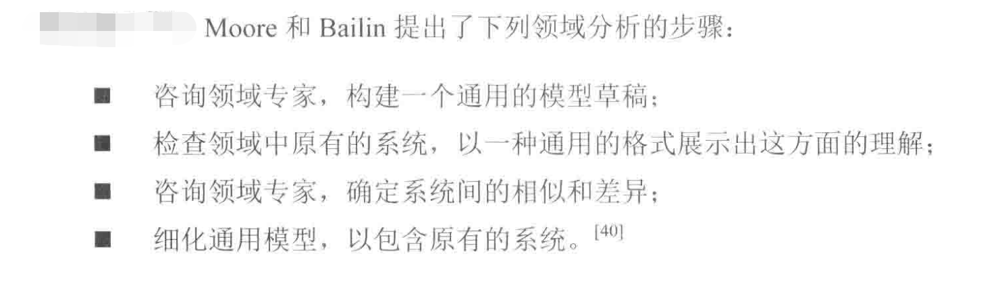
      - 用例分析：一个执行者通过与系统对话的方式执行的一个行为上相关的事务序列，目的是为执行者提供某种可度量的价值。
  - 关键抽象与机制
    - 
    - 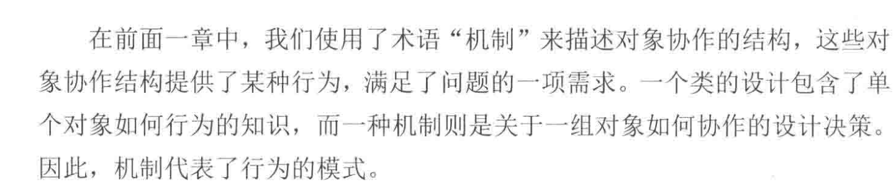
    - 确定关键抽象
      - 两个过程
        - 发现：领域专家所使用的抽象
        - 发明：创造新的类和对象，不一定是问题域的组成部分，但在设计和实现中也很重要
      - 细化关键抽象
        - 通过回答一些问题来确定是不是一个好的抽象
          - 这个类的对象是如何创建的？
          - 这个类的对象可以复制或销毁吗？
          - 在这样的对象上可以执行什么操作？
        - 在一个类型层次结构中设计类时，并非总是从超类开始，然后创建子类。通常，会创建一些看起来不相似的类型，意识到它们是相关的，然后将它们的共同特点分离出来，放到一个或多个超类。·通常需要这样上上下下做几次才能得到一个完整和正确的程序设计
        - 有时候我们可能发现一个通用的子类，并将它在类结构中上移，从而增加共享度，这称为“类提升”。 类似地，我们可能发现某个类太一般化，因此从它派生出一个子类很困难，因为语义上的差距太大，这称为“粒度规模冲突”
      - 命名关键抽象
        - 对象应该用合适的名词词组来命名
        - 类应该用常见的名词词组来命名
        - 如果可能，选择的名称应该是领域专家使用和认识的名称
        - 修改操作应该用一个主动此台的动词词组来命名，如 draw、moveLeft
        - 选择操作应该表示出查询的意思，或者用 be 动词的形式来命名，如 extentOf 或 isOpen
    - 识别机制
      - 机制即模式
        - 机制实际上是我们构造良好的软件系统中发现的各种模式。
- 方法 UML
  - 结构图
    - 包图
      - 包图的主要元素是：包，及其可见性和依赖关系
      - 包 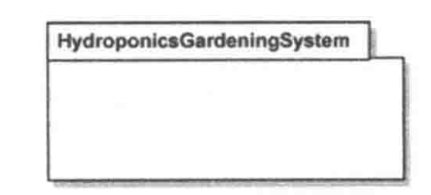
      - 包容元素的表示法
        - 物理包含 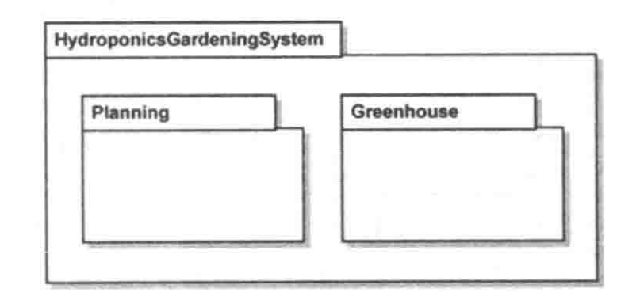
        - 包容关系，与物理包含表达的意思一样 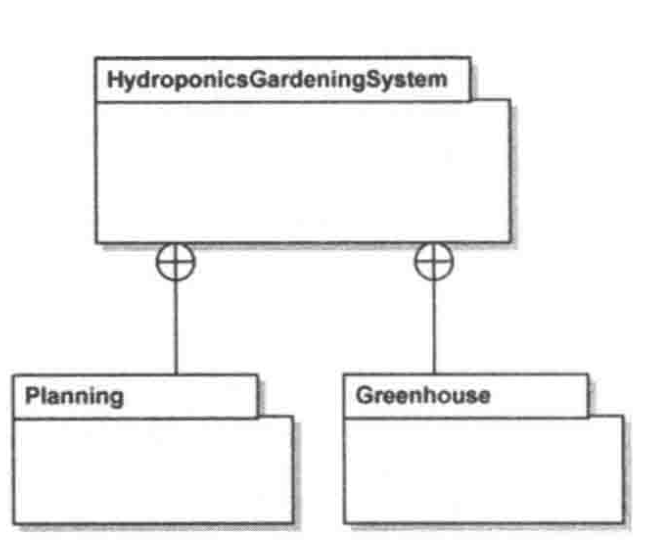
      - 元素的可见性
        - 元素的可见性由包容的包所定义
        - 包为它包含的元素提供了命名空间，所以，每个被包容的元素都有唯一的名称
        - 公有（+）：对它所在的包（包括内嵌的包）以及外部的元素可见
        - 私有（-）：指对它所在的包和内嵌的包可见
        - 在图中，可见性放在元素名称的前面 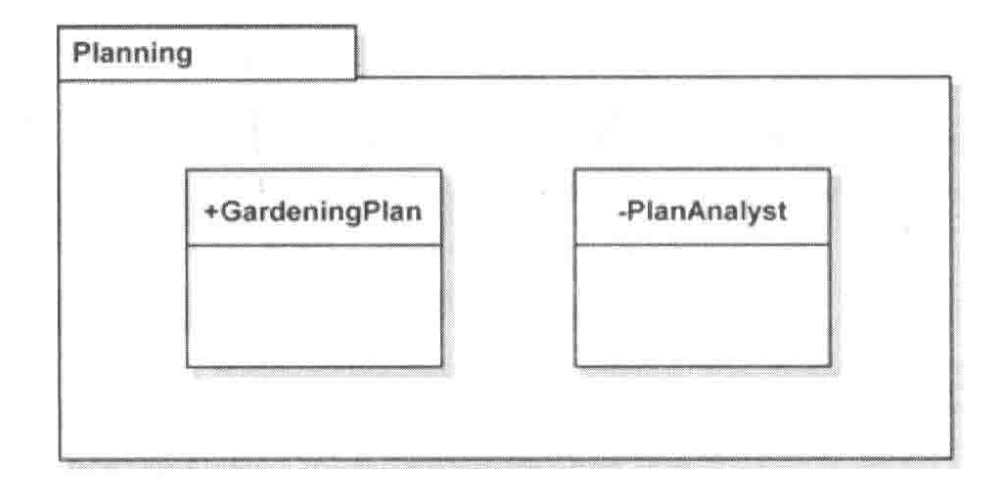
      - 依赖关系
        - 依赖关系显示了一个元素依赖于另一个元素来实现它在系统中的职责
        - 依赖关系用虚线的开放箭头来表示。
        - 箭头的尾部位于具有依赖性的元素（客户） 箭头位于支持这种依赖的元素（提供者）
        - 依赖关系可以加上标签，在 (&lt;&lt;&gt;&gt;)中包含依赖关系的类型（用一个关键词表示），强调元素之间依赖关系的类型
          - 包特有的依赖关系
            - 导入
              - 导入是一种公有包的导入
              - 其他元素可以看到导入包的元素也可以看到被导入的项
            - 访问
              - 访问是一种私有的包的导入
              - 被导入的项是私有的，它们在进行访问的包之外是不可见的
            - 合并
          - 包容的元素之间的关系导致的包间依赖关系
            - 跟踪
            - 派生
            - 细化
            - 使用
    - 类图
      - 类
        - 第一个部分放置类名 第二个部分放置属性 第三个部分放置操作 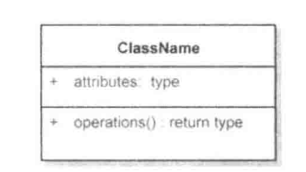
        - 属性的格式： 可见性 属性名称 ： 类型 [多重性] = 默认值 {特性字符串}
        - 操作的格式： 可见性 操作名称(参数名称：类型) : 返回值 {特性字符串}
        - 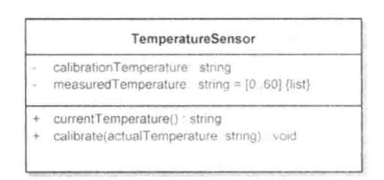
        - 如果要表示类或者操作是抽象的，要将类名或操作名斜体表示
        - 模板类
          - 模板类的右上角有一个虚线框，包含了其形式化参数 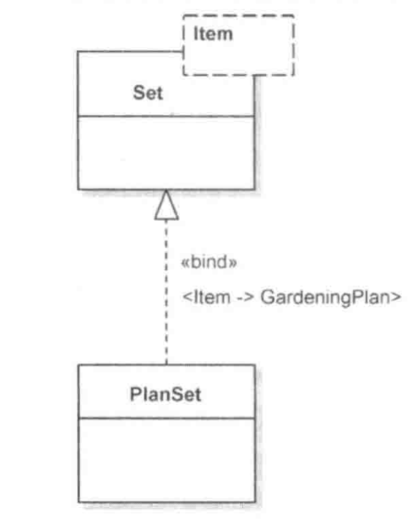
      - 类之间的关系
        - 关联
          - 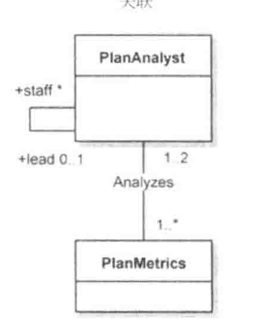
        - 泛化
          - “是一种” 的关系，即继承关系 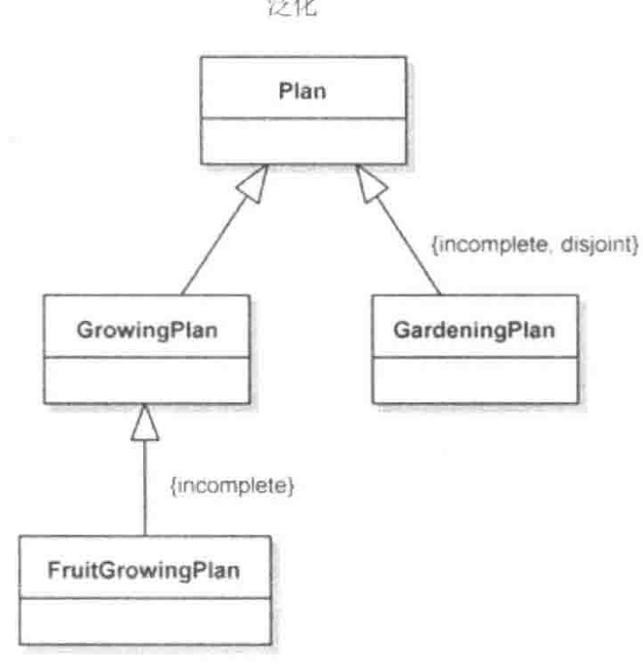
        - 聚合
          - 并不是物理上的包容关系，两者的生命周期相互独立 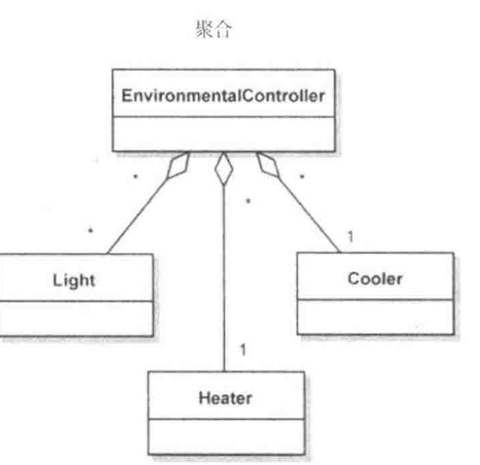
        - 组合
          - 物理包容的关系，两者的生命周期一致 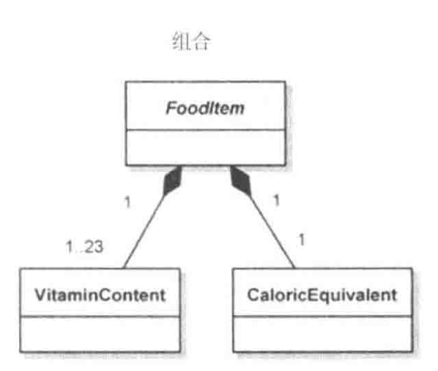
        - 多重性
          - 多重性应用于关联的目标端，说明源类的每个实例与目标类实例的连接个数。，除非显示说明，否则关系的多重性就是未指定的。
          - 语法 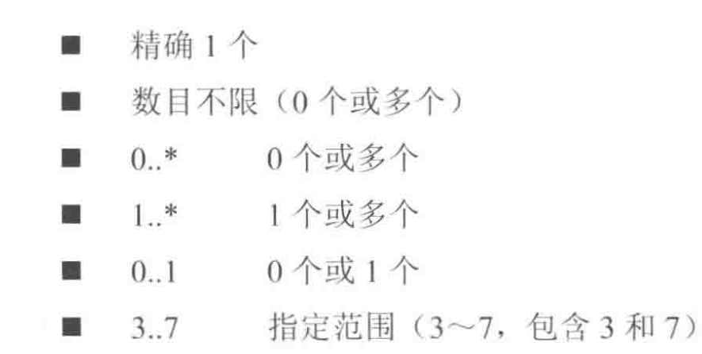
        - 可见性
          - 
      - 约束
        - 约束是类或关系中的不变式，当系统处于稳定状态时必须保持
        - 约束放在花括号 {} 中，约束表达式可以是自然语言
        - 约束摆放的位置 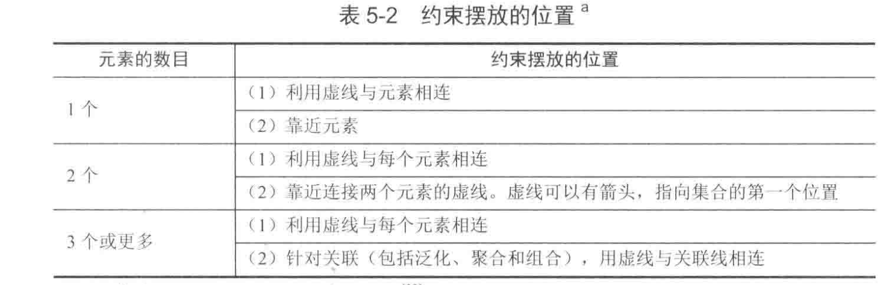
        - 泛化关系的 4 种约束 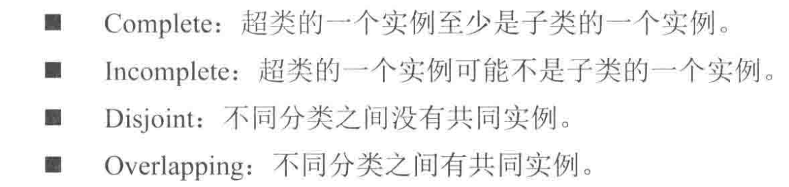
      - 关联类和注解
        - 其种， Crop 和 Nutrient 关联， NutrientSchedule 是关联类，用虚线连接，其它的为注解 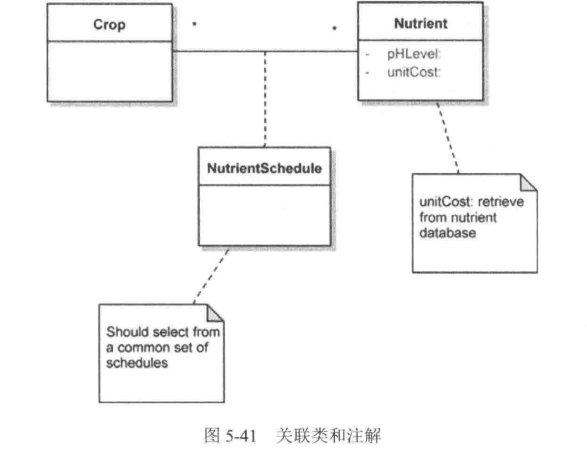
    - 组件图
      - 组件代表了一块可复用的软件，它提供了某种有意义的功能集
      - 组件是一组类。系统中的每个类要么处于一个组件中，要么处于系统的最顶层。组件也可以包含其它组件
      - 组件与组件之间通过定义良好的接口进行协作
      - 基本元素
        - 组件
        - 接口
        - 实现
      - 表示：可以通过一个组合结构来表示，包括：
        - 部件
        - 端口
          - 用小正方形来表示
          - 可以进行命名，格式为“端口名称：端口类型“ 其中，端口类型是可选的
        - 接口
          - 小球
            - 表示该组件向环境提供的功能
          - 球窝
            - 组件向环境要求的接口
          - 端口与接口并不是一一对应的关系，端口可以用来对接口分组，例如： 其中的球窝连接的端口有多个接口 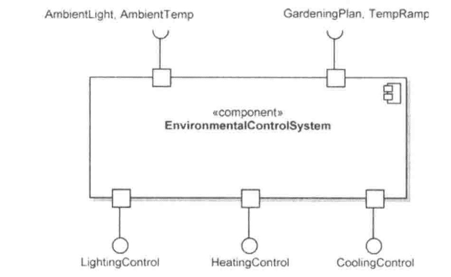
        - 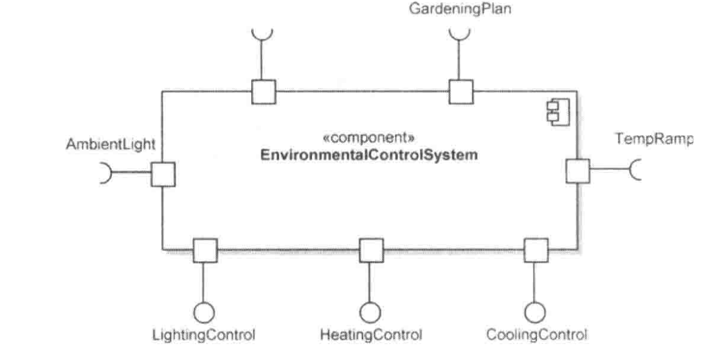
        - 连接器
          - 两个组件之间的接口被称为”组装连接器“，也被称为”接口连接器“
          - 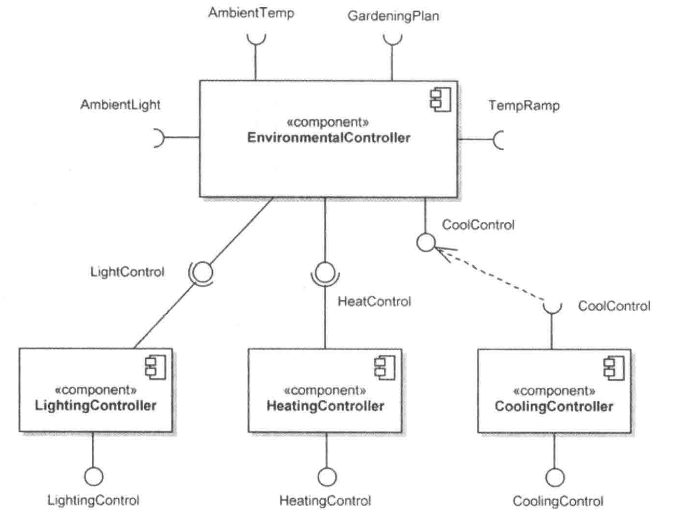
    - 部署图
      - 用于展示在系统的物理设计中，工件在节点上分布的情况。节点是系统执行的平台。
      - 三个基本元素
        - 工件
          - 物理上存在的一件东西，实现了一部分的软件设计，通常是软件代码、文档等
          - 工件之间的关系
            - 依赖
            - 组合
          - 表示： 带有工件名称的类矩形，关键词 &lt;&lt;artifact&gt;&gt; 及一个可选的的图标 
        - 节点
          - 用一个三维的立方体来表示
          - 其中，用一条实线（表示双向）来表示通信路径 加上箭头表示单向 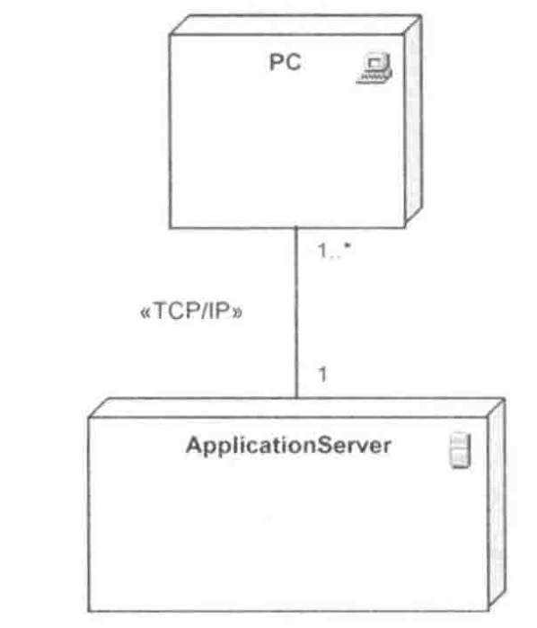
        - 工件与节点之间的连接
    - 对象图
      - 用于说明系统的逻辑设计中存在的对象以及对象之间的关系
      - 对象图代表了时间上的一张快照，记录了一组特定配置的对象上的瞬时事件流。因此，对象图是原型化的一一每张对象图都代表了结构上的关系，这些关系可能发生在一组给定的类实例上。从这个意义上说，单张对象图代表了系统对象结构的一张视图
      - 对象 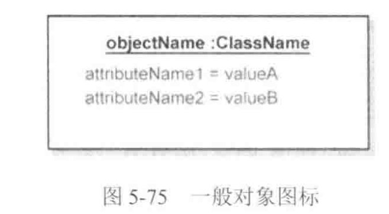
        - 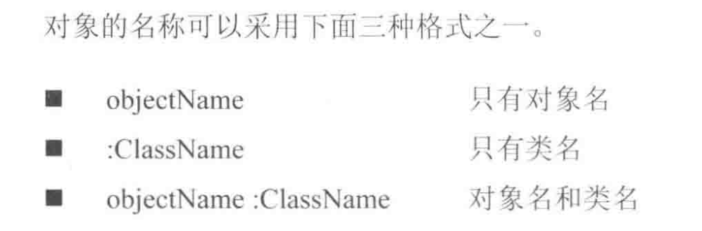
      - 对象关系 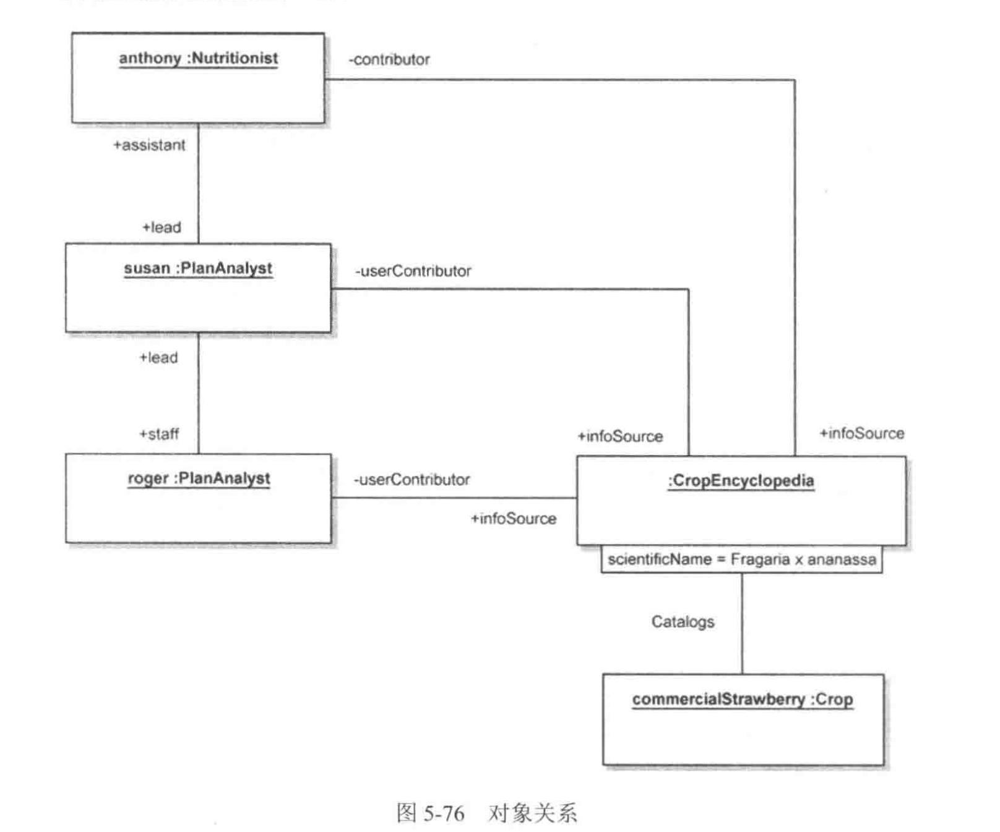
        - 当且仅当两个对象对应的类之间存在关联时，对象之间才可能存在链接。这种类关联可以通过任何方式实现，这意味着类的关系可以是简单的关联、泛化、聚合或组合。两个类中存在这种关联则表明，两个类的实例之间存在着一条通信路径（即链接），一个对象可以通过它向另一个对象发送消息。所有的类都隐式地有到自己的关联，因此对象可以向自己发送消息。
        - 端点名称：指出该对象扮演的角色。例如， Susan 像 CropEncyclopedia 对象传送信息，扮演着 userContributor 的角色
      - 利用和类图同样的表示方法，在对象图中使用的其他表示法还包括约束、关键词标签、导航和链接名称。
    - 组合结构图
      - 描述结构化类元及其内部结构的定义。这种内部结构是由部件及其相互连接构成的。 结构化类元可以是组件或者一个类
      - 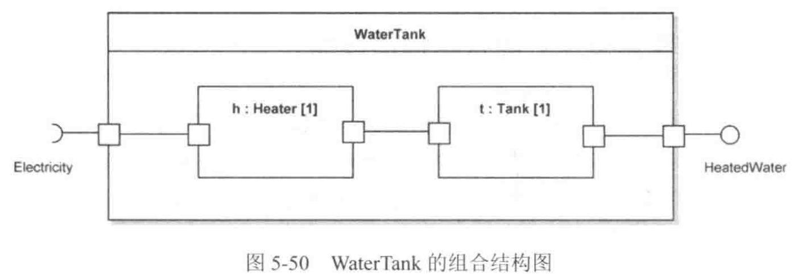
  - 行为图
    - 用例图
      - 执行者：是系统交互的实体，可以是人或者其它系统 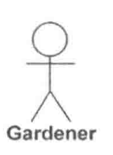
      - 用例：代表了执行者希望系统为他们做什么。 用椭圆表示 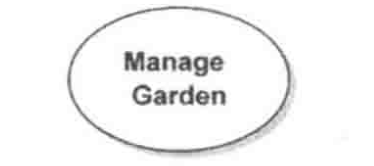
      - 执行者使用用例：用实线表示。 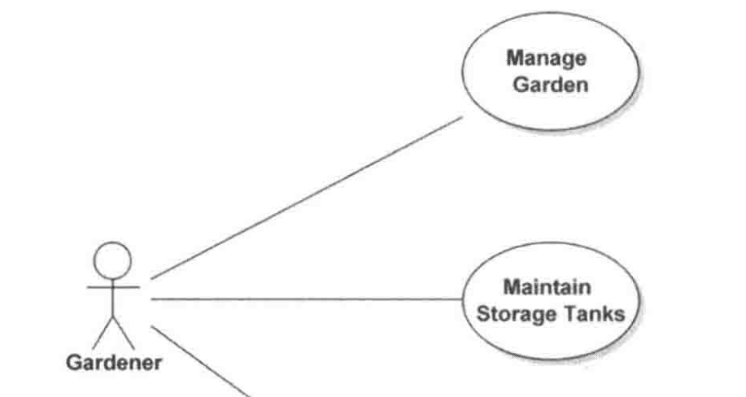
      - 用例之间的关系
        - &lt;&lt;include&gt;&gt; 关系
          - 表示其它两个用例都要用到 View Reports 用例 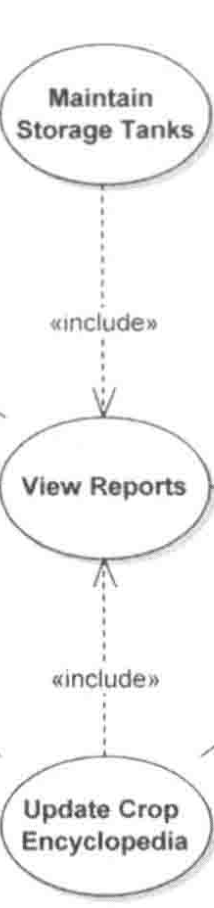
          - 当执行有包含其它用例的时候，就意味着被包含的用例必须也被执行，否则，包含其它用例的用例就不能看作是完整的
        - &lt;&lt;extend&gt;&gt;关系
          - 如果用例 A 扩展了用例 B，则 B 在执行时， A 不是必须的，所以，B 是完整的
        - Include 和 extend 之间的区别 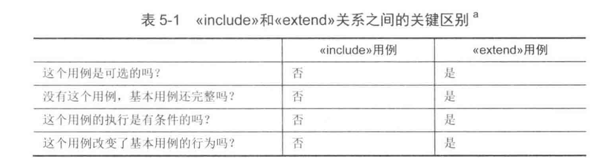
    - 活动图
      - 动作节点
        - 右下角的耙型符号，表示它是一个 callBehavior 类型的动作。这是 UML2 预定义的动作之一 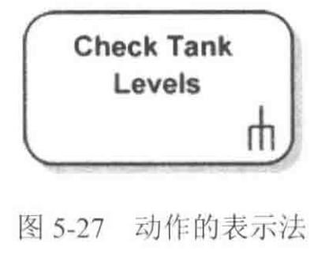
      - 控制节点
        - 初始节点
          - 被表示为一个实心的圆点 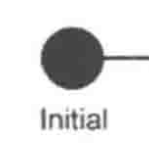
        - 终止节点
          - 活动终止
            - 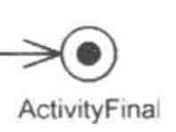
          - 流程终止
            - 有一个圆圈和一个 “X” 表示
        - 判断和合并节点
          - 判断节点
            - 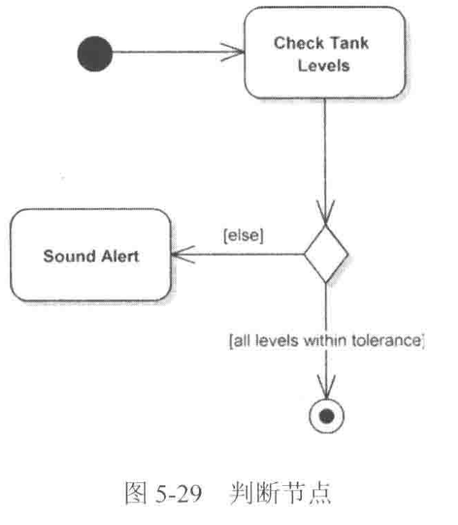
            - 具有一个进入流程和多个离开流程
          - 合并节点
            - 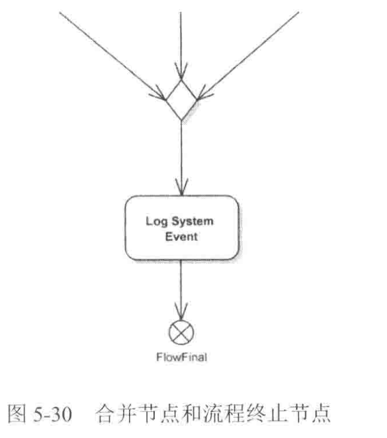
            - 接受多个进入流程，并全部导向一个离开流程
        - (分叉和结合节点)与并发
          - 分叉节点和结合节点分别与判断节点和合并节点类似，关键的不同之处在于并发
          - 分叉节点
            - 与判断节点的不同之处在于：会有多个离开流程，所有离开的流程是并发的
            - Set Fill Levels 就是一个分叉节点 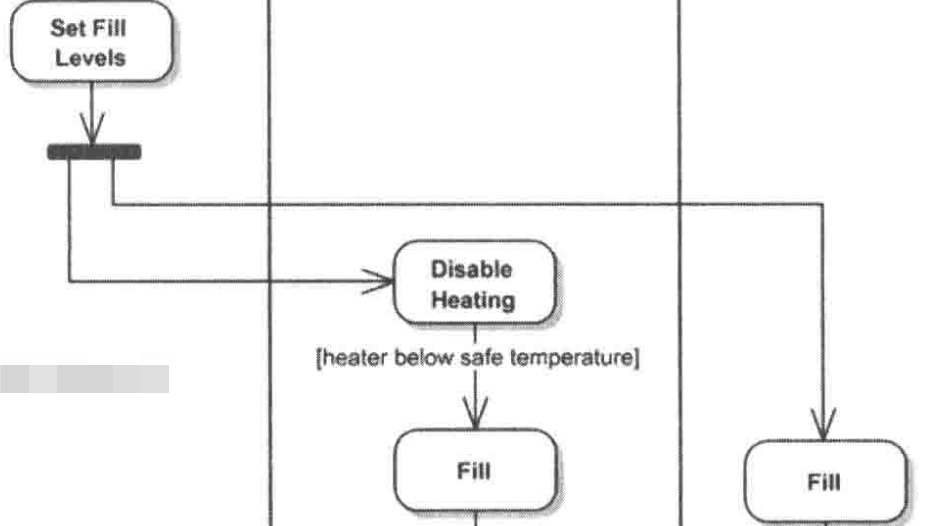
          - 结合节点
            - 具有多个进入流程和一个离开流程，但是，必须完成所有进入流程之后，才能够进入离开流程
      - 对象节点
        - 用矩形表示 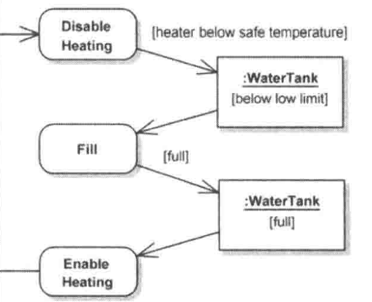
      - 分区
        - 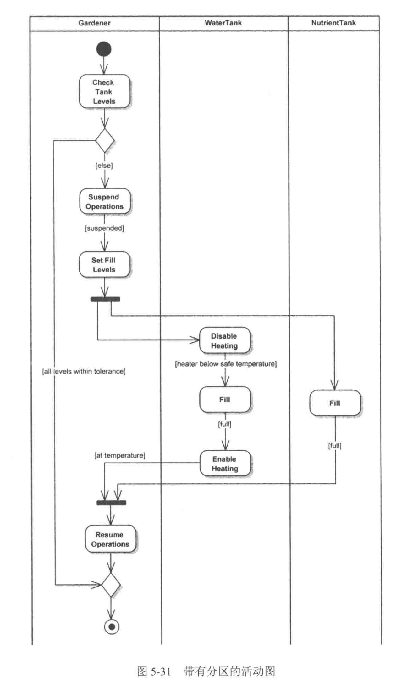
    - 状态图
      - 对象的状态代表了它的行为的累积结果
      - 初始状态
        - 每个状态图中，必须只有一个默认的初始状态
        - 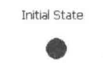
      - 结束状态
        - 空心圆套着一个实心圆 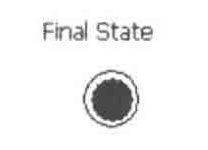
      - 简单状态
        - 状态的名称显示在表示状态的圆角矩形中
        - 简单状态没有子状态
        - 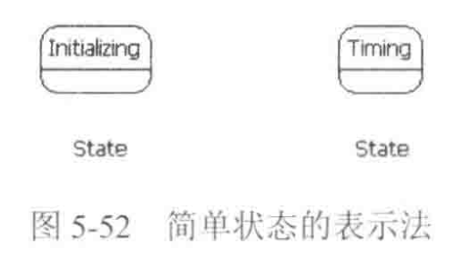
      - 转换
        - 状态之间的移动被称为“转换”
        - 表示为状态之间的有向箭头
        - 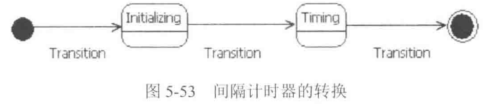
        - 有多种方式可以触发一次转换。
          - 没有标注的转换称为“完成转换”,意味着，当源状态完成时，这个转换就会自动触发，然后进入目标状态，例如上图的 Initializing 状态到 Timing 状态的转换 
          - 其他情况下：必须发生某些事件才能触发转换，这样的事件标注在转换上 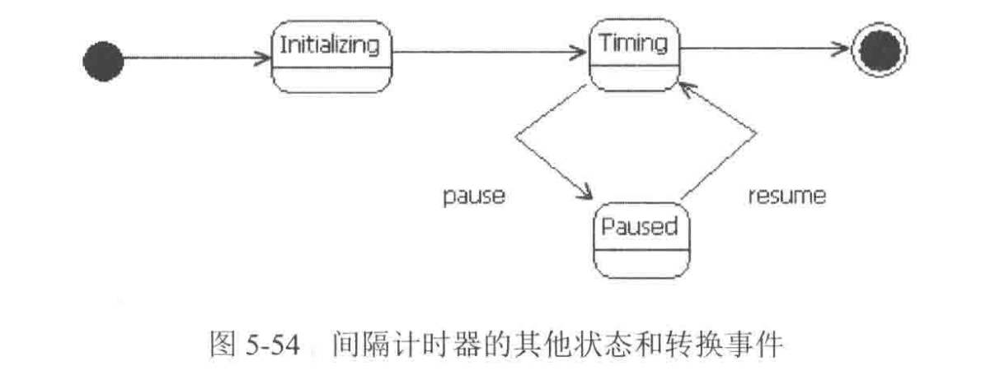
      - 状态活动
        - 活动可能与状态关联起来。可以制定在状态相关的某个时间点上执行某种活动
          - 在进行一个状态时执行一个活动
          - 在处于一个状态时执行一个活动
          - 在离开一个状态时执行一个活动
          - 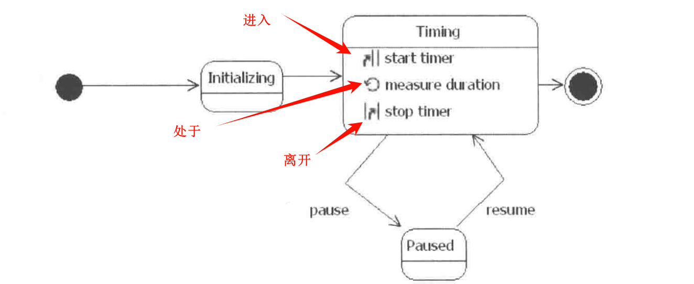
      - 控制转换
        - 通过条件或事件来控制转换
          - 条件用 [] 括起来 事件直接写 ![条件用 \[\] 括起来 事件直接写](images/e67e2a682a43917a045b2b31dfbfe53a4cbeb8df5f0112c1ba1991d416b56d56.png)
      - 嵌套状态 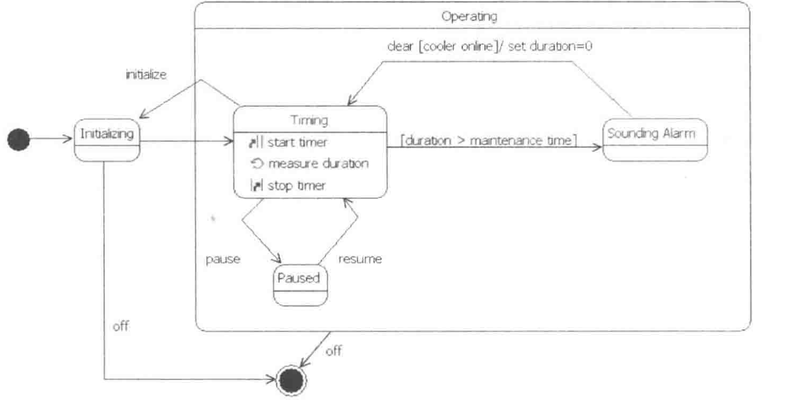
      - 并发与控制
        - 将单个状态用虚线分隔出多个区域 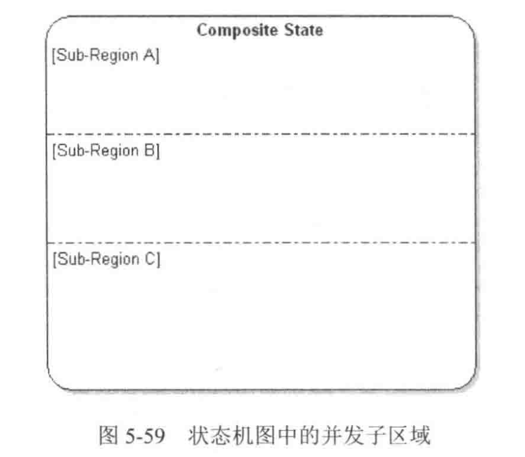
        - 转换至一个复合状态 所有状态都被激活，并发地开始工作 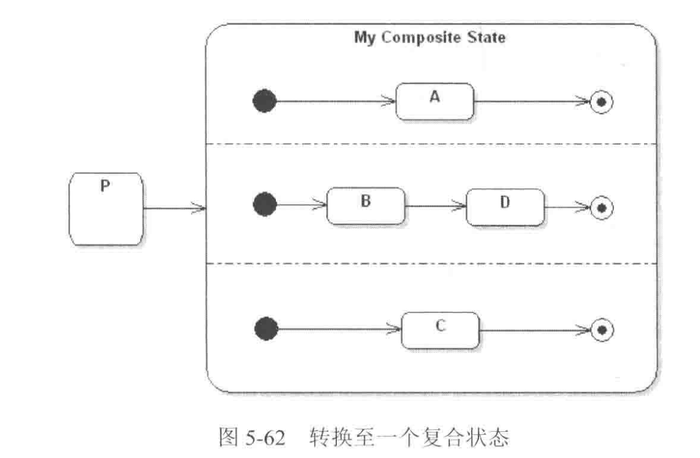
        - 分叉至一个复合状态 单一的转换可能有事件或者条件 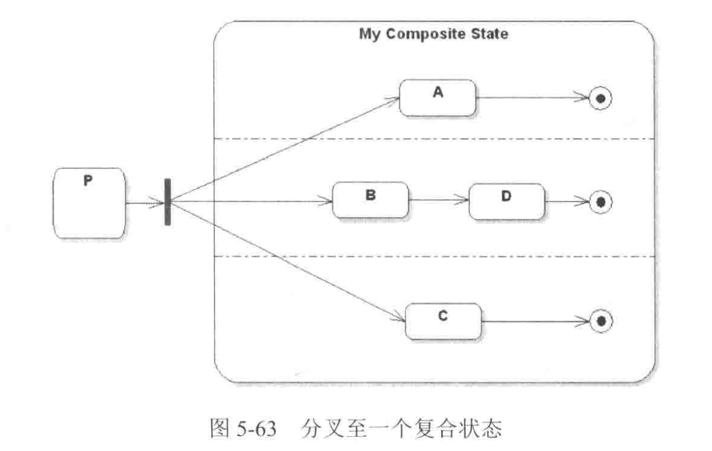
    - 交互图
      - 序列图
        - 实体
          - 实体被水平地放在图的顶部
        - 生命线
          - 竖直的虚线。在每个对象的下面，表示对象的存在
        - 消息
          - 表示事件或操作的调用，被画成水平的
          - 消息从发出者指向接收者，次序用垂直位置表示
          - 消息的类型
            - 同步消息
              - 一条带实心箭头的实线
            - 异步消息
              - 一条带开放箭头的实线
            - 返回消息
              - 带开放箭头的虚线
            - 丢失的消息
              - 以端点（黑圆点）终止
            - 发现的消息
              - 起点为一个端点符号
            - 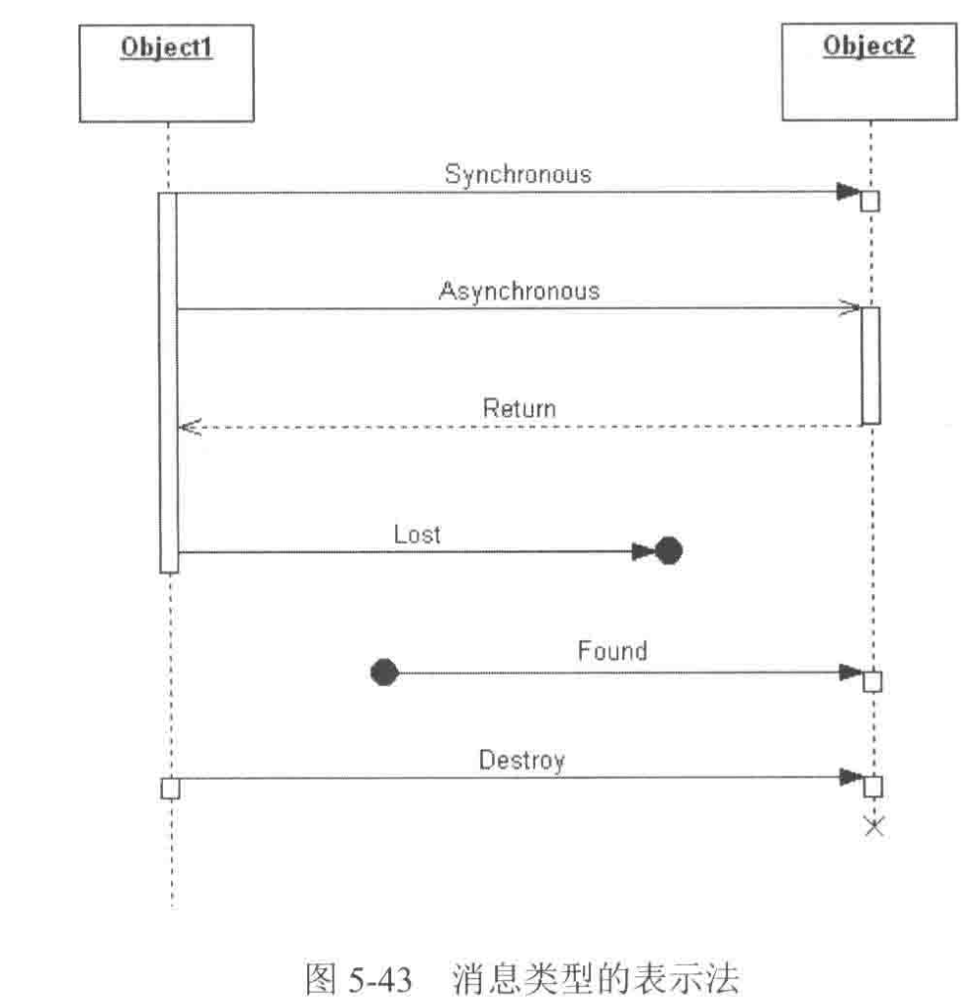
          - 销毁事件
            - 表示为生命线末端的 X
            - 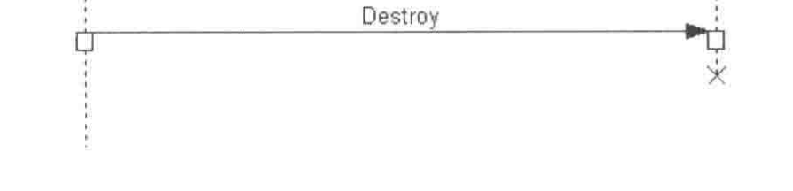
        - 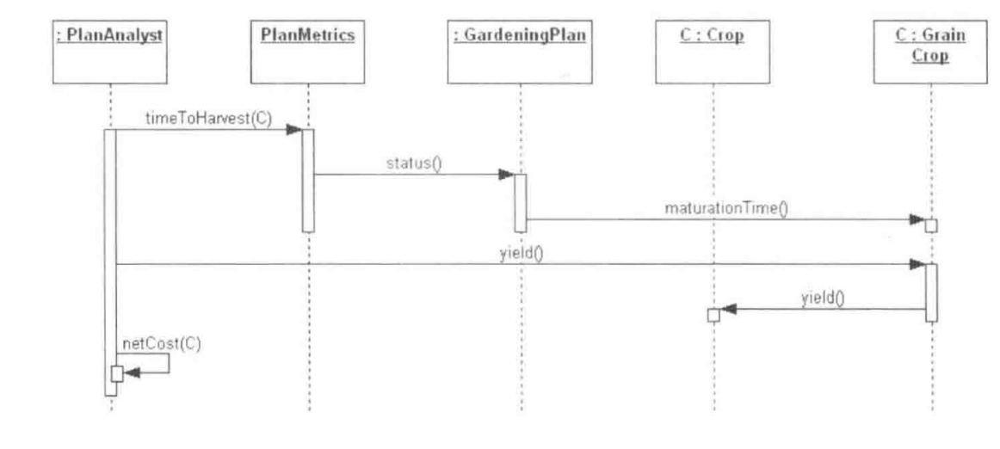
        - 引用另一个序列图
          - 采用带 ref 标签的框来表示，实际的 login 序列图在另一个序列图中表示 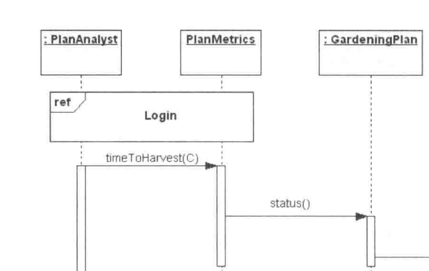
        - 循环某个序列
          - 带 loop 标签的框，条件由 [condition] 表示 ![带 loop 标签的框，条件由 \[condition\] 表示](images/68372e5be28875a38029062042476babf41fa4a1597d7e816e13bc32874b9312.png)
          - 带 alt 标签的框用于表示从 loop 的condition 中选出一些来执行（相当于 if 语句） 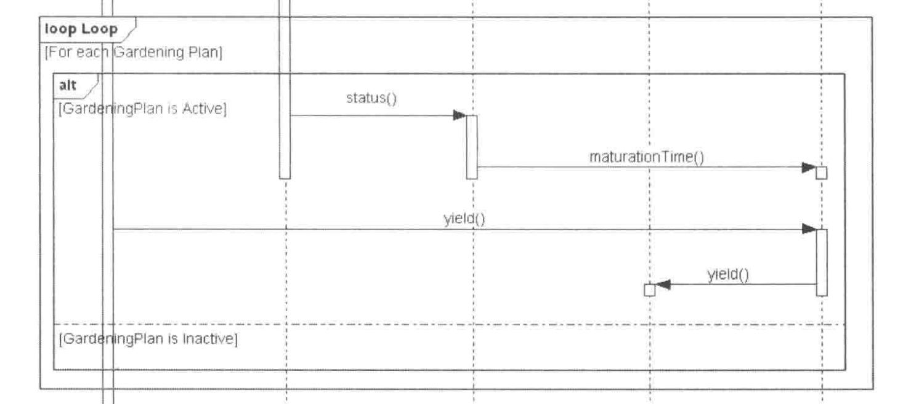
      - 通信图
        - 两个类的实例之间存在着一条通信路径（即链接），一个对象可以通过它向另一个对象发送消息。
      - 交互概述图
        - 是活动图和交互图的结合，目的是概述交互图元素之间的控制流
        - 框
          - 交互概述图通常由一个框围绕，在上下文背景清楚的时候，可以省略
          - sd： 标签，表明这是一张交互图 Maintain Temperature: 名称，描述这张图的目的 lifelines: EnviromentalController, :heater, :Coller: 可选的生命线的列表 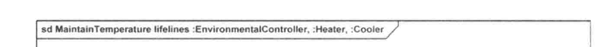
        - 控制流元素
        - 交互图元素
        - 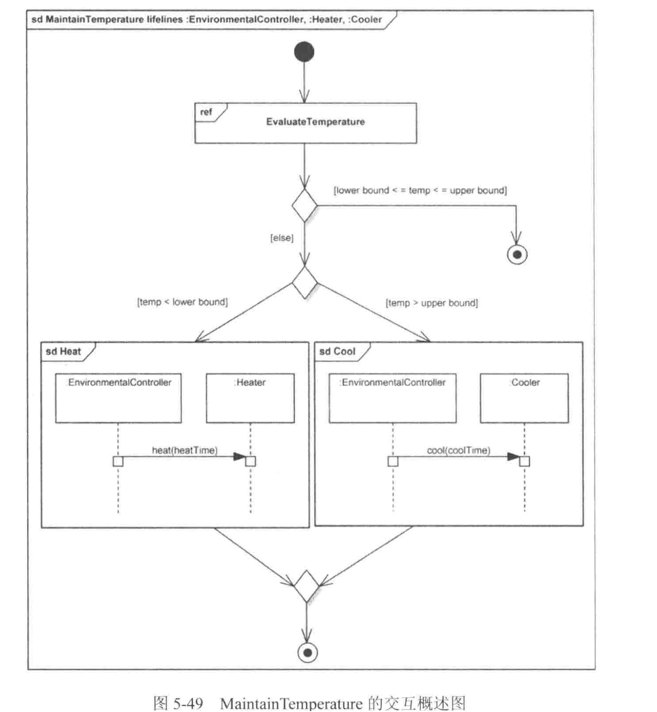
      - 时间图
        - 一般的事件图
          - 一般时间图 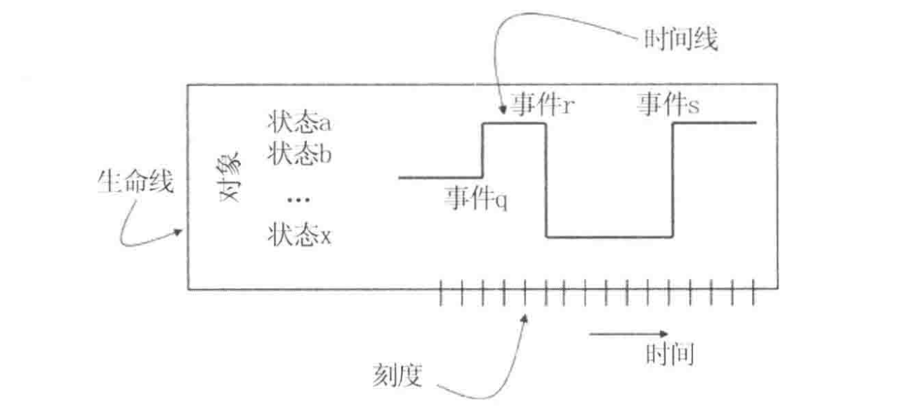
          - 生命线的名称就是对象的名称，对象可能的状态被列在生命线内。同时，生命线也显示了对象如何从一个状态转变到另一个状态
          - 导致状态转变的事件显示在时间线旁
          - 例如 TankLow 和 TankFull，它们导致了阀门的状态改变。 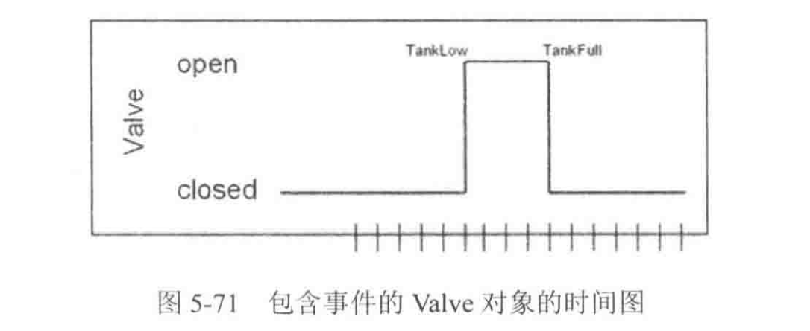
          - 包含约束的时间图 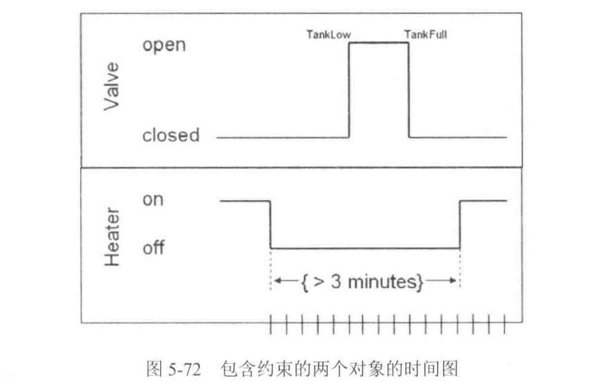
          - 事件与消息
            - 消息 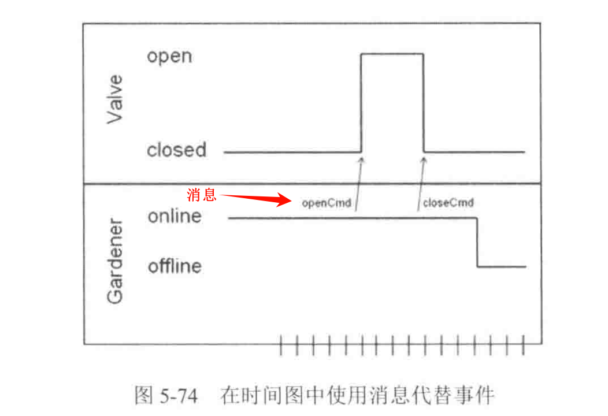
        - 另一种表示形式
          - 在这里，状态的改变没有表示为时间线的抬升或下降，而是显示为沿着水平轴的变化。 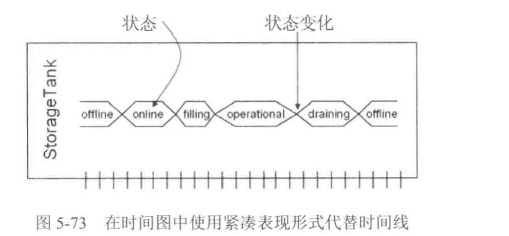
```
