```markmap
---
markmap:
  initialExpandLevel: 2
  spacingVertical: 30
  spacingHorizontal: 180
---

# RUST Macro
- 编译过程
  - 1\. Tokenization
    - 在此阶段，源代码被转换成一系列 token
    - token 的类型
      - 标识符（indentifiers）
        - 如foo, Bambous, self, we_can_dance, LaCaravane, …
      - 字面值（literals）
        - 42, 72u32, 0_______0, 1.0e-40, "ferris was here", …
      - 关键字（keywords）
        - _, fn, self, match, yield, macro, …
      - 符号（symbol）
        - [, :, ::, ?, ~, @ ,...
    - token trees（标记树）
      - 介于 token 和 AST 之间
      - 例如 a + b + (c + d[0]) + e 得到的标记树如下所示： ![例如 a + b + (c + d\[0\]) + e 得到的标记树如下所示：](images/ascii-445800a087b50e8f7d74.png)
        - 而其 AST 如下所示（只有一个根节点）： 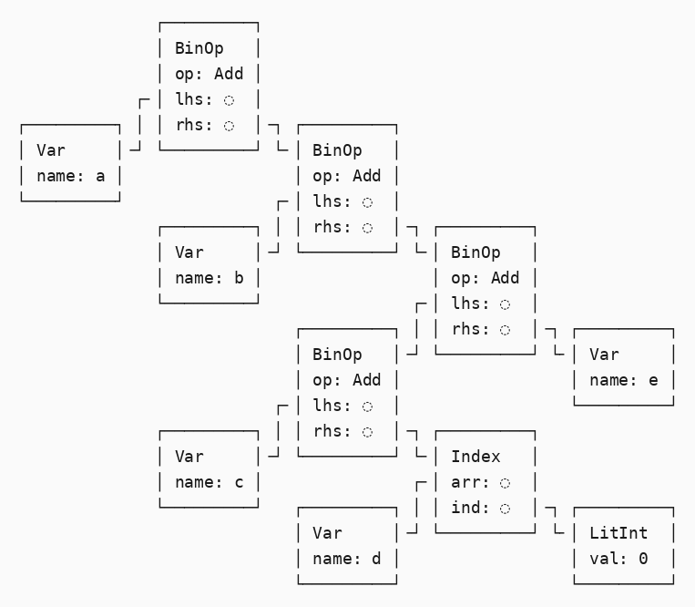
      - 不可能出现不匹配的小/中/大括号，也不可能存在包含错误嵌套结构的标记树
  - 2\. 语法解析（parsing）
    - 在此阶段，token 被转换成一颗抽象语法树（AST），并在内存中建立起程序的语法结构
    - 例如 1 + 2 被转换成： 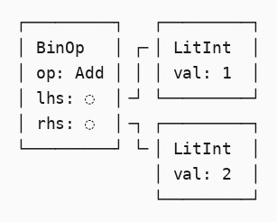
- 语法扩展概述
  - 之所以叫语法扩展（syntax extension）是为了与之后的 macro 关键字进行区分
  - 语法扩展的形式
    - \# [ $arg ]
      - #[derive(Clone)], #[no_mangle], …
    - \# ! [ $arg ]
      - #![allow(dead_code)], #![crate_name="blang"], …
    - $name ! $arg
      - println!("Hi!"), concat!("a", "b"), …
    - $name ! $arg0 $arg1
      - macro_rules! dummy { () =&gt; {}; }.
  - 语法扩展可能出现的位置
    - 模式 (pattern)
    - 语句 (statement)
    - 表达式 (expression)
    - 条目 (item) （包括 impl 块）
    - 类型
  - 不支持语法扩展的位置
    - 标识符 (identifier)
    - match 分支
    - 结构体的字段
  - 语法扩展的展开
    - 在生成 AST 之后，进行语义理解之前，会对所有语法扩展进行展开
    - 过程
      - 遍历 AST，确定所有语法扩展调用的位置，并把它们替换成展开的内容
      - 例如： let eight = 2 * four!(); 尚未进行扩展时如下： 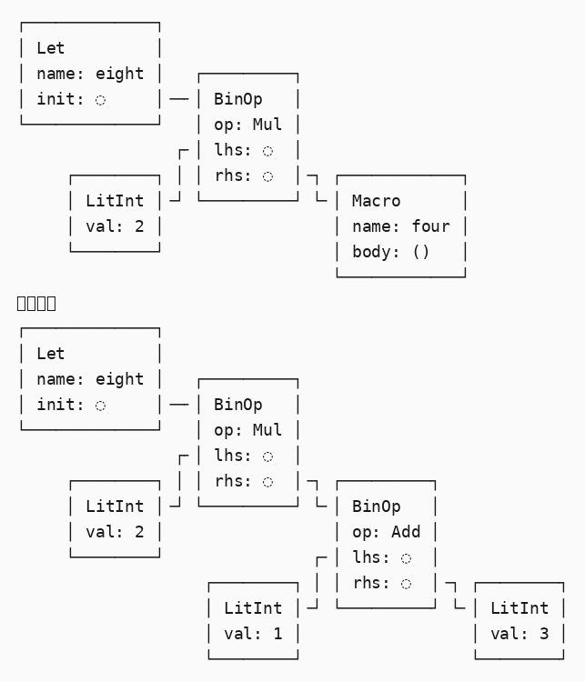
- 声明式宏
  - 形如 $name ! $arg 的宏
  - $arg 是一棵非叶子节点的 token tree，即(...)、[...] 或 {...}。这些括号被称为分组符号
  - macro_rules!
    - 形式如下： macro_rules! $name { $rule0 ; $rule1 ; // … $ruleN ; }
      - 至少得有一条规则
      - 最后一条规则的分号可以省略
      - 每条 rule 都形如： ($matcher) =&gt; {$expansion}
      - 定义的规则不关心 ($matcher) =&gt; {$expansion} 中的外层括号类型，但 matcher 和 expansion 之内的括号属于匹配和展开的内容，所以它们内部使用什么括号取决于你需要什么语法
        - 假如使用 m! 这个宏，如果该宏展开成条目，则必须使用 m! { ... } 或者 m!( ... );； 如果该宏展开成表达式，你可以使用 m! { ... } 或者 m!( ... ) 或者 m![ ... ]
    - 当一个宏被调用时，macro_rules! 解释器按照声明顺序一一检查规则
    - 对于每条规则，某个 matcher 必须与输入完全匹配才被认为是一次匹配
    - matcher 也可以包含字面上的标记树
      - macro_rules! gibberish { (4 fn ['spang "whammo"] @_@) =&gt; {...}; }
      - 使用 gibberish!(4 fn ['spang "whammo"] @_@]) 即可成功匹配和调用
    - 在当前 rust 版本中，宏不能嵌套使用：
      - 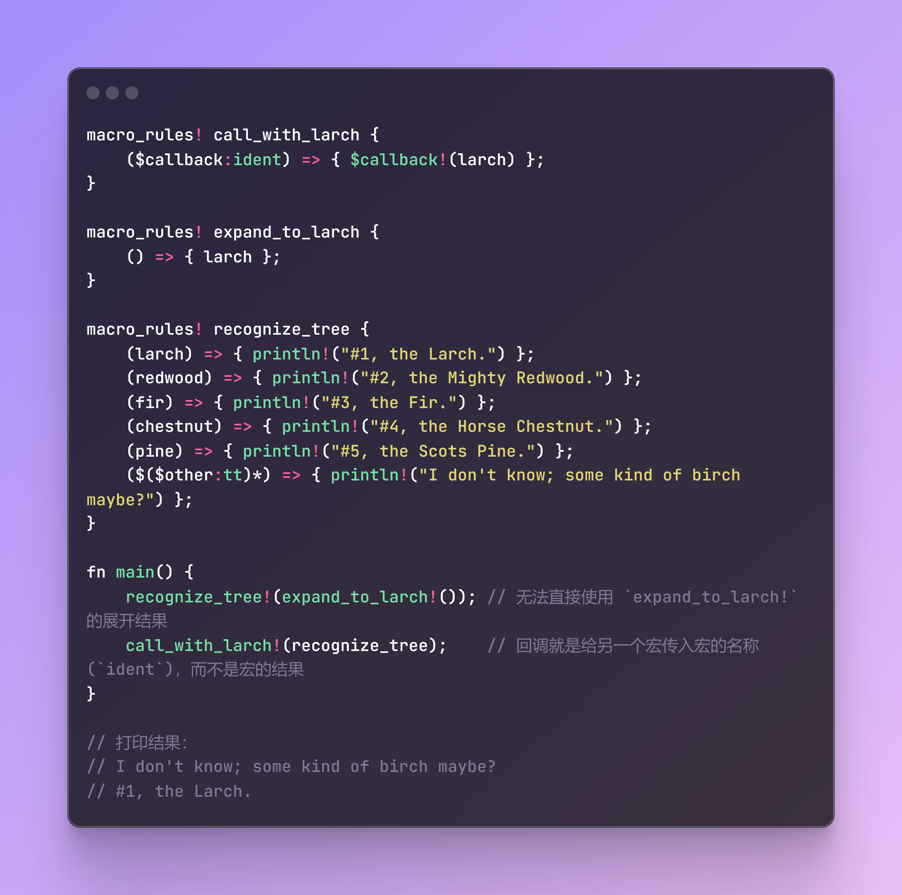
    - 内用规则
      - #[macro_export] macro_rules! as_expr { ($e:expr) =&gt; {$e} } #[macro_export] macro_rules! foo { ($($tts:tt)*) =&gt; { as_expr!($($tts)*) }; } 上述代码可以被替换为：
        - #[macro_export] macro_rules! foo { (@as_expr $e:expr) =&gt; {$e}; ($($tts:tt)*) =&gt; { foo!(@as_expr $($tts)*) }; } fn main() { assert_eq!(foo!(42), 42); }
      - 内用规则通常应排在“真正的”规则之前。 这样做可避免 macro_rules! 错把内用规则调用解析成别的东西，比如表达式
      - 性能
        - 内用规则会增加编译时间
  - 元变量
    - matcher 还可以包含 captures，即使用某种通用语法来匹配输入，并将结果捕获到元变量中，然后使捕获后的元变量在输出（expansion）中可用
    - captures 语法
      - $indentifier:capture-method
      - fragment-specifier
        - 捕获方式（又称 fragment-spcifier，片段分类符），必须是以下一种：
          - block
            - 一个块（比如一块语句或者由大括号包围的一个表达式）
            - macro_rules! blocks { ($($block:block)*) =&gt; (); } blocks! { {} { let zig; } { 2 } } fn main() {}
          - expr
            - 一个表达式 (expression)
            - expr 元变量总是捕获完整且符合 Rust 编译版本的表达式
            - macro_rules! expressions { ($($expr:expr)*) =&gt; (); } expressions! { "literal" funcall() future.await break 'foo bar } fn main() {}
          - ident
            - 一个标识符 (identifier)，包括关键字 (keywords)
            - macro_rules! idents { ($($ident:ident)*) =&gt; (); } idents! { // _ &lt;- `_` 不是标识符，而是一种模式 foo async O_________O _____O_____ } fn main() {}
          - item
            - [一个条目（比如函数、结构体、模块、impl 块）](https://doc.rust-lang.org/reference/items.html)
            - [macro_rules! items { ($($item:item)*) =&gt; (); } items! { struct Foo; enum Bar { Baz } impl Foo {} /*...*/ } fn main() {}](https://zjp-cn.github.io/tlborm/decl-macros/minutiae/fragment-specifiers.html#item)
          - lifetime
            - 一个生命周期注解（比如 'foo、'static）
            - macro_rules! lifetimes { ($($lifetime:lifetime)*) =&gt; (); } lifetimes! { 'static 'shiv '_ } fn main() {}
          - literal
            - 一个字面值（比如 "Hello World!"、3.14、'🦀'）
            - macro_rules! literals { ($($literal:literal)*) =&gt; (); } literals! { -1 "hello world" 2.3 b'b' true } fn main() {}
          - meta
            - 一个元信息（比如 #[...] 和 #![...] 属性内部的东西）
            - macro_rules! metas { ($($meta:meta)*) =&gt; (); } metas! { ASimplePath super::man path = "home" foo(bar) } fn main() {}
          - pat
            - [一个模式 (pattern)](https://doc.rust-lang.org/reference/patterns.html)
            - macro_rules! patterns { ($($pat:pat)*) =&gt; (); } patterns! { "literal" _ 0..5 ref mut PatternsAreNice 0 | 1 | 2 | 3 } fn main() {}
          - pat_param
            - 从 2021 版本开始，or-patterns 模式开始应用，这让 pat 分类符后不允许跟随 `|`，为了解决这个问题，可以使用 pat_param 片段，允许 `|` 跟在其后面
              - 因为 pat_param 不允许 top level 或 or-patterns
            - macro_rules! patterns { ($( $( $pat:pat_param )|+ )*) =&gt; (); } patterns! { "literal" _ 0..5 ref mut PatternsAreNice 0 | 1 | 2 | 3 } fn main() {}
          - [path](https://doc.rust-lang.org/reference/paths.html#paths-in-types)
            - 一条路径（比如 foo、::std::mem::replace、transmute::&lt;_, int&gt;）
            - macro_rules! paths { ($($path:path)*) =&gt; (); } paths! { ASimplePath ::A::B::C::D G::&lt;eneri&gt;::C FnMut(u32) -&gt; () } fn main() {}
          - stmt
            - [一条语句 (statement)](https://doc.rust-lang.org/reference/statements.html)
            - 除非 item 语句要求结尾有分号，否则不会匹配语句最后的分号
            - macro_rules! statements { ($($stmt:stmt)*) =&gt; ($($stmt)*); } fn main() { statements! { struct Foo; fn foo() {} let rust = 3; let rust = 3; if true {} else {} {} } }
          - tt
            - 单棵标记树
          - ty
            - 一个类型
            - macro_rules! types { ($($type:ty)*) =&gt; (); } types! { foo::bar bool [u8] impl IntoIterator&lt;Item = u32&gt; } fn main() {}
          - vis
            - 一个可能为空的可视标识符（比如 pub、pub(in crate)）
            - macro_rules! visibilities { // ∨~~注意这个逗号，`vis` 分类符自身不会匹配到逗号 ($($vis:vis,)*) =&gt; (); } visibilities! { , // 没有 vis 也行，因为 $vis 隐式包含 `?` 的情况 pub, pub(crate), pub(in super), pub(in some_path), } fn main() {}
          - 除了 ident、lifetime 和 tt 分类符之外，其余的分类符在匹配后生成的 AST 是不清楚的 (opaque)，这使得在之后的宏调用时不可能检查 (inspect) 捕获的结果
            - [上述代码会输出 "21"](https://dtolnay.github.io/rust-quiz/9) 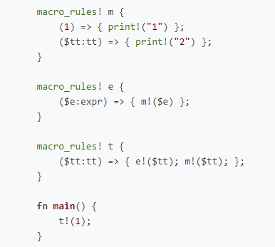
        - 捕获之后，就可以使用 $indentifier 在 expansion 中引用元变量
          - 例如： macro_rules! multiply_add { ($a:expr, $b:expr, $c:expr) =&gt; { $a * ($b + $c) }; }
      - $crate 是一个特殊的元变量，用来指代当前的 crate
      - 反复（repetition）
        - matcher 可以反复捕获，是的匹配一连串的 token 成为可能
        - 一般形式是： $(...)separator repetition
          - ( ... ) 是被反复匹配的模式，由小括号包围
          - separator 是可选的分隔标记。它不能是括号或者反复操作符 rep。常用例子有 , 和 ;
          - repetition 是必须的重复操作符
            - `?` 表示最多一次重复，所以在前面不能有分隔符
            - `*` 表示零次或多次重复
            - `+` 表示一次或多次重复
        - 在 expansion 中，使用被反复捕获的内容时，也采用相同的语法。而且被反复捕获的元变量只能存在于反复语法内
          - 例如 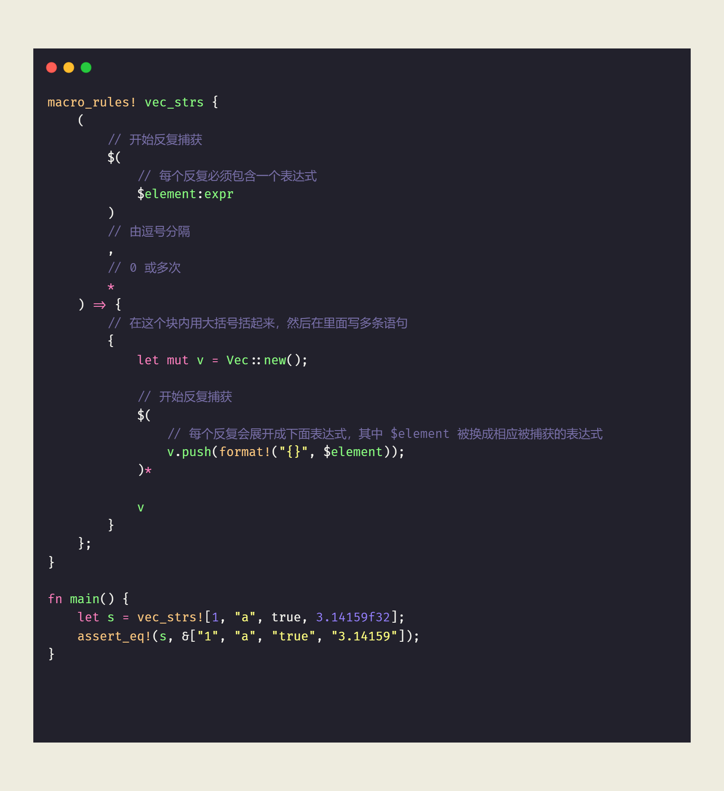
        - 可以在一个反复语句里面使用多次和多个元变量，只要这些元变量以相同的次数重复
          - 例如 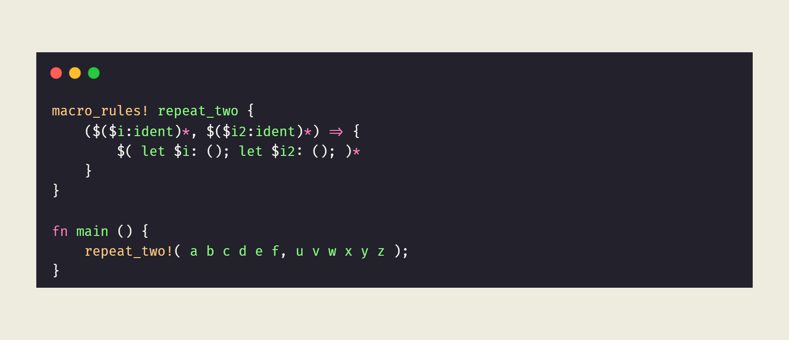
      - 元变量表达式
        - expansion 部分可以包含元变量表达式，用来提供元变量的相关信息
        - 现存的表达式（idnet 表示元变量的名称、depth 是整形字面量）
          - ${count(ident)}：最里层反复 $ident 的总次数，相当于 ${count(ident, 0)}
          - ${count(ident，depth)}：第 depth 层反复 $ident 的次数
          - ${index()}：最里层反复的当前反复的索引，相当于 ${index(0)}
          - ${index(depth)}：在第 depth 层处当前反复的索引，向外计数
          - ${length()}：最里层反复的重复次数，相当于 ${length(0)}
          - ${length(depth)}：在第 depth 层反复的次数，向外计数
          - ${ignore(ident)}：绑定 $ident 进行重复，并展开成空
          - $$：展开为单个 $，这会有效地转义 $ 标记，因此它不会被展开（转写）
            - 使在宏中编写宏成为可能
  - 导出宏
    - #[macro_export]
      - 可通过 #[macro_export] 将宏从当前crate导出。注意，这种方式无视所有可见性设定
      - mod macros { #[macro_export] macro_rules! X { () =&gt; { Y!(); } } #[macro_export] macro_rules! Y { () =&gt; {} } } // X! 和 Y! 并非在此处定义的，但它们 **的确** 被导出了（在此处可用） // 即便 `macros` 模块是私有的
      - X!(); // X 在当前 crate 中被定义 #[macro_use] extern crate macs; // 从 `macs` 中导入 X X!(); // 这里的 X 是最新声明的 X，即 `macs` crate 中导入的 X
    - 模块
      - 在模块前加上 #[macro_use] 属性：导出该模块内的所有宏， 从而让导出的宏在所定义的模块结束之后依然可用
        - mod a { // X!(); // undefined } #[macro_use] mod b { macro_rules! X { () =&gt; { Y!(); }; } // X!(); // defined, but Y! is undefined } macro_rules! Y { () =&gt; {}; } mod c { X!(); // defined, and so is Y! } fn main() {}
      - 给 extern crate 语句加上 #[macro_use] 属性： 把外部 crate 定义且导出的宏引入当前 crate 的根/顶层模块
        - 只有在根模块中，才可将 #[macro_use] 用于 extern crate
      - 在从 extern crate 导入宏时，可显式控制导入哪些宏。 从而利用这一特性来限制命名空间污染，或是覆盖某些特定的宏
        - // 只导入 `X!` 这一个宏 #[macro_use(X)] extern crate macs; // X!(); // X! 已被定义，但 Y! 未被定义。X 与 Y 无关系。 macro_rules! Y { () =&gt; {} } X!(); // X 和 Y 都被定义 fn main() {}
  - 细节
    - 书写宏规则的顺序
      - 一旦语法分析器开始消耗标记以匹配某捕获，整个过程便 无法停止或回溯 。 这意味着，无论输入是什么样的，下面这个宏的第二项规则将永远无法被匹配到
      - macro_rules! dead_rule { ($e:expr) =&gt; { ... }; ($i:ident +) =&gt; { ... }; } fn main() { dead_rule!(x+); }
        - 第二条规则永远不会被匹配
      - 应从最具体的开始写起，依次写直到最不具体的
    - 片段分类符的跟随限制
      - stmt 和 expr
        - =&gt;、,、; 之一
      - pat
        - =&gt;、,、=、if、in 之一
      - pat_param
        - =&gt;、,、=、|、if、in 之一
      - path 和 ty
        - =&gt;、,、=、|、;、:、&gt;、&gt;&gt;、[、{、as、where 之一； 或者 block 型的元变量
      - vis
        - ,、除了 priv 之外的标识符、任何以类型开头的标记、 ident 或 ty 或 path 型的元变量
  - [卫生性](https://zjp-cn.github.io/tlborm/decl-macros/minutiae/hygiene.html#%E5%AE%8F%E6%98%AF%E9%83%A8%E5%88%86%E5%8D%AB%E7%94%9F%E7%9A%84)
    - 卫生性 (hygiene) 描述的是：标识符在宏处理和展开过程中是“唯一的”、“没有歧义的”、“不被同名标识符污染的”
    - [宏是部分卫生的（partially/mixed hygiene）](https://dtolnay.github.io/rust-quiz/24)
      - 局部变量、labels、$crate 是卫生的
  - 非标识符的“标识符”
    - self 可以使用 ident 或者 tt 分类符来匹配
    - _ 只能在模式中使用，不能用 ident 分类符匹配，而是用 pat 或者 tt 分类符匹配
  - 调试
    - [trace_macros!](https://doc.rust-lang.org/std/macro.trace_macros.html)
      - 在每次声明宏展开之前，指示编译器记录下声明宏的调用信息
      - 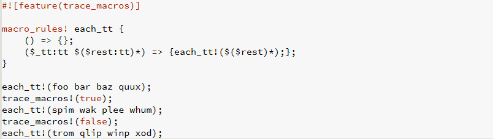
        - 输出 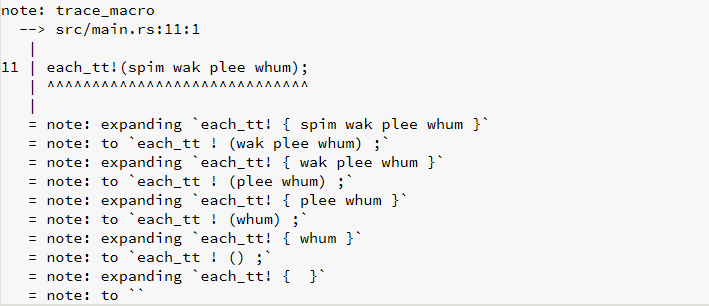
    - log_syntax!
      - 使得编译器输出所有经过编译器处理的 token
      - 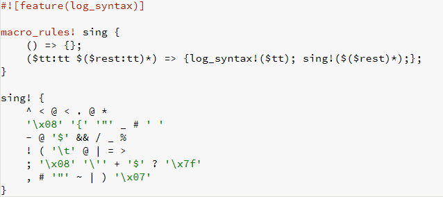
        - 输出 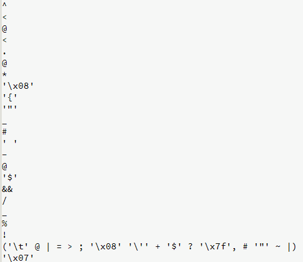
    - macro_railroad!
      - 不是 std 自带
      - 可视化地生成 Rust macro_rules! 宏的语法图 (syntax diagrams)
- 过程宏
  - 基础
    - 过程宏采用 Rust 函数的形式，接收 1 个或 2 个 token 流并输出一个 token 流
    - 过程宏必须在一个独立的 crate 中，其该 crate 的类型为 proc-macro
      - 在该 crate 的 Cargo.toml 中设置如下语句： [lib] proc-macro = true 即可将该 crate 的类型设置为 proc-macro
    - [类型为 proc-macro 的 crate 会隐式链接到编译器提供的 proc_macro 库](https://doc.rust-lang.org/proc_macro/index.html)
      - 它公开了 2 个重要的类型
        - TokenStream
        - Span
          - 表示源码的一部分，主要用于错误信息的报告和卫生性
    - 调用过程宏与编译器展开成声明宏是在同一阶段运行，只是过程宏是编译器编译、运行、最后替换或追加的独立的 Rust 程序
      - 过程宏可以享受与编译器相同的资源
        - 可以访问编译器才能访问的标准输入/输出/错误
        - 可以访问编译迁建生成的文件（如果 build.rs）
      - 过程宏报告错误的两种方式
        - panic
        - [调用 compile_error! 宏](https://doc.rust-lang.org/std/macro.compile_error.html)
    - 过程宏不是卫生的
      - 生成的 token stream 内联写入到紧邻的代码
      - 生成的 token stream 受到外部引入 items 的影响
    - 过程宏的 3 种类型
      - 函数式
        - #[proc_macro] pub fn name(input: TokenStream) -&gt; TokenStream { TokenStream::new() }
      - 属性式
        - #[proc_macro_attribute] pub fn name(attr: TokenStream, input: TokenStream) -&gt; TokenStream { TokenStream::new() }
      - derive 式
        - #[proc_macro_derive(Name)] pub fn my_derive(input: TokenStream) -&gt; TokenStream { TokenStream::new() }
        - 辅助属性
          - [可以添加在条目定义范围内可见的附加属性，这些属性被称为派生宏辅助属性（derive macro helper attributes），并且是惰性的（inert，详情见链接）](https://doc.rust-lang.org/reference/attributes.html#active-and-inert-attributes)
            - 所谓的惰性的，就是指在属性被处理的过程中，不会去移除自己，而 active 的属性会在属性被处理的过程中，移除自己
            - 除了属性宏的属性是 active 的，其他属性都是 inert 的
          - 辅助属性的目的是在每个结构体字段或枚举体成员的基础上为 derive 宏提供额外的可定制性
          - 语法 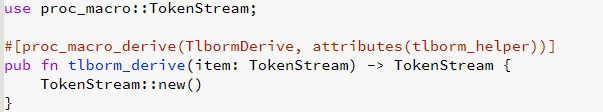
  - 第 3 方 crate
```
