```markmap
---
markmap:
  initialExpandLevel: 2
  spacingVertical: 30
  spacingHorizontal: 180
---

# Redis
- 数据结构
  - 简单动态字符串（simple dynamic string,SDS）
    - redis 没有使用 C 语言的字符串
    - SDS 用作 redis 的默认字符串表示，C 语言的字符串只是用作字符串字面量使用（例如日志中的输出语句）
    - 结构定义 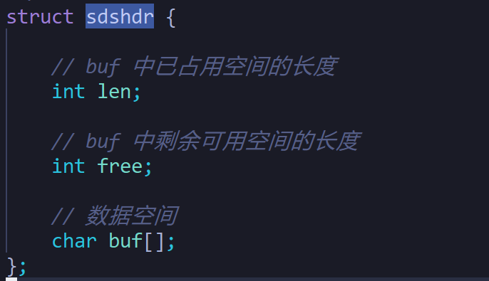
    - 通过 free 字段实现了 SDS 的空间预分配和惰性空间释放
      - 空间预分配
        - 当对一个SDS进行修改，并且需要对SDS进行空间扩展的时候，程序不仅会为SDS分配修改所必须要的空间，还会为SDS分配额外的未使用空间
        - 算法
          - 如果修改后的 SDS.len &lt; 1MB，那么，分配和 SDS.len 相同的空间
          - 如果修改后的 SDS.len &gt;= 1MB，那么，分配 1 MB 的空间
          - 在扩展 SDS 的空间之前，会先检查空间是否足够，如果足够，就直接使用未使用空间，而无需执行内存重分配
      - 惰性空间释放
        - 即缩短字符串时不回收所分配的空间
    - 二进制安全
      - SDS 并不假设 buf 中的数据本身具有一定的格式，例如像 C 语言一样假定字符串都以空字符结束。但是它会在每个数据的结尾添加一个 \\0
      - SDS 以处理二进制的方式来对字节数组 buf 进行修改
    - 兼容部分 C 字符串的函数
      - 虽然 SDS 的 API 都是二进制安全的，但它们一样遵循 C 字符串以空字符结尾的惯例：这些API 总会将 SDS 保存的数据的末尾设置为空字符，并且总会在为 buf 数组分配空间时多分配一个字节来容纳这个空字符，这是为了让那些保存文本数据的 SDS 可以重用一部分 &lt;string.h&gt; 库定义的函数
    - API
      - 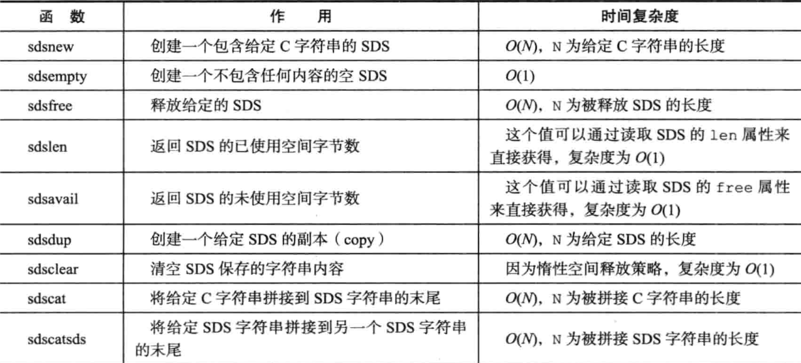
      - 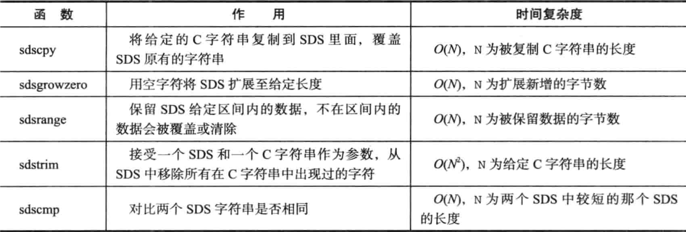
  - 链表（双端链表）
    - 节点： 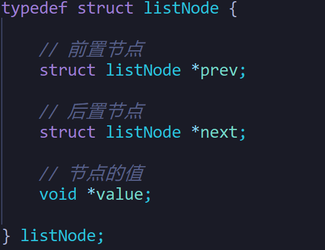
      - void* 用于保存值，所以，链表可以用于存储各种不同的值
    - list： 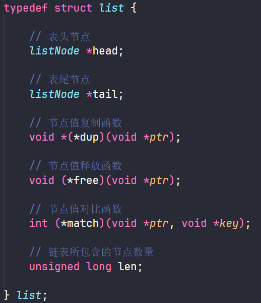
      - dup 函数用于复制链表节点所保存的值
      - free 函数用于释放链表节点所保存的值
      - match 函数用于对比链表节点所保存的值和另一个输入值是否相同
    - API
      - 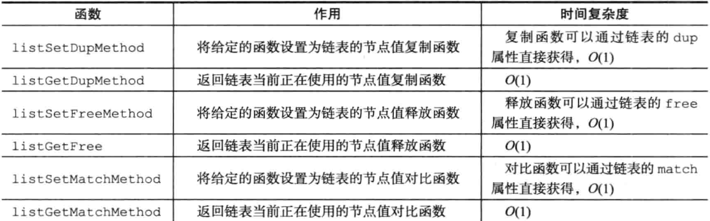
      - 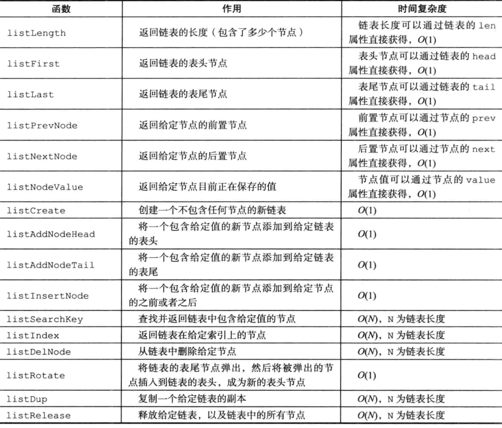
  - 字典（符号表、关联数组、map）
    - 哈希表
      - 结构（dict.h/dictht） 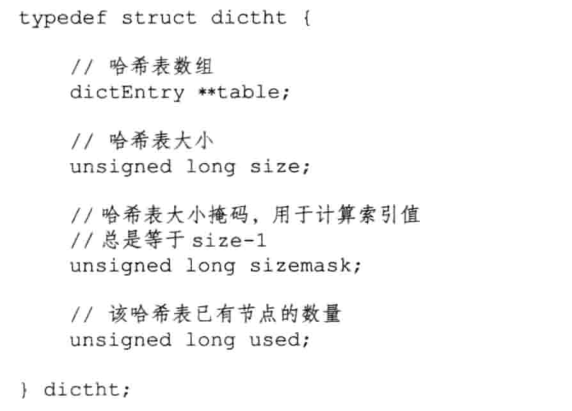
        - dict.h/dictEntry 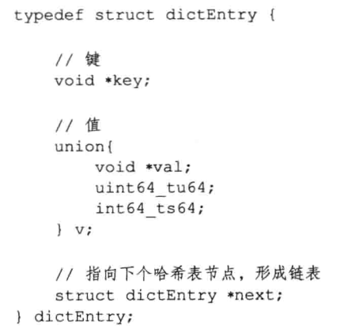
        - 相当于 List&lt;HashMap&lt;Key, List&lt;Value&gt;&gt;&gt;
      - 当发生键冲突时，将新的节点加入到链表的表头位置
    - 字典
      - dict.h/dict 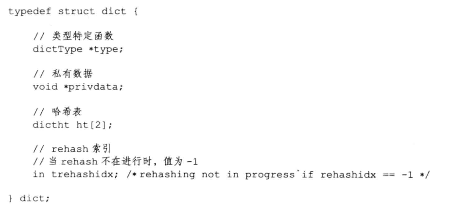
        - type 和 private 为创建多态字典而设置
        - type 是指向 dictType 的指针，每个 dictType 保存了一簇用于操作特定类型键值对的函数
        - redis 为用途不同的字典设置了不同的类型特定函数
        - private 字段保存了需要传递给类型特定函数的可选参数
        - 一般情况下，只使用 ht[0]，h[1] 只有在进行 rehash 的时候才使用
        - rehashidx 记录了 rehash 的进度，如果没有进行 rehash，则为 -1
      - dictType，字典类型 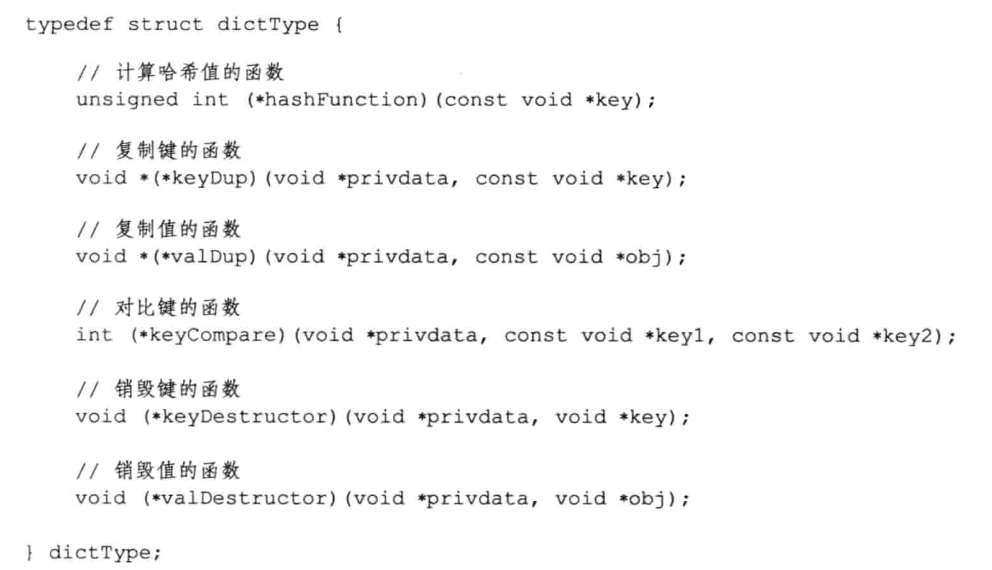
      - hash 算法
        - 计算 hash 值 
        - 计算出索引值 
        - [当字典被用作数据库的底层实现或者哈希键的底层实现时，使用 MurmurHash2 算法来计算键的哈希值](https://zh.wikipedia.org/zh-cn/Murmur%E5%93%88%E5%B8%8C)
    - rehash
      - 为了让哈希表的负载因子（load factor）维持在一个合理的范围内，当哈希表保存的键值对数量太多或者太少时，需要对哈希表的大小进行相应的扩展或者收缩（通过 rehash 操作完成）
      - 步骤
        - 1\. 为字典的 ht[1] 分配空间，其大小取决于要执行的操作及 ht[0] 当前包含的键值对数量（ht[0].used）
          - 如果执行的是扩展操作，那么 ht[1] 的大小为第一个大于等于 ht[0].used * 2 的 2^n
          - 如果执行的收缩操作，那么 ht[1] 的大小为第一个大于等于 ht[0].used 的 2^n
        - 2\. 将保存在 ht[0] 中的所有键值对放置到 ht[1] 哈希表的指定位置上
          - 指定位置通过重新计算键的哈希值和索引值而得到
        - 3\. 当 ht[0] 包含的所有键值对都迁移到 ht[1] 之后，释放 ht[0]，将 ht[1] 设置为 ht[0]，并在 ht[1] 新穿件一个空白哈希表，为下一次 rehash 做准备
      - 何时扩展或收缩
        - 扩展
          - 服务器目前没有正在执行的 BGSAVE 或 BGREWRITEAOF 命令。且哈希表的负载因子大于等于 1
          - 服务器目前正在执行 BGSAVE 或 BGREWRITEAOF 命令，且哈希表的负载因子大于等于 5
          - 根据BGSAVE命令或BGREWRITEAOF命令是否正在执行，服务器执行扩展操作所需的负载因子并不相同，这是因为在执行BGSAVE命令或BGREWRITEAOF命令的过程中，Redis需要创建当前服务器进程的子进程，而大多数操作系统都采用写时复制（copy-on-write）技术来优化子进程的使用效率，所以在子进程存在期间，服务器会提高执行扩展操作所需的负载因子，从而尽可能地避免在子进程存在期间进行哈希表扩展操作，这可以避免不必要的内存写入操作，最大限度地节约内存。
        - 收缩
          - 负载因子小于 0.1 时
      - 渐进式 rehash
        - 步骤
          - 1\. 为 ht[1] 分配空间
          - 2\. 在字典中维护一个索引计数器变量 rehashidx，并将其设置为 0，表示 rehash 工作正式开始
          - 3\. 在 rehash 期间，每次对字典进行添加、删除、查找或者更新操作时，程序除了指定的操作以外，还会顺带将 ht[0] 哈希表在 rehashidx 索引上的所有键值对 rehash 到 ht[1] 中，当 rehash 完成之后，程序将 rehashidx 属性的值加一
            - ht[0], ht[1] 的 used，sizemask 等也会发生改变
          - 4\. 随着字典操作的不断执行，最终在某个时间点上， ht[0] 的所有键值对都会被 rehash 至 ht[1]，这时将 rehashidx 设置为 -1，表示 rehash 操作已完成
        - rehash 期间的哈希表操作
          - 字典会同时使用 ht[0] 和 ht[1] 两个哈希表。curd 操作也会在这两个哈希表中进行
          - 在 rehash 期间，新添加的字典的键值对都会被保存在 ht[1] 中，ht[0] 不会执行任何添加操作
    - API
      - 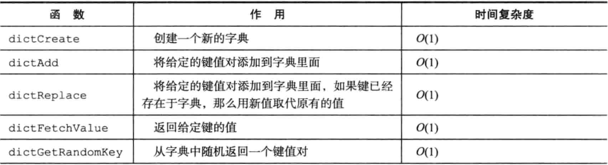
      - 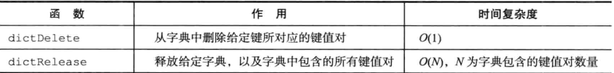
  - 跳跃表（skiplist）
    - 一种有序的数据结构，在每个节点中维持多个指向其它节点的指针，达到快速访问节点的目的
    - 支持平均 O(logN)、最坏 O(N)复杂度的节点查找，还可以通过顺序操作来批量处理节点
    - 用于存储有序集合键；或者在集群节点中用作内部数据结构
    - zskiplist 结构 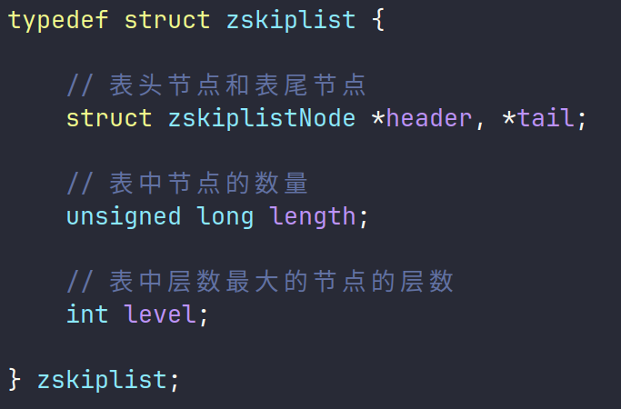
      - level：记录当前跳跃表内，层数最大的那个节点的层数（表头节点的层数不计算在内）
      - length：跳跃表的长度，即跳跃表目前包含节点的数量（表头节点不计算在内）
      - header：指向表头节点
    - zskiplistNode 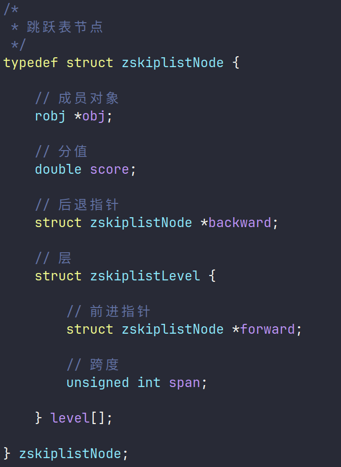
      - level：包含两个字段：前进指针和跨度。前进指针用于访问位于表尾方向的其他节点；而跨度则记录了前进指针所指向节点和当前节点的距离
      - backword：后退指针，指向当前节点的前一个节点
      - score：在跳跃表中，节点按各自所保存的分值从小到大排序
      - obj：一个指针，指向一个字符串对象，保存着一个 SDS 值
        - 分值相同的节点按照此对象的字典序的大小来进行排序（从小到大）
    - 示例 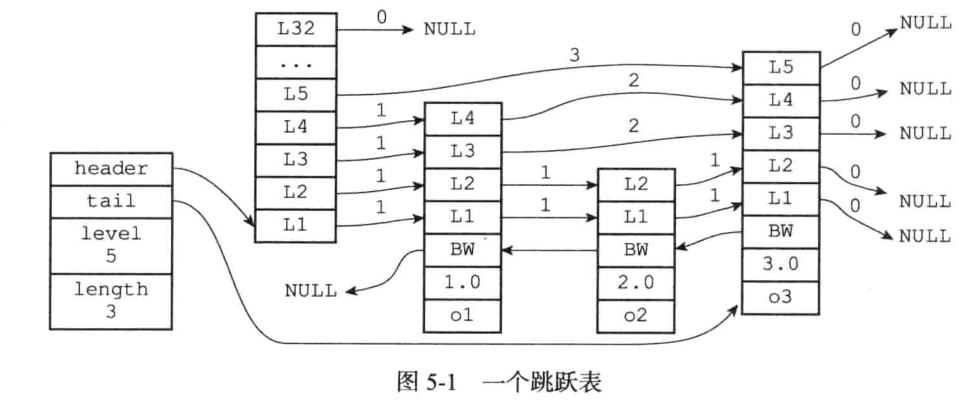
    - 层
      - zskiplistNode 的 level 数组可以包含多个元素。一般来说，层数越多，访问其他节点的速度就越快
      - 每次创建一个新跳跃表的节点的时候，随机生成一个 [1, 32] 之间的值作为 level 数组的大小
    - API
      - 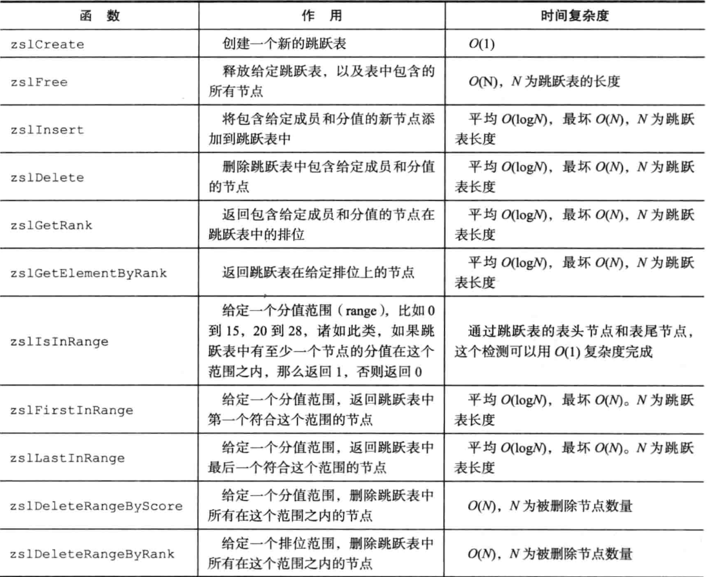
  - 整数集合（intset）
    - 当一个集合只包含整数值元素，并且这个集合的元素数量不多时，redis 会使用此数据结构来存储
    - 结构 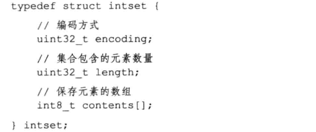
      - 整数集合的每个元素都是 contents 数组中的一个数组项（item），每个项按照从小到大有序地排列，数组中不包含任何重复项
      - encoding 的取值
        - INTSET_ENC_INT16
        - INTSET_ENC_INT32
        - INTSET_ENC_INT64
    - “升级”
      - 指将一个比 encoding 指定的类型的最大值的整数或小于该类型的最小值的值加入到该集合中，则会触发“升级”操作
      - 基本思路是：先将原本的数据的数据类型扩展为与新元素相同的数据类型，同时分配新元素的空间，同时保持数据的有序性
      - 一旦进行了升级操作，编码就会一直保存为升级后的状态
      - 存在的意义
        - 提升整数集合的灵活性
        - 尽可能地节约内存
    - API
      - 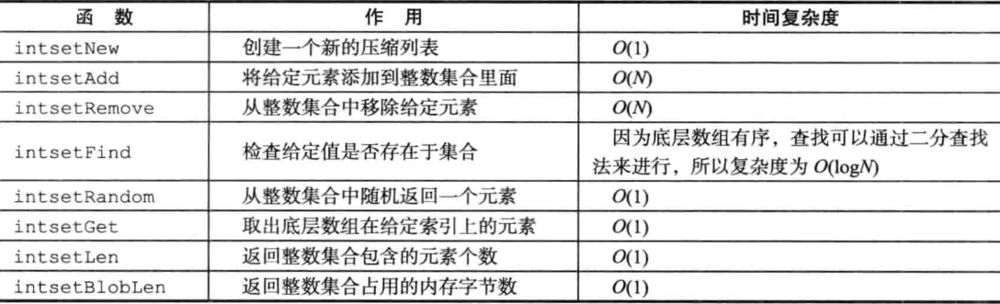
  - 压缩列表（ziplist）
    - 是列表和哈希表的实现之一
    - 当列表值包含少量列表项且每个列表项（当每个键值对的键和值）要么是小整数值要么是长度比较短的字符串时，使用压缩列表做底层实现
      - 哈希表 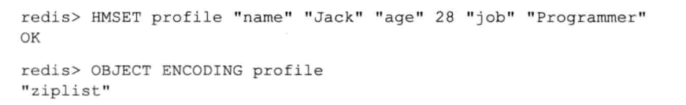
      - 列表 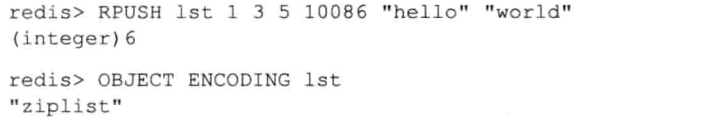
    - 压缩列表的各个组成部分 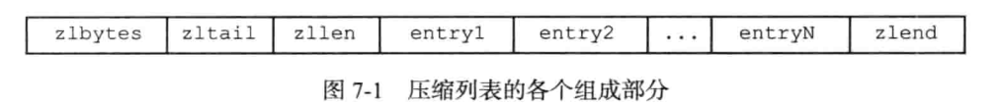
      - 各个组成部分的详细说明 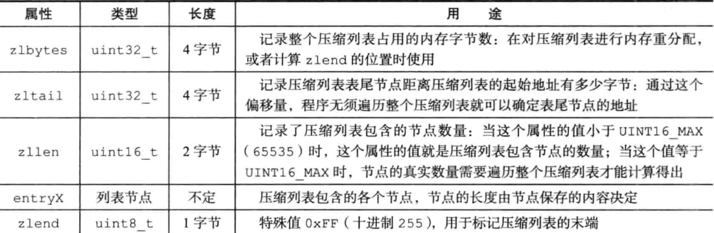
      - 压缩列表节点（entry） 
        - 每个压缩列表节点可以保存一个字节数组或者一个整数值
        - 字节数组可以是三种长度的其中一种
          - 63(2^6 - 1)
          - 16383(2^14 - 1)
          - 4294967295(2^32 - 1)
        - 整数值是 6 种长度的其中一种
          - 4 bit，0 ~ 12 之间的无符号整数
          - 1 byte 的有符号整数
          - 3 byte 长度的有符号整数
          - int16_t
          - int32_t
          - int64_t
        - previous_entry_length 以字节为单位
          - 如果前一节点的长度小于 254 字节，那么其长度为 1 byte
          - 如果前一节点的长度大于等于 254 字节，那么其长度为 5 byte
            - 第一个字节被设置为 0xFE(254)，之后的 4 个字节用于保存前一节点的长度
          - 通过此字段，可以实现从压缩列表的尾端向表头进行遍历的操作
        - encoding 字段
          - 记录了节点的 content 属性所保存的数据类型以及长度
          - encoding 字段可能是
            - 1、2、5 byte 长。值的最高为 00、01 或者 10 的是字节数组编码，表示 content 属性保存着字节数组，该字节数组的长度是除去最高的 2 位后其他位表示的数字
              - 字节数组编码 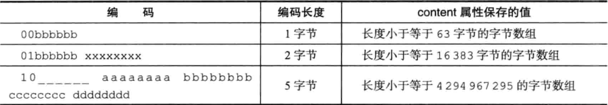
                - `_` 表示留空，其余字母表示实际的数据
            - 1 byte 长。值的最高位以 11 开头的是整数编码。
              - 整数编码 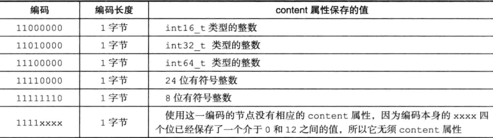
    - 连锁更新（概念）
      - 每个节点的 previous_entry_length 记录前一个节点的长度
      - 当向压缩列表加入一个新的节点 a，此节点会被加入到压缩列表的表头处。如果新加入的节点的大小大于等于 254 字节，而后面的节点 b 的 previou_entry_length 是 1 byte 的，那么，b 的此字段将不能存储该新节点的大小，故而要对 b 进行扩容，如果 b 的后面的节点 c 的 previous_entry_length 也是 1 byte 的，那么 c 也要扩容，直到某个节点的 previous_entry_length 不是 1 byte 的
    - API
      - 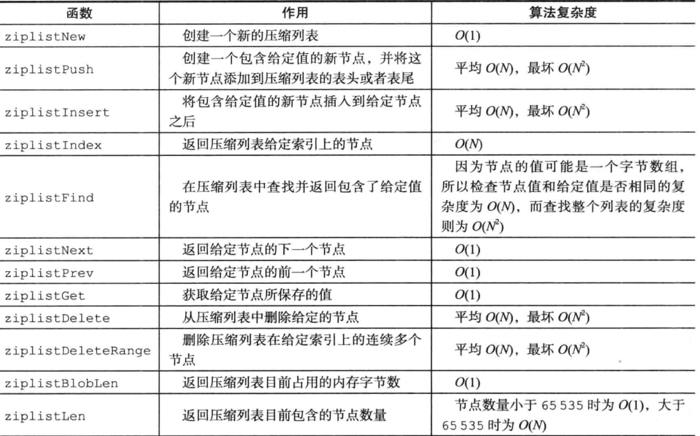
  - 对象
    - redis 并没有使用上述的数据结构来实现键值对数据库，而是基于这些数据结构来创建了一个对象系统，每种对象都用到了至少一种上述所描述的数据结构
    - 使用对象系统的优势
      - 可以根据对象的类型来判断一个对象是否可以执行给定的命令
      - 可以针对不同的使用场景，为对象设置不同的数据结构实现，从而优化对象在不同场景下的使用效率
      - redis 还实现了基于引用计数的内存回收机制，当程序不再使用某个对象的时候，对象占用的内存就会被自动释放
      - redis 通过了引用计数技术实现了对象共享机制，可以在适当的条件下，通过让多个数据库键共享一个对象来节约内存
      - redis 对象带有访问时间记录信息，可以用于计算数据库键的空转时间，在服务器启用了 maxmemory 功能的情况下，空转时长较大的那些键可能会被优先被服务器删除
    - 在 redis 的数据库中新创建一个键值对时，至少会创建两个对象，一个对象用作键值对的键（键对象），另一个对象用作键值对的值（值对象）
      - 键对象总是一个字符串对象
      - 值对象可以是任意一种对象
    - redisObject 结构体 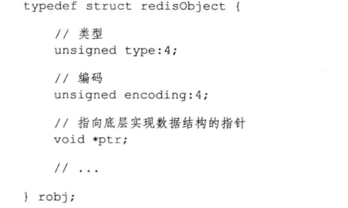
      - type 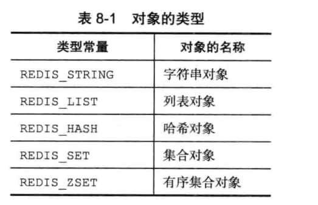
        - 每种类型的对象都至少使用了两种不同的编码，表中列出了每种类型的对象可以使用的编码 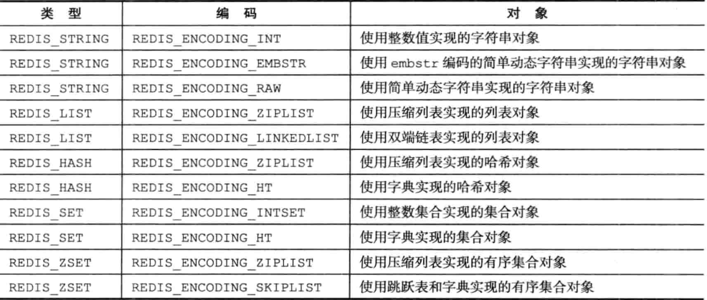
      - encoding，记录了对象所使用的编码，即这个对象使用了什么数据结构作为对象的底层实现 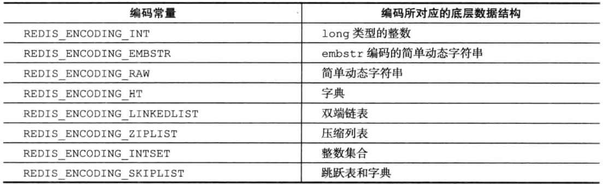
        - 可以使用 OBJECT ENCODING 查看一个数据库键的值对象的编码 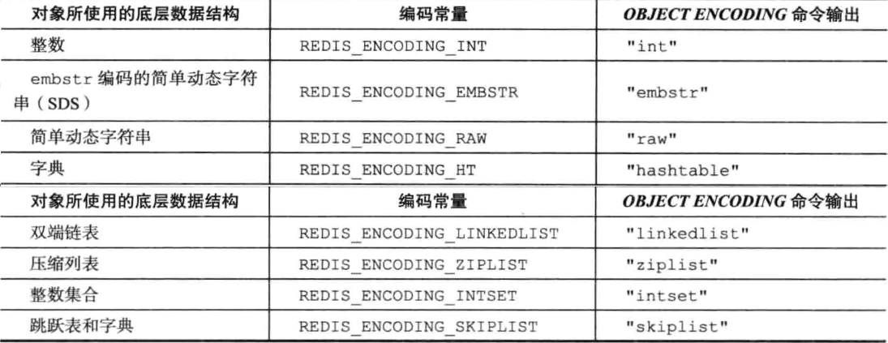
      - ptr 指针指向对象的底层实现数据结构，这些数据结构由对象的 encoding 属性决定
    - 5 种不同类型的对象
      - 字符串对象
        - 编码可以是 int、raw 或 embstr
        - 如果一个字符串对象保存的是整数值，并且可以用 long（4 byte）类型标识，那么字符串对象会使用 int 编码
          - 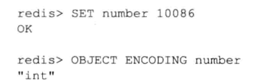
        - 如果一个字符串对象保存的是一个字符串值，并且这个字符串值的长度大于 32 字节，那么字符串对象将使用 SDS 来保存这个值（raw 编码）
          - 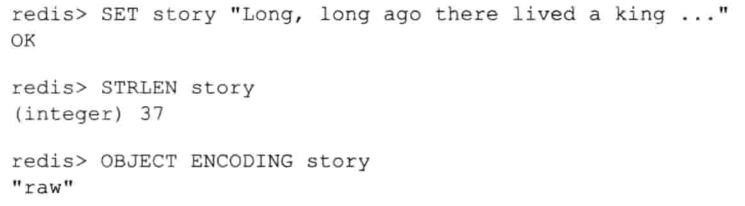
        - 如果一个字符串对象保存的是一个字符串值，并且这个字符串值的长度小于等于 32 字节，或者字符串对象存储的是一个 long double 类型的浮点数，则使用 embstr 编码
          - embstr 编码是专门用于保存短字符串的一种优化编码方式，这种编码和raw编码一样，都使用redisObject结构和sdshdr结构来表示字符串对象，但raw编码会调用两次内存分配函数来分别创建redisObject结构和sdshdr结构，而embstr编码则通过调用一次内存分配函数来分配一块连续的空间，空间中依次包含redisObject和sdshdr两个结构
            - embstr 编码创建的内存块结构 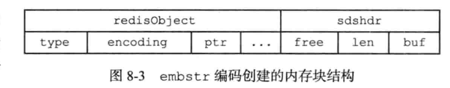
          - 使用 embstr 编码的好处
            - 内存分配次数仅为 1 次
            - 释放次数仅为 1 次
            - 因为数据和对象保存在一块连续的内存里面，故而能更好地利用缓存带来优势 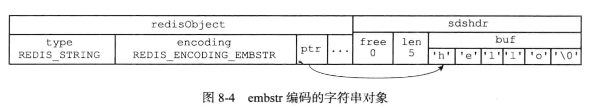
        - 字符串对象是唯一一种会被其他 4 种类型对象嵌套的对象
        - 总结 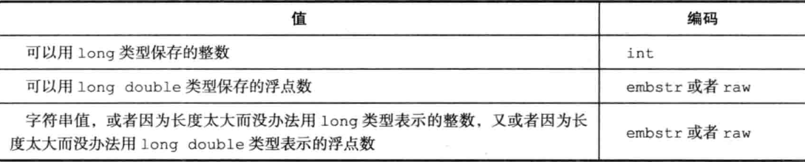
        - 字符串命令的实现 
      - 列表对象
        - 编码可以是 ziplist 或者 linkedlist
        - 使用 ziplist 编码的条件(都满足)
          - 保存的字符串元素的长度都小于与 64 字节
            - 配置文件中的 list-max-ziplist-value
          - 保存的元素数量小于 512 个
            - 配置文件中的 list-max-ziplist-entries
        - 列表命令的实现 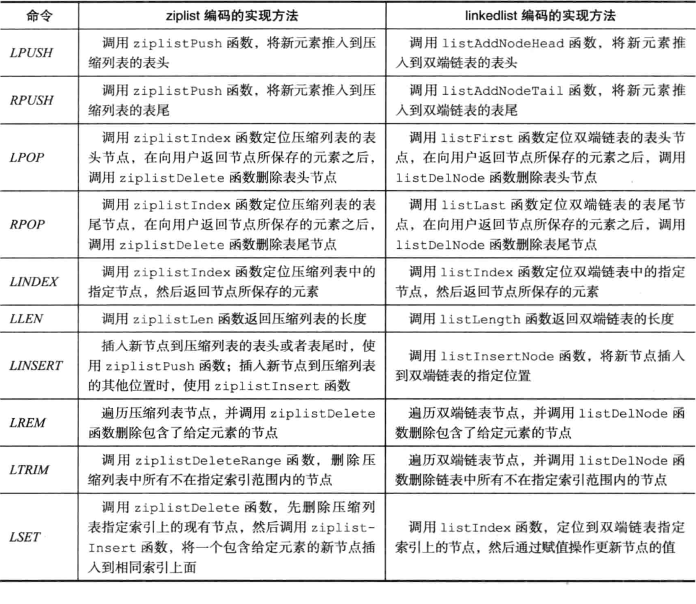
      - 哈希对象
        - 编码可以是 ziplist 和 hashtable
        - ziplist
          - 每当有新的键值对要加入到哈希对象中时，会将保存了键的压缩列表节点推入到压缩列表的表尾，然后在井保存了值的压缩列表节点推入到压缩列表表尾
            - 故而保存了同一键值对的两个节点总是紧挨在一起的，保存键的节点在前，保存值的节点在后；先加入到哈希对象中的键值对会被放在压缩列表的表头方向，后添加的键值对在表尾
          - 例如
            - 执行这些命令 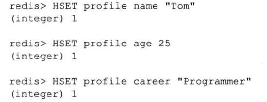
            - 哈希对象 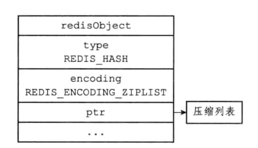
            - 压缩列表底层实现 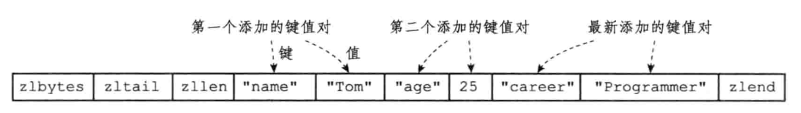
        - 使用 ziplist 编码的条件(都满足)
          - 保存的所有键值对的键和值的字符串长度都小于 64 字节
            - hash-max-ziplist-value
          - 保存的键值对数量小于 512 个
            - hash-max-ziplist-entries
        - hashtable
          - 使用字典键值对来保存
          - 字典的每个键都是一个字符串对象，保存了键值对中的键
          - 字典中的每个值都是一个字符串对象，保存了键值对中的值
          - 例如
            - ziplist 编码格式的例子的 hashtable 编码实现 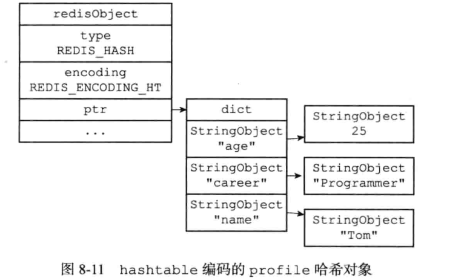
        - 哈希命令的实现 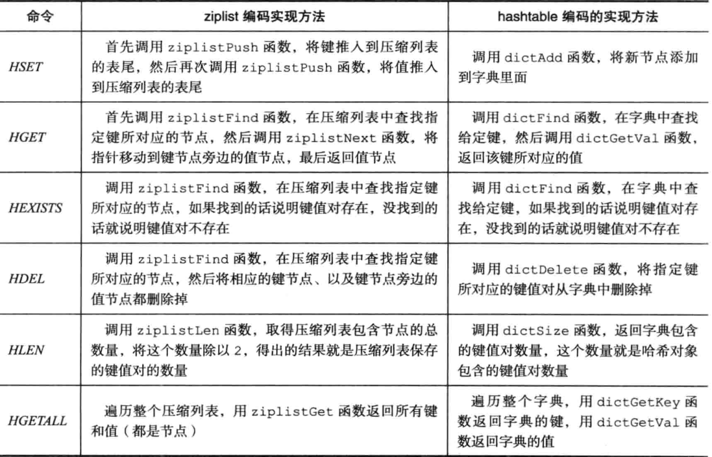
      - 集合对象
        - 编码可以是 intset 或者 hashtable
        - 当使用 hashtable 编码时，字典的值全部被设置为 NULL
        - 使用 intset 的条件
          - 所有元素都是整数值
          - 保存的元素数量不超过 512 个
            - set-max-intset-entries
        - 集合命令的实现 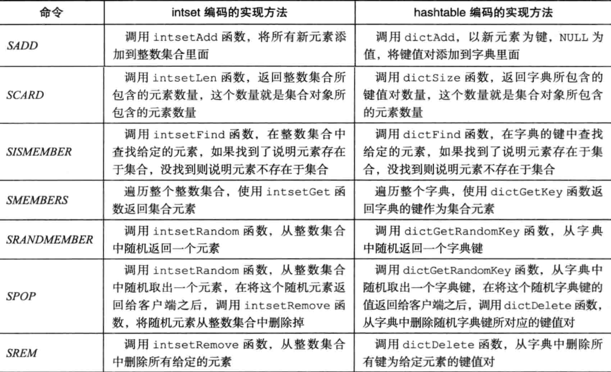
      - 有序集合对象
        - 编码可能是 ziplist 或这 skiplist
        - ziplist
          - 每个集合元素使用两个紧爱在一起的压缩列表节点来保存，第一个节点保存元素的成员，第二个元素保存元素的分值
          - 例如
            - 执行这些命令 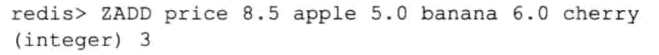
            - ziplist 编码的有序集合对象 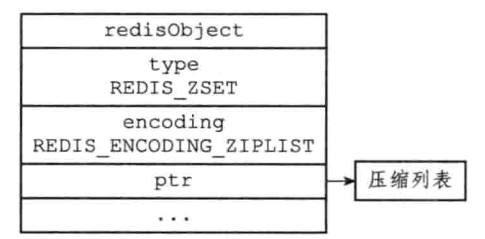
            - 压缩列表的底层实现 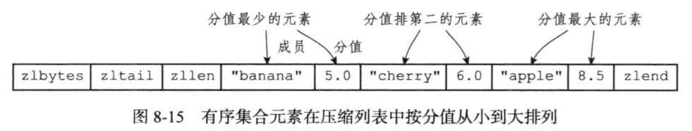
        - skiplist
          - 使用 zset 结构作为底层实现 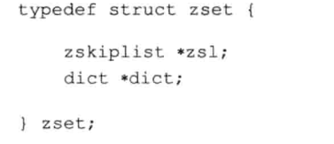
            - zsl 跳跃链表按分值从小到大保存了所有集合元素，每个跳跃表节点的 object 属性保存了元素的成员，score 属性保存了元素的分值
            - dict 字典提供了一个从成员到分值的映射，字典中的每个键值对都保存了一个集合元素：字典的键保存元素的成员（都是字符串对象），字典的值保存了元素的分值（都是一个 double 类型的浮点数）
              - 通过这个功能，可以在 O(1) 复杂度查找给定成员的分值
            - zsl 和 dict 不会造成空间的浪费
              - 因为这两种数据结构都会通过指针来指向相同的元素的成员和分值
            - 为什么同时使用跳跃表和字典来实现？ 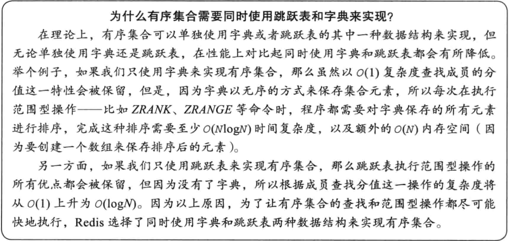
            - 何时使用 ziplist 编码
              - 保存的元素数量小于 128 个
                - zset-max-ziplist-entries
              - 所有元素成员的长度都小于 64 字节
                - zset-max-ziplist-value
            - 有序集合命令的实现 
      - 不同类型的值对象的 TYPE 命令的输出 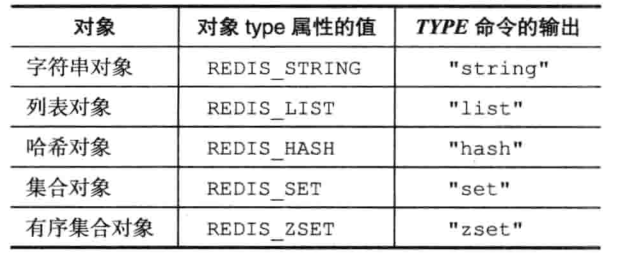
    - 类型检查与命令多态
      - 某些命令只能用在某一种类型的对象当中，而某些命令又可以用在多种类型的对象当中（多态命令），这其中涉及到对象的类型检查和多态命令
      - 类型检查的实现
        - 通过 redisObject 的 type 属性来实现
      - 多态命令的实现
        - 根据键的值对象所使用的编码和对象的 type 属性来选择正确的命令实现
    - 内存回收
      - 每个对象都一个引用计数，存放在其 redisObject 结构中的 refcount 中
      - 当 refcount = 0 时，对象所占用的内存会被释放
      - 修改 refcount 的 API
        - 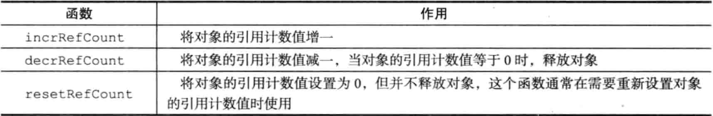
    - 对象共享
      - 让多个键共享同一个值对象需要执行 2 个步骤
        - 1\. 将数据库键的值指针指向一个现有的值对象
        - 2\. 将被共享的值对象的引用计数增一
      - 例如 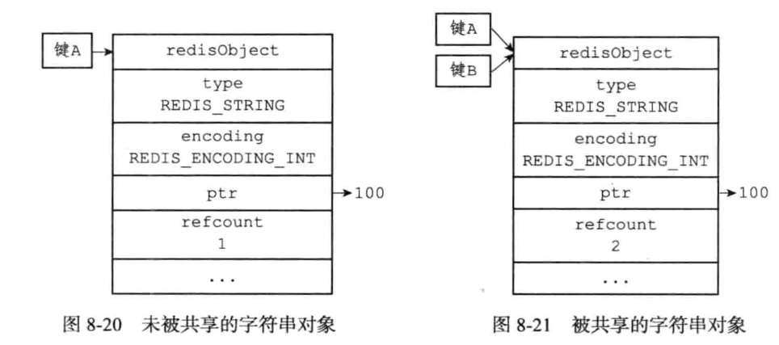
      - 目前来说，Redis会在初始化服务器时，创建一万个字符串对象，这些对象包含了从0到9999的所有整数值，当服务器需要用到值为0到9999的字符串对象时，服务器就会使用这些共享对象，而不是新创建对象
      - 可以使用 OBJECT REFCOUNT 命令来返回一个对象的引用计数
      - Redis 不共享包含字符串的对象
        - 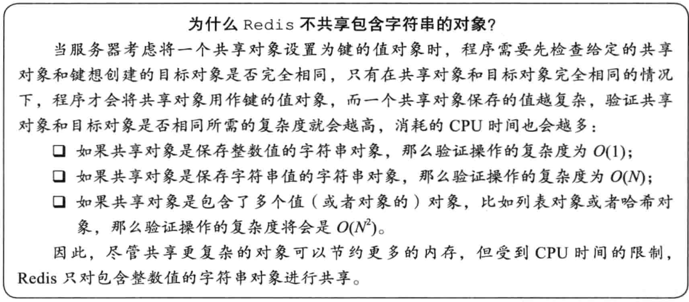
    - 对象的空转时长
      - redisObject 包含了 lru 属性，记录了对象最后一个被访问的时间 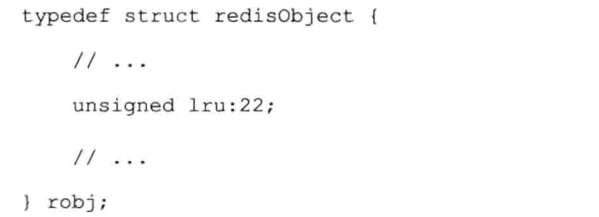
      - OBJECT IDLETIME 命令用来打印给定键的空转时长，这个命令在访问值对象时，不会修改对象的 lru 属性
      - 如果服务器打开了 maxmemory 选项，并且服务器用于回收内存的算法为 volatile-lru 或者 allkeys-lru，那么服务器占用的内存超过了 maxmemory 选项所设置的上限值，则空转时长较高的那部分键会优先被服务器释放，从而回收内存
        - maxmemory 和 maxmemory-policy 选项
- 数据库
  - 介绍
    - 所有数据库都保存在 redis.h/redisServer 结构中的 db 数组中，db 数组每个项都是一个 redis.h/redisDb 结构。每个 redisDb 结构代表一个数据库 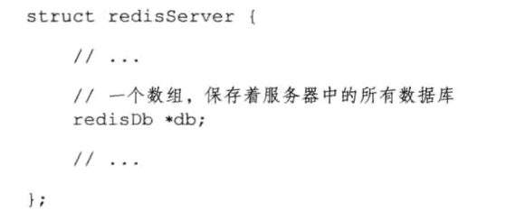
      - 在初始化服务器时，程序会根据服务器状态的 dbnum 属性来决定创建多少个数据库 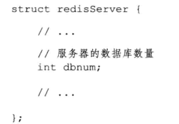
        - dbnum 由服务器配置的 database 选项决定，默认值是 16
  - 切换数据库
    - 每个 redis 客户端都有一个自己的目标数据库，每当客户端执行数据库写命令或者数据库读命令的时候，目标数据库就会成为这些命令的操作对象
    - 可以使用 SELECT &lt;dabaseIndex&gt; 来切换数据库，默认是 0 号数据库。 redisClient 结构体中的 db 指针指向客户端当前的目标数据库
  - 数据库键空间
    - redisDb 结构的 dict 字典保存了数据库中的所有键值对，称这个字典为键空间（key space） 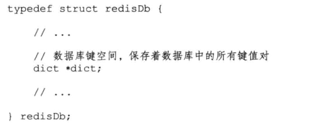
    - 例子 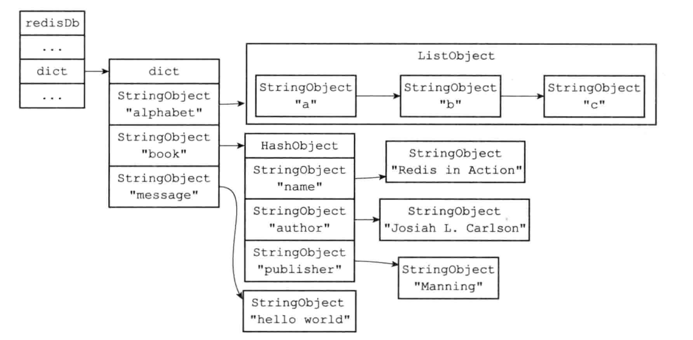
    - 所有针对数据的操作，实际上都是通过对键空间字典进行操作来实现的
  - 读写键空间时的维护操作
    - 在读取一个键之后（读写操作都要对键进行读取），服务器会根据键是否存在来更新服务器的键空间命中（hit）或不命中（miss）次数
      - 可以在 INFO stats 命令中的 keyspace_hits属性和 keyspace_misses 属性中查看
    - 在读取一个键之后，会更新键的 LRU 时间
    - 如果读取的一个键时，发现该键已经过期，则删除这个键，然后执行剩余的操作
    - 如果客户端使用 WATCH 命令监视了某个键，服务器在对被监视的键修改之后，会将这个键标记为 dirty，从而让事务程序注意到这个键已经被修改过了
    - 每次修改一个键之后，都会对 dirty 键计数器的值增 1，会触发服务器的持久化以及复制操作
    - 如果服务器开启了数据库通知功能，那么对键进行修改之后，服务器将按配置发送对应的数据库通知
  - 设置键的生存时间或过期时间
    - 设置过期时间的命令 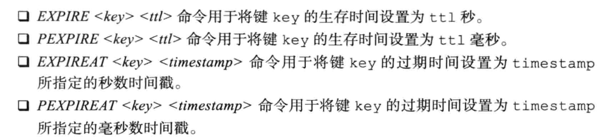
    - 无论使用何种命令设置过期时间，时间都会转换为 ms，即与使用 PEXPIRE 命令一致
    - redisDb 的 expires 字典保存了数据库中所有键的过期时间，称这个字典为过期字典 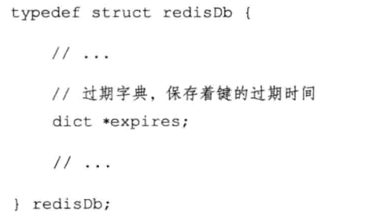
      - 过期字典的值是一个 long long 类型的整数，这个整数保存了键所指向的数据库过期时间 ———— 一个毫秒精度的 UNIX 时间戳
      - 例如。实际上，键空间中的键和过期字典中的键都指向同一个对象 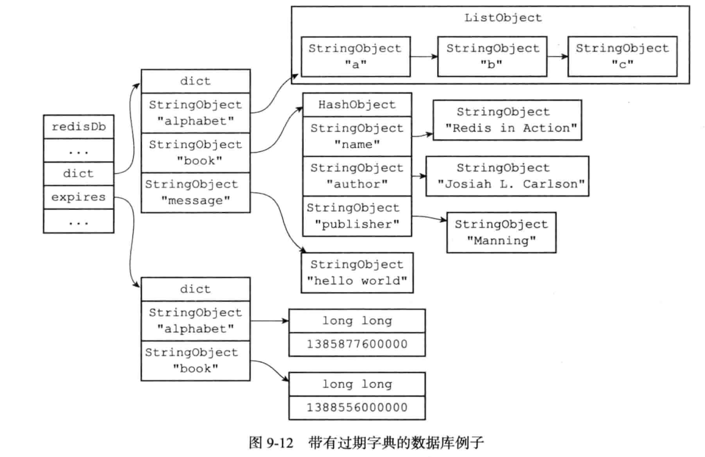
    - 当使用 PERSIST 命令移除一个键的过期时间时，就相当于在过期字典中移除键和值的关联
    - TTL（以秒为单位） 和 PTTL（以毫秒为单位） 返回键的剩余生存时间
  - 过期键的删除策略
    - 定时删除
      - 在设置键的过期时间的同时，创建一个定时器（timer），让定时器在键的过期时间来临时，立即对键执行删除操作
      - 对内存友好，但是对 CPU 不友好。当过期键比较多时，可能会占用相当一部分 CPU 时间
    - 定期删除
      - 每个一段时间，就对数据库进行一次检查，删除里面的过期键
      - 应该根据情况，指定删除操作执行的删除和执行频率
    - 惰性删除
      - 过期不管，每次从键空间中获取键时，都检查取得的键是否过期，如果过期，就删除该键
      - 对内存不友好，CPU 友好（因为只处理当前获取的键）
  - redis 中的过期键的删除策略
    - 使用定期删除和惰性删除两种策略
    - 惰性删除策略的实现
      - 由 db.c/expireIfNeeded 函数实现
      - 所有读写数据库的 redis 命令在执行之前都会调用 expireIfNeeded 函数对输入键进行检查
        - 如果输入键已经过期，则删除
        - 如果没有过期，则不做任何操作
    - 定期删除策略的实现
      - 由 redis.c/activeExpireCycle 函数实现
      - 每次 redis 的服务器周期性操作 redis.c/serverCron 函数执行时，activeExpireCycle 函数就会被调用，它在规定的时间内，分多次遍历服务器中的各个数据库，从数据库的 expires 字典中随机检查一部分键的过期时间，并删除其中的一些键
  - AOF、RDB 和复制功能对过期键的处理
    - RDB 持久化
      - 当执行 SAVE 或 BGSAVE 命令创建一个新的 RDB 文件时，数据库中已过期的键不会被保存
      - 在启动 redis 服务器时，如果服务器开启了 RDB 功能，那么服务器将对 RDB 文件进行载入
        - 如果服务器以主服务器模式运行，那么在载入 RDB 文件时，程序会对文件中保存的键进行检查是否过期，过期则不载入 redis 中
        - 如果服务器以从服务器模式运行，那么载入 RDB 时，无论是否过期，都会被载入到数据库中
    - AOF 持久化
      - 如果数据库的某个键已经过期了，但是它还没有被惰性删除或者定期删除，AOF 不做处理
      - 当过期键被删除之后，会向 AOF 文件追加一条 DEL 命令，来显示地记录该键已被删除
      - 例如 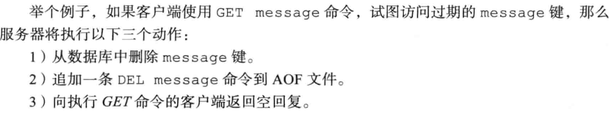
      - 在执行 AOF 重写的过程中，程序会对数据库中的键进行检查，已过期的键不会被保存到重写后的 AOF 文件中
    - 复制
      - 当服务器运行在复制模式下时，从服务器的过期键删除动作有主服务器控制
      - 主服务器在删除一个过期键后，会显示地向所有服务器发送一个 DEL 命令，告知从服务器删除这个过期键
      - 从服务器在执行客户端读命令时，即使碰到过期键也不会将过期键删除，而是当该键没有过期来处理
      - 从服务器只有在接收到服务器发送过来的 DEL 命令后，才会删除过期键
  - 数据库通知
    - 此功能可以让客户端通过订阅给定的频道或者模式，来获知数据库中键的变化，以及数据库中命令的执行情况
    - 键空间通知（key-space notification）
      - 关注某个键执行了什么什么命令
    - 键事件通知（key-event notification）
      - 关注某个命令被什么键执行了
    - 服务器配置 notify-keyspace-events 选项决定了服务器所发送通知的类型
      - AKE
        - 发送所有类型的键空间通知和键事件通知
      - AK
        - 发送所有类型的键空间通知
      - AE
        - 发送所有类型的键事件通知
      - K$
        - 只发送和字符串键有关的键通知
      - EL
        - 只发送和列表键有关的键事件通知
    - 数据库通知的实现原理
      - 发送通知
        - 由 notify.c/notifyKeyspaceEvent 实现 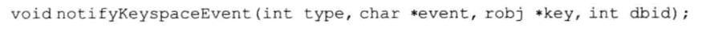
        - type 参数是发送的通知的类型。函数会根据此值来判断是否是服务器 notify-keyspace-events 选项所指定的通知类型，从而决定是否发送通知
        - events、keys 和 dbid 分别是事件的名称、产生事件的键以及产生事件的数据库索引
        - 例如，SADD 命令的实现中 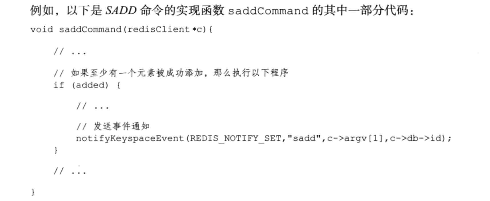
        - notifyKeyspaceEvent 函数的实现伪代码 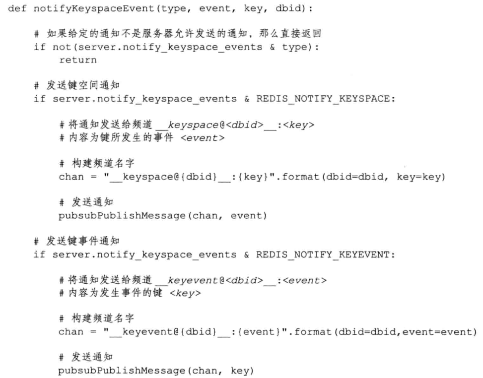
- RDB 持久化
  - 基础
    - RDB 持久化功能会生成一个 RDB 文件，此文件是一个经过压缩的二进制文件，通过该文件可以还原生成 RDB 文件时的数据库状态（即服务器中的非空数据库和其中的键值对）
    - SAVE 和 BGSAVE 命令可以用于生成 RDB 文件
    - SAVE 命令会阻塞 redis 服务器进程，直到 RDB 文件创建完毕
    - BGSAVE 会派生出一个子进程，然后由子进程负责创建RDB 文件，父进程继续处理命令请求
      - 在执行此命令期间，父进程不会处理 SAVE 或 BGSAVE 命令。这是为了避免两个进程之间出现竞争条件
      - 在执行此命令期间，如果接收到 REWRITEAOF 命令，会被延迟执行（这两个命令不能同时执行）。同理，如果在执行 REWRITEAOF 期间接受到 BGSAVE 命令，也会推迟执行。因为这两个操作都由子进程执行，涉及到大量的 IO 操作，不同时执行是由于性能考虑
    - RDB 文件的载入工作是在服务器启动时自动执行的，没有命令
      - 通过 rdb.c/rdbLoad 函数来完成
      - 服务器载入 RDB 文件的时候处于阻塞状态，直到载入工作完成为止
    - AOF 文件的更新频率比 RDB 文件的更新频率高，所以
      - 如果服务器开启了 AOF 持久化功能，则服务器会优先使用 AOF 文件来还原数据库状态
      - 如果在 AOF 持久化功能处于关闭状态时，服务器才会使用 RDB 文件来恢复数据库状态
  - 自动间隔性保存服务器状态
    - 可以配置 save 选项来让服务器每隔一段时间自动执行一次 BGSAVE 命令
    - save 选项的语法
      - save &lt;duration&gt; &lt;modify-cnt&gt;
      - 表示服务器在 duration 秒内对数据库至少进行了 modify-cnt 次修改之后，BGSAVE 命令会被执行
    - 实现
      - redisServer 结构体中存储了 struct saveparam 结构体的数组，用于保存配置 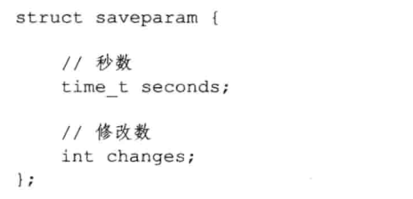
      - dirty 计数器和 lastsave 属性 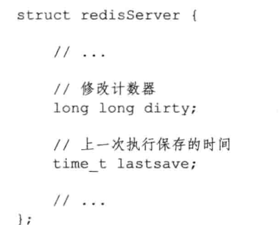
        - dirty 计数器是距离上一次成功执行 SAVE 命令或者 BGSAVE 命令之后，服务器对数据库状态进行了多少次修改
        - lastsave 是一个 UNIX 时间戳，记录了上一次成功执行 SAVE 命令或者 BGSAVE 命令的时间
      - serverCron 函数默认每个 100 ms 就会运行一次，用于对正在运行的服务器进行维护，其中包括检查 save 选项所设置的保存条件是否已经满足，如果满足的话，就执行 BGSAVE 命令
        - 伪代码 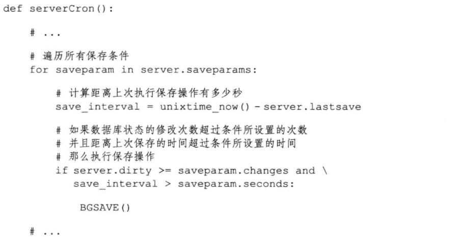
  - RDB 文件结构 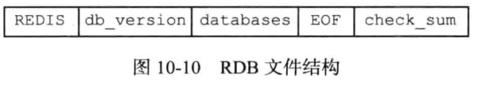
    - 最开头的部分是“REDIS” 5 个字符
    - db_version 长度为 4 byte，是一个字符串表示的整数，记录了 RDB 文件的版本号。例如 "0006" 表示 RDB 文件的第 6 版
    - databases 包含零个或任意多个数据库，以及数据库中的键值对数据
      - 每个非空数据库在 RDB中都保存为 SELECTDB、db_number 和 key_value_pairs 3 个部分 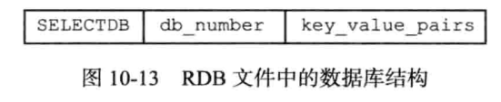
      - SELECTDB 是一个常量且长度为 1 byte，表示接下来要读入的是一个数据库号码
      - db_number 保存着一个数据库号码，可能是 1、2 或 5 byte。当读入了 db_number 之后，服务器调用 SELECT 命令，使得之后读入的键值对可以载入到正确的数据库中
      - key_value_pairs 部分保存了数据库中的所有键值对的数据，如果键值对带有过期时间，则过期时间也会和键值对保存在一起
        - 不带过期时间的键值对 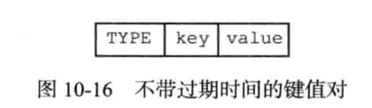
          - TYPE 的可能取值，长度为 1 byte。表示键值对的值对象的对象类型或底层编码 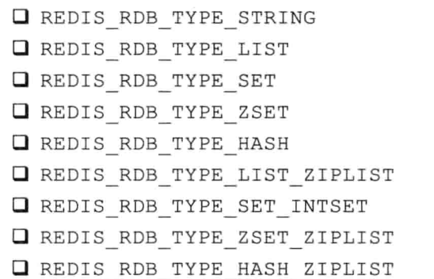
          - key 总是一个字符串对象
        - 带有过期时间的键值对 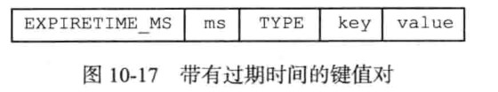
          - EXPIRETIME_MS 常量为 1 byte，告知读入程序，读入将是一个以毫秒为单位的过期时间
          - ms 是一个 8 byte 长的带符号整数，记录着一个以毫秒为单位的 UNIX 事件戳
        - value 的编码
          - REDIS_RDB_TYPE_STRING
            - 编码可能为 REDIS_ENCODING_INT 或 REDIS_ENCODING_RAW
            - REDIS_ENCODING_INT 
              - ENCODING 的值可能是 REIDS_RDB_ENC_INT[8|16|32] 三个常量中的一个，分别表示用 8、16、32 bit 来保存整数值 integer
            - REDIS_ENCODING_RAW
              - 如果服务器打开了 RDB 文件压缩功能（通过配置选项 rdbcompression），那么会大于 20 字节的字符串进行压缩，否则，原样存储
              - 无压缩 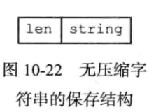
              - 有压缩 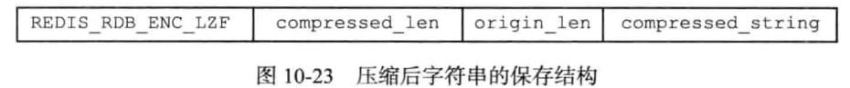
                - REDIS_RDB_ENC_LZF 是一个常量，表示该字符串已经被 LZF 算法压缩过了
                - compressed_len 记录了字符串压缩过后的长度，origin_len 记录的是字符串原来的长度
          - REDIS_RDB_TYPE_LIST
            - REDIS_ENCODING_LINKEDLIST
              - 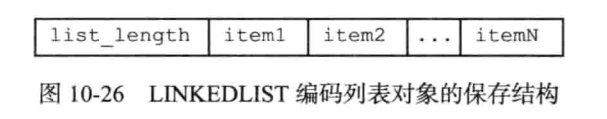
              - 每个 item 都是一个字符串对象，所以会以处理字符串对象的方式来保存和读入 item
          - REDIS_RDB_TYPE_SET
            - REDIS_ENCODING_HT
              - 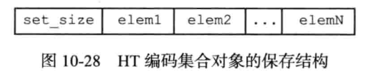
              - elem 都是字符串对象
          - REDIS_RDB_TYPE_HASH
            - REDIS_ENCODING_HT
              - 哈希表对象的保存结构 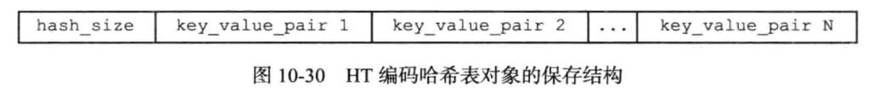
                - 键值对的保存结构 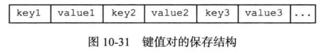
                  - 键和值都是字符串对象
          - REDIS_RDB_TYPE_ZSET
            - REDIS_ENCODING_SKIPLIST
              - 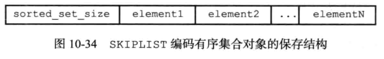
              - 成员和分值的保存结构，即 element 的结构 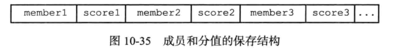
                - 分值会被转换成字符串对象（原本是一个浮点数）
                - 成员和分值都是一个字符串对象
          - REDIS_RDB_TYPE_SET_INTSET
            - 先将整数集合转换为字符串对象，然后将这个字符串对象保存到 RDB 文件中
          - ZIPLIST 编码的列表、哈希表或者有序集合
            - 1\. 将压缩列表转换为一个字符串对象
            - 2\. 将转换所得的字符串对象保存到 RDB 文件中
    - EOF 占用 1 byte
    - checksum 占用 8 byte，是一个无符号整数，有前 4 部分的内容计算而出
- AOF 持久化
  - 基础
    - AOF，即 Append Only File
    - AOF 通过保存 redis 服务器所执行的写命令来记录数据库状态 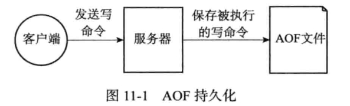
      - 被写入 AOF 文件的所有命令都是以 redis 的命令请求协议格式保存的
  - 实现
    - 命令追加
      - 当 AOF 持久化功能处于打开状态时，服务器在执行完一个写命令之后，会以协议格式将被执行的写命令追加到服务器状态的 aof_buf 缓冲区的末尾： 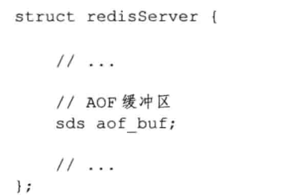
        - 例如 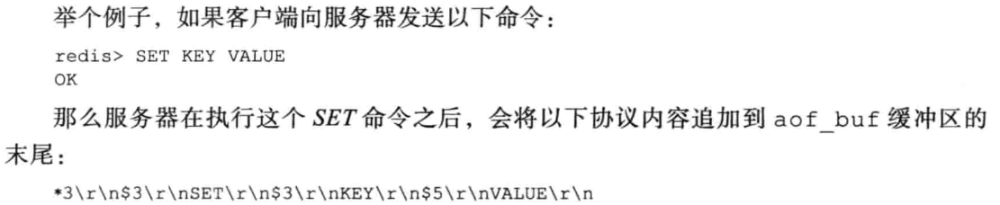
    - 文件写入
      - 当服务器在结束一个事件循环之前，都会调用 flushAppendOnlyFile 函数。该函数将 aof_buf 缓冲区的内容写入到 AOF 文件中
      - 是否同步取决于下面的文件同步的相关配置
    - 文件同步
      - flushAppendOnlyFile 函数的文件同步行为可由服务器配置的 appenfsync 选项的值来决定 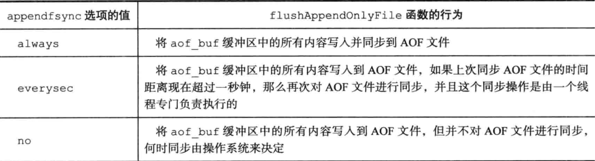
        - everysec 是默认值
  - AOF 文件的载入和数据还原
    - 步骤
      - 1\. 创建一个不带网络连接的伪客户端（fake client）
        - 因为 redis 的命令只能在客户端上下文中执行
      - 2\. 从 AOF 文件中分析并读取一条写入命令
      - 3\. 使用伪客户端执行被读出的命令
      - 4\. 重复执行步骤 2 和 3
  - AOF 重写
    - AOF 文件的大小会随着服务器的运行而越来越大，并且 AOF 文件的大小越大，数据还原所需要的时间就越多
    - 为了解决 AOF 体积膨胀问题，提出了 AOF 文件重写（rewrite）功能
    - 通过该功能，服务器创建一个新的 AOF 文件来替代现有的 AOF 文件，新旧两个 AOF 文件所保存的数据库状态相同，但新 AOF 文件不会包含任何浪费空间的冗余命令，从而减少文件体积
    - 实现原理
      - 实现不需要读取现有的 AOF 文件，而是根据服务器当前的数据库状态来实现的
        - 例如 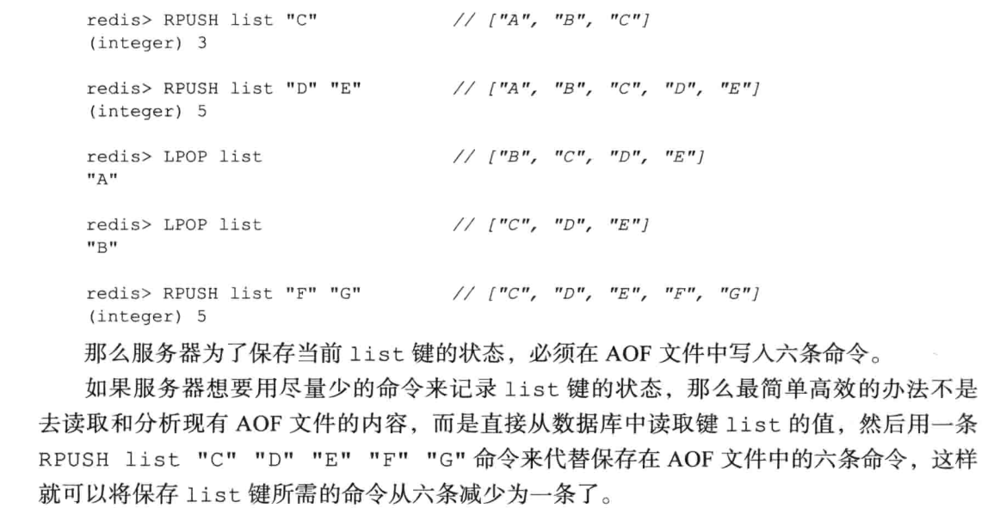
      - 服务器遍历数据库，并根据键的类型写入相应的写入命令到新的 AOF 文件中
      - 在实际中，为了避免在执行命令时造成客户端输入缓冲区溢出，重写程序在处理列表、哈希表、集合、有序集合这四种可能会带有多个元素的键时，会先检查键所包含的元素数量，如果元素的数量超过了redis.h/REDIS_AOF_REWRITE_ITEMS_PER_CMD 常量的值，那么重写程序将使用多条命令来记录键的值，而不单单使用一条命令。
      - AOF 文件重写命令被安排到子进程中执行
        - 但是，这带来了一个问题，即子进程重写 AOF 的时候，可能父进程因为执行命令而更改了数据库的状态
        - 为解决上述问题，设置了一个 AOF 重写缓冲区，在服务器创建子进程之后开始使用。当执行完一个写命令之后，会同时将写命令发送给 AOF 缓冲区和 AOF 重写缓冲区
        - 当子进程完成重写工作之后，向父进程发送一个信号，在接收到该信号之后，调用一个信号处理函数，并执行以下工作：
          - 将 AOF 重写缓冲区的所有内容写入到新的 AOF 文件中
          - 对新的 AOF 文件进行改名，原子地覆盖现有的 AOF 文件，完成新旧两个 AOF 文件的替换
          - 信号处理函数会造成父进程的阻塞
- 事件
  - 文件事件
    - redis服务器通过套接字与客户端（或者其他Redis服务器）进行连接，而文件事件就是服务器对套接字操作的抽象。服务器与客户端（或者其他服务器）的通信会产生相应的文件事件，而服务器则通过监听并处理这些事件来完成一系列网络通信操作
    - 事件的类型
      - 当套接字变得可读时（客户端对套接字执行write操作，或者执行close操作），或者有新的可应答（acceptable）套接字出现时（客户端对服务器的监听套接字执行connect操作），套接字产生 ae.h/AE_READABLE 事件
      - 当套接字变得可写时（客户端对套接字执行read操作），套接字产生 ae.h/AE_WRITABLE 事件
    - redis 基于 reactor 模式开发了自己的网络事件处理器，这个处理器被称为文件事件处理器（file event handler）
      - 文件事件处理器使用 IO 多路复用来同时监听多个套接字，并根据套接字目前执行的任务来为套接字关联不同的事件处理器
      - 当被监听的套接字准备好执行套接字应答（accept）、读取（read）、写入（write）、关闭（close）等操作时，与操作相对应的文件事件就会产生，文件事件处理器调用套接字之前关联好的事件处理器来处理这些事件
      - 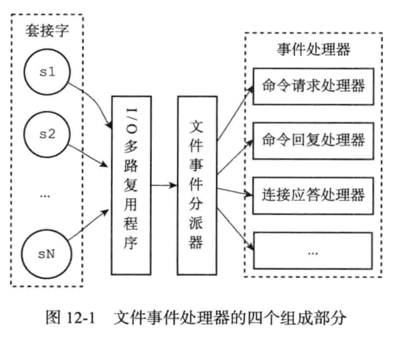
      - 连接应答处理器
        - networking.c/acceptTcpHandler
        - accept 函数的封装
        - 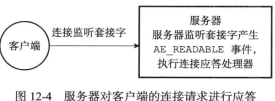
      - 命令请求处理器
        - networking.c/readQueryFromClient
        - 从套接字中读入客户端发送的命令请求内容
        - read 函数的包装
        - 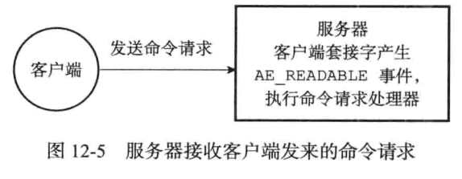
      - 命令回复处理器
        - networking.c/sendReplyToClient
        - 负责将服务器执行命令后的数据通过套接字返回给客户端
        - write 函数的包装
        - 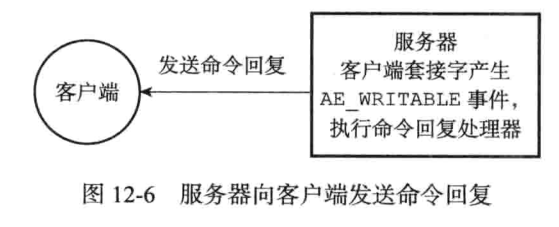
    - API
      - ae.c/aeCreateFileEvent 
      - ae.c/aeDeleteFileEvent 
      - ae.c/aeGetFileEvents 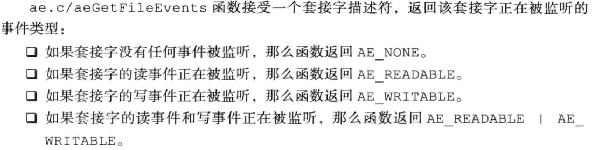
      - ae.c/aeApiPoll 
      - ae.c/aeProcessEvents 
      - ae.c/aeGetApiName 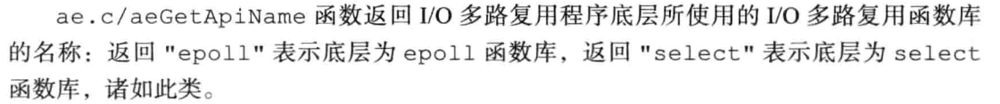
  - 时间事件
    - Redis服务器中的一些操作（比如serverCron函数）需要在给定的时间点执行，而时间事件就是服务器对这类定时操作的抽象
    - 一个事件主要由 3 个属性组成
      - id，服务器为事件创建一个全局唯一 ID，ID 从小到大递增
      - when，毫秒精度的 UNIX 时间戳，记录了时间事件到达的时间
      - timeproc，时间事件处理器，即一个函数，当时间事件到达时，服务器会调用相应的处理器来处理事件
    - 事件的类型
      - 定时事件：让一段代码在指定的时间之后执行一次
      - 周期性事件：让一段程序每个指定的时间就执行一次
        - 当一个周期性事件到达之后，服务器会根据事件处理器返回的值，对 when 值进行更新
        - 比如，事件处理器返回 30，那么服务器应对这个时间事件进行更新，让这个事件在 30 毫秒之后再次到达
      - 一个事件类型取决于事件处理器的返回值
        - ae.h/AE_NOMORE，则为定时事件
        - 非 AE_NOMOE，则为周期性事件
    - 实现
      - 将所有时间事件都放在一个链表中（ID 越大越靠近表头），并当时间事件执行器运行时，遍历整个链表，查找所有已到达的时间事件，并调用相应的事件处理器 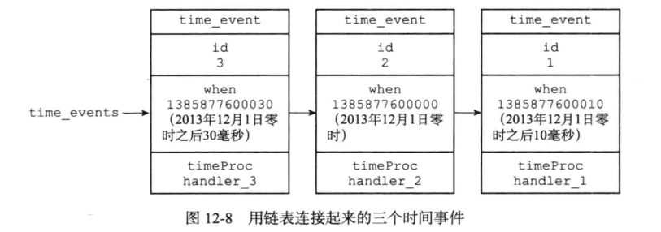
    - API
      - ae.c/aeCreateTimeEvent 
      - ae.c/aeSearchNearestTimer 
      - ae.c/processTimeEvents 
    - serverCron 函数
      - 主要工作包括
        - 更新服务器的各类统计信息，比如时间、内存占用、数据库占用等
        - 清理数据库中的过期键值对
        - 关闭和清理连接失效的客户端
        - 尝试进行 AOF 或 RDB 持久化操作
        - 如果服务器是主服务器，那么对从服务器进行周期同步
        - 如果处于集群模式，对集群进行定期同步和连接测试
      - redis 服务器以周期性事件的方式来运行 serverCron 函数
      - hz 配置选项可以用来配置 serverCron 的每秒执行次数
  - 事件的调度与执行
    - 因为服务器中同时存在文件事件和时间事件两种事件类型，所以服务器必须对这两种事件进行调度，决定何时应该处理文件事件，何时又应该处理时间事件，以及花多少时间来处理它们等等。
    - 时间的调度与执行由 ae.c/aeProcessEvents 函数负责 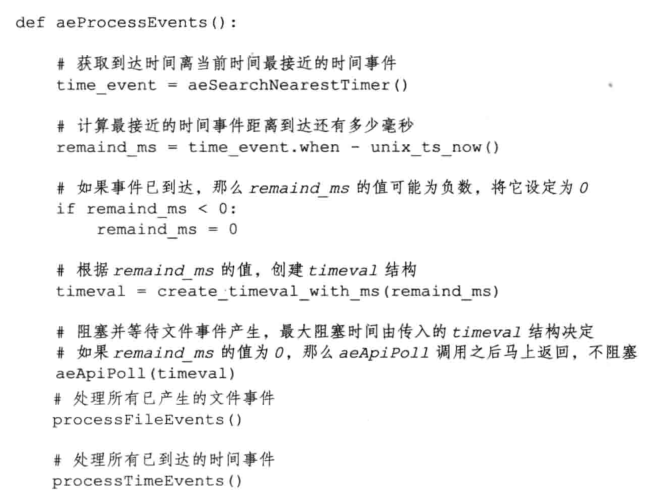
    - 对文件事件和时间事件的处理都是同步的、有序的和原子的
    - 时间事件会井非常耗时的持久化操作放到子线程或者子进程中执行
    - 由于时间事件在文件事件之后执行，并且事件之间不会出现抢占，所以时间事件的实际处理时间，通常会比时间事件设定的到达事件晚
- 复制
  - 通过执行 SLAVEOF 命令或者设置 slaveof 选项，然一个服务器去复制（replicate）另一个服务器，称被复制的服务器为主服务器（master），而进行复制操作的被称为从服务器（slave）
  - 进行复制中的主从服务器双方的数据库保存相同的数据，这种现象被称为数据库状态一致，简称一致
  - 旧版实现（&lt; 2.8）
    - 同步
      - 将从服务器的数据库状态更新至主服务器当前所处的数据库状态
      - 通过向主服务器发送 SYNC 命令来完成
      - SYNC 命令的执行步骤
        - 1\. 从服务器和主服务器发送 SYNC 命令
        - 2\. 主服务器执行 BGSAVE 命令，在后台生成一个 RDB 文件，并使用一个缓冲区记录从现在开始执行的所有写命令
        - 3\. BGSAVE 执行完毕之后，将生成的 RDB 文件发送给从服务器，从服务器接受并载入这个 RDB 文件
        - 4\. 主服务器将记录在缓冲区里面的所有写命令发送给从服务器，从服务器执行这些写命令
    - 命令传播
      - 在主服务器的数据库状态被修改之后，让主从服务器的数据库重新回到一致状态
      - 通过 master 向 slave 发送相同的写命令实现命令传播
    - 缺陷
      - 当主从服务器由于网络原因断开连接，重新连接后，SYNC 命令生成一个完整的 RDB 文件太低效（slave 原本就存储有一定的数据，而 RDB 文件中又含有那一部分数据）
  - 新版实现（&gt;= 2.8）
    - 使用 PSYNC 命令代替 SYNC 命令来执行复制时的同步操作
    - PSYNC 具有完整重同步（full resynchronization）和部分重同步两种模式
      - 完整重同步
        - 适用于初次复制时
        - 和 SYNC 命令的执行基本一样
      - 部分重同步
        - 处理断线后重复制的情况
        - 当 slave 重连后，如果条件允许，master 会将断开连接后执行的写命令发送给 slave，从而实现同步
        - 实现
          - master 的复制偏移量和 slave 的复制偏移量
            - master 每次向服务器传播 N 个字节的数据时，就将自己的复制偏移量的值加上 N
            - slave 每次接受到 master 传播而来的 N 个字节的数据时，就将自己的复制偏移量的值加上 N
          - 主服务器的复制积压缓冲区（replication backlog）
            - 由 master 维护的一个固定长度先进先出的队列，默认大小为 1 MB
            - 当 master 进行命令传播时，不仅会将写命令发送给 slave，还会将写命令入队到复制积压缓冲区里
            - slave 通过 PSYNC 命令将自己的复制偏移量 offset 发送给 master，主服务器根据偏移量来决定对服务器执行何种同步操作
              - offset 之后的数据仍然在该缓冲区中
                - 执行部分重同步操作
              - offset 偏移量之后的数据已经不存在于该缓冲区中
                - 执行完成重同步操作
            - repl-backlog-size 配置选项可以用来修改此缓冲区的大小，默认为 1 MB
          - 服务器的运行 ID（run ID）
            - 用于实现部分重同步
            - 运行 ID 在服务器启动时自动生成，由 40 个随机的 16 进制字符串组成
            - 当 slave 服务器对主服务器初次进行复制时，master 将自己的运行 ID 发送给 slave，slave 会将这个运行 ID 保存起来
              - 当 slave 重新连上一个主服务器时，slave 将断开连接之前的 master A 的运行 ID 发送给当前连接的 master B
                - A == B，可以尝试执行部分重同步操作
                - A != B，执行完整重同步操作
    - PSYNC 命令的实现
      - slave 发送同步请求
        - 如果服务器以前没有复制过任何主服务器，或者之前执行过 SLAVEOF no one 命令，那么服务器在开始一次新的复制时将向主服务器发送 PSYNC ? -1 命令，主动请求服务器进行完整重同步
        - 如果已经复制过某个主服务器，那么在进行新的一次复制时将向 master 发送 PSYNC &lt;runid&gt; &lt;offset&gt; 命令
      - master 发送响应
        - 返回 +FULLRESYNC &lt;runid&gt; &lt;offset&gt; 回复，表示 master 将和 slave 进行完整重同步
          - slave 会将 offset 设置为自己的初始化偏移量
        - 返回 +CONTINUE 回复，表示 master 将 slave 进行部分重同步操作
        - 返回 -ERR 回复，表示主服务器版本低于 2.8，slave 将会向 master 发送 SYNC 命令
  - 复制的实现
    - 1\. 设置主服务器的地址和端口号（通过 SLAVEOF &lt;masterhost&gt; &lt;masterport&gt; 命令） 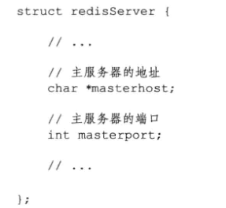
    - 2\. slave 与 master 建立套接字连接
    - 3\. slave 发送 PING 命令，用于检查连接是否正常
      - 如果 master 向 slave 发送了一个回复，但 slave 不能在规定的时限内取出命令回复的内容，那么表示主从服务器之间的网络连接状态不佳，slave 会断开并重新建立建立
      - 如果 master 向 slave 返回一个错误，表示 master 暂时没有办法处理 slave 的请求，slave 会断开并重新建立连接
      - 如果 slave 读取到了 PONG 回复，表示连接正常
    - 4\. 身份验证
      - 如果 slave 设置了 masterauth 选项，那么进行身份验证。否则，不进行
      - 如果需要进行身份验证，slave 会向 master 发送一条 AUTH 命令，参数为 masterauth 选项的值
      - 可能出现的几种情况 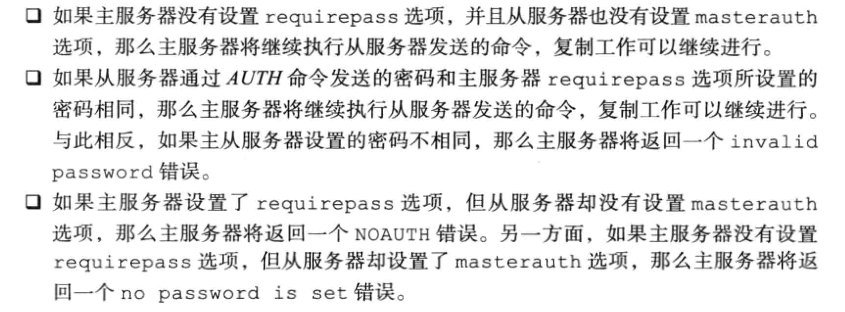
        - 所有错误情况都会令从服务器中止目前的复制工作，并从创建套接字开始重新执行复制，直到身份验证通过，或者从服务器放弃执行复制为止。
    - 5\. 发送端口消息
      - slave 执行 REPLCONF listening-port &lt;port-number&gt; 命令，向 master 发送 slave的监听端口号
        - master 收到这个命令后，会将此端口号记录在 slave 所对应的客户端状态的 slave_listening_port 属性中 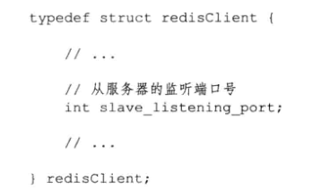
    - 6\. 同步
      - slave 向 master 发送 PSYNC 命令
      - 如果 PSYNC 命令执行的是完整重同步操作，那么 master 需要成为 slave 的客户端，才能将保存在缓冲区里面的内容发送给 slave
      - 如果 PSYNC 执行的部分重同步，那么 master 需要成为 slave 的客户端，才能向服务器发送保存在复制积压缓冲区里面的写命令
    - 7\. 命令传播
      - master 一直将自己执行的写命令发送给从服务器
  - 心跳检测
    - 在命令传播阶段，slave 会默认每秒一次的命令，向主服务器发送命令： REPLCONF ACK &lt;replication offset&gt; replication offset 是 slave 当前的复制偏移量
      - 此命令有 3 个作用
        - 检测主从服务器的网络连接状态
          - 如果 master 超过 1s 没有收到 slave 发送过来的 REPLCONF ACK 命令，那么 master 就知道主从服务器之间的连接出现了问题
          - 通过向 master 发送 INFO replication 命令，在列出的 lag 一栏中，可以看到 slave 最后一次向 master发送 REPLCONF ACK 命令距离现在过了多少秒 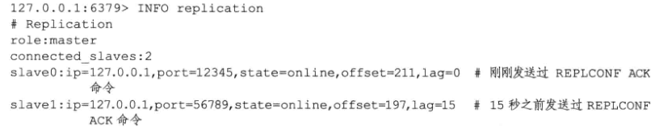
        - 辅助实现 min-slaves 选项
          - min-slaves-to-write 和 min-slaves-max-lag 这两个配置选项可以防止 master 在不安全的情况下执行写命令 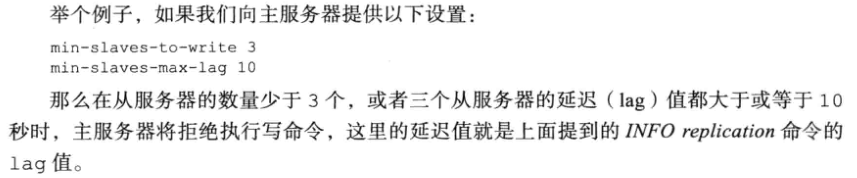
        - 检测命令丢失
          - 如果因为网络故障，主服务器传播给从服务器的写命令在半路丢失，那么当从服务器向主服务器发送 REPLCONF ACK 命令时，主服务器将发觉从服务器当前的复制偏移量少于自已的复制偏移量，然后主服务器就会根据从服务器提交的复制偏移量，在复制积压缓冲区里面找到从服务器缺少的数据，并将这些数据重新发送给从服务器
- Sentinel（哨兵）
  - 是 redis 高可用性的解决方案
    - 由一个或多个 Sentinel 实例组成的 Sentinel 系统可以监视任意多个 master，以及这些 master 下的所有 slave
    - 被监视的 master 进入下线状态时，自动将下线服务器属下的某个 slave 升级为新的 master，然后由该 master 继续处理命令请求
      - 当该下线的 master 重新上线时，会将其设置为新的 master 的 slave
  - 使用
    - 命令 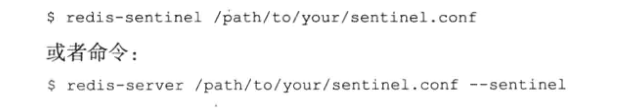
    - 执行的操作
      - 1\. 初始化服务器
        - 本质上 Sentinel 指示一个运行在特殊模式下的 redis 服务器
        - 此模式下的 redis 服务器与普通服务器的区别 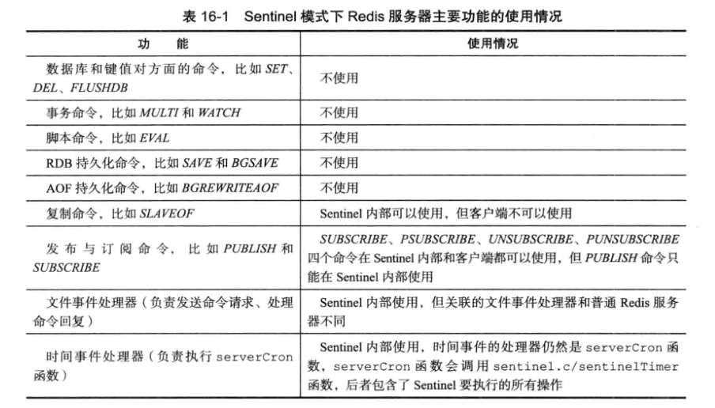
      - 2\. 将普通的 redis 服务器使用的代码转换成 Sentinel 专用代码
        - 将一部分普通的服务器使用功能的代码替换成 Sentinel 专用代码
          - 例如使用 sentinel.c/REDIS_SENTINEL_PORT 常量来作为服务器的端口，而不是使用 redis.h/REDIS_SERVERPORT 常量
          - 普通 redis 服务器使用 redis.c/redisCommandTable 作为服务器的命令表，而 Sentinel 使用 sentinel.c/sentinelcmds 作为服务器的命令表，且其中的 INFO 命令会调用专门的实现 sentinel.c/sentinelInfoCommand 函数
      - 3\. 初始化 Sentinel 状态
        - 会初始化一个 sentinel.c/sentinelState 结构（sentinel 状态），保存了服务器中所有和 Sentinel 功能有关的状态 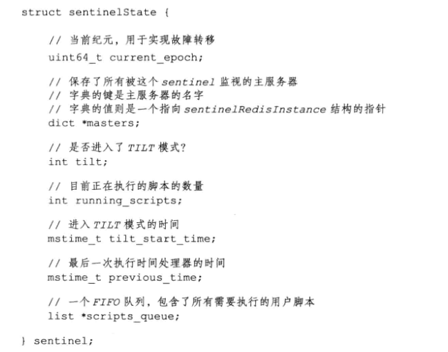
      - 4\. 根据给定的配置文件，初始化 Sentinel 的监视主服务器列表
        - masters 字典记录了所有被 sentinel 监视的 master 的相关信息，包括：字典的键是被监视的 master 的名字，值是 master 对应的 sentinel/sentinelRedisInstance 结构（简称实例结构）
          - 实例结构代表一个被 sentinel 监视的 redis 服务器示例，可能是 master、slave 或是另一个 Sentinel 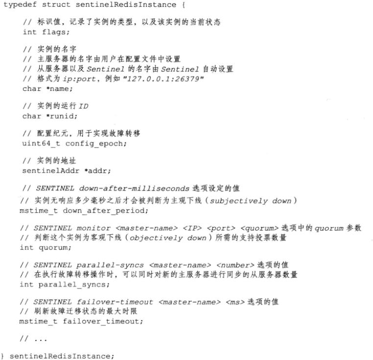
            - addr 是一个指向 sentinel.c/sentinelAddr 结构的指针，保存着实例的 IP 地址和端口号 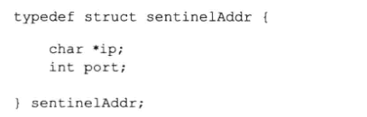
        - 例如，使用上述的配置文件 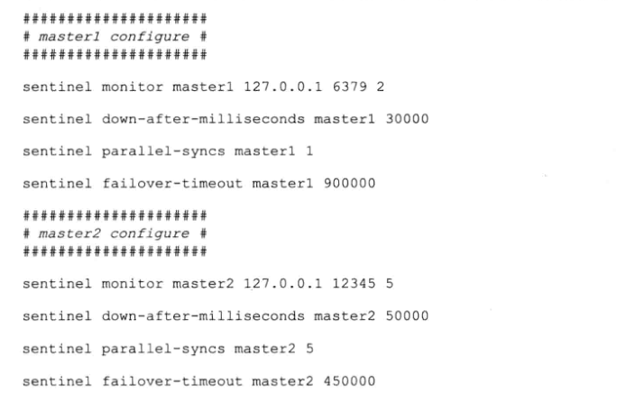
          - master 字典会被初始化为： 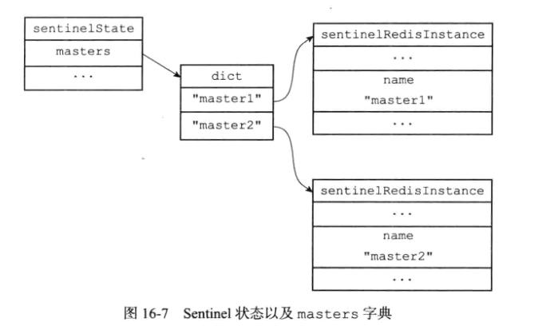
          - masters 字典的值会被初始化为： 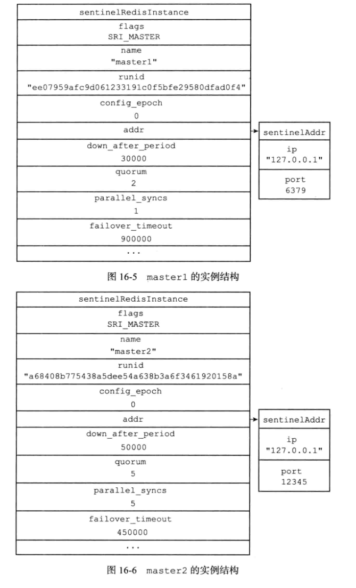
      - 5\. 创建连向主服务器的网络连接
        - 对于每个被 Sentinel 监视的 master，sentinel 会创建两个连向主服务器的异步网络连接 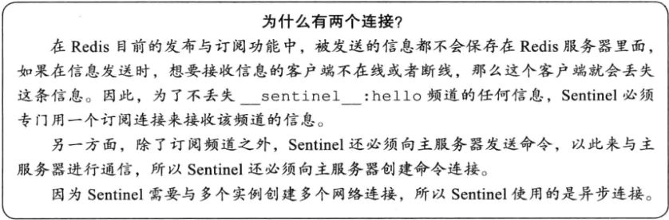
          - 命令连接
            - 专门用来向 master 发送命令，并接收命令回复
          - 订阅连接
            - 用来订阅 master 的 __sentinel__:hello 频道
  - 获取 master 信息
    - sentinel 会默认以每 10s 一次的频率，通过命令连接向被监视的 master 发送 INFO 命令，通过分析 INFO 命令的回复来获取主服务器的当前信息
      - 通过回复可以得到 2 方面的信息 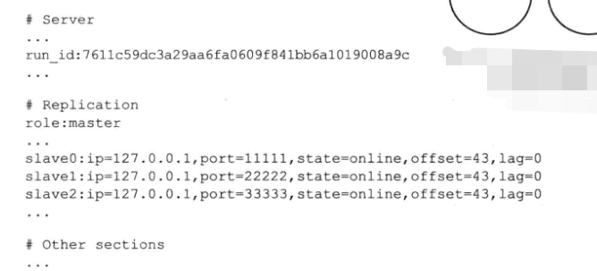
        - 主服务器本身的信息，包括 run_id 和 role
          - 通过此信息， sentinel 对 master 的实例结构进行更新
          - 例如，master 重启后，runid 就会和实例结构之前保存的 runid 不同，检测到这一情况之后，会对实例结构的 runid 进行更新
        - master 属下的所有 slaves
          - 会被用来更新 master 实例结构的 slaves 字典，记录了 master 下的 slave 名单
            - 该字典的键是由 sentinel 自动设置的从服务器名字，格式为 ip:port
            - 字典的值是 slave 对应的实例结构（如果存在，则更新，否则创建）
  - 获取 slave 信息
    - 当 sentinel 发现 master 新的 slave 出现时，除了会为这个新的 slave 创建相应的实例结构之外，还会建立到这个 slave 的命令连接和订阅连接
    - 建立命令连接后，默认按照 10s 一次的频率通过命令连接向 slave 发送 INFO 命令，从回复中提取出：
      - slave 的 runid
      - slave 的 role
      - maser 的 ip 地址（master_host）和端口号（master_port）
      - 主从服务器之间的连接状态 master_link_status
      - slave 的优先级 slave_priority
      - slave 的复制偏移量 slave_repl_offset
  - 向 master 和 slave 发送信息
    - 默认情况下，sentinel 会以每 2s 一次的频率，通过命令连接向被监视的 master 和 slave 发送以下格式的命令： 
      - 命令其中的 "S_" 开头的参数是 sentinel 本身的信息 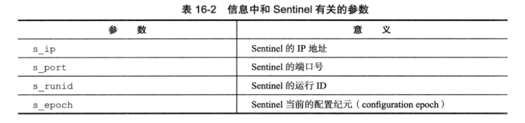
      - "m_" 开头的参数是 master 的相关信息 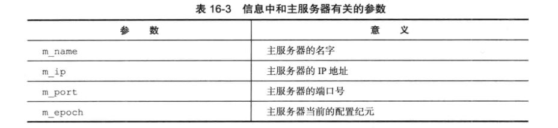
  - 接收来自 master 和 slave 的频道消息
    - 当 Sentinel 与一个 master 或者 slave 建立订阅连接之后，Sentinel 会通过订阅连接向服务器发送以下命令： 
      - 对 __sentinel__:hello 频道的订阅会一直持续到 Sentinel 与服务器断开连接为止
      - 这也就是说，对于每个与 Sentinel 连接的服务器，Sentinel 既通过命令连接向服务器的 __sentinel__:hello 频道发送信息，又通过订阅连接从服务器的 __sentinel__:hello 频道接收信息 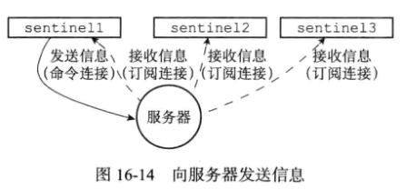
        - 当一个 sentinel 从该频道接收到一个消息时，会提取出信息中的 sentinel 的 ip、端口号、runid 等八个参数
          - 如果信息中记录的Sentinel运行ID和接收信息的Sentinel的运行ID相同，那么说明这条信息是Sentinel自己发送的，Sentinel将丢弃这条信息，不做进一步处理
          - 这 8 个参数为两方面
            - 与 sentinel 有关的参数
              - 源 sentinel 的 ip 地址、端口号、运行 ID、配置纪元
            - 与主服务器有关的参数
              - 源 sentinel 正在监视的 master 的名字、ip 地址、端口号和配置纪元
    - sentinel 为 master 创建的实例结构中的 sentinels 字典保存了除了其本身以外，和其他所有同样监视这个 master 的其他 sentinel 的资料
      - sentinel 字典的键是 sentinel 的名字，格式为 ip:port
      - 字典中的值是 sentinel 实例结构
    - 当通过频道消息发现一个新的 sentinel 时，不仅会在 sentinels 字典中创建一个新的实例结构，还会创建指向其它 sentinel 的命令连接
      - 使用命令连接来进行信息交换
      - sentinel 之间不会创建订阅连接 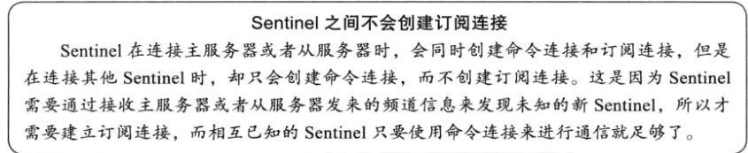
  - 检测主观下线状态
    - 默认情况下，sentinel 会以每秒一次的频率向所有与它创建了命令连接的实例（包括 master、slave 和其他 sentinel）发送 PING 命令，并通过实例返回的 PING 命令判断实例是否在线
      - 有效回复：返回 +PONG、-LOADING、-MASTERDOWN
      - 无效回复：除有效回复外的所有回复，或者在指定的时限内没有返回任何回复
    - sentinel 配置文件中的 down-after-milliseconds 选项指定了 sentinel 判断实例进入主观下线所需的时间长度
      - 如果一个实例在 down-after-milliseconds 内，连续向 Sentinel 发送无效回复，那么 sentinel 会修改这个实例所对应的实例结构，在结构的 flags 属性中打开 SRI_S_DOWN 标识，表示这个实例已经进入了主观下线状态
      - 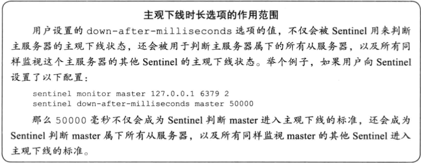
      - 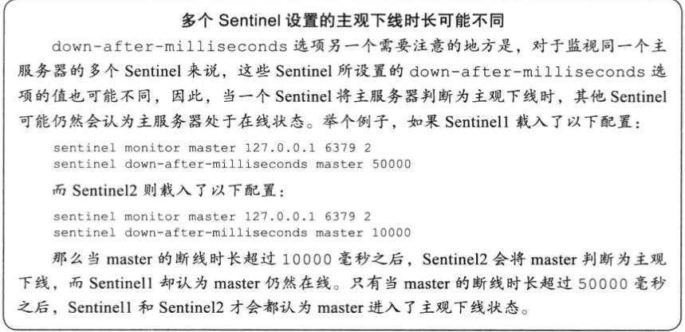
  - 检测客观下线状态
    - 当一个 sentinel 检测到一个 master 主观下线之后，为了确认这个主服务器是否真的下线了，它会向同样监视这一主服务器的其他 sentinel 询问，看它们是否也认为该 master 已经进入了下线状态（可能是主观也可能是客观）
      - 使用这个命令来询问其他 sentinel 
        - 参数含义 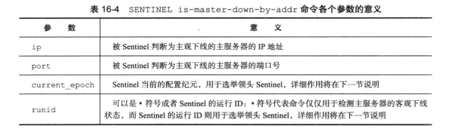
      - 接收到询问的命令之后，使用上述格式进行回复 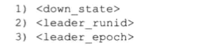
        - 参数含义 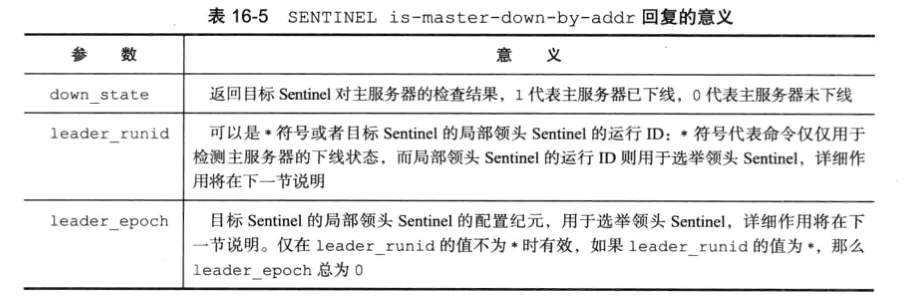
    - 当 sentinel 从其它 sentinel 那里接收到足够数量的已下线状态判断之后，sentinel 就会将该 master 判定为客观下线，并对 master 执行故障转移操作
      - 判断是否客观下线状态的条件 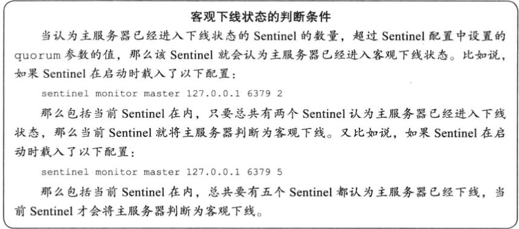
      - 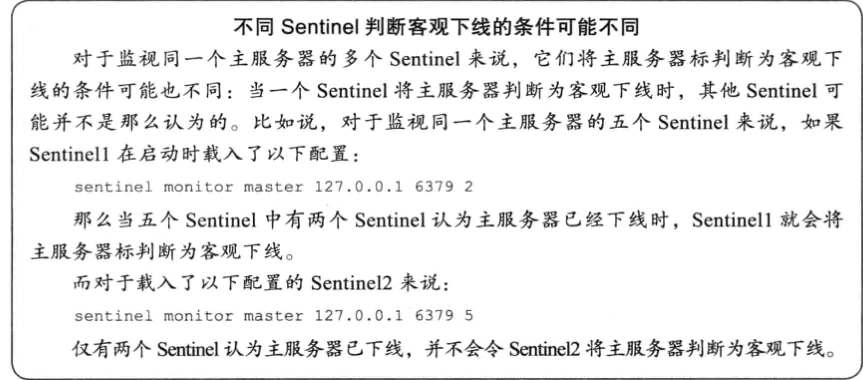
  - 选举领头的 Sentinel
    - 当一个 master 被判断为客观下线时，监视这个下线 master 的各个 sentinel 会进行协商，选举出一个领头 sentinel，并由领头 sentinel 对下线 master 进行故障转移操作
    - 选举规则和方法
      - 所有在线的Sentinel都有被选为领头Sentinel的资格，换句话说，监视同一个主服务器的多个在线Sentinel中的任意一个都有可能成为领头Sentinel
      - 每次进行领头Sentinel选举之后，不论选举是否成功，所有Sentinel的配置纪元 （configuration epoch）的值都会自增一次。配置纪元实际上就是一个计数器，并没有什么特别的
      - 在一个配置纪元里面，所有Sentinel都有一次将某个Sentinel设置为局部领头Sentinel的机会，并且局部领头一旦设置，在这个配置纪元里面就不能再更改
      - 每个发现主服务器进人客观下线的Sentinel都会要求其他Sentinel将自已设置为局部领头Sentinel
      - 当一个Sentinel（源Sentinel）向另一个Sentinel（目标Sentinel）发送SENTINEL is-master-down-by-addr命令，并且命令中的runid参数不是*符号而是源Sentinel的运行ID时，这表示源Sentinel要求目标Sentinel将前者设置为后者的局部领头Sentinel。
      - Sentinel 设置局部领头 Sentinel 的规则是先到先得：最先向目标Sentinel发送设置要求的源Sentinel将成为目标Sentinel的局部领头Sentinel，而之后接收到的所有设置要求都会被目标Sentinel拒绝。
        - 目标Sentinel在接收到SENTINEL is-master-down-by-addr命令之后，将向源Sentinel返回一条命令回复，回复中的leader_runid参数和leader_epoch参数分别记录了目标Sentinel的局部领头Sentinel的运行ID和配置纪元
      - 源Sentinel在接收到目标Sentinel返回的命令回复之后，会检查回复中leader epoch参数的值和自已的配置纪元是否相同，如果相同的话，那么源Sentinel继续取出回复中的leader_runid 参数，如果leader_runid参数的值和源Sentinel的运行ID一致，那么表示目标Sentinel将源Sentinel设置成了局部领头Sentinel
        - 如果有某个Sentinel被半数以上的Sentinel设置成了局部领头Sentinel，那么这个Sentinel成为领头Sentinel。举个例子，在一个由10个Sentinel组成的Sentinel系统里面，只要有大于等于10/2+1=6个Sentinel将某个Sentinel设置为局部领头Sentinel，那么被设置的那个Sentinel就会成为领头Sentinel。
        - 因为领头Sentinel的产生需要半数以上Sentinel的支持，并且每个Sentinel在每个 配置纪元里面只能设置一次局部领头Sentinel，所以在一个配置纪元里面，只会出现 一个领头Sentinel
      - 如果在给定时限内，没有一个Sentinel被选举为领头Sentinel，那么各个Sentinel将 在一段时间之后再次进行选举，直到选出领头Sentinel为止
  - leader sentinel 故障转移
    - 1\. 在已下线的主服务器属下的所有从服务器里面，挑选出一个 slave，并将其转换为 master
      - 挑选出来的 slave 要执行 SLAVEOF no one 命令
      - 怎么挑选出一个新的 master 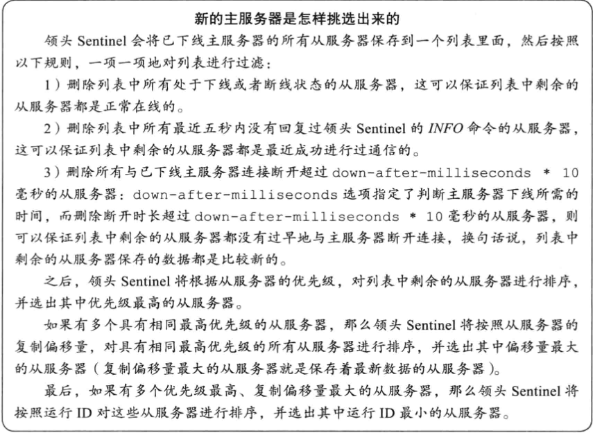
    - 2\. 让已下线的 master 的所有 slave 改为复制新的 master
      - 通过领头的 Sentinel 向 slaves 发送 SLAVEOF &lt;new-master-ip&gt; &lt;new-master-port&gt; 来实现
    - 3\. 将已下线的 master 设置为新的 master 的 slave
      - 设置被保存在已下线的 master 的实例结构里面
- 集群
  - 是 redis 提供的分布式数据库方案，通过分片（sharding）来进行数据共享，并提供复制和故障转移功能
  - 节点
    - 一个 redis 集群通常由多个节点组成
      - CLUSTER NODES 可以查看当前集群中的所有节点
    - 在刚开始时，每个节点都是相互独立的，都处于一个只包含自己的集群当中，要建立一个真正可工作的集群，必须将各个独立的节点连接起来，构成一个包含多个节点的集群
    - 连接各个节点由 CLUSTER MEET 命令来完成，格式如下： CLUSTER MEET &lt;ip&gt; &lt;port&gt;
      - 向一个节点发送此命令，可以让该节点与 ip 和 port 指定的节点进行握手，握手成功之后，node 节点就会将 ip 和 port 所指定的节点添加到节点当前所在的集群中
    - 启动节点
      - 一个启动节点就是运行在集群模式下的 redis 服务器，redis 服务器启动时根据 cluster-enabled 配置选项是否为 yes 来决定是否开启服务器的集群模式 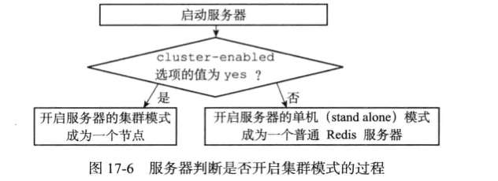
    - 集群特有的数据结构
      - cluster.h/clusterNode 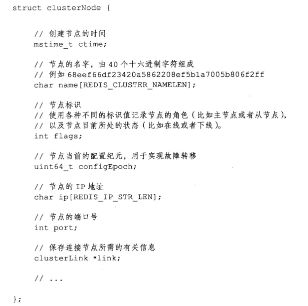
      - cluster.h/clusterLink 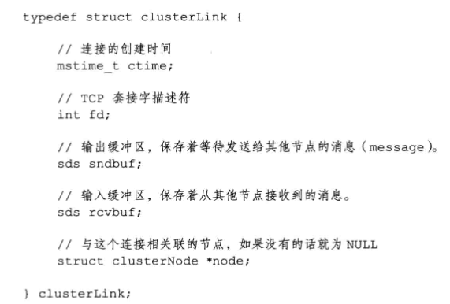
        - 与 redisClient 结构两者的相同与不同 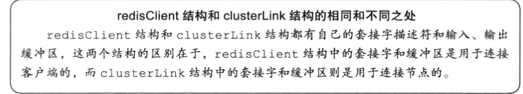
      - cluster.h/clusterState 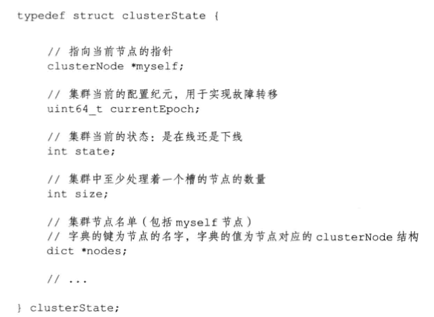
    - CLUSTER MEET 命令的实现
      - 为了将节点 B 加入到节点 A 的集群中，A 收到来自客户端的 CLINET MEET &lt;B ip&gt; &lt;B port&gt; 命令后会通过握手来确认彼此的存在，并为将来的进一步通信打好基础：
        - 1\. 节点 A 会为 B 创建一个 clusterNode 结构，并将该结构添加到自己的 clusterState.nodes 字典里
        - 2\. 节点 A 将根据 CLUSTE MEET 指定的 IP 地址和端口号，向节点 B 发送一条 MEET 消息
          - 如果 B 成功接收到 A 发送的 MEET 消息，节点 B 会为节点 A 创建一个 clusterNode 结构，并将该结构添加到自己的 clusterState.nodes 字典里，然后向 A 发送一条 PONG 消息
        - 3\. A 接收到 B 发送过来的 PONG 消息，通过这条 PONG 消息 A 可以知道节点 B 已经成功地接收到了自己发送的 MEET 消息
        - 4\. A 向 B 发送一条 PING 消息
        - 5\. 节点 B 接收到 A 返回的 PING 消息，通过这条 PING 消息节点 B 可以知道节点 A 已经成功地接收到了自己返回的 PONG 消息，握手完成
        - 6\. 节点 A 会将节点 B 的信息通过 Gossip 协议传播给集群中的其他节点，让其他节点也与节点 B 进行握手。经过一段时间后，B 会被集群中的所有节点所认识
  - 槽
    - 集群通过分片的方式来保存数据库中键值对
    - 集群的整个数据库被分为 16384 个槽（slot）
    - 数据库中的键都属于 16384 槽中的一个，集群中的各个节点可以处理 [0, 16384] 个槽
    - 槽指派
      - 通过向节点发送 CLUSTER ADDSLOTS 命令，可以将一个或多个槽指派（assign）给节点负责： CLUSTER ADDSLOTS &lt;slot&gt; [slot ...]
        - 例如，将 0 ~ 5000 的槽指派给节点： CLUSTER ADDSLOTS 0 1 2 3 4 ... 5000
      - 记录节点的槽指派信息
        - clusterNode 结构的 slots 属性和 numslot 属性记录了节点负责处理哪些槽 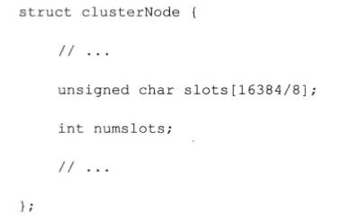
          - slots 是一个二进制位数组（bit array）
      - 传播节点的槽指派信息
        - 一个节点除了会将自己负责处理的槽记录在 clusterNode 结构的 slots 属性和 numslots 之外，还会将自己的 slots 数组通过消息发送给集群中的其他节点，以此来告知其他节点自己目前负责处理哪些槽 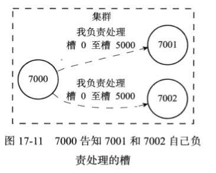
          - 当一个节点 A 接收到来自 B 的 slots 数组时，节点 A 会在自己的 clusterState.nodes 字典中查找节点 B 对应的 clusterNode 结构，并对结构中的 slots 数组进行保存或者更新
        - 传播槽指派的信息的目的是每个节点都会知道数据库中的所有槽的指派信息
          - 记录集群中所有槽的指派信息
            - clusterState 结构中的 slots 数组记录了集群中所有 16384 个槽中的指派信息，数组的每个项是一个指向 clusterNode 结构的指针 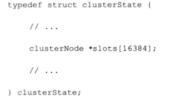
            - 目的：快速检查某个槽是否被指派
            - 虽然有 clusterState.slots 数组记录了集群中的所有槽的指派信息，但是使用 clusterNode 结构的 slots 数组来记录单个节点的槽指派信息仍然是必要的： 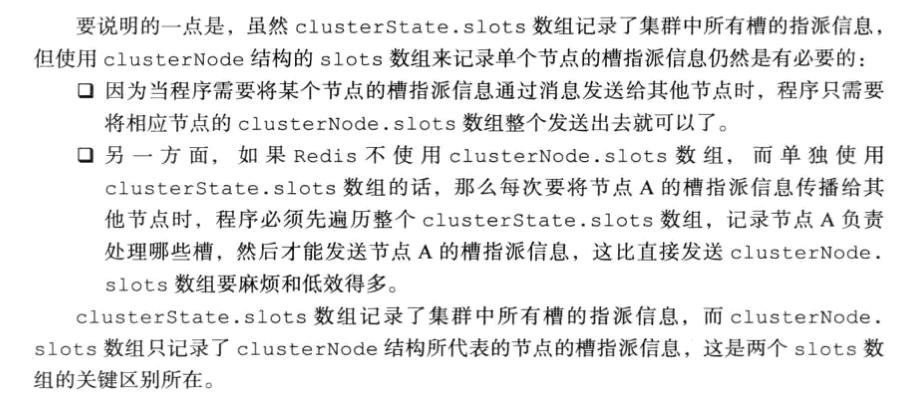
      - CLUSTER ADDSLOTS 命令的实现 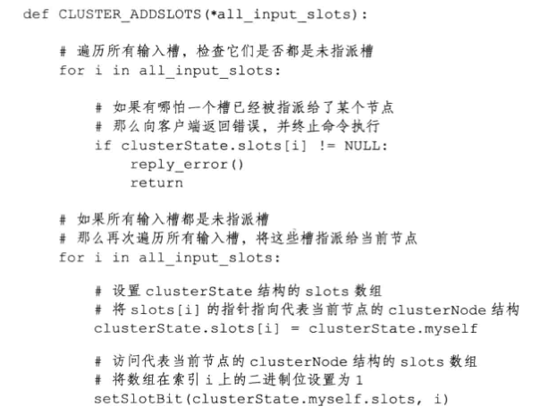
        - CLUSTER ADDSLOTS 命令执行完毕之后，节点会通过发送消息通知集群中的其他节点，自己目前正在处理哪些槽
  - 在集群中执行命令
    - 在对数据库中的 16384 个槽都指派了节点之后，集群就会进入上线状态，这时客户端就可以向集群中的节点发送数据命令了
    - 当客户端向节点发送与数据库键有关的命令时，节点会计算出命令要处理的数据库键属于哪个槽，并检查这个槽是否指派给了自己
      - 计算键属于哪个槽
        - 使用一下算法来计算给定键属于槽： CRC16(key) & 16384
        - 使用 CLUSTER KEYSLOT &lt;key&gt; 命令可以查看一个给定键属于哪个槽
      - 判断槽是否由当前节点负责处理
        - 节点通过检查 cluserState.slots[i] == clusterState.myself 来判断槽是否由自己负责
      - 如果没有指派给自己，则返回 MOVED 错误，指引客户端重定向（redirect）至正确的节点，并再次发送之前想要执行的命令 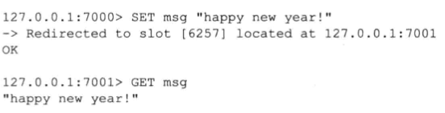
        - MOVED 错误的格式： MOVED &lt;slot&gt; &lt;ip&gt;:&lt;port&gt;
          - 其中 slot 为键所在的槽
          - ip 和 port 是负责处理槽的节点的 IP 地址和端口号
        - 客户端接收到 MOVED 错误之后，根据 MOVED 错误中提供的 IP 地址和端口号，重定向至处理 slot 的节点，并向该节点重重新发送之前想要执行的命令
        - 被隐藏的 MOVED 错误 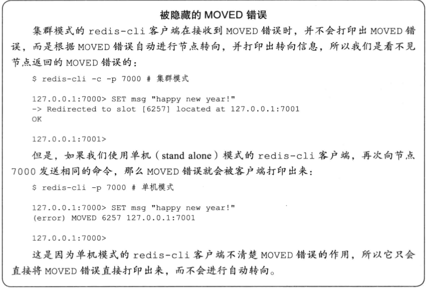
  - 集群模式中的数据库
    - 与单机数据库的不同点
      - 节点只能使用 0 号数据库
      - 除了将键值对保存在数据库中，节点还会用 clusterState 结构中的 slots_to_keys 跳跃表来保存槽和键之间的关系 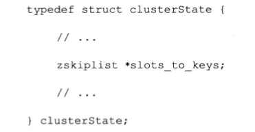
        - 该跳跃表中每个节点的分值都是一个槽号，每个节点的成员都是一个数据库键 
          - 例如 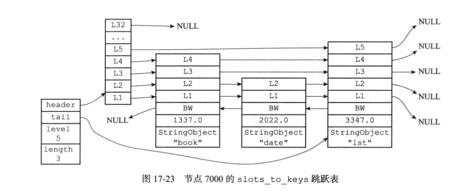
        - 目的：对属于某个或某些槽的所有数据库进行操作
  - 重新分片
    - 此操作可以将任意数量已经指派给某个节点（源节点 S）的槽改为指派给另一个节点（目标节点 T），并且相关槽所属的键值对也会从源节点被移动到目标节点
    - 此操作可以在线进行（集群不需要下线），并且 S、T 节点都可以继续命令请求
    - 此操作由 redis 的集群管理软件 redis-trib 负责执行 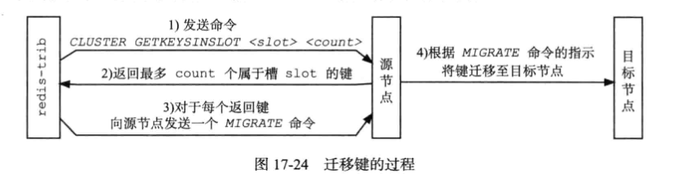
      - 1\. 对 T 节点发送 CLUSTER SETSLOT &lt;slot&gt; IMPORTING &lt;source_id&gt; 命令
        - 让 T 准备好从 S 导入属于槽 slot 的键值对
      - 2\. 对 S 发送 CLUSTER SETSLOT &lt;SLOT&gt; MIGRATING &lt;target_id&gt; 命令
        - 将 S 的属于槽 slot 的键值对迁移到 T
      - 3\. 对 S 发送 CLUSTER GETKEYSINSLOT &lt;slot&gt; &lt;count&gt; 命令
        - 获得最多 count 个属于槽 slot 的键值对的键名
      - 4\. 对于步骤 3 获得的每个键名，都向 S 发送一个 MIGRATE &lt;target_ip&gt; &lt;target_port&gt; &lt;key_name&gt; 0 &lt;timeout&gt; 命令，将被选中的键原子地从 S 迁移至 T
      - 5\. 重复执行步骤 3 和 4，直到所有槽 slot 的键值对都被迁移到目标节点为止
      - 6\. 向集群中的任意一个节点发送 CLUSTER SETSLOT &lt;slot&gt; NODE &lt;target_id&gt; 命令，将槽 slot 指派给 T，这一指派消息会通过消息发送至整个集群，最终集群中的所有节点都会知道槽 slot 已经指派给了 T
    - ASK 错误
      - 指一个槽在从 S 迁移到 T 的过程中，槽的一部分键值对在以 S 中，而另一部分在 T 中
      - 当客户端向 S 发送一个与数据库键有关的命令，并且命令要处理的数据库键正好就属于被迁移的槽时，如果该键已经被迁移了，则 S 返回一个 ASK 错误，指引客户端转向正导入槽的 T 节点，并再次发送之前想要执行的命令 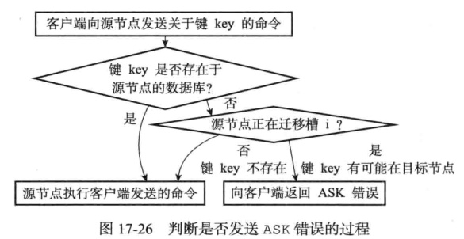
        - 接收到 ASK 错误的客户端会根据错误提供的 IP 地址和端口号，转向至正在导入槽的目标节点，然后首先向目标节点发送一个 ASKING 命令，然后才发送原本想要执行的命令
          - ASKING 命令的作用是打开（设置）发送该命令的客户端的 REDIS_ASKING 标识 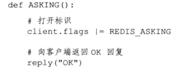
            - 在一般情况下，如果客户端向节点发送一个关于槽 i 的命令，而槽 i 又没有指派给这个节点的话，那么节点将向客户端返回一个 MOVED 错误，但是，如果节点的 clusterState.importing_slots_from[i] 显示节点正在导入这个槽 i，而且发送命令的客户端带有 REDIS_ASKING 标识，那么节点将破例执行这个关于槽 i 的命令一次 ![在一般情况下，如果客户端向节点发送一个关于槽 i 的命令，而槽 i 又没有指派给这个节点的话，那么节点将向客户端返回一个 MOVED 错误，但是，如果节点的 clusterState.importing_slots_from\[i\] 显示节点正在导入这个槽 i，而且发送命令的客户端带有 REDIS_ASKING 标识，那么节点将破例执行这个关于槽 i 的命令一次](images/56fdf24a56c73ba2069e115b8a6af1ccb1c12e181e611379f06ebd0bf1f2c72a.png)
      - 集群模式下的 ASK 错误会被隐藏 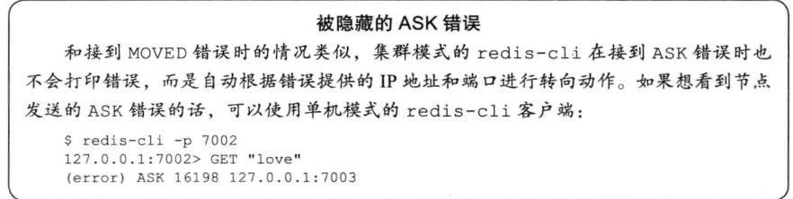
    - 命令实现
      - CLUSTER SETSLOT IMPORTING
        - clusterState 结构的 importing_slots_from 数组记录了当前节点正在从其它节点导入的槽
          - 如果 importing_slots_from[i] != NULL,指向一个 clusterNode 结构，那么表示当前节点正在从 clusterNode 所代表的节点导入槽
          - 当向一个节点发送 CLUSTER SETSLOT &lt;i&gt; IMPORTING &lt;source_id&gt; 命令时，会将其 importing_slots_from[i] 的值设置为 source_id 所代表节点的 clusterNode 结构
      - CLUSTER SETSLOT MIGRATING 命令的实现
        - clusterState 结构的 migrating_slots_to 数组记录了当前节点正在迁移至其他节点的槽 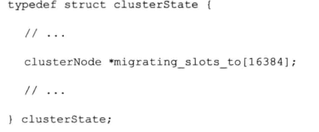
          - 可以用于实现 ASK 错误
  - 复制与故障转移
    - redis 集群中的节点分为主节点（master）和从节点 （slave）
      - 主节点用于处理槽，从节点用于复制某个主节点
      - 主节点下线时，从节点代替下线的主节点继续处理命令请求
    - 设置从节点
      - CLUSTER REPLICATE &lt;node_id&gt; 可以让接收命令的节点称为 node_id 所指定节点的从节点，并开始对主节点进行复制
        - 1\. 从自己的 clusterState.nodes 字典中找到 node_id 所对应的 clusterNode 结构，并将自己的 clusterState.myself.slaveof 指针指向这个结构，以此来记录这个节点正在复制的主节点 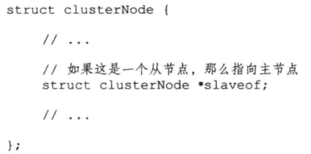
        - 2\. 节点会修改自己在 clusterState.myself.flags 中的属性，关闭原本的 REDIS_NODE_MASTER，打开 REDIS_NODE_SLAVE 标识
        - 3\. 调用用于复制的函数，并根据 clusterState.myself.slaveof 指向的 clusterNode 结构所保存的 IP 地址和端口号，对 master 进行复制
      - 一个节点成为从节点，并开始复制某个主节点会通过消息发送给集群中的其他节点，最终，集群中的节点都会知道某个从节点正在复制某个主节点
        - 所有节点都会在主节点的 clusterNode 结构的 slaves 属性和 numslaves 属性中记录正在复制这个主节点的从节点名单 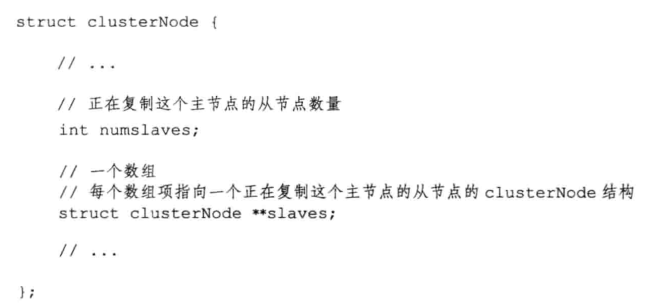
    - 故障检测
      - 集群中的每个节点都会定期向集群中的其他节点发送 PING 消息，以此来检测对方是否在线，如果接收 PING 消息的节点没有在规定的时间内，向发送 PING 消息的节点返回 PONG 消息，那该节点被标记为疑似下线（probable fail, PFAIL），并在 clusterState.nodes 字典中找到该节点所对应的 clusterNode 结构，并在结构的 flags 属性中打开 REDIS_NODE_PFALL 标识
      - 集群中的各个节点还会通过互相发送消息的方式来交换集群中的各个节点的状态信息，例如某个节点处于什么状态（在线、下线，疑似下线）
        - 当一个 master A 通过消息得知 master B 认为 master C 进入了疑似下线状态时，A 会在自己的 clusterState.nodes 字典中找到 C 所对应的 clusterNode 结构，并将 B 的下线报告（failure report）添加到 clusterNode 结构的 fail_reports 链表里： 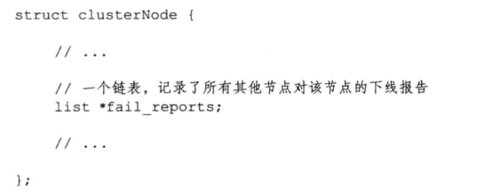
          - 下线报告由 clusterNodeFailReport 结构表示： 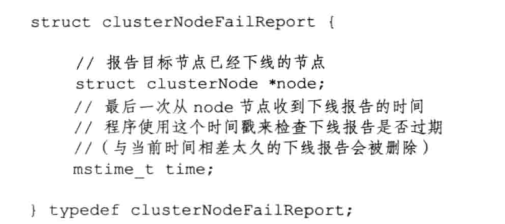
      - 如果在一个集群里面，半数以上负责处理槽的节点都将 master X 报告为疑似下线，那么 X 会被标记为已下线（FAIL），将 X 标记为下线的节点会向集群广播一条关于 X 的 FAIL 的消息，收到 FAIL 消息的节点会立即将主节点 X 标记为已下线
    - 故障转移
      - 当一个从节点发现正在复制的主节点进入了已下线状态时，从节点将对下线主节点进行故障转移
      - 步骤
        - 1\. 选举一个 slave 成为 master
          - 1\. 集群的配置纪元是一个自增计数器，它的初始值为 0
          - 2\. 当集群里的某个节点开始进行一次故障转移操作时，集群配置纪元的值都会被增加 1
          - 3\. 对于每个配置纪元，集群里的每个负责处理槽的主节点都有一次投票的机会，而第一个向 master 要求投票（该 slave 要求 master 进行选举）的 slave 将获得 master 的投票
            - 当 slave 发送自己正在复制的主节点进入已下线状态时，slave 会向集群广播一条 CLUSTERMSG_TYPE_FAILOVER_AUTH_REQUEST 消息，要求所有收到这条消息，并且具有投票权的 master 向该 slave 投票
          - 4\. 如果一个 master 具有投票权，并且这个主节点尚未投票给其他从节点，那么 master 将向要求进行投票的 slave 返回一条 CLUSTERMSG_TYPE_FFAILEOVER_AUTH_ACK 消息，表示这个 master 支持该 slave 成为新的 slave
          - 5\. 每个参与选举的 slave 都会接收 CLUSTERMSG_TYPE_FALLOVER_AUTH_ACK 消息，并根据自己收到了多少条这样的消息来统计自己获得了多少主节点的支持
          - 6\. 对于有 N 个具有投票权的 master 的集群来说，当 slave 收到大于等于 N / 2 + 1 张投票的时候，该 slave 被确定为新的 master
          - 7\. 如果一个配置纪元里面没有 slave 能收集到足够多的支持票，那么集群进入下一个配置纪元，并再次进行选举，直到选出新的 master
        - 2\. 对选中的 slave 执行 SLAVEOF no one 命令，成为新的 master
        - 3\. 新的 master 会撤销所有对已下线 master 的槽指派，并将这些槽全部指派给自己
        - 4\. 新的 master 向集群广播一条 PONG 消息，这条 PONG 消息可以让集群中的其他节点立即这个节点已经由 slave 变成了 master
        - 5\. 新的 master 开始接收和自己负责处理的槽有关的命令请求
  - 消息
    - 称发送消息的节点为发送者，接收消息的节点为接受者
    - 节点发送的消息主要有 5 种
      - MEET 消息
        - 发送者接收到来自客户端的 CLUSTER MEET 命令使，发送者会向接受者发送 MEET 消息，请求接收者加入到发送者当前所处的集群里
      - PING 消息
        - 集群里的每个节点默认每隔 1s 就会从已知节点列表中随机选出五个节点，然后对这 5 个节点中最长时间没有发送过 PING 消息的节点发送 PING 消息，以此来检测被选中的节点是否在线
        - 如果 A 最后一次收到节点 B 发送过来的 PONG 消息的时间距离当前时间已经超过了 A 的 cluster-node-timeout 选项设置时长的一半，那么节点 A 也会向节点 B 发送 PING 消息，这可以防止 A 因为长时间没有随机选中节点 B 作为 PING 消息的发送对象而导致对节点 B 的信息滞后
      - PONG 消息
        - 当接收者受到发送者的发来的 MEET 消息或者 PING 消息时，为了向发送者确认这条 MEET 消息或者 PING 消息已到达，接受者会向发送者返回一条 PONG 消息
        - 一个节点可以通过集群广播自己的 PONG 消息来让集群中的其他节点立即刷新关于这个节点的认识（让其他节点认识到自己成为了 master）
      - FAIL 消息
        - 节点 A 判断 B 已经下线时（FAIL 状态），节点 A 会向集群广播一条关于 B 的 FAIL 消息，所有接收到这个消息的节点会立即将节点 B 标记为下线
      - PUBLISH 消息
        - 当节点收到一个 PUBLISH 消息时，节点会执行这个 PUBLISH 命令，并向集群广播一条 PUBLISH 消息
    - 组成
      - 消息头 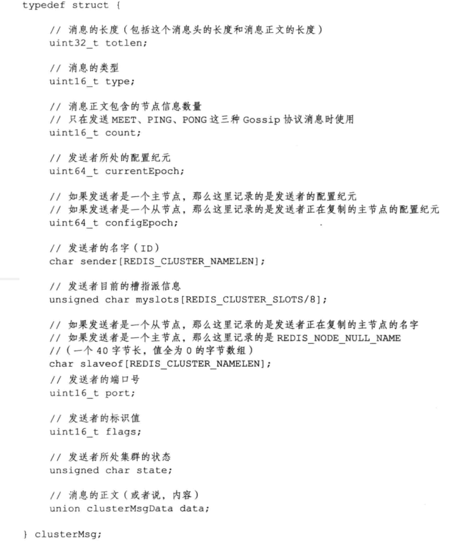
      - 消息正文 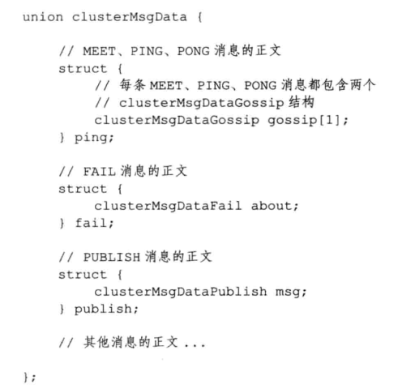
    - MEET、PING、PONG 消息的实现
      - 发送者从自己的已知节点列表中随机选出 2 个节点（可以是 master 或 slave），并将者两个被选中的节点的信息分别保存到 2 个 clusterMsgDataGossip 结构里： 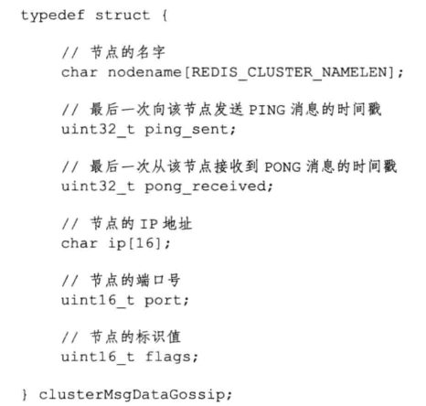
      - 接受者会访问联系正文中的两个 clusterMsgDataGossip 结构，并根据自己是否认知 clusterMsgDataGossip 结构中记录的被选中节点来决定进行哪种操作
        - 如果被选中的节点不存在接收者的已知列表，那么接受者是第一次接触到被选中节点，将与被选中节点进行握手
        - 否则，对被选中节点所对应的 clusterNode 结构进行更新
    - FAIL 消息的实现
      - 在集群里的节点数量比较大的情况下，单纯使用 Gossip 协议来传播节点的已下线信息回给节点的信息带来一定的延迟，而发送 FAIL 消息让所有节点立即知道某个节点已下线，从而判断是否需要将集群标记为下线或者进行故障转移
      - 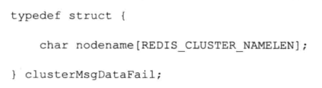
    - PUBLISH 消息的实现
      - 当客户端向集群里的某个节点发送下列命令： PUBLISH &lt;channel&gt; &lt;message&gt; 接收到 PUBLISH 命令的节点不仅会向 channel 频道发送消息 message，还会向集群广播一条 PUBLISH 消息，所有接收到这条 PUBLISH 消息的节点都会向 channel 频道发送 message 消息
        - 这将导致集群中的所有节点都向 channel 频道发送 message 消息
      - 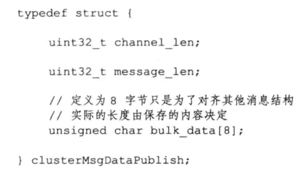
        - bulk_data 的 0 ~ channel_len - 1 字节保存的是 channel 参数。channel_len ~ message_len - 1 字节保存的是 message 参数
      - 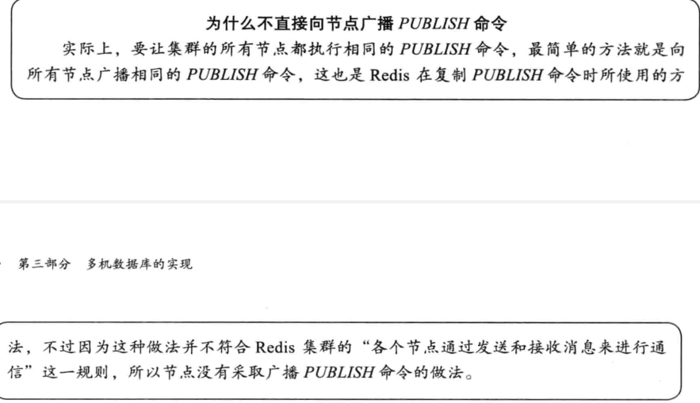
- 发布与订阅
  - 通过 SUBSCRIBE 命令，客户端可以订阅一个或多个频道，，从而成为这些频道的订阅者。每当其它客户端向被订阅的频道发送消息时，频道的所有订阅者都会收到这条消息
  - 通过 PSUBSCRIBE 命令，客户端可以订阅一个或多个模式，每当有其他客户端向某个频道发送消息时，消息不仅会被发送给这个频道的所有订阅者，还会被发送给所有与这个频道相匹配的模式的订阅者 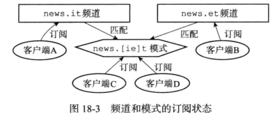
  - 频道的订阅和退订
    - redis 将所有频道的订阅关系都保存在了服务器状态的 pubsub_channels 字典里面，这个字典的键是某个被订阅的频道，而键的值则是一个链表，链表里面记录了所有订阅这个频道的客户端 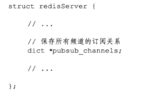
      - 订阅
        - 如果订阅的频道已经有其他订阅者，则将客户端添加到订阅者链表的末尾
        - 如果订阅的频道没有其他订阅者，则首先在 pubsub_channels 字典频道中创建一个键，并将这个键设置为空链表，然后将客户端添加到该链表中
      - 退订
        - UNSUBSCRIBE 命令
        - 从 pubsub_channels 中移除频道对应的键中的客户端
  - 模式的订阅与退订
    - 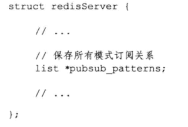
      - 聊表中的每个节点都包含着一个 pubsubPattern 结构，这个结构的 pattern 属性记录了被订阅的模式，而 client 属性则记录了订阅模式的客户端 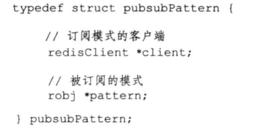
      - PSUBSCRIBE 和 PUNSUBSCRIBE 命令用于订阅和退订
  - 发送消息
    - PUBLISH &lt;channel&gt; &lt;message&gt; 命令用于将 message 发送给频道 channel
  - 查看订阅信息
    - 通过 PUBSUB 命令来查看频道或者模式的相关信息，比如频道订阅者的数量
    - PUBSUB CHANNELS [pattern] 用于返回符合 pattern 的所有频道
    - PUBSUB NUMSUB [channel_1 channel_2 ...] 返回这些频道的订阅者
    - PUBSUB NUMPAT 返回服务器当前被订阅模式的数量，即返回 pubsub_patterns 链表的长度
- 事务
  - 通过 MULTI、EXEC、WATCH 等命令来实现事务功能
  - 事务执行期间，服务器不会中断事务而去执行其它客户端的请求
  - redis 事务中，某个命令执行出错而不会回滚
  - MULTI 用于开启事务， EXEC 用于提交事务
  - 事务的实现
    - 事务开始
      - MULTI 命令将客户端的 flags 属性中的 REDIS_MULTI 标识打开
    - 命令入队
      - 如果客户端发送的命令不是 EXEC、DISCARD、WATCH、MULTI 命令中的其中一个，服务器不会立即执行命令，而是将这些命令放入一个事务队列中，然后向客户端发送 QUEUED 回复
      - 每个 redis 客户端都有自己的事务状态，即客户端的 mstate 属性 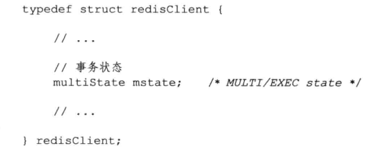
        - multiState 结构体 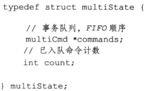
          - multiCmd 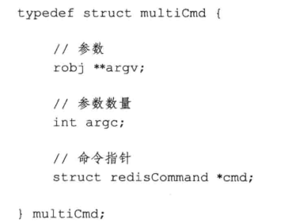
      - 例如 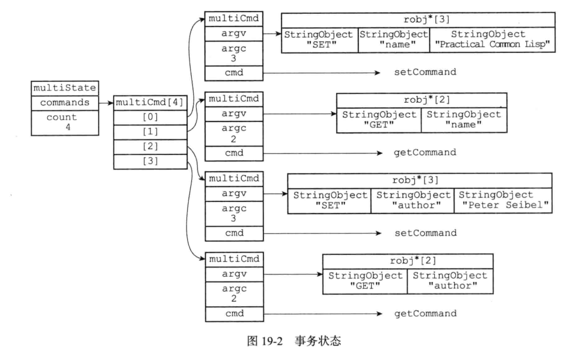
    - 事务执行
      - EXEC 命令会被服务器立即执行，服务器遍历客户端的事务队列，执行队列中保存的所有命令，然后将执行命令所得的结果全部返回给客户端 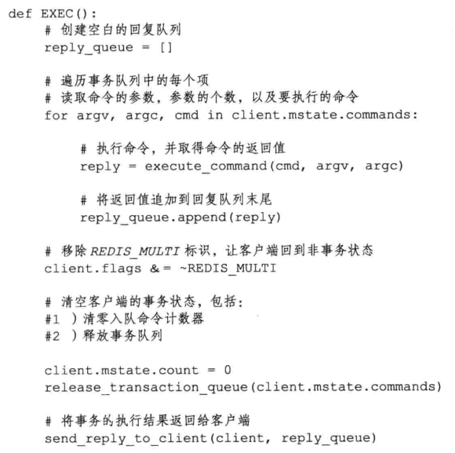
  - WATCH 命令
    - 是一个乐观锁，可以在 EXEC 命令执行之前，监视任意数量的数据库键，并在 EXEC 命令执行期间，检查被监视的键是否至少有一个已经被修改过了，如果是的话，服务器则拒绝执行事务，并返回代表事务执行失败的空回复： 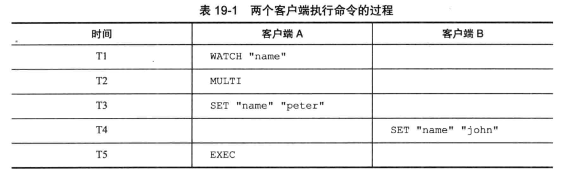
    - 实现
      - 每个 redis 数据库都有一个 watched_keys 字典，该字典的键是被监视的数据库的键，值是一个链表，记录了所有监视相应数据库键的客户端 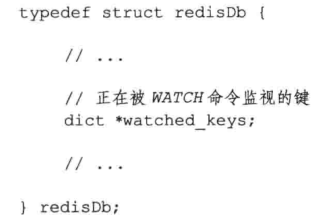
      - 所有对数据库进行修改的命令，执行之后都会调用 multi.c/touchWatchKey 函数对 watched_keys 字典进行检查，查看是否有客户端正在监视刚刚被修改过的数据库键，如果有，那么会将监视被修改键的客户端的 REDIS_DIRTY_CAD 标识打开，标识该客户端的事务安全性已经被破坏了
      - 当服务器接收到一个客户端发送过来的 EXEC 命令时，服务器会根据这个客户端是否打开了 REDIS_DIRTY_CAS 标志来决定是否执行事务
- Lua 脚本
  - 使用 lua 脚本，可以直接在服务器端原子地执行多个 redis 命令
  - EVAL 命令可以直接对输入的脚本进行求值
    - 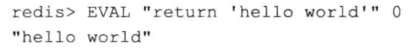
  - EVALSHA 命令可以根据脚本的 SHA1 校验和来对脚本进行求值
    - 这个命令要求检验和对应的脚本必须至少被 EVAL 命令执行过一次
      - 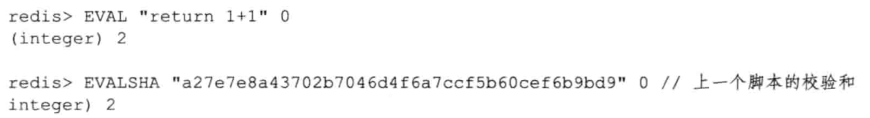
    - 或者这个检验和对应的脚本曾经被 SCRIPT LOAD 命令载入过
      - 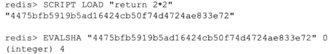
  - Lua 环境
    - 为了在 Redis 服务器中执行 lua 脚本，redis 在服务器端内嵌了一个 Lua 环境，并对这个环境进行了一系列的修改，从而确保这个 lua 环境可以满足 redis 服务器的需要
    - 步骤
      - 1\. 创建一个基础的 Lua 环境，之后的所有修改都是针对这个环境进行的
        - 调用 lua 的 C API 函数 lua_open，创建一个新的 lua 环境
      - 2\. 载入多个函数库到 Lua 环境里面，让 Lua 脚本可以使用这些函数库来进行数据操作
        - 基础库（base library）
          - 包含 Lua 的核心（core） 函数，比如 assert、error、pairs...
          - 为了防止用户从外部文件中引入不安全的代码，库中的 loadfile 函数会被删除
        - 表格库（table library）
          - 包含用于处理表格的通用函数，如 table、concat、table.insert....
        - 字符串库（string library）
        - 数学库
        - 调试库
        - Lua CJSON 库
          - 用于处理 UTF-8 编码的 JSON 数据
        - Struct 库
          - 用于在 Lua 值和 C 结构之间进行转换，函数 struct.pack 将多个 lua 值打包成一个类结构字符串，而函数 struct.unpack 则从一个类结构字符串中解包出多个 Lua 值
        - Lua cmsgpack 库
          - 用于处理 MessagePack 格式的数据
      - 3\. 创建全局表格 redis，这个表格包含了对 reids 进行操作的函数，比如 redis.call 函数
        - 这个表格包含下列函数
          - 用于执行 redis 命令的 redis.call 和 redis.pcall 函数
          - 用于记录 redis 日志的 redis.log 函数，以及相应的日志级别的常量： 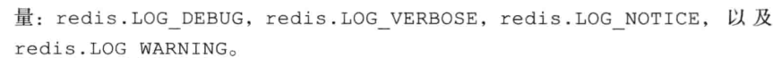
          - 用于计算 SHA1 校验和的 redis.sha1hex 函数
          - 用于返回错误信息的 redis.error_reply 函数和 redis.status.reply 函数
      - 4\. 使用 redis 自制的随机函数来替换 Lua 原有的带有副作用的随机函数，从而避免在脚本中引入副作用
      - 5\. 创建排序辅助函数，Lua 环境使用这个辅助函数来对一部分 reids 命令的结果进行排序，从而消除这些命令的不确定性
        - 上述这些命令在相同的数据集上产生不同的输出的命令称为“带有不确定性的命令” 
          - 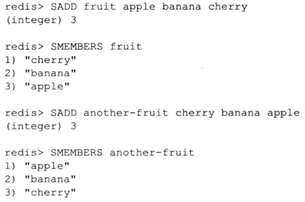
        - 为消除这些命令带来的不确定性，服务器会为 Lua 环境创建一个排序辅助函数 __redis__compare_helper 作为对比函数，自动调用 table.sort 函数对命令的返回值做一次排序，从而保证相同的数据集总是产生相同的输出
          - 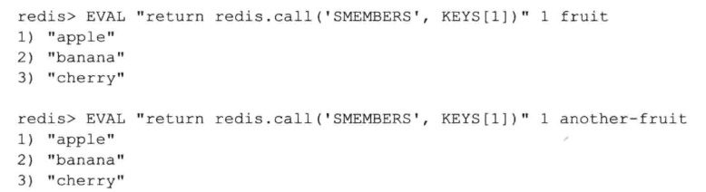
      - 6\. 创建 redis.pcall 函数的错误报告辅助函数，以提供更详细的出错信息
      - 7\. 对 Lua 环境中的全局环境进行保护，防止用户在执行 Lua 脚本的过程中，将额外的全局变量添加到 Lua 环境中
        - 当脚本试图创建一个全局变量时，服务器将报告一个错误
          - 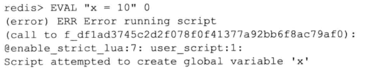
      - 8\. 将完成修改的 Lua 环境保存到服务器状态的 lua 属性中，等待执行服务器传来的 Lua 脚本
  - lua 环境协作组件
    - 伪客户端
      - 负责执行 Lua 脚本中的 redis 命令的伪客户端
      - 因为执行 redis 命令必须有相应的客户端状态，为了执行 Lua 脚本中包含的 redis 命令，故而由伪客户端负责处理 Lua 脚本中所有的 redis 命令
      - redis.call 或 redis.pcall 函数执行一个命令，需要的步骤： 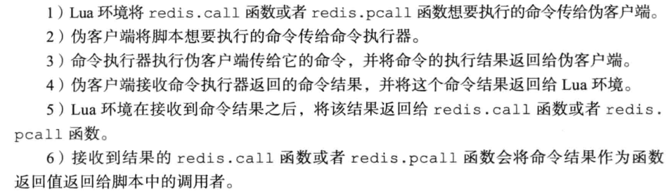
    - lua_scripts 字典
      - 用于保存 lua 脚本 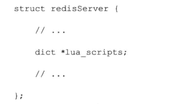
      - 此字典的键是 lua 脚本的 SHA1 检验和（checksum），而字典的值则是 SHA1 检验和对应的 lua 脚本
      - 用于实现 SCRIPT EXISTS 命令和实现脚本复制命令
  - EVAL 命令的实现
    - 1\. 根据客户端给定的 lua 脚本，在 lua 环境中定义一个 Lua 函数
      - 这个函数名是 f_ 前缀加上脚本的 SHA1 检验和（40 个字符）组成，函数体则是脚本本身
    - 2\. 将客户端给定的脚本保存到 lua_scripts 字典
    - 3\. 执行刚刚在 lua 环境中定义的函数
      - 1\. 将 EVAL 命令中传入的键名参数和脚本参数分别保存到 KEYS 数组和 ARGV 数组，然后将这两个全局变量传入到 Lua 环境里面
      - 2\. 为 lua 环境装载超时处理钩子，可以在脚本出现超时运行情况时，让客户端通过 SCRIPT KILL 命令停止脚本
      - 3\. 执行脚本函数
      - 4\. 移除超时钩子
      - 5\. 将得到的结果保存到客户端状态的输出缓冲区里面，等待服务器将结果返回给客户端
      - 6\. 对 Lua 环境进行垃圾回收操作
  - 脚本管理命令
    - SCRIPT FLUSH
      - 用于清除服务器中所有和 Lua 脚本有关的信息，会释放并重建 lua_scripts 字典，关闭现有的 lua 环境并重行建立一个新的 lua 环境
    - SCRIPT EXISTS
    - SCRIPT LOAD
      - 创建脚本对应的函数，然后将其保存到 lua_scripts 字典里
    - SCRIPT KILL
      - 如果设置了 lua-time-limit 配置选项，则每次执行 lua 脚本之前，都会在 lua 环境里面设置一个超时处理钩子（hook）
      - 超时钩子会在脚本运行期间，定期检查脚本的运行时间，如果发现脚本的运行时间已经超过了 lua-time-limit 选项，钩子将定期在脚本运行的间隙中，查看是否有 SCRIPT KILL 命令或者 SHUTDOWN 命令到达服务器
        - 如果超时运行的脚本未执行任何写入操作，那么客户端可以使用 SCRIPT KILL 命令来停止这个脚本
        - 如果已经执行过了写入操作，那么客户端只能用 SHUTDOWN nosave 命令来停止服务器，从而防止不合法的数据被写入数据库中
  - 脚本复制
    - 当服务器运行在复制模式之下时，具有写性质的脚本命令也会被复制到 slave 中，包括 EVAL、EVALSHA、SCRIPT FLUSH、SCRIPT LOAD 命令
    - 复制 EVAL、SCRIPT FLUSH、SCRIPT LOAD 命令的方法和复制其他普通 redis 命令一样，即通过命令传播给所有从服务器
    - 复制 EVALSHA 的特殊之处在于可能对应的 SHA1 检验码对应的脚本在 slave 中不存在；并且多个 slave 之间载入 Lua 脚本的情况也可能各不相同，即使一个 EVALSHA 命令可以在某个 slave 中成功执行，也不代表可以在另一个 slave 中成功执行
      - redis 要求 master 在传播 EVALSHA 命令时，必须确保 EVALSHA 命令要执行的脚本已经被所有 slave 载入过，如果不能确保这一点，master 会将 EVALSHA 命令转换成一个等价的 EVAL 命令，然后传播 EVAL 命令来代替 EVALSHA 命令
        - master 的 repl_scriptcache_dict 字典记录自己已经将哪些脚本传播给了所有从服务器 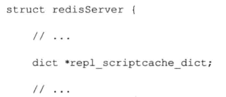
          - 该字典的键是一个个 lua 脚本的 SHA1 检验和，值全为 NULL
        - 每当 master 添加一个新的从服务器时，master 就会清空自己的 repl_scriptcache_dict 字典
```
