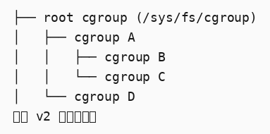
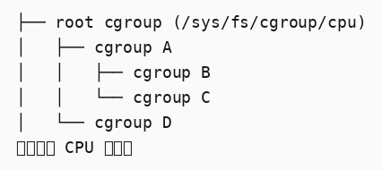
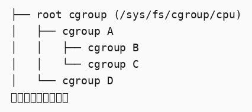
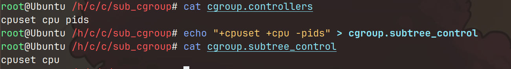

```markmap
---
markmap:
  initialExpandLevel: 2
  spacingVertical: 30
  spacingHorizontal: 180
---

# cgroupV2
- 简介
  - cgroup 将进程层次化地组织起来，并以可控的和可配置的方式沿着这个层次化的结构来分配系统的资源
  - cgroup 大致分为两部分
    - core
      - 负责层次化地组织进程
    - controllers
      - 负责沿着层次化结构分配某一种系统资源
      - 某一些 controllers 负责协助其它 controllers 来分配系统资源
  - cgroups 会形成一种树形的结构并且系统的每一个进程只能属于其中的一个 cgroup，进程的每一个线程也属于同一个 cgroup
    - 在进程创建时，子进程继承父进程的 cgroup
    - 进程可以迁移到另一个 cgroup，但是迁移并不会影响到已经存在的子进程
  - 在一个 cgroup 中的 controllers 可以启用和禁用
  - controllers 具有的作用范围具有层次化的特征
    - 一个 cgroup 可以影响其所有的子 cgroup，并且该 cgroup 的作用并不可以被子 cgroup 所覆盖
- 基本操作
  - 挂载
    - 层级
      - 层级本质上是 cgroups 组织成的树形结构，用于资源管理
      - 例如： Unified Hierarchy (cgroup v2) 
      - 这是 v1 的多重层级
        - Hierarchy 1 (CPU) 
        - Hierarchy 1 (CPU) 
    - cgroup v2 不像 v1，v2 只有一个层级
    - cgroup v2 的层级可以使用下面的命令来挂载： mount -t cgroup2 none $MOUNT_POINT
    - cgroup2 的文件系统有一个 magic number 0x63677270（“cgrp”）
    - 支持 v2 的 controllers 并且没有被绑定到 v1 的层级中的 controller 会被自动地绑定到 v2 的层级中，并且会出现在 root 中
    - 在 v2 层级中没有激活使用的 controllers 可以绑定到其他层级中
    - 只有在当前层级中没有被引用的 controller 才可以移动（迁移）到其他层级中。同样的，只有当 controller 被完全禁用的时候才能移出 v2 的单一层级（由于其他 controller 可能依赖此 controller，故而，其他 controller 也要被禁用）
    - 挂载选项
      - TODO
  - 组织进程和线程
    - 进程
      - 刚开始的时候，只有 root cgroup 存在，因此，此时，所有进程都属于 root cgroup
      - 一个子 cgroup 可以通过创建一个子目录来创建： mkdir $CGROUP_NAME
      - 每个 cgroup 都有一个接口文件 cgroup.procs
        - 当对这个文件进行读操作的时候，它一行一行地列出所有所有属于这个 cgroup 的进程的 PID（一个进程一行）
          - 一个进程的 PID 可能出现多次（如果这个进程移动到了另一个 cgroup，然后又移动回来）
        - 当对这个文件进行写 PID 时，表示这个进程迁移到了这个 cgroup
          - 不能使用标准 IO，要直接调用 write，每次只写入一个 PID，如果一次写入包含多个 PID，那么将会忽略其他 PID
          - 如果一个进程包含多个线程，那么，任何一个线程调用 write 写入 PID 都会导致所有的线程迁移
        - 僵死进程不会出现在此文件中，故而僵死进程不能迁移到另一个 cgroup 中
      - 当子 cgroup 中没有任何子 cgroup 和存活的进程的时候，该子 cgroup 可以被摧毁： rmdir $CGROUP_NAME
      - /proc/$PID/cgroup 文件可以列出进程所属的 cgroup
        - 如果系统中使用的是 v1 的层级，该文件中可能包含多行，每一行对应一个层级
          - 每一行的格式： hierarchy_id:subsystems:path
            - hierarchy_id 是层级的数字表示符
            - sub_systems 是该层级管理的 controller 列表（例如 cpu, memory）
            - path 是该层级中的 cgroup 路径
          - 例如： 2:cpu,cpuacct:/user.slice 3:memory:/user.slice/user-1000.slice/session-2.scope
        - v2 始终采用 0::$PATH 的格式
          - $PATH 指的是相对于 cgroup 的根 cgroup 的路径
        - 如果与一个僵死进程的 cgroup 将要被删除，则$PATH 后面会有“（deleted）”
          - 例如： 0::/test-cgroup/test-cgroup-nested (deleted)
    - 线程
      - v2 支持线程级别的粒度控制。对于某些控制器，能够满足在一组进程的线程之间进行分层资源分配的需求
      - 在默认情况下，一个进程的所有线程都属于同一个 cgroup
        - 这个 cgroup 也作为资源域，用于管理和计算那些不特定于某个进程或线程的资源消耗。这意味着，除了线程独有的资源消耗外，其他更广泛的资源消耗（如整个进程的内存使用量、CPU 使用量等）都会归属于这个共同的 cgroup
      - 线程模式
        - 在启用线程模式（thread mode）的情况下，线程可以被分散到当前进程的 cgroup 所属线程域的其它 cgroup 中
          - 即使线程分散在不同的 子 cgroup 中，但是它们仍然共享一个共同的资源域
          - 一个线程只有属于一个 cgroup，但是一个进程的多个线程可以属于多个子 cgroup
        - 支持线程模式的 controllers 被称为 thread controllers，而不叫 domain controllers
        - 将一个 cgroup 标记为线程模式会使其作为一个线程 cgroup 加入其父 cgroup 的资源域
          - 父 cgroup 可能是另一个线程 cgroup，其资源域位于更高层次的层级中
          - 线程子树的根节点，即最近的非线程模式祖先，被称为线程域（threaded domain）或线程根（thread root），它作为整个子树的资源域
            - 线程域不能包含未启用线程模式的 cgroup
            - 根 cgroup 可以同时充当 domain cgroup 和 thread cgroup 的父 cgroup
            - 没有与特定线程关联的所有资源的消耗都属于 threaded domain
        - 在线程模式下，只有 threaded controllers 才可以被启用，当前只有下面的 5 个 threaded controller
          - cpu
          - cpuset
          - perf_event
          - pids
        - 通常，在某些 cgroup 管理器中，控制器只能在不包含任何进程的 cgroup 中启用。但是在线程模式下，这种限制被放宽。在线程子树中，即使某个 cgroup 包含线程（但是该 cgroup 不能是叶子 cgroup），也可以在该 cgroup 上启用线程控制器
      - 当前的 cgroup 的模式存放在 cgroup.type 文件中
        - 在创建 cgroup 时，默认值是 "domain"
        - 要将其变成线程模式，其值是 "threaded"，但是有一定的条件：
          - 父 cgroup 必须是一个有效的 threaded domain 的或者是一个线程模式的 cgroup
          - 当一个父 cgroup 不是一个线程模式的 cgroup 时，其必须没有任何资源域控制器启用，也不能有任何子 cgroup
            - 根 cgroup 不受这一要求的限制
        - 一旦 cgroup 变成线程模式的，那么不能再换回 domain 模式
      - 当出现下列情况时：一个 domain group 会转换为 threaded domain
        - 它的一个子 cgroup 变成了线程模式或者在 cgroup.subtree_control 文件中有线程模式的控制器被启用了且该资源域中存在进程
        - 当上述条件都不存在时，这个 cgroup 会恢复为 domain cgroup
      - cgroup.threads 文件
        - 包含了在当前 cgroup 中所有线程的 ID
        - 通过向 cgroup 中写入线程 ID，可以对线程进行移动，但是，只能在同一个线程域中移动
      - 处于 threaded domain 下的 cgroup.procs 文件
        - 在当前的 threaded domain 中是不可读取的
        - 在当前 threaded domain 任何地方都可以写入此文件，用于将该进程的所有线程迁移到该 cgroup 中
  - [未]填充通知（[un] populated notification）
    - cgroup.events 文件
      - 每一个非 root cgroup 都含有这个文件
      - 其中的 “populated” 字段表示这个 cgroup 的子 cgroup 中是否存在存活的进程
        - 0 则没有，1 则有
        - 当这个字段的值改变的时候会触发 poll 和 [id]notify 事件
          - 这可以被用来：当所有子 cgroup 的进程都退出的时候，进行清理操作
          - populated 值的更改和通知是递归的
            - 例如，括号里的数字表示的 cgroup 中存活的进程： A(4) - B(0) - C(1) \\ D(0) 当 C 中的进程退出的时候，C 会触发事件，B 也会触发事件
  - 控制 controllers
    - 启用和禁用
      - 每一个 cgroup 都有一个 cgroup.controllers 文件，包含了所有可用的 controllers。注意，不是启用的
      - 默认情况下没有 controller 被启动
      - 可以写入 cgroup.subtree_control 文件来控制 controller 的启用和禁用
        - 例如： 
        - 只有存在于 cgroup.controllers 中的 controller 才可以被启用
        - 这个操作是原子的，要么都成功，要么都失败
        - 这个操作可以重复多次，以最后一次为准
      - 启用一个 controller 表示该 controller 将控制目标资源在其直接子 cgroup 之间的分配
        - 例如： A(cpu,memory) - B(memory) - C() \\ D() 表示 B 的 CPU cycles 受 A 的控制，C，D 的 memory 受 B 的控制，但是，C 和 D 将会自由竞争由 A 分配的 CPU cycles 资源
      - 启用或禁用一个 controller，会在子 cgroup 中生成或删除对应的资源的控制接口文件，此接口文件有多个，格式是： &lt;controller-name&gt;.&lt;suffix&gt;
        - 例如，上面这个例子中，在 B 中启用 cpu，会导致在 C 和 D 中创建 cpu.&lt;...&gt; 文件
        - 这说明了：除了以 cgroup. 开头的文件，其他文件都不属于 cgroup 本身
    - 自上而下约束
      - 一个 cgroup 可以分配的资源只能是父 cgroup 分配给它的资源
      - 如果一个子 cgroup 将其父 cgroup 分配给它的资源继续启用给了子 cgroup，则父 cgroup 不能禁用该资源
    - 没有内部进程约束
      - 只有当一个 cgroup 中没有任何进程时才能把资源分配给子 cgroup
      - 这个约束保证具有进程的 cgroup 一定是叶子 cgroup
      - 这排除了子 cgroup 与父 cgroup 的内部进程竞争的情况
      - 这一约束不适用于 root cgroup
        - root cgroup 具有进程和一些匿名资源的消耗，这些资源消耗可能包含系统级别的任务和服务，故而不能归于与任何一个 cgroup
        - 大多数控制器都被要求特殊对待这些进程和匿名资源
      - 如果一个已经填充了的（有进程的） cgroup 的 cgroup.subtree_control 中没有启用任何控制器，那么不会限制当前 cgroup 一定是叶子 cgroup，因为可能需要完成如下操作：
        - 1\. 创建一个子 cgroup
        - 2\. 将进程全部迁移到子 cgroup 中
        - 3\. 在 cgroup.subtree_control 中启用控制器
  - 委托（将 cgroup 的管理委托给其他东西）
    - 委托的模型
      - 一个 cgroup 可以通过两种方式进行委托
        - 赋予一个低权限的用写目录、 cgroup.procs、cgroup.threads 和 cgroup.subtree_control 的权限
          - 不包括资源的控制接口文件
        - 使用 mount 的 nsdelegate 选项，这样当 namespace 创建的时候，会自动委托给该命名空间
          - 如果以这种方式进行委托，则内核会拒绝命名空间内部对命名空间根目录中除 cgroup.procs 和 cgroup.subtree_control 之外的所有文件的写操作
    - 委托的约束
      - 一个被委托了的子层级是受约束的： 被委托者不能将进程移进或移出该子层级
      - 对于委托给一个低权限的用户的这种情况来说，这是通过下列的约束来实现的
        - 这个用户必须有迁移的目标 cgroup 的 cgroup.procs 文件的写权限
        - 这个用户必须有迁移的目标 cgroup 和源 cgroup 的公共祖先 cgroup 的 cgroup.procs 文件具有写权限
        - 例如： ~~~~~~~~~~~~~ - C0 - C00 ~ cgroup ~ \\ C01 ~ hierarchy ~ ~~~~~~~~~~~~~ - C1 - C10 上述 C0 和 C1 都被委托给了 U1，但是，U1 不能将 C10 中的进程迁移到 C00，因为 U1 没有两者公共祖先的写权限，即使 U1 拥有 C00 cgroup.procs 文件的写权限，并返回 EACCES
      - 对于委托给一个命名空间的情况来说，要求源 cgroup 和目标 cgroup 从尝试进行迁移的进程的命名空间来说，都是可达的
        - 如果不可达，返回 ENOENT
  - 指南
    - 对一个进程进行迁移的花费是昂贵的
    - 避免命名冲突
      - 不能创建一个同接口文件名称相同的子 cgroup，但是可以通过用 `_` 来代替 `.` 来避免命名冲突
- 资源分配模型
  - cgroup 控制器实现了多种资源分配方案，这些方案根据资源类型和预期的使用情况有所不同
  - Weights 模型
    - 父 cgroup 的资源分配是通过汇总所有活跃的子 cgroup 的权重，然后按照各自 cgroup 权重与总权重之间的比例来分配资源
    - 由于只有当前能够利用资源的子 cgroup 参与分配，这种方法具有节能特性
    - 由于其动态特性，这种模型通常用于无状态资源
      - 无状态资源是指：无需记忆状态，即使用无状态资源时，系统或应用不需要记忆之前的使用情况。每次分配或请求资源时，都是独立的，基于当前的需求和资源的可用性
    - weight 可以是 [1, 1000]，默认值是 100
    - 例如，cpu.weight 的接口控制文件按比例将 CPU 周期分配给活动的子进程
  - Limits 模型
    - 子 cgroup 最高只能消耗达到设定值数量的资源
    - 所有子 cgroup 的 limit 的值加起来可以超过资源的总量
    - limit 的值可能是 [0, max]，默认的 max 是“max”,这意味着没有限制（操作）（noop）
    - 例如， io.max 限制了最大 BPS 和/或 IOPS
  - Protections（保障） 模型
    - 所谓的保护是指获得的资源的最少量
    - 只要所有祖先的使用量都在其保护值以下，cgroup 就受到配置的资源量的保护
    - 这种保护可以是硬性保障，也可以是尽力而为的软边间
      - 如果一个控制器实现了绝对资源保证和/或限制，则接口文件应该命名为“min”和“max”
      - 如果一个控制器实现了尽力而为的资源保证和/或限制，则接口文件应该命名为“low”和“high”
    - 保护值也可能出现超出资源总值的情况，在这种情况下，子 cgroup 仅在父 cgroup 可用资源的范围内受到保护
    - 保护值可以是 [0, max]，默认是 0，即没有操作（noop）
    - 例如， memory.low 文件
  - Allocations 模型
    - 一个 cgroup 仅分配某种有限资源的一定数量，暂且称这个值为分配值
    - 子 cgroup 的分配值不可以超过父 cgroup 可用的值
    - 分配值可以是 [0, max]，默认值是 0，即没有资源
    - 如果一个资源是进程所必须的，那么进程的迁移可能会被拒绝
    - 例如，cpu.rt.max 硬性分配（表示分配是严格的，不可超过的）的实时时间片（分配给实时任务的 CPU 事件）
- 接口文件
  - 接口文件的格式
    - New-line separated values (when only one value can be written at once) VAL0\\n VAL1\\n ... Space separated values (when read-only or multiple values can be written at once) VAL0 VAL1 ...\\n Flat keyed (only the values for a single key can be written at a time.) KEY0 VAL0\\n KEY1 VAL1\\n ... Nested keyed (only the values for a single key can be written at a time.the sub key pairs may be specified in any order and not all pairs have to be specified) KEY0 SUB_KEY0=VAL00 SUB_KEY1=VAL01... KEY1 SUB_KEY0=VAL10 SUB_KEY1=VAL11... ...
  - 惯例
    - 一个单独的 feature 应该有一个单独的接口文件
    - 应该避免对 root cgroup 进行资源控制，故而其不应该含有资源控制接口文件
    - 默认的时间单位是微秒，如果使用其他单位，必须指定单位的后缀
    - 百分比的值应该使用至少两位小数来表示，如 13.40
    - 如果一个控制器实现了绝对资源保证和（或）限制，则接口文件应该命名为 “min”（保证） 和 “max”（限制）
    - 如果一个控制器实现了尽力而为的资源保证和（或）限制，则接口文件应该命名为 “low”（保证） 和 “high”（限制）
    - 如果接口文件中有一个可配置的默认值，这个默认的值要以 “default $VAVLUE” 的形式出现，并且是这个文件的第一行
      - 可以以 "default $NEW_VALUE" 或者 "$NEW_VAVLUE" 的形式进行更新
    - 对于不太频繁发生的事件，应创建一个名为 “events” 的接口文件，其中包含事件的键值对。每当发生一个需要通知的事件时，文件更新事件会在该文件上触发（即不是通知对应的事件，而是去通知文件更新事件）
  - 核心接口文件
    - cgroup.type
    - cgroup.procs
    - cgroup.threads
    - cgroup.controllers
    - cgroup.subtree_control
    - cgroup.events
      - 其中的 frozen 字段表示当前 cgroup 是否被冻结
    - cgroup.max.descendants
      - 允许的最多的子 cgroups 的数量
      - 可读可写，默认值是 “max”
    - cgroup.max.depth
      - 当前 cgroup 以下允许的最大深度
      - 如果当前实际的深度已经大于或等于该值，那么，尝试创建新的 cgroup 会失败
      - 可读可写，默认值是 “max”
    - cgroup.stat
      - 仅读的 flat-keyed 格式
      - 条目
        - nr_descendants
          - 总的可见的子 cgroup
        - nr_dying_descendants
          - 总的 dying 的子 cgroup 的数量
          - 一个 cgroup 被用户删除之后但是没有被销毁（会在系统加载时销毁）变为 dying 状态
          - dying cgroup 不会复活，也不能将进程迁移入dying cgroup
          - dying cgroup 可以消耗的资源不超过限定值
    - cgroup.freeze
      - 可读可写，存在于非 root cgroup 的 cgroup 中
      - 值只能是 0 或 1，默认值是 0
      - 当此值是 1 时，会冻结当前 cgroup 和其所有子 cgroup
        - 这意味着这些 cgroup 的所有进程会被停止直到解冻
        - 冻结这些 cgroup 会花费一点时间，完成时，会更新 cgroup.events 文件，并触发该文件的更新事件
      - 在冻结的 cgroup 中的进程可以被“致命”的信号杀死；也可以进行移出，如果目标 cgroup 不是冻结的，那么可以恢复运行；同时，也可以让别的 cgroup 中的进程迁移入冻结的 cgroup 中，但是会停止该进程的运行
      - 被冻结的 cgroup 不会影响任何对于树结构上修改的操作
    - cgroup.kill
      - 仅读，存在于非 root cgroup 的 cgroup 中
      - 值只能是 1
      - 写入 1 会将此 cgroup 和其子 cgroup 被杀死，这意味着其中的所有进程都会被 SIGKILL 杀死
      - 正被杀死的 cgroup 会适当地解决并发的 fork和防止迁移
      - 对于 threaed cgroup，写入这个文件会失败，并返回 EOPNOTSUPP
    - cgroup.pressure
      - 可读可写
      - 值可以是 0 或 1，默认值是 1
      - 此值会导致启用或禁用 cgroup PSI 计量功能
        - [PSI（Preessure Stall Information）是 Linux 内核引入的一项功能，用于监测系统资源的压力状况。它通过分析系统资源（如 CPU、内存和 IO）的可用性，提供关于资源压力的详细信息，帮助管理员了解系统在不同资源上的瓶颈和停滞情况](https://docs.kernel.org/accounting/psi.html#psi)
      - 此值只会导致特定的 cgroup 启用或开启 PSI 功能，而不会影响子 cgroup
    - irq.pressure
      - 可读可写的 nested-keyed 格式
      - 包含了 IRQ/SOFTIRQ 的 PSI 信息
- Controllers
  - CPU
    - 调节 CPU cycles（CPU 周期）的分配
    - 实现了 Weights 和绝对的 Limit 模型（normal 的调度策略）和绝对的 Allocations 模型（实时调度策略）
    - CPU 周期的分配不考虑任务的频率，只基于时间进行定义
    - [可选的利用率钳制支持允许向 schedutil CPU 频率调节器提供提示，指定 CPU 应始终提供的最低频率和不应超过的最高频率](https://docs.kernel.org/admin-guide/pm/cpufreq.html)
    - v2 尚未支持对实时进程的控制
      - 当内核启用了 CONFIG_RT_GROUP_SCHED 选项，cpu Controller 只有当所有的实时进程都在 root cgroup 时才会被启用
      - 如果内核没有 CONFIG_RT_GROUP_SCHED 选项，则上述限制不会生效
    - 接口文件（所有的时间的单位都是微秒）
      - cpu.stat
        - 只读的 flat-keyed 格式，无论控制器是否启用，都存在
        - 报告 3 项统计信息（没有启用控制器）
          - usage_usec
            - 该 cgroup 中所有进程的 CPU 时间，包括用户台和内核态
          - user_usec
            - 用户态 CPU 使用时间
          - system_usec
            - 内核态的 CPU 使用时间
        - 额外报告 5 项统计信息（启用控制器）
          - nr_periods
            - 进程被允许使用的 CPU 周期数
          - nr_throttled
            - 记录了cgroup内进程由于超出CPU使用配额而受到限制的周期次数
          - throttled_usec
            - 由于 CPU 限制而额外等待的时间
          - nr_bursts
            - 表示 CPU 超过配额的次数
          - burst_usec
            - 超过 CPU 配额的总使用时间
      - cpu.weight
        - 可读可写，存在与不是 root cgroup 的 cgroup 中
        - 在 cpu.idle = 0 的 cgroup，合法值的范围是 [1, 10000]，如果 cpu.idle = 1，值会被显示为 0
      - cpu.weight.nice
        - 可读可写，用于将 weight 值转换为 nice 值
        - 值的范围是 [-20, 19]，默认是 0
        - cpu.weight 是这个文件的替代，因为这个值变化范围比较小且粒度比较粗，故而读出的数值是当前 weight 值的最接近的近似值
      - cpu.max
        - 可读可写
        - 最大带宽限制，格式如下： $MAX $PERIOD 表示在每个 $PERIOD 时间段（单位是微秒）内，cgroup 允许使用的最大 CPU 时间。 默认值是： max 100000，100000 微秒即 1 秒
          - 如果只写入一个值， $MAX 会被更新
      - cpu.max.burst
        - 可读可写
        - 在 cpu.max 设定的最大带宽限制之上，允许的额外 CPU 使用时间，其取值范围是 [0, $MAX], $MAX 是 cpu.max 指定的值
      - cpu.pressure
        - 可读可写的 nested-keyed 格式
        - [包含了 CPU 的 PSI 信息](https://docs.kernel.org/accounting/psi.html#psi)
      - cpu.uclamp.min（Utilization Clamp）
        - 可读可写
        - 默认值是 0
        - 包含了最小的 CPU 利用率（保障）：例如 12.34 表示的是 12.34%，要求该百分数中至少有两位小数
      - cpu.uclamp.max
        - 可读可写
        - 默认值是 max，数字格式与 cpu.uclamp.min 的相同
      - cpu.idle
        - 可读可写
        - 置为 1 会降低该 cgroup 的优先级， cgroup 内的线程将保留它们自身的相对优先级，但该 cgroup 本身将被视为相对于其对等体的非常低优先级
  - Memory
  - TODO
- Namespace
  - TODO
```
