```markmap
---
markmap:
  initialExpandLevel: 2
  spacingVertical: 30
  spacingHorizontal: 180
---

# 信号
- 概述
  - 信号大全 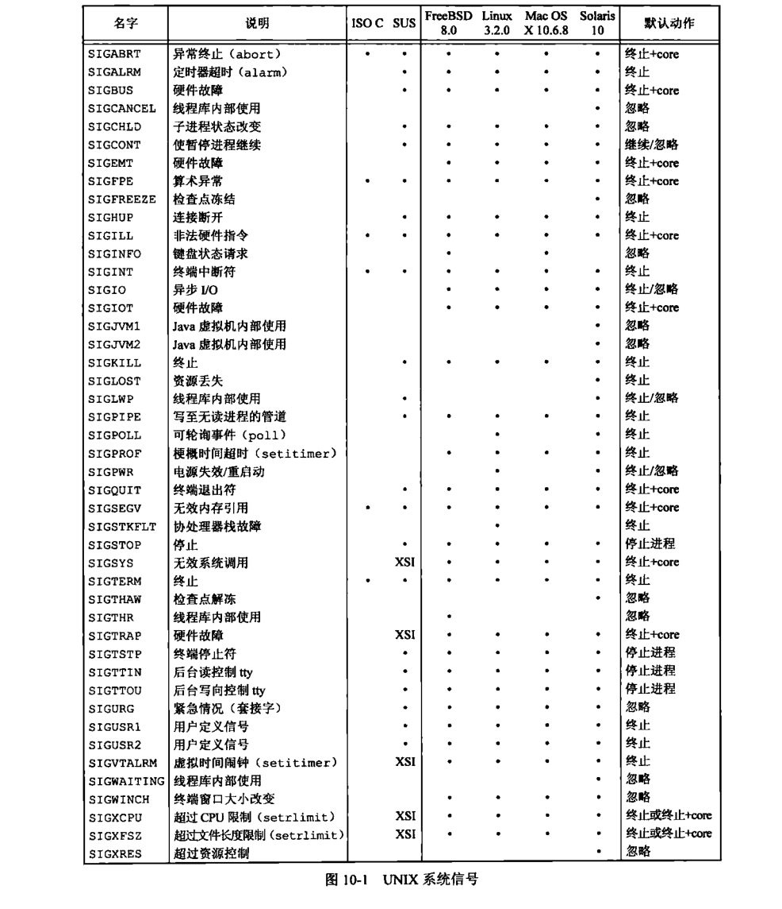
  - 信号是软件中断
  - 信号提供了一种处理异步事件的方法
    - 例如，终端用户键入中断键，会通过信号机制停止一个程序，或及早终止管道中的下一个程序。
  - 信号都有一个名字，有3个字符 SIG 开头。在头文件 &lt;signal.h&gt; 中，信号名都被定义为正整数常量（信号编号）
  - 不存在编号为 0 的信号，kill 函数对信号编号 0 有特殊的应用
  - 进程不能简单地通过测试某个变量来判断是否发生了信号，而是必须告诉内核：在此信号发生时，请执行xx操作
  - 在某个信号出现是，可以告诉内核按 3 中方式之一对其进行处理，称为信号处理或信号动作
    - 忽略此信号
      - 绝大多数信号都可以按照这种方式进行处理，但是除了 SIGKILL 和 SIGSTOP。因为这两种信号想内核和超级用户提供了终止进程的可靠方法
      - 如果忽略某些由硬件异常产生的信号（如非法内存引用或除以0），则进程的运行行为是未定义的。
    - 捕捉信号
      - 为了做到这一点，要通知内核在某种信号发生时，调用一个用户函数。在用户函数中，可执行用户希望对这种事件进行的处理。
      - 不能捕捉 SIGKILL 和 SIGSTOP 信号
    - 执行系统默认动作
      - “点” 表示系统是否支持此信号，终止 + core 表示在进程当前工作目录的 core 文件中复制了该进程的内存映像。大多数调试程序都使用 core 文件以检查进程终止时的状态。 
      - core 文件
        - 阻止产生 core 文件的6中情况
          - 进程是设置用户 ID 的，而且当前用户并非程序文件的所有者。 设置用户 ID的：某些程序可能被设计为以特定的用户身份运行，即使它们被另一个用户启动。这可以通过设置程序的 setuid 位来实现。setuid位是一个特殊的权限位，它允许程序以文件所有者的权限运行，而不仅仅是启动它的用户的权限。 chomod 命令可以用来设置 setuid 位： chmod u+s &lt;filename&gt;
          - 进程是设置组 ID 的，而且当前用户并非该程序文件的组所有者
          - 用户没有写当前工作目录的权限
          - 该文件已存在，而且用户对该文件没有写权限
          - 该文件太大（超过了 RLIMIT_CORE 限制）
      - 上图的信号解释
        - 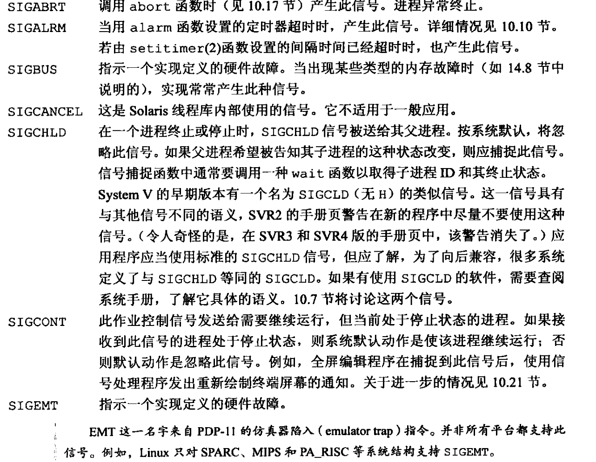
        - 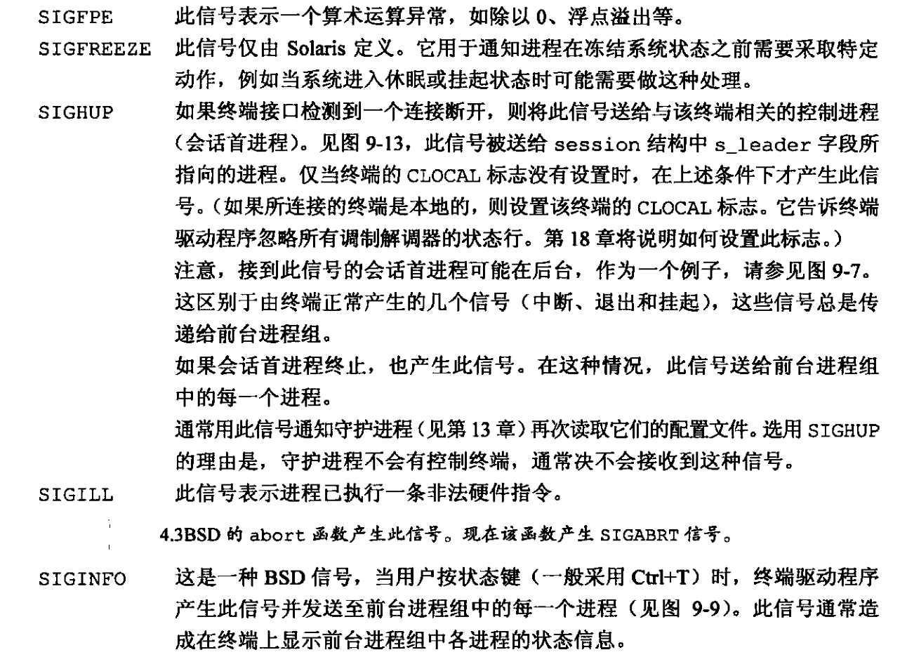
        - 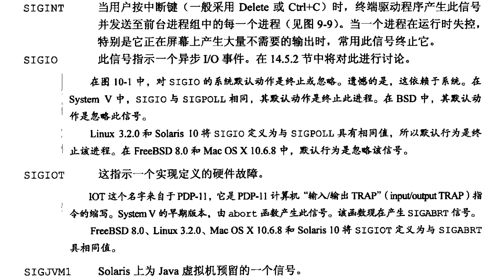
        - 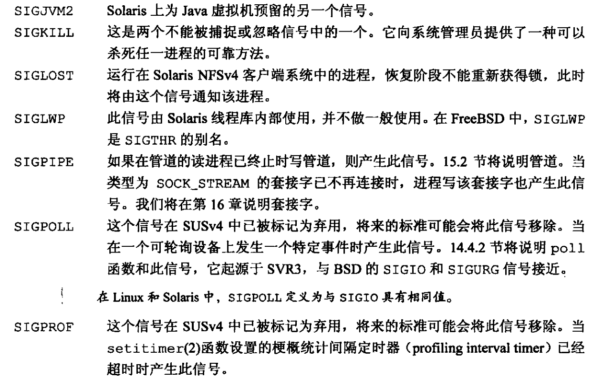
        - 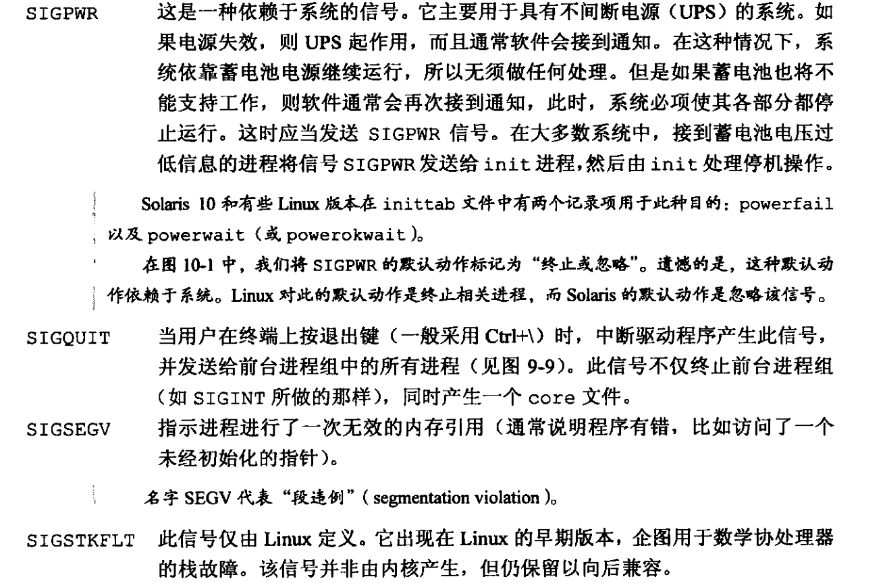
        - 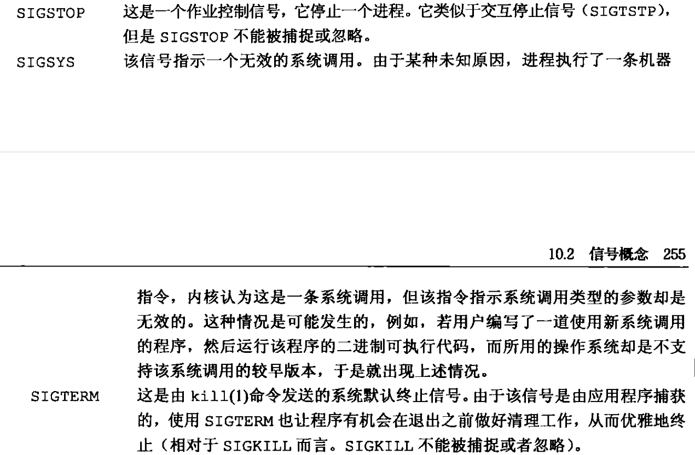
        - 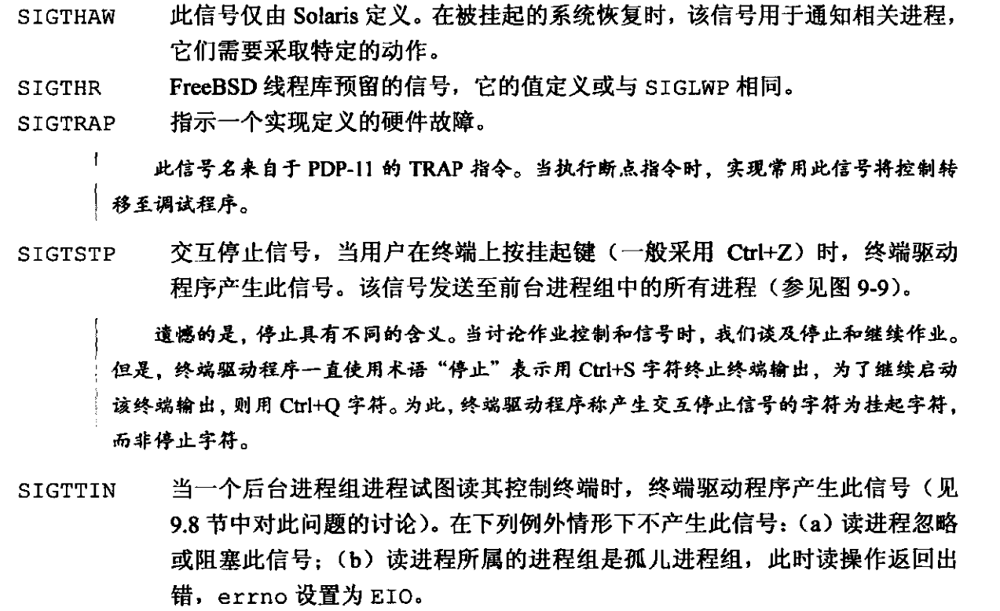
        - 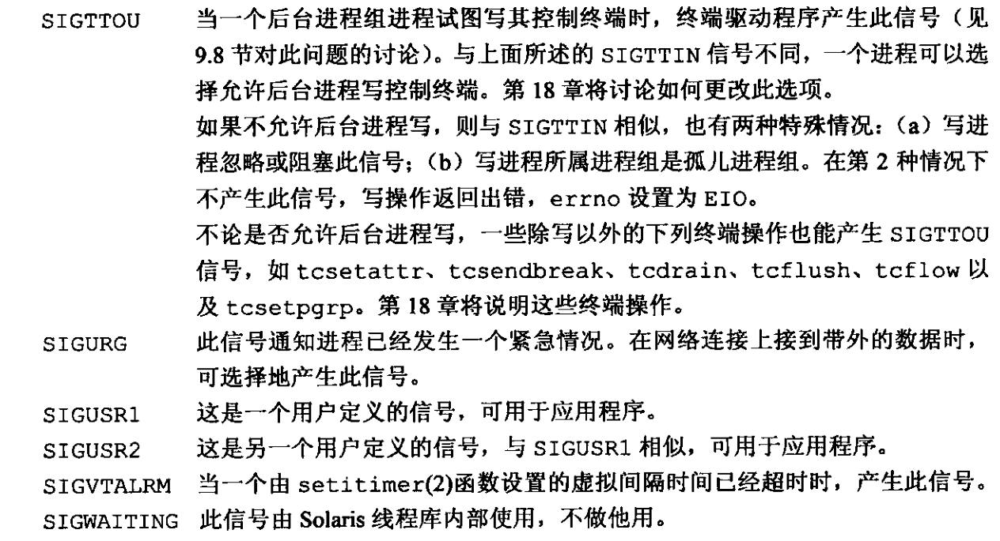
        - 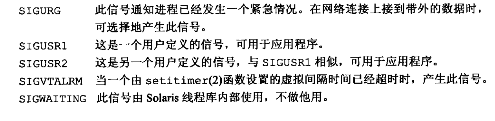
        - 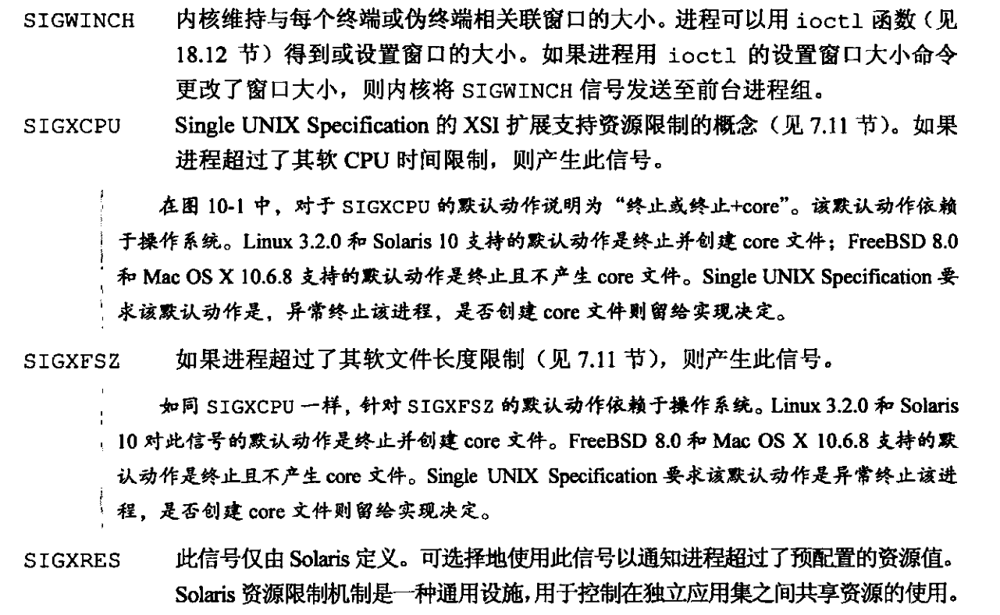
  - 不同方式启动的进程的的不同处理方式
    - 该进程是正常启动的：所有信号的状态都是系统默认或忽略
    - 通过 exec 系统调用启动的进程：将原本进程设置为要捕捉的信号设置为默认行为
    - 通过 fork 创建的进程：子进程继承父进程的信号处理方式
- 函数 signal
  - 函数原型 
  - signum 是信号编号
  - func 的值
    - SIG_IGN
      - 忽略此信号
    - SIG_DFL
      - 系统默认动作
    - 接收到此函数调用的函数地址
      - 此函数被称为信号处理程序（signal handler）或信号捕捉函数（signal-catching function）
  - signal 由于历史原因，被认为是不可靠的
    - 不可靠是指：信号可能会丢失，同时，进程对信号的控制能力也很差
- 中断的系统调用
  - 如果继承在执行一个低速系统调用而阻塞期间捕捉到一个信号，则该系统调用就被中断不在继续执行。该系统调用返回出错，并将 errno设置为 EINTR
  - 低速系统调用
    - 低速系统调用是可能会使进程永远阻塞的一类系统调用
    - 包括
      - 如果某些类型文件（如读管道、终端设备和网络设备）的数据不存在，则读操作可能会使调用者永远阻塞
      - 如果这些数据不能被相同的类型文件立即接受，则写操作可能会使调用者永远阻塞，例如写管道
      - 在某种条件发生之前打开某些类型文件，可能会发生阻塞（例如要打开一个终端设备，需要先等待与之连接的调制解调器应答）
      - pause 函数（按照定义，它使调用进程休眠直至捕捉到一个信号）和 wait函数
      - 某些 ioctl 操作
      - 某些进程间通信函数
  - 自动重启的系统调用
    - 所谓的重启是类似于这样的行为：重新执行被中断的系统调用
    - 自动重启的系统调用
      - ioctl
      - read
      - readv
      - write
      - writev
      - wait
      - waitpid
    - 不同标准之间的差异 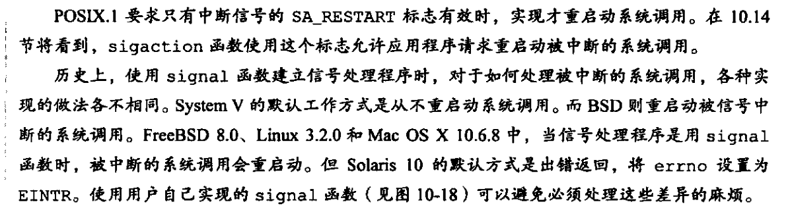
    - 不同系统的不同行为： 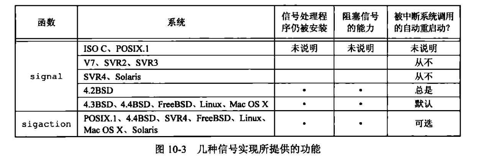
- 可重入函数
  - 当进程捕捉到信号时，进程正在执行的正常指令序列就被信号处理程序临时中断，首先去执行信号处理程序中的指令。
  - 如果从信号处理程序中返回（处理程序没有调用 exit 函数等函数），则继续执行正常指令
  - 上述过程中，有一个问题：如果进程只在执行 malloc，而此时刚好捕捉到一个信号，然后，从信号处理程序中又调用 malloc，就有可能会对进程造成破坏：因为malloc通常为它所分配的存储区维护一个链表，而执行信号处理程序时，进程可能正在更改此链表
  - 上述的例子说明 malloc 不是一个可重入函数
  - 可重入函数（异步信号安全的 async-signal safe）
    - Single UNiX Specification 中说明的信号处理程序中保证调用安全的函数 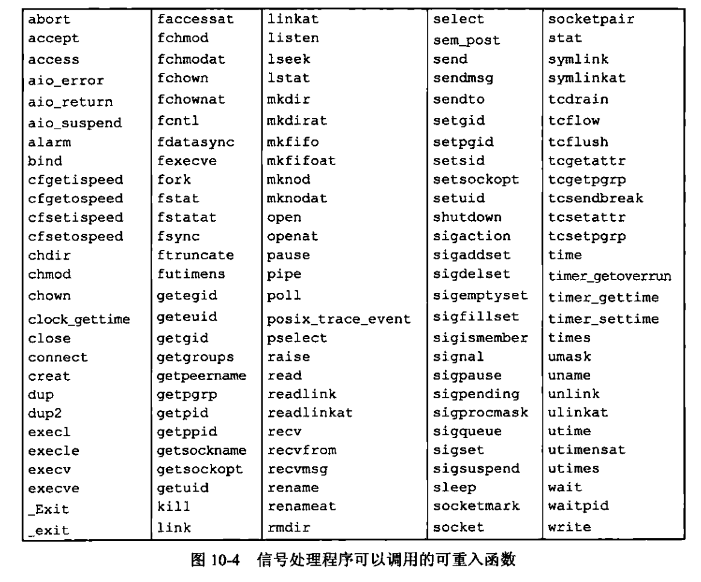
  - 类似的原因，我们应该在信号处理程序中保存 errno 全局变量，在信号处理程序最后恢复其值
- SIGCLD vs SIGCHILD
  - SIGCLD 是 System V 的一个信号名
    - 如果主进程明确地将该信号设置为 SIG_IGN，则主进程的子进程将不产生僵死进程。（虽然此信号的默认配置也是忽略，但是，不会有上述语义）。 如果主进程随后调用一个 wait 函数，那么它将阻塞直到所有子进程都终止，然后该 wait 会返回 -1，并将 errno 设置为 ECHILD
      - 僵死进程
        - 僵死进程：已经完成执行但尚未被其父进程回收其进程描述符的进程。
        - 在Unix和类Unix系统中，当一个子进程完成其任务并退出时，它的进程描述符、打开的文件描述符和其它一些信息仍然保留在系统中，直到父进程调用wait()或waitpid()系统调用来读取子进程的信息。如果父进程没有调用这些系统调用，子进程就会变成僵死状态，占用系统资源但不执行任何操作。
        - 僵死进程不会消耗CPU资源，但它们会占用进程表中的一个条目，如果系统中有大量的僵死进程，可能会影响系统性能。通常，系统的init进程会定期清理这些僵死进程，回收它们的资源。如果init进程本身出现问题，可能会导致僵死进程无法被回收，这时可能需要手动干预或重启系统来解决。
      - 相当于是子进程正常情况下完成执行之后就会变成僵死进程，需要主进程调用 wait 或者 waitpid 函数来回收子进程的进程描述符，但是，现在子进程不会进入僵死状态了，所以，会导致主进程 调用 wait 会出错。
    - 如果将 SIGCLD 的配置设置为捕捉，则内核立刻检查是否有子进程准备好被等待，如果是这样，则调用 SIGCLD 处理程序。
  - SIGCHILD 是 BSD 的信号名
    - 子进程状态改变后产生此信号，父进程需要调用一个 wait 函数来检测发生了什么
  - POSIX 采用了 BSD 的SIGCHLD信号语义
- 可靠信号术语及其语义
  - 当信号的事件发生时，内核在进程表中以某种方式设置一个标志。当对信号采取这种上述行为时，我们就说向进程递送了一个信号。
  - 在信号产生（generation）和递送（delivery）之间的时间间隔内，称信号是未决的（pending）
  - 阻塞信号递送
    - 每个进程都有一个信号屏蔽字（signal mask），它规定了当前要阻塞递送到该进程的信号集。对于每种可能得信号，该屏蔽字都有一位与之对应。对于某种信号，若其对应位都已设置，则它当前是被阻塞的。
    - 进程可以调用 sigprocmask来检测和更改当前信号屏蔽字
    - 如果为进程产生了一个阻塞的信号，而且对该信号的动作是系统默认动作或捕捉该信号，则为该进程将此信号保持为未决状态，直到该进程对此信号解除了阻塞，或者将对此信号的动作更改为忽略。
    - 调用 sigpending 函数可以判定哪些信号时设置为阻塞并处于未决状态的
    - 内核在递送一个原来被阻塞的信号给进程时（而不是在产生该信号时）才决定对它的处理方式。
  - POSIX.1 定义了一个新的数据类型 sigset_t，可以容纳一个信号集，避免了一个整形的二进制位数小于信号的数量
- kill and raise 函数
  - kill
    - 将信号发送给进程或者进程组
    - pid 参数的 4 中不同情况
      - pid &gt; 0
        - 将该信号发送给进程 ID 为 pid 的进程
      - pid == 0
        - 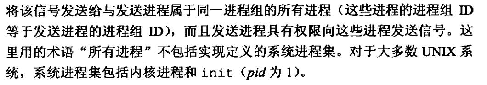
      - pid &lt; 0
        - 
      - pid == -1
        - 
      - 上述权限认证的基本规则
        - 对于非超级用户，基本规则是发送者实际用户 ID 或有效用户 ID必须等于接受者的实际用户 ID或有效用户 ID
        - 如果实现支持_POSIX_SAVED_IDS（如POSIX.1现在要求的那样），则检查接收者的保存设置用户ID（而不是有效用户ID）。
        - 对权限进行测试时也有一个特例：如果被发送的 信号是SIGCONT，则进程可将它发送给属于同一会话的任一其他进程。
    - signo 为 0
      - POSIX.1 将信号编号为 0 的信号定义为一个空信号
      - 如果 signo == 0，则kill执行正常的错误检查，但是不发送信号。
      - 这常用来确定一个特定的进程是否存在。如果向一个不存在的进程发送空信号，则 kill 返回 -1, errno = ESRCH
    - 如果调用kill来为调用者产生信号，如果该该信号不是阻塞的，则在kill调用返回之前该信号就会被递送到该进程中去了
  - raise
    - 允许进程向自身发送信号
  - 函数原型（2个） 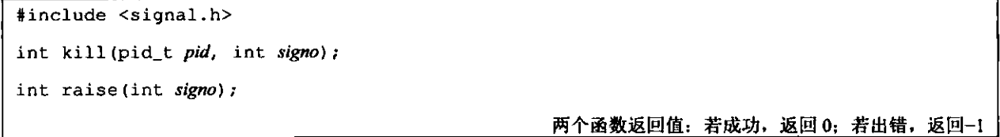
- alarm and pause 函数
  - alarm 
    - 可以设置一个定时器（闹钟时间），在将来的某个时刻该定时器会超时，产生一个 SIGALRM 信号。
    - 每个进程只能有一个闹钟时间。
      - 如果在调用alarm时，之前已为该进程注册的闹钟时间还没有超时，则该闹钟时间的余留值作为本次alarm 函数调用的值返回。以前注册的闹钟时间则被新值代替。
      - 如果有以前注册的尚未超过的闹钟时间，而且本次调用的 seconds 值是0，则取消以前的闹钟时间，其余留值仍作为alarm 函数的返回值。
  - pause 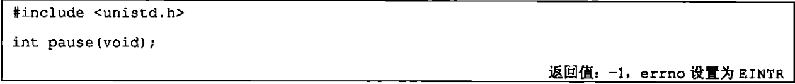
    - 使调用进程挂起直至捕捉到一个信号
    - 只有执行了一个信号处理程序并从其返回时，pause 才返回。在这种情况下，pause返回-1， errno 设置为 EINTR。
- 信号集
  - 处理信号集的函数
    - 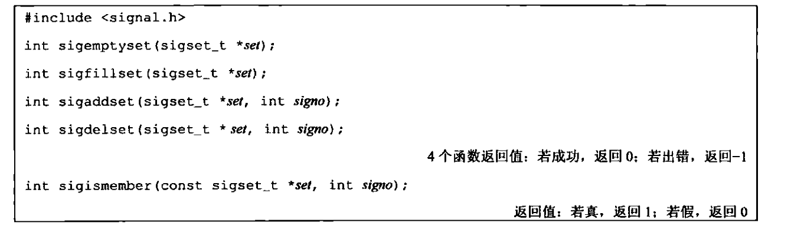
    - sigemptyset
      - 初始化有由set 指向的信号集，清除其中的所有信号
    - sigfillset
      - 初始化由set指向的信号集，使其包括所有的信号
    - sigaddset 和 sigdelset
      - 从信号集中添加或删除信号
  - 对于所有以信号集为参数的函数，总是以信号集地址进行参数传递
- sigprocmask 函数
  - 函数原型 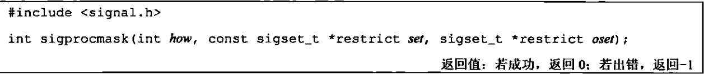
  - oset
    - 如果 oset 是非空指针，那么进程的当前信号屏蔽字通过 oset 返回
  - set
    - 如果 set 是一个非空指针，则参数 how 指示如何修改当前信号屏蔽字
  - how
    - how的可能取值 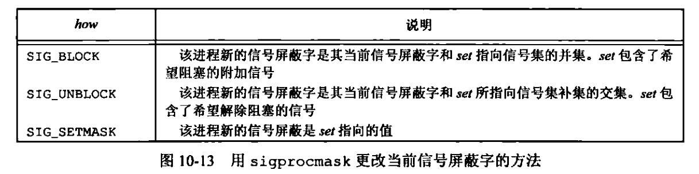
  - 注意事项
    - 在调用 sigprocmask后如果有任何未决的、不再阻塞的信号，则在 sigprocmask返回前，至少将其中之一递送给该进程。
    - 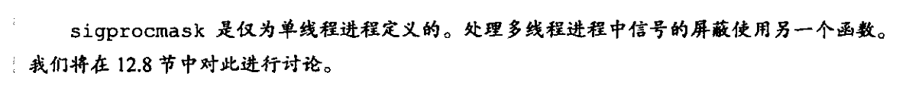
- sigpending 函数
  - 函数原型 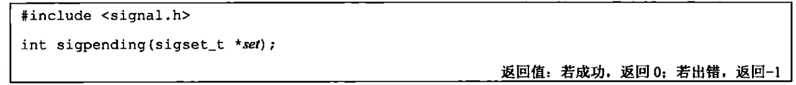
  - sigpending 函数返回一信号集，对于调用进程而言，其中的各信号是阻塞不能递送的，因而也一定是当前未决的。该信号集通过set参数返回。
- sigaction 函数
  - 函数原型 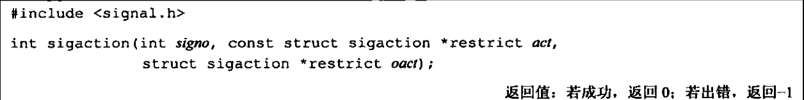
  - sigaction函数的功能是检查或修改（或检查并修改）与指定信号相关联的处理动作。此函数取代了UNIX早期版本使用的signal函数
  - 参数signo 是要检测或修改其具体动作的信号编号。
  - 若act指针非空，则代表要修改 signo 的动作。
  - 如果oact指针非空，则系统经由oact指针返回signo信号的上一个动作。
  - sigacton 结构体
    - 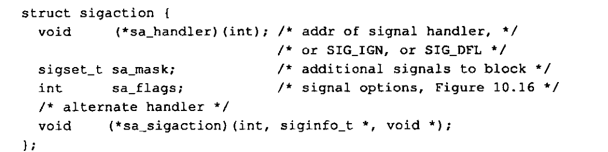
    - 当更改信号动作时： 如果sa_handler字段包含一个信号捕捉函数的地址（不是SIG_IGN或者SIG_DFL），则sa_mask 字段代表要将这一个信号集，在调用该信号捕捉函数之前，追加到进程的信号屏蔽字中去。仅当从信号捕捉函数返回时再将进程的信号屏蔽字恢复为原先的值。
      - 这样，在调用信号处理程序时就能阻塞某些信号。在信号处理程序被调用时，操作系统建立的新的信号屏蔽字包含了该处理程序对应的信号（这是自动完成的，可以通过设置 SA_NODEFER 来取消这种机制）。因此保证了在处理一个给定的信号时，如果这种信号再次发生，那么它会被阻塞到对前一个信号的处理结束为止
    - sa_flags 指定了对信号进行处理的各个选项
      - 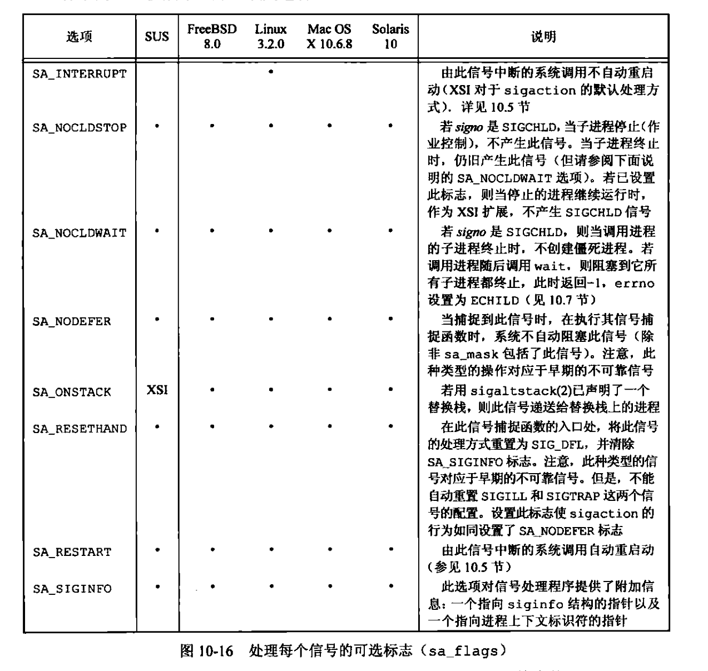
    - sa_sigaction 是一个替代的信号处理程序
      - 在sigaction 结构体中使用了 SA_INFO标志时，调用该信号处理程序
      - 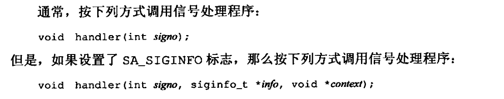
        - siginfo结构包含了信号产生原因的有关信息
        - siginfo结构体定义 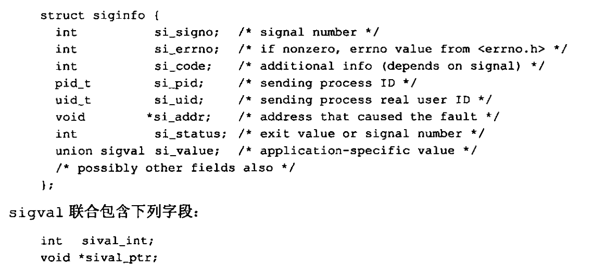
          - 各种信号的 si_code 值 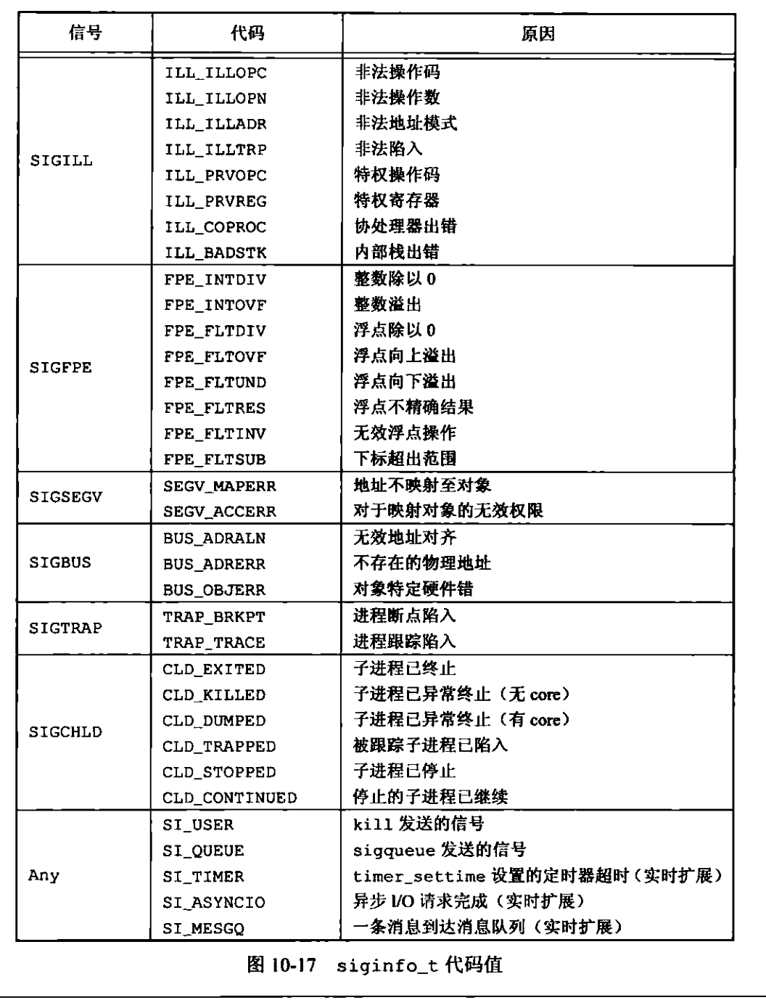
        - context 无类型指针可以被强制转换为 ucontext_t 类型结构，该结构表示信号传递是的上下文
          - 至少包含以上字段 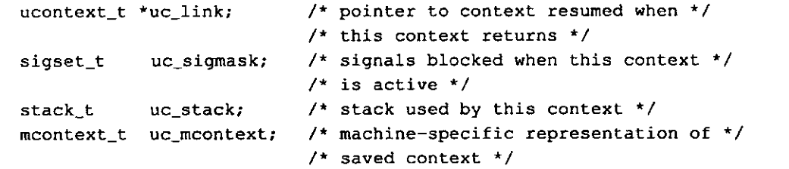
            - uc_stack 字段描述了当前上下文切换使用的栈，至少包含以上成员 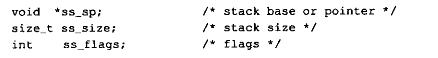
      - 当实现支持实时信号扩展时，用SA_SIGINFO标志建立的信号处理程序将造成信号可靠地排队。一些保留信号可由实时应用使用。如果信号由sigqueue 函数产生，那么siginfo结构能包含应用特有的数据
  - sigaction 实现 signal 函数
    - 实现 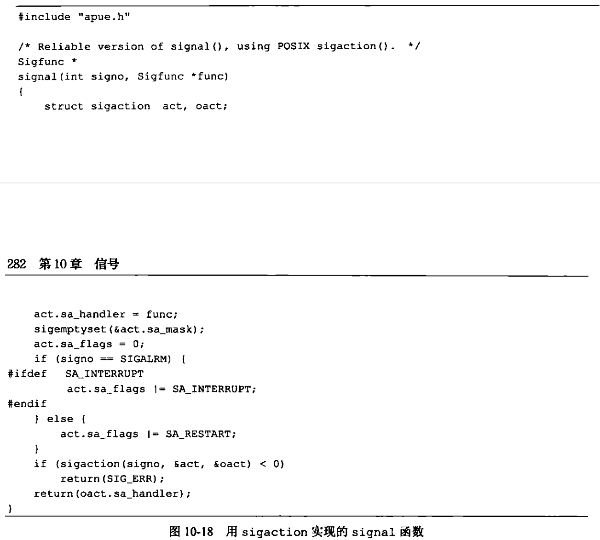
    - 不希望重启动 SIGALRM 信号中断的系统调用的原因是希望可以使用该信号来对 I/O操作设置时间限制。需要注意的是，glic中没有此行为
    - SA_INTERRUPT 此标志使系统调用被中断后不再重新启动
    - 如果信号处理程序时用 sigaction 设置的，则默认不会重新启动系统调用
- sigsetjmp and siglongjmp 函数
  - 调用longjmp 有一个问题。当捕捉到一个信号时，进入信号捕捉函数，此时当前信号被自动地加到进程的信号屏蔽字中。这阻止了后来产生的这种信号中断该信号处理程序。如果用longjmp 跳出信号处理程序，那么，对此进程的信号屏蔽字会发生什么呢？ 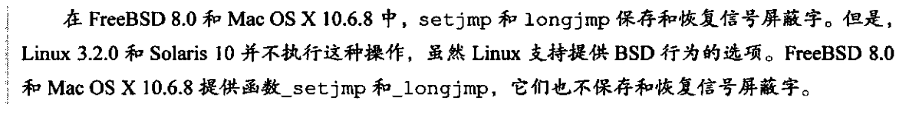
  - 为了允许两种形式并存，POSIX.1 并没有指定 setjmp 和1ongjmp 对信号屏蔽字的作用，而是定义了两个新函数 sigsetjmp 和 siglongjmp。 在信号处理程序中进行非局部转移时应当使用这两个函数。
  - 函数原型 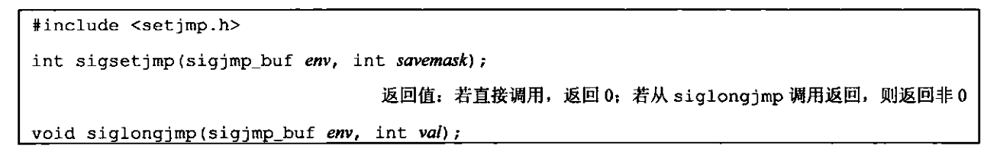
    - 如果 savemask 非零，则 sigsetjmp在env中保存进程的当前信号屏蔽字。
    - 如果非零的 savemask 的sigsetjmp 调用已经保存了env，则siglongjmp从其中恢复保存的信号屏蔽字
      - 调用siglongjmp函数时，就会第二次调用sigsetjmp，而此时，sigsetjmp 就会恢复它原本保存的信号屏蔽字
  - 示例： 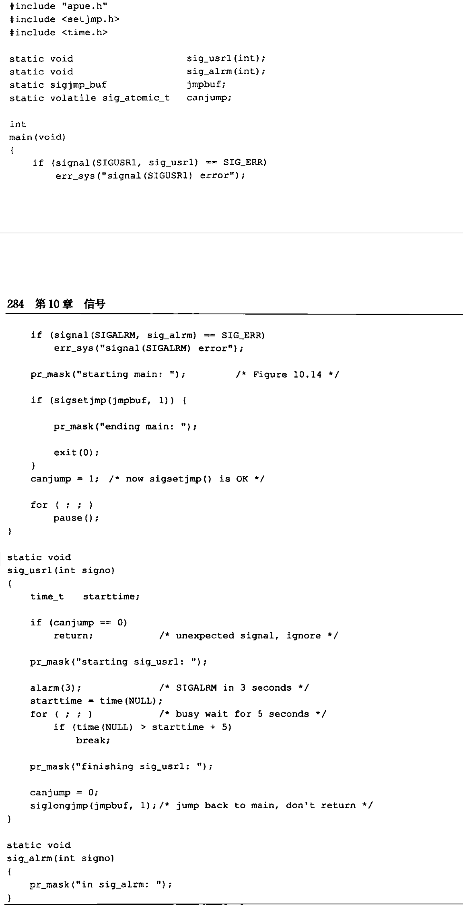
    - 注意到，其中有一个volatile sig_atomic_t 的 canjmp 全局变量
      - 只要在信号处理程序中调用 siglongjmp就应该使用这种技术：信号处理程序中检测此变量，仅当它为非0值时才调用siglongjmp。
      - 这提供了一种保护机制，使得在jmpbuf（跳转缓冲）尚未由 sigsetjmp 初始化时，防止调用信号处理程序。（在本程序中，siglongjmp 之后程序 很快就结束，但是在较大的程序中，siglongjmp 之后的较长一段时间内，信号处理程序可能仍旧被设置然后被内核调用，这时就需要很好的安全保障）。
        - 如果sigsetjmp尚未初始化jmpbuf，那么就不能保存信号屏蔽字，就会产生问题
      - 在写 sig_atomic_t 这种类型的变量时不会被中断：这意味着在具有虚拟存储器的系统上，这种变量不会跨越页边界，可以用一条机器指令对其进行访问
        - 这种类型的变量总是包括ISO类型修饰 volatile，其原因是：该变量将由两个不同的控制线程--main函数和异步执行的信号处理程序访问
    - 程序执行流程： 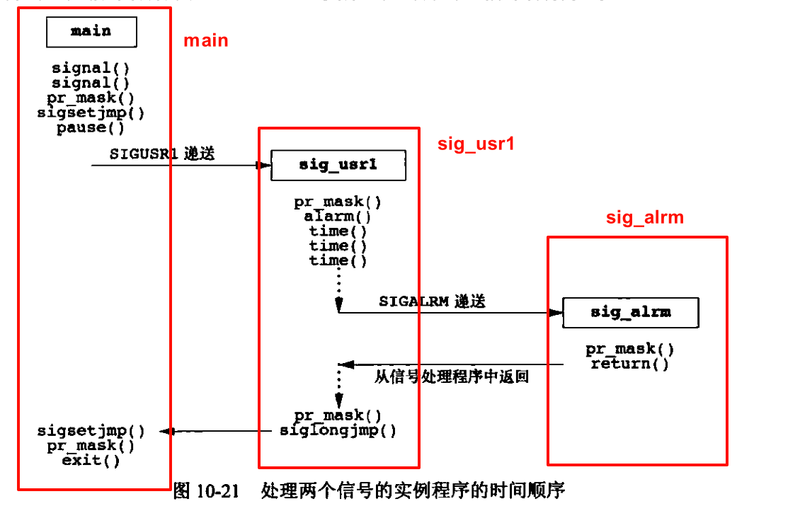
- sigsuspend 函数
  - 背景
    - 如果我们想要有一个临界区不接受 SIGINT 信号，我们可能会这么做 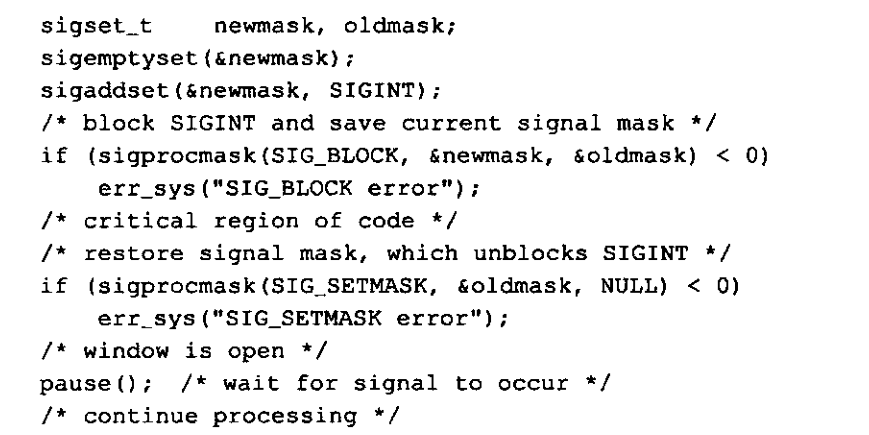
    - 但是，如果信号刚好发生在 SIGINT 已经解除阻塞了但是还没有执行 pause 的时刻，那么，这个时候这个信号就会丢失，可能造成进程永久阻塞
  - 为了解决这个问题，需要在一个原子操作中恢复信号屏蔽字，然后使进程休眠：这就是suspend 函数提供的功能
  - 函数原型 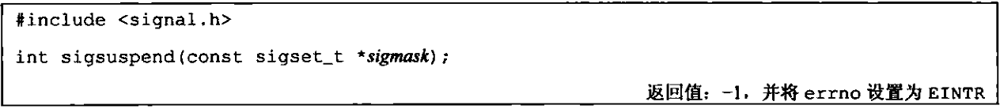
    - 进程的信号屏蔽字设置为 sigmask 指向的值
      - 设置sigmask相当于是设置哪些信号可以唤醒sigsuspend
    - 在捕捉到一个信号或发生了一个会终止该进程的信号之前，该进程会被挂起
    - 如果捕捉到一个信号而且从该信号处理处理程序返回，则 sigsuspend 返回并总是返回 -1，并将该进程的信号屏蔽字设置为调用 suspend 之前的值
  - 实现信号临界区 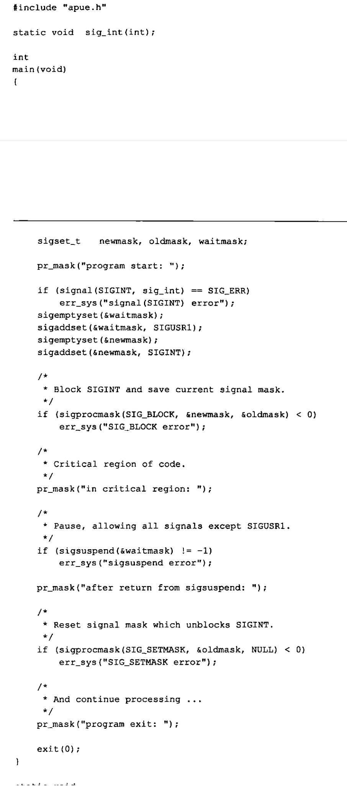
    - 输出如下 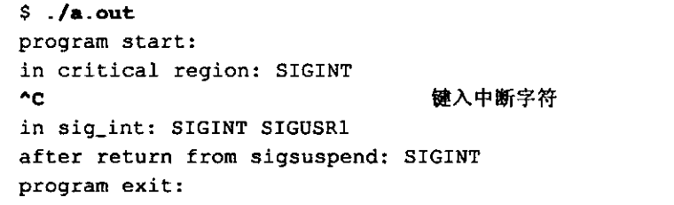
      - 在临界区内，sigsuspend 捕捉到 SIGITN 信号，并且信号处理程序成功返回，所以，将进程唤醒
      - 注：pr_mask 函数打印信号屏蔽字的值
- abort 函数
  - 函数原型 
  - abort 函数使程序异常终止
  - abort 函数将 SIGABRT 信号发送给调用进程
  - 让进程捕捉 SIGABRT 的意图是：让进程终止之前由其执行所需的清理操作。如果进程不在信号处理程序中终止自己，POSIX.1 声明当信号处理程序返回时，abort 终止该进程
- system 函数
  - 函数实现 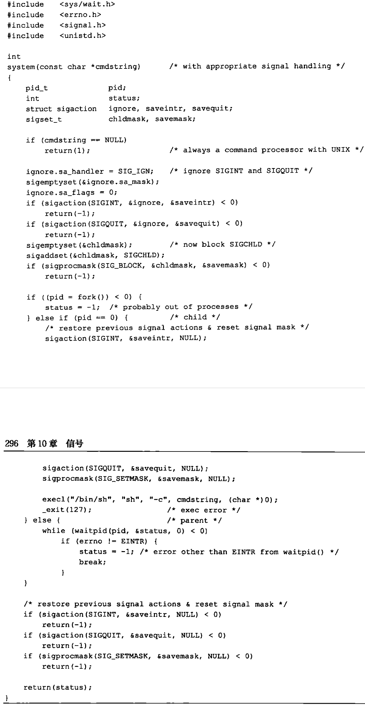
    - 为什么要在父进程中忽略SIGINT和SIGQUIT信号？
      - 因为如果不这样做，父子进程会都会收到SIGINT和SIGQUIT信号（因为这两者都属于同一个前台进程组，而按住CTRL + c 产生的 SIGINT 信号会发送给前台进程组中的所有进程），而system函数调用本身就放弃了控制权，等待子进程结束
    - 为什么父进程中要阻塞 SIGCHLD信号？
      - POSIX.1说明，在SIGCHLD未决期间，如若wait或waitpid返回了子进程的状态，那么SIGCHLD 信号不应递送给该父进程，除非另一个子进程的状态也可用
- sleep & nanosleep & clock_nanosleep 函数
  - sleep 
    - 此函数使调用进程被挂起直到满足下面两个条件之一
      - 经过了seconds 所指定的墙上时钟时间
      - 用进程捕捉到一个信号并从信号处理程序返回
  - nonosleep 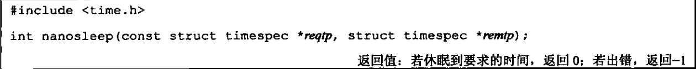
    - 与 sleep 相似，但是提供了纳秒级的精度
    - 这个函数挂起调用进程，直到要求的时间已经超时画着某个信号中断了该函数
    - reqtp 参数用秒和纳秒来指定需要休眠的时间长度
    - 如果某个信号中断了休眠，进程并不会终止，而是设置 remtp 参数指向的 timespec 结构为未休眠完的时间长度
      - 如果对位休眠完的事件并不感兴趣，可以设置为 NULL
  - clock_nanosleep 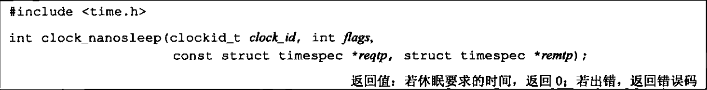
    - 系统可以有多个时钟，所以，可以针对特定的时钟来挂起调用线程
    - flags 参数用于控制延迟是相对的还是绝对的
      - flags = 0 表示休眠时间是相对的。例如希望休眠的时间长度
      - flags = TIMER_ABSTIME 表示休眠时间是绝对的。例如希望休眠到时钟到达某个特定的时间，这个特定的时间有 reqtp 参数指定
- sigqueue 函数
  - 函数原型 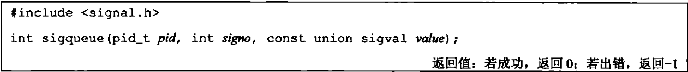
  - 如何使用 sigqueue 函数？
    - 1\. 使用 sigaction 函数安装信号处理程序时指定 SA_SIGINFO 标志。如果没有给出这个标志，信号会延迟，但信号是否进入队列要取决于具体的实现
    - 2\. 在 sigaction 结构的 sa_sigaction 成员（而不是 sa_handler 字段）提供信号处理程序
    - 3\. 使用 sigqueue 函数发送信号
  - sigqueue 只能把信号发送给单个进程，可以使用 value 参数向信号处理程序传递整数或者指针值。除此之外，其余与 kill 函数相似
- 注意
  - 在作业控制信号间有某些交互。当对一个进程产生4种停止信号（SIGTSTP、SIGSTOP、SIGTTIN或SIGTTOU）中的任意一种时，对该进程的任一未决SIGCONT信号就被丢弃。与此类似，当对一个进程产生SIGCONT信号时，对同一进程的任一未决停止信号被丢弃。
  - 如果进程是停止的，则SIGCONT的默认动作是继续该进程；否则忽略此信号。通常，对该信号无需做任何事情。当对一个停止的进程产生一个SIGCONT信号时，该进程就继续，即使该信号是被阻塞或忽略的也是如此。
```
