```markmap
---
markmap:
  initialExpandLevel: 2
  spacingVertical: 30
  spacingHorizontal: 180
---

# 信息的表示和处理-
- 整数
  - 数字表示
    - 补码
      - 补码的定义 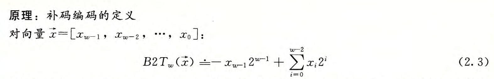
      - 例如： 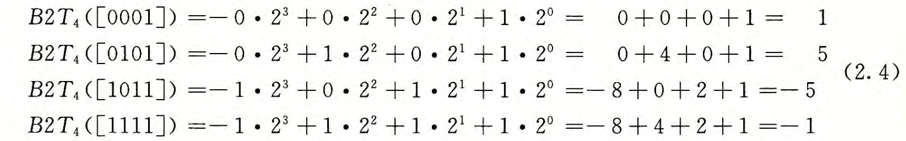
      - 补码的最值
        - 最小值：-2^(w- 1)
        - 最大值：2^(w-1) -1
    - 反码
      - 定义 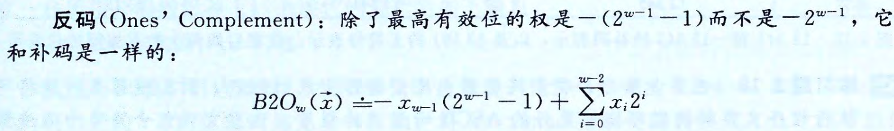
    - 原码
      - 定义 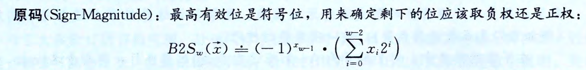
    - C 语言中的隐式转换
      - 有符号与无符号运算
        - 有符号 -&gt; 无符号
        - 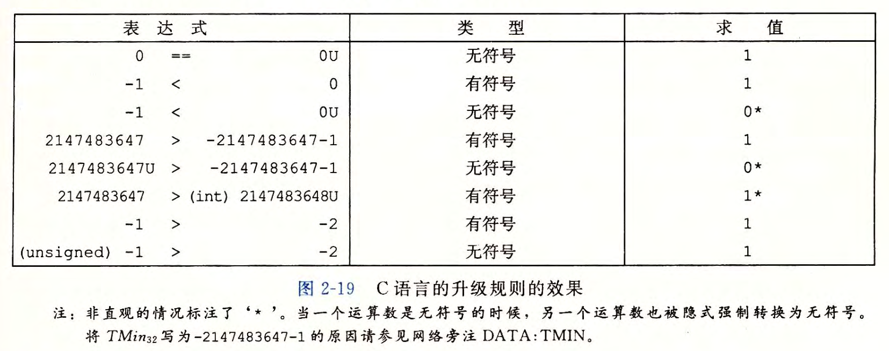
    - 扩展一个数字的位表示
      - 无符号数
        - 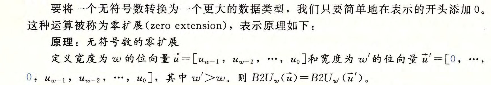
      - 补码数
        - 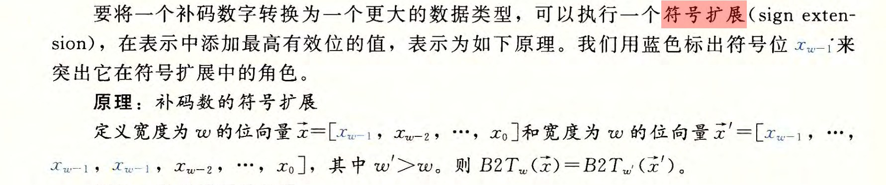
    - 截断数字
      - 无符号数
        - 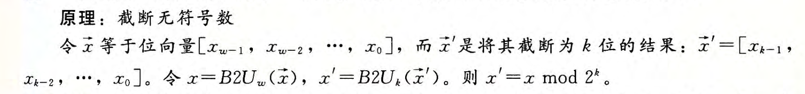
      - 补码数
        - 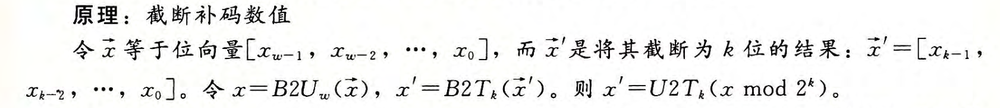
  - 整数运算
    - 无符号数加法
      - 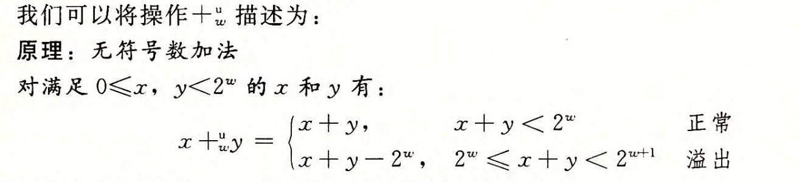
      - 检测溢出： 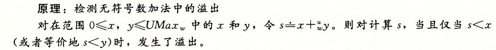
    - 补码加法
      - 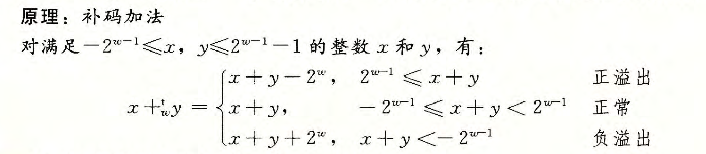
      - 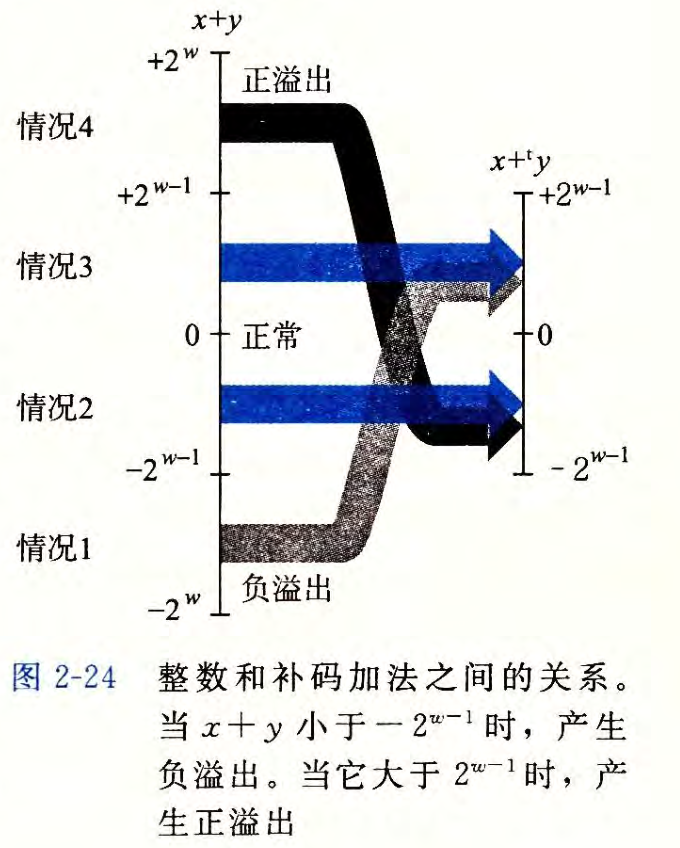
      - 检测溢出 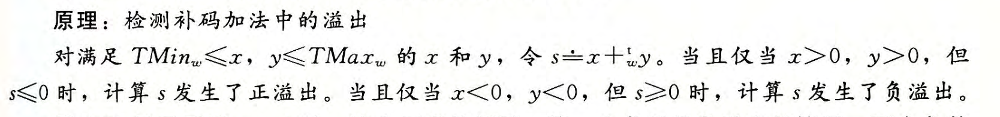
    - 补码的非（负）
      - 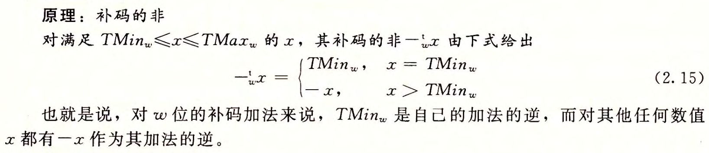
      - 推导： 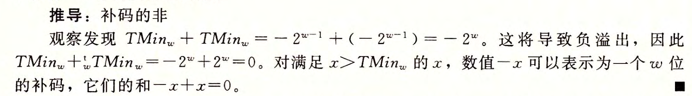
      - 位级表示
        - 方法一：每位求反之后再加一 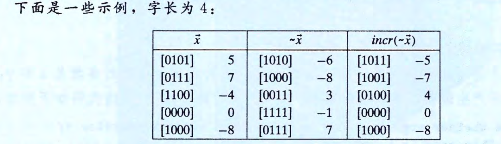
        - 方法二： 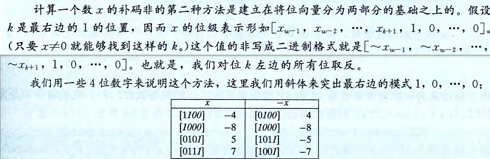
    - 无符号乘法
      - 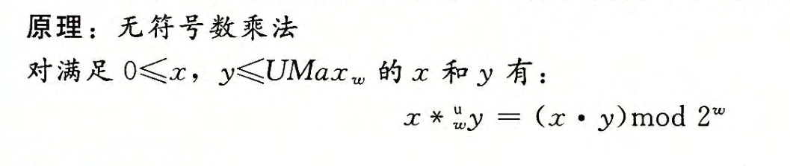
    - 补码乘法
      - 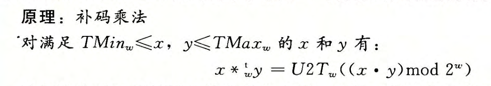
    - 乘以常数
      - 因为计算机执行乘法比较慢，所以，编译器使用移位和加法的组合来代替常数因子因子的乘法
        - 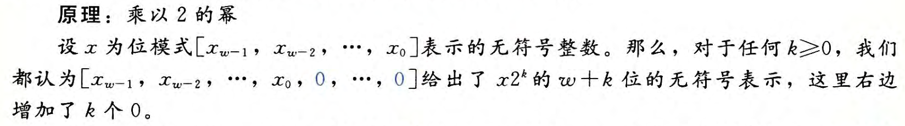
        - 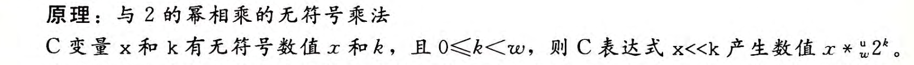
        - 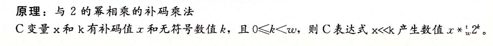
        - 例如，x * 14，其中 14 = 2^3 + 2^2 + 2^1，所以，编译器将乘法重写为 (x&lt;&lt;3) + (x&lt;&lt;2) + (x&lt;&lt;1)
    - 除以2的幂
      - 无符号 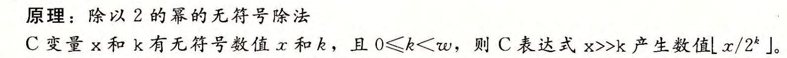
      - 补码，向下舍入（-771.25 会舍入为 -772) 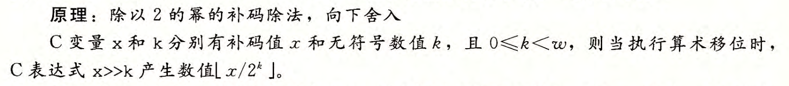
      - 补码，向上舍入（-771.25 会舍入为 -771） 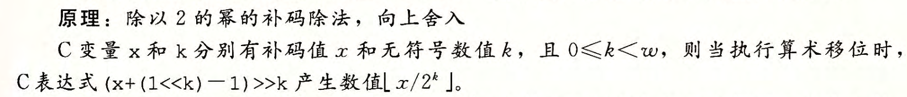
        - 原理 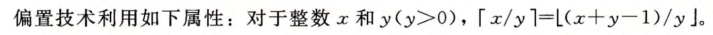
- 浮点数
  - 二进制小数
    - 数字表示
      - 定义： 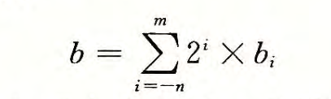
      - 二进制小数点向左移动一位相当于这个数被 2 除。
      - 类似，二进制小数点向右移动一位相当于将该 数乘 2
      - 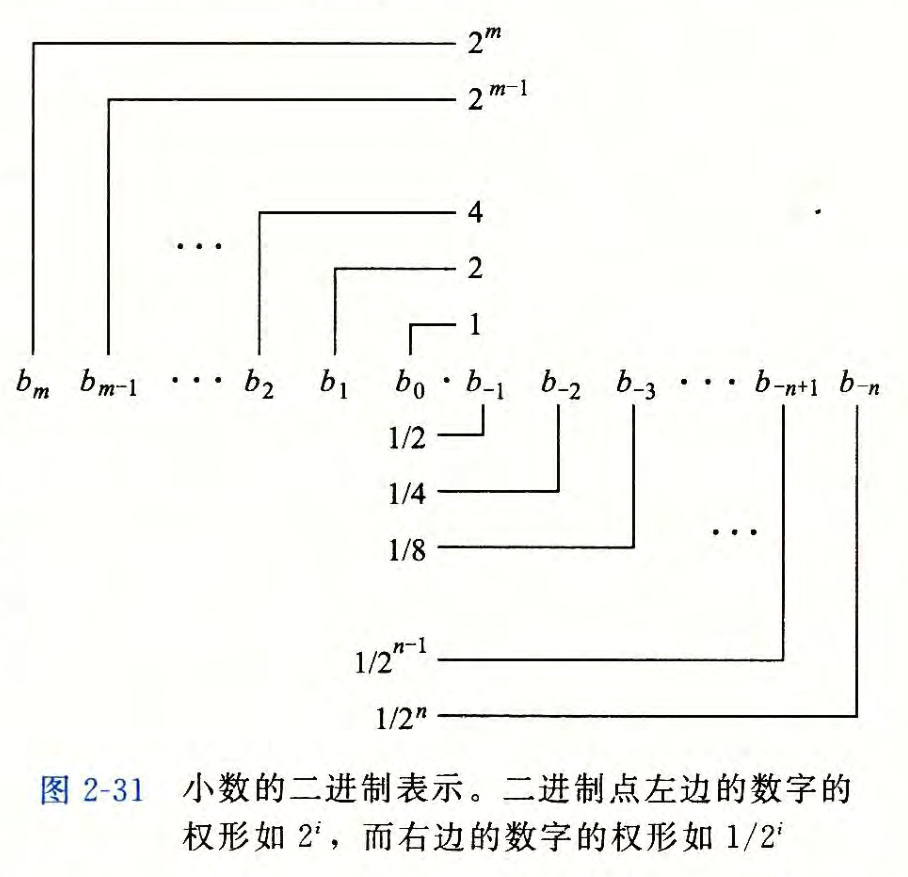
  - IEEE浮点表示
    - 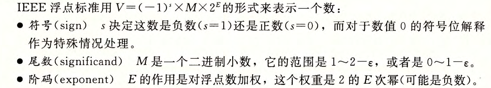
    - 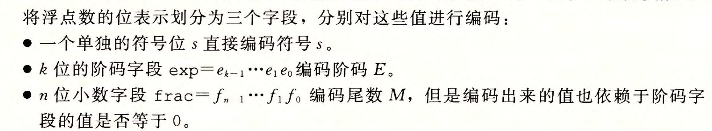
    - 单精度：s = 1, k = 8, n = 23 双精度：s = 1, k = 11, n = 52 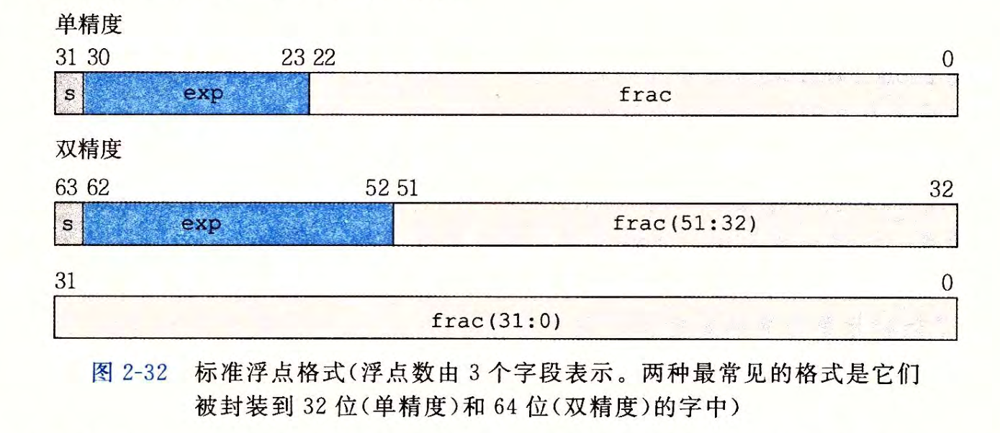
    - 根据 exp 的值，被编码值可以分为 3 中不同的情况（最后一种有两种变体）
      - 规格化的， exp != 0 && exp != 255 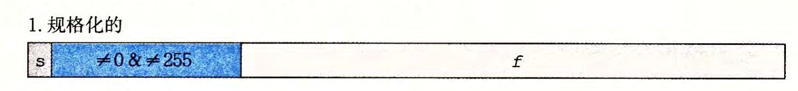
        - 阶码字段被解释为以偏置(biased)形式表示的有符号整数，阶码的值 E=e-Bias，e 是无符号数即 exp 表示的值，Bias = 2^(k - 1) - 1。 Bias = 127 (单精度） Bias = 1023 （双精度）
        - 小数字段 frac 被解释为描述小数值 f（无符号值），其中 0 &lt;= f &lt; 1，尾数定义为 M = 1 + f，因此我们可以把 M 看成一个二进制表达式为1.xxxx的数字
      - 非规格化的，e = 0 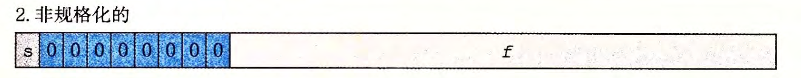
        - 此时，E = 1 - Bias, M = f
        - 0 是非规格化数（f = 0)
        - 接近 0 的数也是非规格化的 这是 k = 3, n = 2时能表示的数： 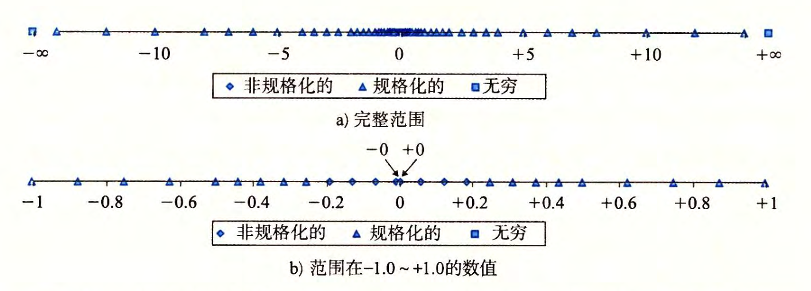
      - 无穷大 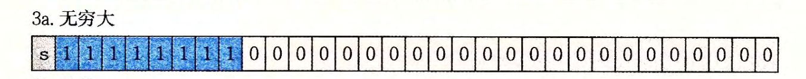
      - NaN 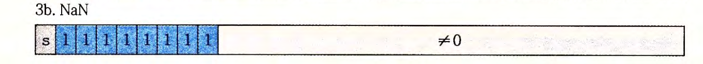
    - 一些规律
  - 舍入
    - 对于值 x,我们一般想用 一 种系统的方法，能够找到“最接近的匹配值 x' 可以用期望的浮点形式表示出来。这就是舍入 (rounding) 运算的任务
    - 四种舍入方式
      - 向偶数舍入（round to even） 也称向最接近的值舍入（round to nearest） 这是默认的方式
        - 它将数字向上或者向下舍入，使得结果的最低有效数字是偶数。
        - 这种方法将 1.5 美元和 2. 5 美元都舍入成 2 美元。
      - 向零舍入
        - 向零舍入方式把正数向下舍入，把负数向上舍入得到的值 x'， 是得 |x'| &lt;= |x|
      - 向下舍入
        - 向下舍入方式把正数和负数都向下舍入,得到 x', 使得 x' &lt;= x
      - 向上舍入
        - 向上舍入方式把正数和负数都向上舍入，得到 x'，使得 x &lt;= x'
      - 例子 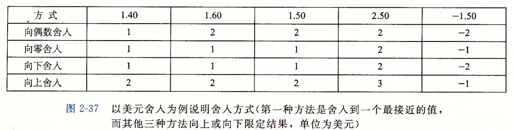
      - 由于舍入导致的问题
        - 加法
          - 加法可交换 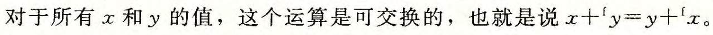
          - 加法不可结合 例如，使用单精度浮点，表达式(3. 14+le10) -le10 求值得到0.0。因为舍入，值 3. 14 会丢失。
          - 无穷有关的计算 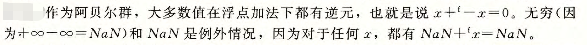
          - 满足了单调性 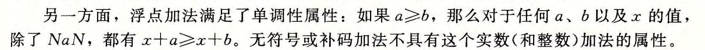
        - 乘法
          - 不具备可结合性
          - 不可分配性
          - 满足下列单调性： 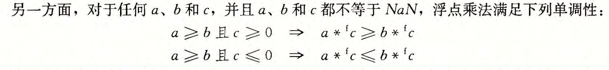
  - C 语言中的 int, float, double 进行强制类型转换
    - 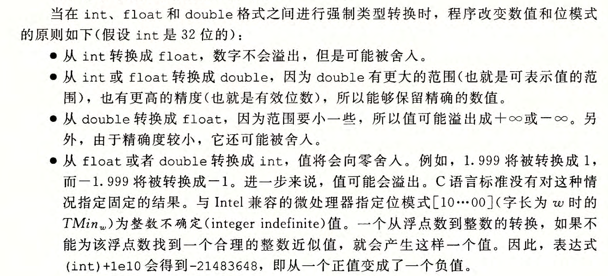
```
