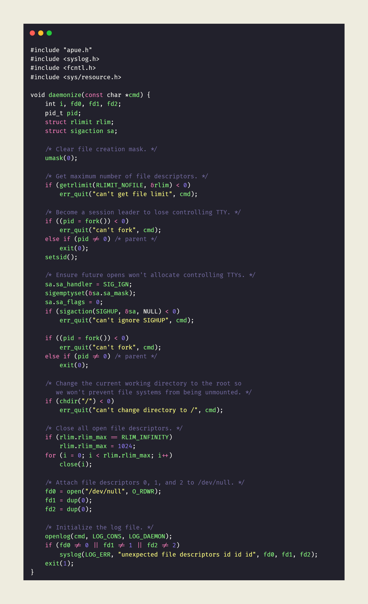
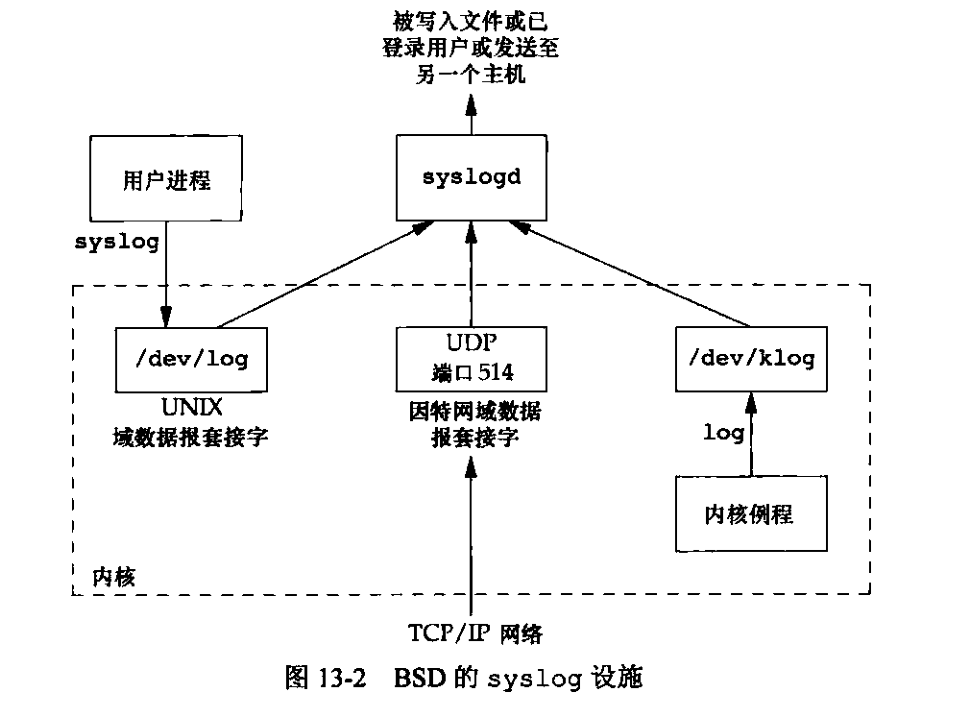
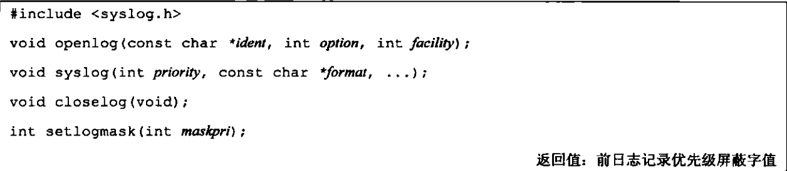
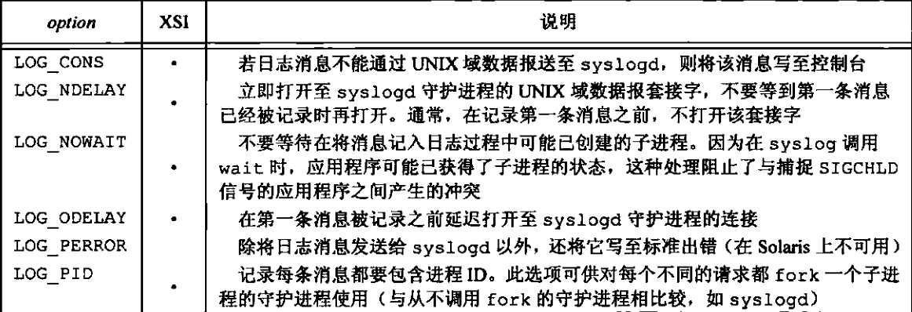
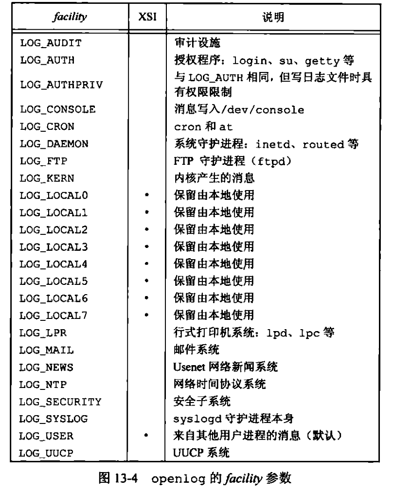
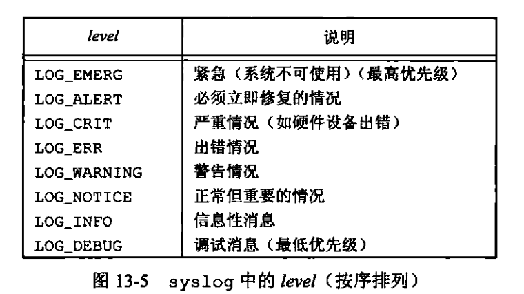
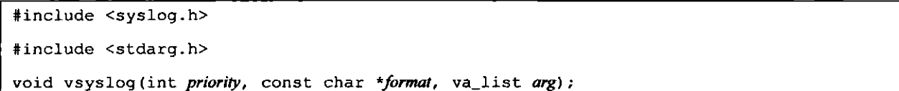

```markmap
---
markmap:
  initialExpandLevel: 2
  spacingVertical: 30
  spacingHorizontal: 180
---

# 守护进程
- 特征
  - 守护进程（daemon）是生存期长的一种进程。它们常常在系统引导装入时启动，仅在系统关闭时才终止。因为它们没有控制终端（ps 的 x 选项），所以说它们是在后台运行的。UNIX系统有很多守护进程，它们执行日常事务活动。
  - linux 使用一个名为 kthreadd 的特殊内核进程来创建其它内核进程（ps ajx 名字在方括号中为内核守护进程）
  - 对于需要在进程上下文执行工作但却不被用户层进程上下文调用的每个内核组件，通常有自己的内核守护进程
    - kswapd守护进程也称为内存换页守护进程。它支持虚拟内存子系统在经过一段时间后将脏页面慢慢地写回磁盘来回收这些页面
    - flush守护进程在可用内存达到设置的最小阀值时将脏页面冲洗至磁盘。它也定期地将脏页面 冲洗回磁盘来减少在系统出现故障时发生的数据丢失。多个冲洗守护进程可以同时存在，每个 写回的设备都有一个冲洗守护进程
    - sync_supers 守护进程定期将文件系统元数据冲洗至磁盘
    - jbd 守护进程帮助实现了 ext4 文件系统中的日志功能
    - cron 守护进程在定期安排的日期和时间执行命令。许多系统管理任务是通过 cron 每隔一段固 定的时间就运行相关程序而得以实现
    - atd守护进程与cron类似，它允许用户在指定的时间执行任务，但是每个任务它只执行一次，而非在定期安排的时间反复执行
    - cupsd守护进程是个打印假脱机进程，它处理对系统提出的各个打印请求
    - sshd守护进程提供了安全的远程登录和执行设施
    - rpcbind 守护进程提供将远程过程调用（RemoteProcedure Call，RPC）程序号映射为网络端口号的服务。
    - rsyslogd 守护进程可以被由管理员启用的将系统消息记入日志的任何程序使用。可以在一台实际的控制台上打印这些消息，也可将它们写到一个文件中
  - init 进程（pid = 1）除了其他工作外，还主要负责启动各运行层次特定的系统服务，这些服务通常是在他们自己拥有的守护进程的帮助下实现的
- 编程规则
  - 调用 umask 将文件模式屏蔽字设置为一个已知值（通常是 0）
    - 因为有继承得来的文件模式屏蔽字可能会被设置为拒绝某些权限
  - 调用 fork，然后使父进程 exit，原因
    - 如果守护进程是作为一条简单的 shell 命令启动的，那么父进程终止会让 shell 认为这条命令已经执行完毕
    - 保证了子进程不是一个进程组的组长进程，这是调用 setsid 的先决条件
  - 调用 setsid 创建一个新会话，然后使调用进程：
    - 1\. 成为新会话的首进程
    - 2\. 成为一个新进程组的组长进程
    - 3\. 没有控制终端
    - 4\. 在基于SystemV的系统中，有些人建议在此时再次调用fork，终止父进程，继续使用子进程中的守护进程。这就保证了该守护进程不是会话首进程，于是按照SystemV规则可以防止它取得控制终端。为了避免取得控制终端的另一种方法是，无论何时打开一个终端设备，都一定要指定O_NOCTTY
  - 将当前工作目录更改为根目录
    - 从父进程继承而来的工作目录可能在一个挂载的文件系统中，因为守护进程需要长期运行，故而该文件系统就不能被卸载，保险起见，将工作目录更换为根目录
  - 关闭不再需要的文件描述符
    - 这使守护进程不在持有从其父进程继承而来的任何文件描述符
  - 某些守护进程打开 /dev/null 使其具有文件描述符 0, 1, 2
  - 上述描述的代码实现 
- 出错记录
  - 有一个集中的守护进程出错记录设施
    - syslog 设施 
  - 有 3 种产生日志消息的方法
    - 内核调用 log 函数
      - 任何一个用户进程可以打开 /dev/klog 来读取这些信息
    - 大多数用户进程（守护进程）调用 syslog 函数来产生日志消息
    - 将日志消息发向 UDP 端口 514
      - syslog 函数从不产生这些 UDP 数据包，他们要求产生此日志消息的进程进行显式的网络编程
    - 配置文件为 /etc/syslog.conf
      - 此文件决定了不同种类的消息应该送向何处
  - syslog 函数 
    - 如果不调用 openlog 函数，则 syslog 自动调用 openlog
    - closelog 也是可选的，它只是用来关闭曾被用于与 syslogd 守护进程进行通信的描述符
    - openlog 的 ident 参数将被追加至每则日志消息中
    - openlog 的 option 选项
      - 选项 
    - openlog 的 facility 参数
      - facility 设施 
      - 设置 facility 参数的目的是可以让配置文件说明，来自不同设施的目的将以不同的方式进行处理
    - syslog 产生一个日志消息
      - priority 参数是 facility 和 level 的结合
      - level，优先级依次下降 
      - 在 format 中， %m 字符被替换为与 errno 值对应额出错消息字符串（strerror）
    - setlogmask 用于设置进程的记录优先级屏蔽字
      - 在 mask 中被设置的会被记录，否则将不被记录
  - logger 命令专门为以非交互方式运行的需要产生日志消息的 shell 脚本设计的
  - 除了 syslog，还有一种变体来处理可变参数列表 vsyslog 
    - 需要在 Linux 中定义符号 __USE_BSD
- 守护进程的惯例
  - 若守护进程使用锁文件，那么该文件通常存储在 /var/run/ 目录中
    - 使用锁文件的目的是确保只启动一次守护进程（如果多次启动，则打开锁文件会失败）
    - 锁文件的名字通常是 &lt;name&gt;.pid
      - &lt;name&gt; 可以是该守护进程或服务的名字
  - 若守护进程支持配置选项，那么配置文件通常存放在 /etc 目录中，配置文件的名字通常是 &lt;name&gt;.conf
  - 守护进程可用命令行启动，但通常它们是由系统初始化脚本之一（/etc/rc* 或 /etc/init.d）启动的
  - 某些守护进程捕捉 SIGHUP，当它们接受到该信号时，重行读配置文件，避免了重启守护进程的麻烦
```
