```markmap
---
markmap:
  initialExpandLevel: 2
  spacingVertical: 30
  spacingHorizontal: 180
---

# 操作系统
- 基础概念
  - 虚拟（Virtual）
    - 是指将一个物理上的实体变为若干逻辑上的对应物
  - 异步（Asynchronism）
    - 多个进程/事件/操作之间没有严格的时间顺序依赖，可以在不同的时间独立地开始、执行和结束
    - 操作系统中的进程是异步的：进程的执行可能被打断，不是一贯到底的
  - 联机作业 vs 脱机作业
    - 联机作业：输入和输出都由主机直接进行控制
      - CPU 等外设
    - 脱机作业：输入和输出由外部设备处理，主机只负责计算
      - 外设等 CPU
  - 多道批处理系统
    - 用户所提交的作业都先存放在外存上并排成一个队列，作业调度程序按一定的算法从后备队列中选择若干作业调入内存
    - 若干作业在管理程序的控制下相互穿插地运行，共享系统中的各种硬件/软件资源
  - 分时操作系统
    - 主要有如下特征
      - 1\. 同时性（多路性）
        - 允许多个终端用户同时使用同一台计算机
      - 2\. 交互性
        - 通过终端的方式控制程序允许
      - 3\. 独立性
        - 多个用户可以彼此独立地进行操作，互不干扰
      - 4\. 即时性
        - 用户请求可以在很短的时间内进行响应
  - 实时操作系统
    - 硬实时系统
      - 某个动作必须在规定的时刻内发生
    - 软实时系统
      - 能够接受偶尔违反时间规定且不会引起任何永久性的损害
  - 时钟管理
    - 时钟的第一个功能是计时，向用户提供标准的系统时间
    - 通过时钟中断，可以实现进程的切换
  - 原语
    - 原语程序的特点
      - 1\. 处于操作系统的底层
      - 2\. 这些程序的运行具有原子性，其操作只能一气呵成
        - 通过关中断来完成
      - 3\. 这些程度的运行时间都较短，而且调用频繁
  - 系统调用
    - 是操作系统提供给应用系统使用的接口
    - 按系统调用的功能分
      - 设备管理
        - 完成设备的请求或释放，设备启动等
      - 文件管理
        - 完成文件的读、写、创建及删除等功能
      - 进程控制
      - 进程通信
      - 内存管理
    - 系统调用的处理过程
      - 1\. 用户程序将系统调用号和所需的参数压入堆栈；然后执行一个陷入指令，将 CPU 状态从用户态转为内核态
      - 2\. 由硬件和操作系统保护被中断程序的现场，将 PC、PSW 以及 GPRs 压入堆栈
      - 3\. 分析系统调用类型，执行相应的系统调用处理程序
      - 4\. 系统调用处理完成，继续运行该程序或者调用一个新的程序来执行
  - 操作系统结构
    - 分层法 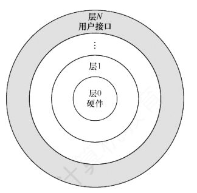
      - 优点
        - 1\. 便于系统的调试和验证
        - 2\. 易扩充和易维护
      - 缺点
        - 合理定义各层比较困难：依赖关系固定后，往往显得不灵活
        - 效率差：在各层之间不断地通信造成了系统的开销增大
    - 模块化 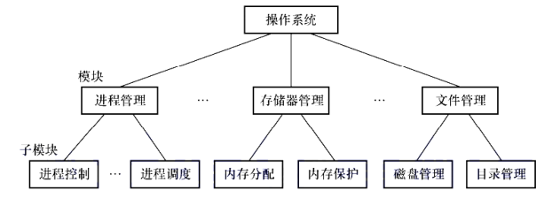
      - 每个模块具有某方面的管理功能，并规定好各模块之间的进行通信的接口
      - 模块要分得适中：太大增加模块内部的复杂性；太小使得模块之间的联系过多
      - 衡量模块的独立性
        - 内聚性：模块内部各部分之间联系的紧密程度
        - 耦合性：模块间相互联系和相互影响的程度
      - 优点
        - 提高了操作系统的设计的正确性、可理解性和可维护性
        - 增强了操作系统的可适应性
        - 加速了 OS 的开发过程
      - 缺点
        - 模块间的接口规定很难满足对接口的实际需求
    - 宏内核
      - 将 OS 的主要功能都作为一个紧密联系的整体，从而为用户提供高性能的系统服务
    - 微内核
      - 将内核中最基本的功能留在内核（遵循机制与策略分离原理），包括
        - 与硬件紧密相关的部分
        - 客户和服务器进程之间的通信 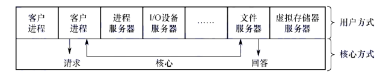
          - 服务器进程中，包含了 OS 没有在微内核中实现的功能
        - 进程（线程）管理
          - 进程的切换，调度，多处理器之间的同步
          - 用户进程的分类、优先级的确定方式（策略问题）则被放入进程管理服务器中
        - 低级存储器管理
          - 将逻辑地址变换为物理地址
          - 页面置换算法、内存分配和回收的策略放入存储器管理服务器中
        - 中断和陷入处理
          - 捕获发生的中断和陷入事件，进行响应，然后交给相关服务器来处理
      - 微内核的特点
        - 扩展性和灵活性
        - 可靠性和安全性
        - 可移植性
          - 与硬件的相关的代码均放在内核中，各种服务器均与硬件平台无关
        - 分布式计算
          - 因为客户和服务器之间、服务器与服务器之间采用消息传递的机制
    - 外核（exokernel）
      - 为虚拟机分配资源，并检查这些资源使用的安全性
      - 每个虚拟机可以运行自己的操作系统
      - 优点 
  - 操作系统引导
    - 1\. 激活 CPU, CPU 读取 ROM 中的 boot 程序，将 IR 设置 BIOS 的第一条指令，开始执行 BIOS 的指令
    - 2\. 硬件自检
      - 1\. BIOS 在内存最开始的空间建立中断向量表
      - 2\. 自检，检查是否有硬件出现故障
    - 3\. 加载带有操作系统的硬盘
      - 1\. BIOS 读取 Boot Sequence（通过 CMOS 保存的启动顺序）
      - 2\. 将控制权交给启动顺序排在第一的存储设备
      - 3\. CPU 将该存储设备引导扇区的内容加载到内存
    - 4\. 加载主引导记录（MBR）
      - MBR 的作用是告诉 CPU 去硬盘的哪个主分区去找操作系统
      - 硬盘以特定的标识符区分引导硬盘和非引导硬盘；若发现存储设备不是一个引导硬盘，则去检查下一个存储设备
    - 5\. 扫描硬盘分区表，并加载硬盘活动分区
      - MBR 包含硬盘分区表，硬盘分区表以特定的标识符区分活动分区和非活动分区
        - 活动分区是指含有操作系统的硬盘分区
      - 会扫描 MBR 中的硬盘分区表，找到 MBR 中的活动分区，然后加载活动分区
    - 6\. 加载分区引导记录（PBR）
      - 读取活动分区的第一个扇区，这个扇区被称为分区引导记录（PBR）
      - 通过 PBR 可以找到用于引导操作系统的程序（启动管理器）
    - 7\. 加载启动管理器
    - 8\. 加载操作系统
  - 虚拟机
    - 第一类虚拟机管理程序 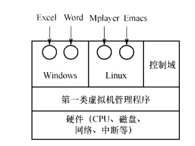
      - 在裸机上运行（像一个操作系统）管理程序，向上层（操作系统）提供若干虚拟机。 这些虚拟机中包含裸机硬件的精确复制（没有进行资源的划分）
      - 运行在虚拟中的 OS 以为自己运行在内核态，实际上运行在用户态（虚拟内核态）
      - 当 OS 执行了内核态指令时，会陷入虚拟机管理程序的内核态
        - 在支持虚拟化的 CPU 上，CPU 检查这条指令是由虚拟机中的操作系统执行的还是由用户程序执行的，如果是操作系统执行的，则直接执行
        - 在不支持虚拟化的 CPU 上，所有特权指令都会被转化为对虚拟机管理程序的调用，由虚拟机管理程序模拟这些指令的功能
    - 第二类虚拟机管理程序 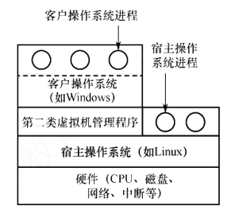
      - 裸机上跑的是 宿主 OS,宿主 OS 对客户 OS 的资源进行分配
- 进程与线程
  - 进程和线程
    - 进程的组成
      - 进程控制块（PCB）
        - PCB 描述进程的基本情况和运行状态
        - 在进程的整个生命周期内，OS 总是通过 PCB 对进程来进行控制
        - PCB 在进程创建时创建，常驻内存；在进程结束时删除
        - PCB 是进程实体的一部分，是进程存在的唯一标志
        - PCB 的常见组成 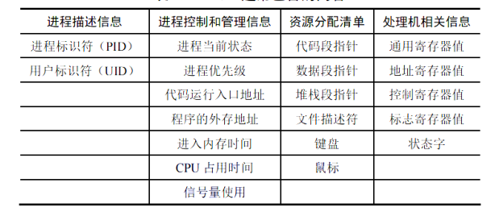
        - 多进程 PCB 的组织方式
          - 链接方式
            - 将同一状态的 PCB 链接成一个对列
            - 这里所说的状态是指：就绪态、阻塞态等
          - 索引方式
            - 将同一状态的进程组织在一个索引表中，索引表的表项指向对应的 PCB
            - 不同状态对应不同的索引表
      - 程序段
        - 被进程调度程序调度到 CPU 执行的程序代码段
      - 数据段
        - 进程对应的程度加工处理的原始数据
    - PCB 和程序段、数据段组成了进程实体
      - 进程的定义：进程是进程实体的运行过程，是系统资源进行资源分配和调度的一个独立单位
    - 进程的状态 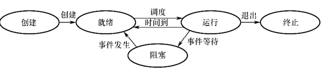
      - 1\. 运行态
      - 2\. 就绪态
        - 进程获得除 CPU 外的一切所需资源
        - 多个就绪态进程一般按照对列的方式组织，称为就绪对列
      - 3\. 阻塞态（等待态）
        - 进程因正在等待某事件（不包括等待 CPU）而暂停运行
        - 即使 CPU 空闲，此状态的进程也不能运行
        - 和就绪对列类似，也有阻塞对列，还可以根据阻塞原因的不同而进一步细分对列
      - 4\. 创建态
        - 创建进程时 OS 完成以下操作
          - 1\. 创建并初始化 PCB
          - 2\. 分配该进程所需的资源
        - 如果不能获得进程所需的资源（例如内存不足），就会将 PCB 的状态设置为创建态，如果可以满足，则新创建的 PCB 可以是就绪态
      - 5\. 结束态
        - 进程需要结束时，先将该进程设置为终止态，然后进一步处理资源释放和回收工作
    - 进程控制（通过原语完成）
      - 1\. 进程的创建
        - 1\. 为新进程分配一个唯一的进程标识号，并创建一个 PCB
        - 2\. 为进程分配其运行的所需的资源：内存、文件、IO 设备、CPU 时间等
        - 3\. 初始化 PCB：初始化标志信息、CPU 状态信息和 CPU 控制信息
        - 4\. 将 PCB 插入就绪对列
      - 2\. 进程的终止
        - 结束的原因
          - 1\. 正常结束
          - 2\. 异常结束：数组越界、保护错、非法指令.......
          - 3\. 外界干预
        - 结束的过程
          - 1\. 根据 PID 检索出该进程的 PCB,从中读出进程的状态
          - 2\. 若处于运行状态，则立即终止进程的执行
          - 3\. 若进程还有子孙进程，则将其子孙进程终止（不是所有 OS 都如此设计）
            - 若一个进程终止，它的子孙进程都终止的这种现象被称为级联终止
          - 4\. 将该进程所拥有的全部资源，或归还给操作系统，或归还给父进程
          - 5\. PCB 从其所在对列中删除
      - 3\. 进程的阻塞和唤醒
        - 阻塞的时机
          - 请求系统资源失败
          - 等待某种操作完成
        - 阻塞过程（Block 原语）
          - 1\. 找到 PID 对应的 PCB
          - 2\. 若该进程为运行态，则保护其现场
          - 3\. 设置状态为阻塞态，停止运行
          - 4\. PCB 插入等待对列
        - 唤醒的时机
          - 所期待而事件出现
        - 唤醒的过程（Wakeup 原语）
          - 1\. 在事件的等待对列中找到 PID 对应的 PCB
          - 2\. 将 PCB 从等待对列中移出，状态设置为就绪态
          - 3\. PCB 插入就绪对列
        - 注意：若在某个进程中使用了 Block 原语，则必须在与之合作的相关进程中安排一条相应的 Wakeup 原语
    - 进程的通信
      - 共享存储
        - 低级方式
          - 基于数据结构的共享
        - 高级方式
          - 基于存储区的共享
        - 对共享空间进行读/写时，需要使用同步互斥工具
      - 消息传递
        - 直接通信方式
          - 发送进程直接将消息发送到接收进程
          - 消息被接收入接收进程的消息缓冲对列中
        - 间接通信方式
          - 发送方和接收方中间有一个中间实体，一般被称为信箱
      - 管道通信
        - 管道是一个特殊的共享文件，通常称为 pipe 文件
        - 需要 3 方面的协调机制
          - 1\. 互斥：当一个进程对管道进行读/写时，其他进程需要等待
          - 2\. 同步：当写进程向管道写入一定量的数据后，写进程阻塞；读进程读出后，唤醒写进程
          - 3\. 确定管道双方的存在
      - 信号
    - 线程
      - 引入线程的目的是减小程序在并发执行时所付出的时空开销，提高操作系统的并发性能
      - 线程的相关知识
        - 线程是基本的 CPU 执行单元
        - 线程是进程中的一个实体，是系统独立调度和分派的基本单位
        - 同一个进程内的线程共享进程所拥有的全部资源
        - 一个线程可以创建和撤销另一个线程
      - 进程只作为除 CPU 外系统资源分配的单元；线程作为 CPU 的分配单元
        - 多线程的进程可以分配到不同的 CPU 上执行
        - 没有引入线程的进程只能在一个 CPU 上执行
      - 线程控制块 TCB，包含
        - 1\. 线程标识符
        - 2\. 一组寄存器：程序计数器、状态寄存器和通用寄存器
        - 3\. 线程运行状态
        - 4\. 优先级
        - 5\. 线程专有存储区（用来保存现场）
        - 6\. 堆栈指针
      - 线程的实现方式
        - 用户级线程（ULT）
          - 线程的管理在用户空间完成，无需 OS 的参与
          - 对于 ULT 调度仍以进程为基本单位
          - 优点：节省了切换到内核空间的开销；可以灵活选择调度算法；实现与 OS 无关
          - 缺点：当一个线程阻塞时，所有线程都阻塞；不能发挥多 CPU 的优势：进程中仅有一个线程能运行
        - 内核级线程（KLT）
          - 优点
            - 1\. 发挥多 CPU 的优势
            - 2\. 不会发生一线程阻塞，全线程阻塞的现象
            - 3\. 具有很小的数据结构与堆栈
        - 组合方式
          - 内核实现了多线程，同时允许实现用户级线程
      - 多线程模型
        - 多对一模型
          - 将多个 ULT 映射到一个 KLT
        - 一对一模型
        - 多对多模型
          - 要求 ULT 的数量大于 KLT 的数量
  - CPU 调度
    - 调度的层次
      - 高级调度（作业调度）
        - 按照某种规则从外存中处于后备对列的作业中挑选一个或多个，为它们建立属于自己的进程
        - 主存 &lt;- 外存
      - 中级调度（内存调度）
        - 目的是提高内存利用率和系统吞吐量
        - 挂起态：将那些不能运行的进程调度到外存来等待
      - 低级调度（进程调度）
        - 按照某种算法从就绪对列中选取一个进程，将 CPU 分配给该进程
    - 调度程序（调度器）
      - 用于低级调度
      - 调度程序的组成
        - 1\. 排队器
          - 将系统中的所有就绪进程按照一定的策略排成一个或多个对列，以便于调度程序选择
          - 同时，负责处理新加入的就绪进程
        - 2\. 分派器
          - 负责调度程序所选的进程，将 CPU 分配给新进程
        - 3\. 上下文切换器
          - 设置换下和换上进程的上下文
          - 切换的流程
            - 1\. 挂起一个进程，将 CPU 上下文保存到 PCB 中
              - PSW 和 PC 先由 CPU 自动保存到内核栈中，再由调度程序保存到 PCB 中
            - 2\. 将换下进程的 PCB 保存到相应的对列中
            - 3\. 选择另一个进程执行，并更新 PCB
            - 4\. 恢复新进程的 CPU 上下文
            - 5\. 跳转到新进程 PCB 中的程序计数器所指向的位置执行
          - 有些 CPU 提供多个寄存器组，在这样的 CPU 中进行上下文切换的时候，就可以仅改变当前寄存器组的指针
      - 不能进行进程的调度和切换的情况
        - 1\. 在处理中断的过程中
        - 2\. 需要完全屏蔽中断的原子操作中
      - 进程调度的方式
        - 非抢占方式
          - 无论当前要执行的进程的优先级有多高，都要等待正在执行的进程变为非执行态之后才能切换
        - 抢占调度方式
          - 若有某个更为重要和紧迫的进程需要使用 CPU,需要将 CPU 分配给这个更为重要的进程
      - 闲逛进程（Idle Process）
        - PID 为 0，如果调度时，没有其它就绪的进程，则执行闲逛进程
        - 闲逛进程的优先级最低
        - 闲逛进程会一直运行，直至有其它就绪进程进入对列
      - 衡量调度算法的性能指标
        - CPU 的利用率 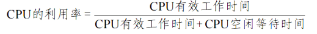
        - 系统吞吐量
          - 单位时间内 CPU 完成作业的数量
        - 周转时间
          - 从作业提交到作业完成所经历的时间
          - 包括作业等待、就绪对列中排队、CPU 上运行、IO 操作等花费时间的总和
          - 平均周转时间 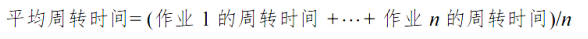
        - 带权周转时间 
          - 平均带权周转时间 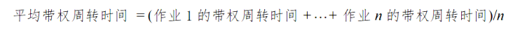
        - 等待时间
          - 进程处于等待 CPU 的时间之和
          - 调度算法不影响进程需要的 CPU 时间和 IO 时间，只影响等待时间
          - 所以，等待时间常常决定了一个调度算法的优劣
        - 响应时间
          - 从用户提交到系统首次产生响应所需的时间
      - CPU 调度算法
        - FCFS 先来先服务
          - 选择最先来的进程进行执行
          - 运行直到运行完成或阻塞
        - 短作业优先（SJF）调度算法
          - 从就绪对列中选择一个或几个估计运行时间最短的作业来执行
          - 运行直到运行完成或阻塞
          - 缺点
            - 会导致饥饿现象
              - 长作业长期不被调度
            - 完全没有考虑作业的紧迫程度
              - 不能保证紧迫性作业会被及时处理
          - SJF 算法默认是非抢占性的，也有抢占式的，被称为最短剩余时间优先调度算法
            - 当一个新进程到达，估计执行时间比当前进程的剩余时间小，则立即暂停当前进程，分配给新到来的进程
          - SJF 的平均周转时间、平均等待时间最优
        - 高响应比优先调度算法（主要用于作业调度）
          - 是对 FCFS 和 SJF 的综合平衡：计算后备对列中每个作业的响应比，选择最高响应比的那个作业投入运行
          - 响应比 
            - 等待时间相同时，类似 SJF
            - 要求服务时间相同时，类似 FCFS
          - 克服了“饥饿”现象
        - 优先级调度算法
          - 用优先级描述作业的紧迫程度
          - 选择优先级最高的那个作业进行执行
          - 可以是抢占式也可以是非抢占式
          - 动态优先级
            - 优先级随着进程的执行或等待时间的增加而改变
          - 通常而言，优先级的设置依照以下原则
            - 1\. 系统进程 &gt; 用户进程
            - 2\. 交互型进程 &gt; 非交互型进程
            - 3\. IO 型进程 &gt; 计算型进程
        - 时间片轮转（RR）调度算法
          - 1\. 将所有的就绪进程按 FCFS 策略排成一个就绪对列
          - 2\. 每隔一段时间产生一次时间中断，激活调度程序进行调度
          - 3\. 调度程序选择就绪对列的首进程来执行一个时间片
            - 若一个时间片之内该程序就执行完成，则提前激活调度程序
          - 4\. 该进程执行完一个时间片之后，将其放置到就绪对列的末尾重新排队
        - 多级对列调度算法
          - 设置多个就绪对列，将不同类型或性质的进程固定分配到不同的就绪队列
          - 每个队列实施不同的调度算法
          - 例如，可以为不同的 CPU 单独设置就绪队列，每个 CPU 实施单独的调度策略
        - 多级反馈队列调度算法 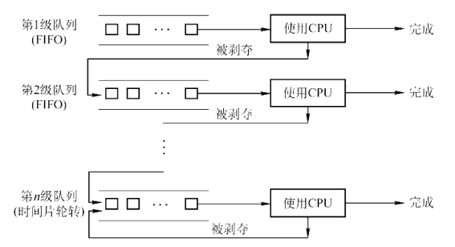
          - 1\. 设置多个就绪对列，为每个队列设置不同的优先级，第 1 级队列优先级最高，依次递减
          - 2\. 各个对列中的进程运行的时间片大小不相同：优先级越高，时间片越短
            - 若进程在一个时间片内没有执行完成，则转入下一级对列的末尾
          - 3\. 每个对列内采用 FCFS 算法
            - 新进程放入第 1 级对列的最后
          - 4\. 按对列的优先级进行调度：当第 1 级队列中为空时，才调度第 2 级队列中的进程运行，依次类推
            - 当有新进程进入任何一个优先级较高的对列，须立即停止正在运行的进程，将其放入原来的优先级对列中（不放到下一个优先级对列中）
        - 基于公平原则的调度算法
          - 保证调度算法
            - 保证若系统中有 n 个用户，则每个用户都获得 1/n 的 CPU 时间
              - 前提是他们有相同的进程数
            - 若在单用户中有 n 个进程正在运行，则每个进程都保证获得 1/n 的 CPU 时间
            - 实现所需
              - 1\. 跟踪每个进程自创建以来获得了多少 CPU 时间
              - 2\. 计算每个进程应获得的 CPU 时间：自创建以来的时间除以 n
              - 3\. 计算各个进程真正获得的 CPU 时间和应获得的 CPU 时间之比
              - 4\. 调度比率最小的进程持续运行，直到该进程的比率超过最接近它的进程的比率为止
          - 公平分享调度算法
            - 能够保证即使用户拥有不同数量的进程，也能实现用户公平
      - 多处理机调度
        - 非对称多处理机（Asymmetric MultiProcessing,AMP）
          - 指系统中有多个处理器，但是这些处理器的地位不对等
          - 内核驻留并运行在主处理器上，从处理器只运行用户程序
          - 当从处理器空闲时，向主处理器发送一个索取进程的信号
            - 可能主处理器成为瓶颈
        - 对称多处理机（Symmetric MultiProcessing,SMP）
          - 所有处理器的地位相同，调度程序可以将任何一个进程分配给一个任何一个 CPU
        - 亲和性和负载均衡（针对 SMP）
          - 亲和性：试图让一个进程运行在同一个 CPU 上
            - 因为切换 CPU 的代价太高：要清除 CPU 的 Cache
          - 负载均衡：保证所有 CPU 的负载均衡，以充分利用多处理机的优点
            - 负载均衡通常会抵消处理器亲和性带来的好处
        - 多处理机调度方案
          - 公共就绪对列
            - 只设置一个公共就绪对列，所有 CPU 共享该就绪队列
            - 优点：很好地实现了负载均衡，因为每个处理机空闲的时候，就去公共就绪对列中取
            - 缺点：处理器亲和性不好（一个进程可能被调度多次，导致出现在不同的 CPU 中）
            - 处理缺点
              - 软亲和
                - 调度程序尽量保证一个进程调度到某个 CPU 上
              - 硬亲和
                - 用户进程通过系统调用主动请求分配到固定的 CPU 上
          - 私有就绪对列
            - 为每个 CPU 设置一个私有就绪对列，各个 CPU 各自从自己的对列中选择进程运行
            - 优点：亲和性好
            - 缺点：负载均衡差
            - 处理缺点
              - 推迁移
                - 一个特定的系统程序周期性检查每个 CPU 的负载，若发现不平衡，则从超载的 CPU 就绪队列中“推”一些进程到空闲 CPU 的就绪对列
              - 拉迁移
  - 同步与互斥
    - 临界资源：一次仅允许一个进程使用的资源
    - 临界区：每个进程中访问临界资源的那段代码 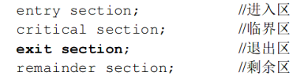
    - 同步（直接制约关系）
      - 为了某种顺序关系，协调多个进程的执行顺序
    - 互斥（间接制约关系）
      - 同一时刻只允许一个进程或线程访问某个临界资源
    - 互斥/同步准则
      - 1\. 空闲让进
        - 临界资源空闲则允许一个请求进入临界区
      - 2\. 忙则等待
      - 3\. 有限等待
        - 防止无限等待
      - 4\. 让权等待（可选实现）
        - 不能进入临界区时，应立即释放处理器，防止进程忙等待
    - 互斥/同步临界区的实现方法
      - 软件实现方法
        - 单标志法
          - 设置一个公共的整形变量（假设为 turn），表示允许进入临界区的进程编号
        - 标志先检查法
          - 设置一个布尔数组 flags，用来表示当前有哪些进程想要进入临界区
          - Pi 想要进入临界区之前，先检查其余进程是否有 flags[j] = true,如果有，则等待；否则，进入临界区，并将 flags[i] 设置为 true
          - 可能有 2 个进程同时进入临界区，因为检查并设置不是原子操作
        - 标志后检查法
          - 先设置自己的标志，再检查其余进程的标志，若有为 true 的进程，则等待，否则，进入临界区
          - 有可能导致每个进程都进入不了临界区
        - Peterson 算法
          - flags 用于解决互斥访问问题，用 turn 解决饥饿问题
          - Pi 为了进入临界区，首先将 flags[i] 设置为 true，并将 turn 设为 j,表示优先让 Pj 进入临界区
          - Pi 在进入临界区之前，检查是否 flags[j] == true && turn == j（不是检测 flags[i]）,如果是，则进入临界区
          - 退出临界区之后，将 falgs[i] 设置为 fasle
          - 例如 2 个进程 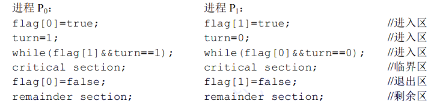
            - 若双方同时进入，turn 几乎同时被设置为 i 和 j,但只有一个赋值语句结果保持，这保证了有且只有 1 个进程会执行
      - 硬件实现方法
        - 中断屏蔽方法（仅适用于单核 CPU）
          - 只有在时钟中断时会导致进程切换，而时钟中断是可屏蔽中断，因此关中断可实现对临界资源的访问 
          - 多处理器下，一个 CPU 上的关中断并不影响其它 CPU 执行临界区代码，所以对多处理器系统而言没有作用
        - TestAndSet，TS 指令
          - TS 指令的作用：读出指定标志并将其设置为 true 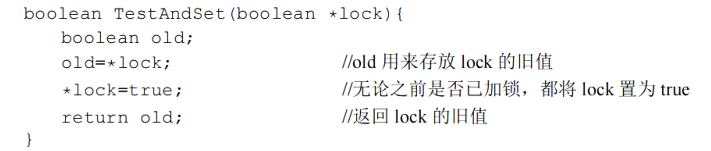
          - TS 管理临界区的方式
            - 1\. 设置一个 lock 布尔变量，lock = true 表示有进程正在访问临界区（ lock 正在被锁着）；lock 的初始值为 false
            - 2\. 进程进入临界区之前，使用 TS 指令检查 lock 是否为 false,若是为 false,则进入，同时 TS 指令会将 lock 设置为 true；若是为 ture, 则 TS 指令设置的 true 效果是一样的，此时需要循环等待
        - Swap 指令
          - Swap 指令交换 2 个字节的内容 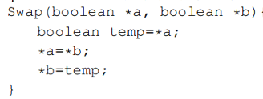
          - Swap 管理临界区的方式
            - 1\. 设置一个共享的 lock 布尔变量，初始值为 false
              - lock = true 表示有进程进入了临界区
            - 2\. 为每个进程设置一个私有的布尔变量 key，初始值为 true
              - key = false 表示进入了临界区
            - 3\. 进程进入临界区之前，先检查 key 是否为 true,如果是，则说明没有进入临界区，此时，使用 Swap 交换 key 和 lock 的值，此时，lock 的值变为了 true 而 key 变为了 false,表示有进程已经进入临界区了
            - 4\. 进程退出临界区之后，将 lock 设置为 false
              - 不将 key 重新设置为 true 的原因是下一次要进入临界区的时候，会自动初始化为 true 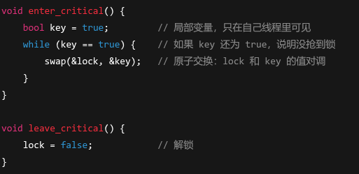
      - 互斥锁（mutex）
        - 进入临界区调用 acquire() 函数；退出临界区调用 release() 函数
        - 每个互斥锁的内部都有一个布尔变量，表示锁是否可获得
      - 信号量
        - 信号量只能被 2 个标准的原语访问
          - wait() 原语，P()，P 操作
          - signal() 原语，V(), V 操作
        - 整形信号量（表示资源的数量 S）
          - wait 和 signal 操作 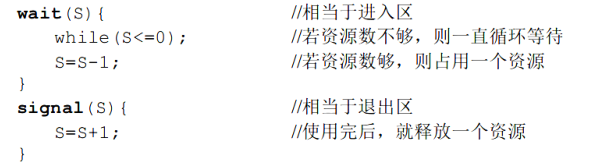
          - P 操作消耗一个资源，V 释放一个资源
        - 记录型信号量（表示资源的整形变量 value + 一个进程链表 L 存储所有等待该资源的进程） 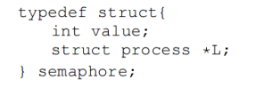
          - wait 操作 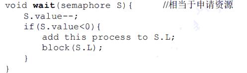
            - value = -i 表示有 i 个进程正在等待该资源
          - signal 操作 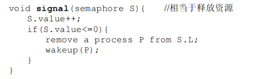
        - 用信号量实现互斥
          - 将资源的数量设置为 1
          - 将临界区用 P() 和 V() 包裹 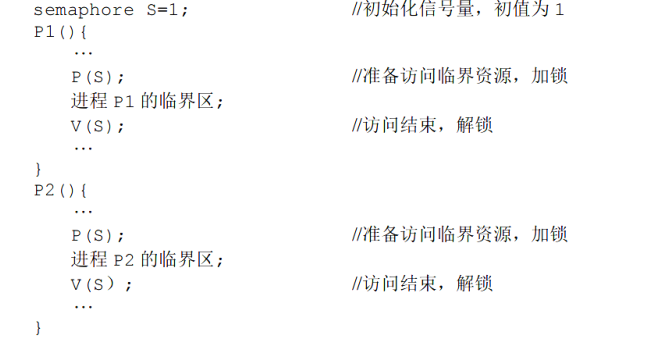
        - 用信号量实现同步
          - 为了调整进程之间的执行顺序，可以让一个进程增加资源的数量，另一个进程减少资源的数量，而资源的初始值为 0 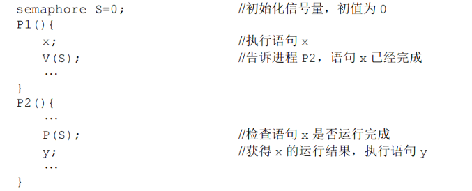
        - 用信号量实现前驱后续关系
          - 为每条边都设置一个信号量 Sij 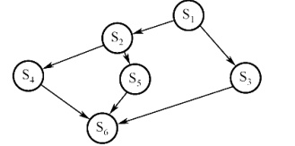
            - 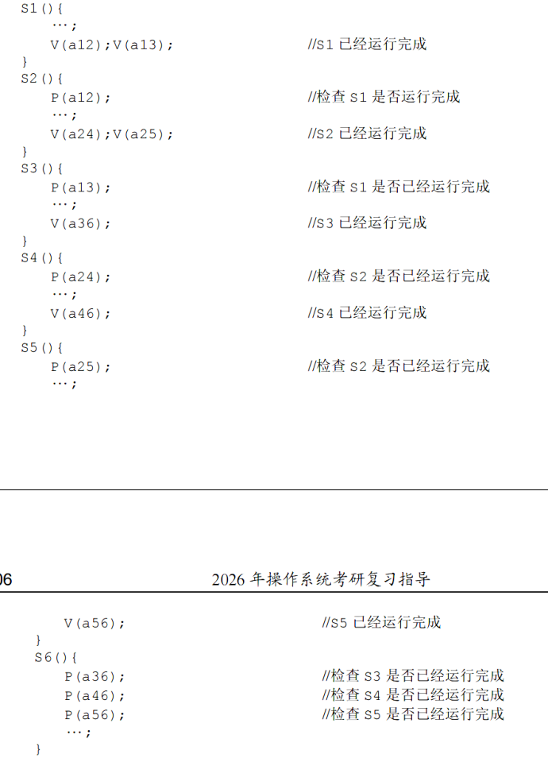
          - 当 i 执行完成时，执行 V(Sij) 操作，增加资源的数量，让后继节点 j 得以运行
          - 当 j 开始执行的时候，使用 P(Sij) 消耗资源
        - 经典同步问题（用信号量解决）
          - 生产者-消费者问题
            - 问题描述：生产者每次生产一个产品放入缓冲区，消费者每次从缓冲区消费一个产品。缓冲区大小为 n，且需要互斥访问。
            - 解决 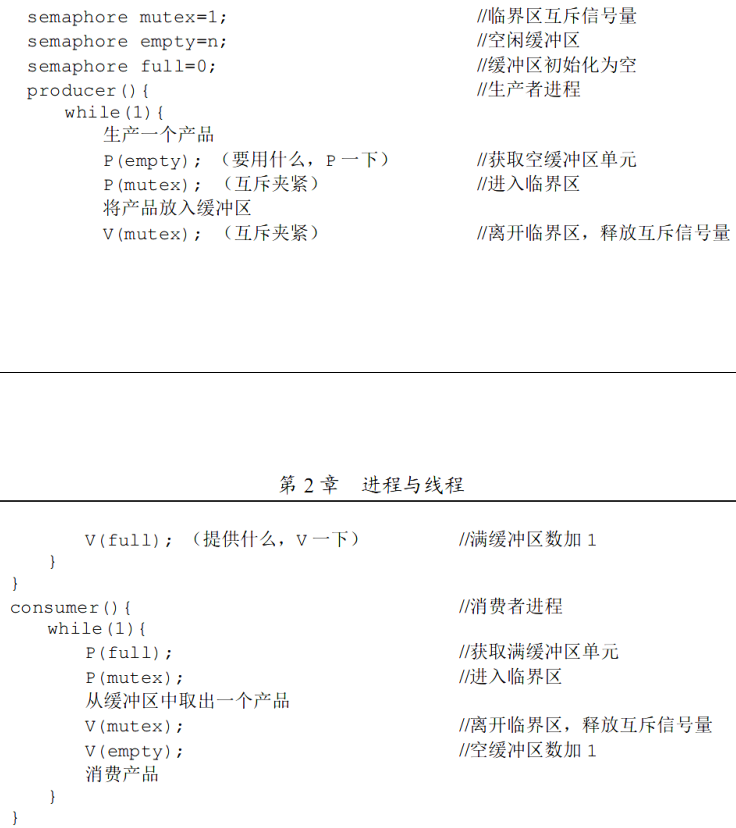
              - 1\. 设置 mutex 信号量，资源数量为 1
                - 用于互斥访问缓冲区
              - 2\. 设置 full 信号量，资源数量为 0
                - 表示当前有多少缓冲区是满的
              - 3\. 设置 empty 信号量，资源数量为 n
                - 表示当前有多少缓冲区是空的
          - 读者-写者问题
            - 问题描述：多个写者进程和多个读者进程共享同一个文件，该文件可以多个读者同时读，但是不能多个写者同时写
            - 问题分析：读者和写者互斥、写者与写者互斥
            - 解决（读者优先） 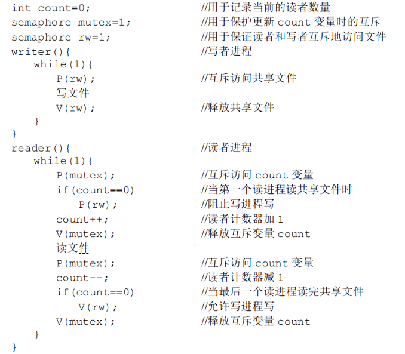
              - 1\. count 普通变量表示读者的数量
              - 2\. mutex 信号量用来保护 count 更新
              - 3\. rw 用于实现写者与其他所有进程的互斥访问，初始值为 1
              - 读者优先：当有读进程的时候，写操作被延迟。如果写操作后面又来了多个读进程，也不会执行写操作，而是执行后面来的读操作
            - 解决（写者优先/读写者公平） 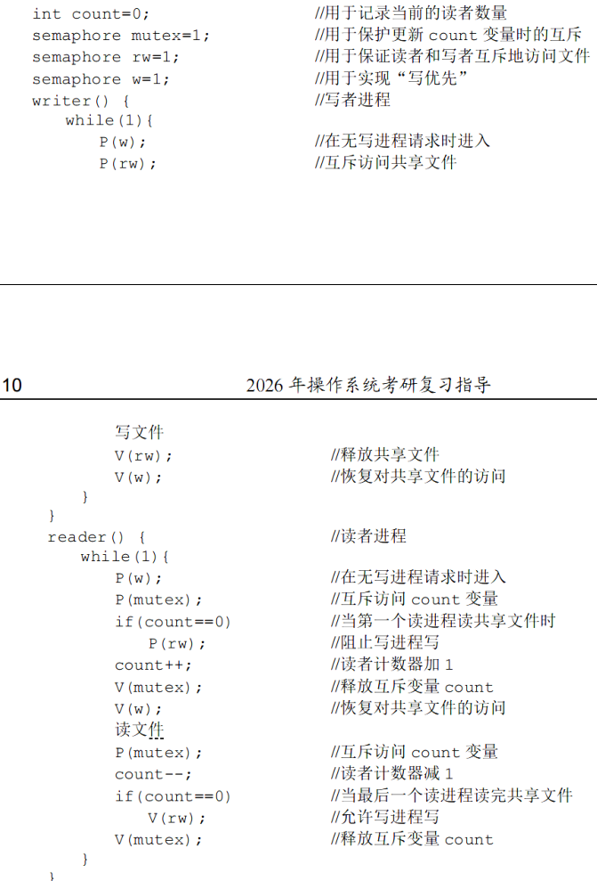
              - 所谓的读写者公平是指，即使在有读者进程的情况下，写者进程到达了，则不允许后面的读者进程在读了，等前面到达的读者进程读完之后，写者进程开始写
              - 这通过一个单独的信号量 w 来实现，以实现写者和它后面到达的读者进程之间的互斥访问
          - 哲学家进餐问题
            - 问题描述：5 名哲学家坐在圆桌上吃饭，每人之间有 1 根筷子。只有当哲学家同时拥有他的左边和右边的筷子时，他才能吃饭 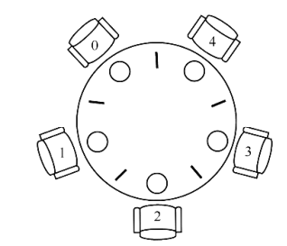
            - 解决
              - 1\. 设置信号量数组 chopstick[5] = { 1, 1, 1, 1, 1 }
              - 2\. 哲学家 i 左边的筷子为 chopstick[i]，哲学家右边的筷子为 chopstick[(i + 1) % 5]
              - 会导致死锁的解决方案 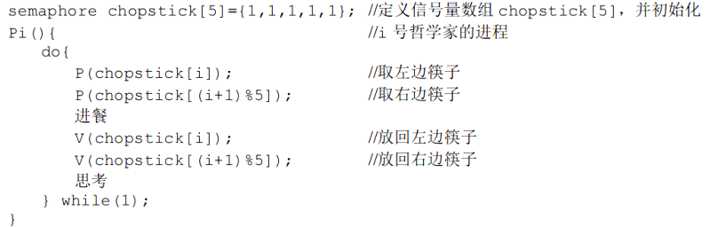
                - 当 5 名哲学家都同时想要进餐的时候，左边的筷子同时被拿光，导致右边的筷子都没有了，所以没有 1 个哲学家能够吃饭
              - 避免死锁的方法
                - 1\. 至多 4 名哲学家同时进餐
                  - 只有有 1 名哲学家能够进餐
                - 2\. 仅当一名哲学家的左右筷子都可用的时候，哲学家才拿起筷子 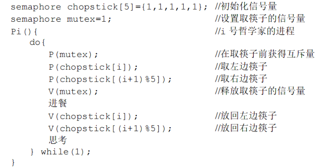
                - 3\. 奇数号哲学家先拿左边筷子，偶数号哲学家先拿右边筷子
      - 管程（一种思想）
        - 管程定义了一个数据结构和能被多个并发进程所执行的一组操作，这组操作能够同步进程和改变管程中的数据 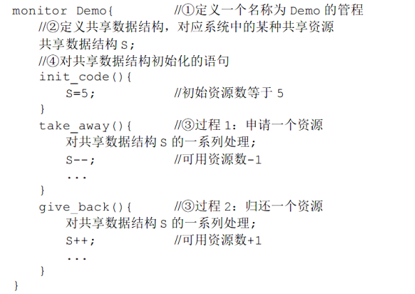
      - 条件变量
        - 用于在管程或临界区内让线程在某个条件不满足的时候等待，并在条件满足时被唤醒
        - 对条件变量可以调用 wait() 和 signal() 操作；条件变量内没有数据，条件变量只提供阻塞等待和唤醒功能
        - wait() 操作可以阻塞调用者，让其进入等待对列
        - signal() 操作可以唤醒一个因为该条件变量而阻塞的进程
  - 死锁
    - 死锁产生的必要条件
      - 1\. 互斥条件
        - 对于某资源的访问是互斥的
      - 2\. 不可剥夺条件（只能主动释放资源）
        - 进程所获得的资源在未使用完之前，不能被其他进程强行夺走
      - 3\. 请求并保持条件
        - 进程已经有了一个资源，但是由提出了新的资源请求，当得不到新的资源时，保持原有资源不释放
      - 4\. 循环等待条件
        - 存在进程资源循环等待链，链中每个进程已获得的资源同时被链中的下一个进程所请求 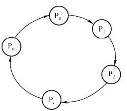
        - 这种环不一定构成死锁，但是还是可能有死锁，所以，死锁有环是必要条件 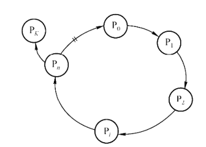
    - 死锁公式：若 m &gt; n(r - 1) 成立，则不会发生死锁
      - m 为临界资源的总数
      - n 为并发线程的个数
      - r 为进程所需临界资源的个数
    - 死锁的处理策略
      - 1\. 死锁预防
        - 破坏产生死锁的 4 个必要条件中的一个或几个
        - 1\. 破坏互斥条件
        - 2\. 破坏不可剥脱条件
          - 还是由进程主动释放临界资源的：若请求的新资源得不到满足，就主动释放已持有的临界资源
          - 可能会造成系统的性能下降
        - 3\. 破坏请求并保持条件
          - 进程在请求资源时，不能持有不可剥夺资源
          - 2 种实现方式
            - 1\. 预先静态分配法
              - 一次申请完进程所需的全部资源
            - 2\. 只获得运行初期所需的资源之后，开始运行，运行过程中，逐步释放资源，直到没有资源之后，才可以请求新的资源
        - 4\. 破坏循环等待条件（顺序资源分配法）
          - 系统给出各类资源的编号，规定每个进程都必须按资源编号递增的顺序请求资源，同类资源（编号相同的资源）一次性申请完
          - 已持有大编号资源的进程不能再逆向申请小编号资源
          - 缺点：编号必须保持稳定，不便于添加新类型设备；实际资源使用的顺序与定义的顺序不吻合
      - 2\. 避免死锁
        - 1\. 系统安全状态
          - 在资源分配的过程中，用某种方法防止系统进入不安全状态（资源分配后需要通过算法来判断是否进入不安全状态）
          - 系统安全状态
            - 指系统能够为按某种顺序的进程序列 P1, p2, p3, ... 分配其所需的资源，使其都可以完成（即使需要等待资源），这样的序列称为安全序列
            - 若系统无法找到一个安全序列，则称系统处于不安全状态
          - 例如 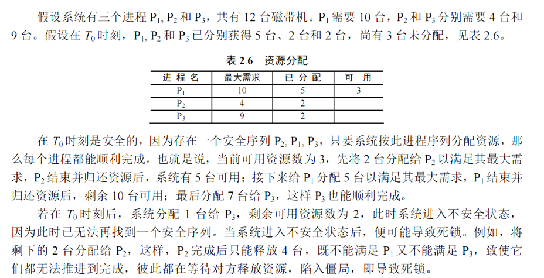
        - 2\. 银行家算法
          - 进程在运行之前先声明对各种资源的最大需求量
          - 进程运行中申请资源时，系统必须先确定是否有足够的资源分配给该进程
            - 进程向操作系统（银行家）贷款
          - 若有足够的资源分配后，进一步试探在将这些资源分配给进程之后，是否会使系统处于不安全状态；若不会，则将资源分配与进程，否则让进程等待
          - 数据结构描述
            - 1\. Avalilable[m] 表示有 m 种资源，元素项为该种资源的数量
            - 2\. Max[i][j] 表示第 i 个进程对 j 类资源的最大需求
            - 3\. Allocation[i][j] 表示当前系统第 i 个进程的 j 类资源的分配情况
            - 4\. Need[i][j] 表示第 i 个进程接下来还需要多少 j 类资源
              - Need 的值时刻都等于 Max - Allocation
          - 算法过程描述：假设 Request 为第 i 个进程对 j 类资源的请求数量
            - 1\. 若 Request &gt; Need[i][j]，则出错，因为其申请的数量超过了它声称的最大数量
            - 2\. 若 Request &gt; Available，则进程 i 需等待
            - 3\. 试探着将资源分配给进程 i,并修改数据结构
              - Available[j] -= Request
              - Allocation[i][j] += Request
              - Need[i][j] -= Request
            - 4\. 执行安全性算法，检查此次资源分配后，系统是否处于安全状态
              - 若安全，则正式分配资源
              - 若不安全，试探分配作废，数据结构恢复到原来值，并且让进程 i 等待
            - 安全性算法
              - 0\. Work[j] 表示第 j 类资源的剩余数量；初始化时，Work = Avaliable
              - 1\. 初始时安全序列为空
              - 2\. 找到一个 i 使得其符合 Need[i][j] &lt;= Work[j]（j = 1, 2, 3, ...） 且 i 不在安全序列中，然后加入 i 到安全序列中
                - 即进程 i 每类资源都能满足
                - 若找不到这样的 i，则执行步骤 4
              - 3\. Work[j] += Allocation[i][j], j = 1, 2, 3, ...., 然后重复执行步骤 2
                - 因为 i 加入了安全序列，即可以顺利完成，并释放它所持有的资源，释放之后，每类资源的总数是增加的
              - 4\. 若安全序列中有所有进程，则系统处于安全状态，否则，系统处于不安全状态
      - 3\. 死锁的检测及解除
        - 死锁检测
          - 资源分配图 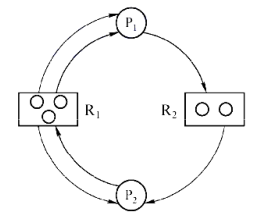
            - 资源分配图描述的是系统当前的资源请求与分配情况
            - 方框表示一种资源，方框内的圆圈表示一个该类资源（总数，总是固定不变）
            - 进程 -&gt; 资源的有向边称为请求边
              - 表示该进程请求 1 个该类资源
            - 资源 -&gt; 进程的有向边称为分配边
              - 一条分配边默认表示已有 1 个资源被分配给了该进程
          - 简化资源分配图以检测是否发生死锁
            - 1\. 找到既不孤立也不阻塞的进程 i
              - 不孤立：至少有一条有向边与其相连
              - 不阻塞：资源的申请数量小于或等于系统中已有的空闲资源数量
                - 空闲资源数量 = 资源总个数 - 资源的出度
            - 2\. 消去与 i 相连的所有有向边 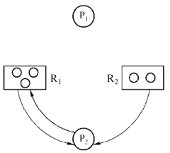
            - 3\. 跳转到第 1 步执行
            - 4\. 若可以消去图中的所有边，则称该图是可完全简化的
              - 发生死锁的充要条件是当前系统对应的资源分配图不可完全简化，此条件被称为死锁定理
        - 死锁解除
          - 1\. 资源剥夺法
            - 挂起部分死锁进程（化简后，资源分配图中还有边的那些进程），抢占其资源，并将这些资源分配给其他进程
          - 2\. 撤销进程法
            - 强制撤销部分死锁进程，并剥夺这些进程的资源
          - 3\. 进程回退法
            - 让一个或多个死锁进程回退到可以避免死锁的还原点位置（回退的过程中需要进程自愿释放资源）
            - 这需要系统能够保持进程历史信息，并设置还原点
- 内存管理
  - 基本概念
    - 程序的装入
      - 将程序装入内存运行
      - 3 种装入方式
        - 1\. 绝对装入
          - 编译阶段编译程序知道要将程序放到内存中的哪个地址，并且生成以该地址为起点的代码
          - 逻辑地址等于物理地址
        - 2\. 可重定位装入（静态重定位）
          - 要装入程序的地址一般从 0 开始，程序中使用的地址都是相对于起始地址而言的而逻辑地址
          - 在装入的时候对目标程序中的相对地址进行修改，此操作被成为重定位 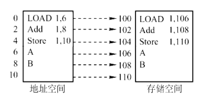
          - 当程序被装入内存后，就不能发生移动，而且要一次性分配所有要求的空间（程序也不能申请新的空间）
        - 3\. 动态运行时装入（动态重定位）
          - 程序使用相对地址，装入后相对地址没有改变
          - 使用一个重定位寄存器存放程序的真正起始地址（物理地址） 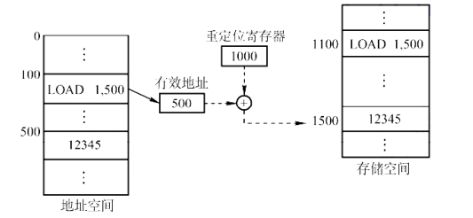
    - 程序的链接
      - 1\. 静态链接
        - 将多个目标和它们所需的库函数都链接成一个完成的程序
        - 需要完成的操作
          - 1\. 因为有多个目标，所以需要修改目标的相对地址，使其全部都以 1 个基准为相对地址
          - 2\. 变换外部调用符号的地址
      - 2\. 装入时动态链接
        - 在装入内存的时候，边装入边连接
      - 3\. 运行时动态链接
        - 当程序运行中需要某目标模块时，才对它链接
    - 进程的内存映像 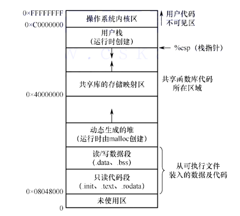
      - 代码段
        - 只读，可被多个进程共享
      - 数据段
      - PCB
        - 存放在内核区
      - 堆
      - 栈
    - 内存保护
      - 2 种方法
        - 1\. 设置上、下限寄存器
          - 存放用户进程在主存中的下限和上限地址
          - CPU 访问地址时，检查是否越界
        - 2\. 重定位寄存器（基地址寄存器）和界地址寄存器（限长寄存器）
          - 重定位寄存器存放进程的起始物理地址
          - 界地址寄存器存放的是进程的最大逻辑地址
          - MMU 将逻辑地址和界地址寄存器比较，如果小于等于，则加上基地址寄存器的内容再翻译成物理地址
    - 内存共享
      - 可重入代码（纯代码）
        - 允许多个进程同时访问但是不允许任何进程修改的代码
    - 内存分配
      - 内部碎片
        - 已分配的内存块中未被使用的部分
      - 外部碎片
        - 未分配的空闲内存中，存在许多不连续的小碎片，无法满足大内存需求
      - 连续分配
        - 指为用户分配一个连续的内存空间
        - 1\. 单一连续分配
          - 内存被划分为系统区和用户区
          - 系统区仅供 OS 使用，通常在低址部分
          - 用户区内只有 1 道应用程序，独占整个用户区
        - 2\. 固定分区分配
          - 将用户内存空间划分若干固定大小的分区，每个分区只装入一道作业
          - 分区的大小可以不相等，例如多个较小分区、适量的中等分区和少量大分区
          - 为了方便管理，建立一张分区使用表，按照分区大小排列 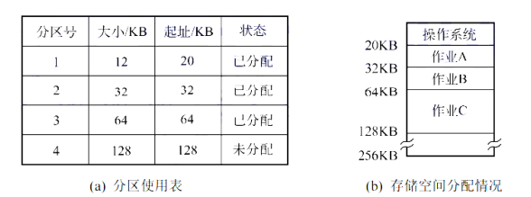
          - 可能存在内部碎片
        - 3\. 动态分区分配（可变分区分配）
          - 指在进程装入内存时，根据进程的实际需要，动态地为之分配内存，使得分区的大小正好适合进程的需要
            - 因此，系统中分区的大小和数量是可变的
          - 可能存在外部碎片
          - 为了方便管理，设置了一张空闲分区链表，按照起始地址排序
            - 回收时，可能需要将回收的分区和其前后空闲分区合并
          - 空闲分区的分配算法
            - 基于顺序查找的算法
              - 首次适应（First Fit）算法
                - 空闲分区按地址递增排序
                - 分配时，顺序找到第一个能满足大小的空闲分区
                - 会在低址区产生很多外部碎片
              - 邻近适应（Next Fit）算法
                - 分配内存时，从上次查找结束的位置开始继续查找。
                - 让低址和高址的空闲分区以同等的概率被分配
                - 会导致高地址部分也没有大内存可用，通常比首次适应算法更差
              - 最佳适应（Best Fit）算法
                - 空闲分区按容量递增排序
                - 分配时，顺序找到第一个能满足大小的空闲分区，即最小的空闲分区
                - 分配后，会得到很多很小的难以利用的内存块，产生很多外部碎片
              - 最坏适应（Worst Fit）算法
                - 空闲分区按容量递减排序
                - 分配时，顺序找到第一个能满足大小的空闲分区，即最大的空闲分区
                - 会导致没有大分区可用
            - 基于索引查找的分配算法
              - 根据大小对空闲分区分类，对每类空闲分区，单独使用一个空闲分区链表来管理，对于每类分区使用索引表来管理
              - 1\. 快速适应算法
                - 1\. 根据进程的长度，在索引表中找到能容纳它的最小空闲分区链表
                - 2\. 从链表中取下第一块进行分配
                - 分配时查找效率高，但是回收时，需要有效地合并分区，较为复杂
              - 2\. 伙伴系统
                - 所有分区的大小都是 2 幂
                - 若要分配的大小为 n,有 2^(i - 1) &lt; n &lt;= 2^i
                  - 1\. 在大小为 2^i 的空闲分区链中查找，若找到，则分配给该进程
                  - 2\. 若找不到，说明大小为 2^i 的空闲分区已被用完，则到 2^(i + 1) 的空闲分区链中去查找
                    - 若存在空闲分区，则将其等分为 2 个分区。这 2 个分区被称为伙伴
                    - 伙伴中的其中一个用于分配，另一个将其插入 2^i 的空闲分区链中
                    - 若还是不存在空闲分区，则继续往后查找
              - 3\. 哈希算法
                - 构建一张以空闲分区大小为关键字的哈希表，每个表项记录这一个对应空闲分区链的头指针
                - 分配时，根据所需分区的大小，得到对应的空闲链表
    - 基本分页存储管理
      - 将内存空间分为若干固定大小的分区，称为页框、页帧或物理块
        - 对其编号称为页框号/物理块号，从 0 开始
      - 进程的虚拟地址空间被划分为与页帧大小相等的若干区域，称为页/页面
        - 对其编号称为页号，从 0 开始
        - 页面的大小应是 2 的幂，且大小应该适中
        - 操作系统以页为单位为各个进程分配内存空间
      - 虚拟地址结构 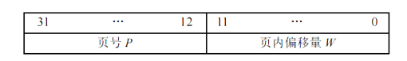
      - 页表（页面映射表）
        - 页表项由页号和页框号组成
        - 每个进程都有自己独立的页表
      - 单级地址转换
        - 页表寄存器（PTR）用于存放进程对应的页表在内存的起始地址和页表的长度
          - 进程切换时，需要将 PTR 存放进 PCB 中
        - 变换过程
          - 1\. 从虚拟地址中计算出页号和页内偏移量
          - 2\. 判断页号是否越界（页号 &gt;= 页表长度），若越界，则产生越界中断
          - 3\. 在页表中查询页号所对应的页表项，确定页面存放的物理块号
            - 页表项的地址 = 页表起始地址 + 页号 * 页表项长度
          - 4\. 计算物理地址 = 物理块号 * 页面大小 + 页内偏移
        - 使用 TLB（快表/相联存储器）来缓存当前访问的若干页表项，以加速地址转换过程
          - 主存中的页表被称为慢表
      - 由于页表要求具有连续的存储空间，而如果进程的页表很多，会导致需要很大的连续空间，所以，使用多级页表
        - 多级页表除了降低了页表所需要的连续空间外（需要的总空间大小不变），还可以实现按需加载页面和按需加载页表
        - 在多级页表中，每个页表（无论是页目录表还是真正的页表）的大小一般为 1 页的大小
          - 这在真题中是隐含条件
        - 两级页表
          - 将页表拆分为页目录（外层页表）和多个页表
            - 一个页目录和拆分后的多个页表的每个页表内的地址是连续的，但是页目录和页表之间，多个页表之间的地址不连续 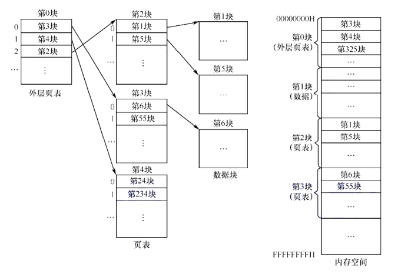
            - 例如将 2^20 大小的页表拆分为 2^10 个页目录项的表和 2^10 个页表项的页表 
          - 为了实现地址转换，还需要设置页目录基址寄存器（外层页表寄存器）
          - 页目录的表项的内容为页表的页号 
    - 基本分段存储管理
      - 分段
        - 将用户进程的逻辑地址空间划分为大小不相等的段，每段从 0 开始编址，段内的地址连续，段间的地址不连续
      - 虚拟地址的格式 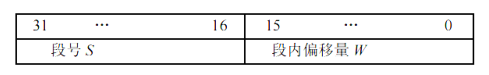
        - 段号和段内偏移由用户显式提供（通常由编译器完成）
      - 段表
        - 每个进程都有一个专属于自己的段表
        - 段表项 
          - 段表项连续存放
          - 段表项按顺序存放，因此，可以省去段号所需的空间
        - 段表实现虚拟地址到物理地址的转换 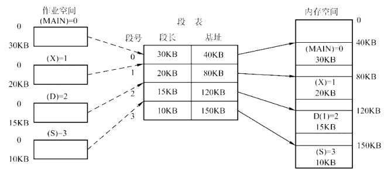
          - 在系统中设置一个段表寄存器，用于存放段表的起始地址和段表的长度
          - 地址转换过程 
      - 段的共享
        - 系统中维护一个共享段表，所有共享的段都在共享段表中占一个表项
        - 表项中记录了共享段的段号、段长、内存起始地址、状态位、共享进程计数 count 等
          - 共享计数 count 表示有多少进程正在共享该段
          - 当 count = 0 的时候，回收该段所占的内存区
        - 段的共享实现比页表的实现更简单：如果用页表实现共享，则每个进程都需要创建自己的页表来指向被共享的页框（物理页）
    - 段页式管理
      - 进程的地址空间被分成若干逻辑段；每个逻辑段再分成若干大小固定的页 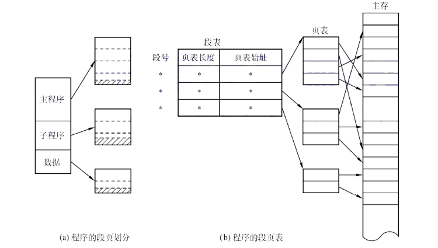
        - 段号是隐含的
      - 虚拟地址结构 
  - 虚拟内存管理
    - 虚拟存储器的 3 个特征
      - 1\. 多次性
        - 在作业运行时，不将整个作业一次性调入内存，而是分成多次
        - 只调入当前程序需要的那部分代码和数据
      - 2\. 对换性
        - 作业运行时，将那些暂时不用的程序和数据从内存调入外存的对换区
      - 3\. 虚拟性
        - 逻辑上扩充了内存的容量
    - 虚拟存储器的实现方式
      - 请求分页方式
        - 页表项的格式 
          - 状态位
            - 标记该页是否已调入内存
          - 访问字段
            - 用于实现置换算法
          - 修改位
            - 表示该页是否发生过修改
          - 外存地址
            - 该页在外存的物理地址，通常是物理块号
        - 缺页中断
          - 当访问的页面不在内存时触发
          - 是内部异常，一条指令在执行期间，可能产生多次缺页异常
        - 地址变换过程 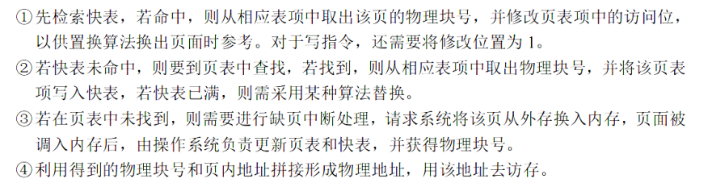
        - 页框的分配
          - 驻留集
            - 指给一个进程分配的页框的集合
            - 驻留集的大小要适中：太大导致内存内进程的数量太小；太小导致太多的缺页异常
          - 页框分配策略
            - 固定分配局部置换
              - 为每个进程分配固定数量的页框，在程序运行期间都不改变
              - 局部置换：若进程在运行中发生缺页，则只能从分配给该进程的内存的页面中选出一页换出，再调入。保证了分配给该进程的内存空间不会变
            - 可变分配全局置换
              - 先为进程分配一定数量的页框，在运行期间可进行调整
              - 全局置换：若进程发生缺页，则从空闲的页框中选一块将其分配给该进程
            - 可变分配局部置换
              - 当进程发生缺页时，先从其页框中选一个换出，再调入
              - 如果频繁发生缺页，则增加该进程的页框数量
          - 调入时页框分配算法
            - 平均分配算法
              - 将系统中的空闲页框平均分配给各个进程
            - 按比例分配算法
              - 根据进程的大小按比例分配页框
            - 优先权分配算法
              - 为重要和紧迫的进程分配较多的页框
            - 通常采取的方法是将所有可分配的页框分为 2 部分：一部分按比例分配给各个进程，一部分根据优先权分配
          - 调入页面的时机
            - 预调页策略
              - 根据局部性原理，预先调入一些页
              - 一般是在运行前调入的时候才使用此策略
            - 请求调页策略
          - 从何处调入页面
            - 对换区因为空间连续，所以，IO 速度比文件区更快
            - 1\. 系统拥有足够的对换区空间时
              - 进程运行前，先将该进程有关的文件复制到对换区
              - 全部从对换区调入所需页面，提高调页速度
            - 2\. 系统缺少足够的对换区空间时
              - 凡是不会被修改的文件都直接从文件区调入
              - 对于可修改的部分，换出时必须必须换出到对换区中
            - 3\. UNIX 方式
              - 与进程有关的文件都放在文件区
              - 运行过但被换出的页面放到对换区
        - 页面置换算法
          - 最佳（OPT）置换算法
            - 换出的页面是以后永不使用的页面，或者在最长时间内不再被访问的页面
            - 无法被实现，因为无法预测哪个页面是最长时间内不再被访问的
              - 用于评价其他算法
            - 保证获得最低的缺页率
          - 先进先出（FIFO）置换算法
            - 换出的页面是最早进入内存的页面
            - 没有运用局部性原理，性能较差
            - 当为进程分配的页框增多，反而会导致缺页次数不减反增的现象，这种现象被称为 Belady 异常
              - 当页框为 3 的时候，缺页次数为 9；页框为 4 时，缺页次数为 10 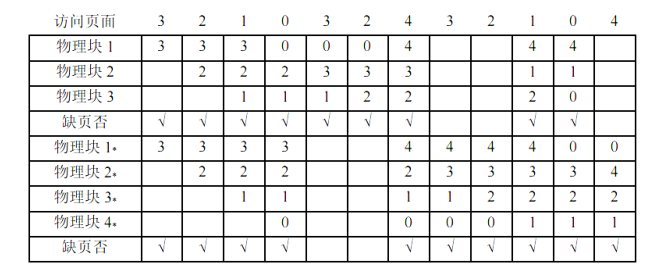
              - 只有 FIFO 算法会出现 Belady 异常
          - 最近最久未使用（LRU）置换算法
            - 换出最近最长时间没有使用的页面
            - 为每个页面设置一个访问字段，用来记录页面自上次被访问以来所经历的时间
              - 淘汰页面时，选择现有页面中值最大的页面
            - 最接近 OPT 算法，但是实现起来开销大
            - 例如 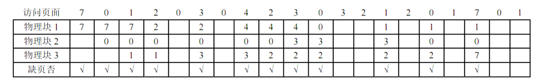
          - 时钟（CLOCK）置换算法
            - 简单 CLOCK 置换算法（最近未用 NRU 算法）
              - 将所有页面组成一个循环对列
              - 每个页面有 1 位表示其近期是否被访问过
                - 第一次被调入时或者被访问后，置为 1
              - 有一个淘汰指针指向循环对列的某个位置
              - 当要淘汰一个页面时，检查淘汰指针对应的位置是否访问位为 1
                - 若为 1, 则置为 0，给予一次驻留内存的机会，同时淘汰指针指向循环对列中的下一个页面
                - 若为 0，则淘汰该页面
            - 改进型 CLOCK 置换算法
              - 在选择淘汰页面的时候，优先考虑既未使用过也未修改过的页面
                - 这是为了减少 IO 次数
              - 按访问位 A 和修改位 M 形成的 4 种类型的页面（按淘汰优先级排序） 
              - 算法过程
                - 1\. 第一遍扫描：寻找第一类页面（A = 0, M = 0），并且不修改访问位 A
                  - 若找到，直接将该页作为淘汰页，算法退出
                - 2\. 第二遍扫描：寻找第二类页面（A = 0, M = 1），并且将所有扫描或的页面的访问位都置为 0
                  - 将遇到的第一个第二类页面作为淘汰页
                - 3\. 从第 1 步开始，重新开始扫描。因为在第 2 步中将所有页面的访问位都置为了 0,所以再次扫描一定能找得到要淘汰的页面
          - 抖动
            - 指刚刚换出的页面马上又要换入内存，刚刚换入的页面马上又要换出内存
            - 根本原因是给进程分配的页框太少
          - 工作集
            - 指某段时间间隔内，进程要访问的页面集合
            - 通常情况下，工作集 W 可由时间 t 和工作集窗口尺寸 delta 来确定 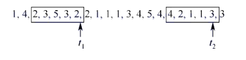
            - 驻留集的大小不能小于工作集的大小，否则就会发生抖动
        - 页框回收
          - 页面缓冲算法
            - 保存已修改且需要被换出的页面，被换出的页面数量达到一定值时，在一起换出到磁盘，以减少页面换出的开销
            - 为此，设置了 2 个链表：空闲页面链表和修改页面链表
              - 当一个未被修改过的页面要换出时，实际不需要将其换出，而是将其直接插入到空闲链表中
              - 一个修改过的页面要换出时，不立即将其换出到磁盘，而是将其插入到修改页面链表
          - 页框回收
            - linux 中，有一个负责页面换出的守护进程 kswapd,定期检查内存的使用情况
            - 当空闲页框数量少于特定的阈值时，发起页框回收操作
              - 之所以不是等空页框没有了才进行回收操作，是因为回收一个页面也需要一个空页面来充当 IO 缓冲区，如果没有了才回收，会导致无法换出页面
        - 内存映射文件
          - 通过系统调用，在磁盘文件与进程的虚拟地址之间建立映射关系，将文件映射到虚拟地址空间的某个区域
          - 很多时候，共享内存通过多个进程映射同一个文件来实现：虽然虚拟地址不同，但是页框是相同的 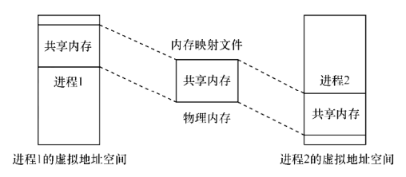
        - 地址翻译
- 文件管理
  - 文件相关基础
    - 文件的属性
      - 1\. 名称
      - 2\. 类型
        - 按性质和用途分：系统文件、用户文件、库文件
        - 按数据的形式分：源文件、目标文件、可执行文件
        - 按存取控制属性：可执行文件、只读文件、读/写文件
        - 按组织形式和处理方式：普通文件、目录文件、特殊文件
      - 3\. 创建者
      - 4\. 所有者
      - 5\. 位置
      - 6\. 大小
      - 7\. 保护
      - 8\. 创建时间、最后一次修改时间、最后一次存取时间
    - 文件控制块 FCB 
      - 每一个文件/目录对应一个 FCB（目录也视为一种文件）
      - FCB 必须连续存放
    - 索引节点（inode）
      - inode 约等于 FCB
      - 在检索文件的时候，只需要文件的名称，不需要其它信息。为了减少检索文件时，需要调入内存的来检索的大小，将其他信息封装成一个索引节点（inode）的数据结构；而每个目录项仅由文件名 + 索引节点编号组成
        - 这样，检索文件的时候，就只需要调入目录的所有目录项，通过文件名来查找对应的文件
      - 索引节点（inode）
        - 磁盘索引节点
          - 文件标识符
            - 拥有该文件的用户/用户组
          - 文件类型
          - 文件存取权限
          - 文件物理地址
            - 有 13 个地址项，直接或间接地给出数据文件所在磁盘块的标号
          - 文件长度
          - 文件链接计数
            - 指向该文件的文件名的指针计数
          - 文件存取时间
            - 最近被存取、修改的时间以及 inode 最近被修改的时间
        - 内存索引节点（调入内存的磁盘索引节点，在磁盘索引节点上增加了一些属性）
          - 索引节点号
            - 用于标识该内存索引节点
          - 状态
            - inode 是否被修改或者上锁
          - 访问计数
            - 每有一个进程访问该 inode,则加一，访问结束时减一
          - 逻辑设备号
            - 文件所属文件系统的逻辑设备号
          - 链接指针
            - 分别指向空闲链表和散列对列的指针
    - 文件的相关操作
      - 文件的打开
        - 打开是指：系统检索到指定文件的目录项（dentry）并找到对应的 inode 后，会创建一个文件对象（struct file），将其指针记录到当前进程的文件描述符表中，然后把该表项的索引（文件描述符）返回给用户。
          - 检索完成之后，就不再需要文件名了，对文件的所有操作都通过文件描述符完成
        - 在多个进程可以同时打开文件的 OS 中，通常采用 2 级表：系统表和进程表（每个进程都有一个）
          - 系统表
            - 包含了文件在磁盘上的位置、访问日期和文件大小
            - 为每个文件关联了一个打开计数器（Open Count），用于记录有多少进程打开了该文件
          - 进程表
            - 保存文件的读/写指针、文件访问权限、指向系统表对应表项的指针等
          - 系统表中的表项和进程表中的表项共同构成了一个文件的完整信息 
    - 文件的逻辑结构（数据在逻辑上如何组织）
      - 无结构文件
        - 由字符流构成的文件，也称流式文件
        - 通过读/写指针指出下一个要访问的字节
        - 普通的文件就是流式文件
      - 有结构文件
        - 由一个以上的记录组成
          - 各记录由相同或不同的数量的数据项组成
        - 按各记录的长度分
          - 定长记录
            - 所有记录的长度相同
            - 各数据项在记录中的相同位置，具有相同的长度
            - 检索记录的速度快
          - 变长记录
            - 各记录的长度不一定相同
            - 检索时只能顺序查找
        - 按记录的组织形式分
          - 顺序文件
            - 文件中的记录（可定长或变长）一个接一个地顺序排列
            - 串结构：各记录之间的顺序与关键字无关，通常按存入的先后时间顺序排列
            - 顺序结构：所有记录按关键字顺序排列。检索时对于定长记录可以使用折半查找
          - 索引文件（为变长记录的顺序文件建立的索引结构文件） 
            - 为变长记录的顺序文件每一个记录在索引文件中创建一个索引表项，包含了指向记录的指针和记录的长度
            - 索引表的的表项按关键字排序
          - 索引顺序文件
            - 按某种方法将变长的记录分为若干组，为每个组建立一张索引表，其中，每组的关键字为每组中的一个记录的关键字，按照每组的关键字进行排序，形成索引表 
          - 直接文件/散列文件
            - 直接文件：给定记录的键值直接决定了记录的物理地址
            - 散列文件：记录的物理地址与哈希函数处理过后的键值有关
    - 文件的物理结构
      - 文件的分配方式：对磁盘非空闲块的管理——文件的物理组织方式
        - 块的大小与内存的页面的大小相等
        - 1\. 连续分配 
          - 每个文件在磁盘上占有一组连续的块
          - 优点：顺序 IO 块
          - 缺点
            - 1\. 要为文件分配连续的存储空间，会产生很多的外部碎片
            - 2\. 文件的长度可以预先知道，且无法增长
        - 2\. 链接分配
          - 隐式链接 
            - 目录项包含了文件的第一块和最后一块的指针
            - 除了最后一个磁盘块外，每个磁盘块都存有指向下一个磁盘块的指针
            - 缺点
              - 1\. 只支持顺序访问（只能从第 1 块开始访问）
              - 2\. 任何一个磁盘块出现问题，都会导致文件数据丢失
              - 3\. 还需要有存储指针的额外空间
            - 改进方法
              - 将几个磁盘块合成一个簇，按簇来进行分配
              - 但是增加了内部碎片
          - 显式链接
            - 整个文件系统中仅设置一张文件分配表（File Allocation Table, FAT）
              - 表项中存放着构成一个完整文件的下一个磁盘块指针（使用 -1 表示这是最后一个块，使用 -2 表示该块空闲）
              - 目录项中仅有文件的第一个块的块号 
                - 后续所有块通过 FAT 表查询得知
            - FAT 一般在系统启动时加载到内存，可以减少磁盘 IO 次数
        - 3\. 索引分配
          - 单极索引分配
            - 为每个文件的分配一个索引块（索引表），将分配给该文件的所有磁盘块号都记录在该索引块中 
          - 多级索引分配（类似多级页表）
            - 
            - 对于小文件来说，多级索引过于冗余，导致性能降低
          - 混合索引分配方式
            - 对于小文件
              - 将每个磁盘块的地址放入 FCB 中，访问时直接从 FCB 中获得盘块地址（直接寻址）
            - 对于中性文件，采用单级索引分配
              - FCB 中存放了索引表的地址（一次间址）
            - 对于大型文件
              - 采用 2 级或 3 级索引分配
            - 例如，UNIX 中 inode 中使用 13 个地址项，一部分用于直接寻址，一部分用于一次间址，..... 
      - 文件存储空间管理：对磁盘空闲块的管理
    - 文件保护
      - 可加以控制的访问类型
        - 读
        - 写
        - 执行
        - 添加：将新信息添加到文件结尾部分
        - 删除：删除文件
        - 列表清单：列出文件名和文件属性
      - 访问控制
        - 访问控制列表（Access-Control List, ACL)
          - 用于规定每个用户名及其所允许的访问类型
          - 优点：可以完成复杂的访问方法
          - 缺点：用户长度及其可访问类型的长度无法预测，会带来复杂的空间管理
        - ACL 的精简访问列表
          - 3 种用户类型
            - 拥有者
            - 组
            - 其他
              - 系统内的其他用户
  - 目录
    - FCB 的有序集合被称为目录
    - 目录结构
      - 单极目录结构 
        - 整个文件系统中，只建立一张目录表，每个文件占一个目录项
        - 创建新文件时，需遍历所有目录项，以确保没有重名情况
      - 二级目录结构 
        - 将文件目录分为 2 级
          - 主文件目录（MFD）
            - 记录用户名及相应用户文件目录所在的存储位置
          - 用户文件目录（UFD）
            - 记录该用户的所有文件的 FCB
      - 树形目录结构 
        - 当一个进程在运行时，其所访问的文件大多局限于某个范围，且当层次较多时，每次从根目录查询都会浪费时间。因此，设置工作目录（当前目录），进程对各文件的访问都只需要相对于当前目录进行
        - 树形目录结构便于实现文件的分类
      - 无环图目录结构 
        - 树形结构不便于实现文件的共享
        - 同一个文件或子目录可以出现在两个或多个目录中。为此，可以为每个共享节点设置一个共享计数器
    - 文件共享
      - 使多个用户共享同一个文件，且该文件系统中只有一份
      - 硬链接
        - 基于索引节点 inode 的共享方式
        - 目录项的结构为文件名 + inode 指针，多个目录项指向同一个 inode，以此实现共享 
          - 同时，为 inode 设置链接计数（引用计数）
      - 符号链接（软链接）
        - 新创建一个 LINK 类型的文件（有真实的 inode），其中记录了被共享的文件的绝对路径 
  - 文件系统
    - 文件系统的层次结构 
      - IO 控制层
        - 包括设备驱动程序和中断处理程序
        - 在内存和外存之间传输信息
      - 基本文件系统
        - 向对应的设备驱动程序发送通用命令，以读取/写入磁盘块
        - 也管理缓冲区：保存各种文件系统、目录和数据块的缓存
        - 进行块传输之前，分配合适的缓冲区
      - 文件组织模块
        - 将文件的逻辑块地址转换为物理块地址
        - 文件的逻辑块从 0 到 N 编号
        - 还包括空闲空间管理器
      - 逻辑文件系统
        - 用于管理文件系统中的元数据信息
        - 元数据包括文件系统中的所有结构，但是不包括实际数据
        - 管理目录结构、通过文件控制块来维护文件结构
        - 负责文件保护
    - 文件系统的空间布局
      - 在磁盘中的布局 
        - 主引导记录（MBR）
          - 位于磁盘的 0 号扇区，用来引导计算机
          - 其后是分区表，给出每个分区的起始和结束地址
          - 分区中有活动分区，活动分区存放着引导代码
          - 活动分区的第一个快被称为引导块
        - 引导块
          - 引导块中代码负责启动该分区中的操作系统
        - 超级块
          - 包含文件系统的所有关键信息
          - 在计算机启动时，或文件系统首次使用时，会将超级块读入内存
          - 包含分区的块的数量、块的大小、空闲块的数量和指针、空闲 FCB 数量和 FCB 指针等
        - 文件系统中空闲块的信息
          - 可用位示图或指针链接的形式给出
      - 在内存中的布局 
    - 存储空间管理
      - 文件系统的分区通常称为卷（volume）
        - 卷可以是磁盘的一部分，也可以是多个磁盘组成的 RAID 集合
      - 卷中，存放文件的空间和 FCB 的空间是分离的，分别为文件区和目录区 
      - 空间管理
        - 空闲表法
          - 为文件分配的是连续的存储空间
          - 空闲块通过空闲表管理，每一个空闲区对应一个表项 
            - 空闲块的分配与回收和内存的连续分配算法类似
        - 空闲盘块链
          - 将所有空闲的磁盘块链接成一条链
        - 空闲盘区链
          - 将磁盘上的所有空闲盘区组织成一条链
        - 位示图法
          - 利用二进制的一位来表示磁盘中一个块是否已被分配 
            - 一个 mxn 位组成的位示图表示 mxn 个快的使用情况
        - 成组链接法
          - 将空闲盘块分成若干组，每组的第一个盘块记录下一组空闲的空闲盘块数和空闲盘块号 
            - 阴影部分为空闲块数量
          - 第一组的空闲盘块总数和空闲盘块号保存在内存的专用栈中，称为空闲盘块号栈
    - 虚拟文件系统（VFS）
      - 屏蔽了不同文件系统的差异和操作细节，为用户提供了文件操作的统一调用接口
      - VFS 使用接口规范了通用文件系统的提供的接口
        - 超级块接口
          - 超级块接口对应于磁盘上特定扇区内的文件系统超级块，用于存储已安装文件系统的元信息
          - 此接口对应的操作函数：分配 inode、销毁 inode、读/写 inode 等
        - 索引节点接口
          - 对应一个特定的文件
          - 包括创建新的 inode、创建硬链接、创建新目录等
        - 目录项接口
          - 对应一个特定的目录项，一个目录项是一个路径的组成部分
          - 目录项没有在磁盘上占据空间，而是在 VFS 遍历的过程中，将它们逐个解析成目录项
        - 文件接口
          - 对应一个进程相关的已打开的文件 
    - 挂载
      - 文件系统在使用之前必须先挂载/安装
      - 将一个设备中的文件系统挂载到某个目录后，就可通过这个目录来访问设备上的文件
        - 磁盘上的每个分区可以看作不同的设备
- IO 管理
  - IO 设备分类
    - 块设备
      - 信息交换以数据块为单位
    - 字符设备
      - 数据交换以字符为单位
      - 传输速率慢，不可寻址
      - 通常采用 IO 中断的方式
  - IO 控制方式
    - 程序查询方式、IO 中断方式、DMA 方式
    - 通道控制方式
      - IO 通道是一种特殊的处理机，可执行一系列通道指令
      - CPU 只需向通道发送一条 IO 指令，指明通道程序在内存中的位置和要访问的 IO 设备。通道收到命令后，执行通道程序，完成 IO 任务后，向 CPU 发出中断请求
      - 可实现 CPU、通道和 IO 设备的三者并行工作
      - 通道 vs DMA：DMA 需要 CPU 控制传输的数据块大小，内存位置，而这些信息在通道方式中都是由通道控制的。而且，通道可以控制多台设备与内存的数据交换
  - IO 软件层次结构 
    - 用户层软件
      - 用户可直接调用（IO 系统调用）
    - 设备独立性软件
      - 设备独立性
        - 含义是应用程序所用的设备不局限于某个具体的物理设备
        - 为实现设备独立性，引入了逻辑设备和物理设备概念
          - 在应用程序中，使用逻辑设备来请求使用某类设备，系统在执行时，将其操作映射到物理设备中
      - 提供用户程序与设备驱动的统一接口、设备命名、设备保护、设备的分配与释放等
    - 设备驱动程序
      - 与硬件直接相关，每类设备都需要配备一个设备驱动程序
      - 负责具体实现系统对设备发出的操作指令
    - 中断处理程序
  - 设备独立性软件
    - 磁盘缓冲（在主存中缓冲磁盘上的块）
      - 单缓冲
        - 每当用户发出一个 IO 请求，操作系统便在内存中为之分配一个缓冲区 
        - 单缓冲区域由 CPU 和设备互斥共享（同时，也必须等待缓冲区装满才能使用）
      - 双缓冲（缓冲对换）
        - 设备输入数据时，先送入缓冲区 1，装满后再装入缓冲区 2 
        - 装入缓冲区 2 的过程中，OS 可以读取缓冲区 1
      - 循环缓冲（多缓冲）
        - 将多个大小相等的缓冲区通过指针形成一个循环对列 
        - 循环缓冲区还需设置 in out 两个指针，分别表示可以输入数据的空缓冲区和第一个可以读取数据的满缓冲区
      - 缓冲池
        - 缓冲池可供多个进程共享
        - 缓冲池类似于一块内存，有自己的管理程序用来管理多个缓冲区
        - 3 种对列
          - 空缓冲队列：空缓冲区链接而成的对列
          - 输入队列：装满输入数据的缓冲区链接而成
          - 输出队列：装满输出数据的缓冲区链接而成的而对列
        - 具有 4 种工作方式 
          - 收容输入（hin）：输入进程需要输入数据时，从空缓冲对列中取一个空缓冲区，作为收容输入的工作缓冲区，装满后，插入输入对列的末尾
          - 提取输入（sin）：进程从输入队列取一个缓冲区，从中提取数据，用完后插入空闲队列
          - 收容输出（hout）
          - 提取输出（sout）
    - 设备分配与回收
      - 目的：使设备尽可能忙碌，但又不至于发生死锁
      - 数据结构
        - 设备控制表（DCT）
          - 为每个设备配置一张 DCT 
            - 设备类型
              - 打印机、扫描仪、键盘
            - 设备标识符
              - 即设备的名称
              - 设备名是唯一的
            - 设备状态
            - 指向控制器表的指针
              - 每个设备由一个控制器控制，该指针指向对应的控制器表
            - 重复执行次数或时间
              - 重复执行次数达到阈值后，认为此次 IO 失败
            - 设备对列的对首指针
              - 指向正在等待该设备的进程对列（PCB 对列）
        - 控制器控制表（COCT） 
          - 每个设备控制器对应一张 COCT
          - 每个控制器由一个通道控制
        - 通道控制表（CHCT） 
          - 每个通道对应一张 CHCT
        - 系统设备表（SDT） 
          - 整个 OS 只有一张 SDT
          - 记录已连接到系统中的所有物理设备情况，每个物理设备对应一个表项
      - 设备分配的过程 
        - 需要设备、控制器和通道都分配成功，设备分配才算成功
      - 逻辑设备名到物理设备名的映射（Logical Unit Table, LUT）
        - LUT 的表项内容包括：逻辑设备名、物理设备名、设备驱动程序的入口地址
  - SPOOLing 技术（假脱机技术）
    - OS 通过此技术将独占设备改造为共享设备
    - SPOOLing 系统的组成 
      - 输入井
        - 磁盘上的一个区域，用来暂存从外设（如读卡机）输入的数据
      - 输出井
        - 磁盘上的一个区域，用来暂存要输出到外设（如打印机）的数据
      - 输入缓冲区
        - 主存上的一个区域，用于暂存从输入设备送来的数据
      - 输出缓冲区
        - 用于暂存从输出井运来的数据
      - 输入进程
        - 模拟外设的控制器，将用户要求的数据从输入设备传送到输入缓冲区，再存放到输入井中
        - 当 CPU 需要输入数据时，直接从输入井中读入内存
      - 输出进程
        - 模拟外设的控制器，将用户输出的数据从内存传送到输出井，等到输出设备空闲时，将输出井中的数据经输出缓冲区输出至输出设备
  - 设备驱动程序
    - 设备驱动程序的功能
      - 1\. 接受来自上层软件发来的命令和参数，将其转换为具体的与设备有关的命令
      - 2\. 检查用户 IO 请求的合法性，知道设备操作有关的参数和工作方式等
      - 3\. 发出 IO 命令，若设备空闲，则立即启动设备；若设备忙，则将请求进程阻塞到设备队列上等待
      - 4\. 及时响应由设备控制器发来的中断请求
    - 设备驱动程序应允许同时多次调用
  - 磁盘的管理
    - 磁盘初始化（低级格式化/物理格式化）
      - 在磁盘可以存储数据之前，必须将它分为扇区，以便磁盘控制器能够进行读/写操作
      - 每个扇区通常由头部、数据区域和尾部组成
        - 头部和尾部包含了磁盘控制器使用的信息：使用磁道号、磁头号、扇区号来标识一个扇区。CRC 进行检验
    - 分区（逻辑格式化/高级格式化）
      - 将文件系统数据结构存储到磁盘上
      - OS 将磁盘的多个扇区合并成一个簇，并按照簇为单位进行分配
    - 坏快
      - 坏快不会再被使用
      - 系统会记录下坏快，不再使用
      - 有些磁盘有备用块，OS 看不到这些块，但是磁盘可以使用这些块来逻辑地替换坏块
  - 磁盘调度算法
    - 磁盘的存取时间
      - 1\. 寻道时间 
        - 寻道时间是影响 IO 效率的主要因素
        - 寻道时间与磁盘调度算法密切相关
      - 2\. 旋转延迟时间 
      - 3\. 传输时间 
    - 1\. 先来先服务算法
      - 根据进程请求访问磁盘的先后顺序进行调度
    - 2\. 最短寻道时间优先（Shortest Seek Time First, SSTF）
      - 每次选择的都是里当前磁头最近的磁道，使每次的寻道时间最短
      - 可能会出现饥饿现象
    - 3\. 扫描 SCAN 算法
      - 在 SSTF 的基础上，规定只有磁头移动到最外侧磁道时才能向内移动 
      - SCAN 算法更偏向于处理最里或最外的磁道的访问请求
    - 4\. 循环扫描（Cicular SCAN, C-SCAN） 算法
      - 在 SCAN 的基础上，规定向内移动时，直接快速移动到起始端而不响应任何请求 
  - 减少延迟时间的方法
    - 交替编号（针对一个盘面） 
      - 让逻辑上相邻的快在物理上保持一定的间隔
      - 在读入多个逻辑上的连续块时，能够减少延迟时间
    - 错位命名（针对多个盘面） 
```
