```markmap
---
markmap:
  initialExpandLevel: 2
  spacingVertical: 30
  spacingHorizontal: 180
---

# 数据结构
- 概论
  - 数据
    - 是信息的载体，是程序加工的原料
  - 数据元素
    - 是数据的基本单位，由若干数据项组成
    - 例如，学生记录就是一个数据元素，包含学号，性别，姓名等
  - 数据对象
    - 具有相同性质的数据元素的集合，是数据的一个子集
    - 例如，整数数据对象是 0, +-1, +-2
  - 数据类型
    - 定义：是一个值的集合和定义在此集合上的一组操作的总称
    - 原子类型：其值不可再分的数据类型
    - 结构类型：其值可再分
    - 抽象数据类型（ADT）：对数据的某种抽象，定义了数据的取值范围及其结构形式，以及对数据操作的集合
  - 数据结构
    - 数据元素相互之间存在一种或多种特定关系的数据元素的集合
    - 数据结构三要素
      - 逻辑结构 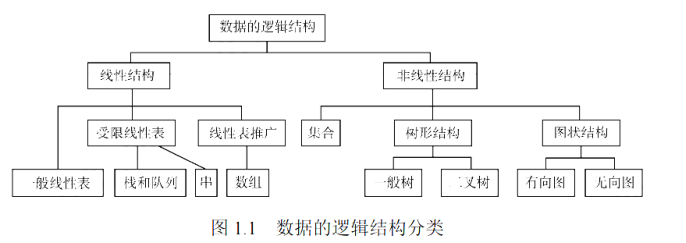
        - 即数据元素之间的逻辑关系，与数据如何存储无关
        - 独立于计算机
        - 可分为：线性结构和非线性结构
          - 线性结构 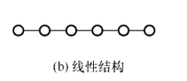
            - 数据元素之间只存在一对一关系
          - 非线性结构
            - 集合
              - 结构中的数据元素之间除“同属于一个集合”外，别无其他关系
            - 树形结构 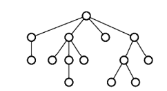
              - 结构中的数据元素之间存在一对多的关系
              - 例如，一个父节点有 2 个子节点
            - 图状结构或网状结构
              - 结构中的数据元素之间存在多对多的关系
      - 存储结构
        - 存储结构是数据结构在计算机中的表示，也称物理结构，包括数据元素的表示和关系的表示
        - 依赖于计算机语言
        - 分为
          - 顺序存储
            - 把逻辑上相邻的元素存储在物理位置也相邻的存储单元中
            - 优点是可以实现随机存取
            - 缺点是只能使用相邻的一整块存储单元，可能产生较多的外部碎片
              > 外部碎片：系统中有足够的空闲内存总量，但因为空闲块分散，无法找到一个足够大的连续空间分配给进程
              > 内部碎片：系统给进程分配的内存块大于它实际需要的大小，多余的部分无法利用，就浪费在块的内部
          - 链式存储
            - 不要求物理位置上相邻，借助指针来表示元素之间的逻辑关系
            - 优点是不会出现碎片现行
            - 缺点是指针的额外空间且只能实现顺序读取
          - 索引存储
            - 存储元素信息的同时，建立附加的索引表，索引项是其中的每一项，其一般形式是 (关键字，地址)
            - 优点：检索速度快
            - 缺点：额外存储空间，额外的增加和删除时间
            - 例如：数据库 B+ 树索引
          - 散列存储
            - 根据元素的关键字直接算出该元素的存储地址，也称 Hash 存储
            - 优点：检索、增加、删除节点的操作都很快
            - 缺点：解决 Hash 冲突会增加时间和空间开销
            - 例如：哈希表
      - 数据的运算
        - 包括运算的定义（针对逻辑结构）与实现（针对存储结构）
  - 算法与算法评价
    - 算法是针对特定问题求解步骤的一种描述
    - 具有 5 个重要特性
      - 有穷性
      - 确定性
      - 可行性
      - 输入
      - 输出
    - 一个“好” 的算法，应达到以下目标
      - 正确性
      - 可读性
      - 健壮性
      - 高效率与低存储
- 线性表
  - 定义
    - 具有相同数据类型的 n 个元素的有限序列
    - 表中的元素具有先后顺序
  - 线性表的顺序表示（顺序表、数组）
    - 用物理上一组连续的存储单元依次存储线性表中的数据元素，使得逻辑上相邻的元素在物理位置上也相邻
    - 逻辑顺序与物理顺序相同
    - 主要优点
      - 随机访问
      - 存储密度高：只存储数据元素
    - 缺点
      - 插入操作平均需要移动 n / 2 个元素
      - 删除操作平均需要移动 ( n - 1) / 2 个元素
      - 需要一段连续的存储空间，不够灵活
  - 线性表的链式表示
    - 单链表 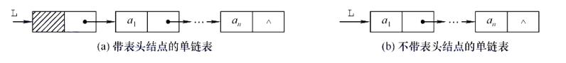
      - 对一个节点 P 的前面进行插入 S 可以转换为后插
        - 将 S 插入到 P 的后面，交换 S 和 P 的数据
      - 对一个节点进行删除可以转换为将后面的数据赋值给自身，并删除后面的节点
    - 双链表 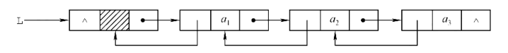
    - 循环单链表 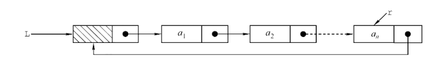
      - 有一个表尾指针 r
    - 循环双链表 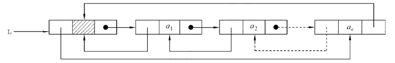
    - 静态链表 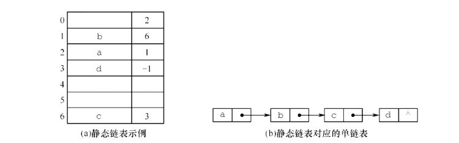
      - 用数组来描述线性表
      - 指针是节点在数组中的下标
- 栈、队列和数组
  - 栈
    - 栈（后进先出，LIFO） 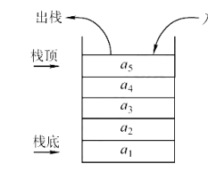
      - 只允许在一端插入或删除的线性表
      - 因为是一种受限的线性表，所以存储方式可以为顺序存储或者链式存储
    - 共享栈（两个顺序栈共享同一个存储空间） 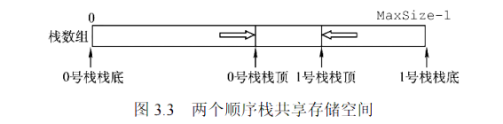
    - 栈的链式存储，称为链栈 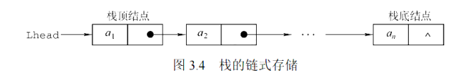
  - 队列
    - 先进先出，FIFO 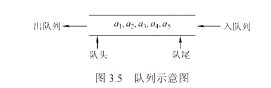
    - 也是一种受限的线性表：只允许在表的一端进行插入，在另一端进行删除
    - 循环队列 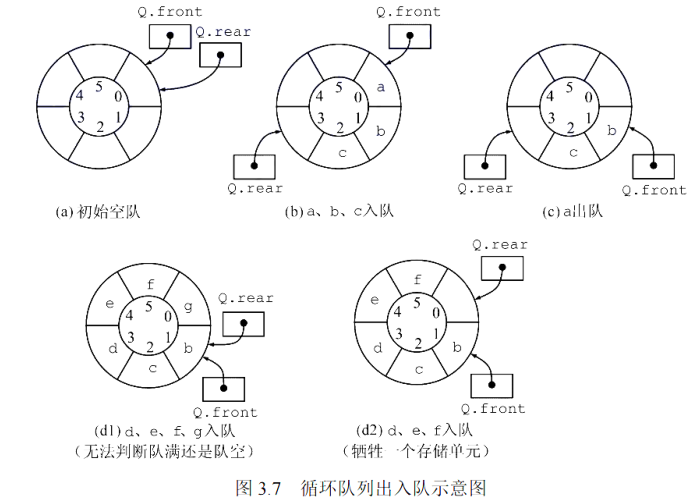
      - 为了区分是对空还是对满，有 3 种处理方式
        - 1\. 牺牲一个单元来区分 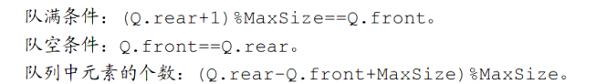
          - 入队时少用一个队列单元
          - 约定以“对首指针在队尾指针的下一位置作为对满的标志“
        - 2\. 类型中增设 size 数据成员，表示元素的个数
          - 插入和删除时需要额外维护 size
        - 3\. 类型中增设 tag 数据成员
          - 插入成功时 tag = 1,若导致 Q.front = Q.rear,则对满
          - 删除成功时 tag = 0,若导致 Q.front = Q.rear,则对空
    - 队列的链式存储 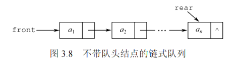
    - 双端队列 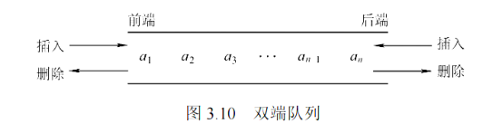
      - 两端都可以进行插入和删除操作的线性表
      - 输出受限的双端队列：其中一端只允许插入 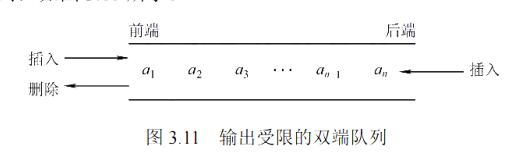
      - 输入受限的双端队列：其中一端只允许删除 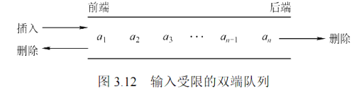
  - 栈和队列的应用
    - 栈在括号匹配中的应用
      - 1\. 顺序读入括号
      - 2\. 若是左括号，则入栈
      - 3\. 若是右括号，则判断栈中是否有对应的左括号与之匹配。如果有，则该左括号出栈，否则括号序列不匹配
    - 栈在表达式求值中的应用
      - 中缀表达式转后缀表达式
        - 手动转换
          - 1\. 按照运算符的运算顺序对所有运算单位加括号
          - 2\. 将所有运算符移至括号的后面，即按照“左操作数 右操作数 运算符”的形式重新组合
          - 3\. 去掉所有括号
          - 例如 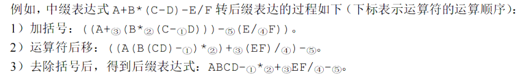
        - 计算机转换
          - 1\. 遇到操作数，直接加入后缀表达式
          - 2\. 遇到界限符：
            - `(` 则入栈
            - `)` 则弹出栈中的运算符并加入后缀表达式，直到遇到 `(` 为止，并直接删除 `(`
          - 3\. 遇到运算符
            - 若优先级高于栈顶运算符或遇到栈顶为 `(`，则直接入栈
            - 若优先级低于或等于栈顶运算符，则依次弹出栈中的运算符并加入后缀表达式。直到遇到优先级低于它的运算符或遇到 `(` 或栈为空，然后入栈。
      - 后缀表达式求值
        - 1\. 从左往右一次扫描表达式的每一项
          - 若该项是操作数，则将其压入栈
          - 若该项是操作符 &lt;OP&gt;，则从栈中弹出 2 个操作数 Y 和 X,执行 X &lt;op&gt; Y 运算，并将结果压入栈中
            > 取出来的顺序是 Y X,运算的顺序是 X Y
        - 2\. 扫描完成并处理完后，栈顶存放的就是计算结果
  - 队列在层次遍历中的作用
    - 1\. 根节点入队
    - 2\. 若对空，则结束遍历；否则重复 3
    - 3\. 队列中的第一个节点出队，并访问。
      - 若其有左孩子，则左孩子入队
      - 若其有右孩子，则右孩子入队
    - 4\. 返回 2
  - 数组和特殊矩阵
    - 数组概论
      - 数组是线性表的推广
      - 数组的下标的取值范围称为数组的维界
      - 数组一旦被定义，其维数与维界就不再改变，因此，除了初始化和销毁，数组只会有存取元素和修改元素的操作
    - 一维数组
      - 存储结构关系式 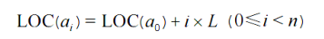
      - L 是每个数组元素所占的存储单元的大小
    - 多维数组
      - 有 2 种映射方法
        - 按行优先 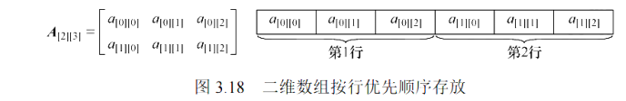
          - 先行后列
          - 存储结构关系式 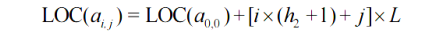
        - 按列优先 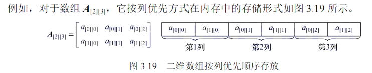
          - 先列后行
          - 存储结构关系式 
    - 特殊矩阵的压缩存储
      - 对称矩阵（以存储下三角区域为例）
        - 将 n 阶对称矩阵 A 存放在一个一维数组 B[n(n+1)/2] 中
        - 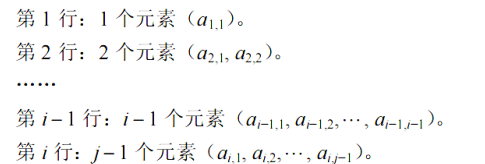
          - 然后，从第 1 行开始，依次将元素存储在 B 中
        - A 中 (i,j) 位置的元素在 B 中的下标 k 等于该元素在 B 中，前面有多少个元素
          - [1 + 2 + 3 + ....... + (i - 1)] + (j - 1) = i(i - 1) / 2 + j - 1
      - 三角矩阵（非严格三角矩阵，形式相同）
        - 三角矩阵要求主对角线的一侧全为 0，而这里所说的三角矩阵，其中一侧可以不全为 0,而是可以全为任意常数 c
        - 存储格式与“对称矩阵”类似，但是最后一项的后面多出了一个常数项 c 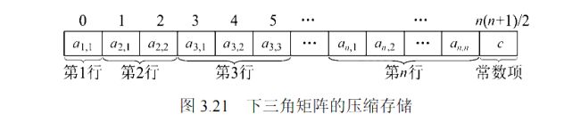
      - 三对角矩阵（带状矩阵） 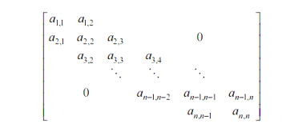
        - 将矩阵 A 的每一行存储在一个一维数组中 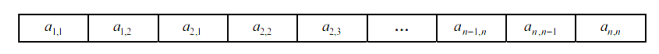
        - 注意，第一行仅有 2 个元素
      - 稀疏矩阵（非 0 元素的个数 t，相对于矩阵的元素个数 s 来说，s &gt;&gt; t）
        - 使用一个 3 元组表来存储 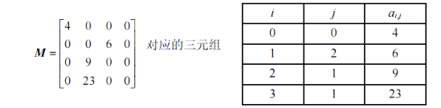
          - 还需要保存矩阵的行数与列数
        - 也可以使用十字链表来存储
- 串（字符串）
  - 模式匹配
    - 模式匹配是指在主串中找到与模式串相同的子串，并返回其所在的位置
  - KMP 算法
    - 相关概念
      - 前缀：除最后一个字符外，字符串的所有头部子串
      - 后缀：除第一个字符外，字符串的所有尾部子串
      - 部分匹配值（Partical Match, PM）：字符串的前缀和后缀的最长相等前后缀长度
      - 例如 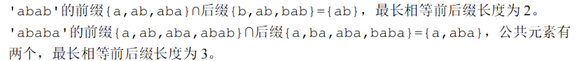
    - KMP 算法的步骤
      - 手动模拟
        - 1\. 依次计算出模式串的匹配值，形成一个《部分匹配值表》（以 abcac 为例）
          - 计算部分匹配值 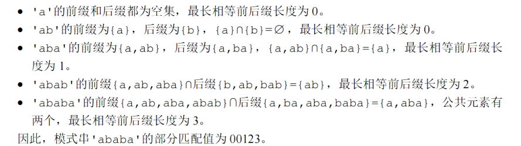
          - 形成表 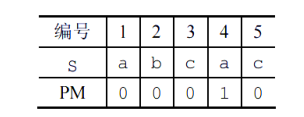
        - 2\. 保持主串不动，如果发生了不匹配，则将模式串向右滑动，其中，滑动步数等于： 右滑位数 = 已匹配的字符数 - 最后一个匹配字符所对应的部分匹配值，如果第一个字符就不匹配，则滑动 1 位 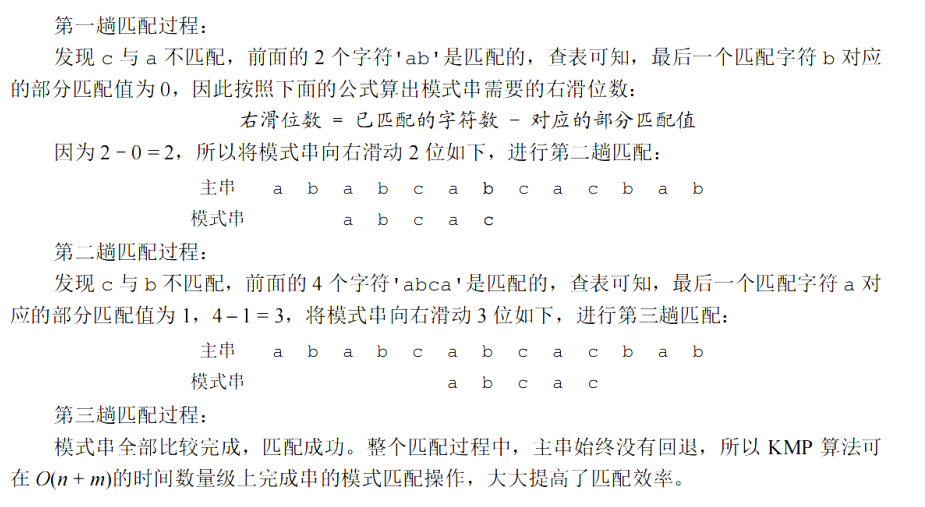
        - 可以看到，主串是不动的，只有模式串在滑动。所谓的滑动，只是模式串指针的回溯。不动意味着主串的指针不会发生回溯。
      - [如何快速计算部分匹配值（PM）表？](https://leetcode.cn/problems/find-the-index-of-the-first-occurrence-in-a-string/solutions/575568/shua-chuan-lc-shuang-bai-po-su-jie-fa-km-tb86/) 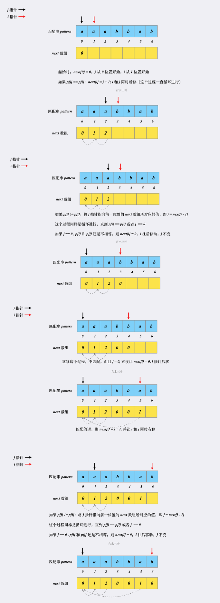
        - 1\. 使用两个指针 i = 1, j = 0 指向模式串 p
        - 2\. 若 p[i] == p[j]，则 pm[i] = j + 1，之后，i++,j++（同时后移）
        - 3\. 若 p[i] != p[j]，则重复执行 j = pm[j - 1]，直到 p[i] = p[j]。如果 j == 0 时，仍然没有 p[i] == p[j]，则 pm[i] = 0，之后，i++
      - next 数组的定义
        - next[i] 表示在与主串失配时，该位置为 i,下一次与主串进行比较的模式串的位置是 next[i]（下标从 0 开始）
          - 如果 next[i] == -1, 则说明应该将主串的指针移到下一位，并且与模式串的 0 号位置匹配
          - 当与模式串的第一个位置就失配时，则应该移动主串指针，所以 next[0] = -1 恒成立
        - 计算方法
          - 1\. 将所有的 PM 表元素整体向右移动一位，右边溢出的一位舍去
          - 2\. next[0] = -1
        - 右滑位数与 next[i] 的关系
          - 在计算机实现中，右滑就相当于指针的回溯
          - 根据定义，右滑位数 = 已匹配的字符数 - 最后一个匹配字符对应的 pm 值 如果 i 位置失配，则已匹配的字符数为 i，最后一个匹配字符对应的 pm 值刚好是 next[i]，所以 右滑位数 = i - next[i]
            - 如果 next[i] = -1,则此公式也成立
      - KMP 的优化（nextVal 数组的计算）
        - KMP 算法实际运行的过程中，会出现这么一种情况： 1. p[i] 与主串的某个元素不匹配 2. 跳转到的 next[i] 位置的 p[next[i]] == p[i] 这就导致无用的跳转：next[i] 位置与主串的该元素一定不匹配，这就是需要优化的地方
        - nextVal[i] 的含义（定义）
          - nextVal[i] 表示在与主串匹配的过程中，消除了无用跳转之后的 next 数组
        - 计算方法
          - 1\. 如果 p[next[i]] == p[i]，则 nextVal[i] = nextVal[next[i]]
            - 这种计算方法类似于递推，由于是从左到右遍历模式串，故而左边的元素一定消除了无用跳转，而 next[i] 一定小于等于 i
          - 2\. 如果 p[next[i]] != p[i]，则 nextVal[i] = next[i]
          - 3\. nextVal[0] = -1
        - nextVal 与右滑位数的关系
          - 同对 next 数组的分析一样， 右滑位数 = i - nextVal[i]
      - 几组模式串及其 PM 表，next 和 nextVal 数组
        - issipi pm = [0, 0, 0, 1, 0, 1] next = [-1, 0, 0, 0, 1, 0] nextVal = [-1, 0, 0, -1, 1, -1]
        - aabaab pm = [0, 1, 0, 1, 2, 3] next = [-1, 0, 1, 0, 1, 2] nextVal = [-1, -1, 1, -1, -1, 1]
        - ababaaababaa pm = [0, 0, 1, 2, 3, 1, 1, 2, 3, 4, 5, 6] next = [-1, 0, 0, 1, 2, 3, 1, 1, 2, 3, 4, 5] nextVal = [-1, 0, -1, 0, -1, 3, 1, 0, -1, 0, -1, 3]
      - 完整的代码实现 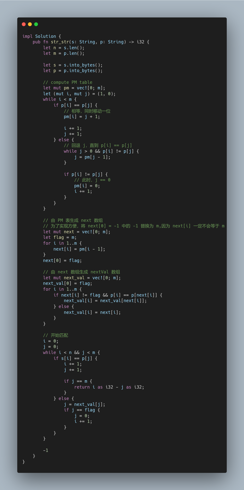
        > impl Solution {
        >     pub fn str_str(s: String, p: String) -> i32 {
        >         let n = s.len();
        >         let m = p.len();
        >         let s = s.into_bytes();
        >         let p = p.into_bytes();
        >         // compute PM table
        >         let mut pm = vec![0; m];
        >         let (mut i, mut j) = (1, 0);
        >         while i < m {
        >             if p[i] == p[j] {
        >                 // 相等，同时移动一位
        >                 pm[i] = j + 1;
        >                 i += 1;
        >                 j += 1;
        >             } else {
        >                 // 回退 j，直到 p[i] == p[j]
        >                 while j > 0 && p[i] != p[j] {
        >                     j = pm[j - 1];
        >                 }
        >                 if p[i] != p[j] {
        >                     // 此时，j == 0
        >                     pm[i] = 0;
        >                     i += 1;
        >                 }
        >             }
        >         }
        >         // 由 PM 表生成 next 数组
        >         // 为了实现方便，将 next[0] = -1 中的 -1 替换为 m,因为 next[i] 一定不会等于 m
        >         let mut next = vec![0; m];
        >         let flag = m;
        >         for i in 1..m {
        >             next[i] = pm[i - 1];
        >         }
        >         next[0] = flag;
        >         // 由 next 数组生成 nextVal 数组
        >         let mut next_val = vec![0; m];
        >         next_val[0] = flag;
        >         for i in 1..m {
        >             if next[i] != flag && p[i] == p[next[i]] {
        >                 next_val[i] = next_val[next[i]];
        >             } else {
        >                 next_val[i] = next[i];
        >             }
        >         }
        >         // 开始匹配
        >         i = 0;
        >         j = 0;
        >         while i < n && j < m {
        >             if s[i] == p[j] {
        >                 i += 1;
        >                 j += 1;
        >                 if j == m {
        >                     return i as i32 - j as i32;
        >                 }
        >             } else {
        >                 j = next_val[j];
        >                 if j == flag {
        >                     j = 0;
        >                     i += 1;
        >                 }
        >             }
        >         }
        >         -1
        >     }
        > }
- 树与二叉树
  - 相关概念
    - 层次
      - 从树根开始定义：根节点为第一层
    - 深度
      - 节点所在的层次
    - 高度
      - 树中节点的最大层数
      - 节点的高度是以其为根节点的子树的高度
    - 度
      - 节点的度：节点的直接孩子的个数
      - 树的度：树中节点最大的度
    - 分支节点
      - 度大于 0 的节点
    - 有序树/无序树
      - 有序树：树中的节点各子树从左到右是有序的，不能互换（简单来看，就是左孩子和右孩子不能互换）。否则是无序树
    - 路径和路径长度
      - 路径：树中 2 个节点之间所经过的节点序列 路径长度：路径上所经过的边的条数
  - 树的性质
    - 树的节点树 n = 所有节点的度数之和 + 1
    - 度为 m 的树中，第 i 层最多有 m^(i - 1) 个节点
    - 高度为 h 的 m 叉树至多有 (m^h - 1) / (m - 1) 个节点 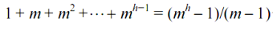
    - 度为 m，具有 n 个节点的树的最小高度 h 为 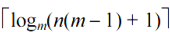
    - 度为 m，具有 n 个节点的树的最大高度 h 为: n - m + 1
      - 高度为 h 度为 m 的树至少有 h + m - 1 个节点
    - n 个节点的树中有 n - 1 条边
  - 二叉树
    - 二叉树和度为 2 的有序树之间的区别 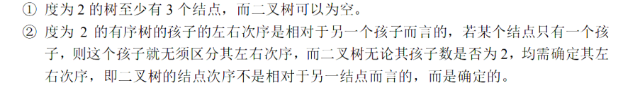
    - 几种特殊的二叉树
      - 满二叉树 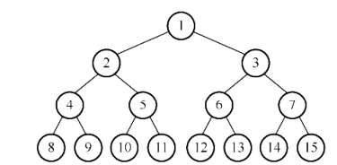
        - 高度为 h，且有 2^h - 1 个节点的二叉树
        - 除叶节点之外的每个节点的度数都为 2
        - 若按层序且从左到右进行编号，编号从 1 开始，则对于编号为 i 的节点
          - 双亲为 floor(i / 2)
          - 左孩子为 2i
          - 右孩子为 2i + 1
      - 完全二叉树 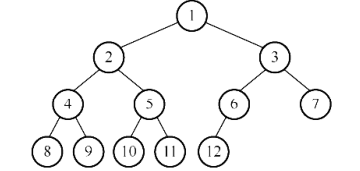
        - “不满的满二叉树”
        - 节点的编号与满二叉树的完全一致
      - 二叉排序树
        - 左子树所有节点的关键字均小于根节点的关键字；右子树上所有节点的关键字均大于根节点的关键字；左子树和右子树又各是一颗二叉排序树
      - 平衡二叉树
        - 树中任意一个节点的左子树和右子树的高度差的绝对值不超过 1
      - 正则二叉树
        - 树中只有度为 0 或 2 的节点
    - 二叉树的性质
      - 非空二叉树上的叶节点数等于度为 2 的节点数 + 1
      - 非空二叉树的第 k 层最多有 2^(k - 1) 个节点
      - 高度为 h 的二叉树至多有 2^h - 1 个节点
      - n 个节点的二叉树有 n + 1 个空指针
      - 完全二叉树的相关性质
        - 将完全二叉树按照层序且从左到右，从 1 开始编号
        - 若有度为 1 的节点，则最多只有一个，且该节点只有左孩子而无右孩子，且节点标号为 floor( n / 2)，且其后面均为叶节点
        - 如果完全二叉树有 n 个节点，n 为奇数，则只有度为 0 和 2 的节点；若为偶数，则有 0,1,2 的节点，度为 1 的节点有且只有 1 个，且编号为 floor(n / 2)
        - 节点 i 所在的深度（层次）为 floor(log(i)) + 1
        - 具有 n 个节点的完全二叉树的高度为 floor(log(n)) + 1
    - 二叉树的顺序存储 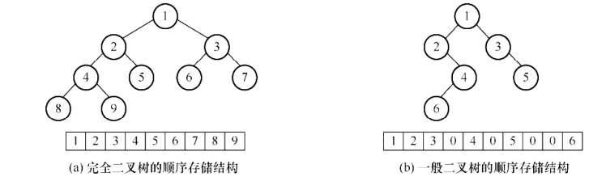
      - 对于完全二叉树和满二叉树，可以按照编号来存储
      - 对于一般的二叉树，则需要添加空节点，使其变为完全二叉树
    - 由遍历序列构造二叉树（只要有中序遍历和其他遍历方式的任何一种，构造出来的二叉树就唯一）
      - 先序遍历和中序遍历
        - 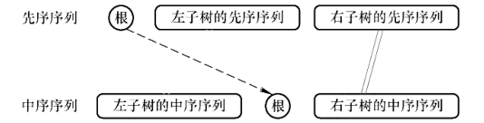
      - 后续遍历和中序遍历
        - 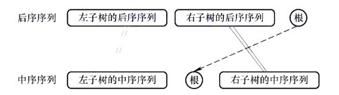
      - 层序遍历和中序遍历
        - 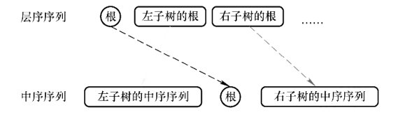
      - 其余遍历顺序无法唯一确定二叉树
    - 线索二叉树
      - 线索二叉树将原本的空指针利用起来，指向其前驱和后继
        - 这里所说的前驱和后继是在遍历的过程中而言的。例如，如果有遍历序列 ABC,则 B 的前驱就是 A,后继就是 C
      - 节点结构 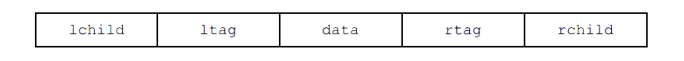
      - 标志域的含义 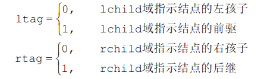
      - 中序线索二叉树
        - 建立过程 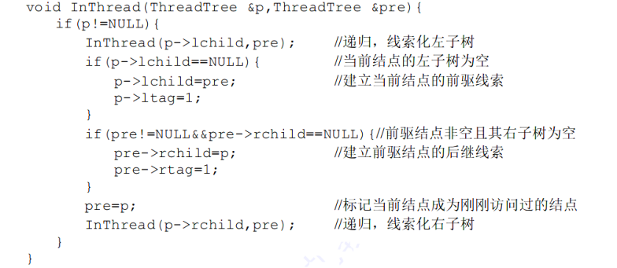
        - 遍历中序线索二叉树 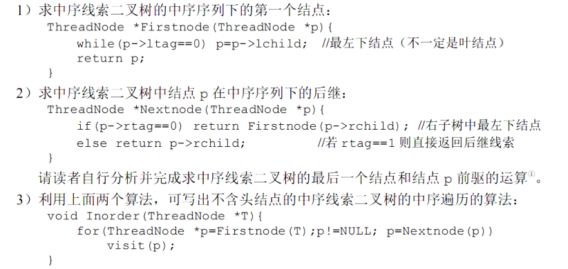
  - 树的存储结构
    - 双亲表示法 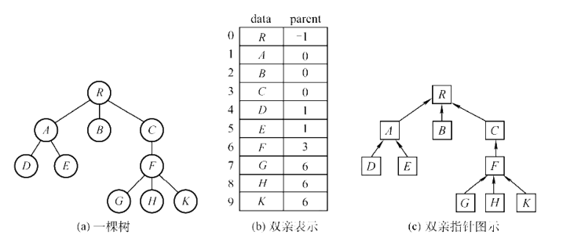
      - 使用一组连续的空间来存储每一个节点
      - 在每个节点中增设一个指针，指示其双亲节点在数组中的位置
      - 优点：可以很快地得到每个节点的双亲节点
      - 缺点：求节点的孩子需要遍历整个结构
    - 孩子表示法 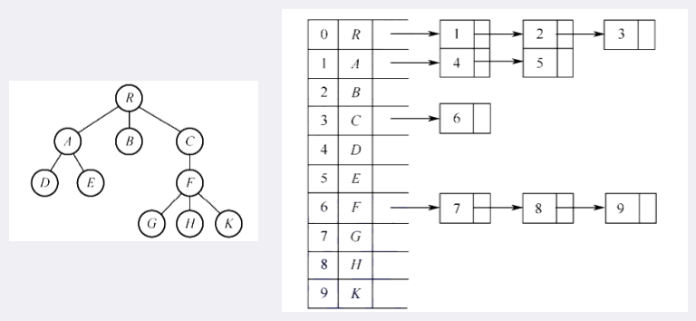
      - 将每个节点的孩子节点视为一个线性表，且以大链表作为存储结构
      - n 个头指针组成一个线性表
      - 优点：寻找孩子非常方便
      - 缺点：寻找双亲需要遍历 n 个节点中孩子链表所指向的 n 个孩子链表
    - 孩子兄弟表示法（二叉树表示法）
      - 每个节点 n 包括 3 个部分 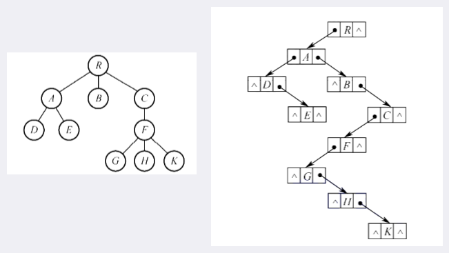
        - 节点值
        - 指向 n 的第一个孩子的指针
        - 指向 n 的兄弟节点的指针
  - 二叉树和树的相互转换
    - 树转换为二叉树 
      - 规则：每个节点的左指针指向其第一个孩子；右指针指向它在树中的相邻右兄弟（左孩子右兄弟）
      - 树转换为二叉树的画法 
    - 森林转换为二叉树
      - 这里默认树的表示方法是孩子兄弟表示法
      - 规则：将每棵树的根节点相互视为兄弟，将根节点的右指针指向下一颗树的根节点（根节点的右指针原先一定为空）
    - 二叉树转换为森林 
      - 规则：将根的右指针断开，其右子树视为一片森林，然后重复执行，直到右指针为空
  - 树的遍历
    - 先根遍历： 1. 先访问根节点 2. 依次遍历每颗子树
      - 与这棵树对应的二叉树的先序序列相同
    - 后根遍历： 1. 依次遍历根节点的每颗子树 2. 再访问根节点
      - 与这棵树对应的二叉树的中序序列相同
  - 森林的遍历
    - 先序遍历： 1. 访问森林中第一颗树的根节点 2. 先序遍历第一颗树中根节点的子树 3. 先序遍历除去第一颗树之后的森林
      - 和森林的二叉树的先序遍历相同
    - 中序遍历： 1. 中序遍历第一颗树的子树 2. 访问第一颗树的根节点 3. 中序遍历除去第一颗树之后剩余的树构成的森林
      - 和森林的二叉树的中序遍历相同
      - 虽然叫中序遍历，实际上，从逻辑上来讲，是后序遍历，即根节点是在最后被访问的
  - 树的应用
    - 哈夫曼树与哈夫曼编码
      - 相关概念
        - 带权路径长度（WPL） 
          - 从树的根到一个节点的路径长度之和与该节点上权值的乘积称为该节点的带权路径长度
          - 树中所有叶节点的带权路径长度之和称为树的带权路径长度
      - 哈夫曼树 
        - 在含有 n 个带权叶节点的二叉树中，树的 WPL 最小的二叉树称为哈夫曼树，也称最优二叉树
        - 哈夫曼树的构造
          - 1.将 n 个含有权值分别为 w1, w2, ..., wn 的节点分别作为 n 棵仅含有 1 个节点的二叉树，构成森林 F
          - 2\. 从 F 中选取 2 棵根节点权值最小的树作为新节点的左、右子树，并且将根节点的权值置为左、右子树上根节点的权值之和
          - 3\. 从 F 中删除刚才选出来的 2 棵树，同时将新得到的树加入到 F 中
          - 4\. 重复 2 和 3,直到 F 中只剩一棵树
        - 哈夫曼树的性质
          - 1\. 每个初始节点都最终成为叶节点，权值越小，到根节点的路径长度越大
          - 2\. 构造过程共新建了 n - 1 个节点，故而哈夫曼树共含有 2n - 1 个节点
          - 3\. 哈夫曼树中，不含有度为 1 的节点。即只含有度为 0 或 2 的节点
      - 哈夫曼编码
        - 相关概念
          - 若没有一个编码是另一个编码的前缀，则称这样的编码为前缀编码
        - 哈夫曼编码：将哈夫曼树的左分支标记为 0，右分支标记 1。从根节点到叶节点的路径上用分支标记组成的序列作为该叶节点的编码
    - 并查集（不相交集合的集合）
      - 存储结构 
        - 通常使用树的双亲表示法作为并查集的存储结构
      - 支持 3 种操作
        - 1\. Initial(S)：将 S 中的每个元素都初始化为只有 1 个元素的子集合 
          - 代码 
        - 2\. Union(S, p, q)：将 S 中的 p 和 q 合并。要求 p 和 q 互不相交，否则不执行合并。 
          - 在极端的情况下，n 个元素构成的集合树的深度为 n,则 Find 操作的时间复杂度为 O(n)。
          - 改进办法是：在 Uion 操作时，将小树合并到大树。为此，令根节点的绝对值保存集合树中成员的数量 
            - 使用这种方法的并查集示例 
            - 此种方法得到的集合树，其深度不超过 floor(log(n)) + 1
        - 3\. Find(S, x)：查找 S 中的单元素 x 所在的子集合，并返回该子集合的根节点 
          - 为进一步减少 Find 操作消耗的时间，当所查元素 x 不在树的第 2 层的时候，将根到元素 x 路径上所有的元素都变成根的孩子 
- 图
  - 基本概念与术语
    - 有向图 
    - 无向图 
    - 简单图
      - 若图 G 满足： 1. 不存在重复边（u -&gt; v 的边不存在 2 条，但是 u -&gt; v 和 v -&gt; u 不算重复） 2. 不存在顶点到自身的边 则称 G 为简单图
    - 多重图
      - G 中的某 2 个顶点之间具有重复边，又允许顶点通过一条边与自身关联的图
    - 度、入度、出度
      - 无向图中，节点 v 的度 TD(v) = 和顶点 v 相连的边的条数
      - 有向图中，度分为入度和出度
        - v 的入度 ID(v)：以顶点 v 为终点的有向边的数量
        - v 的出度 OD(v)：以顶点 v 为起点的有向边的数量
    - 路径、路径长度、回路（环）
      - 路径：从顶点 p 到 q 的顶点序列 p, v1, v2, ..., q
      - 路径长度：路径上边的数目
      - 回路（环）：路径的起点和终点相同的路径
    - 简单路径、简单回路
      - 简单路径：在路径序列中，顶点不重复出现的路径
      - 简单回路：除第一个顶点和最后一个顶点外，其余顶点不重复出现的回路
    - 距离
      - 距离：从顶点 u 到 v 的最短路径长度（若存在的话）
    - 子图
      - 子图 G' 的顶点和边都是原图 G 的顶点和边的子集
    - 无向图：连通、连通图和连通分量
      - 连通：从顶点 u 到 v 有路径存在，则称 u 和 v 是连通的
      - 连通图：图 G 中任意 2 个顶点都是连通的
        - 若 G 有 n 个顶点，但是边数少于 n - 1,则一定不是连通图
      - 连通分量：极大连通子图（多增一条边或者顶点就不是连通子图了）
        - 一个图可以有多个连通分量，多个连通分量之间没有边相连
        - 例子 
    - 有向图：强连通图、强连通分量
      - 强连通：对于 u 和 v 节点，若 u 到 v 和 v 到 u 之间都有路径，则称这 2 个顶点强连通
      - 强连通图：任意一对顶点都是强连通的
      - 强连通分量：极大强连通子图
        - 具有 n 个节点的强连通分量至少具有 n 条边 
    - 生成树（针对连通图）、生成森林（针对非连通图）
      - 生成树：在连通图中，包含图的全部节点的极小连通子图（边数极小）
        - 若图的顶点为 n，则生成树中只有 n - 1 条边
        - 若添上一条边，则会形成回路；若减去一条边，则会变成非连通图
      - 生成森林：在非连通图中，连通分量的生成树构成了非连通图的生成森林
    - 边的权、带权图（网）、带权路径长度
      - 权：每条边上标注的，具有某种意义的值
      - 网：边上具有权值的图，也称带权图
      - 带权路径长度：路径上所有边的权值之和
    - 完全图、完全有向图
      - 完全图：在无向图中，每一对不同的节点之间都有一条边相连
        - n 个节点的完全图，有 n(n - 1) / 2 条边
      - 完全有向图：图中每一对不同的顶点之间都有 2 条方向相反的有向边。即对于任意一对不同的节点 u 和 v,都有 u -&gt; v 和 v -&gt; u
        - n 个节点的完全有向图，有 n(n - 1) 条边
    - 稠密图、稀疏图
      - 稀疏图：边数很少的图
        - 这是一个很模糊的概念，一般而言， |E| &lt; |V| * log|V| 时，将 G 视为稀疏图
      - 稠密图：边数很多的图
    - 有向树
      - 一个顶点的入度为 0,其余顶点的入度均为 1 的有向图
  - 图的存储
    - 邻接矩阵法 
      - 1\. 将 n 个节点进行编号，然后创建大小为 nxn 的二维数组（矩阵） A
      - 2\. 对于无权图，A[i][j] = 0 表示从 i -&gt; j 节点不存在一条边，A[i][j] = 1 则存在
      - 3\. 对于带权图，A[i][j] = x != inf，则代表 i -&gt; j 存在一条边，且该边具有权重，为 x；若 A[i][j] = inf,则不存在 i -&gt; j 这条边
      - 性质
        - 无向图的邻接矩阵是对称矩阵
        - 无向图的第 i 行或者第 i 列的非零元素或者非 inf 的个数恰好为顶点 i 的度 TD(i)
        - 有向图的第 i 行和第 i 列的非零元素或者非 inf 的个数恰好分别为顶点 i 的出度 OD(i) 和入度 ID(i)
          - 行出列入
        - (A^n)[i][j] = 从顶点 i 到顶点 j 的长度为 n 的路径的数目
          - 例如 
          - 对于带权图，不成立。除非权值表示的是该边的重数，即 A[i][j] 表示 i -&gt; j 这条边的重复数量
    - 邻接表法 
      - 1\. 对 n 个节点进行编号，创建一个大小为 nx1 的 Vec&lt;SingleLinkedList&gt; A
      - 2\. 如果有 A[i][j] = x ，则表示 i -&gt; x 存在一条边
      - 空间复杂度：有向图为 O(|E| + |V|)，无向图为 O(|V| + 2|E|)
    - 十字链表（针对有向图） 
      - 用以解决稀疏图的邻接表法表示的时候，寻找一个节点的入边需要遍历整个表的情况
      - 弧头和弧尾的定义 
      - 十字链表需要使用 2 种不同的节点：弧节点和顶点节点
        - 弧节点 
        - 顶点节点 
      - 例子 
        - 其中，边上的数字是该边的标号，不是其权重
        - 弧节点中，headvex 相同的节点，hlink 相互连接；tailvex 相同的节点，tlink 相互连接
      - 查找算法
        - 查找某节点 x 的所有出边
          - 直接从 x 的 firstout 开始，沿着 tlink 链表依次遍历，一定有 x -&gt; headvex 的边
        - 查找某节点 x 的所有入边
          - 直接从x 的 firstin 开始，沿着 hlink 链表依次遍历，一定有 tailvex -&gt; x
        - 查找是否有 i -&gt; j 边
          - 从 i 的 firstout 出发，沿着 tlink 链表遍历，查看是否有 headvex == j
    - 邻接多重表（针对无向图） 
      - 邻接表中，每一条边存储了 2 次，如果图比较大，会浪费空间，也会给删除操作带来麻烦（遍历 2 个节点）
      - 和十字链表类似，也使用了 2 个节点：顶点节点和边节点
        - 边节点 
        - 顶点节点 
      - 例子 
        - 其中，边上的数字为边的标号
        - ivex 相同的边节点 ilink 相连；jvex 相同的边节点，jvex 相连
      - 查找算法
        - 查找某节点 x 的所有边
          - 从 firstedge 出发，看 x == ivex 还是 jvex，如果等于 ivex 则沿着 ilink 链表查找，否则沿着 jlink 链表查找
        - 删除的时候，只需要把边节点删除，并修改相关指针
    - 4 种方法的对比总结 
  - 图的遍历
    - 由于无向图天生具有环，有向图也可能有环，故而无论何种遍历方式都需要将已经访问过的节点标记出来，通常使用 visited[] 数组
    - 广度优先搜索（Breadth First Search) 
      - 非带权图的单源最短路径长度问题
        - 1\. 定义一个数组 d[i] 表示从“单源” u 出发，到达 i 的最短路径长度
        - 算法实现 
          - 这里的 d 数组的更新语句是 d[w] = d[u] + 1,而没有用到最小值函数 min,这是因为 BFS 的特性
      - 广度优先生成树 
        - 在广度遍历的过程中，就可以得到一颗遍历树，称为广度优先生成树
    - 深度优先搜索（Depth First Search) 
      - 深度优先生成树（森林） 
    - 不管是 BFS 还是 DFS，其时间复杂度都与其存储方式有关
      - 邻接矩阵：O(|V|^2)
      - 邻接表：O(|V| + |E|)
    - BFS 和 DFS 可以用于判断图是否连通
  - 图的应用
    - 最小生成树（带权无向图） 
      - 对于带权无向连通图 G，权值之和最小的那棵生成树称为 G 的最小生成树（Minimum Spanning Tree, MST)
      - 性质
        - 若有权值相同的边，则 MST 可能不唯一
        - 若 G 本身就是一棵树，则 G 的 MST 就是其本身
        - MST 的 |E| = |V| - 1
      - 通用算法（伪代码） 
      - 具体实现
        - Prim 算法 
          - 实现 
            - 将节点分为 2 个阵营：U 和 V - U
            - 开始时，U 随机选择一个顶点加入
            - 从 U 和 V - U 中选择一对顶点，分别为 u，v,且有 u -&gt; v，且这个边的权值是所有可能的 u -&gt; v 中最小的
              - 将 v 加入 U，该 u -&gt; v 边是最小生成树的一条边
          - 时间复杂度 O(|V|^2)
            - 适合求解边稠密的最小生成树
        - Kruskal 算法 
          - 实现 
            - 可以使用堆来存储边，从而快速得到权值最小的边
            - 为了判断 u 和 v 是否是属于 T 中不同的连通分量，可以使用并查集
          - 在使用堆和并查集的情况下，时间复杂度为 O(|E|log|E|) 
            - 适用于边稀疏而顶点较多的图
    - 最短路径（带权图）
      - 最短路径是指：带权路径最短的那条路径（可能不唯一）
      - 非负带权图单源最短路径（Dijkstra 算法）
        - 算法步骤
          - 1\. 定义 dist[i] 表示从源 s 到顶点 i 的最短路径
            - 初始化时，dist[i] = arcs[s][i]，其中，arcs[s][i] 表示从源到 i 的权值，如果没有 s -&gt; i 的边，则为 inf
          - 2\. 定义数组 final 表示是否已经“访问”过了。记访问过的节点集合为 S,没有访问过的节点的集合为 V - S
            - 初始化时 final[s] = true，S = {s}
          - 3\. 从 for j in {V - S} 中，找到 dist[j] 最小的 j，将其加入 S，即 final[j] = true
          - 4\. 看是否有 dist[j] + arcs[j][k] &lt; dist[k]，若有，则 dist[k] = dist[j] + arcs[j][k]
            - 其中， k 满足 arcs[j][k] != inf && final[k] == false，即 k 是 j 的后继，且没有被访问过
        - 边上带负权值时，Dijkstra 算法并不适用
        - 时间复杂度： O(|V|^2)
      - 每对顶点之间的最短路径（Floyd 算法）
        - 算法步骤
          - 1\. 令 d[i][j] 表示从 i 到 j 的最短路径长度
          - 2\. 将 d[i][j] 初始化为 arcs[i][j]，arcs 表示 i -&gt; j 边的权值
          - 3\. 依次枚举每个顶点 k，判断“经过” k 是否能够让路径变短： d[i][j] = min(d[i][j], d[i][k] + d[k][j])
        - 伪代码
          - 
        - 时间复杂度：O(|V|^3)
        - 如果图中有权值之和为负的环，则不适用于 Floyd 算法
          - 所以，带有负权的无向图一定不能使用 Floyd 算法
    - 有向无环图 DAG
      - DAG 可用于描述表达式
        - 例如 
          - 
    - 拓扑排序（只针对有向无环图 DAG）
      - AOV 网：如果有边 i -&gt; j，则表示活动 i 必须先于 j 进行。这种将顶点表示活动的网络（Activity On Vertex），称为 AOV 网
        - 每一个 AOV 网都有一个或多个拓扑排序序列
      - 算法步骤 
        - 1\. 从 AOV 网中选择一个入度为 0 的顶点 h，并输出 h
        - 2\. 从网中删除 h 以及所有以 h 为起点的有向边
        - 3\. 重复 1 和 2。直到 AOV 为空。若 AOV 不为空，但是没有入度为 0 的节点，则说明该图中必然存在环
      - 算法实现（邻接表） 
      - DFS 实现拓扑排序
        - 算法实现 
          - 例如 
            - 之所以无论递归是从 4 -&gt; 5 还是 3 -&gt; 5 都可以，是因为只有当所有的子节点都访问过了之后，才会执行 push 操作
              - 如果是递归的顺序是 3 - &gt; 5，则栈就是 35
              - 如果递归的顺序是 4 -&gt; 5,当回溯到 4 的时候，就还有 3 没有递归，则一定会递归到 3，此时栈依然是 35
      - 逆拓扑排序
        - 1\. 寻找第一个出度为 0 的顶点 h，并输出该顶点
        - 2\. 从网中删除所有以 h 为终点的边
        - 3\. 重复 1 和 2
      - 时间复杂度
        - 邻接表：O(|V| + |E|)
        - 邻接矩阵：O(|V|^2)
    - 关键路径（只针对 DAG）
      - AOE 网：用顶点表示事件，用边表示活动，边上的权值表示完成该活动的开销，称之为用边表示活动的网络（Activity On Edge）
        - 只有某顶点所代表的事件发生之后，从该顶点出发的活动才能开始
        - 只有在进入某顶点的所有活动都已经结束了之后，该顶点所代表的事件才能发生
      - 在 AOE 网中，从源点到汇点的所有路径中，具有最大路径长度的路径称为关键路径，而把关键路径上的活动称为关键活动
        - 开销最大的路径，如果开销是时间，则在次关键路径上的总时间内，整个图中的所有活动都可以结束。即该时间是 最短完成时间
      - 算法步骤
        - 1\. ve(k)：表示事件 v_k 的最早发生时间
          - ve(源点） = 0
          - ve(k) = max(ve(k), ve(j) + weight(v_j, v_k))
            - 其中，j 为 k 的直接前趋
            - 在实际计算的时候，都是从前往后，在拓扑排序的顺序上进行计算的，例如有 i -&gt; j，则当遍历到 i 的时候，就会更新 ve(j) 了
            - 之所以最早发生的时间是使用 max 来进行计算的，是因为只有当 j -&gt; k 的所有活动都发生了之后，v_k 才能发生
        - 2\. vl(k)：在不推迟整个工程完成的情况下，事件 v_k 的最晚发生时间（这时候，就走最短路径） 
          - vl(汇点）= ve(汇点）
          - vl(k) = min(vl(k), vl(j) - weight(v_k, v_j))
            - 其中，j 是 k 的直接后驱
            - 在实际计算的时候，都是从后往前，在逆拓扑排序的顺序上进行计算的
        - 3\. e(i)：活动 a_i 的最早开始时间
          - e(i) = ve(j)，其中 j 是该活动所对应的边的起点。即事件发生不消耗时间，或者该时间消耗的时间包含在了该活动消耗的时间中
        - 4\. l(i)：活动 a_i 的最迟开始时间
          - l(i) = vl(j) - weight(v_k, v_j)
            - 其中，v_k -&gt; v_j 是活动 a_i 所对应的边
        - 5\. d(i)：在不增加整个工程的完成总时间的情况下，活动 a_i 可以拖延的时间
          - d(i) = 0 的活动是关键活动
          - 所有关键活动构成关键路径
      - 时间复杂度
        - 邻接表：O(|V| + |E|)
        - 邻接矩阵：O(|V|^2)
- 查找
  - 基本概念
    - 查找：在数据集合中，寻找满足某种条件的数据元素
    - 查找表：用于查找的数据集合。由统一类型的数据元素或记录组成
    - 静态查找表：查找表时，只能查找，不能插入或删除元素
    - 动态查找表：查找表时，允许插入或删除元素
    - 关键字：数据元素中唯一标识该元素的某个数据项的值
    - 平均查找长度（ASL）：查找长度是指在查找的过程中进行关键字比较的次数。
  - 顺序查找（线性查找）
    - 顺序查找：按照顺序逐个比较
      - 成功的 ASL 
    - 有序线性表的顺序查找（不是折半查找）
      - 假设关键字是从小到大排列，且从左到右比较
      - 当查找到第 i 个元素的时候，i 元素的 key 小于查找值，但是 i + 1 个元素的 key 大于查找值，此时，就不继续往后查找了，直接返回失败
      - 不成功的 ASL 
  - 折半查找（二分查找）
    - 实现 
    - 折半查找的过程可用二叉树来表示，该二叉树称为判定树 
      - 该判定树是一颗二叉搜索平衡树
    - 仅适用于可以随机存取的数据结构
    - ASL 
      - 根据比较次数最多不会超过判定树的高度来进行计算
  - 分块查找（索引顺序查找）
    - 基本思想
      - 1\. 将查找表分为若干子块
      - 2\. 块内的元素可以无序，但是块间的元素是有序的
        - 例如，a 块为 3, 2, 1；b 块为 5, 4,6
      - 3\. 建立一个索引表，索引表中的每个元素含有各块中的最大关键字和各块中第一个元素的地址
      - 4\. 索引表按照关键字有序排列
    - ASL，其中, s 为每个块的元素个数 
      - 当 s = sqrt(n) 的时候，ASL 取最小值
  - 二叉排序（查找 | 搜索）树（BST）
    - 定义 
      - 1\. 是一颗二叉树
      - 2\. 若左子树非空，则左子树上所有节点的值均小于根节点的值
      - 3\. 若右子树非空，则右子树上所有节点的值均大于根节点的值
      - 4\. 左、右子树上所有节点的值均大于根节点的值
    - 操作
      - 插入 
        - 新插入的节点一定是一个叶节点。且是查找失败时的查找路径上访问的最后一个节点的左孩子或者右孩子
        - 算法实现 
      - 删除 
        - 1\. 删除叶节点
          - 直接删除
        - 2\. 删除只有一棵子树的节点
          - 让该子树取代该节点成为父节点的孩子
        - 3\. 删除有 2 棵子树的节点
          - 1\. 找右子树的最小值或左子树的最大值
          - 2\. 用该节点的值替换待删除节点的值
          - 3\. 再删除该最小值节点或最大值节点
        - 代码实现 
  - 平衡二叉树（AVL 树）
    - 定义：任意节点的左、右子树高度差的绝对值不超过 1
    - 平衡因子：左右子树的高度差。其值只可能是 -1、0、1
    - 最小平衡树
      - 插入路径上离插入节点最近的平衡因子的绝对值大于 1 的节点作为根的子树
      - 虚线框内的树为最小平衡树 
    - 删除后，最小平衡树平衡方法
      - 1\. 用二叉搜索树的方法对节点 x 进行删除
      - 2\. 删除完成后，往上回溯，找到第一个不平衡的节点 A
      - 3\. 设 B 为 A 的高度最高的孩子；设 C 为 B 的高度最高的孩子
      - 根据 A B C 的位置关系，分别进行 LL、RR、LR、RL 旋转
        - 进行 LL 旋转 
        - 进行 RR 旋转 
        - 进行 LR 旋转，B 的平衡因子小于 0 
        - 进行 RL 旋转， 
    - 完整实现代码
      > class Node:
      >     def __init__(self, key):
      >         self.key = key
      >         self.left = None
      >         self.right = None
      >         self.height = 1  # 新节点高度 = 1
      > # ===================== 辅助函数 =====================
      > def height(node):
      >     return node.height if node else 0
      > def get_balance(node):
      >     return height(node.left) - height(node.right) if node else 0
      > def update_height(node):
      >     node.height = 1 + max(height(node.left), height(node.right))
      > # ===================== 旋转操作 =====================
      > def right_rotate(y):
      >     x = y.left
      >     T2 = x.right
      >     # 旋转
      >     x.right = y
      >     y.left = T2
      >     # 更新高度
      >     update_height(y)
      >     update_height(x)
      >     return x  # 新根
      > def left_rotate(x):
      >     y = x.right
      >     T2 = y.left
      >     # 旋转
      >     y.left = x
      >     x.right = T2
      >     # 更新高度
      >     update_height(x)
      >     update_height(y)
      >     return y  # 新根
      > # ===================== 插入操作 =====================
      > def insert(root, key):
      >     # 1. 普通 BST 插入
      >     if not root:
      >         return Node(key)
      >     elif key < root.key:
      >         root.left = insert(root.left, key)
      >     elif key > root.key:
      >         root.right = insert(root.right, key)
      >     else:
      >         return root  # 不允许重复
      >     # 2. 更新高度
      >     update_height(root)
      >     # 3. 检查平衡因子
      >     balance = get_balance(root)
      >     # 4. 旋转修复
      >     # LL
      >     if balance > 1 and key < root.left.key:
      >         return right_rotate(root)
      >     # RR
      >     if balance < -1 and key > root.right.key:
      >         return left_rotate(root)
      >     # LR
      >     if balance > 1 and key > root.left.key:
      >         root.left = left_rotate(root.left)
      >         return right_rotate(root)
      >     # RL
      >     if balance < -1 and key < root.right.key:
      >         root.right = right_rotate(root.right)
      >         return left_rotate(root)
      >     return root
      > # ===================== 删除操作 =====================
      > def min_value_node(node):
      >     current = node
      >     while current.left:
      >         current = current.left
      >     return current
      > def delete(root, key):
      >     if not root:
      >         return root
      >     # 1. 普通 BST 删除
      >     if key < root.key:
      >         root.left = delete(root.left, key)
      >     elif key > root.key:
      >         root.right = delete(root.right, key)
      >     else:
      >         # 一个子树或无子树
      >         if not root.left:
      >             return root.right
      >         elif not root.right:
      >             return root.left
      >         # 两个子树
      >         temp = min_value_node(root.right)
      >         root.key = temp.key
      >         root.right = delete(root.right, temp.key)
      >     # 2. 更新高度
      >     update_height(root)
      >     # 3. 检查平衡因子
      >     balance = get_balance(root)
      >     # 4. 修复平衡
      >     # LL
      >     if balance > 1 and get_balance(root.left) >= 0:
      >         return right_rotate(root)
      >     # LR
      >     if balance > 1 and get_balance(root.left) < 0:
      >         root.left = left_rotate(root.left)
      >         return right_rotate(root)
      >     # RR
      >     if balance < -1 and get_balance(root.right) <= 0:
      >         return left_rotate(root)
      >     # RL
      >     if balance < -1 and get_balance(root.right) > 0:
      >         root.right = right_rotate(root.right)
      >         return left_rotate(root)
      >     return root
  - 红黑树
    - 红黑树放宽了 AVL 树的平衡标准。由此获得更多的插入和删除性能。但是 AVL 树对于查找远多于增删的情景仍然是更好的（树的高度更低）
    - 红黑树的定义（性质） 
      - 1\. 每个节点要么是黑色的，要么是红色的
      - 2\. 根节点是黑色的
      - 3\. 空节点是黑色的（在红黑树中，叶子节点是指空节点）
      - 4\. 不存在 2 个相邻的红节点（红节点的父节点和孩子节点均是黑色的）
      - 5\. 对于每个节点，从该节点到任意叶节点的简单路径上，所含黑节点的数量相同
        - 从某节点出发（不包含该节点）到达一个叶节点的任意一个简单路径上黑节点的数量被称为该节点的黑高（bh）
        - 根节点的黑高被称为红黑树的黑高
    - 红黑树的结论
      - 1\. 从根节点到叶节点的最长路径不大于最短路径的 2 倍
        - 由性质 5，从根到叶节点的最短简单路径必然由全黑节点构成
        - 最长简单路径一定由红黑相间节点构成（由性质 5）
      - 2\. 有 n 个内部节点（排除空节点后树中的所有节点）的红黑树的高度 h &lt;= 2log(n + 1)
        - 推论：黑高为 h 的红黑树的内部节点数目至少是 2^h - 1,最多是 2^(2h) - 1
      - 3\. 新插入红黑树中的节点着为红色
        - 若着为黑色，则每次插入都需要调整红黑树
        - 若着为红色，则只当出现连续的 2 个红节点时才调整
    - 操作
      - 插入过程（假设新节点是 C）
        - 1\. 使用 BST 的插入方法进行插入，并将 C 着为红色
        - 2\. 若 C 是根节点，则将 C 着为黑色
        - 3\. 若 C 不是根节点，且 C 的父节点 B 是黑色的，则插入完成
        - 4\. 若 C 不是根节点，且 C 的父节点 B 是红色的。根据性质 2 和 4，C 的爷爷节点 A 一定存在，且是黑色的，且 A 为 B 的父节点
          - 1\. C 的叔节点（即 B 的兄弟节点）是黑色的，且 C 是一个左孩子 
            - 1\. LL 右单旋调整 
            - 2\. 交换 B 和 A 的颜色 
              - 因为如果只是将 B 染为黑色的话，会导致 B 的黑高不一致
          - 2\. C 的叔节点是黑色的，且 C 是一个右孩子 
            - LR 先左后右双旋调整
              - 第一次旋转（左旋转）会使得变为情况 1 
              - 第二次旋转（右旋转）会修复 
          - 3\. C 的叔节点是红色的，C 是左或右孩子无影响 
            - 1\. 将 B 和 B 的兄弟节点都染为黑色，同时 A 染为红色 
            - 2\. 将 A 当作新节点，来重新调整（循环）
              - 经过 1 之后，以 A 为根的子树已经符合了性质，但是，为了避免 A 就是根节点或者 A 换了颜色后，导致 A 的祖先节点不符合性质的情况，需要将 A 作为新节点进行调整
      - 删除过程
        - 1\. 使用 BST 删除过程删除节点 C，在 C 只含有一个孩子或没有孩子的情况下，“停住”
          - 由于 BST 删除流程中， C 有 2 个孩子的情况会被转换为只有 1 个孩子的情况或没有孩子的情况。所以，最终 C 就只可能有 1 个孩子或 0 个孩子。 这里的替换不需要改变颜色，而是只是值的替换
        - 2\. C 为红色节点
          - 则 C 的父亲和儿子都是黑色的（性质 4）
          - 修复方法：使用 C 的黑色儿子来替换 C（颜色也要替换），修复完成。
        - 3\. C 为黑色，而 C 的孩子为红色
          - 若 C 有孩子，则孩子一定为红色
            - 若为黑孩子，则会破坏性质 5
            - 因为 C 至少有一个空节点，而空节点是黑色的。所以 C 的黑高为 2
          - 修复方法：将 C 的红孩子染为黑色，用来替换 C。修复完成。 
        - 4\. C 为黑色，而 C 没有孩子
          - 这时，用 C 的空的黑色儿子来替换 C。同时，为了在概念上维持红黑树的性质 5 并标记该空儿子，将其称为”双黑节点“，视其有 2 层黑颜色。在下文标记为 CC 
            - CC 不一定为空节点。只要 CC 不是由下面的第 4 种情况引起的，CC 就是空节点。
          - 1\. CC 的兄弟节点 S 为红色 
            - S 的父节点 P 和儿子节点都一定是黑色，且 S 一定有左右孩子 SL 和 SR,否则不满足红黑树的性质 5
              - 但是不能保证 SL 和 SR 没有孩子，因为 SL 和 SR 还可以有红孩子
            - 修复方法 
              - 1\. 将 S 染黑；P 染红（S 和 P 颜色交换） 
              - 2\. 将 P 向 CC 的方向下旋（修复未完成） 
                - 此时，若去掉 CC 的 2 重黑环，则黑高还是没有平衡，但是，此时 CC 的兄弟节点已经变为了黑色，可以变为其他情况了
          - 2\. CC 的兄弟 S 为黑色，且 S 的“外侧”孩子为红色 （注意看图，2 个红孩子也有外侧的区分） 
            - P 可以为任意颜色（P 不一定是根节点，可以是根节点的子树）
            - 修复方法 
              - 1\. 染色： a. 交换 S 和 P 的颜色 b. 把“外侧”红孩子染黑 
              - 2\. 将 P 朝着 CC 的方向下旋 
              - 3\. 修复完成 
          - 3\. CC 的兄弟为黑色，且 S 的外侧“孩子”为黑色，“内侧”孩子为红色 
            - 此种情况的处理方法转换为情况 2,即 S 外侧为红孩子的情况
            - 修复方法 
              - 1\. 染色：交换 S 和其红孩子的颜色 
              - 2\. 将原来的红孩子朝着其父节点的方向旋转，取代其父节点。（或者说，S 朝着其黑孩子的方向旋转）修复未完成。 
                - 这样，就变为了 CC 的兄弟节点有“外侧”红孩子的情况
          - 4\. CC 的兄弟为黑色，且 S 的 2 个孩子节点也是黑色的 
            - 1\. CC 和 S 去掉一重黑色。即 CC 变为空节点，S 变为红色 
            - 2\. 将 P 上一层额外的黑色：若 P 为黑色，则视 P 为“双重黑”节点（这时候，双重黑不是空节点了）需要循环到其它情况来修复；若 P 为红色，则将 P 染为黑色，修复完成。 
  - B 树
    - m 阶 B 树是所有节点的平衡因子都等于 0 的 m 路平衡查找树
    - m 阶 B 树定义（性质） 
      - 1\. 树中每个节点至多有 m 棵子树，m - 1 个关键字 
      - 2\. 如果根节点不为空，则至少有 2 棵子树，一个关键字
      - 3\. 除根节点外的所有非叶子节点至少有 ceil(m / 2) 个子树，ceil(m / 2) - 1 个关键字
      - 4\. 所有非叶子节点的结构如图 
        - n 表示节点中关键字的个数
        - K 表示关键字的值，关键字的值从左到右递增
        - P 表示指向孩子的指针
      - 5\. 所有的叶节点都出现在同一层次上，并且不带信息（B 树中，将空节点视为叶子节点）
      - 例：一个 5 阶的二叉树 
    - 操作
      - 插入
        - 1\. 定位：找到要将该元素插入的位置。
          - 该位置一定是位于最底层的终端节点中
        - 2\. 插入：每个非根关键字的关键字个数都在 [ceil(m/2) - 1, m - 1 ] 中。若插入后关键字个数少于 m，则直接完成插入操作。否则，进行分裂。（先插入，后分裂）
          - 分裂（此时，关键字有 m 个） 
            - 1\. 选取中间位置的元素 M（第 ceil(m/2) 个元素）
            - 2\. M 的左侧元素（不包括 M）放在原节点中
            - 3\. M 的右侧元素（不包括 M）放到一个新节点中
            - 4\. M 插入原节点的父节点中
              - 若父节点也满了，则继续分裂父节点，直到传递到根节点中，树的高度加一。
            - 5\. 在原节点的父节点中，使用一个孩子指针指向新节点，该孩子指针的位置在紧跟 M 的后面
              - 这没有增加树高，原节点和新节点位于同一层
      - 删除
        - 1\. 若要删除的节点不位于终端节点中
          - 在子树中找到该节点的中序前驱或者中序后继，来替换该节点，然后删除该中序前驱或者后继
          - 上述操作保证了要删除的节点位于终端节点内
        - 2\. 要删除的节点位于终端节点内
          - 1\. 可以直接删除
            - 若删除前的关键字个数大于等于 ceil(m/2)，则删除该关键字仍然满足 B 树的定义
          - 2\. 不能直接删除（此时，删除前，关键字的个数 = ceil(m/2) - 1）
            - 1\. 终端节点 A 的左（L）右（R）兄弟中，至少有一个兄弟的关键字个数大于等于 ceil(m/2)（兄弟够借）
              - 1\. 删除要删除的关键字
              - 2\. 找兄弟借
                - 如果是 L，则找到 L 中最大的那个元素，将其拿出替换父节点中对应位置的元素 P，然后将 P 插入到 A 中
                - 如果是 R，则找到 R 中最小的元素，将其拿出替换父节点中对应位置的元素 P,然后将 P 插入到 A 中 
            - 2\. 终端节点 A 的左（L）右（R）兄弟中，关键字个数都等于 ceil(m/2) - 1（兄弟不够借）
              - 1\. 删除要删除的关键字
              - 2\. 进行合并 
                - 1\. 将 A 与 L 或 R 合并，并将父节点中，A 和 L 或者 A 和 R 对应的中间元素“拉下来”，参与合并
                - 2\. 若将父节点的元素中的元素“拉下来”之后，导致父节点需要向兄弟借或者合并，则继续调整
  - B+ 树
    - B+ 树与 B树的差异
      - 1\. 节点关键字数量与子树的数量
        - B+ 树：具有 n 个关键字的节点具有 n 棵子树
        - B 树：具有 n 个关键字的节点具有 n + 1 棵子树
      - 2\. 每个节点的关键字数量范围
        - B+ 树： 普通节点：[ ceil(m/2), m ] 非叶根节点：[2, m]
        - B 树： 普通节点：[ ceil(m/2) - 1, m - 1 ] 非叶根节点：[ 1, m - 1 ]
      - 3\. 关键字的位置
        - B+ 树：关键字全部包含在终端节点中，非终端节点中的关键字都会出现在终端节点中
        - B 树：终端节点和其他节点包含的关键字是不重复的
      - 4\. 非终端节点中关键字的作用
        - B+ 树：所有的非终端节点都只起索引作用。之所以可以起到索引作用，是因为非终端节点中，只包含对应子树中最大的关键字和该指向该子树的指针
        - B 树：非终端节点起到存储数据的作用
      - 5\. 终端节点之间是否有关联
        - B+ 树：所有的终端节点通过一个链表连接起来，形成一个升序的有序链表
        - B 树：终端节点之间没有关联
    - B+ 树示例 
    - B 树与 B+ 树对比 
  - 散列表（Hash 表）
    - 散列函数(哈希函数）
      - 把查找表中的关键字映射成该关键字对应位置的地址
      - 冲突
        - 哈希函数把不同的关键字映射到同一位置去的情况
      - 常用的散列函数
        - 1\. 直接定址法
          - H(key) = key 或 H(key) = a * key + b
        - 2\. 除留余数法
          - H(key) = key % p
          - 其中，p 为与散列表的表长 m 最接近，但是不大于 m 的最大质数 p
        - 3\. 数字分析法
          - 1\. 分析关键字，得出各位上数字的出现频率
          - 2\. 找到数字分布比较均匀（尽量无重复）的数位
          - 3\. 选取分布均匀的数位中的若干位作为散列值
        - 4\. 平方取中法
          - 取关键字的平方值的中间几位作为散列地址
    - 处理冲突的常用方法
      - 1\. 开放定址法（其中，d_i 表示一个增量序列，H_i 表示某个 d_i 增量得到的散列值。H 为哈希函数，m 表示表长）。不同方法之间主要是 d_i 序列不同。 
        - 1\. 线性探测法（线性探测再散列法）
          - d_i = 1, 2, ``` ，m - 1
          - 冲突发生时，顺序查看表中下一个单元。到达表尾时，从表头继续。直到找到一个空闲单元。
          - 堆积问题 
        - 2\. 平方探测法（二次探测法）
          - k &lt;= m / 2 
          - m 必须是一个可以表示成 4k + 3 的质数
          - 可以避免出现堆积问题，但是不能探测散列表上的所有单元，但是至少能探测一半单元
        - 3\. 双散列法
          - 
          - 其中，Hash_2 也是一个散列函数 
        - 4\. 伪随机序列法
          - d_i 是伪随机数序列
        - 注意：使用开放寻址法时，不能简单地删除表中已有元素，否则会截断其他元素的探测。而是采用惰性删除来标记
      - 2\. 拉链法（链接法）
        - 将所有冲突的元素放在一个线性链表中
    - 装填因子 
    - 成功查找时 ASL
      - 查找成功时，元素一定都是存在的，按照表中真实的查找比较次数来计算
    - 失败查找时 ASL
      - 对于每一个位置，都要计算最坏情况下（即元素不存在）时，最坏的比较次数
      - 注意：判断位置是否为空也算一次比较
- 排序
  - 概念
    - 排序算法的稳定性
      - 稳定：关键字相同的元素，排序后，前后位置不变
    - 内部排序
      - 排序期间元素全部存放在内存中的排序
    - 外部排序
      - 在排序期间元素无法同时存放在内存中，排序过程中根据要求不断地在内、外存之间移动的排序
  - 插入排序
    - 直接插入排序
      - 算法步骤
        - 1\. 从第二个元素开始，从左到右遍历数组，假设遍历到 i
        - 2\. 使用一个额外的空间将 nums[i] 存储起来
        - 3\. 逆序遍历 0..i,如果小于 nums[i]，则将其后移一位
        - 4\. nums[j] = nums[i] （额外空间中的 nums[i]）
        - 5\. i++
      - 空间复杂度 O(1)
      - 最好时间复杂度（全部有序）：O(n)
      - 最坏时间复杂度（逆序）：O(n^2)
      - 算法是稳定的
      - 适合顺序存储和链式存储的线性表（使用链式存储时无需移动元素）
    - 折半插入排序
      - 与直接插入排序的区别
        - 直接插入排序边找位置边移动元素
        - 折半插入排序先使用折半查找来找到位置，然后再移动元素
    - 希尔排序（缩小增量排序）
      - 基本思想
        - 1\. 从将待排序表选择 i, i +d, i+2d, ..., i+kd 元素形成一个或多个子表
          - i = 0, 1, 2, ...
        - 2\. 对这些子表进行直接插入排序
        - 3\. 缩小增量 d，继续循环 1、2
        - 4\. 当缩小增量到 1 时，相当于对原表进行一次直接插入排序
      - 算法不稳定
      - 只适用于顺序存储的线性表
  - 交换排序
    - 冒泡排序
      - 从前往后或是从后往前，两两比较相邻元素的值，若为逆序，则交换它们
      - 若是从前往后，就会导致最大的元素交换到待排序序列的最后一个位置；若是从后往前，则会导致最小的元素交换到待排序序列的第一个位置
      - 每进行一趟排序，有序序列的长度 +1
      - 还可以用一个 flag 来记录是否一趟中发生了交换，如果没有，则说明已经有序了，直接返回
        - 引入这个机制之后，排序算法就与序列的初始状态有关了
    - 快速排序
      - 基本思想
        - 1\. 从待排序序列中选择一个任意一个元素作为枢纽 pivot
        - 2\. 将待排序表划分为小于 pivot 和 大于等于 pivot 2 个部分
          - 等于 pivot 的元素可以划分给任意一边
          - 划分过程的实现 
        - 3\. 操作 2 导致了位置 i 的前面都小于 pivot,位置 i 的后面都大于等于 pivot。所以，位置 i 就是 pivot 本应该摆放的位置
        - 4\. 递归地对位置 i 的 2 边的子表进行上述操作。直至子表只有一个元素或者为空
      - 空间复杂度：最好需要 O(logn) 栈空间；最坏需要 O(n)；平均需要 O(logn)
      - 时间复杂度
        - 与划分是否对称有关
        - 最坏 O(n^2)
        - 最好：O(nlogn)
      - 算法不稳定
  - 选择排序
    - 简单选择排序
      - 基本思想
        - 1\. 前 i 个元素已经排序完成了
        - 2\. 往 nums[i..] 中选择最小的一个元素或者最大的一个元素位置 j
        - 3\. 交换位置 i 和位置 j 的元素，i++
      - 代码实现 
      - 此算法不稳定
    - 堆排序
      - 堆的定义（本质上是一个数组 L）
        - 大根堆：L[i] &gt;= L[2i] && L[i] &gt;= L[2i + 1] ![大根堆：L\[i\] &gt;= L\[2i\] && L\[i\] &gt;= L\[2i + 1\]](images/3d70fc494d79775c10795ce96835896fedc0cccbec2894ef79d43d9dd08bfccf.png)
        - 小根堆：L[i] &lt;= L[2i] && L[i] &lt;= L[2i + 1]
      - 由堆形成的二叉树是一棵完全二叉树
        - 最后一个非叶子节点的位置位于 floor(n/2)
        - 非叶节点 i 的左孩子为 2i
        - 非叶节点 i 的右孩子为 2i + 1
        - 节点的父节点为 i / 2
      - 建堆方法
        - 1\. 倒序遍历 0..=floor(n/2) 元素，这些元素都有孩子（非叶节点）。将这些元素当作根节点 i。则有左孩子 2i + 1 和右孩子 2i + 2（下标从 1 开始）
        - 2\. 如果是大根堆，则在根节点、左孩子、右孩子中选择最大的一个元素与根节点交换。使得根节点是最大的。如果小根堆，则选择最小的一个元素。
      - 堆的插入
        - 1\. 在尾部插入元素
        - 2\. 找到新插入的元素的父节点
        - 3\. 比较当前插入元素与父节点的大小，确保父节点为最大的一个元素或者为最小的那个元素（取决于是最大堆还是最小堆）
        - 4\. 如果父节点不是最大或最小的元素，则继续调整父节点与父节点的父节点
      - 堆删除堆顶元素方法
        - 1\. 经过建堆操作之后，数组中第一个位置的元素是为堆顶，也是根节点
        - 2\. 交换堆顶元素与数组中的最后一个元素。这导致了最后一个元素成为了根节点
        - 3\. 对根节点进行一次调整操作。若调整操作中，发生了实质性的交换（根节点不是最大的元素），则以最大的元素为根节点继续进行调整操作
      - 建堆时间为 O(n)
      - 排序时间复杂度在最好、最环和平均情况下均为 O(nlogn)
      - 算法不稳定
  - 归并排序
    - 算法示意图 
    - m 路归并排序 
      - 将 m 个有序表合并成一个的新的有序表
    - 二路归并排序代码实现 
    - 空间：O(n)
    - 最好、最坏、平均时间复杂度均为 O(nlogn)
      - 若是 m 路，则 log 表示以 m 为底的对数
  - 基数排序
    - 最高位优先（Most Significant Digit first,MSD）策略
    - 最底位优先（Least Significant Digit first,LSD）策略
    - 算法步骤（假设基数为 r）
      - MSD
        - 1\. 分配 r 个 FIFO 的线性表（队列），编号为 0, 1, 2, ..., r - 1
        - 2\. 检查每个元素的最高位（002, 100 中，2 的最高位是 0），放入对应的队列中
        - 3\. 递归地对 r 个队列检查它们的次高位，直到线性表只有 1 个元素或者比较到个位
        - 4\. 按照 0, 1, 2, ..., r - 1 的顺序连接各个队列，形成一个以排序的表
        - 实例 
      - LSD
        - 1\. 分配 r 个 FIFO 的线性表（队列），编号为 0, 1, 2, ..., r - 1
        - 2\. 检查每个元素的最低位,放入对应的队列中
        - 3\. 按照 0, 1, 2, ..., r - 1 的顺序连接各个队列，形成一个新的待排序的表
        - 4\. 将新得到的表，重复上述操作，直到到达最高位
        - 实例 
    - 算法稳定
    - 时间复杂度：O(d(n+r))
      - d：需要 d 趟分配和收集操作
      - r：需要合并 r 个队列
  - 计数排序
    - 基本思想
      - 1\. 对与每个待排序元素 x，统计其出现次数。假设使用 count 数组来存储
      - 2\. 将 count 转换为前缀和数组（count[i] += count[i - 1]）
        - count 数组的含义转换为 count[i] 表示 &lt;= i 的元素有多少个
      - 3\. 倒序遍历原数组 A，假设遍历的下标为 i
        - 之所以倒序遍历，是因为要保持算法稳定
        - 如果不倒序遍历，可能不稳定
      - 4\. 排序后的结果数组设为 B,则 B[count[A[i] - 1] = A[i]，然后 count[a[i]]--
        - 如果有 count[i] 个元素小于等于 A[i]，则 A[i] 应该位于第 count[i] 位置，而因为数组下标从 0 开始，所以减 1
        - count[a[i]] -- 的目的是为后面相同的元素腾出位置
  - 外部排序
    - 外部排序时间代价的主要的考虑因素是 IO 次数
    - 主要分为 2 个阶段
      - 1\. 根据内存大小，将外存上的文件分为若干长度相等的子文件
      - 2\. 依次读入这些子文件到内存，并使用内部排序算法对它们进行排序
      - 3\. 将排序后的子文件重新写回外存。称这些有序子文件为归并段或顺串
      - 4\. 对这些归并段进行归并，是归并段逐渐由大到小，直至整个原文件有序
    - 外部排序消耗的时间构成 
    - 一般而言，对于 r 个初始归并段，做 k 路归并，归并趟数 S = 树的高度 - 1 = ceil(以 k 为底 r 的对数)
      - 因此使用多路归并比使用二路归并排序更能节省 IO 时间。因此，增大归并路数，以减少归并趟数，可以减少总的磁盘 IO 次数。
        - 二路归并归并 8 个归并段 
        - 四路归并归并 8 个归并段 
      - k 的增大也会导致内部排序的耗时增加
        - 在 k 个元素中，选择最小的元素需要 k - 1 次比较
        - 每趟归并 n 个元素需要做 (n - 1)(k - 1) 次比较
    - 为了使内部归并不受 k 的增大的影响，引入了败者树
      - 败者树可视为一棵完全二叉树
      - k 个叶节点分别存放 k 个归并段在归并过程中当前参加比较的元素
      - 内部节点存放的是失败者（较大的那一个）的段索引
        - 失败者是 2 个相互比较的元素中，较大的那一个，这样，较小的那一个元素才会一直向上，导致根节点存放的是最小的那一个元素的段编号
      - 运作步骤 
        - 1\. 叶节点中存放对应归并段中参加比较的元素
        - 2\. 同一个父节点的叶节点相互比较，失败者（较大者）将其归并段编号填写到父节点中
        - 3\. 胜利者晋级到父节点，再与同一个父节点的兄弟进行比较，失败者填写编号到父节点。如此循环
        - 4\. 这会导致根节点是最小的那一个元素对应的归并段编号
      - 从 k 路归并的败者树的深度为 ceil(logk) + 1,所以从 k 个元素中寻找最小关键字只需要 ceil(logk) 次比较
        - 其中 log 是指以 2 为底的对数
    - 生成有序的归并段：置换-选择算法
      - 算法步骤 
        - 0\. 变量定义
          - 设待排的初始文件为 FI
          - 输出文件为 FO
          - 内存工作区为 WA
          - WA 可容纳 w 个记录
        - 1\. 从 FI 输入 w 个记录到工作区 WA 中
        - 2\. 从 WA 中选择出关键字最小的记录，记为 MINMAX
          - 使用败者树来选
        - 3\. 将 MINMAX 输出到 FO 中
        - 4\. 若 FI 不为空，则从 FI 中输入下一个记录到 WA 中
        - 5\. 从 WA 中所有关键字比 MIN 记录的关键字大的记录中选出最小关键字，作为新的 MINMAX 记录
          - 这意味这选出来的 MINMAX 不一定真的是 WA 中最小的元素，而一定是大于前面一个选择出来的元素，这就是 MINMAX 中 MAX 的来由
        - 6\. 重复 3~5,直至在 WA 中选不出新的 MINMAX 记录。此时，将 FO 中的元素归为同一个归并段。
        - 7\. 重复 2～6,直至 WA 为空
    - 最佳归并树
      - 将得到的归并段的长度作为权值且当作 k 分叉的树的叶节点，则其 WPL 与 IO 总次数成正比
      - 为此，为了使得 IO 次数最小，则需要降低树的 WPL，需要使用扩展的哈夫曼树来生成最佳归并树
      - 严格 k 叉树（正则 k 叉树） 
        - 只有度为 0 和度为 k 的节点（要么是叶子节点，要么是满孩子的节点）
        - 严格 k 叉树内部节点个数 i 与叶子节点个数的关系： l = (k - 1) * i + 1 即 i = (l - 1) / (k - 1) 
      - 算法步骤
        - 1\. 若初始归并段的个数不足以构成一棵严格二叉树，则添加若干个权值为 0 的虚段
          - 由于我们通过上面的分析知道了内部节点的个数 i = (l - 1) / (k - 1) 如果由于 l 导致 i 计算出来是小数，则应该向上取整，然后计算出来新的 l,和原来 l 的差值就是需要添加虚段的个数
        - 2\. 找到 k 个最小的节点，让它们的父节点为他们的权值之和。让他们的父节点代替它们进行下一次循环
```
