```markmap
---
markmap:
  initialExpandLevel: 2
  spacingVertical: 30
  spacingHorizontal: 180
---

# 文件 I/O
- 文件和目录
  - 所有打开的文件都通过文件描述符引用
    - 文件描述符是一个非负整数
    - 文件描述符 0 -&gt; 标准输入; 1 -&gt; 标准输出; 2 -&gt; 标准错误
    - 文件描述符的范围是 0 ~ OPEN_MAX - 1
  - stat、fstat、fstatat、和 lstat 函数 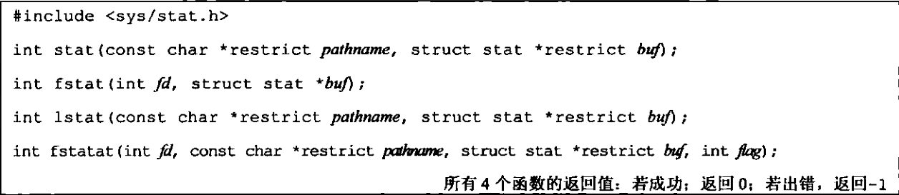
    - 一旦给出 pathname，stat 函数将返回与此命名文件有关的信息结构
    - fstat 函数获得已在描述符 fd 上打开文件的有关信息
    - lstat 函数类似于 stat，但是当命名的文件是一个符号链接时，lstat 返回该符号链接的有关信息，而不是由该符号链接引用的文件的信息
    - fstatat 函数为一个相对于当前打开目录（由fd 参数指向）的路径名返回文件统计信息。
      - flag 参数控制着是否跟随者一个符号链接。
        - 当 AT_SYMLINK_NOFOLLOW 标志被设置时，不跟随，而是返回符号链接本身的信息
        - 在默认情况下，返回的是符号链接锁指向的实际文件的信息
      - fd 的值是 AT_FDCWD 表示的是 pathname 相对于当前进程的工作目录
      - 如果 pathname 为绝对路径，fd 参数会被忽略。根据 flag 的值，和 stat 或 lstat 的作用一样
    - buf 参数
      - struct stat: 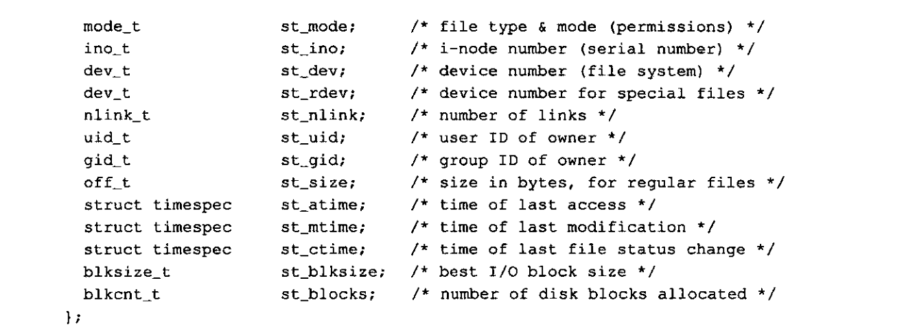
        - timespec struct 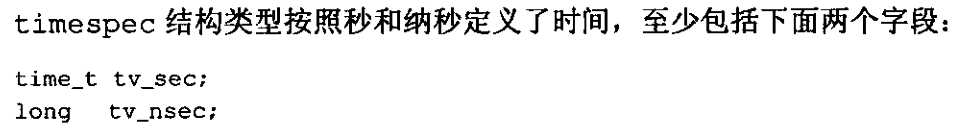
        - 文件长度
          - struct stat 结构体中的 st_size 表示以字节为单位的文件的长度。此字段只对普通文件、目录文件和符号链接有意义
          - FreeBSD 8.0、MacOS X 10.6.8 和 Solaris 10 对管道也定义了文件长度，它表示可从该管道中读到的字节数
        - st_blocks 是所分配的实际 512 字节块的块数
  - 文件类型
    - 普通文件（regular file）
    - 目录（directory file）
      - 包含了其他文件的名字以及指向与这些文件有关信息的指针。对一个目录文件具有读权限的任一进程都可以读该目录的内容，但只有内核可以直接写目录文件
    - 块特殊文件（block special file）
      - 这种类型的文件提供对设备（如磁盘）带缓冲的访问，每次访问以固定长度为单位进行。
    - 字符特殊文件（character special file）
      - 这种类型的文件提供对设备不带缓冲的访问，每 次访问长度可变。系统中的所有设备要么是字符特殊文件，要么是块特殊文件。
    - FIFO
      - 也称命名管道（named pipe）
    - 套接字（socket）
      - 用于进程之间的网络通信。也可用于一台宿主机上进程之间的非网络通信
    - 符号链接（symbolic link）
      - 指向另一个文件
    - POSIX.1允许实现将进程间通信（IPC）对象（如消息队列和信号量等）说明为文件。但是实际操作系统都没有将其表示为文件
  - 设置用户 ID 和设置组 ID
    - 与一个进程相关联的 ID 有 6 个或更多： 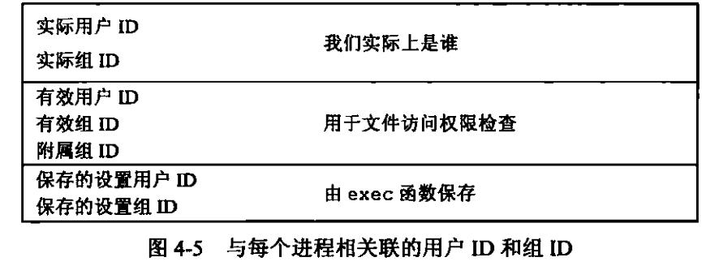
      - 实际用户 ID 和实际组 ID 标识我们究竟是谁。这两个字段在登录时取自口令文件中的登录项。通常，在一个登录会话期间这些值并不改变，但是超级用户进程有方法改变它们
      - 有效用户ID、有效组 ID 以及附属组 ID 决定了我们的文件访问权限。通常，有效用户 ID 等于实际用户 ID ，有效组 ID 等于实际组 ID。
      - 保存的设置用户 ID 和保存的设置组 ID 在执行一个程序时包含了有效用户 ID 和有效组 ID 的副本
    - 文件所有者和组所有者
      - 每个文件都有一个所有者和组所有者，分别由 stat 结构体中的 st_uid 和 st_gid 指定
    - st_mode 中有 2 个特殊的标志位：设置用户 ID（set-user-ID）位和设置组 ID（set-group-ID）位。
      - 其作用是：当执行该文件时，将进程的有效用户 ID （st_uid）或有效用户组 ID 设置为文件的组所有者 ID（st_gid）
      - 使用 S_ISUID 和 S_ISGID 宏来测试这两个位
  - 文件访问权限
    - 文件访问权限也包含在 stat 结构体中的 st_mode 字段中 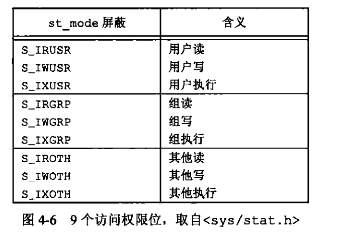
      - 用户 指的是文件所有者（owner）
      - 3 类访问权限（读、写、执行）以各种方式有不同的函数使用。不同的使用方式：
        - 用路径打开任一类型的文件时，对该路径中的每一级目录都要具有执行权限。这就是为什么对于目录其执行权限位常被称为搜索位的原因
          - 如果 PATH 环境变量指定了一个不具有执行权限的目录，则 shell 不会在该目录下找到可执行文件
        - 对于一个文件的读权限决定了我们是否能够打开现有文件进行读操作。这与open函数的O_RDONLY和O_RDWR标志相关。
        - 对于一个文件的写权限决定了我们是否能够打开现有文件进行写操作。这与open函数的O_WRONLY 和O_RDWR 标志相关
        - 为了在 open 函数中对一个文件指定 O_TRUNC 标志，必须对该文件具有写权限。
        - 为了在一个目录中创建一个新文件，必须对该目录具有写权限和执行权限。
        - 为了删除一个现有文件，必须对包含该文件的目录具有写权限和执行权限。对该文件本身则不需要有读、写权限。
        - 如果用 7 个 exec 函数中的任何一个执行某个文件，都必须对该文件具有执行权限。该文件还必须是一个普通文件
      - 内核对权限的认证：
        - 如果进程的有效用户 ID = 0（超级用户），则允许访问
        - 若进程的有效用户 ID = 文件的所有者 ID（进程拥有此文件），那么如果所有者对应的权限位被设置，则允许访问（例如，要读取该文件，则对应的读位应该为 1）
        - 若进程的有效组 ID 或进程的附属组 ID 之一等于文件的组 ID，那么，如果组适当的权限位被设置，则允许访问
        - 如果其他用户适当的权限位被设置，则允许访问
    - 新文件和目录的所有权
      - 新文件的用户 ID 设置为进程的有效用户 ID
      - 新文件的组 ID 可以是进程的有效组 ID；也可能是所在目录的组 ID
        - FreeBSD8.0和MacOSX10.6.8总是使用目录的组1D作为新文件的组ID。有些Linux文件系统使用 mount(1) 命令选项允许在 POSIX.1 提出的两种选项中进行选择。对于 Linux 3.2.0 和 Solaris10，默认情况下，新文件的组ID取决于它所在的目录的设置组ID位是否被设置。如果该目录的这一位已经被设置，则新文件的组ID设置为目录的组 ID；否则新文件的组 ID设置为进程的有效组 ID。
  - access 和 faccessat 函数 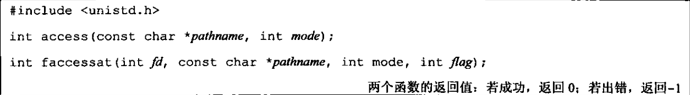
    - 使用实际用户 ID 和实际组 ID 进程权限认证，而不是使用有效用户 ID 和有效组 ID
    - 其作用只是用于判断实际用户 ID 或实际用户组 ID 是否对某个文件有某种权限
    - 测试文件是否已经存在，使用 F_OK mode，否则 mode 就是上图常量的按位或 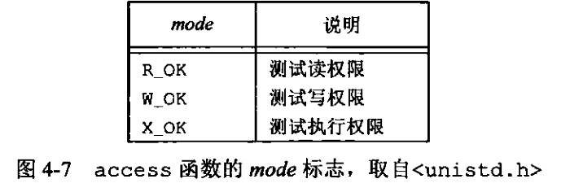
    - faccessat 函数的 flag 参数改变该函数的行为
      - flag = AT_EACCESS，访问检查用的是调用进程的有效用户 ID 和有效组 ID，而不是实际用户 ID 和实际组 ID
  - umask 函数
    - 为进程设置文件模式创建屏蔽字，并返回之前的值
    - cmask 是上图中 9 个常量的按位或构成的 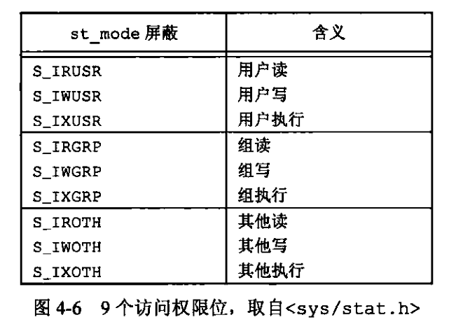
    - 在文件模式创建屏蔽字为 1 的位，在文件模式中的相应为一定会被关闭
    - 此函数不会改变其他进程的 umask
  - chmod、fchmod 和 fchmodat 函数 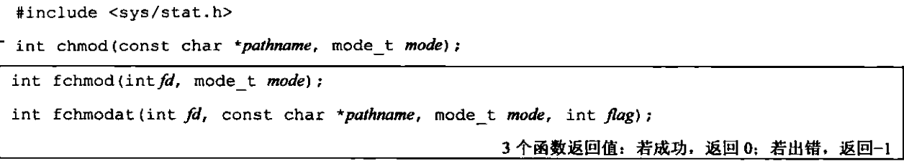
    - 更改现有文件的访问权限
    - fchmodat 的 flag 参数改变 fchmodat 的行为，设为 AT_SYMLINK_NOFOLLOW 标志时，不会跟随符号链接
    - 为了改变一个文件的权限位，进程的有效用户 ID 必须等于文件的所有者 ID，或者该进程必须具有超级用户权限
    - mode 参数 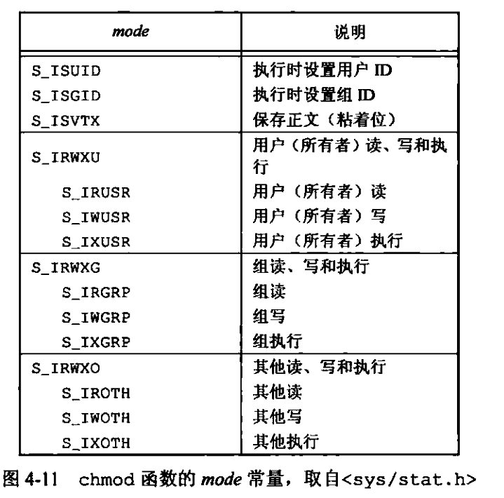
      - 粘着位（保存正文位 saved-text bit）
        - 如果对可执行文件设置此位，那么当程序第一次被执行，在其执行时，程序的正文部分的一个副本仍被保存在交换区，使得下次执行程序时能较快地将其装载如内存
        - 如果对目录设置此位，则只有对该目录具有写权限且满足下列条件之一，才能删除或重命名该目录下的文件
          - 拥有此文件
          - 拥有此目录
          - 是超级用户
  - chown、fchown、fchownat 和 lchown 函数 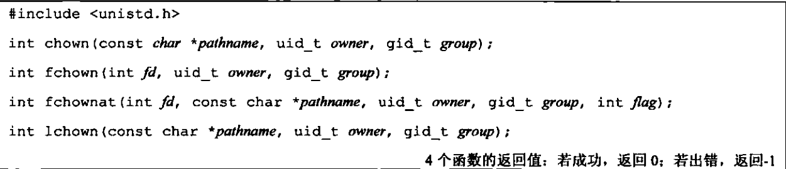
    - lchown 的功能与 chmod 类似，但是不会跟随符号链接（与 fchownat 中 flag = AT_SYMLINK_NOFOLLOW 效果一样）
    - 基于 BSD 的系统（包括 Linux， Mac OS）一直规定只有超级用户才能更改一个文件的所有者。这样做的原因是防止用户改变其文件的所有者从而摆脱磁盘空间限额对他们的限制
      - 如果某个进程拥有该文件（进程的有效用户 ID = 该文件的用户 ID），参数 owner = -1 或文件的用户 ID，且 group 等于进程的有效组 ID 或进程的附属组 ID 之一，那么一个非超级用户进程可以更改该文件的组 ID
        - _POSIX_CHOWN_RESTRICTED 生效时的行为
        - 这意味着，当 _POSIX_CHOWN_RESTRICTED 有效时，不能更改其他用户文件的用户ID。可以更改所拥用的文件的组ID，但只能改到当前用户所属的组。
      - 而按照 System V 则允许任意用户更改他们所拥有的文件的所有者
  - truncate 和 ftruncate 函数 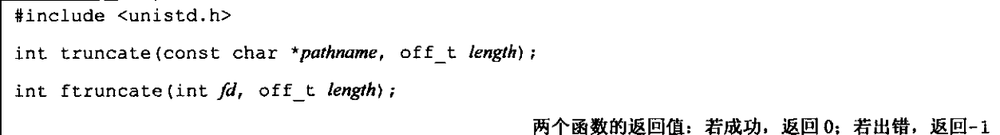
    - 在文件尾端处截断一些数据以缩短文件
    - 这两个函数将一个现有文件长度截断为length
      - 如果该文件以前的长度大于length，则超过length 以外的数据就不再能访问
      - 如果以前的长度小于length，文件长度将增加，在以前的文件尾端和新的文件尾端之间的数据将读作0（也就是可能在文件中创建了一个空洞）
  - 文件系统
    - 可以将磁盘分成一个或多个分区。每个分区可以包含一个文件系统。
    - 磁盘、分区和文件系统。i-node 是固定长度的记录项，包含了有关文件的大部分信息 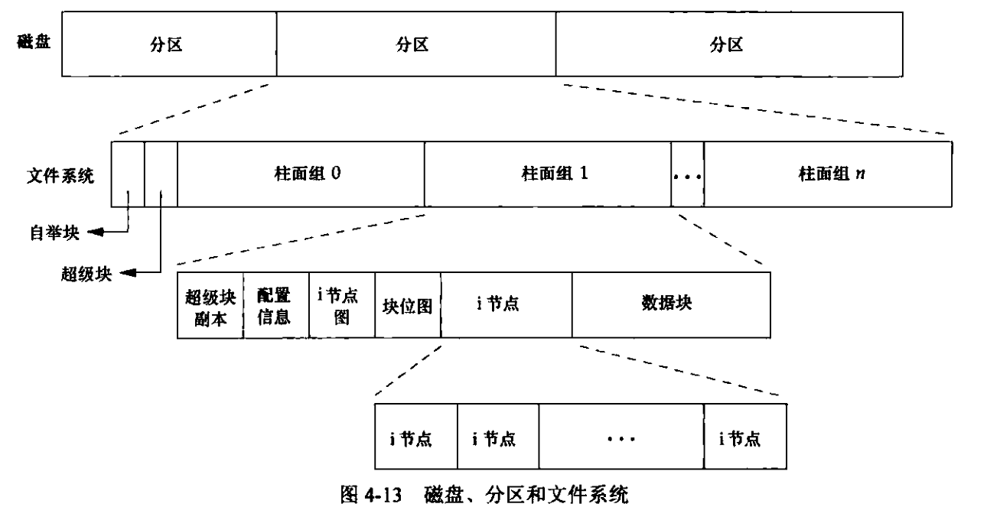
    - i-node 与 数据块 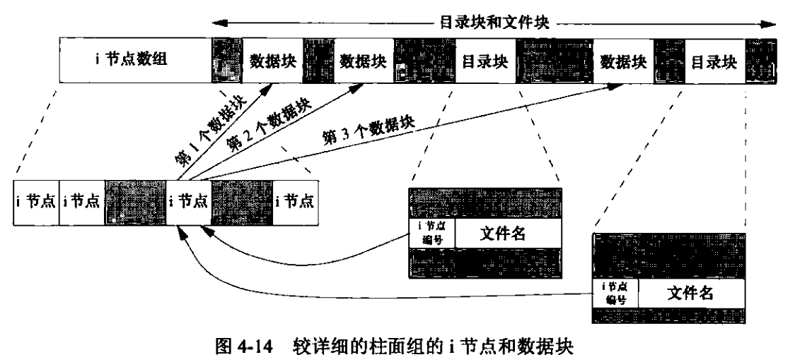
      - 每个 inode 都有一个链接计数（struct stat 结构体中的 st_nlink 字段），其值是指向该 inode 的目录项数（被称为硬链接），只有当链接计数减少至 0 时，才可删除该文件
      - 符号链接（symbolic link）的实际内容是该符号链接所指向的文件的名字。符号链接的 i-node 的文件类型是 S_IFLNK。
        - 为了解决硬链接的限制：
          - 通常要求链接和文件位于同一个文件系统中
          - 只有超级用户才能创建指向目录的硬链接
        - 函数对符号链接的处理 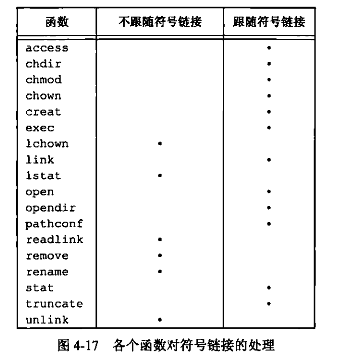
      - inode 存储了文件有关的所有信息，但是有两项重要的数据存放在目录项中：文件名和 inode 编号，inode 编号的数据类型是 ino_t
        - 因为目录项不能指向其它文件系统的 inode，所以，ln（1）命令不能跨文件系统创建链接
    - 进程与 inode 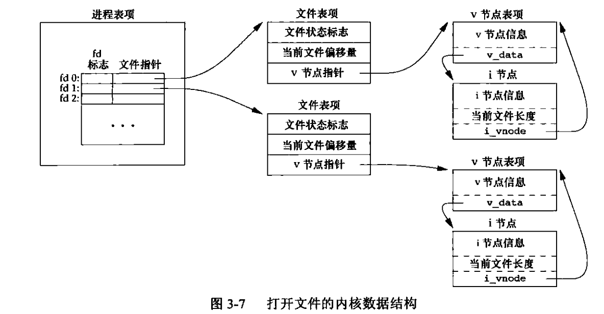
  - link、linkat、unlink、unlinkat 和 remove 函数
    - link 和 linkat 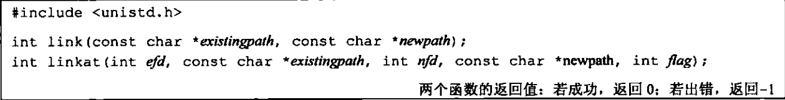
      - 创建的是硬链接
      - 创建一个新目录项 newpath，引用现有文件 existingpath
      - 如果 newpath 已经存在，则出错。只创建 newpath 的最后一个分量，路径中的其他部分应当已经存在
      - linkat 函数的现有文件由 efd 和 existingpath 共同指定
      - flag 参数控制 linkat 函数是创建指向现有符号链接的链接（AT_SYMLINK_NOFOLLOW）还是创建现有符号链接指向的文件的链接 （AT_SYMLINK_FOLLOW）
    - unlink 和 unlinkat 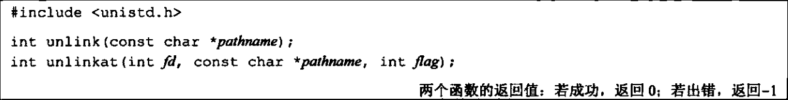
      - 删除目录项，并将有 pathname 所引用文件的链接计数减一
      - flag = AT_REMOVEDIR 时，可以删除目录
      - 如果 pathname 打开的文件有进程已经打开了它，则不会立刻删除该文件
    - remove 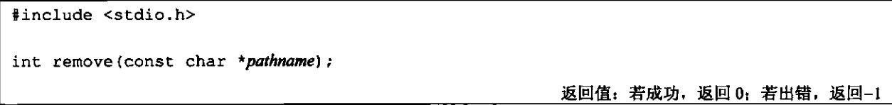
      - 解除对一个文件或目录的链接。对于文件，remove 的功能与 unlink 相同，对于目录，remove 的功能与 rmdir 相同
  - rename 和 renameat 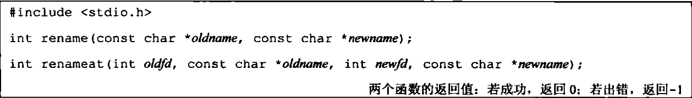
    - oldname
      - 若 oldname = 文件，如果 newname 已存在，则它不能是一个目录。然后，将原来的目录项删除然后将 oldname 重命名为 newname。调用进程对于这两个目录都要具有写权限，因为将更改这两个目录
      - 若 oldname = 目录，则为该目录重命名。如果 newname 已经存在，则必须引用一个空目录
    - 如果 oldname 或 newname 是符号链接，则处理的是符号链接本身
  - symlink 和 symlinkat 函数 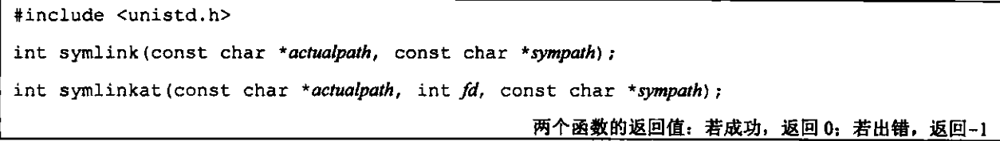
    - 创建指向 actualpath 的新目录项 sympath
    - 不要求 actualpath 已经存在
  - readlink 和 readlinkat 函数 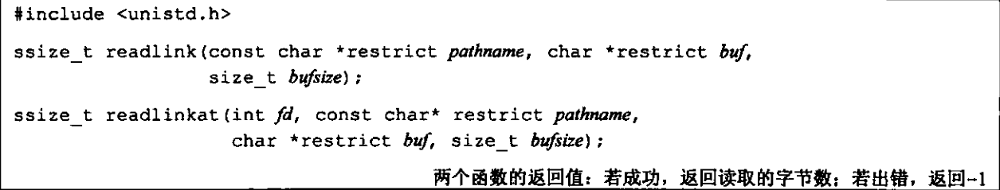
    - 因为 open 函数跟随符号链接，所以，需要这两个函数来打开链接本身，并读取该连接中的路径（名字）
    - 返回的符号链接的内容不以 null 字节结尾
  - 文件的时间
    - 与每个文件相关的 3 个时间值 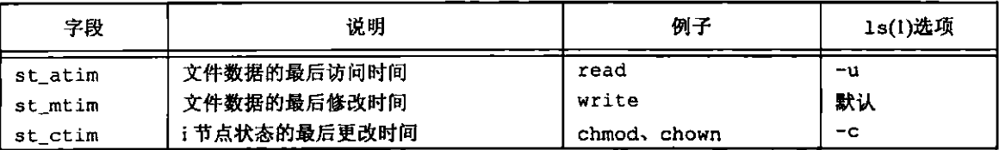
    - 各种函数对访问、修改和状态更改时间的作用 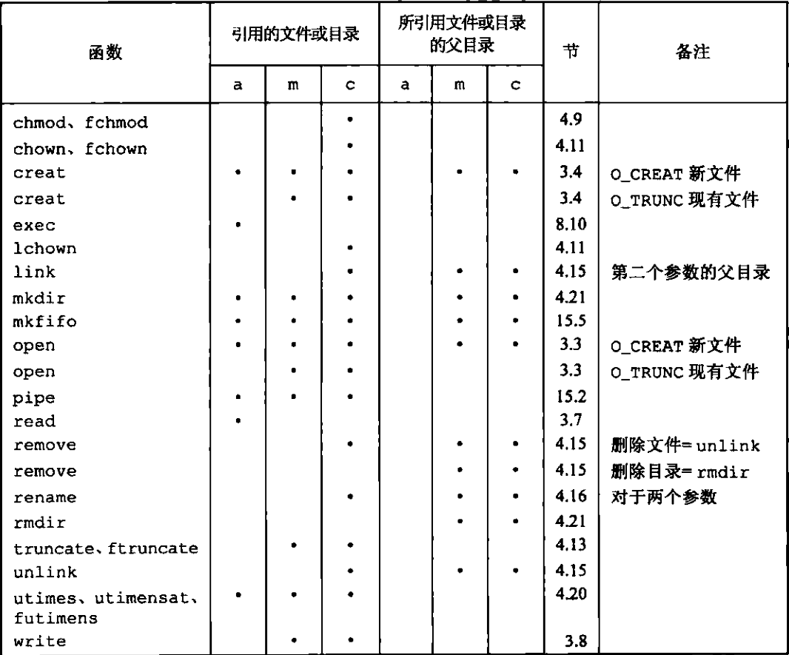
  - futimens、utimensat 和 utimes 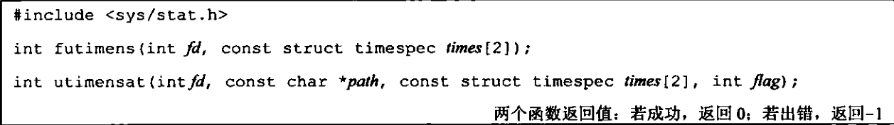
    - 对一个文件的访问和修改时间可以用这几个函数更改
    - times 的第一个元素包含访问时间，第二个元素包含修改时间
      - 如果 times = null，则访问时间和修改时间都设置为当前时间
      - 如果 times 中的数组元素的 tv_nsec 字段的值为 UTIME_NOW，则相应的时间就设置为当前时间，忽略当前的 tv_sec 字段
      - 如果 times 中的数组元素的 tv_nsec 的值为 UTIME_OMIT，则相应的时间戳保持不变，忽略相应的 tv_sec 字段
      - 如果不是上述情况，将对应的时间设置为指定的参数
    - utimes 函数 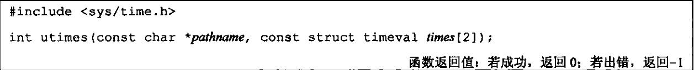
      - 对路径进行操作
      - struct timeval 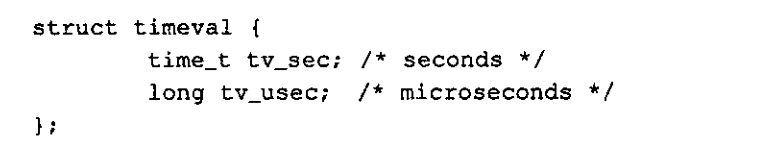
  - mkdir、mkdirat 和 rmdir 函数 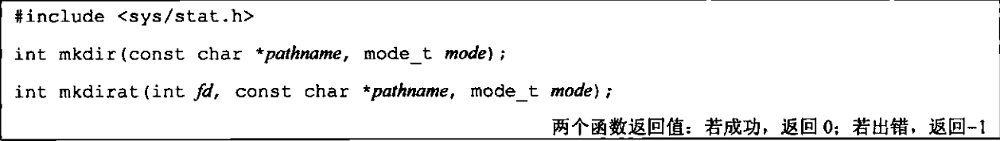
    - . 和 .. 目录自动创建
    - mode 指定目录的权限
    - rmdir 函数 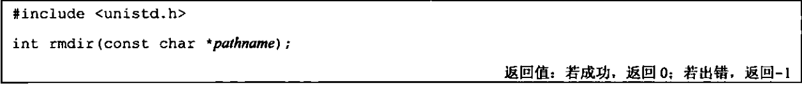
      - 只能删除空目录
  - 读取目录
    - 函数 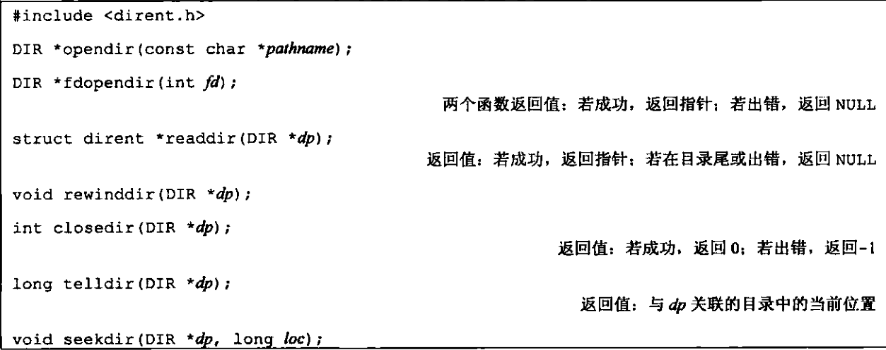
      - fdopendir 函数将打开的文件描述符转换成目录处理函数需要的 DIR 结构
  - chdir、fchdir 和 getcwd 函数 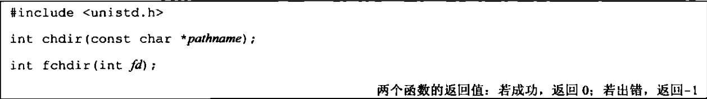
    - chdir 和 fchdir 可以改变当前工作目录
    - getcwd 
  - 设备特殊文件
    - struct stat 结构体中的 st_dev 和 st_rdev
    - 每个文件系统所在的存储设备都主要由主、次设备号表示
      - 设备号所用的数据类型是基本系统数据类型 dev_t。主设备号标识设备驱动程序；次设备号标识特定的子设备
      - 例如：一个磁盘驱动器包含多个文件系统，这些文件系统具有相同的主设备号，但是次设备号却不同
      - 可以使用 major 和 minor 来分别访问主、次设备号。其中，这两个宏的参数都是 st_dev
    - 系统中与每个文件名关联的 st_dev 值是文件系统的设备号，该系统包含了这一文件名及其对应的 inode
    - 只有字符特殊文件和块特殊文件才有 st_rdev 。此值包含实际设备的设备号
  - 文件访问权限总结 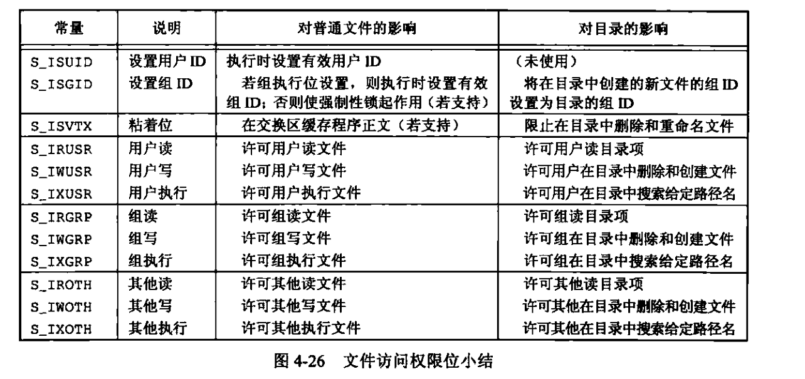
- 无缓冲 I/O（unbuffered I/O）
  - 指的是这些函数都调用内核中的一个系统调用
  - open 或 openat 函数用于打开或创建一个文件 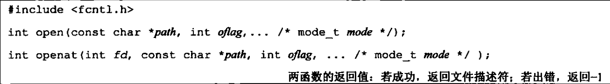
    - path 是打开或创建文件的名字
    - oflag 参数
      - O_RDONLY
        - 只读打开
      - O_WRONLY
        - 只写打开
      - O_RDWR
        - 读写打开
      - O_EXEC
        - 只执行打开
      - O_SEARCH
        - 只搜索打开（应用于目录）
        - O_SEARCH常量的目的在于在目录打开时验证它的搜索权限。对目录的文件描述符的后续操 作就不需要再次检查对该目录的搜索权限
      - O_APPEND
        - 每次写时都追加到文件的末尾
      - O_CLOEXEC
        - 把 FD_CLOEXEC 常量设置为文件描述符标志
      - O_CREAT
        - 如果此文件不存在则创建它
        - 使用此选项时，open 函数需要同时说明函数的最后一个参数 mode。用 mode 来指定该新文件的访问权限位
      - O_DIRECTORY
        - 如果 path 引用的不是目标目录，则出错
      - O_EXCL （exclusive 独占）
        - 如果同时指定了 O_CREAT，而文件已存在，则出错
        - 可以用来测试一个文件是否已经存在，如果不存在，则创建此文件，这时测试和创建两者成为一个原子操作
      - O_NOCTTY
        - 如果 path 引用的是终端设备，则不将该设备分配为此进程的控制终端
      - O_NOFOLLOW
        - 如果 path 引用的是一个符号链接，则出错
      - O_NONBLOCK
        - 如果 path 引用的是一个 FIFO、一个块特殊文件或者一个字符特殊文件，则此选项为本次打开操作和后续的 IO 操作设置为非阻塞方式
      - O_SYNC
        - 使每次 write 等待物理 IO 操作完成，包括由该 write 操作引起的文件属性更新所需的 IO
      - O_TRUNC
        - 如果此文件存在，而且为只写或读写成功打开，则将其长度截断为 0
      - O_TTY_INIT
        - 如果打开一个还未打开的终端设备，设置非标准的 termios 参数值，使其符合 Single UNIX Specification
      - O_DSYNC （Data Sync）
        - 使每次 write 操作要等待物理 IO 完成，但是如果该写操作并没有添加或减少新的字节，而是改写现有的字节，则文件的时间属性不会同步更新。
        - 与 O_SYNC 标志的区别
          - O_DSYNC 仅当文件属性关于数据的部分需要更新时，才会同时阻塞更新文件属性的这一部分 IO。所以，如果仅仅是改写文件内容，则不需要等待文件属性的 IO
          - O_SYNC 对文件的每一次 write 操作都将在 write 返回前更新文件时间，这与是否改写现有字节或追加、写文件无关
      - O_RSYNC
        - 使每一个以此文件描述符作为参数进行的 read 操作等待，直至所有对文件同一部分挂起的写操作都完成
    - openat 函数希望解决的问题
      - 让线程可以使用相对路径名打开目录中的文件，而不再用相对路径打开文件时，只能相对于当前工作目录
      - 避免 time-of-check-to-time-of-use（TOCTTOU）错误
        - TOCTTOU 错误：如果有两个基于文件的函数调用，其中第二个调用依赖于第一个调用的结果，那么程序是脆弱的。因为两个调用并不是原子操作，在两个函数调用之间文件可能改变了，这样也就造成了第一个调用的结果就不再有效，使得程序最终的结果是错误的。
    - fd 参数
      - 如果 path 参数指定的绝对路径名，则忽略 fd 参数，openat 函数相当于 open 函数
      - 如果 path 参数指定的是相对路径名，fd 参数表示相对路径名在文件系统中的开始地址，fd 参数是通过打开相对路径名所在的目录来获取
      - 如果 path 是相对路径，且 fd = AT_FDCWD，则路径名在当前工作目录中获取
    - open 和 openat 函数返回的文件描述符一定是最小的未用描述符的数值
    - 可以使用常量 _POSIX_NO_TRUNC 决定是否截断过长的文件名或路径名。如果不截断，则出错，并将 errno 设置为 ENAMETOOLONG
  - create 函数创建一个文件 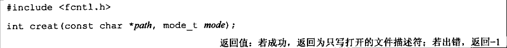
    - 等价于 
    - 以只写的方式打开所创建的文件
  - close 函数用来关闭一个打开的文件 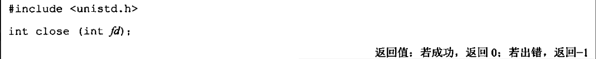
    - 关闭一个文件时，还会释放该进程加在文件上的所有记录锁
    - 当进程终止时，内核会自动关闭它所有打开的文件
  - lseek 函数显式地设置文件偏移量 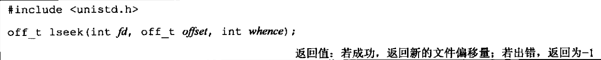
    - 每个打开的文件都有一个与其关联的当前文件偏移量（current file offset），通常是一个非负整数，用以度量从文件开始处计算的字节数
      - 通常，读写操作都从当前文件偏移量开始，并使偏移量增加锁读写的字节数
      - 按系统默认情况，偏移量被设置为 0。除非指定了 O_APPEND 选项
    - 对 offset 的解释与 whence 有关
      - whence = SEEK_SET
        - 该文件的偏移量设置为距文件开始处offset个字节
      - whence = SEEK_CUR
        - 将该文件的偏移量设置为其当前值加offset，offset可为正或负
      - whence = SEEK_END
        - 该文件的偏移量设置为文件长度加offset，offset 可正可负
    - off_t 类型
      - 大多数平台使用两组接口以处理文件偏移量，一组使用 32 位文件偏移量，另一组使用 64 位文件偏移量
      - 可以通过 sysconf 函数确定支持何种 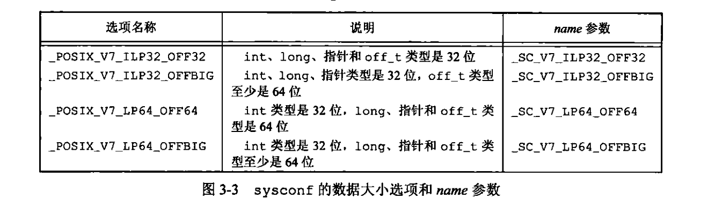
      - c99编译器要求使用 getconf(1) 命令将所期望的数据大小模型映射为编译和链接程序所需的标志。根据每个平台支持环境的不同，可能需要不同的标志和库。
      - 或者可以将符号常量 _FILE_OFFSET_BITS 设置为 64,以支持 64 位偏移量。但是这种方法并不能保证应用程序是可移植的
        - 定义为了 32 之后，offset 仍为 8 字节 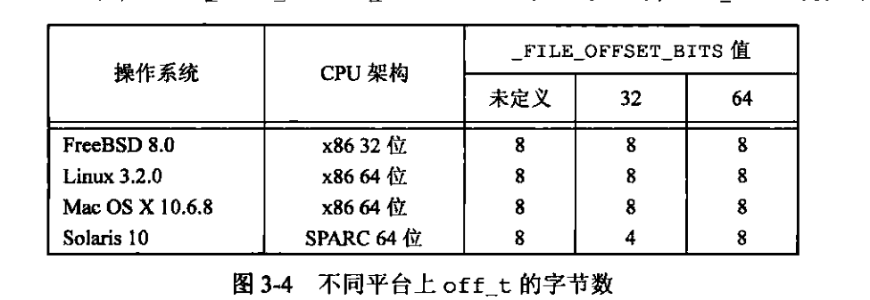
    - 当文件偏移量大于当前文件的长度时，将在下一次写操作时加长该文件，并在文件中构成一个空洞。空洞内的数据都被视为 0。
      - 文件中的空洞并不要求在磁盘上占用空间，具体如何处理取决于文件系统
    - 如果文件描述符指定的是一个管道、FIFO 或网络套接字，则 lseek 返回 -1，并将 errono 设置为 ESPIPE
    - 某些设备可能允许负的偏移量，故而判断 lseek 是否出错要使用 == -1，而不能使用 &lt; 0
  - read 函数从打开文件中读取数据 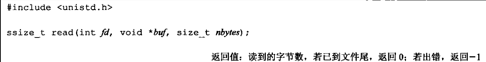
    - 如 read 成功，则返回读到的字节数。如已到达文件的尾端，则返回 0。
    - 读到的字节数小于指定要读的字节数的情况
      - 读普通文件时，在读到要求字节数之前已到达了文件尾端。例如，若在到达文件尾端之前有30个字节，而要求读100个字节，则read返回30。下一次再调用read时，它将返回0（文件尾端）
      - 当从终端设备读时，通常一次最多读一行（第18章将介绍如何改变这一点）
      - 当从网络读时，网络中的缓冲机制可能造成返回值小于所要求读的字节数。
      - 当从管道或FIFO读时，如若管道包含的字节少于所需的数量，那么read将只返回实际 可用的字节数
      - 当从某些面向记录的设备（如磁带）读时，一次最多返回一个记录
      - 当一信号造成中断，而已经读了部分数据量时， 读操作从文件的当前偏移量处开始，在成功返回之前，该偏移量将增加实际读到的字节数
  - write 函数用于向打开文件写数据 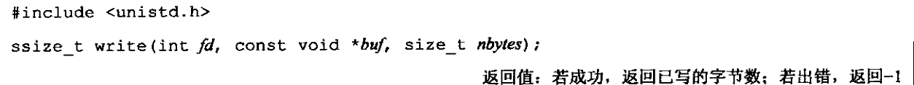
    - 返回值通常与参数 nbytes 相同，否则，表示出错。
    - 出错的原因可能是磁盘已满或者超过了一个给定进程的文件长度限制
  - 文件共享
    - UNIX 系统支持在不同进程之间共享地打开一个文件
    - 内核使用 3 中数据结构来表示打开的文件，它们之间的关系决定了在文件共享方面一个进程对另一个进程可能产生的影响
      - 每个进程在进程表中都有一个记录项，其包含打开的文件描述符表，每个描述符在该表中占用一项
        - 与每个文件描述符关联的是
          - 文件描述符标志
          - 指向文件表项的一个指针
        - 图解 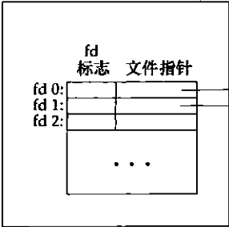
      - 内核为所有打开文件维护一张文件表，每个文件表项包含：
        - 文件状态标志（读、写、读写和非阻塞等）
        - 当前文件的偏移量
        - 指向该文件 v-node 表项的指针。创建 v 节点结构的目的是对在一个计算机系统上的多文件系统类型提供支持。
        - 图解 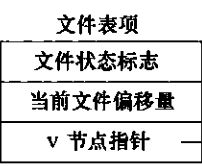
      - 每个打开文件（或设备）都有一个 v-node 结构
        - v-node 包含了文件类型和对此文件进行各种操作的函数的指针
        - 对于大多数文件，v 节点还包含了该文件的 i-node 索引节点，包含了文件的所有者、文件长度、指向文件实际数据块在磁盘上所在位置的指针等
        - 图解 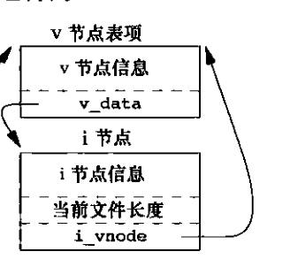
  - pread 和 pwrite 函数（p 指的是 position） 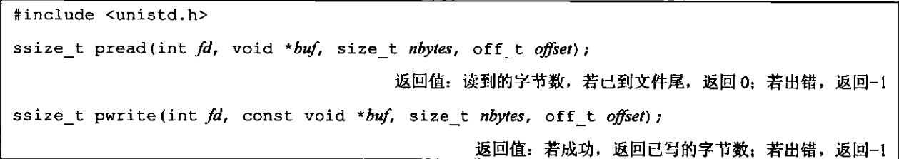
    - 允许原子性地定位并执行 I/O
    - 这些函数不更新当前文件的偏移量
  - dup 和 dup2 函数 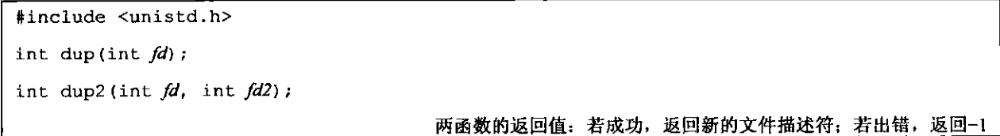
    - 用来复制现有的一个文件描述符
    - 由 dup 返回的新文件描述符一定是当前可用文件描述符中的最小数值，
    - dup2 可以用 fd2 参数指定新描述符的值
      - 如果 fd2 已经打开，则先将其关闭
      - 如果 fd = fd2，则 dup2 返回 fd2，而不关闭它
      - 否则，fd2 的 FD_CLOEXEC 文件描述符标志就会被清除，这样 fd2 在进程调用 exec 时是打开状态，不会被关闭（exec 执行的程序具有 fd2 文件描述符）
  - sync、fsync、fdatasync 函数 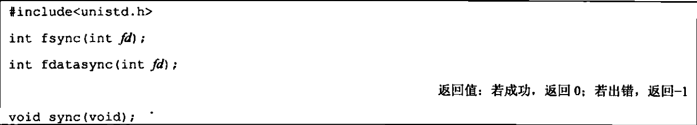
    - 传统的 UNIX 系统实现在内核中设有缓冲区高速缓存或页高速缓存，大多数磁盘 IO 都通过缓冲 区进行。当我们向文件写入数据时，内核通常先将数据复制到缓冲区中，然后排入队列，晚些时候再写入磁盘。这种方式被称为延迟写（delayedwrite）
    - sync 只是将所有修改过的块缓冲区排入写队列，然后就返回，它并不等待实际写磁盘操作结束（在 linux 中，sync 函数等待磁盘操作结束才返回）
      - 会有一个守护进程周期性地调用 sync 函数
    - fsync 只对有文件描述符 fd 指定的一个文件起作用
    - fdatasync 类似与 fsync，但是只影响文件的数据部分。除了数据外，fsync 还会同步更新文件的属性
  - fcntl 函数 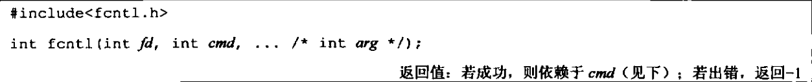
    - 有 5 种功能
      - 1.复制一个已有的描述符（cmd = F_DUPFD 或 F_DUPFD_CLOEXEC）
      - 2.获取/设置文件描述符标志（cmd = F_GETFD 或 F_SETFD）
      - 3.获取/设置文件状态标志（cmd = F_GETFL 或 F_SETFL）
      - 4\. 获取/设置记录锁（cmd = F_GETLK、F_SETLK 或 F_SETLKW）
      - 5.获取/设置异步 I/O 所有权（cmd = F_GETOWN 或 F_SETOWN）
    - cmd
      - F_DUPFD
        - 复制文件描述符 fd。新文件描述符作为函数值返回。返回值是尚未打开的各描述符中大于或等于第 3 个参数值（取为整型值）中各值的最小值
        - 新描述符与 fd 共享同一文件表项。但是，新描述符有它自已的一套文件描述符标志，其 FD_CLOEXEC 文件描述符标志被清 除（这表示该描述符在exec时仍保持有效）
      - F_DUPFD_CLOEXEC
        - 复制文件描述符，设置与新描述符关联的FDCLOEXEC文件描述符标志的值，返回新文件描述符。
      - F_GETFD
        - 对应于 fd 的文件描述符标志作为函数值返回。当前只定义了一个文件描述符标志 FD_CLOEXEC。
      - F_SETFD
        - 对于 fd 设置文件描述符标志,新标志值按第 3 个参数（取为整型值）设置。
      - F_GETFL
        - 返回 fd 的文件状态标志，就是 open 函数的 oflags 参数 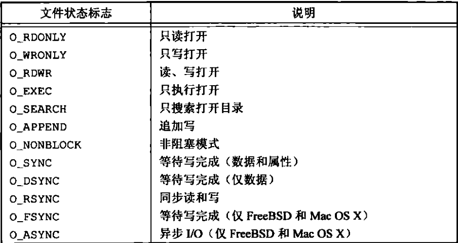
          - 5个访问方式标志（O_RDONLY、O_WRONLY、O_RDWR、O_EXEC 以及O_SEARCH ）并不各占1位（由于历史原因，前3个标志的值分别是0、1和 2。这 5 个值互斥，一个文件的访问方式只能取这 5 个值之一）。因此首先必须用屏蔽字O_ACCMODE 取得访问方式位，然后将结果与这 5 个值中的每一个相比较。
            - 例如 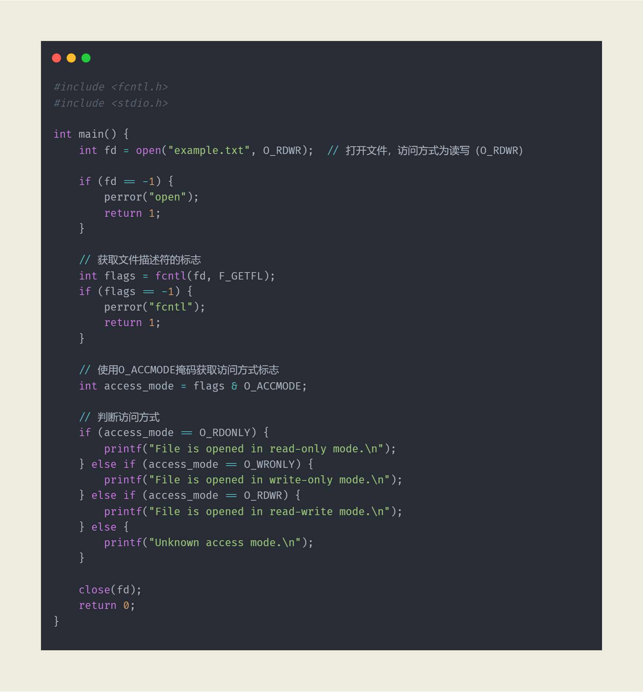
      - F_SETFL
        - 将文件状态标志设置为第 3 个参数的值（取为整型值）。可以更改的几个标志是:O_APPEND、O_NONBLOCK、O_SYNC、O_DSYNC、O_RSYNC、 O_FSYNC 和 O_ASYNC.
      - F_SETOWN
        - 获取当前接收 SIGIO 和 SIGURG 信号的进程 ID 或进程组 ID
      - F_SETOWN
        - 设置接收 SIGIO 和 SIGURG 信号的进程 ID 或进程组 ID。正的 arg 指定一个进程 ID，负的 arg 表示等于 arg 绝对值的一个进程组 ID。
  - ioctl 函数 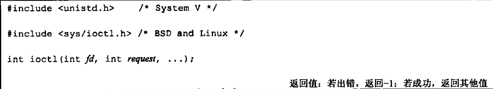
    - IO 操作的杂物箱
    - 终端 IO 的命令都需要头文件 termios.h
    - 每个设备驱动程序可以定义它自己专用的一组 ioctl 命令，系统则为不同种类的设备提供 通用的 ioctl 命令
    - FreeBSD 支持的通用 ioctl 命令的一些类别 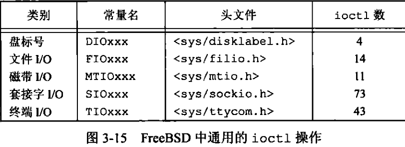
  - /dev/fd 目录
    - 打开文件 /dev/fd/n 等效与使用 dup 函数复制文件描述符 n
    - 调用 open("/dev/fd/0", accessmode)，系统会忽略掉 accessmode 参数，而其他的 flags 参数会被解析
      - 例如，若描述符 0 先前被打开为只读，那么 也只能对 fd 进行读操作。即使系统忽略打开模式，而且下列调用是成功的（但是仍然不能对 fd 进行写操作）： 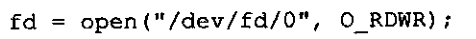
      - Linux 与上述语义不同： 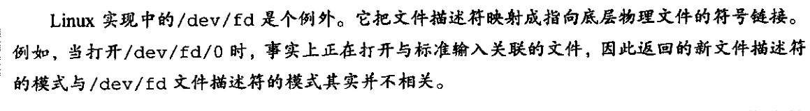
- 标准 I/O
  - 流和 FILE 对象
    - 流
      - 标准 IO 库围绕流（stream） 进行
      - 流的定向（stream's orientation）决定所读、写的字符是单字节的还是多字节的
        - 当一个流最初被创建时，它并没有定向。
        - 如果在未定向的流上使用一个多字节 IO 函数（&lt;wchar.h&gt;），则将该流的定向设置为宽定向的。同理，在使用单字节 IO 函数时，会将流定向为单字节定向的
        - 只有两个函数可以改变流的定向
          - fwide 函数用于设置流的定向 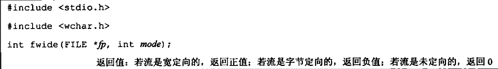
            - mode &lt; 0,尝试使指定的流指定为字节定向
            - mode = 0,不改变流的定向，只返回流的定向的值
            - mode &gt; 0,尝试是指定的额流指定为宽定向的
            - fwide 并不改变已定向流的定向
            - 没有出错返回，只能在调用之前清除 errno，然后调用完成之后检查 errno
    - FILE 对象
      - fopen 函数返回一个指向 FILE 对象的指针，包含了用于实际 IO 的文件描述符，指向用于该流缓冲区的指针，缓冲区的长度，当前在缓冲区的字符数和出错标志等
      - 每个进程都预定一了文件指针（FILE* 类型的指针） stdin, stdout, stderr 以引用标准输入，标准输出，标准错误
  - 缓冲
    - 标准 IO 提供了 3 中类型的缓冲
      - 全缓冲
        - 在填满缓冲区之后才进行实际 IO 操作
      - 行缓冲
        - 当在输入或输出中遇到换行符时，标准 IO 库执行 IO 操作
        - 只要填满了缓冲区，即使没有遇到换行符也执行 IO 操作
        - 如果从一个不带缓冲的流或者从一个行缓冲的流中得到输入数据，就会冲洗所有行缓冲输出流
      - 不带缓冲
        - 标准 IO 库不对字符进行缓冲存储
        - stderr 流通常是不带缓冲的
    - ISO C 要求的缓冲
      - 当且仅当标准输入和标准输出并不指向交互式设备时，它们才是全缓冲的
      - 标准错误绝不会是全缓冲的
    - setvbuf 函数改变任意流的缓冲类型，setbuf 函数打开或关闭缓冲机制 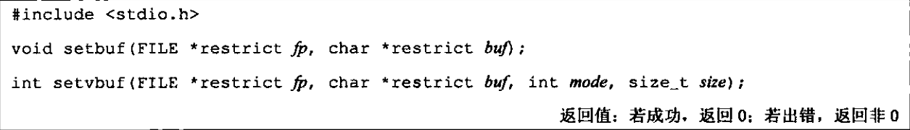
      - setbuf 函数：为了带缓冲进行 IO，参数 buf 必须指向一个长度为 BUFSIZ（&lt;stdio.h&gt;） 的缓冲区，通常再调用之后该流是全缓冲的，但是如果该流于一个终端设备相关，某些系统也可能将其设置行缓冲的
      - 为了关闭缓冲，将 setbuf 的 buf 参数设置为 NULL
      - setvbuf 函数的 mode 参数可以用于指定缓冲的类型
        - _IOFBF，全缓冲
        - _IOLBF，行缓冲
        - _IONBF，不带缓冲
      - 子主题 4
    - 使用 fflush 函数来强制冲刷一个流 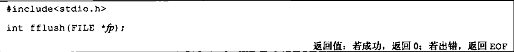
      - 如果 fp = NULL，则将导致所有输出流都没冲刷
  - 打开流 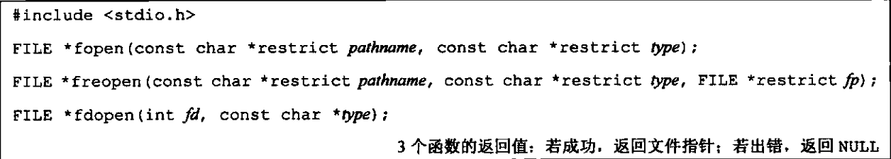
    - fopen 函数代开路径为 pathname 的指定文件
    - freopen 函数在一个指定的流上打开一个指定的文件，如果该流已经打开，则先关闭该流；如果该流已经定向，则会清除该定向
      - 一般用于井一个指定的文件打开为一个预定义的流：标准输入，标准错误和标准输出
    - fdopen 将标准 IO 流与文件该描述符相结合
      - 常用于将管道和网络通信通道函数返回的文件描述符与标准 IO 流相结合
    - type 参数
      - 参数 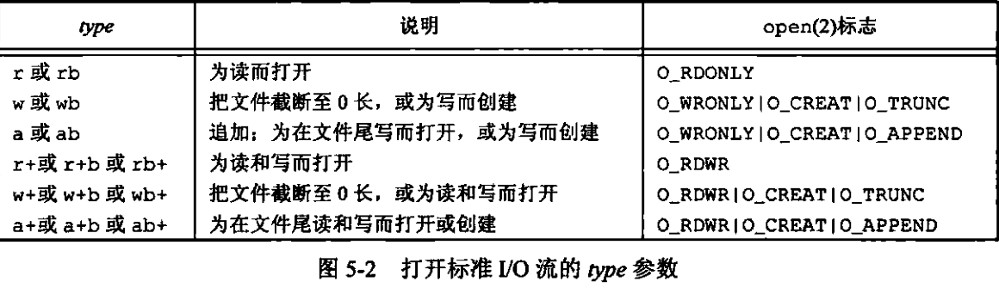
        - 使用字符b作为type的一部分，这使得标准IVO系统可以区分文本文件和二进制文件。因为UNIX内核并不对这两种文件进行区分，所以在UNTIX系统环境下指定字符b作为type的一部分实际上并无作用。
        - fdopen 函数不会截断文件，也不会创建文件
      - 当以读和写类型打开一个文件时（type 中含有 + 号），有下列限制：
        - 如果中间没有fflush、fseek、fsetpos 或rewind，则在输出的后面不能直接跟随输入
        - 如果中间没有fseek、fsetpos或rewind，或者一个输入操作没有到达文件尾端，则在输入操作之后不能直接跟随输出。
      - 当 type 中有 w 或 a 创建一个新文件时，POSIX.1 规定使用下面的权限位来创建文件： 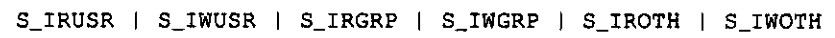
  - 关闭流 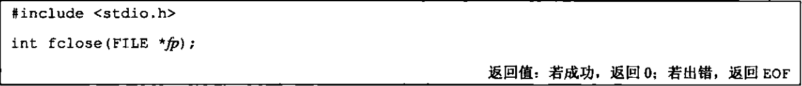
    - 在该文件被关闭之前，冲洗缓冲中的输出数据。缓冲区中的任何输入数据被丢弃。如果标准 I/O库已经为该流自动分配了一个缓冲区，则释放此缓冲区。
    - 当一个进程正常终止时（直接调用exit函数，或从main函数返回），则所有带未写缓冲数 据的标准I/O流都被冲洗，所有打开的标准1VO流都被关闭。
  - 读写流
    - 非格式化 IO
      - 每次一个字符的 IO
        - 子主题 1
        - 读 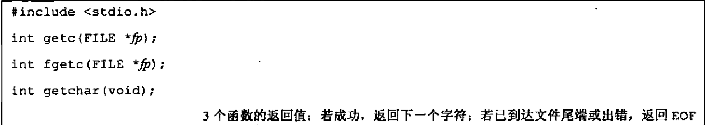
          - getchar 从 stdin 中读取字符
          - getc 可以被实现为宏，fgetc 不能实现为宏
          - 这三个函数不论是出错还是到达文件的末尾都返回相同的值，为了区分这两种不同的情况，应使用 ferror 和 feof 函数 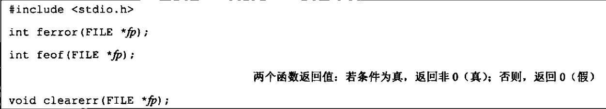
            - 在大多数实现中，在 FILE 对象中维护了两个标志：出错标志和文件结束标志
            - 调用 clearerr 可以清除上述两个标志
        - 写
          - ungetc 函数可以字符压回到流中
            - 不能压回 EOF
            - 当已经到达文件尾端时，仍可以回送一个字符。下次读将返回该字符，再读则返回EOF。之所以能这样做的原因是，一次成功的ungetc调用会清除该流的文件结束标志。
            - 压回的顺序与读取的顺序相反
          - 输出函数 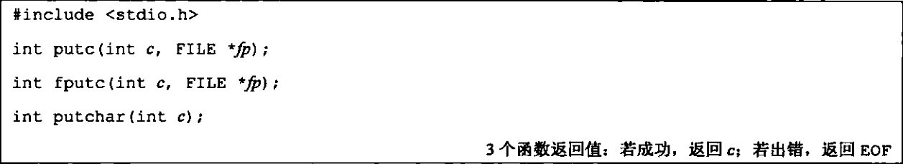
            - 与输入函数一样，putchar(c)等同于putc(c，stdout），putc 可被实现为宏，而 fputc 不能实现为宏。
      - 每次一行 IO
        - 读
          - fgets 和 gets 函数 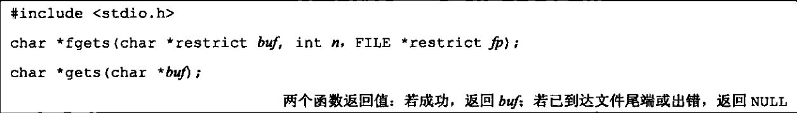
          - gets 从标准输入读
            - 不推荐使用，因为不能指定缓冲区的长度
            - gets 不将换行符存储缓冲区中
          - fgets 函数必须指定缓冲区的长度 n。此函数读取不超过 n - 1 个字符，缓冲区以 null 字节结尾
        - 写
          - fputs 和 puts 函数 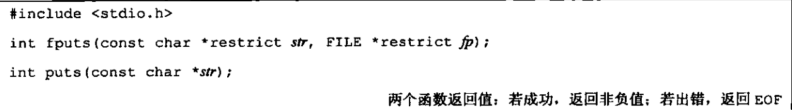
      - 直接 IO（二进制 IO）
        - 每次 IO 操作读或写某种数量的对象，而每个对象具有指定的长度
        - 读写函数： fread、fwrite 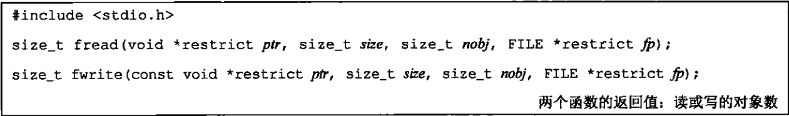
    - 格式化 IO
      - 写
        - 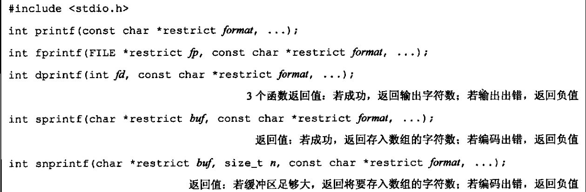
        - 将可变参数列表替换为 arg 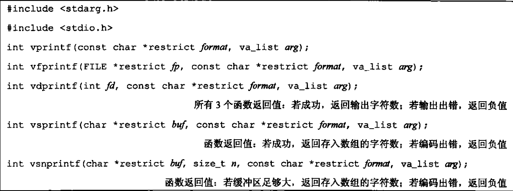
      - 读
        - scanf 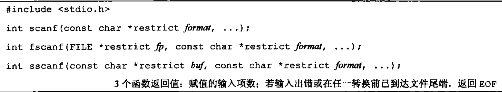
          - sscanf 用于从指定的 buf 中读取格式化的数据
  - 定位流
    - ftell 和 fseek 函数使用长整形变量来存储偏移量；而 ftello 和 fseeko 使用 off_t 类型来存储 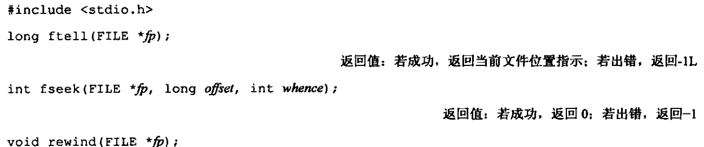
      - wence 可以是 SEEK_SET，SEEK_CUR，SEEK_END
      - ftello 和 fseeko 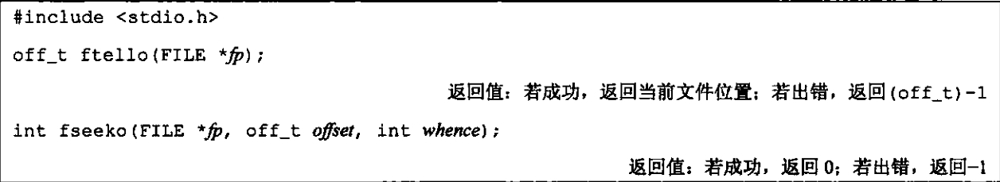
    - fgetpos 和 fsetpos 函数使用 fpos_t 来记录文件的位置 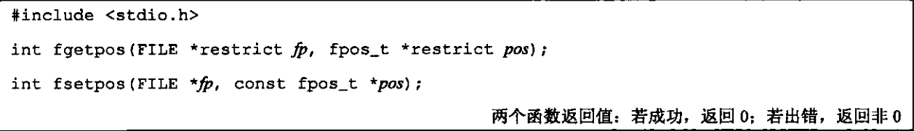
      - 需要移植到非UNIX系统上运行的应用程序应当使用fgetpos和fsetpos。
    - rewind 函数用于将一个流设置到文件的起始位置
  - 使用 fileno 可以取得文件指针下的文件描述符 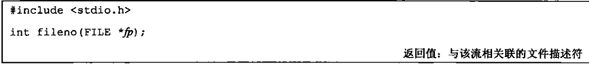
  - 临时文件 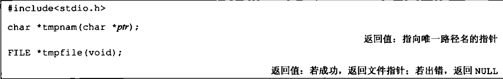
    - 每次调用 tmpnam 都产生一个不同的路径名，最多的调用次数是 TMP_MAX，定义在 stdio.h 中
    - 若 ptr = NULL，则产生的路径名存放在一个静态区中，后续调用 tmpname 时，会重写该静态区（这意味着，如果要调用此函数多次，并且想要保存该路径名，则不能保存指针）
    - 若 ptr != NULL，则认为该指针指向长度至少是 L_tmpnam 个字符的数组，调用函数生成的路径名页存放在该数组中，ptr 也作为返回值返回
    - tmpfile 创建一个临时二进制文件（类型 wb+），在关闭该文件或程序结束时自动删除这种文件（UNIX 对二进制文件不进行特殊的区分）
    - mkdtemp 和 mkstemp 函数 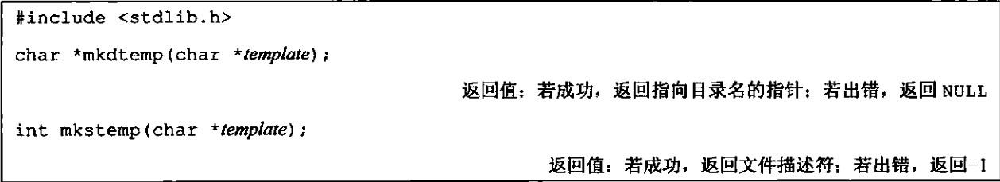
      - 名字通过 template 指定的字符串中进行选择
      - mkdtemp 具有下列默认的权限值： 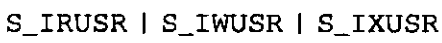
      - mkstemp 具有下列默认权限值： 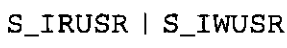
      - 如果 template 的后 6 为是 XXXXXX，则这六位是占位符，将用随机的字符串来取代这六位
  - 内存流
    - 将缓冲区当做文件来对内存（因为缓冲区位于内存中）进行读写，但是底层（文件系统上）没有真实的文件
    - 创建内存流
      - fmemopen 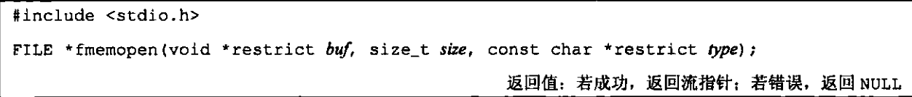
        - 如果 buf = NULL，则此函数会分配 size 大小的缓冲区，并且在关闭该流时，会释放该缓冲区
          - 但是这种情况下没有任何意义，因为无法找到缓冲区的地址
        - type 参数 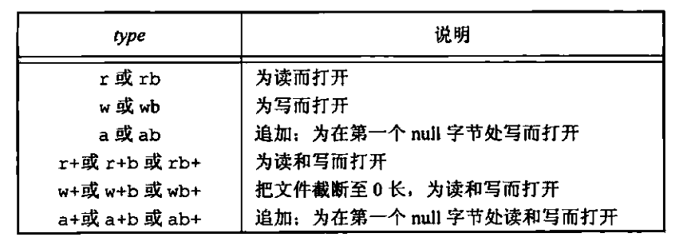
        - 无论何时以追加模式打开内存流，都会将文件位置设为缓冲区中的第一个 null 字节，如果不存在 null 字节，就设置为缓冲区的最后一个字节
        - 任何时候需要增加流缓冲区中的数据量以及调用 fclose、fflush、feek、feeko 以及 fsetpos 时都会在当前位置写入一个 null 字节
        - fmemopen 函数会在缓冲区开始处放置一个 null 字节
      - open_memstream 和 openwmemstream 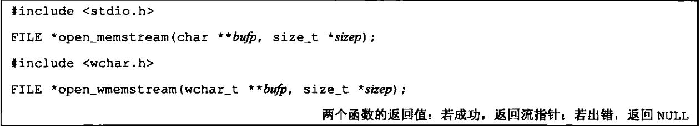
        - 与 fmemopen 的区别
          - 创建的流只能打开
          - 不能指定自己的缓冲区，但可以通过 bufp 和 sizep 参数访问缓冲区地址和大小
          - 关闭流后需要自行释放缓冲区
          - 对流添加字节会增加缓冲区大小
        - 在缓冲区地址和大小的使用上必须遵循一些原则
          - 第一，缓冲区地址和长度只有在调用 fclose 或 fflush 后才有效
          - 第二，这些值只有在下一次流写入或调用fclose前才有效。因为缓冲区可以增长，可能需要重新分配
    - 因为避免了缓冲区溢出，内存流非常适用于创建字符串。因为内存流只访问主存，不访问磁盘上的文件，所以对于把标准 IO 流作为参数用于临时文件的函数来说，会有很大的性能提升。
- 系统数据文件和信息
  - 口令文件
    - /etc/passwd
    - 又称用户数据库
    - pwd.h 定义的 passwd 结构体中包含了下面的一些字段 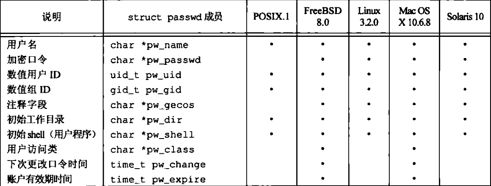
      - 加密口令字段是一个占位符
    - 口令文件中的某些字段可能是空的
    - 为了阻止某个用户登录系统，可以采取：
      - 将登录 shell 字段设置为 /dev/null 或 /dev/false、/usr/sbin/nologin、/bin/true
    - nobody 用户名的目的是：是任何人都可以登录至系统，只能访问人人皆可读、写的文件
    - 获取口令文件项
      - 获取指定用户的 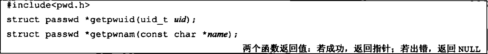
        - 返回的结构体是函数内部的静态变量，只要调用任一相关函数，其内容就会被重写
      - 查看整个口令文件 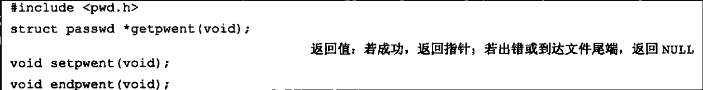
        - 调用 getpwent 时，返回口令文件中的下一个记录项，同样返回的结构体也是函数内部的一个静态变量
        - setpwent 将口令文件的文件偏移量设置为 0
        - endpwent 用于关闭 getpwent 打开的文件资源。一定要调用此函数来关闭 getpwent 打开的文件
  - 阴影口令（shadow password）
    - 用户口令通过单向的加密算法加密后存储到此文件中
    - /etc/shadow 文件中的字段 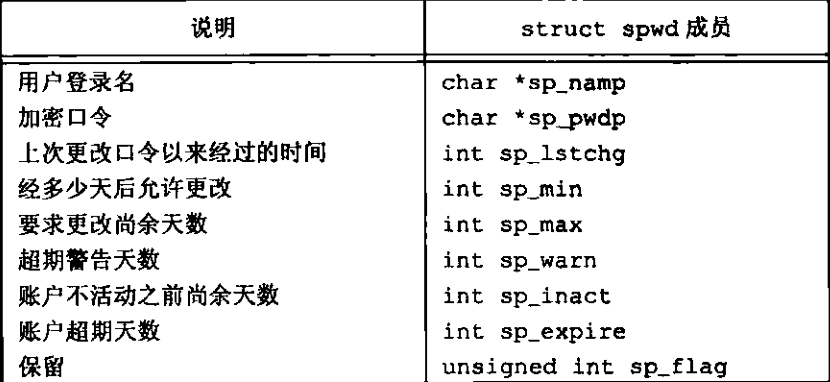
    - 只有少数的几个程序（login、passwd）可以访问（拥有 root 权限）
  - 组文件
    - /etc/group 文件中的字段 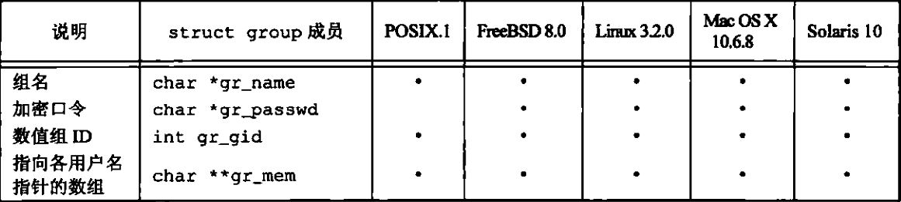
    - 字段包含在 &lt;grp.h&gt; 中的 struct group 中
    - 查看的单个组的字段 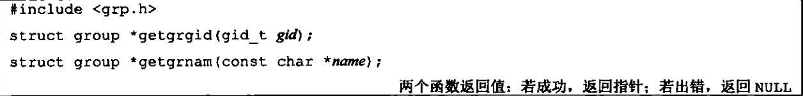
    - 查看所有组的字段 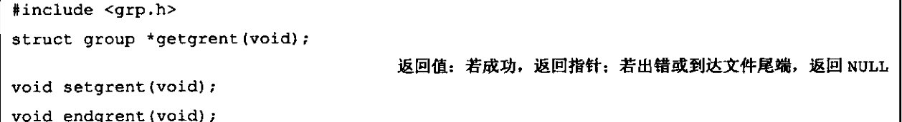
  - 附属组
    - 一个用户可以不仅归属于一个组，可以归属的组的最大数量为 NGROUPS_MAX
    - 获取和设置附属组 ID 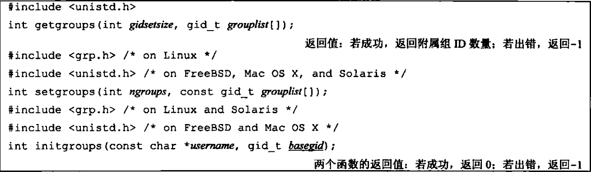
      - setgroups 只能为调用进程设置附属组
      - initgroups 用来为调用进程设置主组（basegid）和附属组的相关信息。其中，附属组是 username 所有的附属组
  - 登录的账户记录
    - utmp 文件记录当前登录到系统的各个用户
      - 在 /var/run/utmp 文件中
    - wtmp 文件跟踪各个登录和注销事件
      - 在 /var/log/wtmp 文件中
  - 系统标识
    - uname 函数返回主机和操作系统有关的信息 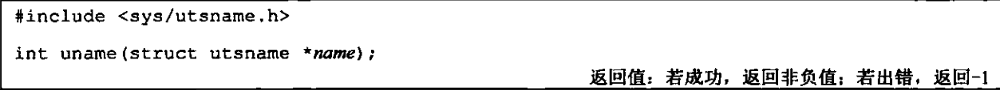
      - uname 函数负责填写 utsname 结构体
      - utsname 结构体 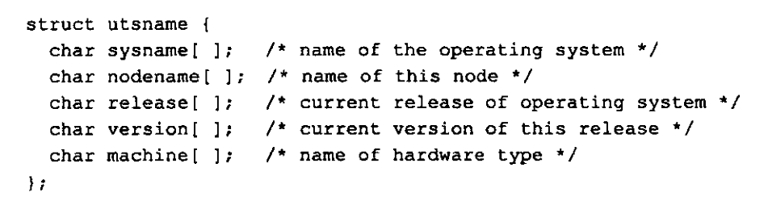
  - 时间和日期
    - time 函数返回当前时间和日期 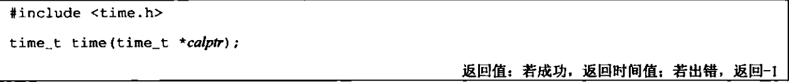
      - 时间值作为返回值返回，如果参数非空，也会存放在 calptr 指向的结构体中
    - 获取指定时钟的时间 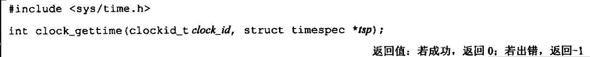
      - 起重工，clock_id 的值可能为： 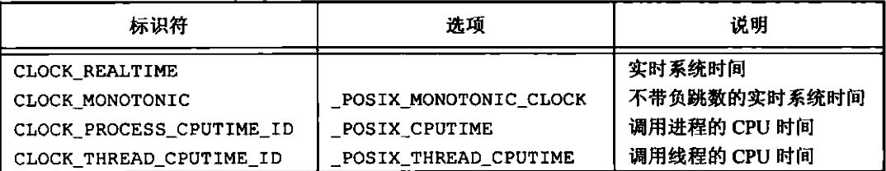
    - clock_getres 函数吧参数 tsp 指向的 timespec 结构初始化为与 clock_id 参数对应的时钟精度 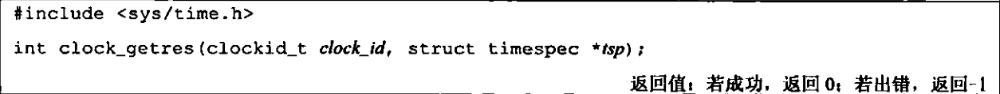
      - 例如，如果精度为1毫秒，则tv_sec字段就是0，tv_nsec字段就是1000000。
    - 对特定的时钟设置时间 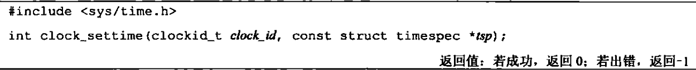
    - gettimeofday 已弃用，但是其可以达到微妙级的精度 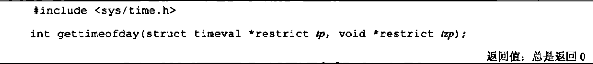
      - tzp 的唯一合法值是 NULL，某些平台使用其来说明时区
    - localtime 和 gmtime 将日历时间转化成分解的时间，并将这些存放在一个 tm 结构体中 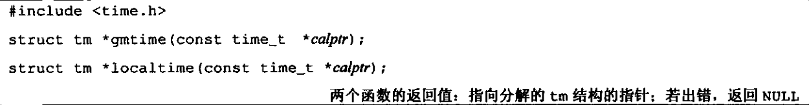
      - tm 结构体 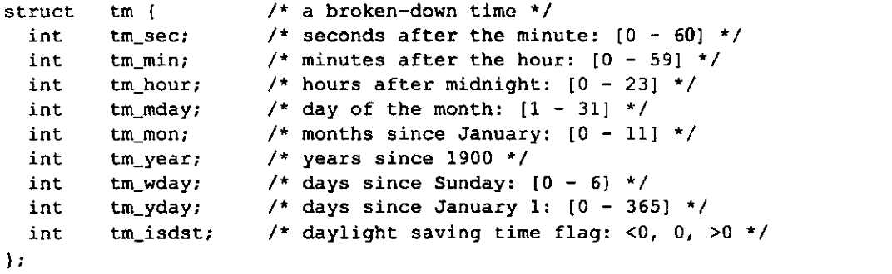
        - 秒可以超过 59 是因为可能润秒
      - localtime 和 gmtime 之间的区别是：1ocaltime 将日历时间转换成本地时间（考虑到本地时区和夏令时标志），而gmtime则将日历时间转换成协调统一时间的年、月、日、时、分、秒、周日分解结构。
    - mktime 以本地时间的年、月、日等作为参数，将其变换成 time_t 值 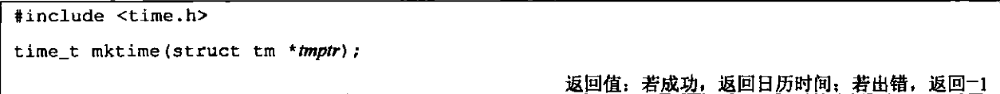
    - strftime 用来格式化输出时间 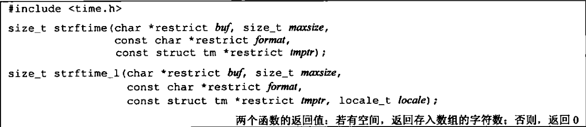
      - strftime_l 允许调用者将区域指定为参数；strftime 使用 TZ 环境变量指定的区域
      - format 参数类似于 printf 函数，但是其占位符有特殊的定义 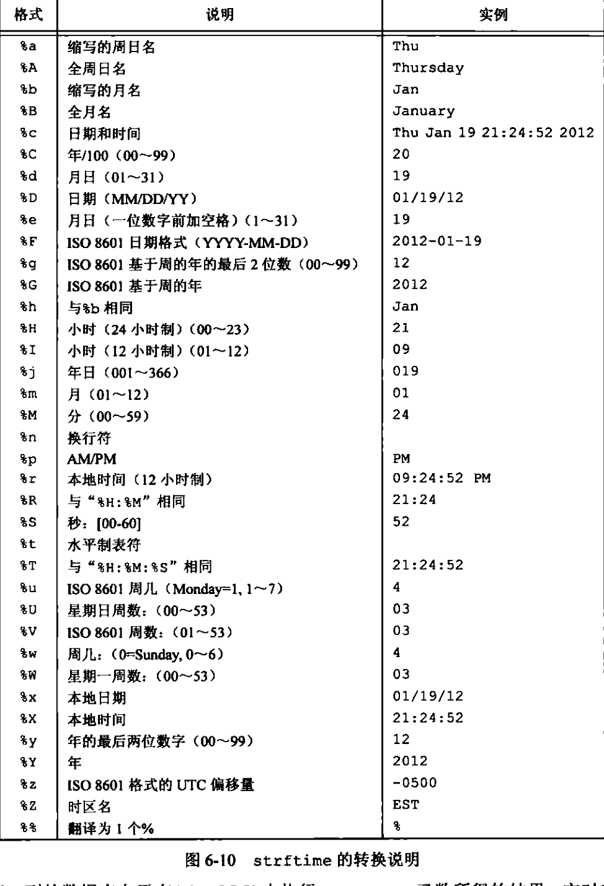
    - strptime 用来将格式化字符串转换为 tm 结构体 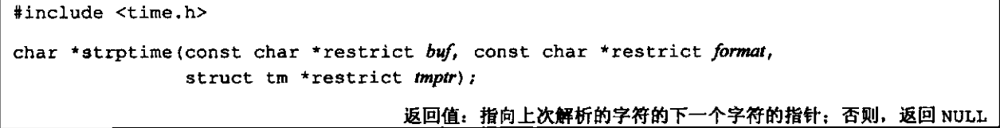
      - format 参数 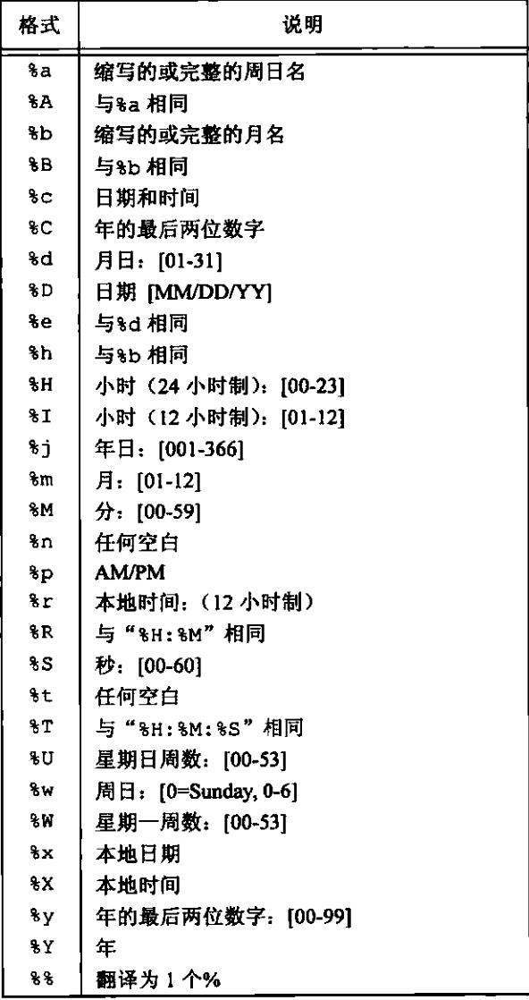
    - 各个时间函数之间的关系，虚线表示的是该函数受到环境变量 TZ 的影响 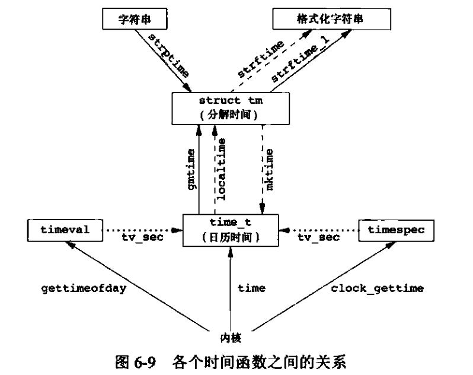
```
