```markmap
---
markmap:
  initialExpandLevel: 2
  spacingVertical: 30
  spacingHorizontal: 180
---

# 现代软件工程
- 软件工程师以及团队
  - 团队
    - 团队的组织模式
      - 封闭模式
        - 遵循传统的权利层级模式
      - 随机模式
        - 团队松散，依靠团队成员的个人自发性
      - 开放模式
        - 尝试组成一种团队，既具有封闭模式团队的可控性，还具有随机模式团队的创新性。
      - 同步模式
        - 有赖于问题的自然区分，不需要很多的交流就可以将成员组织起来共同解决问题。
    - 团队类型
      - 主程序员团队
        - 首席程序员 (Chief-programmer)，处理主要模块的设计和编码, 其他成员从各种角度支持他的工作
      - “一窝蜂”团队
        - 例如小朋友们刚开始踢足球的时候，大家都一窝蜂地去抢球，球在 哪里，一堆人就跟到哪里，这样的模式可以叫一窝蜂模式（Chaos Team）
      - 功能团队
        - 具备不同能力的同事平等协作, 共同完成一个功能
  - 代码规范
    - 源程序文档化
      - 在源程序中可包含一些内部文档，以帮助阅读和理解源程序
      - 包括
        - 标识符的命名
          - 选择含义明确的名字，使其能正确提示标识符所代表的实体
          - 名字不要太长，太长会增加打字量，且易出错。必要时可使用缩写
          - 不用相似的名字，相似的名字容易混淆，不易发现错误
          - 命名法
            - 匈牙利命名法
              - 要求前缀字母用变量类型的缩写，其余部分用变量的英文或英文的缩写，单词第一个字母大写。 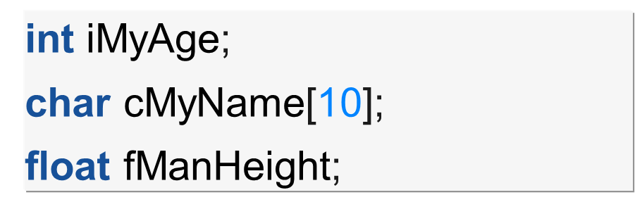
            - 小驼峰命名法
              - 第一个单词首字母小写，后面其他单词首字母大写。 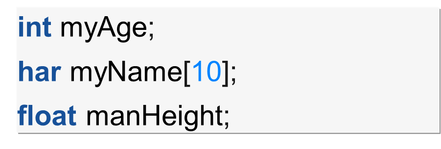
            - 大驼峰式命名法
              - 每个单词的第一个字母都要大写。 
            - 下划线命名法
              - 单词与单词之间通过下划线连接。 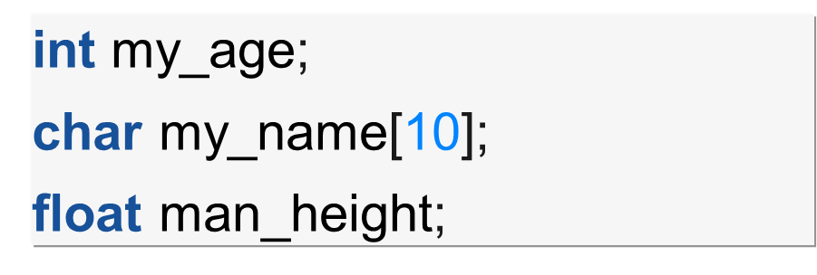
        - 注解
          - 程序中的注解用来帮助人们理解程序，决不是可有可无的
          - 一些正规的程序文本中，注解行的数量约占整个源程序的1／3到1／2，甚至更多
          - 注解分为序言性注解和功能性注解
            - 序言性注解
              - 通常置于每个程序模块的开头部分
              - 描述内容
                - 模块的功能
                - 模块的接口：包括调用格式、参数的解释、该模块需要调用的其它子模块名
                - 重要的局部变量：包括用途、约束和限制条件
                - 开发历史：包括模块的设计者、评审者、评审日期、修改日期以及对修改的描述
            - 功能性注解
              - 通常嵌在源程序体内，主要描述程序段的功能。
              - 书写功能性注解时应注意的问题
                - 注解要正确，错误的注解比没有注解更坏；
                - 为程序段作注解，而不是为每一个语句作注解
                - 用缩进和空行，使程序与注释容易区分
                - 注解应提供一些从程序本身难以得到的信息，而不是语句的重复。
        - 程序的视觉组织
          - 通过在程序中添加一些空格、空行和缩进等技巧，帮助人们从视觉上看清程序的结构
          - 自然的程序段之间可用空行隔开
          - 可通过添加空格使语句成分清晰，如(A＜－17)ANDNOT(B＜＝49)ORC 可写成 (A＜－17) AND NOT (B＜＝49) OR C
          - 通过添加括号突出运算的优先级，避免发生运算的错误
    - 语句构造
      - 编码阶段的主要任务就是书写程序语句。有关书写语句的原则有几十种，总起来说，希望每条语句尽可能简单明了，能直截了当地反映程序员的意图，不能为了片面追求效率而使语句复杂化。
      - 程序编写首先应当考虑清晰性，不要刻意追求技巧性，使程序编写得过于紧凑。
    - 数据说明
    - 输入／输出
  - 代码复审
    - 也称代码评审，是指通过阅读代码来检查源代码与编码标准的符合性以及代码质量的活动。
    - 目的
      - 在项目的早期发现缺陷，将损失降至最低。
      - 发现可能改进的地方。
      - 促进团队沟通、促进知识共享、共同提高。
  - 代码测试
    - 单元测试
      - 是指对软件中的最小可测试单元进行检查和验证。
      - 单元：就是人为规定的最小的被测功能模块。 例如，函数、类或者组件
    - 回归测试（Regression Test）
      - 在软件项目中，如果一个模块或功能以前是正常工作的，但是在一个新的构建中出了问题，那么这 个模块就出现了一个“退步”（Regression），从正常工作的稳定状态退化到不正常工作的不稳定状态。
      - 回归测试最好要自动化，因为这样就可以对于每一个构建快速运行所有回归测试，以保证尽早发现问题。单元测试是回归测试的基础.
    - 测试驱动开发（TDD）
      - 先写测试代码，然后编码的时候以此为基准，只编写符合这个测试的功能代码。
  - 程序调试
    - 软件调试是在进行了成功的测试之后才开始的工作，它与软件测试不同，调试的任务是进一步诊断和改正程序中潜在的错误。
    - 调试活动由两部分组成
      - 确定程序中可疑错误的确切性质和位置
      - 对程序（设计，编码）进行修改，排除这个错误
    - 调试的特点
      - 调试工作是一个具有很强技巧性的工作
      - 软件运行失效或出现问题，往往只是潜在错误的外部表现，而外部表现与内在原因之间常常没有明显的联系，如果要找出真正的原因，排除潜在的错误，不是一件易事。
      - 调试是通过现象，找出原因的一个思维分析的过程。（类比：警察破案）
    - 调试的步骤
      - 从错误的外部表现形式入手，确定程序中出错位置
      - 研究有关部分的程序，找出错误的内在原因
      - 修改设计代码，以排除这个错误
      - 重复进行暴露了这个错误的原始测试或某些有关测试。
- 软件及软件工程
  - 软件
    - 计算机软件指计算机系统中的程序、数据及其相关文档
      - 程序：按照特定顺序组织的计算机数据和指令的集合。
      - 数据：使程序能正常执行的数据结构
      - 文档：为了便于理解程序所需的与开发、维护和使用有关的资料
    - 软件=程序+文档+数据
    - 软件的特点
      - 软件是设计开发的，而不是传统意义上生产制造的。
      - 软件不会“磨损”，但会退化。
      - 大多数软件还是用户定制的。
    - 软件的分类
      - 系统软件
        - 位于计算机系统中最靠近硬件的一层，其它软件一般都通过系统软件发挥作用，它与具体的应用领域无关。如操作系统、编译程序等。
      - 支持软件
        - 支持软件的开发和维护的软件。如数据库管理系统、网络软件、软件开发环境等。
      - 应用软件
        - 特定应用领域专用的软件。如实时软件、嵌入式软件、科学和工程计算软件、事务处理软件、人工智能软件等。
      - 工程/科学软件
      - 嵌入式软件
      - 人工智能软件
      - 产品线软件
      - 移动 APP
  - 软件危机
    - 软件危机(Software Crisis)：计算机软件的开发和维护过程所遇到的一系列严重问题。
    - 表现
      - 对软件开发成本和进度的估算很不准确，甚至严重拖期和超出预算；
      - 无法满足用户需求，导致用户很不满意
      - 质量很不可靠，经常失效
      - 难以更改、调试和增强
      - 没有适当的文档
      - 软件成本比重上升
      - 软件开发生产率跟不上计算机应用迅速深入的趋势
  - 软件工程
    - 软件工程方法
      - 传统方法学
        - 传统方法学也称为生命周期方法学或结构化方法学。它采用结构化技术(结构化分析、结构化设计和结构化实现)来完成软件开发的各项任务，并使用适当的软件工具或软件工程环境来支持结构化技术的运用
      - 面向对象方法学
        - 与传统方法相反，面向对象方法把数据和行为看成是同等重要的，它是一种以数据为主线，把数据和对数据的操作紧密地结合起来的方法。
      - 形式化方法学
        - 是一种基于形式化数学变换的软件开发方法
        - 建立在严格数学基础上的软件开发方法。形式化方法模型的主要活动是生成形式化的数学规格说明。形式化方法使软件开发人员可以应用严格的数学符号来说明、开发和验证基于计算机的系统。
  - 软件的生命周期
    - 软件工程活动
      - 框架活动
        - 沟通-需求获取
        - 策划-项目计划
        - 建模
          - 需求建模
          - 设计建模
        - 构建
          - 编码
          - 测试
        - 部署
      - 普适性活动
        - 软件项目跟踪和控制
          - 项目组根据计划来评估项目进度，并且采取必要的措施保证项目按进度计划进行
        - 风险管理
          - 对可能影响项目成果或者产品质量的风险进行评估
        - 软件质量保证
          - 确定和执行保证软件质量的活动
        - 技术评审
          - 评估软件工程产品，尽量在错误传播到下一个活动之前发现并清除错误
        - 测量
          - 定义和收集过程、项目以及产品的度量
        - 软件配置管理
          - 在整个软件过程中管理变更所带来的影响
        - 可复用管理
          - 定义工作产品复用的标准（包括软件构件），并且建立构件复用机制。
    - 生命周期
      - 软件定义
        - 问题定义
        - 可行性研究
        - 需求分析
      - 软件开发
        - 总体设计
        - 详细设计
        - 编码
        - 单元测试
        - 集成测试
        - 综合测试
      - 运行维护
        - 持久满足用户需求
  - 软件工程实践原则
    - 存在价值
    - 保持简洁
    - 保持愿景
    - 关注使用者
    - 面向未来
    - 计划复用
    - 认真思考
- 软件过程及过程模型
  - 软件过程：一个为创建高质量软件所需要完成的活动、动作和任务的框架
  - 过程模型
    - 是软件生存周期中一系列有序的软件开发活动的流程，是软件开发全部活动的结构框架
    - 模型
      - 写了再改模型
        - 图解 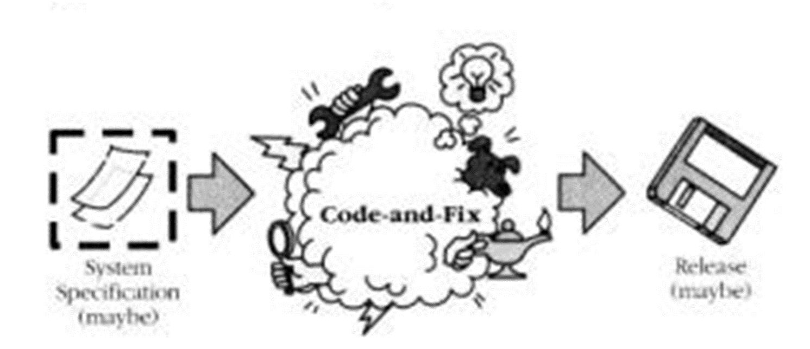
        - 好处, 不需要太多其他准备或相关知识, 大家上来就写代码, 也许就能写出来, 写不出来就改, 也许能改好
      - 瀑布模型
        - 瀑布模型将软件生命周期划分为软件计划、需求分析、设计、实现、测试、运行和维护等阶段，规定了它们自上而下、相互衔接的固定次序，如同瀑布流水逐级下落。
        - 特点
          - 阶段间具有顺序性和依赖性
          - 推迟实现
          - 质量保证
        - 优点
          - 可强迫开发人员采用规范的方法（例如，结构化技术）
          - 要求每个阶段交出的所有产品都必须经过质量保证小组的仔细验证
          - 严格地规定了每个阶段必须提交的文档
        - 缺点
          - 难以应对需求变化：客户难以准确表达需求，软件团队很难准确理解需求
          - 过于理想：实际项目很少按照该模型给出的顺序进行
          - 风险太大：用户必须有耐心，等到系统开发完成才能见到软件
          - 阻塞状态：开发者常常被不必要地耽搁
        - 适用场合
          - 需求相当稳定，客户需求被全面的了解风险管理
          - 开发团队对于应用领域非常熟悉
          - 外部环境的不可控因素很少
          - 小型清晰的项目
        - V模型：瀑布模型的变体
          - 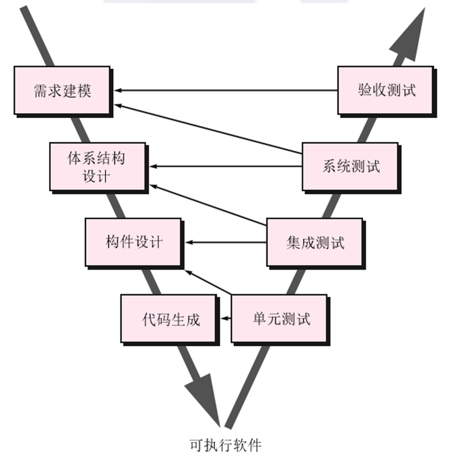
      - 增量过程模型
        - 增量模型以迭代的方式运用瀑布模型
        - 随着时间的推移，发布一系列称为增量的版本，随着每个版本的交付，逐步为用户提供更多的功能
        - 图解 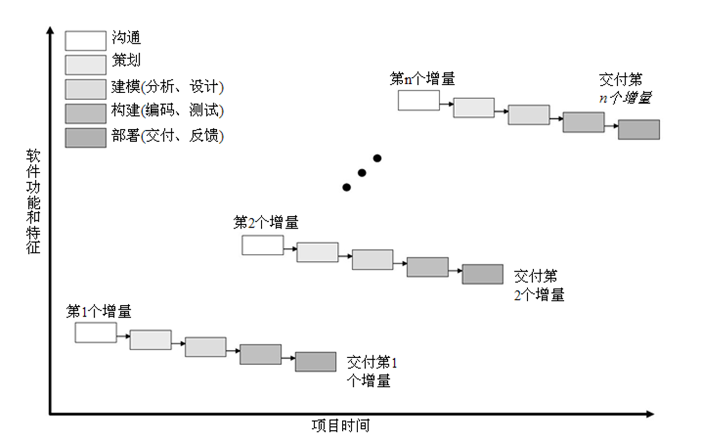
        - 使用方法
          - 软件被作为一系列的增量来进行开发，每一个增量都提交一个可以操作的产品，可供用户评估
          - 第一个增量往往是核心产品：满足了基本的需求，但是缺少附加的特性
          - 客户使用上一个增量的提交物并进行评价，制定下一个增量计划，说明需要增加的特性和功能
          - 重复上述过程，直到最终产品产生为止
        - 优点
          - 提高对用户需求的响应
            - 用户看到可操作的早期版本后会提出一些建议和需求，可以在后续增量中调整
          - 人员分配灵活
            - 如果找不到足够的开发人员，可采用增量模型，早期的增量由少量人员实现，如果客户反响较好，则在下一个增量中投入更多的人力
          - 可规避技术风险
            - 不确定的功能放在后面开发
        - 缺点
          - 每个附加的增量并入现有的软件时，必须不破坏原来已构造好的东西
          - 加入新增量时应简单、方便 ——软件的体系结构应当是开放的
          - 仍然无法处理需求发生变更的情况
          - 管理人员须有足够的技术能力来协调好各增量之间的关系
          - 难以确定所有版本共需的公用模块
      - 演化过程模型
        - 原型开发模型
          - 原型（prototype）是预期系统的一个可执行版本，它反映了系统性质（如功能、计算结果等）的一个选定的子集
          - 一个原型不必满足目标软件的所有约束，其目的是能快速、低成本地构建原型
          - 被开发的原型应交付给客户试用，并收集客户的反馈意见，这些反馈意见可在下一轮迭代中对原型进行改进。在前一个原型需要改进，或者需要扩展其范围的时候，进入下一轮原型的迭代开发
          - 图解 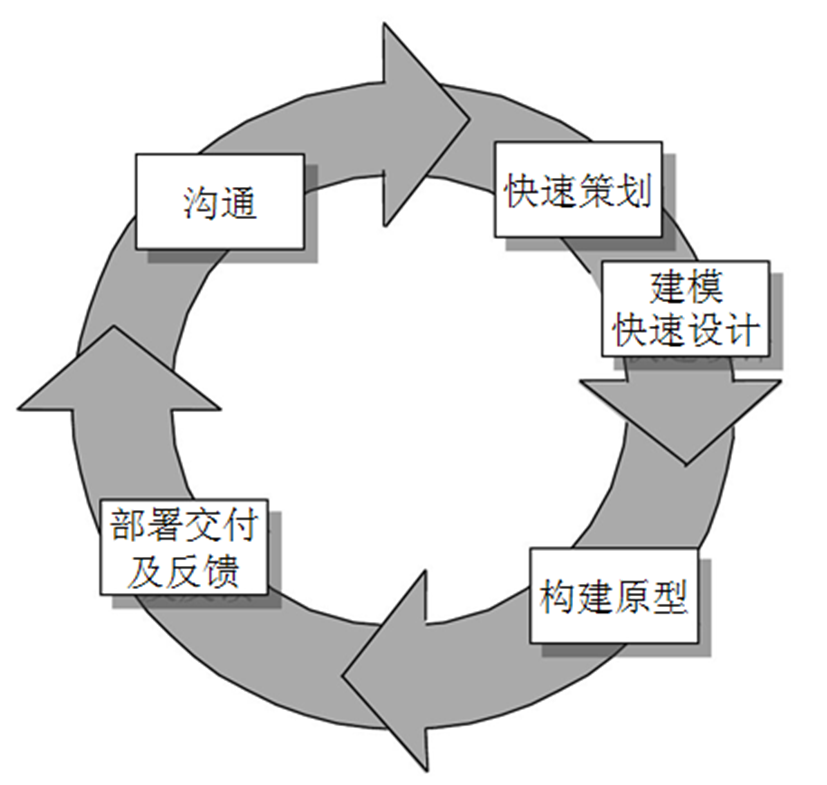
          - 优点
            - 快速开发出可以演示的系统，方便了客户沟通
            - 采用迭代技术能够使开发者逐步弄清客户的需求
          - 原型的使用策略
            - 废弃（throw away）策略
              - 主要用于探索型和实验型原型的开发。这些原型关注于目标系统的某些特性，而不是全部特性，开发这些原型时通常不考虑与探索或实验目的无关的功能、质量、结构等因素，这种原型通常被废丢，然后根据探索或实验的结果用良好的结构和设计思想重新设计目标系统
            - 追加（add on）策略
              - 主要用于演化型原型的开发。这种原型通常是实现了目标系统中已明确定义的特性的一个子集，通过对它的不断修改和扩充，逐步追加新的要求，最后使其演化成最终的目标系统
          - 使用场景
            - 用户定义了一组一般性目标，但不能标识出详细的输入、处理及输出需求
            - 开发者可能不能确定算法的有效性、操作系统的适应性或人机交互的形式
        - 螺旋模型
          - 介绍
            - 针对大型软件项目的开发
            - 风险驱动的软件开发模型
              - 采用循环的方式，逐步加深系统定义和实现的深度
              - 确定一系列里程碑，确保stakeholders都支持系统解决方案
              - 第一圈一般开发出产品的规格说明，接下来开发产品的原型系统，并在每次迭代中逐步完善，开发不同的软件版本
            - 结合了原型的迭代性质和瀑布模型的可控性、系统性特点
          - 图解 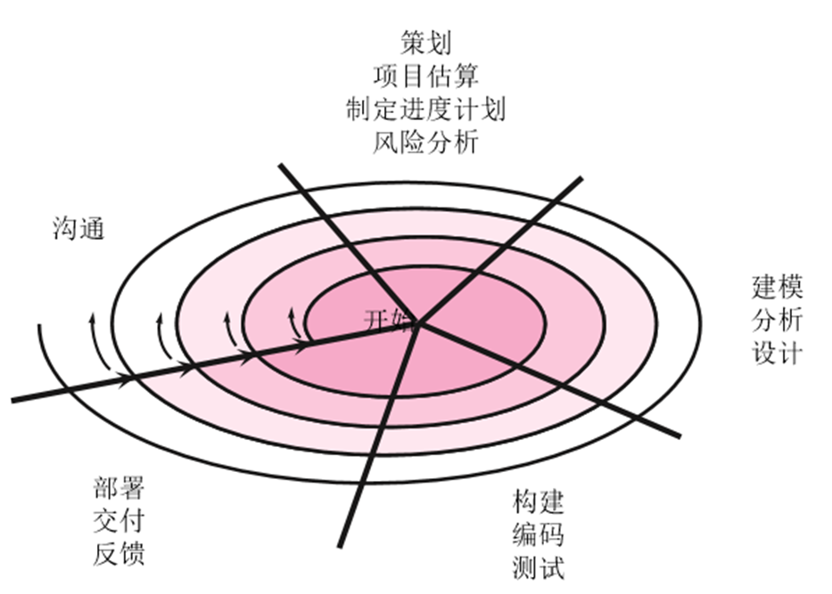
          - 优点
            - 结合了原型的迭代性质与瀑布模型的系统性和可控性，是一种风险驱动型的过程模型
            - 采用循环的方式逐步加深系统定义和实现的深度，同时更好地理解、应对和降低风险
            - 确定一系列里程碑，确保各方都得到可行的系统解决方案
            - 始终保持可操作性，直到软件生命周期的结束
            - 风险驱动
          - 缺点
            - 螺旋模型依赖大量的风险评估专家来保证成功。如果有较大的风险没有被发现和管理，肯定会发生问题
            - 软件开发人员应该擅长寻找可能的风险，准确的分析风险，否则将会带来更大的风险
      - 并发模型
      - 基于构件的开发
        - 是在一定构件模型的支持下，复用构件库中的一个或多个软件构件，通过组合手段（集成）高效率、高质量地构造应用软件系统的过程
        - 图解 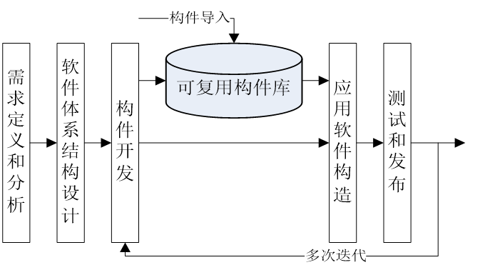
        - 优点
          - 充分利用软件复用，提高了软件开发的效率
          - 允许多个项目同时开发，降低了费用，提高了可维护性，可实现分步提交软件产品
        - 缺点
          - 缺乏通用的构件组装结构标准，风险较大
          - 构件可重用性和系统高效性之间不易协调
          - 由于过分依赖于构件，构件质量影响着最终产品的质量
- 敏捷开发
  - 敏捷价值观
    - 个人和他人之间的交流胜过开发过程和工具
    - 可运行的软件胜过宽泛的文档
    - 客户合作胜过合同谈判
    - 对变更的良好响应胜过按部就班地遵循计划
  - 敏捷原则
    - 我们最优先要做的是通过尽早、持续交付有价值的软件来使客户满意
    - 即使在开发的后期，也欢迎需求变更。敏捷过程利用变更为客户创造竞争优势
    - 经常交付可运行软件，交付的间隔可以从几个星期到几个月，交付的时间间隔越短越好
    - 在整个项目开发期间，业务人员和开发人员必须天天都在一起工作
    - 围绕有积极性的个人构建项目。给他们提供所需的环境和支持，并且信任他们能够完成工作
    - 在团队内部，最富有效果和效率的信息传递方法是面对面交谈
    - 可运行软件是进度的首要度量标准
    - 提倡可持续的开发速度。责任人(sponsor)、开发者和用户应该能够长期保持稳定的开发速度
    - 不断地关注优秀的技能和好的设计会增强敏捷能力
    - 简单——是减少不必要工作量的艺术——是必要的
    - 最好的架构、需求和设计出自于自组织团队
    - 每隔一定时间，团队会反省如何才能更有效地工作，并相应调整自己的行为
  - 敏捷过程
    - 基于敏捷原则进行的软件开发过程，视为敏捷过程
    - 模型
      - 极限编程（Extreme Programming）
        - 主要目标是降低因需求变更而带来的成本
        - 采用迭代的交付方式，每个迭代很短（1-3周时间）。在每个迭代结束的时候，团队交付可运行的，经过测试的功能，这些功能可以马上投入使用
        - 过程
          - XP 策划
            - [建立一系列描述待开发软件必要特征与功能的“用户故事”](https://baike.baidu.com/item/%E7%94%A8%E6%88%B7%E6%95%85%E4%BA%8B/8427372?fr=aladdin)
            - 评估每一个故事，并给出以开发周数为度量单位的成本
            - 客户和XP团队共同决定如何把故事分组并置于将要开发的下一个发行版本中（下一个软件增量）
            - 形成关于一个发布版本的基本承诺
            - 在第一个版本发布之后，XP团队计算项目的速度
          - XP 设计
            - 严格遵循KIS(Keep it simple)原则，设计只要能满足系统和客户在当下的需求就可以了，不需要任何画蛇添足的设计
            - 鼓励使用 CRC 卡作为面向对象环境中考虑软件设计的有效机制
            - [在某个故事设计中遇到困难时，推荐立即建立 可执行原型](https://baike.baidu.com/item/%E5%8E%9F%E5%9E%8B%E8%AE%BE%E8%AE%A1/10787489)
          - XP 编码
            - 鼓励“测试驱动开发(TDD)”
            - 鼓励“结对编程”
              - 结对编程技术是指两位程序员坐在同一工作台前开发软件。与两位程序员各自独立工作相比，结对编程能编写出质量更高的代码。 
            - 鼓励“重构”
          - XP 测试
            - 每天进行集成和确认测试（持续集成）
              - 持续集成是一种软件开发实践，即团队开发成员经常集成他们的工作，通常每个成员每天至少集成一次，也就意味着每天可能会发生多次集成。每次集成都通过自动化的构建(包括编译，发布，自动化测试)来验证，从而尽早地发现集成错误。
            - “验收测试” 由客户确定，根据本次软件发布中所实现的用户故事而确定。
      - Scrum
        - Scrum是英语中橄榄球运动的一个专业术语，表示“争球”
        - 采用短周期迭代交付方式
        - 过程
          - 三个角色
            - 同项目经理类似的Scrum主管:负责维护过程和任务
            - 产品负责人代表利益所有者
            - 开发团队包括了所有开发人员
          - 三个工件
            - [Product Backlog 产品订单](https://www.scrum.cn/7000.html)
            - Sprint Backlog 冲刺订单
            - Burndown chart 燃尽图
          - 五个活动
            - Sprint冲刺
            - Sprint planning meeting冲刺计划会
            - Daily standup meeting每日立会
            - Sprint review冲刺评审会
            - Retrospective meeting回顾会议
          - 步骤
            - 收集 Product Backlog
              - 找出完成产品需要做的事情 — Product Backlog。 产品负责人领导大家对于这个 Backlog中的条目进行分析，细化，理清相互关系，估计工作量等工作。每一项工作的时间估计单位为“天”
            - 选取Product backlog 中的任务加入到 sprint 中
              - 决定当前的冲刺（Sprint）需要解决的事情 — Sprint Backlog。 整个产品的实现被划分为几个互相联系的冲刺（Sprint）。产品订单上的任务被进 一步细化了，被分解为以小时为单位。如果一个任务的估计时间太长（如超过 16 个小时），那么它就应该被进一步分解。
            - 开始执行Sprint
              - 一个Sprint即是一次迭代，往往设置为一周到两周，一个标准的sprint包含以下几个环节
                - 站立会议要求每日都要举行
                - 及时更新燃尽图
            - 交付、验收Sprint
              - 得到软件的一个增量版本，产品经理验收。 然后在此基础上又进一步计划增量的新功能和改进
            - 总结Sprint
              - 总结本次sprint什么做得好、什么做的不好、后续应该怎么做
      - 自适应软件开发（ASD）
      - 动态系统开发方法（DSDM）
      - 特征驱动开发（FDD）
      - 精益软件开发（LSD）
      - 敏捷建模AM
      - 敏捷统一过程AUP
  - 敏捷团队
    - 自主管理（Self-managing）
      - 以前领导布置了任务，我们实现就可以了，现在要自己挑选任务；每次 Sprint 结束之后，还要总结不足，提出改进，并且自己要实施这些改进。“自主管理” 不等于“没有管理”
    - 自我组织（Self-organizing）
      - 以前做好自己的事情就好了，安心下班。现在每个人要联合起来对项目负责， 有人工作落后了还要帮助他改进，项目缺少某类资源还要自己顶上去
    - 多功能型（Cross-functional）
      - 以前规格说明书由PM来写，测试由测试人员来做，现在每个人都全面负责， 自己搞定规格说明书，和别人沟通，同时自己搞定测试
  - 适用范围
    - 
- 需求建模
  - 需求过程
    - 获取需求
    - 细化(需求分析)
      - 需求分析的目的
        - 说明软件的工作特征
        - 指明软件和其他系统元素的接口
        - 规定软件必须满足的约束
      - 需求分析的主要任务
        - 细化在前期需求工程的基础需求
        - 构建一种或多种模型以描述用户场景、功能活动、类类之间的关系、系统和类的行为、数据流等
    - 协商
    - 编写需求规格说明
    - 确认需求
    - 需求管理
  - 总体目标
    - 描述客户需要什么
    - 为软件设计奠定基础
    - 定义在软件完成后可以被确认的一组需求
  - 经验原则
    - 模型应关注在问题域或业务域内可见的需求，抽象的级别应该相对高一些
    - 需求模型的每个元素都应能增加对软件需求的整体理解，并提供对信息域、功能和系统行为的深入理解
    - 关于基础结构和其它非功能的模型应推延到设计阶段再考虑
    - 最小化整个系统内的关联
    - 确认需求模型为所有相关利益者都带来价值
    - 尽可能保持模型简洁
  - 需求建模的元素
    - 场景模型
      - 出自各种系统“参与者”观点的需求
      - 用例：用于表示系统所提供的服务，描述参与者为了使用系统所提供的某一完整功能而与系统之间发生的一段对话（交互）
      - 场景：场景是用例的实例化，从一个用例可以实例化出来多个用例场景。用例就是对全部场景的抽象
    - 数据模型
      - 描述问题信息域的模型(用于建立数据库)
      - 数据模型 ---- 是一种面向问题领域的数据模型，是按照用户的观点对数据建立的模型。它描述了从用户角度看到的数据，反映了用户的现实环境，而且与在软件系统中的实现方法无关
      - 数据模型中包含3种相互关联的信息
        - 数据对象（实体）
          - 是对软件必须理解的复合信息的抽象
          - 数据对象可以由一组属性来定义
            - 属性定义了数据对象的性质
            - 必须把一个或多个属性定义为“标识符”，也就是说，当我们希望找到数据对象的一个实例时，用标识符属性作为“关键字”(通常简称为“键”)
            - 应该根据对所要解决的问题的理解，来确定特定数据对象的一组合适的属性
            - 如：学生具有学号、姓名、性别、年龄、专业（其它略）等属性
          - 数据对象彼此间是有联系的
            - 一对一联系(1∶1)
            - 一对多联系(1∶N)
            - 多对多联系(M∶N)
          - 如：外部实体、事物、行为、事件、角色、单位、地点或结构等
        - 数据对象的属性及数据对象彼此间相互连接的关系
        - 实体——联系图（ER图）
          - 示例 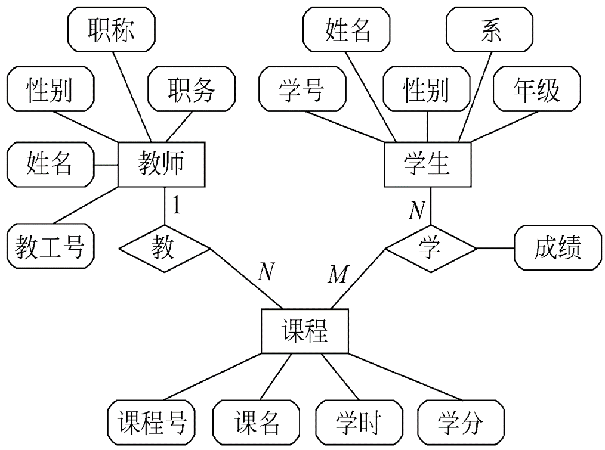
    - 类模型
      - 表示面向对象类（属性和操作）的模型
    - 数据流模型
      - 描述功能元素在系统中运行时怎样进行数据变换
      - 结构化方法
        - 一种面向数据流的传统软件开发方法
        - 以数据流为中心构建软件的分析模型和设计模型
        - 分为：结构化分析(Structured Analysis 简称SA)、结构化设计(Structuresd Design 简称SD)、结构化程序设计(Structured Programmin 简称SP)
      - 结构化分析方法
        - 抽象
          - 忽略一个问题中与当前目标无关的那些方面，以便更充分地关注与当前目标有关的方面
        - 分解
          - 将问题不断分解为较小的问题，直到每个最底层的问题都足够简单为止
          - 随着分解层次的增加，抽象的级别越来越低，也越接近问题的解(算法和数据结构)
      - 结构化分析的模型
        - 从不同的角度来看模型
          - 从外部来看，对系统分析上下文或系统环境建模
          - 从行为上看，对系统行为建模
          - 从结构上看，对系统的体系结构和系统处理的数据结构建模。
        - 结构化需求分析的模型
          - 模型
            - 功能模型（数据流模型），用来描述系统中的数据处理过程
            - 行为模型（状态转换模型），用来描述系统如何对事件做出响应
            - 数据模型（实体—关系模型）：用来描述系统中的数据及其之间的关系
          - 数据流图：（DFD，Data Flow Diagram）描述输入数据流到输出数据流的变换(即加工、处理)过程，用于对系统的功能建模
            - 数据源点或终点
              - 
              - 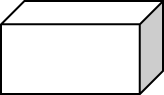
            - 变换数据的处理
              - 
              - 
            - 数据存储
              - 
              - 
            - 数据流
              - 
            - 例如
              - 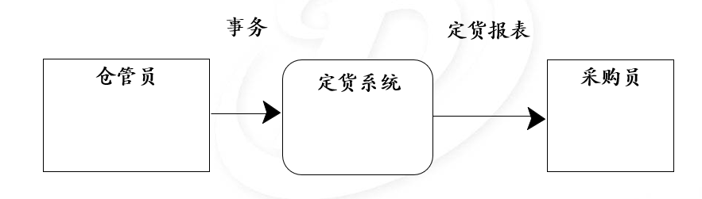
              - 对处理进行分解 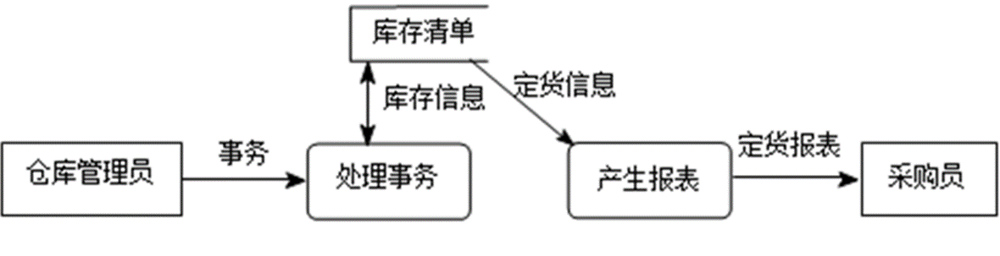
              - 在进行分解 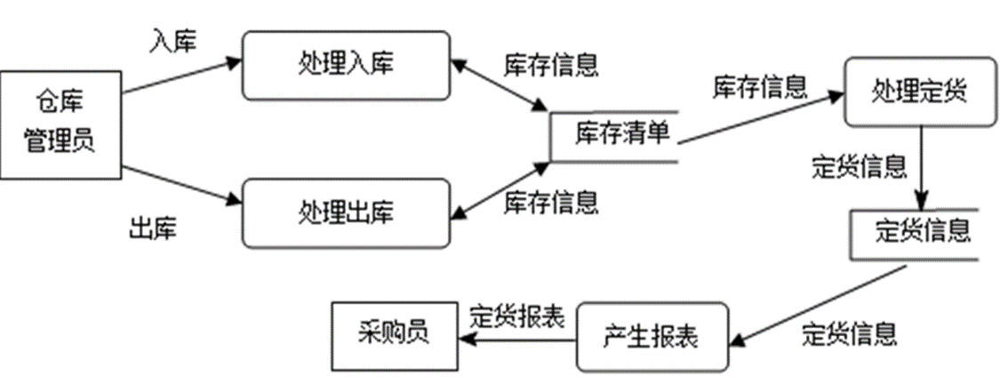
            - 数据流图分层
              - 顶层图（第0层）只有代表整个软件系统的1个加工，描述了软件系统与外界之间的数据流
                - 顶层图只有一个代表整个软件系统的加工，该加工不必编号
              - 顶层图中的加工经分解后的图称为第1层图(只有1张)
                - 第1层图中的加工编号分别为1，2，3，…
              - 中间层图中至少有一个加工(也可以有多个)在下层图中分解成一张子图
                - 子图号：若父图中的加工号x分解成某一子图，则该子图号记为“图x”
                - 子图中加工的编号：若父图中的加工号为x的加工分解成某一子图，则该子图中的加工编号分别为x.1、x.2、x.3…
              - 处于最底层的图称为底层图，其中所有的加工不再分解成新的子图
              - 图解 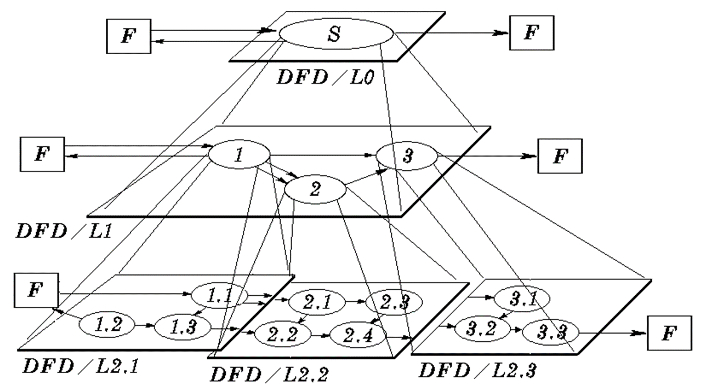
              - 画分层数据流图的步骤
                - 1\. 画系统的输入和输出
                - 2\. 画系统内部
                - 3\. 画加工内部
                - 4\. 重复第3步，直至每个尚未分解的加工都足够简单(即不必再分解)
          - 数据字典：是模型的核心，它包含了软件使用和产生的所有数据的描述
            - 数据流图与数据字典是密不可分的，两者结合起来构成软件的分析模型
            - 数据字典由字典条目组成，每个条目描述DFD中的一个元素
            - 定义数据的符号 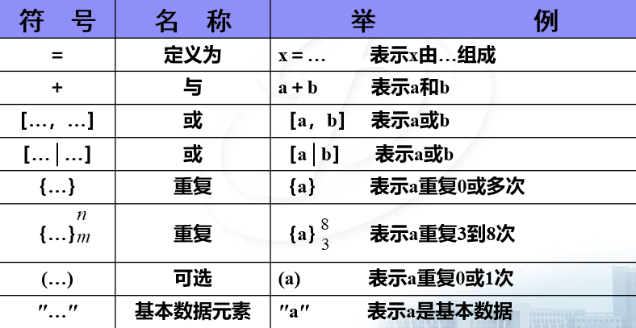
              - 例如，校内电话号码由4位数字组成，第1位数字不是0： 校内电话=1{非0数字}1 + 3{数字}3
            - 数据字典条目的组成包括
              - 数据流
              - 文件
              - 数据项
              - 加工
              - 源点
              - 终点
            - 字典条目中的描述内容主要包括：
              - DFD元素的基本信息(名称、别名、简述、注解)
              - 定义(数据类型、数据组成)
              - 使用特点(取值范围、使用频率、激发条件)
              - 控制信息(来源、去向、访问权限)等
          - 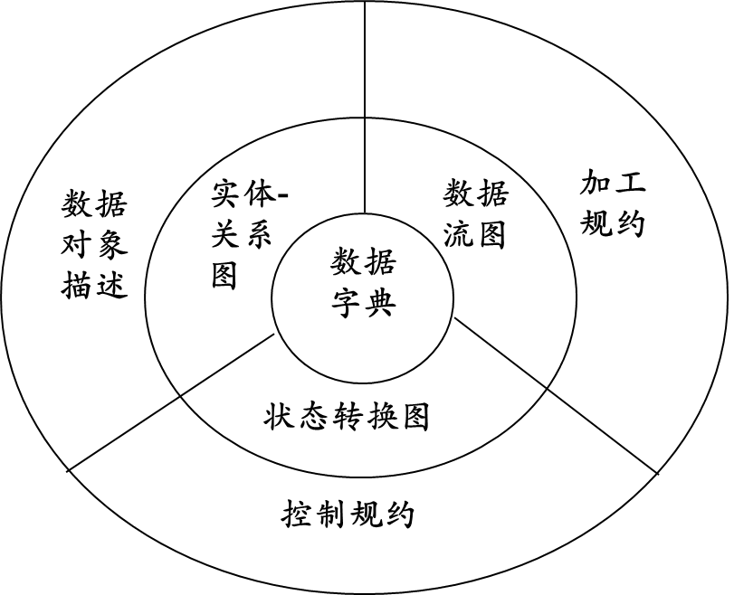
    - 行为模型
      - 描述系统的外部行为
      - 状态模型是一种描述系统对内部或者外部事件响应的行为模型
      - 它描述系统状态和事件，以及事件引发系统在状态间的转换
      - 这种模型适用于描述实时系统
      - 状态建模方法步骤
        - 系统状态、行为与事件分析
        - 构建状态图
- 软件设计
  - 软件设计概念
    - 软件的设计是将需求转变为软件陈述（表达）的过程。这种陈述是一个对软件的全局观点。系统通过逐步求精使得设计陈述逐渐接近程序代码。
    - 第一步是概要设计，关注于怎么将需求转换成数据和软件框架
    - 第二步是详细设计，关注于将框架逐步求精细化为具体的数据结构和软件的算法表达
    - 设计良好的软件应该展示出
      - 坚固性：程序应该不含任何妨碍其功能的缺陷
      - 适用性：程序应该符合开发的目标
      - 愉悦性：使用程序的体验应是愉快的
    - 良好设计具备的特征
      - 设计必须实现所有包含在需求模型中的明确需求，而且必须满足利益相关者期望的所有隐含需求。
      - 对于编码、测试及维护而言，设计必须是可读的、可理解的指南
      - 设计必须提供软件的全貌，从实现的角度说明数据域、功能域和行为域
    - 设计指导原则
      - 使用可识别的体系结构风格或模式创建
      - 由展示出良好设计特征的构件构成
      - 能够以演化的方式实现，从而便于实现和测试
      - 设计应该模块化；也就是说，应将软件逻辑地划分为元素或子系统
      - 设计应该包含数据、体系结构、接口和构件的清晰表示
      - 设计应导出数据结构，这些数据结构适用于要实现的类，并从可识别的数据模式提取
      - 设计应导出显示独立功能特征的构件
      - 设计应导出接口，这些接口降低了构件之间以及与外部环境连接的复杂性
      - 设计的导出应根据软件需求分析过程中获取的信息采用可重复的方法进行
      - 设计应使用能够有效的表示法来传达其意义
    - 设计概念
      - 抽象
        - 抽出事物的本质特性而暂时不考虑细节，可以给出不同的抽象级
        - 两种不同的抽象：数据抽象、过程抽象
      - 体系结构
        - 软件体系结构是指“软件的整体结构和这种结构为系统提供概念上完整性的方式”
        - 模型
          - 结构模型：将体系结构表示为程序构件的一个有组织的集合
          - 框架模型：提高设计抽象级别
          - 动态模型：强调程序体系结构的行为方面
          - 过程模型：系统必须提供的业务设计或技术流程设计
          - 功能模型：表示系统的功能层次结构
      - 模式
        - 设计模式是软件开发人员在软件开发过程中面临的一般问题的解决方案。这些解决方案是众多软件开发人员经过相当长的一段时间的试验和错误总结出来的
      - 关注点分离
        - 大体思路是,先将复杂问题做合理的分解,再分别仔细研究问题的不同侧面(关注点),最后综合各方面的结果,合成整体的解决方案。如果被分解为可以独立解决和（或）优化的若干块，任何复杂问题都能够更容易地被处理。
        - 通过将关注点分割为更小的关注点（由此产生更多可管理的块），使得解决一个问题需要付出更少的工作量和时间
      - 模块化
        - 几乎所有的情况下，为了理解更容易，都应当将设计划分成许多模块，这样做的结果，构建软件所需的成本将会随之降低
      - （信息）隐藏
        - 每个模块都尽量对其他模块隐藏自己的内部实现细节
        - 信息隐藏是实现抽象/模块化机制的基本支撑
      - 功能独立
        - 通过开发具有“专一”功能和“避免”与其他模块过多交互的模块，可以实现功能独立
        - 内聚性显示了某个模块相关功能的强度
          - 一个内聚的模块执行一个独立的任务，与程序的其他部分构件只需要很少的交互。简单地说，一个内聚的模块应该（理想情况下）只完成一件事情
        - 耦合性显示了模块间的相互依赖性
          - 耦合性依赖于模块之间的接口复杂性、引用或进入模块所在的点以及什么数据通过接口进行传递
      - 求精
        - 对各种抽象的细化
        - 为了集中精力解决主要问题而尽量推迟对细节的考虑
      - 切面（方面）
        - 考虑两个需求，A和B。“如果已经选择了一种软件分解，在这种分解中，如果不考虑需求A的话，需求B就不能得到满足” ，那么需求A横切需求B
        - [一个切面是一个横切关注点的表示](https://zh.wikipedia.org/zh-hans/%E6%A8%AA%E5%88%87%E5%85%B3%E6%B3%A8%E7%82%B9)
      - 重构
        - 重构是使用这样一种方式改变软件系统的过程：不改变代码[设计]的外部行为而是改进其内部结构
        - 当重构软件时，检查现有设计的
          - 冗余性
          - 没有使用的设计元素
          - 低效的或不必要的算法
          - 拙劣的或不恰当的数据结构
          - 以及其他不足，并通过修改获得更好的设计
    - 从分析到设计模型的转化 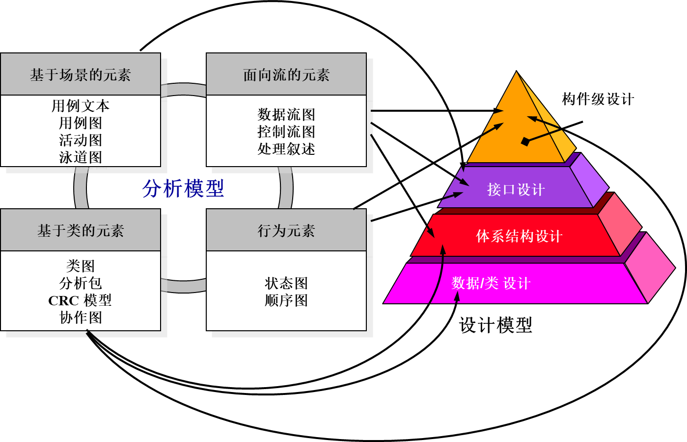
    - 设计任务
      - 数据/类设计——将分析类模型变换为软件实现类模型及数据结构
      - 体系结构设计——描述软件主要构造元素之间的关系
        - 定义软件的整体结构：软件部件、外部可见的属性和它们之间的关系
        - 体系结构设计：可以从系统规约、分析模型和分析模型中定义的子系统导出
      - 接口设计——描述软件元素、硬件元素和终端用户间如何通信
        - 和外部系统、设备、网络或信息生产者和消费者(比如外部实体)之间的接口
        - 设计软件内部各个部件间的接口
        - UI：用户和计算机间的接口(界面)
      - 构件级设计——将软件体系结构的构造元素变换为对软件构件的过程性描述
        - 构件级设计完整地描述每个软件构件的内部细节
          - 构件整体的处理和执行流程
          - 构件内本地数据对象的数据结构
          - 构件内处理过程的算法
        - 从类为基础的模型、流模型、行为模型中得到的信息是部件设计的基础
  - 体系结构风格
    - 描述某一特定应用领域中系统组织方式的惯用模式。它反映了领域中众多系统所共有的结构和语义特性,并指导如何将各个模块和子系统有效地组织成一个完整的系统。
    - 风格的影响因素
      - 构件
        - 完成某种功能
      - 链接器
        - 实现构件间的 “通信、合作和协调”
      - 约束
        - 定义构件如何集成为一个系统
      - 语义模型
        - 使设计者能通过分析系统的构成，来理解系统的整体性质
    - 不同的风格
      - 以数据为中心的体系结构
        - 数据存储驻留在体系结构的中心，其他构件访问该数据存储，并进行各种数据操作
        - 图解 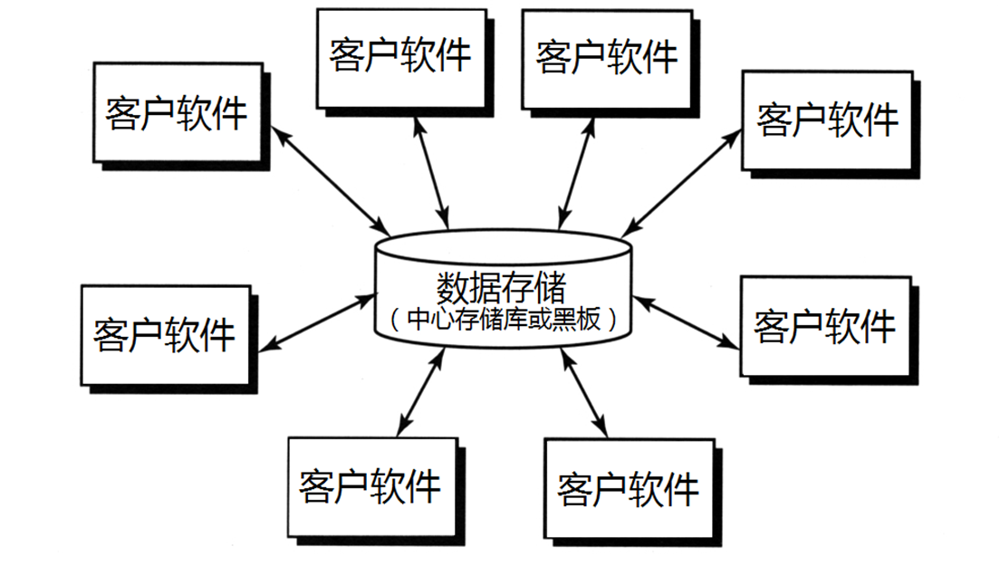
      - 数据流体系结构
        - 也称管道/过滤器结构
        - 拥有一组称为过滤器的构件，这些构件通过管道连接，每个过滤器独立于其上游和下游的构件而工作
        - 图解 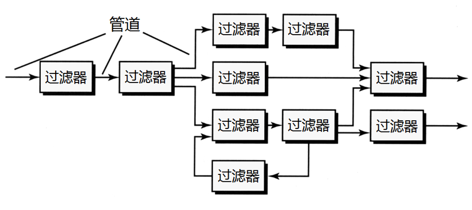
      - 调用和返回体系结构
        - 将功能分解为一个控制层次结构，其中的“主”程序调用一组程序构件，这些程序构件又去调用别的程序构件
      - 层次体系结构
        - 定义了不同的层次，各个层次完成各自操作
        - 每一层为上层提供服务，又接受下层的服务
        - 图解 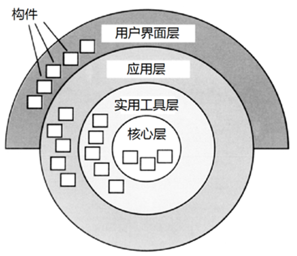
  - 体系结构设计
    - 结构化设计
      - 结构化设计是将结构化分析的结果（数据流图）映射成软件的体系结构（结构图） 数据流图 -&gt; 结构图
      - 根据信息流的特点，可将数据流图分为变换型数据流图和事务型数据流图，其对应的映射分别称为变换分析和事务分析
        - 变换分析
          - 1.划定输入流和输出流的边界，确定变换中心
            - 物理输入要经过编辑、格式转换、合法性检查等辅助性加工后变成纯粹的逻辑输入再传给变换中心；变换中心产生的逻辑输出要经过格式转换、组成物理块、缓冲处理等辅助性加工后变成物理输出，再送到系统外
              - 物理输入：系统输入端的数据流
              - 物理输出：系统输出端的数据流
              - 逻辑输入：变换中心的输入数据流
              - 逻辑输出：变换中心的输出数据流
            - 确定逻辑输入
              - 从物理输入端开始，一步步向系统的中间移动，可找到离物理输入端最远的，但仍可被看作系统输入的那个数据流，就是逻辑输入
            - 确定逻辑输出
              - 从物理输出端开始，一步步向系统的中间移动，可找到离物理输出端最远的，但仍可被看作系统输出的那个数据流，就是逻辑输出
            - 确定变换中心
              - 确定了所有的逻辑输入/输出后，位于逻辑输入和逻辑输出之间的部分就是变换中心
          - 2.进行第一级分解
            - 第一级分解是将DFD映射成变换型的程序结构
            - 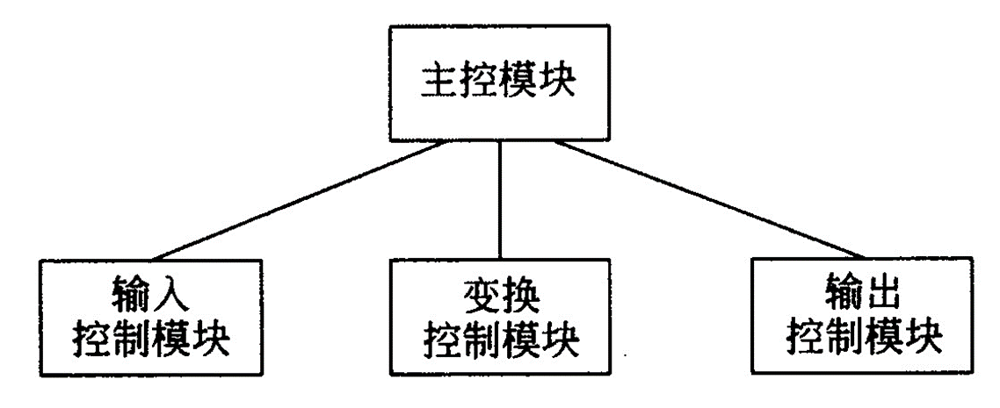
              - 主控模块：完成整个系统的功能
              - 输入流控制模块：接收所有输入数据
              - 变换流控制模块：对内部形式的数据进行加工处理，实现输入到输出的变换
              - 输出流控制模块：产生所有输出数据
          - 3.进行第二级分解
            - 输入流控制模块的分解
              - 从变换中心的边界开始，沿着输入通路向外移动，把输入通路上的每个加工映射成程序结构中输入流控制模块的一个低层模快
            - 输出流控制模块的分解
              - 从变换中心的边界开始，沿着输出通路向外移动，把输出通路上的每个加工映射成程序结构中输出流控制模块的一个低层模快
            - 变换流控制模块的分解
              - 把变换中心的每个加工映射成受变换控制模块控制的一个低层模块
      - 步骤
        - 1.复审和精化数据流图
          - 复审DFD的顶层图，确保系统的输入、输出数据流符合系统规格说明的要求
          - 复审分层DFD，以确保它符合软件的功能需求
          - 必要时对DFD进行精化。
        - 2.确定数据流图的类型
          - 根据DFD的信息流特征，确定DFD是变换型的还是事务型的
        - 3.将DFD映射成初始结构图
          - 采用变换分析或事务分析技术，将DFD映射成初始结构图
        - 4.改进初始结构图
          - 根据软件设计准则，采用启发式设计策略，对初始结构图进行改进，以改善软件质量
    - 构件级设计
      - 面向对象设计
      - 构件：系统中模块化的、可部署的和可替换的部件，该部件封装了实现并暴露一组接口
- 软件测试
  - 介绍
    - 狭义：为了发现软件错误而执行软件的过程
    - 广义：在规定的条件下对程序进行操作，以发现程序错误，衡量软件质量，并对其是否能满足设计要求进行评估的过程
    - 测试是为了证明程序中有错误，而不是证明程序中无错误
    - 一个好的测试用例指的是它可能发现至今尚未发现的缺陷
    - 一次成功的测试指的是发现了新的软件缺陷的测试
  - 原则
    - 应该“尽早和不断地进行软件测试”
      - 测试计划在需求分析阶段,测试用例设计在设计阶段
    - 穷举测试是不可能的
    - 应当避免由程序员检查自己的程序。（指后期系统测试阶段，不包括单元测试）
    - 在设计测试用例时，应包括合理的输入条件和不合理的输入条件
    - 严格执行测试计划，排除测试的随意性
    - 应当对每一个测试结果做全面检查
    - 妥善保存测试计划、测试用例、出错统计和最终分析报告，为维护提供方便
  - 测试用例
    - 测试用例（ Test Case ）是指对一项特定的软件产品进行测试任务的描述，体现测试方案、方法、技术和策略。内容包括测试目标、测试环境、输入数据、测试步骤、预期结果、测试脚本等，并形成文档
    - 设计
      - 测试用例的设计是软件测试的关键所在
      - 设计尽可能少的测试用例来发现尽可能多的错误
      - 设计最有可能发现软件错误的测试用例，同时避免使用发现错误效果相同的测试用例
      - 测试用例的设计方法大体可分为两类：白盒测试和黑盒测试，也称白箱测试和黑箱测试
        - 白盒测试（又称为结构测试）把测试对象看作一个透明的盒子，测试人员根据程序内部的逻辑结构及有关信息设计测试用例，检查程序中所有逻辑路径是否都按预定的要求正确地工作,白盒测试主要用于对模块的测试
        - 黑盒测试（又称行为测试）把测试对象看做一个黑盒子，测试人员完全不考虑程序内部的逻辑结构和内部特性，只依据程序的需求规格说明书，检查程序的功能是否符合它的功能需求,黑盒测试可用于各种测试.
  - 软件测试分类
    - 按测试方式分类
      - 静态测试（不需要执行所测试的程序，查询代码是否符合规范，对程序的数据流和控制流进行分析）
      - 动态测试（选择实际测试用例运行测试程序，模拟用户输入）
    - 按测试过程分类
      - 单元测试:是针对程序中的模块或构件，主要揭露编码阶段产生的错误
        - 指对软件中的最小可测试单元进行检查和验证
        - 主要对模块的 5 个基本特性进行测试
          - 接口
          - 局部数据结构
          - 边界条件
          - 独立路径
          - 错误处理路径
        - 由于模块并不是独立的程序，所以必须为每个测试单元开发驱动程序和桩程序
          - 驱动程序：模拟被测试模块的上一级模块，相当于被测模块的主程序。它接收测试数据，将相关数据传送给被测模块，启动被测模块，并输出结果
          - 桩程序：模拟被测模块所调用的模块
        - 图解 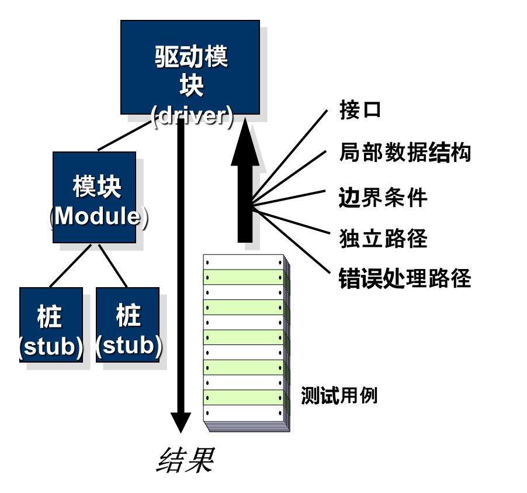
      - 集成测试:针对集成的软件系统，主要揭露设计阶段产生的错误
        - 集成测试是通过发现和接口有关的问题来构造程序结构的系统化技术，其目标是把通过了单元测试的模块拿来，构造一个设计中所描述的程序结构
        - 增量集成：程序以小增量方式进行构造和测试
          - 自顶向下测试：从主控模块开始，沿着控制层次结构逐步向下，利用深度优先或广度优先的方式将从属于主控模块的模块集成到结构中去
            - 深度优先方式的集成：首先集成在结构中的一个主控路径下的所有模块，主控路径的选择是任意的 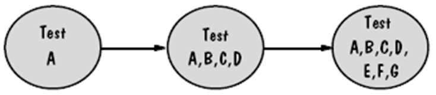
            - 首先沿着水平方向，把每一层中所有直接隶属于上一层的模块集成起来，直到底层 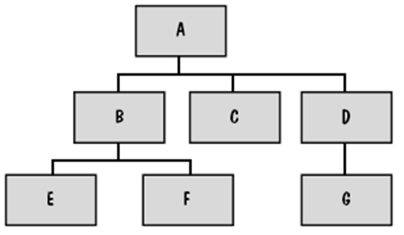
            - 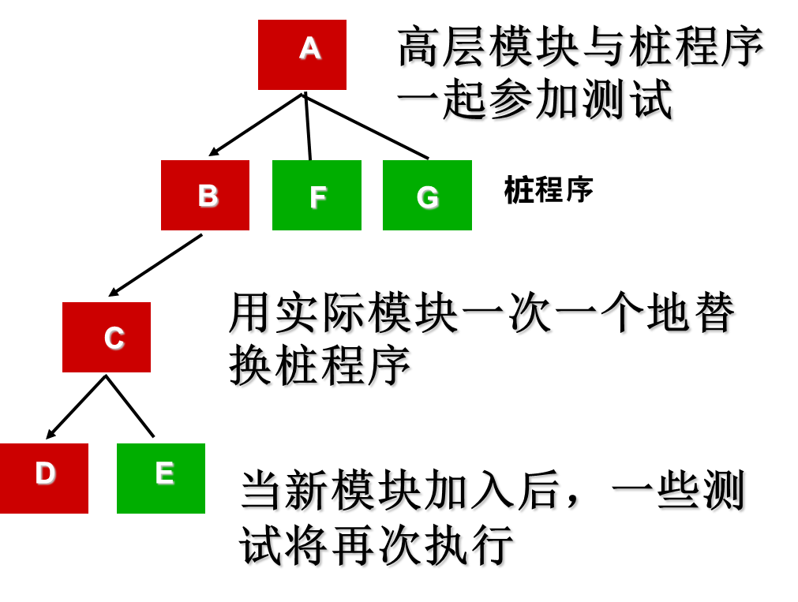
          - 自底向上测试：从原子模块开始进行构造和测试
            - 图解 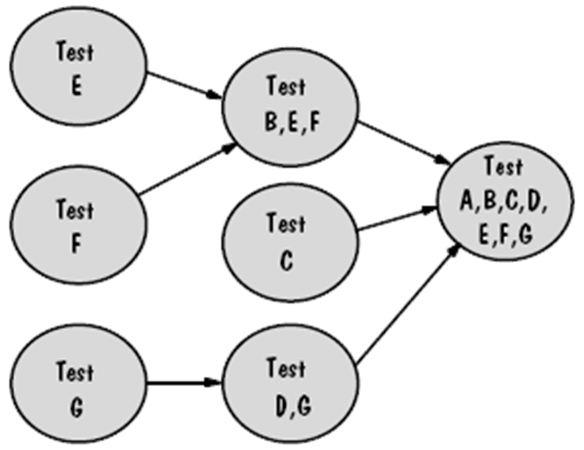
            - 图解 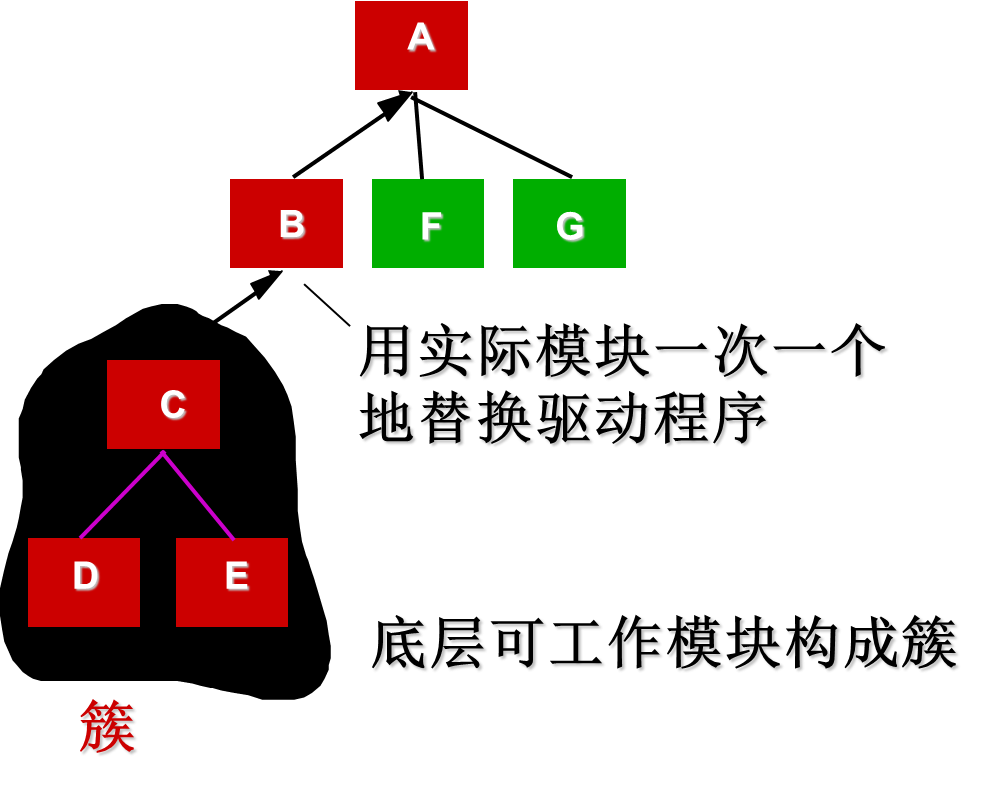
          - 组合方法（三明治）：用自顶向下方法测试程序结构较高层，用自底向上方法测试其从属层
        - 一步到位的集成
          - 需要桩程序和驱动程序去分别测试每一模块
          - 难于排查错误
          - 图解 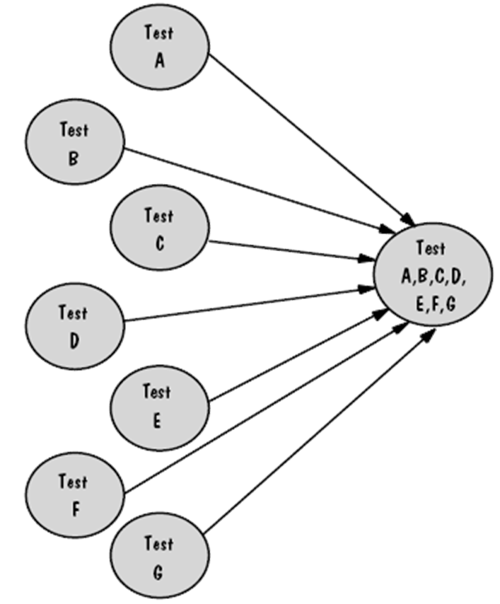
      - 确认测试:是根据软件需求规约对集成的软件进行确认，主要揭露不符合需求规约的错误
        - 侧重于需求级的错误，即对最终用户是显而易见的错误
        - 软件规格说明中包含的信息是确认测试的基础
        - 配置评审：确保所有软件配置元素已正确开发、编目，且具有软件生命周期各阶段的必要细节
        - α测试：最终用户在开发场所完成，软件在自然的环境下使用，开发者在旁边观看，并记录错误和使用问题
        - β测试：在最终用户场所执行，开发者通常不在场
      - 系统测试:对于基于计算机系统中的软件，还需将它集成到基于计算机系统中，并进行系统测试，以揭露不符合系统工程中对软件要求的错误
        - 系统测试是将已经继承好的软件系统，作为计算机系统的一个元素，与计算机硬件、某些支持软件、数据和人员等其他系统元素结合在一起，在实际运行环境下，对计算机系统进行一系列的集成测试和确认测试
      - 回归测试：重新运行已经进行过的测试子集，以确保变更没有引发非预期的副作用
        - 回归测试可以手动进行，通过重新运行一部分测试用例或者全部测试用例，也可以使用自动的捕获/回放工具
        - 回归测试有助于确保变更（由于测试或者其他原因）不会引入非预期的行为或者增加的错误
        - 每次对软件进行修改时，就改变了软件配置的某些方面（软件、文档及支持软件的数据）
      - 冒烟测试：是指在对一个新版系统进行大规模的测试之前，先验证一下软件的基本功能是否实现，是否具备可测试性
        - 这一术语源自硬件行业。对一个硬件或硬件组件进行更改或修复后，直接给设备加电。如果没有冒烟，则该组件就通过了测试
        - 步骤
          - 将已经转换为代码的软件构件集成到构造（ “build” ）中
            - 一个构造包括所有的数据文件、库、可重用的模块、以及工程化的构件，其中一个构件需要实现一项或多项产品功能
          - 设计一系列测试来揭示错误，使得此构造不能正确地执行其功能
            - 目的是揭示“显示阻塞” 错误，这种错误最有可能使软件项目滞后于进度计划
          - 将此构造与其他构造集成在一起，每天都对整个产品（以其当前的形式）进行冒烟测试
            - 集成方法可以是自顶向下，也可以是自底向上
    - 按测试目的分类
      - 功能测试，健壮性测试，接口测试，性能测试，强度测试，压力测试，用户界面测试，安全测试，可靠性测试，安装/反安装测试，文档测试，恢复测试，兼容性测试
        - 恢复测试
          - 通过各种方式强制地让系统发生故障，并验证其能适当恢复
        - 安全测试
          - 验证系统内的保护机制能够保护系统不受非法入侵
          - 使攻破系统所付出的代价大于攻破系统之后获取信息的价值
        - 压力测试
          - 能将系统折腾到什么程度而不会出错？
          - 以一种反常数量、频率或容量的方式执行系统
        - 性能测试
          - 测试软件的运行性能
          - 常和压力测试一起进行，常需要硬件和软件配合
  - 软件测试的组织
    - 测试贯穿于整个软件的开发过程中，开发人员必须参与测试
    - 对即将交付软件的集成测试，开发人员往往也要参加
    - 集成测试中，有独立测试组（ITG）的介入
    - ITG应从一开始就要介入项目，只是不像开发人员过多地注意细节
  - 测试完成的标准
    - 测试只能是在某个阶段告一段落。
    - 由于软件使用的软环境可能要永恒地变化。所以，它时刻、永远地面临考验，没有尽头
    - 测试是永远也完不成的
  - 测试策略
    - 开始于 ‘小范围测试’ ，并移向 ‘大范围测试’
    - 对于传统的软件
      - 开始集中在模块 (构件)
      - 之后进行模块集成
    - 对于面向对象的软件
      - 当进行 ‘小范围测试’时，关注点从单个模块（传统上的）转变到面向对象的类，类封装了属性和操作，并意味着通信和协作。
  - 测试方法
    - 白盒测试
      - 白盒测试是有选择地执行（或覆盖）程序中某些最有代表性路径的测试方法，所以也称为逻辑覆盖测试
      - 方法
        - 逻辑覆盖法
          - 语句覆盖
            - 选择足够的测试用例，使得程序中每个语句至少都能执行一次
          - 判定覆盖
            - 执行足够的测试用例，使得程序中每个判定至少都获得一次“真”值和“假”值，即使得程序中的每一个分支至少都通过一次
          - 条件覆盖
            - 执行足够的测试用例，使得判定中每个条件获得各种可能的结果
          - 判定／条件覆盖
            - 执行足够的测试用例，同时满足判定覆盖和条件覆盖的要求
          - 条件组合覆盖
            - 执行足够的测试用例，使得每个判定中条件的各种可能组合都至少执行一次
        - 基本路径测试法
          - 基本路径测试法是根据程序的控制流路径设计测试用例的一种最基本的白盒测试技术
          - 考察测试路径的有用工具：程序控制流图
        - 循环测试方法
          - 简单循环
            - 零次循环：从循环入口直接跳到循环出口
            - 一次循环：查找循环初始值方面的错误
            - 二次循环：检查在多次循环时才能暴露的错误
            - m次循环：此时的m＜n，也是检查在多次循环时才能暴露的错误
            - n(最大)次数循环、n+1(比最大次数多一)次的循环、n-1(比最大次数少一)次的循环
          - 嵌套循环
            - 从最内层循环开始，设置所有其他层的循环为最小值
            - 对最内层循环做简单循环的全部测试。测试时保持所有外层循环的循环变量为最小值。另外，对越界值和非法值做类似的测试
            - 逐步外推，对其外面一层循环进行测试。测试时保持所有外层循环的循环变量取最小值，所有其它嵌套内层循环的循环变量取“典型”值
            - 反复进行，直到所有各层循环测试完毕
            - 对全部各层循环同时取最小循环次数，或者同时取最大循环次数
          - 串接循环
            - 如果各个循环互相独立，则串接循环可以用与简单循环相同的方法进行测试
            - 如果有两个循环处于串接状态，而前一个循环的循环变量的值是后一个循环的初值。则这几个循环不是互相独立的，则需要使用测试嵌套循环的办法来处理
          - 无结构循环
          - 图解 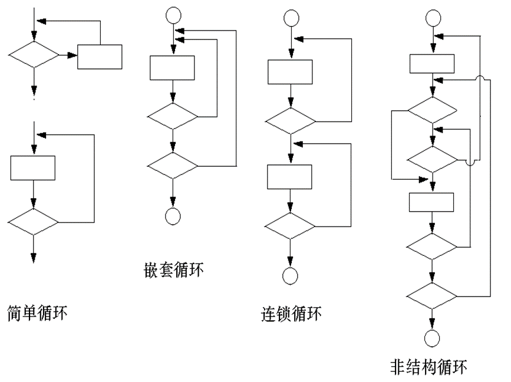
    - 黑盒测试
      - 黑盒测试是根据程序组件的规格说明测试软件功能的方法，所以也称为功能测试
      - 被测对象作为一个黑盒子，它的功能行为只能通过研究其输入和输出来确定，所以又称为软件输入/输出接口测试
      - 黑盒测试注重于功能和数据信息域的测试
      - 方法
        - 等价类划分
          - 等价类划分的办法是把程序的输入域或者输出域划分成若干等价类，然后从每个部分中选取少数代表性数据当作测试用例
          - 等价类是指输入域的某个子集，该子集中的每个输入数据对揭露软件中的错误都是等效的，测试等价类的某个代表值就等价于对这一类其他值的测试
          - 根据输出数据等价类导出输入数据等价类
          - 原则 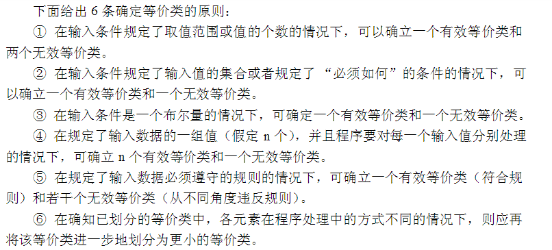
        - 边界值分析法
          - 大量的错误是发生在输入或输出范围的边界上，边界值揭露程序中错误的可能性就更大，边值分析法是对等价类划分方法的补充，这种情况下，测试用例来自等价类的边界
          - 应当选取正好等于，刚刚大于，刚刚小于边界的值做为测试
- 软件项目管理
  - 软件质量
    - 软件质量：应用有效的软件过程，创造有用的产品，为生产者和使用者提供明显的价值
    - 有效的软件过程为生产高质量的软件产品奠定了基础，能够使得软件开发过程变得有序
    - 有用的产品是指交付最终用户要求的内容、功能和特征，满足利益相关者明确提出的需求和其它隐性需求（例如，易用性）
    - 高质量软件为软件组织和最终用户群体带来收益
    - McCall 质量因素 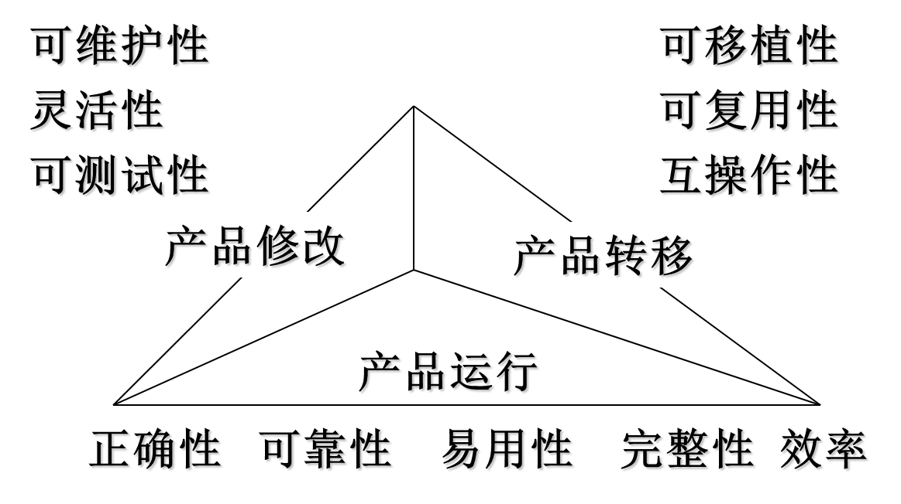
      - 正确性：程序满足需求规格说明和完成用户任务目标的程度
        - 可追踪性：从一个设计表示或实际程序追踪到需求的能力
        - 完备性：所需功能完全实现的程度
        - 一致性：设计文档与系统实现的一致性
      - 可靠性：程序以所要求的精度完成预期功能的程度
        - 准确性：计算和控制的精度
        - 容错性：在各种异常条件下继续提供操作的能力
      - 完整性：对未授权人员访问软件或数据的可控程度
      - 易用性（易培训性）：对程序学习、操作、准备输入和解释输出所需要的工作量
      - 效率：程序完成其功能所需的资源
        - 计算效率
        - 存储效率
      - 可维护性：定位和修复程序中的一个错误所需要的工作量
        - 简单性：理解程序的难易程度
        - 简明性：程序源代码的紧凑与简洁性
        - 检测性：系统能监视自身的运行，一旦发生错误，能明确地标识出产生错误的位置
      - 灵活性（适应性）：修改一个可正常运行的程序所需的工作量
        - 模块化：程序部件的独立性
        - 通用性：程序部件潜在应用范围的广泛性，即可重用性
        - 软件系统独立性：程序与非标准的程序设计语言特征、操作系统特征以及其他环境限制无关的程度
        - 硬件独立性：软件同支持它运行的硬件系统不相关的程度
      - 可移植性：将软件从一个硬件和软件系统环境移植到另一个所需要的工作量
      - 可复用性：软件的各个构件可以在另一个软件中使用的程度
      - 互操作性：将一个系统连接到另一个系统所需要的工作量
        - 通信通用性：使用标准接口、协议、规范的程序
        - 数据通用性：在程序中使用标准的数据结构和类型
    - 软件质量保证 SQA
      - 什么是SQA：参照一定的质量标准、目标及各项软件流程、规范来监督、管理软件产品的质量
      - SQA的目的：是为了客观地核实软件项目的实施行动与开发中的产品遵从于对应的需求、过程描述、标准及规程
      - 质量保证目标
        - 需求质量。需求模型的正确性、完整性和一致性将对所有后续工作产品的质量有很大的影响
        - 设计质量。软件团队应该评估设计模型的每个元素，以确保设计模型显示出高质量，并且设计本身符合需求
        - 代码质量。源代码和相关的工作产品（例如，其他说明资料）必须符合本地的编码标准，并显示出易于维护的特点
        - 质量控制有效性。软件团队应使用有限的资源，在某种程度上最有可能得到高品质的结果
      - 任务
        - 为项目准备SQA计划
        - 参与开发项目的软件过程描述
        - 评审各项软件工程活动，验证其是否符合定义的软件过程
        - 审核指定的软件工作产品，验证其是否符合定义
        - 确保软件工作及工作产品中出现的偏差已文档化，并且按照文档化的规程进行了处理
        - 记录所有不符合的部分，并报告给高层管理者
  - 软件项目估算
    - 项目估算是对需求分析、设计、编码、测试、集成交付等整个软件开发过程所花费工作量、时间、成本等的预测
    - 软件系统的规模、功能越来越复杂，难于理解，必须通过某种方法对软件的规模、工期、成本进行度量、预计，从而能更好的控制软件开发活动
    - 项目估算是制定合理的项目计划的基础
  - 估算方法
    - 基于问题规模的估算
      - LOC估算(直接测量)和FP估算(间接测量)
        - 过程
          - 从软件范围陈述入手，将软件分解成一些可独立进行估算的功能
          - 估算每个功能的LOC或FP
          - 将基线生产率度量应用于适当的估算变量中，导出每个功能的成本或工作量
          - 将所有功能的估算合并
      - 三点估算（综合不同的估计结果）
        - 先确定规模的乐观值(Sopt)、可能值(Sm)和悲观值(Spess)，再将它们结合起来
        - 期望值S=(Sopt+4Sm+Spess)/6
    - 基于过程的估算
      - 将过程分解为一组较小的任务，并估算完成每个任务所需的工作量
      - 步骤
        - 从项目范围中抽取出软件功能
        - 给出为实现每个功能所必须执行的一系列框架活动
        - 估算每个软件过程活动所需的工作量
        - 将平均劳动力价格应用于每个软件过程活动的估算工作量，从而估算出成本
  - 项目进度安排
    - 是一种活动，通过将时间分配给特定的软件工程任务，从而将所估算的工作量分配到计划的项目工期内
    - 基本指导原则
      - 划分：将项目划分成多个可以管理的活动、动作和任务
      - 相互依赖性：划分后的各个活动、动作或任务之间的相互依赖关系必须是明确的
      - 时间分配：每个安排了进度计划的任务必须分配一定数量的工作单位；必须为每个任务指定开始日期和完成日期
      - 工作量确认：必须确保在任意时段中分配的人员数量不会超过项目团队中的总人员数量
      - 确定责任：每个任务都应该指定特定的团队成员来负责
      - 明确结果：每个任务都应该有一个明确的输出结果
      - 确定里程碑：每个任务或任务组都应该与一个项目里程碑相关联
    - 项目延期
      - 延期怎么办
        - 按照以往项目的历史数据和本项目进展情况，重新进行详细的估算，确定新的估算工作量和工期
        - 采用增量过程模型，制定一个软件过程策略，以保证能够在规定交付日期提供主要功能，而将其他功能的实现推到以后
        - 与客户交流，说明规定的交付日期是不现实的，并将增量开发策略作为可选计划提交给客户
```
