```markmap
---
markmap:
  initialExpandLevel: 2
  spacingVertical: 30
  spacingHorizontal: 180
---

# 程序的机器级表示
- X86-64
  - 整数寄存器
    - 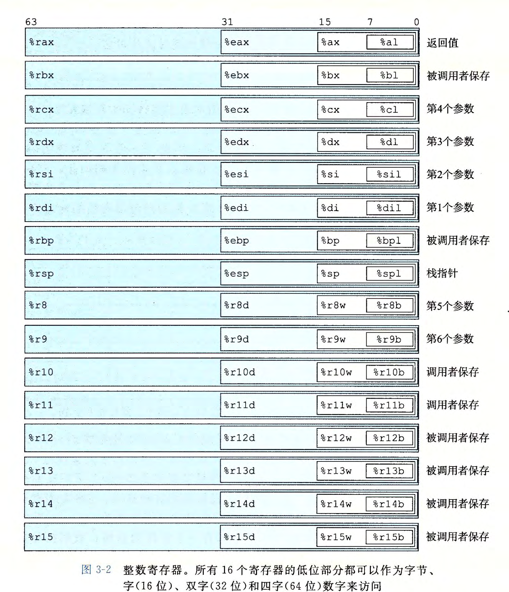
- 访问信息
  - 操作数指示符
    - 操作数格式 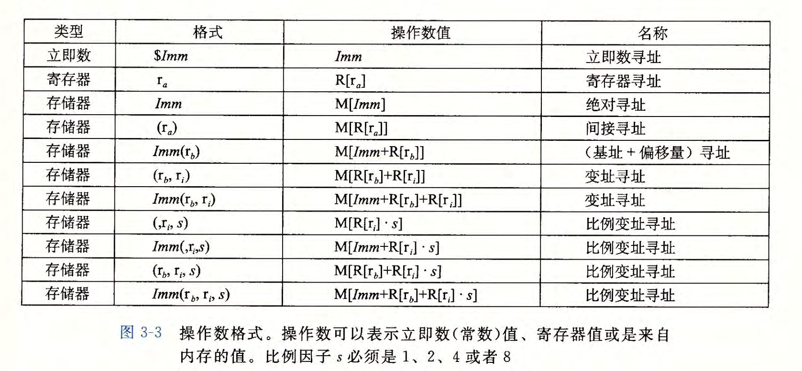
  - 数据传送指令
    - 简单的数据传送指令 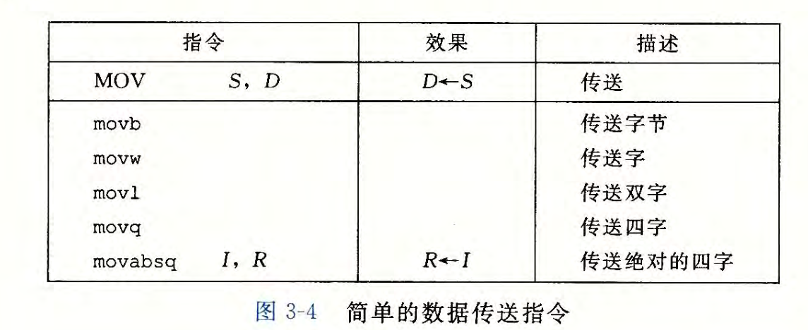
      - 五种可能的组合 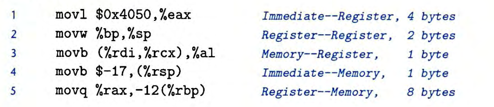
      - movl 指令会将 64 位寄存器的高 32 位置为 0
      - movq 指令只能适用于 32 位立即补码数，会进行符号扩展。 movabsq 适用于 64 位立即数
    - 零扩展数据传送指令 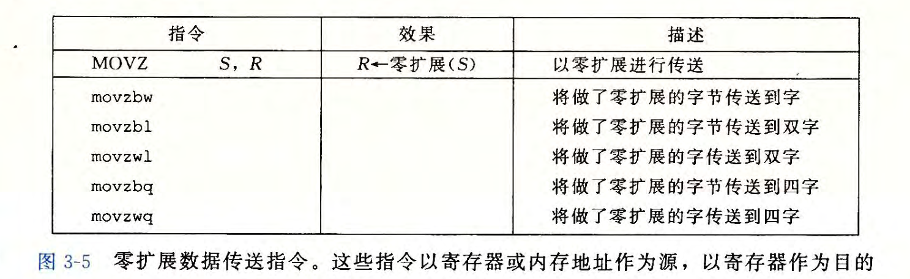
    - 符号扩展数据传送指令 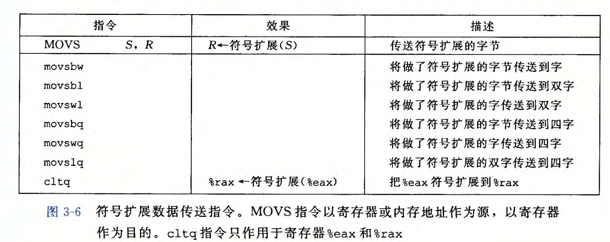
    - 压入和弹出栈数据 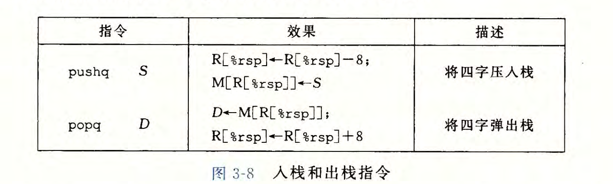
      - 栈向下增长，栈顶元素的地址是所有栈中元素地址最低的
  - 算术和逻辑操作
    - 整数算术操作 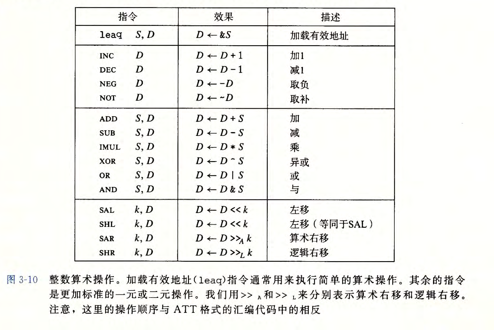
      - 加载有效地址(load effective address） leaq指令
        - 该指令并不是从指定的位置读入数据，而是将有效地址写人到目的操作数。
        - 一种用法是为后面的内存引用产生指针 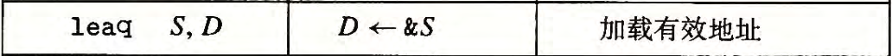
        - 另一种用法是简洁地描述普通的算术操作
          - 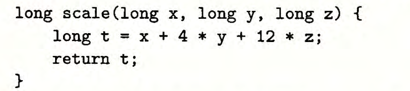
          - 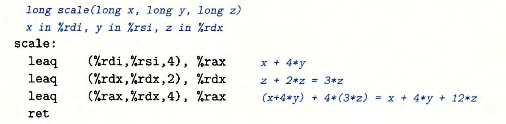
    - 特殊的算术操作 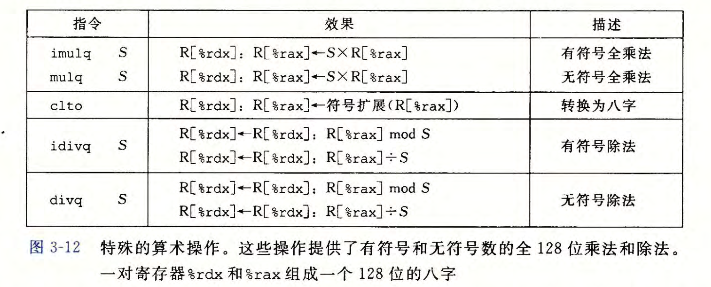
      - clto 指令的 o 指的是八字(oct word）
- 控制
  - 条件码
    - 标志寄存器（条件码（condition code）寄存器）
      - 常用条件码 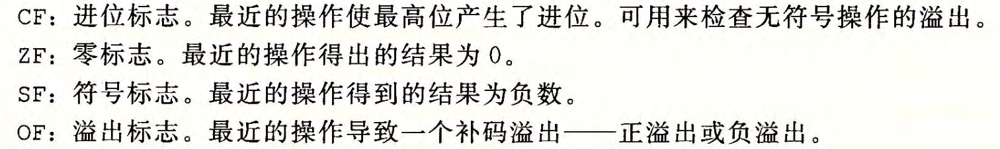
    - 指令对条件码的影响
      - 逻辑操作：如 XOR，进位标志和溢出标志置为 0
      - 移位操作：进位标志将设置为最后一个被操作的位，溢出标志设置为 0
      - INC 和 DEC 指令会设置溢出和零标志，但是不会改变进位标志
      - 比较和测试指令 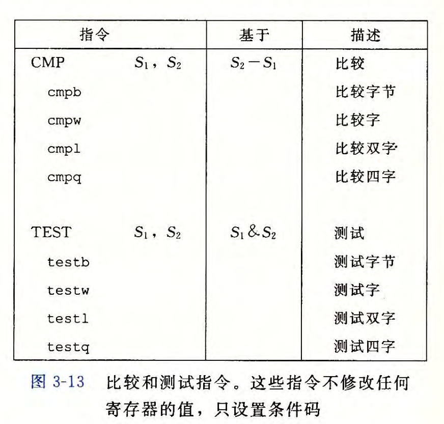
    - 访问条件码
      - 根据条件码的某种组合，将一个字节设置为 0 或者 1
        - SET 指令，其目的操作数是低位单字节寄存器，或者是一个字节的内存位置 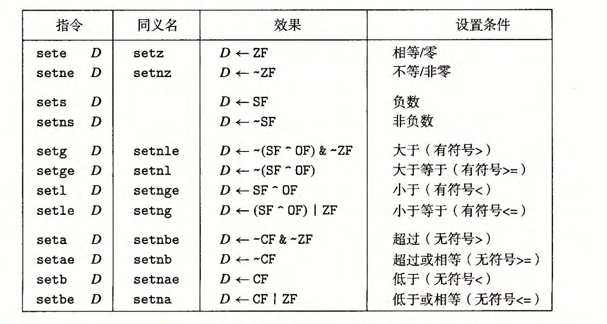
          - 例如： 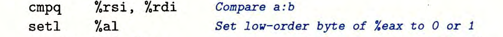
      - 条件跳转到程序的某个其他部分
        - 跳转指令 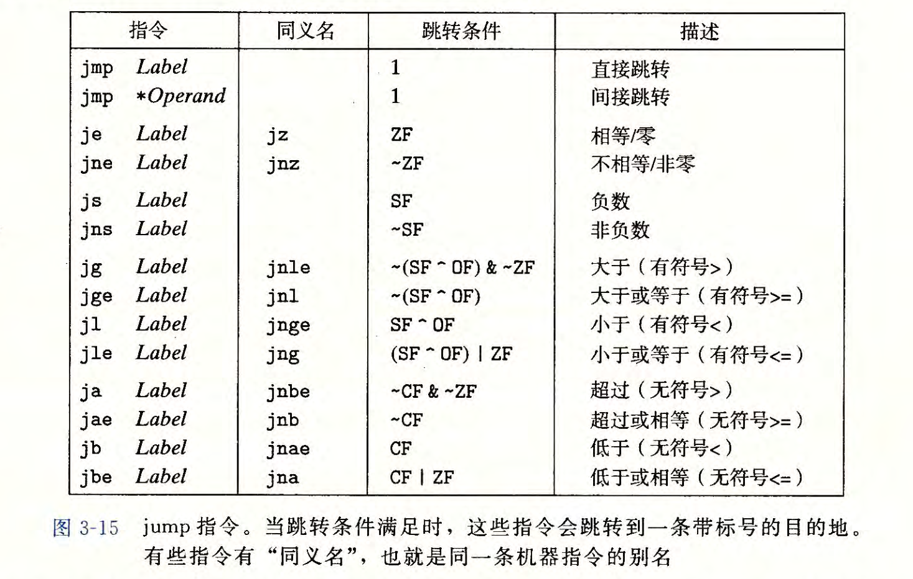
          - 间接跳转示例： jmp *%rax //rax 中值作为跳转目标 jmp *(%rax) //rax中的值作为读地址，从内存中读出跳转目标
      - 条件传送数据
        - 条件传送指令 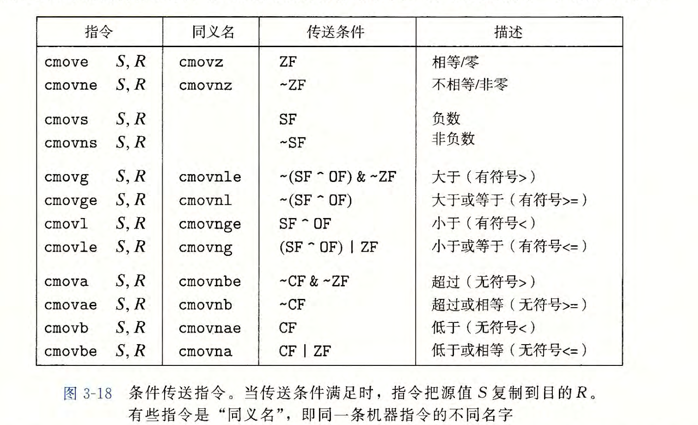
  - 循环
    - do-while 循环
      - 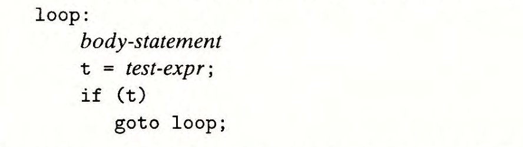
    - while 循环
      - jump to middle ，-Og 选项时对应的汇编代码 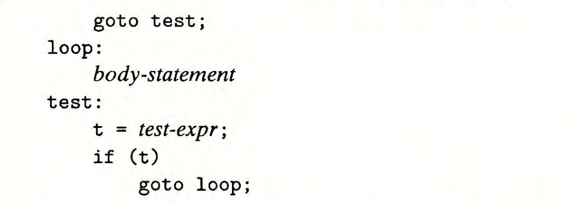
      - guarded-do, -O1 选项 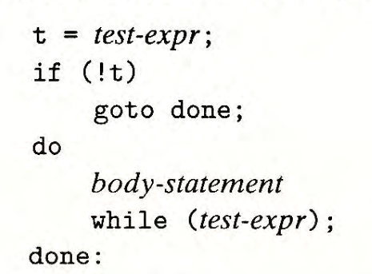
    - for 循环
      - 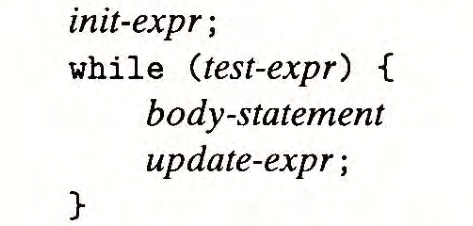
  - 过程（函数）
    - 通用栈帧结构，其中，参数构造区用来存储传递给下一个过程的参数 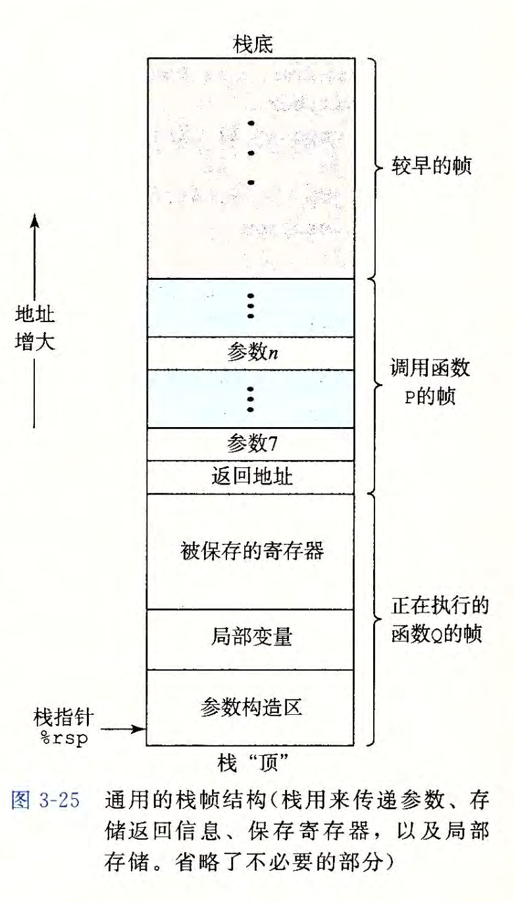
    - 转移控制
      - call 和 ret 指令的一般形式 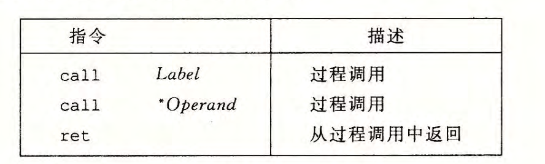
        - 在过程 P 中执行 call Q 指令：将继续 P 的执行的代码位置 A （返回地址） 压入栈中，并将 PC 设置为 Q 的起始地址。 ret 指令从栈中弹出地址 A，并将 PC 设置为 A
    - 数据传送
      - 参数传递
        - 在 X86-64 中，大部分过程间的数据传送都是通过寄存器来实现的。
          - 最多可以通过寄存器传递 6 个整形参数。
          - 寄存器的使用有特殊顺序
          - 传递函数参数的寄存器 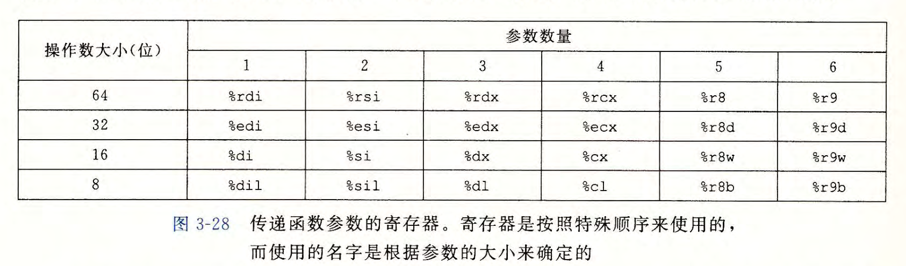
        - 大于 6 个整形的参数，超出 6 个的部分通过栈来传递
          - 假设过程 P 调用过程 Q,有 n 个整型参数，且 n &gt; 6 。那么 P 的代码分配的栈帧必须要能容纳 7 到 n号参数的存储空间
    - 栈上的局部存储
      - 局部数据必须存放在内存中的情况
        - 寄存器不足够存放所有的本地数据
        - 对一个局部变量使用地址运算符＇＆＇，因此必须能够为它产生一个地址
        - 某些局部变量是数组或结构，因此必须能够通过数组或结构引用被访问到
      - 变长栈帧
        - alloca 函数可以在栈上分配任意字节数量的存储，当代码声明一个局部变长数组时，就会发生这种情况
    - 寄存器中的局部存储空间
      - 寄存器组是唯一被所有过程共享的资源
      - 被调用者保存寄存器
        - 寄存器 %rbx , %rbp 和 %r12~%r15 被划分为被调用者保存寄存器
        - 当过程 P 调用过程 Q 时，Q 必须保存这些保存寄存器的值，保证他们的值在 Q 返回到 P 时与 Q 被调用时是一样的
        - 所有其他寄存器，除了 %rsp，都是调用者保存寄存器，这意味着任何函数都能修改他们
    - 数组分配与访问
      - 指针的相关运算
        - E 是一个 int 型的数组 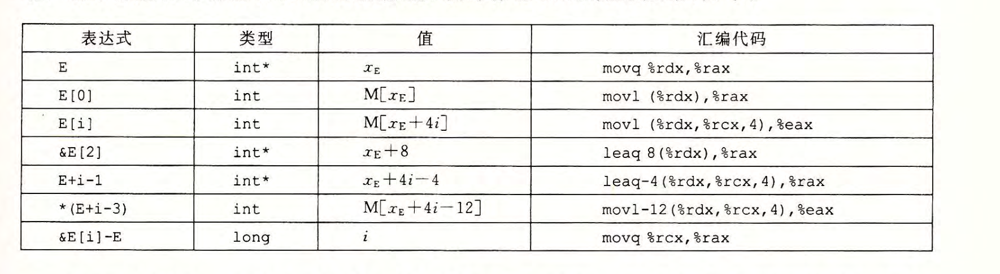
      - 多维数组
        - int A[5][3] 在内存中的布局： ![int A\[5\]\[3\] 在内存中的布局：](images/9df254d4c3a5dd6bfff7d2222692b5919a8f5a1fb29bc14cc9e33cb5325e647f.png)
        - 通常来说，对于一个声明如下的数组： T D[R] [C]; 它的数组元素 D[i][j] 的内存地址为 &D[i][j] = X_D + L * (C * i + j) 这里，L 是数据类型 T 以字节为单位的大小。X_D 是 D 的内存地址
  - 异质的数据结构
    - 结构
      - 结构的所有组成部分都存放在内存中一段连续的区域内
      - 指向结构的指针就是结构第一个字节的地址。
      - 编译器维护关于每个结构类型的信息，指示每个字段的字节偏移，它以这些偏移作为内存引用指令中的位移，从而产生对结构元素的引用
    - 联合
      - 以多种类型来引用一个对象
      - 一个联合的总的大小等于它最大字段的大小
    - 数据对齐
      - 对齐数据可以提高内存系统的性能
      - 对齐的原则是任何 K 字节的基本对象的地址必须是 K 的倍数
  - gdb
    - 常用的命令 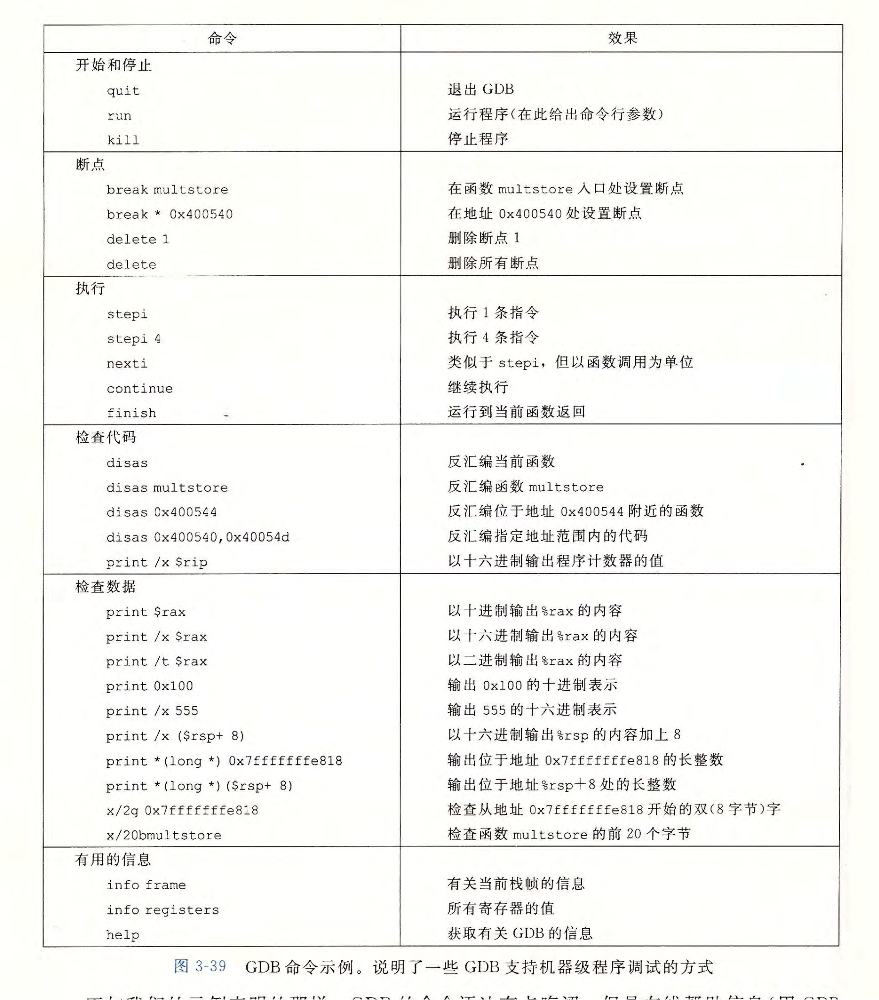
- 浮点代码
  - AVX2 中的 YMM 寄存器
    - 媒体寄存器 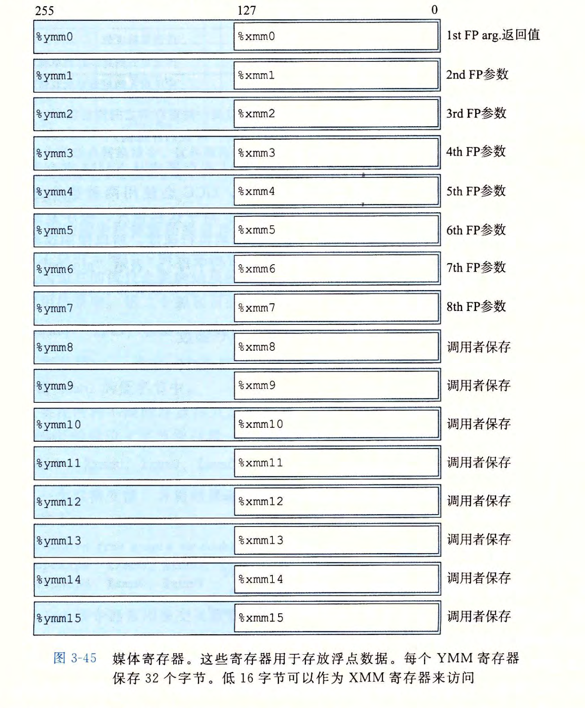
  - 浮点传送和转换操作
    - 浮点传送指令 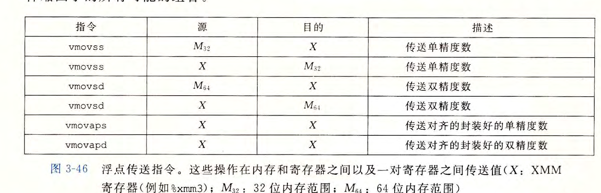
    - 双操作数浮点转换指令，截断（truncation）会把值向零进行舍入 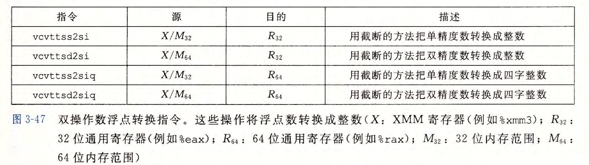
    - 三操作数浮点转换指令，第二个源操作数只会影响结果的高位字节 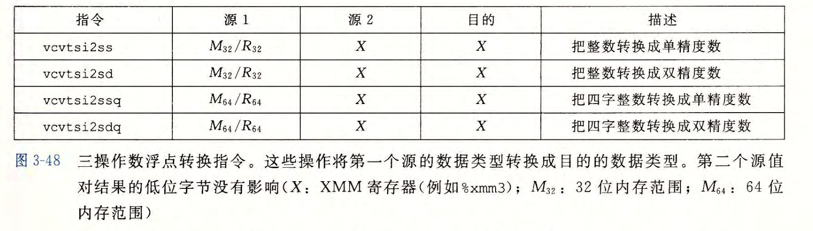
      - 例如： 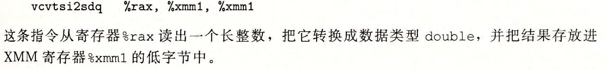
    - 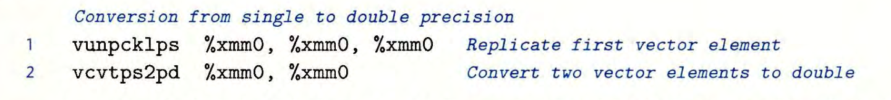
      - vunpcklps 指令用来交叉放置来自两个 XMM 寄存器的值，把他们存储到第三个寄存器中。
        - 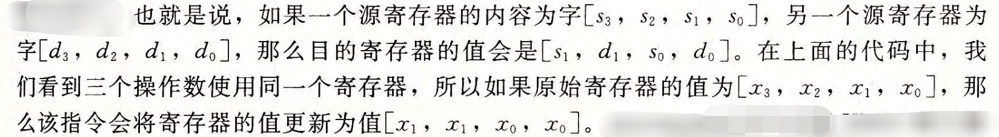
      - vcvtps2pd 指令把源 XMM 寄存器中的两个低位单精度值扩展成目的 XMM 寄存器中的两个双精度值 。
        - 对 vunpcklps 指令的结果运用这条指令会得到值 [dx_0, dx_0] 这里 dx_0 是将 x 转换成双精度后的结果 。
  - 浮点运算操作
    - 标量浮点算术操作 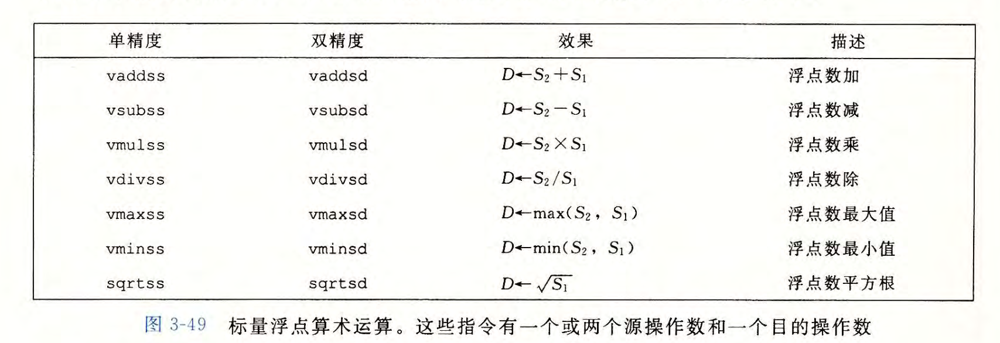
```
