```markmap
---
markmap:
  initialExpandLevel: 2
  spacingVertical: 30
  spacingHorizontal: 180
---

# 线程
- 线程标识
  - 每个线程都有一个 ID，但是只有在具体的进程上下文中才有意义
  - 线程 ID 用 pthread_t 数据类型进行表示
  - pthread_self 用来获取线程自身的 ID 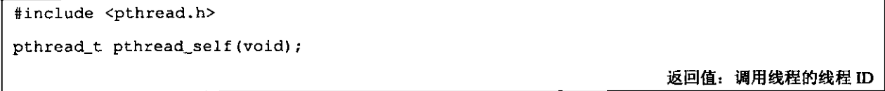
  - pthread_equal 用来判断两个线程 ID 是否相同 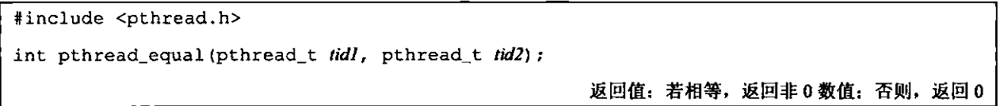
- 线程创建
  - pthread_create 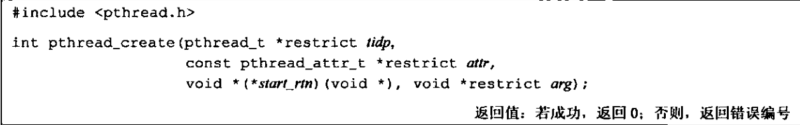
    - 不会设置 errno，而是直接返回错误码
  - 当 pthread_create 成功返回时，tidp 包含了新创建线程的线程 ID
  - 线程属性可以为 NULL
  - 新创建的线程从 start_rtn 函数的地址开始运行
  - 如果向 start_rtn 函数传递的参数不止一个，那么需要把这些参数放到一个结构中，然后把这个结构的地址作为 arg 参数传入
- 线程终止
  - 如果进程中的任意线程调用了exit、_Exit或者_exit，那么整个进程就会终止
  - 单个线程可以通过 3 中方式退出
    - 从 start_rtn 函数返回，其返回值是线程的退出码
    - 线程可以被同一进程中的其他线程取消
      - pthread_cancel 用来请求取消同一进程中的其他进程，被请求取消的线程可以忽略取消或者控制如何取消 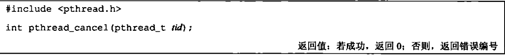
        - 调用线程不会等待
      - 线程可以安排它退出时需要调用的函数，这样的函数被称为线程清理处理程序（thread cleanup handler），一个线程可以建立多个清理处理程序，这些函数被存储在栈中，所以执行顺序与注册顺序相反
        - pthread_cleanup_push 和 pthread_cleanup_pop 函数 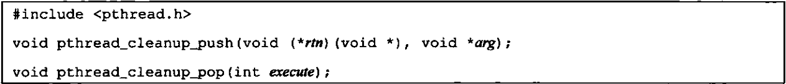
          - pthread_cleanup_pop 函数中的 execute 参数设置为 0， 则在删除该清理函数之前，不执行该清理函数，如果为非零值，则执行。
      - 注意：当线程从 start_rtn 返回而终止线程时线程不会调用线程处理程序，除非调用 pthread_exit 或者响应取消请求
    - 线程调用 pthread_exit 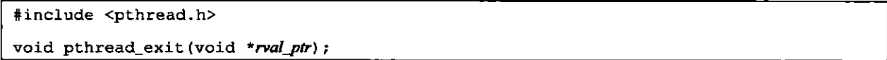
      - rval_ptr
        - 指向线程返回值的指针
  - pthread_join 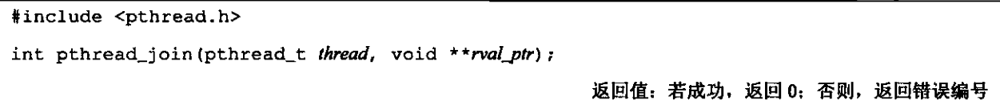
    - 调用线程将一直阻塞，直到指定的线程终止
    - 可以根据 rval_ptr 来判断线程是如何终止的
      - *rval_ptr = PTHREAD_CANCELED，线程被取消
      - *rval_ptr = 返回码，线程调用 pthread_exit 或者从 start_rtn 函数中返回
    - 调用 pthread_join 自动把线程置于分离状态，如果线程已经处于分离状态，则调用失败， errno = EINVAL
    - 如果对线程返回值不感兴趣，则可以将 rval_ptr 设置 NULL
  - 在默认情况下，线程的终止状态会保存直到对该线程调用 pthread_join。如果线程已经被分离，其底层存储资源可以在线程终止时立刻被收回，不能使用 pthread_join 来获取其终止状态，这会产生未定义行为。可以调用 pthread_detach 来使一个线程进入分离状态： 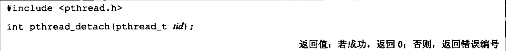
- 线程和进程的原语比较 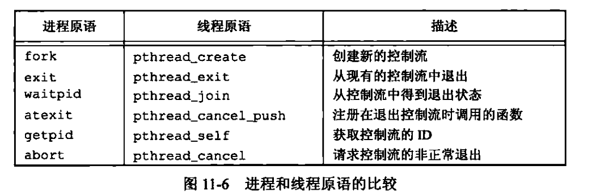
- 线程同步
  - 互斥量（mutex）
    - 可以确保同一时间只有一个线程访问数据
    - 对互斥量加锁之后，任何其他尝试再次对互斥量加锁的线程都会被阻塞，直到当前线程释放该互斥锁。
    - 如果释放互斥量时有一个以上的线程阻塞，那么在该锁上阻塞的所有线程都会被唤醒，最先可运行的线程就会获得该锁
    - 用 pthread_mutex_t 类型来表示互斥量
    - 在使用之前，需要对它进行初始化
      - 如果 mutex 是静态的，可以将其赋值为 PTHREAD_MUTEX_INITISLIZER
      - 如果 mutex 不是静态的，可以调用 pthread_mutex_init 来进行初始化
      - 如果 mutex 是动态分配的（通过 malloc），则还需要在释放内存时调用 pthread_mutex_destory
    - 对互斥量加锁和解锁 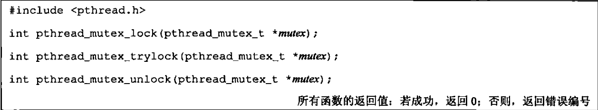
      - 如果不希望线程被阻塞，调用 pthread_mutex_trylock,如何返回 0，则说明获取锁成功，如果返回 EBUSY，则说明不能获取锁
      - pthread_mutex_timedlock 可以允许指定线程在互斥锁上阻塞直到指定的时间 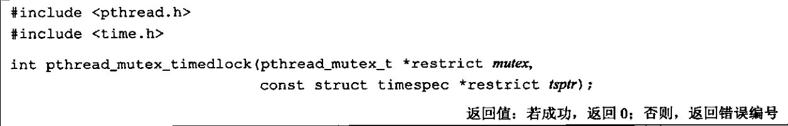
        - 指定的时间值是绝对时间，而不是相对时间
  - 读写锁 （reader-writer lock）
    - 也被称为共享互斥锁（shared-exclusive lock）
    - 读写锁有三种状态
      - 读模式下加锁状态
        - 所有以读模式加锁的线程都可以获得该锁，但是以写模式加锁的线程会被阻塞，直到所有线程都释放了他们的读锁
        - 一般情况下，当有一个尝试获得写锁的线程被阻塞之后，通常会阻塞随后的尝试获取读锁的线程，避免读锁长时间占用，而等待的写锁长时间得不到满足
      - 写模式下加锁状态
        - 在这个锁被解锁之前，所有试图对这个锁加锁的线程都会被阻塞
      - 不加锁状态
    - 一次只有一个线程可以占有写模式的读写锁，但是多个线程可以同时占有读模式的读写锁
    - 读写锁在使用之前必须进行初始化，在释放他们底层的内存之前必须摧毁 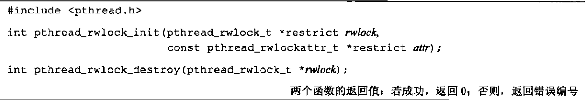
    - 加锁和释放锁 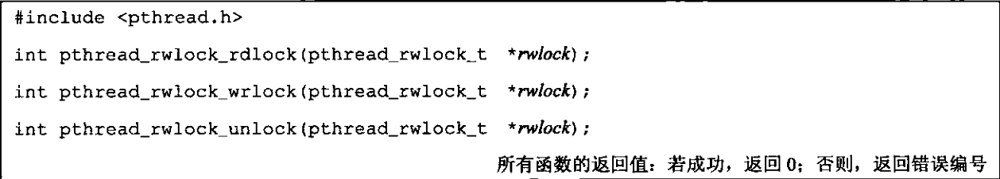
      - 尝试获取锁，如果没有获取到锁，会返回 EBUSY 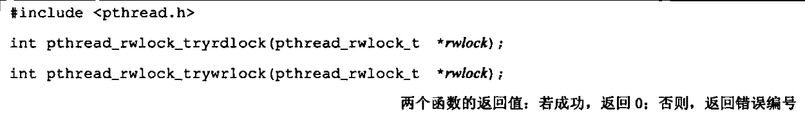
      - 带有超时的读写锁，如果在规定的时间内不能获得锁，则返回 ETIMEDOUT 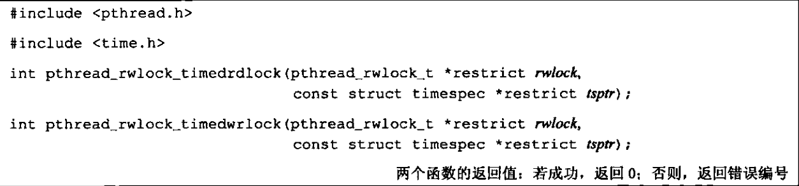
        - 超时指定的是绝对时间，而不是相对时间
  - 条件变量
    - 条件变量与互斥量一起使用时，允许线程以无竞争的方式等待特定的条件发生
    - 使用 pthread_cond_t 来表示条件变量
    - 在使用条件变量之前必须对其进行初始化
      - 如果是静态分配的条件变量，可以对其赋值为 PTHREAD_COND_INITIALIZER
      - 如果是动态分配的条件变量，则需要调用 pthread_cond_init 函数： 
    - 在释放条件变量底层的内存空间之前，可以使用 pthread_cond_destroy 来对条件变量进行反初始化 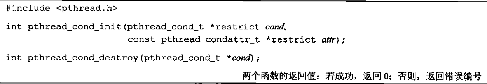
    - 等待条件变量改变： 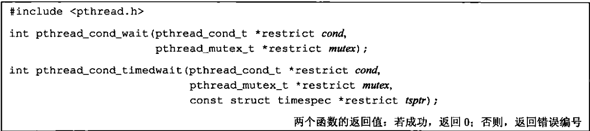
      - 传递给这两个函数的 mutex 必须已经处于锁住的状态（这主要是确保进行条件判断的时候没有其他线程修改条件），如果没有锁住 mutex，则可能进行条件判断不满足后，条件变量改变，而该变量刚好满足，但是此时该线程已经阻塞，故而不会接受到条件变量改变的信号
      - 这两个函数会自动将调用线程放在等待条件的线程列表上。然后对互斥量解锁（确保其他线程可以更改 mutex 保护的共享数据）
      - pthread_cond_wait 返回时，会将 mutex 重新恢复到锁住的状态
    - 通知条件变量已经改变： 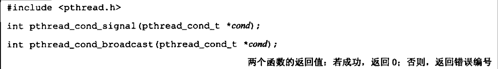
      - pthread_cond_signal 唤醒一个等待该条件的线程
      - pthread_cond_broadcast 唤醒等待该条件的所有线程
  - 自旋锁
    - 与互斥量相似，但是不通过休眠来使线程等待，而是一直处于忙等状态（自旋）
    - 适用于：锁被持有的时间短，而且线程不希望在重新调度上花费太多的成本
    - 初始化和反初始化 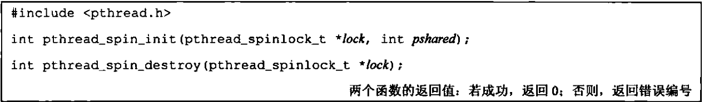
      - pshared 表示进程共享属性，表明自旋锁是如何获取的
        - PTHREAD_PROCESS_SHARED，则自旋锁能被可以访问锁底层内存的线程所获取，即便那些线程属于不同的进程
        - PTHREAD_PROCESS_PRIVATE，自旋锁只能被初始化该锁的进程内部的线程锁访问
    - 加锁和释放锁 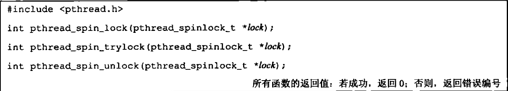
      - pthread_spin_trylock 不能自旋
      - 如果线程已经对自旋锁加锁了，但是仍然调用 pthread_spin_lock，会返回 EDEADLK 错误（或者其他错误），或者可能会永久自旋
      - 不要在持有自旋锁的情况下调用会休眠的函数
  - 屏障（barrier）
    - 屏障允许每个线程等待，直到所有的合作线程都到达某一点，然后从该点继续执行
    - 初始化和反初始化 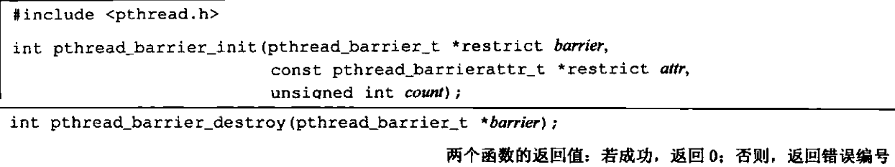
      - count 指定所有线程在继续运行之前，必须达到的线程数目
    - 使用 pthread_barrier_wait 函数来表明，线程已经完成工作，准备等待其他线程赶上来 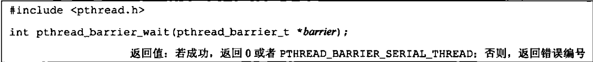
    - 一旦达到屏障计数值，而且线程处于非阻塞状态，屏障就可以被重用。但是除非在调用了pthread_barrier_destroy 函数之后，又调用了 pthread_barrier_init 函数对计数用另外的数进行初始化，否则屏障计数不会改变。
- 线程限制，sysconf 函数 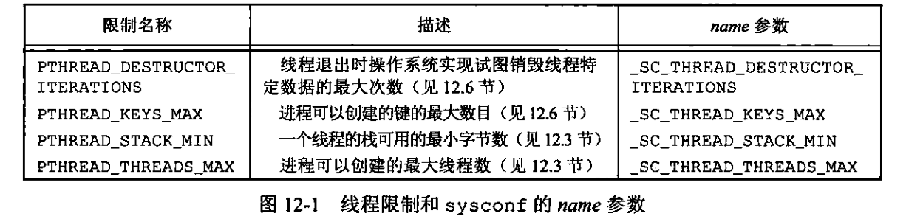
- 属性
  - pthread 接口通过设置与每个对象关联的不同属性来细调线程和对象之间的行为
  - 通常，管理这些属性的函数都遵循相同的模式
    - 每个对象与它自己类型的属性对象进行关联
      - 例如，线程与线程属性关联，互斥量以互斥量属性关联
    - 一个属性对象可以含有多个属性。属性对象对于应用程序来说是不透明的，需要提供相应的函数来管理属性对象
    - 有初始化函数，把属性对象设置为默认值
    - 有销毁属性对象的函数
    - 每个属性都有一个从属性对象中获取属性值的函数
    - 每个属性都有一个设置属性值的函数，属性值作为参数按值传递
  - 线程属性（pthread_attr_t）
    - 初始化函数和反初始化函数 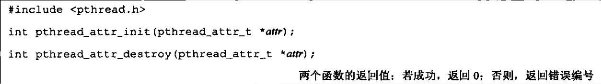
      - 反初始化函数会使用无效的值来初始化属性对象，因此，会导致该属性对象不可用
    - 属性 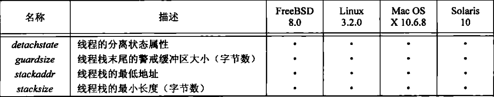
      - detachstate 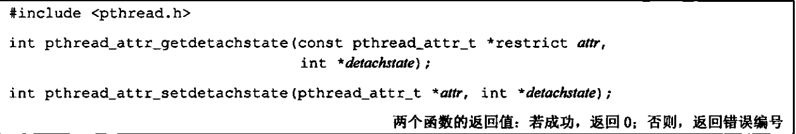
        - PTHREAD_CREATE_DETACHED
          - 以分离状态启动线程。通常在不想知道线程的返回结果时使用
        - PTHREAD_CREATE_JOINABLE
          - 正常启动线程
      - stack 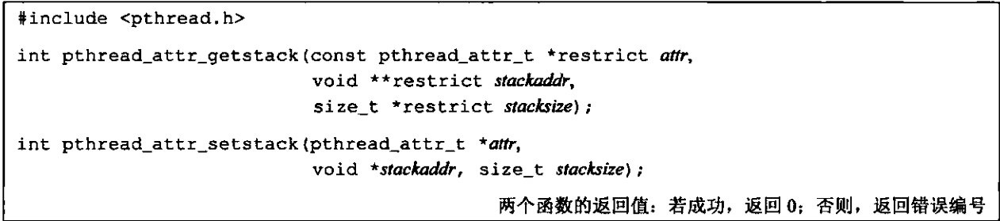
        - stackaddr 被定义为栈的最低内存地址（可能是栈的“最高处”）
      - stacksize（不能小于 PTHREAD_STACK_MIN） 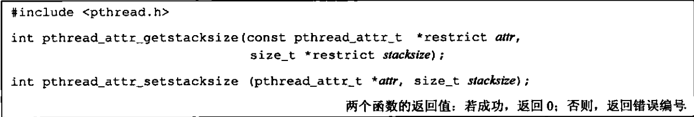
        - 不用自己处理栈的分配问题，但是改变默认栈的大小
      - guardsize 控制线程栈末尾之后用以避免栈溢出的扩展内存的大小，常用值是系统页的大小 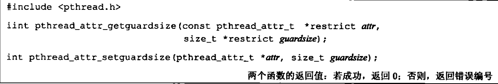
        - 如果修改了线程属性 stackattr，相当于设置了 guardsize = 0
      - 还有一些实时相关的属性来供实时应用程序使用
  - 互斥量属性（pthread_mutexattr_t）
    - 初始化和反初始化函数 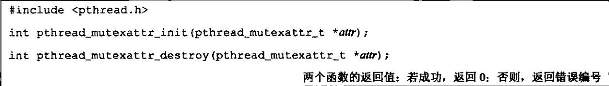
    - 属性
      - 进程共享属性 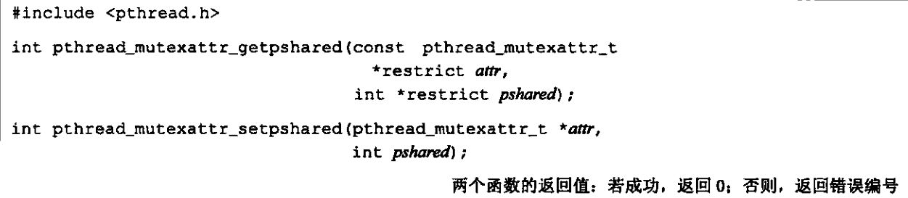
        - PTHRAD_PROCESS_PRIVATE
          - 默认值
        - PTHREAD_PROCESS_SHARED
          - 内核允许多个相互独立的多个进程把同一个内存数据块映射到他们各自独立的地址空间中，所以，多个进程也可能需要同步，此时，如果在该共享内存中分配了互斥量，就可以用于这些进程之间的同步
      - 健壮属性 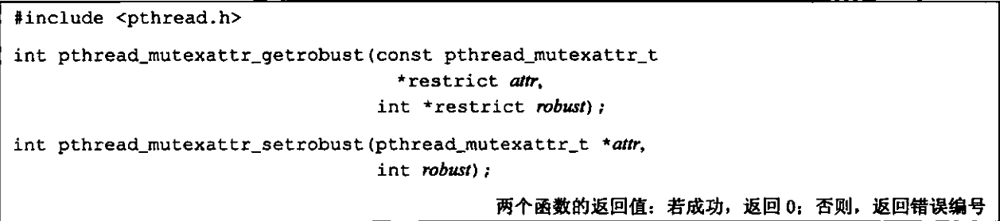
        - 用于在多个进程间共享的互斥量
        - 当持有互斥量的进程终止时，要解决互斥量状态恢复的问题
        - PTHREAD_MUTEX_STALLED
          - 持有互斥量的进程终止时不采取动作
        - PTHREAD_MUTEX_ROBUST
          - 当另一个进程的线程调用 pthread_mutex_lock 时返回 EOWNERDEAD，而不是 0
          - 为了使 pthread_mutex_lock 正常工作，可以使用 pthread_mutex_consistent 函数来指示该锁保护的数据与在互斥量解锁之后是一致的 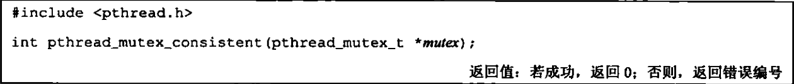
            - 同时，如果没有调用此函数，但是调用了 pthread_mutex_unlock 函数，那么由于该锁而阻塞的线程会收到 ENOTRECOVERABLE （不可恢复）错误码，同时该互斥量将不再可用
            - 综上，可以尝试恢复互斥量保护的数据之后，调用此函数，就可以使该互斥量正常工作
      - 类型属性 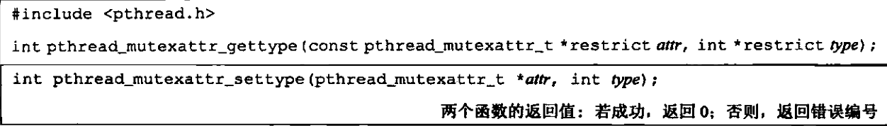
        - 控制互斥量的锁定特性
        - PTHREAD_MUTEX_NORMAL
          - 不做任何特殊的错误检查或死锁检测
        - PTHREAD_MUTEX_ERRORCHECK
          - 提供错误检查
        - PTHREAD_MUTEX_RECURSIVE
          - 此互斥量类型允许同一线程在互斥量解锁之前对该互斥量进行多次加锁
          - 此种互斥量维护锁的计数，在解锁次数和加锁次数不相同的情况下，不会释放
        - PTHREAD_MUTEX_DEFAULT
          - 操作系统在实现它的时候可以把这种类型自由地映射到其他互厅量类型中的一种
        - 上述类型的行为总结 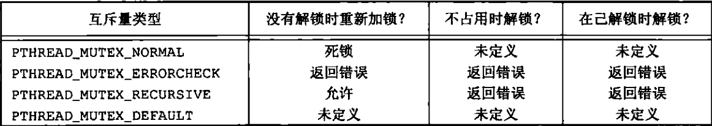
          - 不占用时解锁的含义是：一个线程对被另一个线程所加锁的互斥量进行解锁的情况
  - 读写锁属性（pthread_rwlockattr_t）
    - 初始化与反初始化 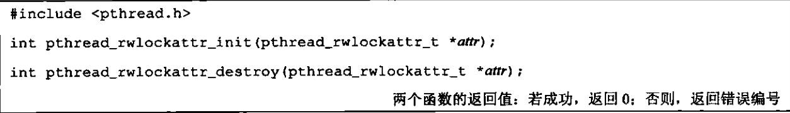
    - 属性
      - 进程共享属性 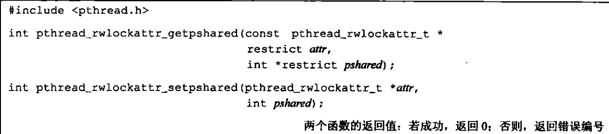
        - PTHRAD_PROCESS_PRIVATE
          - 默认值
        - PTHREAD_PROCESS_SHARED
          - 内核允许多个相互独立的多个进程把同一个内存数据块映射到他们各自独立的地址空间中，所以，多个进程也可能需要同步，此时，如果在该共享内存中分配了互斥量，就可以用于这些进程之间的同步
  - 条件变量属性
    - 初始化与反初始化 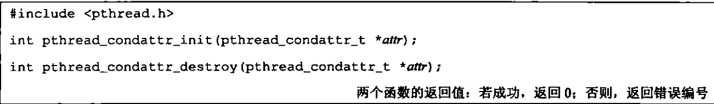
    - 属性
      - 进程共享属性 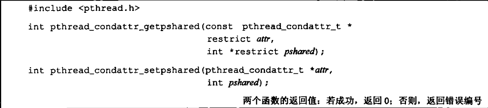
      - 时钟属性 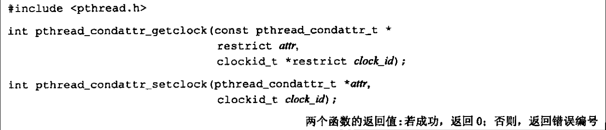
        - 控制 pthread_cond_timedwait 函数的超时参数（tspr）采用的是哪个时钟
        - 合法值是时钟 ID 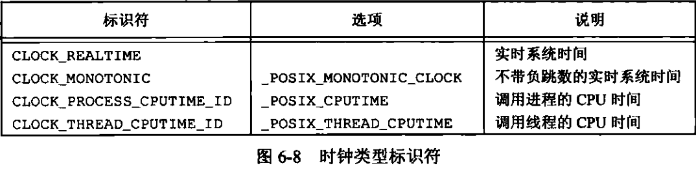
  - 屏障属性（pthread_barrierattr_t）
    - 初始化与反初始化 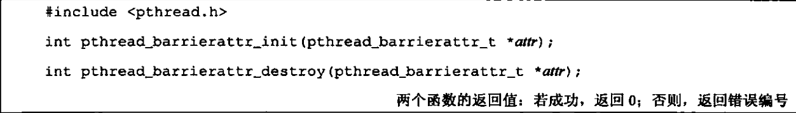
    - 进程共享属性 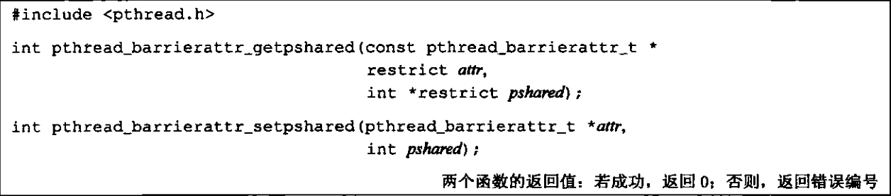
- 重入
  - 如果一个函数在相同的时间点可以被多个线程安全地调用，则称该函数是线程安全的
  - 支持线程安全函数的操作系统实现会在&lt;unistd.h&gt; 中定义符号 _POSIX_THREAD_SAFE_FUNCTIONS。应用程序也可以在sysconf 函数中传入_SC_THREAD_SAFE_FUNCTIONS 参数在运行时检查是否支持线程安全函数
  - POSIX.1 中不能保证线程安全的函数 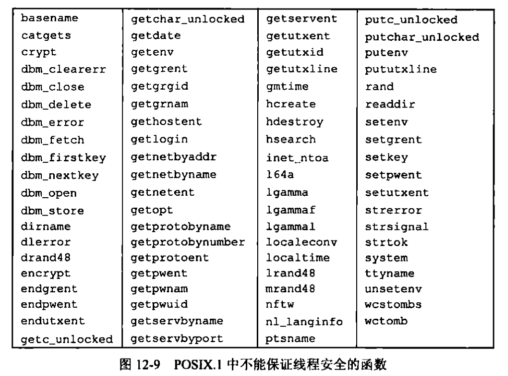
    - 在 Single Unix Specification 中定义的所有函数中，除了左侧图片上的函数不能保证线程安全，其他函数都保证是线程安全的
    - termid 和 tmpnam 函数在参数传入空指针时并不能保证是线程安全的
    - 如果参数 mbstate_t 传入的是空指针，也不能保证 wcrtomb 和 wcsrtombs 函数是线程安全的
  - 替代的线程安全函数 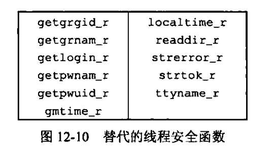
    - *_r 表示是可重入的
    - 很多函数并不是线程安全的，因为它们返回的数据存放在静态的内存缓冲区中。通过修改接口，要求调用者自己提供缓冲区可以使函数变为线程安全
  - POSIX.1 提供了以线程安全的方式管理 FILE 对象的方法
    - 函数 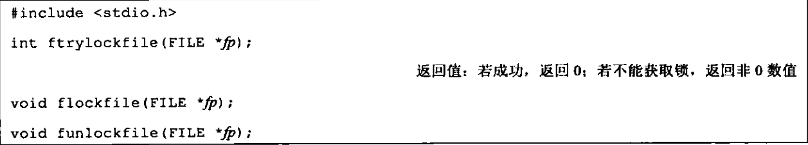
    - FILE 对象内部的锁是递归的（可重入的）
    - 如果在加锁的情况下，一次只写入一个字符，性能会有很严重的下降，故而提出了下列函数： 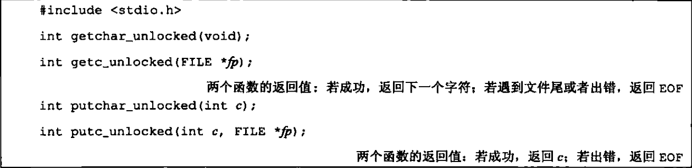
      - 一旦对FILE对象进行加锁，就可以在释放锁之前对这些函数进行多次调用。这样就可以多次的数据读写上分摊总的加解锁的开销
- 线程特定数据（thread-specific data）
  - 一个进程中的所有线程都可以访问这个进程的整个地址空间
  - 除了使用寄存器以外，一个线程没有办法阻止另一个线程访问它的数据。线程特定数据也不例外。虽然底层的实现部分并不能阻止这种访问能力，但管理线程特定数据的函数可以提高线程间的数据独立性，使得线程不太容易访问到其他线程的线程特定数据
  - 键
    - 在分配线程特定数据之前，需要创建与该数据关联的键，这个键用于获取对线程特定数据的访问 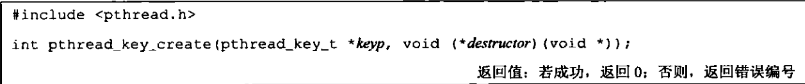
      - 创建的键存储在 keyp 指向的内存单元中，这个键可以被进程中的所有线程使用，但每个线程 把这个键与不同的线程特定数据地址进行关联
      - 创建新键时，每个线程的数据地址设为空值
      - destructor 被称为析构函数，当线程退出且该线程与该键关联的数据地址不为空时被调用。可以为 NULL
        - 调用顺序在线程清理函数之后
        - 线程的三种终止方式都会执行析构函数
        - 析构函数可能会调用另一个函数，在析构函数中也可能创建新的线程特定数据，并且把这个数据与当前的键关联起来。当所有的析构函数都调用完成之后，系统会检查是否还有非空的线程特定数据值与该键关联，如果有的话，再次调用析构函数，一直重复直到线程的所有键都为空线程特定数据值或者重复了 PTHREAD_DESTRUCTOR_ITERATIONS 定义的最大次数的尝试
      - 每个操作系统可以对进程可分配的键的数量进行限制（PTHREAD_KEYS_MAX）
    - 取消键与线程特定数据值之间的联系 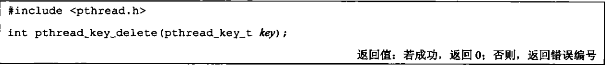
      - 不会激活与键关联的析构函数
  - 将键和线程特定数据联系起来 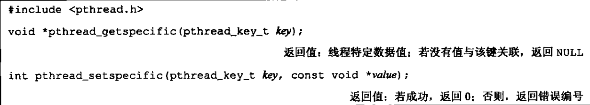
  - pthread_once
    - 只执行一次，可以解决数据竞争问题
    - pthread_once_t 
    - pthread_once 函数 
      - initflag 必须是一个非本地的变量（全局变量或者静态变量），而且必须初始化为 PTHREAD_ONCE_INIT
- 取消选项
  - 有 2 个线程属性并没有包含在 pthread_attr_t 中：可取消状态和可取消类型
  - 调用 pthread_cancel 的线程并不等待线程终止，直到线程到达某个取消点
    - 取消点事线程检查它是否被取消的一个位置，如果取消了，则按照请求行事
    - POSIX.1 保证线程调用上图中的任意函数时，取消点都会出现 
    - POSIX.1 定义的可选的取消点 
  - 可取消状态属性 
    - PTHREAD_CANCEL_ENABLE，默认值
      - 当在取消点收到 pthread_cancel 发出的请求时，此线程会被取消，并调用注册的线程清理函数
    - PTHREAD_CANCEL_DISABLE
      - pthread_cancel 并不会杀死此线程，但是会将请求挂起，当线程变为 PTHREAD_CACEL_ENABLE 时就会在下一个取消点上对所有挂起的取消请求进行处理
    - pthread_setcancelstate把当前的可取消状态设置为state，把原来的可取消状态存储在由 oldstate指向的内存单元，这两步是一个原子操作
    - pthread_testcancel 函数用于添加自己的取消点 
      - 调用pthread_testcancel时，如果有某个取消请求正处于挂起状态，而且取消并没有置为无效，那么线程就会被取消。但是，如果取消被置为无效，pthread_testcancel调用就没有任何效果
  - 可取消类型 
    - PTHRADCANCEL_DEFERRED
      - 在取消点处取消
    - PTHREAD_CANCEL_ASYNCHRONOUS
      - 可以在任意时间取消，而不是非得遇到检查点
- 线程与信号
  - 每个线程都有自己的信号屏蔽字，但是信号的处理是进程中所有线程共享的（意味着当某个线程修改了与某个信号相关的处理行为之后，则所有线程都共享这个处理行为的改变）
  - 进程中信号是被递送到单个线程的
  - sigprocmask 在多线程的进程中的行为没有被定义，必须使用 pthread_sigmask 
    - how 参数
      - SIG_BLOCK
        - 把信号集添加到线程信号屏蔽字中
      - SIG_SETMASK
        - 用信号集替换线程的信号屏蔽字
      - SIG_UNBLOCK
        - 从线程信号屏蔽字中移除信号集
    - 线程可以通过把set 参数设置为 NULL，并把oset参数设置为sigset_t结构的地址，来获取当前的信号屏蔽字。这种情况中的how参数会被忽略
  - sigwait 等待一个或多个信号的出现 
    - set 参数指定线程等待的信号集
    - 返回时，signop 指向的整数将包含发送信号的数量
    - 在返回之前，sigwait将从进程中移除那些处于挂起等待状态的信号。如果具体实现支持排队信号，并且信号的多个实例被挂起，那么sigwait将会移除该信号的一个实例，其他的实例还要继续排队
      - 为了避免错误的行为发生，线程在调用 sigwait 之前，必须阻塞那些它正在等待的信号，否则有可能信号直接被发送给线程
    - 使用 sigwait 的好处在于它可以简化信号处理，允许把异步产生的信号用同步的方式处理。
      - 为了防止信号中断线程，可以把信号加到每个线程的信号屏蔽字中。然后可以安排专用线程处理 信号。
      - 这些专用线程可以进行函数调用，不需要担心在信号处理程序中调用哪些函数是安全的，因为这些函数调用来自正常的线程上下文，而非会中断线程正常执行的传统信号处理程序
    - 如果多个线程在sigwait的调用中因等待同一个信号而阻塞，那么在信号递送的时候，就只有一个线程可以从 sigwait 中返回
    - 如果一个信号被捕获（例如进程通过使用 sigaction建立了一个信号处理程序），而且一个线程正在sigwait调用中等待同一信号，那么这时将由操作系统实现来决定以何种方式递送信号。操作系统实现可以让sigwait返回，也可以激活信号处理程序，但这两种情况不会同时发生
  - pthread_kill 用于将信号发送给线程 
    - 可以传一个 0 值的 signo 来检查线程是否存在
    - 如果信号的默认处理动作是终止该进程，那么把信号传递给某个线程仍然会杀死整个进程
    - 闹钟定时器是进程资源，并且所有的线程共享相同的闹钟。所以，进程中的多个线程不可能互不干扰（或互不合作）地使用闹钟定时器
  - 新建线程会继承当前线程的信号屏蔽字
- 线程与 fork
  - 如果父进程包含一个以上的线程，子进程在 fork 返回后，如果不是紧接着调用 exec，就需要清理锁状态（从父进程的地址空间中继承而来）
    - 在子进程中，只有一个线程。此线程是父进程中调用 fork 的线程的副本构成的
    - 如果父进程中的该线程持有锁，子进程同样持有这些锁，这导致了问题：子进程中的线程没有办法知道它占有了哪些锁、需要释放哪些锁
      - 如果 fork 之后立马调用 exec 则不会有任何问题
      - 为了解决这个问题，在 fork 返回和在子进程调用一个 exec 函数之间，子线程只能调用异步信号安全的函数
  - 要在 fork 时清除锁的状态，可以调用 pthread_atfork 函数建立 fork 处理程序 
    - prepare 处理程序有父进程在 fork 创建子进程前调用
      - 任务是对父进程中定义的所有锁进行加锁
    - parent 处理程序在 fork 创建子进程之后，返回之前在父进程上下文调用
      - 任务是对 prepare 获取的所有锁进行解锁
    - child 处理程序在 fork 返回之前在子进程的上下文中调用
      - 释放 prepare 处理程序获取的所有锁
    - 存在一些不足之处，只能在有限情况下使用：
      - 没有很好的办法对较复杂的同步对象（如条件变量或者屏障）进行状态的重新初始化
      - 某些错误检查的互斥量实现在child fork处理程序试图对被父进程加锁的互斥量进行解锁时会产生错误
      - 递归互斥量不能在 child fork 处理程序中清理，因为没有办法确定该互斥量被加锁的次数
      - 如果子进程只允许调用异步信号安全的函数，child fork 处理程序就不可能清理同步对象， 因为用于操作清理的所有函数都不是异步信号安全的。实际的问题是同步对象在某个线程调用 fork 时可能处于中间状态，除非同步对象处于一致状态，否则无法被清理
      - 如果应用程序在信号处理程序中调用了fork（这是合法的，因为 fork 本身是异步信号安全的)，pthread_atfork 注册的 fork 处理程序只能调用异步信号安全的函数，否则结果将是未定义的
```
