```markmap
---
markmap:
  initialExpandLevel: 2
  spacingVertical: 30
  spacingHorizontal: 180
---

# 虚拟内存（VM）
- 物理和虚拟寻址
  - 物理地址：计算机系统的主存被组织成一个由 M 个连续的字节大小的单元组成的数组 。每字节 都有 一 个唯一的物理地址(Physical Address PA) 第一个字节的地址为 0,接下来的字节地址为1,再下一个为 2 依此类推。
  - 物理寻址
    - 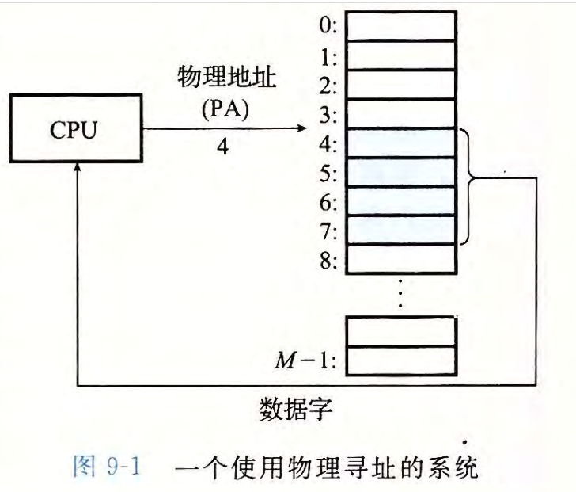
  - 虚拟寻址
    - 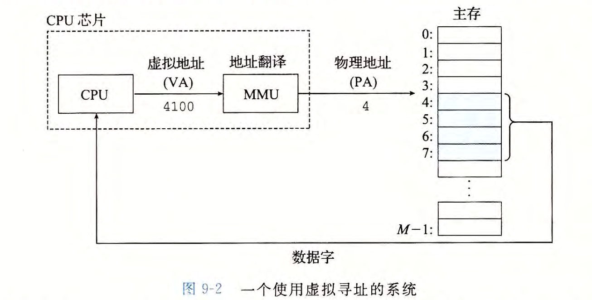
    - 将一个虚拟地址转换为物理地址的任务叫做地址翻译 (addresstranslation)
    - 地址翻译需要 CPU 硬件和操作系统之间的紧密合作 。CPU 芯片上叫做内存管理单元 (Memory Management Unit，MMU) 的专用硬件，利用存放在主存中的查询表来动态翻译虚拟地址，该表的内容由操作系统管理。
- 地址空间
  - 地址空间 (address space) 是 一 个非负整数地址的有序集合：{ 0, 1, 2, ... }
  - 如果地址空间中的整数是连续的，那么我们说它是 一 个线性地址空间(linear address space) 。
  - 在 一 个带虚拟内存的系统中，CPU 从 一 个有 N= 2^n 个地址的地址空间中生成虚拟地址，这个地址空间称为虚拟地址空间 (virtual address space) :{0, 1, 2, …, N —1}
  - 一个地址空间的大小是由表示最大地址所需要的位数来描述的。例如，一个包含 N=2^n 个地址的虚拟地址空间就叫做一个 n 位地址空间 。 现代系统通常支持 32 位或者 64 位虚拟地址空间。
- 虚拟内存
  - VM 系统通过将虚拟内存分割为称为虚拟页 (Virtual Page, VP) 的大小固定的块来处理与块存储设备（例如磁盘）传输数据的问题 。每个虚拟页的大小为 P= 2^p 字节 。
  - 类似地，物理内存被分割为物理页 (Physical Page, PP) , 大小也为 P 字节（物理页也被称为页帧 (page frame )) 。
  - 在任意时刻，虚拟页面的集合都分成 3 个不相交的子集
    - 未分配的：VM 系统还未分配（或者创建）的页。 未分配的块没有任何数据和它们相关联，因此也就不占用任何磁盘空间。
    - 缓存的：当前已缓存在物理内存中的已分配页 。
    - 未缓存的：未缓存在物理内存中的已分配页 。
    - 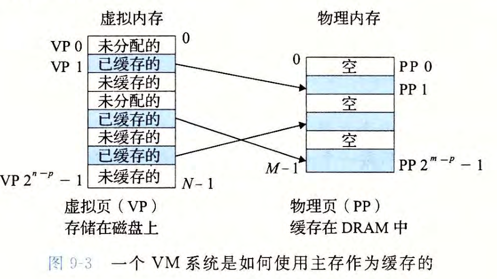
  - DRAM 缓存的组织结构
    - SRAM 缓存表示位于 CPU 和主存之间的 L1、L2和 L3 高速缓存 DRAM 缓存表示虚拟内存系统的缓存，它在主存中缓存虚拟页
  - 页表
    - 页表将虚拟页映射到物理页。每次地址翻译硬件将一个虚拟地址转换为物理地址时，都会读取页表 。操作系统负责维护页表的内容，以及在磁盘与 DRAM 之间来回传送页。
    - 页表就是一个页表条目 (Page Table Entry, PTE) 的数组。虚拟地址空间中的每个页在页表中一个固定偏移处都有一个 PTE 。
      - 我们将假设每个 PTE 是由一个有效位 (valid bit) 和一个 n 位地址字段组成的。
      - 有效位表明了该虚拟页当前是否被缓存在 DRAM 中。如果设置了有效位，那么地址字段就表示 DRAM 中相应的物理页的起始位置，这个物理页中缓存了该虚拟页。如果没有设置有效位，那么一个空地址表示这个虚拟页还未被分配。否则，这个地址就指向该虚拟页在磁盘上的起始位置。
      - 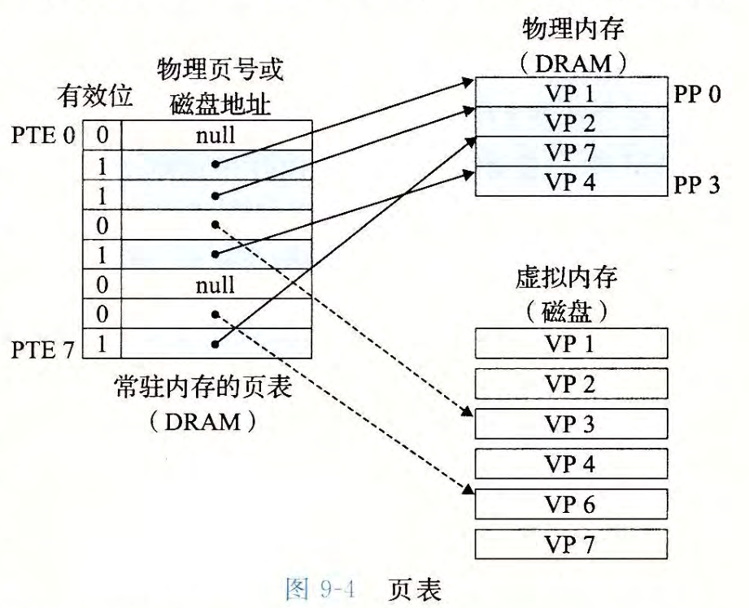
  - linux 虚拟内存系统
    - 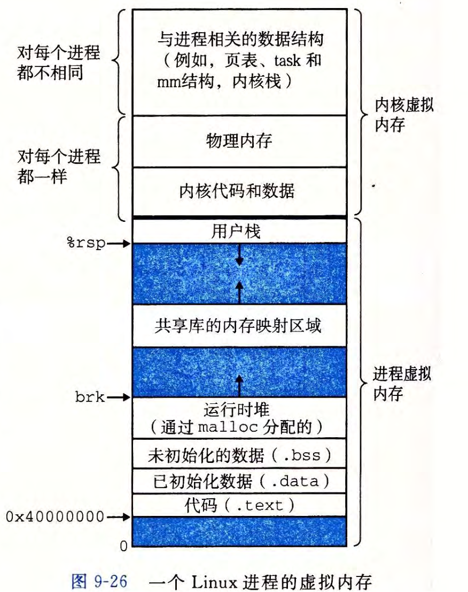
      - 内核虚拟内存包含内核中的代码和数据结构。 内核虚拟内存的某些区域被映射到所有进程共享的物理页面。例如，每个进程共享内核的代码和全局数据结构。 有趣的是，Linux 也将一组连续的虚拟页面（大小等于系统中 DRAM 的总量 ）映射到相应的一组连续的物理页面 。这就为内核提供了一种便利的方法来访问物理内存中任何特定的位置，例如，当它需要访问页表，或在一些设备上执行内存映射的 I/0 操作，而这些设备被映射到特定的物理内存位置时。
- 地址翻译
  - 地址翻译术语缩写对照
    - 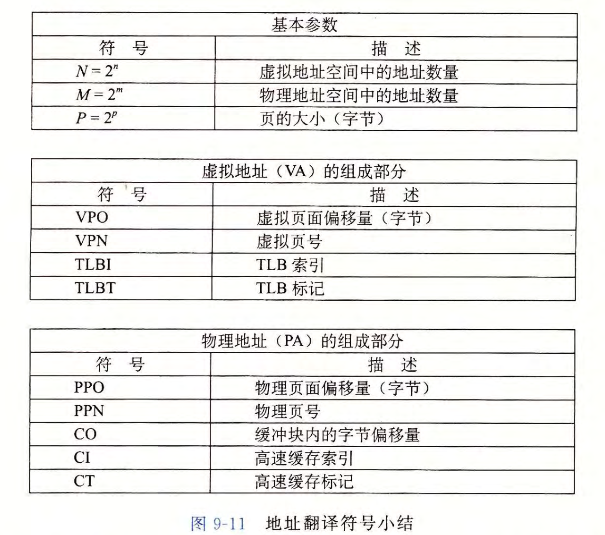
  - TLB（翻译后备缓冲器，Translation Lookasize Buffer）
    - 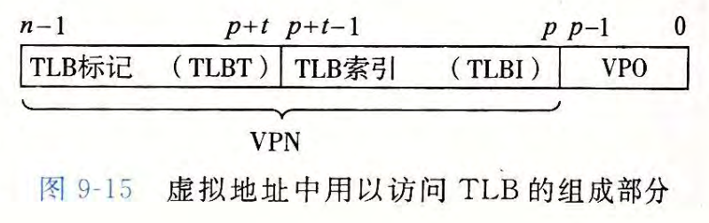
    - TLB 是一个小的、虚拟寻址的缓存，其中每一行都保存着一个由单个 PTE 组成的块。
    - 用于组选择和行匹配的索引和标记字段是从虚拟地址中的虚拟页号中提取出来的
      - 如果 TLB 有 T=2^t个组，那么 TLB 索引 (TLBI） 是由 VPN 的 t 个最低位组成的，而 TLB 标记 (TLBT) 是由 VPN 中剩余的位组成的。
    - TLB 命中的过程
      - 1\. CPU 产生一个虚拟地址
      - 2\. & 3. MMU 从 TLB 中取出相应的 PTE
      - 4\. MMU 将这个虚拟地址翻译成一个物理地址，并将它发送到高速缓存/主存
      - 5\. 高速缓存/主存将所请求的数据字返回给 CPU
    - TLB 不命中
      - MMU 必须从 L1 缓存中取出相应的 PTE
    - 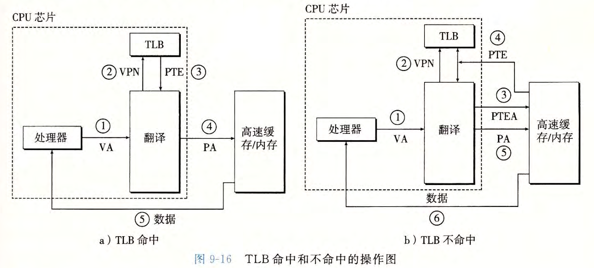
- linux VM
  - 
  - Linux 将一组连续的虚拟页面（大小等于系统中 DRAM 的总量）映射到相应的一组连续的物理页面 。这就为内核提供了一种便利的方法来访问物理内存中任何特定的位置，
  - 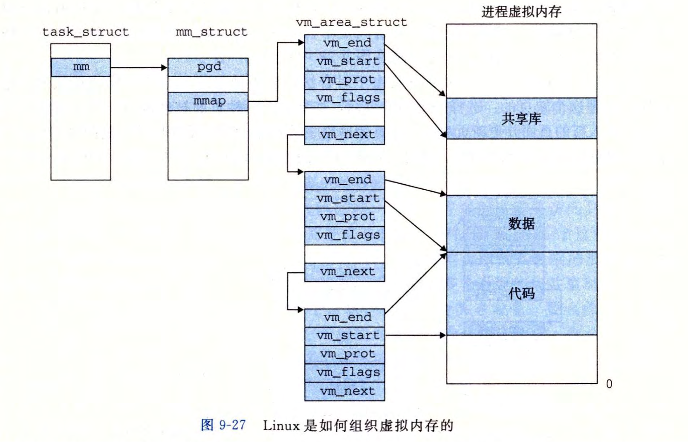
  - 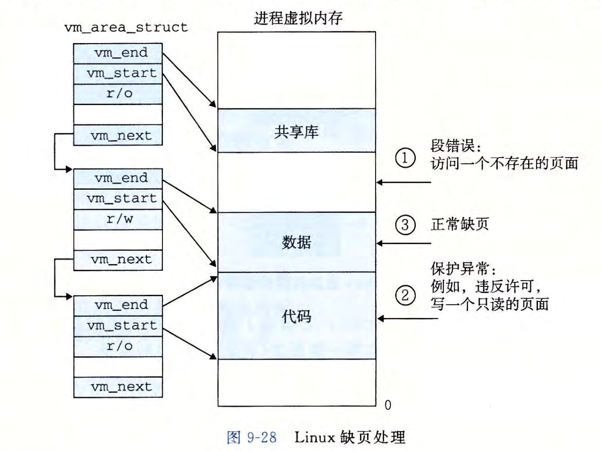
- 内存映射
  - Linux 通过将一个 VM 区域与一个磁盘上的对象关联起来，以初始化这个虚拟内存区域的内容，这个过程称为内存映射（memory mapping）
  - VM 区域可以映射到两种类型的对象中的一种
    - Linux 文件系统中的普通文件
      - 如果被映射的对象大小小于映射区域的大小，那么，用零来填充这个区域的余下部分
    - 匿名文件
      - 匿名文件由内核创建，包含的全是二进制零。CPU 第一次引用这样一个区域内的虚拟页面时，内核就在物理内存中找到一个合适的牺牲页面，如果该页面被修改过，就将这个页面换出来，用二进制零覆盖牺牲页面并更新页表，将这个页面标记为是驻留在内存中的。注意在磁盘和内存之间并没有实际的数据传送。因为这个原因，映射到匿名文件的区域中的页面有时也叫做请求二 进制零的页 (demand-zero page) 。
    - 无论在哪种情况中，一旦一个虚拟页面被初始化了，它就在一个由内核维护的专门的交换文件 (swap file) 之间换来换去 。 交换文件也叫做交换空间 (swap space) 或者交换区域(swap area) 。需要意识到的很重要的一点是，在任何时刻，交换空间都限制着当前运行着的进程能够分配的虚拟页面的总数。
  - 一个对象可以被映射到虚拟内存的一个区域，要么作为共享对象，要么作为私有对象
    - 共享对象
      - 如果一个进程将一个共享对象映射到它的虚拟地址空间的一个区域内，那么这个进程对这个区域的任何写操作，对于那些也把这个共享对象映射到它们虚拟内存的其他进程而言，也是可见的。而且，这些变化也会反映在磁盘上的原始对象中。
      - 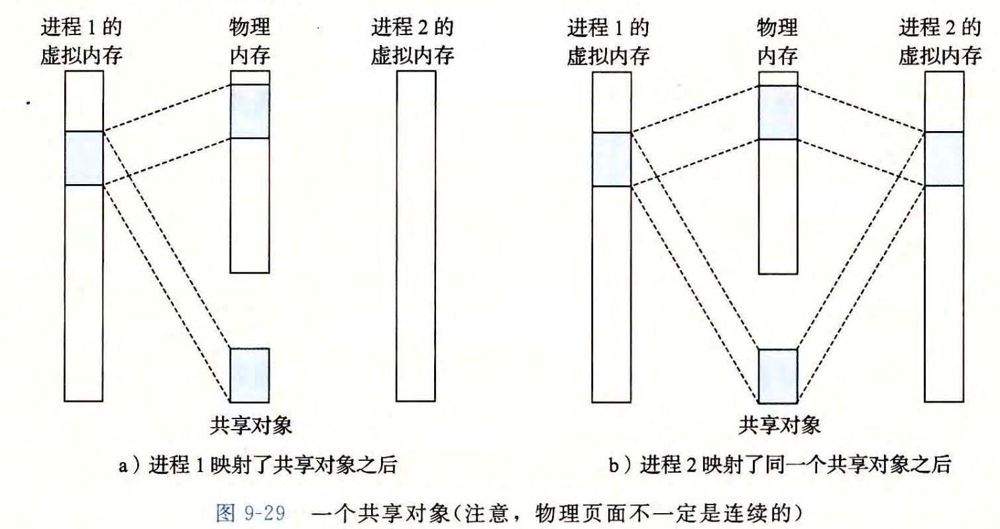
        - 因为每个对象都有一个唯一的文件名，内核可以迅速地判定进程 1 已经映射了这个对象，而且可以使进程 2 中的页表条目指向相应的物理页面。关键点在于即使对象被映射到多个共享区域，物理内存中也只需要存放共享对象的一个副本
    - 私有对象
      - 对于一个映射到私有对象的区域做的改变，对于其他进程来说是不可见的，并且进程对这个区域所做的任何写操作都不会反映在磁盘上的对象中。
      - 私有对象使用一种叫做写时复制 (copy-on-write) 的巧妙技术被映射到虚拟内存中。
        - 在物理内存中只保存有私有对象的一份副本。即两个进程将一个私有对象映射到它们虚拟内存的不同区域，但是共享这个对象同一个物理副本。
        - 对于每个映射私有对象的进程，相应私有区域的页表条目都被标记为只读，并且区域结构被标记为私有的写时复制。只要没有进程试图写它自己的私有区域，它们就可以继续共享物理内存中对象的一个单独副本。然而，只要有一个进程试图写私有区域内的某个页面，那么这个写操作就会触发一个保护故障。当故障处理程序注意到保护异常是由于进程试图写私有的写时复制区域中的一个页面而引起的，它就会在物理内存中创建这个页面的一个新副本，更新页表条目指向这个新的副本，然后恢复这个页面的可写权限。当故障处理程序返回时，CPU 重新执行这个写操作，现在在新创建的页面上这个写操作就可以正常执行了 。
      - 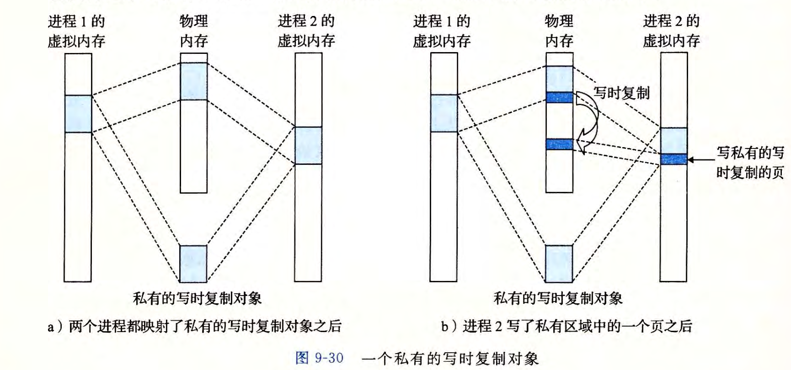
    - 一个映射到共享对象的虚拟内存区域叫做共享区域。类似地，也有私有区域。
  - execve 函数 例如 execve("a.out", NULL, NULL)
    - 1\. 删除已存在的用户区域。删除当前进程虚拟地址的用户部分中的已存在的区域结构。
    - 2.映射私有区域。为新程序的代码、数据、bss 和栈区域创建新的区域结构。所有这些新的区域都是私有的、写时复制的。代码和数据区域被映射为 a.out 文件中的 .text 和 .data 区。bss 区域是请求二进制零的，映射到匿名文件，其大小包含在 a.out 中 。 栈和堆区域也是请求二进制零的，初始长度为零。
    - 3.映射共享区域。如果 a.out 程序与共享对象（或目标）链接，比如标准 C 库 libc.so, 那么这些对象都是动态链接到这个程序的，然后再映射到用户虚拟地址空间中的共享区域内。
    - 4.设置程序计数器 (PC) 。execve 做的最后一件事情就是设置当前进程上下文中的程序计数器，使之指向代码区域的入口点 。
    - 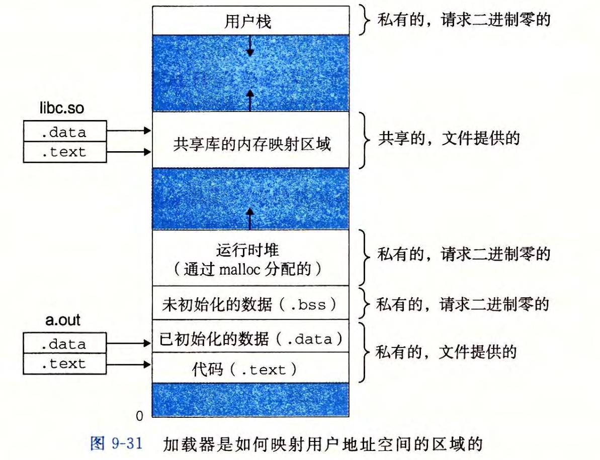
  - 使用 mmap 函数的用户级内存映射
    - 函数签名 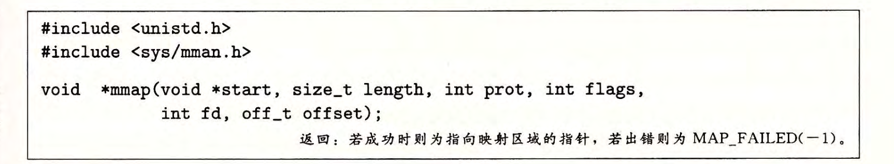
    - mmap 函数要求内核创建一个新的虚拟内存区域，最好是从地址 start 开始的一个区域，并将文件描述符 fd 指定的对象的一个连续的(chunk) 映射到这个新的区域。连续的对象片大小为 length 字节，从距文件开始处偏移量为 offset 字节的地方开始。start 地址仅仅是一个暗示，通常被定义为 NULL 。
    - 参数 prot 包含描述新映射的虚拟内存区域的访问权限位（即在相应区域结构中的 vm_prot 位）。
      - PROT_EXEC: 这个区域内的页面由可以被 CPU 执行的指令组成。
      - PROT_READ: 这个区域内的页面可读。
      - PROT _WRITE: 这个区域内的页面可写。
      - PROT _NONE: 这个区域内的页面不能被访问。
    - 参数 flags 由描述被映射对象类型的位组成。
      - MAP_ANON :被映射的对象就是一个匿名对象，而相应的虚拟页面是请求二进制零的。
      - MAP_PRIVATE 表示被映射的对象是一个私有的、写时复制的对象
      - MAP_SHARED 表示是一个共享对象。
  - 使用 munmap 函数删除虚拟内存区域
    - 函数签名 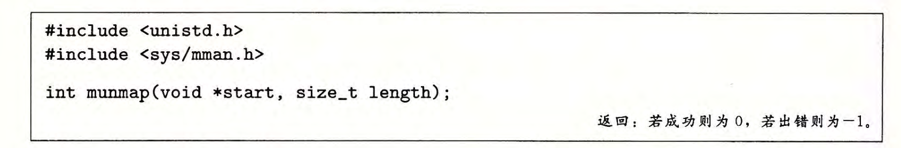
    - munmap 函数删除从虚拟地址 start 开始的，由接下来 length 字节组成的区域。接下来对已删除区域的引用会导致段错误。
- 内存分配器
  - 显示分配器（explicit allocator）
    - 要求应用显示地释放任何已分配的块
  - 隐式分配器 （implicit allocator）
    - 要求分配器检测已分配块何时不在被程序使用，所以，也叫垃圾收集器（garbage collector）
  - 分配器的要求和目标
    - 要求
      - 处理任意请求序列 。 一个应用可以有任意的分配请求和释放请求序列，只要满足约束条件：每个释放请求必须对应于一个当前已分配块，这个块是由一个以前的分配请求获得的。因此，分配器不可以假设分配和释放请求的顺序。例如，分配器不能假设所有的分配请求都有相匹配的释放请求，或者有相匹配的分配和空闲请求是嵌套的
      - 立即响应请求 。 分配器必须立即响应分配请求 因此，不允许分配器为了提高性能重新排列或者缓冲请求 。
      - 只使用堆 。 为了使分配器是可扩展的，分配器使用的任何非标量数据结构都必须保存在堆里 。
      - 对齐块（对齐要求） 。 分配器必须对齐块，使得它们可以保存任何类型的数据对象。
      - 不修改已分配的块。分配器只能操作或者改变空闲块 。特别是，一旦块被分配了，就不允许修改或者移动它 了。因此，诸如压缩已分配块这样的技术是不允许使用的。
    - 目标
      - 吞吐率最大化
        - 吞吐率定义为每个单位时间完成的请求数
        - 一个合理的性能：指一个分配请求的最糟运行时间与空闲块的数扯成线性关系，而一个释放请求的运行时间是个常数。
      - 内存使用率最大化
        - 一个系统中被所有进程分配的虚拟内存的全部数量是受磁盘上交换空间的数最限制的。
      - 以上两个目标互相冲突，互相牵制，所以，要在两者之间折中
    - 内存碎片
      - 碎片现象：虽然有未使用的内存但不能用来满足分配请求
      - 内部碎片
        - 在一个已分配块比有效载荷大时发生。例如，一个分配器的实现可能对已分配块强加一个最小的大小值，而这个大小要比某个请求的有效载荷大。或者，分配器可能增加块大小以满足对齐约束条件。
        - 量化：已分配块大小和它们的有效载荷大小之差的和。
      - 外部碎片
        - 外部碎片是当空闲内存合计起来足够满足一个分配请求，但是没有一个单独的空闲块足够大可以来处理这个请求时发生的。
    - 分配器设计时必须考虑的问题
      - 空闲块组织：我们如何记录空闲块？
      - 放置：我们如何选择一个合适的空闲块来放置一个新分配的块？
      - 分割：在将一个新分配的块放置到某个空闲块之后，我们如何处理这个空闲块中的 剩余部分？
      - 合并：我们如何处理一个刚刚被释放的块？
  - 显式分配器的设计
    - 任何实际的分配器都需要一些数据结构，允许它来区别块边界，以及区别已分配块和空闲块。大多数分配器将这些信息嵌入块本身。
    - 方法
      - 隐式空闲链表
        - 隐式空闲链表：空闲块是通过头部中的大小字段隐含地连接着的。分配器可以通过遍历堆中所有的块，从而间接地遍历整个空闲块的集合。注意，我们需要某种特殊标记的结束块（在下图中），在这个示例中，就是一个设置了已分配位而大小为零的终止头部 (ter­minating header) 。
        - 块的格式 其中，块的大小包括头部和所有的填充 填充既可以用来缓解外部碎片的问题，也可以用来用来解决对齐问题 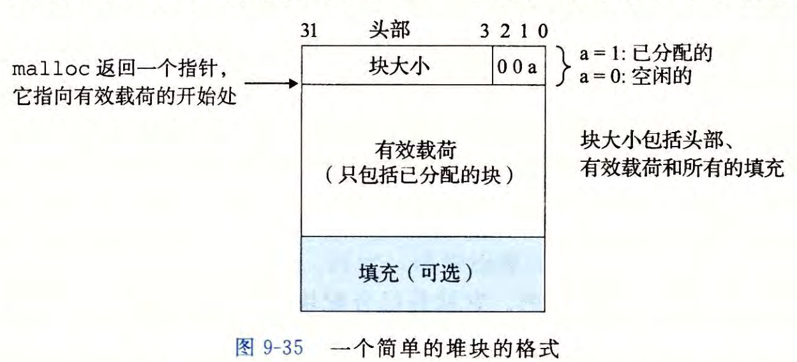
        - 隐式空闲链表的优点是简单。显著的缺点是任何操作的开销，例如放置分配的块，要求对空闲链表进行搜索，该搜索所需时间与堆中已分配块和空闲块的总数呈线性关系。
        - 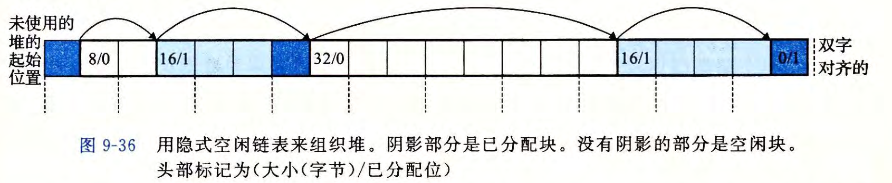
      - 放置已分配块
        - 当一个应用请求一个 K 字节的块时，分配器搜索空闲链表，查找一个足够大可以放置所请求块的空闲块。分配器执行这种搜索的方式是由放置策略 (placement policy) 确定的。 一些常见的策略是首次适配 (first fit) 、下一次适配 (next fit) 和最佳适配 (best fit) 。
          - 首次适配：首次适配从头开始搜索空闲链表，选择第一个合适的空闲块。
            - 优点是它趋向于将大的空闲块保留在链表的后面。
            - 缺点是它趋向于在靠近链表起始处留下小空闲块的＂碎片“，这就增加了对较大块的搜索时间。
          - 下一次适配和首次适配很相似，只不过不是从链表的起始处开始每次搜索，而是从上一次查询结束的地方开始。
            - 下一次适配比首次适配运行起来明显要快一些，尤其是当链表的前面布满了许多小的碎片时。然而，一些研究表明，下一次适配的内存利用率要比首次适配低得多。
          - 最佳适配检查每个空闲块，选择适合所需请求大小的最小空闲块。
            - 研究表明最佳适配比首次适配和下一次适配的内存利用率都要高一些。然而，在简单空闲链表组织结构中，比如隐式空闲链表中，使用最佳适配的缺点是它要求对堆进行彻底的搜索。
      - 合并空闲块
        - 当分配器释放一个已分配块时，可能有其他空闲块与这个新释放的空闲块相邻。这些邻接的空闲块可能引起一种现象，叫做假碎片 (fault fragmentation)，就是有许多可用的空闲块被切割成为小的、无法使用的空闲块。
        - 为了解决假碎片问题，任何实际的分配器都必须合并相邻的空闲块，这个过程称为合并 (coalescing) 。
          - 何时进行合并？
            - 立即合并 (immediate coalescing), 也就是在每次一个块被释放时，就合并所有的相邻 块。
              - 对千某些请求模式，这种方式会产生一种形式的抖动，块会反复地合并，然后马上分割。
            - 推迟合并 (deferred coalescing), 也就是等到某个稍晚的时候再合并空闲块。例如，分配器可以推迟合并，直到某个分配请求失败，然后扫描整个堆，合并所有的空闲块。
          - 如何实现合并？
            - 如果使用隐式空闲链表，我们无法合并当前释放块的前面的块，如何解决？答案是使用边界标记（boundary tag）技术
              - 在每个块的结尾处添加 一 个脚部 (footer,边界标记），其中脚部就是头部的一个副本。如果每个块包括这样一个脚部，那么分配器就可以通过检查它的脚部，判断前面一个块的起始位置和状态，这个脚部总是在距当前块开始位置一个字的距离 。 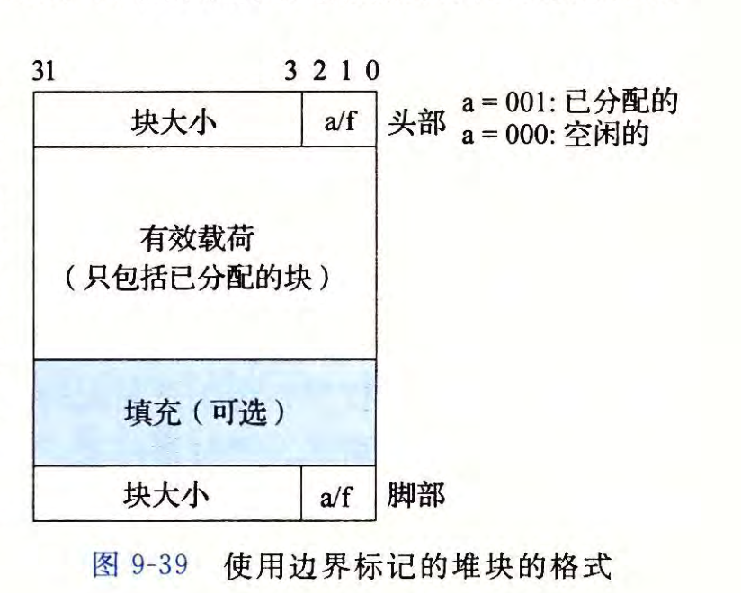
              - 潜在缺陷：在应用程序操作许多小块时，会产生了显著的内存开销。
                - 解决方法（优化方法）：当我们试图在内存中合并当前块以及前面的块和后面的块时，只有在前 面的块是空闲时，才会需要用到它的脚部。如果我们把前面块的已分配／空闲位存放在当前块中多出来的低位中，那么已分配的块就不需要脚部了，这样我们就可以将这个多出来的空间用作有效载荷了。不过请注意，空闲块仍然需要脚部 （此时的脚部主要用来标识空闲块的大小）。
      - 显式空闲链表
        - 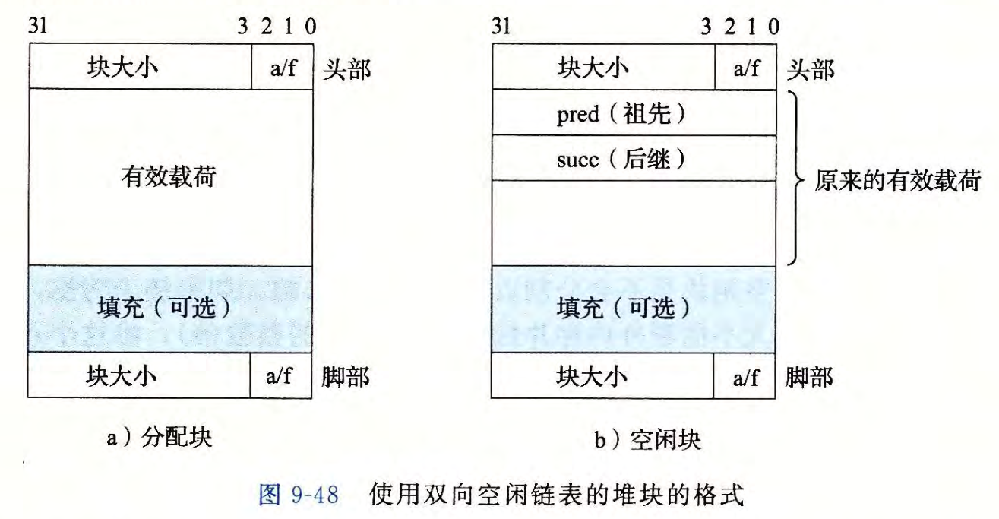
      - 分离存储（segregated storage）
        - 维护多个空闲链表，其中每个链表中的块有大致相等的大小。一般的思路是将所有可能的块大小分成一些等价类，也叫做大小类 (size class) 。有很多种方式来定义大小类。例如，我们可以根据 2 的幂来划分块大小：{1},{2},{3,4 }, {5 ~ 8},···, {1025 ~ 2048 },{2049 ~ 4096},{4097 ~无穷}
        - 分配器维护着一个空闲链表数组，每个大小类一个空闲链表，按照大小的升序排列。当分配器需要一个大小为 n 的块时，它就搜索相应的空闲链表。如果不能找到合适的块与之匹配，它就搜索下一个链表，以此类推。
      - 分离适配
        - 分配器维护着一个空闲链表的数组 。 每个空闲链表是和一个大小类相关联的，并且被组织成某种类型的显式或隐式链表。每个链表包含潜在的大小不同的块，这些块的大小是大小类的成员。
        - 为了分配一个块，必须确定请求的大小类，并且对适当的空闲链表做首次适配，查找一个合适的块 。如果找到了一个，那么就（可选地）分割它，并将剩余的部分插入到适当的空闲链表中。如果找不到合适的块，那么就搜索下一个更大的大小类的空闲链表。如此重复，直到找到一个合适的块。如果空闲链表中没有合适的块，那么就向操作系统请求额外的堆内存，从这个新的堆内存中分配出一个块，将剩余部分放置在适当的大小类中。要释放一个块，我们执行合并，并将结果放置到相应的空闲链表中。
      - 伙伴系统（buddy system）
        - 伙伴系统 (buddy system) 是分离适配的一种特例，其中每个大小类都是 2 的幂。基本的思路是假设一个堆的大小为 2^m 个字，我们为每个块大小 2^k 维护一个分离空闲链表，其中 0 &lt;= k &lt;= m 。请求块大小向上舍入到最接近的 2 的幕。最开始时，只有 一 个大小为 2^m 个字的空闲块。
        - 为了分配一个大小为 2^k 的块，我们找到第一个可用的、大小为 2^j 的块，其中 k &lt;= j &lt;= m 。如果 j=k, 那么我们就完成了。否则，我们递归地二分割这个块，直到 j=k 。当我们进行这样的分割时，每个剩下的半块（也叫做伙伴）被放置在相应的空闲链表中 。 要释放一个大小为 2^k 块，我们继续合并空闲的伙伴。当遇到一个已分配的伙伴时，我们就停止合并。
        - 关于伙伴系统的一个关键事实是，给定地址和块的大小，很容易计算出它的伙伴的地址 。 例如，一个块，大小为 32 字节，地址为： xxx...x00000 它的伙伴的地址为： xxx...x10000 换句话说，一个块的地址和它的伙伴的地址只有一位不相同。
        - 伙伴系统分配器的主要优点是它的快速搜索和快速合并。主要缺点是要求块大小为 2 的幂可能导致显著的内部碎片。因此，伙伴系统分配器不适合通用目的的工作负载。然而，对于某些特定应用的工作负载，其中块大小预先知道是 2 的幕，伙伴系统分配器就很有吸引力了。
  - 垃圾收集器
    - 垃圾收集器将内存视为一张有向可达图 (reachability graph)
    - 节点被分成一组根节点 (root node) 和一组堆节点 (heap node) 。每个堆节点对应于堆中的一个已分配块。有向边 p -&gt; q 意味着块 p 中的某个位置指向块 q 中的某个位置。根节点对应千这样一种不在堆中的位置，它们中包含指向堆中的指针。这些位置可以是寄存器、栈里的变量，或者是虚拟内存中读写数据区域内的全局变量。 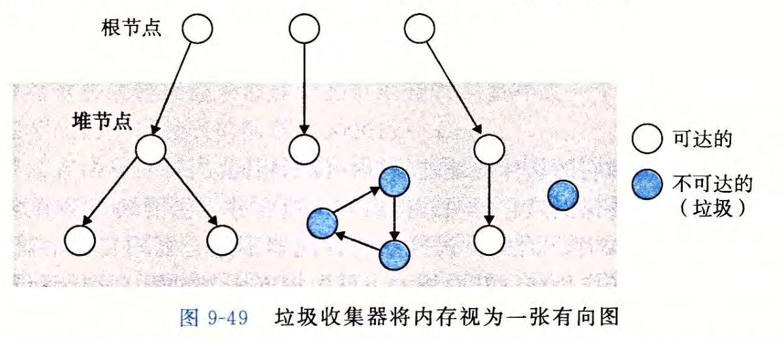
    - Mark & Sweep 垃圾收集器
      - 由标记 (mark) 阶段和清除 (sweep) 阶段组成，标记阶段标记出根节点的所有可达的和已分配的后继，而后面的清除阶段释放每个未被标记的已分配块。块头部中空闲的低位中的一位通常用来表示这个块是否被标记了 。
```
