```markmap
---
markmap:
  initialExpandLevel: 2
  spacingVertical: 30
  spacingHorizontal: 180
---

# 计算机组成原理
- 概述
  - 计算机系统层次结构
    - 硬件
      - 输入设备
      - 输出设备
        - 显示器，打印机
      - 存储器
        - 主存储器（内存）
          - 按存储的单元的地址进行存取，这种存取方式被称为按地址存取方式
          - 基本组成结构 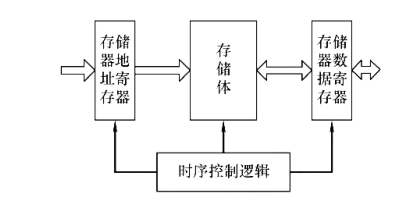
            - 存储器地址寄存器（MAR）
              - 存储要访问的内存单元地址（读或写）
              - MAR 的位数反映了最多的可寻址的存储单元的个数
                - 例如 MAR 有 10 位，则最多有 2^10 个存储单元
            - 存储器数据寄存器（MDR）
              - 其位数一般等于存储字长
                - 临时存放从内存独处的数据或者要写入内存的数据
            - 时序控制逻辑
              - 协调 CPU 内各个模块在正确的时刻执行正确的操作。例如，不能还没有写入 MAR 的时候，就对内存进行读写操作
          - 存储元件：存储 0 或 1
          - 存储单元：存储若干个存储元件。
            - 一个存储单元所存储的二进制代码被称为存储字
            - 存储字的位数称为存储字长
        - 辅助存储器（外存）
      - 运算器
        - 可以进行加减乘除、与、或、非、异或等
        - 运算器的核心是算术逻辑单元 ALU
          - 累加器 ACC
          - 乘商寄存器 MQ
          - 操作数寄存器 X
          - 变址寄存器 IX (Index Register)
          - 基址寄存器 BR （Base Register）
          - 程序状态寄存器 PSW（标志寄存器）
            - 存放 ALU 元素得到的一些标志信息或处理机的状态信息
            - 如是否溢出、有无进位等
      - 控制器 （CU）
        - 控制各部件协调工作
        - PC 寄存器（Program Counter）
          - 存放下一条要执行的指令的地址
          - 指令执行完成之后，会自动加上该指令的长度，以得到下一条要执行的指令的地址
        - IR 寄存器（Instruction Register）
          - 用来存放当前正在执行的指令
          - 指令来源于 MDR
          - 指令中的操作码 OP(IR) 送至 CU
            - CU （控制单元）根据 Opcode 生成微操作信号
              - ALU 执行何种运算
              - 哪个寄存器读写
              - 是否访问内存
              - 是否跳转或中断
          - 指令中的地址码 Ad(IR) 参与地址计算之后送至 MAR，访问内存数据
      - 中央处理器 CPU
        - 包含 ALU、控制器 CU、通用寄存器 GPRs、标志寄存器 PSW、指令寄存器 IR、程序计数器 PC、MAR、MDR
        - CPU 与主存共同构成主机
          - CPU 与主存之间通过一组总线相连
          - 总线中有地址、控制、数据 3 组信号线
            - 地址线与 MAR 相连（逻辑上）
            - 控制线中有读/写信号线，控制是读内存还是写内存。但是不只有读写信号线
            - 数据线与 MDR 相连（逻辑上）
    - 软件
  - ISA：软硬件之间的契约
    - 定义了计算机可执行的所有指令的集合
    - 是软件的可见部分
  - 从源程序到可执行文件
    - C 语言的 4 个处理阶段 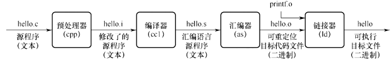
      - 1\. 预处理阶段
      - 2\. 编译阶段
      - 3\. 汇编阶段
        - 生成可重定位目标代码文件
      - 4\. 链接阶段
  - 计算机性能指标
    - 机器字长（字长）
      - 定义：一次整数运算所能处理的二进制数据的位数
      - 字长一般等于通用寄存器的位数或 ALU 的宽度
    - 数据通路带宽
      - 数据通路：各个子系统通过总线连接形成的数据传送路径
      - 数据通路带宽：数据总线一次所能并行传送信息的位数
    - 主存容量
    - 吞吐量：系统在单位时间内处理请求的数量
      - 与下列因素有关
        - 信息进入内存的速度
        - CPU 取指令的速度
        - 内存的读写速度
        - 数据从内存到外部设备的速度
    - 响应时间：从用户向计算发送一个请求，到系统对该请求做出响应并获得结果所需的等待时间
    - CPU 时钟周期 T = 1 / f
      - 机器内部主时钟脉冲信号的宽度（一个周期的宽度）
      - 是 CPU 工作的最小时间单位
      - 在一个时钟周期内，CPU 只能完成一个基本的动作。例如一次加法器运算、一次数据总线传送
    - 主频（CPU 时钟频率）f = 1 / T
      - CPU 时钟周期的倒数
      - 主频越高，完成指令的一个执行步骤所用的时间越短，执行执行的速度越快
      - 可理解为每秒有多少个时钟周期
      - 通常以 Hz 为单位，10 Hz 表示一秒具有 10 个时钟周期
    - CPI（Cycle Per Instruction）
      - 执行一条指令所需的时钟周期数
      - 不同指令的时钟周期不同，所以一般都是指平均 CPI
    - IPS（Instructions Per Second）
      - IPS = 主频 / 平均 CPI
    - CPU 执行时间
      - 运行一个程序所花费的时间
      - CPU 执行时间 = CPU 时钟周期数 / 主频 = (指令条数 x 平均 CPI) / 主频
      - 主要取决于 3 个因素:（指令条数 x 平均 CPI) / 主频
        - 主频
        - CPI
        - 指令条数
    - MIPS（Million Instructions Per Second）
      - MIPS = 指令条数 / 执行时间 / 10^6 = 主频 / CPI / 10^6
    - FLOPS（Floating-point Operations Per Second)
      - 每秒执行多少次浮点运算 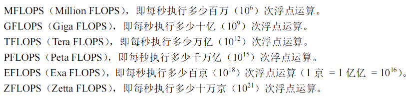
- 数据的表示与运算
  - 十进制小数转换为二进制小数（123.6875 为例）
    - 整数部分用除基取余法 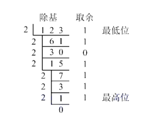
      - 整数部分为 1111011
    - 小数部分用乘基取整法 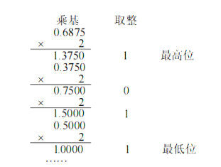
      - 小数部分为 1011
      - 注意，方向和整数的相反
    - 不是每个十进制小数都可以用二进制小数精确表示，但是每个二进制小数都可以用十进制小数精确表示
  - 前置概念
    - 真值：带有符号的数（如 +1, -1, 2 等）
    - 机器数：将符号和数值一起编码。一般用 0 表示正，用 1 表示负。
    - 定点数：小数点的位置固定
    - 浮点数：小数点的位置不固定
    - 定点小数：纯小数（无整数部分），约定小数点在符号位之后 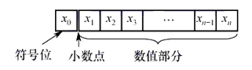
      - x1 为最高有效位
    - 定点整数 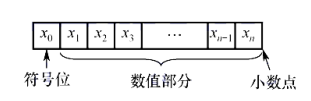
  - 定点数的编码表示
    - 原码
      - 用机器数的最高位表示数的符号，其余各位表示数的绝对值
      - 例如 +1110 -&gt; 00001110 -1110 -&gt; 10001110
      - 0 的原码表示有 2 种
      - 表示范围 
      - 缺点：加减运算复杂；0 有 2 种编码
      - 优点：直观；实现乘除运算简单
    - 补码
      - 正数的补码与其原码相同
      - 负数的补码为该负数的绝对值原码取反后加一
      - 几种特殊的表示
        - 0 的补码表示为全为 0 （n 个 0）
        - -1 的补码表示全为 1（n 个 1）
        - 2^n - 1 的补码表示为 01111.....1 （n - 1 个 1 ）
        - -2^n 的补码表示为 10000......0（n - 1 个 0）
          - 除了符号位，表示的数值越小，表示的值越小
      - 补码中，可以用加法来实现减法
      - 变形补码
        - 使用 2 个 bit 来表示”符号位“
        - 最左侧的那个才是真正的符号位，后面的那个符号位用来判断是否溢出
      - 负数的二进制补码转为十进制
        - 
        - 例子 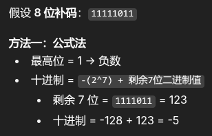
      - 表示范围 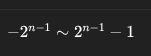
        - 由于没有 -0 问题，所以负数的表示范围比正数多 1
      - 补码的加减法运算
        - 使用二进制的加法运算对整个数进行相加（包括符号位），所得的结果包含了符号位与运算结果
        - 将 A - B 看作是 A + (-B)，即用 A 的补码加上 -B 的补码
    - 反码
      - 正数的反码与原码相同
      - 负数的反码为该负数的绝对值的原码按位取反
        - 相比于补码不加一
      - 缺点：0 的表示不唯一
      - 表示范围 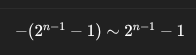
    - 移码
      - 常用来表示浮点数的阶码，只能表示整数
      - 表示方法：在真值的基础上加上一个常数（偏置值），对应结果的二进制表示
        - 此常数一般是 2 的幂
        - 一般选择的偏置值保证加上该常数后，结果非负
        - 该二进制中，最高位不是符号位，而是构成数据的一位
    - C 语言中注意事项
      - C 语言中的类型转换只是改变数据的解释方式
      - C 语言中，若同时有无符号数和有符号数参与运算，则 C 语言规定按照无符号进行计算。
      - char 是无符号类型
      - 将大字长向小字长转换时，会把多余的高位部分直接截断，低位部分直接赋值 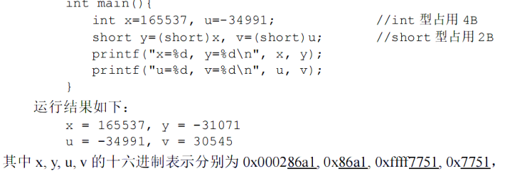
      - 将小字长向大字长转换时，对高位进行扩展
        - 若原数字是无符号整数，则进行零扩展，即高位填充 0,低位保持不变
        - 若原数字是有符号数，则进行符号扩展，即高位填充为与符号位相同的值
      - 先进行字长的转换，再对高位进行扩展
  - 运算方法和运算电路
    - 一位全加器 FA (Full Adder) 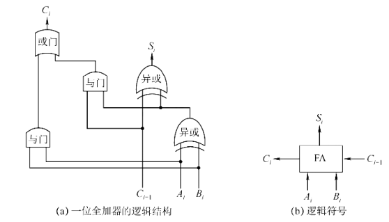
      - 对 3 位二进制数进行加法，并产生和与进位
      - 和表达式 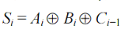
        - A_i 和 B_i 均为输入，C_i - 1 为上一次运算的进位
      - 进位表达式 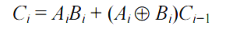
    - 串行进位加法器 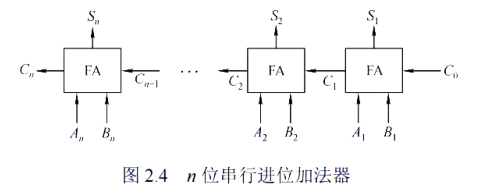
      - 将 n 个全加器相连得到 n 位加法器，成为串行进位加法器
      - 串行进位加法器中，低位元素按产生进位所需的时间将影响高位运算的时间
        - 串行进位加法器的最长运算时间主要是由进位信号的传递时间决定的。位数越多，延迟时间越长
        - 加快进位产生和提高传递的速度是关键
    - 并行进位（先行进位）加法器 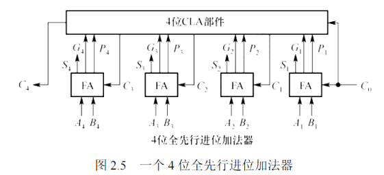
      - 构造一个 n 位并行加法进位器，需要将 n 个全加器连接上 n 位先行进位部分（CLA）
        - CLA 的作用是同时产生 n 位进位信息
    - 带标志加法器 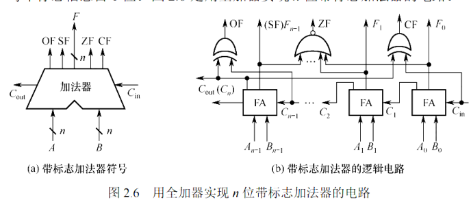
      - 在加法的基础上，生成相应的标志信息
      - OF：溢出标志 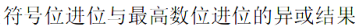
        - 判断有符号数的加减运算是否溢出
        - 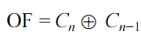
      - CF：进位/借位标志
        - 判断无符号数的加减运算是否溢出
        - 对于无符号数，OF 没有意义
      - SF：符号标志
        - 表示有符号数的加减结果的正负
        - 对于无符号数运算，SF 没有意义
        - SF = 运算结果的最高位
      - ZF：零标志
    - ALU（算术逻辑单元）
      - ALU 的核心是带标志加法器
      - 也能执行与、或、非等逻辑运算
      - ALU 的基本结构 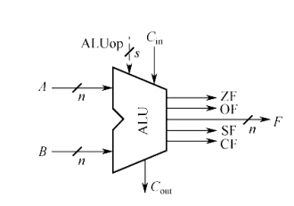
        - A 和 B 是 2 个 n 位操作数的输入
        - C_in 是进位输入端
        - ALUop 是操作控制端，用于发出控制信号，控制 ALU 所执行的处理功能。例如控制 ALU 进行加法运算
          - ALUop 的位数决定了最大的操作种类数。例如当 ALUop 只有 3 位的时候，ALU 最多只有 8 种操作
    - 加减运算电路
      - 由于整数使用补码表示，所以，加法和减法可以用同一个加法器实现
      - 即使是无符号整数，其编码方式也看作是补码。若无符号书 A - B,也是将 -B 看作是补码来计算
      - 实现减法的方法是：假设有 X - Y，使用一个 2 选 1 的多路选择器（MUX），由一个控制端 Sub 来控制，控制输出 Y 还是 ～Y + 1（即 Y 的负数的补码） 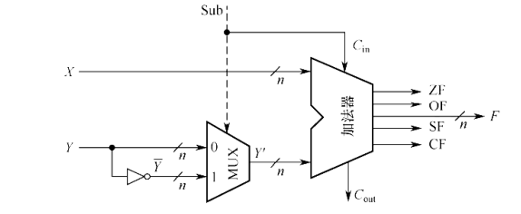
  - 定点数的移位运算
    - 逻辑移位
      - 将操作数视为无符号整数
      - 左移时，高位移出，低位补 0
      - 右移时，低位移出，高位补 0
    - 算术移位
      - 将操作数视为有符号整数
      - 左移时，高位移出，低位补 0
      - 右移时，低位移出，高位补符号位
  - 定点乘法运算与电路
    - 运算
      - 1\. 乘积的符号位由 2 个乘数的符号位取异或得到
      - 2\. 取乘数的绝对值的补码（绝对值的补码就是该绝对值的原码）来进行乘法计算 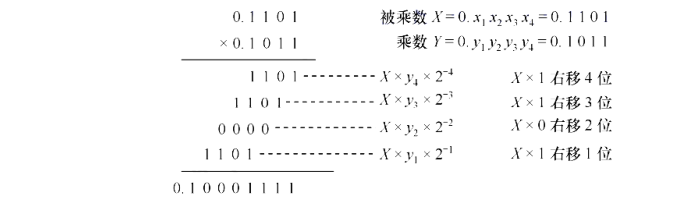
        - 记 P_i 表示乘积的中间结果
        - 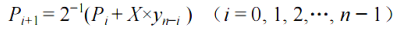
          - P_0 = 0
          - 注意 Y 的编号是从最高位到最低位的（最高位，即符号位为 0,最低位为 n - 1）
          - 其中, X * y_(n - i) 要么与 X 相同，要么是 0
          - 2^(-1）表示向右移动移位（逻辑移位）
        - 2 个 n 位符号数共需要 n 次加法与 n 次移位运算
      - 3\. 将最高位恢复为符号位
    - 32 位无符号乘法运算电路 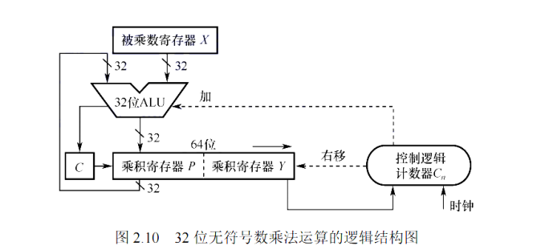
      - 乘积寄存器 P 用来保存乘积的中间结果，P 初始时置为 0
      - 乘积寄存器 Y 存放乘数
        - 当 ALU 中的输出写入到 P 的时候，下一步是对 P 和 Y 进行右移，这会导致 Y 发生溢出。溢出的那一位被送入控制逻辑，用来决定是否加上 X。如果溢出的是 0,则不需要加上 X,这次循环就不需要 ALU 来运算加法，只需要进行右移操作。
      - C_n 是一个计数器，初始值为 32,每次循环后减一
      - 阵列乘法器
        - 生成所有部分积，然后用加法器阵列累加。它体现了“空间换时间”的设计思想，硬件简单但面积较大。
  - 定点除法运算
    - n 位定点数的除法运算需统一为：一个 2n 位的被除数除以一个 n 位的数，得到一个 n 位的商
    - 运算
      - 1\. 计算商的符号位
      - 2\. 取除数与被除数的绝对值的补码（即绝对值的原码）来进行计算。然后，将被除数的绝对值的原码扩展到 2n 位
        - 逻辑结构图 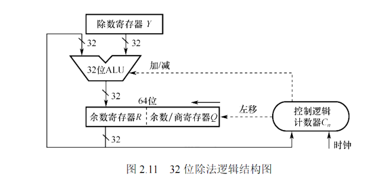
          - Y 存放除数
          - (R, Q) 开始时分别存放扩展后被除数的高 32 位和低 32 位；运算过程中，分别存放中间余数的高位部分和低位部分与部分商；结束时，分别存放余数和商。
            - R 寄存器刚开始全是 0
            - 中间余数是指每次循环中被除数与除数的差
            - 即中间余数的位数在逐渐缩小
          - C_n 初始化为 32,表示循环的次数
          - 算法步骤
            - 1\. 将 （R,Q）整体左移一位，低位空出一位用于存放商
            - 2\. 试商：R = R - Y
              - 若 R &gt;= 0,则将商 1 写入空出来的低位中，保留 R 不变
              - 若 R &lt; 0，则商 0, R = R + Y （恢复成上一个 R）
            - 3\. 计数器减一，继续下一次循环
      - 3\. 将最高位恢复为符号位
  - 浮点数的表示与运算
    - 浮点数表示方法 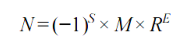
      - S 是符号位
      - M 是一个二进制定点小数，称为尾数，用原码表示
      - E 是二进制定点整数，称为阶码，用移码表示
        - 移码的偏置值 Bias 与 k 位阶码的关系： Bias = 2^(k - 1) - 1
      - R 是基数，是约定而成的
    - S、M、E 在计算机中的表示 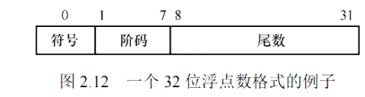
      - 其中，基数 R 为 2
    - 浮点数的表示范围 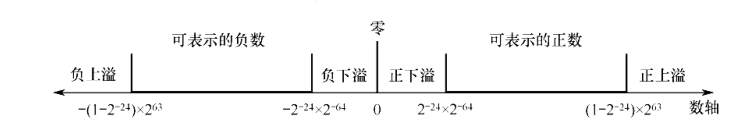
      - 当出现上溢的时候，计算机中断运算操作，进行溢出处理
      - 当出现下溢的时候，计算机将其当作 0 来处理
    - 浮点数的规格化
      - 进行规格化的目的是保证不会有多个形式表示同一个数
      - 在 IEEE 754 中，规定了尾数 M 的小数点左边始终是 1，即 1.xxxxxx,由于 1 对于不是 0 的数（无论是大于 0 还是小于 0）来说，总是存在，所以实际存储时，之存储小数点后边的小数部分 
      - 左归：尾数左移一位（相当于小数点右移），阶码减一（R = 2 时）
        - 可能需要进行多次，直到一个 1 出现在小数点的左边
        - 例子 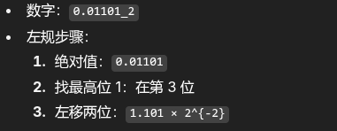
      - 右归：尾数右移一位（相当于小数点左移），阶码加一（ R = 2 时）
        - 当尾数的有效位进到小数点前面时，需要进行右归
    - IEEE 754 标准
      - 32 位单精度 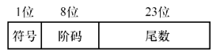
        - 规格化数（阶码 E = 1 ~ 254)，尾数隐含 1 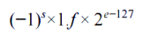
        - 非规格化数 （E = 0)，尾数隐含 0，即 0.xxxx
          - 有 +0 和 -0 两种表示
          - 还可以用来表示非常小的数
          - 非规格化数的计算方法 
            - 注意是 1 - Bias，是“写死”的
        - 特殊数（E = 255）
          - inf：尾数 = 0
          - NaN：尾数 != 0
      - 64 位双精度 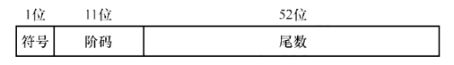
        - 规格化数（阶码 E = 1 ~ 2046），尾数隐含 1 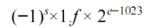
        - 非规格数（E = 0），尾数隐含 0
          - 非规格化数的计算方法 
            - 注意是 1 - Bias，是“写死”的
        - 特殊数（E = 2047）
          - inf：尾数 = 0
          - NaN：尾数 != 0
    - 十进制数与单精度浮点数的相互转换 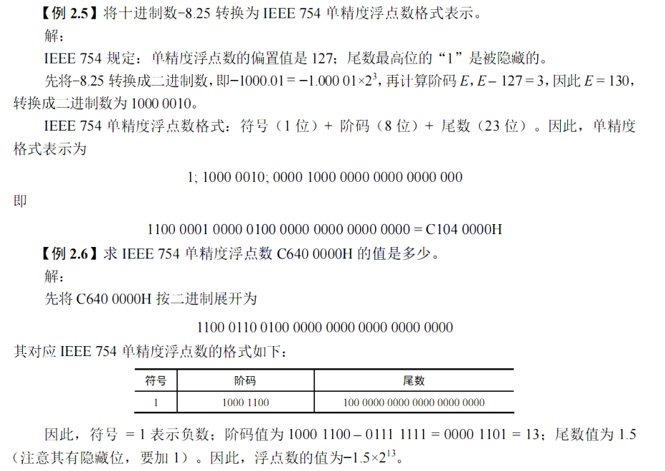
    - 浮点数的加减运算
      - 1\. 对阶
        - 使得 2 个操作数的小数点位置对齐，即使得 2 个数的阶码相等
        - 小阶码向大阶码对齐
          - 将阶码小的尾数右移一位，阶码加一
            - 右移最高位补 0，不用考虑隐含 1
            - 1.1 * 10^2 和 1.01 * 10^3 是一致的
          - 尾数右移时，为了保证运算的精度，低位移出的位会被保留并参与运算
      - 2.尾数加减
        - 1\. 将隐含位还原到尾数部分
        - 2\. 按定点原码的方式对还原后的尾数进行加减操作
      - 3\. 尾数规格化 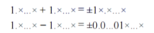
        - 右规：尾数右移一位，阶码加一 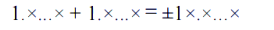
          - 为保证运算的精度，移出的低位会被保留下来，参与中间过程的计算，最后再将运算的结果进行舍入，以表示成 IEEE 754 格式
        - 左归 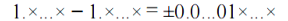
          - 尾数左移，阶码减一。可能会执行多次
      - 4\. 舍入（假设保留 n 位）
        - 就近舍入（舍入为最近的可表示数）
          - 1\. 第 n + 1 位是 0
            - 直接舍去
          - 2\. 第 n + 1 位 是 1
            - 第 n 位是 0（偶数）
              - 直接舍去
            - 第 n 位是 1（奇数）
              - 第 n 位加一
            - 目的是成为偶数
        - 正向舍入（朝数轴 +inf 方向舍入）
          - 取右边最近的可表示数
        - 负向舍入（朝数轴 -inf 方向舍入）
          - 取左边最近的可表示数
        - 截断法（丢弃后面的所有位）
      - 5\. 溢出判断
        - 指数上溢（127 或 1023）
        - 指数下溢（-149 或 -1074）
          - 
          - 
  - 数据的大小端存储与对齐存储
    - 存储方式
      - 大端存储（big endian）
        - 先存储高位字节，后存储低位字节
          - 字节顺序与书写顺序相同
        - 低位存储高字节
      - 小端存储（little endian）
        - 先存储低位字节，后存储高位字节
          - 字节顺序与书写顺序相反
        - 低位存储低字节
    - 对齐
      - CPU 访问内存的方式
        - CPU 只能从内存地址的 0 字长、1 字长、2 字长........处开始访问数据
          - 如果一个字长 = 4 字节，则 CPU 只能从 0、4、8、12、16、....... 地址处开始访问内存
        - 如果一个数据跨越了多个字长，就需要多次内存访问
          - 如果一个 2 字节长的数据跨越了 2 个字长，就会导致 CPU 效率降低
      - 边界对齐
        - 存储地址是自身大小的整数倍
        - C 语言 struct 的对齐
          - 1\. 每个成员按照其类型的大小对齐
          - 2\. struct 的长度是成员中最大对齐值的整数倍
          - 例子 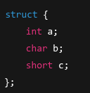
            - 这里填充的 1 字节位于 b 后面，因为要使得 c 对齐 2 的倍数
- 存储系统
  - 分类
    - 按作用分类（层次）
      - 主存储器
        - 用来存放计算计算机运行期间所需的程序和数据
      - 辅助存储器（外存）
      - 高速缓冲存储器 Cache
        - 位于主存和 CPU 之间，用来存放当前 CPU 经常使用的指令和数据，以便 CPU 能快速地访问它们
        - Cache 的存取速度可与 CPU 的速度相匹配
        - 容量小，价格高；通常与 CPU 集成
    - 按存取方式分类
      - 随机存储器 （RAM）
        - 支持随机存取：任何一个存储单元都可以随机存取
      - 只读存储器（ROM）
        - 存储器的内容只能读出，不能写入
        - 即使断电，内容也不会丢失
        - ROM 也支持随机取
        - 虽然也可以使得 ROM 支持写入，但是写入效率比读取速度慢得多
      - 串行访问存储器
        - 对存储单元进行读/写操作时，需按物理位置的先后顺序寻址。如磁带、磁盘、光盘等。
    - 按信息的可保存性
      - 易失性存储器
        - 断电后，存储信息即消失的存储器
        - 如内存
      - 非易失性存储器
        - ROM
      - 破坏性读出
        - 某个存储单元所存储的信息被读出时，原存储信息被破坏
        - 每次读出操作后，必须紧接一个再生操作，以恢复被破坏的信息
      - 非破坏性读出
  - 性能指标
    - 存储容量
    - 单位成本
    - 存储速度
      - 数据传输速率（每秒传送信息的位数） = 数据的宽度 / 存取周期
      - 存取时间 T_a
        - 一次存储器操作的开始到完成该操作所经历的时间
        - 分为读出时间和写入时间
      - 存取周期 T_m
        - 存储器进行一次完整的读/写操作所需的全部时间
      - 主存带宽 B_m（数据传输速率）
        - 每秒从主存进出信息的最大数量
        - 单位为 字/秒、字节/秒等
    - 上述三个因素相互制约
  - 多级层次的存储系统 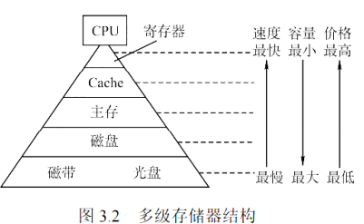
    - 为了解决大容量、高速度、低成本 3 个相互制约的矛盾，采用多级存储器结构
    - 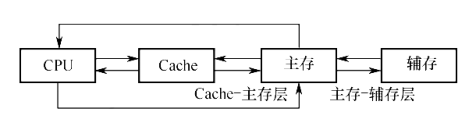
      - Cache、主存能与 CPU 直接交换信息
      - 辅存要通过主存与 CPU 交换信息
      - 主存与 CPU、Cache、辅存都能交换信息
      - Cache-主存主要解决 CPU 和主存速度不匹配的问题。主存和 Cache 之间的数据流动是由硬件自动完成的。
      - 主存-辅存之间的数据流动是由硬件和操作系统共同完成的
    - 主要思想：上一层的存储器作为第一层存储器的高速缓存。上一层的内容都是下一层内容的副本
  - 主存储器
    - RAM 分为
      - SRAM：静态随机存储器
        - 用于实现 Cache
        - 静态是指是其非破坏性读出的特性
        - 存储元（存储 0 和 1）由六晶体管 MOS （双稳态触发器）组成
      - DRAM：动态随机存储器
        - 用于实现主存
        - 需定时刷新（会不断“漏电”）与写后再生（破坏性读出）
          - DRAM 刷新的单位是行
          - 刷新对 CPU 来说是透明的（不受 CPU 控制）
          - 刷新周期：对同一行进行相邻两次刷新的时间间隔。一般为 2ms
          - 常用刷新方式
            - 集中刷新
              - 在一个刷新周期内，依次对存储器的所有行进行逐一再生
              - 在刷新周期内停止对存储器的所有读/写操作。所以，这段时间也被成为死时间、访存死区
            - 分散刷新
              - 将存储器系统的工作周期分为 2 部分
                - 前半部分：用于正常的读/写操作
                - 后半部分：用于刷新
              - 增加了存取周期（如果 0.5 us 就能完成存取，但是现在因为要刷新，增加到了 1us），但是没有死区
            - 异步刷新
              - 1\. 将刷新周期除以行数，得到相邻 2 行之间的刷新间隔 t
              - 2\. 每隔 t 产生一次刷新请求
          - 刷新作用于一个行，而写后再生作用于存储单元
        - 存储元只由 1 个晶体管组成
        - DRAM 容量较大，为了减少芯片的地址引脚数，通常采用地址引脚复用技术
          - 行地址和列地址通过相同的引脚分先后 2 次输入
          - 减少了一半的地址引脚数
        - 设一个 DRAM 具有 2^n * b 位，行数为 r ,列数为 c。（假设一个存储单元为 8 bit 的话，b = 8）
          - 2^n = r * c
          - 则其地址位数为 n = logr + logc
            - 行地址的位数为 logr
            - 列地址位数为 logc
          - 采用了地址引脚复用技术后，为减少地址引脚数，应尽量使行、列位数相同。即 |r - c| 最小
          - 由于 DRAM 按行刷新，为了减少开销，应使行数较小。即 r &lt;= c
        - DRAM 的内部结构图（容量为 16 * 8 位，r = 4, c= 4, b = 8） 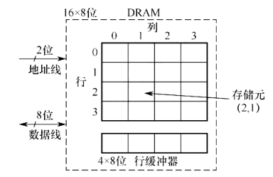
          - 地址引脚采用地址引脚复用技术，只需要 2 根地址线
          - 每个存储单元有 8 位，所以需要 8 根数据线
          - 行缓冲器：用于缓存指定行中的数据
            - 大小为 c * b
            - 常用 SRAM 实现
            - 支持突发传输
              - 在寻址阶段，给出数据的首地址，在传输阶段，传送多个连续的存储单元的数据
      - SDRAM（同步 DRAM）
        - 与传统的 DRAM 的不同是：SDRAM 与系统时钟同步
        - 在传统的 DRAM 中，CPU 在等待数据从 DRAM 中取出的这一段时间内，不断地采样 DRAM 的完成信号，不能做其他的操作
        - 在 SDRAM 中，SDRAM 将 CPU 发出的地址和控制信号锁存起来，经过指定的时钟周期数后再响应，而在此期间，CPU 可以执行其他操作
      - SRAM vs DRAM 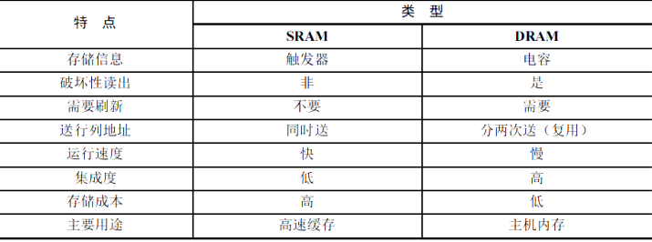
      - 存储器芯片的内部结构 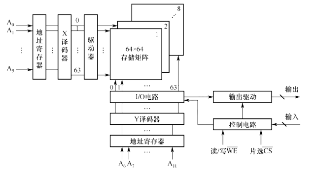
        - 存储矩阵（存储体）
          - 是存储单元的集合，由行选择器（X）和列选择线（Y）来选择所访问的单元
          - 如果选中了某一行，那一行的所有存储单元会一起被“激活”
        - 地址译码器
          - 将地址转换为译码输出线上的高电平，以便驱动相应的读/写电路
          - 单译码法
            - 只有一个行译码器
            - 同一行中的所有存储单元通过字线连在一起。同一行中的各单元构成一个字，被同时读出或写入
            - 缺点：地址译码器的输出线数（等于行数）过多
          - 双译码法
            - 译码器分为 X 和 Y 2 个译码器，交叉点确定一个存储单元
            - 现在普遍采用的方法
        - IO 电路
          - 用于控制被选中的单元的读出或写入，具有放大信号的作用
        - 片选控制器
          - 因为单个芯片容量太小，所以采用一定数量的芯片共同组成一个存储器
          - 片选控制器的作用是：从多个存储芯片中选择一颗来进行访问
        - 读/写控制线
          - 根据 CPU 给出的读/写命令，通过读/写控制线来控制对选中的单元进行读还是写。
    - CPU 与主存的交互 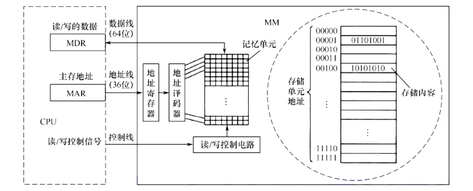
      - 1\. CPU 把被访问单元的地址送到 MAR
        - MAR 与地址线的位数相同
      - 2\. 通过地址线将主存地址（存放在 MAR 中）送入主存中的地址寄存器
      - 3\. 地址译码器进行译码，选中对应的存储单元
      - 4\. CPU 将读/写控制信号通过控制线送到主存的读/写控制电路
        - 如果是写操作，则 CPU 同时要将写入的信息送入 MDR,在读/写控制电路的控制下，经数据线写入选中的存储单元
          - MDR 与数据线的位数相同
        - 如果是读操作，则主存读出选中单元的数据，送入 MDR 中
    - 多模块存储器
      - 空间并行技术
        - 利用多个结构完全相同的存储模块的并行工作来提高存储器的效率
      - 单体多字存储器
        - 每个存储单元存储 m 个字、总线宽度也为 m 个字、一次并行读出 m 个字
        - 在一个存储周期内，从一个地址连续取出 m 条指令，然后逐条送入 CPU 内执行
          - 即每隔 1/m 个存储周期内，CPU 向主存取一条指令
          - 只有当指令连续存储在该地址时，这种方法才能提高存取速度
      - 多体并行存储器
        - 由多体模块构成，每个模块都是一个完整的存储器。所以它们既能并行工作，又能交叉工作
        - 编址方式
          - 高位交叉编址（顺序方式） 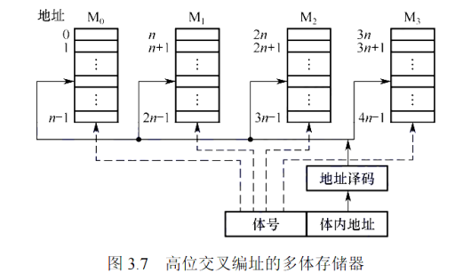
            - 高位地址表示模块号（体号）
            - 低位地址为模块内地址（体内地址）
              - 低位地址被送入由体号确定的模块内进行译码
            - 各模块并不能并行访问
          - 低位交叉编址（交叉方式） 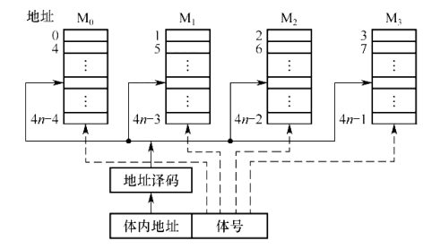
            - 假设有 m 个模块，每个模块有 k 个单元，则
              - 第一个模块存放了单元 0、m、....、(k - 1) * m
              - 第二个模块存放了单元 1、1 +m、...、(k - 1) * m + 1
              - ....
            - 高位地址为模块内地址
            - 低位为模块号
              - 模块号 = 地址 % m
            - 因为连续的数据存放在相邻的模块中，因此采用此编码方式的存储器被称为交叉存储器
            - 交叉存储器可采用 2 种方式
              - 轮流启动方式
                - 模块的存取周期为 T
                - 将 CPU 开始访问存储器到收到该访问完成的信号之间的时间间隔称为总线周期 r
                  - 如果不采用交叉编址，仅对一个存储体的一个单元进行读写，根据总线传输周期的定义，此时 r == T
                  - 由于轮流启动实现了存储体并行，因此进入流水线稳定状态后，完成一次数据传输所需的时间仅要T/m，所以 r = T/m
                - 假设模块数为 m
                  - CPU 访问存储器取得 m 个字节所需要的时间至少是 m * r
                  - 为了经过一轮循环之后（CPU 访问了 m 个模块之后），保证该模块的上一次访问已经完成，则需要确保 m * r &gt;= T
                - 启动步骤
                  - 每隔 T/m 个时间内，启动一个模块，使其开始访问。一次访问需要 T 时间。下一次启动的时候，启动该模块的下一个模块（最后一个模块的下一个模块是第一个模块）
                - 这样，CPU 连续取 m 个字所需的时间是： t = T + (m - 1) * r 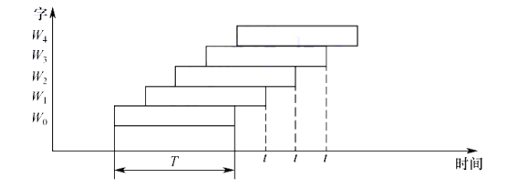
                  - 第一次启动的模块需要 T 的时间完成访问
                  - 后面，CPU 每隔 r = T/m 个时间就可以完成一次存储器的访问
                - 访存冲突：访存地址出现在同一个模块内
                  - 需要延迟发生冲突的访问请求
              - 同时启动方式
                - 如果所有模块一次读/写的总位数正好等于数据总线位数，则可以同时启动所有模块进行读/写
    - 只读存储器 ROM
      - ROM 的优点
        - 1\. 位密度（单位面积内能存储的二进制位数）比 RAM 高
          - 本质原因是 ROM 结构更加简单
        - 2\. 非易失性，可靠性高
      - ROM 按制造工艺分
        - 掩模式只读存储器（MROM）
          - 在芯片生产过程中直接写入，写入后无法改变内容
          - 价格便宜、可靠性高；灵活性差
        - 一次可编程只读存储器（PROM）
          - 允许用户按照专门的设备（编程器）写入自己的程序。写入后无法改变
        - 可擦除可编程只读存储器（EPROM）
          - 允许用户使用编程器写入，还可以进行多次改写
          - 但是编程次数有限，写入速度过慢
        - Flash 存储器
          - 可在不加电情况下长期保存
          - 可在线进行快速擦除和重写
        - 固态硬盘（Solid State Drive, SSD）
          - 由控制单元和 Flash 存储器的芯片组成
          - 在 Flash 的基础上做了一系列增强与改进 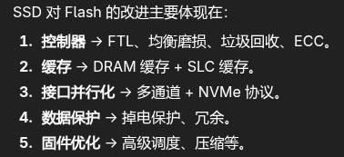
    - 主存储器与 CPU 的连接
      - 连接原理 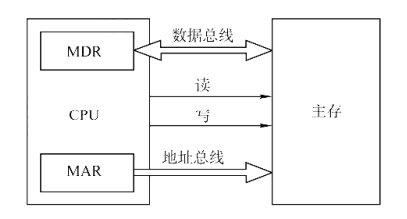
        - 主存储器通过数据总线、地址总线和控制总线与 CPU 连接
        - 数据总线的位数与工作频率的乘积和数据传输速率成正比
        - 地址总线的位数决定了可寻址的最大内存空间
        - 读/写控制总线指出总线周期的类型和本次输入/输出操作完成的时刻
      - 主存容量的扩展
        - 位扩展法
          - 适用范围：当 CPU 的数据线多于存储芯片的数据位数时，必须对存储芯片扩位，使其数据位数与 CPU 的数据线数相等
          - 位扩展是指对字长进行扩展
          - 连接方式 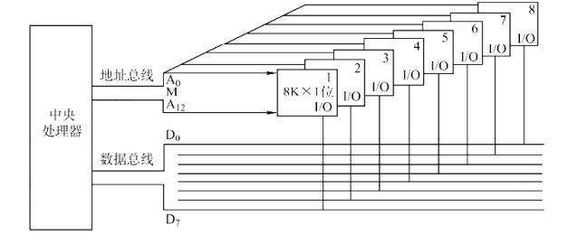
            - 各芯片的地址线、片选控制线、读/写控制线与 CPU 的总线对应并联
            - 各芯片的数据线单独引出，都与 CPU 数据线相连接
            - 各芯片同时工作
        - 字扩展法
          - 适用范围是：存储器的数据线的位数与 CPU 的数据线的位数相等，但是系统地址线的位数多于存储器的芯片地址线位数
          - 字扩展是指对存储字的数量进行扩展
          - 连接方式 
            - 1\. 各芯片的地址线与 CPU 地址线从低位开始相连
            - 2\. CPU 地址线没有与芯片地址线连接的总线与译码器相连，用于选择不同的芯片
            - 3\. 芯片的数据线、读/写控制线与 CPU 的总线相应并联
              - 并联意味着同时只能有一块芯片工作
          - 各芯片分时工作
        - 字位同时扩展法
          - 既增加存储字的数量，又增加字长
          - 连接方式 
            - 1\. 将进行位扩展的芯片作为一组，组内的连接方式与位扩展的相同
            - 2\. 将一组芯片看成一个芯片进行字扩展
      - 存储芯片的地址分配和片选
        - CPU 实现对存储单元的访问，需要先选择存储芯片（进行片选），然后进行字选
        - 芯片内的字选一般通过 CPU 送出的 N 条低位地址线完成
          - N 由片内存储容量 2^N 决定
        - 片选信号的方法分为线选法和译码片选法
          - 线选法 
            - 高位地址线（没有与片的地址线相连的 CPU 地址线）直接连接各个存储芯片的片选端，当某位地址线为 0 时，就选中与之对应的存储芯片
              - 每次寻址时，只能有 1 位有效，不允许多位同时有效
            - 优点：不需要地址译码器，线路简单
            - 缺点：地址空间不连续（如果是连续的，高位应该从 0 开始一直增加），不能充分利用系统的存储器空间
          - 译码片选法
            - 高位地址线与地址译码器相连产生片选信号
            - 这样，如果有 3 根高位地址线，则可以产生 2^3 个片选信号，即可以在 8 个片中进行选择
  - 外部存储器
    - 磁盘存储器
      - 组成
        - 磁盘驱动器 
          - 驱动磁盘转动并在盘面上通过磁头进行读/写操作
        - 磁盘控制器
          - 磁盘驱动器与主机的接口
          - 负责接收并解释 CPU 发来的命令，向磁盘驱动器发送各种控制信号，并负责检测磁盘驱动器的状态
      - 存储区域
        - 一个磁盘含有若干个盘片，一个盘片含有 1 个或 2 个记录面，每个记录面划分为若干圆形的磁道
          - 一个记录面有 1 个磁头与其对应
        - 每条磁道划分为若干个扇区（也称块）
          - 扇区是磁盘读/写的最小单位。即磁盘按块读写
          - 每个扇区能够存储的大小相同
        - 磁头数（heads）：等于记录面数。
        - 柱面数（Cylinders）：表示盘片上包含多少条磁道
          - 不同记录面上的位置相同的磁道可以构成一个圆柱面
        - 扇区数（Sectors）：每条磁道上有多少个扇区
        - 相邻磁道与扇区之间具有一定的间隙，以避免精度错误。
        - 扇区按固定的圆心的角度划分，因此，位密度从最外道向里道增加
          - 因此，磁盘的存储能力受限于最内道的最大记录密度
      - 磁盘高速缓存（Disk Cache）
        - 在内存中开辟一部分区域，用于缓冲被送到磁盘上的数据
      - 磁盘的性能指标
        - 记录密度
          - 是盘片单位面积上记录的二进制数据量
          - 道密度：沿磁盘半径方向上单位长度的磁道数
          - 位密度：磁道单位长度上能记录的二进制代码位数
          - 面密度：位密度和道密度的乘积
        - 磁盘的容量
          - 非格式化容量
            - 记录面上可利用的磁化单元总数
            - 非格式化容量 = 记录面数 x 柱面数 x 每条磁道的磁化单元数
          - 格式化容量
            - 按照某种特定的记录格式所能存储信息的总量
            - 格式化容量 = 记录面数 x 柱面数 x 每道扇区数 x 每个扇区的容量
          - 格式化容量比非格式化容量要小
        - 磁盘的存取时间
          - 寻道时间：磁头移动到目的磁道的时间
          - 旋转延迟时间：磁头定位到要读/写扇区的时间
          - 传输时间：传输数据所花费的时间
          - 磁盘中读/写操作是串行的，不可能同一时间既读又写，也不可能在同一时刻读/写 2 组数据
          - 存取一个扇区的平均延迟时间为磁盘旋转半周的时间
        - 数据传输速率
          - 磁盘存储器在单位时间内向主机传送数据的字节数
          - 若磁盘转数为 r 转/秒,每条磁道容量为 N 字节，则数据传输速率最大为 D_r = rN
      - 磁盘地址
        - 磁盘的一般地址格式 
      - 独立冗余磁盘阵列（RAID）
        - 将多个独立的物理磁盘组成一个独立的逻辑盘，数据在多个物理盘上分割交叉存储、并行访问
        - 具有更好的存储性能、可靠性和安全性
        - RAID 分为 6 个层级
          - RAID0
            - 条带化（Striping）
            - 把数据分块并分散写入多个磁盘
            - 读写速度快（并行 I/O）；无容错，一块磁盘坏了，数据全丢失。
          - RAID1
            - 镜像（Mirroring）
            - 所有数据在两块磁盘上各存一份（互为镜像）
          - RAID2
            - 位级校验（Bit-level Striping with Hamming Code）
            - 把数据按位分散到多个磁盘，同时使用额外的磁盘存放海明码（纠错码）
            - 能自动纠正单比特错误；实现复杂，浪费空间，实际很少使用
          - RAID3
            - 字节级校验（Byte-level Striping with Dedicated Parity）
            - 数据按字节分块分布在多个磁盘，一个专门的磁盘存放奇偶校验信息
            - 读写顺序大文件时速度快，可容忍单盘故障；小文件随机访问效率低，校验盘容易成为瓶颈
          - RAID4
            - 块级校验（Block-level Striping with Dedicated Parity）
            - 数据按块分布在多个磁盘，一个独立磁盘存放校验信息
            - 支持并行读操作，可靠性高。写操作依赖校验盘，容易成为瓶颈。
          - RAID5
            - 块级分布式校验（Block-level Striping with Distributed Parity）
            - 数据和校验信息都分布在所有磁盘上，没有单独的校验盘
            - 读写均衡，空间利用率较高（N-1/N），能容忍单盘故障。写操作性能较低（写入时要更新校验块）
          - RAID 6
            - 双重分布式校验 (Double Distributed Parity)
            - 与 RAID 5 类似，数据和校验信息分布在所有磁盘上。 不同的是：RAID 6 使用 两套不同的校验算法（通常是 P、Q 校验），分别存储在不同的磁盘上
            - 可容忍 两块磁盘同时故障（比 RAID 5 更安全）
            - 读性能：接近 RAID 5（多数情况下仍可并行读）。 写性能：比 RAID 5 更差，因为写入时需要更新两份校验信息。
    - 固态硬盘（SSD）
      - 是一种基于闪存技术的存储器
      - 与 U 盘并无本质区别，但是容量更大
      - 一个 SSD 由一个或多个闪存芯片和闪存翻译层组成 
        - 闪存芯片相当于传统磁盘存储器的机械驱动器
        - 内存翻译层将来自 CPU 的逻辑块读/写请求翻译成对底层物理设备的读/写控制信号（相当于磁盘控制器）
        - 一个闪存由 B 个块组成，每块由 P 页组成
          - 通常，页的大小是 512B ~ 4KB
          - 每块由 32 ～ 128 页组成
          - 数据是以页为单位进行读/写的
          - 以块为单位擦除
          - 只有一页所属的块被整个擦除后，才能写这一页
          - 一旦块被擦除，块中的每页都可以直接再写一次
          - 某个块进行若干次重复写之后，就会磨碎坏，不能再使用
        - 随机写很慢，原因有 2
          - 1\. 擦除块比较慢
          - 2\. 若试图写一个有数据的页，就必须将该块中有数据的页复制到一个被擦除过的块中，然后才能对页进行写操作
      - 随机访问的时间比机械硬盘快很多
      - 磨损均衡（Wear Leveling）
        - 闪存的擦写次数一般从几百次到几千次。为了避免集中写 SSD 中的某一部分，导致这部分损毁，导致整个 SSD 损毁，引入了磨损均衡
        - 1\. 动态磨损均衡
          - 写入数据时，有限选择擦除次数较少的新内存块
        - 2\. 静态磨损均衡
          - 就算没有数据写入，SSD 也会监测并自动进行数据分配，让老的闪存块承担以读为主的存储任务；让新的内存块腾出空间，以承担以写为主的存储任务。
        - 效果 
  - 高速缓冲存储器（Cache）
    - Cache 由 SRAM 组成，通常集成在 CPU 中
    - 程序访问的局部性原理
      - 时间局部性
        - 是指最近的未来要用到的信息，很可能是现在正在使用的信息
        - 例如，循环、数组的访问等
      - 空间局部性
        - 是指最近未来要用到的信息，很可能与现在正在使用的信息在存储空间上是邻近的
      - 高速缓冲技术就是利用局部性原理，把程序中正在使用的部分数据存放在一个高速的、容量较小的 Cache 中
    - Cache 的基本工作原理
      - 为便于 Cache 与主存交换信息，Cache 和主存都被划分为大小相等的块，这些块被称为 Cache 块或 Cache 行
        - 主存中的块的数量远大于 Cache 中的块数
        - Cache 中仅保存主存中最活跃的若干块副本
        - CPU 与 Cache 之间的数据交换以字为单位，而 Cache 与主存之间的数据交换则以 Cache 块为单位
      - 当 CPU 发出读请求时
        - 若访存地址在 Cache 命中，就将此地址转换成 Cache 地址，直接对 Cache 进行读操作。不需要访问主存
        - 若 Cache 不命中，需要访问主存，并把该字所在的块一次性从主存调入 Cache.若Cache 已满，则需要根据替换算法，用这个块替换某块
      - 当 CPU 发出写请求时
        - 若 Cache 命中，则写入 Cache，然后按照一定的写策略，将 Cache 写回主存
      - 某些计算机中，也采用同时访问 Cache 和主存的方式，若 Cache 命中，则终止访存
    - Cache 命中率与缺失率
      - 命中率 
        - N_c 是 Cache 的命中次数，N_m 是访问主存的次数
      - 缺失率 = 1 - H
      - Cache-主存系统的平均访问时间 
        - t_c 是 Cache 命中时的访问时间
        - t_m 是 Cache 未命中的访问时间
    - Cache 和主存的映射方式（地址格式与其中各个字段所占的位数需要掌握）
      - 标记位：用于标记 Cache 中的块在主存中哪一个位置，可看作主存中该块的编号
        - 标记位的位数通过地址格式的标记字段来进行计算
      - 有效位：标识每个块是否有效
      - Cache 的内部结构
        - 硬件实现上通常是 两片并行存储阵列（一片存 Tag+控制位，一片存 Data），行号相同的一行代表一条完整的 Cache Line
        - Cache 容量指的是能缓存的 主存数据量，即数据块（Data Block）的大小总和。 Tag / 有效位 / 脏位等控制字段属于额外的开销，通常称为 管理开销（Overhead），不会算进标称容量
      - 直接映射 
        - 主存中的某一块只能装入 Cache 中的唯一位置 
          - 假设 Cache 共有 2^c 行；主存共有 2^m 块
          - 则主存块号的低 c 位正好是它要装入的 Cache 行号
          - 将块号的高 t = m - c 位设置为该 Cache 行的标记
            - 这样，每一个来自主存的块即使 Cache 行号相同，其标记（tag）也不相同
        - 若该位置已有内容，则产生块冲突，原来的块无条件地被替换出去
        - 地址格式 
      - 全相联映射 
        - 主存中的每一块都可以装入 Cache 中的任何位置
        - 每行的标记用于指出该行来自主存的哪一块
          - 因此，访存时需要与所有 Cache 行的标记进行比较。成本较高
          - 标记的值 Tag = 主存地址的高 log2(主存块数) 位
        - 比较器
          - 每一个 Cache 行都配备了一个比较器
          - 比较器负责比较 Cache 控制器传来的 Tag 是否与该缓存行的 Tag 相等
        - 地址格式 
      - 组相联映射 
        - 将 Cache 分成 Q 个大小相等的组，每个主存块可以装入固定组中的任意一行
        - 在组间，采用直接映射方式；在组内，采用全相联映射方式
        - Q 越大，发生块冲突的概率越低，但电路也更复杂
        - 假设每组有 r 个 Cache 行，则称为 r 路组相联
          - 此时，需要设计 r 个比较器
        - 地址格式 
          - 组号 = 主存块号 mod Cache 组数（Q）
          - Tag 是地址的高位，至于高多少位，则需要使用地址的总位数 - 组号的位数 - 块内偏移来计算
          - 访存过程
            - 1\. 通过访存地址取出组号，找到对应的组
            - 2\. 将对应 Cache 组中每个行的标记与主存地址的高位标记进行比较
            - 3\. 检查有效位
    - Cache 中主存块的替换算法
      - 在采用全相联映射或组相联映射时，若 Cache 全满了或者 Cache 组内的空间满了的时候，就需要使用替换算法替换 Cache 行
      - 随机算法
      - 先进先出算法（FIFO 队列）
        - 选择最早调入的 Cache 行进行替换
        - 容易实现，但是没有考虑局部性原理
      - 近期最少使用算法（LRU 算法）
        - 选择近期长久为访问过的 Cache 行进行计算
        - 每个行都设置一个计数器（LRU 替换位），该计数器的位数与 Cache 的组内行数有关
          - 2 路时有 1 位
          - 4 路时有 2 位
          - 数字越小，表示该行被使用的时间越近
        - 计数器的变化规则
          - 命中时，组内比其低的计数器加 1，命中行的计数器清零。其余不变
          - 未命中且还有空闲行，新装入的行的计数器置 0，组内其余非空闲行全加 1
          - 未命中且无空闲时，计数值为最大值的行全被替换，新装入的计数器置 0，其余全加 1
        - 当集中访问的存储区数大于 Cache 组大小的时候，命中率可能变得很低，这种现象被称为抖动
          - 例如，每一组只有 4 行。而块的访问序列（假设 1、2、3、4、5 映射到同一组）是 1、2、3、4、5、1、2、3、4、5、......，导致命中率为 0
      - 最不经常使用算法
        - 将一段时间内被访问次数最少的 Cache 行换出
        - 新装入的行从 0 开始计数
        - 每访问一次，计数器加一
        - 需要替换时，将计数值最小的行换出
    - Cache 一致性问题
      - 在写操作命中与不命中时，都需要考虑 Cache 内容和主存内容保持一致
      - 写操作命中
        - 全写法（直写法，Write Through）
          - 写命中时，同时写入 Cache 和主存
          - 能随时保持主存数据的正确性，但是降低了 Cache 的效率（因为增加了访问次数）
          - 写缓冲（Write Buffer）
            - 为了减少全写法写入内存的时间消耗
            - CPU 同时写数据到 Cache 和写缓冲中，写缓冲再将内容写入内存
            - 但是若出现频繁写，会使写缓冲饱和溢出
        - 回写法（Write Back）
          - 写命中时，只写入 Cache,而不立即写入主存
          - 只有当块被换出时，才写回主存
          - 为每个 Cache 行设置一个修改位（脏位），用来判断该行是否修改过
      - 写操作不命中
        - 写分配法（Write Allocate）
          - 更新主存块，然后将该块调入 Cache
          - 之所以要调入 Cache,是想要利用空间局部性。但是，每次写不命中都要将一个主存块调入 Cache
          - 常搭配回写法使用
        - 非写分配法
          - 只更新主存单元，而不把主存块调入 Cache
          - 常搭配全写法使用
    - 分离的 Cache 结构
      - 将指令 Cache 和数据 Cache 分开设计
        - 如果指令和数据的 Cache 统一存放（统一 Cache），则会有资源竞争的问题
          - 当 CPU 需要同时取指令（Instruction Fetch）和访问数据（Load/Store）时，如果指令和数据映射到同一行或同一组，Cache 控制器只能处理其中一个访问，另一个访问必须等待
      - 现代计算机的 Cache 通常设立多级 Cache
        - L1 Cache 离 CPU 最近，L2 稍远，以此类推
        - 离 CPU 越近，访问速度越快，容量越小
        - 指令和数据的分离 Cache 一般发生在 L1 Cache 中，因为这里的访问速度要求非常高
          - L1 Cache 通常使用写分配法和回写法
        - L2 以及更高的 Cache 层级一般都是使用统一 Cache
      - 可以对 L1 使用全写法（不常用），设立写缓冲可以避免溢出（因为 L2 Cache 的访问速度大于主存） 
  - 虚拟存储器
    - 虚拟存储器具有主存的速度和辅存的容量。虚拟存储器由主存和辅存共同构成。
    - 虚拟存储器 VS Cache
      - Cache 提高了系统速度，虚拟存储器解决了主存容量过小的问题
      - Cache 完全由硬件实现，虚拟存储器由 OS 和硬件共同实现
      - 虚拟存储器系统的不命中（Page 不在主存中）对系统性能影响很大
    - 相关概念 
      - 用户变成允许的地址称为虚地址或逻辑地址
      - 虚地址对应的存储空间称为虚拟空间或程序空间
      - 实际的主存单元地址称为实地址或物理地址
      - 实地址对应的是主存地址空间或实地址空间
    - 虚拟存储机制采用全相联映射
      - 以此提高命中率，防止缺页。在虚拟存储器中，缺页的代价很大
      - 当进行写操作的时候，采用回写法，也是为了降低缺页的风险
    - 页式虚拟存储器
      - 以页为基本单位，主存空间和虚拟地址空间都被划分成相同大小的页（注意主存空间的定义）
      - 主存地址空间中的页被称为物理页、实页
      - 虚拟地址空间中的页称为虚拟页、虚页
      - 页表是一张存放在主存中的虚页号和实页号的对照表 
        - 页表一般长久地保存在内存中
        - 页表项的一般格式： | 有效位 | 脏位 | 引用位 | 物理页号或磁盘地址
          - 有效位（装入位）：用来表示对应的页面是否在主存，如果不在，则触发缺页异常，然后操作系统将该页从磁盘调入主存中
          - 引用位（使用位）：用来配合替换方法来设置。例如用来表示该页是否使用过
        - 页表长度固定，页表简单，调入方便；但是程序不可能正好是页表的整数倍，最后一页会无法完全利用
      - 地址转换 
        - 在虚拟存储系统中，指令给出的是虚拟地址。因此，要将虚拟地址转换为物理地址
        - 虚拟地址分为 2 个字段： 虚页号 | 页内偏移地址
        - 物理地址也分为 2 个字段： 物理页号 | 页内偏移地址
        - 每个进程都有一个页表基址寄存器，存放该进程的页表首地址（对于该进程来说，那里的虚页号为 0）
      - 快表（TLB）
        - 利用局部性原理，把一些经常访问的页对应的页表项存放在快表（TLB）中
        - 在地址转换过程中，首先查找快表，若命中，则无需访问主存中的页表
        - 快表使用 SRAM 实现，工作原理类似 Cache
        - 通常采用全相联或组相连映射方式
        - TLB 表项由页表表项和 TLB 标记组成
          - 在全相联映射中，TLB 标记就是对应页表项的虚拟页号
          - 在组相联映射中，TLB 标记就是对应虚拟页号的高位部分，而虚拟页号的地位部分作为 TLB 组的组号
      - TLB、Cache 的交互过程 
        - TLB 的作用只是将虚拟地址转换为物理地址
        - 有了物理地址之后，就可以访问 Cache 了
        - Page 缺失：要访问的页面不在主存中
          - Page 缺失时，TLB 也必然缺失，即该页的表项一定不在 TLB 中，因为该页不在页表中
          - Page 缺失说明该页不在主存中，所以，该页的 Cache 一定也缺失
        - TLB 缺失时，可以采用硬件处理，也可以采用软件处理
        - TLB、Page、Cache 3 种缺失情况的组合 
    - 段式虚拟存储器
      - 段按照程序的逻辑结构来划分，各个段的长度因程序而异
      - 虚拟地址分为 2 部分：段号和段内地址
      - 虚拟地址和实地址之间的转换通过段表来实现
      - 段表是程序逻辑段在主存中存放位置的对照表
        - 段表项包含该段的起始地址、段的长度、有效位（是否装入内存）等信息
      - 地址转换过程 
      - 因为段本身是程序的逻辑结构所决定的，所以，分段对程序员来说是不透明的。而分页则是透明的
      - 优点是：段的分界与程序的自然分界相对应，具有逻辑独立性，便于编译、管理、修改和保护
      - 缺点是：段长度可变，分配空间不便，容易在段间留下碎片，不好利用
    - 段页式虚拟存储器
      - 把程序按逻辑结构分段，每段再划分为固定大小的页，主存空间也划分为大小相等的页。程序对主存的调入、调出仍以页为基本的交换单位
      - 段的长度是页长的整数倍
      - 虚地址分为段号、段内页号、页内地址 3 部分
- 指令系统
  - 基本概念
    - 一台计算机的所有指令的集合构成该机的指令系统（指令集）
      - 指令系统是 ISA（指令集体系结构）中最核心的部分
    - ISA 规定的内容
      - 1\. 指令格式，指令寻址方式，操作类型以及每种操作所对应的操作数
      - 2\. 操作数的类型，操作数的寻址方式，大小端方式存放数据
      - 3\. 程序可访问的寄存器编号、个数、位数以及存储空间的大小和编址方式
      - 4\. 指令执行过程的控制方式，包括程序计数器、条件码定义
    - 指令的基本格式 
      - 操作码指出指令应该执行什么操作，以及具有何种功能
      - 地址码指出被操作的信息（指令或数据）的地址，包括参加运算的一个或多个操作数地址、运算结果的保存地址、程序的转移地址、要调用的函数地址等
    - 指令字长
      - 指一条指令所包含的二进制代码的位数
      - 取决于操作码的长度、地址码的长度和地址码的个数
      - 指令字长不一定等于机器字长，但是把 2 者相等的指令称为单字长指令，指令长度等于半个机器字长的指令称为半字长指令。与此类似，有双字长指令
    - 定长指令字结构
      - 指指令系统中，所有指令的长度都是相等的
      - 执行速度快，控制简单
    - 变长指令字结构
      - 指令的长度不固定
      - 虽然不固定，但是指令字长一般为字节的整数倍。因为主存一般都是按字节编址的
    - 注意：不允许一个指令的前缀也是一条指令。且指令的操作码不能重复
  - 按操作数个数分指令格式
    - 零地址指令 
      - 只有操作码 OP，没有显式地址
      - 1\. 不需要操作数的指令：空操作指令、停机指令、关中断指令等
      - 2\. 操作数位于栈中，隐含地操作栈
        - JVM 中的指令就是这种，例如 ADD 操作将栈顶的 2 个操作数相加，然后将结果压入栈顶
    - 一地址指令 
      - 1\. 只有目的操作数的指令
        - 指令含义：OP(A1) -&gt; A1
        - 例如加减 1、求反、移位等
      - 2\. 隐含目的地址的双操作数指令
        - 例如，另一个操作数存放在 ACC 寄存器中，并将运算结果也存放在 ACC 中
        - 指令含义：(ACC)OP(A1) -&gt; ACC
      - 完成一条 1 地址指令需要 3 次访存
        - 1\. 取指令
        - 2\. 取 1 个操作数 1 次
        - 3\. 存结果 1 次
    - 二地址指令 
      - 分别为源操作数和目的操作数
      - 指令含义：(A1)OP(A2) -&gt; A1
      - 完成一条 2 地址指令需要 4 次访存
        - 1\. 取指令
        - 2\. 取 2 个操作数 2 次
        - 3\. 存结果 1 次
    - 三地址指令 
      - 指令含义：(A1)OP(A2) -&gt; A3
      - 完成一条 3 地址指令需要 4 次访存
        - 1\. 取指令
        - 2\. 取 2 个操作数 2 次
        - 3\. 存结果 1 次
    - 四地址指令 
      - 指令含义： (A1)OP(A2) -&gt; A3 A4 为下一条要执行指令的地址
      - 完成一条 4 地址指令需要 4 次访存
        - 1\. 取指令
        - 2\. 取 2 个操作数 2 次
        - 3\. 存结果 1 次
  - 指令的操作类型
    - 数据传送
      - MOV：在寄存器之间传送
      - LOAD：从内存单元读取数据到 CPU 寄存器
      - STORE：寄存器写内存单元
      - PUSH：进栈
      - POP：出栈
    - 算术和逻辑运算
      - ADD、SUB、MUL
      - INC：加一
      - DEC：减一
      - AND、OR、NOT、XOR
    - 移位操作
      - 算术移位、逻辑移位、循环移位
    - 转移操作
      - JMP：无条件转移
      - BRANCH：条件转移
        - 转移条件一般是某个标志位的指或几个标志位的组合
      - CALL：调用
      - RET：返回
      - TRAP：陷入
    - 输入、输出操作
      - 完成 CPU 与外部设备交换数据
      - 传送控制指令及状态信息
  - 扩展操作码指令格式
    - 为了在指令字长有限的情况下，提高指令的种类，采取可变长度操作码
      - 随着地址数的减小，操作码的位数增多
    - 例如 
      - 不止这一种安排方式
    - 不同安排方式的指令条数的计算方法见 Pg.161，15 题
  - 指令的寻址方式
    - 指令寻址：寻找下一条要执行的指令地址
      - 顺序寻址
        - 将 PC（程序计数器）加上当前正在执行的指令字长得到下一条指令的地址
        - 加上的指令字长的单位一般为字节（与编址方式有关）
      - 跳跃寻址
        - 通过转移类指令实现
        - 跳跃的方式
          - 绝对转移：地址码直接给出转移的目标地址
          - 相对转移：地址码指出目的地址相对于当前 PC 值的偏移量
      - CPU 总是根据 PC 寄存器的值去取指令，所以，无论如何寻址，最终都要修改 PC 寄存器的值
    - 数据寻址：寻找本条指令的数据地址
      - 数据寻址有多种方式，为区别各种方式，通常在指令字中设置一个寻址特征字段，用来指明使用哪种寻址方式 
        - 形式地址 A：地址码字段并不代表操作数的真实地址
          - 使用 (A) 这种“语法”来表示地址 A 处的数值
          - A 既可以是寄存器编号，又可以是内存地址
        - 形式地址结合寻址方式来计算出操作数的真实地址，该地址被称为有效地址 EA
      - 寻址方式
        - 隐含寻址
          - 不显式地给出操作数的地址，而是隐含操作数的地址
          - 例如单地址指令隐含一个操作数为 ACC。ACC 对单地址指令来说，就是隐含寻址
        - 立即（数）寻址
          - A 指出的不是操作数的地址，而是操作数本身，即立即数 
        - 直接寻址
          - A 就是 EA,即 EA = A
          - A 的位数限制了该指令操作数的寻址范围 
        - 间接寻址
          - A 表示的操作数地址的地址 
            - 需 2 次访存
            - 可以扩大寻址的范围：EA 的位数大于形式地址 A 的位数
          - EA = (A)
        - 寄存器寻址（寄存器的直接寻址）
          - A 给出的是操作数所在的寄存器编号，该寄存器含有需要的操作数 
        - 寄存器间接寻址
          - A 给出的是操作数的地址所在的寄存器编号，该寄存器中含有操作数的主存地址 
            - 仅需访问主存 1 次
          - EA = (R_i)
        - 相对寻址
          - 把 PC 的内容加上 A 形成有效的地址 EA,即 EA = (PC) + A 
            - PC 寄存器的“自增”发生在寻址之前
          - A 用补码表示，可正可负
          - 广泛用于转移指令
        - 基址寻址
          - 将基址寄存器 BR 中的内容加上 A 形成 EA,即 EA = (BR) + A 
            - BR 既可以是专门的寄存器，也可以指定某个通用寄存器
            - BR 是面向操作系统的：BR 可由用户程序指定，但是其内容需要操作系统来改变
        - 变址寻址
          - 将变址寄存器 IX （Index）的内容加上 A 得到 EA： EA = (IX) + A 
            - IX 和 BR 一样，可以是专用的寄存器，也可以是某个通用个寄存器
            - IX 是面向用户的：IX 的内容是用户可以改变的
          - 在数组的访问中，可以设定 A 为数组的首地址，而不断地改变 IX,从而访问数组中的任意元素
        - 插曲：基址寻址 vs 变址寻址
          - 基址寻址面向操作系统，程序运行的过程中 BR 的内容不变，而 A 可变
          - 变址寻址面向用户，主要用于访问数组。A 不可变，但 IX 可变
        - 堆栈寻址
          - 堆栈是按 LIFO 来管理的一个存储区域，该存储区中读/写单元的地址是用一个特定寄存器——堆栈指针（SP）给出的
          - 硬堆栈：使用寄存器组组成一个堆栈
            - 成本高，小容量
          - 软堆栈：从主存中划分出一段区域来做堆栈
        - 寻址方式的对比 
  - 程序的机器级表示
    - x86 常用汇编指令
      - x86 寄存器 
        - E 表示 Extended,表示 32 位寄存器
        - EAX 的低 2 字节称为 AX,AX 的高低字节分别为 2 个 1 字节寄存器，为 AH 和 AL
      - 汇编语法格式
        - AT&T 格式 vs Intel 格式 
          - AT&T: 指令只能使用小写字母 Intel: 对大小写不敏感
          - AT&T:源操作数在前，目的操作数在后 Intel：目的操作数在前，源操作数在后
          - AT&T：寄存器前需加 %，立即数前加 $ Intel：寄存器和立即数都不需要加符号
          - AT&T：用 () 进行内存寻址 Intel：用 [] 进行内存寻址
          - AT&T: 使用 "disp(base, index, scale)" 的格式进行复杂寻址 Intel：使用 "[base + index * scale + disp]" 来进行复杂寻址
            - base 表示基址寄存器
            - disp（displacement）表示偏移量
            - index 表示变址寄存器
            - scale 表示比例因子
          - AT&T：在指令操作码的后面跟上 b （1 B）、w（2B）、l（long word, 4B）、q（quad word, 8B） 表示数据的长度 Intel：跟上 byte ptr、word ptr、dword ptr、qword ptr
            - AT&T 例子 movb %al, (%ebx) # 8 位移动 movw %ax, (%ebx) # 16 位移动 movl %eax, (%ebx) # 32 位移动 movq %rax, (%rbx) # 64 位移动
            - Intel 例子 mov BYTE PTR [ebx], al ; 8 位移动 mov WORD PTR [ebx], ax ; 16 位移动 mov DWORD PTR [ebx], eax ; 32 位移动 mov QWORD PTR [rbx], rax ; 64 位移动
      - 常用指令
        - 一些记号
          - &lt;reg&gt;、&lt;reg32&gt; 分别表示任意寄存器和任意 32 位寄存器
          - &lt;mem&gt; 表示内存地址
          - &lt;con&gt;、&lt;con32&gt; 分别表示常数和 32 位常数
        - 数据传送指令
          - mov 指令 
            - 将源操作数复制到目的操作数中
            - mov 指令不能用于直接内存到内存的数据复制
          - push 指令 
            - 将操作数压入到内存的栈中
            - ESP 是栈顶，每次入栈之前，ESP &lt;- ESP - 4
            - x86 中的栈向下增长：越往下，栈顶的主存地址越低
          - pop 指令 
            - 先将数据出栈之后，再将 ESP &lt;- ESP + 4
        - 算术和逻辑运算指令
          - add/sub 指令 
            - 也不能同时 2 个操作数为内存
            - sub eax, ebx：eax - ebx
          - inc/dec 指令 
          - imul 指令 
            - 有符号整数乘法
            - 2 个操作数时，第一个操作数必须为寄存器，结果保存在第一个操作数中
            - 3 个操作数时，将第 2 个和第 3 个操作数相乘，结果保存在第一个操作数中，第一个操作数必须为寄存器
            - 如果发生溢出（OF = 1），则 CPU 调用溢出异常处理程序
          - idiv 指令 
            - 只有一个操作数，为除数
            - 被除数为 edx:eax 中的内容（64 位）
          - and/or/xor 
            - 逻辑与、逻辑或、逻辑异或
          - not 指令 
            - 取反
          - neg 指令 
            - 取负
          - shl/shr 指令 
            - 逻辑移位
            - shl &lt;reg&gt;, &lt;c1&gt;：将 &lt;reg&gt; 中的值左移 &lt;cl&gt; 位
        - 控制流指令
          - 在 x86 中，PC 寄存器的名字叫做 IP（指令指针）
          - 在汇编代码中，使用标签（label）指示程序中的指令地址。可以在任意指令前添加标签 
          - jmp 指令 
            - 控制 IP 转移到 label 所指示的地址
          - jcondition 指令 
            - 根据 PSW 中的状态进行条件跳转
          - cmp/test 指令
            - cmp 指令相当于 sub 指令，cmp eax, ebx：是 eax - ebx
            - test 指令相当于 and 指令，对 2 个操作数逐位进行与运算
          - call/ret 指令 
            - call 指令将下一条指令的地址入栈，然后无条件转移到由标签指示的指令中
            - ret 指令弹出栈中保存的指令地址，然后无条件转移到保存的指令地址执行
    - 选择语句的机器级表示 
      - 
      - 例如 
        - 参数被压入栈中
        - 机器级表示 
    - 循环语句的机器级表示
      - do-whlie 循环 
        - 
      - while 循环 
        - 
      - for 循环 
        - 
    - 过程调用的机器级表示（假设在过程 P 中调用 Q 过程）
      - 0\. P 将调用者保存寄存器保存下来（如果需要的话）
        - 调用者保存寄存器：由调用函数 P 负责在调用前保存这些寄存器，如果调用者希望在调用之后保持原值，就必须自己保存
        - x86 中，调用者保存寄存器为 EAX、ECX、EDX
      - 1\. P 将 Q 的实参从右到左压入栈中
        - 因为调用者知道参数的个数，所以 Q 执行完成之后，负责清理这些参数所占的栈空间
      - 2\. 保存返回地址并跳转到 Q
        - call 指令会保存下一条指令的地址，并修改 IP 寄存器的值，从而实现跳转
      - 3\. 先建立栈帧，然后保存被调用者保存寄存器（P 的现场），最后分配 Q 的局部栈空间
        - 建立栈帧： push ebp mov ebp, esp
          - ebp 保存了现在的栈顶指针
        - 被调用者保存寄存器：由被调用函数 Q 负责在使用这些寄存器之前保存原值，并在函数返回之前恢复原值
        - x86 中，被调用者保存寄存器有 EBX, ESI, EDI
        - 分配局部空间： sub esp, &lt;con&gt;
      - 4.执行 Q 的指令
      - 5\. Q 恢复 P 的现场（被保存下来的被调用者保存寄存器），然后将返回值保存在某个指定的寄存器中，最后，销毁栈帧
        - 返回值保存在 eax 寄存器中
        - 销毁栈帧： mov esp, ebp pop ebp
          - ebp 保存着进入时的栈顶指针
          - 同时会“释放”分配的局部空间
      - 6\. Q 取出返回地址，控制转移到 P 中
        - ret 指令将 IP 寄存器修改为 call 指令保存下来的地址
  - CISC vs RISC
    - CISC（复杂指令系统计算机）
      - 指令系统复杂，指令数量多
      - 指令的长度不固定，指令格式多，寻址方式多
      - 可以访存的指令不受限制
      - 各种指令使用频率相差很大
      - 各种指令的执行时间相差很大，大多数指令需多个时钟周期才能完成
      - 控制器大多数采用微程序控制，有些指令复杂，无法使用硬连线控制
      - 难以用优化编译生成高效的目标代码程序
    - RISC（精简指令系统计算机）
      - 要求系统简化，尽量使用寄存器-寄存器操作指令，指令格式力求一致
      - 选取使用频率最高的一些简单指令，复杂指令的功能右简单指令的组合来实现
      - 指令长度固定，指令格式种类少，寻址方式种类少
      - 只有 LOAD/STORE 指令访存，其余指令的操作都在寄存器之间进行
      - 通用寄存器的数量很多
      - 一定会采用指令流水线技术，大部分指令在一个时钟周期内完成
      - 采用硬连线控制为主，不用或少用微程序控制
      - 特别重视编译优化工作，以减少程序执行时间
    - CISC 和 RISC 的比较 
      - 1\. CISC 采用微程序控制，其控制存储器占 CPU 芯片面积的 50% 以上，而 RISC 采用组合逻辑控制，其硬连线逻辑只占 CPU 芯片面积的 10% 左右
        - RISC 更能充分利用 VLSI（超大规模集成电路）芯片的面积
      - 2\. RISC 更能提高运算速度
        - 采用流水线技术，所以运算速度更快
      - 3\. RISC 便于设计，降低成本，提高可靠性
      - 4\. RISC 有利于编译程序代码优化
- CPU
  - CPU 的功能
    - 指令控制
      - 完成取指令（取指）、分析指令和执行指令操作
    - 操作控制
      - 产生完成一条指令所需的操作信号，把各种操作信号送到相应的部件，完成指令
    - 时间控制
      - 严格控制各种操作先后出现的时间
    - 数据加工
      - 对数据进行算术和逻辑运算
    - 中断处理
      - 对运行过程中出现的异常情况和中断请求进行处理
  - CPU 主要由运算器和控制器 2 大部分组成
    - 运算器
      - 由 ALU、暂存器、ACC、GPRs、PSW、移位寄存器（SR）、计数器等组成
      - 功能：根据控制器传送来的命令，对数据进行算术运算、逻辑运算、或条件测试
    - 控制器
      - 由 PC、IR（指令寄存器）、指令译码器（ID）、时序电路和为操作信号发生器等组成
      - 功能：执行指令，每条指令的操作是由控制器发出的一组为操作实现的
      - 工作原理：根据指令操作码、微操作序列和条件信号来形成当前计算机各部件要用到的控制信号
      - 控制器是整个系统的指挥中枢
  - CPU 的寄存器
    - 用户可见寄存器
      - 可对这类寄存器进行编程
      - GPRs、基址/变址寄存器、PSW、PC
    - 用户不可见寄存器
      - 不可对这类计算机进行编程，被控制部件使用，以控制 CPU 的操作
      - 例如 MAR、MDR、IR、暂存寄存器、ACC、移位寄存器（SR）
        - SR 不但可用来存放操作数，还可以在控制信号的的作用下，进行移位
        - 暂存寄存器：用来暂存从数据总线或通用寄存器送来的操作数，以便在取出下一个操作数时将其同时送入 ALU
  - 指令执行过程
    - CPU 取出一条指令并执行所需的全部时间称为指令周期 
      - 取值周期：完成取指令和分析指令的操作
      - 执行周期：完成指令执行的操作
      - 间址周期：对于间接寻址的指令，为了取操作数，还需要访问一次主存，取出有效地址，这段时间被称为间址周期
      - 中断周期：CPU 在每条指令执行结束前，都会检查中断请求线（IRQ），如果有中断且允许（IF = 1），则进入中断响应阶段
    - 指令周期的数据流
      - 数据流是根据指令要求依次访问的数据序列
      - 数据流在不同的指令周期中也是不同的
        - 取值周期
          - 1\. PC（IP） -&gt; MAR -&gt; 地址总线 -&gt; 存储器
          - 2\. CU 发出读命令 -&gt; 控制总线 -&gt; 主存储器
          - 3\. 主存储器 -&gt; 数据总线 -&gt; MDR -&gt; IR
          - 4\. CU 发出控制信号让 PC 加 “1”
        - 间址周期
          - 1\. Ad(IR）或 MDR -&gt; MAR -&gt; 地址总线 -&gt; 主存储器
            - Ad(IR) 表示从 IR 中取出指令字的地址字段
          - 2\. CU 发出读命令 -&gt; 控制总线 -&gt; 主存储器
          - 3\. 主存储器 -&gt; 数据总线 -&gt; MDR（存放有效地址）
        - 执行周期
          - 没有统一的数据流向
        - 中断周期
          - 1\. CU 将 SP -1, SP -&gt; MAR -&gt; 地址总线 -&gt; 主存储器
          - 2\. CU 发出写命令 -&gt; 控制总线 -&gt; 主存储器
          - 3\. PC -&gt; MDR -&gt; 数据总线 -&gt; 主存储器
            - 将下一条指令的地址存放如栈中，中断处理程序返回时，继续执行
          - 4\. 中断服务程序的入口地址 -&gt; PC
      - 数据流在不同的指令中也是不同的
  - 指令执行方案
    - 单周期处理器
      - 对所有指令都采用相同的执行时间 T 来完成
      - T 取决于最慢的那一条指令，所以，执行快的指令会被最慢的那条指令拖慢
    - 多周期处理器
      - 指令需要几个周期就为其分配几个周期。不再要求所有指令都占用相同的执行时间
    - 流水线处理器
      - 因为指令执行的过程中，可分为多个阶段，每个阶段都由不同的硬件完成
        - 当一条指令的某个阶段完成之后，对应的硬件其实是空闲下来的，所以，此时，这个硬件可以完成其他指令的该阶段的操作
        - 在理想情况下，每一个阶段的执行时间为一个时钟周期。而在实际过程中，访存不可能一个时钟周期完成
      - 每个时钟周期启动一条指令，让多条指令同时运行
        - 流水线的核心目的就是提高吞吐率，而不是降低单条指令执行时间。
          - 在理想的情况下，流水线满了之后，每个时钟周期都有一条指令完成
        - 单条指令的延迟几乎不变，真正的性能提升来自多条指令同时在不同阶段执行。
  - 数据通路的功能和基本结构
    - CPU 也可以看作由数据通路（Data Path）和控制部件两大部分组成
      - 数据通路：数据在指令执行过程中所经过的路径（包括路径上的部件）
      - 控制部件：通过生成控制信号实现控制数据通路
    - 数据通路的组成
      - 组合逻辑元件（操作元件）
        - 任何时刻的输出仅取决于当前的输入
        - 不含存储信号的记忆单元
        - 不受时钟信号的控制
        - 信号是单向传输的
        - 译码器 
          - 可用于操作码或地址码译码
          - n 位输入对应 2^n 种输出
        - 多路选择器（MUX） 
          - 通过控制信号 Select 来确定选择哪个输入被输出
        - 三态门 
          - 当 EN = 1 时，输出等于输入
          - 当 EN = 0 时，输出端呈现为高阻态，相当于“断开连接”
      - 时序逻辑元件（状态元件）
        - 任何时刻的输出不仅与该时刻的输入有关，还需该时刻以前的输入有关
        - 时序电路中有存储信号的记忆单元
        - 时序逻辑元件必须在时钟节拍下工作
          - 如果没有统一的时间参考，状态何时更新就会混乱，会造成输出不稳定
          - 在一个 CPU 时钟周期内，只能完成一次对时序逻辑元件的更新
            - 这是判断指令执行所需时钟周期数的主要依据
        - 例如：寄存器和 Cache
    - 数据通路的基本结构
      - 内部总线：同一部件（例如 CPU 之间）之间的总线
      - 系统总线：同一台计算机系统的各部件（如 CPU、内存、IO 接口）
      - CPU 内部单总线方式
        - 通过一条内部总线将 ALU 以及所有寄存器都连接到该总线上
        - 数据传输存在较多的冲突现象，性能较低
        - 能够输出到总线上的部件都通过一个三态门与内部总线相连，用于控制该部件与内部总线之间数据通路的连接与断开 
          - 单周期处理器不能采用单总线结构，因为单总线结构一个时钟周期内执行一个操作，而导致无法在一个时钟周期内执行完成一条指令
        - 由于 ALU 同时需要 2 个操作数，所以，当使用单总线结构时，ALU 中还有一个暂存器 Y，用于保存其中一个操作数
          - ALU 的输出端也不能与总线相连，否则其输出会通过总线反馈到输入端，影响运算结果。因此，将结果存放在一个暂存器 Z 中
      - CPU 内部多总线方式
        - 所有寄存器的输入端和输出端都连接到多条公共总线上，可以同时在多条总线上传送不同的数据
      - 专用数据通路方式
        - 按照指令执行过程中的数据和地址的流动来安排连接电路，避免使用共享的总线
    - 数据通路上的操作
      - 通用寄存器之间传递数据
        - 寄存器和总线之间有 2 个控制信号 Rin 和 Rout
        - 当 Rin 有效时，寄存器 R 将总线上的信息存储到 R 中
        - 当 Rout 有效时，R 将内容输出到总线上
      - 从主存读取数据
  - 控制器的功能和原理
    - 计算机硬件系统的 5 大功能部件及其连接 
    - 控制器的功能
      - 1\. 从内存中取出一条指令，并指出下一条指令在主存中的位置
      - 2\. 对指令进行译码或测试，产生相应的操作控制信号，以便启动规定的动作
      - 3\. 指挥并控制 CPU、主存、输入设备和输出设备之间的数据流动方向
        - CU 本是 CPU 的一个组成部分
    - 控制器的分类
      - 硬布线控制器（组合逻辑控制器） 
        - 把某条指令的的执行步骤使用组合逻辑电路和时序逻辑电路固定地实现
        - 操作码译码电路将 n 位操作码译码产生 2^n 个输出，每种操作码对应一个输出
          - 注意，不包括地址码
        - CU 的输入信号
          - 1\. 经指令译码器译码产生的指令信息
            - 与时钟配合产生不同的控制信号
          - 2\. 时钟脉冲
            - 频率为机器的主频，使 CU 能够按一定的节拍发出各个控制信号
          - 3\. 来自执行单元的反馈信息，即标志
            - CU 有时候需要根据 CPU 的状态来产生控制信号
        - 节拍发生器产生各时钟周期的节拍信号，使得不同的控制信号按时间的先后发出
        - 硬布线控制器速度块，时延小、功耗低；但是逻辑复杂，电路庞大，修改困难
        - RISC 一般都选用硬布线控制器
      - 微程序控制器
        - 将每条机器指令编写成一个微程序，每个微程序包含若干微指令，每条微指令对应一个或多个微命令，一个微命令对应一个微操作。（微操作 = 微命令 &lt; 微指令 &lt; 微程序）
          - 微程序存储在控制存储器（CM）中
            - CM 位于 CPU 内部，用 ROM 实现
            - 微地址：存放微指令的 CM 的单元地址
          - 微指令：由若干微命令组成，每一个微命令控制一部分硬件
            - 微指令中的所有微命令被同时发出，并行执行
            - 微指令通常包含 2 部分信息
              - 操作控制字段（微操作码字段）
                - 用于产生当前控制周期中系统需要执行的具体微操作集合
              - 顺序控制字段（微地址码字段）
                - 用于控制产生下一条要执行的微指令地址，实现控制流转移
          - 微命令：控制部件向执行部件发出的各种控制命令。是构成控制序列的最小单位
            - 相容性微命令
              - 可以同时出现，共同完成某一些微操作的微命令
            - 互斥性微命令
              - 在机器中，不允许同时出现的微命令
          - 微操作：执行部件收到微命令后进行的操作
          - 微周期：从控制存储器中取出并执行一条微指令所需的全部时间，通常为一个时钟周期
        - 执行一条指令就是执行一串微程序序列的过程
        - 微程序控制器的组成 
          - 起始和转移地址形成部件（微地址形成部件）
            - 用于产生初始和后继微地址，提供后续微指令
            - 微指令的微地址码字段不是唯一的输入，还有可能需要跳转到中断处理程序的入口点等
          - 微指令地址寄存器（uPC/CMAR）
            - 接受微地址形成部件送来的微地址，为读取微指令做准备
          - 控制存储器
            - 用于存放各指令对应的微程序
          - 微指令寄存器（uIR/CMDR）
            - 用于存放从控制存储器中取出的微指令
            - 位数等于微指令字长
        - 微程序控制器的工作过程
          - 1\. 取指令（机器指令）
            - 根据 uPC 的值（通常为 0）从 CM 中读出微指令并送入 uIR，微程序执行完成之后，机器指令就已经在 PC 中了
            - 取值微程序的入口地址一般为 CM 的 0 号单元
            - 任何机器指令的取指令操作都是相同的
          - 2\. 由机器指令的操作码字段通过微地址形成部件产生该机器指令所对应的微程序的入口地址，并送入 uPC
          - 3\. 从 CM 中逐条取出对应的微指令并执行
          - 4\. 执行完对应一条机器指令的一个微程序后，又回到取值为程序的入口地址，继续第 1 步
        - 微指令的编码方式（微指令的控制方式）
          - 是指如何对微指令的微操作码（操作控制）字段进行编码，以形成控制信号。
          - 编码的目标是保证速度的情况下，尽量缩短微指令字长
          - 1\. 直接编码（直接控制）方式 
            - 无需进行译码操作，微指令的控制字段中每一位都代表一个微命令。即每一位表示是否启用该位对应的微命令
            - n 个微命令需要占 n 位
          - 2\. 字段直接编码方式
            - 将微操作码字段分成若干小字段
              - 互斥性微命令放在同一字段中
              - 相容性微命令放在不同的字段中
              - 每个小字段包含的信息位不能太多，否则将增加译码电路的复杂性和译码时间
              - 每个小字段都留出一个状态，表示该字段不发出任何微命令
                - 因此，当某字段的长度为 3 位时，通常用 000 来表示不产生微命令，所以，最多只能表示 7 个互斥的微命令
            - 每个字段独立编码
              - 每种编码代表一个微命令
              - 各字段编码含义单独定义（相同的值但是根据编码方式不同而具有不同的解释）
          - 3\. 字段间接编码方式
            - 一个字段的某些微命令需要由另一个字段中的某些微命令来解释
              - 主字段（F1）表示操作类别：ALU、MEM、BRANCH 次字段（F2）表示操作子类型：ADD、SUB、LOAD、STORE
            - 削弱了微指令的并行控制能力，通常作为字段直接编码方式的一种辅助手段
        - （后继）微指令的地址形成方式
          - 1\. 由微指令的地址码字段直接指出
          - 2\. 根据机器指令的操作码形成
            - 微指令的地址由操作码经微地址形成部件形成，形成的结果是该机器指令微程序的首地址
          - 3\. 增量计数法，即 uPC &lt;- (uPC) + 1
            - 适用于后继微指令地址是连续的情况
          - 4\. 根据各种标志决定下一条微指令分支转移的地址
          - 5\. 由硬件直接产生
            - 当计算机加电之后，第一条微指令的地址可由专门的硬件电路产生，送至 uPC，这个地址为取指微程序的入口地址
        - 微指令的格式
          - 水平型微指令 
            - 一条水平型微指令定义并执行多个并行执行的微命令
            - 优点：微程序短、并行能力强、执行速度快
            - 缺点：微指令长、编写微程序麻烦
          - 垂直型微指令 
            - 采用类似机器指令操作码的方式
            - 优点：微指令短、简单、规整
            - 缺点：微程序长、执行速度慢
  - 异常和中断机制
    - 异常（内中断）：CPU 内部产生的意外事件
      - 执行一条命令时 CPU 在其内部检测到的
      - 与正在执行的指令有关的同步事件
    - 中断（外中断）：CPU 外部设备向 CPU 发出的中断请求
      - 与正在执行的指令无关的异步事件
    - 异常和中断响应
      - 0\. 当执行第 i 条指令期间发生了异常或者第 i 条指令执行完成之后，检测到了中断请求信号
      - 1\. 关中断
        - 在保存断点和程序状态期间，不能被新的中断打断，因此禁止响应新的中断。
        - 通过设置 PSW 中的 IF 位来表示是否允许中断
      - 2\. 保存断点（返回地址）和程序状态字（PSW）
        - 为了正确返回到被中断的程序继续执行，将断点和程序状态（PSW）保存到栈中
      - 3\. 识别异常和中断并跳转到相应的处理程序
        - 异常通常用软件方式识别；中断可采用软件/硬件识别方式
        - 软件识别方式
          - CPU 设置一个异常状态寄存器，用于记录异常的原因
          - 操作系统使用一个统一的异常或中断查询程序，按优先级顺序查询异常状态寄存器，以检测异常和中断类型
          - 先查询到的先被处理，然后转到内核中相应的处理程序
        - 硬件识别方式（向量中断）
          - 异常或中断处理程序的首地址称为中断向量
          - 所有中断向量都在中断向量表中
          - 每个异常或中断都被指定一个中断类型号，并且一 一对应
        - 在异常/中断处理程序中，可以手动开启 IF
      - 注：异常和中断的处理程序由操作系统完成
    - 异常的分类
      - 硬故障中断
        - 由硬连线出现异常引起的
        - 如存储器检验错、总线错误
      - 程序性异常（软件中断）
        - 在 CPU 内部因执行指令而引起的异常事件
        - 例如除 0、溢出、断点、单步跟踪、非法指令、栈溢出、地址越界、缺页等
      - 故障（Fault）
        - 是指在引起故障的指令启动后、结束前被检测到的异常事件
        - 例如：译码时出现非法操作码；取数据时，发生缺页；除数为 0 等
      - 自陷（Trap）（陷阱/陷入）
        - 预先安排的一种“异常”事件
        - 在程序中，用一条特殊的指令或通过某种方式设定特殊控制标志来设置一个陷阱
        - 当执行到陷阱指令时，CPU 根据不同陷阱类型进行相应的处理，然后返回到陷阱指令的下一条指令执行。
        - 例如断点的设置（用于程序调试）
      - 终止（Abort）
        - 发生了使计算机无法继续执行的硬件故障
        - 发生之后，会调用异常服务程序来重启系统
    - 中断的分类
      - 可屏蔽中断
        - 指通过可屏蔽中断请求线 INTR 向 CPU 发出的中断请求
        - CPU 可通过设置中断控制器中响应的屏蔽字来选择是否屏蔽
        - 被屏蔽的中断请求将不被送到 CPU。如果中断控制器具有记忆功能，可能隔一段时间取消屏蔽之后送往 CPU
      - 不可屏蔽中断
        - 指通过专门的不可屏蔽中断请求线 NMI 向 CPU 发出的中断请求
        - 通常是非常紧急的硬件故障功能，如电源掉电
  - 指令流水线
    - 提高处理器的并行性的 2 种技术
      - 时间上的并行技术（流水线技术）
        - 将一个任务分解为多个不同的子阶段，每个子阶段在不同的功能部件上并行执行。以便在同一时刻能够同时执行多个任务，从而提高系统的性能
      - 空间上的并行技术（超标量处理机）
        - 在一个处理机内设置多个执行相同人物的功能部件，并让这些功能部件并行工作。这样的处理机被成为超标量处理机
    - 流水线技术 
      - 一般指令可以分为 5 个阶段（功能段/流水段）
        - 1\. 取指 IF：从存储器或 Cache 中取指令
        - 2\. 译码/读寄存器（ID）：对指令进行译码，同时从寄存器堆中取操作数
        - 3\. 执行/计算地址（EX）：执行运算操作或计算地址
        - 4\. 访存（MEM）：对存储器进行读/写操作
        - 5\. 写回（WB）：将指令执行结果写回寄存器堆
      - 理想情况下，每个时钟周期都有一条指令进入流水线，每一个时钟周期都有指令完成，每条指令的 CPI 都为 1
      - 为了有利于实现指令流水线，应具有如下特征
        - 1\. 指令长度应尽量一致
          - 有利于简化取指令和指令译码操作
        - 2\. 指令格式应尽量规整
          - 尽量保证保存操作数的寄存器都相同，这样的话，可以在指令未知的时候就取操作数
        - 3\. 采用 LOAD/STORE 型指令
          - 其他指令不能访问存储器
          - 可以将 LOAD/STORE 指令的地址计算和运算指令的执行步骤规整到同一个周期中，有利于减少操作步骤
        - 4\. 数据和指令在存储器中按边界对齐存放
          - 有利于减少访存次数，使所需数据在一个流水段内就能从存储器中得到
      - 流水线的基本实现
        - 流水线设计的原则
          - 1\. 流水段的个数取决于流水段最多的那个指令
          - 2\. 流水段的时间长度取决于耗时最长的那个流水段
        - 流水段寄存器 
          - 每个流水段都对应一个流水段寄存器，用于保存本段处理后的结果
          - 保证了本段的执行结果能够在下一个时钟周期给下一个流水段使用
        - 流水线的时空图表示 
      - 流水线的冒险与处理
        - 冒险：遇到某些情况使得后续指令无法正确执行而引起流水线阻塞
        - 流水线的冒险
          - 结构冒险（资源冲突/硬件资源竞争）
            - 不同指令在同一时刻争用同一功能部件而形成的冲突
            - 解决冲突的方法
              - 前一指令访存时，使后一条相关指令暂停一个时钟周期
              - 将原来的部件拆分成多个独立的部件，降低冲突发生的可能性
                - 例如，寄存器访问冲突，可以将寄存器的写口和读口独立开来
                - 又例如，L1 Cache 的数据 Cache 和指令 Cache 分离
          - 数据冒险（数据相关）
            - 后面指令需要用到前面指令的结果，而前面的结果还是没有产生
            - 在非乱序执行的流水线中，所有的数据冒险都是因为前面指令写结果之前，后面指令就需要读取而造成的。这种被称为写后读（Read After Write, RAW）冲突
              - 例如 
                - 对应的流水线 
              - 解决方法
                - 1\. 延迟执行相关指令
                  - 把遇到的数据相关指令及其后续指令都暂停一至几个时钟周期，直到数据相关问题消失后再继续执行
                  - 可以使用插入空操作 nop 或者硬件阻塞（stall） 2 种方法
                - 2\. 采用转发（旁路）技术
                  - 设置相关转发旁路，不等前一条指令把计算结果写回寄存器，下一条指令也不再从寄存器读，而是直接通过旁路将还没有写入的中间结果转发到 ALU 的输入端
                - 3\. load-use 数据冒险处理
                  - 若 load 指令及其后紧邻的运算类指令存在数据相关问题，则没法通过转发技术来解决。
                  - 例如 
                    - 因为 load 指令只有 MEM 段结束的时候，才能获得新的值
                    - 解决方法是在 add 前插入一个 nop 指令；或者在程序编译的时候，就避免出现这种情况 
          - 控制冒险
            - 当遇到改变指令执行顺序的情况（PC 发生了改变），发生中断或者异常，就会造成流水线断流，也称控制冲突
              - Cache 缺失也会引起流水线阻塞
            - 通常把因流水线阻塞而带来的延迟时钟周期数称为延迟损失时间片 C
            - 例如 
              - 对于转移指令引起的控制冲突，可以用和数据冲突一样的解决方法：插入 nop 指令或者硬件 stall 
                - 图示中，C = 3
              - 还有一种解决方法：对转移指令进行分支预测，尽早生成转移目标地址
      - 流水线的性能指标
        - 吞吐率 TP：单位时间内流水线所完成的任务数量
          - 基本公式 
            - n 是任务总数
            - Tk 是处理完 n 个任务所用的总时间
          - 假设 k 段流水线，delta-t 表示时钟周期
            - 则有 
              - （k + n - 1）* delta-t 是 n 个指令所花费的时间，需要记住
            - 当 n -&gt; inf 时，TPmax = 1 / delta-t
        - 加速比 S：完成同样一批任务，不使用流水线与使用流水线所用的时间之比
          - 基本公式 
            - T0 表示不使用流水线的总时间
            - Tk 表示使用流水线的总时间
          - 假设 k 段流水线，delta-t 表示时钟周期
            - 则有 
            - 当 n -&gt; inf 时，Smax = k
      - 高级流水线技术
        - 1\. 超标量流水线技术（动态多发射技术） 
          - 每个时钟周期内可并发多条独立指令，以并行方式将多条指令编译并执行。
          - 需要多个功能部件
          - 这种超标量 CPU 都结合动态流水线调度技术，通过动态分支预测等手段，指令不按顺序执行（乱序执行）
        - 2\. 超长指令字技术（静态多发射技术）
          - 由编译器挖掘出指令间潜在的并行性，将多条能并行操作的指令组合成一条具有多个操作码字段的超长指令字（几百位）
        - 3\. 超流水线技术
          - 流水线的功能段划分得越多，时钟周期越短（主频越大），指令吞吐率也就越高
          - 但是，随着流水线的段数越多，流水寄存器的开销也就越大
  - 多处理器的基本概念
    - 单指令流单数据流 SISD 结构
      - 传统的串行计算机结构
      - 通常只包含一个处理器和一个存储器
    - 单指令流多数据流 SIMD 结构
      - 一个指令流同时对多个数据流进行处理，一般称为数据级并行技术
      - 通常由一个指令控制部件、多个处理单元组成
      - 每个处理单元执行的都是同一条指令，但是每个单元都有自己的地址寄存器，存储着不同的数据地址。即处理单元所处理的数据是不同的
      - 向量处理器是一种 SIMD 的变体
        - 实现了直接操作一维数组的指令集
        - 从存储器收集的一组数据按顺序放到一组向量寄存器中，然后以流水化的方式对它们依次操作，最后将结果写回寄存器中
    - 多指令流单数据流 MISD 结构
      - 同时执行多条指令，处理同一数据
      - 实际上不存在
    - 多指令流多数据流 MIMD 结构
      - 同时执行多条指令分别处理不同的数据
      - 可分为
        - 多计算机系统
          - 每个计算机节点都具有各自的私有存储器，具有独立的主存地址空间
          - 不能通过存取指令来访问不同的节点的私有存储器，而是通过消息传递来进行数据传递。也称消息传递 MIMD
        - 多处理器系统
          - 多处理器系统是共享存储多处理器（SMP）的简称
            - 即使这些系统共享同一个物理地址空间，它们仍然可以在自己的虚拟地址空间中单独地运行程序
            - 可分为
              - 统一存储访问（UMA）多处理器
                - 每个处理器对所有存储单元的访问时间是大致相同的
                - 这是因为所有的访存需要经过北桥芯片（与内存相连，并集成了内存控制器）完成
                  - 但是随着多核技术的发展，这导致了资源竞争问题严重
              - 非统一存储访问（NUMA）多处理器
                - 某些处理器访问某些存储器的访存速度要比其他的快
                - 主存被分割分配给了不同的处理器
                  - CPU 直连的这部分内存被称为本地内存
                  - 每个 CPU 通过 QPI 总线相连，从而通过 QPI 访问其他 CPU 的远程内存
                  - 多个处理器同时访问同一共享变量时，需要进行同步
                    - 常用的方法是加锁
          - 共享单一地址空间，通过存取指令来访问系统中的所有存储器，也称共享存储 MIMD
  - 硬件多线程的基本概念
    - 为了减少软件切换线程的消耗而诞生：为每个线程提供单独的通用寄存器组、单独的程序计数器
    - 线程的切换只需激活选中的寄存器，从而忽略了与存储器数据交换的环节，减少了线程切换的开销
    - 具有 3 种实现方式
      - 1\. 细粒度多线程
        - 多个线程之间轮流交叉执行指令，多个线程之间的指令不相关。可以乱序并行执行
        - 在这种方式下，处理器能在每个时钟周期切换线程
      - 2\. 粗粒度多线程
        - 连续几个时钟周期下都同时执行同一线程的指令，当且仅当当前线程出现了较大开销的阻塞时（如 Cache 缺失），才切换线程
        - 发生流水线阻塞时，必须清除被阻塞的流水线，新线程的指令开始执行前需要重载流水线
      - 3\. 同时多线程（SMT）
        - 实现指令级并行的同时，实现线程级并行
        - 即在同一个时钟周期内，发射多个不同线程中的多条指令执行
  - 多核处理器的基本概念
    - 指将多个处理单元集成到单个 CPU 中，每个处理单元为一个核（core）
    - 每个核可以共享同一个 Cache、也可以有自己的 Cache
    - 如果想要充分发挥硬件的性能，必须采用多线程（多进程）执行，使得每个核同一时刻都有线程在执行
- 总线
  - 计算机各部件之间的连接方式
    - 分散连接
      - 各部件之间通过单独的连线互连
    - 总线连接
      - 随着设备的种类越来越多，为了解决 IO 设备和主机之间连接的灵活性，演变出了总线连接
      - 为了进一步简化设计，提出了各种总线标准
  - 总线的基本概念
    - 总线是一组能为多个部件分时和共享的公共信息传送线路
    - 分时：同一时刻只允许有一个部件向总线发送信息
    - 共享：总线上可以挂接多个部件，各个部件之间互相交换的信息都可以通过这组线路分时共享，多个部件可同时从总线上接收相同的信息
    - 总线设备
      - 总线上所连接的设备
      - 主设备：发出总线请求并获得总线控制权的设备
      - 从设备：被主设备访问的设备，只能响应主设备发来的各种总线命令
    - 总线特性
      - 机械特性：尺寸、形状
      - 电气特性：传输方向和有效的电平范围
      - 功能特性：每根传输线的功能
      - 时间特性：信号和时序的关系
  - 总线的分类
    - 按功能层次分
      - 片内总线
        - CPU 芯片内部的总线，用于 CPU 内部各寄存器之间及寄存器与 ALU 的连接
      - 系统总线
        - 计算机系统内各功能部件（CPU、主存、IO 接口）之间相互连接的总线
        - 按传输的内容进一步可分为
          - 数据总线
            - 用来在各部件之间传输数据、指令和中断类型号
            - 是双向传输总线
            - 数据总线的位数反映了一次能够传送的数据的位数
          - 地址总线
            - 用来指出数据总线上源数据或目的数据所在的主存单元或 IO 端口的地址
            - 是单向传输总线
            - 地址总线的位数反映了最大的寻址空间
          - 控制总线
            - 用来传输各种命令、反馈和定时信号。
              - 例如，时钟、复位、总线请求/允许、中断请求、回答、寄存器读/写、IO 读、IO 写、传输确认等
      - IO 总线
        - 用于连接中低速 IO 设备，通过 IO 接口与系统总线相连接
        - 目的是将低速设备与高速总线分离，以提升总线的系统性能
        - 例如 USB、PCI 总线
      - 通信总线（外部总线）
        - 计算机系统之间或计算机与其他系统之间传送信息的总线
      - 局部总线
        - 连接 CPU 与某些高速设备（主存、显卡、缓存）的专用高速总线
        - 直接与 CPU 的内部总线相连、不经过系统总线的中转
    - 按时序控制方式分
      - 同步总线
        - 总线上连接的部件或设备通过统一的时钟进行同步
        - 在规定的时钟节拍内进行规定的总线操作，从而完成部件或设备之间的信息传输
      - 异步总线
        - 总线上连接的部件或设备没有统一的时钟
        - 以信号握手的方式来协调各部件或设备之间的信息传输
    - 按数据传输方式分
      - 串行总线
        - 只有一条双向传输或 2 条单向传输的数据线，数据按比特位串行顺序传输
        - 适合长距离通信
      - 并行总线
        - 有多条双向传输的数据线，可以实现多比特位的同时传输
        - 缺点：可能各数据线的传输特点不一致，导致数据的相互干扰或有信息位延迟
        - 适合近距离通信
  - 系统总线的结构
    - 单总线结构 
      - 将 CPU、内存、IO 设备都挂在同一组总线上
    - 双总线结构 
      - 主存总线
        - 用于在 CPU、主存和通道之间传送数据
      - IO 总线
        - 用于在多个外部设备与通道之间传送数据
      - 缺点：需要增加通道等硬件
    - 三总线结构 
      - 主存总线
        - 用于在 CPU、主存之间传送地址、数据和控制信息
      - IO 总线
        - 用于在 CPU 和各类外设之间通信
      - 直接内存访问（DMA）总线
        - 在主存和高速外设之间直接传送数据
      - 优点：提高了 IO 设备的性能
      - 缺点：任意时刻只能使用一种总线，效率较低
  - 总线标准
    - 总线标准：为了能够使不同厂商制造的零部件（例如主存）能够相互替换而制定的标准
      - “物理接口”：规定插槽形状、引脚定义、信号类型；
      - “通信协议”：规定数据如何传输、时序、握手方式、控制信号。
    - ISA，Industry Standard Architecture,工业标准体系结构
      - 系统总线、并行总线
      - 传输效率低、CPU 占用率高
    - EISA,扩展的 ISA
      - 支持多个总线主控器和突发传送
      - EISA 完全兼容 ISA
      - 系统总线、并行总线
    - VESA 视频电子标准协会
      - 局部总线、并行总线
      - 针对多媒体 PC 要求高速传送活动图像的大量数据而推出
      - 在 ISA 总线和 CPU 总线之间增加一级总线或管理层，这样，就可以将一些高速外设从 ISA 总线上卸下，从而通过局部总线直接挂接到 CPU 总线上，使之能与高速 CPU 总线相匹配
    - PCI 外部设备互联
      - 局部总线、并行总线
      - 高性能 32 位或 64 位总线
      - 例如显卡、声卡、网卡等
      - 与处理器时钟频率无关的高速外围总线
      - 支持热插拔
    - AGP 加速图形接口
      - 局部总线、并行总线
      - 是一种视频接口标准，专用于连接主存和图形卡，用于传输视频和三维图形数据
    - PCI-E
      - 局部总线、串行总线
      - 高速串行双通道传输
      - 传输速率远高于 PCI 和 AGP
    - USB 通用串行总线
      - 设备总线、串行总线
      - 连接外部设备的 IO 总线
      - 支持热插拔
    - PCMCIA
      - 设备总线、并行总线
      - 应用于笔记本电脑，通常用于扩展功能
    - IDE 集成设备电路（ATA）
      - 设备总线、并行总线
      - 硬盘和光驱通过 IDE 接口与主板连接
    - SCSI 小型计算机系统接口
      - 设备总线、并行总线
      - 用于计算机和周边设备之间系统级接口的独立处理器标准
        - 
    - SATA 串行高级技术附件
      - 设备总线、串行总线
      - 串行硬件驱动器接口
  - 总线的性能指标
    - 时钟周期
      - 与机器的时钟周期相同
    - 时钟频率
      - 时钟周期的倒数
    - 传输周期
      - 一次总线操作所需的时间
      - 包括申请阶段、寻址阶段、传输阶段和结束阶段
      - 通常由若干个时钟周期组成
    - 工作频率
      - 总线周期的倒数，意为 1 秒内传送几次数据
    - 总线宽度（总线位宽）
      - 总线上能够同时传输的数据位数
      - 通常指数据总线的根数
    - 总线带宽（总线传输速率）
      - 单位时间内总线上最多可传输数据的位数
      - 总线带宽 = 总线工作频率 * （总线宽度 / 8）B/s
    - 总线复用
      - 一种信号线在不同的时间传输不同的信息
      - 目的是节省空间和成本
    - 信号段数
      - 地址总线、数据总线和控制总线 3 种总线数的总和
  - 总线事务和定时
    - 总线事务：请求总线到完成总线使用的操作序列，即在一个总线周期中发生的一些列活动
    - 总线事务包括
      - 1\. 请求阶段
        - 主设备（CPU/DMA）发出总线传输请求，从而获得总线控制权
      - 2\. 仲裁阶段
        - 总线仲裁机构决定下一个传输周期分配给哪个申请者
      - 3\. 寻址阶段
        - 主设备通过总线给出要访问的从设备地址及有关命令，从而启动从设备
      - 4\. 传输阶段
        - 主设备和从设备进行数据交换（可单向/双向）
      - 5\. 释放阶段
        - 主模块的有关信息均从系统总线上撤除，让出总线使用权
    - 数据传送方式可分为
      - 突发传送方式
        - 能够进行连续成组数据的传送
        - 寻址阶段发送的连续数据单元的首地址
        - 每个时钟周期能够传送一个字长的信息，但是不释放总线，直到一组数据全部传送完毕
      - 非突发传送方式
        - 每个传送周期内都先传送地址，再传送数据
        - 通常一次只能传送一个字长的信息
    - 总线定时
      - 指总线在双方交换数据过程中需要时间上配合关系的控制。其实质是一种协议或规则
      - 1\. 同步定时方式
        - 系统采用一个统一的时钟信号来协调发送和接收双方的传送定时关系
        - 优点：传送速度快，具有较高的传输速率
        - 缺点：主从设备属于强制性同步，不能及时进行数据通信的有效性检验，可靠性较差。
          - 例如，一个时钟周期的时间太短了，不能完成检验操作
        - 适用于总线长度较短且总线所连部件的存取时间比较接近
        - 在同步串行通信时，只需在数据的头尾处添加开始/结束标志
      - 2\. 异步定时方式
        - 主设备提出交换的“请求”信号，经接口传送到从设备；从设备接收到请求后，通过接口向主设备发出“回答”信号
        - 请求撤回信号：主设备撤回请求信号，表示“我已收到应答，传输结束”
        - 回答撤回信号：从设备撤回回答信号，表示“我知道你收到了应答，准备释放总线”
        - 根据“请求”和“回答”信号是否互锁，可分为 3 种类型
          - 不互锁方式
            - 主设备发出“请求”后，不必等待从设备的“回答”信号；经过一段时间后自动撤销请求
            - 从设备在接收到“请求”信号后，发出“回答”信号；隔一段时间后，自动撤销“回答”信号
          - 半互锁方式
            - 主设备发出请求信号后，必须等待回答信号
            - 从设备在接收到请求信号后，发出回答信号，但是不等待主设备的请求信号被撤销
          - 全互锁方式
            - 主设备发出请求后，必须在从设备回答后才撤销请求
            - 从设备发出回答后，必须在获知主设备请求已撤销后，再撤销其回答信号
      - 3\. 半同步定时方式
        - 所有指令、命令、数据信号的发出时间都严格按照系统时钟的某个前沿开始
        - 接收方采用系统时钟后沿时刻来进行判断识别
        - 增加一条 Wait 响应信号线，在每个时钟到来时，采样 Wait 信号，若无效，则说明数据未准备好，下一个时钟开始时再采样，直到 Wait 有效，然后去数据线上取数据
        - 优点：控制方式比异步定时简单，各设备在系统时钟下同步工作，可靠性较高
        - 缺点：系统时钟频率不能太高
      - 4\. 分离式定时方式
        - 上述 3 个方式中，从设备在准备数据的阶段时，总线处于空闲等待状态（因为没有释放总线）
        - 将总线事务拆分为请求和应答 2 个子过程
          - 1\. 主设备获得使用权后，将命令、地址等新信息发送到总线上。主设备一旦发送完，立即释放总线
          - 2\. 从设备接受到请求和数据之后，申请总线使用权，将数据发送到主线上
        - 这种方式下，每个设备都变成了主设备
        - 优点：不存在空闲等待时间
        - 缺点：控制复杂，开销大
- IO 系统
  - IO 接口（IO 控制器）
    - 是主机与外设之间的交接界面，通过接口可以实现主机和外设之间的信息交换
    - 接口也屏蔽了不同种类外设之间的差异
    - IO 接口位于主板上，大多都与一个物理插槽对应
    - IO 接口的功能
      - 1\. 进行地址译码和设备选择
        - CPU 会送来用来选择外设的地址码，接口对地址进行译码产生设备选择信息，使主机能和指定外设交换信息
      - 2\. 实现主机和外设的通信联络控制
        - 解决主机和外设时序配合问题
      - 3\. 实现数据缓冲
        - CPU 和外设之间往往速度不匹配，为了消除速度差异，接口必须设置数据缓冲寄存器，用于数据的暂存
      - 4\. 信号格式转换
        - 外设与主机之间的电平、数据格式都可能存在差异，接口提供 2 者之间的信号格式转换功能
      - 5\. 传送控制信息和状态信息
        - CPU 要启动某外设时，通过接口中的命令寄存器向外设发出启动命令
        - 外设准备就绪时，将“准备好”状态信息送回接口中的状态寄存器，并反馈给 CPU
        - 外设向 CPU 提出中断请求时，CPU 也有响应信号反馈给外设
    - IO 接口的基本结构 
      - 数据缓冲寄存器用来暂存与 CPU 或主存之间传送到的数据信息
      - 状态寄存器用来记录接口和设备的访问状态信息
      - 控制寄存器用来保存 CPU 对外设的控制信息
      - IO 接口中的数据线传送的是读/写数据、状态信息、控制信息和中断类型号
      - 地址线传送的是要访问 IO 接口中的寄存器的地址
      - 控制线传送的是读/写控制信号、中断请求、响应信号、仲裁信号和握手信号
      - IO 控制逻辑可以对寄存器中的命令进行译码，并将译码得到的控制信号通过外设界面控制逻辑送到外设；同时，将数据缓冲寄存器的数据发送到外设或从外设中接收数据到数据缓冲寄存器
      - IO 控制逻辑还可以收集外设状态到状态寄存器中
      - 对数据缓冲寄存器、状态/控制寄存器的访问操作是通过相应的指令来完成的。通常称这类指令为 IO 指令
        - IO 指令只能在操作系统内核的底层 IO 软件中使用，是一种特权指令
  - IO 接口的类型
    - 按（外设与接口一侧）数据传送方式
      - 并行接口
        - 字节/字的所有位同时传送
      - 串行接口
        - 按位进行有序地传送
    - 按主机访问 IO 设备的控制方式
      - 程序查询方式
        - CPU 通过程序不断地查询 IO 设备是否已做好准备，从而控制 IO 设备与主机交换信息
      - 程序中断方式
        - 只在 IO 设备准备就绪并向 CPU 发出中断请求时才予以响应
      - DMA 方式
        - 主存和 IO 设备之间有一条直接数据通路，当主存和 IO 设备交换信息时，无需调用中断服务程序
    - 按是否可编程
      - 可编程接口
        - 通过编程改变接口功能
      - 不可编程接口
  - IO 端口及其编址
    - IO 端口：IO 接口电路中可被 CPU 直接访问的寄存器
      - 数据端口（CPU 可读可写）
      - 状态端口（CPU 只读）
      - 控制端口（CPU 只写）
    - IO 端口要想被 CPU 访问，就必须对各个端口进行编址，每个端口对应一个端口地址
      - 独立编址（IO 映射方式）
        - 对所有的 IO 端口单独进行编址，IO 端口的地址空间与主存地址空间是 2 个独立的地址空间
        - 相同的地址可能属于不同的地址空间
        - 优点：使用专门的 IO 指令，程序变得更加清晰；译码简单
        - 缺点：增加了 CPU 控制的复杂性
      - 统一编址（存储器映射方式）
        - 把主存地址空间分出一部分给 IO 端口进行编址
        - 优点：无需设置专门的 IO 指令
        - 缺点：译码电路变得更复杂，降低了译码速度
  - IO 方式
    - 程序查询方式
      - 1\. CPU 执行初始化程序
      - 2\. 向 IO 接口发出命令字，启动 IO 设备
      - 3\. 从外设接口读取其状态信息
      - 4\. CPU 周期或持续地查询设备状态，直到外设准备就绪
        - 独占查询
          - 一旦设备启动，CPU 就一直持续查询接口状态
        - 定时查询
          - CPU 周期性地查询接口状态，每次总是等到条件满足时才进行一次数据传送，传送完成后返回到用户程序
          - 定时查询的时间间隔与设备的传输速率有关
      - 5\. 传送一次数据
      - 6\. 修改地址和计数器参数
        - 计数器的作用：还剩余多少数据项（字节/字）没有传输
      - 7\. 判断传送是否结束，若未结束，执行第 3 步
    - 程序中断方式
      - 程序中断 IO 方式工作流程
        - 1\. 当前进程需要 IO 操作（通过 read/write 系统调用），操作系统启动某台外设，并阻塞当前进程
        - 2\. 操作系统从就绪队列中选择另一个进程执行
        - 3\. 此时，外设和 CPU 并行工作
        - 4\. 当外设完成数据传送的准备工作（例如磁盘将要访问的数据准备好），便主动向 CPU 发中断请求
        - 5\. CPU 响应中断请求后，暂时中止正在执行的进程，转去执行中断服务程序
        - 6\. 在中断服务程序中，完成主机与外设之间的数据传送
        - 7\. 传送完后，CPU 返回原被中止的进程的断点处继续执行
      - 中断屏蔽字
        - 中断屏蔽字用于确定中断处理优先级
          - 中断响应优先级仍然由判优逻辑电路完成
          - 先处理后响应
        - 每个中断源对应中断屏蔽寄存器中的一位，1 表示屏蔽该中断源的请求，0 表示可以正常请求
        - 中断屏蔽寄存器中的内容被成为中断屏蔽字 
          - 每个设备都有一个中断屏蔽字
          - 当 CPU 响应中断的时候，会将属于该中断源的中断屏蔽字送入中断屏蔽寄存器中
          - 所以，中断屏蔽字的实际含义是：在执行 ISR 的时候，屏蔽哪些中断源的中断请求
        - 通过在不同中断源中设置不同的中断屏蔽字，可以实现动态优先级
          - 例如有 ABCD 四个中断源
          - 中断判优电路的固定优先级顺序为 A &gt; B &gt; C &gt; D
          - 但是可以通过设置屏蔽字，在该中断判优电路下，实现 A &gt; D &gt; C &gt; B
            - 根据“可被优先级更高的中断源中断”的基本思想，可以分别得出 ABCD 的中断屏蔽字
            - A: 1111
            - D: 0111
            - C: 0110
            - B: 0100
      - 程序中断的工作流程
        - 1\. 中断请求
          - 一台计算机允许多个中断源，每个中断源向 CPU 发出中断请求的时间是随机的
          - 为了区分不同的中断源，中断系统需对每个中断源设置中断请求标记触发器，为 1 时，表示对应的中断源有请求
          - 这些触发器组成中断请求标记寄存器，该寄存器可集中在 CPU 中，也可以分散在各个中断源中
          - 通过 INTR 线发出的是可屏蔽中断；通过 NMI 发出的是不可屏蔽中断
        - 2\. 中断响应判优
          - 中断响应优先级：CPU 响应中断请求的先后顺序
          - 中断响应判优一般是通过硬件排队器或中断查询程序实现的
          - 一般而言，不可屏蔽中断 &gt; 可屏蔽中断；高速设备 &gt; 低速设备；输入设备 &gt; 输出设备；实时设备 &gt; 普通设备
        - 3\. CPU 响应中断的条件
          - 1\. 中断源有中断请求
          - 2\. CPU 允许中断及处于开中断状态（异常和不可屏蔽中断不受此限制）
          - 3\. 正在执行的指令执行完毕（异常不受此限制）
          - 4\. 没有更紧迫的任务
        - 4\. 中断响应过程
          - 1\. 关中断
            - CPU 响应中断后，首先要保存程序的断点和现场
            - 在保存断点和现场的过程中，CPU 不能响应更高级中断源的中断请求。否则就有可能不能恢复到现行程序
            - 因此，先要关中断
            - 关中断只影响可屏蔽中断
          - 2\. 保存断点
            - CPU 将断点（ PC 和 PSW 中的内容）保存在栈或特定寄存器中
              - PC 和 PSW 指令无法直接读取
            - 异常的返回地址一般是当前执行的指令的地址，而中断的返回地址则是下一条指令的地址
          - 3\. 引出中断服务程序
            - 1\. 识别中断源
              - 硬件向量法（中断向量）
                - 每个中断源都有一个唯一的类型号
                - 每个中断类型号都对应一个中断服务程序 ISR
                - 将系统中的所有中断向量集中存放到存储器的某个区域，这个存放中断向量的存储区就称为中断向量表
                - CPU 通过识别中断源来获得中断类型号，然后根据中断类型好计算出对应中断向量的地址；再根据该地址从中断向量表中取出中断服务程序的入口地址，并送入 PC
                  - 控制线上传递中断请求和响应信号
                  - 数据线上获得中断源的中断类型号
              - 软件查询法
            - 2\. 将服务程序（ISR）的入口地址送入 PC
          - 4\. 中断处理程序的流程
            - 1\. 保存现场和中断屏蔽字
              - 现场指用户可见的工作寄存器的内容
              - 此步骤不能开中断
            - 2\. 开中断
              - 允许优先级更高的中断到来，实现中断嵌套
            - 3\. 执行中断服务程序
            - 4\. 关中断
              - 保证在恢复现场和屏蔽字时不被中断
            - 5\. 开中断、中断返回
          - 注意：步骤 1 ～ 3 被称为中断隐指令（硬件自动完成）
    - DMA 方式
      - DMA 方式在外设与内存之间开辟了一条直接数据通路，信息传送不再经过 CPU,降低了 CPU 在传送数据时的开销
      - DMA 方式中，仍然使用中断来处理故障或者传送结束时进行处理
      - DMA 方式的特点
        - 1\. 主存既可以被 CPU 访问，也可被外设访问
        - 2\. 在数据快传送时，主存地址的确定、传送数据的计数等都有硬件电路直接实现
        - 3\. 主存中要开辟专用缓冲区，用来提供和接受外设的数据
        - 4\. DMA 传送速度快，CPU 和外设并行工作
        - 5\. DMA 在传送开始前要通过程序进行预处理，结束后通过中断方式进行后处理
      - DMA 控制器（DMA 接口）
        - DMA 控制器的组成 
          - 主存地址计数器
            - 存放要交换数据的主存地址
            - 传送前，保存的是要传送数据的主存起始地址；每传送一个字，地址寄存器的内容就加一，直到该批数据传送完成
          - 传送长度计数器
            - 要传送数据的总长度，每传送一个字，减一
          - 数据缓冲寄存器
            - 暂存每次传送的数据
          - DMA 请求触发器
            - 当 IO 设备准备好了之后，发出一个控制信号，使 DMA 请求触发器置位
          - 控制/状态逻辑
            - 用于指定传送方向，修改传送参数
            - 对 DMA 请求信号、CPU 响应信号进行协调和同步
              - DMA 请求信号用于向 CPU 申请系统总线的控制权，通过系统总线在外设和主存之间传递数据
              - 所以，DMA 必须具有总线控制能力
          - 中断机构
            - 当一批数据传送完毕后触发中断机构，向 CPU 提出中断请求
        - 当 IO 设备和 CPU 同时访问主存时，需要处理冲突
          - 方式一：停止 CPU 访存 
            - DMA 接口向 CPU 发送一个停止信号，使 CPU 放弃总线控制权，直到 DMA 传送结束
            - 缺点：在 DMA 访存时，CPU 基本处于不工作状态
          - 方式二：周期挪用 
            - IO 访存的优先级高于 CPU 访存
              - 因为外设以固定的速度访存，如果不尽快访存，可能会造成数据丢失（外设的数据缓冲区溢出）
            - 让 IO 访存挪用一个存取周期的系统总线，传送完一个数据字之后立即释放总线
          - 方式三：DMA 与 CPU 交替访存 
            - 将 CPU 的工作周期分为 2 个时间片，一个给 CPU 访存，另一个给 DMA 访存
            - 这要求 CPU 的工作时间 &gt;= 2 * DMA 访存周期
        - DMA 的传送过程
          - 1\. 预处理
            - CPU 初始化 DMA 中的有关寄存器，包括设置传送方向、主存地址、数据长度等
            - CPU 测试并启动设备
            - CPU 处理完成之后，继续回到原程序工作
            - IO 设备准备好之后，向 DMA 控制器发出 DMA 请求，再由 DMA 控制器向 CPU 发出总线请求
          - 2\. 数据传送
            - DMA 以数据块为基本传送单位
            - 数据传送过程完全由 DMA 硬件控制
          - 3\. 后处理
            - DMA 向 CPU 发出中断请求，CPU 执行中断服务程序做 DMA 结束处理：包括检验数据正确性等
        - DMA vs 中断方式
          - DMA 方式不中断现行程序，无需保护现场
          - DMA 请求的响应与中断请求不同，发生在任意一个机器周期结束时（取值、间址、执行周期等结束后）
          - DMA 传送过程不需要 CPU 的干预
          - DMA 请求的优先级高于中断请求
          - 中断方式靠程序传送，DMA 方式靠硬件传送
```
