```markmap
---
markmap:
  initialExpandLevel: 2
  spacingVertical: 30
  spacingHorizontal: 180
---

# 计算机网络
- 基本概念
  - 交换方式
    - 电路交换 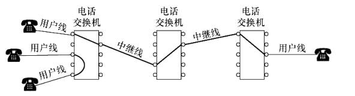
      - 在进行传输之前，两个用户之间必须先建立一条专用的物理通信路径
      - 在数据传输过程中，该路径一直被独占，直到通信结束
      - 优缺点 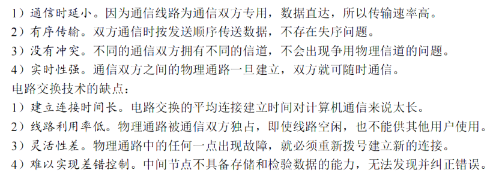
    - 报文交换
      - 报文：用户数据加上源地址、目的地址等信息后，形成报文。是数据交换的单位。
      - 存储转发技术：报文先送到相邻的节点，存储完成后查找转发表，转发到下一个节点
      - 优缺点 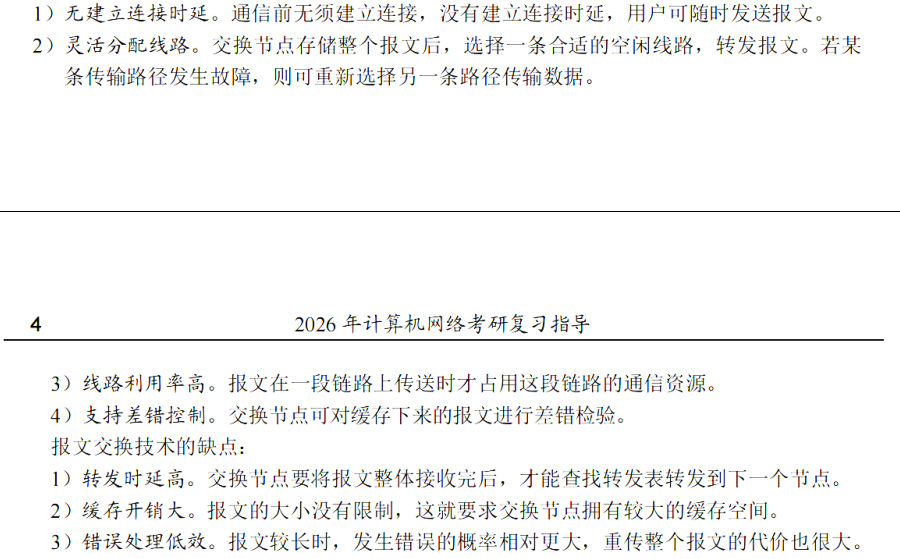
    - 分组交换
      - 在报文交换的基础上，将报文划分成若干较小的等长数据段，在每个数据段前添加一些必要的控制信息组成首部，构成分组 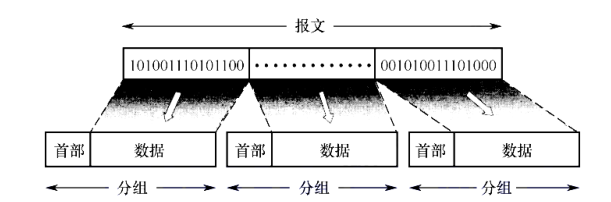
      - 优缺点 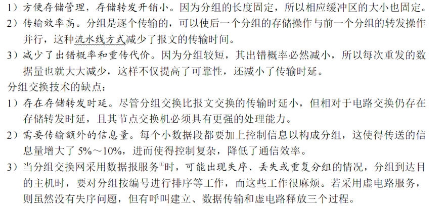
  - 计算机网络分类
    - 按分布范围分
      - 广域网 WAN
        - 提供长距离通信
        - 一般都是高速链路，具有较大的通信容量
      - 域域网 MAN
        - 覆盖范围是几个街区或者整个城市
        - 大多采用以太网
      - 局域网 LAN
        - 主机通过高速线路相连，覆盖范围较小
      - 个人区域网 PAN（无限个人区域网 WPAN）
        - 个人将平板手机、智能手机等用无线技术连接起来的网络
    - 按传输技术分类
      - 广播式网络
        - 所有互联的计算机都会共享一个公共通信信道，当一台计算机利用该信道发送报文分组时，所有其他计算机都会收听到这个分组，收听到该分组的计算机将通过检查目的地址来决定是否接收该分组。
        - 局域网基本上都采用广播式通信技术
      - 点对点网络
        - 通过一条或多条连通的物理线路连接一对计算机
    - 按拓扑结构分类
      - 总线型网络 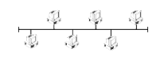
      - 星型网络 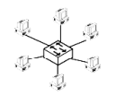
      - 环形网络 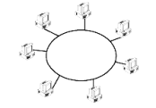
      - 网状网络 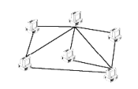
  - 性能指标
    - 速率/数据传输速率/数据率/比特率 Speed
      - 在真题中，等价于发送速率
    - 带宽（Bandwidth）
      - 表示网络的通信线路所能传送数据的能力
      - = 数字信道所能传送的最高数据传输速率
    - 吞吐量
      - 单位时间内通过某个网络的实际数据量
    - 时延 
      - 数据从网络的一端到另一端所需的总时间
      - 可分为 4 个部分
        - 1\. 发送时延/传输时延 
          - 从发送分组的第一个 bit 算起，到该分组最后一个 bit 发送完毕所花的时间
        - 2\. 传播时延 
          - 一个 bit 从链路的一端传播到另一端所需的时间
        - 3\. 处理时延
          - 在存储转发过程中一些必要处理所花费的时间
        - 4\. 排队时延
          - 分组在路由器的输入队列/输出对列中排队等待所花的时间
      - 在考试中，一般不用考虑处理时延和排队时延
    - 时延带宽积 
      - 发送端发送第一个 bit 即将到达终点时，发送端已发出了多少 bit
      - 时延带宽积可以表示该管道可以容纳的比特数量
    - 往返时延 RTT
    - 信道利用率 
      - 某个信道有百分之几的时间是有数据通过的
      - 信道利用率太高会产生产生较大的时延，导致网络拥塞
  - 网络体系结构
    - 分层结构
      - 协议数据单元（PDU）
        - 相同层（对等层）之间传送的数据单位
        - n-PDU 表示第 n 层的 PDU
        - PDU 包含 SDU 和 PCI
      - 服务数据单元（SDU）
        - 层与层之间的交换的数据单元
      - 协议控制信息（PCI）
        - 控制协议操作的信息
      - 在当各层传输数据时，从邻层收到的 PDU 作为该层的 SDU,再加上该层的 PCI,就构成了该层的 PDU
    - 协议
      - 语法
        - 数据与控制信息的格式。例如 TCP 报文段的格式
      - 语义
        - 需要发出何种控制信息，完成何种动作以及做出何种应答
        - 例如 TCP 连接时每次握手所执行的操作
      - 同步（时序）
        - 事件实现顺序的详细说明
        - 例如 TCP 三次握手的时序关系
    - 接口/服务访问点（SAP）
      - 接口提供了本层的服务
    - 服务
      - 本层服务通过 SAP 提供给上层，供上层调用
      - 实现本层服务还需要下层的服务
      - 服务的 3 种分类
        - 面向连接服务与无连接服务
        - 可靠服务和不可靠服务
        - 有应答服务和无应答服务
    - OSI 参考模型 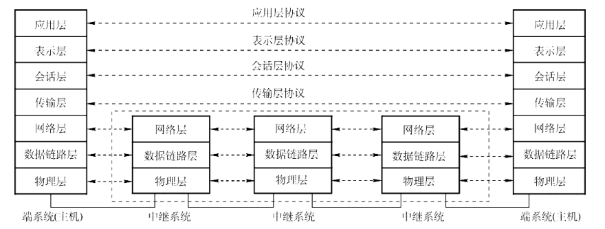
      - 物理层
        - 传输的单位是比特
        - 在物理介质上为数据端设备透明地传输原始比特流
        - 规定了通信链路上所传输的信号的意义和电气特征
      - 数据链路层
        - PDU 称为帧
        - 将物理层提供的可能出错的物理连接改为逻辑上无差错的数据链路
        - 会提供差错检测和流量控制
      - 网络层
        - PDU 称为数据报
        - 将 PDU 从源主机传输到目的主机
      - 传输层
        - 负责主机中两个进程之间的通信
        - 提供端到端的流量控制、差错控制、连接建立与释放、可靠传输管理等
      - 会话层
        - 会话：用户进程建立连接，并在连接上有序地传输数据
        - 会话层管理主机间的会话进程
      - 表示层
        - 处理在不同主机中交换信息的表示方式
        - 例如数据压缩、加密、解密
      - 应用层
        - 为特定类型的网络应用提供访问 OSI 的手段
    - TCPI/IP 模型 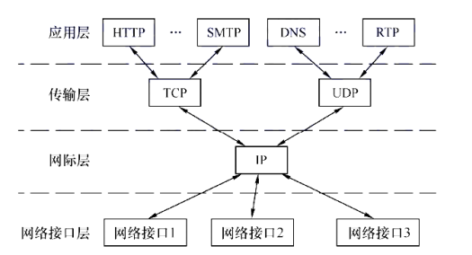
      - 网络接口层类似 OSI 的物理层和数据链路层
      - OSI vs TCP/IP 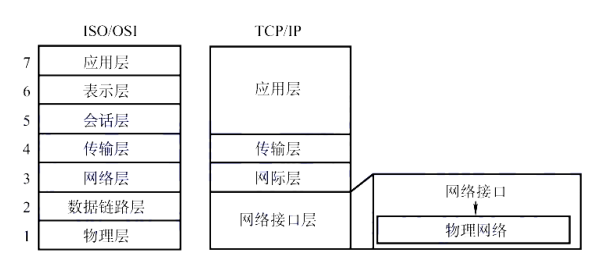
    - 注意
      - 端：指进程
      - 点：指主机
- 物理层
  - 通信基础
    - 基本概念
      - 数据、信号和码元
        - 数据指传送信息的实体
          - 模拟数据
            - 取值是连续的
          - 数字数据
            - 取值是离散的
        - 信号是数据的电气或电磁表项，即数据在传输过程中的存在形式
          - 模拟信号
            - 取值是连续的
          - 数字信号
            - 取值是离散的
        - 码元
          - 一个固定时长内的信号序列
            - 固定时长被称为码元宽度
          - 一码元可以携带若干比特的信息
            - 例如一码元 = 2 bit,则为 4 进制（可以表示 4 个数）
      - 信源、信道和信宿
        - 信源是产生和发送数据的源头
        - 信宿是接收数据的终点
        - 信道是信号的传输介质 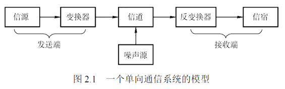
          - 一条双向通信信道包含一个发送信道和一个接收信道
          - 噪声源
            - 信道上的噪声以及分散在通信系统各处的噪声的集中表示
          - 转换器和反转换器
            - 实现从信道信号到输入端/输出端信号的编解码
          - 信道分类
            - 按传输信号形式分
              - 模拟信道：传输模拟信号
              - 数字信道：传输数字信号
            - 按传输介质分
              - 无线信道
              - 有线信道
            - 按信号是否调制分
              - 基带传输
                - 基带信号是由信源发出未经过调制的原始电信号
              - 宽带传输
                - 宽带信号：将基带信号进行调制，形成频分复用模拟信号，再送到信道上进行传输
        - 通信双方信息的交互方式
          - 单向通信
          - 半双工通信
            - 通信双方都可以发送或接收信息，但是任何一方都不能同时发送和接收消息
          - 全双工通信
            - 通信双方可同时发送和接收消息
      - 速率、波特与带宽
        - 速率：数据传输速率，表示单位时间内传输的数据量
          - 码元传输速率（波特率、调制速率）
            - 每秒传输的码元数，单位是波特 Baud
          - 信息传输速率（比特率）
            - 每秒传输的比特数，单位是 b/s
        - 带宽：信道所能传输信号的频率范围
          - 带宽 = 最高频率 - 最低频率
    - 信道的极限容量
      - 奈奎斯特定理（奈氏准则）
        - 码间串扰：接收端收到的信号波形失去了码元之间的清晰界限
        - 定理：在理想低通（没有噪声、带宽有限）信道中，为了避免码间串扰，极限码原传输速率为 2W 波特
          - W 是信道的频率带宽（单位为 Hz）
        - 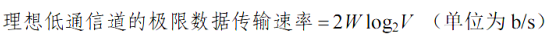
          - W 是信道的频率带宽（单位为 Hz）
          - V 是一个码元可以表示多少种不同的数字（进制数）
        - 带宽越高，传输码元的能力越强；提高每码元携带的 bit 数，可以提高数据传输效率
      - 香农定理
        - 香农定理给出了有高斯噪声干扰的信道的极限数据传输速率，当用该速率传输数据时，不会产生误差
        - 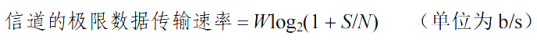
          - W 是信道的频率带宽（单位为 Hz）
          - S 为信道内所传输信号的平均功率
          - N 为信道内的高斯噪声功率
          - S/N 为信噪比
            - 分贝记法的信噪比 = 10 * log10(S/N) dB
            - 带入公式计算的信号比无单位
        - 结论
          - 信噪比越大，信息的极限传输速率越高
          - 只要信息传输速率低于信道的极限传输速率，就能找到某种方法实现无差错的传输
    - 编制与调制
      - 编码：将数据转换为数字信号的过程 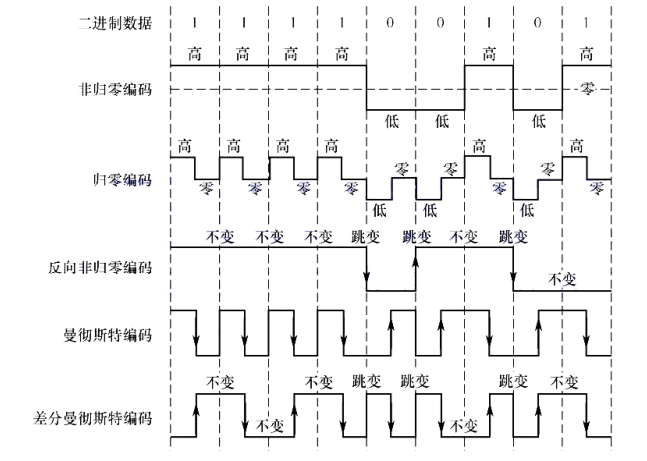
        - 归零（RZ）编码
          - 用高电平表示 1，低电平表示 0（或者相反）
          - 每个码元的中间均跳变到零电平（归零）
            - 为双发提供了时钟同步机制
          - 接收方根据跳变调整自己的时钟基准
        - 非归零编码
          - 因为没有同步机制，需要双方都带有时钟线
        - 反向非归零（NRZI）编码
          - 用电平的跳变表示 0、电平保持不变表示 1
          - 信息的表示在“边沿”
        - 曼彻斯特编码
          - 每个码元中间都发生电平跳变，电平跳变既可以用于同步，又可作为数据信号
          - 可用向下跳变表示 1，向上跳变表示 0.。或者相反
          - 标准以太网使用此编码
        - 差分曼彻斯特编码
          - 每个码元中间都发生电平跳变，但是跳变仅表示时钟信号，不表示数据
          - 数据的表示在“边沿”
            - 每个码元的开始处有跳变表示 0，无跳变表示 1
      - 模拟数据编码为数字信号
        - 1\. 采样：对模拟信号进行周期性扫描，将时间上连续的信号变成时间上离散的信号
          - 根据奈奎斯特定理，采样频率必须大于等于模拟信号最大频率的 2 倍
        - 2\. 量化：将采样得到的电平幅值按照一定的分级标度转换为对应的数值并取整
        - 3\. 编码
      - 调制：将数据转换为模拟信号的过程 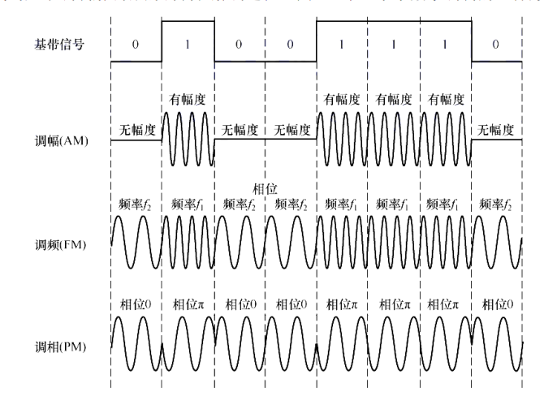
        - 调幅（AM）/幅移键控（ASK）
          - 改变载波的振幅来表示数字信号 1 或 0
          - 抗干扰能力差
        - 调频（FM）/频移键控（FSK）
          - 改变载波的频率来表示数字信号 1 或 0
        - 调相（PM）/相移键控（PSK）
          - 该表载波的相位来表示 1 或 0
        - 正交幅度调制（QAM）
          - 在频率相同的前提下，将 AM 和 PM 结合起来，形成叠加信号
          - 数据传输速率 
  - 传输介质
    - 分类
      - 导向传输介质
        - 电磁波被导向为沿固体介质传播
      - 非导向传输介质
        - 例如空气、水、真空等
    - 双绞线 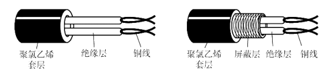
      - 在局域网和传统电话网中普遍使用
      - 当传输距离太远时，对于模拟传输，需要使用放大器放大衰减的信号；对于数字传输，要用中继器对失真的信号进行整形
    - 同轴电缆 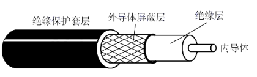
      - 因为具有外导体屏蔽层，所有具有良好的抗干扰特性
      - 一般分为 2 类 
    - 光纤 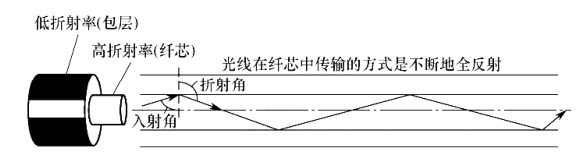
      - 有光脉冲表示 1,无光脉冲表示 0
      - 可见光的频率为 10^8 MHz,所以光纤的带宽极大
      - 光波通过光纤进行传导
      - 多模光纤：利用光的全反射特性，可以让从不同角度入射的多条光线在同一根光纤中传输 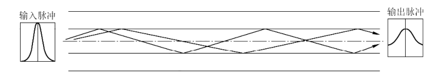
      - 单模光纤：光纤的直径减小到只有一个光的波长，可使光线一直向前传播，而不产生多次反射 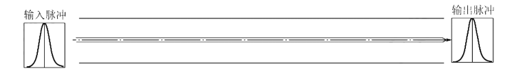
        - 适合远距离传输而不需要中继器
    - 无线传输介质
      - 无线电波
        - 如 WLAN
        - 无线电波可以沿所有方向传播
      - 微波、红外线、激光
        - 需要在发送方和接收方之间有一条视线通道，有很强的指向性
        - 红外线和激光先将输入信号转换为红外线信号和激光信号，再进行传播
        - 微波 
          - 卫星通信使用地球同步卫星作为中继站来转发微波信号
    - 物理层的主要任务是确定与传输介质的接口相关的一些特性（物理层接口特性）
      - 机械特性
        - 指明接口所用接线器的形状和尺寸、引脚数量......
      - 电气特性
        - 指明接口电缆的各条线上的电压范围、传输速率和距离限制
      - 功能特性
        - 指明某条线上出现某一电平的意义以及每条线的功能
      - 过程特性（规程特性）
        - 指明不同功能的各种可能事件的出现顺序
  - 物理层设备
    - 中继器
      - 用于放大、整形并转发信号
      - 可以消除信号经长段电缆后发生的失真和衰减
      - 其原理是信号再生，而不是简单地放大信号
    - 集线器（Hub）
      - 实质上是一个多端口的中继器
      - 一个端口的输入信号被整形放大之后，发送到所有处于工作状态的端口
        - 若同时有多个输入，则将导致这些数据都无效
        - 所以，只能在半双工的状况下工作
- 数据链路层
  - 基础概念
    - 链路（物理链路）
      - 从一个节点到相邻节点的一段物理线路
    - 数据链路（逻辑链路）
      - 数据链路 = 链路 + 协议
    - 帧
      - PDU
      - 包含头部和数据部分
    - 最大传送单元
      - 帧的数据部分的最大长度
    - 透明传输
      - 无论什么样的 bit 组合的数据，都能够按照原样地在这个数据链路上传输
  - 组帧/封装成帧
    - 1\. 字符计数法 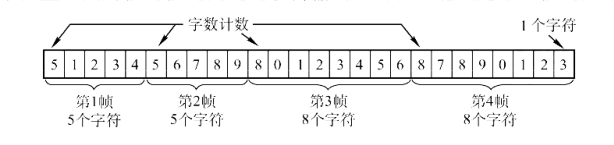
      - 在帧首部用一个计数字段来记录帧所包含的字节数（包括计数字段所占的字节）
    - 2\. 字节填充法 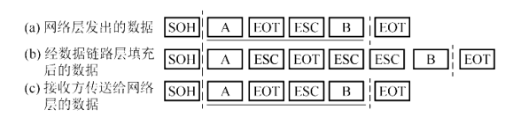
      - SOH 表示开始，EOT 表示结束
      - 使用特定字符来定界一帧的开始与结束
      - 为使信息区域出现的特殊字符不被判定为特殊字符，需要在该字符前加上 ESC 字符（单个 ESC 字符，而不是 3 个） 进行转义
    - 3\. 零比特填充法
      - 使用一个特定的比特串 01111110 来标识一个帧而开始和结束
      - 为使 01111110 不在数据区域出现，数据区域每出现 5 个连续的 1 就在其后插入一个 0，使其不会出现 6 个连续的 1；接收方每发现 5 个连续的 1 就删除后面紧跟的 0
      - 很容易使用硬件来实现，性能优于字节填充法
    - 4\. 违规编码法
      - 使用编码方法的违规编码来界定
        - 曼彻斯特编码方法将 1 编码为“高-低”电平对，将 0 编码为 “低高”电平对，而对“高高”和“低低”电平对没有定义，因此可以用来进行帧定界
  - 差错控制（仅针对比特差错）
    - 差错控制使用编码技术实现
    - 编码技术可分为 2 类：检错编码和纠错编码
      - 检错编码只能发现错误，而不能纠正。通常和自动重传请求 ARQ配合使用
      - 纠错编码既能发现错误，又能确定错误的位置并纠正。通常配合前向纠错（FEC）使用
    - 检错编码
      - 1\. 奇偶检验码
        - 由 n - 1 位数据和 1 位检验位组成
        - 检验位的取值将使得整个编码中，含奇数或偶数个 1
        - 例如 
      - 2\. 循环冗余编码 CRC
        - 1\. 双方约定一个生成多项式 G(x)，G(x) 的最低位必须为 1
          - k 位位串可以视为阶数为 k - 1 的多项式的系数序列 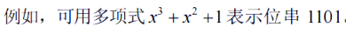
        - 2\. 发送方基于要发送的数据和 G(x)，计算出冗余码，将冗余码附加到数据后面一起发送
          - 1\. G(x) 是提前给出的，假设它的阶数为 r
            - 阶数 r = 二进制位数 - 1
          - 2\. 在原始数据 M 的二进制数后面添上 r 各 0，相当于 M * 2^r
          - 3\. CRC = M * 2^r % G(x)
            - 其中，加法不进位，减法不借位
          - 例如，M = 101001, G(x) = 1101 (r = 3) 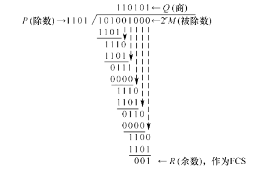
            - CRC = 001
        - 3\. 接收方接收到数据和冗余码，通过 G(x) 来计算受到的数据和冗余码是否产生差错
          - 带有检验码的完整帧如果正确，则其能够刚好被 G(x) 整除
    - 纠错编码
      - 码距（海明距离）
        - 两个码字对应位置取值不同的比特数量
        - 码距的计算方法：将来那个位串（码字）进行异或运算后得到的结果中 1 的个数
        - 例如，结果中有 2 个 1,所以码距为 2 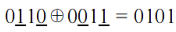
        - 编码集的码距
          - 在一个编码集中，任意两个码字的码距的最小值
        - 编码方案的检错能力与码距 l 的关系 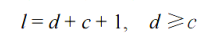
          - d 表示能够检测出错的位数，例如能够检测出 2 位出错
          - c 表示能够纠错的位数
          - 考虑 c = 0 或 d = c 2 种边界情况 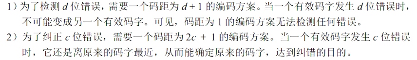
      - 海明码
        - 具有 1 位纠错能力
        - 编码过程（假设要编码的数据为 1010）
          - 1\. 确定海明码的位数
            - 设数据区域有 n 位，检验位有 k 位
            - 2^k 表示 k 位检验位能表示的状态数，具有 n + k 种出错的状态，且具有 1 种正确的状态，故而总共有 n + k + 1 种状态 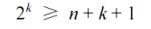
            - 例： 1010 占 4 位，因为 4 + 3 + 1 &lt;= 2^3,故而 n = 4, k = 3
          - 2\. 确定检验位的分布
            - 设数据区域为 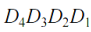
            - 设检验位为 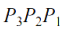
            - 设对应的海明码为 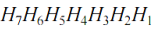
            - 规定检验位 Pi 在海明号为 2^(i - 1) 的位置上，其余位为信息位 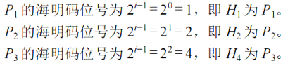
              - 因此得到海明码的各位分布 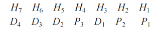
          - 3\. 分组以形成检验关系
            - 每个数据位用多个检验位来进行检验，但是要满足：被检验数据位的海明位号等于检验该数据位的各检验位海明位号之和 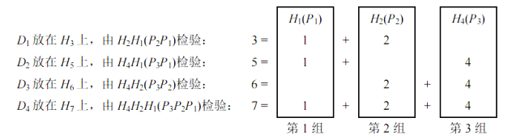
          - 4\. 计算检验位
            - 检验位 Pi 的值 = 该检验位检验的所有数据位取异或 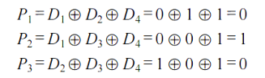
            - 所以，1010 得到海明码为 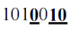
          - 5.检验过程
            - 如果 S3S2S1 的值为 “000”，则说明无错，否则该数所代表的含义为出错的位号 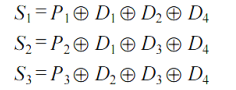
  - 流量控制与可靠传输机制
    - 流量控制
      - 指接收方控制发送方的发送速率，使接收方有足够的缓冲空间来接收每个帧
      - 1\. 停止-等待流量控制
        - 发送方每次之允许发送一个帧，接收方每接收一个帧都要反馈一个确认信号，表示可以接收下一帧，发送方接收到确认信号后才发送下一个帧，否则就持续等待
      - 2\. 滑动窗口流量控制
        - 发送窗口：由发送方维护，表示一组连续的允许发送帧的序号 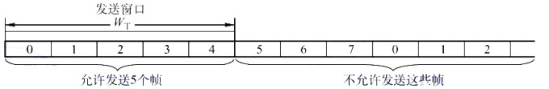
          - 发送方每接收到一个按序确认的确认帧，就将发送窗口向前移动一个位置
          - 有新序号落入发送窗口时，发送窗口内的数据帧可以继续发送，当窗口内没有可以发送帧时，发送方停止发送
        - 接收窗口：由接收方维护，表示一组连续的允许接收帧的序号
          - 接收方只接收位于接收窗口内的帧，成功接收后，返回一个确认；若是位于接收窗口外，则丢弃该帧
    - 可靠传输机制
      - 1\. 停止-等待协议
        - 可视为接收窗口和发送窗口均为 1 的滑动窗口
        - 如果数据帧出错或丢失
          - 发送方设置计时器，如果计时器超时，还没有收到确认帧，则重发该帧
        - 如果确认帧出错或丢失
          - 发送方会重传帧，而接收方会丢弃该帧，并重新发送一个确认帧
        - 接收方和发送方都需要设置缓冲区
          - 发送方用于超时重传，接收方用于判断是否是重传帧
        - 帧的序号可以是 0、1、0、1、.... 所以，序号位只需要 1 bit
      - 2\. 后退 N 帧协议（GBN）
        - 发送方将发送窗口内的多个数据帧全部发送出去
          - 每发送一个帧，就需要为该帧设置一个计时器
        - 发送方发送 N 个数据帧之后，若发现 N 个帧的前一个帧还没有受到确认信息，则判断该帧出错或丢失
          - 此时，发送方重传该帧后后面的 N 个帧
        - 接收方只按顺序接收帧（可看作接收窗口大小为 1）
          - 累计确认：接收方不需要每收到一个正确的数据帧就立即发回一个确认帧，而是连续收到多个正确的帧之后，对最后一个数据帧发回一个确认信息
        - 注意 
      - 3\. 选择重传协议（SR）
        - 在 GBN 的基础上，发送方只重传出现差错和计时器超时的数据帧
          - 为了使发送方能够只重传出错的帧，接收方不能再使用累计确认，而是要进行逐一确认
          - 接收方一旦检查到某个数据帧出错，就向发送方发送一个否定帧 NAK,要求发送方立即重传 NAK 指定的数据帧
        - 接收方为了能缓存乱序到达的数据帧，需要扩大接收窗口的容量。
        - 窗口的大小 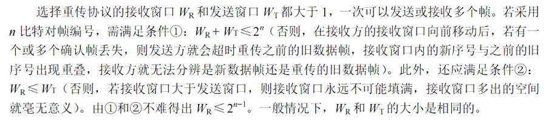
      - 信道利用率
        - 发送方的发送时延 T_D = 分组长度 / 数据传输速率
        - 接收方发送确认分组的发送时延 T_A
        - 则信道利用率 U 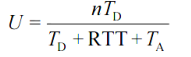
          - 其中，n 为发送方可以连续发送的分组数量
  - 介质访问控制（Medium Access Control, MAC）
    - 信道划分介质访问控制
      - 分配时间或者频率等来复用信道
        - 复用是指：发送端把多个发送方的信号组成在一条物理信道上进行传输，接收端把收到的复用信号分离出来
      - 1\. 时分复用（Time Division Multiplexing, TDM） 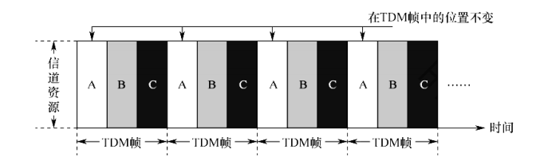
        - 每个用户在每个 TDM 帧中占有固定序号的时隙，每个用户所占用的时隙周期性地出现（这个周期就是 TDM 的长度）
        - TDM 在某个用户不需要发送数据的时候也会分配该用户的时隙，所以，会导致信道利用率较低
        - 统计（Statistic）分时复用（STDM）（异步时分复用）
          - 不固定分配时隙，而是按需分配时隙
            - 当用户有数据要传送时，才会分配时隙
      - 2\. 频分复用（FDM） 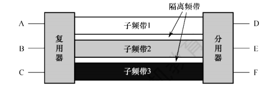
        - 将信道的总频带划分为多个子频带，每个子频带作为一个子信道，每对用户使用一个子信道进行通信
        - 为了防止子信道之间相互干扰，还要在子信道之间加入“隔离频带”
      - 3\. 波（Wavelength）分复用（WDM）
        - 即光的频分复用
        - 在一个光纤中传输多种波长（频率）的光信号
        - 使用光分用器将各路波长分解出来
      - 4\. 码（Code）分复用（CDM）/码分多址（CDMA）
        - 使用编码来区分不同的发送方
        - 既共享信道的频率，也共享时间
        - 将 1 个 bit 使用一个m 位码片（Chip）表示
          - 每个共享信道的一方都被分配了不同且唯一的码片序列
            - 规格化内积
              - 向量的内积除以向量的维数
            - 这些不同方的码片序列（向量）满足 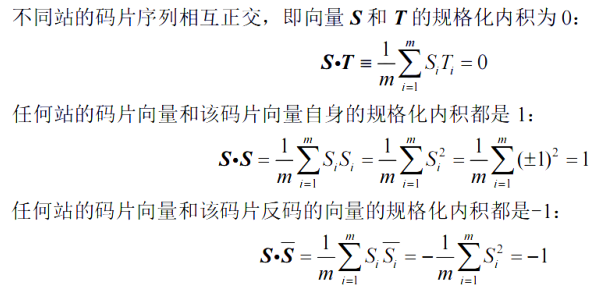
          - 例如 bit 0 可用 +1 +1 +1 -1 -1 +1 -1 -1 来表示，对应的 bit 1 可用 -1 -1 -1 +1 +1 -1 +1 +1 来表示
            - m = 8
            - bit 1 对应的码片作为该方的码片序列
            - bit 0 为码片序列的按位相反数
        - 当多方同时发送的时候，将它们的码片按位相加
          - 例如 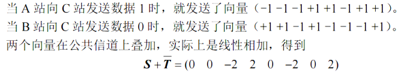
        - 接收方收到相加后的码片序列（S + T把) 之后，只需要知道发送方的码片序列就可以得到对应的 bit 是 0 还是 1
          - 将发送方的码片序列和 （S + T把）进行规格化内积，若结果为 1, 则表示 bit 1，若结果为 -1, 则表示 bit 0
    - 随机访问介质访问控制
      - 不采用集中控制方式解决发送信息的次序问题，每个用户都能根据自己的意愿发送信息，占用信道的全部速率
        - 多个用户共同争用信道，胜利者获得信道的发送权
      - 1\. ALOHA 协议
        - 纯 ALOHA 协议
          - 发送方不进行任何检测就直接发送数据，如果一段时间内未收到确认，则就认为传输过程中发生了冲突，发送方等待一段随机时间之后再发送数据，直至发送成功
          - 吞吐量很低
        - 时隙 ALOHA 协议
          - 同步各站点的时间，将时间划分为一段段等长的时隙（slot），站点只有在每个时隙的开始时才能发送帧，发送一帧的时间必须小于等于时隙的长度
          - 如果一段时间内未收到确认，则就认为传输过程中发生了冲突，发送方等待一段随机时间之后再发送数据，直至发送成功
      - 2\. 载波监听多路访问 CSMA 协议
        - 1-坚持 CSMA
          - 当站点要发送数据时，首先监听信道
            - 若信道空闲，则立即发送数据
            - 若信道忙，则继续监听直至信道空闲
          - “坚持”是指监听到信道忙时，继续监听信道
          - “1”是指监听到信道空闲时，立即发送帧的概率为 1
        - 非坚持 CSMA
          - 与 1-坚持 CSMA 的唯一不同是：若信道忙，则等待一个随机的时间后，再重新监听
          - 降低了多个站点等待信道空闲后同时发送数据导致冲突的概率
        - p-坚持 CSMA
          - 只适用于时分信道
          - 当站点要发送数据时，首先监听信道
            - 若信道空闲，则以概率 p 发送数据，1 - p 的概率推迟到下一个时隙再监听后发送
              - 降低了多个站点检测到信道空闲同时发送的概率
            - 若信道忙，则继续监听直至信道空闲
              - 解决非坚持 CSMA 因随机等待而造成的延迟时间较长的缺点
      - 3\. CSMA/CD（CD ：冲突检测） 协议
        - 适用于总线型网络或半双工网络
        - CSMA 检测到信道空闲后，发送数据，但是发送的过程中，也同时监听信道，若检测到信道上的电压变化超过了某个阈值，则说明发生了冲突，立即停止发送数据，使用截断二进制指数退避算法来确定重传的时机
          - 由于存在传播时延，当发送站点经过端到端时延的 2 倍时间之后仍然没有检测到冲突，则说明此次发送没有发生冲突
          - 端到端时延的 2 倍被称为争用期
            - 10Mbps 以太网规定 51.2us 为争用期的长度
          - 最短帧长（以太网规定为 64B）
            - 指在争用期内可以发送的数据量。因此有 
            - 以太网规定帧的大小大于等于最短帧长
            - 当接收方收到了小于最短帧长的帧，则说明该帧是因为冲突导致了不完整，拒绝该帧
            - 如果最短帧长为 64B,若发送方发送了 64B 之后仍然没有检测到冲突，则说明它已经成功抢占了该信道，可以继续发送
              - 若发生冲突，则一定在发送前 64B 期间（因为是争用期）
          - 截断二进制指数退避算法
            - 1\. 确定基本的退避时间
              - 一般为争用期
            - 2\. 从离散的整数集合 { 0, 1, 2, 3, 4, ...., (2^k - 1) } 中随机取出一个数记为 r
              - 重传推迟的时间为 r 倍争用期
              - k = min{ 重传次数， 10 }
            - 3\. 若重传次数达到 16 次还不成功，则说明网络太拥挤，则抛弃该帧向高层报告
        - “先听后发，边听便发，冲突停发，随机重发”
      - 4\. CSMA/CA（CA：冲突避免） 协议
        - CSMA/CD 用于有线连接的局域网，而无限局域网不能使用 CSMA/CD
          - 因为 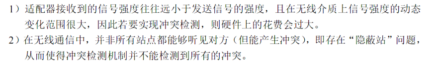
        - CSMA/CA 主要用于无限局域网，能降低冲突发生的概率，但是不能完全避免
        - 802.11 （wifi 标准）（使用 CSMA/CA）
          - 使用停止-等待可靠传输协议
          - 帧间间隔（InterFrame Space, IFS）：所有站检测到信道空闲后，还需要等待 IFS 时间才能发送帧
            - SIFS（短 IFS）
              - 最短的 IFS,用来分隔属于一次对话的各帧
              - 用于 ACK 帧、CTS 帧、分片后的数据帧以及所有回答 AP 探寻的帧
            - PIFS（点协调 IFS）
              - 中等长度的 IFS,在 PCF 方式中使用 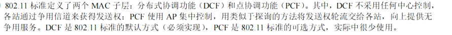
            - DIFS（分布式协调 IFS）
              - 最长的 IFS,在 DCF 方式下用来发送数据帧和管理帧
              - 大多数使用 DCF 方式，也是标准的默认方式
          - 虚拟载波监听机制
            - 让源站将其要占用信道的时间（包括目的站发回 ACK 帧所需的时间）通知给其他所有站
            - 使其他所有站在这一段时间内都停止发送。从而大大减少了冲突的概率
          - 退避算法/发送的时机
            - 若信道空闲且要发送的数据帧是第一个数据帧
              - 等待 DIFS 时间后发送
            - 若信道不空闲或者发送下一帧或者重发帧，则等待 DIFS 时间后使用退避算法
              - 退避算法与 CSMA/CD 的不同是随机整数的范围
              - 随机整数的范围是，其中，最大值为 255,而不是 CSMA/CD 的 1023 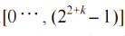
                - 退避时间 = 随机整数 * 争用期
          - 处理隐蔽站问题：RTS 和 CTS 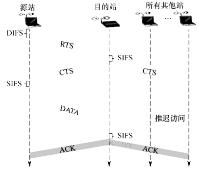
            - 隐蔽站问题 
              - A 和 B 都可以看到 AP,但是 A 和 B 互相看不见
              - 当 A 和 B 检测到 AP 信道空闲时，都向 AP 发送数据，导致冲突发生。这就是隐蔽站问题
            - 1\. 源站发送数据之前，先监听信道，若信道空闲，则等待 DIFS 之后，广播一个请求发送 RTS（Request To Send）控制帧，包括源地址、目的地址和这次通信所持续的时间
              - RTS 中的时间为目的站收到 RTS 帧开始，到目的站发送完 ACK 帧所需的时间
                - SIFS + CTS + SIFS + 数据帧 + SIFS + ACK
                - RTS 到达目的站之后，信道忙的时间
            - 2\. 若 AP 正确收到 RTS,且信道空闲,则等待 SIFS 之后，广播一个允许发送 CTS（Clear To Send）控制帧
              - AP 覆盖范围内的其他站收到 CTS 帧后，将在 CTS 帧中指明的时间内抑制发送
                - CTS 中的时间是从发送收到 CTS 帧后，到目的站最后发送完 ACK 帧为止的时间
                  - SIFS + 数据帧 + SIFS + ACK
                  - CTS 到达源站之后信道忙的时间
                - 其他站根据 CTS 中的时间设置自己的网络分配向量（NAV），NAV 的值表示信道忙的持续时间。
                  - 其他站点不能在这段信道忙的时间内发送数据
                - CTS &lt; RTS
              - 所以，CTS 可以达到 2 个作用
            - 3\. 源站收到 CTS 帧后，等待 SIFS，则发送数据帧
            - 4\. AP 接收到源站发送来的数据之后，等待 SIFS 之后发送 ACK 给源站
            - RTS 和 CTS 标准不要求强制实行，而是可选的
    - 轮询访问：令牌传递协议
      - 通过一个集中控制的监控站，以循环的方式轮询每个节点，再决定信道的分配
      - 令牌传递协议要求节点之间构成一个逻辑上的环形通路
      - 令牌传递过程
        - 1\. 当网络空闲时，环路中只有令牌帧在循环传递
        - 2\. 当令牌传递到有数据要发送的节点时，该节点修改令牌中的一个标志位，并在令牌中附加自己需要传输的数据，将令牌变为一个数据帧，然后将该数据帧（令牌）发送出去
        - 3\. 数据帧沿环路传输，接收到的站点一边转发数据，一边查看真的目的地址，若目的地址是自己，则该站复制该数据帧，以便进一步处理
        - 4\. 数据帧沿环路传输，直到到达该帧的源站点，源站点受到自己发出的帧后不再转发。检查是否出现差错，若出错，则重传
      - 适合负载很高，同时有多个节点发送的概率很高的信道
  - 局域网（LAN）
    - IEEE 802 标准将数据链路层拆分为 2 个子层
      - 逻辑链路控制层（LLC）
        - 向网络层提供无确认无连接、面向连接、带确认无连接、高速传送 4 种不同的连接服务类型
        - 由于以太网占据主导地位，现在 LLC 已经名存实亡。（只需要实现一种的话，就不需要在提供一个统一的调用层了）
      - 介质访问控制层（MAC）
        - 与接入介质有关的内容都放到 MAC 子层
        - 屏蔽了各种物理层的差异
    - 帧的分类
      - 单播帧（一对一）
      - 广播帧（一对全体）
      - 多播帧（一对多）
    - 以太网 IEEE 802.3
      - 以太网采用无连接的工作方式
        - 既不对数据帧进行编号，也不要求接收方发送确认
        - 尽全力进行交付
      - 发送的数据都使用曼彻斯特编码信号
        - 每个码元之间出现一次电压转换，实现双方的时钟同步
      - 以太网的传输介质 
        - 10 表示 10MB/s
        - T 表示双绞线
        - F 指光纤
      - 网络适配器（Adapter）/网络接口卡（NIC）
        - 适配器中有处理器和存储器，在数据链路层进行工作
        - 适配器接收到正确的帧时，就使用中断来通知计算机
        - 负责完成帧的封装与拆封、发送与接受、介质访问控制、数据的编解码和数据缓存等功能
      - MAC 地址（物理地址）
        - 固化在适配器的 ROM 中，全球唯一
        - 长 6 字节 48 bit
          - 高 24 位为厂商代码，低 24 位是由厂商分配的序列号
        - 使用 MAC 地址标识适配器的某个接口
      - 以太网 MAC 帧 
        - 前导码（8B）
          - 前 7 个字节是前同步码
          - 最后一个字节是帧开始定界符
            - 不需要使用帧结束定界符，因为每个以太网帧之间都有一定的时隙
        - 目的地址（6B）
          - 帧在局域网中目的适配器的 MAC 地址
        - 源地址（6B）
          - 帧在局域网中源适配器的 MAC 地址
        - 类型（2B）
          - 指出数据应该被交付给哪个上层协议处理
        - 数据（46～1500B）
          - 若分组大于 1500 字节，则必须进行分片
          - 若分组小于 46 字节，则在数据的后面填充字段 
        - 检验码 FCS （4B）
          - 32 位 CRC 检验码
          - 目的地址、源地址等头部信息都参与了运算
      - 高速以太网（速率 &gt;= 100Mb/s） 
    - IEEE 802.11 无线局域网
      - 有固定基础设施无线局域网
        - 无限局域网的最小构件——基本服务集（BBS）
          - 包括若干个接入点和若干移动站
          - BBS 所覆盖i的地理范围被称为基本服务区（BSA）
          - BBS 可以通过分配系统（DS）连接到其它 BBS，构成一个扩展服务集（ESS）
            - ESS 可通过 Portal（门户）为无线用户接入到有线连接的以太网
        - 使用星形拓扑，称中心为接入点（Access Point, AP）
          - 与 BBS 内或 BBS 外站通信都需要经过 AP
          - 安装 AP 时，必须为其分配一个不超过 32 字节的服务集标识符（SSID）和一个信道
            - SSID 指该 AP 的无线局域网名称
        - 漫游
          - 终端设备在不同 ESS 的 AP 之间切换连接的过程
        - MAC 使用 CSMA/CA 协议
      - 无固定基础设施自组织网络
        - 没有 AP，而是由多个平等状态的移动站相互通信组成的临时网络 
          - 各节点之间地位平等，中间节点都为转发节点
      - MAC 帧
        - 数据帧 
          - 前 3 个地址
            - 取决于帧控制字段中的去往 AP 和来自 AP
              - 去往 AP 标志位表示此帧是否是发送 AP 的
              - 来自 AP 标志位表示此帧是否是来自 AP 的
            - 最常用的 2 种 
              - 地址 1 都是直接接收地址
              - 地址 2 都是直接发送地址
          - 地址 4 用于自组网络
          - 持续期字段用于实现 CSMA/CA 的预约信道功能
          - 帧控制字段
            - 类型字段用于区分不同帧：控制帧/数据帧/管理帧
            - 子类型字段用于区分每种帧的子类型
        - 控制帧
        - 管理帧
    - 虚拟局域网 VLAN
      - 可以将一个较大的局域网分割成一个较小的与地理位置无关的 VLAN
      - 3 种方式
        - 基于接口
          - 将交换机的若干接口划分为一个逻辑组
          - 若主机离开了原来的接口，则可能进入一个新的子网
        - 基于 MAC 地址
          - 按 MAC 地址将一些主机划分为一个逻辑子网，当主机的物理位置从一个交换机移动到另一个交换机时，它仍属于原来的子网
        - 基于 IP 地址
          - 这样的 VLAN 可以跨越路由器进行扩展，将多个局域网的主机组成一个 VLAN
      - 802.3ac 标准定义了 VALN 的以太网帧格式的扩展
        - 在以太网帧的源地址字段和类型字段之间插入一个 4 字节的标识符，称为 VLAN 标签，用来指明发送该帧的计算机属于哪个 VLAN
        - 插入 VLAN 标签的帧称为 802.1Q 帧 
          - 插入 VLAN 之后，FCS 必须重新计算
      - 汇聚链路/干线链路：连接 2 个交换机接口之间的链路 
        - 在干线链路上传送的帧是 802.1Q 帧，因为可能有多个交换机上具有相同的 VLAN
  - 广域网（Wide Area Netword, WAN）
    - WAN 的覆盖范围通常超过一座城市
    - 连接广域网各节点交换机的链路都是高速链路
    - 局域网可以通过广域网与另一个相隔很远的局域网通信 
      - 局域网 vs 广域网 
    - 点对点协议（Point-to-Point Protocol, PPP）
      - PPP 用于和 ISP 通信或者两台网络设备之间的直连专用线路
      - PPP 的 3 个组成部分
        - 1\. 链路控制协议（LCP）
          - 用来建立、配置、测试数据链路连接，以及协商一些选项
          - 例如向 ISP 提供必要的信息
        - 2\. 网络控制协议（NCP）
          - 为每个不同的网络层协议使用不同的 NCP 来配置，为网络层协议建立和配置逻辑连接
        - 3\. 将 IP 数据报封装到串行链路的方法
          - PPP 帧受到最大传送单元 MTU 的限制
      - 帧格式 
        - 首部和尾部的标志字段（规定为 0x7E 01111110）用于表示开始和结束
          - 当使用同步传输时，使用零比特填充法来实现透明传输
          - 当使用异步传输时，使用字节填充法，即插入转义字符 0x7D 来实现
        - 地址字段（A）占 1 字节，规定为 0xFF
        - 控制字段（C）占 1 字节，规定为 0x03
        - 协议占 2 字节
          - 表示信息部分运载的是什么种类的分组
          - LCP 的分组对应的类型为 0xC021
        - 信息部分
          - 长度为 0~1500
          - 因为 PPP 是点对点的，所以不需要使用 CSMA/CD，所以，没有最短帧长的限制，故而最短帧长可以为 0
        - FCS
          - CRC 检验码
      - 例如用户拨号接入 ISP 
        - 过程描述 
      - PPP 是不可靠服务
      - PPP 只支持全双工点对点链路，而不支持多点链路
      - PPP 两端可以运行不同的网络层协议，但仍可以使用同一个 PPP 来进行通信
  - 数据链路层设备
    - 网桥
      - 网桥可以扩展以太网，并将一个以太网称为一个网段
      - 网桥不会将 2 个冲突域合并成一个大的冲突域
        - 冲突域：在以太网中，共享信道的所有设备共同组成一个冲突域。表示会发生信号碰撞的范围
        - 这是因为网桥具有识别帧和转发帧的能力
        - 网络 A 和网络 B 通过网桥连接后，网桥会丢弃网络 A 发送网络 A或者网络 B 发往网络 B 的帧，因为这些帧不需要经过网桥
    - 以太网交换机（二层交换机）
      - 实质上是一个多接口的网桥，能够将网络分成小的冲突域，为每个用户提供更大的带宽
      - 交换机的特点
        - 1\. 接口直接与主机或其它交换机连接时，通常都以全双工方式工作
        - 2\. 交换机具有并行性，能同时连通多对接口，所以不需要 CSMA/CD 协议
        - 3\. 当交换机与集线器连接时，只能使用 CSMA/CD 协议，且以半双工方式工作
        - 4\. 交换机是一种即插即用设备，帧转发表是自学习算法生成的
        - 5\. 因为使用专用交换结构芯片，交换速率较高
      - 2 种交换模式
        - 直接交换方式
          - 接收到帧的同时立即按帧的目的 MAC 地址决定转发接口
          - 优点：快
          - 缺点：不检查差错，不能适用于速率匹配、协议转换、差错检测的线路
        - 存储转发交换方式
          - 缓存接收到的帧
        - 注意：交换机一般都具有多种速率的接口。例如 10Mb/s、100Mb/s 的接口，以及多速率自适应接口
      - 交换机的自学习算法
        - 过滤：决定一个帧是转发还是丢弃
        - 转发：决定一个帧应被移至哪个接口
        - 过滤和转发的实现依靠于交换表（switch table）
          - 交换表的一个表项至少包括：一个 MAC 地址和连通该 MAC 地址的接口
          - 若某个帧 F 从某个接口 A 进入交换机，则在交换表中查找帧 F 中的目的 MAC 地址所对应的接口
            - 若找到，则将该帧转发到对应的接口
            - 若找不到，则将帧 F 的源 MAC 地址和 A 接口关联起来，插入一个表项，并向其他接口广播该帧
- 网络层
  - 网络层的功能
    - 网络层只向上提供简单灵活的、无连接的、尽最大努力交付的数据报服务
    - 网络互连：将 2 个以上的网络通过中继系统互连起来，形成更大的网络系统
      - 物理层中继系统：转发器，集线器
      - 数据链路层中继系统：网桥和交换机
      - 网络层中继系统：路由器（也称为网关）
      - 网络层以上的中继系统：网关
    - 路由选择
      - 根据路由协议构造路由表，经常或定期地与相邻路由器交换信息，获取网络的最新拓扑，动态更新维护路由表
    - 分组转发
      - 根据转发表将分组从合适的端口转发出去
      - 转发表由路由表得出
    - 面向连接的虚电路（Virtual Circuit, VC）服务
      - 在虚电路方式中，连接一旦建立，就固定了虚电路所对应的物理路径
      - 通信过程
        - 虚电路建立
          - 将未使用过的虚电路号 VCID分配给该虚电路
          - 分组的首部仅在连接建立时使用完整的目的地址，之后的每个分组的首部只需携带这条虚电路的编号即可
          - 虚电路网络中的每个节点上都维持一张虚电路表
            - 表项的内容为接受链路和发送链路的虚电路号、前一个节点和下一个节点的标识
            - 是在虚电路建立过程中确定的
          - A 与 B 建立虚电路的过程
            - A 发送“呼叫请求“分组给 B
            - B 发送”呼叫应答“分组予以确认
        - 数据传输
          - 虚电路提供了可靠的通信服务
        - 虚电路释放
          - A 发送“释放请求”分组来拆除虚电路，逐段断开整个连接
      - 缺点：当某一个节点故障时，经过该节点的虚电路都会遭到破坏；对于小分组的来说，连接的建立与拆毁显得时间开销有点大
    - 面向无连接的数据报服务
      - 将高层协议的报文拆分成若干较小的数据段，并加上地址等控制信息后构成分组
      - 中间节点存储分组很短一段时间，找到最佳的路由之后，尽快转发每个分组
      - 优点：网络的造价降低、运行方式灵活、能够适应多种应用
      - 虚电路 vs 数据报 
    - SDN
      - 将网络层抽象地划分为数据平面（转发平面）和控制平面
        - 数据平面实现转发功能
        - 控制平面实现路由选择功能
        - 控制平面利用控制-数据接口对数据平面上的路由器进行集中式控制
      - SDN 采用集中式的控制平面和分布式的数据平面
      - 控制平面上有一个逻辑上的远程控制器 
        - 远程控制器掌握各个主机和整个网络的状态，为每个分组计算出最佳路由
        - 通过 Openflow 协议将转发表（SDN 中称为流表）下发给路由器
        - 对上层应用的开发者，SDN 提供的编程接口称为北向接口
        - SDN 控制器和转发设备建立双向会话的接口称为南向接口
          - Openflow 协议归类为南向接口协议
          - 通过不同的南向接口协议，SDN 控制器可以兼容不同的硬件设备
        - SDN 控制器集群内的内部控制器之间的通信接口称为东西向接口，用于增强整个控制平面的可靠性和可拓展性
    - 拥塞控制
      - 拥塞：因过量分组而引起网络性能下降的现象
      - 2 种方法
        - 开环控制
          - 设计网络时事先将有关发生拥塞的因素考虑周到，力求网络在工作时不产生拥塞
        - 闭环控制
          - 事先不考虑有关发生拥塞的各种因素，采用检测网络系统去监视，及时检测哪里发生了拥塞，然后将拥塞信息传到合适的地方
  - IPv4
    - 分组格式 
      - 版本
        - 4 bit,IP的版本
        - IPv4 的值为 4
      - 首部长度
        - 4 bit
        - 以 4B 为单位
        - 最常用的首部长度为 20B,所以其值为 5
      - 总长度
        - 首部 + 数据的长度，单位为字节
        - 总长度不应该超过 MTU
      - 标识
        - 16 bit,是一个计数器，每产生一个数据报就加一
        - 当数据报被分片之后，每个分片的标识都是一样的
      - 标志（Flag）
        - 3 bit
        - 最低位为 MF，标识是否后面还有分片
        - 第二位 DF (Don't Fragment) 表示是否不允许分片
        - 最高位没有意义
      - 片偏移
        - 13 bit
        - 在分片后，某片在原数据报中的相对位置
        - 以 8B 为单位
      - 生存时间 TTL
        - 8 bit
        - 数据报在网络中可通过的路由器数的最大值
        - 确保了数据报不会永远在网络中循环
        - 路由器转发前，TTL -= 1,若 TTL 减一之后为 0,则丢弃
      - 协议
        - 8 bit
        - 标识数据报携带的数据使用的协议
    - 分片
      - 同一个分组的每个分片的标识都相同
      - 只有当 DF = 0 的时候才能分片
      - 最后一个分片的 MF = 0，前面的分片的 MF = 1
      - 注意，片偏移以 8B 为单位
    - IPv4 地址
      - 网络地址转换（NAT）
        - 使得整个专用网只需要一个全球 IP 地址就可以与互联网连通
        - 私有 IP 地址（可重用地址）
          - 10.0.0.0/8
          - 172.16.0.0/12
          - 192.168.0.0/16
        - 采用私有 IP 地址的互联网络称为专用互联网或本地互联网
        - NAT 路由器至少有一个有效的外部全球 IP 地址
          - 使用 {本地 IP 地址 : 端口} 到 {全球 IP 地址: 端口} 的映射
          - 其中，本地 IP 地址的端口就是真实的端口，而全球 IP 地址的端口由 NAT 路由器分配，并用此端口与全球设备进行通信
      - 分类 IP 地址 （早期互联网使用） 
        - 网络号标识主机/路由器所连接到的网络
          - 网络号在整个互联网范围内必须是唯一的
        - 主机号标识主机/路由器
          - 主机号在其网络号所指明的网络范围内唯一
        - 特殊 IP 地址
          - 主机号为 0 表示网络本身
          - 主机号全为 1 表示本网络的广播地址（直接广播地址）
            - 可以用于向别的网段内的网络广播，但是路由器默认不转发这种广播
          - 127.x.x.x 保留做本地软件回环测试，主机的进程件通信用
            - 主机不会将回环地址的 IP 数据报发送到任何网络
          - 0.0.0.0 表示本网络上的本主机
          - 255.255.255.255 表示受限广播地址，只在本网络上进行广播
        - 划分子网
          - 子网的划分是局域网内部的事，对外部来说，没有表现出没有划分子网
          - 子网号：从主机号中占据若干位来用作子网号 
            - 路由器转发的根据依然是 IP 数据报的目的网络号
            - 本单位的路由器接收到 IP 数据报之后，根据子网号找到目的子网，再把 IP 数据报交付给目的主机
            - 主机号全为 0 表示子网的网络地址；主机号全为 1 表示子网的广播地址
          - 子网掩码和默认网关
            - 子网掩码
              - 子网掩码用来指明分类 IP 地址的主机号部分被借用了多少位作为子网号
              - 子网掩码长 32 bit，与 IPv4 地址一一对应
              - 1 对应于 IP 地址的网络号及子网号，0 对应与主机号
              - 可以通过子网掩码来判定目的主机是否在子网中
                - 同属于一个子网的所有主机和路由器的相应端口的子网掩码都是相同的
              - 现代互联网标准规定，所有网络都必须使用子网掩码
                - 若一个网络为划分子网，则该网络的子网掩码就是默认子网掩码
                - 一台主机在设置 IP 地址信息的同时，必须设置子网掩码
            - 默认网关
              - 是子网与外部网络连接的设备，即连接本机或者子网的路由器接口的 IP 地址
        - 路由器的表项 = 目的网络地址 + 子网掩码 + 下一跳地址
          - 可以通过子网掩码来判定目的主机是否在子网中
            - 同属于一个子网的所有主机和路由器的相应端口的子网掩码都是相同的
      - 无分类编址 CIDR（Classless Inter-Domain Routing）
        - 使用网络前缀替代分类地址中的网络字段：网络字段的位数不再是固定的，而是可以任意选取 
        - CIDR 地址的记法
          - “IP 地址/网络前缀所占的位数”
          - 网络前缀所占的位数等价于子网掩码中连续 1 的个数
        - 路由聚合
          - 指将多个小的 CIDR 地址块合并成一个较大的 CIDR 地址块
          - 这里所说的大小是说网络前缀的长度，网络前缀越小，越大
            - 例如 206.1.0.0/17 和 206.1.128.0/17 可以聚合为 206.1.0.0/16 
          - 聚合后的网络向外汇总一条路由，减少外部路由表规模
          - 聚合区域内部仍保留原有的详细子网路由以实现正确转发
        - CIDR 也可以划分子网
          - 定长的的子网掩码划分子网
            - 通过增加网络前缀的位数来实现
            - 例如 
          - 变长的子网掩码划分子网
            - 按需分配，确定了主机号所需要的位数之后，剩余的位数为网络前缀的位数
            - 例如 
        - 路由器的表项 = 网络前缀 + 子网掩码 + 下一跳地址
          - 路由器查找表时使用最长前缀匹配
          - 路由表的组织方式一般是层次式的数据结构，例如二叉搜索树，然后自上而下地进行搜索
            - 上层的网络前缀较短
          - 特定主机路由
            - 对特定目的主机的 IP 地址专门指明一个路由，便于网络管理员控制和测试网络
            - 例如 a.b.c.d 在转发表中的表项为 a.b.c.d/32 ，32 表示子网掩码没有意义
          - 默认路由
            - 用特殊前缀 0.0.0.0/0 表示默认路由
            - 可与任何网络匹配
    - 地址解析协议（Adress Resolution Protocol, ARP）
      - 无论在网络层使用什么协议，在实际网络的链路传输帧的时候，都需要用到 MAC 地址
      - ARP 将 IP 地址映射到某个 MAC 地址
      - 每台主机都有 ARP 高速缓存，存放这 IP 地址到 MAC 地址的映射表，称为 ARP 表
        - ARP 表内的表项都设置了生存时间，超时的表项会从高速缓存中删除
        - 如果某个 IP 地址在 ARP 表中没有表项，则
          - 1\. 使用目的 MAC 地址为 FF-FF-FF-FF-FF-FF 的帧来广播 ARP 请求分组，其中携带了该 IP 地址，用于向局域网中的所有主机查询该 IP 地址对应的 MAC 地址
          - 2\. 如果主机发现查询的 IP 地址与自己的相同，则发送一个响应分组，但是不广播发送，而是单播发送
          - 3\. 收到响应分组之后，更新 ARP 表
    - 动态主机配置协议 DHCP
      - 用于给主机动态地分配 IP 地址。属于应用层协议，基于 UDP
        - 只能使用 UDP，因为 TCP 建立连接需要 IP 地址
      - 连接到互联网的计算机需要配置的项目包括
        - IP 地址
        - 子网掩码
        - 默认网关/默认路由器的 IP 地址
        - 域名服务器的 IP 地址
      - DHCP 使用客户/服务器模型
        - DHCP 服务器一般和主机在同一个局域网内
        - 1\. 需要 IP 地址的主机向局域网上的所有主机广播发现报文，其源 IP 地址为 0.0.0.0，目的 IP 地址为 255.255.255.255
        - 2\. 只有 DHCP 服务器会回答发现报文，称回答的报文为提供报文
          - DHCP 在其数据库中查找该计算机的配置信息，若找到，则返回找到的信息
          - 若找不到，则从其 IP 地址池中取一个地址分配给该主机
          - 提供报文的目的地址仍为 255.255.255.255
          - DHCP 客户只能使用该 IP 地址一段时间，这段时间的长度由服务器指定。DHCP 客户也可以在发现报文中指定时长
    - 网际控制报文协议 ICMP
      - 主机或路由器可以通过 ICMP 向源主机报告差错或异常情况
      - ICMP 报文被封装在 IP 数据报中发送，但 ICMP 不是高层的协议，而是网络层的协议
      - ICMP 报文可分为IMCP 差错报告报文和 ICMP 询问报文
        - 5 种常用差错报告报文
          - 终点不可达
            - 主机或路由器不能交付数据报时，发送此报文
          - 源点抑制
            - 当路由器或主机因为拥塞而丢弃数据报时，发送
            - 最新的标准已不再支持此类型
          - 时间超过
            - 当 IP 数据报的 TTL 减为 1 时，发送
            - 当终点在规定的时限内没有收到所有的分片，则将所有的分片丢弃，并发送时间超过报文
          - 参数问题
            - 当路由器或主机收到的数据报的首部中有的字段的值不正确时，丢弃该数据报，并发送参数问题报文
          - 改变路由（重定向）
            - 路由器把改变路由报文发送给主机，让主机知道下次应该将数据报发送给另外的路由器
          - 几种不应该发送 ICMP 差错报告报文的情况 
        - 2 种常用的询问报文
          - 回答请求和回答报文
            - 用来测试目的主机是否可达以及了解其有关状态
            - 例如 ping 工具
              - 工作在应用层，但是直接使用 ICMP
          - 时间戳请求和回答报文
            - 利用报文中记录的时间戳，发送方可以计算出当前的往返时延
            - 例如 traceroute 工具
              - 工作在网络层
  - IPv6
    - IPv6 的优势
      - 1\. 更大的地址空间
      - 2\. 可扩展的地址层次结构
      - 3\. 灵活的首部格式
        - 提供更多的可选功能
        - 路由器部队扩展首部进行处理，所以效率更高
      - 4\. 改进的选项
        - 选项放在有效载荷中，选项灵活可变的
        - 首部固定长度 40B
      - 5\. 允许协议继续扩充
        - IPv6 允许不断扩充功能
      - 6\. 支持即插即用
        - IPv6 不需要使用 DHCP
      - 7\. 支持资源预分配
        - 支持要求保证一定带宽和时延的应用
      - 8\. 只有源主机才能分片，不允许中间路由器进行分片
      - 9\. 增大了安全性
        - 身份鉴别和保密功能是 IPv6 的扩展首部
    - 数据报格式 
      - 基本首部 
        - 版本 4bit，IPv6 对对应的值为 6
        - 通信量类 8 bit
          - 用来区分不同的 IPv6 数据报的类别或优先级
        - 流标号 20 bit
          - 同一个流的数据报都具有相同的流标号
        - 有效载荷长度 16 bit
          - 除基本首部以外的字节数
        - 下一个首部 8 bit
          - 当 IPv6 没有扩展首部时，和 IPv4 的协议字段一样
          - 当 IPv6 有扩展首部时，标识后面第一个扩展首部的类型
        - 跳数限制 8 bit
          - 类似于 IPv4 首部的 TTL 字段
    - IPv6 地址
      - 目的地址的 3 种类型
        - 单播：就是传统的点对点通信
        - 多播：一对多点的通信，数据报发送一组计算机中的每一台
        - 任播：任播的终点是一组计算机，但数据报只交付其中的一台计算机
      - IPv6 的分类 
        - 未指明地址
          - 不能用作目的地址
          - 只能用于还未配置 IPv6 地址的主机
        - 环回地址
          - IPv6 只有 1 个环回地址
        - 多播地址
          - 和 IPv4 的广播地址的作用一样
          - 占 IPv6 地址空间的 1/256
        - 本地链路单播地址
          - 类似于 IPv4 的私有 IP 地址
        - 全球单播地址
          - 具有 3 级结构 
            - 全球路由选择前缀：相当于 IPv4 中的网络号
            - 子网标识符：用于各机构建自己的子网
            - 接口标识符：用于指明主机或路由器的单个网络接口，相当于 IPv4 中的主机号
              - 接口标识符可以直接容纳 MAC 地址， 而不需要使用 ARP 进行地址解析
  - IPv4 -&gt; IPv6 的策略
    - 1\. 双协议栈
      - 同时装有 IPv4 和 IPv6 两个协议栈，分别配置一个 IPv4 地址和一个 IPv6 地址
      - 使用 DNS 获知目的主机采用的是哪种地址，从而使用对应的地址进行通信
    - 2\. 隧道技术
      - IPv6 的数据报要进入 IPv4 时，把整个 IPv6 数据报封装成 IPv4 数据报的数据部分。离开 IPv4 时时，再拆封
  - 路由算法与路由协议
    - 路由算法
      - 路由算法分类
        - 静态路由算法
          - 由网络管理员手动配置每一条路由
        - 动态路由算法
          - 根据网络的负载和拓扑结构的变化来动态调整自身的路由表
      - 1\. 距离-向量路由算法
        - 算法的基础是 Bellman-Ford 算法，用于计算单源最短路径
          - 每个节点以自身为源点执行 Bellman-Ford 算法，从而解决全局上任意一对节点之间的最短路径问题
          - d(x, y) 表示从 x 到 y 的带权最短路径的费用 
            - c(x, v) 表示 x 到 v 的花费
          - 从 x 到 y 的最短路径费用是所有 v 的 c(x, v) + d(v, y) 的最小值 
        - 每个节点 x 维护下列路由信息
          - 1\. 从 x 到每个直接相连邻居 v 的费用 c(x, v)
          - 2\. 节点 x 的距离向量，即 x 到网络中其他节点的费用
          - 3\. x 从它的每个邻居接收到的邻居的距离向量
        - 每个节点定期向它的每个邻居发送它的距离向量副本，当 x 从 v 邻居处收到 v 的距离向量时，根据 Bellman-Ford 公式更新自己的距离向量。若因此，x 的距离向量改变，则向它的每个邻居发送更新后的距离向量
      - 2\. 链路状态路由算法
        - 链路状态算法要求每个节点都具有全局拓扑结构图，实现方法
          - 1\. 主动测试所有相邻节点的状态
            - 状态包括链路的代价
          - 2\. 定期将链路状态传播给所有其他节点
        - 每个节点使用 Dijkstra 最短路径算法计算出到达其他节点的最短路径
          - 一旦链路状态发生变化，就使用 Dijkstra 算法重新计算到达所有其他节点的最短路径
    - （分层次的）路由选择协议
      - 将整个互联网划分为许多较小的自治系统（Autonomous System, AS）
        - AS 是单一技术管理下的一组路由器，这些路由器使用 AS 内部的路由选择协议，这称为内部网关协议（IGP）
          - 例如 RIP 和 OSPF
        - AS 之间使用单独的路由选择协议，这称为外部网关协议（EGP）
          - 例如 BGP-4
      - 内部网关协议 IGP
        - 路由信息协议（Routing Information Protocol, RIP）
          - 基于距离向量的路由选择协议
          - RIP 的规定
            - 1\. RIP 中，使用跳数（Hop Count）来衡量到达目的网络的距离
              - 规定从一路由器到直接连接的网络的距离为 1
            - 2\. 每个路由器都要维护从它自身到其他目的网络的距离向量
            - 3\. RIP 允许一条路径最多只能包含 15 个路由器，距离等于 16 时表示网络不可达
              - 因此 RIP 只适用于小型网络
              - RIP 中可能会出现环路，规定了最高跳数的目的是防止分组不断地在环路上循环
            - 4\. 路由器表项包括 
              - 和邻居交换的距离向量就是路由表
          - 收敛：经过若干次交换和更新后，所有路由器最终都会知道到达本自治系统任何网络的最短路径和下一条路由器的地址
          - RIP 是应用层协议，使用 UDP（端口 520）来传送数据
          - 距离向量算法的过程
            - 1\. 对地址为 X 的相邻路由器发来的 RIP 报文，将该报文中的“下一跳”字段都改为 X,并把所有“距离”字段 + 1
            - 2. 
            - 3\. 若 180 秒后（RIP 的默认超时时间）还没有收到相邻路由表的更新路由表，则把相邻路由器极为不可达路由器，即距离字段为 16
          - RIP 的优点
            - 实现简单、开销小、收敛过程较快
            - 若一个路由器发现了更短的路由，则这种更新消息传播得很快：“好消息传播得快”
          - RIP 的缺点
            - RIP 限制了网络的规模
            - 路由器交换的是完整路由表，网络规模越大，开销越大
            - 当网络出现故障时，路由器之间反复多次交换信息才能完成收敛，花费时间较长：“坏消息传播得慢”
              - 例如 
                - 坏消息传播过程 
        - 开放最短路径优先 OSPF 协议
          - OSPF 的特点
            - 1\. 使用洪泛法向本 AS 中所有路由器发送信息
              - 路由器通过所有输出端口向所有相邻的路由器发送信息
              - 相邻路由器又将信息发往所有相邻的路由器
            - 2\. 发送的信息是与路由器相邻的所有路由器的链路状态
              - RIP 中是整个路由表
            - 3\. 只有当链路状态变化时，路由器才用洪泛法向所有路由器发送信息，并且更新过程收敛很快
            - 4\. OSPF 是网络层协议，不使用 UDP 或 TCP,而是直接使用 IP 数据报传送
            - 5\. OSPF 允许对每条路由设置不同的代价
              - 对于不同类型的业务计算出不同的路由
            - 6\. 若到同一个目的网络有多条相同代价的路径，则可将通信量来平均分配给这几条路径（负载均衡）
            - 7\. OSPF 分组具有鉴别功能，保证仅在可信赖的路由器之间交换链路状态信息
            - 8\. 支持可变长度的子网划分与无分类编制 CIDR
            - 9\. 每个链路状态都带上一个 32 位的序号，序号越大，状态就越新
          - 为了使 OSPF 工作在规模很大的网络，将 AS 再划分为若干较小的范围，称为区域
            - 洪泛的过程局限于区域
            - 在一个区域内，有一个或多个区域边界路由器负责为流向区域外的分组提供路由选择
            - 主干区域：一个 AS 内只有一个，包含 AS 内的所有区域边界路由器和一些非边界路由器
              - 主干区域用于连通其它区域
              - 分组在 AS 内的不同区域传送时，先找到本区域的边界路由器，然后通过主干区域路由到位于目的区域的区域边界路由器，最后路由到目的地 
              - 主干区域内还有一个路由器专门负责与 AS 外的路由器交换路由器信息，称为自治系统边界路由器
          - OSPF 的分组类型
            - 问候分组
              - 用来发现和维持临站的可达性
              - 网络中大多数的 OSPF 分组都是此类
              - 标准规定相邻路由器每隔 10s 交换一次问候分组
              - 若 40 秒没有收到某个相邻路由器发来的问候分组，就认为该路由器不可达，修改链路状态数据库，并重新计算路由表
              - 路由器刚开始工作时，只能通过问候分组得知自己与哪些路由器相邻，以及链路的代价
            - 数据库描述分组
              - 向邻站发出自己的链路状态数据库中的所有链路状态项目的摘要信息
            - 链路状态请求分组
              - 向对方请求发送某些链路状态项目的详细信息
            - 链路状态更新分组
              - 用洪泛法对全网更新链路状态
            - 链路状态确认分组
              - 对链路更新分组确认
      - 外部网关协议 EGP
        - 边界网关协议 BGP
          - 使用路径向量路由选择协议
            - 不是距离向量
          - BGP 是应用层协议，基于 TCP
            - 2 个边界路由器通过端口号为 179 的半永久 TCP（双方交换数据后仍保持连接状态） 连接来交换 BGP 路由信息
            - AS 内部也有很多半永久 TCP 连接用来传送 BGP 路由信息
            - 每对 TCP 连接端点的 2 个路由器称为 BGP 对等方，用来发送 BGP 报文的 TCP 连接称为 BGP 会话，跨越 2 个 AS 的 BGP 会话称为外部 BGP（eBGP）会话
          - BGP 路由 
            - 2 个最重要的 BGP 属性：AS-PATH（自治系统路径）和 NEXT-HOP（下一跳）
              - AS-PATH
                - 通告 BGP 路由所经过的自治系统
                - 通常用全局唯一的 ASN（系统自治号）来标识自治系统
                - BGP 路由每经过一个 AS，就将其 ASN 加入 AS-PATH
              - NEXT-HOP
                - 通告 BGP 路由起点
            - 例如 
          - BGP 路由选择
            - 1\. 选择本地偏好值最高的路由
              - BGP 属性中有一个称为本地偏好的选项
              - 本地偏好可由路由器管理员设置，也可能从同一个 AS 中的另一个路由器学习得到
            - 2.若本地偏好值相同，则选择 AS 跳数最少（AS-PATH 最短）的路由
            - 3\. 若 AS 跳数还是一致，则使用热土豆选择算法
              - 选择最靠近 NEXT-HOP 路由器的路由，让分组经过最少的转发次数离开本 AS
              - 这时候使用的是内部网关协议
            - 4\. 选择 BGP 标识符数值最小的路由
              - 当上述三种方法都无法找到最好的 BGP 路由时使用
              - BGP 报文的首部有一个称为 BGP 标识符的字段，是 BGP 路由器的唯一标识符
          - BGP 的 4 种报文
            - Open 报文
              - 用来与相邻的另一个 BGP 对等方建立关系，使通信初始化
              - 用来相互识别对方，协商一些协议参数
              - 受到 Open 报文的路由器发回 Keepalive 报文表示接受建立 BGP 连接
            - Update 报文
              - 用来通知某一路由的信息，以及要列出要撤销的多余路由
              - 一个 Update 报文 撤销的时候可以撤销多条，但是更新路由只能有一条
            - Keepalive 报文
              - 用来周期性地证实邻站的连通性
            - Notification 报文
              - 用来发送检测到的差错
      - RIP vs OSPF vs BGP 
  - IP 多播（组播）
    - 一对多通信，多台主机使用一个组地址通信
    - 多播需要路由器的支持才能实现，这种路由器被称为多播路由器
    - IP 多播地址是 IPv4 中的 D 类地址，即 224.0.0.0 ~ 239.255.255.255
      - 多播地址只能用于目的地址，不能用于源地址
    - 多播的类型
      - 在本局域网上进行硬件多播
        - 硬件 MAC 地址的多播地址为 01-00-5E-00-00-00 ~ 01-00-5E-7F-FF-FF，只有后面的 23 位用于多播
        - 而 D 类 IP 地址后面有 28 位用于多播
        - 在将多播 IP 地址映射为多播 MAC 地址的时候，仅将 IP 地址的后 23 位“复制”到 MAC 地址的后 23 位中，因此 IP -&gt; MAC 的映射是多对一的关系
          - 多对一的映射关系最后再通过主机的 IP 层进行过滤
      - 在互联网范围内进行多播
        - 在互联网范围内进行的多播最后阶段还是会转化成在局域网上的硬件多播
    - 多播只用于 UDP，UDP 能够将报文同时发送给多个接受者。TCP 是一个面向连接的协议，只能一对一通信
    - 多播数据报的区别
      - 使用 D 类 IP 地址作为目的地址，首部中的协议字段值是 2,表示使用 IGMP
      - 多播数据报不产生 ICMP 差错报文
    - 国际组管理协议 IGMP
      - 路由器通过 IGMP 获得多播组成员信息
      - 可让本地局域网上的多播路由器知道本局域网上是否有主机参加或推出了某个多播组
        - IGMP 不是在互联网范围内对所有多播组成员进行管理的协议
      - IGMP 不知道 IP 多播组包含的成员数，也不知道这些成员分布在哪些网络上
      - IGMP 被封装在 IP 数据报中传送，但也向 IP 提供服务
      - IGMP 过程
        - 1\. 当某台主机要加入多播组时，向多播组的多播地址发送一个 IGMP 报文，声明自己要成为该组的成员
        - 2\. 多播路由器收到 IGMP 报文后，利用多播路由选择协议，将这种组成员关系转发给互联网上的其他多播路由器
        - 3\. 多播路由器要周期性地探寻本地局域网上的主机，以便知道这些主机是否仍然是组的成员
          - 只要有一个组中有一台主机响应，多播路由器就认为这个组仍然是活跃的
    - 多播路由选择协议
      - 找到以源主机为根节点的多播转发树，每个分组在每条链路上只传送一次
  - 移动 IP
    - 是指移动站以固定的 IP 地址实现跨越不同网络的漫游功能，并保证基于 IP 的网络权限在漫游过程中不发生任何改变
    - 3 种功能实体
      - 移动节点
        - 具有永久 IP 地址的移动主机
      - 本地代理（归属代理）
        - 连接在归属网络（原始连接到的网络）上的路由器
      - 外地代理
        - 连接在被访网络（移动到另一地点所接入的网络）上的路由器
    - 通信过程
      - 1\. 外地代理为移动站创建一个临时地址，被称为转交地址，该转交地址属于被访网络
        - 转交地址共移动站、归属代理以及外地代理使用，各种应用程序不会使用此地址
      - 2\. 外地代理将移动站的转交地址告诉其归属代理
      - 3\. 归属代理知道移动站的转交地址之后，会创建一条通向转交地址的隧道，将截获的发送给移动站的 IP 分组进行再封装，通过隧道发送给被访网络的外地代理
      - 4\. 外地代理将 IP 分组进行拆封，恢复成原始的 IP 分组，发送给移动站
  - 网络层设备
    - 冲突域
      - 指连接到同一物理介质上的所有节点的集合，这些节点之间存在介质争用的现象
    - 广播域
      - 指接受同样广播消息的节点集合。在该集合中的任何一个节点发送一个广播帧，其他能够受到这个帧的节点都被认为是广播域的一部分
      - 路由器可以划分/连接不同的广播域
    - 路由器
      - 具有多个输入/输出端口
      - 任务是连接不同的网络并完成分组转发
        - 在多个逻辑网络（广播域）互联时，必须使用路由器
      - 直接交付
        - 源主机与目的主机在同一个网络上
        - 无需通过路由器
      - 间接交付
        - 跨网络通信
- 传输层
  - 基础概念
    - 运输层提供进程之间的逻辑通信
    - 复用
      - 发送方不同的进程都可以使用同一运输层协议传送数据
    - 分用
      - 运输层接收方在去除首部之后能正确地将数据交付给目的应用进程
    - 差错检测
      - 若 TCP 接收方发现报文段出错，则要求发送方重发该报文段
      - 若 UDP 接收方发现数据报出错，则直接丢弃或者交付给上层，也可以是向上层报告错误
      - 注：IP 数据报的差错检测只检查首部是否出错，不检查数据部分
    - 端口
      - 端口标识的是进程，IP 地址标识的是主机
      - 端口能够让应用层的各种进程将数据通过端口向下交付给传输层
      - 以及让传输层知道应将报文段中的数据向上通过端口交付给应用层相应的进程
    - 端口号
      - 标识应用进程，长度为 16 bit,可标识 65536 个不同的端口
      - 服务器端使用的端口号
        - 熟知端口号（0～1023） 
          - IANA 严格分配
        - 登记端口号（1024～49151）
          - 需要注册备案（非强制）
          - 供非系统级的应用程序长期使用
      - 客户端使用的端口号（4912～65535）
        - 系统自动分配，无需登记
    - 套接字（Socket）
      - 套接字 = （IP 地址：端口）
    - 常见网络应用使用的传输协议 
  - UDP
    - UDP 的优点
      - 1\. 无需建立连接，时延小
      - 2\. 无连接状态，系统能支持更多的 UDP 客户
      - 3\. UDP 的首部开销小，仅为 8B,而 TCP 为 20B
      - 4\. UDP 没有拥塞控制，网络中的拥塞不会影响源主机的发送速率
      - 5\. UDP 支持一对一、一对多、多对多的交互通信
    - UDP 报文格式 
      - 源端口
        - 在需要对方回信时使用，不需要时可全为 0
      - 目的端口
      - 长度
        - UDP 报文的长度（包括首部和数据），其最小值为 8
      - 检验和
    - UDP 检验和
      - 计算检验和时，要在 UDP 数据报之前增加 12B 的伪首部 
        - 伪首部不是 UDP 真正的首部，而是计算检验和时，临时添加在 UDP 数据报的前面，得到一个临时的 UDP 数据报 
        - 检验和根据含伪首部的 UDP 数据报来计算（包括伪首部、首部和数据 3 个部分）
      - 计算方法
        - 发送方
          - 1\. 把全 0 放入检验和字段
          - 2\. 将整个数据报（包含伪首部）按一个字 16 bit 来划分为多个字，若数据部分不能划分为整数个字（不是偶数个字节），则在其末尾填充一个全 0 的字节（但是不发送该字节）
          - 3\. 按二进制反码求和的运算规则，求出所有字之和
            - 1\. 从低位到高位逐列进行计算
            - 2\. 若最高位产生了进位，则最低位加一，这个过程称为回卷
          - 4\. 对结果求反码，填入检验和字段
        - 接收方
          - 1\. 将受到的 UDP 数据报连同伪首部（若不是偶数个字节，则需要补上一个全 0 字节）进行二进制反码计算
          - 2\. 若结果为全 1 ，则说明无差错
  - TCP
    - TCP 的特点
      - TCP 连接只能一对一
      - TCP 提供可靠交付服务
      - 提供全双工通信，通信双方的应用进程在任何时候都能发送数据
        - 为此， TCP 连接的 2 端都具有发送缓存和接受缓存
      - TCP 是面向字节流的，将数据视为无结构的字节流
    - TCP 的 PDU 称为报文段
    - 报文段的结构 
      - 前 20 B 是固定的
      - 选项的长度必须是 4B 的整数倍
      - 序号 4B
        - 范围为 0 ～ 2^32 - 1
        - TCP 连接中传送的字节流中的每个字节都要按顺序编号
        - 序号字段的值为报文段所发送的数据的第一个字节的序号
        - 例如序号字段为 301,数据部分的长度为 100B,则最后一个字节的序号为 400
      - 确认号 4B
        - 期望收到对方下一个报文段的第一个数据字节的序号
        - 若确认号为 N,则表明序号 N - 1 为止的所有数据都已正确收到
      - 数据偏移（首部长度） 4 bit
        - 单位为 4B
        - 最大的 TCP 首部为 60B = 15 * 4B
      - 保留 6bit
        - 供今后使用
      - 紧急位 URG
        - 当 URG = 1 时，表示紧急指针字段有效
        - 紧急数据（高优先级数据）被插入到报文段数据的最前面，而后面仍然是普通数据。所以，需要配合紧急指针字段使用
      - 确认位 ACK
        - 只有 ACK = 1 的时候，确认号字段才有效
        - TCP 规定，在建立连接后的所有传送的报文段都必须把 ACK 置为 1
      - 推送位 PSH
        - 接收方受到 PSH = 1 的报文段之后，尽快交付给上层，而不必等到缓存满了再交付
      - 复位位 RST
        - RST = 1 时，表示 TCP 连接出现严重错误（如主机崩溃），必须释放连接，然后重新建立连接
        - 还可以用于拒绝一个非法的报文段
      - 同步位 SYN
        - SYN = 1 表示这是一个连接请求或连接接受报文
      - 终止位 FIN
        - 用来释放一个连接
        - 当 FIN = 1 时，表示此报文段的发送方的数据已发送完毕，并要求释放传输连接
      - 窗口 2B
        - 用来告诉发送方接收方还有多少空间用于缓存发送方的数据
        - 例如 确认号 = 701，窗口字段 = 1000,则表明还可以接收 701~1700 的数据
      - 检验和 2B
        - 和 UDP 的检验和计算方法一致，都需要加入伪首部来进行计算
      - 紧急指针 2B
        - 只有当 URG = 1 的时候才有意义
        - 表示本报文段中紧急数据的字节数
        - 即使窗口为 0,也可以发送紧急数据
      - 填充
        - 使得整个首部的长度为 4B 的整数倍
    - TCP 连接管理
      - TCP 使用客户/服务器模式，发起连接的应用进程称为客户，被动等待连接建立的进程称为服务器
      - 连接建立（三次握手） 
        - 0\. 连接建立前，服务器处于 LISTEN 状态，等待客户的连接请求
        - 1\. 客户向服务器发送连接请求报文段，SYN = 1，同时选择一个初始序号 seq = x
          - SYN = 1 的报文段不能携带数据，但是要消耗一个序号
          - 客户进入 SYN-SENT 状态
        - 2\. 服务器受到连接请求报文段后，如果同意连接，则向客户发回确认，SYN = ACK = 1，ack = x + 1，同时选择一个初始序号 seq = y
          - SYN = 1 的报文段不能携带数据，但是要消耗一个序号
          - 服务器进入 SYN-RCVD
        - 3\. 客户收到确认报文，向服务器发出确认，ACK = 1，ack = y + 1, seq = x + 1
          - 该报文段可以携带数据，也可以不携带数据
          - 不消耗序号，下一个数据报文段的序号仍为 x + 1
          - 客户进入 ESTABLISHED 状态
          - 服务器收到客户确认后，也进入 ESTABLISHED 状态
        - 总结 
      - 连接的释放（四次挥手） 
        - TCP 连接中的双方都可以终止连接
        - 1\. 客户向服务器发送连接释放报文，FIN = 1, seq = u
          - 即使不携带数据，也要消耗一个序号
          - TCP 是全双工的，可以看作此 FIN 报文将要关闭了客户 -&gt; 服务器方向的数据通路
          - 客户进入 FIN-WAIT-1 状态
        - 2\. 服务器收到连接释放请求后发出确认，ACK = 1, ack = u + 1，seq = v
          - 关闭了客户 -&gt; 服务器方向的数据通路
          - 此时，TCP 连接处于半关闭状态
            - 服务器还是可以发送数据给客户
          - 服务器进入 CLOSE-WAIT 状态
        - 3\. 若服务器没有要向客户发送的数据，则发送连接释放报文段，FIN = ACK = 1, seq = w，ack = u + 1
          - 之所以 seq = w 是因为处于半关闭状态的服务器可能又发送了一些数据
          - 重复 ack = u + 1
          - 服务器进入 LAST-ACK 状态
        - 4\. 客户收到连接释放报文段后，必须发出确认，ACK = 1，ack = w + 1, seq = u + 1
          - 客户发出之后，进入 TIME-WAIT 状态
            - 需要经过等待计时器设置的时间 2MSL（Max Segment Lifetime,最长报文段寿命）后，才进入 CLOSED 状态
          - 服务器受到确认之后，进入 CLOSED 状态
        - 注：保活计时器，用于避免客户出现故障，导致服务器一直等待
          - 服务器每次接收到客户的数据，就会重置保活计时器
          - 若服务器在保活计时器超时之后还没有受到客户的数据，则每隔 75 秒发送一个探测报文段，若连续发送 10 个探测报文段后仍未收到客户的响应，则认为服务器出现了故障，关闭这个连接
        - 总结 
    - TCP 可靠传输
      - 序号
        - 序号字段用来保证数据能够有序地提交给应用层
      - 确认
        - 首部中的确认号用于表示期望对方在下一个报文段的数据的第一个字节的序号
        - TCP 默认使用累积确认
          - 可以在自己有数据要发送的时候将确认信息顺便捎带上
      - 重传
        - 触发 TCP 对报文段重传的事件：超时或冗余 ACK
        - 超时
          - TCP 每发送一个报文段，就对该报文段设置一个超时计时器
          - 当超时计时器超时时，重传该报文段
          - 自适应地计算超时计时器的超时时间
            - 1\. 记录一个报文段的发出的时间以及受到确认的时间，并将这个时间称为报文段的往返时间（RTT）
            - 2\. TCP 维护 RTT 的加权平均往返时间 RTTS
              - 会随新测量的 RTT 样本而变化
            - 3\. 超时计时器设置的超时重传时间（RTO） 略大于 RTTS
        - 冗余 ACK
          - 当发送方接受到对某个报文段的 3 次冗余 ACK 时，可以认为该报文段丢失，对该报文段立即重传
          - 可以避免等待超时触发重传，因而叫做快速重传
    - TCP 流量控制
      - 使用滑动窗口来实现流量控制
      - 接收方维护一个接收窗口（rwnd）
        - 接收方根据接收缓存的大小，动态地调整接收窗口的大小
        - 接收方将 rwnd 放入 TCP 报文段的首部“窗口”字段中，以通知发送方
        - 发送方的发送窗口不能超过接收方给出的接收窗口值，从而限制了发送放的发送速率
        - 若接收方的窗口值为 0,则连接中有一个持续计时器会被重置
          - 当持续计时器超时时，发送方发送一个探测报文段，接收方收到之后给出其窗口值
          - 若接收方的窗口值仍为 0,则重置该计时器
    - TCP 拥塞控制
      - 拥塞控制 vs 流量控制
        - 拥塞控制：针对全局链路而言
        - 流量控制：针对端到端而言
        - 2 者都通过限制发送方的发送速率来实现
      - 发送方维护一个拥塞窗口（cwnd）
        - 其大小取决于网络的拥塞程序
        - 如何计算 cwnd 的值
          - 1\. 慢开始
            - 1\. 在连接开始设置 cwnd 为 1 个 MSS
            - 2\. 每收到一个报文段的确认，就将 cwnd 的值加一，即 cwnd++
              - 所以，在一个 RTT 内如果发送了 cwnd 个报文段，且都收到了 ACK 则最终会导致 cwnd *= 2
            - 为了防止增长过大而引起网络拥塞，设置了一个慢开始门限（ssthresh），达到慢开始门限后，改用拥塞避免算法
              - 当 2* cwnd &gt; ssthresh 后，cwnd = ssthresh
          - 2\. 拥塞避免
            - 目的是让 cwnd 缓慢增大
            - 每收到一个确认段 cwnd += 1/cwnd
              - 导致每经过一个 RTT 就将发送方的 cwnd 大约增加 1（实际小于 1）,而不是翻倍
        - 网络拥塞的处理
          - 超时
            - 无论是在慢开始还是拥塞避免阶段，只要发送方未按时收到确认，就将慢开始门限 ssthresh 设置为 cwnd 的一半，然后将 cwnd 设置为 1。即： ssthresh = cwnd / 2; cwnd = 1 
          - 快速重传和快恢复（冗余 ACK）
            - 个别报文段在网络中丢失，但是实际网络并未发生拥塞
            - 快速重传：收到 3 个冗余 ACK 之后立即重传相应的报文段
            - 快恢复
              - 1\. ssthresh = cwnd / 2
              - 2\. cwnd = ssthresh （等于原来 cwnd 的一半）
              - 3\. 执行拥塞避免算法
      - 发送窗口的是上限值 
- 应用层
  - 网络应用模型
    - 客户/服务器模型（C/S 模型） 
      - 特点
        - 1\. 客户是服务请求方，服务器是服务提供方
        - 2\. 网路中，各计算机的地位不平等
        - 3\. 客户机之间不直接通信
        - 3\. 可扩展性不佳
          - 受服务器硬件和网络带宽的限制，服务器支持的客户数量有限
    - P2P 模型 
      - 任意一对计算机——对等方（Peer）可以直接通信
      - 比 C/S 的优点
        - 1\. 减轻了服务器的计算压力，消除了对某个服务器的完全依赖
        - 2\. 多个客户机之间可以直接共享文档
        - 3\. 可扩展性好
        - 4\. 网络健壮性强
      - 缺点
        - 获取服务的同时提供服务，会占用较大的内存
  - 域名系统 DNS
    - 将具有特定含义的主机名转换为便于机器处理的 IP 地址
    - 使用 UDP 53 号端口
    - 层次域名空间
      - 域（Domain）
        - 域可以被划分为子域
        - 每个域名都有标号序列组成，各标号之间用 `.` 隔开
        - 标号中不能使用除 `-` 外的其他标点
        - 每个标号不能超过 63 个字符
        - 多标号组成的完整域名最长不超过 255 个字符
        - 级别最低的域名写在最左边，级别最高的写在最右边
      - 顶级域名（TLD）
        - 国家（地区）顶级域名 nTLD
        - 通用顶级域名（gTLD）
          - .com、.net、.org、.edu、.gov
        - 基础结构域名 ".arpa"
          - 用于反向域名解析
          - 即将 IP 地址反向解析为域名
      - 域名空间的树状结构 
        - 各级域名由其上一级的域名管理结构管理
        - 顶级域名由 ICANN 管理
    - 域名服务器
      - 根域名服务器
        - 最高层次的域名服务器
        - 所有根域名服务器都知道所有的顶级域名服务器的域名和 IP 地址
        - 因特网有 13 个根域名服务器
      - 顶级域名服务器
        - 负责管理在该顶级域名服务器注册的所有 2 级域名
      - 权限域名服务器（授权域名服务器）
        - 一定包含所查询域名的 IP 地址
      - 本地域名服务器
        - 是 DNS 查询的起点，同时也是距离用户最近，帮助/代替用户去查询域名的服务器
    - 域名解析过程
      - 递归查询 
        - 主机向本地域名服务器的查询都采用递归查询
      - 迭代查询 
        - 本地域名服务器向其他域名服务器采用递归查询或迭代查询
      - 为了提高查询的效率，减少因特网中 DNS 查询报文的数量，在域名服务器广泛地使用了高速缓存
  - 文件传输协议 FTP
    - 功能
      - 1\. 以用户权限管理的方式提供用户对远程 FTP 服务器上的文件管理能力
      - 2\. 以匿名 FTP 的方式提供公用文件共享的能力
    - 采用 C/S 模式，使用 TCP
      - FTP 服务器进程工作工程
        - 1\. 打开端口 21（控制端口）
        - 2\. 等待客户连接
        - 3\. 启动子进程处理请求
        - 4\. 回到等待状态
    - 控制连接与数据连接
      - FTP 工作时使用 2 个并行的 TCP 连接：控制连接（服务器端口号为 21）和数据连接（服务器端口号为 20）
      - 控制连接
        - 用来传输控制请求（例如连接请求、传送请求）
      - 数据连接
        - 在接收到 FTP 客户发来的文件传输请求之后，就创建“数据传送进程”和数据连接
        - 数据连接用来连接客户和数据传送进程
        - 数据连接具有 2 种传输模式
          - 主动模式 PORT
            - 客户端开放一个随机端口，并发送 PORT 命令和端口号告知服务器
            - 服务器连接该端口进行数据传输
          - 被动模式 PASV
            - 客户端发送 PASV 命令到服务器，服务器开放一个随机端口给客户端，客户连接到该端口进行数据传输
  - 电子邮件
    - 3 个主要组成部分
      - 用户代理
        - 向用户提供接口来发送和接收邮件
        - 通常就是运行主机上的进程
      - 邮件服务器
        - 负责发送和接受邮件
        - 负责向发件人报告邮件传送情况
      - 电子邮件使用协议
        - 邮件发送协议
          - SMTP
            - 使用 TCP
            - 使用推（Push）的通信方式
        - 邮件读取协议
          - POP3
            - 使用拉（Pull）的通信方式
    - 电子邮件格式
      - 信封
        - 一般由用户代理生成
      - 内容
        - 首部
          - 由标准规定
          - 由首部行组成
            - 每个首部行由一个关键字后跟冒号和值组成
            - 有些关键字是可选的
              - Subject
                - 邮件的主题
            - 必须关键字
              - To
                - 填入一个或多个收件人的邮件地址
              - From
        - 主体
          - 由用户撰写
    - 多用途因特网邮件扩展 MIME
      - SMTP 只能传送 ASCII 码文本邮件，因此使用 MIME 来对非 ASCII 码数据进行转换
      - MIME 将非 ASCII 码数据转换为 ASCII 码数据，或者相反
      - MIME 包括
        - 5 个新的邮件首部字段
          - MIME 版本、内容描述、内容标识、传送编码和内容类型
        - 定义了许多邮件内容的格式，对多媒体电子邮件的标识方法进行了标准化
        - 定义了传送编码，可对任何内容格式进行转换，而不会被邮件系统改变
    - 简单邮件传输协议 SMTP
      - SMTP 使用 TCP 25 端口
      - 使用 C/S 模式
      - 通信过程
        - 1\. 建立连接
          - SMTP 客户每隔一段时间对邮件缓存扫描一次，如果发现有邮件，则与接收方邮件服务器 SMTP 服务器建立 TCP 连接
          - SMTP 不使用中间邮件服务器
        - 2\. 连接建立后，接收方 SMTP 服务器发送 220 Service ready
        - 3\. SMTP 客户向 SMTP 服务器发送 HELO 命令，并附上发送方的主机名
        - 4\. 客户发送 MAIL 命令
          - MAIL 命令后跟发件人的地址
          - 如 MAIL FROM: &lt;xxx@yyy.com&gt;
          - 若 SMTP 准备好接收邮件，则回答 250 OK
        - 5\. 客户发送一个或多个 RCPT 命令
          - RCPT TO: &lt;收件人的地址&gt;
          - 获得 OK 回答后，可以正式开始传送邮件的正文
        - 6\. 发送 DATA 命令
          - 服务器返回 “354 Start mail input; end with &lt;CRLF&gt;.&lt;CRLF&gt;”
          - 表示使用 回车换行.回车换行 来表示邮件内容的结束
        - 7\. 用户输入邮件的内容，并使用 &lt;CRLF&gt;.&lt;CRLF&gt; 标记结束
        - 8\. 连接释放
    - 邮局协议 POP3 和因特网保存存取协议 IMAP
      - POP3
        - 采用 C/S 模式，TCP 110 端口
        - POP 的 2 种工作方式：下载并保留与下载并删除
          - 保留和删除的地方都是指是否在邮件服务器中保留/删除
      - IMAP
        - 为用户提供了创建文件夹、在不同文件夹之间移动邮件和查询文件夹下邮件等功能
        - 允许用户代理获取报文的一部分内容
  - 万维网 WWW
    - 是一个分布式、联机式的信息存储空间，这个空间中存在资源，并由一个全域统一资源定位符（URL）标识
    - 资源通过超文本传输协议 HTTP 传送给使用者
      - 是面向事务的应用层协议
      - HTTP 本身是无连接的
      - HTTP 是无状态的
      - HTTP 的连接类型
        - 非持续连接（HTTP/1.0）
          - 每个网页元素对象都需要单独建立一个 TCP 连接
        - 持续连接（HTTP/1.1）
          - 服务器在响应后仍然保持该 TCP 连接，后续的数据传送仍可以在该 TCP 连接上传输
          - 非流水线方式
            - 客户接收到前一个请求的响应后才能发出下一个请求
          - 流水线方式
            - 客户连续发出对各个对象的请求，服务器连续响应请求
      - HTTP 报文结构 
        - 开始行（第一行）
          - 在请求报文中称为请求行，在响应报文中称为状态行
          - 请求行的方法字段 
        - 首部行
          - 用来说明浏览器、服务器和报文主题的一些信息
    - URL 的一般形式 
```
