```markmap
---
markmap:
  initialExpandLevel: 2
  spacingVertical: 30
  spacingHorizontal: 180
---

# 计算机网络
- 协议层次及其服务模型
  - 应用层 `priority-1`
    - 是网络应用程序和应用层协议运行的地方
    - 例如 Http、SMTP、FTP 和 DNS 等
    - 应用层的信息分组称为报文
  - 运输层 `priority-2`
    - 在应用程序端点之间传送应用层报文
    - TCP
      - 提供面向连接的服务
      - 向目的地传送报文并提供流量控制
      - 将长报文划分为短报文，并提供拥塞控制
    - UDP
      - 提供无连接服务
    - 传输层的分组称为报文段（segment）
  - 网络层 `priority-3`
    - 负责将报文段从一台主机移动到另一台主机
    - 网络层的分组被称为数据报（datagram）
    - 例如 IP 协议
  - 链路层 `priority-4`
    - 链路层的分组称为帧（frame）
    - 网络层的数据报通过源和目的地之间的一系列路由器路由数据包，即将整个帧从一个网络元素移动到临近的网络元素
    - 例如以太网、WiFi、蓝牙等
    - 需要注意的是，不同链路之间运行的协议可以是不一样的，所以，网络层协议将可以收到来自链路层不同协议提供的服务
  - 物理层 `priority-5`
    - 将帧中的一个个 bit 从一个节点移动到下一个节点
- 应用层
  - 超文本传输协议 HTTP
    - 经典 HTTP/1.1 和 HTTP/1.0
      - 由一个客户程序和一个服务器程序共同实现
      - HTTP 定义了客户程序想服务器发送请求的方式和服务器向客户传送的方式
      - HTTP 使用 TCP 作为运输层协议
      - HTTP 是一个无状态协议（stateless protocol）
        - HTTP 服务器并不保存任何关于客户的信息
      - 非持续链接（non-persistent connection）和持续链接（HTTP 可以使用两者之中的任意一种）
        - 非持续连接（HTTP 1.0）
          - 同一个客户与同一个服务器的每个不同的请求/响应对是通过单独的一个 TCP 连接来发送的
          - 实现方式：HTTP 服务器端在响应之后通知 TCP 断开连接
        - 持续连接（HTTP 1.1）
          - 同一个客户与同一个服务器的每个不同的请求/响应对是通过同一个 TCP 连接来发送的
          - 多个请求可以同时给出，而不用排队等待前面一个请求的响应，这被称为流水线
          - 如果一条连接进过一定时间间隔（可配置）仍未被使用，HTTP 服务端就会关闭该连接
      - 请求报文 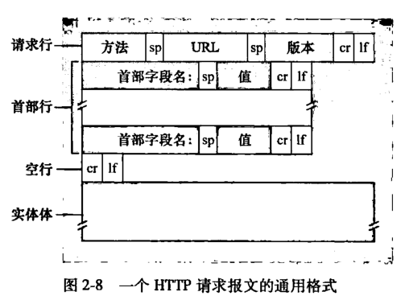
        - 典型示例 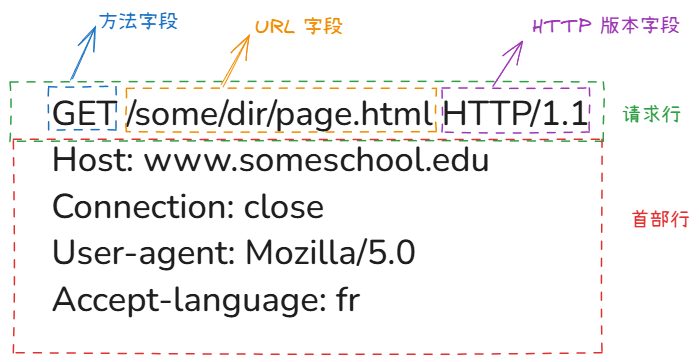
          - Connection: close 首部行
            - 浏览器告诉服务器不要使用持续链接，响应之后就关闭连接
          - User-agent:
            - 服务器可以根据不同类型的用户代理实际相同对象的不同版本
          - Accept-languge
            - 代表用户想要得到的语言版本
        - 方法字段
          - GET
          - POST
            - 只有 POST 请求有实体体
          - HEAD
            - 类似于 GET 方法，但是服务器不返回所请求的对象，只返回一个 HTTP 报文
            - 通常用于调试
          - PUT
            - 允许用户上传对象到指定的 Web 服务器上的指定路劲
          - DELETE
            - 允许用户删除 Web 服务器上的对象
      - 响应报文 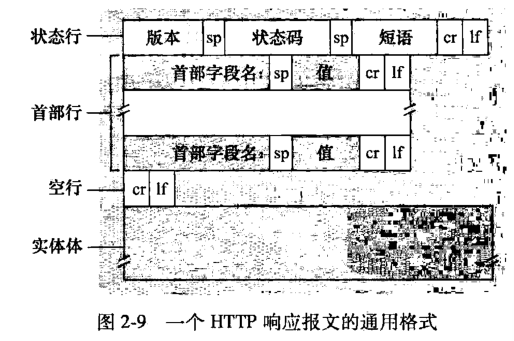
        - 典型示例 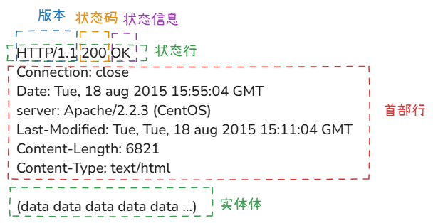
          - Connection: close
            - 告诉用户发送完报文后将关闭该 TCP 连接
          - Last-Modified:
            - 首部行只是该对象创建或最后修改的时间与日期
            - 对象缓存来说非常重要
        - 状态码的不同含义
          - 200 OK:请求成功，信息在返回的响应报文中
          - 301 Moved Permanently：求的对象已经被永久转移了。新的 URL 定义在响应报文的“Location：”首部行中。客户软件将自动获取新的 URL
          - 400 Bad Request：一个通用差错代码，指示该请求不能被服务器理解
          - 404 Not Found：请求的文档不在服务器上
          - 505 HTTP Version Not Supported：服务器不支持请求报文使用的 HTTP 版本
      - cookie（RFC 6265）
        - 允许 HTTP 服务器对用户进行跟踪
        - 由 4 部分构成
          - 响应报文中的 Set-cookie 首部行 `priority-1`
            - 浏览器（客户端）会将响应的 Set-cookie 的值追加到浏览器管理的 cookie 文件中
          - 请求报文中的 cookie 首部行 `priority-2`
            - 浏览器再次访问同一个网站的时候，会查询 cookie 文件并抽取出这个网站的 cookie，并将其添加到请求首部 cookie 字段中
            - 如果有多个 cookie，使用 ";&lt;space&gt;" 来进行分隔
          - 在用户端文件系统中保留一个 cookie 文件 `priority-3`
          - 服务器端的后端数据库 `priority-4`
      - Web 缓存（也称代理服务器 proxy server）
        - 是能够代表原始服务器来满足 HTTP 请求的网络实体
        - 它存储最近请求国的对象的副本，如果它接受到的请求的响应内容刚好已经被保存了下来，它就可以将副本直接返回给客户端
        - Web 缓存器是内容分法网络（CDN）的基石
        - 条件 GET
          - 用以解决保存在代理服务器中的内容过期的问题
          - 条件 GET 是指 首部中有 “If-modified-since:” 首部行 的 GET 方法的 HTTP 请求
            - If-modified-since 的值是副本中 Last-Modified 的日期值
            - 如果客户端有请求来到了代理服务器，代理服务器就会向目标服务器发送条件 GET 语句，如果目标服务器返回响应码 304 Not Modified，则可以直接返回副本，如果返回 200 OK，则说明已经被修改过了
    - HTTP/2
      - 主要改进是减小感知时延
      - 手段
        - 经单一 TCP 连接使请求与响应多路复用
          - 过去使用 HTTP/1.1 TCP 持续连接会有对首阻塞（Head Of Line(HOL) blocking）的问题，即服务器端返回一个大对象和多个小对象，大对象的传输会阻塞后面小对象的传输
          - HTTP/1.1 解决 HOL 阻塞问题的方法是并行建立多个 TCP 连接，让多个对象并行地发送给浏览器
          - HTTP/2 解决方法
            - 将 HTTP 报文（可以是请求也可以是响应报文）分成小帧，发了第一个对象的第一帧后继续发送第二个对象的第一帧，直到发送完了所有对象的第一帧之后，再发送所有对象的第二帧（如果有的话），以此类推
            - 将报文成帧是由 HTTP/2 的成帧子层完成的
              - 成帧子层不仅将报文划分为帧，而且对这些帧进行二进制编码，使得解析更为高效，和空间更小，更不容易出错
        - 提供请求优先次序和服务器推
          - 请求优先次序
            - 当“同时”收到了来自同一客户的多个请求的时候，HTTP/2 服务器可以为请求的响应确定优先次序，优先级越高的响应越先发送第一帧
            - 方法：在发送请求的时候，为每个报文分配 1 ~ 256 之间的权重，数字越大，优先级越高
          - 服务器推
            - 允许服务器为一个客户请求发送多个响应
            - 因为 HTML 基本页指示了需要在页面呈现的全部对象，所以这一点是可实现的。因此无须等待对这些对象的 HTTP 请求，服务器就能够分析该HTML页，识别需要的对象，并在接收到对这些对象的明确的请求前将它们发送到客户。服务器推消除了因等待这些请求而产生的额外时延。
        - 提供 HTTP 首部字段的有效压缩
    - HTTP/3
      - HTTP/3 建立在 QUIC 协议的基础上
      - QUIC 协议吸收了 HTTP/2 的许多特征，所以 HTTP/3 被设计得更为简单、合理
      - TODO
  - 电子邮件
    - 电子邮件系统主要由 3 部分组成
      - 用户代理（user agent）
        - 允许用户阅读、回复、转发、保存和撰写报文
        - 邮件代理可以向其邮件服务器发送邮件，此时，邮件位于邮件服务器的外出报文队列中，其它邮件代理可以从邮件服务器上获得该报文
      - 邮件服务器（mail server）
        - 每个接收方（用户）在邮件服务器上都有一个邮箱（mailbox），每个邮箱管理和维护者发送给该邮箱的报文
        - 下图是一封邮件的一般传输路径： 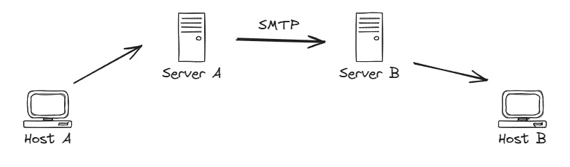
          - 如果 Server A 不能将邮件发送到 Server B（可能原因是 Server B 故障或者没有开机），通常情况下 Server A 会保持邮件在报文队列中，然后等待固定的时间段之后再尝试发送
          - 邮件服务器之间通过 SMTP 传输邮件
      - 简单邮件传输协议（SMTP）
        - SMTP 使用 TCP 进行传输
        - 由于 SMTP 限制邮件报文的体部分也只能采用简单的 ASCII 编码，所以，在使用 SMTP 传输邮件之前，需要将二进制数据编码成 ASCII 码；所以，在传输后也需要解码
        - SMTP 不使用中间服务器进行转发，这意味着邮件不会经过第三个服务器
        - 邮件的报文格式
          - 首部
            - 每个首部必须包含 "From:" 和 “To:” 首部行
            - 例如： 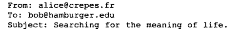
          - 首部之后紧跟一个空白行，然后是 ASCII 格式表示的报文体
    - 邮件访问协议
      - 邮件位于邮件服务器上，而用户代理想要获取新的邮件，就需要访问位于邮件服务器上的邮件
      - 如果使用基于 Web 的电子邮件，则用户代理将使用 HTTP 来取出邮件
      - 另一种则是使用因特网邮件访问协议（Internet Mail Access Protocol, IMAP）
  - DNS
    - 主机的一种标识方法是用主机名（hostname），如 www.google.com
    - 主机的另一种标识方法是使用 IP 地址
    - DNS 提供以下服务
      - 将 hostname 转换成对应的 IP 地址
      - 主机别名（host aliasing）
        - 例如一台名为 relay1.west-coast.enterprise.com的主机，可能还有两个别名 enterprise.com 和 www.enterprise.com
          - 其中，relay1.west-coast.enterprise.com 称为规范主机名
          - 其它的就是别名
      - 邮件服务器别名
      - 负载分配（load distribution）
        - 一些大网站会将多台不同 IP 的主机与同一个主机名相关联，这时候就涉及到了负载均衡问题
        - 方法：在返回 IP 地址集合的时候循环 IP 地址的次序。由于用户只使用第一个 IP 地址来当做目的地，所以此方法是有效的
    - DNS 组成部分
      - 分层的 DNS 服务器组成的分布式数据库 `priority-1`
        - DNS 服务器一般运行 BIND（Berkeley Internet Name Domain）软件
      - 使主机能够查询分布式数据库的应用层协议 `priority-2`
    - DNS 工作机理
      - 分布式、层次数据库
        - 大致有 3 种类型的 DNS 服务器
          - 根 DNS 服务器
            - 有超过 1000 多台根 DNS 服务器遍布世界各地
            - 是 13 个不同根服务器的副本，由 12 个不同组织管理，并通过因特网号码分配机构来协调
            - 提供了 TLD DNS 服务器的 IP 地址
          - 顶级域（Top-Level Domain, TLD） DNS 服务器
            - 顶级域名是指 com、org、edu 等
            - 提供了权威 DNS 服务器的 IP 地址
          - 权威服务器
            - 主机名对应的 IP 地址存放在权威 DNS 服务器上
        - 这三种类型 DNS 服务器的交互方式 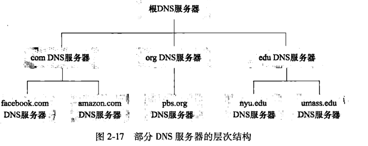
          - 用户与根服务器之一建立联系，根服务器返回对应的 TLD DNS 服务器的 IP 地址 `priority-1`
          - 用户访问 TLD DNS 服务器，TLD 服务器与这些 TLD 服务器之一联系，该 TLD 服务器会返回权威 DNS 服务器的 IP 地址 `priority-2`
          - 最后，用户与权威服务器联系，取得域名对应的 IP 地址 `priority-3`
        - 本地 DNS 服务器（也称默认名字服务器）
          - 通常邻近发出 DNS 请求的主机
          - 它起到代理的作用
            - 会将主机发来的 DNS 请求发往 DNS 服务器的层次结构中 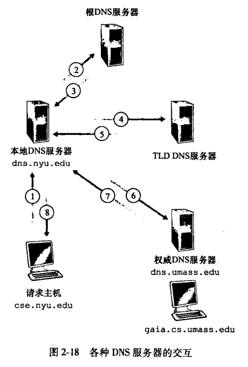
        - DNS 缓存
          - DNS 缓存广泛存在于 DNS 服务器中
          - 由于主机与主机名与 IP 地址之间的映射不是永久的，所以，DNS 服务器在一段时间后（通常是 2 天）会丢弃缓存的信息
      - DNS 记录和报文
        - 记录
          - DNS 分布式数据库的所有 DNS 服务器存储了资源记录（Resource Record, RR） RR 提供了主机名到 IP 地址的映射
          - 每个 DNS 回答报文包含了一条或多条 RR
          - RR 是 [Name, Value, Type, TTL] 4 元组
            - TTL 是 RR 的生存时间，决定了 RR 应当从缓存中删除的时间
            - Name 和 Value 的意义取决于 Type
              - Type = A
                - Name 是主机名
                - Value 是主机名对应的 IP 地址
              - Type=NS
                - Name 是域，例如 foo.com
                - Value 是一个知道如何获得该域中主机 IP 地址的权威 DNS 服务器的主机名
                - Type=NS 的 RR 还有一条与之配对的 Type=A 的 RR，用以提供 Value 字段对应的服务器的 IP 地址
              - Type=CNAME
                - Name 是规范主机名对应的主机的主机别名
                - Value 是规范主机名
              - Type=MX
                - Name 是邮件服务器的别名
                - Value 是邮件服务器的规范主机名
        - 报文
          - DNS 只有两种报文：查询和回答报文。并且这两种报文具有相同的格式
          - DNS 报文格式 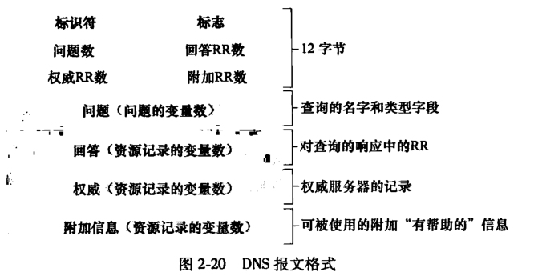
            - 前 12 字节是首部区域
              - 标识符 16 bit
                - 用于标识该查询，同时标识符会被复制到对查询的回答报文中，以便用户让 2 这进行配对
              - 标志 16 bit
                - 1 bit 的查询/回答标志位指出是否是回答报文
                - 1 bit 在回答报文中的含义是是否是“权威的”
                - 1 bit 用于用户（查询报文）是否“希望递归”。递归是指在该 DNS 服务器没有某记录时，希望它执行递归查询。
                - 1 bit “递归可用”标志位，如果该 DNS 服务器支持递归查询，在它的回答报文中会对此 bit 设置为 1（置位）
                - 全部 bit 位的含义 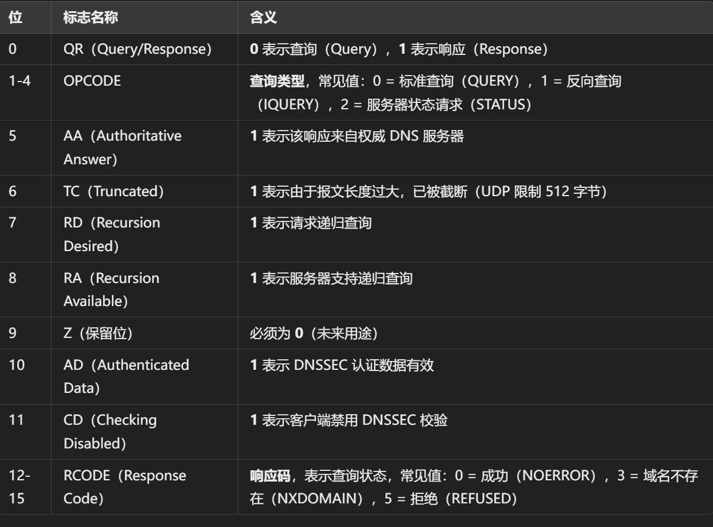
              - 紧跟首部出现的 4 类数据区域中的数量
            - 4 类数据区域
              - 问题区域
                - 包含正在进行的查询信息
                - 包括
                  - 名字字段：包含正在被查询的主机名字
                  - 类型字段：正被查询的主机名的问题类型。例如，对邮件服务器名字的查询（MX）和普通服务器名字（A）的类型不同
              - 回答区域：包含大于等于一条 RR
              - 权威区域
                - 包含了其他权威服务器的记录
              - 附加信息
                - 包含了其它有帮助的记录
                - 例如一个 MX 类型的请求的回答区域包含了一条包含了邮件服务器规范主机名的 RR，附加区域就包含了该规范主机名对应 IP 地址的 A 类型的 RR
        - DNS 添加 RR
          - 需要向域名注册机构提供 4 样信息：需要注册的域名、基本 DNS 权威服务器、辅助 DNS 权威服务器、IP 地址
          - 注册机构会将一个类型 NS 和一个类型 A 的记录添加入 TLD 服务器
            - 例如注册 a.com，dns 服务器有 dns1.b.com 和 dns2.b.com，则会添加记录： (a.com, dns1.b.com, NS, TTL) (a.b.com, &lt;ip address&gt;, A, TTL)
    - DNS 协议使用 UDP，端口号为 53
    - CDN 与 DNS
      - CDN 将某个内容缓存了之后，要将指向原本链接的请求更改为指向自己，这是如何做到的？例如 a.com 的 CDN 为 acdn.com
        - 当 DNS 请求到达 a.com 的权威 DNS 服务器之后，按照常规下一步要返回 a.com 对应的 IP 地址，但是使用 CDN 了之后，返回的是 CDN 的主机名 acdn.com
        - 之后，用户就进入了 CDN 的 DNS 网络
      - CDN 是如何选择集群的（从多个 CDN 集群中选择最优的一个）？如何选择被称为集群选择策略（cluster selection strategy）
        - 用于选择的依据是 LDNS（本地 DNS 服务器）的 IP 地址。或者根据实施测量出来的流量条件来为用户选择最好的 CDN
- 运输层
  - 运输层为运行在不同主机上的进程提供了逻辑通信功能（网路层提供了主机之间的逻辑通信）
  - 运输层协议是在端系统中而不是在路由器中实现的
    - 在发送端，运输层将从应用程序收到的报文转换成运输层分组，即报文段（segment）
  - 基本职责是将两个端系统 IP 的交付服务扩展为运行在端系统上的两个进程之间的交付服务，被称为运输层的多路复用（multiplexing）与多路分解（demultiplexing）
    - 多路分解：将运输层报文段中的数据交付到正确的套接字中去
    - 多路复用：从源主机的不同套接字中收集数据块，并为每个数据块封装上首部信息（用于以后分解）从而生成报文段，然后将报文段传递到网络层，所有这些工作被称为多路复用
    - 工作基础
      - 套接字有唯一标识符
      - 每个报文段有特殊字段来指示该报文段所要交付到的套接字。实际上是源端口号字段和目的端口号字段
      - 端口号
        - 端口号是 1 个 16 bit 的数，大小在 0 ~ 65535 之间
        - 0 ~ 1023 范围的端口号称为周知端口号
      - 每个套接字能够分配一个端口号，报文段到达主机时，运输层检查报文段中的目的端口号，并将其定向到的套接字
        - UDP 套接字是由一个 (目的 IP 地址, 目的端口号) 二元组全面标识的
        - TCP 套接字是由一个四元组 (源 IP 地址, 源端口号, 目的 IP 地址, 目的端口号) 来标识的
          - 这意味着两个具有不同源 IP 地址或端口号到达同一个 IP 地址和同一个端口号的报文段会被定向到两个不同的套接字
          - 之所以可以用源 IP 地址和端口号进行标识是因为这个新的 socket 是两者建立连接后创建的，而不是一开始就指定好的
  - UDP：无连接运输
    - 运输层最低限度必须提供一种复用/分解服务，以便在网络层与正确的应用级进程之间传递数据。而这就是 UDP 干的事
    - UDP 为来自于应用程序的报文段添加上首部，然后就差不多传递给网络层了。当到达目的主机之后，就找到对应的套接字，交付给某一个应用程序
    - UDP 的优点
      - 应用层可以更为精细地控制发送什么数据以及何时发送
      - 无需建立连接
        - 因此不会引入建立连接的时延
      - 无连接状态
        - TCP 需要维护连接状态，包括接收和发送缓存、拥塞控制参数以及序号与确认号这些参数
        - 因此，UDP 服务端一般情况下能够支持更多的活跃用户
      - 分组首部开销小
        - TCP 首部有 20 字节的开销，UDP 仅有 8 字节
    - 报文段结构 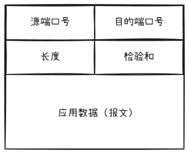
      - 长度字段指示了 UDP 报文的总长度（包括首部和数据）
      - 注意到 UDP 报文段中没有源 IP 地址和目的 IP 地址，这两个字段交由网络层（IP）进行处理
      - 接收方使用检验和来检查报文段是否出现了差错
      - UDP 检验和
        - 发送方 UDP 对报文段中的所有 16 bit 的和进行反码运算，求和时遇到的任何移除都被回卷（忽略），得到的结果被放在报文段中的检验和字段中
          - 然后对 0100101011000010 进行反码运算 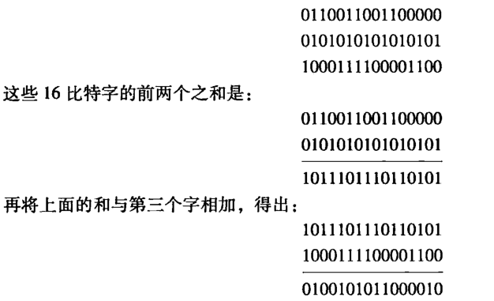
        - 接收方全部的 16 bit 相加（包括检验和）相加如果得到的和的 bit 位全是 1，则说明传输过程中没有差错
        - UDP 提供检验和用以检验差错的原因是可能某一段链路没有提供差错检测（以太网会提供，但是可能有的协议没有提供）
  - TCP：面向连接的运输
    - 可靠数据传输原理（单向，只能从发送方到接收方）
      - 解决比特差错问题：ARQ（Automatic Repeat reQuest, ARQ）自动重传协议
        - 差错检测
          - 使接收方能够检测到何时出现了比特差错
        - 接收方反馈
          - 如果接收方收到一条完整正确的报文段，返回 ACK（positive acknowledgment）；如果报文段有误，则返回 NAK（negative acknowledgment）
          - 如果 ACK 或者 NAK 本身出现了差错，那么如何解决呢？
            - 方案 1：增加足够的检验和 bit，使发送方不仅能够检测差错，还可以恢复差错
            - 方案 2：收到含糊不清的 ACK 或 NAK 分组时，重传当前数据分组即可
              - 又引入了一个新的问题：接收方不知道它上次所发送的 ACK 或 NAK 是否被发送方正确地收到，因此它无法判断收到的分组是新的还是一次重传（有可能 2 个分组的检验和是相同的，检验和不能区分两个不同的分组）
              - 几乎所有数据传输协议的（包括 TCP）解决方案：在数据分组中添加一个新字段，让发送方对数据分组进行编号，将发送数据分组的序号（sequence number）放在该字段
                - 接收方只需要检查序号即可确定收到的分组是否为重传，如果序号与损坏的那个分组是相同的，就是重传，否则就是新的
                - 当引入了序号之后，可以在 ACK 分组中加上 ACK 所确认的分组的序号，当接收方发现某个分组损坏了的时候，可以重复确认上一个完好的分组，当发送方收到了某个分组的两次 ACK 之后，就知道那个分组的后面那个分组有损坏，所以重发该分组。这样就达到了无 NAK 的目的。
        - 重传
          - 发送方收到 NAK 之后，会重发该报文段
      - 解决丢包问题
        - 发送方等待一段时间以期望收到来自接收方对于该分组的 ACK，如果超过了该时间没有收到 ACK，则判定为该分组发生了丢包，发送方会重发该分组
        - 重发发送方认为已经丢包了的分组可能会在通道中引入冗余数据分组，所以，此机制依赖于 ARQ 协议引入的序号
      - 流水线可靠数据传输协议
        - 流水线是指发送方发送一个分组之后不等待对于该分组的 ACK，而是紧接着发送另一个分组
        - 流水线对可靠数据传输协议的影响
          - 序号的范围要大。因为每个传送中的分组都必须有一个唯一的序号
          - 发送方和接收方不得不缓存多个分组
            - 发送方最低限度应该要缓存那些已经发送了但没确认的分组
            - 接收方也应该需要缓存那些已经正确接收的分组
        - 流水线差错恢复的 2 种基本方法
          - 回退 N 步（Go-Back-N, GBN）
            - 在流水线中未确认的分组数不能超过某个允许的最大数 N
            - 基序号（base）定义为最早为确认分组的序号 下一个序号（nextseqnum）定义为最小的未使用序号 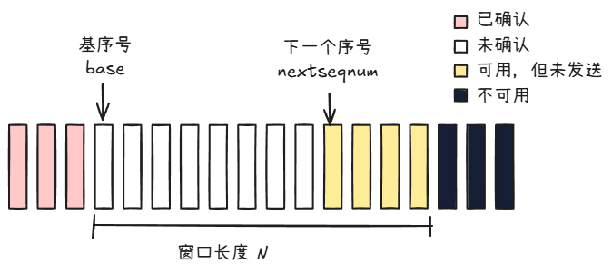
              - 序号范围被分割成了 4 段
                - 已发送并确认：[0, base - 1]
                - 已发送但未确认：[base, nextseqnum - 1]
                - 可用但未被使用的序号：[nextseqnum, base + N - 1]
                - 不可用的序号：[base + N, 正无穷)
              - N 被称为窗口长度，GBN 也常被称为滑动窗口协议
            - GBN 发送方必须对 3 类事件进行响应
              - 上层调用
                - 发送方首先要检查窗口是否已满。如果已满，发送方可能会将数据缓存或者使用同步机制（如一个信号量或者标志）只有当窗口不满时才能调用发送接口
              - 收到一个 ACK。GBN 采取累积确认（cumulative acknowledgment）机制
                - 在累积确认中，对于序号 n 的分组的 ACK 的含义是：小于等于 n 的分组接收方都已经收到了
              - 超时事件
                - 有一个定时器（可以被当做最早发送但未被确认的分组使用的定时器）用于确认分组的丢失，如果出现超时，则发送方重传所有已经发送但未被确认过的分组（回退 N 步）
            - GBN 接收方的行为
              - 接收方收到一个正确的序号为 n 的分组，并且上次交付给上层的数据是序号为 n - 1 的分组，则接收方为分组 n 发送一个 ACK，并且将该分组的数据交付给上层
              - 其它的任何情况，GBN 都会丢弃收到的分组。即使该分组是正确但是失序的
                - 这是因为如果期望收到的是 n，但是 n + 1 到了，如果接收方缓存下来，还不如等发送方重传
          - 选择重传（Selective Repeat, SR）
            - 选择重传不同于 GBN，它仅重传那些它怀疑在接收方出错（丢失或受损）的分组
            - 选择重传不能采取累积确认机制，而是必须要求接收方逐个确认正确接收的分组
            - SR 再次使用窗口长度 N 来限制流水线中未完成、未被确认的分组数 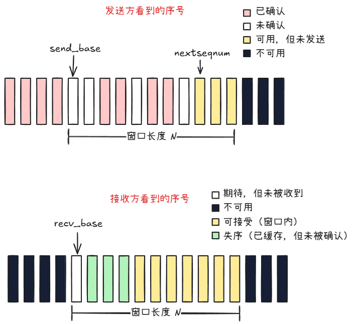
              - SR 接收方将确认一个正确接收的分组而不管接收的分组是否按序
              - 失序的分组将被缓存直到所有丢失的分组都被收到为止，然后将连续的一批分组按序交付给上层
            - 发送方行为/事件鉴赏
              - 从上层接收到数据
                - 检查窗口内是否有可用的序号，如果没有，要么缓存，要么将数据返回给上层，或者使用同步机制，让只有窗口不满的时候上层才能调用发送接口
              - 超时
                - 每个分组必须拥有自己的逻辑定时器，因为超时发生后只能发送一个分组
                - 可以使用单个硬件定时器模拟多个逻辑定时器
              - 收到 ACK
                - 如果分组序号在窗口内并且该序号已经被发送了但是没确认，则 SR 发送方将被确认的分组标记为接收
                - 如果分许序号等于 send_base，则窗口基序号向前移动到具有最小序号的未确认分组处
                - 如果窗口移动了（此时就会有新的序号可以用了），并且有序号落在了窗口内的未发送分组，则发送这些分组
            - 接收方行为/事件鉴赏
              - 接收到一个序号在 [rcv_base, rcv_base+N-1] 内的正确分组
                - 如果序号不等于 rcv_base，且该分组没有被缓存，则缓存该分组，并且返回一个 ACK 给发送方
                - 如果序号不等于 rcv_base 并且该分组已经被缓存了的情况，则丢弃该重复的分组，但是不发送 ACK，因为不发送 ACK 的话，此分组最终会落到窗口的前面去，等到这时候再做处理
                - 如果序号等于 rcv_base，则将 rcv_base 及其后面连续的已被缓存的分组交付给上层
              - 接收到一个序号在 [rcv_base-N, rcv_base-1] 的正确分组
                - 必须产生一个 ACK，即使该分组是接收方以前已经确认过的分组（大概率是因为对该分组的 ACK 丢失了）
                - 如果不产生一个 ACK，则会导致发送方无限发送该分组
              - 其余情况忽略该分组
            - 窗口长度必须小于或等于序号空间大小的一半，否则协议无法工作（可能无法区分某一个分组是重传还是新的分组）
      - 解决分组重排序问题
        - 分组重排序问题是指一个具有序号或确认号 x 的分组出现在了接收方或者发送方，而这个分组其实不是这个发送方或者接收方通过这次连接发送的，而有可能是上一次连接发送的分组或者由于其它原因滞留在通道中的分组
          - x 之所以会出现可能是因为它一直“滞留”在网络通道中，这大概率是因为网络传输速度太慢而导致的
        - 解决分组重排序问题的方法是让突然出现的序号对协议运行没有影响。所以要避免窗口内包含该序号
          - 进行序号重用的时候，发送方要确定任何先前发送的序号 x 的分组都不在网络中。要做到这一点，是通过假定一个分组在网络中的“存活”时间不会超过某个固定的最大时间量（RFC 7323 规定了为大于 3 分钟）来做到这一点
    - TCP 报文段结构 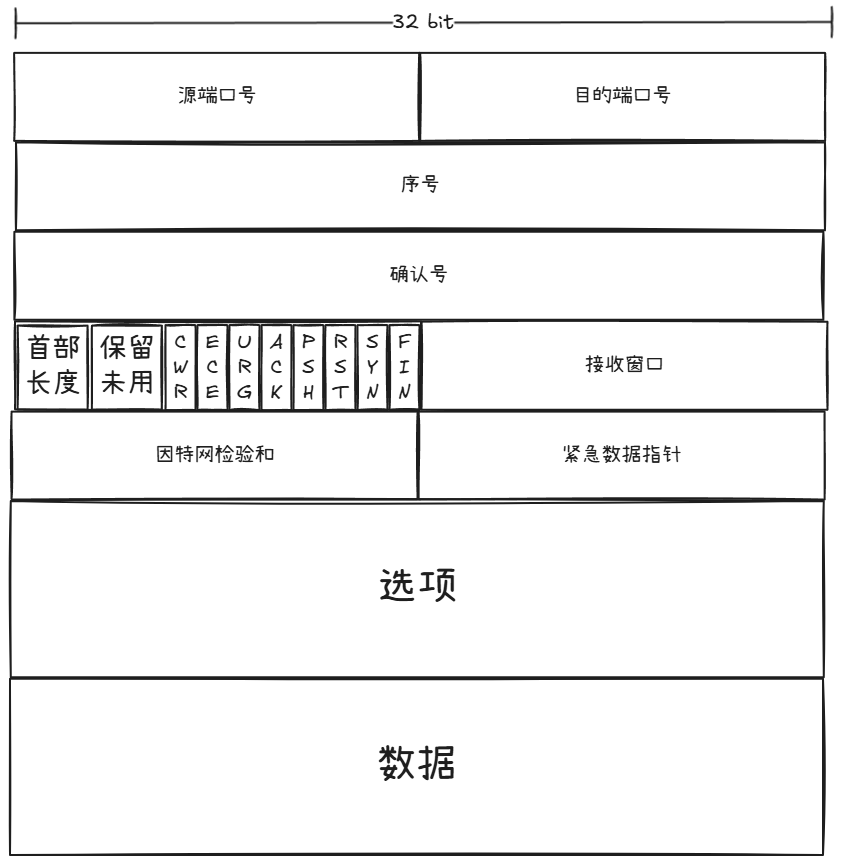
      - 接收窗口
        - 用于流量控制
        - 用于指示接收方愿意接收的字节数量
      - 首部长度
        - 以 32 bit 的字为单位的 TCP 首部长度
        - 由于存在选项字段，所以 TCP 首部的长度是可变的。如果没有选项字段，首部长度为 20 字节
      - 选项字段（可选）
        - 用于在发送方与接收方协商最大报文段长度 MSS 时，或在高速网络环境下用作窗口调节因子时使用
        - 还定义了一个时间戳选项（RFC 1323）
      - 标志字段
        - ACK 比特用于指示“确认号”字段中的值是有效的
        - RST、SYN 和 FIN bit 用于连接的建立和拆除
        - CWR 和 ECE 用于拥塞控制
        - PSH 被置位时，指示接收方应立即将数据交给上层
        - URG 用于指示报文段里存在着被发送端上层实体指示为紧急的数据。此时紧急数据指针字段指向了紧急数据的最后一个字节。此时，TCP 必须通知上层实体
      - 序号和确认号
        - TCP 把数据看成一个无结构的、有序的字节流
        - 一个报文段的序号（sequence number for a segment）是该报文段首字节的字节流编号（所以说 TCP 把数据看成是字节流），而不是报文段的序列作为序号
          - 如果要发送的数据有 500 000 字节， MSS 为 1000 字节，则序号的分配如下： 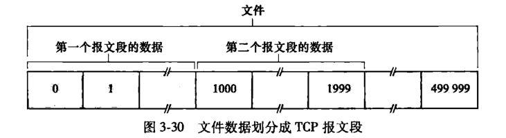
          - 上面的例子假设字节流编号是从 0 开始，但是，实际中，TCP 连接的双方均随机地选择初始序号
            - 这样可以减少仍然存在于网络之间的已终止连接所发出的报文段对本次连接产生影响
        - 主机 A 填充进报文段的确认号是主机 A 期望从主机 B 收到的下一个字节的序号
          - 这是由于 TCP 是全双工通信，不能明确地分出发送方和接收方，所以不能采用上面原理里面描述的算法
          - TCP 采用累积确认的机制
            - 所以，如果 0~535 和 900~1000 的字节接受方已经收到了，则接收方返回给发送方 ACK 536，请求序号 536 字节和其后的字节
            - 乱序到达的报文段在实际中会被接受方缓存，而不会丢弃
        - 示例 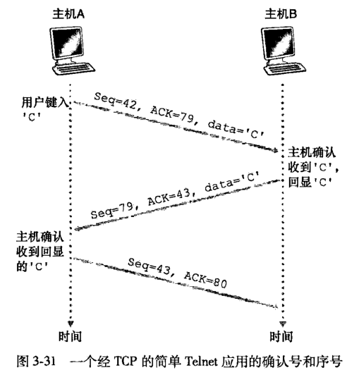
          - 注意到，主机 B 发往主机 A 的那个报文段具有 2 个作用： 1. 为主机 B 收到数据提供一个确认。表明主机 B 已经成功接收到字节 42 以及它前面的所有字节 2. 数据字段填入了 'C' 的 ASCII，即包含了数据 这种边确认边发送数据的确认被称为被捎带（piggybacked）在服务器到客户的数据报文段中的
          - 第三个报文段的唯一目的是确认已从服务器收到的数据
      - 数据
        - TCP 可从发送缓存中取出并放入报文段中的数据数量受限于最大报文段长度（Maximum Segment Size, MSS）
          - MSS 为不包括首部的 TCP 报文段的最大长度
          - MSS 一般根据发送方的最大链路层帧长度（又称最大传输单元 Maximum Transmission Unit, MTU）来设置
          - 由于以太网的 MTU 和 PPP 链路层协议的 MTU 都是 1500，所以 MSS 的典型值为 1460，因为要减去 TCP 和 IP 的首部（通常为 40 字节）
    - 往返时间的估计与超时
      - 估计往返时间 RTT
        - 样本 RTT（Sample RTT）是某报文段被发出（交给 IP）到对该报文段的确认被收到之间的之间量
          - 大多数 TCP 实现仅在某个时刻做一次 SampleRTT 的测量，而不是对每个报文段都做一次
          - 绝不对重传的报文段进行 SampleRTT 测量
        - 由于路由器的拥塞和端系统负载的变化，SampleRTT 值会随之波动。
          - 为了估计一个典型的 RTT，TCP 维持了一个 SampleRTT 均值（被称为 EstimatedRTT）
          - EstimatedRTT=(1-ɑ)*EstimatedRTT+ɑ*SampleRTT
            - RFC 6298 给出的 ɑ 推荐值是 0.125(1/8)
        - DevRTT 用于估算 SampleRTT 的波动程度： DevRTT=(1-Β)DevRTT+Β*|SampleRTT-EstimatedRTT|
          - 波动越大，DevRTT 的值越大
          - Β 的推荐值为 0.25
      - 设置和管理重传超时间隔
        - 超时间隔 TimeoutInterval=EstimatedRTT+4*DevRTT
          - 比 EstimatedRTT 大是为了避免造成不必要的重传
          - 波动程度大的时候，多等待一段时间。波动程度小的时候，少等待一段时间
          - 推荐的 TimeoutInterval 是 1 秒
          - 当出现超时后，TimeoutInterval 值将翻倍，以免即将被确认的后继报文过早出现超时。然而，只要收到报文段并更新了 EstimatedRTT，则使用公式来计算
          - 每当超时的时候，TCP 重传具有最小序号的还未被确认的报文段
    - 可靠数据传输（reliable data transfer service）
      - 快速重传
        - 由于超时而触发的重传的问题之一是超时周期可能较长，这会增加端到端的时延
        - 发送方通常可在超时事件发生之前通过注意到冗余 ACK（duplicate ACK）来检测到丢包情况
          - 接收方为什么要发送冗余的 ACK？
            - 接收方产生 ACK 的事件 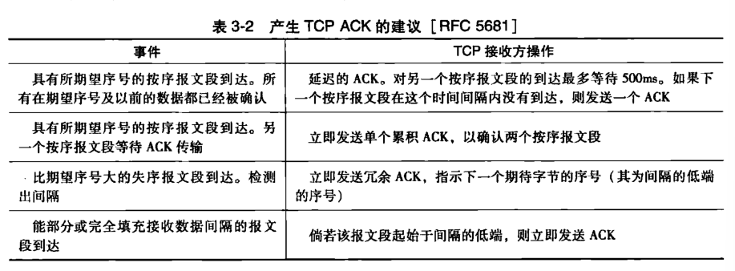
            - 因为发送方经常一个接一个地发送大量报文段，如果一个报文段丢失，就可能会引起许多一个接一个的冗余 ACK
          - 如果 TCP 发送方接收到对相同数据的 3 个冗余 ACK，它把这当做一种指示，说明跟在这个被确认的报文段后面的报文段已经缺失，TCP 就执行快速重传（fast retransmit）（RFC 5681）
      - TCP 的差错恢复机制是 GBN 和 SR 的融合
        - GBN：TCP 使用累积确认，但是缓存失序的报文段
        - SR：缓存失序的报文段，但是使用累积确认，不对每个报文段都使用一个定时器来判断是否超时，不使用否定确认
        - GBN 和 SR 中的窗口长度 N 变为了 min(rwnd, cwnd)。拥塞控制的时候会介绍 cwnd
    - 流量控制（flow-control）
      - TCP 接收到正确、按序的字节后，会将数据放入接收缓存 RcvBuffer 中，相关联的应用程序会从该缓存中读取数据。
      - 如果应用程序读取接收缓存的速度太慢，而发送方发得太多太快，就会造成接收缓存溢出
      - 流量控制是使发送方的发送速率与接收方应用程序的读取速率相匹配
        - TCP 通过让发送方维护一个接受窗口（receive window，rwnd）的变量来提供流量控制
          - 接收窗口的值表示接收方还有多少可用的缓存空间
          - 由于 TCP 是全双工的，所以双方都会有一个接受窗口
        - 定义 LastByteRead 为应用程序从缓存中读出的最后一个字节的编号
        - 定义 LastByteRcvd 为从网络中到达的并且已经被放入接收缓存（排除失序的报文段）中的数据流的最后一个字节的编号
        - TCP 不允许以分配的缓存溢出，则下式必须成立： LastByteRcvd - LastByteRead &lt;= RcvBuffer
          - RcvBuffer 表示接收方缓存空间的大小
        - rwnd 根据缓存的可用空间的数量来设置： rwnd = RcvBuffer-(LastByteRcvd-LastByteRead)
          - 所以 rwnd 是动态的
          - rwnd 是接收方设置的，并且会将这个值设置到发往发送方的“接收窗口”字段中
        - 发送方收到来自接收方的 rwnd 时，需要确保发往连接中但未被确认的数据量 LastByteSent - LastByteAcked 的值要小于等于 rwnd，即： LastByteSent - LastByteAcked &lt;= rwnd
        - 如果接收方发过来的 rwnd 等于 0，说明接受方的缓存已满，但是当缓存清空的时候，并不会通知发送方，所以当发送方收到 rwnd = 0 的报文段时，仍然需要继续发送只有 1 字节的报文段到接收方去
    - TCP 连接管理
      - 建立连接（三次握手） 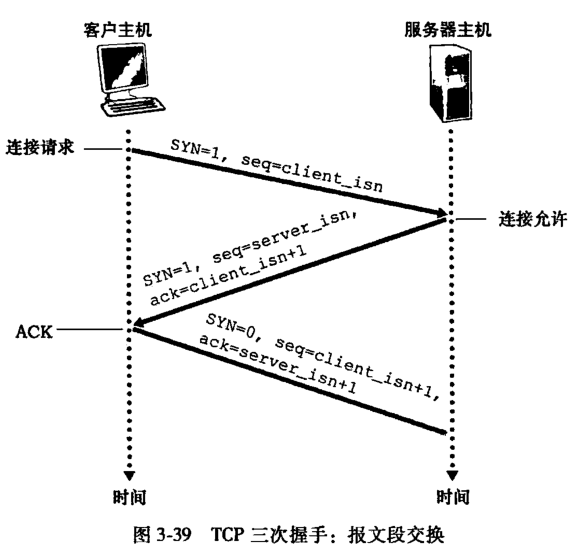
        - 客户端 TCP 相服务器端 TCP 发送一个不包含应用层数据、报文段首部 SYN 比特被置位的 SYN 报文段。SYN 报文段的序号字段（client_isn）为客户端随机选中的一个数字 `priority-1`
        - 服务端收到 SYN 报文段，为 TCP 连接分配 TCP 缓存和变量，并向客户端发送允许连接的报文段。这个报文段的 SYN 比特被置为 1 并且确认号为 client_isn+1，序号字段为服务器自己选择的初始序号（server_isn）。这个报文段被称为 SYNACK 报文段 `priority-2`
          - SYN 洪泛攻击：攻击这发送大量的 SYN 报文段，让服务器不停地分配资源，而攻击者不完成三次握手，最终导致服务器资源被消耗殆尽
          - SYN cookie 用来解决 SYN 洪泛攻击
            - 当一个服务器收到 SYN 报文段时，先不为它分配资源。而是生成一个精心制作的初始的序列号放置于 SYNACK 报文段中，该序列号使用一个复杂的散列函数生成，该函数会用到源和目的 IP 地址与端口号和一个只有服务器知道的秘密数。这个精心制作的序列号被称为 cookie。但是，服务器不保存该 cookie 或者关于 SYN 报文段的其他信息
            - 客户接收到 SYNACK 后发送一个 ACK，该 ACK 的值为 cookie + 1，服务器会使用该 ACK 的源和目的 IP 地址于端口号和秘密数产生一个结果，如果该结果加一等于 ACK 的确认号，则认为该客户是合法的，服务器分配资源。而如果两者不相等，则不予理会，而服务器也没有分配任何资源。
        - 客户端收到 SYNACK 报文段后，也为连接分配缓存和变量。然后发送一个报文段去确认服务端发送过来的 SYNACK 报文段。这个报文段的序号字段为 client_isn + 1，SYN = 0，确认号为 server_isn + 1 `priority-3`
      - 断开连接（四次挥手）
        - 连接的任何一方都能终止连接
        - 当连接结束之后，缓存和变量都会被释放
        - 过程（设想要断开的一方为 A，另一方为 B） 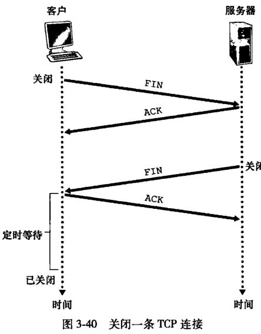
          - A 发送 FIN = 1 的报文段 `priority-1`
          - B 收到 FIN=1 的报文段，发送一个确认报文段 `priority-2`
          - B 发送一个自己的 FIN = 1 的报文段 `priority-3`
          - A 对 B 发过来的 FIN = 1 报文段进行确认。此时，两台主机上用于该连接的所有资源都被释放了 `priority-4`
          - A 之所以要等待一段时间才正式关闭是因为 ACK 可能会丢失，等待一段时间可以重传该 ACK
      - 如果尝试与服务器的某个不开放连接的端口进行连接，则该服务器会向源主机发送一个特殊重置报文段（RST = 1），告诉源主机服务器没有那个报文段所要求的套接字，不要再发送报文段了。
        - 当主机的套接字与 UDP 报文段中要求的套接字没有匹配时，该主机会发送一个特殊的 ICMP 数据报
      - TCP 选择一个很长时间内都不会再次使用的初始序号发送给连接的另一方 B，然后等待 B 使用 ACK 报文段响应，用以判断 B 是否还活跃
      - 端口扫描工具工作原理
        - 工具发送一个 SYN 报文段，如果收到 SYNACK 报文段，则说明该端口开放；如果收到一个 RST 报文段，则该端口不开放；如果工具没有收到任何回复，则可能表明 SYN 报文段被防火墙拦截
    - TCP 拥塞控制
      - 拥塞控制原理
        - 拥塞的代价
          - 链路的容量是有限的，假定为 R，而如果有 N 个用户共享这一段链路，则每个人的平均吞吐量只能是 R/N。而当每个人的发送速率都接近 R/N 的时候，路由器中排队的分组数就会越来越多，所以时延会无限增大
          - 路由器的缓存是有限的，如果排队的分组过多，则会造成丢包的发生，发送方不得不重传以补偿因为缓存溢出而丢弃的分组
          - 发送方在遇到大时延时进行不必要的重传会引起路由器利用其链路带宽来转发不必要的分组副本
          - 当一个分组沿着一条路径被丢弃时，每一个上游路由器用于转发该分组和传输的容量最终都被浪费掉了
        - 端到端拥塞控制
          - 网络层不提供链路的拥塞状态信息。由协议自己判断
        - 网络层辅助的拥塞控制
          - 路由器向发送方提供网络拥塞状态的显式反馈信息
          - 网络层通知发送方有 2 种方法
            - 使用一种拥塞分组（choke packet）直接表明网络层拥塞了
            - 路由器标记或更新从发送方流向接收方分组的某个字段来指示拥塞的产生，一旦接收方收到了一个标记的分组后，接收方就会向发送方通知该网络拥塞的指示
      - 经典 TCP 拥塞控制（端到端拥塞控制）
        - TCP 在网络拥塞的时候降低发送速率，在不拥塞的时候增加发送速率。那么，这就要解决如下的 3 个问题。
        - TCP 如何限制它向连接的发送速率？
          - 拥塞机制维护一个额外的变量，称为拥塞窗口（congestion window）
          - 则要求： LastByteSent-LastByteAcked&lt;=min(cwnd,rwnd) 即未被确认的字节数要小于 min(cwnd, rwnd)，则会间接地限制发送方的发送速率
        - TCP 发送方如何感知到它到目的地之间的路径上存在拥塞？
          - 当超时或者收到 3 个冗余 ACK 的时候 TCP 认为网络拥塞了
        - TCP 感受到拥塞的时候，采用何种算法来改变发送速率？
          - TCP Reno
            - 慢启动（强制实现）
              - 当一条连接开始的时候，cwnd 的值初始化为 一个 MSS（RFC 3390），所以发送速率为 MSS/RTT，是一个较小的值（相比于带宽）
              - TCP 发送方希望快速找到可用带宽的值。所以，cwnd 每当传输的报文被首次确认就增加 1 个 MSS。所以，cwnd 是呈指数级增长的： 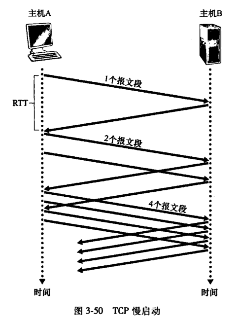
              - 慢启动阶段的结束（cwnd 指数级增长的结束）
                - 由超时指示的丢包事件
                  - TCP 将 cwnd 设置为 1 MSS 并重新开始慢启动过程
                  - 将慢启动阈值（ssthresh）设置为 cwnd/2
                - 当 cwnd 的值等于 ssthresh 时
                  - 结束慢启动并且 TCP 转移到拥塞避免模式
                - 检测到 3 个冗余 ACK
                  - 执行快速重传并进入快速恢复状态
            - 拥塞避免（强制实现）
              - 一旦进入拥塞避免状态，cwnd 的值大约是上次遇到拥塞是的值的一半，所以采取较保守的策略增加 cwnd
              - 每个 RTT 内将 cwnd 的值增加一个 MSS（RFC 5681）
                - 实现方式是： 每次收到一个 ACK cwnd 增加 MSS/cwnd，即 cwnd = cwnd + MSS/cwnd
                - 这样的话，如果在一个 RTT 内发送了 cwnd/MSS 个报文段，cwnd 大约就会增加一个 MSS
              - cwnd 线性增长的结束（拥塞避免阶段的结束）
                - 由超时指示的丢包事件
                  - cwnd 设置为 1 一个 MSS
                  - ssthresh 的值被更新为 cwnd 值的一半
                - 检测到 3 个冗余的 ACK
                  - 执行快速重传并进入快速恢复状态
            - 快速恢复（可选实现）
              - 快速回复阶段是收到了 3 个冗余的 ACK 时才会进入的阶段（假设已经执行了快速重传）
                - ssthresh = cwnd / 2
                - 将 cwnd 的值减半，然后再加上 3 个冗余 ACK 带来的 3 个 MSS，即 cwnd = cwnd/2 + 3 * MSS
                - 当接收到一个重复ACK时： cwnd = cwnd + 1* MSS
                  - 之所以要加一个 MSS，是因为说明其他报文段已经正常到达了接收方，通道并不阻塞，所以可以增加，充分利用通道
                - 当接收一个新的 ACK 时，将 cwnd 设置为 ssthresh，即 cwnd = ssthresh 然后进入拥塞避免阶段
                  - 当退出快速恢复阶段时，cwnd 可能虚高
            - TCP Reno 拥塞控制常被称为加性增（1 个 RTT 内增加 1 MSS）、乘性减（冗余 ACK cwnd 减半），（Additive-Increase, Multiplicative-Decrease, AIMD）拥塞控制方式 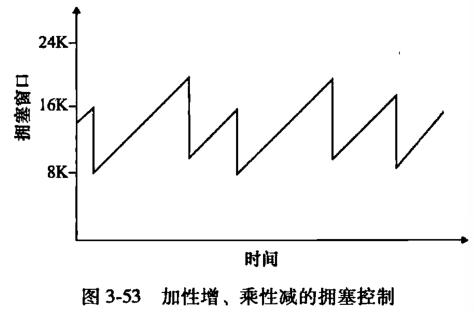
          - TCP CUBIC（Linux TCP 默认版本）
            - CUBIC 仅改变了拥塞避免阶段 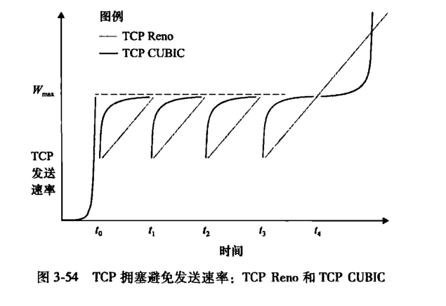
              - 令 Wmax 为最后检测到丢包时 cwnd 的值
              - 令 K 为假定无丢包情况下 cwnd 再次达到 Wmax 时的未来时间点
                - 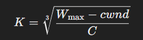
                - C 为 CUBIC 算法的增长因子，通常为 0.4
              - CUBIC 以当前时间 t 和 K 之间距离的立方为函数来增加 cwnd
                - 
            - CUBIC 试图将 cwnd 尽可能长时间地维持仅低于拥塞门限
      - 网络层辅助的拥塞控制：明确拥塞通告（Explicit Congestion Notification, ECN）
        - 在网络层的 IP 中，有 2 个 bit 被用于 ECN，位于 IP 数据报的服务类型字段中
        - 过程 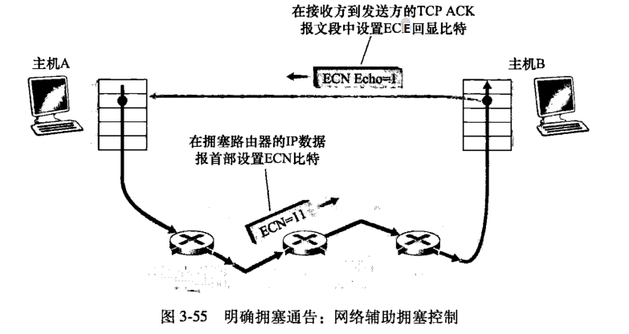
          - 当路由器正在经历拥塞的时候，它会将 IP 数据报的 ECN 比特都置位
          - 当接收主机收到了 ECN 拥塞指示时，它将发送回发送主机的 TCP ACK 的 ECE（ECN 回显）比特置位，从而同时发送主机通道正在经历拥塞
          - 发送主机收到了 ECE 比特被置位的报文段之后，减半拥塞窗口，然后对下一个发往接收方的报文段的 CWR 比特进行置位
        - 除了 TCP 以外的其他运输层协议也可以利用网络层发送 ECN 信号。例如数据报拥塞控制协议（DCCP）
      - 基于时延的拥塞控制（TCP Vegas）
        - 是指在丢包出现之前主动检测拥塞
        - 发送方对所有被确认的分组测量源到目的地路径的 RTT，RTTmin 为其中的最小值。这个最小值出现在该路径没有拥塞且这些分组经历最小排队延迟之时。
        - 当拥塞窗口的长度为 cwnd 时，则未拥塞的时候吞吐量速率将是 cwnd/RTTmin。如果实际在发送方测量的吞吐量接近这个值，则 TCP 的发送速率将增加；如果大得多，则减小发送速率
          - “保持管道刚好充满，而不可以更满”
      - 公平性
        - 在只有 TCP AIMD 流量且所有连接具有相同的 RTT 时，经过一段传输速率为 R bps 的瓶颈链路时，K 个 TCP 连接共享该链路，则这 K 个连接会公平地共享该链路，即每个连接的传输速率大约为 R/K
        - 但是在实际情况中，链路中还会有其他流量，并且每个连接的 RTT 不相同。所以不是公平的
        - 当多个连接共用一段瓶颈链路时，具有较小 RTT 的连接在链路空闲时更快地抢到可用带宽（cwnd 增长得更快），因此获得更大的吞吐量
  - 快速 UDP 互联网连接：QUIC
    - QUIC 是一个应用层协议，使用 UDP 作为其底层运输层协议。是专门为简化的 HTTP/2 而设计的。HTTP/3 将和 QUIC 产生很大的联系。精简 HTTP/2 + QUIC = HTTP/3
    - 特征
      - 面向连接和安全
        - 两个端点之间会进行一次握手来建立 QUIC 连接状态
        - 2 个连接的状态分别是源连接 ID 和目标连接 ID
        - 所有 QUIC 分组都是加密的
        - QUIC 将创建连接状态的握手（TCP）与用于鉴别和加密（TLS）的握手结合到了一起，所以比 HTTP/2 + TLS + TCP 具有更快的创建速度
      - 数据流
        - QUIC 允许几个来源于不同程序的“数据流”能够在一个 QUIC 连接上复用，并且一旦创建了一条 QUIC 连接，便能迅速添加新数据流
        - 每个连接具有连接 ID，连接中的每条路具有一个流 ID，这两种 ID 都包含在 QUIC 分组的首部中
        - 来自多条流的数据可以包含在同一个报文段中
      - 可靠的、TCP 友好的拥塞控制数传输
        - QUIC 为每个 QUIC 数据流分别提供可靠的数据传输
        - QUIC 的拥塞控制类似于 TCP Reno（经典拥塞控制）
- 网络层
  - 在网络中每一台主机和路由器中都有一个网络层
  - 数据平面
    - 功能：决定到达路由器输入链路之一的分组如何转发到该路由器的输出链路之一
    - 转发（指将分组从一台路由器的入链路传送到出链路）一般有硬件来实现
    - 路由器相关（包含基于目的地的转发）
      - 每台路由器都有一个关键的组件：转发表（forwarding table）
        - 路由器检查到来的数据报的一个或多个字段值，进而使用这些值来在转发表中索引，在转发表中找到该索引对应的输出链路
      - 路由器的体系结构 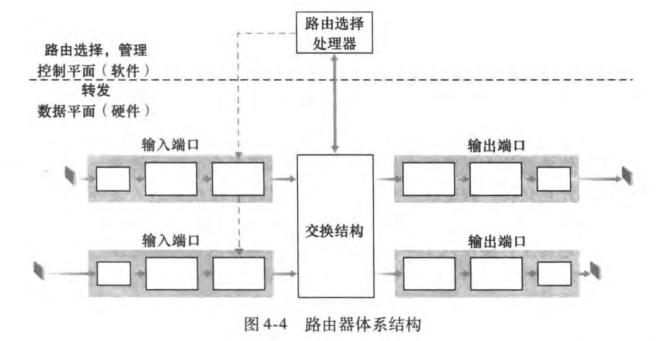
        - 输入端口 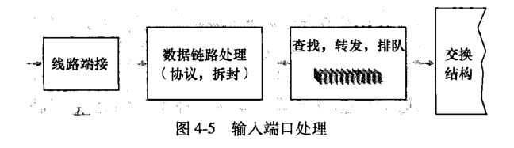
          - 第一个方框：执行物理链路末端的物理层功能
          - 第二个方框：与位于入链路远端的数据链路层交互操作来执行数据链路层功能
          - 第三个方框：输入端口中会执行转发表查找功能（图中输入端口最右侧一个方框），然后将分组通过路由器的交换结构转发到输出端口
        - 交换结构
          - 将路由器的输入端口连接到它的输出端口
        - 输出端口
          - 存储从交换结构接收的分组，并通过执行必要的链路层和输出层功能在输出链路上传输这些分组
        - 路由选择处理器
          - 执行控制平面的功能。在传统路由器中，它执行路由选择协议；在 SDN 路由器中，路由选择处理器负责与远程控制器通信，接收由远程控制器计算的转发表项，并在该路由器的输入端口安装这些表项。
          - 还执行网络管理功能
      - 输入端口的处理
        - 基于目的地转发
          - 使用分组目的地址的前缀（prefix）与转发表的表项进行匹配，如果存在一个匹配项，则路由器向该匹配项相关联的链路转发分组
          - 如果存在多个匹配项，则匹配最长的那一个。这被称为最长前缀匹配规则
        - 交换
          - 经内存交换 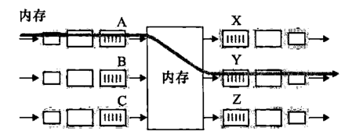
            - 当一个分组到达一个输入端口时，该端口会通过中断的方式向路由选择器发出信号
            - 该分组在路由选择器的指挥下被复制到处理器内存中
            - 路由选择器提取首部中的目的地址，找到对应的输出端口，将该分组复制到输出端口的缓存中
            - 此方法不能同时转发两个分组。假设内存每秒最多可以读取或写入 B 个分组，则总的吞吐量必然小于 B/2
          - 经总线交换 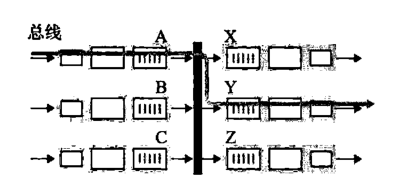
            - 让输入端口为分组预先准备一个交换机的内部标签（首部），用来指示输出端口
            - 该分组通过一条共享的总线被所有输出端口收到，但只有该标签匹配的端口才能保存该分组
            - 标签在输出端口被去除
            - 这种方法一次只能有一个分组能够跨越总线
          - 经互联网络交换 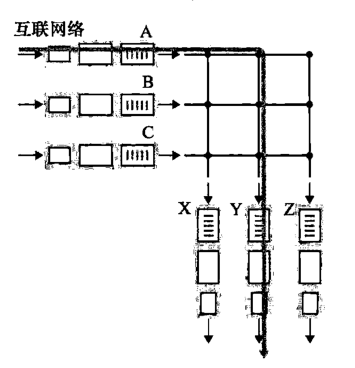
            - 每个横向总线与纵向总线的交叉点都有一个交换结构控制器，能够在任何时候开启和闭合
            - 如果有两个不同的输入端口的两个分组被转发到同一个输出端口，则其中一个必须在输入端等待，因为在某个时刻经特定的总线仅能发送一个分组
            - 这种“纵横式”总线排布方法能够并行地发送多个分组
        - 排队
          - 因为路由器的转发结构决定了对于同一个输出端口的多个分组，只能同时转发一个，所以，输入端口即使只有很少的分组，也会排队。
          - 而两个队列的对首 A 和 B 是同一个输出端口的分组，而 A 和 B 后面的 C 和 D 则是不同的输出端口，本来可以同时发送的 C 和 D 由于 A 和 B 只能转发其中一个而被阻塞了，这就发生了 HOL 阻塞
      - 输出端口处理 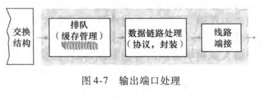
        - 排队
          - 排队的原因是分组经过交换结构到来的速率太快了，输出端口发送的速率跟不上
          - 当没有足够的内存来缓存一个分组时，可以丢弃该分组（被称为弃尾（drop-tail）策略）或者删除一个或多个已排队的分组为新来的分组腾出空间
          - 可以在内存填满之前丢弃一个分组或者为分组加上标记（明确拥塞公告 ECN）可以为发送方提供一个拥塞信号
      - 分组调度
        - 解决排队中的分组以何种次序从输出链路中传输
        - 方法一：先进先出（FIFO，亦称 FIFS）
          - 即按照分组到达的顺序发送分组
        - 方法二：优先级排队
          - 到达输出链路的分组被分类放入输出队列中的优先级类中，通常每个优先权类有自己的队列
          - 同一优先级类的队列中的分组以 FIFO 的方式发送
          - 优先传输高优先级的分组
        - 方法三：循环和加权公平排队
          - 循环排队
            - 在循环排队规则下，分组被分类，但是在类之间不存在严格的服务优先权，循环调度器在这些类之间轮流提供服务
            - 在其中一个类中没有排队的分组时，则立即检查下一个类
          - 加权公平排队（Weighted Fair Queuing, WFQ）
            - WFQ 与循环排队的不同之处在于对每个类分了一个权重 Wi，而每个类能够收到不同数量的服务（即传输分组的次数）
            - 每个类在任何时间间隔内的发送次数占总的发送次数应该是 Wi/W，其中，W 是所有权重之和
    - IPv4（RFC 791）
      - 数据报的格式 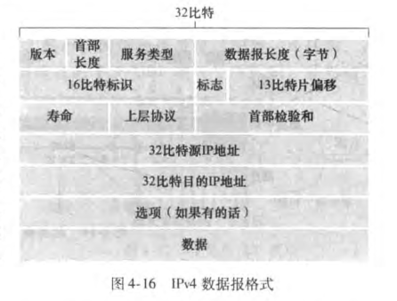
        - 版本：路由器通过版本号来确定如何解释 IP 数据报的剩余部分
        - 服务类型（TOS）
          - ECN 是一种服务类型
          - 实时的数据报和非实时数据报是两种类型
        - 数据报长度：IP 数据报的总长度（首部 + 数据）
        - 标识、标志、片偏移
          - 与 IP 分片有关
          - 一个大的 IP 数据报被分解成几个小的 IP 数据报，然后独立地发往目的地，在那里重新组装
          - IPv6 不允许路由器对分组进行分片
        - 寿命 TTL
          - 用来确保数据报不会永远（可能由于路由选择环路）在网络中循环
          - 在一台路由器处理数据报的时候，该字段的值就减一
          - 如果 TTL 减为 0，则该数据报必须丢弃
        - 上层协议
          - 指示了 IP 数据报的数据部分应该交给哪个特定的运输层协议
          - [例如 TCP 的编号为 6。完整列表可以在链接中找到](https://www.iana.org/assignments/protocol-numbers/protocol-numbers.xhtml)
        - 首部检验和
          - 用于帮助路由器检测收到的 IP 数据报中的 bit 错误
          - 检验和是首部（不包含数据）中的每 2 个字节当做一个数，然后求和再对和求反码的结果置于此字段中
          - 路由器收到数据报之后，再次运算出检验和，如果两者不一致，则丢弃该数据报。
          - 路由器必须将算出的检验和重新置于此字段中，因为 TTL 字段会改变
        - 数据
          - 除了 UDP 和 TCP 的报文段，IP 还可以承载其他类型的数据，如 ICMP
      - IPv4 编址
        - 每个 IP 地址的长度为 32 bit，4 byte，总共大约有 40 亿个可能的 IP 地址
        - IP 地址通常以点分十进制记法（dotted-decimal notation）表示（书写），即各字节间以 `.` 隔开，数字表示该字节对应的 8 bit 表示的十进制数字，例如 192.168.142.30
        - 每台主机和路由器上的每个接口都必须有一个全球唯一的 IP 地址（NAT 接口除外）
        - 一个接口的 IP 地址的一部分由其连接的子网所决定 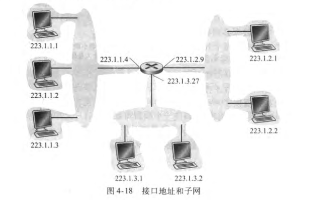
          - 子网的编码方式是 &lt;IP 地址&gt;/&lt;子网掩码&gt;，例如 223.1.1.0/24，其中，24 被称为子网掩码（network mask）
          - 连接到子网的接口的 IP 地址的前 &lt;子网掩码&gt; 位都必须与子网的 &lt;IP 地址&gt; 的前 &lt;子网掩码位&gt; 相同
        - 因特网的地址分配策略被称为无类别域间路由选择（Classless Interdomain Routing, CIDR）
          - 将子网的概念一般化了
          - 地址表示为 a.b.c.d/x
          - a.b.c.d 的 前 x 最高 bit 构成了 IP 地址的网络部分，此部分经常被称为前缀（prefix）
          - 路由/地址聚合：使用单个网络前缀通告多个网络的能力 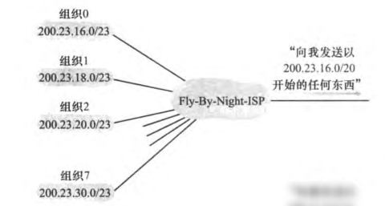
          - 地址的剩余 32-x bit 是用于区分组织内的内部设备的，所有的设备都具有相同的网络前缀
          - 直接广播地址被用于向子网内的所有主机发送数据包，广播地址的格式是前 x 个 bit 与前缀相同，剩余的 32 - x 个 bit 全为 1
            - 例如，注意最后一行 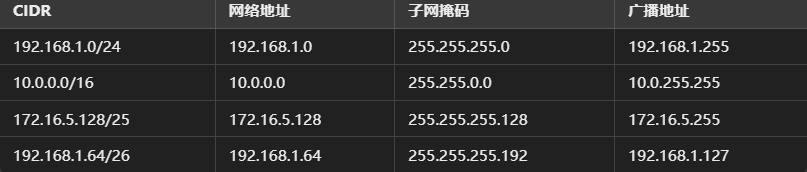
            - 路由器通常不会转发目的 IP 地址为直接广播地址的报文段，这意味着只广播到本子网的主机中，但是可以通过配置路由器来实现转发该报文
          - 本地广播地址：255.255.255.255
            - 报文会被交付到同一个网络中的所有主机
            - 路由器不会转发该报文，这意味着广播只局限于本地（本子网）
          - 网络地址是网络的前缀部分，而其余位全为 0
          - 广播地址和网络地址都不能作为接口的 IP 地址
        - 地址的分配
          - ISP 的地址来源
            - ICANN 负责向 ISP 分配地址，并管理根 DNS 服务器，并分配域名与解决域名纷争
          - 组织的地址来源
            - ISP 得到自己的地址之后，会将 a.b.c.d/x 中的 x 增大，以提供给组织地址： 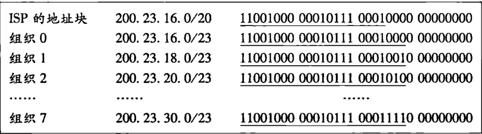
          - 主机地址的来源（动态主机配置协议 DHCP）
            - DHCP 允许主机自动获取一个 IP 地址、子网掩码、第一跳路由器地址（默认网关）和本地 DNS 服务器地址
            - DHCP 是一个客户-服务器协议，客户就是申请 IP 地址的主机
            - 如果某个子网内没有服务器，则需要一个 DHCP 中继代理（通常是路由器），这个代理知道该网络的 DHCP 服务器的地址
            - DHCP 的步骤 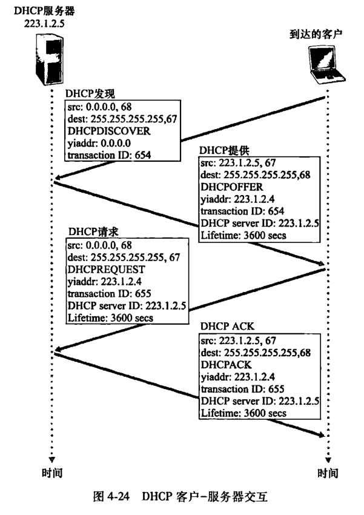
              - DHCP 服务器发现 `priority-1`
                - 通过 DHCP 发现报文（DHCP discover message） 来查找 DHCP 服务器
                - 客户通过 UDP 发送一个目标端口为 67，目的地址为 255.255.255.255 源地址为 0.0.0.0 的 DHCP 发现报文来找到 DHCP 服务器
                - 链路层会将该帧广播到所有与该子网连接的节点
              - DHCP 服务器提供 `priority-2`
                - DHCP 服务器收到发现报文之后，使用 DHCP 提供报文对客户做出响应
                - DHCP 提供报文的目标 IP 地址也是 255.255.255.255，即广播到所有子网的主机中
                - DHCP 提供报文包含了发现报文的事务 ID、向客户推荐的 IP 地址、网络掩码 以及 IP 地址租用期限（通常为几小时或几天）
              - DHCP 请求 `priority-3`
                - 客户可能会收到来自多个 DHCP 服务器的 IP 地址，所以，客户会从中选择一个，并向选中的服务器发送 DHCP 请求报文，回显配置的参数
              - DHCP ACK `priority-4`
                - 服务器用 DHCP ACK 报文对 DHCP 请求报文进行响应，证实所要求的参数
                - DHCP 也提供了可以延长 IP 地址使用期限的机制
        - 网络地址转换（Network Address Translatoin, NAT）
          - 专用网络：不会出现在公共 IP 路由表中，即私有的。这意味着外界的路由器无法找到目的地址为上图地址空间中地址的位置 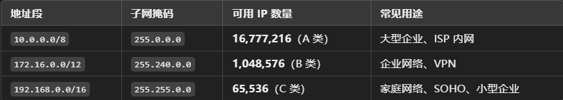
          - 专用网络要能够使用，必须得搭配启用了 NAT 的路由器
          - 启用了 NAT 的路由器对于外界来说，更像是单一 IP 地址的单一设备（一台使用公网 IP 地址的主机）。这是因为 NAT 路由器对外界隐藏了专用网络的细节
          - 那么 NAT 路由器是如何得到它的单一 IP 地址的呢？以及专用网络内的主机的 IP 地址是如何分配的？
            - NAT 路由器从 ISP 的 DHCP 服务器中得到它的地址
            - NAT 路由器本身也可以作为 DHCP 服务器来使用，然后为专用网络内的计算机分配 IP 地址。当然，这些 IP 地址是专用网络的 IP 地址
          - NAT 如何为多个主机提供服务？
            - NAT 路由器上有一张 NAT 转换表（NAT translation table），在该表项中包含了源与目的地的端口号和 IP 地址 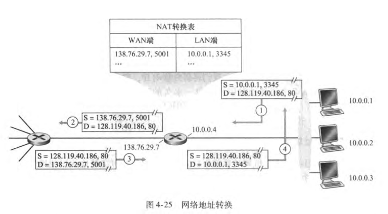
          - NAT 将端口号用于主机寻址，而不是进程寻址。而端口号本身是用来进程寻址的。解决方法包括 NAT 穿越（NAT traversal）工具和 通用即插即用 UPnP （Universal Plug and Play）协议
    - IPv6（RFC 2460）
      - 数据报格式 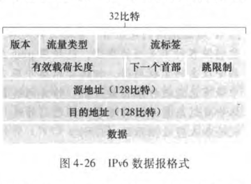
        - 地址长度从 32 bit 增加到了 128 bit
        - 流标签
          - 发送方给特殊的流加上标签，以特殊处理
          - 例如更高的优先级
        - 流量类型
          - 与 IPv4 的服务类型 TOS 相似
        - 有效载荷长度：40 字节首部之后的数据的长度
        - 下一个首部：标识数据报中的数据应该交付给哪个协议（同 IPv4 首部中的协议字段）
        - 源地址和目的地址：在 RFC 4291 中进行了描述
      - IPv6 任播
        - 允许多个设备拥有同一个 IP 地址
        - 路由器会将数据报发送到最近的一个设备中去
      - IPv6 不允许分片
        - 如果路由器发现分组太大，则需要向发送方发送一个分组太大的 ICMP 差错报文
      - IPv6 不计算检验和（因为 TCP 和 UDP 都进行了）
    - IPv4 向 IPv6 迁移
      - 方法是建隧道（RFC 4213）
      - 假设有 A -&gt; B -&gt; C -&gt; D 这么一段路由器构成的链路，其中 B 和 C 只支持 IPv4
        - 则 IPv6 的数据报达到 A 的时候，数据报在 IPv6 数据报的基础上再封装上一层 IPv4 的数据报，以致于可以误导中间的 B 和 C 路由器以为这就是 IPv4 数据报。这个封装好的数据报的目的地址是 D。
        - 当封装好的数据报到达 D 的时候，它发现该数据报的 IPv4 的协议号是 41，则它知道这个 IPv4 数据报的里面封装着一个 IPv6 的数据报，它会将 IPv6 的数据报提取出来，并接着转发
        - B -&gt; C 这段链路被称为隧道
    - 泛化转发与 SDN
      - 所谓的泛化转发是指将基于目的地的转发中的匹配 + 操作泛化出来，以完成更多复杂的操作。
        - 例如，不仅匹配地址，还可以匹配多个首部字段
        - 例如，不仅可以执行转发操作，还可以重写首部值（类似 NAT）、有意识地丢弃某个分组（防火墙）等
      - OpenFlow 是被高度认可和成功的关于泛化转发的标准
        - OpenFlow 的转发表被称为流表（flow table），它的表项包括：
          - 首部字段值的集合
            - 入分组将与之匹配
          - 计数器集合
            - 当分组与流表项匹配时更新计数器
          - 当分组匹配流表项时所采取的操作集合
        - 匹配
          - OpenFlow 1.0 流表的分组匹配字段 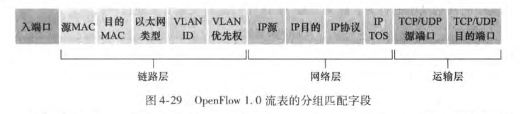
            - 入端口只是分组交换机上接收分组的输入端口
            - OpenFlow 新的规范已经添加到了 41 个，而 1.0 中只有这 12 个
          - 匹配项可以使用通配符，例如 128.119.*.*
          - 每个流表项具有优先权，如果有一个分组可以匹配多个流表项，则匹配最高优先权的那个
        - 操作
          - 每个流表项有 0 或多个操作列表，如果有多个，则按照表中规定的次序执行
          - 重要的操作：
            - 转发：将一个分组转发到特定的物理输出端口、广播到所有端口、通过所选的端口进行多播等等
            - 丢弃：没有操作的流表项表明某个匹配的分组应当被丢弃
            - 修改字段：在被转发到输出端口之前，分组首部的 10 个字段（OpenFlow 1.0 中除了 IP 协议字段外的所有第 2、3、4 层的字段）的值都可以重写
  - 控制平面（control-plane）
    - 功能：控制数据报沿着源主机到目的主机的端到端路径中路由器之间的路由方式（路由选择）
    - 路由选择一般由软件实现
    - 路由选择算法决定了每台路由器转发表中的内容
    - 路由器的转发表是如何被控制的？
      - 每路由器控制 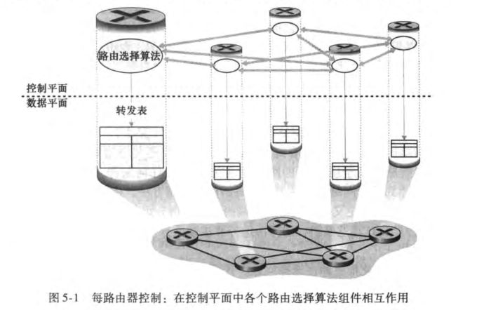
        - 指每台路由器都运行一种路由选择算法
        - 每台路由器都有一个路由选择组件，用于与其他路由器中的路由选择组件通信，以计算其转发表的值
      - 逻辑集中式控制 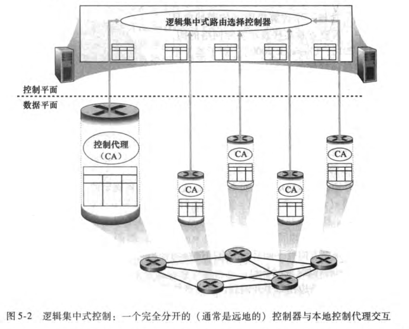
        - 逻辑集中式控制器与经一种定义良好的协议与每台路由器中的一个控制代理（CA）进行交互以配置和管理该路由器的转发表
        - CA 的任务就是与控制器通信然后按控制器的命令执行
    - 集中式路由选择算法（centralized routing algorithm）
      - 用完整的、全局型的网络信息来计算出从源到目的地之间的最低开销路径
      - 即此算法要以所有节点之间的连同性和开销为输入。因此，在算法开始之前，要提前以某种方式获得这些信息
      - 因为此算法必须知道网络中每条链路的开销，所以被称为链路状态（Link State, LS）算法
      - 每个节点（路由器）向网络中的所有其他节点广播链路状态分组来完成 LS 算法的输入
        - 最终会导致每一个节点都知道了关于整个链路状态的信息
        - 每个节点都运行 LS 算法从而计算出相同的最低开销路径集合
      - Dijkstra 算法
        - 经过 k 次迭代后可以知道 k 个目标节点的最低开销路径
        - 定义 D(v) 为到算法的本次迭代，从源节点到目的节点 v 的最低开销路径的开销
        - 定义 p(v) 为从源到 v 沿着当前最低开销路径的前一个节点（v 的邻居）
        - 定义 N' 为从源到 v 的最低开销路径已经知道的节点 v 的集合
        - 下面是计算从源节点 u 到网络中每一个其他节点的最短路径的算法： 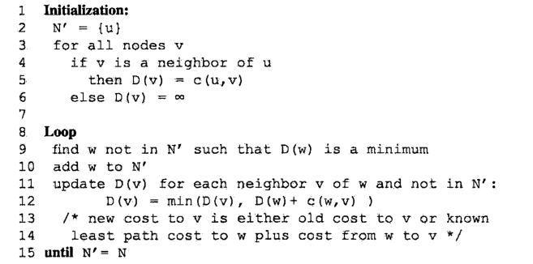
        - 当算法结束之后，可以通过 p(v) 找到 p(v) 的 p(v)，进而构建出一条路径出来
      - 当路径的开销是随负载而变化的，并且 c(u, v) != c(v, u) 的时候，如果所有路由器同时运行 LS 算法，则会导致所有路由器都把流量引入当时低负载的那条链路，然后再次运行算法的时候，又将所有的流量都引入了另一条链路，这被称为震荡
        - 解决震荡的方法是将每个路由器发送链路通告的时间随机化
    - 分散式路由选择算法（decentralized routing algorithm）
      - 在此算法中，没有节点（路由器）拥有所有网络链路开销的完整信息
      - 每个节点只需知道与其直接相连链路的开销信息就可以开始工作
      - 通过迭代计算过程以及与相邻节点的信息交换，一个节点逐渐计算出到达某目的节点或一组目的节点的最低开销路径
      - 距离向量（Distance-Vector, DV）路由选择算法
        - Bellman-Ford 方程，令 d(x, y) 是 x 到 y 的最低开销路径，则有： d(x, y) = min(c(x, v) + d(v, y)) 其中 v 是 x 的所有邻居。
        - 定义 N 为某个路由器节点的集合
        - 令 D(x, y) 是从 x 到 y 的最低开销路径的估计值，y 是 N 中的所有节点
          - 初始赋值： 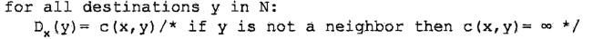
        - 令 Dx 为是节点 x 的距离向量，即从 x 到 N 中所有其它节点的 y 的开销估计向量（类似与 c++ 中的 vector，其实是一个集合）
        - 每个节点 x 维护 3 个路由选择信息
          - 到每个邻居 v 的开销 c(x, v)
          - x 的距离向量 Dx
          - 它的每个邻居的距离向量 Dv
        - 每个节点向邻居发送它的距离向量；同时，它也会接收到来自邻居的距离向量
        - 当节点 x 收到了一个距离向量，使用 Bellman-Ford 公式来计算出新的距离向量： D(x, y) = min(c(x, v) + D(v, y)) 其中，v 是 x 的邻居，y 是 N 中的所有节点
          - 如果距离向量改变了，则 x 向它的每个邻居发送更新过后的距离向量，进而让所有邻居更新给它们自己的距离向量
          - 如果一个分组在 x 节点要到 y 节点，则 x 将它发送到 D(x, y) 取得最小值的邻居 v 中
        - 算法的整体过程 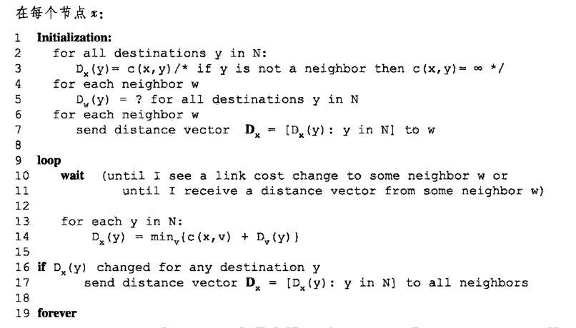
          - 示例 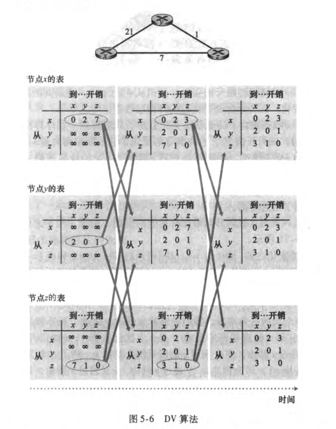
        - DV 算法的路由选择回环问题
          - 有上图所示的路由器连接及其开销，在 t0 时刻，y 发现到 x 的开销变为 60，并且有一个分组要发往 x 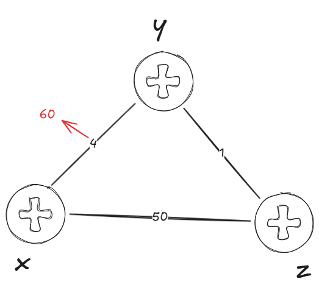
          - 在 t0 时刻，z 还没有收到来自 y 新的距离向量，所以 y 还意味 z 到 x 能够以 4 + 1 = 5 的开销到达 x，所以它将分组发送给 z，开销为 z 到 x 的开销加上 y 到 z 的开销，即 5 + 1 = 6
          - 在 t1 时刻，z 收到了 y 的新的距离向量，y 的距离向量表明，它可以以 6 的开销到达 x，所以，它继续将 y 发给它的那个分组发回给 y
          - y 继续重复上述过程，每次它到 x 的最小开销只增加 1，从而导致 z 到 x 的最小开销每次也只增加 1。1 是 y 到 x 的开销，所以每次只增加 1。
          - 重复直到 z 到 x 的距离的最小值大于 50 了才会通过 z 与 x 直接相连的那条通道来传输那个分组
        - 毒性逆转（poisoned reverse）：解决简单选择回环问题
          - 如果 z 选择通过 y 到达目的地 x，则它同时通知 y，z 到 x 的距离是无穷大
          - 此种方法不能解决选择回环问题，因为当涉及到更多节点相连的时候，环路无法用毒性逆转检测到
    - LS 算法和 DV 算法的比较
      - LS 算法的报文复杂，而且要发送 O(N * E) 个报文
      - DV 算法的收敛依赖于许多因素，比较慢
      - LS 节点仅计算自己的转发表，所以路由计算是分离的，提供了一定程度的健壮性
      - DV 算法中，一个节点向另一个节点通报其不正确的开销会导致这个消息扩散到整个网络
    - 因特网中自制系统内部的路由选择：OSPF
      - 由于全球的有上亿的主机，所以在如此数量庞大的路由器上运行一个 DV 算法或 LS 算法是不可能的
      - 所以，通常 ISP 将划分出一些路由器组织成一个自治系统（Autonomous System, AS）
        - 一个自治系统由其全局唯一的 AS 号（ASN）所标识
        - ASN 有 ICANN 分配
        - 同一个 AS 的路由器运行相同的路由选择算法并且有彼此的信息
        - AS 中运行的协议被称为自制系统内部路由选择协议
          - OSPF 协议和 IS-IS 被广泛用于 AS 内部路由选择协议
      - OSPF：开放最短路优先路由选择协议（RFC 2328）
        - 是一种 LS（链路状态）协议
        - 使用洪泛链路状态信息和 Dijkstra 最低开销路径算法
          - 洪泛链路状态信息是指：路由器向 AS 内的所有其他路由器广播路由选择信息
          - 当链路状态（开销、连接、中断）发生变化时，路由器就会广播链路状态信息
          - 链路状态未发生变化时，路由器也要周期性地（至少 30 min 一次）广播链路状态
        - 各条链路的开销由网络管理员配置
        - OSPF 通告通过 OSPF 报文实现，该报文直接由 IP 进行承载，其上层协议为 89
          - OSPF 没有经过 TCP，所以必须自己实现可靠报文传输、链路状态广播等功能
          - OSPF 还向邻居发送 HELLO 报文以检查该链路是否还可以运行
          - OSPF 路由器还可以从邻居处获得链路状态的数据库
        - 优点
          - 安全：能够鉴别 OSPF 报文是否与自己同属于一个 AS 中（通过 MD5 加密）
          - 允许多条相同开销的路径存在，而不是只选择其中一条来承载流量
          - 对单播与多播路由选择的综合支持：多播 OSPF（MOSPF）为 OSPF 提供了多播路由选择功能
          - 支持在单个 AS 中的层次结构
            - OSPF 能够层次化地配置多个区域，每个区域都运行自己的 OSPF 链路状态路由选择算法
            - 在每个区域，一台或多台区域边界路由器负责向流向该区域外的分组提供路由选择
            - 在一个 AS 中只有一个 OSPF 区域配置成主干区域，其作用是为该 AS 中其他区域之间的流量提供路由选择
              - 主干区域包含了 AS 内的所有区域边界路由器和其它的一些路由器
              - 所以，一个分组要到达本 AS 区域内的目的地，经过的路径可能是： A 区域路由器 -&gt; A 区域的边界路由器 -&gt; 主干区域 -&gt; B 区域的区域边界路由器 -&gt; 目的地
    - ISP 之间的路由选择：BGP
      - AS 之间必须运行相同的路由选择协议，这被称为自治系统间路由选择协议
      - AS 之间运行的协议为边界网关协议（Broder Gateway Protocol, BGP）（RFC 4271）
        - BGP 是一种分布式的、异步的协议
        - 在 BGP 中，分组不是路由到一个特定的目的地址，而是路由到 CIDR 化的前缀。每个前缀表示一个子网或者一个子网的集合（多路聚合）
          - 所以，一台路由器的转发表将具有 (x, I) 的表项，其中 x 为前缀（例如 130.14.54/22），I 是该路由器的接口之一的接口号
        - 对于每个 AS，每台路由器要么是一台网关路由器（gateway router），要么是一台内部路由器（internal router）
          - 网关路由器直接连接到其他 AS 中的一台或多台路由器
          - 内部路由器仅连接它在自己 AS 中的主机和路由器
        - BGP 允许路由器：
          - 从邻居 AS 获得前缀的可达性信息
          - 允许每个子网向因特网的其余部分通告它的存在
          - 确定到某前缀的“最好”的路由
            - 一台路由器可能知道两条或更多条道特定前缀的不同路由。为了确定最好的路由，路由器本地运行 BGP 路由选择过程
        - 通告 BGP 路由信息
          - BGP 使用 179 端口的半永久 TCP 连接交换路由选择信息
            - 跨越两个 AS 的 BGP 连接称为外部 BGP（eBGP）连接
            - 在相同的 AS 中的两台路由器之间的 BGP 连接被称为内部 BGP（iBGP）连接
            - 例如。BGP 连接不完全与物理连接相同 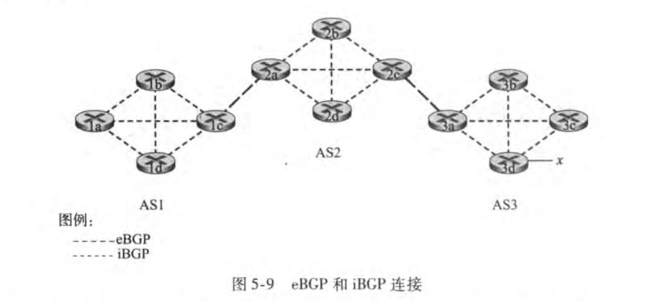
              - 实际的物理连接 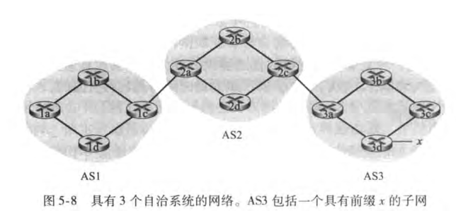
          - 假设 AS3 要通告 x 的存在 
            - 3a 向 2c 发送 eBGP 报文 “AS3 x” （简化过后）
            - 2c 通过 iBGP 发送报文 “AS3 x”
            - 2a 向 1c 通过 eBGP 发送报文 “AS2 AS3 x”
            - 1c 通过 iBGP 向 AS1 中的所有路由器发送报文 "AS2 AS3 x"
        - 确定最好的路由
          - 路由器通过 BGP 通告前缀时，在前缀中包括了一些属性（attribute）。前缀加属性被称为路由（route）
          - AS-PATH 属性是通告已经通过的 AS 列表（其中包含 ASN）
            - 路由器使用 AS-PATH 来检测和防止通告环路
            - 如果一台路由器在路径列表中看到了包含了自己的 AS，则它将拒绝该通告
          - NEXT-HOP 是 AS-PATH 起始的路由器接口的 IP 地址
            - 例如， AS-PATH 为 AS2 AS3 x，则 NEXT-HOP 为 AS2 的网关路由器的地址 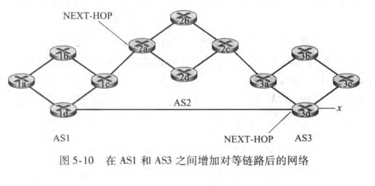
            - 注意到，NEXT-HOP 的子网直接连接到 AS1
          - 热土豆路由选择
            - 路由器通过它在 AS 内部的路由选择信息，查询并计算它到每一个 NEXT-HOP 的最小开销，然后将分组发送到开销最小的那个 NEXT-HOP 中去。并将 (x, I) 添加到它的转发表中去。
            - 上述过程既需要 BGP，也需要用到 AS 内部路由选择协议 
            - 分组被比喻成了烫手的土豆，路由器尽可能快地将它传递出去
            - 此算法没有考虑端到端路径中其它部分的开销
          - 路由器选择算法
            - 如果相同的前缀有两条或者多条路由，则顺序调用下面的消除规则直到余下一条路由。
            - 消除规则
              - 路由除了 AS-PATH 和 NEXT-HOP 之外，还有一个本地偏好（local preference）属性，具有最高的本地偏好值将被选择 `priority-1`
                - 一个路由的本地偏好可能由该路由器设置，或者从其它路由器中学习到
                - 本地偏好的值是一种策略决定，它完全取决于 AS 的网络管理员
              - 如果具有最高的本地偏好值的路由器有多个，则选择具有最短 AS-PATH 的路由 `priority-2`
                - BGP 使用 DV 算法决定路径。距离是 AS 跳的跳数，而不是路由器跳的跳数
              - 如果还有多条路径，则使用热土豆路由选择 `priority-3`
                - 选择路由到最靠近 NEXT-HOP 路由器中去
              - 如果仍有多条路径，则使用 BGP 标识符来选择路由。选择 BGP ID 最小的路径。 `priority-4`
        - IP 任播
          - BGP 被用于实现 IP 任播（anycast）服务（RFC 1546、7094）
          - 通常用于 DNS 中
          - 多台主机（服务器）可以具有相同的 IP 地址，并且每台主机都使用标准的 BGP 来通告它的存在
          - 当某个 BGP 路由器收到对该 IP 地址的多个路由通告时，它认为是这些通告是对同一个物理位置的同一台主机的多条路径
          - 然后，BGP 路由选择算法从中选择最优的路径
          - CDN 一般不使用 IP 任播来为客户选择服务器，因为由于 BGP 路由选择变化能够导致相同 TCP 连接的不同分组到达 Web 服务的不同实例
        - 路由选择策略（路由选择算法中本地偏好值的确定）
    - SDN 控制平面
      - SDN 体系结构的特征（将所有能够转发分组的设备称为交换机） 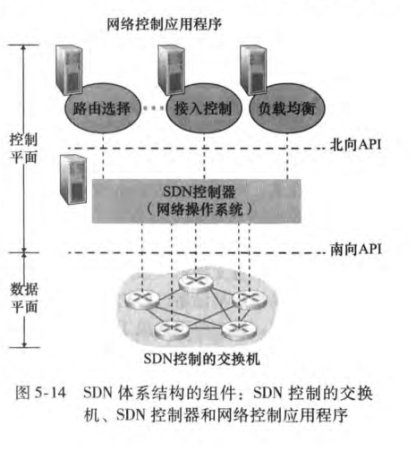
        - 基于流的转发
        - 数据平面与控制平面分离
        - 网络控制功能
          - SDN 控制平面包含一个 SDN 控制器以及多个网络控制程序
          - SDN 控制器维护并为控制程序提供链路、交换机、主机的状态
          - SDN 控制器同时也为控制程序提供能够监视、编程和控制网络设备的方法（API）
        - 可编程的网络
          - 通过控制平面的网络控制程序可以控制网络设备的数据平面
      - SDN 控制器 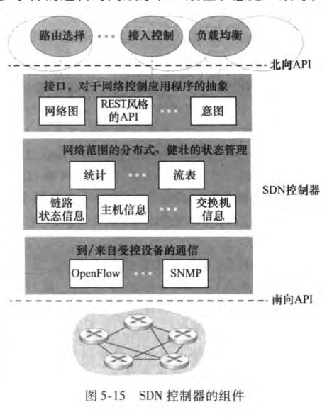
        - 通信层：SDN 控制器和受控网络设备之间的通信
          - OpenFlow 是实现这种通信功能的特定协议
        - 网络范围状态管理层
          - 维护和管理链路中的主机、交换机、其它 SDN 控制设备的最新状态信息
        - 网络控制应用程序层的接口
          - 控制器提供 API 与控制程序交互
          - 该 API 可以允许控制程序在状态管理层之间读/写网络状态和流表
          - 当状态改变时，应用程序能够注册进行通告
          - SDN 控制器使用 REST 请求响应接口
        - SDN 控制器是逻辑上集中但是物理上分散的系统
      - OpenFlow 协议
        - 运行在 SDN 控制器、 SDN 控制的网络设备和其他实现 OpenFlow API 的设备之间
        - OpenFlow 运行在 TCP 之上，使用 6653 端口号
        - OpenFlow 的部分报文
          - 控制器 -&gt; 受控交换机
            - 配置
              - 允许控制器查询并配置交换机的参数配置
            - 修改状态
              - 增加/删除/修改交换机流表中的表项
              - 设置交换机端口特性
            - 读状态
              - 允许控制器从交换机的流表和端口收集统计数据和计数器值
            - 发送分组
              - 允许控制器在受控交换机从特定的端口发送出一个特定的报文
          - 受控交换机 -&gt; 控制器
            - 流删除
              - 通知控制器已删除一个流表项
            - 端口状态
              - 通知端口状态的变化
            - 分组入
              - 如果分组没有与任何流表项相匹配，则这个分组将被发送到控制器进行额外的处理
              - 如果匹配时流表项对应的操作包含了将该分组发送到控制器中，则也是采用此种报文
    - ICMP：因特网控制报文协议（RFC 792）
      - ICMP 被用来主机与路由器之间彼此沟通网络层的信息
      - ICMP 报文由一个类型字段和一个编码字段，并且包含了首次生成的 IP 数据报的首部和前 8 个字节（以便发送方能够确定引发差错的报文）
      - ICMP 的报文类型 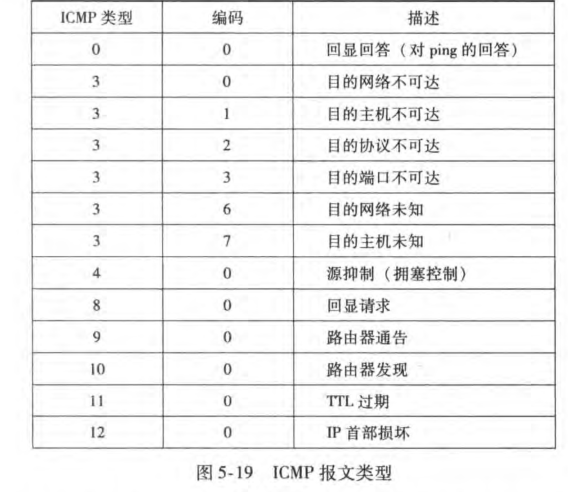
      - traceroute 工具的原理
        - 向目的地主机发送一系列普通的 IP 数据报（包含了一个不可达的 UDP 端口号和 UDP 报文段），第一个数据报的 TTL 为 1，第二个数据报的 TTL 为 2，依次类推。每种 TTL 发送了 3 份
        - 当 TTL 为 0 的时候，路由器会发送一个 ICMP 报文（类型 = 11，编码为 0）的报文，该报文包含了路由器的名字和它的 IP 地址
        - 当目的主机收到了 UDP 报文段，发现该端口不可达，所以会向源主机发送一个端口不可达的ICMP 报文（类型 3 编码 3），至此，traceroute 工具停止发送数据报
      - IPv6 定义了 ICMP 的新版本（ICMPv6 RFC 4443），使其包含了“分组太大”这一类型和编码
    - 网络管理和 SNMP/NETCONF/YANG
      - 网络管理的组件
        - 管理服务器
          - 一个应用程序，可以与人类进行交互
          - 运行在网络运营中心（NOC）的集中式网络管理工作站上
          - 发起控制网络行为的动作
        - 被管设备及其软件
          - 被管对象是被管设备中的硬件（例如网卡）和用于这些硬件及软件的配置参数
        - 管理信息库（MIB）
          - 一个被管设备与每个被管对象的关联信息收集在其中
          - MIB 中的对象包括：计数器的值（例如 IP 数据报首部差错而丢弃的数据报数量）、DNS 服务器上的软件版本的描述信息等等
          - MIB 对象被称为 SMI （Structure of Management Infomation）的数据描述语言所定义
        - 网络管理代理
          - 存在于每个被管设备的进程中
          - 负责与管理服务器进行通信，在管理服务器的命令和控制下载被管设备中采取本地动作
        - 网络管理协议
          - 运行在管理服务器和被管设备之间
          - 允许管理服务器查询（而不是被管设备主动传递）被管设备的状态，并进过代理间接地在此设备上进行操作
          - 代理能够使用网路管理协议向管理服务器通知异常事件
      - 简单网络管理协议：SNMPv2（RFC 3416）
        - 一个应用层协议
        - SNMPv2 定义了 7 种类型的报文，这些报文被称为协议数据单元（PDU） 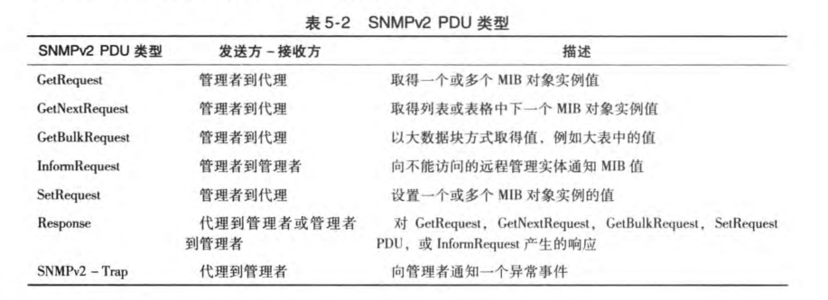
          - PDU 的格式 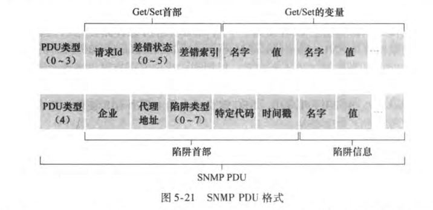
        - SNMP PDU 通常通过 UDP 进行传输
      - NETCONF 协议和 YANG
        - 在管理服务器和被管理网络设备之间运行
        - 通过其报文可以
          - 在被管设备上检索、设置和修改配置数据
          - 查询被管设备的运行数据和统计
          - 订阅由被管设备产生的通知
        - 管理服务器通过向被管设备发送定义在 XML 文档中的配置并激活被管设备上的配置来主动控制被控设备
          - 使用 RPC 的范式 TCP + TLS 来进行通信
          - 报文使用 XML 编码
        - 部分 NETCONF 的操作 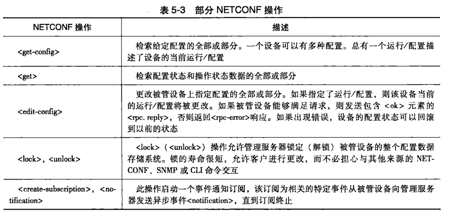
        - YANG
          - 是一种数据建模语言，用于精确定义 NETCONF 使用的网络管理数据的结构、语法和语义。类似于 SMI 定义 MIB
- 数据链路层
  - 将运行链路层协议的任何设备均称为节点（node）
    - 节点包括主机、路由器、交换机和 WiFi 接入点
  - 沿着通信路径连接相邻节点的通信信道称为链路（link）
  - 链路层中的分组被称为帧
  - 链路层提供的服务
    - 成帧
      - 几乎所有的链路层协议都要用链路层帧封装起来
    - 链路接入
      - 介质访问控制（Medium Access Control, MAC）协议规定了帧在链路上的传输的规则
    - 可靠交付
      - 链路层可靠交付服务通常用于易产生高差错率的链路。如无线链路
      - 其目的是在差错发生的链路上纠正一个差错，而不是通过运输层或者应用层协议进行端到端的数据重传
      - 有线链路一般不提供可靠交付服务
    - 差错检测和纠正
      - 接收方节点可能将一个原本为 1 的 bit 判断为 0，反之亦然。
      - 在出现 bit 差错的情况下，可以进行纠正
  - 链路层大多数情况下，在被称为网络适配器（又称网络接口控制器 NIC）的芯片上实现，
    - 故而，链路层的大多数协议都是通过硬件实现的
    - NIC 取得高层生成并存储在主机内存中的数据报，然后封装成帧，遵循 MAC 协议将该帧传进通信链路中
    - 链路层的有些协议仍然使用软件实现的
  - 差错检测与纠正（Error-Detection and Correction, EDC）
    - 差错检测
      - 差错检测并不一定能够检测出 bit 差错
      - 假设要发送的信息 D 中有 d 个 bit
      - 奇偶检验方法
        - 发送方要在 D 中包含一个附加的 bit，可能是 0 可能是 1
          - 在奇检验方案中，要使 d + 1 个 bit 中 1 的总数为奇数
          - 在偶检验方案中，要使 d + 1 个 bit 中 1 的总数为偶数
        - 在偶检验方案中，如果接收方数除了奇数个 bit，则可以断定奇数个 bit 出现了差错。至少是一个 bit 出现了错误。而如果出现了偶数个 bit 差错，则无法检测出来
          - 在实际中，表明此种方法不能检测出错误的概率高达 50%
        - 接收方检测和纠正差错的能力被称为前向纠错（Forward Error Correction,FEC）
        - 将 d 个 bit 划分为 i 行 j 列，然后对每行每列计算出奇偶值，就可以纠正单个 bit 出现错误的情况 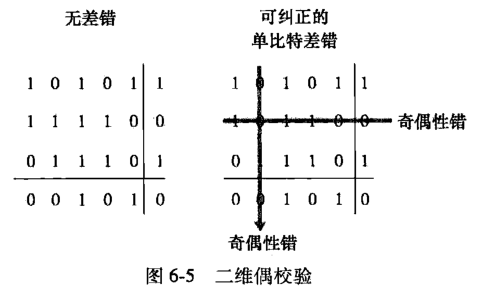
      - 检验和方法（因特网检验和）
        - 将每 16 bit 作为一个整数，然后求出和。再对和进行反码运算，将反码写入检验和字段
        - 接收方对整个数据（包括检验和）再次进行上述运算，如果结果全为 1 则没有差错
        - 因特网检验和不一定能检测出错误
      - 循环冗余检测（Cyclic Redundancy Check, CRC）编码，也称多项式编码（polynomial code） 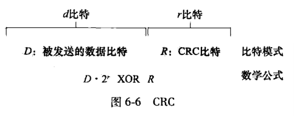
        - 是当今计算机网络中广泛运用的差错检测技术
        - 发送方和接收放协商一个 r + 1 比特，称为生成多项式，假设其为 G。要求 G 的最高有效为的 bit 是 1
          - G 在是一个给定的值，由标准确定
        - 发送方选择 r 个附加比特 R 附加到 D 上，得到一个 d + r 比特的二进制数，R 要使得 d + r 比特使用模 2 除法能刚好被 G 整除，即没有余数
          - 模 2 除法
            - 模 2 算术在加法和减法中不进位也不借位。这就导致加法和减法是一样的，都等价于按位异或： 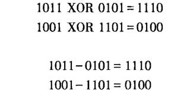
            - 在模 2 除法中，会运用到模 2 减法 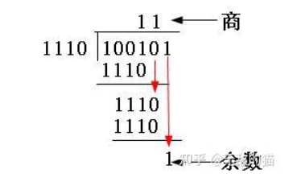
            - 乘法和除法与正常的一样（不完全一样），乘以 2^k 会以原来的比特模式向左移动 k 位
              - 在正常情况下，比特模式 11（十进制 3）乘以 2^2，则结果会以 11 比特模式向左移动 2 位，得到结果 1100
          - 附加了 R 的 D 的 d + r 可以表示为： D * 2^r XOR R
            - D * 2^r 是以 D 的比特模式将 D 左移 r 位
            - XOR R 是加上 R
          - 由于要刚好被 G 整除，没有余数，则设 n为 d + r 比特所表示的数，则有: D * 2^r XOR R = nG 然后对等式两边都用 R 异或，得到： D * 2^r = nG XOR R 上式表明，用 G 来除以 D * 2^r，余数刚好是 R，即 R = remainder((D*2^r)/G)
            - 计算示例 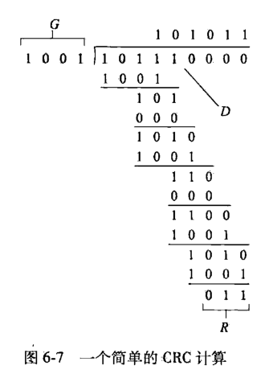
        - 接收方用 G 并运用模 2 除法来除以收到的 d+r 比特，如果余数非 0，则接收方知道发生了错误
        - 每个 CRC 标准都能检测小于 r+1 比特的差错
        - 长度大于 1+r 的差错可以以概率 1 - (0.5)^r 被检测到
        - 任何奇数个 bit 错误都会被检测到
  - 多路访问链路和协议
    - 点对点链路（point to point link）
      - 由链路一端的单个发送方和链路另一端的单个接收方组成
      - 点对点协议 PPP 和高级数据链路控制（HDLC）就是为点对点链路设计的
    - 广播链路（broadcast link）
      - 让多个发送者和多个接收者都连接到相同的、单一的、共享的广播信道上 
      - 如何协调多个发送和接收节点对同一个共享信道的访问，这就是多路访问问题
      - 广播信道通常用于局域网中
      - 多路访问协议大致可分为 3 种类型
        - 信道划分协议（channel partitionning protocal）
          - 时分多路复用（TDM） 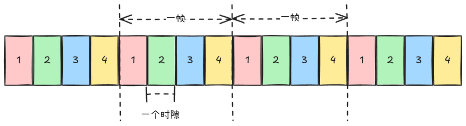
            - TDM 将时间划分为时间帧（time frame），并进一步划分每个时间帧为 N 个时隙（slot）
            - 然后把每个时隙分配给 N 个节点中的一个
            - 无论何时某个节点在有分组要发送的时候，在循环的 TDM 帧中指派给它的时隙内传输分组
            - 选择的时隙要使一个时隙内能够传输单个分组
            - 缺陷：在只有一个发送方的时候，它也不得不等待一会儿才能发送
          - 频分多路复用（FDM）
            - 将 R bps 的信道划分为不同的频段，每个频段具有 R/N 的带宽
            - 将每个频率分配给 N 个节点中的一个
            - 缺陷：当只有一个发送方的时候，它也只能使用 R/N 的带宽
          - 码分多址（Code Division Multiple Access, CDMA）
            - CDMA 为每个节点分配一种不同的编码，然后每个节点用它的编码来对它发送的数据进行编码
            - 如果精心选择编码，则 CDMA 网络能够做到同时发送分组，并且接收方能够正确接收发送方编码的数据
        - 随机接入协议（random access protocol）
          - 在此协议中一个传输节点总是以信道的全部速率进行发送
          - 当有碰撞发生时，涉及碰撞的节点们反复地重发它们各自的帧，直到该帧无碰撞地通过为止
            - 每个节点经历一次碰撞时，它不必立刻重发该帧，而是等待一个随机的时间再发送
          - 时隙 ALOHA 协议
            - 假设： 1. 所有帧由 L 比特组成； 2. 时间被划分为 L/R 秒的时隙（一个时隙等于传输一帧的时间）； 3. 节点只在时隙起点开始传输帧 4. 节点之间是同步的，每个节点都知道时隙何时开始 5. 如果在一个时隙中有帧发生了碰撞，则所有节点可以在该时隙结束之前检测到该碰撞事件
            - 当一个节点有帧要发送时，它等到下一个时隙开始并在该时隙传输整个帧
            - 如果发生了碰撞，则它会在该实习内检测到该碰撞，然后以概率 p 来决定是否在后面的时隙内重传该分组
            - 这个协议的最大效率为 1/e = 0.37
          - ALOHA 协议
            - ALOHA 与 时隙 ALOHA 协议的区别是：节点之间不会进行同步，即等到时隙开始时才进行传输，而是当有数据到达的时候立即传输。
            - 如果一个传输的帧发生了碰撞，则这个节点立即以概率 p 重传该帧，否则，该节点等待一个帧传输的时间，等待之后，再次以概率 p 传输该帧，如此重复
            - 这个协议的最大效率为 1/2e，是时隙 ALOHA 的一半
          - 载波侦听多路访问（CSMA）协议
            - 载波侦听（carrier sensing）:一个节点在传输前先听信道，如果有其它节点正在传输，则等待直到检测到一小段时间没有传输，然后开始传输
            - 碰撞检测（collision detection）：一个传输节点在传输的时候一直侦听此信道，如果它检测到另一个节点正在传输，它就停止传输，然后等待一段随机时间再进行侦听，然后再传输
              - 为什么节点在没有其它节点传输的时候进行的传输也会发生碰撞？这是因为信道传播时延，即分组在信道中传输是有时延的。A 在 B 的上游，则A 发送分组后，分组还没有到达 B，则 B 以为没有分组在传输，则它也发送自己的分组，从而会导致碰撞
            - 具有碰撞检测的载波侦听多路访问（CSMA/CD）
              - 在不具有碰撞检测的 CSMA 协议中，即使发生了碰撞，节点都会继续完整地传输它们的帧
              - 而具有碰撞检测的 CSMA/CD 协议，检测到碰撞之后会立即停止传输
            - 检测到碰撞停止传输后，应等待的随机时间如何确定？
              - 二进制指数后退（binary exponential backoff）：当传输一个给定的帧时，在该帧经历了连续的 n 此碰撞之后，节点随机地从 [0, 1, 2, ..., (2^n) - 1] 中选择一个数字 K
              - 对于以太网，它等待的时间就是： K * (发送 512 bit 进入以太网所需的时间量)
              - n 能够取的最大值为 10
              - 发送一个新帧时，会重置 n
            - CSMA/CD 的效率为。d_prop 为信号在任意两个适配器之间传播所需的最大时间（时延）；d_trans 为传输一个最大长度的以太网帧的所需的时间 
        - 轮流协议（taking truns protocol）
          - 轮询协议（polling protocol）
            - 节点之一被指定为主节点，主节点以循环的方式轮询（poll）每个节点
            - 主节点先发送一个报文告诉节点 1 它可以传输帧的最大数量。当节点 1 传输了一些帧之后，它再告诉节点 2 它可以传输的帧的最多数量，以此类推
              - 主节点可以通过观察信道上是否缺乏信号，来判断节点是否完成了传输
            - 缺点：引入了轮询时延；如果主节点故障，则整个信道都变得不可操作
            - 蓝牙就是一个轮询协议
          - 令牌传递协议（token passing protocol）
            - 没有主节点，一个被称为令牌（token）的特殊帧在节点之间以某种固定的次序进行交换
            - 当一个节点收到令牌时，如果它有要发送的帧，则持有这个令牌，否则立即向下一个节点转发该令牌
            - 缺点：某个节点的故障可能会使整个信道崩溃；如果一个节点没有释放令牌，则必须调用某些恢复步骤来使令牌返回到整个循环中
            - 例如：光纤分布式数据接口（FDDI）协议和 IEEE 802.5 令牌协议
        - 将 3 种类型的协议组合到一起的实例
          - DOCSIS：用于电缆因特网接入的链路层协议 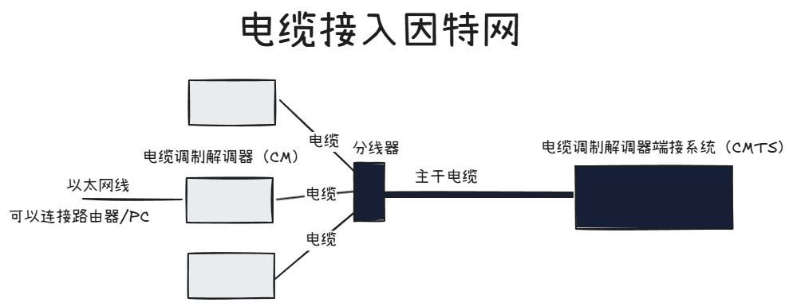
            - 运营商管理的电缆调制解调器终端系统（Cable Modem Termination System, CMTS）与几千个位于用户家中的电缆调制解调器（Cable Modem, CM）进行连接，从而接入因特网
            - 数据经电缆服务接口规范（Data-Over-Cable Service Interface Sepcification , DOCSIS）定义了电缆数据网络体系结构及其协议
            - DOCSIS 使用 FDM 将下行（CMTS -&gt; CM）和上行（CM -&gt; CMTS）划分为多个频率的信道
              - 每个下行信道的频率在 24 MHz 和 192 MHz 之间
              - 每个下行信道的最大吞吐量约为 1.6 Gbps
              - 每个上行信道的频率在 6.4MHz 到 96 MHz 之间
              - 每个上行信道的最大吞吐量约为 1 Gbps
            - 每个上行信道和下行信道都是一个广播信道
              - CMTS -&gt; CM 的帧会被所有接收该信道的所有 CM 所接收。然而，由于只有一个 CMTS，所以不存在多路访问
              - 而上行信道会出现多路访问问题
            - 每条上行信道使用 TDM 将时间划分为时间间隔，每个时间间隔包含微时隙序列，CM 可在分配给它的微时隙中进行传输
              - CM 会在有数据要传输的时候，在一个特殊的微时隙内向 CMTS 发送一个请求帧来请求 CMTS 分配给它一组微时隙。
                - 如果有多个 CM 同时发送，则会发生碰撞
                - CM 不能侦听上行信道是否忙，也不能检测碰撞，但是，如果它在下一个下行控制报文中没有收到请求分配的响应，则它就推断出发生了碰撞
                - 推断出碰撞之后，它使用二进制指数回退来将请求帧延缓到以后重新发送
              - CMTS 在下行信道上通过发送 MAP 控制报文，指定哪个有数据的 CM 能够在微时隙中传输
  - 交换局域网
    - MAC 地址（又称 LAN 地址、物理地址）
      - 每个网络适配器（又称网络接口）都具有一个链路层地址（MAC 地址），而不是主机具有
      - MAC 地址长 6 字节，每个字节被表示成一对十六进制的数字
      - MAC 地址被设计成永久的，但是可以通过软件改变
      - 没有 2 台适配器的 MAC 地址是相同的。IEEE 分配 MAC 地址的前 24 个 bit，由制造商为每个适配器生成后 24 bit 的唯一组合
      - 当某适配器要向目的适配器发送一个帧时，发送适配器将目的适配器的 MAC 地址插入到该帧中，并将该帧发送到局域网上
      - MAC 地址 FF-FF-FF-FF-FF-FF 是广播地址，所有局域网的适配器都会接受并处理目的地址为此地址的帧
    - 地址解析协议（Address Resolution Protocol, ARP） RFC 826
      - 提供 IP 地址转换成 MAC 地址的服务
      - ARP 使用相同局域网（子网）内的任何 IP 地址作为输入，然后返回相应的 MAC 地址
      - 每台主机或者路由器在内存中都具有一个 ARP 表，这张表包含了 IP 地址到 MAC 地址的映射关系 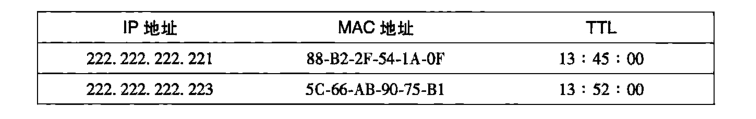
        - TTL 指示了从表中删除每个映射（表项）的时间
        - 一个表项的有效时间通常为 20 min
      - ARP 如何获取某个 IP 地址对应的 MAC 地址？
        - 发送方构造一个被称为ARP 分组（ARP packet）的特殊分组，包含了发送和接收方的 IP 地址以及发送方的 MAC 地址，其中，目的 MAC 地址为 MAC 广播地址
        - 每个该局域网内的所有适配器都将收到该分组，每个适配器都将该分组传递给 ARP 模块，每个 ARP 模块检查它的 IP 地址是否与分组中的目的 IP 地址相匹配
        - 与分组中目的地址相匹配的 ARP 模块返回一个带有它的 MAC 地址的分组（格式与发送方发来的那个分组一致，目的 MAC 地址为发送方的 MAC 地址）发送给发送方
      - ARP 是即插即用的
    - 以太网
      - 集线器
        - 集线器（hub）是一种物理层设备，它作用于各个比特，而不是帧。它将到达的 0 或者 1 信号重新生成和放大，然后将这个信号发往其它的所有接口
        - 如果集线器有 2 个不同的接口同时到达数据，则将会出现一次碰撞，发送节点必须重传该帧
        - 使用集线器的以太网必须运行 CSMA/CD 用来控制多路访问
      - 以太网帧结构 
        - 数据字段：一般而言，承载的是 IP 数据报，也可以承载其它协议的数据
          - 以太网的最大传输单元（MTU）是 1500 字节（不包括以太网的其它字段）
          - 数据字段的最小长度为 46 字节，此填充的部分会被 IP 通过数据报中的长度字段给去除
        - 目的地址（6 字节）：包含目标适配器的 MAC 地址
          - 如果目的地址不是该适配器的 MAC 地址或者是广播地址，则丢弃该帧
        - 源地址（6 字节）：发送方的 MAC 地址
        - 类型字段（2 字节）
          - 该帧需要交给上一层的哪一个协议（网络层不仅仅只有 IP 一个协议）
          - 该帧也可以被交给 ARP 协议（类型字段为 16 进制的 0806）
        - CRC（4 字节）：用于检查帧是否引入了差错
          - 如果发现引入了错误，则直接丢弃该帧，不进行其余的任何处理
        - 前同步码（8 字节）
          - 前同步码的前 7 字节都是固定的 10101010，最后一个字节为固定的 10101011
          - 前 7 个字节用于“唤醒”接收适配器，并且将接收方的时钟和发送方的时钟同步
            - 为什么要同步时钟？
              - 发送方按照自己的时钟信号，将比特序列发送到物理链路
              - 接收方必须按照同样的时钟频率读取比特流，否则会导致数据解码错误
            - 接收方通过前 7 个字节调整自己的时钟频率，确保与发送方的比特节奏匹配
          - 第 8 个字节的最后 2 个 bit 告知接收方，后面紧挨着的就是以太网首部
    - 交换机（switch）后面取代了集线器
      - 交换机是无碰撞的，故而适配器不需要运行多路访问协议
      - 交换机的转发和过滤功能
        - 交换机转发帧这个操作对于主机或者路由器来说，是透明的
        - 此功能借助交换机表（switch table）来完成 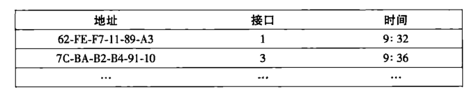
          - 交换机表包含了某局域网上某些主机和路由器的表项，但不一定是全部
          - 表项包括
            - MAC 地址
            - 同向该 MAC 地址的交换机接口
            - 表项放置在表中的时间
          - SDN 可能修改此表
        - 如果表项中的接口与帧到达的接口一致，则丢弃该分组以执行过滤功能
        - 如果没有目的 MAC 地址的表项，则向除了到达接口之外的所有接口的输出缓存中转发该帧的副本。换言之，交换机广播该帧
        - 交换机表表项的构建（自学习的构建）
          - 对于每个接口接收到的每个入帧，交换机存储： 1. 该帧的源 MAC 地址 2. 该帧到达的接口 3. 当前时间
          - 如果在一段时间（被称为老化期（aging time ））之后，交换机没有收到以该地址作为源地址的帧，就在表中删除这个地址
      - 交换机与路由器的关键区别
        - 路由器的每个接口可以看做是一个不同的子网
        - 交换机的每个接口可以看做是同一个子网
      - 交换机的优缺点
        - 交换机是全双工的，每个接口既能接受也能发送
          - 这是通过物理线路实现的，例如一条线内有两条更小的线，这样发送和接收的流量不会发生碰撞
          - 交换机不会在同时对同一链路传出多于一个帧
        - 异质的链路：交换机可以使用不同的链路：例如有个接口插入的是 10 Gps 的，另一个接口也可以使用 200 Mbps 的链路
        - 如果一个适配器工作异常而持续发送以太网帧，交换机能够检测到该问题，并在内部断开异常适配器
        - 交换机也可以收集统计信息，用于网络管理
        - 交换机不能阻止广播风暴。即不能防止某台主机一直广播帧。而路由器可以配置防火墙来阻止。
    - 虚拟局域网（Virtual Local Network, VLAN）
      - 支持 VLAN 的交换机允许经单一的物理局域网基础设施来定义多个虚拟局域网
      - 在一个基于端口的 VLAN 中，交换机的一个或多个端口由网络管理源划分为一组，每个组构成一个 VLAN
        - 每个组中的端口中的广播流量仅能到达该组中的其它端口
        - 同时，交换机只在同一个 VLAN 中交付帧（不止广播的流量）
        - 网络管理员使用交换机管理软件就可以实现对端口进行编组（在交换机中维护一个端口到 VLAN 的映射表）
        - 可以将每个组看成一个独立的交换机，并且这些交换机之间不相互连接
      - 如何跨 VLAN 通信？
        - 一种方法是将一个端口与一台外部的路由器相连，并将该端口配置为同时属于要通信的 VLAN
      - 如何连接两台 VLAN 交换机（假设两台 VLAN 交换机都具有A 组和 B 组）？ 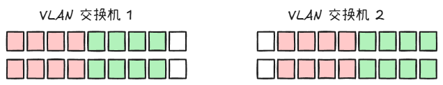
        - 一种方法是每台 VLAN 交换机都再定义 2 个端口分别属于 A 组和 B 组。然后将其相连 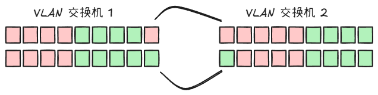
          - 但是此种方法不具有可扩展性，如果有 N 个组，就需要再定义 N 个端口
        - 另一种方法被称为 VLAN 干线连接（VLAN trunking）：每台交换机上的一个特殊端口被配置成干线端口，干线端口属于所有 VLAN，所以任何帧都会经过干线端口被转发到另外一个交换机中去 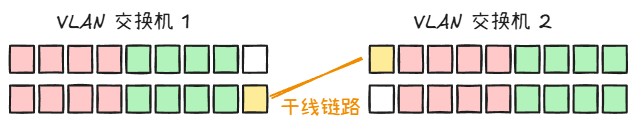
          - 那么，交换机如何知道干线端口中的帧属于哪个特定的 VLAN 呢？
          - IEEE 802.1Q 定义了一种扩展的以太网帧格式，主要是在标准的帧格式中增加了 4 字节的 VLAN 标签（VLAN tag）组成 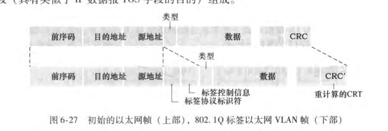
      - 在基于 MAC 的VLAN 中，网络管理员指定属于每个 VLAN 的 MAC 地址的集合
        - 无论特定 MAC 的设备与哪个端口进行连接，交换机都能判断其属于哪个 VLAN
  - 多协议标签交换（Multiprotocol Label Switching, MPLS）
    - 用于改善 IP 路由器的转发速度，但不是取代 IP
    - 在不弃用基于目的地 IP 数据报转发的基础设施的前提下，通过应用基于固定长度标签和虚电路的技术，在适当的时机选择性地标识数据报并允许路由器基于固定长度的标签来转发数据报。
    - 启用 MPLS 的路由器处理的链路层帧的格式 
      - 这种帧格式只能在两个均启用了 MPLS 的路由器之间发送
      - 启用 MPLS 的路由器被称为标签交换路由器（label-switched router）
  - 数据中心网络
    - 数据中心体系结构 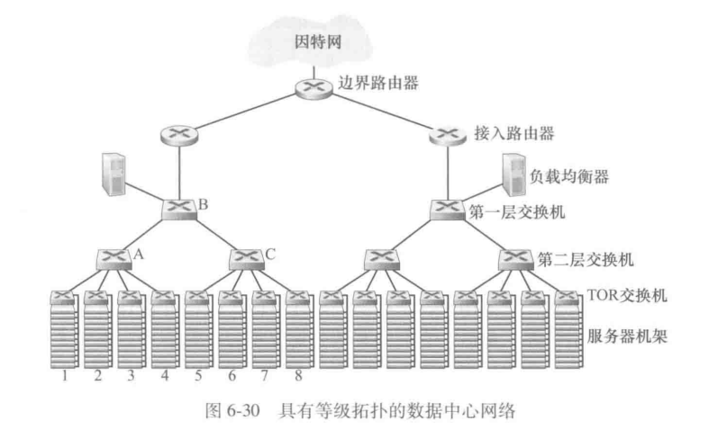
      - 数据中心的主机被称为刀片（blade）
        - 每台刀片都会被分配一个自己的数据中心内部的 IP 地址
      - 刀片堆叠在机架上，每个机架堆放 20~40 台刀片
      - 每个机架顶部有一台交换机，这台交换机被称为机架顶部（Top of Rack, TOR）交换机
        - TOR 交换机与机架上的主机互联，并与数据中心的其它交换机互联
      - 为了与外部的主机进行交互，数据中心有一至多台边界路由器（border router）,将数据中心网络与公共因特网相连
    - 负载均衡器（load balancer）
      - 外部主机的请求首先被定向到负载均衡器中
      - 负载均衡器的任务是向主机分发请求
      - 一个大型的数据中心通常会有多台负载均衡器，每个服务于一组特定的云应用（每一个应用都与一个公开可见的 IP 地址关联）
      - 基于目的 IP 地址和端口号（第四层、端口号用于区分不同的应用）进行负载均衡的负载均衡器被称为第四层交换机
        - 有可能某一台公网 IP 绑定了不止一个应用，此时就需要端口来区分应用
      - 负载均衡器还提供了类似 NAT 的功能，将外部 IP 地址转换为适当的主机 IP 地址，向客户流向的分组按照相反的转换进行处理
    - TODO page:333, 等级体系结构
- 无线网络和移动网络
  - TODO
- 网络安全
  - 要做到安全通信，需要具有以下性质
    - 机密性（confidentiality）
      - 仅有发送方和希望的接收方能欧理解传输报文的内容
      - 这通过加密（encrypted）来完成
    - 报文完整性（message integrity）
      - 确保通信的内容在传输中未被篡改或者意外改动
    - 端点鉴别（end-point authentication）
      - 发送方和接收方都能证实通信过程所涉及的另一方，以确定通信的另一方确实具有其所声称的身份
    - 运行安全性（operational security）
      - 能够保护主机不会受到来自网络中的其它主机的攻击
  - 密码学原理
    - 未经过加密的报文被称为明文（plaintext, cleartext）
    - 使用加密算法(encryption algorithm)加密明文，生成的加密报文被称为密文（ciphertext）
    - 传输报文的 2 方各有一个密钥（key），假设分别为 Ka 和 Kb
      - 对称密钥系统（symmetric key system）中 Ka 和 Kb 是相同的
      - 公开密钥系统（public key system）（又称公钥系统）使用一对密钥，一个密钥为 2 方所知（其它想知道的人也可以知道），另一个密钥只有 2 方自己知道，其他人都不知道
    - 对称密钥加密
      - 块密码
        - 明文被处理为多个 k 比特的块
        - 每个块被独立加密
        - 为了加密一个块，采用一对一映射，将 k 比特的明文映射为 k 比特块的密文
          - 例如 k = 3 时的一对一映射 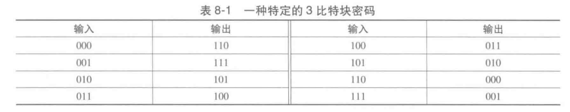
        - 因为对于 k 较大（例如 64）时，几乎不可能人为地定义映射关系，所以块密码使用函数模拟随机排列表 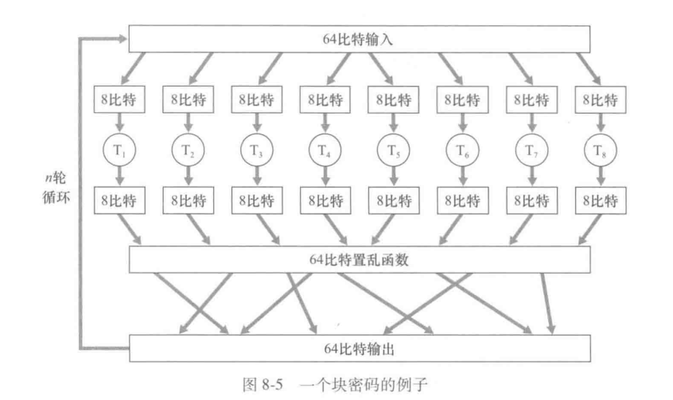
          - 假设 T1、T2、T3... 是 8 bit 块的不同映射关系表
          - 在函数向将 64 bit 的块划分为 8 个 8 bit 的块 `priority-1`
          - 针对每个不同的 8 bit 块使用不同的映射关系表来映射 `priority-2`
          - 然后将这 8 个块用一个公共已知的置乱函数来打乱原本的顺序重新拼装成一个 64 个 bit 的块 `priority-3`
          - 然后将经过一次循环的 64 bit 块作为输入，再次执行上述过程，循环 n 次 `priority-4`
            - 循环的目的是使每个输入比特印象最后输出比特的大部分（即使不是全部）
            - 如果只使用一次循环，则一个给定的输入比特进影响 64 输出比特中的 8 比特
        - 流行的块密码技术都使用比特串来作为密钥。密钥决定了特定“小型表”的映射和该算法内部的排列
          - DES（Data Encryption Standard, 数据加密标准），使用 56 bit 的密钥与 64 bit 的块来进行加密
          - AES（Advanced Encryption Standard, 高级加密标准） 使用 128 比特块，支持使用 128、192、256 bit 长度的密钥
      - 密码块链接
        - 使用块密码加密时，对于相同的块，块密码将产生相同的密文。例如 "HTTP/1.1"，此时，攻击者可以看到相同的密文块，然后运用协议结构等知识，猜出其明文，进而解密
        - 为了解决上述问题，可以在密文中混合某些随机性，是相同的明文块产生不同的密文块
        - 设 m(i) 为第 i 个明文块；c(i) 为第 i 个密文块；密钥为 S；加密算法为 Ks
        - 发送为第 i 块生成一个随机的 k 比特数（k 与明文块的比特数相同），表示为 r(i)
        - 则 c(i) = Ks(m(i) ⊕ r(i))
        - 然后发送方发送 c(1), r(1), c(2),r(2)........
          - 尽管 r(i) 是以明文发送的，但是由于攻击者不知道 Ks，所以它也无法解密
        - 但是上述解决方法又引入了一个问题，发送者必须发送 2 倍的数据。为此，块密码使用密码块链接（Cipher Block Chaining, CBC）
          - 基本思想：仅随第一个密文块发送一个随机值，然后让发送方和接收方使用的计算的密文块代替后继的随机数
          - 过程
            - 在加密明文之前，发送方先生成一个随机的 k 比特串，称为初始向量（Initialization Vector, IV）,表示为 c(0) `priority-1`
              - 发送方以明文的方式将 IV 发送给接收方
            - 对于第一个块，发送方计算 c(1) = Ks(m(1)⊕c(0)) `priority-2`
            - 对于第 i 个块，发送方计算 c(i) = Ks(m(i)⊕c(i -1)) `priority-3`
          - CRC 要求在协议中提供一种机制，以从发送方向接收方发送 IV
    - 公开密钥加密
      - 对称加密需要双方都知道密钥，这对于在网络中通信来说是无法做到的
      - 在公开密钥系统中，每个用户（主机）具有 2 个密钥，一个是公钥（pulic key），一个是私钥（private key）
        - 公钥每个人都可以知道，记为 Kp
        - 私钥只有用户自己知道，记为 Ks
      - A 和 B 通信，A 先取得 B 的公钥 Kp_B，然后使用 Kp_B 和一个公知的加密算法来加密它要发给 B 的明文 m，然后 B 可以通过它的私钥 Ks_B 来解密这个密文，即 m = Ks_B(Kp_B(m))
        - 这引入了一个新的问题：每个人都可以拿着 Kp_B 向 B 发送密文。这就需要使用数字签名来把发送方和报文绑定起来
      - 公钥和私钥加密相互交换也能够得到类似的结果： m = Ks(kp(m))=Kp(Ks(m))
      - 加密/解密算法：RSA
        - 将要加密的报文看做是一个整数，假设为 m
        - RSA 生成公钥和私钥
          - 选择 2 个大素数 p 和 q
            - p 和 q 越大，破解 RSA 越困难，执行加密和解密的过程耗时也越长
            - RSA 推荐 P * q 的比特数量在 1024 以内
          - 计算 n = p * q 和 z = (p - 1)(q - 1)
          - 选择小于 n 的一个数 e，使得 e 和 z 没有公因数（除了 1），称 e 和 z 互素
            - e 将被用于加密
          - 求一个数 d，使得 e*d-1 可以被 z 整除。即 e*d mod z = 1
            - d 将被用于解密
          - 公钥是一对数（n，e），私钥是一对数（n，d）
        - RSA 加密解密过程
          - 加密
            - 假设要发送的比特表示的数 m &lt; n
            - 发送方的密文 c = m^e mod n
          - 解密
            - m = c^d mod n
        - RSA 加密与解密的原理
          - 模算术复习 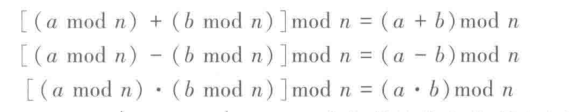
            - 由第三条可以推出 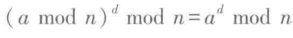
          - 先加密后解密就得到了这样一个式子 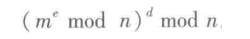
          - 应用上面的结论就可以得到结果 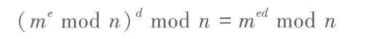
            - 数论中有结论 
          - 在应用数论上的结论，x = m, y = ed,可得 
          - 因为 ed mod z = 1，所以有 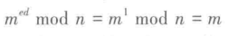
        - RSA 之所以能够加密，是现在还没有算法能够快速地将 n 的因数分解，即分解出 p 和 q
      - 会话密钥（session key）
        - RSA 要进行指数运算，而这是十分耗时的操作，所以在实际中，RSA 通常与对称加密结合来使用
        - 基本思路是发送方使用公钥加密用于对称加密的密钥（被称为公话密钥），然后后面就使用对称加密来进行加密
  - 报文完整性（报文鉴别）和数字签名
    - 密码散列函数 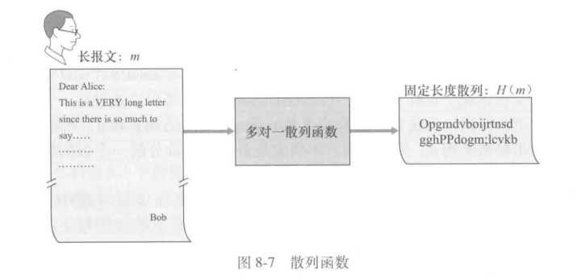
      - 散列函数以 m 作为输入，得到一个固定长度的字符串 H(m)
        - 例如因特网检验和、CRC
      - 密码散列函数要使得对于两个不同的 x 和 y，H(x) = H(y) 在计算上是不可能的
        - 这意味着入侵者在计算上不可能用其他报文替换由散列函数保护的报文
      - MD5 （RFC 1321）、SHA-1、 SHA-256正是这样的散列函数
        - MD5 得到 128 bit 的散列值
        - SHA-1 得到 160 bit 的散列值
        - SHA-256 得到 256 bit 的散列值。现代一般都使用这个散列函数
    - 报文鉴别码（报文完整性鉴别）
      - 发送方和接收方共享一个鉴别密钥（authentication key），记为 s
      - 假设发送方要发送的数据为 m，则发送方用 s 来连接在 m 上，得到 m + s
      - 发送方计算 m + s 的散列值 H(m + s)，该散列值被称为报文鉴别码（Message Authentication Code, MAC）
      - 发送方将 MAC 附加到报文 m 上，生成扩展报文(m, H(m + s))，将该报文发送到接收方
      - 接收方收到扩展报文 （m, h），然后计算出 H(m + s)，如果 H(m + s) = h, 则一切正常
        - 如果不加入 s 来计算 H(m + s)，则攻击者可以生成一个虚假的 m' 和 H(m)'，从而欺骗接收方
    - 数字签名（digital signature）
      - 数字签名是某个用户使用它的 RSA 私钥来加密它要签署名字的报文 m 得到的结果，即： 数字签名 = Ks(m)，其中 Ks 是私钥
      - 如果某个用户 A 要证明某个用户 B 签署了该报文 m，则它只需要看是否能用 B 的公钥来解密出 Ks(m) 得到 m
        - 如果文档 m 被修改过，得到 m'，则对 m 的签名也会无效。所以，数字签名也能够提供完整性，并且还能够验证该报文的源
      - 但是，由于 RSA 加密和解密耗时问题，所以实际中，使用散列函数来将 m 散列到一个固定长度的值，减少 RSA 加密与解密的运算量: 即数字签名 = Ks(H(m))
      - 公钥认证（数字签名的应用）
        - 指证实某个公钥属于某个实体。即证实 A 的公钥确实是属于 A 的。以防有其它人 B 顶替 A，说那个公钥是属于 B 的
        - 将公钥与特定实体绑定通常是由认证中心（Certification Authority, CA）完成的
          - CA 证实一个实体（人、路由器）的真实身份
          - CA 一旦证实了某个人的身份，就会生成一个将其身份和实体的公钥绑定起来的证书（certificate）
            - 这个证书包含了这个公钥和公钥所有者唯一的身份标识信息（例如 IP 地址或者名字）
          - CA 对这个证书进行数字签名（使用 CA 的私钥）
            - CA 的公钥一般都预先装载在了浏览器或者操作系统中
          - 证书中的重要字段 
        - 发送方现在不需要发送自己的公钥，而是发送自己的证书，然后让接收方自己提取公钥
  - 端点鉴别（end-point authentication）
    - 端点鉴别是指一个实体经过计算机网络向另一个实体证明其身份的过程（例如用户向某个服务器证明他的身份），而不是用户证明某个服务器的身份
      - 证书鉴别只能是单向鉴别，客户能鉴别服务器，但是服务器不能鉴别客户
    - 一种方法是使用口令，口令是鉴别者 B和被鉴别者 A之间共享的一个秘密
      - A 为了防止被人知道它们之间的口令，它们会进行加密
      - 虽然加密口令防止了其他人 C 知道口令的明文，但是 C 可以记录下该口令，然后等一段时间之后，再使用该口令来向 B 证明自己是 A，这被称为回放攻击（playback attack）
        - 注意，重放并不会更改分组的内容，而是完整的一个分组
      - 为了解决回放攻击，可以使用一个不重数（nonce），不重数是指在这个鉴别协议的生命周期中，不会使用第二次的数
        - A 向 B 打招呼，发送一个报文，例如“我是 A”
        - B 选择一个不重数 R ，然后把这个值发送给 A
        - 然后 A 用 A 和 B 之间共享的密钥 Kab 来加密 R，得到 Kab(R)，然后将这个值发送给 B
        - B 解密接收到的报文，如果其值等于 R，则可鉴别 A 的身份
          - B 也可以通过这个报文判断 A 是活跃的
          - 这里攻击者 C 如果重放 Kab(R) 的值，因为 R 只会使用一次，所以 C 被识别出不是 A
      - HTTPS 会话中，如果不使用不重数，则也会导致重放攻击：攻击者可以重放已经发送的支付请求，从而实现重复付款
  - 安全电子邮件 PGP（Pretty Good Privacy）（应用层的安全协议）
    - 整体设计 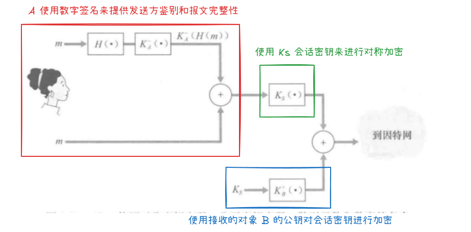
    - 接收方要能够鉴别发送方，就需要确保它使用 A 的公钥是真正属于 A 的（类似于 CA）。这可以通过当面交换等手段完成
  - TLS：使 TCP 连接安全：（运输层）
    - 运输层安全性（Transport Layer Security, TLS） 提供包括机密性、数据完整性和端点鉴别
    - TLS 使 TCP 安全了，所以它能被应用于运行在 TCP 之上的任何应用程序
    - TLS 提供了 API 供应用调用（类似于 TCP） 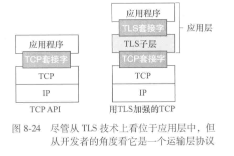
    - TLS 具有 4 个阶段
      - 握手 `priority-1` 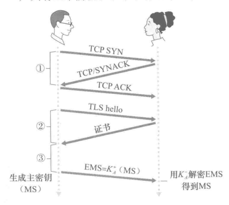
        - 客户会与服务器创建一条 TCP 连接 `priority-1`
        - 客户发送它支持的密码算法的列表和一个客户的不重数 `priority-2`
        - 服务器在客户的密码算法列表中选择一种对称加密算法、一种公钥算法和一种 HMAC 算法。然后，服务器把自己的选择、一个服务器的不重数和它的证书发送给客户 `priority-3`
        - 客户验证服务器的证书，提取出服务器的公钥，生成一个前主密钥（Pre-Master Secret, PMS），然后用服务器的公钥来加密该 PMS，并将 PMS 发送给服务器 `priority-4`
        - 进行密钥导出 `priority-5`
        - 客户发送以所有握手报文为输入生成的一个 HMAC `priority-6`
        - 服务器发送以所有握手报文为输入生成的一个 HMAC `priority-7`
      - 密钥导出 `priority-2`
        - 为了增加安全性，对加密、完整性检查使用不同的密钥
        - 客户和服务器独立地使用相同的密钥导出函数从 PMS 和不重数中计算出主密钥（MS）
        - 客户端和服务器都各自使用 MS 来生成 2 个密钥
          - E：用于从己方发送到对方的数据的会话对称加密密钥
          - M：用于从己方发送到对方的数据的会话 HMAC 密钥。用于验证报文的完整性
            - HMAC（RFC 2104）是一个标准化的散列报文鉴别码（MAC）
        - 如何使用 MS 来生成 E 和 M？
          - 使用 MS 的切片来生成
          - 如果对称加密算法需要使用初始向量 IV，则该 IV 也从 MS 中获得
      - 数据传输 `priority-3`
        - TLS 将数据流分割成 TLS 记录，对每个记录都附加一个 HMAC 用于完整性检查，然后使用 E 来加密 “记录+HMAC”
          - TLS 记录格式。前 3 个字段是不加密的 
            - 类型字段指出了该记录是握手报文还是应用数据报文。也用于关闭连接
          - HMAC = H(m + M)
        - 注意到，TLS 位于 TCP 的上方，所以，TLS 发出的报文段的 TCP 序号等是没有被加密的，所以，攻击者可以逆转 2 个报文段的顺序，而 TLS 认为这两个报文段仍然正常，而应用层得到的数据是不正确的 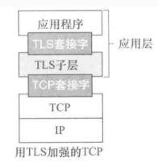
          - TLS 的解决方法是双方维护一个从 0 开始的序号，然后每发送一个 TLS 记录就加一
          - 并不会在 TLS 记录中显式地包含该序号，而是计算 HMAC 的时候，加入序号参与运算。所以 HMAC = H(m + M + 序号)
      - 连接关闭 `priority-4`
        - 如果要终止连接，则 TLS 记录的类型字段指出了该记录是否用于终止该 TLS 会话
          - TLS 记录的类型字段是未经加密的，但是计算 HMAC 的时候将其加入进去了，故而可以保证传输过程中不会被篡改
        - 如果提前收到了一个 TCP 的 FIN 报文段（没有经过上面的步骤），则另一方认为这不是一个正常的关闭。具体的行为取决与实现
  - TODO：IPsec 和防火墙、IDS
```
