```markmap
---
markmap:
  initialExpandLevel: 2
  spacingVertical: 30
  spacingHorizontal: 180
---

# 设计模式
- 策略模式
  - 原则
    - 找出应用中可能需要变化之处，把它们独立出来，不要和那些不需要变化的代码混在一起
      - 换句话说，如果每次新的需求一来，都会使某方面的代码发生变化，那么你就可以确定，这部分的代码需要被抽出来，和其他稳定的代码有所区分。
    - 针对接口编程，而不是针对实现编程
      - 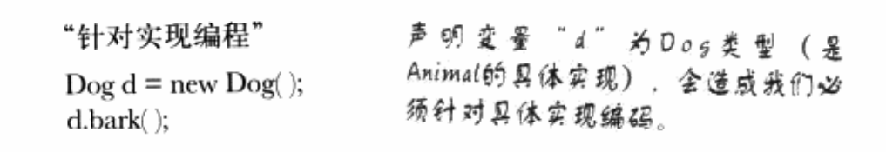
    - 多用组合（composition），少用继承
      - 使用组合建立系统具有很大的弹性，不仅可将算 法族封装成类，更可以“在运行时动态地改变行为”，只要组合的行为对象符合正确的接口标准即可。
  - 模式
    - 策略模式定义了算法族，分别封装起来，让它们之间可以互相替换，此模式让算法的变化独立于使用算法的客户。
    - 例如，将鸭子的不同行为定义为一个算法族，这个算法族中的每个行为（类）都实现一个 BehaviorFly 接口，在要鸭子类中定义这个接口的变量（组合），通过组合，鸭子就获得了飞这个行为。
- 观察者（Observer）模式
  - 原则
    - 为了交互对象之间的松耦合设计而努力
      - 松耦合的设计之所以能让我们建立有弹性的OO系统，能够应对变化，是因为对象之间的互相依赖降到了最低。
  - 模式
    - 定义了对象之间的一对多依赖，这样一来，当一个对象改变时，它的所有依赖者都会收到通知并自动更新。
    - 出版者+订阅者=观察者模式
    - 图解 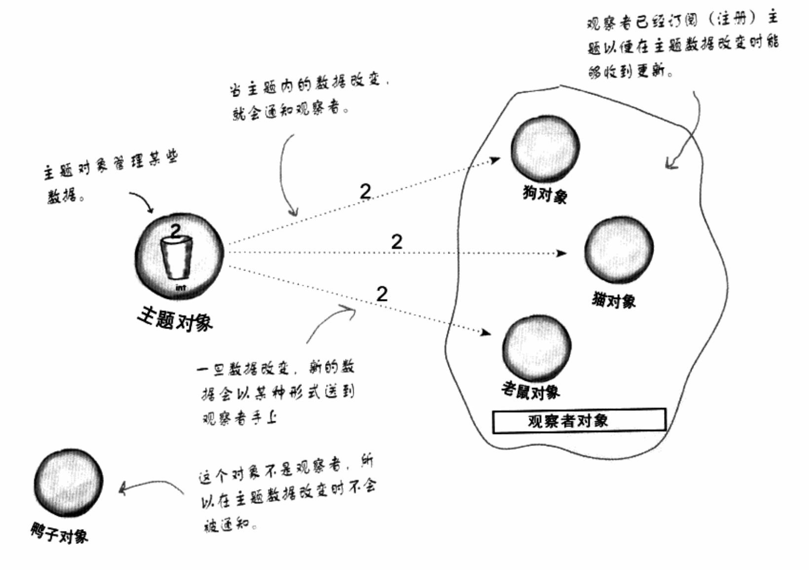
    - 观察者模式提供了一种对象设计，让主题和观察者之间松耦合
- 装饰者模式
  - 原则
    - 类应该对扩展开放，对修改关闭（开放-关闭原则）
      - 例如，在观察者模式中，对主题加入观察者扩展了主题，并且不需要修改主题的代码
      - 遵循开放-关闭原则，通常会引入新的抽象层次，增加代码的复杂度。所以，一般将注意力集中在设计中最有可能改变的地方，然后，应用开放-关闭原则。
  - 模式
    - 装饰者模式动态地将责任附加到对象上。若要扩展功能，装饰者提供了比继承更有弹性的替代方案。
    - 图解（类图） 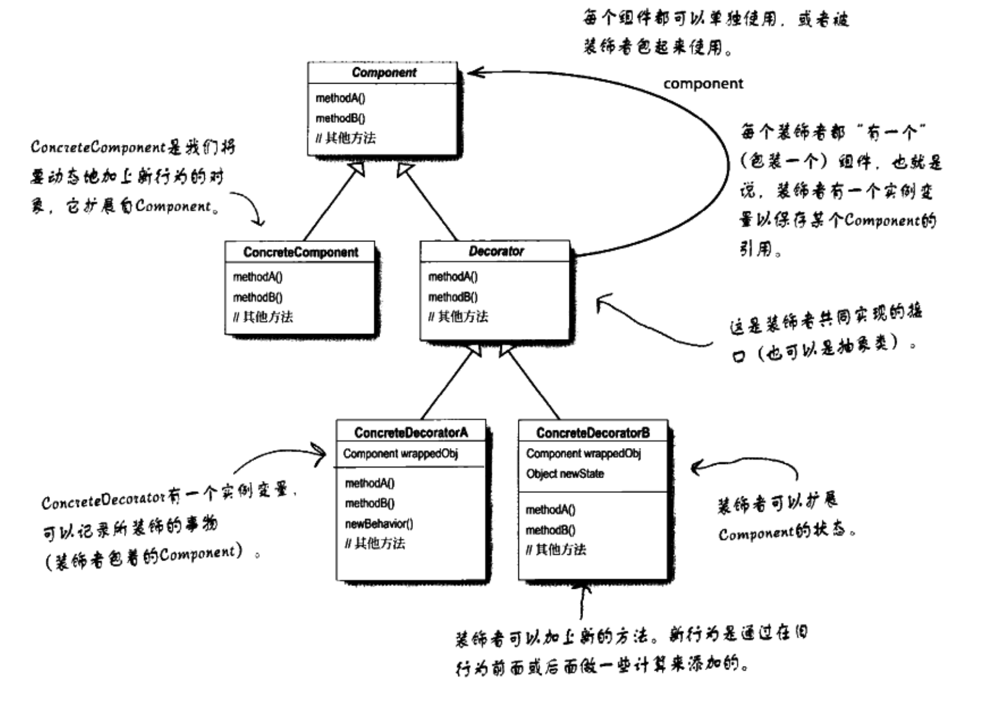
      - 被装饰的主体与装饰的对象拥有一个共同的超类
      - 可以用多个装饰对象来装饰主体
      - 由于拥有相同的超类，所以，被装饰过的主体也是一个主体
      - 装饰者可以在所委托被装饰者的行为之前或之后，加上自己的行为，以达到特定的目的。
      - 对象可以在任何时候被装饰
    - 例如（Java I/O）： 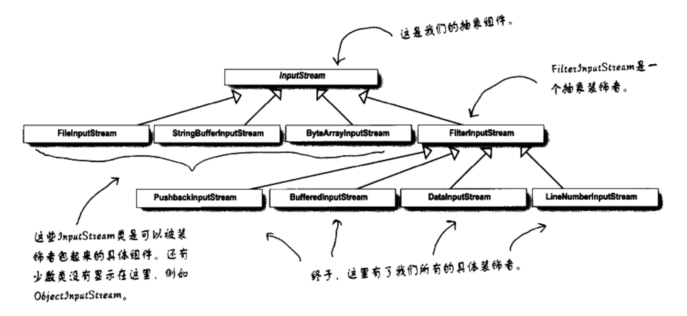
      - FileterInputStream 就是一个装饰器
      - 可以如下调用: InputStream in = new BufferedInputStream(new FileInputStream("test.txt"))
- 工厂模式
  - 原则
    - 依赖倒置原则（Dependency Inversion Principle）：要依赖抽象，不要依赖具体的实现类
      - 说明了：不能让高层组件依赖低层组件，而且，不管高层或低层组件，两者都应该依赖于抽象
        - 高层组件是由其他低层组件定义其行为的类
      - 例如
        - 这是原始的实现 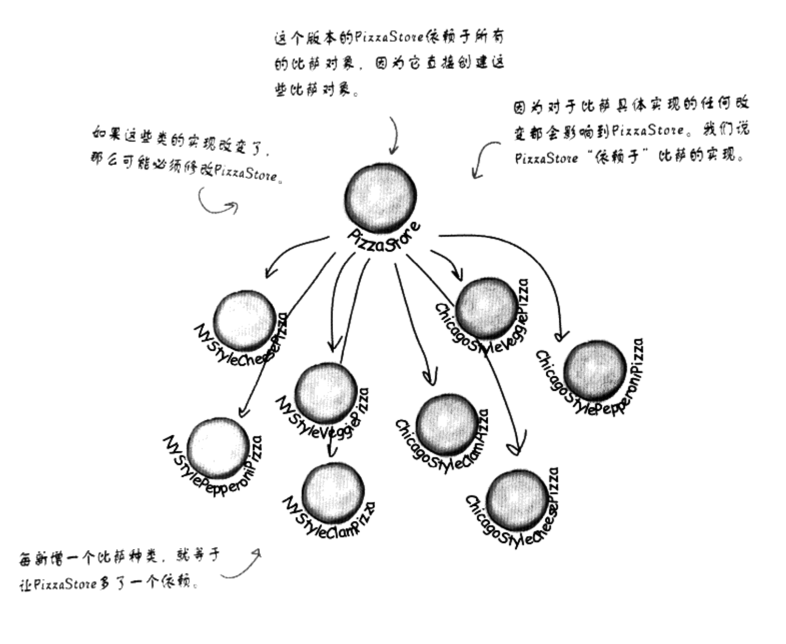
        - 运用这个原则（工厂方法模式）之后 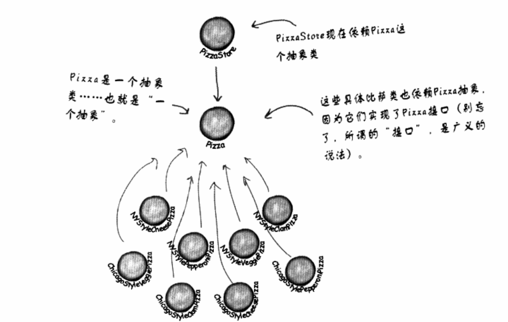
      - “倒置”在哪里体现？
        - 指的是和一般 OO 设计的思考方式完全相反。观察上面这两幅图，下面这幅图的箭头与上面幅相反。
  - 模式
    - 解决的问题
      - 如何将实例化具体的类的代码（可能要根据变量的不同值来实例化不同的对象，即使针对接口进行编程，最终也是要实例化的）从应用中抽离，或者封装起来，使它们不会干扰应用的其他部分？
    - 工厂方法模式定义了一个创建对象的接口，但由子类决定的要实例化的类是哪一个。工厂方法让类把实例化推迟到子类
      - 图解 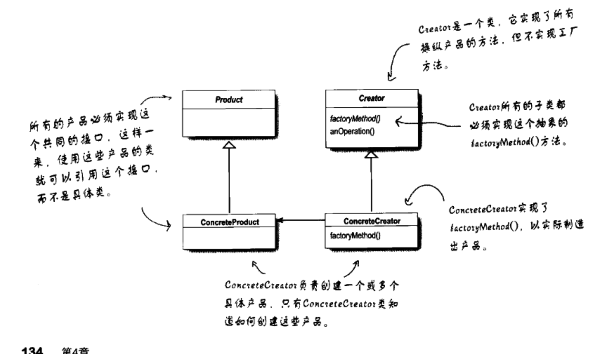
    - 抽象工厂模式提供了一个接口，用于创建相关或依赖对象的家族，而不需要明确指定具体类
      - 图解 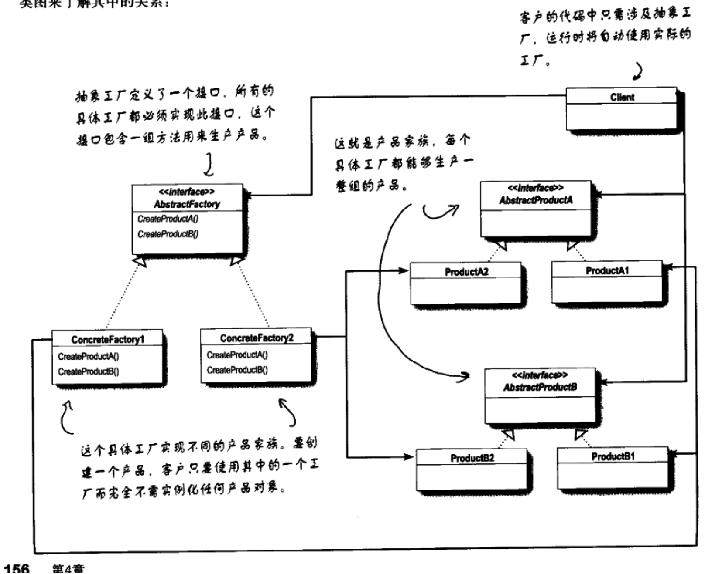
      - 可以将一群相关的产品集合起来
- 单件模式（Singleton Pattern）
  - 模式
    - 作用：用来创建独一无二的，只能有一个实例的对象
    - 单件模式确保一个类只有一个实例，并提供一个全局访问点
      - 实现，可以延迟实例的创建。 每次调用 getInstance 方法，都加锁，会带来一定的性能问题 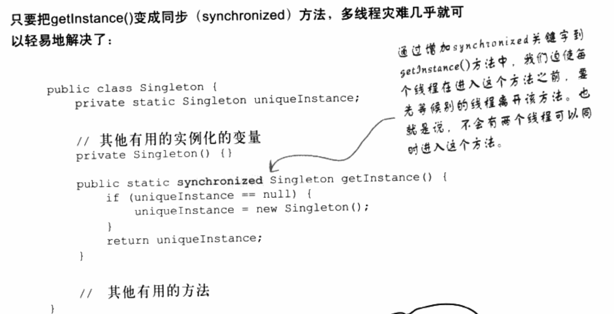
      - 如果需要快速地创建一个实例，而不用延迟实例化，可以这样做： 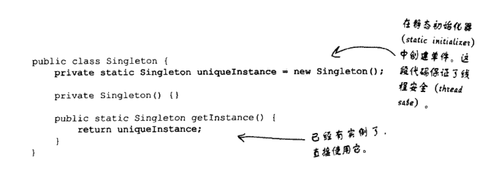
      - 使用双重加锁，值有第一次会加锁： 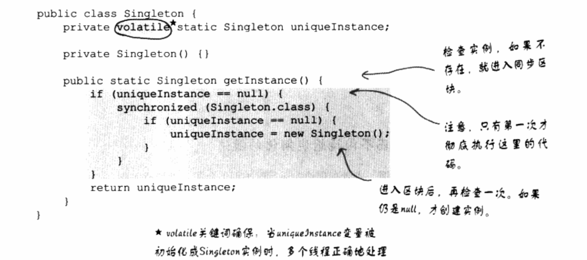
    - 注意：多个类加载器可能有机会创建自己的单件实例。所以，如果程序中有多个类加载器，则需要指定类加载器，并指定使用同一个类加载器。
- 命令模式
  - 图解 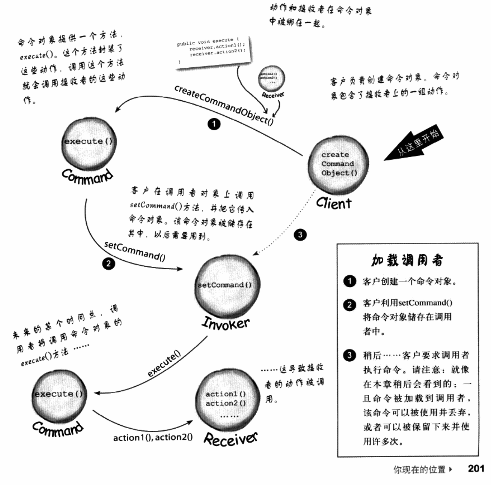
  - 命令模式将“请求”封装成对象，以便于使用不同的请求、队列或者日志来参数化其他对象。命令模式也支持可撤销操作
  - 类图 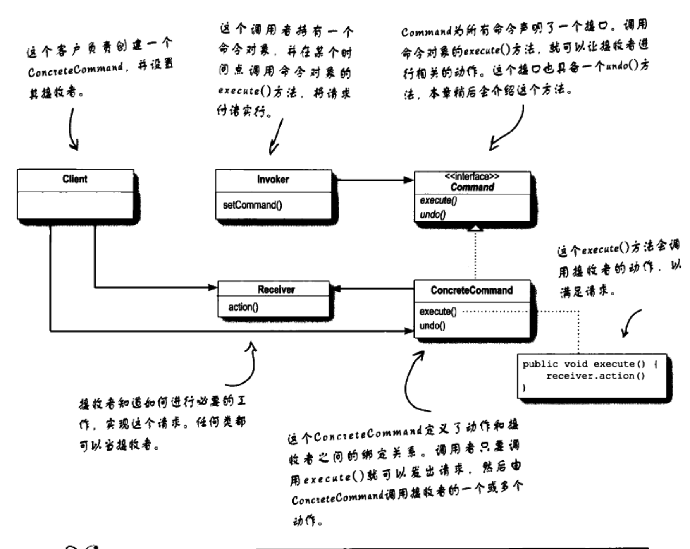
    - Invoker 相当于遥控器
    - Client 相当于一个操控遥控器的人
    - Reciever 相当于一个电灯，可以接受来自遥控器的信号来给出相应的动作
  - 可以使用宏命令来封装多个命令，如此一来，就可以通过一个宏命令来执行多个更小的命令
  - 实例：我们有一个遥控器，可以通过一个按钮让灯开启或关闭，并且有一个撤销按钮，撤销上一个操作 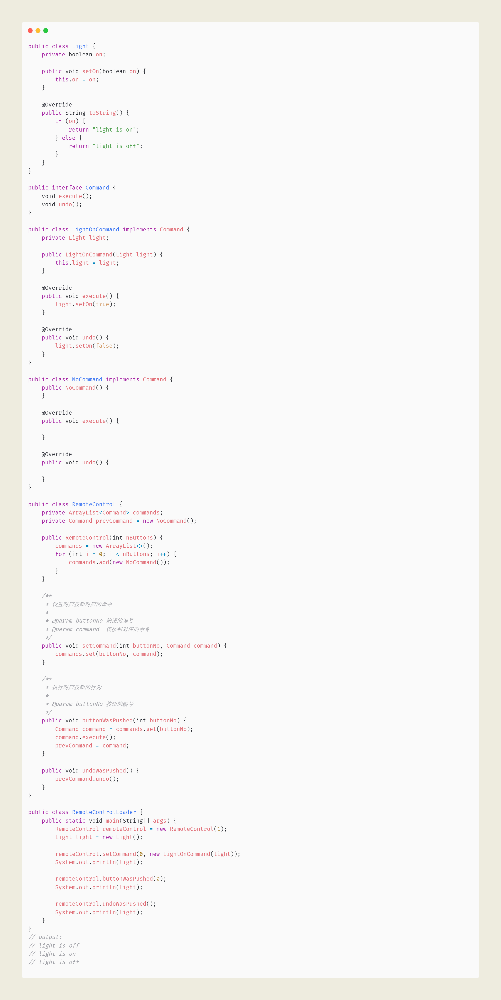
- 适配器模式与外观模式
  - 适配器模式
    - 适配器将一种接口转换为另一接口
      - 例如交流电适配器将电力从交流电接口转换到直流电接口
    - 定义：适配器模式将一个类的接口转换成客户期望的另一个接口。适配器让原本接口不兼容的类可以合作无间
      - 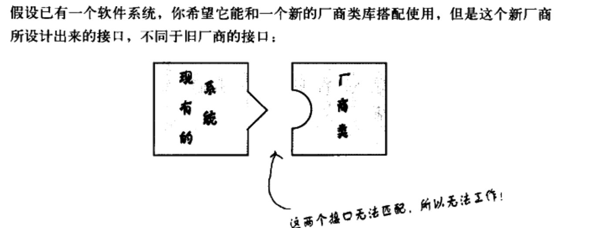
      - 解决办法 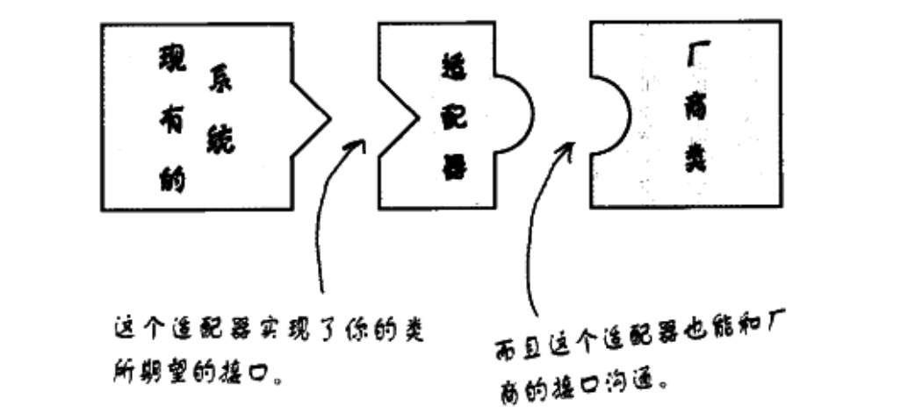
    - 对象适配器
      - 类图 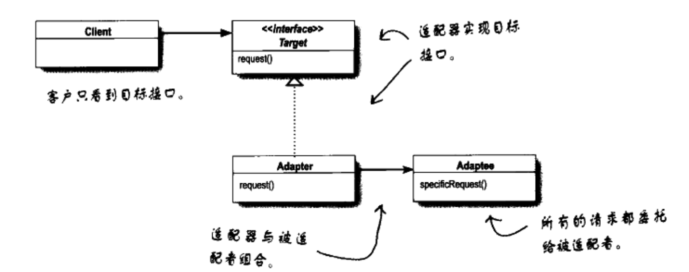
        - 使用对象的组合（即适配器包含了被适配者的对象），以修改的接口包装被适配者，将工作委托给被适配者。这样的做法还有额外的优点：被适配者的任何子类，都可以搭配着适配器使用
    - 类适配器
      - 只能在多继承的语言中使用
      - 类图 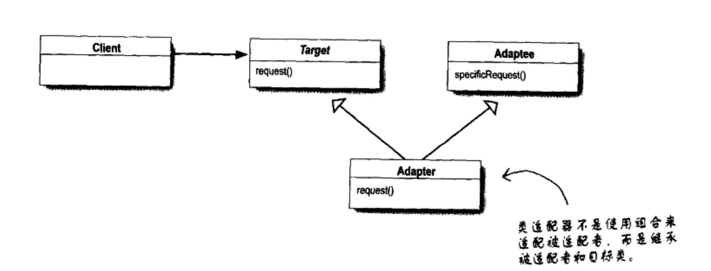
        - 适配器直接完成被适配者的工作，而不是将工作委托给被适配者。
  - 外观模式（Facade-Pattern）
    - 原则
      - 最少知识原则：减少对象之间的交互，只和你的密友谈话
        - 就任何对象而言，在该对象的方法内，我们应该只调用属于以下范围的方法
          - 该对象本身
          - 被当做方法的参数而传递进来的对象
          - 此方法所创建或实例化的任何对象
          - 对象的任何组件
        - 例子： 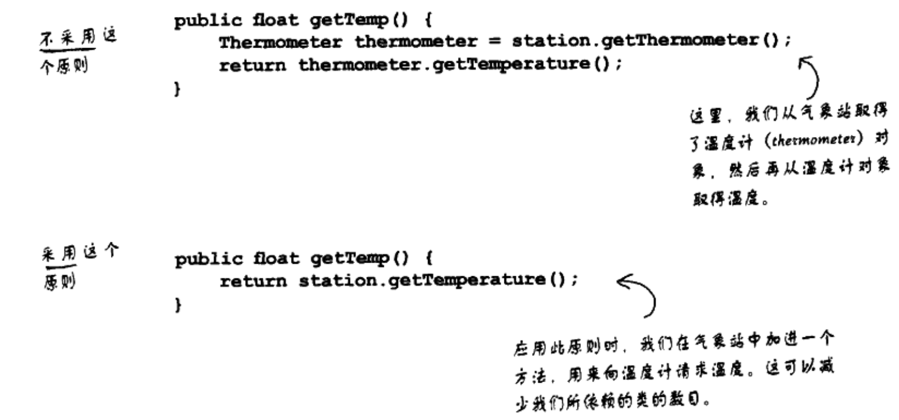
    - 外观是什么？
      - 我们本来有一大堆系统，但是太难使用了，我们要学习每个类，要完成一个功能的时候要组合这些类的行为 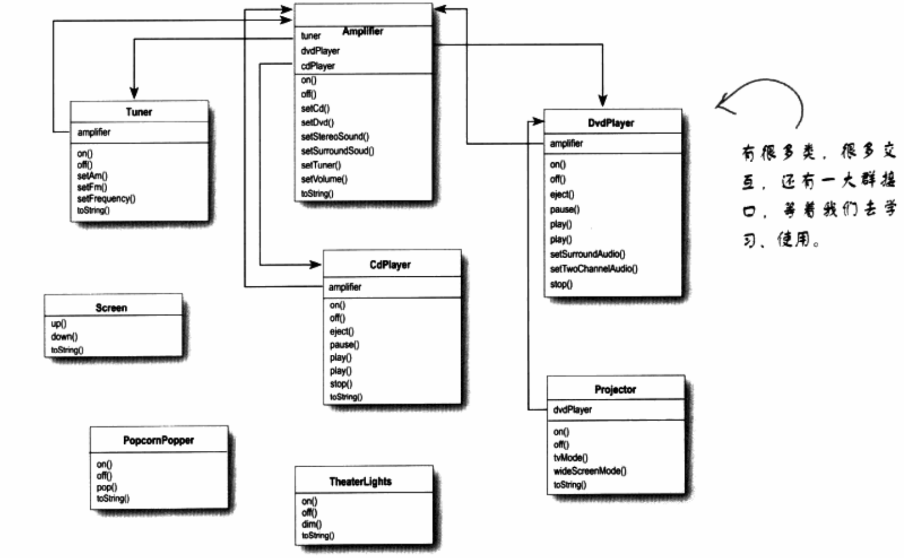
      - 所以，我们抽象出一个外观类来帮我们实现这些行为 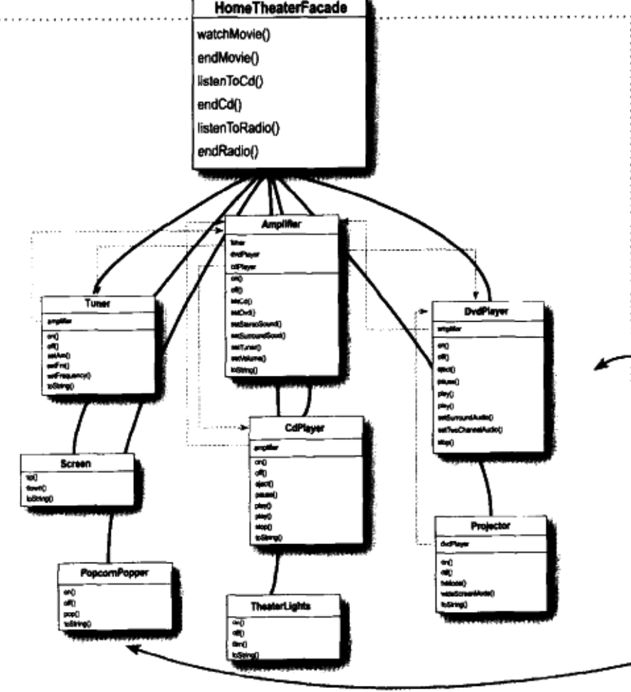
        - 外观组合（has-a）了所有的子系统，以实现外观接口提供的行为
    - 外观的作用
      - 简化了接口，而不是转换接口（适配器）
      - 将客户从组件的子系统中解耦
        - 因为如果客户使用的是外观提供的接口，则未来的实现只需要满足该外观的接口就行了
      - 外观简化了接口的同时，也允许暴露组件的接口（暴露底层的接口）
    - 可以为一个系统创建多个外观
    - 外观模式
      - 定义：提供了一个统一的接口，用来访问子系统中的一群接口。外观定义了一个高层接口，让子系统更容易使用
      - 类图 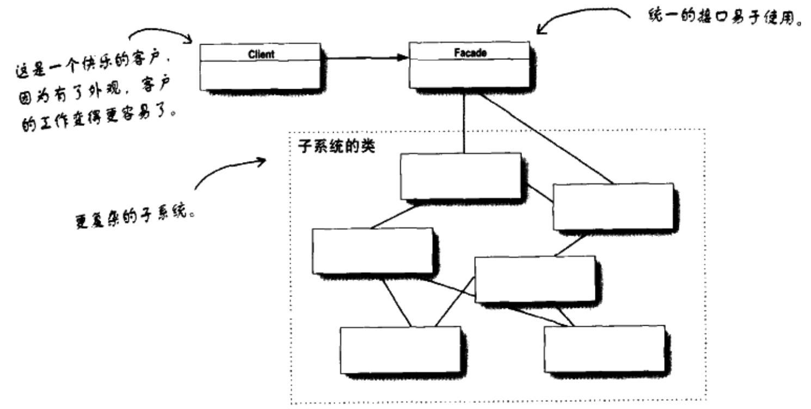
- 模版方法模式
```
