```markmap
---
markmap:
  initialExpandLevel: 2
  spacingVertical: 30
  spacingHorizontal: 180
---

# 进程
- 进程环境
  - main 函数
    - 在内核执行 C 程序时，在调用 main 之前先调用一个特殊的启动挒程。可执行程序将此启动例程指定为程序的起始地址
    - 启动挒程从内核取得命令行参数和环境变量值，然后调用 main 函数
    - 如果从 main 中返回，启动例程调用 exit，如果用 C 语言来进行描述的话，就应该是类似于这种： exit(main())
    - C 程序的启动和终止 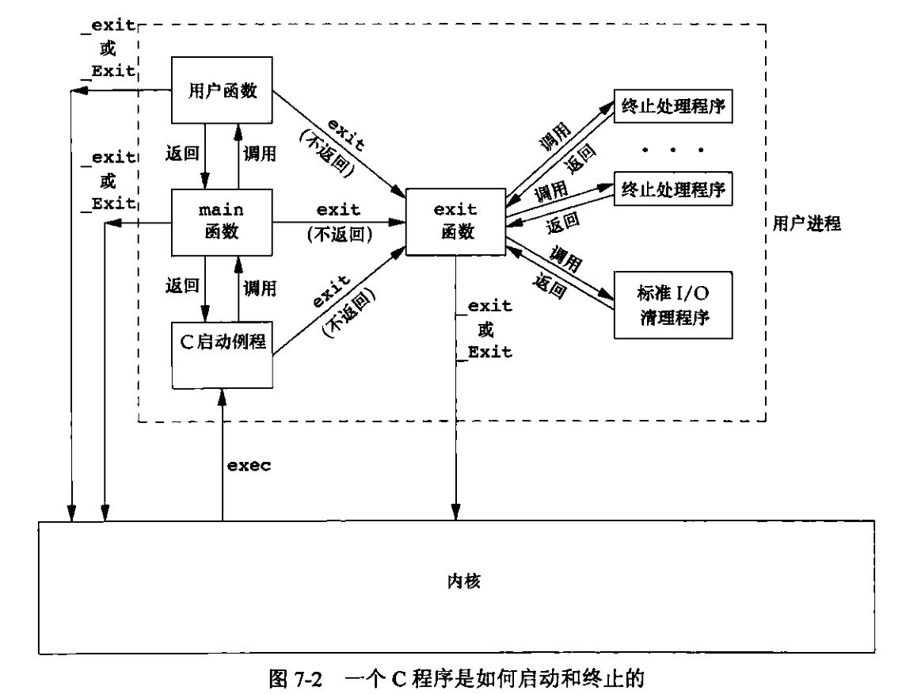
  - 进程终止
    - 终止方式
      - 从 main 函数返回
      - 调用 exit
        - 对于所有打开流调用 fclose 函数，这造成输出缓冲中的所有数据都写到文件上
      - 调用 _exit 或 _Exit
      - 最后一个线程从其启动例程返回
      - 从最后一个线程调用 pthread_exit
      - 调用 abort
      - 接收到一个信号
      - 最后一个线程对取消请求做出响应
    - atexit 函数 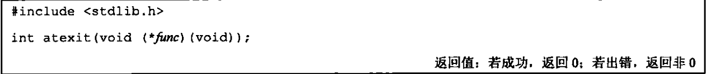
      - 一个进程可以登记多至 32 个函数（ISO C），这些函数将有 exit 自动调用。这些函数被称为终止处理程序（exit handler）
      - exit 首先调用终止处理程序，然后调用 fclose 来关闭打开流
      - POSIX 说明，如果程序调用 exec 函数族中的任意一个函数，则将清除所有已安装的终止处理程序
    - 无论进程如何终止，内核都会为相应进程关闭所有打开的描述符，释放它所用的存储器等
  - 环境表
    - 每个程序都接收到一张环境表，与 argv 类型一样，都是字符指针数组
    - 全局变量 environ 包含了环境表的地址
    - 称 environ 为环境指针，指针数组为环境表，各指针指向的字符串为环境字符串
      - 图解 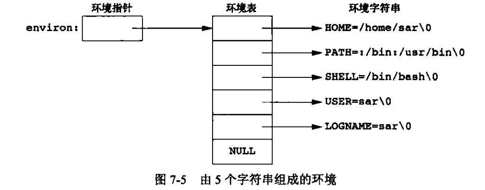
  - C 程序的存储空间布局
    - 典型的存储空间安排 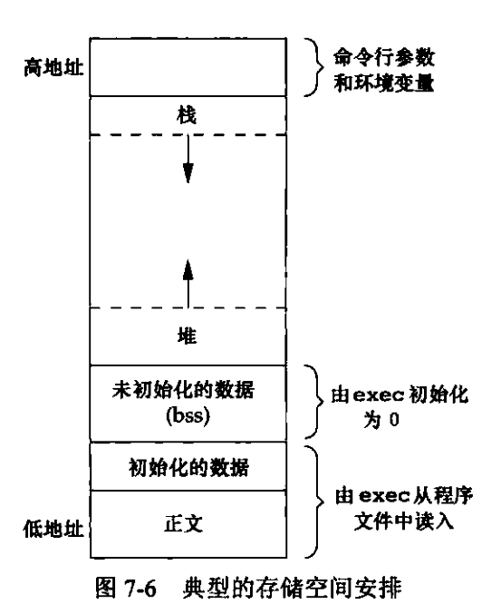
  - 存储空间分配
    - malloc calloc realloc free 函数原型 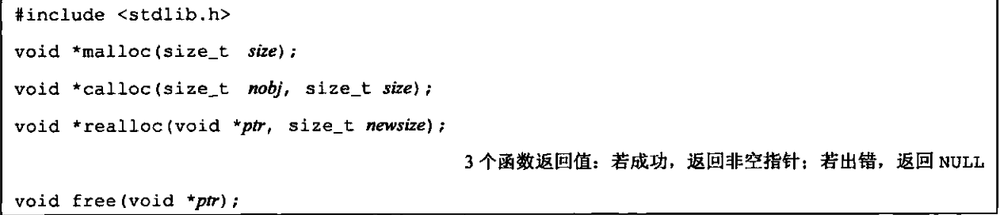
      - 所有 alloc 函数返回的指针都是适当对齐的，使其可用于任何数据对象
      - 使用 realloc 扩充存储空间
        - 如果原存储区有足够的空间，则无需移动原先的内容
        - 如果原存储区没有足够的空间，则需要分配另一个足够大的存储区，然后释放掉原存储区，并返回新分配区的指针
    - 替代的存储空间分配程序
      - libmalloc
      - vmalloc
      - quick-fit
      - jemalloc
      - TCMalloc
      - alloca 函数 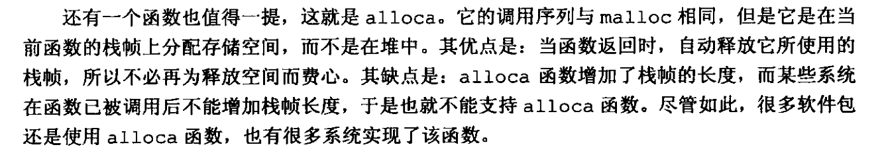
  - 环境变量
    - getenv 函数 
    - Single UNIX Specification 定义的环境变量 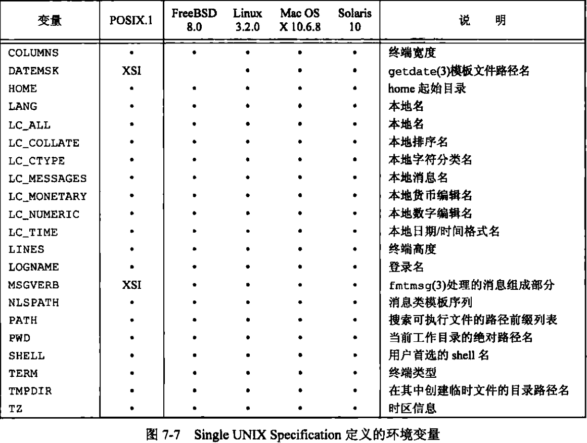
    - 增加或修改环境变量的值（能影响的只是当前进程及其生成和调用的任何子进程的环境变量，但是不能影响父进程的环境）
      - 不同系统对环境表函数的支持情况 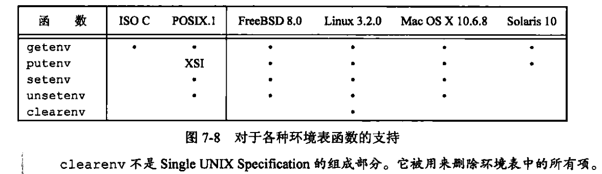
      - putenv 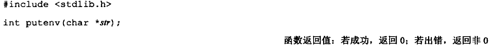
        - putenv取形式为 name-value 的字符串，将其放到环境表中。如果 name 已经存在，则先删除其原来的定义。
      - setenv 和 unsetenv 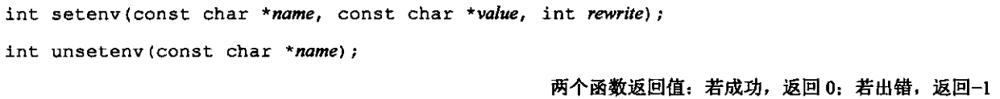
        - setenv将 name设置为 value。如果在环境中name 已经存在，那么：
          - 若rewrite非0，则首先删除其现有的定义
          - 若rewrite为0，则不删除其现有定义（name不设置为新的 value，而且也不出错)
        - unsetenv 删除 name 的定义。即使不存在这种定义也不算出错。
      - putenv 和 setenv 的区别
        - 注意，putenv 和setenv之间的差别。setenv必须分配存储空间，以便依据其参数创建name=value字符串。putenv 可以自由地将传递给它的参数字符串直接放到环境中。许多实现就是这么做的，因此，将存放在栈中的字符串作为参数传递给putenv就会发生错误，其原因是，从当前函数返回时，其栈帧占用的存储区可能将被重用。
      - 这些函数是如何修改环境表的
        - 通过此表，我们发现环境表和环境字符串通常占用的是进程地址空间的顶部，不能再向高地址扩展，也不能向下扩展（因为不能移动在它之下的各栈帧）。所以，环境表的空间并不能增加。 
        - 修改一个现有的 name
          - 如果新的 value 的长度小于等于现有的 value 长度，则只要将新字符串复制到原字符串所用的空间中
          - 如果新的 value 的长度大于现有的 value 长度，则必须调用 malloc 为新字符串分配空间，然后将该字符串复制到该空间中，然后使环境表中针对name的指针指向新分配区
        - 增加一个新的 name
          - 如果这是第一次增加一个新的 name，则调用malloc 为新的环境表分配空间，并将原来的内容复制到该区域，然后将新的 name=value 添加到该表的最后。最后，使 environ 指向新的环境表
          - 如果不是第一次新增 name，则调用 realloc 来分配比原空间多存放一个指针的空间
  - setjmp 和 longjmp 函数 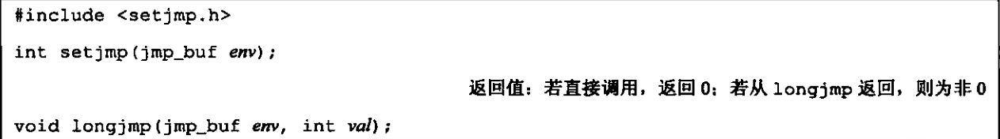
    - 用于执行跨函数的跳转（goto 语句不能跨函数）
    - 用于执行非局部跳转，在栈上跳过若干调用帧，返回到当前函数调用路径上的某一个函数中
    - 调用 longjmp 时处理栈帧的一般方式
      - 一般的方式是直接抛弃当前栈帧以下的栈帧
    - 当执行 longjmp 跳转之后，各种变量的变化情况
      - 自动变量
        - 即普通的在函数中声明的变量
      - 寄存器变量
        - 即使用 register 声明的变量
      - 易失变量
        - 即使用 volatile 声明的变量
      - 全局变量
      - 静态变量
      - 所有标准都没有规定这些变量的值
  - getrlimit 和 setrlimit 函数（资源限制控制函数） 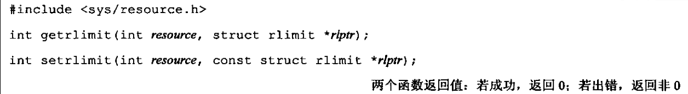
    - 每个进程都有一组资源限制，其中一些可以通过这两个函数查询或者修改
    - 程的资源限制通常是在系统初始化时由 0 进程建立的，然后由后续进程继承。每种实现都可以用自己的方法对资源限制做出调整。
    - struct rlimit 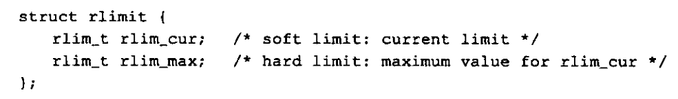
    - 在修改资源限制时，要遵循以下 3 条规则
      - 任何一个进程都可将一个软限制值更改为小于或等于其硬限制值
      - 任何一个进程都可降低其硬限制值，但它必须大于或等于其软限制值。这种降低，对普通用户而言是不可逆的。
      - 只有超级用户进程可以提高硬限制值。
    - 常量 RLIM_INFINITY 指定了一个无限量的限制
    - resource 参数的可能取值
      - 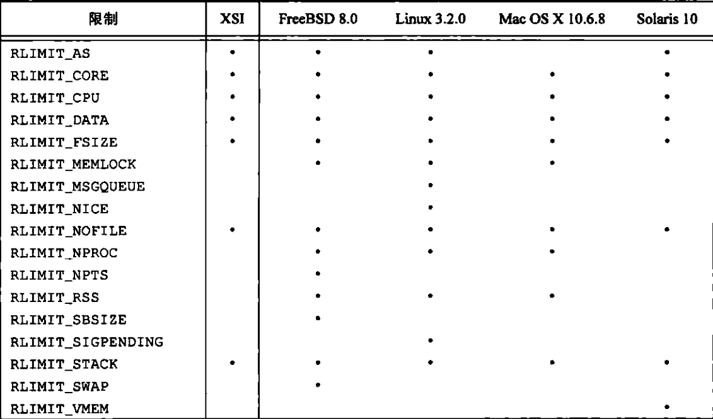
        - RLIMIT_AS 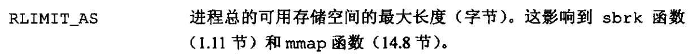
        - RLIMIT_CORE 
        - RLIMIT_CPU 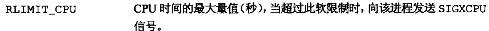
        - RLIMIT_DATA 
        - RLIMIT_FSIZE 
        - RLIMIT_MEMLOCK 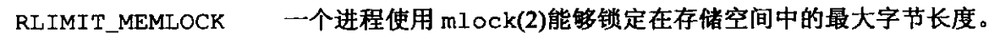
        - RLIMIT_MSGQUEUE 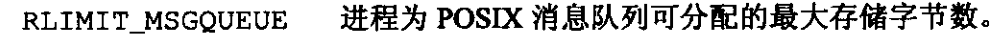
        - RLIMIT_NICE 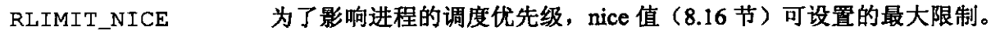
        - RLIMIT_NOFILE 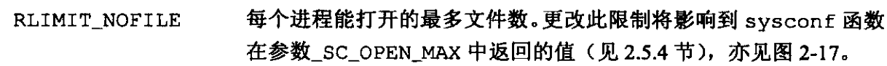
        - RLIMIT_NPROC 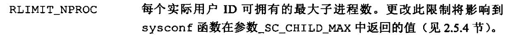
        - RLIMIT_NPTS 
        - RLIMIT_RSS 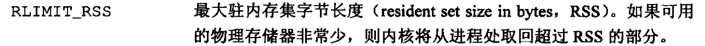
        - RLIMIT_SBSIZE 
        - RLIMIT_SIGPENDING 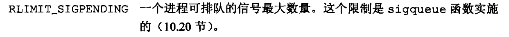
        - RLIMIT_STACK 
        - RLIMIT_SWAP 
        - RLIMIT_VMEM 
    - 资源限制值影响到调用进程并由其子进程继承
- 进程控制
  - 进程标识
    - 每个进程都有一个非负整形表示的唯一进程 ID
    - 进程 ID 是可复用的。大多数 UNIX 系统都采用的是延迟复用算法，使得新建的进程的 ID 不同与刚销毁的进程，这样避免了弄混淆
    - ID = 0 的进程通常是调度进程，通常被称为交换进程（swapper），是内核的一部分，是系统进程
    - ID = 1 的进程通常是 init 进程，在内核启动之后（bootstrap）由内核调用，在早期版本中，是 /etc/init，在新版本中是 /sbin/init
      - init 进程通常读取与系统有关的初始化文件（/etc/rc* | /etc/inittab | /etc/init.d 中的文件），并将系统引导到一个状态（例如多用户）
      - init 进程绝不会终止，它是一个普通用户进程，但是它以超级用户权限运行
    - 除了进程 ID，每个进程还有一些其他标识符： 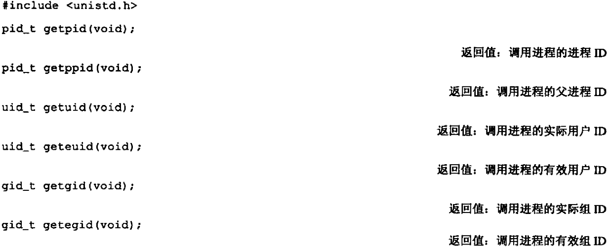
  - 创建新进程（子进程）
    - fork 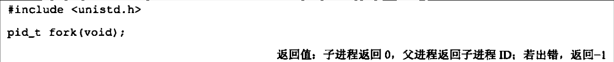
      - fork 被调用一次，但是返回两次
        - 子进程的返回值为 0 （进程 ID = 0 总是由内核交换程序使用）
        - 父进程的返回值是新建子进程的进程 ID
      - fork 调用之后，子进程是父进程的副本，子进程获得父进程的数据空间、堆、栈的副本，但是不共享存储空间，即副本是新创建出来的，与父进程的存储空间不是同一个
        - 大多数系统都实现了写时复制（Copy-On-Write）技术，而不是立即创建副本
        - 父进程和子进程共享正文段
        - 文件共享
          - fork 的一个特性是父进程的所有打开文件描述符都被复制到子进程中
          - 父进程和子进程共享同一个文件偏移量
          - 图解 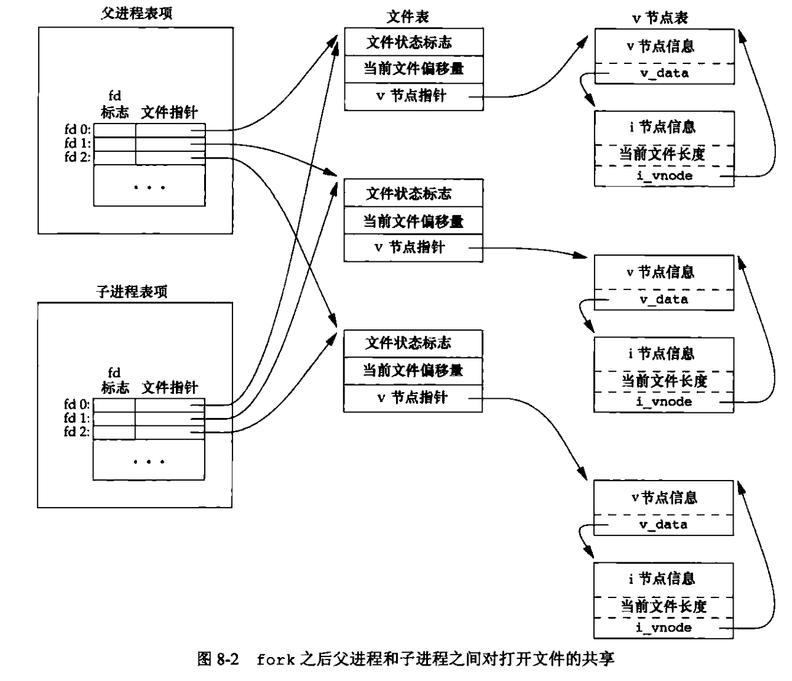
      - 子进程从父进程继承的属性以及 fork 执行的操作
        - 实际用户 ID、实际组 ID、有效用户 ID、有效组 ID
        - 附属组 ID
        - 进程组 ID
        - 会话 ID
        - 控制终端
        - 设置用户 ID 标志和设置组 ID 标志
        - 当前工作目录
        - 根目录
        - 文件模式创建屏蔽字
        - 信号屏蔽和安排
        - 文件描述符（fork 调用之后，父子进程具有相同的文件描述符）
        - 环境
        - 链接的共享存储段
        - 存储映像
        - 资源限制
      - 子进程与父进程之间的区别
        - fork 返回值不同
        - 进程 ID 不同
        - 父进程 ID 不同
        - 子进程的 tms_utime、tms_stime、tms_cutime 和 tms_ustime 的值设置为 0
        - 子进程不继承父进程设置的文件锁
        - 子进程的未处理闹钟被清除
        - 子进程的未处理信号集设置为空集
      - 父进程和子进程之间的执行顺序是未定的
      - fork 失败的两个原因
        - 系统中已经有太多的进程（这说明某个方面出现了问题）
        - 实际用户 ID 的进程总数超过了系统限制
      - 小技巧：使用两次 fork 避免父进程要等到子进程终止，也不希望子进程处于僵死状态直到父进程终止
        - 实现 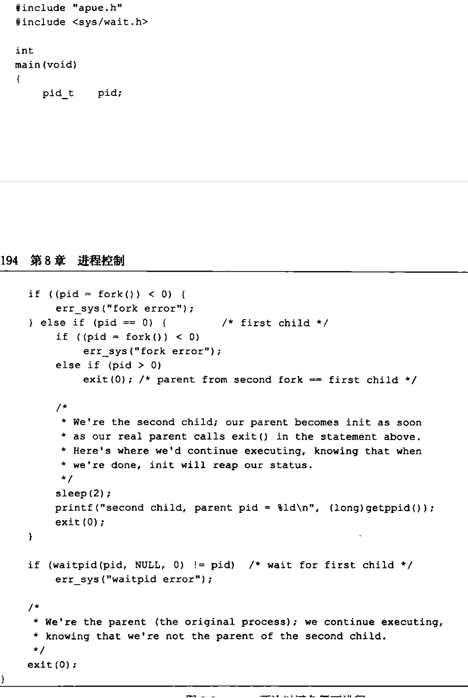
    - vfork
      - 使用 vfork 创建的子进程在调用 exec 或 exit 函数之前，会在父进程的地址空间中运行，也就是说在调用 exec 或 exit 函数之前，其对变量的修改将影响到父进程中该变量的值
      - vfork 保证子进程先执行，并且在子进程调用 exec 或 exit 函数之前父进程处于休眠状态，这一点可能会导致死锁
  - 进程退出/终止（exit 函数）
    - 退出状态 vs 终止状态
      - 退出状态（exit status）：向 3 个终止函数传递的参数（main 函数的返回值）
      - 在异常终止的情况下，内核（不是进程）产生一个指示其异常终止的终止状态（termination status）
      - 对于任意一种情况，终止进程的父进程都能用 wait 或 waitpid 函数取得其终止状态
    - 父进程在子进程之前终止，会发生什么？
      - 对于父进程已经终止的所有进程，他们的父进程都改变为 init 进程，称这些进程由 init 进程收养
      - 过程
        - 在进程终止时，内核出个检查所有活动进程，以判断它是否是正要终止进程的子进程，如果是，则该进程的父进程 ID 就更改为 1
          - 这种处理方法保证了每个进程有一个父进程
      - init 被编写成无论何时只要有一个子进程终止，inti就会调用一个wait 函数取得其终止状态，这就避免了系统中充满了僵死进程
    - 父进程在子进程之后终止，此时，如何得到子进程的终止状态？
      - 内核为每个终止子进程保存了一定量的信息，当父进程调用 wait 或 waitpid 时，就可以得到这些信息
        - 这些信息至少包括
          - 进程 ID
          - 终止状态
          - 该进程所使用的 CPU 时间总量
      - 一个已经终止，但是其父进程尚未对其进行善后处理（获取终止子进程的有关信息，释放它所占用的资源）的进程被称为僵死进程（zombie）
  - 等待子进程
    - wait 和 waitpid 函数 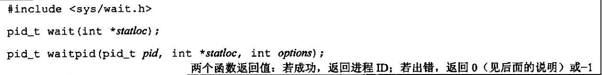
      - 进程终止时（无论是否是异常终止），内核向其父进程发送 SIGCHLD 信号
      - 调用 wait/waitpid 函数的行为
        - 如果其所有子进程都还在运行，则阻塞。
        - 如果一个子进程已终止，正等待父进程获取其终止状态，则取得该子进程的终止状态立即返回
        - 如果它没有任何子进程，则立即出错返回
      - wait vs waipid
        - 区别
          - wait 是调用者阻塞，而 waitpid 有一个选项，可以使调用者和不阻塞
          - waitpid 并不等待在其调用之后的第一个终止子进程，它有若干选项，可以控制它所等待的进程
          - 如果有多个子进程，那么任意一个子进程终止都会使 wait 返回
      - statloc 指针
        - 其中存储的是子进程的终止状态
        - 终止状态用定义在 &lt;sys/wait.h&gt; 中的 4 种互斥的宏来查看
          - 检查 wait 和 waitpid 所返回的终止状态的宏 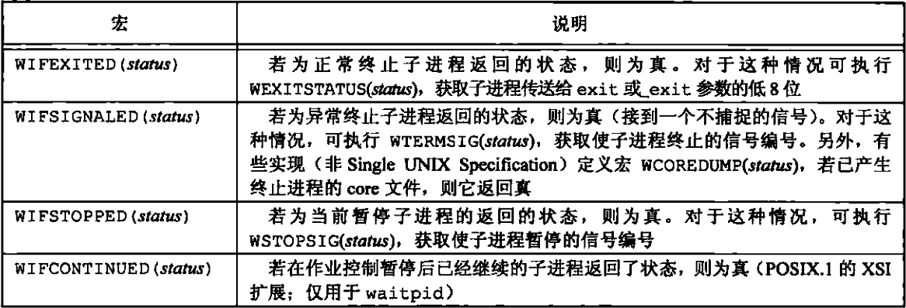
      - waitpid 的 pid 参数
        - pid = -1,等待任一子进程（与 wait 等价）
        - pid &gt; 0 等待进程 ID 与 pid 相等的子进程
        - pid == 0, 等待组 ID 等于调用进程组 ID 的任一子进程
        - pid &lt; -1, 等待组 ID 等于 pid 绝对值的任一子进程
        - 如果所指定的进程或进程组不存在，或者参数 pid 指定的进程不是调用进程的子进程，则出错
      - waitpid 的 option 参数
        - option 参数可能为 0 或者是上述常量或运算的结果 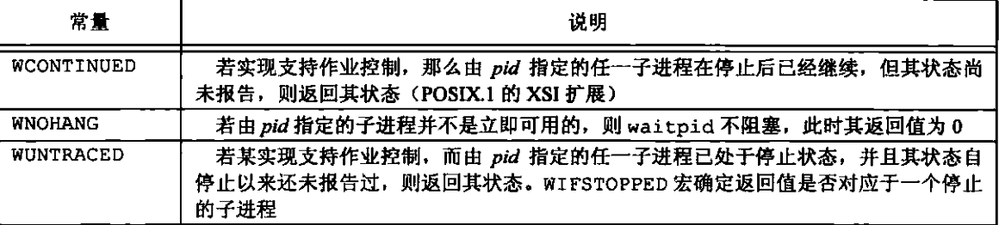
      - wait 的唯一出错
        - 调用进程没有任何子进程
    - waitid 函数 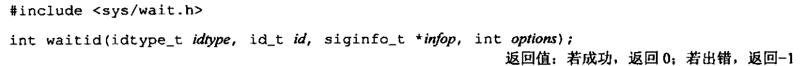
      - 类似于 waitpid，但是更加灵活
      - 使用两个单独的参数表示要等待的子进程所属类型，而不是将此与进程 ID 或进程组ID组合成一个参数， id 参数的作用与 idtype 有关
      - idtype 参数
        - 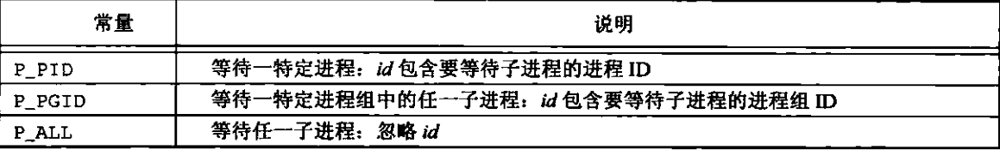
      - options 参数
        - 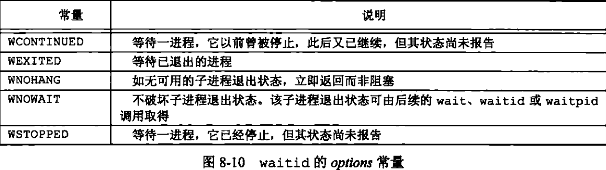
      - infop 参数指向 siginfo 结构体，包含了造成子进程转台改变有关信号的详细信息
    - wait3 和 wait4 函数 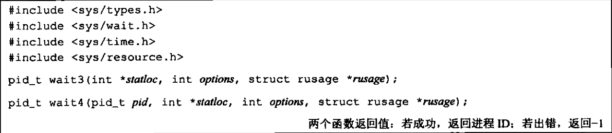
      - 比上述的 wait 函数的功能多一个：查看子进程使用的资源概况
      - 资源统计信息包括用户CPU时间总量、系统CPU时间总量、缺页次数、接收到信号的次数等。有关细节请参阅getrusage(2)手册页
  - exec 函数族 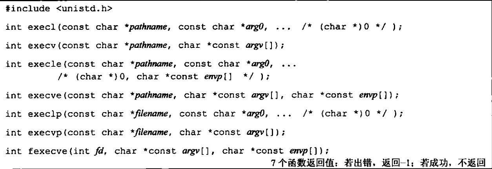
    - 当指定 filename 作为参数时
      - 如果 filename 中含有 /，则就将其视为路径名
      - 如果 filename 中不含 /,则在 PATH 环境变量中搜索可执行文件
    - 如果 execlp 或 execvp 找到一个可执行文件，但是该文件不是由链接器产生的机器可执行文件，那么就认为该文件是一个 shell 脚本，于是试着调用 /bin/sh，并以该 filename 作为 shell 的输入
    - 当使用 execl、execle、execlp 三个函数传递命令行参数的一般方法是（l 代表 list）： 
    - execle、execve、fexecve 可以传递一个指向环境字符串的指针
    - 7个函数的区别 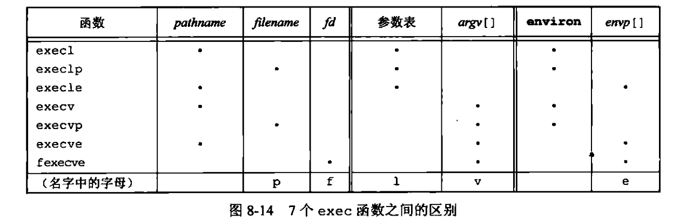
    - 系统对参数表和环境表的总长度有限制，这种限制由 ARG_MAX 给出
    - 在大多数系统中，只有 execve 是系统调用，其它的都是库函数
    - 7 个函数的关系 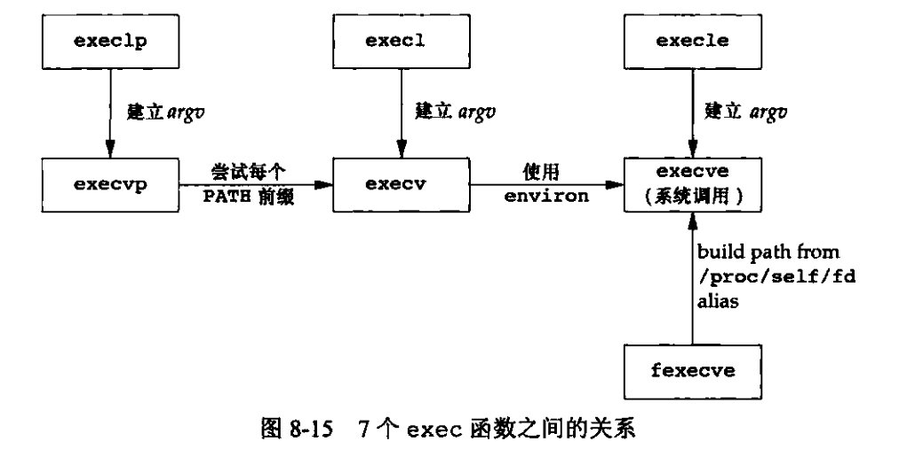
  - 更改用户 ID 和更改组 ID 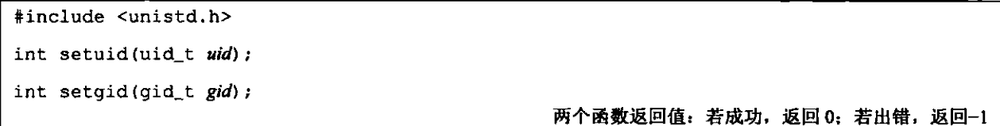
    - todo
  - 解释器文件
    - 解释器文件是文本文件，其开头的第一行是固定的格式： #! pathname [optional-argument]
      - #！和 pathname 之间的空格是可选的
    - pathname 是绝对路径名，因为对其不会在 PATH 环境变量中搜索
    - optional-argument 即使以空格分隔开多个参数，但是 pathname 接受到来自该解释器文件的参数也只有一个，即 pathname 后面的内容全部为一个参数，而不管其是否以空格分隔
    - 内核对这种文件的识别是由 exec 系统调用来识别的
    - exec 调用执行的程序是 pathname 指定的可执行程序
    - pathname 程序接受命令行参数的顺序
      - 1\. 其本身的路径
      - 2\. optional-argument
      - 3\. 解释器文件的路径
      - 4\. exec 系统调用指定的参数
      - 例如
        - 
        - 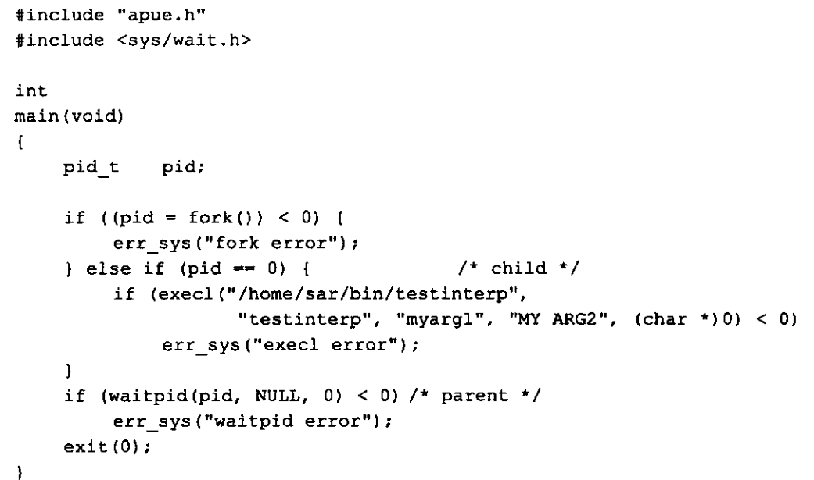
        - 输出如下： 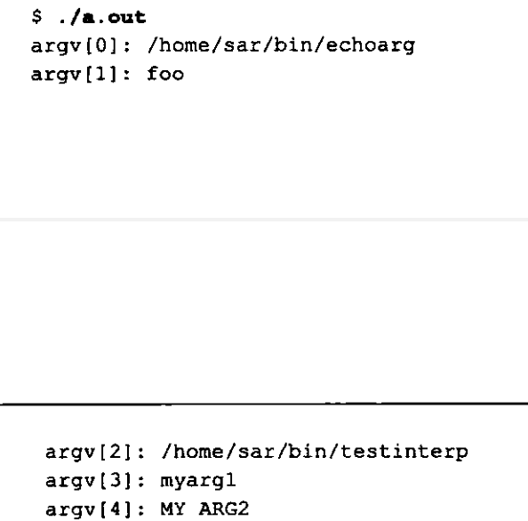
  - system 函数 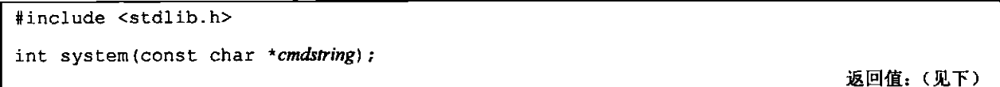
    - system 函数在程序中执行命令字符串
      - 例如: system("ls");
    - system 在函数实现中调用了fork、exec 和 waitpid 函数
    - 返回值
      - 如果 cmdstring 为空，那么仅当命令处理程序可用时，返回非零值
        - 可以使用此特征来判断给定的操作系统是否支持 system 函数
      - fork 失败或者 waitpid 返回除 EINTR 之外的出错，则 system 返回 -1，并设置 errno 来指示错误
      - ecec 失败（不能执行 shell），则其返回值如同执行了 exit(127)
      - 如果 fork、exec 和 waitpid 都成功，则返回 shell 的终止状态
  - 进程会计（process accounting）
    - Unix 系统提供了一个进程会计选项，启用该选项之后，每当进程结束时内核就会写一个会计记录
      - 这就意味着不能获取永不终止的进程的会计记录
    - 典型的会计记录包含总量较小的二进制数据，一般包括命令名、所使用的 CPU 时间总量、用户 ID 和组 ID、启动时间等。
    - 使用 acct 函数来启用和禁用进程会计
    - 会计记录的基本字段
      - 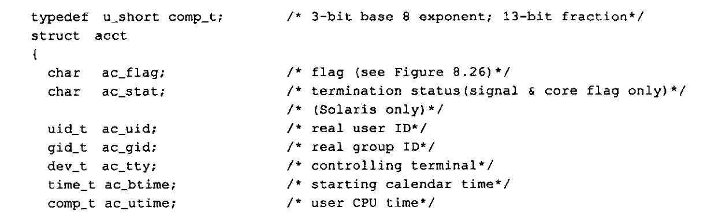
      - 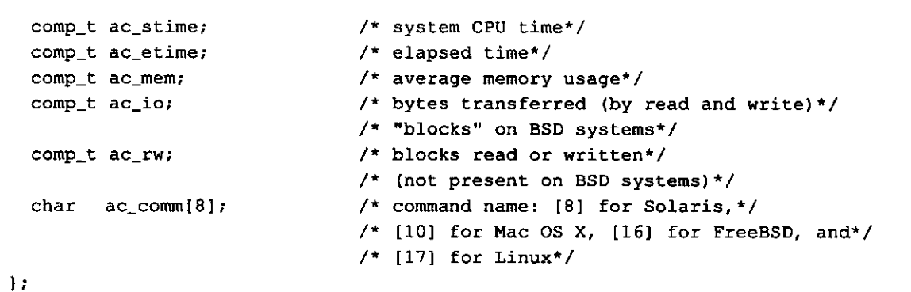
    - ac_flag
      - 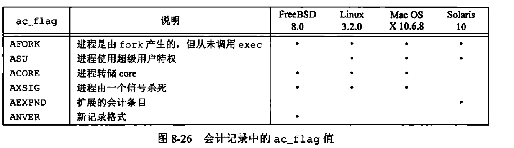
    - 会计记录对应于进程而不是程序
      - 这意味着 fork 之后内核会为进程初始化一个记录，但是，exec 并不创建一个新的会计记录，但记录中的命令名改变了且 AFORK 标志会被清除
      - 例如：如果一个进程顺序执行了 3 个（A exec B、B exec C，最后是 C exit），只会写一个会计记录。在该记录中的命令名对应于程序 C，但 CPU 时间是程序 A、B 和 C 之和。
  - 用户标识
    - 目的：找到运行该程序用户的登录名
    - 一个用户可以有多个登录名，这些登录名都对应着一个用户 ID（一个人在口令文件中可以有多个登录项，他们的用户 ID 相同，但是登录 shell 不同）
    - getlogin 函数原型 
      - 如果调用此函数的进程没有连接到用户登录时所用的终端，则函数会失败
  - 进程调度
    - nice 值
      - nice 值越低，优先级越高
      - 进程只能影响自己的 nice 值
      - NZERO 是系统默认的 nice 值
      - nice 值可能为负
      - nice 值的范围：[-NZERO, NZERO)
      - nice 函数 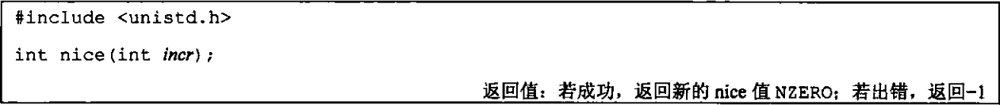
        - incr 参数被增加到调用进程的 nice 值上。如果incr 太大，系统直接把它降到最大合法值，不给出提示。类似地，如果incr太小，系统也会无声息地把它提高到最小合法值。
        - nice 返回值 = -1（-1 是合法的返回值）
          - 如果 nice 函数调用成功，那么 errno = 0
          - 如果 nice 函数调用失败，那么 errno 不为 0
      - getpriority 函数 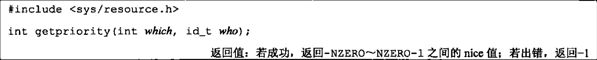
        - which 参数可以取 3 个值
          - PRIO_PROCESS：表示进程
          - PRIO_PGRP：表示进程组
          - PRIO_USER：表示用户 ID
          - which 参数控制 who 参数的含义
          - 如果 which 参数作用于多个进程，则返回所有作用进程中优先级最高的 nice 值
        - who 参数
          - = 0：表示调用进程、进程组或者用户（取决于 which 参数的值）
            - 例如，当 which = PRIO_USER，who = 0 时，表示使用调用进程的实际用户 ID
      - setpriority 函数 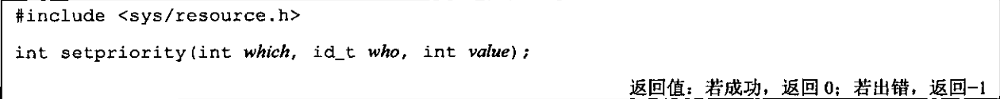
        - 可以为进程、进程组和特定用户 ID 的所有进程设置优先级
        - which 和 who 参数于 getpriority 函数相同，value 会增加到 NZERO 上，变为新的 nice 值
      - 子进程继承 nice 值
  - 进程时间
    - times 函数 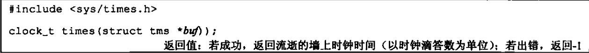
      - 任一进程都可以调用 times 函数来获得它自己以及已终止子进程的墙上时钟时间、用户 CPU 时间、系统 CPU 时间
      - buf 中，关于子进程的字段包含了使用 wait 函数族已等待到的各子进程的值
      - tms 结构体 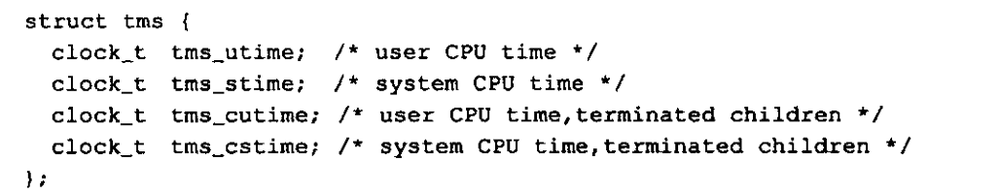
- 进程关系
  - 终端登录
    - BSD 终端登录（传统 UNIX 终端登录）
      - 系统管理者创建名为 /etc/ttys 的文本文件
        - 其中，每个终端设备都有一行，此行说明设备名和传到 getty 程序的参数等
      - 当系统启动时，内核创建进程 ID = 1 的 init 进程，init 使系统进入多用户模式
      - init 读取文件 /etc/ttys，对每个允许登录的终端设备，init 调用一次 fork，其生成的子进程执行 exec getty 程序
        - 图解 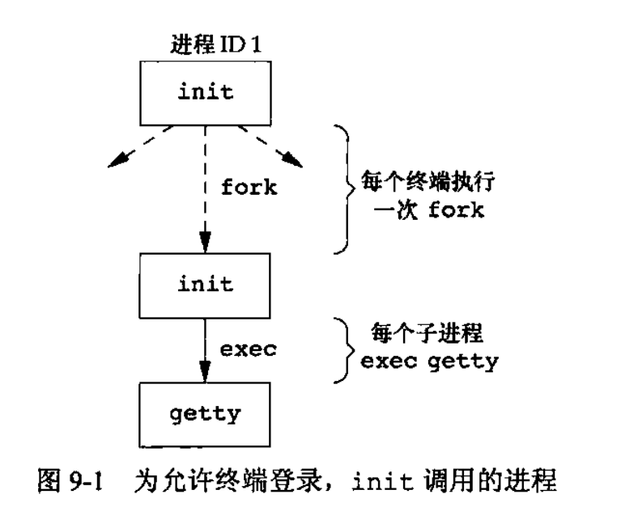
      - getty 程序对终端设备调用 open 函数，以读写方式打开终端。如果设备是调制解调器，则 open 可能会在设备驱动程序中滞留，知道用户拨号调制解调器，并且线路被接通。
      - 一旦设备被打开，文件描述符 0、1、2 就被设置到该设备，然后，getty 输出 "login:" 之类的信息，并等待用户键入用户名
      - 当用户键入用户名之后，getty 程序以类似于下列的方式执行 login 程序： 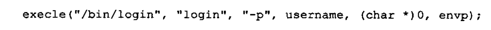
        - 图解 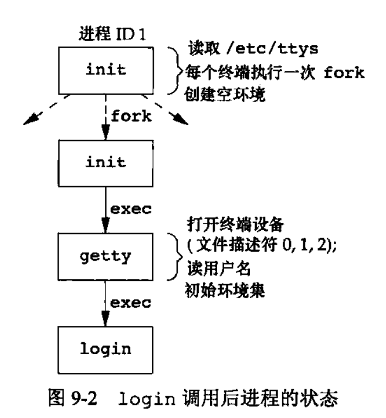
          - exec 不会改变进程的 ID
      - login 程序调用 getpwnam 取得相应用户的口令文件登录项，然后调用 getpass 以显示提示“Password: ”，然后，调用 crypt 井用户键入的口令加密，并于用户在阴影文件中登录项的 pw_passwd 字段进行比较，如果用户几次输入的口令都无效，则 login 以参数 1 调用 exit 表示登录过程失败。
      - init 在得知 login 程序的终止情况后，在此调用 fork，然后又执行 getty，对此终端执行上述过程
    - [PAM](https://www.cnblogs.com/fengdejiyixx/p/14804741.html)
      - Pluggable Authentication Modules，可插入的身份验证模块
      - PAM 允许管理人员配置何种身份验证方法来访问那些使用 PAM 库编写的服务
      - 如果某个应用程序需要验证用户是否具有适当的权限去执行某个服务，那么，可以将身份验证机制写到应用中，也可以使用 PAM 库来达到相同的目的
        - 使用 PAM 库的优点：管理员可以基于本地策略、针对不同任务配置配置不同的验证身份的方法
      - 如果用户正确登录，login 就完成下列工作
        - 将当前工作目录更改为该用户的起始目录
        - 调用 chown 更改该终端的所有权，是登录用户成为它的所有者
        - 将对该终端设备的访问权限改为“用户读和写”
        - 调用 setgid 和 initgroups 设置进程的组 ID
        - 用 login 得到的所有信息初始化一个环境：起始目录（HOME）、shell（SHELL）、用户名（USER 和 LOGNAME）以及一个系统默认路径（PATH）
        - login 进程更改为登录登录用户的用户 ID（setuid）并调用该用户的登录 shell，方式类似于： 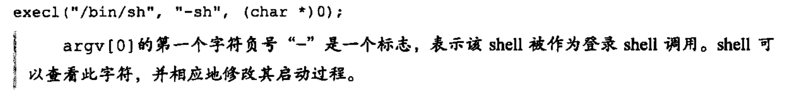
  - 网络登录
    - 为了使一个软件节既能处理终端登录，又能处理网络登录，系统使用了一种称为软终端（pseudo terminal）的软件驱动程序，它仿真了串行终端的运行行为，并将终端操作映射为网络操作，反之亦然
    - BSD 网络登录
      - 有一个 inetd 进程（有时称为因特网超级服务器）
      - 当系统启动时，init 调用一个 shell，使其执行 shell 脚本 /etc/rc
      - 此脚本启动一个守护进程 inetd，一旦此脚本终止，inetd 的父进程就变成了 init 进程
      - inted 等待 TCP/IP 连接请求到达主机，每当一个连接请求到达时，执行一个 fork，生成的子进程执行适当的程序
        - 对于一个 TELNET 请求
          - 对于一个 TELNET 服务进程的 TCP 连接请求到达（如客户端使用 telnet hostname 命令连接到本主机），会执行 telnet 程序 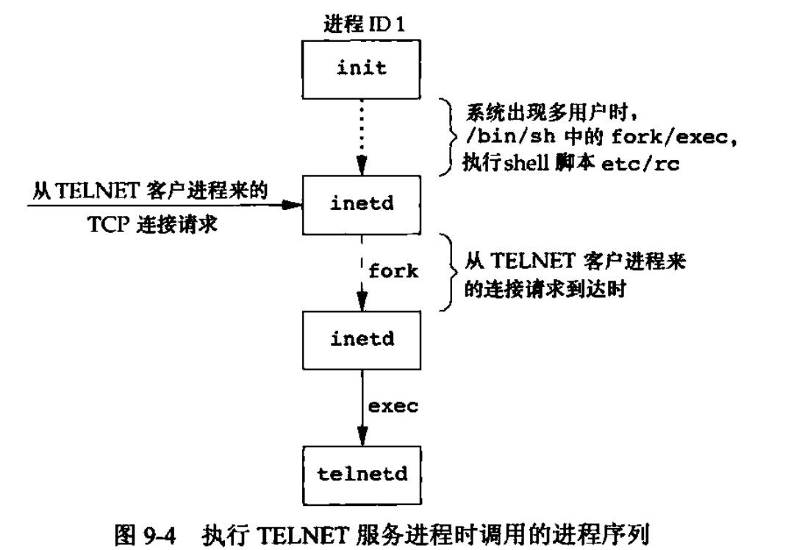
          - telnetd 打开一个伪终端设备，并用 fork 生成一个子进程。父进程处理通过网络连接的通信，子进程则 exec login 程序。父进程和子进程通过伪终端相连接
            - 在调用 exec 之前，子进程使其文件描述符0、1、2 与伪终端相连
          - 图解 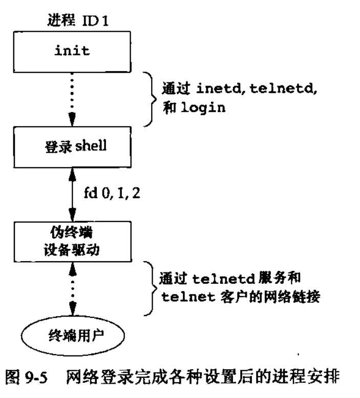
    - linux 网络登录
      - 某些版本使用 xinetd 代替 inetd 以提供更精细的控制
  - 进程组
    - 是一个或多个进程的集合。每个进程组都有一个唯一的进程组 ID，是一个正整数，可以存放于 pid_t 数据类型中
    - getpgrp 函数返回调用进程的进程组 ID 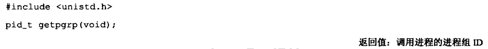
    - getpgid 函数，返回 pid 进程的进程组 ID 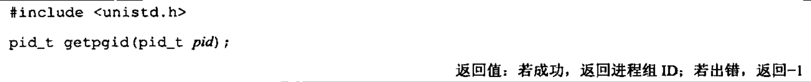
      - 如果 pid = 0，则返回调用进程的进程组 ID
    - 每一个进程组有一个组长进程。组长进程的进程组 ID 等于其进程 ID
      - 组长进程可以创建一个进程组创建该组中的进程，然后终止。只要在某个进程组中有一个进程存在，则该进程组就存在，这与组长进程是否终止无关
    - 从进程组创建开始知道组中的最后一个进程终止为止的时间段被称为进程组的生命周期
    - 某个进程组中的最后一个进程可以终止，也可以转移到其他进程组
    - 进程调用 setpgid 可以加入或者创建一个进程组 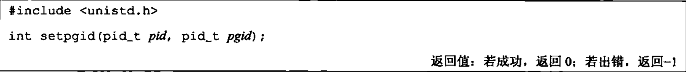
      - 将 pid 进程的的进程组 ID 设置为 pgid
      - 如果两个参数相等，则由 pid 指定的进程变成进程组的组长
      - 如果 pid = 0，则使用调用者进程的进程 ID
      - 如果 pgid = 0，则由 pid 指定的进程 ID 作为进程组 ID
      - 一个进程只能为它自已或它的子进程设置进程组ID。在它的子进程调用了exec后，它就不再能更改该子进程的进程组ID。
  - 会话（session）
    - 一个或多个进程组的集合
      - 示例 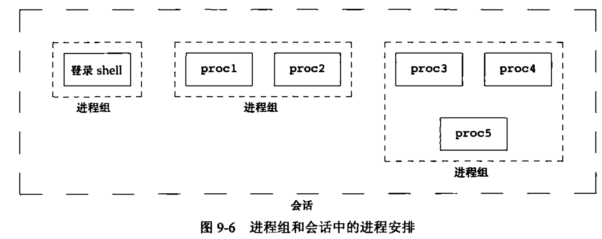
    - 进程调用 setsid 来创建一个新的会话 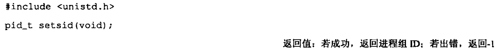
      - 如果调用进程不是一个进程组的组长，则此函数创建一个新会话
        - 该进程会变成新会话的会话首进程（session leader），即创建该会话的进程
        - 该进程会成为一个新进程组的组长进程，该新进程组 ID = 该调用进程 ID
        - 此函数会确保该进程没有控制终端
      - 如果调用进程已经是一个组的组长，则此函数出错
        - 为了保证不处于这种情况，通常先调用 fork，然后使其父进程终止，而子进程则继续。因为子进程继承了父进程的进程组 ID，而其进程 ID 则是新分配的，两者不可能相等，这就保证了子进程不是一个进程组的组长。
    - getsid 函数返回会话首进程的进程组 ID 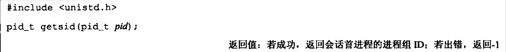
      - pid = 0 时，返回调用进程的会话首进程的进程组 ID
      - 如果 pid 不属于调用者所在的会话，那么，调用进程就不能得到该会话首进程的进程组 ID
  - 控制终端
    - 一个会话可以有一个控制终端（controlling terminal），可能是终端设备或者伪终端
    - 与控制终端建立连接的会话首进程被称为控制进程（controlling process）
      - 当会话首进程使用 open 时没有指定 O_NOCTTY 参数并且打开的是第一个尚未与一个会话相关联的终端设备时，基于 System V 派生的系统会将此作为控制终端分配给此会话
      - BSD 系统 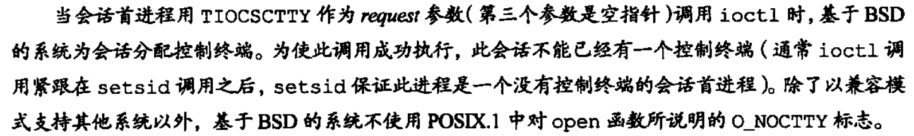
    - 一个会话中的几个进程组可以被分为一个前台进程组（foreground process group）以及一个或多个后台进程组（background process group）
      - 前台进程组只能有 1 个，后台进程组可以有多个
    - 如果一个会话有一个控制终端，则它有一个前台进程组，其他进程组为后台进程组
    - 无论何时输入终端的中断键（Delete 或者 Ctrl+C）或者退出键（Ctrl+\\），都会将中断信号发送至前台进程组的所有进程
    - 如果终端接口检测到调制解调器（或网络）已经断开连接，则将挂断信号发送至控制进程
    - 图解 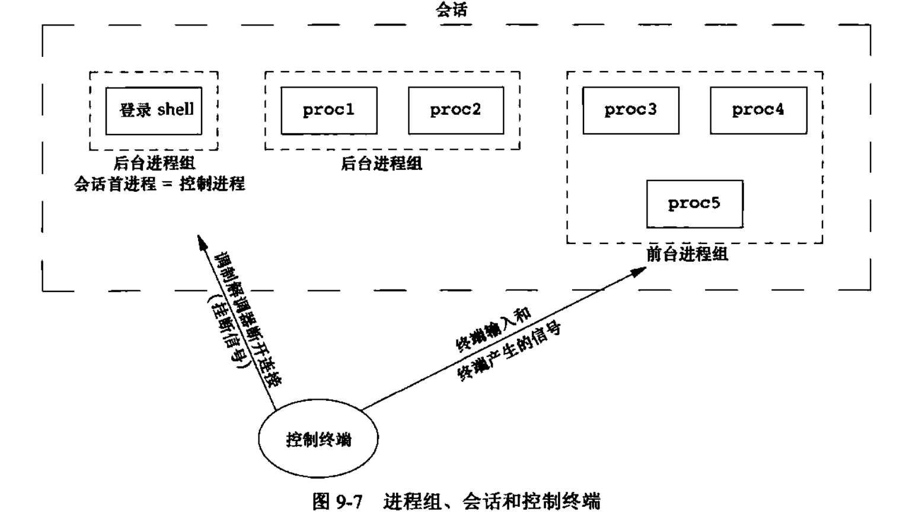
  - tcgetpgrp、tcsetpgrp 和 tcgetsid
    - tcsetpgrp 用来通知内核哪一个进程组是前台进程组。 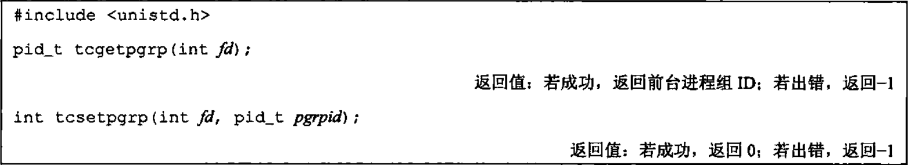
      - 如果进程有一个控制终端，则该进程可以调用 tcsetpgrp 来将前台进程组 ID 设置为 pgrpid。 pgrpid 应当是在同一会话中的一个进程组的 ID。fd 必须是该会话的控制终端。
      - tcgetpgrp 用来返回前台进程组 ID，该前台进程组 ID 与在 fd 上打开的终端相关联
    - tcgetsid 用来获得会话首进程的进程组 ID 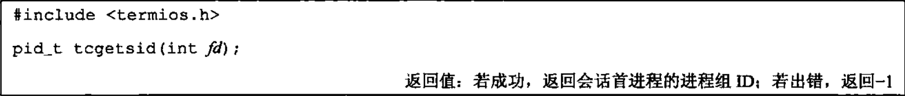
      - fd 为控制终端的设备文件的文件描述符
  - 作业控制
    - 作业控制允许在一个终端上启动多个作业（进程组），控制哪一个作业在可以访问该终端以及哪些作业在后台运行
    - 前台作业
      - 例如，vim.hello.c
      - 前台作业接收 SIGINT（Delete、Ctrl+C）、SIGQUIT（Ctrl+\\）、SIGTSTP（Ctrl+Z）信号，这些信号由终端驱动程序发出，而由用户输入产生
      - 只有前台作业可以接收终端输入。如果后台作业试图读取终端输入，这并不是一个错误，但是终端驱动程序会检测这种情况，并且向后台发送一个特定的信号 SIGTTIN。此信号通常会停止该后台作业，而 shell 则向有关用户发出这种情况的通知。当用户将该作业转为前台进程了之后，shell会向前台进程组发送 SIGCONT 信号，然后，该进程继续执行
        - 例如 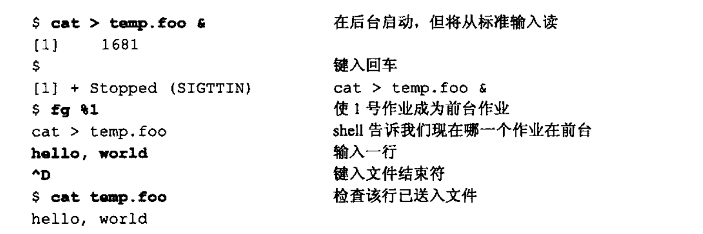
    - 后台作业
      - 例如，vim hello.c &
      - shell 会为后台作业赋予一个作业标识符（作业编号），并打印其进程 ID 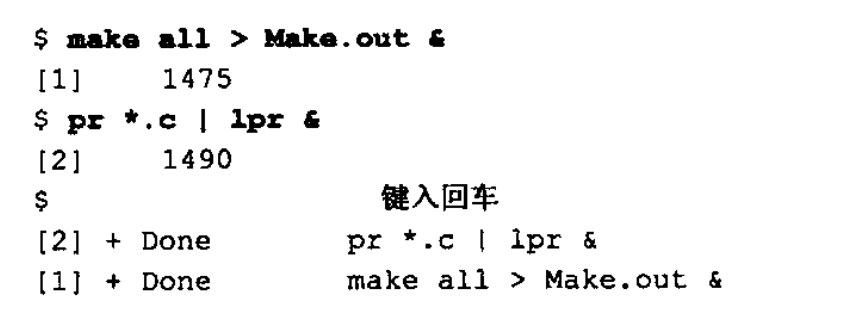
      - 用户可以配置后台作业是否可以输出到控制终端上：可以通过 stty 命令来配置
        - 示例 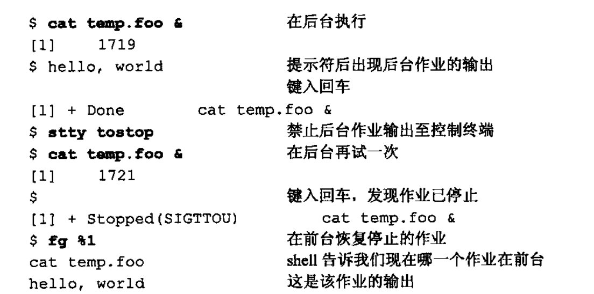
  - 总结 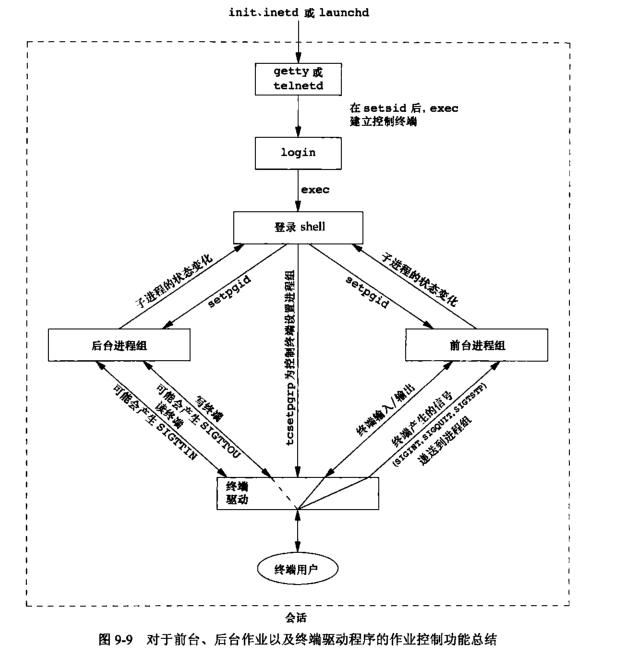
  - 孤儿进程组
    - 定义：该组中每个成员的父进程要么是该组的一个成员，要么不是该组所属会话的成员。
    - POSIX.1 要求向新的孤儿进程组处于停止状态的每个进程发送挂断信号（SIGHUP），接着又向其发送继续信号（SIGCONT）。注意，这两个信号不会重复发送多次。
    - 例如：使用 fork 之后，父进程 a 将要终止，子进程 b 停止了（接收到了 SIGTSTP 信号）。当进程 a 终止了之后，进程组内只有一个进程 b。故而，该进程组（6099）成为了孤儿进程组。 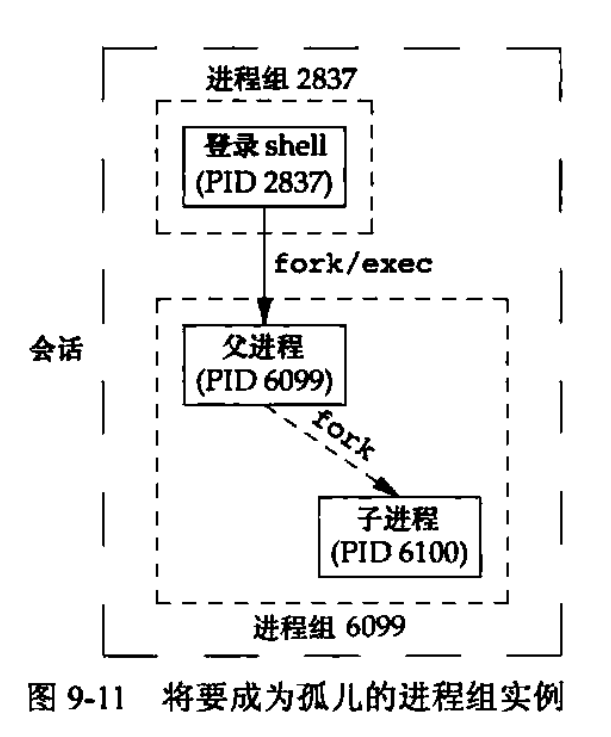
      - 模仿程序 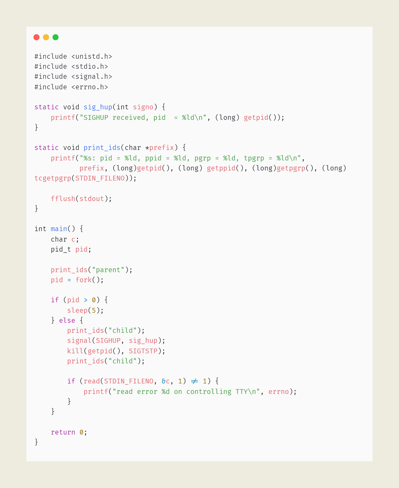
      - 输出如下： 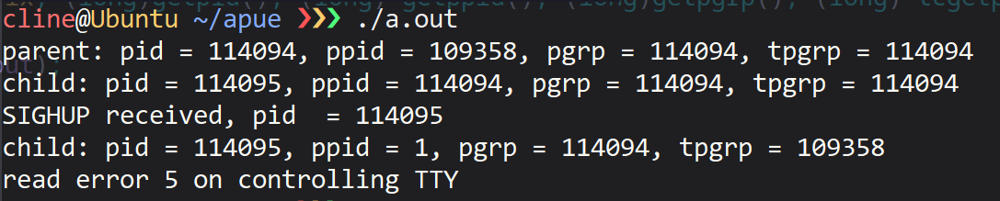
        - 注意，子进程称为了孤儿进程组之后与 STDIN 关联的终端的前台进程组改变了，所以，由于一个会话当中只能有一个前台进程组，而且该孤儿进程组是后台进程组，故而，read 函数会出错
```
