```markmap
---
markmap:
  initialExpandLevel: 2
  spacingVertical: 30
  spacingHorizontal: 180
---

# 链接
- 描述
  - 链接（linking）是将各种代码和数据片段收集并组合成为一个单一文件的过程
  - 链接器使分离编译成为可能
- 静态链接
  - 链接器的主要任务
    - 符号解析
      - 目标文件定义和引用符号，每个符号对应于一个函数、一个全局变量或一个静态变量（即C语言中任何以 static属性声明的变量）。符号解析的目的是将每个符号引用正好和一个符号定义关联起来。
    - 重定位
      - 编译器和汇编器生成从地址 0 开始的代码和数据节。链接器通过把每个符号定义与一个内存位置关联起来，从而重定位这些节，然后修改所有对 这些符号的引用，使得它们指向这个内存位置 。
      - 链接器使用汇编器产生的重定位条目 (relocation entry) 的详细指令，不加甄别地执行这样的重定位 。
- 目标文件
  - 三种形式
    - 可重定位目标文件
      - 包含二进制代码和数据，其形式可以在编译时与其他可重定位目标文件合并起来，创建一个可执行目标文件
    - 可执行目标文件
      - 包含二进制代码和数据。其形式可以被直接复制到内存并执行
    - 共享目标文件
      - 一种特殊类型的可重定位目标文件，可以在加载或者执行时被动态地加载进内存并链接
- 可重定位目标文件
  - ELF 可重定位目标文件
    - 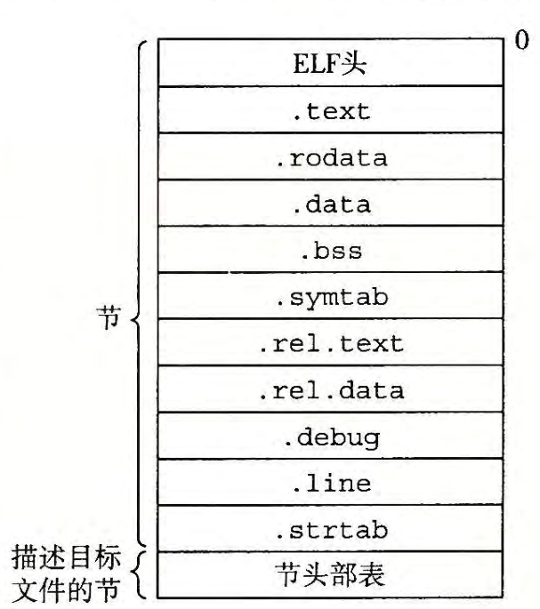
    - ELF 头：ELF 头 （ ELF header) 以一个 16 字节的序列开始，这个序列描述了生成该文件的系统的字的大小和字节顺序。ELF 头剩下的部分包含帮助链接器语法分析和解释目标文件的信息。其中包括 ELF 头的大小、目标文件的类型（如可重定位、可执行或者共享的）、机器类型（如 x86-64) 、节头部表 (section header table) 的文件偏移，以及节头部表中条目的大小和数最。不同节的位置和大小是由节头部表描述的，其中目标文件中每个节都有一个固定大小的条目(entry)
    - 节
      - .text:已编译程序的机器代码。
      - .rodata: 只读数据，比如 printf 语句中的格式串和开关语句的跳转表。
      - .data: 已初始化的全局和静态 C 变量。局部 C 变鼠在运行时被保存在栈中，既不出现在 .data 节中，也不出现在 .bss 节中。
      - .bss: （better save space)未初始化的全局和静态 C 变量，以及所有被初始化为 0 的全局或静态变量。在目标文件中这个节不占据实际的空间，它仅仅是 一 个占位符。目标文件格式区分已初始化和未初始化变量是为了空间效率。在目标文件中，未初始化变量不需要占据任何实际的磁盘空间。运行时，在内存中分配这些变量，初始值为 0 。
      - .symtab: 一个符号表，它存放在程序中定义和引用的函数和全局变量的信息。一些程序员错误地认为必须通过 -g 选项来编译一个程序，才能得到符号表信息。实际上，每个可重定位目标文件在 .symtab 中都有一张符号表（除非程序员特意用 STRIP 命令去掉它）。然而，和编译器中的符号表不同，.symtab 符号表不包含局部变量的条目。
      - .rel .text: 一个 .text 节中位置的列表，当链接器把这个目标文件和其他文件组合时，需要修改这些位置。一般而言，任何调用外部函数或者引用全局变量的指令都需要修改。另一方面，调用本地函数的指令则不需要修改。注意，可执行目标文件中并不需要重定位信息，因此通常省略，除非用户显式地指示链接器包含这些信息。
      - . rel .data: 被模块引用或定义的所有全局变最的重定位信息。一般而言，任何已初始化的全局变最，如果它的初始值是一个全局变量地址或者外部定义函数的地址，都需要被修改。
      - .debug: 一个调试符号表，其条目是程序中定义的局部变量和类型定义，程序中定义和引用的全局变量，以及原始的 C 源文件。只有以 -g 选项调用编译器驱动程序时，才会得到这张表。
      - .line:原始 C 源程序中的行号和 .text 节中机器指令之间的映射。只有以 -g 选项调用编译器驱动程序时，才会得到这张表。
      - .strtab:一个字符串表，其内容包括 .symtab 和 .debug 节中的符号表，以及节头部中的节名字。字符串表就是以 null 结尾的字符串的序列。
  - 符号和符号表 m
    - 符号
      - 三种不同的符号
        - 全局符号：由 m 定义并能被其他模块引用的全局符号。对应非静态的 C 函数和全局变量
        - 外部符号：由其他模块定义并被 m 引用的全局符号。对应其他模块中定义的非静态 C 函数和全局变量
        - 局部符号：只能由 m 定义和引用。对应于带 static 属性的 C 函数和全局变量。这些符号在模块 m 中任何位置都可见，但是不能被其他模块引用
      - 符号被分配到目标文件的某个节中
    - 符号表 （.symtab)
      - 符号表由汇编器创建
      - 符号表每个条目的格式 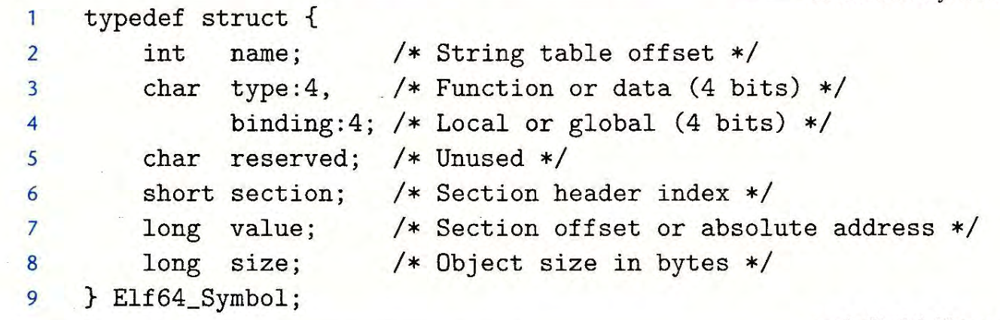
        - name 是字符串表中的字节偏移，指向的符号以null 结尾的字符串名字
        - value 是距定义目标的节的起始位置的偏移。
        - size 是目标的大小（以字节为单位）
        - type 通常要么是函数，要么是数据
        - binding 字段表示符号是本地的还是全局的
  - 三个特殊的伪节（pseudosection）
    - 伪节在节头部表中没有条目
    - ABS
      - 代表不应该重定位的符号
    - UNDEF
      - 代表伪定义的符号：本目标模块中引用，但是在其他地方定义的符号
    - COMMON
      - 表示还未分配位置的未初始化的数据目标，对于 COMMON 符号，value 字段表示对齐要求，size 表示最小的大小
      - 
- 符号解析
  - 将每个引用与它输入的可重定位目标文件的符号表中的定义的符号定义关联起来
    - 对于局部符号
    - 对于全局符号
      - 如果不是在当前模块中定义的全局符号（UNDEF节），编译器会假设该符号是在其他模块中定义的，会生成一个链接器符号表条目，交由链接器处理
  - 如何解析多重定义的全局符号
    - 强弱符号
      - 函数和已初始化的全局变量是强符号
      - 未初始化的全局变量是弱符号
    - 规则
      - 不允许有多个同名的强符号
      - 如果有一个强符号和多个弱符号同名，那么选择强符号
      - 如果有多个弱符号同名，那么选择其中的任意一个
- 与静态库链接
  - 将所有相关的目标文件打包成一个单独的文件称为静态库（static library） 例如，lib.a 中定义了 atoi, printf 等函数
  - 在链接时，链接器只复制被程序引用的目标模块
  - 在 linux 中，静态库以一种称为存档（archive）的特殊文件格式来存储一组连接起来的可重定位目标文件的结合，有一个头部用来描述每个成员目标文件的大小和位置，可以使用 ar 工具来创建静态库
  - 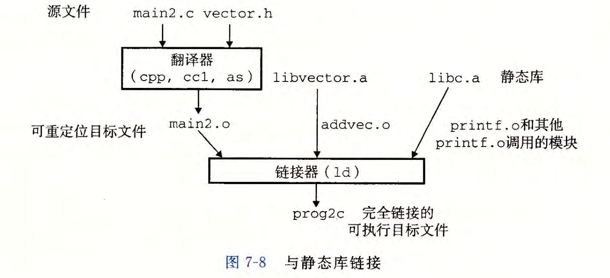
  - 链接器如何使用静态库来解析引用
    - 在符号解析阶段，链接器从左到右按照它们在编译器驱动程序命令行上出现的顺序来扫描可重定位目标文件和存档文件。（驱动程序自动将命令 行中所有的 .c 文件翻译为 .o 文件。）在这次扫描中，链接器维护一个可重定位目标文件的集合 E （这个集合中的文件会被合并起来形成可执行文件），一个未解析的符号（即引用了但是尚未定义的符号）集合 U,以及一个在前面输入文件中已定义的符号集合 D 。初始时，E 、 U 和 D 均为空。
    - 对于命令行上的每个输入文件 f, 链接器会判断 f 是一个目标文件还是一个存档文件。
      - 如果 f 是一个目标文件，那么链接器把 f 添加到 E,修改 U 和 D 来反映 f 中的符号定义和引用，并继续下一个输入文件。
      - 如果 f 是一个存档文件，那么链接器就尝试匹配 U 中未解析的符号和由存档文件成员定义的符号。如果某个存档文件成员 m, 定义了一个符号来解析 U 中的一个引用，那么就将 m 加到 E 中，并且链接器修改 U 和 D 来反映 m 中的符号定义和引用。对存档文件中所有的成员目标文件都依次进行这个过程，直到 U 和 D 都不再发生变化。此时，任何不包含在 E 中的成员目标文件都简单地被丢弃，而链接器将继续处理下一个输入文件。
        - 因此命令行上的库和目标文件的顺序非常重要。在命令行中，如果定义一个符号的库出现在引用这个符号的目标文件之前，那么引用就不能被解析，链接会失败。所以一般将静态链接库文件放在最后
    - 如果当链接器完成对命令行上输入文件的扫描后，U 是非空的，那么链接器就会输出一个错误并终止。否则，它会合并和重定位 E 中的目标文件，构建输出的可执行文件。
- 重定位
  - 一旦链接器完成了符号解析这一步，就把代码中的每个符号引用和正好一个符号定义（即它的一个输入目标模块中的一个符号表条目）关联起来。此时，链接器就知道它的输入目标模块中的代码节和数据节的确切大小。现在就可以开始重定位步骤了，在这个步骤中，将合并输入模块，并为每个符号分配运行时地址。
  - 步骤
    - 1.重定位节和符号定义。在这一步中，链接器将所有相同类型的节合并为同一类型的新的聚合节。例如，来自所有输入模块的 .data 节被全部合并成一个节，这个节成为输出的可执行目标文件的 .data 节。然后，链接器将运行时内存地址赋给新的聚合节，赋给输入模块定义的每个节，以及赋给输入模块定义的每个符号。当这一步 完成时，程序中的每条指令和全局变量都有唯一的运行时内存地址了。
    - 2.重定位节中的符号引用。在这一步中，链接器修改代码节和数据节中对每个符号的引用，使得它们指向正确的运行时地址。要执行这一步，链接器依赖于可重定位目标模块中称为重定位条目 (relocation entry) 的数据结构
  - 重定位条目
    - 无论何时，汇编器遇到对最终位置未知的目标引用，它就会生成一个重定位条目，告诉链接器在讲目标文件合并成可执行文件时如何修改这个引用
    - 代码的重定位条目放在 .rel.text 中 已初始化数据的重定位条目放在 .rel.data 中
    - 格式 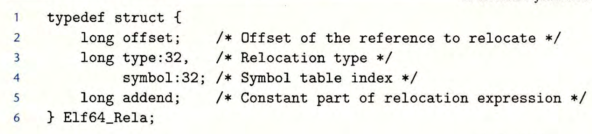
      - offset：需要被修改的引用的所在的节的偏移量
      - symbol：被修改引用应该指向的符号
      - type：告诉链接器如何修改引用
        - 有32种
          - R_X86_64_PC32
            - 重定位使用 32 位 PC 相对地址引用
          - R_X86_64_32
            - 重定位使用32位绝对地址的相对引用
      - addend：有符号常数，一些类型的重定位需要使用它对被修改引用的值做偏移调整
  - 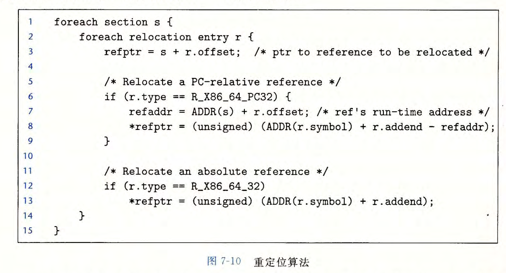
- 可执行目标文件
  - 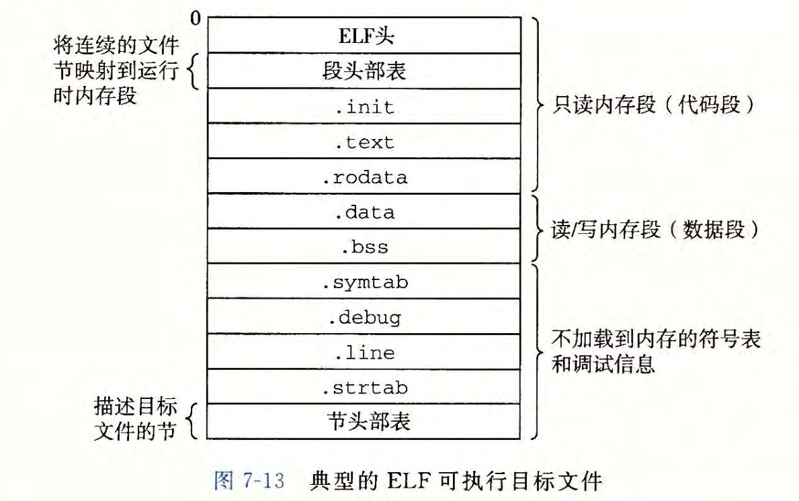
    - .init 节定义了一个小函数 _init，程序的初始化代码会调用它
    - 段头部表（也叫程序头部表 program header table）描述了可执行文件的连续的片（chunk）被映射到连续的内存段。
      - 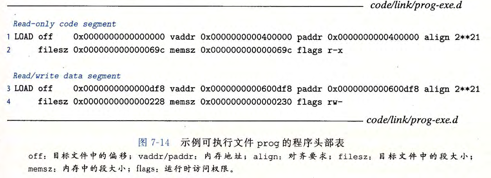
      - 对于任何段 s，链接器必须选择一个起始地址 vaddr，使得 vaddr mod align = off mod align
- 加载可执行目标文件
  - 加载器（loader）：linux 下都可以使用 execve 函数来调用加载器
  - 加载器将可执行目标文件的代码和数据从磁盘复制到内存中，然后通过跳转到程序的第一条指令或入口点来运行该程序。这个将程序复制到内存并运行的过程叫做加载
- 动态链接共享库
  - 共享库是一个目标模块，在运行和加载时，可以加载到任意的内存地址，并和一个内存中的程序链接起来，这个过程叫做动态链接（dynamic linking），有一个叫做动态链接器（dynamic linker） 的程序来执行的。
  - 以两种不同的方式来实现“共享”
    - 1.任何给定的文件系统中，对于一个库只有一个 .so 文件
    - 2\. 在内存中，一个共享库 .text 节的一个副本可以被不同的正在运行的进程共享
  - -fpic 选项指示编译器生成与位置无关的代码 -shared 选项指示链接器创建一个共享的目标文件。
  - linux&gt; gcc -shared -fpic -o libvector.so addvec.c multvec.c linux&gt; gcc -o prog21 main2.c ./libvector.so 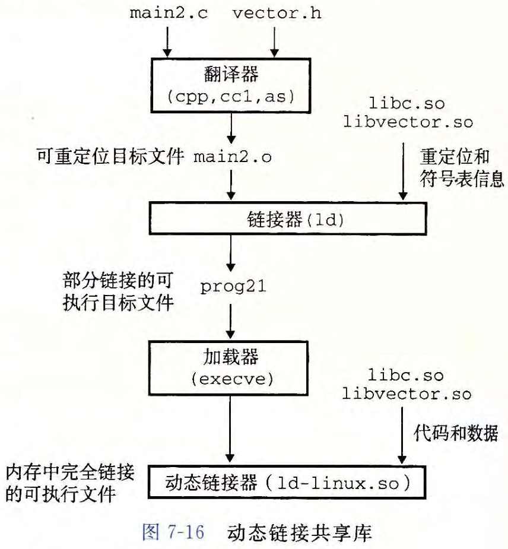
    - 创建 prog21 时，链接器复制了一些重定位和符号表信息，使得运行时可以解析对 libvector.so 中代码和数据的引用。
    - 当加载器加载和执行可执行文件 prog21 时，它会注意到 prog21 中包含一个 .interp，这一节包含动态链接器的路径名，动态链接器本身就是一个共享目标（如 linux 上的 ld-linux.so），然后，加载器加载和运行这个动态链接器，然后，动态链接器执行下面的重定位完成任务：
      - 重定位 libc.so 的文本和数据到某个内存段
      - 重定位 libvector.so 的文本和数据到另一个内存段
      - 重定位 prog21 中所有对 libc.so 和 libvector.so 定义的符号的引用
      - 将控制传递给应用程序
- 位置无关代码
  - 可以加载无需重定位的代码称为位置无关代码（Position-Independent Code, PIC），可以使用 -fpic 选项生成 PIC 代码，共享库的编译必须总是使用该选项
  - PIC 数据引用
    - 基本事实：无论我们在内存中的何处加载 一 个目标模块（包括共享目标模块），数据段与代码段的距离总是保持不变。 因此，代码段中任何指令和数据段中任何变量之间的距离都是一个运行时常量，与代码段 和数据段的绝对内存位置是无关的 。
      - 假设在内存中，代码段的起始地址是 0x1000，数据段的起始地址是 0x2000。当程序加载到内存中时，无论它在哪个地址加载，代码段始终在数据段之前，且它们之间的相对距离保持不变。 例如，如果程序被加载到内存地址 0x4000，那么代码段将位于 0x4000 到 0x5000 之间，而数据段将位于 0x5000 之后。如果程序被加载到内存地址 0x8000，代码段将位于 0x8000 到 0x9000 之间，数据段仍然会在代码段之后。
    - 生成对全局变量 PIC 引用
      - 在数据段的开始地方创建了一个表，叫做全局偏移量表（Global Offset Table, GOT） 在 GOT 中，每个被这个目标模块引用的全局数据目标（过程或全局变量）都有一个 8 字节条目。编译器还为 GOT 中每个条目生成一个重定位记录。在加载时，动态链接器会重定位 GOT 中的每个条目，使得它包含目标的正确的绝对地址 。每个引用全局目标的目标模块都有自己的 GOT 。
      - 因为 addcnt 是由 libvector.so 模块定义的，编译器可以利用代码段和数据段之间不变的距离，产 生 对 addcnt 的直接 PC 相对引用，并增加一个重定位，让链接器在构造这个共享模块时解析它。不过，如果 addcnt 是由另一个共享模块定义的，那么就需要通过 GOT 进行间接访问。在这里，编译器选择采用最通用的解决方案，为所有的引用使用 GOT 。 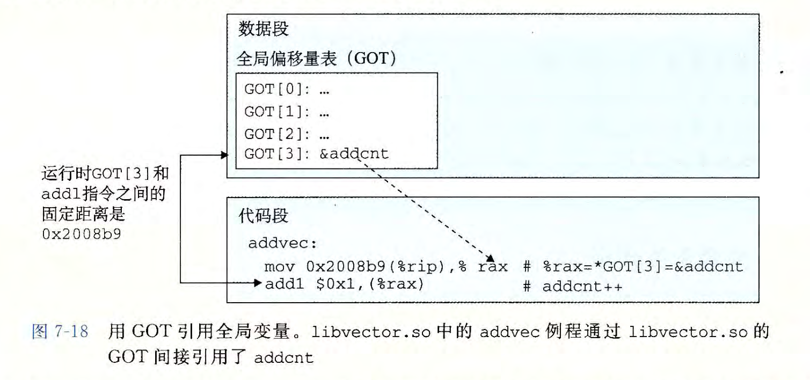
  - PIC 函数调用
    - 延迟绑定（lagy binding）
      - 将过程地址的绑定推迟到第一次调用该过程时。 所以第一次调用该过程的运行时开销很大，但是其后的每次调用都只会花费一条指令和一个简间接的内存引用
      - 实现用到的两个数据结构
        - GOT
          - GOT 是一个数组，其中每个条目是 8 字节地址。和 PLT 联合使用时，GOT [0] 和 GOT[1] 包含动态链接器在解析函数地址时会使用的信息。 GOT[2] 是动态链接器在 ld-linux.so 模块中的入口点。其余的每个条目对应于一个被调用的函数，其地址需要在运行时被解析。每个条目都有 一 个相匹配的 PLT 条目。例如，GOT[4] 和 PLT[2] 对应于 addvec 。初始时，每个 GOT 条目都指向对应 PLT 条目的第二条指令 。
        - 过程链接表（Procedure Linkage Table, PLT)
          - PLT 是代码段的一部分
          - PLT 是一个数组，其中每个条目是 16 字节代码。 PLT[0] 是一个特殊条目，它跳转到动态链接器中。每个被可执行程序调用的库函数都有它自己 的 PLT 条目。每个条目都负责调用一个具体的函数。PLT[1]( 图中未显示）调用系统启动函数(__libc_start_main),它初始化执行环境，调用 main 函数并处理其返回值。从 PLT[2] 开始的条目调用用户代码调用的函数。在我们的例子中， PLT[2] 调用 addvec, PLT[3]( 图中未显示）调用 printf 。
        - 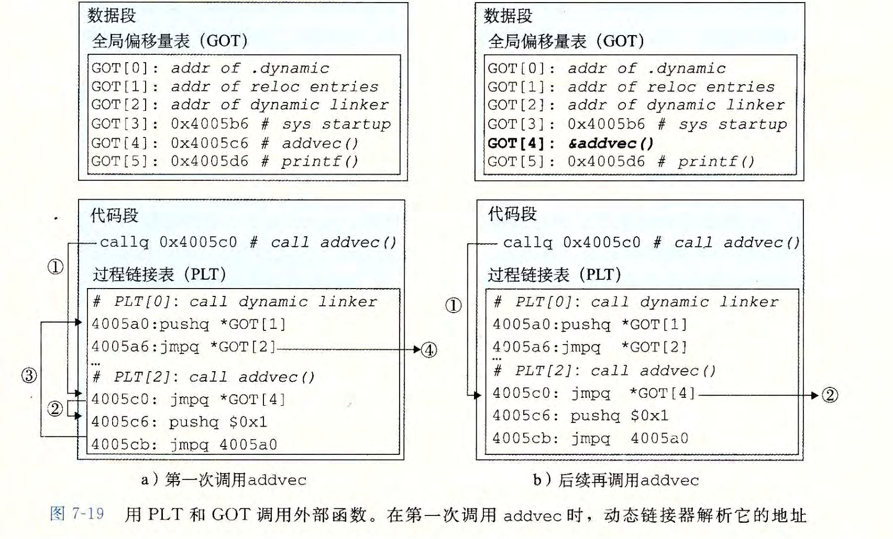
          - 第一次调用
            - 第一步：不直接调用 addvec,程序调用进入 PLT [2], 这是 addvec 的 PLT 条目。
            - 第二步：第一条 PLT 指令通过 GOT[4] 进行间接跳转。因为每个 GOT 条目初始时都指向它对应的 PLT 条目的第二条指令，这个间接跳转只是简单地把控制传送回 PLT[2] 中的下一条指令。
            - 第三步：在把 addvec 的 ID(0x1) 压入栈中之后， PLT[2] 跳转到 PLT[0]
            - 第四步：PLT[0] 通过 GOT [1] 间接地把动态链接器的一个参数压入栈中，然后通过GOT[2] 间接跳转进动态链接器中。动态链接器使用两个栈条目来确定 addvec 的运行时位置，用这个地址重写 GOT[4], 再把控制传递给 addvec 。
          - 再次调用
            - 第一步：和前面一样，控制传递到 PLT [2]
            - 第二步：不过这次通过 GOT[4] 的间接跳转会将控制直接转移到 addvec 。
- 库打桩机制(library interpositioning)
  - 允许你截获对共享库函数的调用，取而代之执行自己的代码
  - 可以追踪对某个特殊库函数调用的次数，验证和最终它的输入和输出值，甚至可以把它替换为一个完全不同的实现
  - 下面是它的基本思想：给定 一 个需要打桩的目标函数，创建一个包装函数，它的原型与目标函数完全一样。使用某种特殊的打桩机制，你就可以欺骗系统调用包装函数而不是目标函数了。包装函数通常会执行它自己的逻辑，然后调用目标函数，再将目标函数的返回值传递给调用者。
  - 打桩
    - 编译时打桩
      - 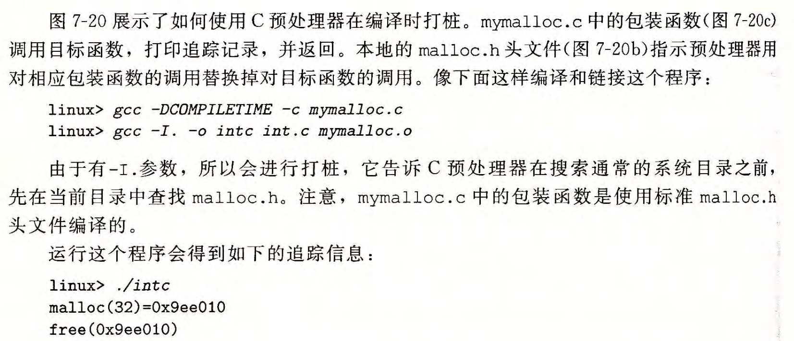
      - 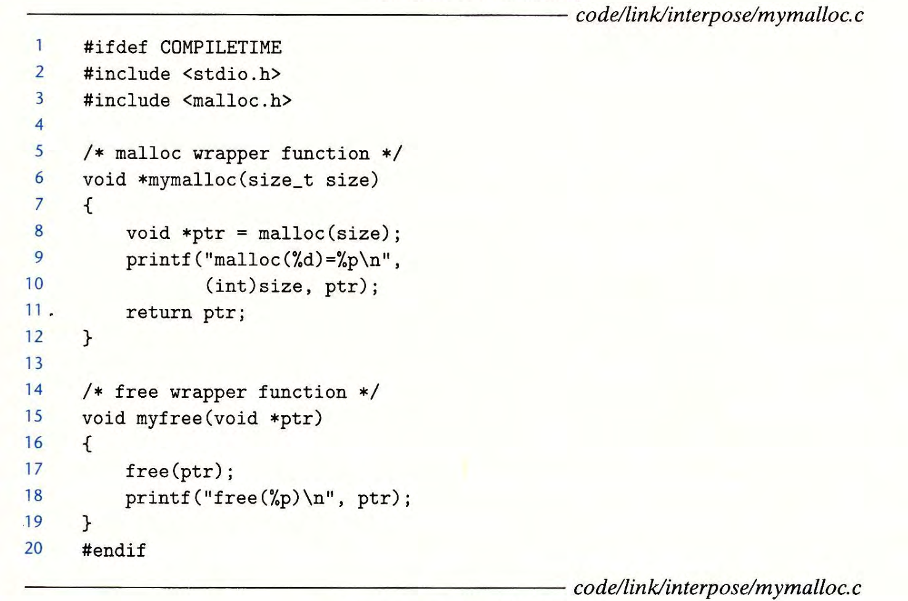
      - 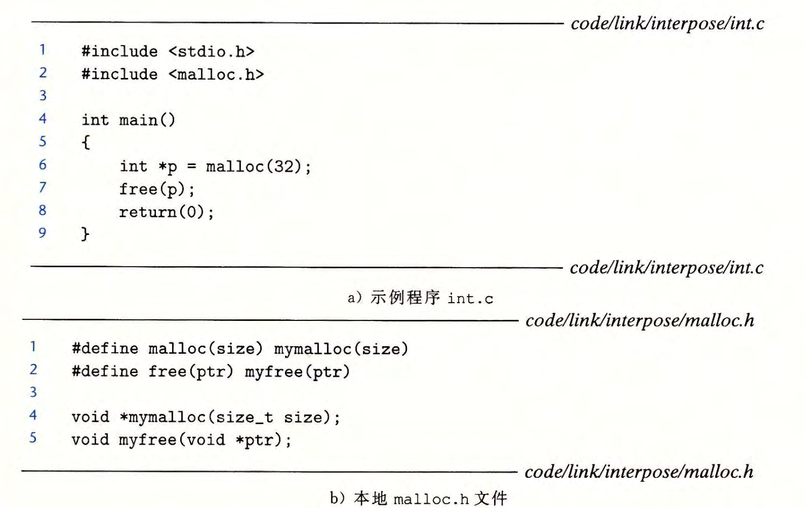
    - 链接时打桩
      - Linux 静态链接器支持用 --wrap f 标志进行链接时打桩。这个标志告诉链接器，把对符号 f 的引用解析成__wrap_f( 前缀是两个下划线），还要把对符号 __real_f( 前缀是两个下划线）的引用解析为 f 。
      - 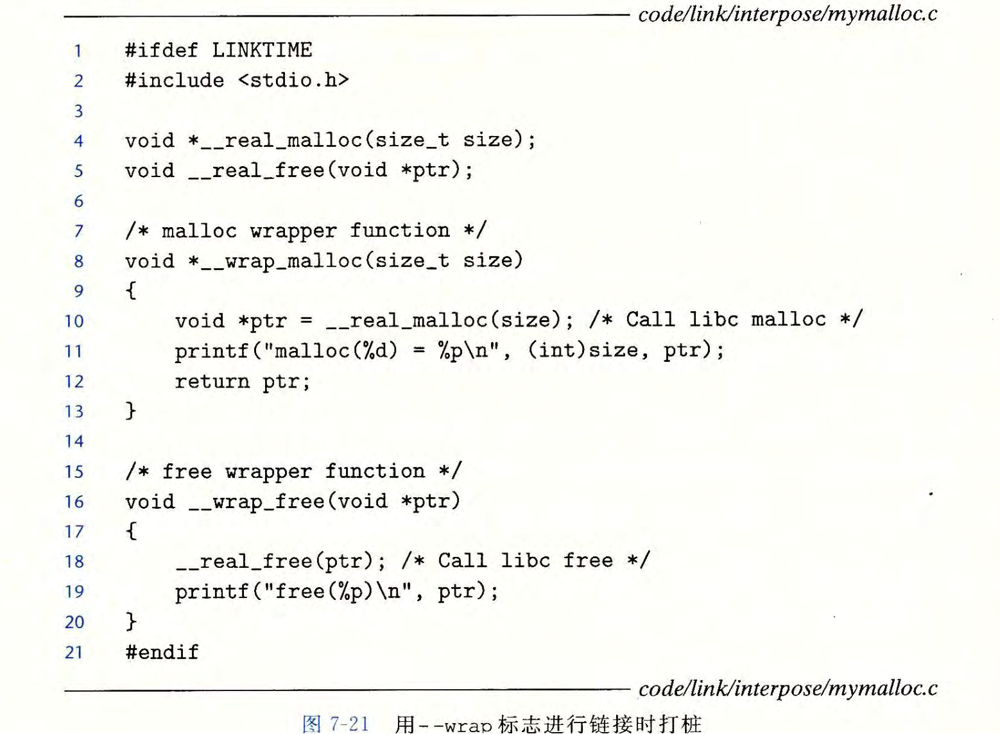
      - 
      - 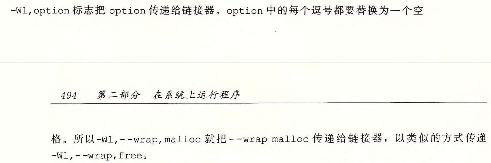
    - 运行时打桩
      - 基于动态链接器的 LD_PRELOAD 环境变量
      - 如果 LD_PRELOAD 环境变量被设置为一个共享库路径名的列表（以空格或分号分隔），那么当你加载和执行 一 个程序，需要解析未 定义的 引用时，动态链接器 ( LD-LINUX. so) 会先搜索 LD_PRELOAD 库，然后才搜索任何其他的库。有了这个机制，当你加载和执行任意可执行文件时，可以对任何共享库中的任何函数打桩，包括 libc.so 。
      - 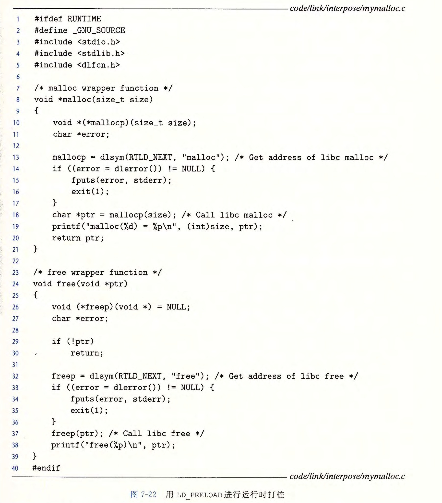
      - 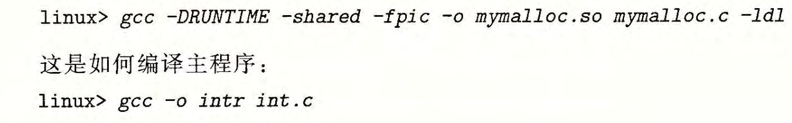
      - 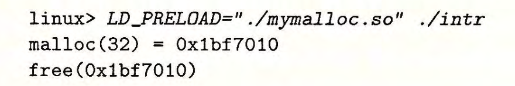
- 处理目标文件的工具
  - 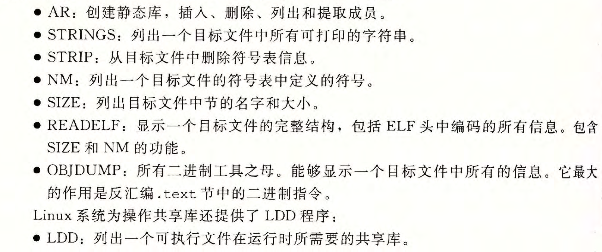
```
