```markmap
---
markmap:
  initialExpandLevel: 2
  spacingVertical: 30
  spacingHorizontal: 180
---

# 高级 IO
- 非阻塞 IO
  - 非阻塞 IO 可以使发出的 open、read 和 write 这样的 IO 操作不会永远阻塞，这种操作如果不能完成，则调用立即出错返回，表示该操作如果继续执行将阻塞
  - 对于一个给定的文件描述符，可以为其指定非阻塞 IO 的方法
    - 调用 open 时指定 O_NONBLOCK 标志
    - 如果文件描述符已经存在，则调用 fcntl，打开 O_NONBLOCK 标志
- 记录锁
  - 当进程正在读或修改文件的某个部分时，使用记录锁可以阻止其他进程修改同一个文件区（即文件中的某个区域，也可能是整个文件）
  - fcntl 记录锁 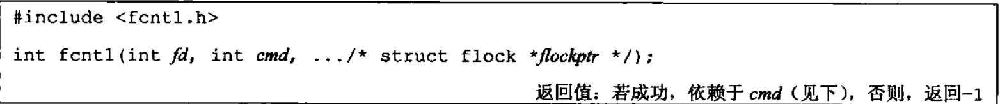
    - 第三个参数 flockptr 是一个指向 flock 结构的指针
      - struct flock 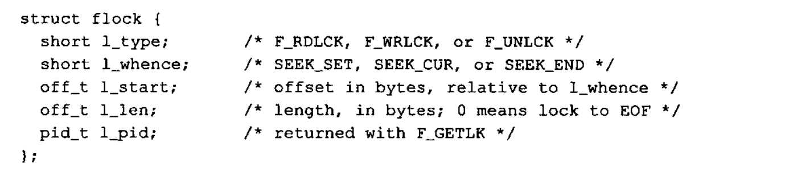
      - 锁类型：F_RDLCK（共享读锁）、F_WRLCK（独占性写锁） 和 F_UNLCK（解锁一个区域），下图是多进程下的锁兼容规则： 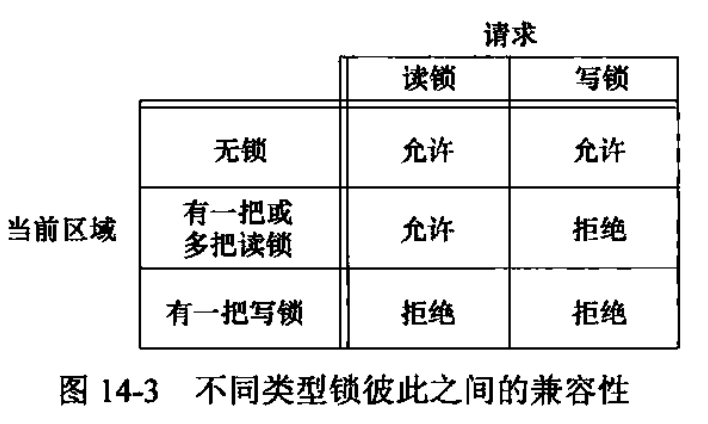
        - 如果一个进程对一个文件区间已经有了一把锁，后来该进程又企图对同一文件区间在加一把锁，那么，新锁将替换已有的锁
        - 例如：若一进程在某文件的16～32字节区间有一把写锁，然后又试图在16～32字节区间加一把读锁，那么该请求将成功执行，原来的写锁会被替换为读锁。
      - 如果 l_len = 0，则表示锁的范围可以扩展到最大可能偏移量。这意味着不管向该文件中追加了多少数据，他们都可以处于锁的范围内。起始位置可以是文件中的任意位置
    - 对于记录锁，cmd 参数可以是
      - F_GETLK
        - 判断由 flockaptr 所描述的锁是否会被另外一把锁所排斥（阻塞）
        - 如果存在一把锁，它阻止创建由 flockptr 所描述的锁，则该现有锁的信息将重写flockptr 指向的信息
        - 如果不存在这种情况，则除了将 l_type 设置为 F_UNLCK 之外,flockptr 所指向结构中的其他信息保持不变
      - F_SETLK
        - 设置由 flockptr 所描述的锁
        - 如果我们试图获得一把读锁（l_type 为 F_RDLCK）或写锁（l_type 为 F_WRLCK)，而兼容性规则阻止系统给我们这把锁，那么 fcntl 会立即出错返回，此时 errno 设置为 EACCES 或 EAGAIN
      - F_SETLKW
        - 此命令用来清除由 flockptr 指定的锁（l_type 为 F_UNLCK)
        - 此命令也用来设置锁。这个命令是 F_SETLK 的阻塞版本（命令名中的 W 表示等（wait））。如果所请求的读锁或写锁因另一个进程当前已经对所请求区域的某部分进行了加锁而不能被授予，那么调用进程会被置为休眠。
          - 如果请求创建的锁已经可用，或者休眠由信号中断，则该进程被唤醒。
      - 用F_GETLK测试能否建立一把锁，然后用F_SETLK或F_SETLKW企图建立那把锁这两者不是一个原子操作。因此不能保证在这两次fcntl调用之间不会有另一个进程插入并建立一把相同的锁。如果不希望在等待锁变为可用时产生阻塞，就必须处理由F_SETLK返回的可能的出错
    - 在设置或释放文件上的一把锁时，系统按要求组合或分裂相邻区
      - 例如，若第100～199字节是加锁的区，需解锁第150 字节，则内核将维持两把锁，一把用于第100～149字节，另一把用于第151～199字节 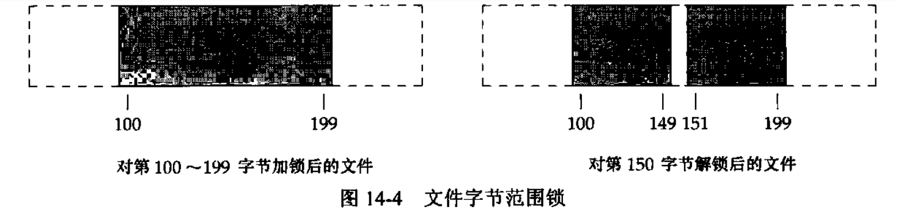
      - 如果又对第 150 字节加锁，那么系统将会把 3 个相邻的加锁区合并成一个区
  - 记录锁的隐含继承和释放
    - 锁与进程和文件两者相关联
      - 当进程终止时，它所建立的锁全部释放
      - 无论一个描述符何时被关闭，该进程通过这一描述符引用的文件上的任何一把锁都会被释放
        - 这意味着如果执行上面四步，fd2 被关闭后，会导致 fd1 上设置的锁被释放。即使将 dup 函数替换为 open 函数打开相同的文件，结果也是一样的 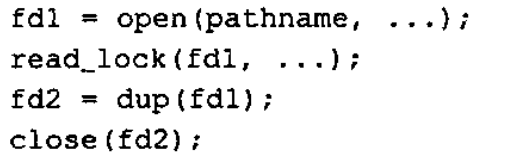
    - 有 fork 产生的子进程不继承父进程设置的读写锁
    - 在执行 exec 后，新程序可以继承原执行程序的锁。但是如果一个描述符设置了执行时关闭标志，那么的那个作为 exec 的一部分关闭该文件描述符时，将释放相应文件的所有锁
  - 强制性锁和建议性锁
    - 强制性锁会让内核检查每一个 open、read 和 write，验证调用进程是否违背了正在访问的文件上的某一把锁
      - 在Linux 中，如果用户想要使用强制性锁，则需要在各个文件系统基础上用 mount 命令的-o mand 选项来打开该机制
      - 对一个特定文件打开其设置组ID 位、关闭其组执行位便开启了对该文件的强制性锁机制。因为当组执行位关闭时，设置组 ID 位不再有意义，所以 SVR3 的设计者借用两者的这种组合来指定对一个文件的锁是强制性的而非建议性的
    - 建议性锁则是只要有文件的相应的权限，就可以写入或者读取
- IO 多路转接（IO multiplexing）
  - select 和 pselect
    - select 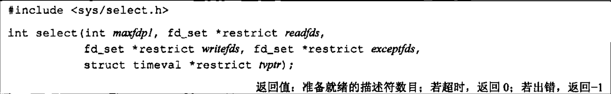
      - 使用 select 要告诉内核：
        - 我们所关心的描述符
        - 每个描述符我们所关心的条件（读、写、异常条件）
        - 愿意等待多长时间（永远等待、等待一个固定的时间、不等待）
      - 从 select 返回时，内核告诉我们
        - 准备好的描述符的总量
        - 对于读、写或异常这 3 个条件中的每一个，哪些描述符已准备好
      - maxfdp1 的意思是“最大文件描述符编号加 1”
        - 在3个描述符集中找出最大描述符编号值，然后加1，这就是第一个参数值。
        - 也可将第一个参数设置为 FD_SETSIZE，这是&lt;sys/select.h&gt;中的一个常量，它指定最大描述符数（经常是 1024）
      - tvptr 有 3 中情况
        - tvptr == NULL
          - 永远等待，如果捕捉到一个信号，则中断此无限等待。当所指定的描述符中的一个已经准备好了或捕捉到一个信号则返回。如果捕捉到一个信号，则 select 函数返回 -1，并将 errno 设置为 EINTR
        - tvptr-&gt;tv_sec == 0 && tvptr-&gt;tv_usec == 0
          - 不等待，测试所有指定的描述符并立即返回
        - 否则，等待指定的描述和微秒数。当指定的描述符之一已准备好或当指定的时间值已经超时时立即返回
      - 实现有可能更改 tvptr 指向的值
      - 对于 fs_set 数据类型，唯一可以进行的处理是：分配一个这种类型的变量，将这种类型变量的值赋给同类型的另一个变量，或对这种类型的变量使用下列 4 个函数中的一个： 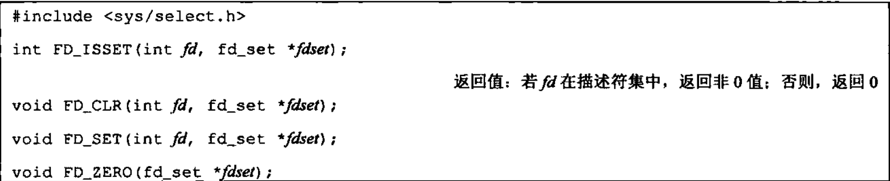
        - 这些接口可实现为宏或函数。调用FD_ZERO将一个fd_set变量的所有位设置为0。要开启描述符集中的一位，可以调用FD_SET。调用FD_CLR可以清除一位。最后，可以调用FD_ISSET测试描述符集中的一个指定位是否已打开
        - 在声明了一个描述符集之后，必须用FD_ZERO将这个描述符集置为0，然后在其中设置我们 关心的各个描述符的位
      - select 的中间三个参数（指向描述符集的指针）中的任意一个（或全部）可以是空指针，这表示对相应的条件并不关心
        - 如果所有 3 个指针都是 NULL，则 select 提供了比 sleep 更精确的定时器
      - 一个正返回值表示已经准备好的描述符数
        - 是 3 个描述符集中已准备好的描述符之和，如果同一描述符已准备好读和写，那么在返回值中会被计数 2 次
        - 返回后， 3 个描述符集中仍旧打开的位对应与已准备好的描述符。准备好的含义：
          - 若对读集（readfds）中的一个描述符进行的read操作不会阻塞，则认为此描述符是准备好的
          - 若对写集（writefds）中的一个描述符进行的 write操作不会阻塞，则认为此描述符是准备好的
          - 若对异常条件集（exceptfds）中的一个描述符有一个未决异常条件，则认为此描述符是准备好的
          - 对于读、写和异常条件，普通文件的文件描述符总是返回准备好
      - 一个描述符阻塞与否并不影响 select 是否阻塞
    - pselect 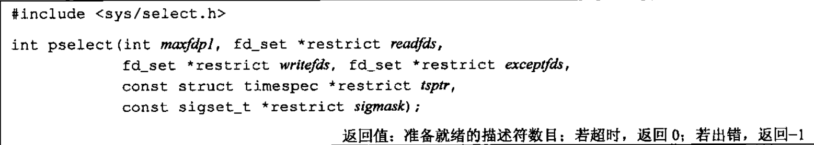
      - 与 select 的不同点
        - 超时值使用 timespc 结构，以秒和纳秒表示超时值
        - pselect 不会改变超时值
        - 如果 sigmask 不为 NULL，则调用 pselect 时，以原子操作的方式安装该信号屏蔽字，在返回时，恢复以前的信号屏蔽字
  - poll 函数 
    - 每个 fdarray 中的元素指定一个描述符编号对该描述符感兴趣的条件
      - struct pollfd 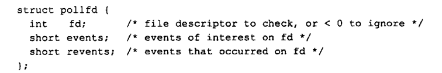
        - revents 由内核设置，用于说明每个描述符发生了哪些事件
        - events 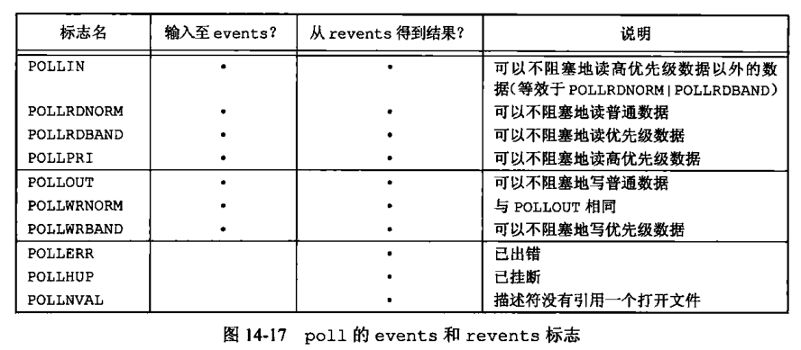
        - 当一个描述符被挂断（POLLHUP）后，就不能再写该描述符，但是有可能仍然可以从该描述符读取到数据
    - timeout 有 3 中情况
      - timeout == -1
        - 永远等待
      - timeout = 0
        - 不等待，测试所有描述符并立即返回
      - timeout &gt; 0
        - 等待 timeout 毫秒
- 异步 IO
  - 异步 IO 是指：程序发出 I/O 请求后立即返回，I/O 操作在后台进行，当操作完成时，会通过通知、回调函数、事件循环等方式告知程序 I/O 已完成，程序不需要因为 I/O 而阻塞
  - System V 异步 IO
    - 只对 STREAMS 设备和 STREAMS 管道起作用
    - System V 的异步 IO 信号是 SIGPOLL
    - 为了对一个STREAMS设备启动异步I/O，需要调用ioctl，将它的第二个参数（reguest）设置成 I_SETSIG。第三个参数是下图的一个或多个常量构成的整形值，这些常量在 &lt;stropts.h&gt; 中定义： 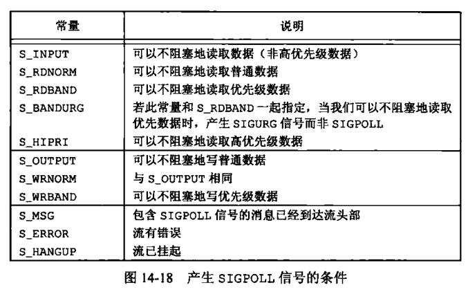
  - BSD 异步 IO
    - 只能对指向终端或网络的描述符执行
    - 异步 IO 是信号 SIGIO 和 SIGURG 的组合
      - SIGIO 是通用异步 IO 信号
      - SIGURG 用来通知进程网络连接上的带外数据已经到达。仅对引用支持带外数据的网络连接描述符产生，如 TCP 连接
    - 为了接受 SIGIO 信号，需执行以下 3 步
      - 1\. 调用 signal 或 sigaction 为 SIGIO 信号建立信号处理程序
      - 2\. 以命令 F_SETOWN 调用fcntl 来设置进程 ID 或进程组 ID，用于接收对于该描述符的信号
      - 3\. 以命令 F_SETFL 调用 fcntl 设置 O_ASYNC 文件状态标志，使在该描述符上可以进行异步 IO
    - 对于 SIGURG 信号，值需要执行第 1、2 步
  - POSIX 异步 IO
    - POSIX 异步 IO 接口为对不同类型的文件进行异步 IO 提供了一套一致的方法
    - 使用 POSIX 异步 IO 的麻烦之处
      - 每个异步操作都有 3 处可能产生错误的地方：操作提交时、操作本身的结果和决定异步操作状态的函数中
      - 和传统方法相比，涉及大量的额外设置和处理规则
      - 从错误中恢复会比较困难。举例来说，如果提交了多个异步写操作，其中一个失败了，下一步我们应该怎么做？如果这些写操作是相关的，那么可能还需要撤销所有成功的写操作。
    - 使用 AIO 控制块来描述 IO 操作
      - struct aiocb 至少包含的字段 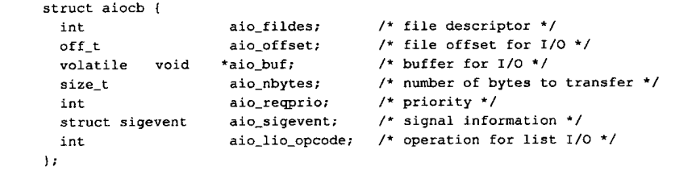
      - aio_fields 字段表示用来打开读或写的文件描述符
      - 读或写操作从 aio_offset 指定的偏移量开始
        - 异步I/O操作必须显式地指定偏移量
        - 异步 IO接口并不影响由操作系统维护的文件偏移量。只要不在同一个进程里把异步 IO 函数和传统 IO 函数混在一起用在同一个文件上，就不会导致什么问题
        - 如果使用异步 IO 接口向一个以追加模式（使用O_APPEND）打开的文件中写入数据，AIO控制块中的 aio_offset 字段会被系统忽略
      - 对于写操作，写入的数据来源于 aio_buf 指定的位置开始，aio_nbytes 字段包含了要写或读的字节数
      - 应用程序使用 aio_reqprio 字段为异步 IO 请求提供提示顺序，然而，系统对于该顺序只有有限的控制能力，因此不一定能遵循该提示
      - aio_lio_opcode 只能用于基于列表的异步 IO
      - aio_sigevent 用于描述在 IO 时间完成后，如何通知应用程序
        - struct sigevent 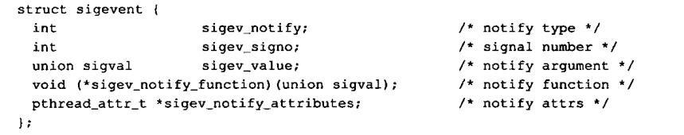
        - sigen_notify 控制通知的类型，可能是下列 3 个值中的一个
          - SIGEV_NONE
            - 异步 IO 请求完成后，不通知进程
          - SIGEV_SIGNAL
            - 异步 IO 请求完成后，产生由 sigev_signo 字段指定的信号。如果应用程序已选择捕捉信号，且在建立信号处理程序的时候指定了SA_SIGINFO标志，那么该信号将被入队（如果实现支持排队信号）。信号处理程序会传送给一个 siginfo 结构，该结构的si_value字段被设置为sigev_value（如果使用了SA_SIGINFO标志）
          - SIGEV_THREAD
            - 当异步IO请求完成时，由sigev_notify_function 字段指定的函数被调用。sigev_value字段被传入作为它的唯一参数。除非 sigev_notify_attributes 字段被设定为 pthread 属性结构的地址，且该结构指定了一个另外的线程属性，否则该函数将在分离状态下的一个单独的线程中执行。
    - 进行异步 IO 之前需要先初始化 AIO 控制块，然后调用 aio_read 或 aio_write 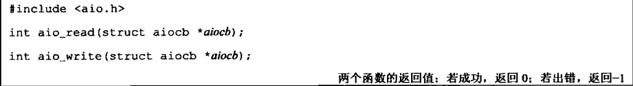
      - 当这些函数返回成功时，异步1I/O请求便已经被操作系统放入等待处理的队列中了。这些返回值与实际 I/O 操作的结果没有任何关系
      - IO 操作在等待时，必须注意确保AIO控制块和数据库缓冲区保持稳定；它们下面对应的内存必须始终是合法的，除非IO操作完成，否则不能被复用
    - 要想强制所有等待中的异步操作不等待而写入持久化的存储职工，可以创建一个 AIO 控制块并调用 aio_fsync 函数 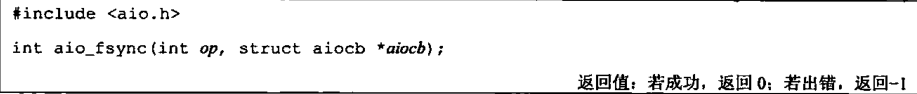
      - op 参数
        - op = O_DSYNC
          - 操作执行起来就像调用了 fdatasync 一样
        - op = O_SYNC
          - 操作执行起来像调用了 fsync 一样
    - 为了获得一个异步读、写或者同步操作的完成状态，需要调用 aio_error 函数 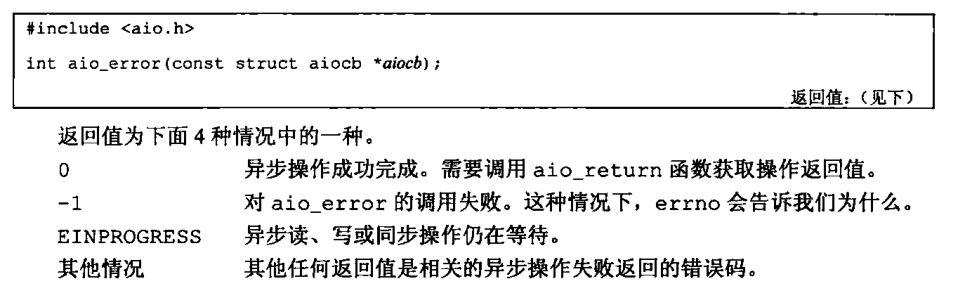
    - 如果异步操作成功，可以调用 aio_return 来获取异步操作的返回值 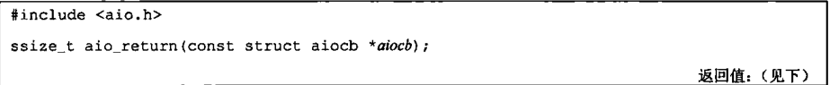
      - IO 操作完成之前结果是未定义的
      - 对每个异步操作只能调用一次 aio_return，一旦调用了该函数，操作系统就可以释放掉包含了 IO 操作返回值的记录
      - 返回值
        - 如果 aio_return 调用本身失败，返回 -1，并设置 errno
        - 其他情况下，会范湖异步操作的结果
    - 如果要还有异步操作没有完成时阻塞当前进程，可以使用 aio_suspend 函数 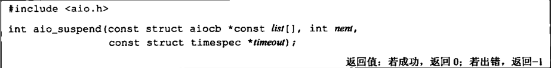
      - 返回值
        - -1
          - errno = EINTR，被一个信号中断
          - errno = EAGAIN，可选的 timeout 参数所指定的时间超时了
        - 0
          - 有任何 IO 操作完成
    - 不想再完成某个正在等待的异步 IO 操作时，可以调用 aio_cancel 来取消 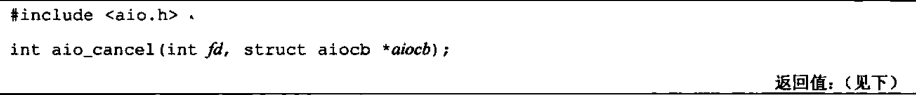
      - 如果 aiocb = NULL，则会尝试取消所有该文件上未完成的异步 IO。其他情况下，只会尝试取消由 AIO 控制块描述的单个异步 IO 操作
      - 返回值
        - AIO_ALLDONE
          - 所有操作在取消它们之前已经完成
        - AIO_CANCELED
          - 所有要求的操作已被取消
        - AIO_NOTCANCELED
          - 至少有一个要求的操作没有被取消
        - -1
          - 调用失败，并设置 errno
      - 如果异步I/O操作被成功取消，对相应的AIO控制块调用aio_error函数将会返回错误 ECANCELED
      - 如果操作不能被取消，那么相应的AIO控制块不会因为对aio_cance1的调用而被修改
    - lio_listio 函数既可以同步调用，也可以异步调用，作用是提交一系列由一个 AIO 控制块列表描述的 IO 请求 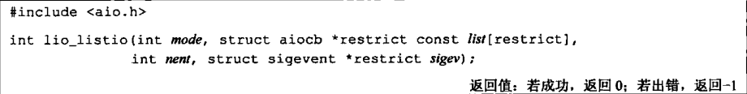
      - mode 参数决定了 IO 是否是异步的
        - LIO_WAIT
          - lio_listio 函数井在所有有列表指定的 IO 操作完成后返回
          - sigev 参数将被忽略
        - LIIO_NOWAIT
          - 在 IO 请求入队后立即返回
          - 进程将在所有 IO 操作完成后，按照 sigev 参数指定的，被异步地通知
          - 如果不想被通知，可以将 sigev 参数设置为 NULL
          - 每个AIO控制块本身也可能启用了在各自操作完成时的异步通知。被sigev参数指定的异步通知是在此之外另加的，并且只会在所有的I/O操作完成后发送。
      - 在每一个 AIO 控制块中，aio_lio_opcode 字段指定了该操作是一个读操作（LIO_READ）、写操作（LIO_WRITE），还是被忽略的空操作（LIO_NOP）
        - 读操作会将控制块传递给 aio_read 处理，写操作会传递给 aio_write
      - 实现会限制想要完成的异步 IO 操作的数量，这些限制是运行时不变量
        - 可以调用 sysconf 来获取 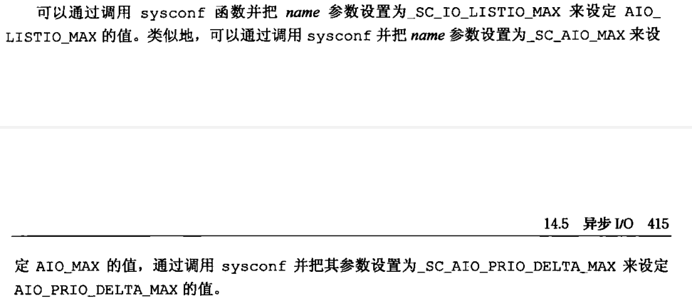
        - 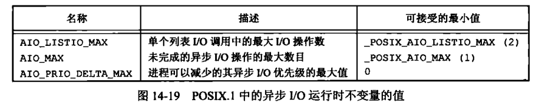
- readv 和 writev 函数 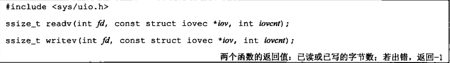
  - 用于在一次函数调用中读、写多个非连续缓冲区
  - 有时也将这两个函数称为散布读（scatter read）和聚集写（gather write）
  - struct iovec 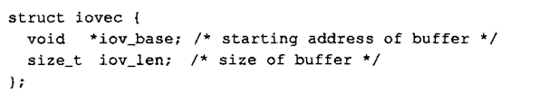
  - iovcnt 受限于 IOV_MAX
  - writev 函数从缓冲区中聚集输出数据的顺序是 iov[0]、iov[1] 直至 iov[iovcnt - 1]
  - readv 的顺序和 writev 的顺序相同。readv 总是先填满一个缓冲区，然后在填写下一个
- 存储映射 IO
  - 能将一个磁盘文件映射到存储空间中的一个缓冲区上，当从缓冲区读取（写入）数据时，就相当于读（写）文件中的相应字节，故而不需要使用 read 和 write 执行 IO
    - 例如，映射存储区可能位于堆和栈之间 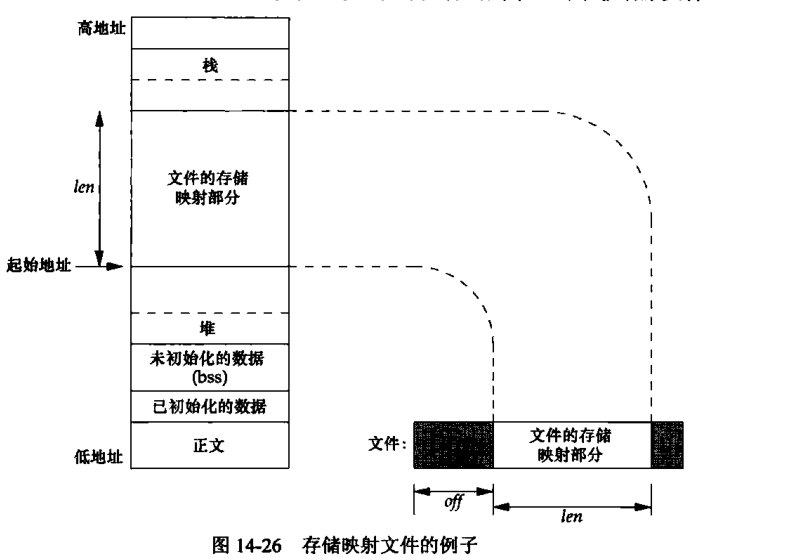
  - mmap 函数 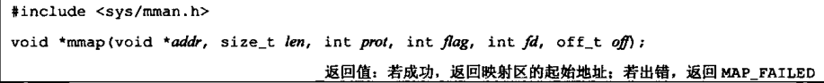
    - addr 参数用于指定映射存储区的起始地址，通常将其设置为 0，表示由系统选择该映射区的起始地址（返回值表示该地址）
    - off 是要映射字节在文件中的起始偏移量
    - fd 参数是指定要被映射的文件的描述符。该描述符必须提前打开
    - len 参数是映射的字节数
    - prot 指定了映射存储区的保护要求
      - 值 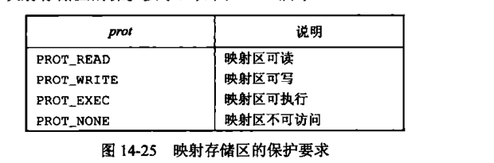
      - 对指定映射存储区的保护要求不能超过文件 open 模式访问权限
    - flag 参数影响映射存储区的多种属性
      - MAP_FIXED
        - 返回值必须等于 addr
        - 如果没有指定此标志，而且 addr 非 0，则内核只把 addr 视为在何处设置映射器的一种建议，但是不保证会使用所要求的地址
      - MAP_SHARED
        - 本进程对映射区所进行写操作会改变原文件
        - 对超出映射区区域的修改不会导致映射文件加长
          - 假定文件长为12字节，系统页长为512字节，则系统通常提供512字节的映射区，其中后500字节被设置为0。可以修改后面的这500字节，但任何变动都不会在文件中反映出来
          - 于是，不能用 mmap 将数据漆加到文件中。我们必须先加长该文件。
      - MAP_PRIVATE
        - 对映射区的写操作会导致创建该映射文件的私有副本，所有后来对该存储区的引用都是引用该副本
      - 还有一些实现特有的，请看 mmap(2)
  - 与映射区相关的信号有 SIGSEGV 和 SIGBUS
    - SIGSEGV 用于指示进程试图访问对它不可用的存储区。如果映射区被设置为只读，但是该进程写入该映射区，则会产生此信号
    - 如果映射区的某个部分在访问时已不存在，则产生 SIGBUS 信号
      - 例如，假设用文件长度映射了一个文件，但在引用该映射区之前，另一个进程已将该文件截断。此时，如果进程试图访问对应于该文件已截去部分的映射区，将会接收到SIGBUS信号。
  - 子进程能通过 fork 继承映射区（映射区是父进程地址空间的一部分），新进程不能通过 exec 继承该映射区
  - mprotect 可以更改一个现有映射的权限 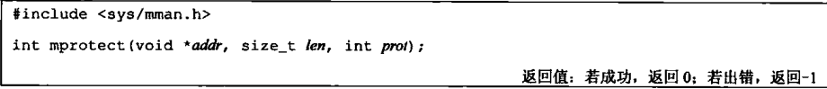
    - addr 的值必须是系统页长的整数倍
  - 如果共享映射（MAP_SHARED）中的页已被修改，可以调用 msync 将该页冲洗到被映射的文件中 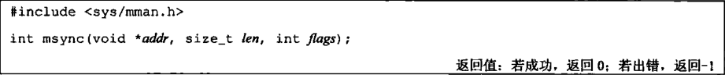
    - flags 参数
      - MS_ASYNC 安排同步，但是调用立即返回
      - MS_SYNC 在返回之前等待写操作完成
  - 当进程终止时，自动解除存储映射区的映射，直接调用 munmap 也可以解除映射区。关闭映射存储区时使用的文件描述符并不解除映射区 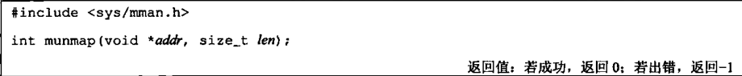
    - 调用 munmap 并不会使映射区的内容写到磁盘文件上
```
