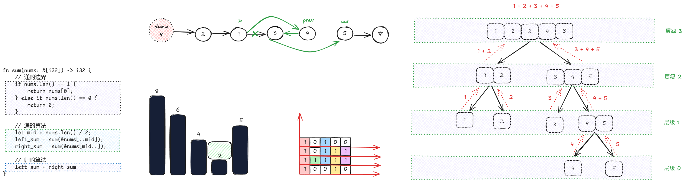

这一系列文章是我长时间以来学习数据结构与算法来做过 [leetcode](https://leetcode.cn/) 的题目的思考,记录下来以便以后复习.

## 建议阅读顺序
所有的文件都是按照我学习的顺序来排列的, 都是按照简单到难的顺序排列(这要感谢[灵茶山艾府](https://space.bilibili.com/206214) 的题单).

各个章节之间并不独立,例如,我在学习动态规划的时候,用了回溯的思想来思考,而用回溯又依赖于递归.这使得我有一个较完整, 连续的知识体系.

所以, 最好按照顺序阅读,以获得完整的知识.

## 感谢
特别感谢 B 站的[灵茶山艾府](https://space.bilibili.com/206214) 与他制作的[合集视频](https://space.bilibili.com/206214/lists/842776).

如果没有他, 我会在在数据结构与算法的汪洋中迷失. 也不会在短时间内收获如此之多.
